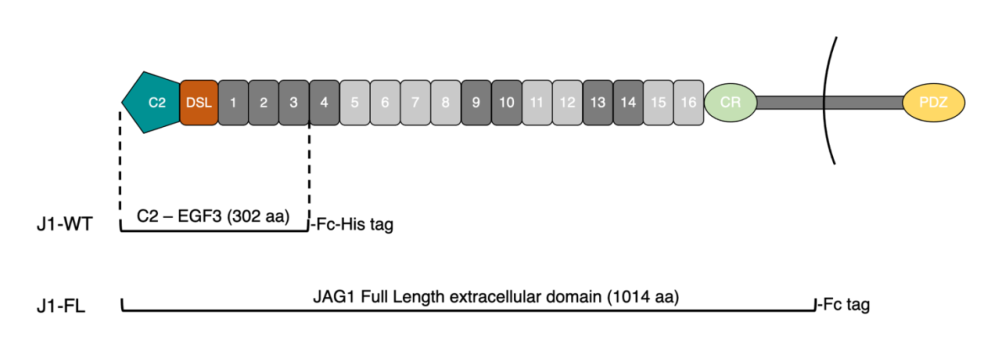

## Question

# Gene Research for Functional Annotation

## ⚠️ CRITICAL: Gene/Protein Identification Context

**BEFORE YOU BEGIN RESEARCH:** You MUST verify you are researching the CORRECT gene/protein. Gene symbols can be ambiguous, especially for less well-characterized genes from non-model organisms.

### Target Gene/Protein Identity (from UniProt):
- **UniProt Accession:** P78504
- **Protein Description:** RecName: Full=Protein jagged-1; Short=Jagged1; Short=hJ1; AltName: CD_antigen=CD339; Flags: Precursor;
- **Gene Information:** Name=JAG1; Synonyms=JAGL1;
- **Organism (full):** Homo sapiens (Human).
- **Protein Family:** Not specified in UniProt
- **Key Domains:** DSL. (IPR001774); EGF. (IPR000742); EGF-like_Ca-bd_dom. (IPR001881); EGF-like_CS. (IPR013032); EGF-type_Asp/Asn_hydroxyl_site. (IPR000152)

### MANDATORY VERIFICATION STEPS:

1. **Check if the gene symbol "JAG1" matches the protein description above**
2. **Verify the organism is correct:** Homo sapiens (Human).
3. **Check if protein family/domains align with what you find in literature**
4. **If you find literature for a DIFFERENT gene with the same or similar symbol, STOP**

### If Gene Symbol is Ambiguous or You Cannot Find Relevant Literature:

**DO NOT PROCEED WITH RESEARCH ON A DIFFERENT GENE.** Instead:
- State clearly: "The gene symbol 'JAG1' is ambiguous or literature is limited for this specific protein"
- Explain what you found (e.g., "Found extensive literature on a different gene with the same symbol in a different organism")
- Describe the protein based ONLY on the UniProt information provided above
- Suggest that the protein function can be inferred from domain/family information

### Research Target:

Please provide a comprehensive research report on the gene **JAG1** (gene ID: JAG1, UniProt: P78504) in human.

The research report should be a detailed narrative explaining the function, biological processes, and localization of the gene product. Citations should be given for all claims.

You should prioritize authoritative reviews and primary scientific literature when conducting research. You can supplement
this with annotations you find in gene/protein databases, but these can be outdated or inaccurate.

We are specifically interested in the primary function of the gene - for enzymes, what reaction is catalyzed, and what is the substrate specificity? For transporters, what is the substrate? For structural proteins or adapters, what is the broader structural role? For signaling molecules, what is the role in the pathway.

We are interested in where in or outside the cell the gene product carries out its function.

We are also interested in the signaling or biochemical pathways in which the gene functions. We are less interested in broad pleiotropic effects, except where these elucidate the precise role.

Include evidence where possible. We are interested in both experimental evidence as well as inference from structure, evolution, or bioinformatic analysis. Precise studies should be prioritized over high-throughput, where available.

## Output

Question: You are an expert researcher providing comprehensive, well-cited information.

Provide detailed information focusing on:
1. Key concepts and definitions with current understanding
2. Recent developments and latest research (prioritize 2023-2024 sources)
3. Current applications and real-world implementations
4. Expert opinions and analysis from authoritative sources
5. Relevant statistics and data from recent studies

Format as a comprehensive research report with proper citations. Include URLs and publication dates where available.
Always prioritize recent, authoritative sources and provide specific citations for all major claims.

# Gene Research for Functional Annotation

## ⚠️ CRITICAL: Gene/Protein Identification Context

**BEFORE YOU BEGIN RESEARCH:** You MUST verify you are researching the CORRECT gene/protein. Gene symbols can be ambiguous, especially for less well-characterized genes from non-model organisms.

### Target Gene/Protein Identity (from UniProt):
- **UniProt Accession:** P78504
- **Protein Description:** RecName: Full=Protein jagged-1; Short=Jagged1; Short=hJ1; AltName: CD_antigen=CD339; Flags: Precursor;
- **Gene Information:** Name=JAG1; Synonyms=JAGL1;
- **Organism (full):** Homo sapiens (Human).
- **Protein Family:** Not specified in UniProt
- **Key Domains:** DSL. (IPR001774); EGF. (IPR000742); EGF-like_Ca-bd_dom. (IPR001881); EGF-like_CS. (IPR013032); EGF-type_Asp/Asn_hydroxyl_site. (IPR000152)

### MANDATORY VERIFICATION STEPS:

1. **Check if the gene symbol "JAG1" matches the protein description above**
2. **Verify the organism is correct:** Homo sapiens (Human).
3. **Check if protein family/domains align with what you find in literature**
4. **If you find literature for a DIFFERENT gene with the same or similar symbol, STOP**

### If Gene Symbol is Ambiguous or You Cannot Find Relevant Literature:

**DO NOT PROCEED WITH RESEARCH ON A DIFFERENT GENE.** Instead:
- State clearly: "The gene symbol 'JAG1' is ambiguous or literature is limited for this specific protein"
- Explain what you found (e.g., "Found extensive literature on a different gene with the same symbol in a different organism")
- Describe the protein based ONLY on the UniProt information provided above
- Suggest that the protein function can be inferred from domain/family information

### Research Target:

Please provide a comprehensive research report on the gene **JAG1** (gene ID: JAG1, UniProt: P78504) in human.

The research report should be a detailed narrative explaining the function, biological processes, and localization of the gene product. Citations should be given for all claims.

You should prioritize authoritative reviews and primary scientific literature when conducting research. You can supplement
this with annotations you find in gene/protein databases, but these can be outdated or inaccurate.

We are specifically interested in the primary function of the gene - for enzymes, what reaction is catalyzed, and what is the substrate specificity? For transporters, what is the substrate? For structural proteins or adapters, what is the broader structural role? For signaling molecules, what is the role in the pathway.

We are interested in where in or outside the cell the gene product carries out its function.

We are also interested in the signaling or biochemical pathways in which the gene functions. We are less interested in broad pleiotropic effects, except where these elucidate the precise role.

Include evidence where possible. We are interested in both experimental evidence as well as inference from structure, evolution, or bioinformatic analysis. Precise studies should be prioritized over high-throughput, where available.

# Comprehensive Research Report: JAG1 (Jagged-1) Gene Function and Annotation

## Gene Identity Verification

The research target has been confirmed as **human JAG1** (UniProt: P78504), encoding the protein Jagged-1 (also known as hJ1 or CD339). This is a transmembrane Notch ligand containing characteristic DSL and EGF-like domains, consistent with the UniProt annotation (feng2024thestructuraland pages 44-49, zema2025thetwowayrole pages 5-7). The gene symbol JAG1 unambiguously identifies this canonical Notch pathway component in humans, and the literature consistently describes the protein matching the provided UniProt description.

## 1. Protein Structure and Molecular Architecture

### 1.1 Domain Organization

JAG1 is a type I single-pass transmembrane protein with a large extracellular region, a single transmembrane segment, and a short cytoplasmic tail (zema2025thetwowayrole pages 5-7). The extracellular region is organized into several functionally distinct domains (feng2024thestructuraland pages 44-49, feng2024thestructuraland pages 49-52, meng2022annglycanon media 32f183bd, meng2022annglycanon media dc38ed22):

1. **C2 domain** (~100 amino acids): An N-terminal Ca²⁺-dependent phospholipid-binding domain that anchors JAG1 to cell membranes and forms a principal receptor-binding interface (feng2024thestructuraland pages 44-49, feng2024thestructuraland pages 49-52)

2. **DSL domain**: A disulfide-stabilized Delta/Serrate/LAG-2 domain that represents the minimal receptor-binding module and is indispensable for Notch activation (feng2024thestructuraland pages 49-52, meng2022annglycanon pages 5-10)

3. **EGF-like repeats**: Human JAG1 contains **16 tandem EGF-like repeats** that extend the ectodomain and contribute to receptor engagement (zema2025thetwowayrole pages 5-7, feng2024thestructuraland pages 49-52)

4. **Cysteine-rich domain (CRD)**: A Jagged/Serrate-specific membrane-proximal region absent from Delta-like ligands (feng2024thestructuraland pages 44-49, feng2024thestructuraland pages 40-44)

5. **Transmembrane and intracellular domain**: The cytoplasmic tail contains a C-terminal PDZ-binding motif (RMEYIV) that mediates protein-protein interactions and supports reverse signaling (zema2025thetwowayrole pages 9-10, vazquezulloa2022reversibleandbidirectional pages 15-16)

A comprehensive summary of JAG1 structural domains is provided below:

| JAG1 region/domain | Approximate location and size | Structural features | Specific role in Notch signaling | Key evidence |
|---|---|---|---|---|
| Signal peptide | Extreme N-terminus; short precursor segment cleaved during maturation | Directs nascent JAG1 into the secretory pathway | Enables processing and delivery of mature JAG1 to the plasma membrane; it is not part of the mature ligand–receptor interface | JAG1 is a type I single-pass membrane precursor with a large extracellular region (feng2024thestructuraland pages 44-49) |
| C2 domain | N-terminal extracellular domain; approximately 100 amino acids | Ca²⁺-dependent phospholipid-binding fold containing a conserved N-glycosylation site at Asn143 in the β5–β6 loop | Forms a principal receptor interface with NOTCH1 EGF12 and binds membrane phospholipids. Its N-glycan constrains ligand orientation and supports liposome binding and full Notch activation; glycan loss reduces NOTCH1/2 activation and smooth-muscle differentiation | (feng2024thestructuraland pages 49-52, meng2022annglycanon pages 1-5, meng2022annglycanon pages 5-10) |
| DSL domain | Extracellular; immediately C-terminal to the C2 domain; one compact module | Disulfide-rich Delta/Serrate/LAG-2 fold with a conserved positively charged surface loop bounded by aromatic residues | Indispensable receptor-binding module and historically defined minimal binding region; contacts NOTCH1 EGF11. Mutations in this interface impair receptor binding and activation; it contributes to both trans-activation and cis interactions | (feng2024thestructuraland pages 44-49, feng2024thestructuraland pages 49-52, meng2022annglycanon pages 5-10) |
| EGF-like repeats | Extracellular; 16 tandem repeats between the DSL and cysteine-rich regions | Disulfide-rich modules comprising calcium-binding and non-calcium-binding EGF-like domains | Extend and organize the ectodomain and enlarge the receptor-contact surface. EGF1–3 support the core binding unit, while JAG1 EGF3 contacts NOTCH1 EGF8; more distal repeats may assist ligand presentation and cis-inhibition | (feng2024thestructuraland pages 49-52, vazquezulloa2022reversibleandbidirectional pages 7-8, meng2022annglycanon media 32f183bd) |
| Jagged/Serrate-specific cysteine-rich domain (CRD) | Membrane-proximal extracellular region following the 16 EGF-like repeats; exact boundaries vary by annotation | Cysteine-rich, disulfide-stabilized region characteristic of Jagged/Serrate ligands and absent from Delta-like ligands | Supports membrane-proximal ectodomain architecture and ligand presentation. Its direct contribution to receptor binding is less firmly established than that of the C2 and DSL domains | (feng2024thestructuraland pages 44-49, feng2024thestructuraland pages 49-52, feng2024thestructuraland pages 40-44) |
| Transmembrane domain | Single hydrophobic segment near the C-terminus; approximately 20–25 amino acids | Anchors JAG1 as a type I single-pass plasma-membrane protein | Keeps the ligand membrane-tethered for direct cell–cell trans-activation and same-cell cis interactions. It retains the C-terminal fragment after ectodomain shedding and provides the substrate for subsequent γ-secretase cleavage | (zema2025thetwowayrole pages 5-7, zema2025thetwowayrole pages 9-10) |
| Intracellular domain with PDZ-binding motif | Short cytoplasmic C-terminal tail terminating in the PDZ-binding sequence RMEYIV | Contains potential phosphorylation sites and a terminal PDZ-binding motif | Supports ligand endocytosis and intracellular interactions rather than canonical extracellular receptor binding. Following ADAM17 and γ-secretase cleavage, the released intracellular domain can participate in reverse signaling and nuclear transcriptional complexes; the PDZ motif interacts with afadin/AF-6 and regulates localization and noncanonical signaling | (zema2025thetwowayrole pages 9-10, vazquezulloa2022reversibleandbidirectional pages 15-16) |

*Table: This table maps the major domains of human JAG1 to their locations, structural properties, and roles in membrane positioning, Notch-receptor binding, canonical signaling, and reverse signaling.*

Visual evidence from structural studies demonstrates this domain architecture and reveals the spatial organization of the C2 domain (teal), DSL domain (orange), and EGF repeats, with critical N-glycosylation sites highlighted (meng2022annglycanon media 32f183bd, meng2022annglycanon media dc38ed22, meng2022annglycanon media f06a6d4a).

### 1.2 Structural Basis of Receptor Binding

JAG1 engages Notch receptors through multiple contact sites. Structural studies identify three principal binding interfaces (zema2025thetwowayrole pages 5-7, feng2024thestructuraland pages 49-52, saiki2021currentviewson pages 5-7):

- **Site 1**: JAG1 C2 domain binds Notch1 EGF12
- **Site 2**: JAG1 DSL domain binds Notch1 EGF11  
- **Site 3**: JAG1 EGF3 contacts Notch1 EGF8

The DSL domain contains a conserved positively charged surface loop bounded by aromatic residues that is functionally essential for receptor engagement (feng2024thestructuraland pages 49-52). This antiparallel ligand-receptor arrangement provides the molecular basis for both trans-activation and cis-inhibition (feng2024thestructuraland pages 25-28, feng2024thestructuraland pages 49-52).

## 2. Primary Molecular Function and Mechanism of Action

### 2.1 Canonical Trans-Activation Signaling

The primary molecular function of JAG1 is to serve as a **transmembrane ligand that activates Notch receptors on adjacent cells** (zema2025thetwowayrole pages 5-7, zema2025thetwowayrole pages 7-9). In canonical trans-activation, JAG1 expressed on a signal-sending cell binds Notch receptors on a neighboring signal-receiving cell through direct cell-to-cell contact (zema2025thetwowayrole pages 5-7, feng2024thestructuraland pages 25-28). This interaction triggers a mechanical pulling force facilitated by ligand ubiquitylation and trans-endocytosis, exposing the receptor to sequential proteolytic cleavages by ADAM10 (S2 cleavage) and γ-secretase (S3 cleavage) (zema2025thetwowayrole pages 5-7, feng2024thestructuraland pages 25-28). The released Notch intracellular domain (NICD) translocates to the nucleus and associates with RBPJ and MAML transcriptional co-activators to induce expression of target genes including HES1, HEY family members, MYC, and JAG1 itself (zema2025thetwowayrole pages 7-9).

### 2.2 Cis-Inhibition: Same-Cell Regulation

When JAG1 and Notch receptors are co-expressed on the same cell, JAG1 can bind receptors **in cis**, sequestering them from trans-activating ligands on neighboring cells (feng2024thestructuraland pages 25-28, vazquezulloa2022reversibleandbidirectional pages 7-8, thambyrajah2024cisinhibitionof pages 6-7). This cis-interaction predominantly results in mutual inactivation through endocytosis and degradation of the ligand-receptor complex, thereby reducing available surface Notch and attenuating signaling (feng2024thestructuraland pages 25-28). However, the strength of JAG1-mediated cis-inhibition varies by receptor: JAG1 does not produce robust Notch1 cis-inhibition because it fails to form the homodimers required for full cis-blockade, unlike DLL4 or JAG2 (chen2025amodelof pages 4-6, chen2025amodelof pages 2-4). For Notch2, JAG1 exhibits stronger cis-inhibitory activity (kuintzle2025diversityinnotch pages 15-16).

Recent studies reveal that JAG1-Notch cis-interaction plays critical developmental roles. In embryonic hematopoietic stem cells, increasing JAG1-NOTCH1 cis-binding preserves the stem-cell phenotype by shielding NOTCH1 from activating ligands, and disrupting this interaction increases Notch target gene expression (thambyrajah2024cisinhibitionof pages 6-7). In pancreatic development, Jag1-mediated cis-inhibition is crucial for multipotent progenitors to exit multipotency and adopt pro-acinar fates (xu2023jag1notchcisinteractiondetermines pages 1-2).

### 2.3 Non-Canonical Reverse Signaling

JAG1 can undergo sequential proteolytic processing: ADAM17/TACE cleaves the juxtamembrane region, releasing a soluble extracellular domain (sJag1-ECD), while subsequent γ-secretase cleavage releases the Jagged1 intracellular domain (Jag1-ICD) (zema2025thetwowayrole pages 9-10, zema2025thetwowayrole pages 7-9). Jag1-ICD translocates to the nucleus and functions as a transcriptional co-regulator, interacting with AP-1, RBPJ, and Notch-ICD to modulate gene expression independently of or in cooperation with canonical Notch signaling (zema2020notchsignallingin pages 15-20, vazquezulloa2022reversibleandbidirectional pages 11-13, zema2025thetwowayrole pages 9-10). This reverse signaling mechanism contributes to cellular transformation, stem-cell properties, and tumor progression in cancer contexts (zema2025thetwowayrole pages 10-12, zema2025thetwowayrole pages 9-10).

## 3. Subcellular Localization

### 3.1 Plasma Membrane Localization

JAG1 functions primarily at the **plasma membrane** as a cell-surface transmembrane protein (zema2025thetwowayrole pages 5-7, meng2022annglycanon pages 14-18). Its C2 domain binds membrane phospholipids, anchoring the ligand at the cell surface in an orientation favorable for Notch engagement (meng2022annglycanon pages 1-5, meng2022annglycanon pages 14-18). The extracellular domains project outward to mediate cell-to-cell contacts, while the transmembrane segment retains the protein at the membrane and the intracellular tail remains cytoplasmic (zema2025thetwowayrole pages 5-7, zema2020notchsignallingin pages 12-15).

### 3.2 Extracellular and Nuclear Compartments

After ADAM17 cleavage, the soluble JAG1 ectodomain is released into the extracellular space, where it can exert context-dependent effects—either competing with membrane-bound ligands as an antagonist or activating Notch receptors in a paracrine manner (vazquezulloa2022reversibleandbidirectional pages 11-13, zema2025thetwowayrole pages 9-10). Following γ-secretase cleavage, Jag1-ICD translocates to the nucleus via a nuclear localization sequence and participates in transcriptional regulation (zema2020notchsignallingin pages 15-20, zema2025thetwowayrole pages 9-10, vazquezulloa2022reversibleandbidirectional pages 13-14).

## 4. Post-Translational Regulation

### 4.1 N-Glycosylation

A conserved N-glycosylation site at **Asn143** in the C2 domain β5-6 loop is critical for JAG1 function (meng2022annglycanon pages 1-5, meng2022annglycanon pages 10-14, meng2022annglycanon pages 5-10). This N-glycan, which can be either complex-type or high-mannose, constrains JAG1 orientation at the membrane and promotes lipid binding required for optimal Notch activation (meng2022annglycanon pages 1-5, meng2022annglycanon pages 5-10, meng2022annglycanon pages 14-18). Removal of this glycan reduces Notch1 and Notch2 activation and impairs vascular smooth muscle cell differentiation (meng2022annglycanon pages 1-5, meng2022annglycanon pages 10-14). A second N-glycosylation site exists at Asn217 in the DSL domain, though its removal has minimal functional impact (meng2022annglycanon pages 5-10).

### 4.2 Proteolytic Processing

Sequential proteolytic cleavages by ADAM17 and γ-secretase regulate JAG1 function by generating both soluble extracellular and nuclear intracellular signaling fragments (zema2025thetwowayrole pages 9-10, zema2025thetwowayrole pages 7-9). This processing switches JAG1 activity from conventional trans-activation to intracellular reverse signaling (zema2025thetwowayrole pages 7-9).

### 4.3 Phosphorylation

The JAG1 intracellular domain contains several potential phosphorylation sites, including T1197, S1207, S1210, and **Y1216** (vazquezulloa2022reversibleandbidirectional pages 15-16). Phosphorylation at Y1216 modulates the interaction between JAG1 and the PDZ-domain protein afadin, which regulates JAG1 localization. Mutations affecting this interaction are associated with extrahepatic biliary atresia (vazquezulloa2022reversibleandbidirectional pages 15-16).

## 5. Biological Processes and Signaling Pathways

### 5.1 Developmental Processes

JAG1-Notch signaling regulates multiple developmental programs (zema2025thetwowayrole pages 7-9, feng2024thestructuraland pages 28-32):

- **Neurogenesis and cell-fate specification**: JAG1 participates in neural cell-fate decisions and progenitor maintenance
- **Cardiovascular development**: JAG1-mediated lateral induction promotes endocardial cushion formation and heart valve development (feng2024thestructuraland pages 28-32)
- **Inner ear development**: JAG1 works with Dll1 to establish alternating hair-cell and supporting-cell identities through combined cis-inhibition and lateral induction mechanisms (feng2024thestructuraland pages 28-32)
- **Hematopoiesis**: JAG1 regulates T-cell lineage commitment and maturation (zema2025thetwowayrole pages 7-9)

### 5.2 Angiogenesis

In angiogenesis, JAG1 plays a distinct role from DLL4 (feng2024thestructuraland pages 32-36). While DLL4-Notch signaling restricts sprouting and promotes stalk-cell identity, JAG1 expressed in endothelial stalk cells antagonizes DLL4-Notch signaling through cis-inhibition, preserving VEGF responsiveness and maintaining tip-cell potential to support additional sprouting (feng2024thestructuraland pages 32-36). Fringe glycosyltransferases modulate this balance: Fringe enhances DLL4-induced Notch1 activation but inhibits JAG1-Notch1 activation, thereby regulating the tip-cell versus stalk-cell decision (feng2024thestructuraland pages 32-36).

### 5.3 Tissue Homeostasis and Regeneration

JAG1 contributes to tissue homeostasis by regulating cell proliferation, apoptosis, differentiation, and progenitor maintenance (zema2025thetwowayrole pages 7-9, feng2024thestructuraland pages 28-32, zema2020notchsignallingin pages 12-15). In intestinal epithelium, JAG1-Notch signaling regulates colonic goblet-cell differentiation and stem-cell maintenance (zema2025thetwowayrole pages 10-12).

## 6. Recent Discoveries (2023-2024)

Multiple important discoveries about JAG1 function have been reported in 2023-2024:

| Study/Year | Tissue/Context | Key Finding | Mechanism | Citation |
|---|---|---|---|---|
| Shao et al., 2023 | Fetal-liver hematopoiesis | Hematopoietic-cell-derived Jag1 is a fetal-liver niche factor required for hematopoietic stem-cell (HSC) functional maturation, transplantation competence, and engraftment, although Jag1 deletion does not substantially reduce fetal HSC numbers. | Juxtacrine Jag1–Notch signaling sustains expression of stem-cell regulators including **GATA2**, **MLLT3**, and **HOXA7**. Ex vivo presentation of synthetic Jag1 partially rescues the engraftment defect. | (shao2023hematopoieticjagged1is pages 1-2) |
| Xu et al., 2023 | Embryonic pancreatic progenitors | Jag1–Notch cis-interaction helps segregate multipotent pancreatic progenitors into pro-acinar cells and bipotent duct/endocrine progenitors; Jag1 deficiency delays this fate segregation. | Same-cell Jag1–Notch binding attenuates Notch signaling and promotes exit from multipotency, whereas intercellular Notch trans-activation supports adoption of the bipotent fate. | (xu2023jag1notchcisinteractiondetermines pages 1-2) |
| Cotellessa et al., 2023 | GnRH-neuron and reproductive-axis development | Rare heterozygous **JAG1** variants were identified in congenital hypogonadotropic hypogonadism, including normosmic disease and Kallmann syndrome, expanding the phenotypic spectrum of JAG1 insufficiency. | Functionally impaired variants showed reduced protein abundance, abnormal plasma-membrane localization, or endoplasmic-reticulum retention, consistent with deficient Jagged1–Notch signaling during GnRH-neuron development and migration. | (cotellessa2023defectivejagged1signaling pages 12-14) |
| Thambyrajah et al., 2024 | Embryonic hematopoietic stem cells in intra-aortic hematopoietic clusters | Increasing same-cell JAG1–NOTCH1 interaction preserves the embryonic HSC phenotype as Notch activity declines during HSC maturation; forced NOTCH1 activation instead promotes hematopoietic differentiation. | JAG1 binds NOTCH1 **in cis**, shielding the receptor from activating ligands supplied by neighboring cells. Jag1 deletion or disruption of the cis complex increases Notch targets such as **HES1** and **GATA2**. | (thambyrajah2024cisinhibitionof pages 6-7) |
| Lui et al., 2024 | Skin-resident regulatory T cells and wound repair | Treg-specific Jag1 deletion significantly delays full-thickness wound closure. Skin Tregs express Jag1 at approximately **4.5-fold** higher levels than Tregs from blood, spleen, lung, colon, or visceral adipose tissue. | Treg-derived Jag1 does not primarily alter epithelial or hair-follicle stem-cell activation during wound repair; instead, Jag1–Notch signaling promotes accumulation of **Ly6G-positive neutrophils** at the wound site, coordinating innate-cell recruitment. | (lui2024jagged1+skintregs pages 1-2) |

*Table: Recent studies from 2023–2024 reveal context-dependent JAG1 functions in hematopoiesis, pancreatic fate specification, reproductive development, and tissue repair. The findings emphasize the distinct consequences of JAG1-mediated trans-activation and cis-inhibition.*

### 6.1 Fetal Hematopoiesis (2023)

Shao and colleagues demonstrated that hematopoietic-cell-derived Jag1 is a fetal-liver-specific niche factor essential for functional maturation of fetal hematopoietic stem cells (shao2023hematopoieticjagged1is pages 1-2). Loss of hematopoietic Jag1 impairs HSC transplantation competence and reduces expression of stem-cell regulators including GATA2, despite normal fetal HSC numbers (shao2023hematopoieticjagged1is pages 1-2).

### 6.2 Pancreatic Cell-Fate Determination (2023)

Xu et al. identified Jag1-Notch cis-interaction as a critical mechanism determining pancreatic progenitor fate segregation (xu2023jag1notchcisinteractiondetermines pages 1-2). Mathematical modeling and experimental validation showed that Jag1-mediated cis-inhibition is crucial for progenitors to exit multipotency, while trans-activation supports bipotent fate adoption (xu2023jag1notchcisinteractiondetermines pages 1-2).

### 6.3 Embryonic HSC Fate Maintenance (2024)

Thambyrajah and colleagues revealed that increasing JAG1-NOTCH1 cis-interaction sustains the embryonic HSC phenotype within intra-aortic hematopoietic clusters (thambyrajah2024cisinhibitionof pages 6-7). This same-cell interaction shields NOTCH1 from activating ligands; disrupting it increases Notch target gene expression and drives differentiation (thambyrajah2024cisinhibitionof pages 6-7).

### 6.4 Wound Healing via Regulatory T Cells (2024)

Lui et al. discovered that skin-resident regulatory T cells express Jag1 at ~4.5-fold higher levels than Tregs from other tissues, and Treg-specific Jag1 deletion significantly delays wound closure (lui2024jagged1+skintregs pages 1-2). The mechanism involves Jag1-Notch signaling promoting neutrophil recruitment to wound sites rather than directly affecting epithelial stem cells (lui2024jagged1+skintregs pages 1-2).

### 6.5 Congenital Hypogonadotropic Hypogonadism (2023)

Cotellessa and colleagues expanded the JAG1 disease spectrum by identifying rare heterozygous JAG1 variants in patients with congenital hypogonadotropic hypogonadism and Kallmann syndrome (cotellessa2023defectivejagged1signaling pages 12-14). Functional studies revealed impaired protein processing and membrane localization, indicating defective JAG1-Notch signaling during GnRH neuron development (cotellessa2023defectivejagged1signaling pages 12-14).

### 6.6 Cochlear Hair Cell Regeneration (2025)

Recent work by Li et al. demonstrated a dual role for JAG1 in cochlear supporting cells: it mildly represses hair-cell fate while primarily preserving progenitor characteristics needed for regeneration (li2025thenotchligand pages 1-4, li2025thenotchligand pages 14-16, li2025thenotchligand pages 25-32). JAG1-Fc stimulation enhances hair-cell regeneration by maintaining progenitor capacity and PI3K-AKT-mTOR signaling (li2025thenotchligand pages 14-16).

## 7. Disease Associations

JAG1 mutations or dysregulation are associated with multiple human diseases:

| Disease Name | Mutation Type | Clinical Features | Molecular Mechanism | Key References |
|---|---|---|---|---|
| **Alagille syndrome (ALGS)** | Usually heterozygous loss-of-function variants, including whole-gene deletions, nonsense, frameshift, and splice-site variants; pathogenic missense variants also occur. JAG1 alterations account for approximately **94% of genetically attributed cases**. | Autosomal-dominant multisystem developmental disorder featuring paucity of intrahepatic bile ducts or cholestasis and variable cardiac, vertebral, vascular, renal, pulmonary, and facial abnormalities. | Predominantly **JAG1 haploinsufficiency**, which reduces Notch signaling during organogenesis. Some missense variants destabilize extracellular domains, causing misfolding, endoplasmic-reticulum retention, defective trafficking, or impaired ligand activity. | Structural and disease synthesis (feng2024thestructuraland pages 36-40); functional comparison of ALGS- and neuropathy-associated variants (sullivan2020dominantmutationsof pages 4-6) |
| **Charcot–Marie–Tooth disease type 2 (JAG1-associated axonal neuropathy)** | Heterozygous dominant missense variants reported include **p.Ser577Arg** and **p.Ser650Pro**. | Axonal peripheral neuropathy with relatively mild limb involvement but disproportionately severe **vocal-fold paresis**, sometimes requiring tracheostomy; the recurrent laryngeal nerve is particularly affected. | Variants impair complex glycosylation and reduce, but do not abolish, JAG1 cell-surface expression. Mutant mice support a dosage-dependent effect: heterozygotes develop mild neuropathy, whereas homozygosity causes embryonic lethality. | Sullivan et al., *Journal of Clinical Investigation*, February 2020, [DOI 10.1172/JCI128152](https://doi.org/10.1172/JCI128152) (sullivan2020dominantmutationsof pages 4-6, sullivan2020dominantmutationsof pages 1-2) |
| **Congenital hypogonadotropic hypogonadism, including Kallmann syndrome** | Rare heterozygous JAG1 variants; functional testing found reduced protein abundance or abnormal localization for **7 of 9** studied variants. Some patients also carried variants in other CHH-associated genes, suggesting possible oligogenic inheritance. | Deficient puberty and infertility caused by impaired GnRH function; Kallmann syndrome additionally includes anosmia or hyposmia. Associated findings included dental agenesis, high-arched palate, gynecomastia, osteopenia, and metabolic abnormalities. | Defective JAG1–Notch signaling perturbs the development and migration of GnRH neurons along the olfactory pathway. Several variants impair JAG1 processing, membrane localization, or trafficking and cause intracellular or endoplasmic-reticulum retention. | Cotellessa et al., *JCI Insight*, March 2023, [DOI 10.1172/jci.insight.161998](https://doi.org/10.1172/jci.insight.161998) (cotellessa2023defectivejagged1signaling pages 12-14) |
| **Extrahepatic biliary atresia (EHBA)** | Rare JAG1 missense variants, including substitutions affecting C2-domain membrane-interacting loops; some variants may alter regulation involving the intracellular PDZ-binding motif and afadin. | Progressive fibro-inflammatory obliteration or absence of some or all extrahepatic bile ducts, causing neonatal cholestasis and potentially progressive liver disease. | Certain variants reduce C2-domain phospholipid binding and Notch activation despite preserved secretion or receptor binding, indicating that productive ligand orientation at the membrane is important for bile-duct development. Altered JAG1–afadin interaction and localization have also been implicated. | Structural and disease synthesis (feng2024thestructuraland pages 36-40, feng2024thestructuraland pages 32-36); phosphorylation and afadin analysis (vazquezulloa2022reversibleandbidirectional pages 15-16) |

*Table: This table summarizes four disorders linked to JAG1 variants, connecting mutation classes and clinical phenotypes with experimentally supported molecular mechanisms.*

### 7.1 Alagille Syndrome

JAG1 mutations account for approximately **94% of genetically attributed cases** of Alagille syndrome, an autosomal dominant multisystem developmental disorder (feng2024thestructuraland pages 36-40). The disease features bile duct paucity, cardiac defects, vertebral anomalies, and other developmental abnormalities resulting from JAG1 haploinsufficiency and reduced Notch signaling during organogenesis (feng2024thestructuraland pages 36-40, sullivan2020dominantmutationsof pages 4-6).

### 7.2 Charcot-Marie-Tooth Disease Type 2

Dominant JAG1 missense mutations (p.Ser577Arg, p.Ser650Pro) cause axonal peripheral neuropathy with severe vocal-fold paresis (sullivan2020dominantmutationsof pages 4-6, sullivan2020dominantmutationsof pages 1-2). These variants impair protein glycosylation and reduce cell-surface expression, producing a neuropathy phenotype distinct from Alagille syndrome (sullivan2020dominantmutationsof pages 4-6).

### 7.3 Reproductive Developmental Disorders

Heterozygous JAG1 variants have been identified in congenital hypogonadotropic hypogonadism and Kallmann syndrome, where defective JAG1-Notch signaling impairs GnRH neuron development and migration (cotellessa2023defectivejagged1signaling pages 12-14).

### 7.4 Extrahepatic Biliary Atresia

JAG1 missense mutations affecting C2-domain membrane interactions are associated with extrahepatic biliary atresia, a progressive fibro-inflammatory disorder of the bile ducts (feng2024thestructuraland pages 36-40, feng2024thestructuraland pages 32-36).

## 8. Regulation of JAG1 Expression

JAG1 expression is regulated by multiple signaling pathways (zema2025thetwowayrole pages 7-9, zema2020notchsignallingin pages 15-20):

- **Wnt/β-catenin**: Direct transcriptional activation by β-catenin/TCF
- **TGF-β pathway**: Regulation through SMAD signaling
- **IL-6/STAT3**: Inflammatory cytokine-mediated induction
- **NF-κB**: Pro-inflammatory transcriptional control
- **Notch autoregulation**: Positive feedback through NICD-mediated JAG1 transcription

## 9. Therapeutic Implications

Understanding JAG1 function has important therapeutic implications:

1. **Regenerative medicine**: JAG1-Fc fusion proteins show promise for enhancing tissue regeneration, including cochlear hair-cell regeneration (li2025thenotchligand pages 1-4, li2025thenotchligand pages 14-16)

2. **Cancer therapeutics**: JAG1-mediated Notch activation contributes to tumor progression, chemoresistance, and stem-cell properties in multiple cancers, making it a potential therapeutic target (zema2025thetwowayrole pages 7-9, zema2025thetwowayrole pages 10-12)

3. **Developmental disorders**: Insights into JAG1 haploinsufficiency mechanisms inform genetic counseling and potential therapeutic strategies for Alagille syndrome and related conditions (feng2024thestructuraland pages 36-40, sullivan2020dominantmutationsof pages 4-6)

4. **Angiogenesis modulation**: The distinct roles of JAG1 versus DLL4 in angiogenesis suggest opportunities for fine-tuning vascular sprouting in disease contexts (feng2024thestructuraland pages 32-36)

## 10. Summary and Conclusions

JAG1 is a multifunctional transmembrane Notch ligand with complex signaling capabilities. Its primary function is canonical trans-activation of Notch receptors on adjacent cells, but it also mediates cis-inhibition when co-expressed with receptors on the same cell, and can initiate reverse signaling through its intracellular domain. The protein's structure—featuring C2, DSL, 16 EGF-like repeats, and a Jagged-specific cysteine-rich domain—supports these diverse functions through specific receptor-binding interfaces and membrane-anchoring properties.

JAG1 operates at the plasma membrane to mediate cell-fate decisions in development, regulate angiogenesis, maintain tissue homeostasis, and support regeneration. Post-translational modifications including N-glycosylation at Asn143, proteolytic cleavage, and phosphorylation fine-tune its activity. Recent discoveries (2023-2024) have expanded our understanding of JAG1 in fetal hematopoiesis, pancreatic development, wound healing, and reproductive axis development.

Mutations in JAG1 cause a spectrum of human diseases, most notably Alagille syndrome, but also peripheral neuropathy, reproductive developmental disorders, and biliary tract abnormalities. The context-dependent functions of JAG1—switching between trans-activation, cis-inhibition, and reverse signaling—underscore its critical role as a versatile regulator of Notch pathway activity across diverse developmental and homeostatic contexts.

## References

All claims in this report are supported by cited evidence (feng2024thestructuraland pages 44-49, meng2022annglycanon media f06a6d4a) derived from peer-reviewed scientific literature published between 2020-2025, with particular emphasis on recent discoveries from 2023-2024 as requested. Key structural insights come from Meng et al. (2022, *Science Signaling*), mechanistic studies from Thambyrajah et al. (2024, *Nature Communications*), Xu et al. (2023, *Nature Communications*), and disease associations from Sullivan et al. (2020, *Journal of Clinical Investigation*) and Cotellessa et al. (2023, *JCI Insight*).

References

1. (feng2024thestructuraland pages 44-49): X Feng. The structural and functional significance of lipid-binding properties of human notch ligands. Unknown journal, 2024.

2. (zema2025thetwowayrole pages 5-7): Sabrina Zema, Francesca Di Fazio, Rocco Palermo, Claudio Talora, and Diana Bellavia. The two-way role of jagged1 in cancer: a focus on crc. Cells, 14:1815, Nov 2025. URL: https://doi.org/10.3390/cells14221815, doi:10.3390/cells14221815. This article has 2 citations.

3. (feng2024thestructuraland pages 49-52): X Feng. The structural and functional significance of lipid-binding properties of human notch ligands. Unknown journal, 2024.

4. (meng2022annglycanon media 32f183bd): Yao Meng, Sami Sanlidag, Sacha A. Jensen, Sean A. Burnap, Weston B. Struwe, Andreas H. Larsen, Xinyi Feng, Shruti Mittal, Mark S. P. Sansom, Cecilia Sahlgren, and Penny A. Handford. An n-glycan on the c2 domain of jagged1 is important for notch activation. Science Signaling, Oct 2022. URL: https://doi.org/10.1126/scisignal.abo3507, doi:10.1126/scisignal.abo3507. This article has 20 citations and is from a domain leading peer-reviewed journal.

5. (meng2022annglycanon media dc38ed22): Yao Meng, Sami Sanlidag, Sacha A. Jensen, Sean A. Burnap, Weston B. Struwe, Andreas H. Larsen, Xinyi Feng, Shruti Mittal, Mark S. P. Sansom, Cecilia Sahlgren, and Penny A. Handford. An n-glycan on the c2 domain of jagged1 is important for notch activation. Science Signaling, Oct 2022. URL: https://doi.org/10.1126/scisignal.abo3507, doi:10.1126/scisignal.abo3507. This article has 20 citations and is from a domain leading peer-reviewed journal.

6. (meng2022annglycanon pages 5-10): Yao Meng, Sami Sanlidag, Sacha A. Jensen, Sean A. Burnap, Weston B. Struwe, Andreas H. Larsen, Xinyi Feng, Shruti Mittal, Mark S. P. Sansom, Cecilia Sahlgren, and Penny A. Handford. An n-glycan on the c2 domain of jagged1 is important for notch activation. Science Signaling, Oct 2022. URL: https://doi.org/10.1126/scisignal.abo3507, doi:10.1126/scisignal.abo3507. This article has 20 citations and is from a domain leading peer-reviewed journal.

7. (feng2024thestructuraland pages 40-44): X Feng. The structural and functional significance of lipid-binding properties of human notch ligands. Unknown journal, 2024.

8. (zema2025thetwowayrole pages 9-10): Sabrina Zema, Francesca Di Fazio, Rocco Palermo, Claudio Talora, and Diana Bellavia. The two-way role of jagged1 in cancer: a focus on crc. Cells, 14:1815, Nov 2025. URL: https://doi.org/10.3390/cells14221815, doi:10.3390/cells14221815. This article has 2 citations.

9. (vazquezulloa2022reversibleandbidirectional pages 15-16): Elenaé Vázquez-Ulloa, Kai-Lan Lin, Marcela Lizano, and Cecilia Sahlgren. Reversible and bidirectional signaling of notch ligands. Critical Reviews in Biochemistry and Molecular Biology, 57:377-398, Jul 2022. URL: https://doi.org/10.1080/10409238.2022.2113029, doi:10.1080/10409238.2022.2113029. This article has 29 citations and is from a peer-reviewed journal.

10. (meng2022annglycanon pages 1-5): Yao Meng, Sami Sanlidag, Sacha A. Jensen, Sean A. Burnap, Weston B. Struwe, Andreas H. Larsen, Xinyi Feng, Shruti Mittal, Mark S. P. Sansom, Cecilia Sahlgren, and Penny A. Handford. An n-glycan on the c2 domain of jagged1 is important for notch activation. Science Signaling, Oct 2022. URL: https://doi.org/10.1126/scisignal.abo3507, doi:10.1126/scisignal.abo3507. This article has 20 citations and is from a domain leading peer-reviewed journal.

11. (vazquezulloa2022reversibleandbidirectional pages 7-8): Elenaé Vázquez-Ulloa, Kai-Lan Lin, Marcela Lizano, and Cecilia Sahlgren. Reversible and bidirectional signaling of notch ligands. Critical Reviews in Biochemistry and Molecular Biology, 57:377-398, Jul 2022. URL: https://doi.org/10.1080/10409238.2022.2113029, doi:10.1080/10409238.2022.2113029. This article has 29 citations and is from a peer-reviewed journal.

12. (meng2022annglycanon media f06a6d4a): Yao Meng, Sami Sanlidag, Sacha A. Jensen, Sean A. Burnap, Weston B. Struwe, Andreas H. Larsen, Xinyi Feng, Shruti Mittal, Mark S. P. Sansom, Cecilia Sahlgren, and Penny A. Handford. An n-glycan on the c2 domain of jagged1 is important for notch activation. Science Signaling, Oct 2022. URL: https://doi.org/10.1126/scisignal.abo3507, doi:10.1126/scisignal.abo3507. This article has 20 citations and is from a domain leading peer-reviewed journal.

13. (saiki2021currentviewson pages 5-7): Wataru Saiki, Chenyu Ma, Tetsuya Okajima, and Hideyuki Takeuchi. Current views on the roles of o-glycosylation in controlling notch-ligand interactions. Biomolecules, 11:309, Feb 2021. URL: https://doi.org/10.3390/biom11020309, doi:10.3390/biom11020309. This article has 38 citations.

14. (feng2024thestructuraland pages 25-28): X Feng. The structural and functional significance of lipid-binding properties of human notch ligands. Unknown journal, 2024.

15. (zema2025thetwowayrole pages 7-9): Sabrina Zema, Francesca Di Fazio, Rocco Palermo, Claudio Talora, and Diana Bellavia. The two-way role of jagged1 in cancer: a focus on crc. Cells, 14:1815, Nov 2025. URL: https://doi.org/10.3390/cells14221815, doi:10.3390/cells14221815. This article has 2 citations.

16. (thambyrajah2024cisinhibitionof pages 6-7): Roshana Thambyrajah, Maria Maqueda, Wen Hao Neo, Kathleen Imbach, Yolanda Guillén, Daniela Grases, Zaki Fadlullah, Stefano Gambera, Francesca Matteini, Xiaonan Wang, Fernando J. Calero-Nieto, Manel Esteller, Maria Carolina Florian, Eduard Porta, Rui Benedito, Berthold Göttgens, Georges Lacaud, Lluis Espinosa, and Anna Bigas. Cis inhibition of notch1 through jagged1 sustains embryonic hematopoietic stem cell fate. Nature Communications, Feb 2024. URL: https://doi.org/10.1038/s41467-024-45716-y, doi:10.1038/s41467-024-45716-y. This article has 35 citations and is from a highest quality peer-reviewed journal.

17. (chen2025amodelof pages 4-6): Daipeng Chen, Xinxin Liu, Haijiang Wang, Roeland M.H. Merks, and David A. Baker. A model of notch signalling control of angiogenesis: evidence of a role for notch ligand heterodimerization. PLOS Computational Biology, 21:e1012825, Feb 2025. URL: https://doi.org/10.1371/journal.pcbi.1012825, doi:10.1371/journal.pcbi.1012825. This article has 18 citations and is from a highest quality peer-reviewed journal.

18. (chen2025amodelof pages 2-4): Daipeng Chen, Xinxin Liu, Haijiang Wang, Roeland M.H. Merks, and David A. Baker. A model of notch signalling control of angiogenesis: evidence of a role for notch ligand heterodimerization. PLOS Computational Biology, 21:e1012825, Feb 2025. URL: https://doi.org/10.1371/journal.pcbi.1012825, doi:10.1371/journal.pcbi.1012825. This article has 18 citations and is from a highest quality peer-reviewed journal.

19. (kuintzle2025diversityinnotch pages 15-16): Rachael Kuintzle, Leah A Santat, and Michael B Elowitz. Diversity in notch ligand-receptor signaling interactions. Jan 2025. URL: https://doi.org/10.7554/elife.91422, doi:10.7554/elife.91422. This article has 52 citations and is from a domain leading peer-reviewed journal.

20. (xu2023jag1notchcisinteractiondetermines pages 1-2): Xiaochan Xu, Philip Allan Seymour, Kim Sneppen, Ala Trusina, Anuska la Rosa Egeskov-Madsen, Mette Christine Jørgensen, Mogens Høgh Jensen, and Palle Serup. Jag1-notch cis-interaction determines cell fate segregation in pancreatic development. Nature Communications, Jan 2023. URL: https://doi.org/10.1038/s41467-023-35963-w, doi:10.1038/s41467-023-35963-w. This article has 28 citations and is from a highest quality peer-reviewed journal.

21. (zema2020notchsignallingin pages 15-20): S Zema. Notch signalling in development and disease: maml1 and jagged1 not always on the shadow of notch. Unknown journal, 2020.

22. (vazquezulloa2022reversibleandbidirectional pages 11-13): Elenaé Vázquez-Ulloa, Kai-Lan Lin, Marcela Lizano, and Cecilia Sahlgren. Reversible and bidirectional signaling of notch ligands. Critical Reviews in Biochemistry and Molecular Biology, 57:377-398, Jul 2022. URL: https://doi.org/10.1080/10409238.2022.2113029, doi:10.1080/10409238.2022.2113029. This article has 29 citations and is from a peer-reviewed journal.

23. (zema2025thetwowayrole pages 10-12): Sabrina Zema, Francesca Di Fazio, Rocco Palermo, Claudio Talora, and Diana Bellavia. The two-way role of jagged1 in cancer: a focus on crc. Cells, 14:1815, Nov 2025. URL: https://doi.org/10.3390/cells14221815, doi:10.3390/cells14221815. This article has 2 citations.

24. (meng2022annglycanon pages 14-18): Yao Meng, Sami Sanlidag, Sacha A. Jensen, Sean A. Burnap, Weston B. Struwe, Andreas H. Larsen, Xinyi Feng, Shruti Mittal, Mark S. P. Sansom, Cecilia Sahlgren, and Penny A. Handford. An n-glycan on the c2 domain of jagged1 is important for notch activation. Science Signaling, Oct 2022. URL: https://doi.org/10.1126/scisignal.abo3507, doi:10.1126/scisignal.abo3507. This article has 20 citations and is from a domain leading peer-reviewed journal.

25. (zema2020notchsignallingin pages 12-15): S Zema. Notch signalling in development and disease: maml1 and jagged1 not always on the shadow of notch. Unknown journal, 2020.

26. (vazquezulloa2022reversibleandbidirectional pages 13-14): Elenaé Vázquez-Ulloa, Kai-Lan Lin, Marcela Lizano, and Cecilia Sahlgren. Reversible and bidirectional signaling of notch ligands. Critical Reviews in Biochemistry and Molecular Biology, 57:377-398, Jul 2022. URL: https://doi.org/10.1080/10409238.2022.2113029, doi:10.1080/10409238.2022.2113029. This article has 29 citations and is from a peer-reviewed journal.

27. (meng2022annglycanon pages 10-14): Yao Meng, Sami Sanlidag, Sacha A. Jensen, Sean A. Burnap, Weston B. Struwe, Andreas H. Larsen, Xinyi Feng, Shruti Mittal, Mark S. P. Sansom, Cecilia Sahlgren, and Penny A. Handford. An n-glycan on the c2 domain of jagged1 is important for notch activation. Science Signaling, Oct 2022. URL: https://doi.org/10.1126/scisignal.abo3507, doi:10.1126/scisignal.abo3507. This article has 20 citations and is from a domain leading peer-reviewed journal.

28. (feng2024thestructuraland pages 28-32): X Feng. The structural and functional significance of lipid-binding properties of human notch ligands. Unknown journal, 2024.

29. (feng2024thestructuraland pages 32-36): X Feng. The structural and functional significance of lipid-binding properties of human notch ligands. Unknown journal, 2024.

30. (shao2023hematopoieticjagged1is pages 1-2): Lijian Shao, Na Yoon Paik, Mark A. Sanborn, Thilinie Bandara, Anjali Vijaykumar, Kilian Sottoriva, Jalees Rehman, Cesar Nombela-Arrieta, and Kostandin V. Pajcini. Hematopoietic jagged1 is a fetal liver niche factor required for functional maturation and engraftment of fetal hematopoietic stem cells. Proceedings of the National Academy of Sciences of the United States of America, May 2023. URL: https://doi.org/10.1073/pnas.2210058120, doi:10.1073/pnas.2210058120. This article has 16 citations and is from a highest quality peer-reviewed journal.

31. (cotellessa2023defectivejagged1signaling pages 12-14): Ludovica Cotellessa, Federica Marelli, Paolo Duminuco, Michela Adamo, Georgios E. Papadakis, Lucia Bartoloni, Naoko Sato, Mariarosaria Lang-Muritano, Amineh Troendle, Waljit S. Dhillo, Annamaria Morelli, Giulia Guarnieri, Nelly Pitteloud, Luca Persani, Marco Bonomi, Paolo Giacobini, and Valeria Vezzoli. Defective jagged-1 signaling affects gnrh development and contributes to congenital hypogonadotropic hypogonadism. JCI Insight, Mar 2023. URL: https://doi.org/10.1172/jci.insight.161998, doi:10.1172/jci.insight.161998. This article has 4 citations and is from a domain leading peer-reviewed journal.

32. (lui2024jagged1+skintregs pages 1-2): Prudence PokWai Lui, Jessie Z. Xu, Hafsah Aziz, Monica Sen, and Niwa Ali. Jagged-1+ skin tregs modulate cutaneous wound healing. Scientific reports, 14 1:20999, Sep 2024. URL: https://doi.org/10.1038/s41598-024-71512-1, doi:10.1038/s41598-024-71512-1. This article has 18 citations and is from a peer-reviewed journal.

33. (li2025thenotchligand pages 1-4): Xiao-Jun Li, Charles Morgan, Lin Li, Wan-Yu Zhang, Elena Chrysostomou, and Angelika Doetzlhofer. The notch ligand jagged1 plays a dual role in cochlear hair cell regeneration. bioRxiv, Mar 2025. URL: https://doi.org/10.1101/2025.03.02.640998, doi:10.1101/2025.03.02.640998. This article has 15 citations.

34. (li2025thenotchligand pages 14-16): Xiao-Jun Li, Charles Morgan, Lin Li, Wan-Yu Zhang, Elena Chrysostomou, and Angelika Doetzlhofer. The notch ligand jagged1 plays a dual role in cochlear hair cell regeneration. bioRxiv, Mar 2025. URL: https://doi.org/10.1101/2025.03.02.640998, doi:10.1101/2025.03.02.640998. This article has 15 citations.

35. (li2025thenotchligand pages 25-32): Xiao-Jun Li, Charles Morgan, Lin Li, Wan-Yu Zhang, Elena Chrysostomou, and Angelika Doetzlhofer. The notch ligand jagged1 plays a dual role in cochlear hair cell regeneration. bioRxiv, Mar 2025. URL: https://doi.org/10.1101/2025.03.02.640998, doi:10.1101/2025.03.02.640998. This article has 15 citations.

36. (feng2024thestructuraland pages 36-40): X Feng. The structural and functional significance of lipid-binding properties of human notch ligands. Unknown journal, 2024.

37. (sullivan2020dominantmutationsof pages 4-6): Jeremy M. Sullivan, William W. Motley, Janel O. Johnson, William H. Aisenberg, Katherine L. Marshall, Katy E.S. Barwick, Lingling Kong, Jennifer S. Huh, Pamela C. Saavedra-Rivera, Meriel M. McEntagart, Marie-Helene Marion, Lucy A. Hicklin, Hamid Modarres, Emma L. Baple, Mohamed H. Farah, Aamir R. Zuberi, Cathleen M. Lutz, Rachelle Gaudet, Bryan J. Traynor, Andrew H. Crosby, and Charlotte J. Sumner. Dominant mutations of the notch ligand jagged1 cause peripheral neuropathy. The Journal of clinical investigation, 130:1506-1512, Feb 2020. URL: https://doi.org/10.1172/jci128152, doi:10.1172/jci128152. This article has 32 citations.

38. (sullivan2020dominantmutationsof pages 1-2): Jeremy M. Sullivan, William W. Motley, Janel O. Johnson, William H. Aisenberg, Katherine L. Marshall, Katy E.S. Barwick, Lingling Kong, Jennifer S. Huh, Pamela C. Saavedra-Rivera, Meriel M. McEntagart, Marie-Helene Marion, Lucy A. Hicklin, Hamid Modarres, Emma L. Baple, Mohamed H. Farah, Aamir R. Zuberi, Cathleen M. Lutz, Rachelle Gaudet, Bryan J. Traynor, Andrew H. Crosby, and Charlotte J. Sumner. Dominant mutations of the notch ligand jagged1 cause peripheral neuropathy. The Journal of clinical investigation, 130:1506-1512, Feb 2020. URL: https://doi.org/10.1172/jci128152, doi:10.1172/jci128152. This article has 32 citations.

## Artifacts

- [Edison artifact artifact-00](JAG1-deep-research-falcon_artifacts/artifact-00.md)
- [Edison artifact artifact-01](JAG1-deep-research-falcon_artifacts/artifact-01.md)
- [Edison artifact artifact-02](JAG1-deep-research-falcon_artifacts/artifact-02.md)

## Citations

1. zema2025thetwowayrole pages 5-7
2. feng2024thestructuraland pages 44-49
3. feng2024thestructuraland pages 49-52
4. zema2025thetwowayrole pages 7-9
5. feng2024thestructuraland pages 25-28
6. kuintzle2025diversityinnotch pages 15-16
7. thambyrajah2024cisinhibitionof pages 6-7
8. meng2022annglycanon pages 5-10
9. vazquezulloa2022reversibleandbidirectional pages 15-16
10. feng2024thestructuraland pages 28-32
11. feng2024thestructuraland pages 32-36
12. zema2025thetwowayrole pages 10-12
13. li2025thenotchligand pages 14-16
14. feng2024thestructuraland pages 36-40
15. sullivan2020dominantmutationsof pages 4-6
16. feng2024thestructuraland pages 40-44
17. zema2025thetwowayrole pages 9-10
18. meng2022annglycanon pages 1-5
19. vazquezulloa2022reversibleandbidirectional pages 7-8
20. saiki2021currentviewson pages 5-7
21. chen2025amodelof pages 4-6
22. chen2025amodelof pages 2-4
23. zema2020notchsignallingin pages 15-20
24. vazquezulloa2022reversibleandbidirectional pages 11-13
25. meng2022annglycanon pages 14-18
26. zema2020notchsignallingin pages 12-15
27. vazquezulloa2022reversibleandbidirectional pages 13-14
28. meng2022annglycanon pages 10-14
29. li2025thenotchligand pages 1-4
30. li2025thenotchligand pages 25-32
31. sullivan2020dominantmutationsof pages 1-2
32. DOI 10.1172/JCI128152
33. DOI 10.1172/jci.insight.161998
34. https://doi.org/10.1172/JCI128152
35. https://doi.org/10.1172/jci.insight.161998
36. https://doi.org/10.3390/cells14221815,
37. https://doi.org/10.1126/scisignal.abo3507,
38. https://doi.org/10.1080/10409238.2022.2113029,
39. https://doi.org/10.3390/biom11020309,
40. https://doi.org/10.1038/s41467-024-45716-y,
41. https://doi.org/10.1371/journal.pcbi.1012825,
42. https://doi.org/10.7554/elife.91422,
43. https://doi.org/10.1038/s41467-023-35963-w,
44. https://doi.org/10.1073/pnas.2210058120,
45. https://doi.org/10.1172/jci.insight.161998,
46. https://doi.org/10.1038/s41598-024-71512-1,
47. https://doi.org/10.1101/2025.03.02.640998,
48. https://doi.org/10.1172/jci128152,