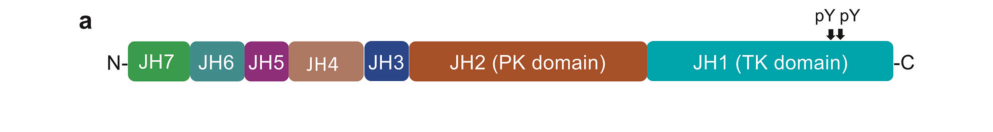

## Question

# Gene Research for Functional Annotation

## ⚠️ CRITICAL: Gene/Protein Identification Context

**BEFORE YOU BEGIN RESEARCH:** You MUST verify you are researching the CORRECT gene/protein. Gene symbols can be ambiguous, especially for less well-characterized genes from non-model organisms.

### Target Gene/Protein Identity (from UniProt):
- **UniProt Accession:** P23458
- **Protein Description:** RecName: Full=Tyrosine-protein kinase JAK1; EC=2.7.10.2 {ECO:0000269|PubMed:1848670, ECO:0000269|PubMed:7615558}; AltName: Full=Janus kinase 1; Short=JAK-1;
- **Gene Information:** Name=JAK1; Synonyms=JAK1A, JAK1B;
- **Organism (full):** Homo sapiens (Human).
- **Protein Family:** Belongs to the protein kinase superfamily. Tyr protein
- **Key Domains:** Band_41_domain. (IPR019749); FERM_2. (IPR035963); FERM_central. (IPR019748); FERM_domain. (IPR000299); FERM_F1. (IPR041155)

### MANDATORY VERIFICATION STEPS:

1. **Check if the gene symbol "JAK1" matches the protein description above**
2. **Verify the organism is correct:** Homo sapiens (Human).
3. **Check if protein family/domains align with what you find in literature**
4. **If you find literature for a DIFFERENT gene with the same or similar symbol, STOP**

### If Gene Symbol is Ambiguous or You Cannot Find Relevant Literature:

**DO NOT PROCEED WITH RESEARCH ON A DIFFERENT GENE.** Instead:
- State clearly: "The gene symbol 'JAK1' is ambiguous or literature is limited for this specific protein"
- Explain what you found (e.g., "Found extensive literature on a different gene with the same symbol in a different organism")
- Describe the protein based ONLY on the UniProt information provided above
- Suggest that the protein function can be inferred from domain/family information

### Research Target:

Please provide a comprehensive research report on the gene **JAK1** (gene ID: JAK1, UniProt: P23458) in human.

The research report should be a detailed narrative explaining the function, biological processes, and localization of the gene product. Citations should be given for all claims.

You should prioritize authoritative reviews and primary scientific literature when conducting research. You can supplement
this with annotations you find in gene/protein databases, but these can be outdated or inaccurate.

We are specifically interested in the primary function of the gene - for enzymes, what reaction is catalyzed, and what is the substrate specificity? For transporters, what is the substrate? For structural proteins or adapters, what is the broader structural role? For signaling molecules, what is the role in the pathway.

We are interested in where in or outside the cell the gene product carries out its function.

We are also interested in the signaling or biochemical pathways in which the gene functions. We are less interested in broad pleiotropic effects, except where these elucidate the precise role.

Include evidence where possible. We are interested in both experimental evidence as well as inference from structure, evolution, or bioinformatic analysis. Precise studies should be prioritized over high-throughput, where available.

## Output

Question: You are an expert researcher providing comprehensive, well-cited information.

Provide detailed information focusing on:
1. Key concepts and definitions with current understanding
2. Recent developments and latest research (prioritize 2023-2024 sources)
3. Current applications and real-world implementations
4. Expert opinions and analysis from authoritative sources
5. Relevant statistics and data from recent studies

Format as a comprehensive research report with proper citations. Include URLs and publication dates where available.
Always prioritize recent, authoritative sources and provide specific citations for all major claims.

# Gene Research for Functional Annotation

## ⚠️ CRITICAL: Gene/Protein Identification Context

**BEFORE YOU BEGIN RESEARCH:** You MUST verify you are researching the CORRECT gene/protein. Gene symbols can be ambiguous, especially for less well-characterized genes from non-model organisms.

### Target Gene/Protein Identity (from UniProt):
- **UniProt Accession:** P23458
- **Protein Description:** RecName: Full=Tyrosine-protein kinase JAK1; EC=2.7.10.2 {ECO:0000269|PubMed:1848670, ECO:0000269|PubMed:7615558}; AltName: Full=Janus kinase 1; Short=JAK-1;
- **Gene Information:** Name=JAK1; Synonyms=JAK1A, JAK1B;
- **Organism (full):** Homo sapiens (Human).
- **Protein Family:** Belongs to the protein kinase superfamily. Tyr protein
- **Key Domains:** Band_41_domain. (IPR019749); FERM_2. (IPR035963); FERM_central. (IPR019748); FERM_domain. (IPR000299); FERM_F1. (IPR041155)

### MANDATORY VERIFICATION STEPS:

1. **Check if the gene symbol "JAK1" matches the protein description above**
2. **Verify the organism is correct:** Homo sapiens (Human).
3. **Check if protein family/domains align with what you find in literature**
4. **If you find literature for a DIFFERENT gene with the same or similar symbol, STOP**

### If Gene Symbol is Ambiguous or You Cannot Find Relevant Literature:

**DO NOT PROCEED WITH RESEARCH ON A DIFFERENT GENE.** Instead:
- State clearly: "The gene symbol 'JAK1' is ambiguous or literature is limited for this specific protein"
- Explain what you found (e.g., "Found extensive literature on a different gene with the same symbol in a different organism")
- Describe the protein based ONLY on the UniProt information provided above
- Suggest that the protein function can be inferred from domain/family information

### Research Target:

Please provide a comprehensive research report on the gene **JAK1** (gene ID: JAK1, UniProt: P23458) in human.

The research report should be a detailed narrative explaining the function, biological processes, and localization of the gene product. Citations should be given for all claims.

You should prioritize authoritative reviews and primary scientific literature when conducting research. You can supplement
this with annotations you find in gene/protein databases, but these can be outdated or inaccurate.

We are specifically interested in the primary function of the gene - for enzymes, what reaction is catalyzed, and what is the substrate specificity? For transporters, what is the substrate? For structural proteins or adapters, what is the broader structural role? For signaling molecules, what is the role in the pathway.

We are interested in where in or outside the cell the gene product carries out its function.

We are also interested in the signaling or biochemical pathways in which the gene functions. We are less interested in broad pleiotropic effects, except where these elucidate the precise role.

Include evidence where possible. We are interested in both experimental evidence as well as inference from structure, evolution, or bioinformatic analysis. Precise studies should be prioritized over high-throughput, where available.

# Research Report: Human **JAK1** (UniProt **P23458**) — Functional Annotation, Mechanism, and Translational Applications

## 0) Target verification (critical disambiguation)
The literature and evidence summarized here correspond to **human Janus kinase 1 (JAK1)** with **UniProt accession P23458** and kinase EC classification **EC 2.7.10.2** (tyrosine-protein kinase). (adeyelu2023kinfamsdenovoclassification pages 10-12, lv2024thejakstatpathway pages 11-12)

## 1) Key concepts and definitions (current understanding)

### 1.1 What JAK1 is
**JAK1** is an **intracellular, non-receptor tyrosine kinase** that operates as the receptor-proximal catalytic component of the **JAK–STAT signaling pathway**, transducing extracellular cytokine signals into transcriptional responses. Mechanistically, activated JAKs phosphorylate (i) themselves, (ii) cytokine receptors, and (iii) STAT transcription factors, which then dimerize and enter the nucleus to regulate gene expression. (jarneborn2025thedualedgedsword pages 2-4)

### 1.2 Domain architecture (structure → function)
JAK-family kinases (including JAK1) are multi-domain proteins typically described by Janus homology (JH) regions:
- **N-terminus**: a receptor-binding **FERM–SH2 “holodomain”** (FERM + SH2-like domains) mediates association to membrane-proximal receptor motifs. (lv2024thejakstatpathway pages 11-12, lv2024thejakstatpathway pages 12-15)
- **C-terminus**: a tandem **pseudokinase domain (JH2)** and **catalytic tyrosine kinase domain (JH1)**, where JH2 is regulatory/autoinhibitory and JH1 is the enzymatic kinase. (lv2024thejakstatpathway pages 11-12, lv2024thejakstatpathway pages 12-15)

A kinase-family classification study explicitly annotates human **JAK1 (P23458)** as EC **2.7.10.2** and delineates two “kinase-like” domains: a **non-catalytic/pseudokinase** region (residues **583–855**) and the **active kinase** region (residues **875–1153**). (adeyelu2023kinfamsdenovoclassification pages 10-12)

### 1.3 Catalytic activity and substrate specificity (functional core)
JAK1’s **JH1** domain is the active tyrosine kinase module. The same kinase-family analysis reports canonical active-site motif residues in JAK1’s catalytic domain, including **K908** (N-lobe), **D1003** within the **HRD** motif, and **D1022** within the **DFG** motif—hallmarks of protein kinase catalysis and ATP-dependent phosphotransfer. (adeyelu2023kinfamsdenovoclassification pages 10-12)

Operationally in cells, JAK1 catalyzes phosphorylation events on:
- **cytokine receptor cytoplasmic tails** (creating phosphotyrosine docking sites), and
- **STAT proteins** (triggering STAT dimerization and transcriptional activation). (jarneborn2025thedualedgedsword pages 2-4)

## 2) Cellular localization and where JAK1 acts
JAKs are cytosolic kinases that are **anchored near the plasma membrane** by binding to cytokine receptor cytoplasmic motifs; this receptor tethering is mediated by the **FERM** region (and associated SH2-like elements) and positions JAK1 for rapid activation upon receptor engagement/dimerization. (jarneborn2025thedualedgedsword pages 2-4, lv2024thejakstatpathway pages 11-12)

## 3) Pathways and biological role: JAK1 in cytokine receptor signaling

### 3.1 Receptor binding mechanism (box 1/box 2 interaction model)
A 2024 structural review provides JAK1-specific receptor binding detail: the **intracellular “box 1” motif** binds the **F2 subdomain** of the FERM module, while **“box 2”** binds the **SH2-like domain**; the combined box1+box2 epitope spans ~**85 Å** and buries **>1000 Ų** of surface area in the receptor–JAK1 interface. (lv2024thejakstatpathway pages 12-15)

A solved complex is described for the **human JAK1 FERM–SH2** holodomain bound to **IFNλR1** receptor motifs, illustrating this receptor-engagement mode experimentally/structurally. (lv2024thejakstatpathway pages 12-15, lv2024thejakstatpathway pages 11-12)

### 3.2 Cytokine/JAK pairing logic (functional wiring)
JAK1 participates in multiple cytokine receptor complexes and commonly signals as **heterodimers** (or coordinated pairs) with other JAKs. Reported examples of JAK1-containing receptor/JAK pairs include:
- **IFN-γ receptor signaling**: **JAK1 + JAK2** leading to STAT1 recruitment/activation (representative example in immunology/cancer context). (liu2026jakinhibitionin pages 2-3)
- **Type I interferons (IFN-α/β)**: **JAK1 + TYK2**. (djidjik2025jakstatinhuman pages 2-3)
- **IL-10 family signaling**: **JAK1 + TYK2**. (djidjik2025jakstatinhuman pages 2-3)
- **Common γ-chain cytokines** (e.g., **IL‑2, IL‑4, IL‑7, IL‑21**): **JAK1 + JAK3**. (djidjik2025jakstatinhuman pages 2-3, jarneborn2025thedualedgedsword pages 2-4)
- **IL‑6/gp130 signaling**: JAK1 is described as associating with the **gp130** receptor system (a major pro-inflammatory axis). (jarneborn2025thedualedgedsword pages 2-4)

These pairings help explain why **JAK1-selective inhibition** can broadly dampen inflammatory signaling: JAK1 sits at key junctions for interferon, IL‑6 family, and multiple lymphocyte cytokine pathways. (jarneborn2025thedualedgedsword pages 4-6, jarneborn2025thedualedgedsword pages 2-4)

## 4) Mechanistic regulation: autoinhibition, activation, and regulatory phosphorylation

### 4.1 Pseudokinase (JH2) regulation and autoinhibition
A central regulatory concept is that the **JH2 pseudokinase domain restrains JAK activity** at baseline and is required for proper control of the catalytic JH1 kinase domain. A 2024 structural synthesis notes that deletion of the pseudokinase domain can increase basal kinase activity, supporting an **autoinhibitory** role for JH2. (lv2024thejakstatpathway pages 12-15)

### 4.2 Activation model: receptor-driven rearrangements and TK release
Cytokine binding induces receptor dimerization/oligomerization that repositions receptor-bound JAKs, shifting JAK1 from an inhibited state to an active configuration (including changes in relative placement/orientation of the JH1 kinase domains). (lv2024thejakstatpathway pages 12-15, sun2024anovelapproach pages 1-2)

A 2024 computational study of full-length JAK1 activation proposes that activation is thermodynamically favorable but faces an **initial energy barrier** associated with releasing the tyrosine kinase domain from an inhibited “FERM–PK cavity” state. (sun2024anovelapproach pages 1-2)

### 4.3 Activation loop phosphorylation sites (JAK1-specific)
A clinical-immunology-focused review lists **JAK1 activation-loop tyrosines Y1022/Y1023** as phosphorylation sites, with **Y1023** reported to be more highly phosphorylated than Y1022—supporting an activation-loop phosphorylation mechanism typical of kinases. (djidjik2025jakstatinhuman pages 2-3)

## 5) Recent developments (prioritizing 2023–2024) and latest research directions

### 5.1 2024 structural biology consolidation
A high-impact 2024 review integrates structural biology of the JAK–STAT pathway and provides JAK1-specific receptor engagement (IFNλR1 complex) and domain-organization schematics, helping refine mechanistic understanding of how receptor motifs organize the JAK1 FERM–SH2 interface and how JH2 regulates JH1 activation. (lv2024thejakstatpathway pages 12-15, lv2024thejakstatpathway pages 11-12)

### 5.2 2024 systems/biophysical modeling of JAK1 activation transitions
The 2024 Briefings in Bioinformatics study models inhibited vs activated JAK1 full-length conformations and analyzes energetically plausible activation paths; it also uses pathogenic/regulatory mutations (e.g., in the pseudokinase region) to rationalize negative vs positive regulatory effects on activation dynamics. (sun2024anovelapproach pages 1-2)

## 6) Current applications and real-world implementations (JAK1-selective inhibitors)

### 6.1 Therapeutic rationale: why JAK1 selectivity matters
In clinical inflammatory disease contexts (e.g., ulcerative colitis), JAK1 is described as mediating inflammatory cytokine signals, motivating **JAK1-selective inhibitors** to preferentially suppress pro-inflammatory pathways while attempting to spare JAK2-driven hematopoietic functions. (caballeromateos2024gamechangerhow pages 2-4)

### 6.2 Ulcerative colitis (UC)
A 2024 clinical review of UC management reports rapid onset of JAK inhibitors (days **1–3**) and provides remission percentages at specific timepoints. Reported values include:
- **Upadacitinib**: remission **up to 80% at 8 weeks** and **38% at 52 weeks** (as summarized in that review). (caballeromateos2024gamechangerhow pages 2-4)
- **Filgotinib**: remission **71.9% at week 12** and **76.4% at week 24** (as summarized in that review). (caballeromateos2024gamechangerhow pages 2-4)

Clinical trial implementation example (registry):
- **SELECTION trial (NCT02914522)**: Phase **2b/3**, completed, **n=1351**, evaluating filgotinib **100/200 mg** for induction and maintenance of remission in moderately-to-severely active UC. (NCT02914522 chunk 1)

### 6.3 Atopic dermatitis (AD)
A 2024 umbrella review of meta-analyses quantifies efficacy of JAK inhibitors (including JAK1-selective agents) in AD:
- **IGA response**: pooled **RR 2.83** (95% CI 2.25–3.56). (he2024januskinaseinhibitors pages 1-2)
- **EASI75**: pooled **RR 2.84** (95% CI 2.2–3.67). (he2024januskinaseinhibitors pages 1-2)
- **Pruritus (PP‑NRS)**: pooled **SMD −0.49** (95% CI −0.67 to −0.32). (he2024januskinaseinhibitors pages 1-2)
Drug/dose-specific quantitative signals include:
- **Upadacitinib**: rapid IGA effect **RR 5.3** (95% CI 4.19–6.71). (he2024januskinaseinhibitors pages 8-11)
- **Abrocitinib**: overall IGA response **RR 3.02** (95% CI 2.26–4.02); **200 mg vs 100 mg** IGA response **RR 2.52** (95% CI 1.92–3.3). (he2024januskinaseinhibitors pages 8-11)

Real-world and Phase 4 implementation examples (registry):
- **NCT05507580** (upadacitinib): Phase 4, completed, **n=461**, treat-to-target and dosing flexibility design (15/30 mg), primary endpoint **EASI90 at week 24**. (NCT05507580 chunk 1)
- **NCT05602207** (abrocitinib): Phase 4, completed, **n=24**, abrocitinib **100 mg QD** for 12 weeks in dupilumab inadequate responders; includes skin biomarker assessment (e.g., CCL18, MMP12, K16, S100A7/A8/A9). (NCT05602207 chunk 1)
- **NCT05391061** (abrocitinib): recruiting observational post-marketing study in Korea; primary outcomes emphasize AE/ADR surveillance up to **52 weeks** and effectiveness endpoints (e.g., IGA, EASI-75, itch improvement). (NCT05391061 chunk 1)

## 7) Safety, risk–benefit, and expert synthesis (2023–2024 prioritized)

### 7.1 Quantitative safety signals in AD meta-evidence (2024)
The 2024 umbrella review reports no overall increase in discontinuations or serious adverse events across meta-analyses, but highlights drug- and dose-specific adverse-event risk ratios:
- **Abrocitinib 200 mg**: acne **RR 4.34**, headache **RR 1.76**, nausea **RR 7.81**. (he2024januskinaseinhibitors pages 1-2)
- **Upadacitinib**: acne **RR 6.23**, nasopharyngitis **RR 1.36**, elevated blood CPK **RR 2.41**. (he2024januskinaseinhibitors pages 1-2)
- **Systemic JAK inhibitors**: TEAEs increased vs placebo **RR 1.23** (95% CI 1.11–1.36). (he2024januskinaseinhibitors pages 8-11)

The same umbrella review qualitatively reiterates regulatory concern (FDA boxed warnings as of July 2022) for major adverse cardiovascular events, malignancy, thrombosis, and death risks for certain JAK inhibitors, motivating patient selection and risk stratification. (he2024januskinaseinhibitors pages 13-15)

### 7.2 Upadacitinib safety synthesis across indications (2024 systematic review)
A 2024 systematic literature review of indirect/direct treatment comparisons of RCTs summarizes upadacitinib safety across RA, PsA, AS, AD, UC, Crohn’s disease, and nr-axSpA, covering publications from **2018 to Aug 3, 2022**:
- **16/25 studies (64%)** reported **no statistically significant difference** in studied safety outcomes between upadacitinib and comparators/placebo; **9/25 (36%)** had mixed results, with **8/25 (32%)** reporting higher event rates and **1/25 (4%)** lower rates. (mysler2024safetyofupadacitinib pages 1-2, mysler2024safetyofupadacitinib pages 2-5)
The review also reports that in the subset of analyses available in the excerpt, MACE, VTE, and malignancy comparisons were often not statistically different (with sparse reporting by outcome), reinforcing that safety interpretation depends on indication, comparator, and follow-up. (mysler2024safetyofupadacitinib pages 22-24)

## 8) Disease/target association landscape (database triangulation)
Open Targets lists JAK1 among top associated targets for immune-mediated inflammatory diseases such as **atopic eczema** and **rheumatoid arthritis**, with evidence including approved clinical-stage associations (e.g., therapeutics targeting the pathway). (OpenTargets Search: -JAK1)

## 9) Visual evidence (domain and receptor-binding schematic)
Key structural schematics and the receptor-binding example for human JAK1 are available in Lv et al. 2024 Figure 7, including the JAK domain organization and a JAK1 FERM–SH2 complex with IFNλR1 box1/box2 motifs. (lv2024thejakstatpathway media 48c6cfbc, lv2024thejakstatpathway media 2685a077, lv2024thejakstatpathway media 299b38a0)

## 10) Evidence summary table
| Topic | Key points | Best sources | URLs + publication dates |
|---|---|---|---|
| Identity / domains | Human JAK1 is UniProt **P23458**, EC **2.7.10.2**. It contains a receptor-binding **FERM-SH2** N-terminus plus a **JH2 pseudokinase** and **JH1 catalytic kinase** C-terminus; KinFams separates residues **583–855** (pseudokinase) and **875–1153** (active kinase). (adeyelu2023kinfamsdenovoclassification pages 10-12, lv2024thejakstatpathway pages 11-12) | Adeyelu et al. 2023; Lv et al. 2024 (adeyelu2023kinfamsdenovoclassification pages 10-12, lv2024thejakstatpathway pages 11-12) | https://doi.org/10.3390/biom13020277 (Feb 2023); https://doi.org/10.1038/s41392-024-01934-w (Aug 2024) |
| Catalytic activity | JAK1 is the catalytic tyrosine kinase in JAK-STAT signaling; JH1 is the active TK domain, whereas JH2 is regulatory/pseudokinase. Reported catalytic-site/motif residues include **K908**, **D1003** (HRD), and **D1022** (DFG), and JAKs phosphorylate themselves, cytokine receptors, and STAT proteins. (adeyelu2023kinfamsdenovoclassification pages 10-12, kwon2026revisitingjanuskinases pages 1-2, jarneborn2025thedualedgedsword pages 2-4) | Adeyelu et al. 2023; Kwon 2026; Jarneborn et al. 2025 (adeyelu2023kinfamsdenovoclassification pages 10-12, kwon2026revisitingjanuskinases pages 1-2, jarneborn2025thedualedgedsword pages 2-4) | https://doi.org/10.3390/biom13020277 (Feb 2023); https://doi.org/10.3389/fmed.2026.1716179 (Jan 2026); https://doi.org/10.3390/pathogens14040324 (Mar 2025) |
| Activation / regulated residues | The JH2 domain exerts autoinhibitory control: deletion increases basal activity, and activation requires release/repositioning of TK from the inhibited state. JAK1 activation-loop tyrosines **Y1022/Y1023** are regulated phosphosites, with **Y1023** reported as more strongly phosphorylated. (lv2024thejakstatpathway pages 12-15, sun2024anovelapproach pages 1-2, djidjik2025jakstatinhuman pages 2-3) | Lv et al. 2024; Sun et al. 2024; Djidjik et al. 2025 (lv2024thejakstatpathway pages 12-15, sun2024anovelapproach pages 1-2, djidjik2025jakstatinhuman pages 2-3) | https://doi.org/10.1038/s41392-024-01934-w (Aug 2024); https://doi.org/10.1093/bib/bbae079 (Jan 2024); https://doi.org/10.3389/fimmu.2025.1669688 (Dec 2025) |
| Receptor / cytokine pairings | JAK1 binds receptor **box 1/box 2** motifs through FERM/SH2; a solved structure shows human JAK1 FERM-SH2 bound to **IFNλR1**. Reported JAK1 pairings include **IFN-γ (JAK1/JAK2)**, **IFN-α/β (JAK1/TYK2)**, **IL-10 (JAK1/TYK2)**, **IL-2/IL-4/IL-7/IL-21 (JAK1/JAK3)**, and **IL-6/gp130 signaling**. (lv2024thejakstatpathway pages 12-15, jarneborn2025thedualedgedsword pages 2-4, djidjik2025jakstatinhuman pages 2-3) | Lv et al. 2024; Jarneborn et al. 2025; Djidjik et al. 2025 (lv2024thejakstatpathway pages 12-15, jarneborn2025thedualedgedsword pages 2-4, djidjik2025jakstatinhuman pages 2-3) | https://doi.org/10.1038/s41392-024-01934-w (Aug 2024); https://doi.org/10.3390/pathogens14040324 (Mar 2025); https://doi.org/10.3389/fimmu.2025.1669688 (Dec 2025) |
| Inhibitor applications with quantitative efficacy | JAK1-selective inhibitors are in real-world/clinical use. In ulcerative colitis, reported remission data were **up to 80% at 8 weeks and 38% at 52 weeks for upadacitinib**, and **71.9% at week 12 / 76.4% at week 24 for filgotinib**; onset may occur within **days 1–3**. In atopic dermatitis meta-analyses, JKIs improved **IGA response RR 2.83**, **EASI75 RR 2.84**, and **PP-NRS SMD -0.49**; upadacitinib had rapid IGA effect **RR 5.3**, and abrocitinib **200 mg vs 100 mg RR 2.52** for IGA response. (caballeromateos2024gamechangerhow pages 2-4, he2024januskinaseinhibitors pages 1-2, he2024januskinaseinhibitors pages 8-11) | Caballero-Mateos & Cañadas-de la Fuente 2024; He et al. 2024 (caballeromateos2024gamechangerhow pages 2-4, he2024januskinaseinhibitors pages 1-2, he2024januskinaseinhibitors pages 8-11) | https://doi.org/10.3748/wjg.v30.i35.3942 (Sep 2024); https://doi.org/10.3389/fimmu.2024.1342810 (Feb 2024) |
| Safety signals with quantitative RRs | In AD meta-analyses, serious AEs/discontinuations were not increased overall, but drug-specific risks were noted: **abrocitinib 200 mg** acne **RR 4.34**, headache **RR 1.76**, nausea **RR 7.81**; **upadacitinib** acne **RR 6.23**, nasopharyngitis **RR 1.36**, blood CPK increase **RR 2.41**; TEAEs for systemic JKIs **RR 1.23**. Upadacitinib safety review found **16/25 (64%)** studies with no significant safety differences, while **8/25 (32%)** reported higher rates and **1/25 (4%)** lower rates. (he2024januskinaseinhibitors pages 1-2, he2024januskinaseinhibitors pages 8-11, he2024januskinaseinhibitors pages 11-13, mysler2024safetyofupadacitinib pages 1-2, mysler2024safetyofupadacitinib pages 24-26) | He et al. 2024; Mysler et al. 2024 (he2024januskinaseinhibitors pages 1-2, he2024januskinaseinhibitors pages 8-11, he2024januskinaseinhibitors pages 11-13, mysler2024safetyofupadacitinib pages 1-2, mysler2024safetyofupadacitinib pages 24-26) | https://doi.org/10.3389/fimmu.2024.1342810 (Feb 2024); https://doi.org/10.1007/s12325-023-02732-6 (Jan 2024) |
| Key clinical trials metadata | **NCT05507580**: Phase 4, completed, **461** adults with moderate-to-severe AD; evaluates **treat-to-target and dosing flexibility** of upadacitinib 15/30 mg, primary endpoint **EASI90 at week 24**. **NCT05602207**: Phase 4, completed, **24** adults with AD after inadequate dupilumab response; abrocitinib **100 mg QD** for 12 weeks, primary endpoint change in **EASI**. **NCT02914522 (SELECTION)**: Phase **2b/3**, completed, **1,351** participants with UC; filgotinib **100/200 mg** for induction and maintenance remission. **NCT05391061**: recruiting observational post-marketing Korean abrocitinib study, estimated **1100** participants, assessing safety/effectiveness to **52 weeks**. (NCT05507580 chunk 1, NCT05602207 chunk 1, NCT02914522 chunk 1, NCT05391061 chunk 1) | ClinicalTrials.gov registry entries (NCT05507580 chunk 1, NCT05602207 chunk 1, NCT02914522 chunk 1, NCT05391061 chunk 1) | https://clinicaltrials.gov/study/NCT05507580 (2023 registry entry); https://clinicaltrials.gov/study/NCT05602207 (2022 registry entry); https://clinicaltrials.gov/study/NCT02914522 (2016 registry entry); https://clinicaltrials.gov/study/NCT05391061 (2023 registry entry) |

*Table: This table compacts the most actionable functional-annotation facts for human JAK1 (UniProt P23458), including identity, mechanism, pathway pairings, therapeutic applications, safety signals, and trial metadata. It is useful as a citation-ready summary for downstream narrative reporting.*

## 11) Practical functional annotation (concise, actionable)
- **Molecular function**: ATP-dependent **protein tyrosine kinase** (EC 2.7.10.2) that phosphorylates cytokine receptors and STATs downstream of cytokine receptor engagement. (adeyelu2023kinfamsdenovoclassification pages 10-12, jarneborn2025thedualedgedsword pages 2-4)
- **Substrate/context specificity**: functions in receptor-proximal complexes, commonly pairing with JAK2, JAK3, or TYK2 depending on receptor (e.g., IFN-γ: JAK1/JAK2; IFN-α/β and IL‑10: JAK1/TYK2; IL‑2/4/7/21: JAK1/JAK3). (djidjik2025jakstatinhuman pages 2-3, jarneborn2025thedualedgedsword pages 2-4)
- **Localization**: intracellular, enriched at **plasma membrane-proximal receptor complexes** via FERM–SH2 binding to receptor box motifs. (jarneborn2025thedualedgedsword pages 2-4, lv2024thejakstatpathway pages 12-15)
- **Regulation**: autoinhibition via **JH2 pseudokinase**, activation-loop phosphorylation at **Y1022/Y1023**, and negative feedback via SOCS/PIAS/phosphatases in the broader pathway. (lv2024thejakstatpathway pages 12-15, djidjik2025jakstatinhuman pages 2-3, jarneborn2025thedualedgedsword pages 2-4)

## Limitations of this report (transparency)
Some highly detailed biochemical specifics (e.g., direct in vitro substrate panels, catalytic kcat/Km values for particular peptide substrates, or exhaustive residue-level mapping of receptor preferences across all cytokine receptors) were not available within the retrieved excerpts. The report therefore emphasizes well-supported pathway-level substrate classes (receptor tails and STATs) and mechanistic structural evidence from recent reviews and synthesis studies.

References

1. (adeyelu2023kinfamsdenovoclassification pages 10-12): Tolulope Adeyelu, Nicola Bordin, Vaishali P. Waman, Marta Sadlej, Ian Sillitoe, Aurelio A. Moya-Garcia, and Christine A. Orengo. Kinfams: de-novo classification of protein kinases using cath functional units. Biomolecules, 13:277, Feb 2023. URL: https://doi.org/10.3390/biom13020277, doi:10.3390/biom13020277. This article has 12 citations.

2. (lv2024thejakstatpathway pages 11-12): You Lv, Jianxun Qi, Jeff J. Babon, Longxing Cao, Guohuang Fan, Jiajia Lang, Jin Zhang, Pengbing Mi, B. Kobe, and Faming Wang. The jak-stat pathway: from structural biology to cytokine engineering. Signal Transduction and Targeted Therapy, Aug 2024. URL: https://doi.org/10.1038/s41392-024-01934-w, doi:10.1038/s41392-024-01934-w. This article has 122 citations and is from a peer-reviewed journal.

3. (jarneborn2025thedualedgedsword pages 2-4): Anders Jarneborn, Pradeep Kumar Kopparapu, and Tao Jin. The dual-edged sword: risks and benefits of jak inhibitors in infections. Pathogens, 14:324, Mar 2025. URL: https://doi.org/10.3390/pathogens14040324, doi:10.3390/pathogens14040324. This article has 9 citations.

4. (lv2024thejakstatpathway pages 12-15): You Lv, Jianxun Qi, Jeff J. Babon, Longxing Cao, Guohuang Fan, Jiajia Lang, Jin Zhang, Pengbing Mi, B. Kobe, and Faming Wang. The jak-stat pathway: from structural biology to cytokine engineering. Signal Transduction and Targeted Therapy, Aug 2024. URL: https://doi.org/10.1038/s41392-024-01934-w, doi:10.1038/s41392-024-01934-w. This article has 122 citations and is from a peer-reviewed journal.

5. (liu2026jakinhibitionin pages 2-3): Ziyuan Liu, Jiaqi Liu, Hongyu Chu, Zhuming Lu, Shengshan Xu, Yanguo Qin, Lianfang Zhao, and Chi Zhang. Jak inhibition in pd-1 immunotherapy and tumor microenvironment. Frontiers in Immunology, Apr 2026. URL: https://doi.org/10.3389/fimmu.2026.1790936, doi:10.3389/fimmu.2026.1790936. This article has 0 citations and is from a peer-reviewed journal.

6. (djidjik2025jakstatinhuman pages 2-3): Reda Djidjik, Lydia Lamara Mahammed, Lilya Meriem Berkani, Ines Allam, Alaa Hamidou Benmoussa, Merzak Gharnaout, and Brahim Belaid. Jak/stat in human diseases: a common axis in immunodeficiencies and hematological disorders. Frontiers in Immunology, Dec 2025. URL: https://doi.org/10.3389/fimmu.2025.1669688, doi:10.3389/fimmu.2025.1669688. This article has 3 citations and is from a peer-reviewed journal.

7. (jarneborn2025thedualedgedsword pages 4-6): Anders Jarneborn, Pradeep Kumar Kopparapu, and Tao Jin. The dual-edged sword: risks and benefits of jak inhibitors in infections. Pathogens, 14:324, Mar 2025. URL: https://doi.org/10.3390/pathogens14040324, doi:10.3390/pathogens14040324. This article has 9 citations.

8. (sun2024anovelapproach pages 1-2): Shengjie Sun, Georgialina Rodriguez, Gaoshu Zhao, Jason E Sanchez, Wenhan Guo, Dan Du, Omar J Rodriguez Moncivais, Dehua Hu, Jing Liu, Robert Arthur Kirken, and Lin Li. A novel approach to study multi-domain motions in jak1’s activation mechanism based on energy landscape. Briefings in Bioinformatics, Jan 2024. URL: https://doi.org/10.1093/bib/bbae079, doi:10.1093/bib/bbae079. This article has 13 citations and is from a domain leading peer-reviewed journal.

9. (caballeromateos2024gamechangerhow pages 2-4): Antonio M Caballero-Mateos and Guillermo Arturo Cañadas-de la Fuente. Game changer: how janus kinase inhibitors are reshaping the landscape of ulcerative colitis management. World Journal of Gastroenterology, 30:3942-3953, Sep 2024. URL: https://doi.org/10.3748/wjg.v30.i35.3942, doi:10.3748/wjg.v30.i35.3942. This article has 18 citations.

10. (NCT02914522 chunk 1):  Study to Evaluate the Efficacy and Safety of Filgotinib in the Induction and Maintenance of Remission in Adults With Moderately to Severely Active Ulcerative Colitis. Gilead Sciences. 2016. ClinicalTrials.gov Identifier: NCT02914522

11. (he2024januskinaseinhibitors pages 1-2): Qingying He, Xin Xie, Qian Chen, Wenquan Li, Zongzhou Song, Xurui Wang, Xiao Ma, Jinhao Zeng, and Jing Guo. Janus kinase inhibitors in atopic dermatitis: an umbrella review of meta-analyses. Frontiers in Immunology, Feb 2024. URL: https://doi.org/10.3389/fimmu.2024.1342810, doi:10.3389/fimmu.2024.1342810. This article has 19 citations and is from a peer-reviewed journal.

12. (he2024januskinaseinhibitors pages 8-11): Qingying He, Xin Xie, Qian Chen, Wenquan Li, Zongzhou Song, Xurui Wang, Xiao Ma, Jinhao Zeng, and Jing Guo. Janus kinase inhibitors in atopic dermatitis: an umbrella review of meta-analyses. Frontiers in Immunology, Feb 2024. URL: https://doi.org/10.3389/fimmu.2024.1342810, doi:10.3389/fimmu.2024.1342810. This article has 19 citations and is from a peer-reviewed journal.

13. (NCT05507580 chunk 1):  A Study to Assess Treat-to-Target and Dosing Flexibility of Oral Upadacitinib Tablets in Adult Participants With Moderate to Severe Atopic Dermatitis. AbbVie. 2023. ClinicalTrials.gov Identifier: NCT05507580

14. (NCT05602207 chunk 1):  Effects of Abrocitinib in Subjects With Atopic Dermatitis With an Unsatisfactory Response After Treatment With Dupilumab. Innovaderm Research Inc.. 2022. ClinicalTrials.gov Identifier: NCT05602207

15. (NCT05391061 chunk 1):  A Study to Learn About the Study Medicine (Called Cibinqo) in People With Atopic Dermatitis. Pfizer. 2023. ClinicalTrials.gov Identifier: NCT05391061

16. (he2024januskinaseinhibitors pages 13-15): Qingying He, Xin Xie, Qian Chen, Wenquan Li, Zongzhou Song, Xurui Wang, Xiao Ma, Jinhao Zeng, and Jing Guo. Janus kinase inhibitors in atopic dermatitis: an umbrella review of meta-analyses. Frontiers in Immunology, Feb 2024. URL: https://doi.org/10.3389/fimmu.2024.1342810, doi:10.3389/fimmu.2024.1342810. This article has 19 citations and is from a peer-reviewed journal.

17. (mysler2024safetyofupadacitinib pages 1-2): Eduardo Mysler, Gerd R. Burmester, Christopher D. Saffore, John Liu, Lani Wegrzyn, Chelsey Yang, Keith A. Betts, Yan Wang, Alan D. Irvine, and Remo Panaccione. Safety of upadacitinib in immune-mediated inflammatory diseases: systematic literature review of indirect and direct treatment comparisons of randomized controlled trials. Advances in Therapy, 41:567-597, Jan 2024. URL: https://doi.org/10.1007/s12325-023-02732-6, doi:10.1007/s12325-023-02732-6. This article has 22 citations and is from a peer-reviewed journal.

18. (mysler2024safetyofupadacitinib pages 2-5): Eduardo Mysler, Gerd R. Burmester, Christopher D. Saffore, John Liu, Lani Wegrzyn, Chelsey Yang, Keith A. Betts, Yan Wang, Alan D. Irvine, and Remo Panaccione. Safety of upadacitinib in immune-mediated inflammatory diseases: systematic literature review of indirect and direct treatment comparisons of randomized controlled trials. Advances in Therapy, 41:567-597, Jan 2024. URL: https://doi.org/10.1007/s12325-023-02732-6, doi:10.1007/s12325-023-02732-6. This article has 22 citations and is from a peer-reviewed journal.

19. (mysler2024safetyofupadacitinib pages 22-24): Eduardo Mysler, Gerd R. Burmester, Christopher D. Saffore, John Liu, Lani Wegrzyn, Chelsey Yang, Keith A. Betts, Yan Wang, Alan D. Irvine, and Remo Panaccione. Safety of upadacitinib in immune-mediated inflammatory diseases: systematic literature review of indirect and direct treatment comparisons of randomized controlled trials. Advances in Therapy, 41:567-597, Jan 2024. URL: https://doi.org/10.1007/s12325-023-02732-6, doi:10.1007/s12325-023-02732-6. This article has 22 citations and is from a peer-reviewed journal.

20. (OpenTargets Search: -JAK1): Open Targets Query (-JAK1, 19 results). Buniello, A. et al. (2025). Open Targets Platform: facilitating therapeutic hypotheses building in drug discovery. Nucleic Acids Research.

21. (lv2024thejakstatpathway media 48c6cfbc): You Lv, Jianxun Qi, Jeff J. Babon, Longxing Cao, Guohuang Fan, Jiajia Lang, Jin Zhang, Pengbing Mi, B. Kobe, and Faming Wang. The jak-stat pathway: from structural biology to cytokine engineering. Signal Transduction and Targeted Therapy, Aug 2024. URL: https://doi.org/10.1038/s41392-024-01934-w, doi:10.1038/s41392-024-01934-w. This article has 122 citations and is from a peer-reviewed journal.

22. (lv2024thejakstatpathway media 2685a077): You Lv, Jianxun Qi, Jeff J. Babon, Longxing Cao, Guohuang Fan, Jiajia Lang, Jin Zhang, Pengbing Mi, B. Kobe, and Faming Wang. The jak-stat pathway: from structural biology to cytokine engineering. Signal Transduction and Targeted Therapy, Aug 2024. URL: https://doi.org/10.1038/s41392-024-01934-w, doi:10.1038/s41392-024-01934-w. This article has 122 citations and is from a peer-reviewed journal.

23. (lv2024thejakstatpathway media 299b38a0): You Lv, Jianxun Qi, Jeff J. Babon, Longxing Cao, Guohuang Fan, Jiajia Lang, Jin Zhang, Pengbing Mi, B. Kobe, and Faming Wang. The jak-stat pathway: from structural biology to cytokine engineering. Signal Transduction and Targeted Therapy, Aug 2024. URL: https://doi.org/10.1038/s41392-024-01934-w, doi:10.1038/s41392-024-01934-w. This article has 122 citations and is from a peer-reviewed journal.

24. (kwon2026revisitingjanuskinases pages 1-2): Sunghark Kwon. Revisiting janus kinases as molecular drug targets for rheumatic diseases. Frontiers in Medicine, Jan 2026. URL: https://doi.org/10.3389/fmed.2026.1716179, doi:10.3389/fmed.2026.1716179. This article has 1 citations.

25. (he2024januskinaseinhibitors pages 11-13): Qingying He, Xin Xie, Qian Chen, Wenquan Li, Zongzhou Song, Xurui Wang, Xiao Ma, Jinhao Zeng, and Jing Guo. Janus kinase inhibitors in atopic dermatitis: an umbrella review of meta-analyses. Frontiers in Immunology, Feb 2024. URL: https://doi.org/10.3389/fimmu.2024.1342810, doi:10.3389/fimmu.2024.1342810. This article has 19 citations and is from a peer-reviewed journal.

26. (mysler2024safetyofupadacitinib pages 24-26): Eduardo Mysler, Gerd R. Burmester, Christopher D. Saffore, John Liu, Lani Wegrzyn, Chelsey Yang, Keith A. Betts, Yan Wang, Alan D. Irvine, and Remo Panaccione. Safety of upadacitinib in immune-mediated inflammatory diseases: systematic literature review of indirect and direct treatment comparisons of randomized controlled trials. Advances in Therapy, 41:567-597, Jan 2024. URL: https://doi.org/10.1007/s12325-023-02732-6, doi:10.1007/s12325-023-02732-6. This article has 22 citations and is from a peer-reviewed journal.

## Artifacts

- [Edison artifact artifact-00](JAK1-deep-research-falcon_artifacts/artifact-00.md)

## Citations

1. jarneborn2025thedualedgedsword pages 2-4
2. adeyelu2023kinfamsdenovoclassification pages 10-12
3. lv2024thejakstatpathway pages 12-15
4. liu2026jakinhibitionin pages 2-3
5. djidjik2025jakstatinhuman pages 2-3
6. sun2024anovelapproach pages 1-2
7. caballeromateos2024gamechangerhow pages 2-4
8. he2024januskinaseinhibitors pages 1-2
9. he2024januskinaseinhibitors pages 8-11
10. he2024januskinaseinhibitors pages 13-15
11. mysler2024safetyofupadacitinib pages 22-24
12. lv2024thejakstatpathway pages 11-12
13. jarneborn2025thedualedgedsword pages 4-6
14. mysler2024safetyofupadacitinib pages 1-2
15. mysler2024safetyofupadacitinib pages 2-5
16. kwon2026revisitingjanuskinases pages 1-2
17. he2024januskinaseinhibitors pages 11-13
18. mysler2024safetyofupadacitinib pages 24-26
19. https://doi.org/10.3390/biom13020277
20. https://doi.org/10.1038/s41392-024-01934-w
21. https://doi.org/10.3389/fmed.2026.1716179
22. https://doi.org/10.3390/pathogens14040324
23. https://doi.org/10.1093/bib/bbae079
24. https://doi.org/10.3389/fimmu.2025.1669688
25. https://doi.org/10.3748/wjg.v30.i35.3942
26. https://doi.org/10.3389/fimmu.2024.1342810
27. https://doi.org/10.1007/s12325-023-02732-6
28. https://clinicaltrials.gov/study/NCT05507580
29. https://clinicaltrials.gov/study/NCT05602207
30. https://clinicaltrials.gov/study/NCT02914522
31. https://clinicaltrials.gov/study/NCT05391061
32. https://doi.org/10.3390/biom13020277,
33. https://doi.org/10.1038/s41392-024-01934-w,
34. https://doi.org/10.3390/pathogens14040324,
35. https://doi.org/10.3389/fimmu.2026.1790936,
36. https://doi.org/10.3389/fimmu.2025.1669688,
37. https://doi.org/10.1093/bib/bbae079,
38. https://doi.org/10.3748/wjg.v30.i35.3942,
39. https://doi.org/10.3389/fimmu.2024.1342810,
40. https://doi.org/10.1007/s12325-023-02732-6,
41. https://doi.org/10.3389/fmed.2026.1716179,