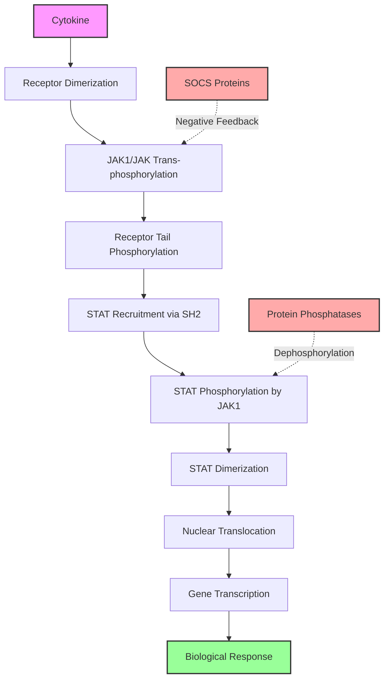
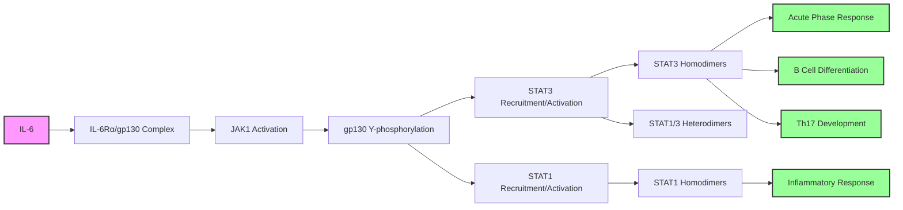

# JAK1 Signaling Pathways

## Overview

JAK1 (Janus Kinase 1) is a non-receptor tyrosine kinase that serves as a central hub in cytokine signal transduction. It transduces signals from over 40 different cytokine receptors, making it essential for immune function, hematopoiesis, and inflammatory responses [PMID:8232552, PMID:9590172]. JAK1 functions through the JAK-STAT pathway, converting extracellular cytokine binding into transcriptional changes that govern cell fate, proliferation, and immune responses.

## The Core JAK-STAT Signaling Mechanism

JAK1 operates through a well-defined signaling cascade that begins at the cell membrane and culminates in the nucleus. Upon cytokine binding, receptor chains dimerize, bringing two JAK molecules into proximity. This enables trans-autophosphorylation of activation loop tyrosines (Tyr1034/1035 in human JAK1), fully activating the kinase [Deep Research Report]. The activated JAK1 then phosphorylates tyrosine residues on the receptor cytoplasmic tails, creating docking sites for STAT proteins. JAK1 subsequently phosphorylates the recruited STATs, inducing their dimerization and nuclear translocation where they act as transcription factors [PMID:7657660, PMID:8605876].

## Type I and Type II Interferon Pathways

### Type I Interferon (IFN-α/β) Signaling

JAK1 partners with TYK2 at the Type I interferon receptor (IFNAR) complex. This partnership is absolutely essential - cells lacking JAK1 are completely unresponsive to Type I interferons [PMID:8232552]. Upon IFN-α/β binding:

1. IFNAR1 and IFNAR2 chains dimerize
2. JAK1 (bound to IFNAR2) and TYK2 (bound to IFNAR1) trans-phosphorylate each other
3. The activated kinases phosphorylate IFNAR cytoplasmic domains
4. STAT1 and STAT2 are recruited and phosphorylated
5. Phosphorylated STATs form the ISGF3 complex with IRF9
6. ISGF3 translocates to the nucleus and induces interferon-stimulated genes (ISGs)

This pathway is critical for antiviral defense, with ISGs encoding proteins that inhibit viral replication [PMID:23391734, PMID:34813358].

### Type II Interferon (IFN-γ) Signaling

For IFN-γ signaling, JAK1 partners with JAK2 at the IFNGR complex. The signaling cascade involves:

1. IFN-γ binding induces IFNGR1/IFNGR2 dimerization
2. JAK1 and JAK2 undergo reciprocal activation
3. STAT1 homodimers are preferentially formed
4. STAT1 homodimers (GAF complexes) induce a distinct set of genes involved in antimicrobial immunity and antigen presentation

Loss of JAK1 completely abolishes IFN-γ responses, demonstrating its non-redundant role [PMID:8232552, PMID:9446616].

## IL-6 Family Cytokine Signaling

JAK1 is the dominant kinase for IL-6 family cytokines (IL-6, IL-11, IL-27, LIF, OSM, CNTF) that signal through the gp130 receptor subunit. While JAK2 and TYK2 can also associate with gp130, JAK1 is uniquely required for signal propagation [PMID:7537214]. The IL-6 signaling cascade demonstrates JAK1's central role:

Studies show that in JAK1-deficient cells, IL-6 cannot induce gp130 phosphorylation or STAT activation, while loss of JAK2 or TYK2 has minimal impact [PMID:7537214, PMID:8272873]. This JAK1-dependent pathway is crucial for:
- Acute phase protein synthesis in hepatocytes
- B cell antibody production
- Th17 cell differentiation [PMID:27893700]
- Myeloid-derived suppressor cell expansion [PMID:28781374]

## Common γ-Chain (γc) Cytokine Signaling

JAK1 pairs with JAK3 to mediate signaling from γc-dependent cytokines (IL-2, IL-4, IL-7, IL-9, IL-15, IL-21). This partnership is essential for lymphocyte development and function [PMID:9590172]. The signaling architecture involves:

### IL-2/IL-15 Pathway
- JAK1 associates with IL-2Rβ
- JAK3 associates with γc
- Both kinases are required for STAT5 activation [PMID:7568001, PMID:7973659]
- Critical for T cell proliferation and NK cell development

### IL-4/IL-13 Pathway
- JAK1 activation leads to STAT6 phosphorylation
- Drives Th2 differentiation and IgE class switching
- JAK1 gain-of-function mutations cause severe atopic disease [PMID:28111307]

### IL-7 Pathway
- Essential for T and B lymphocyte development
- JAK1/JAK3 activate STAT5 to induce pro-survival genes [PMID:29202461]
- JAK1 also couples to Pyk2 for additional signaling [PMID:10702271]

## Cross-talk with Other Pathways

### PI3K-Akt Pathway
Beyond STAT activation, JAK1 links cytokine receptors to the PI3K pathway. JAK1 directly associates with and phosphorylates the p85 regulatory subunit of PI3K, particularly in IL-2 signaling [Deep Research Report]. This JAK1-PI3K connection:
- Promotes cell survival through Akt activation
- Enhances metabolic reprogramming in activated lymphocytes
- Provides STAT-independent proliferative signals

### RhoA-ROCK Pathway
In the tumor microenvironment, JAK1 activation by inflammatory cytokines triggers RhoA/ROCK-mediated actomyosin contractility, enabling amoeboid cell migration and metastasis [Deep Research Report]. This demonstrates JAK1's role beyond classical gene transcription.

## Negative Regulation

JAK1 activity is tightly controlled through multiple mechanisms:

1. **SOCS Proteins**: Cytokine-induced SOCS1/3 bind JAK1 and promote its ubiquitination and degradation [Deep Research Report]
2. **Protein Phosphatases**: SHP-1, SHP-2, CD45, and PTP1B dephosphorylate JAK1 and STATs [PMID:11909529, PMID:12574355]
3. **Pseudokinase Domain**: JAK1's JH2 domain provides intrinsic autoinhibition, with mutations causing constitutive activation [PMID:31892268]

## Clinical Significance

### Disease-Associated Mutations
- **Loss-of-function**: Causes severe immunodeficiency (perinatal lethal in mice) [PMID:9590172]
- **Gain-of-function**: Found in T-ALL (V658F), autoimmune disorders (A634D), and drives constitutive STAT activation [PMID:28111307, PMID:32750333]

### Therapeutic Targeting
JAK1 inhibitors (tofacitinib, upadacitinib, filgotinib) are approved for:
- Rheumatoid arthritis
- Ulcerative colitis
- Atopic dermatitis
- Other cytokine-driven inflammatory diseases

These drugs exploit JAK1's central position in inflammatory signaling but must be carefully dosed to avoid immunosuppression [Deep Research Report].

## Summary

JAK1 functions as a master regulator of cytokine signaling, essential for:
- Antiviral immunity (interferon pathways)
- Adaptive immunity (γc cytokines)
- Inflammation (IL-6 family)
- Hematopoiesis and development

Its position at the convergence of multiple cytokine pathways makes JAK1 both indispensable for normal immune function and a prime therapeutic target in inflammatory and neoplastic diseases. The sophisticated regulation of JAK1 activity - through receptor specificity, partner JAK selection, and negative feedback mechanisms - enables precise control of diverse biological responses to extracellular signals.

## References

All citations refer to publications listed in the JAK1-ai-review.yaml and JAK1-deep-research.md files in this directory.