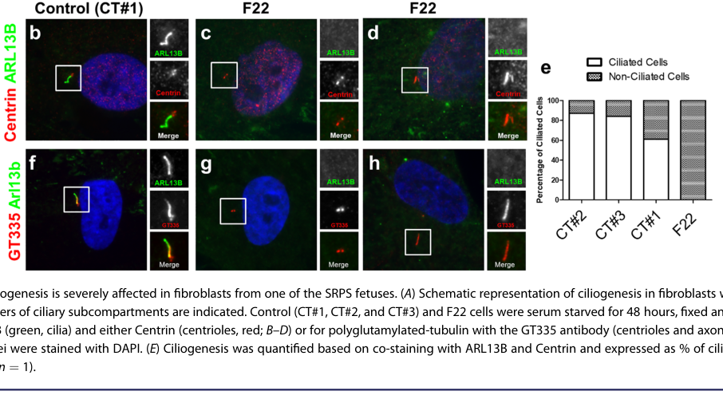

## Question

# Gene Research for Functional Annotation

## ⚠️ CRITICAL: Gene/Protein Identification Context

**BEFORE YOU BEGIN RESEARCH:** You MUST verify you are researching the CORRECT gene/protein. Gene symbols can be ambiguous, especially for less well-characterized genes from non-model organisms.

### Target Gene/Protein Identity (from UniProt):
- **UniProt Accession:** Q5T7B8
- **Protein Description:** RecName: Full=Kinesin-like protein KIF24;
- **Gene Information:** Name=KIF24; Synonyms=C9orf48;
- **Organism (full):** Homo sapiens (Human).
- **Protein Family:** Belongs to the TRAFAC class myosin-kinesin ATPase
- **Key Domains:** Kinesin-like_fam. (IPR027640); Kinesin_motor_CS. (IPR019821); Kinesin_motor_dom. (IPR001752); Kinesin_motor_dom_sf. (IPR036961); P-loop_NTPase. (IPR027417)

### MANDATORY VERIFICATION STEPS:

1. **Check if the gene symbol "KIF24" matches the protein description above**
2. **Verify the organism is correct:** Homo sapiens (Human).
3. **Check if protein family/domains align with what you find in literature**
4. **If you find literature for a DIFFERENT gene with the same or similar symbol, STOP**

### If Gene Symbol is Ambiguous or You Cannot Find Relevant Literature:

**DO NOT PROCEED WITH RESEARCH ON A DIFFERENT GENE.** Instead:
- State clearly: "The gene symbol 'KIF24' is ambiguous or literature is limited for this specific protein"
- Explain what you found (e.g., "Found extensive literature on a different gene with the same symbol in a different organism")
- Describe the protein based ONLY on the UniProt information provided above
- Suggest that the protein function can be inferred from domain/family information

### Research Target:

Please provide a comprehensive research report on the gene **KIF24** (gene ID: KIF24, UniProt: Q5T7B8) in human.

The research report should be a detailed narrative explaining the function, biological processes, and localization of the gene product. Citations should be given for all claims.

You should prioritize authoritative reviews and primary scientific literature when conducting research. You can supplement
this with annotations you find in gene/protein databases, but these can be outdated or inaccurate.

We are specifically interested in the primary function of the gene - for enzymes, what reaction is catalyzed, and what is the substrate specificity? For transporters, what is the substrate? For structural proteins or adapters, what is the broader structural role? For signaling molecules, what is the role in the pathway.

We are interested in where in or outside the cell the gene product carries out its function.

We are also interested in the signaling or biochemical pathways in which the gene functions. We are less interested in broad pleiotropic effects, except where these elucidate the precise role.

Include evidence where possible. We are interested in both experimental evidence as well as inference from structure, evolution, or bioinformatic analysis. Precise studies should be prioritized over high-throughput, where available.

## Output

Question: You are an expert researcher providing comprehensive, well-cited information.

Provide detailed information focusing on:
1. Key concepts and definitions with current understanding
2. Recent developments and latest research (prioritize 2023-2024 sources)
3. Current applications and real-world implementations
4. Expert opinions and analysis from authoritative sources
5. Relevant statistics and data from recent studies

Format as a comprehensive research report with proper citations. Include URLs and publication dates where available.
Always prioritize recent, authoritative sources and provide specific citations for all major claims.

# Gene Research for Functional Annotation

## ⚠️ CRITICAL: Gene/Protein Identification Context

**BEFORE YOU BEGIN RESEARCH:** You MUST verify you are researching the CORRECT gene/protein. Gene symbols can be ambiguous, especially for less well-characterized genes from non-model organisms.

### Target Gene/Protein Identity (from UniProt):
- **UniProt Accession:** Q5T7B8
- **Protein Description:** RecName: Full=Kinesin-like protein KIF24;
- **Gene Information:** Name=KIF24; Synonyms=C9orf48;
- **Organism (full):** Homo sapiens (Human).
- **Protein Family:** Belongs to the TRAFAC class myosin-kinesin ATPase
- **Key Domains:** Kinesin-like_fam. (IPR027640); Kinesin_motor_CS. (IPR019821); Kinesin_motor_dom. (IPR001752); Kinesin_motor_dom_sf. (IPR036961); P-loop_NTPase. (IPR027417)

### MANDATORY VERIFICATION STEPS:

1. **Check if the gene symbol "KIF24" matches the protein description above**
2. **Verify the organism is correct:** Homo sapiens (Human).
3. **Check if protein family/domains align with what you find in literature**
4. **If you find literature for a DIFFERENT gene with the same or similar symbol, STOP**

### If Gene Symbol is Ambiguous or You Cannot Find Relevant Literature:

**DO NOT PROCEED WITH RESEARCH ON A DIFFERENT GENE.** Instead:
- State clearly: "The gene symbol 'KIF24' is ambiguous or literature is limited for this specific protein"
- Explain what you found (e.g., "Found extensive literature on a different gene with the same symbol in a different organism")
- Describe the protein based ONLY on the UniProt information provided above
- Suggest that the protein function can be inferred from domain/family information

### Research Target:

Please provide a comprehensive research report on the gene **KIF24** (gene ID: KIF24, UniProt: Q5T7B8) in human.

The research report should be a detailed narrative explaining the function, biological processes, and localization of the gene product. Citations should be given for all claims.

You should prioritize authoritative reviews and primary scientific literature when conducting research. You can supplement
this with annotations you find in gene/protein databases, but these can be outdated or inaccurate.

We are specifically interested in the primary function of the gene - for enzymes, what reaction is catalyzed, and what is the substrate specificity? For transporters, what is the substrate? For structural proteins or adapters, what is the broader structural role? For signaling molecules, what is the role in the pathway.

We are interested in where in or outside the cell the gene product carries out its function.

We are also interested in the signaling or biochemical pathways in which the gene functions. We are less interested in broad pleiotropic effects, except where these elucidate the precise role.

Include evidence where possible. We are interested in both experimental evidence as well as inference from structure, evolution, or bioinformatic analysis. Precise studies should be prioritized over high-throughput, where available.

# Human KIF24 (UniProt Q5T7B8): functional annotation research report

## Identity and principal function

**The target is human KIF24**, also designated C9orf48 in the supplied UniProt record—not the related kinesins KIF2A or KIF2C. The identification is consistent with studies of human cells describing KIF24 as a kinesin-13-family protein with a conserved nucleotide-binding motor domain. A specialized review places it in the kinesin-13A subfamily. The literature examined does not independently restate the accession Q5T7B8; that accession and the C9orf48 synonym are taken from the identification supplied with the question. (kobayashi2011centriolarkinesinkif24 pages 1-2, reilly2019ciliarykinesinsbeyond pages 10-12)

**Functional conclusion:** KIF24 is principally a *mother-centriole-associated microtubule depolymerizer and regulator of primary-cilium formation*. It restrains inappropriate cilium assembly in proliferating cells through both remodeling of centriolar microtubules and maintenance of a CP110-containing inhibitory complex. It also helps maintain the non-ciliated state as cells progress toward mitosis. It is not established as an intraflagellar cargo transporter. (kobayashi2011centriolarkinesinkif24 pages 1-2, kobayashi2011centriolarkinesinkif24 pages 10-11, reilly2019ciliarykinesinsbeyond pages 12-15, li2024regulationofciliary pages 6-7)

| Function or claim | Direct evidence or observation | Source and date | Caveat |
|---|---|---|---|
| **Biochemical activity and substrate** | Recombinant KIF24 motor-region protein bound and modestly depolymerized purified microtubules. In cells, KIF24 preferentially remodeled **centriolar microtubules**, unlike KIF2C, which strongly affected cytoplasmic microtubules. (kobayashi2011centriolarkinesinkif24 pages 7-9) | [Kobayashi et al., *Cell*, June 2011](https://doi.org/10.1016/j.cell.2011.04.028) | KIF24 showed similar activity with ATP and nonhydrolyzable AMP-PNP in the 2011 assay; those results did **not** establish that ATP hydrolysis was required under the tested conditions. |
| **Mother-centriole localization and CP110 regulation** | Endogenous KIF24 preferentially localized to the mother centriole. Depletion caused inappropriate ciliogenesis and loss of CP110 from that centriole; wild-type rescue restored CP110 and suppressed ciliation more effectively than a depolymerization-impaired mutant. (kobayashi2011centriolarkinesinkif24 pages 1-2, kobayashi2011centriolarkinesinkif24 pages 10-11) | [Kobayashi et al., *Cell*, June 2011](https://doi.org/10.1016/j.cell.2011.04.028) | CP110 and CEP97 are regulatory interaction partners, not demonstrated enzymatic substrates. Tubulin polymers are the demonstrated substrate, and CP110 retention is partly separable from microtubule remodeling. |
| **Cell-cycle activation by NEK2** | NEK2 directly bound and phosphorylated KIF24, principally within residues 548–825; T621 and S622 were candidate regulatory sites. NEK2 co-expression enhanced purified KIF24-fragment depolymerization by about **42-fold**, whereas phosphatase treatment abolished the enhancement. (kim2015nek2activationof pages 4-5, kim2015nek2activationof pages 5-6, kim2015nek2activationof pages 1-2) | [Kim et al., *Nature Communications*, August 2015](https://doi.org/10.1038/ncomms9087) | NEK2–KIF24 acts mainly during S/G2 and later cell-cycle re-entry, complementing the earlier AURKA–HDAC6 pathway. The 42-fold result used a long KIF24 fragment because stable full-length protein could not be purified. |
| **Mother-centriole licensing module** | KIF24 recruited MPP9 to the distal mother centriole; MPP9 bound CEP97 and retained the CEP97–CP110 inhibitory complex. At ciliogenesis onset, **TTBK2 phosphorylated MPP9**, principally at S629, promoting MPP9 degradation and removal of CEP97–CP110. (huang2018mphasephosphoprotein9 pages 9-10, huang2018mphasephosphoprotein9 pages 6-7, huang2018mphasephosphoprotein9 pages 3-4) | [Huang et al., *Nature Communications*, October 2018](https://doi.org/10.1038/s41467-018-06990-9) | The demonstrated TTBK2 substrate in this module is **MPP9, not KIF24**. CP110 removal licenses ciliogenesis and does not demonstrate that KIF24 transports ciliary cargo. |
| **Human genetic disease and patient-cell phenotype** | Six affected individuals from three families carried biallelic KIF24 missense variants. In p.Asn522Ser patient amnioblasts, fewer than **5%** of cells ciliated properly; more than **40%** of cycling cells had over two centrioles, versus fewer than **10%** of controls. (reilly2022biallelickif24variants pages 1-2, reilly2022biallelickif24variants pages 6-7) | [Reilly et al., *Journal of Bone and Mineral Research*, June 2022](https://doi.org/10.1002/jbmr.4639) | The paucity of cilia appears paradoxical because acute KIF24 depletion can increase ciliation. Patient variants caused broader centriole, centrosome, mitotic and cytokinetic defects and therefore are not equivalent to simple knockdown. |
| **Current expert synthesis** | A 2024 review classifies KIF24 as an IFT-independent kinesin-13 protein—a non-walking microtubule depolymerizer that remodels centriolar microtubules and recruits CP110 to suppress inappropriate ciliogenesis—and recognizes biallelic KIF24 skeletal ciliopathies. (li2024regulationofciliary pages 6-7, li2024regulationofciliary pages 5-6) | [Li and Ran, *Cell Death & Disease*, January 2024](https://doi.org/10.1038/s41419-024-06428-9) | Family-level descriptions of ATP-dependent kinesin-13 activity do not supersede the KIF24-specific AMP-PNP result. Findings for KIF2A or nonhuman kinesin-13 proteins are not automatically evidence about human KIF24 Q5T7B8. |

*Table: A compact hierarchy of biochemical, localization, regulatory, genetic and review evidence supporting the functional annotation of human KIF24 (Q5T7B8). Caveats distinguish demonstrated KIF24 mechanisms from family-level inference and explain the patient-cell ciliation paradox.*

## Biochemical activity and substrate specificity

KIF24’s **demonstrated biochemical substrate is polymerized tubulin**, rather than CP110 or CEP97. A purified KIF24 fragment comprising residues 93–547 bound microtubules and caused modest microtubule depolymerization *in vitro*. In human-cell experiments, added KIF24 preferentially reduced markers of **centriolar** microtubules while leaving the bulk cytoplasmic microtubule network largely intact; KIF2C showed the contrasting, strong cytoplasmic effect. Mutations affecting conserved kinesin-13 depolymerization residues abolished KIF24’s centriolar remodeling and much of its ciliogenesis-suppressing effect without abolishing centrosomal localization or CP110/CEP97 association. These findings support a spatially selective microtubule-remodeling role, although the purified assay did not establish an exclusive biochemical preference for a defined centriolar tubulin modification. [Kobayashi *et al.*, *Cell*, June 2011; https://doi.org/10.1016/j.cell.2011.04.028.] (kobayashi2011centriolarkinesinkif24 pages 7-9)

**ATP-dependence requires qualification.** KIF24 contains the nucleotide-binding features expected of a kinesin motor, and a 2024 expert review describes kinesin-13 proteins generally as ATP-using, non-walking depolymerizers. However, the 2011 KIF24 fragment showed similar depolymerization in ATP and the nonhydrolyzable analogue AMP-PNP under the conditions tested. Thus, microtubule depolymerization is directly demonstrated, but a requirement for ATP *hydrolysis* in that particular KIF24 reaction was **not** demonstrated. Neither directed cargo movement nor a specific cargo substrate has been established for KIF24. [Kobayashi *et al.*, June 2011; https://doi.org/10.1016/j.cell.2011.04.028; Li and Ran, *Cell Death & Disease*, January 2024; https://doi.org/10.1038/s41419-024-06428-9.] (kobayashi2011centriolarkinesinkif24 pages 7-9, li2024regulationofciliary pages 6-7, li2024regulationofciliary pages 5-6)

## Site of action and ciliogenesis pathway

Endogenous KIF24 preferentially localizes to the **mother centriole**, particularly its distal region—the site that becomes the basal body when a primary cilium forms. Its centrosomal localization persists after microtubule depolymerization by nocodazole. In cycling human RPE-1 cells, KIF24 depletion promotes inappropriate ciliation and specifically removes CP110 from the mother centriole, without wholesale loss of centriole markers. CP110 and CEP97 are KIF24-associated regulators of centriole capping and ciliogenesis, not demonstrated products or substrates of a KIF24-catalyzed chemical reaction. [Kobayashi *et al.*, June 2011; https://doi.org/10.1016/j.cell.2011.04.028.] (kobayashi2011centriolarkinesinkif24 pages 1-2, kobayashi2011centriolarkinesinkif24 pages 6-7, kobayashi2011centriolarkinesinkif24 pages 10-11)

The molecular account has two complementary parts. First, KIF24’s microtubule-remodeling activity opposes extension of centriolar/incipient ciliary microtubules. Second, **KIF24 recruits MPP9** to the distal mother centriole; MPP9 binds CEP97 and supports retention of the inhibitory CEP97–CP110 complex. KIF24 knockdown reduces MPP9 abundance and mother-centriolar localization, whereas MPP9 knockdown does not similarly displace KIF24. KIF24 and MPP9 codepletion does not add substantially to the ciliogenesis effect of KIF24 depletion, supporting a shared pathway. When ciliogenesis begins, **TTBK2 phosphorylates MPP9**, principally at S629, promoting its ubiquitin–proteasome-dependent loss and removal of associated CEP97–CP110. TTBK2→MPP9 should not be confused with direct phosphorylation of KIF24. [Kobayashi *et al.*, June 2011; https://doi.org/10.1016/j.cell.2011.04.028; Huang *et al.*, *Nature Communications*, October 2018; https://doi.org/10.1038/s41467-018-06990-9.] (kobayashi2011centriolarkinesinkif24 pages 10-11, huang2018mphasephosphoprotein9 pages 9-10, huang2018mphasephosphoprotein9 pages 6-7, huang2018mphasephosphoprotein9 pages 7-8, huang2018mphasephosphoprotein9 pages 3-4)

KIF24 is therefore a **regulator of whether the ciliary signaling organelle forms**, not a demonstrated direct Hedgehog receptor, transcriptional regulator, or intraflagellar-transport motor. Changes in cilium-dependent developmental signaling are a plausible consequence of disturbed KIF24 function, but should not be mistaken for a demonstrated direct KIF24 biochemical reaction. (reilly2022biallelickif24variants pages 2-3, reilly2019ciliarykinesinsbeyond pages 12-15, li2024regulationofciliary pages 6-7)

## Cell-cycle regulation: NEK2–KIF24

The S/G2-associated kinase **NEK2 directly binds and phosphorylates KIF24**. Kinase assays, phosphatase-sensitive mobility shifts, and functional experiments map regulatory phosphorylation to a region downstream of the motor domain; T621/S622 were investigated as candidate regulatory residues. NEK2 co-expression enhanced the measured depolymerizing activity of a purified, extended KIF24 fragment by approximately **42-fold**, and phosphatase treatment removed that enhancement. The experiment used an extended fragment rather than purified full-length protein because the latter was unstable in the preparation. [Kim *et al.*, *Nature Communications*, August 2015; https://doi.org/10.1038/ncomms9087.] (kim2015nek2activationof pages 4-5, kim2015nek2activationof pages 5-6, kim2015nek2activationof pages 1-2)

NEK2–KIF24 becomes particularly relevant later during cell-cycle re-entry, helping prevent new cilium outgrowth after initial disassembly. In the reported RPE-1 experiments, depletion of either factor had little effect on ciliation **6 hours** after serum re-addition but markedly increased ciliation by **24 hours**. This complements, rather than replaces, the earlier Aurora A–HDAC6-associated disassembly route. The evidence supports both a contribution to ciliary disassembly and a particularly clear role in *maintaining* the disassembled state; it does not show that ectopic NEK2–KIF24 alone efficiently removes every established cilium. [Kim *et al.*, August 2015; https://doi.org/10.1038/ncomms9087; Flax *et al.*, *Frontiers in Molecular Biosciences*, March 2024; https://doi.org/10.3389/fmolb.2024.1352781.] (kim2015nek2activationof pages 8-9, kim2015nek2activationof pages 4-5, kim2015nek2activationof pages 7-8, flax2024illuminationofunderstudied pages 9-11)

## Human disease evidence and quantitative observations

A **2022 human genetic study** reported **six affected individuals in three unrelated families** with biallelic KIF24 missense variants and skeletal phenotypes ranging from severe acromesomelic dysplasia to a prenatally lethal skeletal ciliopathy. The more severely affected families carried homozygous motor-domain substitutions p.Ile486Val or p.Asn522Ser; a milder affected individual carried p.Ser566Phe and p.Thr604Met in trans, C-terminal to the motor domain. These observations link the gene to skeletal development, although the cohort is small and does not by itself establish a biochemical mechanism for every variant. [Reilly *et al.*, *Journal of Bone and Mineral Research*, June 2022; https://doi.org/10.1002/jbmr.4639.] (reilly2022biallelickif24variants pages 1-2, reilly2022biallelickif24variants pages 9-10)

Cells derived from a fetus homozygous for **p.Asn522Ser** had a pronounced ciliary and centrosomal phenotype: **fewer than 5%** ciliated properly, versus approximately **60–80%** in controls; **more than 40%** of cycling patient cells had more than two centrioles, versus **fewer than 10%** of controls. Elongated centriole-like structures and cytokinesis-related abnormalities were also reported. These findings were examined in the study’s ciliation and centriole-count figures. Importantly, patient cells formed **fewer** cilia, whereas acute KIF24 depletion in otherwise normal cycling cells can produce **more** cilia. The complex patient phenotype—including centriole-number abnormalities—means the variant cannot safely be equated with a simple KIF24 knockdown; the precise cause of the difference remains unresolved. [Reilly *et al.*, June 2022; https://doi.org/10.1002/jbmr.4639.] (reilly2022biallelickif24variants pages 7-9, reilly2022biallelickif24variants pages 6-7, reilly2022biallelickif24variants media 24bbe80a, reilly2022biallelickif24variants media f3b97de8)

## Research use, cancer models, and current assessment

The clearest current implementations are **research and variant interpretation**: KIF24 depletion/rescue, mother-centriole CP110/MPP9 localization, and cellular ciliation provide mechanistic readouts; patient-derived cell phenotyping helps evaluate candidate skeletal-ciliopathy variants. These are experimental uses, not established KIF24-directed treatments. (kobayashi2011centriolarkinesinkif24 pages 10-11, huang2018mphasephosphoprotein9 pages 3-4, reilly2022biallelickif24variants pages 1-2, reilly2022biallelickif24variants pages 6-7)

In preclinical human breast-cell models, NEK2 abundance was approximately **5–30-fold higher** across examined breast-cancer lines than in normal mammary epithelial controls, while KIF24 abundance was generally comparable or only modestly increased. Cilia became less frequent across an MCF10-derived progression series and were undetectable in its highly invasive CA1 model. Depleting NEK2 or KIF24 restored ciliation in several, **but not all**, models; in Hs578T cells it also reduced the Ki-67 proliferation readout. Blocking cilium assembly through Talpid3 depletion eliminated the associated reduction in proliferation, supporting a cilia-dependent effect in that system. These observations identify a testable cancer-cell mechanism, **not** clinical efficacy or a validated KIF24 cancer therapy. [Kim *et al.*, August 2015; https://doi.org/10.1038/ncomms9087.] (kim2015nek2activationof pages 9-10, kim2015nek2activationof pages 8-9)

**State of the field, emphasizing 2023–2024 sources.** Recent expert syntheses retain the mother-centriole depolymerase/CP110 model and distinguish KIF24 from the intraflagellar-transport motors and from the separately regulated kinesin KIF2A. A 2023 review situates KIF24-associated centriole capping alongside TTBK2-dependent removal of the inhibitory complex, while 2024 reviews discuss kinesin-13 mechanisms and NEK2 phosphorylation. The strongest *KIF24-specific experimental* mechanistic results reviewed here nevertheless date to 2011, 2015, and 2018; the principal direct human genetic evidence dates to 2022. Broader statements about ATP use, other kinesin-13 proteins, or cancer treatment should not be promoted beyond those KIF24-specific results. [Ma *et al.*, *Journal of Cell Science*, February 2023; https://doi.org/10.1242/jcs.260560; Li and Ran, January 2024; https://doi.org/10.1038/s41419-024-06428-9; Flax *et al.*, March 2024; https://doi.org/10.3389/fmolb.2024.1352781.] (li2024regulationofciliary pages 6-7, li2024regulationofciliary pages 5-6, ma2023structureandfunction pages 5-6, flax2024illuminationofunderstudied pages 9-11)

References

1. (kobayashi2011centriolarkinesinkif24 pages 1-2): Tetsuo Kobayashi, William Y. Tsang, Ji Li, William Lane, and Brian David Dynlacht. Centriolar kinesin kif24 interacts with cp110 to remodel microtubules and regulate ciliogenesis. Cell, 145:914-925, Jun 2011. URL: https://doi.org/10.1016/j.cell.2011.04.028, doi:10.1016/j.cell.2011.04.028. This article has 289 citations and is from a highest quality peer-reviewed journal.

2. (reilly2019ciliarykinesinsbeyond pages 10-12): Madeline Louise Reilly and Alexandre Benmerah. Ciliary kinesins beyond ift: cilium length, disassembly, cargo transport and signalling. Biology of the Cell, 111:79-94, Apr 2019. URL: https://doi.org/10.1111/boc.201800074, doi:10.1111/boc.201800074. This article has 53 citations and is from a peer-reviewed journal.

3. (kobayashi2011centriolarkinesinkif24 pages 10-11): Tetsuo Kobayashi, William Y. Tsang, Ji Li, William Lane, and Brian David Dynlacht. Centriolar kinesin kif24 interacts with cp110 to remodel microtubules and regulate ciliogenesis. Cell, 145:914-925, Jun 2011. URL: https://doi.org/10.1016/j.cell.2011.04.028, doi:10.1016/j.cell.2011.04.028. This article has 289 citations and is from a highest quality peer-reviewed journal.

4. (reilly2019ciliarykinesinsbeyond pages 12-15): Madeline Louise Reilly and Alexandre Benmerah. Ciliary kinesins beyond ift: cilium length, disassembly, cargo transport and signalling. Biology of the Cell, 111:79-94, Apr 2019. URL: https://doi.org/10.1111/boc.201800074, doi:10.1111/boc.201800074. This article has 53 citations and is from a peer-reviewed journal.

5. (li2024regulationofciliary pages 6-7): Lin Li and Jie Ran. Regulation of ciliary homeostasis by intraflagellar transport-independent kinesins. Cell Death &amp; Disease, Jan 2024. URL: https://doi.org/10.1038/s41419-024-06428-9, doi:10.1038/s41419-024-06428-9. This article has 27 citations and is from a peer-reviewed journal.

6. (kobayashi2011centriolarkinesinkif24 pages 7-9): Tetsuo Kobayashi, William Y. Tsang, Ji Li, William Lane, and Brian David Dynlacht. Centriolar kinesin kif24 interacts with cp110 to remodel microtubules and regulate ciliogenesis. Cell, 145:914-925, Jun 2011. URL: https://doi.org/10.1016/j.cell.2011.04.028, doi:10.1016/j.cell.2011.04.028. This article has 289 citations and is from a highest quality peer-reviewed journal.

7. (kim2015nek2activationof pages 4-5): Sehyun Kim, Kwanwoo Lee, Jung-Hwan Choi, Niels Ringstad, and Brian David Dynlacht. Nek2 activation of kif24 ensures cilium disassembly during the cell cycle. Nature Communications, Aug 2015. URL: https://doi.org/10.1038/ncomms9087, doi:10.1038/ncomms9087. This article has 222 citations and is from a highest quality peer-reviewed journal.

8. (kim2015nek2activationof pages 5-6): Sehyun Kim, Kwanwoo Lee, Jung-Hwan Choi, Niels Ringstad, and Brian David Dynlacht. Nek2 activation of kif24 ensures cilium disassembly during the cell cycle. Nature Communications, Aug 2015. URL: https://doi.org/10.1038/ncomms9087, doi:10.1038/ncomms9087. This article has 222 citations and is from a highest quality peer-reviewed journal.

9. (kim2015nek2activationof pages 1-2): Sehyun Kim, Kwanwoo Lee, Jung-Hwan Choi, Niels Ringstad, and Brian David Dynlacht. Nek2 activation of kif24 ensures cilium disassembly during the cell cycle. Nature Communications, Aug 2015. URL: https://doi.org/10.1038/ncomms9087, doi:10.1038/ncomms9087. This article has 222 citations and is from a highest quality peer-reviewed journal.

10. (huang2018mphasephosphoprotein9 pages 9-10): Ning Huang, Donghui Zhang, Fangyuan Li, Peiyuan Chai, Song Wang, Junlin Teng, and Jianguo Chen. M-phase phosphoprotein 9 regulates ciliogenesis by modulating cp110-cep97 complex localization at the mother centriole. Nature Communications, Oct 2018. URL: https://doi.org/10.1038/s41467-018-06990-9, doi:10.1038/s41467-018-06990-9. This article has 105 citations and is from a highest quality peer-reviewed journal.

11. (huang2018mphasephosphoprotein9 pages 6-7): Ning Huang, Donghui Zhang, Fangyuan Li, Peiyuan Chai, Song Wang, Junlin Teng, and Jianguo Chen. M-phase phosphoprotein 9 regulates ciliogenesis by modulating cp110-cep97 complex localization at the mother centriole. Nature Communications, Oct 2018. URL: https://doi.org/10.1038/s41467-018-06990-9, doi:10.1038/s41467-018-06990-9. This article has 105 citations and is from a highest quality peer-reviewed journal.

12. (huang2018mphasephosphoprotein9 pages 3-4): Ning Huang, Donghui Zhang, Fangyuan Li, Peiyuan Chai, Song Wang, Junlin Teng, and Jianguo Chen. M-phase phosphoprotein 9 regulates ciliogenesis by modulating cp110-cep97 complex localization at the mother centriole. Nature Communications, Oct 2018. URL: https://doi.org/10.1038/s41467-018-06990-9, doi:10.1038/s41467-018-06990-9. This article has 105 citations and is from a highest quality peer-reviewed journal.

13. (reilly2022biallelickif24variants pages 1-2): Madeline Louise Reilly, Noor ul Ain, Mari Muurinen, Alice Tata, Céline Huber, Marleen Simon, Tayyaba Ishaq, Nick Shaw, Salla Rusanen, Minna Pekkinen, Wolfgang Högler, Maarten F. C. M. Knapen, Myrthe van den Born, Sophie Saunier, Sadaf Naz, Valérie Cormier-Daire, Alexandre Benmerah, and Outi Makitie. Biallelic kif24 variants are responsible for a spectrum of skeletal disorders ranging from lethal skeletal ciliopathy to severe acromesomelic dysplasia. Journal of Bone and Mineral Research, 37:1642-1652, Jun 2022. URL: https://doi.org/10.1002/jbmr.4639, doi:10.1002/jbmr.4639. This article has 12 citations and is from a highest quality peer-reviewed journal.

14. (reilly2022biallelickif24variants pages 6-7): Madeline Louise Reilly, Noor ul Ain, Mari Muurinen, Alice Tata, Céline Huber, Marleen Simon, Tayyaba Ishaq, Nick Shaw, Salla Rusanen, Minna Pekkinen, Wolfgang Högler, Maarten F. C. M. Knapen, Myrthe van den Born, Sophie Saunier, Sadaf Naz, Valérie Cormier-Daire, Alexandre Benmerah, and Outi Makitie. Biallelic kif24 variants are responsible for a spectrum of skeletal disorders ranging from lethal skeletal ciliopathy to severe acromesomelic dysplasia. Journal of Bone and Mineral Research, 37:1642-1652, Jun 2022. URL: https://doi.org/10.1002/jbmr.4639, doi:10.1002/jbmr.4639. This article has 12 citations and is from a highest quality peer-reviewed journal.

15. (li2024regulationofciliary pages 5-6): Lin Li and Jie Ran. Regulation of ciliary homeostasis by intraflagellar transport-independent kinesins. Cell Death &amp; Disease, Jan 2024. URL: https://doi.org/10.1038/s41419-024-06428-9, doi:10.1038/s41419-024-06428-9. This article has 27 citations and is from a peer-reviewed journal.

16. (kobayashi2011centriolarkinesinkif24 pages 6-7): Tetsuo Kobayashi, William Y. Tsang, Ji Li, William Lane, and Brian David Dynlacht. Centriolar kinesin kif24 interacts with cp110 to remodel microtubules and regulate ciliogenesis. Cell, 145:914-925, Jun 2011. URL: https://doi.org/10.1016/j.cell.2011.04.028, doi:10.1016/j.cell.2011.04.028. This article has 289 citations and is from a highest quality peer-reviewed journal.

17. (huang2018mphasephosphoprotein9 pages 7-8): Ning Huang, Donghui Zhang, Fangyuan Li, Peiyuan Chai, Song Wang, Junlin Teng, and Jianguo Chen. M-phase phosphoprotein 9 regulates ciliogenesis by modulating cp110-cep97 complex localization at the mother centriole. Nature Communications, Oct 2018. URL: https://doi.org/10.1038/s41467-018-06990-9, doi:10.1038/s41467-018-06990-9. This article has 105 citations and is from a highest quality peer-reviewed journal.

18. (reilly2022biallelickif24variants pages 2-3): Madeline Louise Reilly, Noor ul Ain, Mari Muurinen, Alice Tata, Céline Huber, Marleen Simon, Tayyaba Ishaq, Nick Shaw, Salla Rusanen, Minna Pekkinen, Wolfgang Högler, Maarten F. C. M. Knapen, Myrthe van den Born, Sophie Saunier, Sadaf Naz, Valérie Cormier-Daire, Alexandre Benmerah, and Outi Makitie. Biallelic kif24 variants are responsible for a spectrum of skeletal disorders ranging from lethal skeletal ciliopathy to severe acromesomelic dysplasia. Journal of Bone and Mineral Research, 37:1642-1652, Jun 2022. URL: https://doi.org/10.1002/jbmr.4639, doi:10.1002/jbmr.4639. This article has 12 citations and is from a highest quality peer-reviewed journal.

19. (kim2015nek2activationof pages 8-9): Sehyun Kim, Kwanwoo Lee, Jung-Hwan Choi, Niels Ringstad, and Brian David Dynlacht. Nek2 activation of kif24 ensures cilium disassembly during the cell cycle. Nature Communications, Aug 2015. URL: https://doi.org/10.1038/ncomms9087, doi:10.1038/ncomms9087. This article has 222 citations and is from a highest quality peer-reviewed journal.

20. (kim2015nek2activationof pages 7-8): Sehyun Kim, Kwanwoo Lee, Jung-Hwan Choi, Niels Ringstad, and Brian David Dynlacht. Nek2 activation of kif24 ensures cilium disassembly during the cell cycle. Nature Communications, Aug 2015. URL: https://doi.org/10.1038/ncomms9087, doi:10.1038/ncomms9087. This article has 222 citations and is from a highest quality peer-reviewed journal.

21. (flax2024illuminationofunderstudied pages 9-11): Raymond G. Flax, Peter Rosston, Cecilia Rocha, Brian Anderson, Jacob L. Capener, Thomas M. Durcan, David H. Drewry, Panagiotis Prinos, and Alison D. Axtman. Illumination of understudied ciliary kinases. Frontiers in Molecular Biosciences, Mar 2024. URL: https://doi.org/10.3389/fmolb.2024.1352781, doi:10.3389/fmolb.2024.1352781. This article has 12 citations.

22. (reilly2022biallelickif24variants pages 9-10): Madeline Louise Reilly, Noor ul Ain, Mari Muurinen, Alice Tata, Céline Huber, Marleen Simon, Tayyaba Ishaq, Nick Shaw, Salla Rusanen, Minna Pekkinen, Wolfgang Högler, Maarten F. C. M. Knapen, Myrthe van den Born, Sophie Saunier, Sadaf Naz, Valérie Cormier-Daire, Alexandre Benmerah, and Outi Makitie. Biallelic kif24 variants are responsible for a spectrum of skeletal disorders ranging from lethal skeletal ciliopathy to severe acromesomelic dysplasia. Journal of Bone and Mineral Research, 37:1642-1652, Jun 2022. URL: https://doi.org/10.1002/jbmr.4639, doi:10.1002/jbmr.4639. This article has 12 citations and is from a highest quality peer-reviewed journal.

23. (reilly2022biallelickif24variants pages 7-9): Madeline Louise Reilly, Noor ul Ain, Mari Muurinen, Alice Tata, Céline Huber, Marleen Simon, Tayyaba Ishaq, Nick Shaw, Salla Rusanen, Minna Pekkinen, Wolfgang Högler, Maarten F. C. M. Knapen, Myrthe van den Born, Sophie Saunier, Sadaf Naz, Valérie Cormier-Daire, Alexandre Benmerah, and Outi Makitie. Biallelic kif24 variants are responsible for a spectrum of skeletal disorders ranging from lethal skeletal ciliopathy to severe acromesomelic dysplasia. Journal of Bone and Mineral Research, 37:1642-1652, Jun 2022. URL: https://doi.org/10.1002/jbmr.4639, doi:10.1002/jbmr.4639. This article has 12 citations and is from a highest quality peer-reviewed journal.

24. (reilly2022biallelickif24variants media 24bbe80a): Madeline Louise Reilly, Noor ul Ain, Mari Muurinen, Alice Tata, Céline Huber, Marleen Simon, Tayyaba Ishaq, Nick Shaw, Salla Rusanen, Minna Pekkinen, Wolfgang Högler, Maarten F. C. M. Knapen, Myrthe van den Born, Sophie Saunier, Sadaf Naz, Valérie Cormier-Daire, Alexandre Benmerah, and Outi Makitie. Biallelic kif24 variants are responsible for a spectrum of skeletal disorders ranging from lethal skeletal ciliopathy to severe acromesomelic dysplasia. Journal of Bone and Mineral Research, 37:1642-1652, Jun 2022. URL: https://doi.org/10.1002/jbmr.4639, doi:10.1002/jbmr.4639. This article has 12 citations and is from a highest quality peer-reviewed journal.

25. (reilly2022biallelickif24variants media f3b97de8): Madeline Louise Reilly, Noor ul Ain, Mari Muurinen, Alice Tata, Céline Huber, Marleen Simon, Tayyaba Ishaq, Nick Shaw, Salla Rusanen, Minna Pekkinen, Wolfgang Högler, Maarten F. C. M. Knapen, Myrthe van den Born, Sophie Saunier, Sadaf Naz, Valérie Cormier-Daire, Alexandre Benmerah, and Outi Makitie. Biallelic kif24 variants are responsible for a spectrum of skeletal disorders ranging from lethal skeletal ciliopathy to severe acromesomelic dysplasia. Journal of Bone and Mineral Research, 37:1642-1652, Jun 2022. URL: https://doi.org/10.1002/jbmr.4639, doi:10.1002/jbmr.4639. This article has 12 citations and is from a highest quality peer-reviewed journal.

26. (kim2015nek2activationof pages 9-10): Sehyun Kim, Kwanwoo Lee, Jung-Hwan Choi, Niels Ringstad, and Brian David Dynlacht. Nek2 activation of kif24 ensures cilium disassembly during the cell cycle. Nature Communications, Aug 2015. URL: https://doi.org/10.1038/ncomms9087, doi:10.1038/ncomms9087. This article has 222 citations and is from a highest quality peer-reviewed journal.

27. (ma2023structureandfunction pages 5-6): Dandan Ma, Fulin Wang, Junlin Teng, Ning Huang, and Jianguo Chen. Structure and function of distal and subdistal appendages of the mother centriole. Journal of cell science, Feb 2023. URL: https://doi.org/10.1242/jcs.260560, doi:10.1242/jcs.260560. This article has 57 citations and is from a domain leading peer-reviewed journal.

## Artifacts

- [Edison artifact artifact-00](KIF24-deep-research-falcon_artifacts/artifact-00.md)

## Citations

1. reilly2019ciliarykinesinsbeyond pages 10-12
2. reilly2019ciliarykinesinsbeyond pages 12-15
3. li2024regulationofciliary pages 6-7
4. li2024regulationofciliary pages 5-6
5. flax2024illuminationofunderstudied pages 9-11
6. ma2023structureandfunction pages 5-6
7. Kobayashi et al., *Cell*, June 2011
8. Kim et al., *Nature Communications*, August 2015
9. Huang et al., *Nature Communications*, October 2018
10. Reilly et al., *Journal of Bone and Mineral Research*, June 2022
11. Li and Ran, *Cell Death & Disease*, January 2024
12. Kobayashi *et al.*, *Cell*, June 2011; https://doi.org/10.1016/j.cell.2011.04.028.
13. Kobayashi *et al.*, June 2011; https://doi.org/10.1016/j.cell.2011.04.028; Li and Ran, *Cell Death & Disease*, January 2024; https://doi.org/10.1038/s41419-024-06428-9.
14. Kobayashi *et al.*, June 2011; https://doi.org/10.1016/j.cell.2011.04.028.
15. Kobayashi *et al.*, June 2011; https://doi.org/10.1016/j.cell.2011.04.028; Huang *et al.*, *Nature Communications*, October 2018; https://doi.org/10.1038/s41467-018-06990-9.
16. Kim *et al.*, *Nature Communications*, August 2015; https://doi.org/10.1038/ncomms9087.
17. Kim *et al.*, August 2015; https://doi.org/10.1038/ncomms9087; Flax *et al.*, *Frontiers in Molecular Biosciences*, March 2024; https://doi.org/10.3389/fmolb.2024.1352781.
18. Reilly *et al.*, *Journal of Bone and Mineral Research*, June 2022; https://doi.org/10.1002/jbmr.4639.
19. Reilly *et al.*, June 2022; https://doi.org/10.1002/jbmr.4639.
20. Kim *et al.*, August 2015; https://doi.org/10.1038/ncomms9087.
21. Ma *et al.*, *Journal of Cell Science*, February 2023; https://doi.org/10.1242/jcs.260560; Li and Ran, January 2024; https://doi.org/10.1038/s41419-024-06428-9; Flax *et al.*, March 2024; https://doi.org/10.3389/fmolb.2024.1352781.
22. https://doi.org/10.1016/j.cell.2011.04.028
23. https://doi.org/10.1038/ncomms9087
24. https://doi.org/10.1038/s41467-018-06990-9
25. https://doi.org/10.1002/jbmr.4639
26. https://doi.org/10.1038/s41419-024-06428-9
27. https://doi.org/10.1016/j.cell.2011.04.028.]
28. https://doi.org/10.1016/j.cell.2011.04.028;
29. https://doi.org/10.1038/s41419-024-06428-9.]
30. https://doi.org/10.1038/s41467-018-06990-9.]
31. https://doi.org/10.1038/ncomms9087.]
32. https://doi.org/10.1038/ncomms9087;
33. https://doi.org/10.3389/fmolb.2024.1352781.]
34. https://doi.org/10.1002/jbmr.4639.]
35. https://doi.org/10.1242/jcs.260560;
36. https://doi.org/10.1038/s41419-024-06428-9;
37. https://doi.org/10.1016/j.cell.2011.04.028,
38. https://doi.org/10.1111/boc.201800074,
39. https://doi.org/10.1038/s41419-024-06428-9,
40. https://doi.org/10.1038/ncomms9087,
41. https://doi.org/10.1038/s41467-018-06990-9,
42. https://doi.org/10.1002/jbmr.4639,
43. https://doi.org/10.3389/fmolb.2024.1352781,
44. https://doi.org/10.1242/jcs.260560,