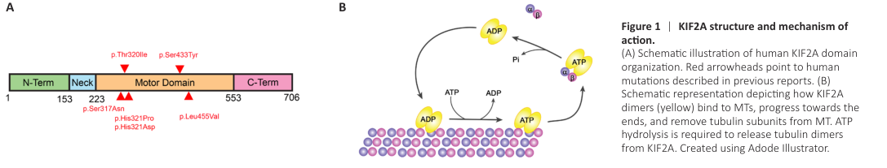

## Question

# Gene Research for Functional Annotation

## ⚠️ CRITICAL: Gene/Protein Identification Context

**BEFORE YOU BEGIN RESEARCH:** You MUST verify you are researching the CORRECT gene/protein. Gene symbols can be ambiguous, especially for less well-characterized genes from non-model organisms.

### Target Gene/Protein Identity (from UniProt):
- **UniProt Accession:** O00139
- **Protein Description:** RecName: Full=Kinesin-like protein KIF2A; AltName: Full=Kinesin-2; Short=hK2;
- **Gene Information:** Name=KIF2A; Synonyms=KIF2, KNS2;
- **Organism (full):** Homo sapiens (Human).
- **Protein Family:** Belongs to the TRAFAC class myosin-kinesin ATPase
- **Key Domains:** KIF2A-like_N. (IPR054473); Kinesin-like_fam. (IPR027640); Kinesin_motor_CS. (IPR019821); Kinesin_motor_dom. (IPR001752); Kinesin_motor_dom_sf. (IPR036961)

### MANDATORY VERIFICATION STEPS:

1. **Check if the gene symbol "KIF2A" matches the protein description above**
2. **Verify the organism is correct:** Homo sapiens (Human).
3. **Check if protein family/domains align with what you find in literature**
4. **If you find literature for a DIFFERENT gene with the same or similar symbol, STOP**

### If Gene Symbol is Ambiguous or You Cannot Find Relevant Literature:

**DO NOT PROCEED WITH RESEARCH ON A DIFFERENT GENE.** Instead:
- State clearly: "The gene symbol 'KIF2A' is ambiguous or literature is limited for this specific protein"
- Explain what you found (e.g., "Found extensive literature on a different gene with the same symbol in a different organism")
- Describe the protein based ONLY on the UniProt information provided above
- Suggest that the protein function can be inferred from domain/family information

### Research Target:

Please provide a comprehensive research report on the gene **KIF2A** (gene ID: KIF2A, UniProt: O00139) in human.

The research report should be a detailed narrative explaining the function, biological processes, and localization of the gene product. Citations should be given for all claims.

You should prioritize authoritative reviews and primary scientific literature when conducting research. You can supplement
this with annotations you find in gene/protein databases, but these can be outdated or inaccurate.

We are specifically interested in the primary function of the gene - for enzymes, what reaction is catalyzed, and what is the substrate specificity? For transporters, what is the substrate? For structural proteins or adapters, what is the broader structural role? For signaling molecules, what is the role in the pathway.

We are interested in where in or outside the cell the gene product carries out its function.

We are also interested in the signaling or biochemical pathways in which the gene functions. We are less interested in broad pleiotropic effects, except where these elucidate the precise role.

Include evidence where possible. We are interested in both experimental evidence as well as inference from structure, evolution, or bioinformatic analysis. Precise studies should be prioritized over high-throughput, where available.

## Output

Question: You are an expert researcher providing comprehensive, well-cited information.

Provide detailed information focusing on:
1. Key concepts and definitions with current understanding
2. Recent developments and latest research (prioritize 2023-2024 sources)
3. Current applications and real-world implementations
4. Expert opinions and analysis from authoritative sources
5. Relevant statistics and data from recent studies

Format as a comprehensive research report with proper citations. Include URLs and publication dates where available.
Always prioritize recent, authoritative sources and provide specific citations for all major claims.

# Gene Research for Functional Annotation

## ⚠️ CRITICAL: Gene/Protein Identification Context

**BEFORE YOU BEGIN RESEARCH:** You MUST verify you are researching the CORRECT gene/protein. Gene symbols can be ambiguous, especially for less well-characterized genes from non-model organisms.

### Target Gene/Protein Identity (from UniProt):
- **UniProt Accession:** O00139
- **Protein Description:** RecName: Full=Kinesin-like protein KIF2A; AltName: Full=Kinesin-2; Short=hK2;
- **Gene Information:** Name=KIF2A; Synonyms=KIF2, KNS2;
- **Organism (full):** Homo sapiens (Human).
- **Protein Family:** Belongs to the TRAFAC class myosin-kinesin ATPase
- **Key Domains:** KIF2A-like_N. (IPR054473); Kinesin-like_fam. (IPR027640); Kinesin_motor_CS. (IPR019821); Kinesin_motor_dom. (IPR001752); Kinesin_motor_dom_sf. (IPR036961)

### MANDATORY VERIFICATION STEPS:

1. **Check if the gene symbol "KIF2A" matches the protein description above**
2. **Verify the organism is correct:** Homo sapiens (Human).
3. **Check if protein family/domains align with what you find in literature**
4. **If you find literature for a DIFFERENT gene with the same or similar symbol, STOP**

### If Gene Symbol is Ambiguous or You Cannot Find Relevant Literature:

**DO NOT PROCEED WITH RESEARCH ON A DIFFERENT GENE.** Instead:
- State clearly: "The gene symbol 'KIF2A' is ambiguous or literature is limited for this specific protein"
- Explain what you found (e.g., "Found extensive literature on a different gene with the same symbol in a different organism")
- Describe the protein based ONLY on the UniProt information provided above
- Suggest that the protein function can be inferred from domain/family information

### Research Target:

Please provide a comprehensive research report on the gene **KIF2A** (gene ID: KIF2A, UniProt: O00139) in human.

The research report should be a detailed narrative explaining the function, biological processes, and localization of the gene product. Citations should be given for all claims.

You should prioritize authoritative reviews and primary scientific literature when conducting research. You can supplement
this with annotations you find in gene/protein databases, but these can be outdated or inaccurate.

We are specifically interested in the primary function of the gene - for enzymes, what reaction is catalyzed, and what is the substrate specificity? For transporters, what is the substrate? For structural proteins or adapters, what is the broader structural role? For signaling molecules, what is the role in the pathway.

We are interested in where in or outside the cell the gene product carries out its function.

We are also interested in the signaling or biochemical pathways in which the gene functions. We are less interested in broad pleiotropic effects, except where these elucidate the precise role.

Include evidence where possible. We are interested in both experimental evidence as well as inference from structure, evolution, or bioinformatic analysis. Precise studies should be prioritized over high-throughput, where available.

# Human KIF2A (UniProt O00139): functional annotation research report

## Identity and principal function

**The target is correctly identified.** Human **KIF2A**, also historically called **KIF2**, **KNS2**, or “kinesin-2/hK2,” is the protein represented by UniProt **O00139**; a structural study explicitly identifies its human KIF2A construct by that accession. Despite the historical name “kinesin-2,” its established classification is **kinesin-13**, alongside the distinct proteins KIF2B, KIF2C/MCAK, and KIF24—not the cargo-transporting kinesin-2 family. Its central kinesin ATPase/motor domain and adjacent kinesin-13-specific neck agree with the supplied motor-domain and KIF2A-like domain annotations. Different splice isoforms exist, so residue numbers and protein length should be checked against the isoform used in each experiment. (trofimova2018ternarycomplexof pages 1-2, ruizreig2024connectingneurodevelopmentto pages 1-1, manning2007thekinesin13proteins pages 1-2)

**Primary molecular function:** KIF2A is an intracellular, ATP-dependent **microtubule-end depolymerase**. Its immediate substrate is the **αβ-tubulin heterodimer within a microtubule protofilament**; its output is removal of tubulin subunits from polymer ends. The coupled ATPase reaction consumes ATP and yields ADP and inorganic phosphate, but ATP hydrolysis should not be conflated with a conventional kinesin transport step: ATP-bound KIF2A can promote microtubule disassembly, whereas hydrolysis facilitates turnover and release from dissociated tubulin. KIF2A is not established as a transporter of a particular vesicle or soluble cargo. Which microtubule end is physiologically targeted depends on the cellular setting: spindle-associated **minus ends** are particularly important in dividing cells, while **plus-end** regulation is documented in neurons. (trofimova2018ternarycomplexof pages 1-2, trofimova2018ternarycomplexof pages 2-4, ruizreig2024connectingneurodevelopmentto pages 1-1, ruizreig2022kif2adeficiencycauses pages 1-2, uehara2013auroraband pages 1-2)

Structural and biochemical experiments explain this specificity. A depolymerization-competent fragment of **human KIF2A** contains both its positively charged neck and motor domain; a fragment lacking most of the neck fails to depolymerize microtubules in vitro. A crystal structure captures one KIF2A molecule contacting **two longitudinally arranged, bent αβ-tubulin heterodimers**: the neck binds one, the motor core binds the other, and the conserved **KVD sequence in motor loop 2** inserts between them. This supports a mechanism in which KIF2A stabilizes curvature incompatible with the straight microtubule lattice, releasing terminal tubulin. It demonstrates recognition of polymerized tubulin architecture, not an enzyme that chemically modifies tubulin. The 2024 review’s cropped **Figure 1** illustrates the domain arrangement and end-disassembly model; the primary structure provides the stronger mechanistic evidence. (trofimova2018ternarycomplexof pages 1-2, trofimova2018ternarycomplexof pages 2-4, ruizreig2023connectingneurodevelopmentto media bfe59909)

The following comparison distinguishes direct biochemical activity from context-specific cellular outcomes.

| Location / cellular context | Immediate molecular action and regulation | Strongest experimental evidence | Limitations / species |
|---|---|---|---|
| Purified human KIF2A neck–motor construct | ATP-state-dependent engagement and bending of tandem αβ-tubulin heterodimers at microtubule ends; the neck contacts one dimer, the motor core contacts the other, and the loop-2 KVD motif inserts between them to promote depolymerization. | Crystal structure captured KIF2A bound to two bent tubulin heterodimers; deleting most of the neck abolished in-vitro depolymerization, establishing that the motor core alone is insufficient. (trofimova2018ternarycomplexof pages 1-2, ruizreig2024connectingneurodevelopmentto pages 1-1) | Uses a truncated human protein rather than full-length KIF2A in its native cellular environment; nucleotide-state intermediates do not by themselves define every step of the catalytic cycle. |
| Human mitotic spindle poles and anaphase central-spindle minus ends | Depolymerizes spindle-microtubule minus ends to regulate spindle dynamics, poleward flux, and central-spindle length. PLK1 phosphorylation increases KIF2A association/activity; Aurora A inhibits activity, while an Aurora B gradient spatially excludes KIF2A from the midzone and restricts it to distal central-spindle ends. | Human-cell proteomics, co-immunoprecipitation, kinase assays, inhibition/depletion, and imaging established antagonistic PLK1–Aurora A control; live-cell depletion experiments showed that KIF2A is required for central-spindle shortening and organization during anaphase. (uehara2013auroraband pages 1-2, jang2009plk1andaurora pages 1-2) | Mitotic phenotypes vary by cell type and depletion method, and other kinesin-13 proteins can compensate. Aurora B evidence primarily establishes spatial regulation rather than a complete catalytic mechanism. |
| Human hTERT-RPE1 mother centriole / ciliary basal body | Promotes axonemal microtubule loss and primary-cilium disassembly. PLK1 phosphorylation at T554 activates depolymerization after growth stimulation; APC/C-dependent ubiquitination limits KIF2A abundance in quiescence. TTBK2 phosphorylation at S137/S140 reduces microtubule binding, depolymerization, and basal-body accumulation, thereby favoring cilium elongation. | KIF2A-deficient RPE1 cells showed impaired ciliary disassembly; phosphoresistant, phosphomimetic, KVD, and microtubule-binding mutants linked PLK1–T554 activity to cilium loss. A 2025 study combined mass spectrometry, TIRF assays, phosphomutants, and human-cell imaging to establish inhibitory TTBK2 regulation. (miyamoto2015themicrotubuledepolymerizingactivity pages 1-3, vyslouzil2025tautubulinkinase2 pages 12-15) | Much of the evidence uses overexpression or engineered human cell lines. S137/S140 regulation was published in 2025, and the physiological importance of additional TTBK2-dependent sites remains unresolved. |
| Neuronal growth cones and postmitotic cortical interneurons | At neuronal microtubule ends, KIF2A regulates microtubule growth, neurite length, polarity, migration, and connectivity rather than transporting cargo directly. Conditional deletion slows interneuron migration, disrupts directionality and inhibitory-synapse organization, and increases seizure susceptibility. | Conditional mouse genetics and 2023 live imaging showed more stationary interneurons and reduced displacement and speed after Kif2a deletion; complementary conditional deletion demonstrated altered microtubule dynamics, axonal transport, connectivity, and neuronal survival. (ruizreig2023inhibitorysynapsedysfunction pages 4-6, ruizreig2022kif2adeficiencycauses pages 1-2) | These are principally mouse data, not direct experiments in human neurons. Developmental migration, synaptic maintenance, and later neurodegeneration are mechanistically intertwined, so no single phenotype proves the human disease pathway. |
| Mouse embryonic-stem-cell intercellular bridge during cytokinesis | In an unusual context, KIF2A associates tightly with bridge microtubules and appears to stabilize rather than depolymerize them; proposed mechanisms include reduced ATPase activity and preference for a compacted lattice. | Endogenous CRISPR-tagging and rapid-depletion experiments linked KIF2A to intercellular-bridge microtubule maintenance and prolonged cytokinesis in naïve mouse embryonic stem cells. (stockmann2025kif2astabilizesintercellular pages 2-2) | Published in 2025 and demonstrated in mouse embryonic stem cells. This context-dependent stabilizing activity should not be generalized to human KIF2A or treated as replacing its well-established depolymerase function. |

*Table: Comparison of KIF2A’s immediate molecular actions, regulation, and strongest evidence across purified systems, mitosis, cilia, neurons, and cytokinesis. Species and experimental limitations are explicit to prevent mouse or engineered-cell findings from being overgeneralized to human biology.*

## Where KIF2A acts and what it does there

**Mitotic spindle and central spindle.** In examined human cells KIF2A associates with **centrosomes, spindle poles, and spindle microtubules**; during anaphase its activity is also spatially organized at the **distal regions of the central spindle**, away from the Aurora B-rich midzone. Depolymerization of pole-associated or central-spindle **microtubule minus ends** helps set spindle-microtubule turnover, poleward flux, and the length and alignment of interchromosomal bundles needed for orderly cell division. In cultured human U2OS cells, a review reports that approximately **90%** of KIF2A-siRNA-treated cells developed monopolar spindles in the cited experimental setting; this is a **cell-line-specific result**, not a universal requirement for every mitosis. Another human-cell study found largely normal bipolar spindles after KIF2A loss in hTERT-RPE1 cells. Compensation by related kinesin-13 proteins and experimental context are plausible explanations, and mitotic phenotypes should not automatically be extrapolated to developing human brain tissue. (uehara2013auroraband pages 1-2, jang2009plk1andaurora pages 1-2, ruizreig2024connectingneurodevelopmentto pages 1-2, ruizreig2024connectingneurodevelopmentto pages 2-3, miyamoto2015themicrotubuledepolymerizingactivity pages 5-7)

**Mother centriole and primary cilium.** At the mother centriole/ciliary basal body, KIF2A can depolymerize microtubules and promote **primary-cilium disassembly during growth-stimulated cell-cycle re-entry**. KIF2A-deficient human hTERT-RPE1 cells showed impaired disassembly; mutations in its microtubule-binding or KVD depolymerization motifs prevented the usual cilium-suppressing effect despite centrosomal targeting. This is a **cilium-dynamics effector**, not established evidence that KIF2A directly transports intraflagellar cargo or directly transduces Hedgehog signals. A 2024 review places it among kinesins regulating cilia independently of the canonical intraflagellar-transport motors. (miyamoto2015themicrotubuledepolymerizingactivity pages 1-3, miyamoto2015themicrotubuledepolymerizingactivity pages 5-7, li2024regulationofciliary pages 3-5)

**Neurons.** KIF2A is present in developing and postmitotic neurons, including **neurites and axonal growth cones**, where local microtubule-end remodeling shapes axon/dendrite specification, process extension, collateral-branch restriction, axonal pruning, and migration. Mouse conditional-deletion experiments also show a continuing need for KIF2A in neuronal connectivity and survival: deficient neurons have altered microtubule dynamics and lysosomal axonal transport, but the transport defect is best interpreted as a consequence of an altered microtubule track rather than proof that KIF2A itself carries lysosomes. The 2022 conditional-knockout study found neuronal deterioration even when deletion occurred in mature neurons; it therefore challenges an explanation based solely on deficient embryonic neurogenesis. Human neuronal localization and disease mechanisms are supported partly by mouse models, not exclusively by direct experiments in human neurons. (ruizreig2022kif2adeficiencycauses pages 1-2, ruizreig2024connectingneurodevelopmentto pages 3-4, ruizreig2024connectingneurodevelopmentto pages 4-4)

## Regulatory pathways: KIF2A as a cytoskeletal effector

KIF2A is regulated by phosphorylation, localization and protein abundance; these inputs determine **where and when tubulin disassembly occurs**, rather than establishing KIF2A as a signaling kinase itself. In human-cell mitotic experiments, **PLK1 directly phosphorylates KIF2A and increases its microtubule association and depolymerizing activity**, whereas **Aurora A phosphorylation suppresses its activity**. During anaphase, an **Aurora B activity gradient** limits KIF2A distribution near the central-spindle midzone, allowing appropriately positioned minus-end disassembly and central-spindle organization. These findings concern distinct spatial and cell-cycle contexts; Aurora A and Aurora B should not be treated as interchangeable regulators. (jang2009plk1andaurora pages 1-2, uehara2013auroraband pages 1-2)

At the ciliary mother centriole, growth-stimulated **PLK1 phosphorylation at KIF2A T554** promotes microtubule depolymerization and cilium resorption. In quiescent cells, **APC/C-associated ubiquitination and proteasomal turnover** restrict KIF2A abundance. The PLK1–KIF2A pathway was implicated experimentally in defective ciliogenesis in cells from patients with premature-chromatid-separation syndrome; this does not establish an approved treatment or make that syndrome a KIF2A monogenic disorder. (miyamoto2015themicrotubuledepolymerizingactivity pages 1-3, miyamoto2015themicrotubuledepolymerizingactivity pages 5-7)

In neurons, kinase regulation links extracellular cues to local microtubule remodeling. In a primary phosphosite and functional study, **BDNF-associated PAK1/CDK5 phosphorylation reduced KIF2A depolymerizing activity and favored neurite growth**, whereas **lysophosphatidic-acid-associated ROCK2 phosphorylation enhanced activity and opposed neurite extension**. These are experimentally investigated signaling-to-cytoskeleton routes, not different enzymatic substrates of KIF2A. (ogawa2015microtubuledestabilizerkif2a pages 1-3, ruizreig2024connectingneurodevelopmentto pages 3-4)

## Recent developments, quantitative evidence, and clinical relevance

**2023: inhibitory-circuit mechanism.** A study published **17 January 2023** conditionally removed *Kif2a* from mouse forebrain GABAergic neurons. In embryonic live imaging, **59%** of mutant interneurons versus **21%** of controls met the authors’ stationary-cell criterion. Among moving cells, measured net displacement was **157.9 ± 13.4 μm versus 251 ± 16.4 μm**, and reported migration speed was **36.22 ± 2.9 versus 59.37 ± 3 μm** in mutant versus control cells; analyses involved cells from **three embryos per genotype**. At postnatal day 40, gephyrin-positive inhibitory-contact density was **35.9% lower at the axon initial segment** (*p* = 0.0009), while the overall reduction in somatosensory-cortex GAD67-positive-cell density did **not** reach statistical significance (*p* = 0.059). In a pentylenetetrazol challenge, **four of five** mutants developed tonic–clonic seizures and **one died**, whereas the **six** controls scored 0 or 1. Together, these data support defective migration, placement and inhibitory connectivity as a plausible route from KIF2A dysfunction to seizure susceptibility; they are small-sample **mouse** experiments, not a measured seizure penetrance in human carriers. (ruizreig2023inhibitorysynapsedysfunction pages 1-2, ruizreig2023inhibitorysynapsedysfunction pages 4-6, ruizreig2023inhibitorysynapsedysfunction pages 6-7, ruizreig2023inhibitorysynapsedysfunction pages 3-4)

**2023–2024 synthesis and human variants.** An authoritative KIF2A-focused review appeared online **31 May 2023** and in the **February 2024** issue of *Neural Regeneration Research*. Its clinical table describes **seven previously reported individuals** with KIF2A single-nucleotide variants; its text identifies **six reported de novo motor-domain missense mutations** among patients with cortical malformations. These are historical review counts, **not population prevalence estimates or necessarily an exhaustive 2026 variant catalogue**. Associated findings include microcephaly, lissencephaly/pachygyria, abnormal cortical lamination, developmental delay and early epilepsy. The reviewed **p.His321Asp** variant lies in the motor/nucleotide-binding region and reduced depolymerizing activity in experimental work. However, mouse loss-of-function and patient-variant models have produced different progenitor phenotypes, so impaired proliferation versus premature neuronal loss remains an unresolved explanation for individual cases of microcephaly. (ruizreig2024connectingneurodevelopmentto pages 1-1, ruizreig2024connectingneurodevelopmentto pages 4-4, ruizreig2024connectingneurodevelopmentto pages 2-3)

**2024 cilia research, with an important evidentiary limit.** A **December 2024** *PNAS* study mapped transcriptional and structural changes accompanying permanent cilium loss as mouse cerebellar granule cells matured and their Sonic-hedgehog responsiveness diminished. *Kif2a* appeared among surveyed cilium-resorption-related transcripts, but the cited evidence does **not** show that manipulating KIF2A caused permanent cilium loss in that system. It should therefore be described as contextual expression evidence, not a newly established KIF2A-dependent Hedgehog mechanism. (constable2024permanentcilialoss pages 2-3, constable2024permanentcilialoss pages 1-2)

**Subsequent mechanistic advances, clearly dated.** A **February 2025** human-cell study found that **TTBK2-induced phosphorylation of KIF2A S137 and S140** restrains microtubule binding and depolymerization, diminishes KIF2A accumulation at the mother centriole, and favors ciliary elongation; its phosphomimetic experiments and microscopy strengthen a model in which KIF2A activity must be **suppressed during cilium growth**, in contrast to its PLK1-stimulated role in cilium resorption. Separate work published **May 2025** found that KIF2A **stabilizes intercellular-bridge microtubules** during cytokinesis in **naïve mouse embryonic stem cells**. The investigators propose an ATPase- and lattice-dependent functional switch; this intriguing, context-specific mouse result does not overturn the demonstrated depolymerase activity of human KIF2A or establish the same switch in human tissues. (vyslouzil2025tautubulinkinase2 pages 1-2, vyslouzil2025tautubulinkinase2 pages 12-15, stockmann2025kif2astabilizesintercellular pages 2-2)

## Functional interpretation and practical application

The best-supported annotation is **“ATP-dependent αβ-tubulin microtubule-end depolymerase; kinesin-13 cytoskeletal regulator”**, localized primarily to relevant **intracellular microtubule ends**—mitotic spindle poles and distal central spindle, mother centriole/ciliary base, and neuronal processes—rather than extracellular space. Functional assessment of a human variant can therefore prioritize motor/neck integrity, ATPase and microtubule-depolymerization assays, tubulin binding, compartment-specific localization, cilium resorption, and neuronal microtubule and migration phenotypes. Clinical sequencing and variant interpretation for cortical malformations or developmental epilepsy are genuine applications of this evidence; the reviewed studies do **not** establish a KIF2A-specific approved drug or validated disease-modifying therapy. Distinguishing loss of protein, altered phosphorylation, and potentially dominant effects of motor-domain variants is essential before inferring a patient’s mechanism from a variant position alone. (trofimova2018ternarycomplexof pages 1-2, miyamoto2015themicrotubuledepolymerizingactivity pages 1-3, ruizreig2022kif2adeficiencycauses pages 1-2, ruizreig2024connectingneurodevelopmentto pages 4-4)

### Selected sources and publication dates

- Trofimova *et al.*, “Ternary complex of Kif2A-bound tandem tubulin heterodimers…,” *Nature Communications*, **July 2018**. https://doi.org/10.1038/s41467-018-05025-7. (trofimova2018ternarycomplexof pages 1-2)
- Ruiz-Reig, Hakanen and Tissir, “Connecting neurodevelopment to neurodegeneration…,” *Neural Regeneration Research*, **online 31 May 2023; February 2024 issue**. https://doi.org/10.4103/1673-5374.375298. (ruizreig2024connectingneurodevelopmentto pages 1-1)
- Ruiz-Reig *et al.*, “Inhibitory synapse dysfunction and epileptic susceptibility…,” *Frontiers in Molecular Neuroscience*, **17 January 2023**. https://doi.org/10.3389/fnmol.2022.1110986. (ruizreig2023inhibitorysynapsedysfunction pages 1-2)
- Miyamoto *et al.*, “The Microtubule-Depolymerizing Activity… Drives Primary Cilia Disassembly,” *Cell Reports*, **10 February 2015**. https://doi.org/10.1016/j.celrep.2015.01.003. (miyamoto2015themicrotubuledepolymerizingactivity pages 1-3)
- Uehara *et al.*, “Aurora B and Kif2A control microtubule length…,” *Journal of Cell Biology*, **August 2013**. https://doi.org/10.1083/jcb.201302123. (uehara2013auroraband pages 1-2)
- Ogawa and Hirokawa, “Microtubule Destabilizer KIF2A Undergoes Distinct Site-Specific Phosphorylation…,” *Cell Reports*, **22 September 2015**. https://doi.org/10.1016/j.celrep.2015.08.018. (ogawa2015microtubuledestabilizerkif2a pages 1-3)
- Vysloužil *et al.*, “Tau-tubulin kinase 2 restrains microtubule-depolymerizer KIF2A…,” *Cell Communication and Signaling*, **February 2025**. https://doi.org/10.1186/s12964-025-02072-8. (vyslouzil2025tautubulinkinase2 pages 1-2, vyslouzil2025tautubulinkinase2 pages 12-15)
- Stockmann *et al.*, “KIF2A stabilizes intercellular bridge microtubules…,” *Journal of Cell Biology*, **May 2025**. https://doi.org/10.1083/jcb.202409157. (stockmann2025kif2astabilizesintercellular pages 2-2)

References

1. (trofimova2018ternarycomplexof pages 1-2): Daria Trofimova, Mohammadjavad Paydar, Anthony Zara, Lama Talje, Benjamin H. Kwok, and John S. Allingham. Ternary complex of kif2a-bound tandem tubulin heterodimers represents a kinesin-13-mediated microtubule depolymerization reaction intermediate. Nature Communications, Jul 2018. URL: https://doi.org/10.1038/s41467-018-05025-7, doi:10.1038/s41467-018-05025-7. This article has 71 citations and is from a highest quality peer-reviewed journal.

2. (ruizreig2024connectingneurodevelopmentto pages 1-1): Nuria Ruiz-Reig, Janne Hakanen, and Fadel Tissir. Connecting neurodevelopment to neurodegeneration: a spotlight on the role of kinesin superfamily protein 2a (kif2a). Neural Regeneration Research, 19:375-379, May 2023. URL: https://doi.org/10.4103/1673-5374.375298, doi:10.4103/1673-5374.375298. This article has 16 citations and is from a peer-reviewed journal.

3. (manning2007thekinesin13proteins pages 1-2): Amity L. Manning, Neil J. Ganem, Samuel F. Bakhoum, Michael Wagenbach, Linda Wordeman, and Duane A. Compton. The kinesin-13 proteins kif2a, kif2b, and kif2c/mcak have distinct roles during mitosis in human cells. Molecular biology of the cell, 18 8:2970-9, Aug 2007. URL: https://doi.org/10.1091/mbc.e07-02-0110, doi:10.1091/mbc.e07-02-0110. This article has 297 citations and is from a domain leading peer-reviewed journal.

4. (trofimova2018ternarycomplexof pages 2-4): Daria Trofimova, Mohammadjavad Paydar, Anthony Zara, Lama Talje, Benjamin H. Kwok, and John S. Allingham. Ternary complex of kif2a-bound tandem tubulin heterodimers represents a kinesin-13-mediated microtubule depolymerization reaction intermediate. Nature Communications, Jul 2018. URL: https://doi.org/10.1038/s41467-018-05025-7, doi:10.1038/s41467-018-05025-7. This article has 71 citations and is from a highest quality peer-reviewed journal.

5. (ruizreig2022kif2adeficiencycauses pages 1-2): Nuria Ruiz-Reig, Georges Chehade, Janne Hakanen, Mohamed Aittaleb, Keimpe Wierda, Joris De Wit, Laurent Nguyen, Philippe Gailly, and Fadel Tissir. Kif2a deficiency causes early-onset neurodegeneration. Proceedings of the National Academy of Sciences of the United States of America, Nov 2022. URL: https://doi.org/10.1073/pnas.2209714119, doi:10.1073/pnas.2209714119. This article has 30 citations and is from a highest quality peer-reviewed journal.

6. (uehara2013auroraband pages 1-2): Ryota Uehara, Yuki Tsukada, Tomoko Kamasaki, Ina Poser, Kinya Yoda, Daniel W. Gerlich, and Gohta Goshima. Aurora b and kif2a control microtubule length for assembly of a functional central spindle during anaphase. The Journal of Cell Biology, 202:623-636, Aug 2013. URL: https://doi.org/10.1083/jcb.201302123, doi:10.1083/jcb.201302123. This article has 115 citations.

7. (ruizreig2023connectingneurodevelopmentto media bfe59909): Nuria Ruiz-Reig, Janne Hakanen, and Fadel Tissir. Connecting neurodevelopment to neurodegeneration: a spotlight on the role of kinesin superfamily protein 2a (kif2a). Neural Regeneration Research, 19:375-379, May 2023. URL: https://doi.org/10.4103/1673-5374.375298, doi:10.4103/1673-5374.375298. This article has 16 citations and is from a peer-reviewed journal.

8. (jang2009plk1andaurora pages 1-2): Chang-Young Jang, Judith A. Coppinger, Akiko Seki, John R. Yates, and Guowei Fang. Plk1 and aurora a regulate the depolymerase activity and the cellular localization of kif2a. Journal of Cell Science, 122:1334-1341, May 2009. URL: https://doi.org/10.1242/jcs.044321, doi:10.1242/jcs.044321. This article has 128 citations and is from a domain leading peer-reviewed journal.

9. (miyamoto2015themicrotubuledepolymerizingactivity pages 1-3): Tatsuo Miyamoto, Kosuke Hosoba, Hiroshi Ochiai, Ekaterina Royba, Hideki Izumi, Tetsushi Sakuma, Takashi Yamamoto, Brian David Dynlacht, and Shinya Matsuura. The microtubule-depolymerizing activity of a mitotic kinesin protein kif2a drives primary cilia disassembly coupled with cell proliferation. Cell reports, 10:664-673, Feb 2015. URL: https://doi.org/10.1016/j.celrep.2015.01.003, doi:10.1016/j.celrep.2015.01.003. This article has 205 citations and is from a highest quality peer-reviewed journal.

10. (vyslouzil2025tautubulinkinase2 pages 12-15): David Benk Vysloužil, Ondřej Bernatík, Eva Lánská, Tereza Renzová, Lucia Binó, Andrea Lacigová, Tereza Drahošová, Zdeněk Lánský, and Lukáš Čajánek. Tau-tubulin kinase 2 restrains microtubule-depolymerizer kif2a to support primary cilia growth. Cell Communication and Signaling, Feb 2025. URL: https://doi.org/10.1186/s12964-025-02072-8, doi:10.1186/s12964-025-02072-8. This article has 14 citations and is from a peer-reviewed journal.

11. (ruizreig2023inhibitorysynapsedysfunction pages 4-6): Nuria Ruiz-Reig, Dario García-Sánchez, Olivier Schakman, Philippe Gailly, and Fadel Tissir. Inhibitory synapse dysfunction and epileptic susceptibility associated with kif2a deletion in cortical interneurons. Frontiers in Molecular Neuroscience, Jan 2023. URL: https://doi.org/10.3389/fnmol.2022.1110986, doi:10.3389/fnmol.2022.1110986. This article has 8 citations.

12. (stockmann2025kif2astabilizesintercellular pages 2-2): Lieke Stockmann, Hélène Kabbech, Gert-Jan Kremers, Brent van Herk, Bas Dille, Mirjam van den Hout, Wilfred F.J. van IJcken, Dick H.W. Dekkers, Jeroen A.A. Demmers, Ihor Smal, Danny Huylebroeck, Sreya Basu, and Niels Galjart. Kif2a stabilizes intercellular bridge microtubules to maintain mouse embryonic stem cell cytokinesis. The Journal of cell biology, May 2025. URL: https://doi.org/10.1083/jcb.202409157, doi:10.1083/jcb.202409157. This article has 8 citations.

13. (ruizreig2024connectingneurodevelopmentto pages 1-2): Nuria Ruiz-Reig, Janne Hakanen, and Fadel Tissir. Connecting neurodevelopment to neurodegeneration: a spotlight on the role of kinesin superfamily protein 2a (kif2a). Neural Regeneration Research, 19:375-379, May 2023. URL: https://doi.org/10.4103/1673-5374.375298, doi:10.4103/1673-5374.375298. This article has 16 citations and is from a peer-reviewed journal.

14. (ruizreig2024connectingneurodevelopmentto pages 2-3): Nuria Ruiz-Reig, Janne Hakanen, and Fadel Tissir. Connecting neurodevelopment to neurodegeneration: a spotlight on the role of kinesin superfamily protein 2a (kif2a). Neural Regeneration Research, 19:375-379, May 2023. URL: https://doi.org/10.4103/1673-5374.375298, doi:10.4103/1673-5374.375298. This article has 16 citations and is from a peer-reviewed journal.

15. (miyamoto2015themicrotubuledepolymerizingactivity pages 5-7): Tatsuo Miyamoto, Kosuke Hosoba, Hiroshi Ochiai, Ekaterina Royba, Hideki Izumi, Tetsushi Sakuma, Takashi Yamamoto, Brian David Dynlacht, and Shinya Matsuura. The microtubule-depolymerizing activity of a mitotic kinesin protein kif2a drives primary cilia disassembly coupled with cell proliferation. Cell reports, 10:664-673, Feb 2015. URL: https://doi.org/10.1016/j.celrep.2015.01.003, doi:10.1016/j.celrep.2015.01.003. This article has 205 citations and is from a highest quality peer-reviewed journal.

16. (li2024regulationofciliary pages 3-5): Lin Li and Jie Ran. Regulation of ciliary homeostasis by intraflagellar transport-independent kinesins. Cell Death &amp; Disease, Jan 2024. URL: https://doi.org/10.1038/s41419-024-06428-9, doi:10.1038/s41419-024-06428-9. This article has 27 citations and is from a peer-reviewed journal.

17. (ruizreig2024connectingneurodevelopmentto pages 3-4): Nuria Ruiz-Reig, Janne Hakanen, and Fadel Tissir. Connecting neurodevelopment to neurodegeneration: a spotlight on the role of kinesin superfamily protein 2a (kif2a). Neural Regeneration Research, 19:375-379, May 2023. URL: https://doi.org/10.4103/1673-5374.375298, doi:10.4103/1673-5374.375298. This article has 16 citations and is from a peer-reviewed journal.

18. (ruizreig2024connectingneurodevelopmentto pages 4-4): Nuria Ruiz-Reig, Janne Hakanen, and Fadel Tissir. Connecting neurodevelopment to neurodegeneration: a spotlight on the role of kinesin superfamily protein 2a (kif2a). Neural Regeneration Research, 19:375-379, May 2023. URL: https://doi.org/10.4103/1673-5374.375298, doi:10.4103/1673-5374.375298. This article has 16 citations and is from a peer-reviewed journal.

19. (ogawa2015microtubuledestabilizerkif2a pages 1-3): Tadayuki Ogawa and Nobutaka Hirokawa. Microtubule destabilizer kif2a undergoes distinct site-specific phosphorylation cascades that differentially affect neuronal morphogenesis. Cell reports, 12 11:1774-88, Sep 2015. URL: https://doi.org/10.1016/j.celrep.2015.08.018, doi:10.1016/j.celrep.2015.08.018. This article has 50 citations and is from a highest quality peer-reviewed journal.

20. (ruizreig2023inhibitorysynapsedysfunction pages 1-2): Nuria Ruiz-Reig, Dario García-Sánchez, Olivier Schakman, Philippe Gailly, and Fadel Tissir. Inhibitory synapse dysfunction and epileptic susceptibility associated with kif2a deletion in cortical interneurons. Frontiers in Molecular Neuroscience, Jan 2023. URL: https://doi.org/10.3389/fnmol.2022.1110986, doi:10.3389/fnmol.2022.1110986. This article has 8 citations.

21. (ruizreig2023inhibitorysynapsedysfunction pages 6-7): Nuria Ruiz-Reig, Dario García-Sánchez, Olivier Schakman, Philippe Gailly, and Fadel Tissir. Inhibitory synapse dysfunction and epileptic susceptibility associated with kif2a deletion in cortical interneurons. Frontiers in Molecular Neuroscience, Jan 2023. URL: https://doi.org/10.3389/fnmol.2022.1110986, doi:10.3389/fnmol.2022.1110986. This article has 8 citations.

22. (ruizreig2023inhibitorysynapsedysfunction pages 3-4): Nuria Ruiz-Reig, Dario García-Sánchez, Olivier Schakman, Philippe Gailly, and Fadel Tissir. Inhibitory synapse dysfunction and epileptic susceptibility associated with kif2a deletion in cortical interneurons. Frontiers in Molecular Neuroscience, Jan 2023. URL: https://doi.org/10.3389/fnmol.2022.1110986, doi:10.3389/fnmol.2022.1110986. This article has 8 citations.

23. (constable2024permanentcilialoss pages 2-3): Sandii Constable, Carolyn M. Ott, Andrew L. Lemire, Kevin White, Yu Xun, Amin Lim, Jennifer Lippincott-Schwartz, and Saikat Mukhopadhyay. Permanent cilia loss during cerebellar granule cell neurogenesis involves withdrawal of cilia maintenance and centriole capping. Proceedings of the National Academy of Sciences of the United States of America, Dec 2024. URL: https://doi.org/10.1073/pnas.2408083121, doi:10.1073/pnas.2408083121. This article has 13 citations and is from a highest quality peer-reviewed journal.

24. (constable2024permanentcilialoss pages 1-2): Sandii Constable, Carolyn M. Ott, Andrew L. Lemire, Kevin White, Yu Xun, Amin Lim, Jennifer Lippincott-Schwartz, and Saikat Mukhopadhyay. Permanent cilia loss during cerebellar granule cell neurogenesis involves withdrawal of cilia maintenance and centriole capping. Proceedings of the National Academy of Sciences of the United States of America, Dec 2024. URL: https://doi.org/10.1073/pnas.2408083121, doi:10.1073/pnas.2408083121. This article has 13 citations and is from a highest quality peer-reviewed journal.

25. (vyslouzil2025tautubulinkinase2 pages 1-2): David Benk Vysloužil, Ondřej Bernatík, Eva Lánská, Tereza Renzová, Lucia Binó, Andrea Lacigová, Tereza Drahošová, Zdeněk Lánský, and Lukáš Čajánek. Tau-tubulin kinase 2 restrains microtubule-depolymerizer kif2a to support primary cilia growth. Cell Communication and Signaling, Feb 2025. URL: https://doi.org/10.1186/s12964-025-02072-8, doi:10.1186/s12964-025-02072-8. This article has 14 citations and is from a peer-reviewed journal.

## Artifacts

- [Edison artifact artifact-00](KIF2A-deep-research-falcon_artifacts/artifact-00.md)

## Citations

1. trofimova2018ternarycomplexof pages 1-2
2. ruizreig2024connectingneurodevelopmentto pages 1-1
3. ruizreig2023inhibitorysynapsedysfunction pages 1-2
4. miyamoto2015themicrotubuledepolymerizingactivity pages 1-3
5. uehara2013auroraband pages 1-2
6. trofimova2018ternarycomplexof pages 2-4
7. ruizreig2023inhibitorysynapsedysfunction pages 4-6
8. ruizreig2024connectingneurodevelopmentto pages 1-2
9. ruizreig2024connectingneurodevelopmentto pages 2-3
10. miyamoto2015themicrotubuledepolymerizingactivity pages 5-7
11. li2024regulationofciliary pages 3-5
12. ruizreig2024connectingneurodevelopmentto pages 3-4
13. ruizreig2024connectingneurodevelopmentto pages 4-4
14. ruizreig2023inhibitorysynapsedysfunction pages 6-7
15. ruizreig2023inhibitorysynapsedysfunction pages 3-4
16. constable2024permanentcilialoss pages 2-3
17. constable2024permanentcilialoss pages 1-2
18. https://doi.org/10.1038/s41467-018-05025-7.
19. https://doi.org/10.4103/1673-5374.375298.
20. https://doi.org/10.3389/fnmol.2022.1110986.
21. https://doi.org/10.1016/j.celrep.2015.01.003.
22. https://doi.org/10.1083/jcb.201302123.
23. https://doi.org/10.1016/j.celrep.2015.08.018.
24. https://doi.org/10.1186/s12964-025-02072-8.
25. https://doi.org/10.1083/jcb.202409157.
26. https://doi.org/10.1038/s41467-018-05025-7,
27. https://doi.org/10.4103/1673-5374.375298,
28. https://doi.org/10.1091/mbc.e07-02-0110,
29. https://doi.org/10.1073/pnas.2209714119,
30. https://doi.org/10.1083/jcb.201302123,
31. https://doi.org/10.1242/jcs.044321,
32. https://doi.org/10.1016/j.celrep.2015.01.003,
33. https://doi.org/10.1186/s12964-025-02072-8,
34. https://doi.org/10.3389/fnmol.2022.1110986,
35. https://doi.org/10.1083/jcb.202409157,
36. https://doi.org/10.1038/s41419-024-06428-9,
37. https://doi.org/10.1016/j.celrep.2015.08.018,
38. https://doi.org/10.1073/pnas.2408083121,