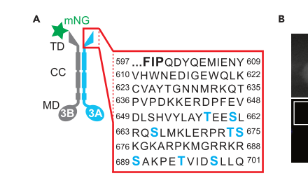

## Question

# Gene Research for Functional Annotation

## ⚠️ CRITICAL: Gene/Protein Identification Context

**BEFORE YOU BEGIN RESEARCH:** You MUST verify you are researching the CORRECT gene/protein. Gene symbols can be ambiguous, especially for less well-characterized genes from non-model organisms.

### Target Gene/Protein Identity (from UniProt):
- **UniProt Accession:** Q9Y496
- **Protein Description:** RecName: Full=Kinesin-like protein KIF3A; EC=3.6.4.- {ECO:0000250|UniProtKB:P56536}; AltName: Full=Microtubule plus end-directed kinesin motor 3A;
- **Gene Information:** Name=KIF3A; Synonyms=KIF3;
- **Organism (full):** Homo sapiens (Human).
- **Protein Family:** Belongs to the TRAFAC class myosin-kinesin ATPase
- **Key Domains:** Kinesin-like_fam. (IPR027640); Kinesin_motor_CS. (IPR019821); Kinesin_motor_dom. (IPR001752); Kinesin_motor_dom_sf. (IPR036961); P-loop_NTPase. (IPR027417)

### MANDATORY VERIFICATION STEPS:

1. **Check if the gene symbol "KIF3A" matches the protein description above**
2. **Verify the organism is correct:** Homo sapiens (Human).
3. **Check if protein family/domains align with what you find in literature**
4. **If you find literature for a DIFFERENT gene with the same or similar symbol, STOP**

### If Gene Symbol is Ambiguous or You Cannot Find Relevant Literature:

**DO NOT PROCEED WITH RESEARCH ON A DIFFERENT GENE.** Instead:
- State clearly: "The gene symbol 'KIF3A' is ambiguous or literature is limited for this specific protein"
- Explain what you found (e.g., "Found extensive literature on a different gene with the same symbol in a different organism")
- Describe the protein based ONLY on the UniProt information provided above
- Suggest that the protein function can be inferred from domain/family information

### Research Target:

Please provide a comprehensive research report on the gene **KIF3A** (gene ID: KIF3A, UniProt: Q9Y496) in human.

The research report should be a detailed narrative explaining the function, biological processes, and localization of the gene product. Citations should be given for all claims.

You should prioritize authoritative reviews and primary scientific literature when conducting research. You can supplement
this with annotations you find in gene/protein databases, but these can be outdated or inaccurate.

We are specifically interested in the primary function of the gene - for enzymes, what reaction is catalyzed, and what is the substrate specificity? For transporters, what is the substrate? For structural proteins or adapters, what is the broader structural role? For signaling molecules, what is the role in the pathway.

We are interested in where in or outside the cell the gene product carries out its function.

We are also interested in the signaling or biochemical pathways in which the gene functions. We are less interested in broad pleiotropic effects, except where these elucidate the precise role.

Include evidence where possible. We are interested in both experimental evidence as well as inference from structure, evolution, or bioinformatic analysis. Precise studies should be prioritized over high-throughput, where available.

## Output

Question: You are an expert researcher providing comprehensive, well-cited information.

Provide detailed information focusing on:
1. Key concepts and definitions with current understanding
2. Recent developments and latest research (prioritize 2023-2024 sources)
3. Current applications and real-world implementations
4. Expert opinions and analysis from authoritative sources
5. Relevant statistics and data from recent studies

Format as a comprehensive research report with proper citations. Include URLs and publication dates where available.
Always prioritize recent, authoritative sources and provide specific citations for all major claims.

# Gene Research for Functional Annotation

## ⚠️ CRITICAL: Gene/Protein Identification Context

**BEFORE YOU BEGIN RESEARCH:** You MUST verify you are researching the CORRECT gene/protein. Gene symbols can be ambiguous, especially for less well-characterized genes from non-model organisms.

### Target Gene/Protein Identity (from UniProt):
- **UniProt Accession:** Q9Y496
- **Protein Description:** RecName: Full=Kinesin-like protein KIF3A; EC=3.6.4.- {ECO:0000250|UniProtKB:P56536}; AltName: Full=Microtubule plus end-directed kinesin motor 3A;
- **Gene Information:** Name=KIF3A; Synonyms=KIF3;
- **Organism (full):** Homo sapiens (Human).
- **Protein Family:** Belongs to the TRAFAC class myosin-kinesin ATPase
- **Key Domains:** Kinesin-like_fam. (IPR027640); Kinesin_motor_CS. (IPR019821); Kinesin_motor_dom. (IPR001752); Kinesin_motor_dom_sf. (IPR036961); P-loop_NTPase. (IPR027417)

### MANDATORY VERIFICATION STEPS:

1. **Check if the gene symbol "KIF3A" matches the protein description above**
2. **Verify the organism is correct:** Homo sapiens (Human).
3. **Check if protein family/domains align with what you find in literature**
4. **If you find literature for a DIFFERENT gene with the same or similar symbol, STOP**

### If Gene Symbol is Ambiguous or You Cannot Find Relevant Literature:

**DO NOT PROCEED WITH RESEARCH ON A DIFFERENT GENE.** Instead:
- State clearly: "The gene symbol 'KIF3A' is ambiguous or literature is limited for this specific protein"
- Explain what you found (e.g., "Found extensive literature on a different gene with the same symbol in a different organism")
- Describe the protein based ONLY on the UniProt information provided above
- Suggest that the protein function can be inferred from domain/family information

### Research Target:

Please provide a comprehensive research report on the gene **KIF3A** (gene ID: KIF3A, UniProt: Q9Y496) in human.

The research report should be a detailed narrative explaining the function, biological processes, and localization of the gene product. Citations should be given for all claims.

You should prioritize authoritative reviews and primary scientific literature when conducting research. You can supplement
this with annotations you find in gene/protein databases, but these can be outdated or inaccurate.

We are specifically interested in the primary function of the gene - for enzymes, what reaction is catalyzed, and what is the substrate specificity? For transporters, what is the substrate? For structural proteins or adapters, what is the broader structural role? For signaling molecules, what is the role in the pathway.

We are interested in where in or outside the cell the gene product carries out its function.

We are also interested in the signaling or biochemical pathways in which the gene functions. We are less interested in broad pleiotropic effects, except where these elucidate the precise role.

Include evidence where possible. We are interested in both experimental evidence as well as inference from structure, evolution, or bioinformatic analysis. Precise studies should be prioritized over high-throughput, where available.

# Human KIF3A (UniProt Q9Y496): functional annotation research report

## Identity and principal function

**Identity check.** The supplied UniProt record identifies Q9Y496 as *Homo sapiens* **KIF3A**, also called KIF3. The literature independently identifies KIF3A as a kinesin-2 motor subunit, consistent with the supplied kinesin-motor, P-loop NTPase and TRAFAC-family annotations. KIF3A is **not** KIF3B, KIF3C or KIF17: KIF3B and KIF3C can be alternative KIF3A motor partners, whereas KIF17 is a distinct kinesin-2 protein. The exact Q9Y496 accession and InterPro identifiers are taken from the supplied UniProt information rather than independently verified by the retrieved papers. (webb2025regulationofkinesin2 pages 1-2, garbouchian2022kapisthe pages 1-2, webb2024betahairpinmechanismof pages 1-3, funabashi2017ciliaryentryof pages 1-4)

**Primary biochemical activity.** KIF3A is an ATP-dependent, microtubule **plus-end-directed motor**, not a membrane transporter or a static axonemal scaffold. Its N-terminal kinesin motor domain binds microtubules and hydrolyses ATP—**ATP + H₂O → ADP + inorganic phosphate**—coupling the reaction to movement. Thus, ATP is its chemical substrate; cargo specificity is established largely by the assembled motor, its nonmotor adaptor and associated trafficking machinery, rather than by a single small-molecule substrate-binding site on KIF3A. The protein’s coiled-coil regions support association with another motor chain, and its C-terminal region participates in regulation and adaptor interactions. The supplied incomplete EC assignment, 3.6.4.-, should not be mistaken for an experimentally determined catalytic rate or an exact substrate-specificity measurement for isolated Q9Y496. (webb2025regulationofkinesin2 pages 1-2, webb2025regulationofkinesin2 pages 3-4, garbouchian2022kapisthe pages 1-2, webb2024betahairpinmechanismof pages 1-3)

The best-established physiological assembly is **KIF3A–KIF3B–KAP3/KIFAP3**, the heterotrimeric kinesin-2, or kinesin-II, complex. KIF3A and KIF3B supply motor domains; KAP3 is a nonmotor accessory/adaptor protein. This complex drives **anterograde intraflagellar transport (IFT)**: it moves IFT assemblies along ciliary axonemal microtubules from the basal body/ciliary base toward the tip. At the tip, trains are reorganized for return by **dynein-2**, not by KIF3A. A KIF3A–KIF3C–KAP3 assembly also exists, notably in neuronal transport, but KIF3C does not substitute for KIF3B in the tested mammalian ciliogenesis system. (morthorst2018regulationofciliary pages 6-8, engelke2019acuteinhibitionof pages 1-3, garbouchian2022kapisthe pages 1-2, fasawe2024kif3ataildomain pages 1-3)

## Cellular location, transported material and pathways

**Where it acts.** KIF3A functions on intracellular microtubules, prominently at the **base and within the shaft of primary cilia**, where kinesin-II accompanies IFT trains toward the tip. It also participates in transport on **cytoplasmic microtubules**, including organelle-associated movement in cultured neurons. Although the cilium projects outside the cell, the motor works on its intracellular axoneme; KIF3A is not an extracellular secreted protein. Immunofluorescence/live imaging in the acute-inhibition experiment detected engineered KIF3A motor in the ciliary shaft and at its base, while neuronal experiments found KIF3A-containing complexes associated with moving organelle populations in axons and dendrites. (engelke2019acuteinhibitionof pages 5-6, garbouchian2022kapisthe pages 1-2, hilgendorf2024emergingmechanisticunderstanding pages 3-4)

**Closest demonstrated ciliary cargo.** IFT trains containing the **IFT-B complex** are the most securely assigned transport assembly. In human HEK293T interaction experiments, expressed KIF3A–KIF3B–KAP3 co-immunoprecipitated with the IFT-B *connecting tetramer* **IFT38–IFT52–IFT57–IFT88**. Experiments in human hTERT-RPE1 cells showed that loss of IFT52 disrupted basal-body IFT88 localization and ciliogenesis, with rescue by wild-type IFT52. These findings support docking of the **heterotrimer** to IFT-B; they do **not** identify a direct contact between isolated KIF3A and each tetramer subunit, or prove that every receptor moved by IFT binds KIF3A itself. IFT trains in turn provide a route for ciliary structural and signalling components, making KIF3A principally an **IFT motor**, not a receptor-specific carrier. (ishida2022molecularbasisunderlying pages 3-5, ishida2022molecularbasisunderlying pages 1-2)

**Functional consequences.** Continuous anterograde IFT supplies material needed to build and maintain the ciliary axoneme. In Kif3a/Kif3b-deficient **mouse NIH 3T3** fibroblasts, co-expression of functional motor subunits restored cilia; acute inhibition of an engineered rescued motor stopped visible IFT within approximately **2 minutes**. Ciliated cells fell from **83% in the vehicle condition to 2% after 8 hours** of inhibition, and labelled IFT trains moved at approximately **0.7 μm/s** before inhibition. These are cell-system measurements, **not** a rate constant or disease statistic for human KIF3A. Neither KIF3A–KIF3C nor KIF17 restored cilia in that experiment. (engelke2019acuteinhibitionof pages 3-4, engelke2019acuteinhibitionof pages 5-6, engelke2019acuteinhibitionof pages 1-3)

**Signalling relationship.** KIF3A supports **cilium-dependent Hedgehog signalling indirectly through cilium assembly and IFT**, rather than acting as a Hedgehog ligand, receptor or GLI transcription factor. In the NIH 3T3 rescue system, functional engineered kinesin-II restored responsiveness to the Smoothened agonist SAG; acute motor inhibition diminished that response. This establishes a requirement for working kinesin-II in this assay, but it does not by itself demonstrate that Smoothened or GLI physically binds KIF3A as a direct cargo. More generally, the 2023–2024 expert reviews describe the primary cilium as a gated, compositionally specialized signalling compartment; differences in transition-zone access, ciliary composition and cell type complicate simple one-motor/one-receptor interpretations. (engelke2019acuteinhibitionof pages 5-6, hilgendorf2024emergingmechanisticunderstanding pages 3-4, mill2023primaryciliaas pages 3-4, mill2023primaryciliaas pages 1-3)

**Beyond cilia.** KAP-associated KIF3A–KIF3B and KIF3A–KIF3C were observed on overlapping organelle populations in **cultured hippocampal neurons**, with transport in axons and dendrites; approximately **12%** of KIF3-positive organelles contained the RNA-binding protein **APC**. The retrieved report does not establish that those neurons were human, or that all APC-positive organelles are directly transported by KIF3A. Separately, Kif3a depletion in **canine MDCK** epithelial cells disturbed peripheral microtubule organization, cell migration and lumen formation. These are supported extraciliary contexts, but the ciliary IFT role remains the clearest primary functional annotation for human KIF3A. (garbouchian2022kapisthe pages 1-2, boehlke2013kif3aguidesmicrotubular pages 1-2)

## Recent mechanistic developments and strength of evidence

A **March 2024** mouse-fibroblast rescue study challenged a proposed requirement for phosphorylation of eight KIF3A tail serine/threonine residues: the combined **8xA** alanine mutant restored ciliogenesis and cilium length similarly to wild type. Certain more extensive substitutions impaired ciliogenesis, but results could depend on the position of a tag on partner KIF3B; additional controls indicated that some affected tail residues matter without establishing phosphorylation as their regulatory mechanism. The warranted conclusion is **not** that KIF3A can never be regulated by phosphorylation, but that phosphorylation of the originally tested eight tail sites is **not required in that mouse-cell rescue assay**. The retrieved cropped domain schematic and rescue graphs provide visual corroboration. [Study: Fasawe *et al.*, *iScience*, 15 March 2024, https://doi.org/10.1016/j.isci.2024.109149.] (fasawe2024kif3ataildomain pages 3-4, fasawe2024kif3ataildomain media 10813f30, fasawe2024kif3ataildomain media 4bfb2500, fasawe2024kif3ataildomain pages 5-7)

Subsequent purified-**human-protein** work supplied a structural explanation for motor regulation: a conserved C-terminal **β-hairpin** and nearby coiled coil help keep motor domains away from microtubules, producing autoinhibition. KAP3 provides a platform for cargo-adaptor engagement rather than necessarily switching motility on by itself; APC exemplifies one adaptor-mediated activation mechanism. In a multimeric microtubule-gliding assay, surface-attached full-length human KIF3A–KIF3B moved microtubules at **444 ± 26 nm/s**. This is an *in-vitro gliding velocity*, distinct from IFT-train speed inside cilia. The findings were presented as a **2024 bioRxiv preprint** and subsequently in a **2025 peer-reviewed study**; the proposed use of the same activation mechanism by every ciliary cargo adaptor remains an inference. [Webb *et al.*, preprint posted 15 October 2024, https://doi.org/10.1101/2024.10.14.618219; peer-reviewed article, *Nature Structural & Molecular Biology*, 2025, https://doi.org/10.1038/s41594-025-01630-5.] (webb2025regulationofkinesin2 pages 3-4, webb2025regulationofkinesin2 pages 1-2, webb2024betahairpinmechanismof pages 1-3, webb2024betahairpinmechanismof pages 11-14)

The following table keeps **human-protein evidence**, **human-cell interaction experiments**, **mouse functional perturbations**, and **KIF3B-partner variants** separate.

| System / date | Perturbation or assay | Direct mechanistic finding | Inference limitations |
|---|---|---|---|
| Human HEK293T and hTERT-RPE1 cells, 2022 | Co-expression/co-immunoprecipitation of kinesin-II and the IFT-B connecting tetramer; CRISPR IFT52 knockout and rescue ([DOI](https://doi.org/10.1091/mbc.e22-05-0188)) | KIF3A–KIF3B–KAP3 associated with IFT38–IFT52–IFT57–IFT88. IFT52 loss abolished cilia and basal-body IFT88 in RPE1 cells; wild-type IFT52 restored ciliogenesis. (ishida2022molecularbasisunderlying pages 3-5) | Variants and knockout affected **IFT52, not KIF3A**. The assays support holoenzyme docking to IFT-B but do not map direct contacts to KIF3A or identify individual transported cargoes. |
| Mouse NIH 3T3 fibroblasts, 2019 | Kif3a/Kif3b double knockout rescued with chemically inhibitable KIF3A–KIF3B–KAP3 ([DOI](https://doi.org/10.1016/j.cub.2019.02.043)) | Acute motor inhibition stopped IFT within approximately 2 minutes. Ciliation fell from 83% with vehicle to 2% after 8 hours of inhibition; observed IFT speeds were approximately 0.7 μm/s. (engelke2019acuteinhibitionof pages 5-6, engelke2019acuteinhibitionof pages 1-3) | Strong evidence for the mammalian holoenzyme, but the system is mouse and engineered; complex-level effects cannot be assigned uniquely to human Q9Y496. |
| Mouse Kif3a/Kif3b-null 3T3 fibroblasts, 2024 | Ciliogenesis rescue using KIF3A tail phosphosite mutants, including the eight-site alanine mutant 8xA ([DOI](https://doi.org/10.1016/j.isci.2024.109149)) | KIF3A-8xA rescued ciliation and cilium length comparably to wild type, arguing that phosphorylation of those eight tail residues is not required for ciliogenesis in this assay. (fasawe2024kif3ataildomain pages 1-3, fasawe2024kif3ataildomain pages 3-4) | Mouse-cell rescue, not direct human Q9Y496 physiology. Some broader phosphomimetic phenotypes depended on KIF3B tag position, demonstrating construct-dependent synthetic effects. |
| Purified human KIF3A–KIF3B, 2025 | Microtubule-gliding and single-molecule assays combined with structural analysis of β-hairpin-mediated autoinhibition ([DOI](https://doi.org/10.1038/s41594-025-01630-5)) | Surface-immobilized full-length KIF3AB drove microtubule gliding at **444 ± 26 nm/s**. A conserved tail β-hairpin sequesters motor domains from microtubules; disruption relieves autoinhibition. (webb2025regulationofkinesin2 pages 3-4, webb2025regulationofkinesin2 pages 1-2) | Direct human-protein biochemistry, but an artificial purified system; gliding velocity is not necessarily the velocity of KIF3A-containing IFT trains in cells. |
| Cultured hippocampal neurons, 2022 | Fluorescence interaction assay and live-cell imaging of KIF3AB/KAP and KIF3AC/KAP organelles ([DOI](https://doi.org/10.1091/mbc.e22-08-0336)) | KAP bound both KIF3AB and KIF3AC through distal C-terminal tails; the complexes occupied overlapping organelle populations, and approximately 12% of KIF3-positive organelles contained APC. (garbouchian2022kapisthe pages 1-2) | The retrieved evidence does not justify labeling these neurons as human. APC positivity supports a neuronal cargo/adaptor association but does not show that every APC-positive structure is transported directly by KIF3A. |
| Mouse 3T3 cells expressing disease-associated KIF3B variants, 2024 | Ciliogenesis rescue, microtubule localization, complex-assembly and artificial Golgi-dispersion assays ([DOI](https://doi.org/10.3389/fmolb.2024.1327963)) | Human-patient **KIF3B** variants E250Q and L523P failed to rescue ciliogenesis. E250Q behaved as a microtubule-bound rigor mutant; L523P preserved KIF3A–KIF3B–KAP3 assembly but impaired motility. (adams2024characterizationofthe pages 1-2) | These are explicitly **KIF3B mutations**, not KIF3A/Q9Y496 variants. They provide partner-subunit and holoenzyme evidence only and were functionally tested in mouse cells. |

*Table: Evidence ranked by experimental system and directness for human KIF3A/Q9Y496 functional annotation. The table separates direct human-protein or human-cell findings from mouse, neuronal, and KIF3B-partner evidence.*

## Physiological relevance and interpretive limits

Conditional deletion of **mouse Kif3a** in renal tubular epithelium yielded kidneys that initially appeared normal but developed cysts from approximately **postnatal day 5**, with renal failure reported by **day 21**; cyst-lining epithelia lacked primary cilia. Constitutive mouse loss also disrupts embryonic nodal cilia and left–right patterning. These experiments establish the consequences of losing a conserved ciliary motor in particular tissues; they do **not** show that human KIF3A variants are a common cause of human polycystic kidney disease or that KIF3A directly transports polycystin-2. [Lin *et al.*, *PNAS*, 29 April 2003, https://doi.org/10.1073/pnas.0836980100.] (lin2003kidneyspecificinactivationof pages 1-2)

A **2024** study of ciliopathy-associated **KIF3B** substitutions provides an instructive complex-level comparison: patient-associated **E250Q and L523P are mutations in KIF3B, not KIF3A**. In mouse-cell assays E250Q behaved as a microtubule-bound *rigor* motor, whereas L523P retained heterotrimer assembly but impaired movement; neither restored ciliogenesis. They support the importance of the KIF3A-containing motor’s mechanochemistry, **not** a KIF3A-specific clinical variant claim. [Adams *et al.*, *Frontiers in Molecular Biosciences*, 11 April 2024, https://doi.org/10.3389/fmolb.2024.1327963.] (adams2024characterizationofthe pages 1-2)

**Bottom line.** The defensible annotation for human **KIF3A/Q9Y496** is an **ATP-hydrolysing kinesin-2 motor subunit whose principal established role is KIF3A–KIF3B–KAP3-driven, plus-end-directed transport of IFT machinery from ciliary base to tip**, enabling cilium formation, maintenance and cilium-dependent signalling. Additional neuronal and epithelial cytoplasmic-transport roles are supported, but individual receptor cargos, universal regulatory modifications, and human KIF3A-specific disease mechanisms should not be inferred merely from loss-of-cilia phenotypes, ortholog studies or mutations in its KIF3B partner. (engelke2019acuteinhibitionof pages 1-3, ishida2022molecularbasisunderlying pages 3-5, mill2023primaryciliaas pages 3-4, fasawe2024kif3ataildomain pages 3-4)

References

1. (webb2025regulationofkinesin2 pages 1-2): Stephanie Webb, K. Toropova, A. G. Mukhopadhyay, S. Nofal, and Anthony J Roberts. Regulation of kinesin-2 motility by its β-hairpin motif. Nature structural & molecular biology, Jul 2025. URL: https://doi.org/10.1038/s41594-025-01630-5, doi:10.1038/s41594-025-01630-5. This article has 7 citations and is from a highest quality peer-reviewed journal.

2. (garbouchian2022kapisthe pages 1-2): Alex Garbouchian, Andrew C. Montgomery, Susan P. Gilbert, and Marvin Bentley. Kap is the neuronal organelle adaptor for kinesin-2 kif3ab and kif3ac. Molecular Biology of the Cell, Dec 2022. URL: https://doi.org/10.1091/mbc.e22-08-0336, doi:10.1091/mbc.e22-08-0336. This article has 19 citations and is from a domain leading peer-reviewed journal.

3. (webb2024betahairpinmechanismof pages 1-3): Stephanie Webb, Katerina Toropova, Aakash G. Mukhopadhyay, Stephanie D. Nofal, and Anthony J. Roberts. Beta-hairpin mechanism of autoinhibition and activation in the kinesin-2 family. Oct 2024. URL: https://doi.org/10.1101/2024.10.14.618219, doi:10.1101/2024.10.14.618219. This article has 1 citations.

4. (funabashi2017ciliaryentryof pages 1-4): Teruki Funabashi, Yohei Katoh, Saki Michisaka, Masaya Terada, Maho Sugawa, and Kazuhisa Nakayama. Ciliary entry of kif17 is dependent on its binding to the ift-b complex via ift46–ift56 as well as on its nuclear localization signal. Molecular Biology of the Cell, 28:624-633, Mar 2017. URL: https://doi.org/10.1091/mbc.e16-09-0648, doi:10.1091/mbc.e16-09-0648. This article has 72 citations and is from a domain leading peer-reviewed journal.

5. (webb2025regulationofkinesin2 pages 3-4): Stephanie Webb, K. Toropova, A. G. Mukhopadhyay, S. Nofal, and Anthony J Roberts. Regulation of kinesin-2 motility by its β-hairpin motif. Nature structural & molecular biology, Jul 2025. URL: https://doi.org/10.1038/s41594-025-01630-5, doi:10.1038/s41594-025-01630-5. This article has 7 citations and is from a highest quality peer-reviewed journal.

6. (morthorst2018regulationofciliary pages 6-8): Stine Kjær Morthorst, Søren Tvorup Christensen, and Lotte Bang Pedersen. Regulation of ciliary membrane protein trafficking and signalling by kinesin motor proteins. The FEBS Journal, 285:4535-4564, Jun 2018. URL: https://doi.org/10.1111/febs.14583, doi:10.1111/febs.14583. This article has 51 citations.

7. (engelke2019acuteinhibitionof pages 1-3): Martin F. Engelke, Bridget Waas, Sarah E. Kearns, Ayana Suber, Allison Boss, Benjamin L. Allen, and Kristen J. Verhey. Acute inhibition of heterotrimeric kinesin-2 function reveals mechanisms of intraflagellar transport in mammalian cilia. Current Biology, 29:1137-1148.e4, Apr 2019. URL: https://doi.org/10.1016/j.cub.2019.02.043, doi:10.1016/j.cub.2019.02.043. This article has 85 citations and is from a highest quality peer-reviewed journal.

8. (fasawe2024kif3ataildomain pages 1-3): Ayoola S. Fasawe, Jessica M. Adams, and Martin F. Engelke. Kif3a tail domain phosphorylation is not required for ciliogenesis in mouse embryonic fibroblasts. Mar 2024. URL: https://doi.org/10.1016/j.isci.2024.109149, doi:10.1016/j.isci.2024.109149. This article has 1 citations and is from a peer-reviewed journal.

9. (engelke2019acuteinhibitionof pages 5-6): Martin F. Engelke, Bridget Waas, Sarah E. Kearns, Ayana Suber, Allison Boss, Benjamin L. Allen, and Kristen J. Verhey. Acute inhibition of heterotrimeric kinesin-2 function reveals mechanisms of intraflagellar transport in mammalian cilia. Current Biology, 29:1137-1148.e4, Apr 2019. URL: https://doi.org/10.1016/j.cub.2019.02.043, doi:10.1016/j.cub.2019.02.043. This article has 85 citations and is from a highest quality peer-reviewed journal.

10. (hilgendorf2024emergingmechanisticunderstanding pages 3-4): Keren I. Hilgendorf, Benjamin R. Myers, and Jeremy F. Reiter. Emerging mechanistic understanding of cilia function in cellular signalling. Nature reviews. Molecular cell biology, 25:555-573, Feb 2024. URL: https://doi.org/10.1038/s41580-023-00698-5, doi:10.1038/s41580-023-00698-5. This article has 206 citations.

11. (ishida2022molecularbasisunderlying pages 3-5): Yamato Ishida, Koshi Tasaki, Yohei Katoh, and Kazuhisa Nakayama. Molecular basis underlying the ciliary defects caused by <i>ift52</i> variations found in skeletal ciliopathies. Molecular Biology of the Cell, Aug 2022. URL: https://doi.org/10.1091/mbc.e22-05-0188, doi:10.1091/mbc.e22-05-0188. This article has 13 citations and is from a domain leading peer-reviewed journal.

12. (ishida2022molecularbasisunderlying pages 1-2): Yamato Ishida, Koshi Tasaki, Yohei Katoh, and Kazuhisa Nakayama. Molecular basis underlying the ciliary defects caused by <i>ift52</i> variations found in skeletal ciliopathies. Molecular Biology of the Cell, Aug 2022. URL: https://doi.org/10.1091/mbc.e22-05-0188, doi:10.1091/mbc.e22-05-0188. This article has 13 citations and is from a domain leading peer-reviewed journal.

13. (engelke2019acuteinhibitionof pages 3-4): Martin F. Engelke, Bridget Waas, Sarah E. Kearns, Ayana Suber, Allison Boss, Benjamin L. Allen, and Kristen J. Verhey. Acute inhibition of heterotrimeric kinesin-2 function reveals mechanisms of intraflagellar transport in mammalian cilia. Current Biology, 29:1137-1148.e4, Apr 2019. URL: https://doi.org/10.1016/j.cub.2019.02.043, doi:10.1016/j.cub.2019.02.043. This article has 85 citations and is from a highest quality peer-reviewed journal.

14. (mill2023primaryciliaas pages 3-4): Pleasantine Mill, Søren T. Christensen, and Lotte B. Pedersen. Primary cilia as dynamic and diverse signalling hubs in development and disease. Nature reviews. Genetics, 24:421-441, Apr 2023. URL: https://doi.org/10.1038/s41576-023-00587-9, doi:10.1038/s41576-023-00587-9. This article has 503 citations.

15. (mill2023primaryciliaas pages 1-3): Pleasantine Mill, Søren T. Christensen, and Lotte B. Pedersen. Primary cilia as dynamic and diverse signalling hubs in development and disease. Nature reviews. Genetics, 24:421-441, Apr 2023. URL: https://doi.org/10.1038/s41576-023-00587-9, doi:10.1038/s41576-023-00587-9. This article has 503 citations.

16. (boehlke2013kif3aguidesmicrotubular pages 1-2): Christopher Boehlke, Fruzsina Kotsis, Bjoern Buchholz, Christian Powelske, Kai-Uwe Eckardt, Gerd Walz, Roland Nitschke, and E. Wolfgang Kuehn. Kif3a guides microtubular dynamics, migration and lumen formation of mdck cells. PLoS ONE, 8:e62165, May 2013. URL: https://doi.org/10.1371/journal.pone.0062165, doi:10.1371/journal.pone.0062165. This article has 42 citations and is from a peer-reviewed journal.

17. (fasawe2024kif3ataildomain pages 3-4): Ayoola S. Fasawe, Jessica M. Adams, and Martin F. Engelke. Kif3a tail domain phosphorylation is not required for ciliogenesis in mouse embryonic fibroblasts. Mar 2024. URL: https://doi.org/10.1016/j.isci.2024.109149, doi:10.1016/j.isci.2024.109149. This article has 1 citations and is from a peer-reviewed journal.

18. (fasawe2024kif3ataildomain media 10813f30): Ayoola S. Fasawe, Jessica M. Adams, and Martin F. Engelke. Kif3a tail domain phosphorylation is not required for ciliogenesis in mouse embryonic fibroblasts. Mar 2024. URL: https://doi.org/10.1016/j.isci.2024.109149, doi:10.1016/j.isci.2024.109149. This article has 1 citations and is from a peer-reviewed journal.

19. (fasawe2024kif3ataildomain media 4bfb2500): Ayoola S. Fasawe, Jessica M. Adams, and Martin F. Engelke. Kif3a tail domain phosphorylation is not required for ciliogenesis in mouse embryonic fibroblasts. Mar 2024. URL: https://doi.org/10.1016/j.isci.2024.109149, doi:10.1016/j.isci.2024.109149. This article has 1 citations and is from a peer-reviewed journal.

20. (fasawe2024kif3ataildomain pages 5-7): Ayoola S. Fasawe, Jessica M. Adams, and Martin F. Engelke. Kif3a tail domain phosphorylation is not required for ciliogenesis in mouse embryonic fibroblasts. Mar 2024. URL: https://doi.org/10.1016/j.isci.2024.109149, doi:10.1016/j.isci.2024.109149. This article has 1 citations and is from a peer-reviewed journal.

21. (webb2024betahairpinmechanismof pages 11-14): Stephanie Webb, Katerina Toropova, Aakash G. Mukhopadhyay, Stephanie D. Nofal, and Anthony J. Roberts. Beta-hairpin mechanism of autoinhibition and activation in the kinesin-2 family. Oct 2024. URL: https://doi.org/10.1101/2024.10.14.618219, doi:10.1101/2024.10.14.618219. This article has 1 citations.

22. (adams2024characterizationofthe pages 1-2): Jessica M. Adams, Caleb Sawe, Skye Rogers, Jordyn Reid, Ronith Dasari, and Martin F. Engelke. Characterization of the disease-causing mechanism of kif3b mutations from ciliopathy patients. Frontiers in Molecular Biosciences, Apr 2024. URL: https://doi.org/10.3389/fmolb.2024.1327963, doi:10.3389/fmolb.2024.1327963. This article has 6 citations.

23. (lin2003kidneyspecificinactivationof pages 1-2): Fangming Lin, Thomas Hiesberger, Kimberly Cordes, Angus M. Sinclair, Lawrence S. B. Goldstein, Stefan Somlo, and Peter Igarashi. Kidney-specific inactivation of the kif3a subunit of kinesin-ii inhibits renal ciliogenesis and produces polycystic kidney disease. Proceedings of the National Academy of Sciences of the United States of America, 100:5286-5291, Apr 2003. URL: https://doi.org/10.1073/pnas.0836980100, doi:10.1073/pnas.0836980100. This article has 740 citations and is from a highest quality peer-reviewed journal.

## Artifacts

- [Edison artifact artifact-00](KIF3A-deep-research-falcon_artifacts/artifact-00.md)

## Citations

1. ishida2022molecularbasisunderlying pages 3-5
2. garbouchian2022kapisthe pages 1-2
3. adams2024characterizationofthe pages 1-2
4. lin2003kidneyspecificinactivationof pages 1-2
5. webb2024betahairpinmechanismof pages 1-3
6. funabashi2017ciliaryentryof pages 1-4
7. morthorst2018regulationofciliary pages 6-8
8. engelke2019acuteinhibitionof pages 1-3
9. engelke2019acuteinhibitionof pages 5-6
10. hilgendorf2024emergingmechanisticunderstanding pages 3-4
11. ishida2022molecularbasisunderlying pages 1-2
12. engelke2019acuteinhibitionof pages 3-4
13. mill2023primaryciliaas pages 3-4
14. mill2023primaryciliaas pages 1-3
15. webb2024betahairpinmechanismof pages 11-14
16. Study: Fasawe *et al.*, *iScience*, 15 March 2024, https://doi.org/10.1016/j.isci.2024.109149.
17. Webb *et al.*, preprint posted 15 October 2024, https://doi.org/10.1101/2024.10.14.618219; peer-reviewed article, *Nature Structural & Molecular Biology*, 2025, https://doi.org/10.1038/s41594-025-01630-5.
18. DOI
19. Lin *et al.*, *PNAS*, 29 April 2003, https://doi.org/10.1073/pnas.0836980100.
20. Adams *et al.*, *Frontiers in Molecular Biosciences*, 11 April 2024, https://doi.org/10.3389/fmolb.2024.1327963.
21. https://doi.org/10.1016/j.isci.2024.109149.]
22. https://doi.org/10.1101/2024.10.14.618219;
23. https://doi.org/10.1038/s41594-025-01630-5.]
24. https://doi.org/10.1091/mbc.e22-05-0188
25. https://doi.org/10.1016/j.cub.2019.02.043
26. https://doi.org/10.1016/j.isci.2024.109149
27. https://doi.org/10.1038/s41594-025-01630-5
28. https://doi.org/10.1091/mbc.e22-08-0336
29. https://doi.org/10.3389/fmolb.2024.1327963
30. https://doi.org/10.1073/pnas.0836980100.]
31. https://doi.org/10.3389/fmolb.2024.1327963.]
32. https://doi.org/10.1038/s41594-025-01630-5,
33. https://doi.org/10.1091/mbc.e22-08-0336,
34. https://doi.org/10.1101/2024.10.14.618219,
35. https://doi.org/10.1091/mbc.e16-09-0648,
36. https://doi.org/10.1111/febs.14583,
37. https://doi.org/10.1016/j.cub.2019.02.043,
38. https://doi.org/10.1016/j.isci.2024.109149,
39. https://doi.org/10.1038/s41580-023-00698-5,
40. https://doi.org/10.1091/mbc.e22-05-0188,
41. https://doi.org/10.1038/s41576-023-00587-9,
42. https://doi.org/10.1371/journal.pone.0062165,
43. https://doi.org/10.3389/fmolb.2024.1327963,
44. https://doi.org/10.1073/pnas.0836980100,