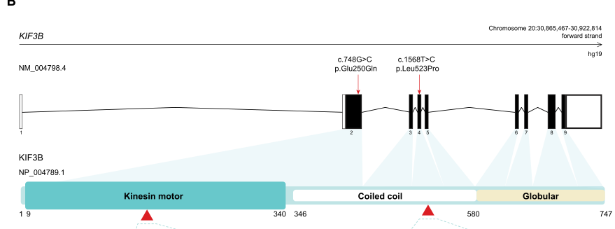

## Question

# Gene Research for Functional Annotation

## ⚠️ CRITICAL: Gene/Protein Identification Context

**BEFORE YOU BEGIN RESEARCH:** You MUST verify you are researching the CORRECT gene/protein. Gene symbols can be ambiguous, especially for less well-characterized genes from non-model organisms.

### Target Gene/Protein Identity (from UniProt):
- **UniProt Accession:** O15066
- **Protein Description:** RecName: Full=Kinesin-like protein KIF3B; AltName: Full=HH0048; AltName: Full=Microtubule plus end-directed kinesin motor 3B; Contains: RecName: Full=Kinesin-like protein KIF3B, N-terminally processed;
- **Gene Information:** Name=KIF3B; Synonyms=KIAA0359;
- **Organism (full):** Homo sapiens (Human).
- **Protein Family:** Belongs to the TRAFAC class myosin-kinesin ATPase
- **Key Domains:** Kinesin-like_fam. (IPR027640); Kinesin_motor_CS. (IPR019821); Kinesin_motor_dom. (IPR001752); Kinesin_motor_dom_sf. (IPR036961); P-loop_NTPase. (IPR027417)

### MANDATORY VERIFICATION STEPS:

1. **Check if the gene symbol "KIF3B" matches the protein description above**
2. **Verify the organism is correct:** Homo sapiens (Human).
3. **Check if protein family/domains align with what you find in literature**
4. **If you find literature for a DIFFERENT gene with the same or similar symbol, STOP**

### If Gene Symbol is Ambiguous or You Cannot Find Relevant Literature:

**DO NOT PROCEED WITH RESEARCH ON A DIFFERENT GENE.** Instead:
- State clearly: "The gene symbol 'KIF3B' is ambiguous or literature is limited for this specific protein"
- Explain what you found (e.g., "Found extensive literature on a different gene with the same symbol in a different organism")
- Describe the protein based ONLY on the UniProt information provided above
- Suggest that the protein function can be inferred from domain/family information

### Research Target:

Please provide a comprehensive research report on the gene **KIF3B** (gene ID: KIF3B, UniProt: O15066) in human.

The research report should be a detailed narrative explaining the function, biological processes, and localization of the gene product. Citations should be given for all claims.

You should prioritize authoritative reviews and primary scientific literature when conducting research. You can supplement
this with annotations you find in gene/protein databases, but these can be outdated or inaccurate.

We are specifically interested in the primary function of the gene - for enzymes, what reaction is catalyzed, and what is the substrate specificity? For transporters, what is the substrate? For structural proteins or adapters, what is the broader structural role? For signaling molecules, what is the role in the pathway.

We are interested in where in or outside the cell the gene product carries out its function.

We are also interested in the signaling or biochemical pathways in which the gene functions. We are less interested in broad pleiotropic effects, except where these elucidate the precise role.

Include evidence where possible. We are interested in both experimental evidence as well as inference from structure, evolution, or bioinformatic analysis. Precise studies should be prioritized over high-throughput, where available.

## Output

Question: You are an expert researcher providing comprehensive, well-cited information.

Provide detailed information focusing on:
1. Key concepts and definitions with current understanding
2. Recent developments and latest research (prioritize 2023-2024 sources)
3. Current applications and real-world implementations
4. Expert opinions and analysis from authoritative sources
5. Relevant statistics and data from recent studies

Format as a comprehensive research report with proper citations. Include URLs and publication dates where available.
Always prioritize recent, authoritative sources and provide specific citations for all major claims.

# Gene Research for Functional Annotation

## ⚠️ CRITICAL: Gene/Protein Identification Context

**BEFORE YOU BEGIN RESEARCH:** You MUST verify you are researching the CORRECT gene/protein. Gene symbols can be ambiguous, especially for less well-characterized genes from non-model organisms.

### Target Gene/Protein Identity (from UniProt):
- **UniProt Accession:** O15066
- **Protein Description:** RecName: Full=Kinesin-like protein KIF3B; AltName: Full=HH0048; AltName: Full=Microtubule plus end-directed kinesin motor 3B; Contains: RecName: Full=Kinesin-like protein KIF3B, N-terminally processed;
- **Gene Information:** Name=KIF3B; Synonyms=KIAA0359;
- **Organism (full):** Homo sapiens (Human).
- **Protein Family:** Belongs to the TRAFAC class myosin-kinesin ATPase
- **Key Domains:** Kinesin-like_fam. (IPR027640); Kinesin_motor_CS. (IPR019821); Kinesin_motor_dom. (IPR001752); Kinesin_motor_dom_sf. (IPR036961); P-loop_NTPase. (IPR027417)

### MANDATORY VERIFICATION STEPS:

1. **Check if the gene symbol "KIF3B" matches the protein description above**
2. **Verify the organism is correct:** Homo sapiens (Human).
3. **Check if protein family/domains align with what you find in literature**
4. **If you find literature for a DIFFERENT gene with the same or similar symbol, STOP**

### If Gene Symbol is Ambiguous or You Cannot Find Relevant Literature:

**DO NOT PROCEED WITH RESEARCH ON A DIFFERENT GENE.** Instead:
- State clearly: "The gene symbol 'KIF3B' is ambiguous or literature is limited for this specific protein"
- Explain what you found (e.g., "Found extensive literature on a different gene with the same symbol in a different organism")
- Describe the protein based ONLY on the UniProt information provided above
- Suggest that the protein function can be inferred from domain/family information

### Research Target:

Please provide a comprehensive research report on the gene **KIF3B** (gene ID: KIF3B, UniProt: O15066) in human.

The research report should be a detailed narrative explaining the function, biological processes, and localization of the gene product. Citations should be given for all claims.

You should prioritize authoritative reviews and primary scientific literature when conducting research. You can supplement
this with annotations you find in gene/protein databases, but these can be outdated or inaccurate.

We are specifically interested in the primary function of the gene - for enzymes, what reaction is catalyzed, and what is the substrate specificity? For transporters, what is the substrate? For structural proteins or adapters, what is the broader structural role? For signaling molecules, what is the role in the pathway.

We are interested in where in or outside the cell the gene product carries out its function.

We are also interested in the signaling or biochemical pathways in which the gene functions. We are less interested in broad pleiotropic effects, except where these elucidate the precise role.

Include evidence where possible. We are interested in both experimental evidence as well as inference from structure, evolution, or bioinformatic analysis. Precise studies should be prioritized over high-throughput, where available.

# Human KIF3B (UniProt O15066): functional annotation and research report

**Identity check.** The requested protein is **human KIF3B**, also named **KIAA0359** (UniProt [O15066](https://www.uniprot.org/uniprotkb/O15066/entry)). This identification is consistent with the literature: KIF3B is a kinesin-2 motor subunit with an amino-terminal, ATP- and microtubule-binding kinesin domain, a coiled-coil region, and a carboxyl-terminal region involved in motor regulation and cargo interactions. Its principal functional assembly pairs KIF3B with the distinct motor **KIF3A** and the nonmotor adaptor **KIFAP3/KAP3**. The supplied P-loop NTPase and kinesin-domain annotations fit this architecture; KIF3C and KIF17 are related proteins, **not alternative names for KIF3B**. A published human-variant domain schematic independently identifies accession O15066 and places variants in the motor and coiled-coil regions. (cole1999kinesiniitheheteromeric pages 1-3, cole1999kinesiniitheheteromeric pages 3-4, cogne2020mutationsinthe pages 4-6, cogne2020mutationsinthe media dcf5cfd8)

## Primary molecular function

**KIF3B is a transport motor, not an ion transporter or a signaling receptor.** Its N-terminal motor domain uses ATP hydrolysis to generate movement along microtubules toward their **plus ends**. In the KIF3A–KIF3B–KAP3 complex, the two kinesins provide motor activity, their coiled coils support assembly, and the distal regions and KAP3 participate in recruiting or regulating cargo. Thus its biochemical substrate is **ATP**, while the identities of the *transported cargoes* depend on the cellular context; there is no evidence for a single universal vesicular substrate. Human-protein reconstitution supports this assignment: purified human KIF3A–KIF3B propelled microtubule gliding at **444 ± 26 nm/s** when surface-anchored, although free, full-length motors were strongly autoinhibited under the tested conditions. These measurements describe the **motor complex**, not an isolated KIF3B monomer or its standalone ATP-turnover rate. (cole1999kinesiniitheheteromeric pages 1-3, webb2025regulationofkinesin2 pages 6-7, webb2024betahairpinmechanismof pages 3-6)

**Most firmly established biological role: anterograde intraflagellar transport (IFT).** At the basal body and inside the primary cilium, the heterotrimeric motor moves IFT assemblies and associated building blocks along axonemal microtubules **from ciliary base toward tip**. This transport is required to build and maintain the cilium; dynein-2 mediates the distinct return journey. In *human* hTERT-RPE1 cells, KIF3B knockout prevented cilium formation, while IFT-A and IFT-B components could still assemble and reach the mother centriole. KIF3B is therefore required for a subsequent motor-dependent stage, not for every initial recruitment event. In *mouse* NIH3T3 cells, restoring both KIF3A and KIF3B rescued ciliogenesis after their deletion; acutely inhibiting the restored motor stopped IFT in roughly **2–5 minutes** and reduced ciliated cells from **83% to 2% by eight hours**. Species and cell type matter: these time-course values were measured in mouse cells, not in humans. (tasaki2025mutuallyindependentand pages 4-6, tasaki2025mutuallyindependentand pages 2-4, fasawe2024kif3ataildomain pages 1-3, engelke2019acuteinhibitionof pages 5-6, engelke2019acuteinhibitionof pages 3-4)

**Cellular locations.** KIF3B functions on microtubules in the **cytoplasm**, at or near the **mother centriole/ciliary base**, and along the **ciliary axoneme** as part of moving IFT machinery. It also acts outside cilia on cytoplasmic organelles and vesicles, including recycling endosomes, renal ClC-5-containing compartments and macrophage MT1-MMP-containing carriers. It is not itself a secreted extracellular-matrix enzyme: extracellular effects reported for KIF3B follow from delivery of *other proteins* to the cell surface. Localization is dynamic and cargo-dependent rather than confined to one organelle. (tasaki2025mutuallyindependentand pages 2-4, schonteich2008therip11rab11fip5and pages 6-8, wiesner2010kif5bandkif3akif3b pages 1-2, reed2010clc5andkif3b pages 5-6, reed2010clc5andkif3b pages 6-8)

The following evidence map separates experiments on human material from informative ortholog studies.

| Molecular process / site | Key direct observation and species | Confidence / interpretation | Primary reference (year; DOI URL) |
|---|---|---|---|
| Ciliary IFT; mother centriole / primary cilium | **Human hTERT-RPE1:** KIF3B knockout abolished ciliogenesis, although IFT-A and IFT-B complexes still assembled and localized independently at the mother centriole. (tasaki2025mutuallyindependentand pages 4-6, tasaki2025mutuallyindependentand pages 2-4) | **High, direct human-cell knockout evidence.** KIF3B is required for cilium formation but not for initial centriolar recruitment or assembly of IFT complexes. | Tasaki et al. (2025); [10.1091/mbc.e24-11-0509](https://doi.org/10.1091/mbc.e24-11-0509) |
| Anterograde IFT; ciliary shaft | **Mouse NIH3T3:** acute KIF3A-KIF3B inhibition stopped IFT within approximately 2–5 minutes, removed IFT88 from the shaft, reduced ciliated cells from 83% to 63% at 1 hour and 2% at 8 hours, and impaired Hedgehog signaling. (engelke2019acuteinhibitionof pages 5-6, engelke2019acuteinhibitionof pages 6-9) | **High mechanistic mammalian evidence; ortholog transfer to human.** KIF3B is an IFT motor subunit, not a Hedgehog receptor or signaling enzyme. | Engelke et al. (2019); [10.1016/j.cub.2019.02.043](https://doi.org/10.1016/j.cub.2019.02.043) |
| APC cargo recognition; KIF3/KAP3 tail complex | **Mouse purified proteins:** the APC ARM domain docked in a KIF3-tail-KAP3 cavity and was stabilized by KIF3 coiled coils through a loading-locking mechanism; complex stoichiometry was 1:1:1. (jiang2023thetwo‐stepcargo pages 2-3, jiang2023thetwo‐stepcargo pages 8-9, jiang2023thetwo‐stepcargo pages 3-5) | **High biochemical and structural evidence, but from mouse constructs.** Supports APC as a cargo adaptor rather than a universal KIF3B substrate. | Jiang et al. (2023); [10.15252/embr.202356864](https://doi.org/10.15252/embr.202356864) |
| Motor autoinhibition and activation; cytosolic KIF3AB-KAP3 | **Purified human KIF3A/KIF3B:** beta-hairpins sequestered motor domains; disrupting either the KIF3A or KIF3B beta-hairpin activated motility. Multi-motor gliding was 444 ± 26 nm/s, and activated single motors moved approximately 730–940 nm/s. (webb2025regulationofkinesin2 pages 6-7, webb2024betahairpinmechanismof pages 3-6) | **High, direct human-protein biochemical evidence.** KAP3 provides a cargo-binding platform but does not alone release autoinhibition. | Webb et al. (2025; preprint posted 15 October 2024); [10.1038/s41594-025-01630-5](https://doi.org/10.1038/s41594-025-01630-5) |
| Endocytic recycling; peripheral and perinuclear endosomes | **Human HeLa:** Rab11-FIP5 bound the KIF3B C-terminal tail independently of Rab11. KIF3B depletion increased transferrin receptor in actively recycling carriers and displaced transferrin-positive endosomes toward cell tips. (schonteich2008therip11rab11fip5and pages 8-9, schonteich2008therip11rab11fip5and pages 6-8, schonteich2008therip11rab11fip5and pages 4-6) | **Moderate-high, direct human-cell and biochemical evidence.** Establishes a non-ciliary role in endosome positioning and transferrin-receptor recycling. | Schonteich et al. (2008); [10.1242/jcs.032441](https://doi.org/10.1242/jcs.032441) |
| MT1-MMP vesicle delivery; macrophage plasma membrane and podosomes | **Primary human macrophages:** KIF3B knockdown or ATPase-defective KIF3B-T103N reduced MT1-MMP surface exposure; KIF3A/KIF3B supported MT1-MMP delivery, CD44 shedding, and extracellular-matrix degradation. (wiesner2010kif5bandkif3akif3b pages 4-6, wiesner2010kif5bandkif3akif3b pages 1-2) | **High, direct primary-human-cell evidence.** Cargo transport is shared with KIF5B; KIF3B is not uniquely sufficient. | Wiesner et al. (2010); [10.1182/blood-2009-12-257089](https://doi.org/10.1182/blood-2009-12-257089) |
| CLC-5 vesicle transport; endosomes and plasma membrane | **Human HEK293/COS7:** KIF3B interacted with CLC-5 and moved CLC-5 vesicles at approximately 0.42 µm/s; KIF3B overexpression increased CLC-5 current by 45% and increased surface expression, whereas siRNA produced reciprocal effects. (reed2010clc5andkif3b pages 8-9, reed2010clc5andkif3b pages 6-8, reed2010clc5andkif3b pages 4-5) | **High direct cultured-human-cell evidence; native interaction also supported in mouse kidney.** KIF3B transports CLC-5-containing vesicles; it is not a chloride transporter. | Reed et al. (2010); [10.1152/ajprenal.00038.2009](https://doi.org/10.1152/ajprenal.00038.2009) |
| Hereditary dominant ciliopathy; retina, liver, and digit development | **Human families:** p.Glu250Gln was de novo in a congenital multisystem ciliopathy; p.Leu523Pro segregated with retinitis pigmentosa across 14 informative meioses with LOD 4.2. Patient fibroblast cilia were 36% longer; RPE1 expression increased length by 9% and 13%, respectively. (cogne2020mutationsinthe pages 3-4, cogne2020mutationsinthe pages 2-3) | **High human genetic and functional evidence**, although based on two rare-variant families. Supports clinical variant interpretation, not a common-disease biomarker. | Cogné et al. (2020); [10.1016/j.ajhg.2020.04.005](https://doi.org/10.1016/j.ajhg.2020.04.005) |
| Oncology; hepatocellular carcinoma tissue | **Human observational cohort:** immunohistochemistry in 57 paired HCC specimens associated higher KIF3B with larger tumors, higher AFP and Ki-67, poorer differentiation, and shorter survival. (zhao2024theroleof pages 10-12) | **Low-moderate translational confidence.** Retrospective expression association only; not a prospectively validated clinical biomarker, predictive assay, or KIF3B-specific therapy. | Zhao et al. review (2024), summarizing the primary cohort; [10.1186/s40364-024-00559-z](https://doi.org/10.1186/s40364-024-00559-z) |

*Table: Evidence supporting the molecular, cellular, and clinical annotation of human KIF3B (O15066), with species and study limitations made explicit. The table distinguishes direct human findings from mammalian ortholog evidence and observational oncology associations.*

## Cargo specificity and pathways beyond the cilium

**APC-associated protein and RNA transport.** Adenomatous polyposis coli (**APC**) is a demonstrated binding partner/cargo adaptor of the KIF3A–KIF3B–KAP3 apparatus. Reconstitution showed that APC couples selected **β-actin and β2B-tubulin mRNAs** to the motor through KAP3; removing APC or KAP3 prevented directed RNA movement in the corresponding assays. Processively transported β2B-tubulin RNA complexes averaged **0.57 µm/s**. In a **2023** structural study using *mouse* KIF3A, KIF3B, KAP3 and APC fragments, APC’s armadillo-repeat domain docked at a KIF3-tail/KAP3 interface; conformational observations support a proposed cargo **docking–locking** sequence involving the coiled coils. This establishes a specific APC-recognition mechanism, but does **not** mean that KIF3B enzymatically modifies APC, directly catalyzes Wnt signaling, or transports every APC-associated RNA in vivo. (jiang2023thetwo‐stepcargo pages 2-3, baumann2020areconstitutedmammalian pages 2-2, jiang2023thetwo‐stepcargo pages 8-9, baumann2020areconstitutedmammalian pages 2-3)

**Endosomal and membrane-protein trafficking: direct human evidence.** In human **HeLa** cells, Rab11-FIP5 bound the KIF3B C-terminal tail, and KIF3B depletion redistributed transferrin-receptor-associated endosomes toward peripheral cell tips while changing the distribution of actively recycling receptors. This implicates kinesin-2 in endosome positioning and recycling; it does **not** show that KIF3B is the transferrin receptor itself. In **primary human macrophages**, KIF3B knockdown and a motor-impaired KIF3B construct decreased surface delivery of MT1-MMP. This reduced downstream MT1-MMP-dependent receptor shedding and extracellular-matrix degradation; **KIF5B also contributes**, so these outcomes cannot be assigned uniquely to KIF3B. In human-derived **HEK293** cells, KIF3B interacted with the ClC-5/CLCN5 chloride–proton antiporter and increased its plasma-membrane expression: KIF3B overexpression increased recorded ClC-5 current by **45%**, consistent with more antiporter reaching the surface rather than KIF3B itself carrying chloride. Live imaging in kidney-cell systems observed ClC-5-associated carriers moving at approximately **0.42 µm/s**. Native-tissue interaction was additionally assessed in **mouse kidney**, not established as endogenous human-kidney coimmunoprecipitation. (wiesner2010kif5bandkif3akif3b pages 4-6, schonteich2008therip11rab11fip5and pages 8-9, schonteich2008therip11rab11fip5and pages 6-8, wiesner2010kif5bandkif3akif3b pages 1-2, reed2010clc5andkif3b pages 8-9, reed2010clc5andkif3b pages 6-8, reed2010clc5andkif3b pages 2-3)

**Signaling consequence, rather than direct signaling chemistry.** Primary-cilium formation and trafficking enable cilium-dependent developmental signaling, particularly **Hedgehog**. In the mouse acute-inhibition experiment, cilia assembled with the functional KIF3A–KIF3B motor responded to Smoothened agonist, whereas chemically blocking that motor reduced the agonist-stimulated reporter response and rapidly disrupted IFT and ciliary maintenance. The appropriate annotation is therefore **support of Hedgehog signal transduction through ciliary transport**, not that KIF3B is Smoothened, a ligand-binding receptor, or a direct GLI-modifying enzyme. Effects on APC-linked trafficking likewise should not be conflated with proof of direct Wnt-pathway catalysis. (engelke2019acuteinhibitionof pages 5-6, engelke2019acuteinhibitionof pages 4-5, lacey2025theintraflagellartransport pages 2-3)

## Developments in 2023–2024 and subsequent mechanistic clarification

The **2023** mouse-protein APC structural work clarified how KIF3-tail and KAP3 surfaces select and stabilize one cargo. A **March 2024** mouse-fibroblast rescue study challenged a proposed universal regulatory model: mutations mimicking phosphorylation across the **KIF3A** tail did not establish that this phosphorylation is necessary for mammalian ciliogenesis. Those findings concern KIF3A and should **not** be misreported as direct proof of KIF3B phosphorylation. A **2024** zebrafish study found that removing *kif3b* did not appreciably change measured IFT speed in the examined ear-crista cilia, with potential compensation by Kif3c; this tissue-specific result does not override human RPE1 or mouse-cell evidence that KIF3B can be required for ciliogenesis. (jiang2023thetwo‐stepcargo pages 2-3, sun2024ciliarylengthregulation pages 6-8, fasawe2024kif3ataildomain pages 1-3)

A study **posted as a preprint on 15 October 2024 and subsequently published in 2025** supplied particularly direct human-protein evidence for motor regulation: the conserved carboxyl-terminal **β-hairpin** helps hold KIF3A–KIF3B in an autoinhibited conformation that restricts motor–microtubule binding. Perturbing the β-hairpin of **either KIF3A or KIF3B** activated single-molecule movement in vitro; KAP3 provides several binding interfaces and a platform for cargo-adaptor engagement rather than automatically switching the motor on by itself. Its cell-based Kif3b-knockout/rescue experiments used **mouse IMCD-3 cells**. This distinction between purified *human* motor and *mouse* cell phenotypes is important when assessing how far the mechanism has been validated in native human cilia. (webb2025regulationofkinesin2 pages 6-7, webb2024betahairpinmechanismof pages 11-14, webb2025regulationofkinesin2 pages 1-2, webb2024betahairpinmechanismof pages 3-6)

## Human disease relevance and present applications

**Strongest clinical connection: rare inherited ciliopathy.** A **June 2020** human genetics study identified a **de novo p.Glu250Gln** change in the kinesin motor domain in a child with retinal, digit and hepatobiliary manifestations, and **p.Leu523Pro** in the coiled-coil region in a multigeneration family predominantly affected by retinitis pigmentosa. For p.Leu523Pro, segregation over **14 informative meioses** yielded a **LOD score of 4.2**. Patient fibroblast primary cilia were **36% longer** than control cilia; expressing p.Glu250Gln or p.Leu523Pro in human RPE1 cells increased measured ciliary length by **9% or 13%**, respectively, compared with wild type. Zebrafish expressing the human variant constructs showed photoreceptor-related defects. These findings support **KIF3B variant interpretation in rare retinal/multisystem ciliopathy**, but do not establish that every KIF3B variant is pathogenic, that longer cilia are a universal outcome of KIF3B loss, or that the child was diagnosed with biliary atresia specifically. The domain/variant positions are also depicted in the inspected, cropped Figure 2B of the genetic study. (cogne2020mutationsinthe pages 3-4, cogne2020mutationsinthe pages 2-3, cogne2020mutationsinthe pages 1-2, cogne2020mutationsinthe pages 4-6, cogne2020mutationsinthe media dcf5cfd8)

**Exploratory rather than implemented oncology applications.** A **2024** review summarized immunohistochemistry in **57 paired hepatocellular-carcinoma specimens**: higher KIF3B expression was associated with tumor and proliferation measures and poorer survival. Earlier work reviewed knockdown effects in cancer models. These are potentially useful research observations, **not** evidence that KIF3B is a prospectively validated clinical biomarker, that KIF3B drives those cancers specifically through ciliary IFT, or that a KIF3B-selective treatment is clinically established. Similarly, the ClC-5 work provides mechanistic insight relevant to **Dent disease**, which is caused by dysfunction of the *antiporter* CLCN5; it should not be recast as proof that KIF3B variants cause Dent disease. (reed2010clc5andkif3b pages 1-2, zhou2019researchprogresson pages 5-7, zhou2019researchprogresson pages 2-4, zhao2024theroleof pages 10-12)

**Assessment.** The highest-confidence annotation of human KIF3B is **ATP-dependent, plus-end-directed microtubule transport as the KIF3A–KIF3B–KIFAP3 kinesin-2 motor**, especially anterograde IFT supporting primary-cilium assembly, maintenance and consequent ciliary signaling. Direct human-cell studies additionally establish context-specific roles in endosomal and vesicle trafficking. APC recognition, β-hairpin regulation and species-specific compensation refine—rather than replace—this core transport function; rare dominant human variants provide independent clinical evidence that disturbing it can affect retinal and other cilium-dependent tissues. (tasaki2025mutuallyindependentand pages 2-4, wiesner2010kif5bandkif3akif3b pages 4-6, schonteich2008therip11rab11fip5and pages 8-9, cogne2020mutationsinthe pages 3-4, webb2024betahairpinmechanismof pages 3-6, engelke2019acuteinhibitionof pages 5-6)

References

1. (cole1999kinesiniitheheteromeric pages 1-3): Douglas G. Cole. Kinesin-ii, the heteromeric kinesin. Cellular and Molecular Life Sciences CMLS, 56:217-226, Oct 1999. URL: https://doi.org/10.1007/s000180050423, doi:10.1007/s000180050423. This article has 51 citations.

2. (cole1999kinesiniitheheteromeric pages 3-4): Douglas G. Cole. Kinesin-ii, the heteromeric kinesin. Cellular and Molecular Life Sciences CMLS, 56:217-226, Oct 1999. URL: https://doi.org/10.1007/s000180050423, doi:10.1007/s000180050423. This article has 51 citations.

3. (cogne2020mutationsinthe pages 4-6): Benjamin Cogné, Xenia Latypova, Lokuliyanage Dona Samudita Senaratne, Ludovic Martin, Daniel C. Koboldt, Georgios Kellaris, Lorraine Fievet, Guylène Le Meur, Dominique Caldari, Dominique Debray, Mathilde Nizon, Eirik Frengen, Sara J. Bowne, Elizabeth L. Cadena, Stephen P. Daiger, Kinga M. Bujakowska, Eric A. Pierce, Michael Gorin, Nicholas Katsanis, Stéphane Bézieau, Simon M. Petersen-Jones, Laurence M. Occelli, Leslie A. Lyons, Laurence Legeai-Mallet, Lori S. Sullivan, Erica E. Davis, Bertrand Isidor, Reuben M. Buckley, Danielle Aberdein, Paulo C. Alves, Gregory S. Barsh, Rebecca R. Bellone, Tomas F. Bergström, Adam R. Boyko, Jeffrey A. Brockman, Margret L. Casal, Marta G. Castelhano, Ottmar Distl, Nicholas H. Dodman, N. Matthew Ellinwood, Jonathan E. Fogle, Oliver P. Forman, Dorian J. Garrick, Edward I. Ginns, Jens Häggström, Robert J. Harvey, Daisuke Hasegawa, Bianca Haase, Christopher R. Helps, Isabel Hernandez, Marjo K. Hytönen, Maria Kaukonen, Christopher B. Kaelin, Tomoki Kosho, Emilie Leclerc, Teri L. Lear, Tosso Leeb, Ronald H.L. Li, Hannes Lohi, Maria Longeri, Mark A. Magnuson, Richard Malik, Shrinivas P. Mane, John S. Munday, William J. Murphy, Niels C. Pedersen, Max F. Rothschild, Clare Rusbridge, Beth Shapiro, Joshua A. Stern, William F. Swanson, Karen A. Terio, Rory J. Todhunter, Wesley C. Warren, Elizabeth A. Wilcox, Julia H. Wildschutte, and Yoshihiko Yu. Mutations in the kinesin-2 motor kif3b cause an autosomal-dominant ciliopathy. The American Journal of Human Genetics, 106:893-904, Jun 2020. URL: https://doi.org/10.1016/j.ajhg.2020.04.005, doi:10.1016/j.ajhg.2020.04.005. This article has 62 citations.

4. (cogne2020mutationsinthe media dcf5cfd8): Benjamin Cogné, Xenia Latypova, Lokuliyanage Dona Samudita Senaratne, Ludovic Martin, Daniel C. Koboldt, Georgios Kellaris, Lorraine Fievet, Guylène Le Meur, Dominique Caldari, Dominique Debray, Mathilde Nizon, Eirik Frengen, Sara J. Bowne, Elizabeth L. Cadena, Stephen P. Daiger, Kinga M. Bujakowska, Eric A. Pierce, Michael Gorin, Nicholas Katsanis, Stéphane Bézieau, Simon M. Petersen-Jones, Laurence M. Occelli, Leslie A. Lyons, Laurence Legeai-Mallet, Lori S. Sullivan, Erica E. Davis, Bertrand Isidor, Reuben M. Buckley, Danielle Aberdein, Paulo C. Alves, Gregory S. Barsh, Rebecca R. Bellone, Tomas F. Bergström, Adam R. Boyko, Jeffrey A. Brockman, Margret L. Casal, Marta G. Castelhano, Ottmar Distl, Nicholas H. Dodman, N. Matthew Ellinwood, Jonathan E. Fogle, Oliver P. Forman, Dorian J. Garrick, Edward I. Ginns, Jens Häggström, Robert J. Harvey, Daisuke Hasegawa, Bianca Haase, Christopher R. Helps, Isabel Hernandez, Marjo K. Hytönen, Maria Kaukonen, Christopher B. Kaelin, Tomoki Kosho, Emilie Leclerc, Teri L. Lear, Tosso Leeb, Ronald H.L. Li, Hannes Lohi, Maria Longeri, Mark A. Magnuson, Richard Malik, Shrinivas P. Mane, John S. Munday, William J. Murphy, Niels C. Pedersen, Max F. Rothschild, Clare Rusbridge, Beth Shapiro, Joshua A. Stern, William F. Swanson, Karen A. Terio, Rory J. Todhunter, Wesley C. Warren, Elizabeth A. Wilcox, Julia H. Wildschutte, and Yoshihiko Yu. Mutations in the kinesin-2 motor kif3b cause an autosomal-dominant ciliopathy. The American Journal of Human Genetics, 106:893-904, Jun 2020. URL: https://doi.org/10.1016/j.ajhg.2020.04.005, doi:10.1016/j.ajhg.2020.04.005. This article has 62 citations.

5. (webb2025regulationofkinesin2 pages 6-7): Stephanie Webb, K. Toropova, A. G. Mukhopadhyay, S. Nofal, and Anthony J Roberts. Regulation of kinesin-2 motility by its β-hairpin motif. Nature structural & molecular biology, Jul 2025. URL: https://doi.org/10.1038/s41594-025-01630-5, doi:10.1038/s41594-025-01630-5. This article has 7 citations and is from a highest quality peer-reviewed journal.

6. (webb2024betahairpinmechanismof pages 3-6): Stephanie Webb, Katerina Toropova, Aakash G. Mukhopadhyay, Stephanie D. Nofal, and Anthony J. Roberts. Beta-hairpin mechanism of autoinhibition and activation in the kinesin-2 family. Oct 2024. URL: https://doi.org/10.1101/2024.10.14.618219, doi:10.1101/2024.10.14.618219. This article has 1 citations.

7. (tasaki2025mutuallyindependentand pages 4-6): Koshi Tasaki, Yuuki Satoda, Shuhei Chiba, Hye-Won Shin, Yohei Katoh, and Kazuhisa Nakayama. Mutually independent and cilia-independent assembly of ift-a and ift-b complexes at mother centriole. Molecular Biology of the Cell, Feb 2025. URL: https://doi.org/10.1091/mbc.e24-11-0509, doi:10.1091/mbc.e24-11-0509. This article has 4 citations and is from a domain leading peer-reviewed journal.

8. (tasaki2025mutuallyindependentand pages 2-4): Koshi Tasaki, Yuuki Satoda, Shuhei Chiba, Hye-Won Shin, Yohei Katoh, and Kazuhisa Nakayama. Mutually independent and cilia-independent assembly of ift-a and ift-b complexes at mother centriole. Molecular Biology of the Cell, Feb 2025. URL: https://doi.org/10.1091/mbc.e24-11-0509, doi:10.1091/mbc.e24-11-0509. This article has 4 citations and is from a domain leading peer-reviewed journal.

9. (fasawe2024kif3ataildomain pages 1-3): Ayoola S. Fasawe, Jessica M. Adams, and Martin F. Engelke. Kif3a tail domain phosphorylation is not required for ciliogenesis in mouse embryonic fibroblasts. Mar 2024. URL: https://doi.org/10.1016/j.isci.2024.109149, doi:10.1016/j.isci.2024.109149. This article has 1 citations and is from a peer-reviewed journal.

10. (engelke2019acuteinhibitionof pages 5-6): Martin F. Engelke, Bridget Waas, Sarah E. Kearns, Ayana Suber, Allison Boss, Benjamin L. Allen, and Kristen J. Verhey. Acute inhibition of heterotrimeric kinesin-2 function reveals mechanisms of intraflagellar transport in mammalian cilia. Current Biology, 29:1137-1148.e4, Apr 2019. URL: https://doi.org/10.1016/j.cub.2019.02.043, doi:10.1016/j.cub.2019.02.043. This article has 85 citations and is from a highest quality peer-reviewed journal.

11. (engelke2019acuteinhibitionof pages 3-4): Martin F. Engelke, Bridget Waas, Sarah E. Kearns, Ayana Suber, Allison Boss, Benjamin L. Allen, and Kristen J. Verhey. Acute inhibition of heterotrimeric kinesin-2 function reveals mechanisms of intraflagellar transport in mammalian cilia. Current Biology, 29:1137-1148.e4, Apr 2019. URL: https://doi.org/10.1016/j.cub.2019.02.043, doi:10.1016/j.cub.2019.02.043. This article has 85 citations and is from a highest quality peer-reviewed journal.

12. (schonteich2008therip11rab11fip5and pages 6-8): Eric Schonteich, Gayle M. Wilson, Jemima Burden, Colin R. Hopkins, Keith Anderson, James R. Goldenring, and Rytis Prekeris. The rip11/rab11-fip5 and kinesin ii complex regulates endocytic protein recycling. Journal of Cell Science, 121:3824-3833, Nov 2008. URL: https://doi.org/10.1242/jcs.032441, doi:10.1242/jcs.032441. This article has 216 citations and is from a domain leading peer-reviewed journal.

13. (wiesner2010kif5bandkif3akif3b pages 1-2): Christiane Wiesner, Jan Faix, Mirko Himmel, Frank Bentzien, and Stefan Linder. Kif5b and kif3a/kif3b kinesins drive mt1-mmp surface exposure, cd44 shedding, and extracellular matrix degradation in primary macrophages. Blood, 116 9:1559-69, Sep 2010. URL: https://doi.org/10.1182/blood-2009-12-257089, doi:10.1182/blood-2009-12-257089. This article has 175 citations and is from a highest quality peer-reviewed journal.

14. (reed2010clc5andkif3b pages 5-6): Anita A. C. Reed, Nellie Y. Loh, Sara Terryn, Jonathan D. Lippiat, Chris Partridge, Juris Galvanovskis, Siân E. Williams, Francois Jouret, Fiona T. F. Wu, Pierre J. Courtoy, M. Andrew Nesbit, Patrik Rorsman, Olivier Devuyst, Frances M. Ashcroft, and Rajesh V. Thakker. Clc-5 and kif3b interact to facilitate clc-5 plasma membrane expression, endocytosis, and microtubular transport: relevance to pathophysiology of dent's disease. Feb 2010. URL: https://doi.org/10.1152/ajprenal.00038.2009, doi:10.1152/ajprenal.00038.2009. This article has 82 citations and is from a peer-reviewed journal.

15. (reed2010clc5andkif3b pages 6-8): Anita A. C. Reed, Nellie Y. Loh, Sara Terryn, Jonathan D. Lippiat, Chris Partridge, Juris Galvanovskis, Siân E. Williams, Francois Jouret, Fiona T. F. Wu, Pierre J. Courtoy, M. Andrew Nesbit, Patrik Rorsman, Olivier Devuyst, Frances M. Ashcroft, and Rajesh V. Thakker. Clc-5 and kif3b interact to facilitate clc-5 plasma membrane expression, endocytosis, and microtubular transport: relevance to pathophysiology of dent's disease. Feb 2010. URL: https://doi.org/10.1152/ajprenal.00038.2009, doi:10.1152/ajprenal.00038.2009. This article has 82 citations and is from a peer-reviewed journal.

16. (engelke2019acuteinhibitionof pages 6-9): Martin F. Engelke, Bridget Waas, Sarah E. Kearns, Ayana Suber, Allison Boss, Benjamin L. Allen, and Kristen J. Verhey. Acute inhibition of heterotrimeric kinesin-2 function reveals mechanisms of intraflagellar transport in mammalian cilia. Current Biology, 29:1137-1148.e4, Apr 2019. URL: https://doi.org/10.1016/j.cub.2019.02.043, doi:10.1016/j.cub.2019.02.043. This article has 85 citations and is from a highest quality peer-reviewed journal.

17. (jiang2023thetwo‐stepcargo pages 2-3): Xuguang Jiang, Tadayuki Ogawa, Kento Yonezawa, Nobutaka Shimizu, Sotaro Ichinose, Takayuki Uchihashi, Wataru Nagaike, Toshio Moriya, Naruhiko Adachi, Masato Kawasaki, Naoshi Dohmae, Toshiya Senda, and Nobutaka Hirokawa. The two‐step cargo recognition mechanism of heterotrimeric kinesin. EMBO reports, Aug 2023. URL: https://doi.org/10.15252/embr.202356864, doi:10.15252/embr.202356864. This article has 15 citations and is from a highest quality peer-reviewed journal.

18. (jiang2023thetwo‐stepcargo pages 8-9): Xuguang Jiang, Tadayuki Ogawa, Kento Yonezawa, Nobutaka Shimizu, Sotaro Ichinose, Takayuki Uchihashi, Wataru Nagaike, Toshio Moriya, Naruhiko Adachi, Masato Kawasaki, Naoshi Dohmae, Toshiya Senda, and Nobutaka Hirokawa. The two‐step cargo recognition mechanism of heterotrimeric kinesin. EMBO reports, Aug 2023. URL: https://doi.org/10.15252/embr.202356864, doi:10.15252/embr.202356864. This article has 15 citations and is from a highest quality peer-reviewed journal.

19. (jiang2023thetwo‐stepcargo pages 3-5): Xuguang Jiang, Tadayuki Ogawa, Kento Yonezawa, Nobutaka Shimizu, Sotaro Ichinose, Takayuki Uchihashi, Wataru Nagaike, Toshio Moriya, Naruhiko Adachi, Masato Kawasaki, Naoshi Dohmae, Toshiya Senda, and Nobutaka Hirokawa. The two‐step cargo recognition mechanism of heterotrimeric kinesin. EMBO reports, Aug 2023. URL: https://doi.org/10.15252/embr.202356864, doi:10.15252/embr.202356864. This article has 15 citations and is from a highest quality peer-reviewed journal.

20. (schonteich2008therip11rab11fip5and pages 8-9): Eric Schonteich, Gayle M. Wilson, Jemima Burden, Colin R. Hopkins, Keith Anderson, James R. Goldenring, and Rytis Prekeris. The rip11/rab11-fip5 and kinesin ii complex regulates endocytic protein recycling. Journal of Cell Science, 121:3824-3833, Nov 2008. URL: https://doi.org/10.1242/jcs.032441, doi:10.1242/jcs.032441. This article has 216 citations and is from a domain leading peer-reviewed journal.

21. (schonteich2008therip11rab11fip5and pages 4-6): Eric Schonteich, Gayle M. Wilson, Jemima Burden, Colin R. Hopkins, Keith Anderson, James R. Goldenring, and Rytis Prekeris. The rip11/rab11-fip5 and kinesin ii complex regulates endocytic protein recycling. Journal of Cell Science, 121:3824-3833, Nov 2008. URL: https://doi.org/10.1242/jcs.032441, doi:10.1242/jcs.032441. This article has 216 citations and is from a domain leading peer-reviewed journal.

22. (wiesner2010kif5bandkif3akif3b pages 4-6): Christiane Wiesner, Jan Faix, Mirko Himmel, Frank Bentzien, and Stefan Linder. Kif5b and kif3a/kif3b kinesins drive mt1-mmp surface exposure, cd44 shedding, and extracellular matrix degradation in primary macrophages. Blood, 116 9:1559-69, Sep 2010. URL: https://doi.org/10.1182/blood-2009-12-257089, doi:10.1182/blood-2009-12-257089. This article has 175 citations and is from a highest quality peer-reviewed journal.

23. (reed2010clc5andkif3b pages 8-9): Anita A. C. Reed, Nellie Y. Loh, Sara Terryn, Jonathan D. Lippiat, Chris Partridge, Juris Galvanovskis, Siân E. Williams, Francois Jouret, Fiona T. F. Wu, Pierre J. Courtoy, M. Andrew Nesbit, Patrik Rorsman, Olivier Devuyst, Frances M. Ashcroft, and Rajesh V. Thakker. Clc-5 and kif3b interact to facilitate clc-5 plasma membrane expression, endocytosis, and microtubular transport: relevance to pathophysiology of dent's disease. Feb 2010. URL: https://doi.org/10.1152/ajprenal.00038.2009, doi:10.1152/ajprenal.00038.2009. This article has 82 citations and is from a peer-reviewed journal.

24. (reed2010clc5andkif3b pages 4-5): Anita A. C. Reed, Nellie Y. Loh, Sara Terryn, Jonathan D. Lippiat, Chris Partridge, Juris Galvanovskis, Siân E. Williams, Francois Jouret, Fiona T. F. Wu, Pierre J. Courtoy, M. Andrew Nesbit, Patrik Rorsman, Olivier Devuyst, Frances M. Ashcroft, and Rajesh V. Thakker. Clc-5 and kif3b interact to facilitate clc-5 plasma membrane expression, endocytosis, and microtubular transport: relevance to pathophysiology of dent's disease. Feb 2010. URL: https://doi.org/10.1152/ajprenal.00038.2009, doi:10.1152/ajprenal.00038.2009. This article has 82 citations and is from a peer-reviewed journal.

25. (cogne2020mutationsinthe pages 3-4): Benjamin Cogné, Xenia Latypova, Lokuliyanage Dona Samudita Senaratne, Ludovic Martin, Daniel C. Koboldt, Georgios Kellaris, Lorraine Fievet, Guylène Le Meur, Dominique Caldari, Dominique Debray, Mathilde Nizon, Eirik Frengen, Sara J. Bowne, Elizabeth L. Cadena, Stephen P. Daiger, Kinga M. Bujakowska, Eric A. Pierce, Michael Gorin, Nicholas Katsanis, Stéphane Bézieau, Simon M. Petersen-Jones, Laurence M. Occelli, Leslie A. Lyons, Laurence Legeai-Mallet, Lori S. Sullivan, Erica E. Davis, Bertrand Isidor, Reuben M. Buckley, Danielle Aberdein, Paulo C. Alves, Gregory S. Barsh, Rebecca R. Bellone, Tomas F. Bergström, Adam R. Boyko, Jeffrey A. Brockman, Margret L. Casal, Marta G. Castelhano, Ottmar Distl, Nicholas H. Dodman, N. Matthew Ellinwood, Jonathan E. Fogle, Oliver P. Forman, Dorian J. Garrick, Edward I. Ginns, Jens Häggström, Robert J. Harvey, Daisuke Hasegawa, Bianca Haase, Christopher R. Helps, Isabel Hernandez, Marjo K. Hytönen, Maria Kaukonen, Christopher B. Kaelin, Tomoki Kosho, Emilie Leclerc, Teri L. Lear, Tosso Leeb, Ronald H.L. Li, Hannes Lohi, Maria Longeri, Mark A. Magnuson, Richard Malik, Shrinivas P. Mane, John S. Munday, William J. Murphy, Niels C. Pedersen, Max F. Rothschild, Clare Rusbridge, Beth Shapiro, Joshua A. Stern, William F. Swanson, Karen A. Terio, Rory J. Todhunter, Wesley C. Warren, Elizabeth A. Wilcox, Julia H. Wildschutte, and Yoshihiko Yu. Mutations in the kinesin-2 motor kif3b cause an autosomal-dominant ciliopathy. The American Journal of Human Genetics, 106:893-904, Jun 2020. URL: https://doi.org/10.1016/j.ajhg.2020.04.005, doi:10.1016/j.ajhg.2020.04.005. This article has 62 citations.

26. (cogne2020mutationsinthe pages 2-3): Benjamin Cogné, Xenia Latypova, Lokuliyanage Dona Samudita Senaratne, Ludovic Martin, Daniel C. Koboldt, Georgios Kellaris, Lorraine Fievet, Guylène Le Meur, Dominique Caldari, Dominique Debray, Mathilde Nizon, Eirik Frengen, Sara J. Bowne, Elizabeth L. Cadena, Stephen P. Daiger, Kinga M. Bujakowska, Eric A. Pierce, Michael Gorin, Nicholas Katsanis, Stéphane Bézieau, Simon M. Petersen-Jones, Laurence M. Occelli, Leslie A. Lyons, Laurence Legeai-Mallet, Lori S. Sullivan, Erica E. Davis, Bertrand Isidor, Reuben M. Buckley, Danielle Aberdein, Paulo C. Alves, Gregory S. Barsh, Rebecca R. Bellone, Tomas F. Bergström, Adam R. Boyko, Jeffrey A. Brockman, Margret L. Casal, Marta G. Castelhano, Ottmar Distl, Nicholas H. Dodman, N. Matthew Ellinwood, Jonathan E. Fogle, Oliver P. Forman, Dorian J. Garrick, Edward I. Ginns, Jens Häggström, Robert J. Harvey, Daisuke Hasegawa, Bianca Haase, Christopher R. Helps, Isabel Hernandez, Marjo K. Hytönen, Maria Kaukonen, Christopher B. Kaelin, Tomoki Kosho, Emilie Leclerc, Teri L. Lear, Tosso Leeb, Ronald H.L. Li, Hannes Lohi, Maria Longeri, Mark A. Magnuson, Richard Malik, Shrinivas P. Mane, John S. Munday, William J. Murphy, Niels C. Pedersen, Max F. Rothschild, Clare Rusbridge, Beth Shapiro, Joshua A. Stern, William F. Swanson, Karen A. Terio, Rory J. Todhunter, Wesley C. Warren, Elizabeth A. Wilcox, Julia H. Wildschutte, and Yoshihiko Yu. Mutations in the kinesin-2 motor kif3b cause an autosomal-dominant ciliopathy. The American Journal of Human Genetics, 106:893-904, Jun 2020. URL: https://doi.org/10.1016/j.ajhg.2020.04.005, doi:10.1016/j.ajhg.2020.04.005. This article has 62 citations.

27. (zhao2024theroleof pages 10-12): Kai Zhao, Xiangyu Li, Yunxiang Feng, Jianming Wang, and Weiming Yao. The role of kinesin family members in hepatobiliary carcinomas: from bench to bedside. Biomarker Research, Mar 2024. URL: https://doi.org/10.1186/s40364-024-00559-z, doi:10.1186/s40364-024-00559-z. This article has 15 citations and is from a peer-reviewed journal.

28. (baumann2020areconstitutedmammalian pages 2-2): Sebastian Baumann, Artem Komissarov, Maria Gili, Verena Ruprecht, Stefan Wieser, and Sebastian P. Maurer. A reconstituted mammalian apc-kinesin complex selectively transports defined packages of axonal mrnas. Science Advances, Mar 2020. URL: https://doi.org/10.1126/sciadv.aaz1588, doi:10.1126/sciadv.aaz1588. This article has 93 citations and is from a highest quality peer-reviewed journal.

29. (baumann2020areconstitutedmammalian pages 2-3): Sebastian Baumann, Artem Komissarov, Maria Gili, Verena Ruprecht, Stefan Wieser, and Sebastian P. Maurer. A reconstituted mammalian apc-kinesin complex selectively transports defined packages of axonal mrnas. Science Advances, Mar 2020. URL: https://doi.org/10.1126/sciadv.aaz1588, doi:10.1126/sciadv.aaz1588. This article has 93 citations and is from a highest quality peer-reviewed journal.

30. (reed2010clc5andkif3b pages 2-3): Anita A. C. Reed, Nellie Y. Loh, Sara Terryn, Jonathan D. Lippiat, Chris Partridge, Juris Galvanovskis, Siân E. Williams, Francois Jouret, Fiona T. F. Wu, Pierre J. Courtoy, M. Andrew Nesbit, Patrik Rorsman, Olivier Devuyst, Frances M. Ashcroft, and Rajesh V. Thakker. Clc-5 and kif3b interact to facilitate clc-5 plasma membrane expression, endocytosis, and microtubular transport: relevance to pathophysiology of dent's disease. Feb 2010. URL: https://doi.org/10.1152/ajprenal.00038.2009, doi:10.1152/ajprenal.00038.2009. This article has 82 citations and is from a peer-reviewed journal.

31. (engelke2019acuteinhibitionof pages 4-5): Martin F. Engelke, Bridget Waas, Sarah E. Kearns, Ayana Suber, Allison Boss, Benjamin L. Allen, and Kristen J. Verhey. Acute inhibition of heterotrimeric kinesin-2 function reveals mechanisms of intraflagellar transport in mammalian cilia. Current Biology, 29:1137-1148.e4, Apr 2019. URL: https://doi.org/10.1016/j.cub.2019.02.043, doi:10.1016/j.cub.2019.02.043. This article has 85 citations and is from a highest quality peer-reviewed journal.

32. (lacey2025theintraflagellartransport pages 2-3): Samuel E. Lacey and Gaia Pigino. The intraflagellar transport cycle. Nature reviews. Molecular cell biology, 26:175-192, Nov 2025. URL: https://doi.org/10.1038/s41580-024-00797-x, doi:10.1038/s41580-024-00797-x. This article has 73 citations.

33. (sun2024ciliarylengthregulation pages 6-8): Yi Sun, Zhe Chen, Minjun Jin, Haibo Xie, and Chengtian Zhao. Ciliary length regulation by intraflagellar transport in zebrafish. eLife, Aug 2024. URL: https://doi.org/10.1101/2024.01.16.575975, doi:10.1101/2024.01.16.575975. This article has 6 citations and is from a domain leading peer-reviewed journal.

34. (webb2024betahairpinmechanismof pages 11-14): Stephanie Webb, Katerina Toropova, Aakash G. Mukhopadhyay, Stephanie D. Nofal, and Anthony J. Roberts. Beta-hairpin mechanism of autoinhibition and activation in the kinesin-2 family. Oct 2024. URL: https://doi.org/10.1101/2024.10.14.618219, doi:10.1101/2024.10.14.618219. This article has 1 citations.

35. (webb2025regulationofkinesin2 pages 1-2): Stephanie Webb, K. Toropova, A. G. Mukhopadhyay, S. Nofal, and Anthony J Roberts. Regulation of kinesin-2 motility by its β-hairpin motif. Nature structural & molecular biology, Jul 2025. URL: https://doi.org/10.1038/s41594-025-01630-5, doi:10.1038/s41594-025-01630-5. This article has 7 citations and is from a highest quality peer-reviewed journal.

36. (cogne2020mutationsinthe pages 1-2): Benjamin Cogné, Xenia Latypova, Lokuliyanage Dona Samudita Senaratne, Ludovic Martin, Daniel C. Koboldt, Georgios Kellaris, Lorraine Fievet, Guylène Le Meur, Dominique Caldari, Dominique Debray, Mathilde Nizon, Eirik Frengen, Sara J. Bowne, Elizabeth L. Cadena, Stephen P. Daiger, Kinga M. Bujakowska, Eric A. Pierce, Michael Gorin, Nicholas Katsanis, Stéphane Bézieau, Simon M. Petersen-Jones, Laurence M. Occelli, Leslie A. Lyons, Laurence Legeai-Mallet, Lori S. Sullivan, Erica E. Davis, Bertrand Isidor, Reuben M. Buckley, Danielle Aberdein, Paulo C. Alves, Gregory S. Barsh, Rebecca R. Bellone, Tomas F. Bergström, Adam R. Boyko, Jeffrey A. Brockman, Margret L. Casal, Marta G. Castelhano, Ottmar Distl, Nicholas H. Dodman, N. Matthew Ellinwood, Jonathan E. Fogle, Oliver P. Forman, Dorian J. Garrick, Edward I. Ginns, Jens Häggström, Robert J. Harvey, Daisuke Hasegawa, Bianca Haase, Christopher R. Helps, Isabel Hernandez, Marjo K. Hytönen, Maria Kaukonen, Christopher B. Kaelin, Tomoki Kosho, Emilie Leclerc, Teri L. Lear, Tosso Leeb, Ronald H.L. Li, Hannes Lohi, Maria Longeri, Mark A. Magnuson, Richard Malik, Shrinivas P. Mane, John S. Munday, William J. Murphy, Niels C. Pedersen, Max F. Rothschild, Clare Rusbridge, Beth Shapiro, Joshua A. Stern, William F. Swanson, Karen A. Terio, Rory J. Todhunter, Wesley C. Warren, Elizabeth A. Wilcox, Julia H. Wildschutte, and Yoshihiko Yu. Mutations in the kinesin-2 motor kif3b cause an autosomal-dominant ciliopathy. The American Journal of Human Genetics, 106:893-904, Jun 2020. URL: https://doi.org/10.1016/j.ajhg.2020.04.005, doi:10.1016/j.ajhg.2020.04.005. This article has 62 citations.

37. (reed2010clc5andkif3b pages 1-2): Anita A. C. Reed, Nellie Y. Loh, Sara Terryn, Jonathan D. Lippiat, Chris Partridge, Juris Galvanovskis, Siân E. Williams, Francois Jouret, Fiona T. F. Wu, Pierre J. Courtoy, M. Andrew Nesbit, Patrik Rorsman, Olivier Devuyst, Frances M. Ashcroft, and Rajesh V. Thakker. Clc-5 and kif3b interact to facilitate clc-5 plasma membrane expression, endocytosis, and microtubular transport: relevance to pathophysiology of dent's disease. Feb 2010. URL: https://doi.org/10.1152/ajprenal.00038.2009, doi:10.1152/ajprenal.00038.2009. This article has 82 citations and is from a peer-reviewed journal.

38. (zhou2019researchprogresson pages 5-7): Lihui Zhou, Lian Ouyang, Keying Chen, and Xucan Wang. Research progress on kif3b and related diseases. Annals of Translational Medicine, 7:492-492, Sep 2019. URL: https://doi.org/10.21037/atm.2019.08.47, doi:10.21037/atm.2019.08.47. This article has 19 citations.

39. (zhou2019researchprogresson pages 2-4): Lihui Zhou, Lian Ouyang, Keying Chen, and Xucan Wang. Research progress on kif3b and related diseases. Annals of Translational Medicine, 7:492-492, Sep 2019. URL: https://doi.org/10.21037/atm.2019.08.47, doi:10.21037/atm.2019.08.47. This article has 19 citations.

## Artifacts

- [Edison artifact artifact-00](KIF3B-deep-research-falcon_artifacts/artifact-00.md)

## Citations

1. zhao2024theroleof pages 10-12
2. cole1999kinesiniitheheteromeric pages 1-3
3. cole1999kinesiniitheheteromeric pages 3-4
4. cogne2020mutationsinthe pages 4-6
5. webb2024betahairpinmechanismof pages 3-6
6. tasaki2025mutuallyindependentand pages 4-6
7. tasaki2025mutuallyindependentand pages 2-4
8. engelke2019acuteinhibitionof pages 5-6
9. engelke2019acuteinhibitionof pages 3-4
10. engelke2019acuteinhibitionof pages 6-9
11. cogne2020mutationsinthe pages 3-4
12. cogne2020mutationsinthe pages 2-3
13. baumann2020areconstitutedmammalian pages 2-2
14. baumann2020areconstitutedmammalian pages 2-3
15. engelke2019acuteinhibitionof pages 4-5
16. lacey2025theintraflagellartransport pages 2-3
17. sun2024ciliarylengthregulation pages 6-8
18. webb2024betahairpinmechanismof pages 11-14
19. cogne2020mutationsinthe pages 1-2
20. zhou2019researchprogresson pages 5-7
21. zhou2019researchprogresson pages 2-4
22. O15066
23. 10.1091/mbc.e24-11-0509
24. 10.1016/j.cub.2019.02.043
25. 10.15252/embr.202356864
26. 10.1038/s41594-025-01630-5
27. 10.1242/jcs.032441
28. 10.1182/blood-2009-12-257089
29. 10.1152/ajprenal.00038.2009
30. 10.1016/j.ajhg.2020.04.005
31. 10.1186/s40364-024-00559-z
32. https://www.uniprot.org/uniprotkb/O15066/entry
33. https://doi.org/10.1091/mbc.e24-11-0509
34. https://doi.org/10.1016/j.cub.2019.02.043
35. https://doi.org/10.15252/embr.202356864
36. https://doi.org/10.1038/s41594-025-01630-5
37. https://doi.org/10.1242/jcs.032441
38. https://doi.org/10.1182/blood-2009-12-257089
39. https://doi.org/10.1152/ajprenal.00038.2009
40. https://doi.org/10.1016/j.ajhg.2020.04.005
41. https://doi.org/10.1186/s40364-024-00559-z
42. https://doi.org/10.1007/s000180050423,
43. https://doi.org/10.1016/j.ajhg.2020.04.005,
44. https://doi.org/10.1038/s41594-025-01630-5,
45. https://doi.org/10.1101/2024.10.14.618219,
46. https://doi.org/10.1091/mbc.e24-11-0509,
47. https://doi.org/10.1016/j.isci.2024.109149,
48. https://doi.org/10.1016/j.cub.2019.02.043,
49. https://doi.org/10.1242/jcs.032441,
50. https://doi.org/10.1182/blood-2009-12-257089,
51. https://doi.org/10.1152/ajprenal.00038.2009,
52. https://doi.org/10.15252/embr.202356864,
53. https://doi.org/10.1186/s40364-024-00559-z,
54. https://doi.org/10.1126/sciadv.aaz1588,
55. https://doi.org/10.1038/s41580-024-00797-x,
56. https://doi.org/10.1101/2024.01.16.575975,
57. https://doi.org/10.21037/atm.2019.08.47,