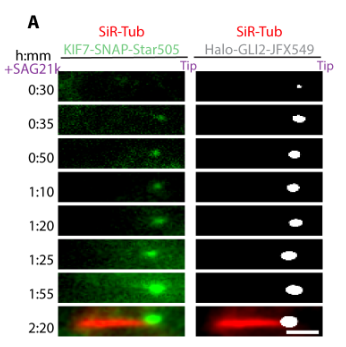

## Question

# Gene Research for Functional Annotation

## ⚠️ CRITICAL: Gene/Protein Identification Context

**BEFORE YOU BEGIN RESEARCH:** You MUST verify you are researching the CORRECT gene/protein. Gene symbols can be ambiguous, especially for less well-characterized genes from non-model organisms.

### Target Gene/Protein Identity (from UniProt):
- **UniProt Accession:** Q2M1P5
- **Protein Description:** RecName: Full=Kinesin-like protein KIF7;
- **Gene Information:** Name=KIF7; ORFNames=UNQ340/PRO539;
- **Organism (full):** Homo sapiens (Human).
- **Protein Family:** Belongs to the TRAFAC class myosin-kinesin ATPase
- **Key Domains:** Kinesin-like_fam. (IPR027640); Kinesin_motor_CS. (IPR019821); Kinesin_motor_dom. (IPR001752); Kinesin_motor_dom_sf. (IPR036961); P-loop_NTPase. (IPR027417)

### MANDATORY VERIFICATION STEPS:

1. **Check if the gene symbol "KIF7" matches the protein description above**
2. **Verify the organism is correct:** Homo sapiens (Human).
3. **Check if protein family/domains align with what you find in literature**
4. **If you find literature for a DIFFERENT gene with the same or similar symbol, STOP**

### If Gene Symbol is Ambiguous or You Cannot Find Relevant Literature:

**DO NOT PROCEED WITH RESEARCH ON A DIFFERENT GENE.** Instead:
- State clearly: "The gene symbol 'KIF7' is ambiguous or literature is limited for this specific protein"
- Explain what you found (e.g., "Found extensive literature on a different gene with the same symbol in a different organism")
- Describe the protein based ONLY on the UniProt information provided above
- Suggest that the protein function can be inferred from domain/family information

### Research Target:

Please provide a comprehensive research report on the gene **KIF7** (gene ID: KIF7, UniProt: Q2M1P5) in human.

The research report should be a detailed narrative explaining the function, biological processes, and localization of the gene product. Citations should be given for all claims.

You should prioritize authoritative reviews and primary scientific literature when conducting research. You can supplement
this with annotations you find in gene/protein databases, but these can be outdated or inaccurate.

We are specifically interested in the primary function of the gene - for enzymes, what reaction is catalyzed, and what is the substrate specificity? For transporters, what is the substrate? For structural proteins or adapters, what is the broader structural role? For signaling molecules, what is the role in the pathway.

We are interested in where in or outside the cell the gene product carries out its function.

We are also interested in the signaling or biochemical pathways in which the gene functions. We are less interested in broad pleiotropic effects, except where these elucidate the precise role.

Include evidence where possible. We are interested in both experimental evidence as well as inference from structure, evolution, or bioinformatic analysis. Precise studies should be prioritized over high-throughput, where available.

## Output

Question: You are an expert researcher providing comprehensive, well-cited information.

Provide detailed information focusing on:
1. Key concepts and definitions with current understanding
2. Recent developments and latest research (prioritize 2023-2024 sources)
3. Current applications and real-world implementations
4. Expert opinions and analysis from authoritative sources
5. Relevant statistics and data from recent studies

Format as a comprehensive research report with proper citations. Include URLs and publication dates where available.
Always prioritize recent, authoritative sources and provide specific citations for all major claims.

# Gene Research for Functional Annotation

## ⚠️ CRITICAL: Gene/Protein Identification Context

**BEFORE YOU BEGIN RESEARCH:** You MUST verify you are researching the CORRECT gene/protein. Gene symbols can be ambiguous, especially for less well-characterized genes from non-model organisms.

### Target Gene/Protein Identity (from UniProt):
- **UniProt Accession:** Q2M1P5
- **Protein Description:** RecName: Full=Kinesin-like protein KIF7;
- **Gene Information:** Name=KIF7; ORFNames=UNQ340/PRO539;
- **Organism (full):** Homo sapiens (Human).
- **Protein Family:** Belongs to the TRAFAC class myosin-kinesin ATPase
- **Key Domains:** Kinesin-like_fam. (IPR027640); Kinesin_motor_CS. (IPR019821); Kinesin_motor_dom. (IPR001752); Kinesin_motor_dom_sf. (IPR036961); P-loop_NTPase. (IPR027417)

### MANDATORY VERIFICATION STEPS:

1. **Check if the gene symbol "KIF7" matches the protein description above**
2. **Verify the organism is correct:** Homo sapiens (Human).
3. **Check if protein family/domains align with what you find in literature**
4. **If you find literature for a DIFFERENT gene with the same or similar symbol, STOP**

### If Gene Symbol is Ambiguous or You Cannot Find Relevant Literature:

**DO NOT PROCEED WITH RESEARCH ON A DIFFERENT GENE.** Instead:
- State clearly: "The gene symbol 'KIF7' is ambiguous or literature is limited for this specific protein"
- Explain what you found (e.g., "Found extensive literature on a different gene with the same symbol in a different organism")
- Describe the protein based ONLY on the UniProt information provided above
- Suggest that the protein function can be inferred from domain/family information

### Research Target:

Please provide a comprehensive research report on the gene **KIF7** (gene ID: KIF7, UniProt: Q2M1P5) in human.

The research report should be a detailed narrative explaining the function, biological processes, and localization of the gene product. Citations should be given for all claims.

You should prioritize authoritative reviews and primary scientific literature when conducting research. You can supplement
this with annotations you find in gene/protein databases, but these can be outdated or inaccurate.

We are specifically interested in the primary function of the gene - for enzymes, what reaction is catalyzed, and what is the substrate specificity? For transporters, what is the substrate? For structural proteins or adapters, what is the broader structural role? For signaling molecules, what is the role in the pathway.

We are interested in where in or outside the cell the gene product carries out its function.

We are also interested in the signaling or biochemical pathways in which the gene functions. We are less interested in broad pleiotropic effects, except where these elucidate the precise role.

Include evidence where possible. We are interested in both experimental evidence as well as inference from structure, evolution, or bioinformatic analysis. Precise studies should be prioritized over high-throughput, where available.

# Human KIF7 (UniProt Q2M1P5): functional annotation and research report

## Identity and principal function

**Identity verified.** The target is human **KIF7**, a kinesin-like protein explicitly identified as **UniProt Q2M1P5** in experiments using its human coiled-coil sequence. It is distinct from the related human kinesin **KIF27** (Q86VH2) and is the vertebrate counterpart of *Drosophila* Costal2, not the fly protein itself. Its N-terminal kinesin motor/ATPase domain and adjacent GLI-binding coiled coil agree with the motor, P-loop NTPase and kinesin-family domains specified in the question. [UniProt record](https://www.uniprot.org/uniprotkb/Q2M1P5/entry); [Haque et al., *Nature Cell Biology*, June 2022](https://doi.org/10.1038/s41556-022-00935-7). (haque2022cytoskeletalregulationof pages 12-14, haque2026howthenonmotile pages 1-4)

**Primary role:** KIF7 is an **atypical, non-motile kinesin-4 and Hedgehog-pathway regulator**. Rather than carrying cargo by walking along microtubules, it helps establish a functional compartment at the **distal tip of the primary cilium** and regulates where and when the GLI transcription factors accumulate. Its experimentally established activities include binding microtubule ends, modifying their growth dynamics and directly binding GLI2; these activities connect ciliary architecture to the balance of GLI activator and repressor signaling. [He et al., *Nature Cell Biology*, June 2014](https://doi.org/10.1038/ncb2988); [Haque et al., 2022](https://doi.org/10.1038/s41556-022-00935-7). (he2014thekinesin4protein pages 6-8, haque2022cytoskeletalregulationof pages 1-2, he2014thekinesin4protein pages 4-6)

The following evidence matrix separates experiments on human KIF7 protein and patient material from mechanistic experiments in mouse cells. (haque2022cytoskeletalregulationof pages 12-14, putoux2011kif7mutationscause pages 10-13, ku2025collaborativeroleof pages 5-8)

| Mechanism or feature | Direct experimental observation | Evidence system and source | Caveat |
|---|---|---|---|
| Molecular identity | Human KIF7 coiled coil was explicitly mapped to UniProt **Q2M1P5**, residues **481–543**; KIF27 was separately identified as UniProt **Q86VH2**, excluding paralog confusion. | Human recombinant constructs; Haque et al., *Nature Cell Biology* (2022); [DOI 10.1038/s41556-022-00935-7](https://doi.org/10.1038/s41556-022-00935-7). | KIF7 is the vertebrate Costal2 ortholog but is not KIF27 or Drosophila Costal2 itself. (haque2022cytoskeletalregulationof pages 12-14) |
| Direct GLI2 binding | GLI2 zinc-finger domain bound the KIF7 coiled coil with **Kd = 48 ± 5 nM**; minimal KIF7 segment **481–543** retained binding at **69 ± 20 nM**. Binding was electrostatic and mutually exclusive with GLI2–DNA binding. | Purified human proteins and biosensor/competition assays; Haque et al. (2022); [DOI 10.1038/s41556-022-00935-7](https://doi.org/10.1038/s41556-022-00935-7). | Direct in-vitro binding; cellular stoichiometry and regulation also depend on microtubules and pathway state. (haque2022cytoskeletalregulationof pages 2-4) |
| Atypical ATPase and plus-end regulation | KIF7 showed no directional motility or substantial lattice diffusion. At **70 nM**, it reduced microtubule growth from **0.81 to 0.52 µm/min** and increased catastrophe from **0.25 to 0.40 min⁻¹**; AMP-PNP largely suppressed these effects. | Recombinant KIF7, TIRF microscopy and dynamic microtubules; He et al., *Nature Cell Biology* (2014); [DOI 10.1038/ncb2988](https://doi.org/10.1038/ncb2988). | Supports ATP-hydrolysis-dependent growth inhibition and catastrophe promotion—not conventional cargo transport or proven active depolymerization. (he2014thekinesin4protein pages 4-6) |
| Ciliary transport versus microtubule binding | Microtubule-binding-deficient KIF7 restored SAG-induced tip localization of GLI2 from **37.6% to 77.6%** and GLI3 from **15.7% to 70.9%** of cells. Acute KIF3A/KIF3B inhibition blocked induced KIF7 tip accumulation. | Kif7-null mouse embryonic fibroblasts; Yue et al., *Molecular Biology of the Cell* (2022); [DOI 10.1091/mbc.e21-04-0215](https://doi.org/10.1091/mbc.e21-04-0215). | KIF7 microtubule binding is dispensable for this trafficking step; kinesin-2/IFT transports KIF7, although other KIF7 functions can require microtubule association. (yue2022hedgehoginducedciliarytrafficking pages 3-5) |
| Human ciliopathy evidence | **Biallelic** KIF7 variants caused hydrolethalus and acrocallosal syndromes. Patient cells had reduced GLI3 repressor, an increased full-length-to-repressor ratio and, in one individual, elongated cilia; eight tested missense alleles were hypomorphic in zebrafish rescue. | Patient tissues and fibroblasts plus zebrafish complementation; Putoux et al., *Nature Genetics* (2011); [DOI 10.1038/ng.826](https://doi.org/10.1038/ng.826). | Strong loss-of-function evidence, but severity did not map simply to genotype; normal ciliogenesis could coexist with defective length control and signalling. (putoux2011kif7mutationscause pages 10-13, putoux2011kif7mutationscause pages 4-5) |
| Temporally controlled GLI2 transport and retention | After Hedgehog activation, GLI2 movement increased during the first **45 min** and declined notably after **60 min**. KIF7 and GLI2 reached tip saturation at about **35 min**, with mean concentration-phase correlation **r = 0.76, n = 9 cilia**; KIF7 loss impaired tip retention. | Live single-particle imaging in **mouse NIH3T3 cells**; Ku et al., *Science Advances* (2025); [DOI 10.1126/sciadv.adt5439](https://doi.org/10.1126/sciadv.adt5439). | Mouse-cell evidence supports a conserved mechanism but is not direct demonstration in human tissue or with endogenous human Q2M1P5. (ku2025collaborativeroleof pages 8-9, ku2025collaborativeroleof pages 5-8) |

*Table: Direct biochemical, cell-biological and human-genetic evidence defining KIF7 function, with quantitative results and limitations. The matrix distinguishes experiments on human Q2M1P5 protein from mouse cellular models.*

## Biochemical mechanism and specificity

**ATPase versus transport.** KIF7 has an N-terminal kinesin ATPase; its chemical substrate is **ATP**, with hydrolysis yielding ADP and inorganic phosphate, not GLI or tubulin. Microtubules are interaction partners and modifiers of its ATPase cycle—not transported substrates. Purified KIF7 did **not** show the directional stepping expected of a conventional cargo-transport kinesin. Instead, it preferentially associated with growing microtubule plus ends and GTP-like tubulin; ATP hydrolysis sharpened its discrimination between GTP-like ends and the GDP-tubulin lattice. A 2019 biochemical study measured a **15–30-fold** preference for GTP-like tubulin states and a GMPCPP/GDP segment-enrichment ratio of **10.53 ± 6.04 with ATP versus 2.51 ± 0.96 with nonhydrolysable AMPPNP**. These are binding-state preferences, not a claim that KIF7 hydrolyzes tubulin-bound GTP. [Jiang et al., *Developmental Cell*, June 2019](https://doi.org/10.1016/j.devcel.2019.04.001); [He et al., 2014](https://doi.org/10.1038/ncb2988). (jiang2019interplaybetweenthe pages 1-3, jiang2019interplaybetweenthe pages 7-8, he2014thekinesin4protein pages 4-6, jiang2019interplaybetweenthe pages 3-4)

KIF7 also **limits microtubule plus-end growth and promotes catastrophe** in purified-protein assays: at 70 nM KIF7, growth declined from **0.81 to 0.52 µm/min** and catastrophe rose from **0.25 to 0.40 events/min**. In mouse fibroblasts, loss of Kif7 produced cilia approximately **30% longer**, with abnormal distal architecture and reduced resistance to microtubule-destabilizing treatments. These findings justify describing KIF7 as a regulator of microtubule-end dynamics and ciliary-tip organization; they do not, by themselves, establish that it directly depolymerizes an existing microtubule lattice. [He et al., 2014](https://doi.org/10.1038/ncb2988). (he2014thekinesin4protein pages 3-4, he2014thekinesin4protein pages 4-6, he2014thekinesin4protein pages 6-8)

**Direct GLI recognition.** Human KIF7's acidic coiled-coil region binds the DNA-binding zinc fingers of GLI2. Purified-protein measurements gave a dissociation constant of **48 ± 5 nM** for the KIF7 coiled coil and **69 ± 20 nM** for a shorter KIF7 segment spanning residues **481–543**. Structural and mutational experiments support **DNA mimicry**: the elongated, negatively charged KIF7 surface engages GLI2 zinc fingers 2–3, which also contact the DNA phosphate backbone; GLI2 binding to KIF7 and to DNA competes in vitro. The interaction can recruit GLI2 to microtubules and increase KIF7–microtubule association. Thus, KIF7 functions as a regulated **cytoskeletal signaling scaffold**, not a GLI-modifying enzyme. [Haque et al., 2022](https://doi.org/10.1038/s41556-022-00935-7). (haque2022cytoskeletalregulationof pages 4-6, haque2022cytoskeletalregulationof pages 2-4, haque2022cytoskeletalregulationof pages 1-2)

## Where KIF7 acts and how it fits into Hedgehog signaling

The relevant location is **inside the primary cilium, particularly the distal axonemal tip**, with a localization that changes with signaling state; KIF7 is also observed near the **ciliary base/transition zone** and on cytoplasmic microtubules in experimental settings. When Hedgehog signaling is low, KIF7 is predominantly basal; after pathway activation, KIF7 and GLI accumulate at the distal tip. KIF7 is an intracellular protein acting on the ciliary microtubule-based signaling machinery, rather than a secreted Hedgehog ligand or a ciliary-membrane receptor. [Haque et al., 2022](https://doi.org/10.1038/s41556-022-00935-7); [He et al., 2014](https://doi.org/10.1038/ncb2988). (haque2022cytoskeletalregulationof pages 1-2, he2014thekinesin4protein pages 3-4)

In the canonical vertebrate pathway, Hedgehog ligand relieves **PTCH1-mediated repression of SMO**; activated SMO accumulates in the cilium and the balance between GLI2/3 activators and processed repressors changes. KIF7 acts on the **ciliary GLI-regulatory side** of this cascade. Mouse Kif7-null cilia can admit SMO and GLI2, but fail to concentrate GLI2 and its inhibitor **SUFU** in a single normal distal-tip compartment: GLI/SUFU and IFT components instead appear in ectopic shaft puncta. Patient fibroblasts independently show impaired production of the **GLI3 repressor**, linking ciliary KIF7 function to transcriptional output. Importantly, the mechanistic evidence for *direct* binding here is strongest for KIF7–GLI2; colocalization of KIF7 with SUFU-containing complexes should not be mistaken for proof of an equivalent direct KIF7–SUFU binding mechanism. [Hilgendorf, Myers and Reiter, *Nature Reviews Molecular Cell Biology*, February 2024](https://doi.org/10.1038/s41580-023-00698-5); [He et al., 2014](https://doi.org/10.1038/ncb2988); [Putoux et al., *Nature Genetics*, June 2011](https://doi.org/10.1038/ng.826). (hilgendorf2024emergingmechanisticunderstanding pages 8-9, hilgendorf2024emergingmechanisticunderstanding pages 11-13, he2014thekinesin4protein pages 6-8, putoux2011kif7mutationscause pages 10-13)

**An important mechanistic distinction:** KIF7 itself is **not the principal anterograde intraflagellar-transport motor**. Acute inhibition of kinesin-2 **KIF3A/KIF3B/KAP** blocks Hedgehog-induced KIF7 delivery to the tip. Moreover, a KIF7 variant engineered to lack microtubule binding still rescued stimulated tip localization of GLI2 (**37.6% to 77.6% of cells**) and GLI3 (**15.7% to 70.9%**). Therefore, direct KIF7–microtubule binding, although biochemically real and relevant to tip architecture, is **not obligatory for this particular stimulated GLI-localization readout**. This qualifies a simple model in which KIF7 walks or must track plus ends to deliver GLI. [Yue et al., *Molecular Biology of the Cell*, January 2022](https://doi.org/10.1091/mbc.e21-04-0215). (yue2022hedgehoginducedciliarytrafficking pages 1-2, yue2022hedgehoginducedciliarytrafficking pages 3-5)

## Recent research and expert assessment

Authoritative reviews published in **2023–2024** frame primary cilia as regulated signaling compartments rather than passive protein containers. The 2024 review by **Hilgendorf, Myers and Reiter** identifies KIF7, alongside SUFU, as a GLI regulator, while explicitly noting that **how SMO and PKA control KIF7 and SUFU remains unresolved**. This is a useful boundary between the well-supported direct KIF7–GLI interaction and a complete, still-unsettled upstream signaling mechanism. [Mill, Christensen and Pedersen, *Nature Reviews Genetics*, April 2023](https://doi.org/10.1038/s41576-023-00587-9); [Hilgendorf et al., February 2024](https://doi.org/10.1038/s41580-023-00698-5). (mill2023primaryciliaas pages 9-11, hilgendorf2024emergingmechanisticunderstanding pages 11-13)

A subsequent **peer-reviewed 2025** single-particle imaging study refined the transport model in **mouse NIH3T3 cells**: GLI2 traveled on IFT trains, showed a burst of predominantly anterograde movement during the first **45 minutes** after pathway activation, and accumulated at the ciliary tip together with KIF7. Their tip-intensity trajectories had a mean concentration-phase correlation of **0.76 across nine cilia**. Without KIF7, GLI2 could still move with IFT but entered or accumulated abnormally along the shaft and was not retained normally at the tip. KIF7 therefore helps control **GLI2 entry, transport timing and tip retention**, while IFT supplies the physical long-range movement. The paper's cropped **Figure 4A–C** provides visual evidence of synchronized KIF7–GLI2 accumulation and KIF7 cotransport with IFT88. These are compelling conserved-pathway results, but the live-cell experiments were in **mouse**, not human, fibroblasts. [Ku et al., *Science Advances*, 12 March 2025](https://doi.org/10.1126/sciadv.adt5439). (ku2025collaborativeroleof pages 8-9, ku2025collaborativeroleof pages 9-11, ku2025collaborativeroleof pages 5-8, ku2025collaborativeroleof media 58fcd002)

A **February 2026 bioRxiv preprint**, not yet equivalent to peer-reviewed confirmation, proposes that GLI2 binding releases KIF7 autoinhibition and that ATP turnover prevents excessive sequestration on cytoplasmic microtubules. Its ATPase-impaired K100A mutant had detectable tip localization in **fewer than 10%** of cells versus approximately **78%** for wild-type KIF7 after stimulation. This is a promising explanation for how an ATPase can be essential without KIF7 functioning as a walking motor, but its structural/autoinhibition model should be labeled preliminary. [Haque et al., bioRxiv, February 2026](https://doi.org/10.64898/2026.02.06.704517). (haque2026howthenonmotile pages 1-4, haque2026howthenonmotile pages 15-18)

## Human relevance and practical applications

The strongest human evidence is **autosomal-recessive KIF7-related ciliopathy**. Biallelic pathogenic variants cause an overlapping **acrocallosal–fetal hydrolethalus** spectrum featuring polydactyly and brain/midline malformations; the original study found abnormal GLI-target expression and an increased full-length-GLI3-to-GLI3-repressor ratio in affected material. Notably, affected fibroblasts could still form cilia: a defect in **ciliary signaling and organization** need not be a complete failure of ciliogenesis. KIF7's established real-world application is therefore as a gene for **molecular diagnosis and variant interpretation** in compatible developmental-ciliopathy phenotypes, supported where possible by segregation and functional evidence. [Putoux et al., June 2011](https://doi.org/10.1038/ng.826). (putoux2011kif7mutationscause pages 2-4, putoux2011kif7mutationscause pages 10-13, putoux2011kif7mutationscause pages 4-5)

Open Targets also lists associations with **Joubert syndrome** and related phenotypes, but its disease-association scores should not be interpreted as disease prevalence or independent proof that every reported variant is causal. A **2024 single-patient** report described retinal dystrophy and one heterozygous KIF7 stop variant, **c.61C>T (p.Arg21*)**; because established syndromic KIF7 disease is predominantly recessive and the report does not establish monoallelic causality, this finding should **not** be treated as proof that one KIF7 allele causes isolated retinitis pigmentosa. [Open Targets, KIF7 disease associations](https://platform.opentargets.org/target/ENSG00000166813/associations); [Ruiz-Matos et al., *Cureus*, June 2024](https://doi.org/10.7759/cureus.62689). (OpenTargets Search: -KIF7, ruizmatos2024retinitispigmentosasine pages 1-2, ruizmatos2024retinitispigmentosasine pages 2-5)

**Overall annotation:** Human KIF7 is best annotated as an **ATP-hydrolyzing but non-processive kinesin-4, microtubule-plus-end regulator and ciliary GLI scaffold** that tunes canonical Hedgehog signaling by organizing the distal ciliary signaling compartment and controlling GLI localization and repressor/activator balance. Its most secure direct molecular partners are **microtubules and GLI2**; kinesin-2/IFT performs the ciliary transport with which KIF7 cooperates. The need for KIF7's microtubule-binding activity depends on the **specific assay and mechanistic step**, and the complete upstream mechanism connecting activated SMO to KIF7 remains unresolved. (haque2022cytoskeletalregulationof pages 2-4, he2014thekinesin4protein pages 4-6, hilgendorf2024emergingmechanisticunderstanding pages 11-13, yue2022hedgehoginducedciliarytrafficking pages 3-5, ku2025collaborativeroleof pages 9-11)

References

1. (haque2022cytoskeletalregulationof pages 12-14): Farah Haque, Christian Freniere, Qiong Ye, Nandini Mani, Elizabeth M. Wilson-Kubalek, Pei-I Ku, Ronald A. Milligan, and Radhika Subramanian. Cytoskeletal regulation of a transcription factor by dna mimicry via coiled-coil interactions. Nature Cell Biology, 24:1088-1098, Jun 2022. URL: https://doi.org/10.1038/s41556-022-00935-7, doi:10.1038/s41556-022-00935-7. This article has 26 citations and is from a highest quality peer-reviewed journal.

2. (haque2026howthenonmotile pages 1-4): Farah Haque, Bindu Y. Srinivasu, John R. Engen, Thomas E. Wales, and Radhika Subramanian. How the non-motile kinesin kif7 adapts conserved kinesin principles for its function in hedgehog signaling. bioRxiv, Feb 2026. URL: https://doi.org/10.64898/2026.02.06.704517, doi:10.64898/2026.02.06.704517. This article has 2 citations.

3. (he2014thekinesin4protein pages 6-8): Mu He, Radhika Subramanian, Fiona Bangs, Tatiana Omelchenko, Karel F. Liem Jr, Tarun M. Kapoor, and Kathryn V. Anderson. The kinesin-4 protein kif7 regulates mammalian hedgehog signalling by organizing the cilium tip compartment. Jun 2014. URL: https://doi.org/10.1038/ncb2988, doi:10.1038/ncb2988. This article has 372 citations and is from a highest quality peer-reviewed journal.

4. (haque2022cytoskeletalregulationof pages 1-2): Farah Haque, Christian Freniere, Qiong Ye, Nandini Mani, Elizabeth M. Wilson-Kubalek, Pei-I Ku, Ronald A. Milligan, and Radhika Subramanian. Cytoskeletal regulation of a transcription factor by dna mimicry via coiled-coil interactions. Nature Cell Biology, 24:1088-1098, Jun 2022. URL: https://doi.org/10.1038/s41556-022-00935-7, doi:10.1038/s41556-022-00935-7. This article has 26 citations and is from a highest quality peer-reviewed journal.

5. (he2014thekinesin4protein pages 4-6): Mu He, Radhika Subramanian, Fiona Bangs, Tatiana Omelchenko, Karel F. Liem Jr, Tarun M. Kapoor, and Kathryn V. Anderson. The kinesin-4 protein kif7 regulates mammalian hedgehog signalling by organizing the cilium tip compartment. Jun 2014. URL: https://doi.org/10.1038/ncb2988, doi:10.1038/ncb2988. This article has 372 citations and is from a highest quality peer-reviewed journal.

6. (putoux2011kif7mutationscause pages 10-13): Audrey Putoux, Sophie Thomas, Karlien L M Coene, Erica E Davis, Yasemin Alanay, Gönül Ogur, Elif Uz, Daniela Buzas, Céline Gomes, Sophie Patrier, Christopher L Bennett, Nadia Elkhartoufi, Marie-Hélène Saint Frison, Luc Rigonnot, Nicole Joyé, Solenn Pruvost, Gulen Eda Utine, Koray Boduroglu, Patrick Nitschke, Laura Fertitta, Christel Thauvin-Robinet, Arnold Munnich, Valérie Cormier-Daire, Raoul Hennekam, Estelle Colin, Nurten Ayse Akarsu, Christine Bole-Feysot, Nicolas Cagnard, Alain Schmitt, Nicolas Goudin, Stanislas Lyonnet, Férechté Encha-Razavi, Jean-Pierre Siffroi, Mark Winey, Nicholas Katsanis, Marie Gonzales, Michel Vekemans, Philip L Beales, and Tania Attié-Bitach. Kif7 mutations cause fetal hydrolethalus and acrocallosal syndromes. Nature Genetics, 43:601-606, Jun 2011. URL: https://doi.org/10.1038/ng.826, doi:10.1038/ng.826. This article has 290 citations and is from a highest quality peer-reviewed journal.

7. (ku2025collaborativeroleof pages 5-8): Pei-I Ku, Jamuna S. Sreeja, Abhishek Chadha, David S. Williams, Martin F. Engelke, and Radhika Subramanian. Collaborative role of two distinct cilium-specific cytoskeletal systems in driving hedgehog-responsive transcription factor trafficking. Mar 2025. URL: https://doi.org/10.1126/sciadv.adt5439, doi:10.1126/sciadv.adt5439. This article has 13 citations and is from a highest quality peer-reviewed journal.

8. (haque2022cytoskeletalregulationof pages 2-4): Farah Haque, Christian Freniere, Qiong Ye, Nandini Mani, Elizabeth M. Wilson-Kubalek, Pei-I Ku, Ronald A. Milligan, and Radhika Subramanian. Cytoskeletal regulation of a transcription factor by dna mimicry via coiled-coil interactions. Nature Cell Biology, 24:1088-1098, Jun 2022. URL: https://doi.org/10.1038/s41556-022-00935-7, doi:10.1038/s41556-022-00935-7. This article has 26 citations and is from a highest quality peer-reviewed journal.

9. (yue2022hedgehoginducedciliarytrafficking pages 3-5): Yang Yue, Martin F. Engelke, T. Lynne Blasius, and Kristen J. Verhey. Hedgehog-induced ciliary trafficking of kinesin-4 motor kif7 requires intraflagellar transport but not kif7’s microtubule binding. Jan 2022. URL: https://doi.org/10.1091/mbc.e21-04-0215, doi:10.1091/mbc.e21-04-0215. This article has 16 citations and is from a domain leading peer-reviewed journal.

10. (putoux2011kif7mutationscause pages 4-5): Audrey Putoux, Sophie Thomas, Karlien L M Coene, Erica E Davis, Yasemin Alanay, Gönül Ogur, Elif Uz, Daniela Buzas, Céline Gomes, Sophie Patrier, Christopher L Bennett, Nadia Elkhartoufi, Marie-Hélène Saint Frison, Luc Rigonnot, Nicole Joyé, Solenn Pruvost, Gulen Eda Utine, Koray Boduroglu, Patrick Nitschke, Laura Fertitta, Christel Thauvin-Robinet, Arnold Munnich, Valérie Cormier-Daire, Raoul Hennekam, Estelle Colin, Nurten Ayse Akarsu, Christine Bole-Feysot, Nicolas Cagnard, Alain Schmitt, Nicolas Goudin, Stanislas Lyonnet, Férechté Encha-Razavi, Jean-Pierre Siffroi, Mark Winey, Nicholas Katsanis, Marie Gonzales, Michel Vekemans, Philip L Beales, and Tania Attié-Bitach. Kif7 mutations cause fetal hydrolethalus and acrocallosal syndromes. Nature Genetics, 43:601-606, Jun 2011. URL: https://doi.org/10.1038/ng.826, doi:10.1038/ng.826. This article has 290 citations and is from a highest quality peer-reviewed journal.

11. (ku2025collaborativeroleof pages 8-9): Pei-I Ku, Jamuna S. Sreeja, Abhishek Chadha, David S. Williams, Martin F. Engelke, and Radhika Subramanian. Collaborative role of two distinct cilium-specific cytoskeletal systems in driving hedgehog-responsive transcription factor trafficking. Mar 2025. URL: https://doi.org/10.1126/sciadv.adt5439, doi:10.1126/sciadv.adt5439. This article has 13 citations and is from a highest quality peer-reviewed journal.

12. (jiang2019interplaybetweenthe pages 1-3): Shuo Jiang, Nandini Mani, Elizabeth M. Wilson-Kubalek, Pei-I Ku, Ronald A. Milligan, and Radhika Subramanian. Interplay between the kinesin and tubulin mechanochemical cycles underlies microtubule tip tracking by the non-motile ciliary kinesin kif7. Developmental cell, 49 5:711-730.e8, Jun 2019. URL: https://doi.org/10.1016/j.devcel.2019.04.001, doi:10.1016/j.devcel.2019.04.001. This article has 35 citations and is from a highest quality peer-reviewed journal.

13. (jiang2019interplaybetweenthe pages 7-8): Shuo Jiang, Nandini Mani, Elizabeth M. Wilson-Kubalek, Pei-I Ku, Ronald A. Milligan, and Radhika Subramanian. Interplay between the kinesin and tubulin mechanochemical cycles underlies microtubule tip tracking by the non-motile ciliary kinesin kif7. Developmental cell, 49 5:711-730.e8, Jun 2019. URL: https://doi.org/10.1016/j.devcel.2019.04.001, doi:10.1016/j.devcel.2019.04.001. This article has 35 citations and is from a highest quality peer-reviewed journal.

14. (jiang2019interplaybetweenthe pages 3-4): Shuo Jiang, Nandini Mani, Elizabeth M. Wilson-Kubalek, Pei-I Ku, Ronald A. Milligan, and Radhika Subramanian. Interplay between the kinesin and tubulin mechanochemical cycles underlies microtubule tip tracking by the non-motile ciliary kinesin kif7. Developmental cell, 49 5:711-730.e8, Jun 2019. URL: https://doi.org/10.1016/j.devcel.2019.04.001, doi:10.1016/j.devcel.2019.04.001. This article has 35 citations and is from a highest quality peer-reviewed journal.

15. (he2014thekinesin4protein pages 3-4): Mu He, Radhika Subramanian, Fiona Bangs, Tatiana Omelchenko, Karel F. Liem Jr, Tarun M. Kapoor, and Kathryn V. Anderson. The kinesin-4 protein kif7 regulates mammalian hedgehog signalling by organizing the cilium tip compartment. Jun 2014. URL: https://doi.org/10.1038/ncb2988, doi:10.1038/ncb2988. This article has 372 citations and is from a highest quality peer-reviewed journal.

16. (haque2022cytoskeletalregulationof pages 4-6): Farah Haque, Christian Freniere, Qiong Ye, Nandini Mani, Elizabeth M. Wilson-Kubalek, Pei-I Ku, Ronald A. Milligan, and Radhika Subramanian. Cytoskeletal regulation of a transcription factor by dna mimicry via coiled-coil interactions. Nature Cell Biology, 24:1088-1098, Jun 2022. URL: https://doi.org/10.1038/s41556-022-00935-7, doi:10.1038/s41556-022-00935-7. This article has 26 citations and is from a highest quality peer-reviewed journal.

17. (hilgendorf2024emergingmechanisticunderstanding pages 8-9): Keren I. Hilgendorf, Benjamin R. Myers, and Jeremy F. Reiter. Emerging mechanistic understanding of cilia function in cellular signalling. Nature reviews. Molecular cell biology, 25:555-573, Feb 2024. URL: https://doi.org/10.1038/s41580-023-00698-5, doi:10.1038/s41580-023-00698-5. This article has 206 citations.

18. (hilgendorf2024emergingmechanisticunderstanding pages 11-13): Keren I. Hilgendorf, Benjamin R. Myers, and Jeremy F. Reiter. Emerging mechanistic understanding of cilia function in cellular signalling. Nature reviews. Molecular cell biology, 25:555-573, Feb 2024. URL: https://doi.org/10.1038/s41580-023-00698-5, doi:10.1038/s41580-023-00698-5. This article has 206 citations.

19. (yue2022hedgehoginducedciliarytrafficking pages 1-2): Yang Yue, Martin F. Engelke, T. Lynne Blasius, and Kristen J. Verhey. Hedgehog-induced ciliary trafficking of kinesin-4 motor kif7 requires intraflagellar transport but not kif7’s microtubule binding. Jan 2022. URL: https://doi.org/10.1091/mbc.e21-04-0215, doi:10.1091/mbc.e21-04-0215. This article has 16 citations and is from a domain leading peer-reviewed journal.

20. (mill2023primaryciliaas pages 9-11): Pleasantine Mill, Søren T. Christensen, and Lotte B. Pedersen. Primary cilia as dynamic and diverse signalling hubs in development and disease. Nature reviews. Genetics, 24:421-441, Apr 2023. URL: https://doi.org/10.1038/s41576-023-00587-9, doi:10.1038/s41576-023-00587-9. This article has 503 citations.

21. (ku2025collaborativeroleof pages 9-11): Pei-I Ku, Jamuna S. Sreeja, Abhishek Chadha, David S. Williams, Martin F. Engelke, and Radhika Subramanian. Collaborative role of two distinct cilium-specific cytoskeletal systems in driving hedgehog-responsive transcription factor trafficking. Mar 2025. URL: https://doi.org/10.1126/sciadv.adt5439, doi:10.1126/sciadv.adt5439. This article has 13 citations and is from a highest quality peer-reviewed journal.

22. (ku2025collaborativeroleof media 58fcd002): Pei-I Ku, Jamuna S. Sreeja, Abhishek Chadha, David S. Williams, Martin F. Engelke, and Radhika Subramanian. Collaborative role of two distinct cilium-specific cytoskeletal systems in driving hedgehog-responsive transcription factor trafficking. Mar 2025. URL: https://doi.org/10.1126/sciadv.adt5439, doi:10.1126/sciadv.adt5439. This article has 13 citations and is from a highest quality peer-reviewed journal.

23. (haque2026howthenonmotile pages 15-18): Farah Haque, Bindu Y. Srinivasu, John R. Engen, Thomas E. Wales, and Radhika Subramanian. How the non-motile kinesin kif7 adapts conserved kinesin principles for its function in hedgehog signaling. bioRxiv, Feb 2026. URL: https://doi.org/10.64898/2026.02.06.704517, doi:10.64898/2026.02.06.704517. This article has 2 citations.

24. (putoux2011kif7mutationscause pages 2-4): Audrey Putoux, Sophie Thomas, Karlien L M Coene, Erica E Davis, Yasemin Alanay, Gönül Ogur, Elif Uz, Daniela Buzas, Céline Gomes, Sophie Patrier, Christopher L Bennett, Nadia Elkhartoufi, Marie-Hélène Saint Frison, Luc Rigonnot, Nicole Joyé, Solenn Pruvost, Gulen Eda Utine, Koray Boduroglu, Patrick Nitschke, Laura Fertitta, Christel Thauvin-Robinet, Arnold Munnich, Valérie Cormier-Daire, Raoul Hennekam, Estelle Colin, Nurten Ayse Akarsu, Christine Bole-Feysot, Nicolas Cagnard, Alain Schmitt, Nicolas Goudin, Stanislas Lyonnet, Férechté Encha-Razavi, Jean-Pierre Siffroi, Mark Winey, Nicholas Katsanis, Marie Gonzales, Michel Vekemans, Philip L Beales, and Tania Attié-Bitach. Kif7 mutations cause fetal hydrolethalus and acrocallosal syndromes. Nature Genetics, 43:601-606, Jun 2011. URL: https://doi.org/10.1038/ng.826, doi:10.1038/ng.826. This article has 290 citations and is from a highest quality peer-reviewed journal.

25. (OpenTargets Search: -KIF7): Open Targets Query (-KIF7, 5 results). Buniello, A. et al. (2025). Open Targets Platform: facilitating therapeutic hypotheses building in drug discovery. Nucleic Acids Research.

26. (ruizmatos2024retinitispigmentosasine pages 1-2): Sebastián J Ruiz-Matos, Armando J Ruiz-Justiz, and Natalio Izquierdo. Retinitis pigmentosa sine pigmento in a patient with a heterozygous mutation on the kif7 gene: a case report. Jun 2024. URL: https://doi.org/10.7759/cureus.62689, doi:10.7759/cureus.62689. This article has 2 citations.

27. (ruizmatos2024retinitispigmentosasine pages 2-5): Sebastián J Ruiz-Matos, Armando J Ruiz-Justiz, and Natalio Izquierdo. Retinitis pigmentosa sine pigmento in a patient with a heterozygous mutation on the kif7 gene: a case report. Jun 2024. URL: https://doi.org/10.7759/cureus.62689, doi:10.7759/cureus.62689. This article has 2 citations.

## Artifacts

- [Edison artifact artifact-00](KIF7-deep-research-falcon_artifacts/artifact-00.md)

## Citations

1. haque2022cytoskeletalregulationof pages 12-14
2. haque2022cytoskeletalregulationof pages 2-4
3. yue2022hedgehoginducedciliarytrafficking pages 3-5
4. haque2026howthenonmotile pages 1-4
5. haque2022cytoskeletalregulationof pages 1-2
6. ku2025collaborativeroleof pages 5-8
7. ku2025collaborativeroleof pages 8-9
8. jiang2019interplaybetweenthe pages 1-3
9. jiang2019interplaybetweenthe pages 7-8
10. jiang2019interplaybetweenthe pages 3-4
11. haque2022cytoskeletalregulationof pages 4-6
12. hilgendorf2024emergingmechanisticunderstanding pages 8-9
13. hilgendorf2024emergingmechanisticunderstanding pages 11-13
14. yue2022hedgehoginducedciliarytrafficking pages 1-2
15. mill2023primaryciliaas pages 9-11
16. ku2025collaborativeroleof pages 9-11
17. haque2026howthenonmotile pages 15-18
18. ruizmatos2024retinitispigmentosasine pages 1-2
19. ruizmatos2024retinitispigmentosasine pages 2-5
20. UniProt record
21. Haque et al., *Nature Cell Biology*, June 2022
22. He et al., *Nature Cell Biology*, June 2014
23. Haque et al., 2022
24. DOI 10.1038/s41556-022-00935-7
25. DOI 10.1038/ncb2988
26. DOI 10.1091/mbc.e21-04-0215
27. DOI 10.1038/ng.826
28. DOI 10.1126/sciadv.adt5439
29. Jiang et al., *Developmental Cell*, June 2019
30. He et al., 2014
31. Hilgendorf, Myers and Reiter, *Nature Reviews Molecular Cell Biology*, February 2024
32. Putoux et al., *Nature Genetics*, June 2011
33. Yue et al., *Molecular Biology of the Cell*, January 2022
34. Mill, Christensen and Pedersen, *Nature Reviews Genetics*, April 2023
35. Hilgendorf et al., February 2024
36. Ku et al., *Science Advances*, 12 March 2025
37. Haque et al., bioRxiv, February 2026
38. Putoux et al., June 2011
39. Open Targets, KIF7 disease associations
40. Ruiz-Matos et al., *Cureus*, June 2024
41. https://www.uniprot.org/uniprotkb/Q2M1P5/entry
42. https://doi.org/10.1038/s41556-022-00935-7
43. https://doi.org/10.1038/ncb2988
44. https://doi.org/10.1091/mbc.e21-04-0215
45. https://doi.org/10.1038/ng.826
46. https://doi.org/10.1126/sciadv.adt5439
47. https://doi.org/10.1016/j.devcel.2019.04.001
48. https://doi.org/10.1038/s41580-023-00698-5
49. https://doi.org/10.1038/s41576-023-00587-9
50. https://doi.org/10.64898/2026.02.06.704517
51. https://platform.opentargets.org/target/ENSG00000166813/associations
52. https://doi.org/10.7759/cureus.62689
53. https://doi.org/10.1038/s41556-022-00935-7,
54. https://doi.org/10.64898/2026.02.06.704517,
55. https://doi.org/10.1038/ncb2988,
56. https://doi.org/10.1038/ng.826,
57. https://doi.org/10.1126/sciadv.adt5439,
58. https://doi.org/10.1091/mbc.e21-04-0215,
59. https://doi.org/10.1016/j.devcel.2019.04.001,
60. https://doi.org/10.1038/s41580-023-00698-5,
61. https://doi.org/10.1038/s41576-023-00587-9,
62. https://doi.org/10.7759/cureus.62689,