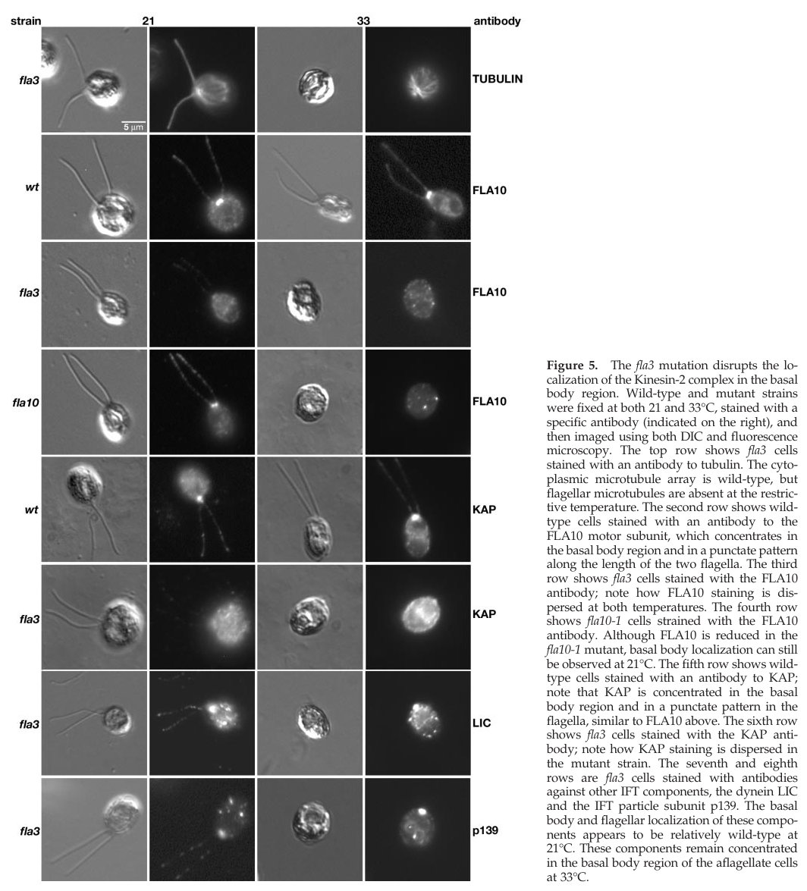

## Question

# Gene Research for Functional Annotation

## ⚠️ CRITICAL: Gene/Protein Identification Context

**BEFORE YOU BEGIN RESEARCH:** You MUST verify you are researching the CORRECT gene/protein. Gene symbols can be ambiguous, especially for less well-characterized genes from non-model organisms.

### Target Gene/Protein Identity (from UniProt):
- **UniProt Accession:** Q92845
- **Protein Description:** RecName: Full=Kinesin-associated protein 3; Short=KAP-3; Short=KAP3; AltName: Full=Smg GDS-associated protein;
- **Gene Information:** Name=KIFAP3; Synonyms=KIF3AP, SMAP;
- **Organism (full):** Homo sapiens (Human).
- **Protein Family:** Not specified in UniProt
- **Key Domains:** ARM-like. (IPR011989); ARM-type_fold. (IPR016024); Armadillo. (IPR000225); KAP3. (IPR008658); KAP (PF05804)

### MANDATORY VERIFICATION STEPS:

1. **Check if the gene symbol "KIFAP3" matches the protein description above**
2. **Verify the organism is correct:** Homo sapiens (Human).
3. **Check if protein family/domains align with what you find in literature**
4. **If you find literature for a DIFFERENT gene with the same or similar symbol, STOP**

### If Gene Symbol is Ambiguous or You Cannot Find Relevant Literature:

**DO NOT PROCEED WITH RESEARCH ON A DIFFERENT GENE.** Instead:
- State clearly: "The gene symbol 'KIFAP3' is ambiguous or literature is limited for this specific protein"
- Explain what you found (e.g., "Found extensive literature on a different gene with the same symbol in a different organism")
- Describe the protein based ONLY on the UniProt information provided above
- Suggest that the protein function can be inferred from domain/family information

### Research Target:

Please provide a comprehensive research report on the gene **KIFAP3** (gene ID: KIFAP3, UniProt: Q92845) in human.

The research report should be a detailed narrative explaining the function, biological processes, and localization of the gene product. Citations should be given for all claims.

You should prioritize authoritative reviews and primary scientific literature when conducting research. You can supplement
this with annotations you find in gene/protein databases, but these can be outdated or inaccurate.

We are specifically interested in the primary function of the gene - for enzymes, what reaction is catalyzed, and what is the substrate specificity? For transporters, what is the substrate? For structural proteins or adapters, what is the broader structural role? For signaling molecules, what is the role in the pathway.

We are interested in where in or outside the cell the gene product carries out its function.

We are also interested in the signaling or biochemical pathways in which the gene functions. We are less interested in broad pleiotropic effects, except where these elucidate the precise role.

Include evidence where possible. We are interested in both experimental evidence as well as inference from structure, evolution, or bioinformatic analysis. Precise studies should be prioritized over high-throughput, where available.

## Output

Question: You are an expert researcher providing comprehensive, well-cited information.

Provide detailed information focusing on:
1. Key concepts and definitions with current understanding
2. Recent developments and latest research (prioritize 2023-2024 sources)
3. Current applications and real-world implementations
4. Expert opinions and analysis from authoritative sources
5. Relevant statistics and data from recent studies

Format as a comprehensive research report with proper citations. Include URLs and publication dates where available.
Always prioritize recent, authoritative sources and provide specific citations for all major claims.

# Gene Research for Functional Annotation

## ⚠️ CRITICAL: Gene/Protein Identification Context

**BEFORE YOU BEGIN RESEARCH:** You MUST verify you are researching the CORRECT gene/protein. Gene symbols can be ambiguous, especially for less well-characterized genes from non-model organisms.

### Target Gene/Protein Identity (from UniProt):
- **UniProt Accession:** Q92845
- **Protein Description:** RecName: Full=Kinesin-associated protein 3; Short=KAP-3; Short=KAP3; AltName: Full=Smg GDS-associated protein;
- **Gene Information:** Name=KIFAP3; Synonyms=KIF3AP, SMAP;
- **Organism (full):** Homo sapiens (Human).
- **Protein Family:** Not specified in UniProt
- **Key Domains:** ARM-like. (IPR011989); ARM-type_fold. (IPR016024); Armadillo. (IPR000225); KAP3. (IPR008658); KAP (PF05804)

### MANDATORY VERIFICATION STEPS:

1. **Check if the gene symbol "KIFAP3" matches the protein description above**
2. **Verify the organism is correct:** Homo sapiens (Human).
3. **Check if protein family/domains align with what you find in literature**
4. **If you find literature for a DIFFERENT gene with the same or similar symbol, STOP**

### If Gene Symbol is Ambiguous or You Cannot Find Relevant Literature:

**DO NOT PROCEED WITH RESEARCH ON A DIFFERENT GENE.** Instead:
- State clearly: "The gene symbol 'KIFAP3' is ambiguous or literature is limited for this specific protein"
- Explain what you found (e.g., "Found extensive literature on a different gene with the same symbol in a different organism")
- Describe the protein based ONLY on the UniProt information provided above
- Suggest that the protein function can be inferred from domain/family information

### Research Target:

Please provide a comprehensive research report on the gene **KIFAP3** (gene ID: KIFAP3, UniProt: Q92845) in human.

The research report should be a detailed narrative explaining the function, biological processes, and localization of the gene product. Citations should be given for all claims.

You should prioritize authoritative reviews and primary scientific literature when conducting research. You can supplement
this with annotations you find in gene/protein databases, but these can be outdated or inaccurate.

We are specifically interested in the primary function of the gene - for enzymes, what reaction is catalyzed, and what is the substrate specificity? For transporters, what is the substrate? For structural proteins or adapters, what is the broader structural role? For signaling molecules, what is the role in the pathway.

We are interested in where in or outside the cell the gene product carries out its function.

We are also interested in the signaling or biochemical pathways in which the gene functions. We are less interested in broad pleiotropic effects, except where these elucidate the precise role.

Include evidence where possible. We are interested in both experimental evidence as well as inference from structure, evolution, or bioinformatic analysis. Precise studies should be prioritized over high-throughput, where available.

# Human KIFAP3 (KAP3): functional-annotation research report

## Identity and principal function

**Identity verified against the supplied UniProt record:** Q92845 denotes the *Homo sapiens* protein kinesin-associated protein 3, encoded by **KIFAP3** and also named KIF3AP or SMAP. Historical biochemical work explicitly identifies human SMAP as the armadillo-repeat-containing human counterpart of mouse KAP3; experiments with human KAP3 confirm the predicted ARM-repeat α-solenoid architecture. The literature examined supports the protein and alias match, although the cited papers do not independently print accession Q92845. This is **not** KIF3A, KIF3B or KIF3C: those are kinesin motor subunits, whereas KIFAP3 is their associated **nonmotor adaptor/scaffold**. The relevant assemblies are KIF3A–KIF3B–KAP3 and, in some neuronal contexts, KIF3A–KIF3C–KAP3—not a trimer of three KIF3 motors. (shimizu1998complexformationof pages 1-1, webb2024betahairpinmechanismof pages 6-8, webb2025regulationofkinesin2 pages 1-2)

**Primary molecular function:** KAP3 couples kinesin-2 to cargo-associated proteins and helps organize interactions between the motor’s C-terminal tails and transport machinery. KIF3A/B supplies ATPase activity and microtubule-directed movement; no catalytic reaction or small-molecule transport substrate should be assigned to KAP3 itself. Its experimentally defined cargo connection includes adenomatous polyposis coli (**APC**), which binds selected mRNAs and recruits them to the KIF3A/B/KAP3 complex. KAP3 is therefore best annotated as a *cargo-loading and regulatory platform for microtubule-based transport*, rather than as an ATPase or an RNA-binding enzyme. (shimizu1998complexformationof pages 1-1, webb2025regulationofkinesin2 pages 7-8, baumann2020areconstitutedmammalian pages 2-2)

## Mechanism and recent developments

The clearest recent mechanistic advance is **Webb and colleagues’ study**, posted initially as a [bioRxiv preprint on 15 October 2024](https://doi.org/10.1101/2024.10.14.618219) and subsequently published as [peer-reviewed research on 29 July 2025](https://doi.org/10.1038/s41594-025-01630-5). These are versions of the **same research**, not independent replications. With reconstituted human proteins, microscopy, mutagenesis and structural modeling, the authors found that KAP3 contacts the C-terminal regions of **both** KIF3A and KIF3B. Full-length motor–KAP3 colocalization was **82 ± 3%**; removing successive predicted interfaces reduced it to **62 ± 7%, 50 ± 6% and 26 ± 6%**. The hook-shaped KAP3 ARM-repeat scaffold associates with the motor tails rather than appreciably binding their motor domains or coiled-coil segment alone. (webb2025regulationofkinesin2 pages 1-2, webb2025regulationofkinesin2 pages 6-7, webb2024betahairpinmechanismof pages 6-8)

Crucially, **KAP3 binding alone does not turn the motor on**. The KIF3 motor domains can fold back against C-terminal β-hairpin motifs and an adjacent coiled coil, restricting access to microtubules. APC’s ARM domain binds the KAP3-containing complex much more effectively than KIF3A/B alone; this engagement occludes the KIF3A β-hairpin and permits microtubule binding and motility. Purified APC ARM domain activated KIF3A/B/KAP3 but not KIF3A/B without KAP3. Structural contact assignments include modeling, whereas binding, mutagenesis and motility assays provide experimental tests of the activation model. This distinguishes **motor recruitment/activation by an adaptor** from any claim that KAP3 itself powers transport. (webb2025regulationofkinesin2 pages 7-8, webb2024betahairpinmechanismof pages 8-11)

## Biological processes, cargo and sites of action

**Cytoplasmic mRNA transport.** In a [13 March 2020 *Science Advances* reconstitution](https://doi.org/10.1126/sciadv.aaz1588), APC bound KAP3 and a defined β2-tubulin mRNA construct, while KIF3A/B/KAP3 moved APC–RNA complexes along microtubules. The measured dissociation constants were **89.9 ± 30.0 nM for APC–KAP3** and **18.6 ± 9.3 nM for APC–β2-tubulin RNA**. Omitting APC eliminated processive RNA transport; omitting KAP3 strongly impaired it. These experiments establish a specific, testable cargo route—**mRNA → APC → KAP3-containing kinesin-2 → microtubule-based transport**—but a purified-system result should not be read as proof that every such transcript uses this route in a living human axon. A [July 2024 review of RNA localization](https://doi.org/10.1038/s41556-024-01444-5) places APC among proteins associated with multiple localized mRNAs; RNA association alone does not establish KAP3-dependent transport for every APC target. (baumann2020areconstitutedmammalian pages 2-2, baumann2020areconstitutedmammalian pages 3-3, chekulaeva2024mechanisticinsightsinto pages 8-11)

**Neuronal organelles: axons and dendrites.** [Garbouchian *et al.* (1 December 2022)](https://doi.org/10.1091/mbc.e22-08-0336) demonstrated KAP binding to the distal tails of KIF3A/B and KIF3A/C in cultured **mammalian hippocampal neurons**, and imaged overlapping KAP- and KIF3-labeled organelle populations in both axons and dendrites. Their organelles were predominantly stationary, with sporadic movement averaging **0.31–0.49 µm/s**. Axonal runs favored the anterograde direction, whereas dendritic runs had no clear directional bias. Approximately **12%** of KIF3-positive structures contained APC: APC is a supported candidate cargo, **not an explanation for all KAP-associated organelles**. These observations establish a neuronal site of action, but are not human-neuron-specific experiments and do not identify all membrane cargos. (garbouchian2022kapisthe pages 1-2, garbouchian2022kapisthe pages 7-9)

**Primary cilia and intraflagellar transport (IFT).** KIF3A–KIF3B–KAP3 is the kinesin-2 assembly associated with **anterograde IFT**, which conveys transport assemblies toward the ciliary tip; KIF3A–KIF3C–KAP3 must not automatically be assigned the same ciliary role. A particularly informative genetic test concerns the **FLA3/KAP ortholog in the alga *Chlamydomonas reinhardtii***: its mutation dispersed KAP and the FLA10 motor from the basal-body/flagellar region, reduced anterograde IFT frequency from **1.3 ± 0.5 to 0.5 ± 0.2 particles/s**, and was rescued by an introduced KAP gene. Its basal-body localization and numerical kinetics are **ortholog evidence, not direct measurements of human Q92845**. Separately, the 2025 study observed KAP3 accumulating at ciliary tips in mouse kidney cells expressing a dysregulated KIF3B β-hairpin mutant, supporting a role for motor regulation in ciliary trafficking; the experiment perturbed **KIF3B, not KIFAP3**. Engagement of an IFT-B component to relieve autoinhibition has been proposed, but the particular activating interaction should not be annotated as an established human KAP3 mechanism. The retrieved localization image is from the algal study and should be interpreted with that species limitation. (garbouchian2022kapisthe pages 1-2, mueller2005thefla3kap media d6bbeea7, mueller2005thefla3kap pages 10-11, webb2025regulationofkinesin2 pages 4-5, webb2024betahairpinmechanismof pages 11-14)

**Nuclear association: lower-confidence physiological role.** [Shimizu *et al.* (20 March 1998)](https://doi.org/10.1074/jbc.273.12.6591) reported direct binding between human SMAP and the chromosome-associated protein HCAP, plus recovery of SMAP, HCAP and KIF3B from COS-7 nuclear extracts. They proposed a bridge between chromosome-associated material and the kinesin complex. This supports **nuclear association under the tested conditions**, not demonstrated kinesin-driven chromosome movement or a primary nuclear localization across cell types. Similarly, SMAP’s historical association with Smg GDS and Src-dependent phosphorylation does not, by itself, define it as a guanine-nucleotide exchange factor or establish a complete Src/Smg-GDS signaling pathway for KIFAP3. (shimizu1998complexformationof pages 2-3, shimizu1998complexformationof pages 1-1)

The table separates direct human biochemistry from neuronal-cell experiments and evidence obtained from another species.

| Functional axis / location | Decisive result and quantitative finding | Experimental system and evidence level | Bibliographic source |
|---|---|---|---|
| **Kinesin-2 assembly and cargo-platform architecture** | Human KAP3 bound full-length KIF3A–KIF3B through multipartite C-terminal interfaces: **82 ± 3%** colocalization. Removing KIF3B interface 3, interfaces 2+3, or KIF3A interface 1 reduced binding to **62 ± 7%**, **50 ± 6%**, and **26 ± 6%**, respectively; removing all interfaces abolished appreciable binding. KAP3 is the nonmotor ARM-repeat subunit—not KIF3B—and does not itself activate motility. | Purified human proteins; size-exclusion chromatography, mass photometry, single-molecule TIRF, negative-stain EM, mutagenesis, and structural modeling. **Highest directness: peer-reviewed human biochemical/structural evidence.** (webb2025regulationofkinesin2 pages 6-7, webb2025regulationofkinesin2 pages 7-8) | Webb et al., 2025, *Nature Structural & Molecular Biology*. Published online **29 July 2025**. [DOI: 10.1038/s41594-025-01630-5](https://doi.org/10.1038/s41594-025-01630-5) |
| **APC-dependent mRNA cargo transport on cytoplasmic microtubules** | Full-length APC bound **KAP3 with Kd = 89.9 ± 30.0 nM** and β2-tubulin RNA with **Kd = 18.6 ± 9.3 nM**. KIF3A–KIF3B–KAP3 transported APC–β2-tubulin-mRNA RNPs; omitting APC eliminated processive RNA movement, and omitting KAP3 strongly impaired processive transport. Representative processive velocity was approximately **294 nm/s**. | Reconstituted mammalian proteins and defined RNA; microscale thermophoresis and single-molecule TIRF. **Direct biochemical evidence for KAP3 as an APC–RNA cargo-coupling component; not an intact-neuron experiment.** (baumann2020areconstitutedmammalian pages 2-2, baumann2020areconstitutedmammalian pages 3-3, baumann2020areconstitutedmammalian pages 1-2) | Baumann et al., 2020, *Science Advances*. Published **13 March 2020**. [DOI: 10.1126/sciadv.aaz1588](https://doi.org/10.1126/sciadv.aaz1588) |
| **Neuronal organelles in axons and dendrites** | KIF3B-, KIF3C-, and KAP-labeled organelles moved at mean velocities of **0.31–0.49 µm/s**. Their overlap was high (**Pearson r ≥ 0.8**); axonal movement was anterograde-biased, whereas dendritic movement lacked directional bias. Approximately **12%** of KIF3-positive structures contained APC, implying that most KIF3/KAP organelles have other cargoes. | Cultured mammalian hippocampal neurons; intact-cell interaction assay and live two-color imaging. **Direct mammalian neuronal evidence, but not demonstrated specifically in human neurons.** (garbouchian2022kapisthe pages 7-9, garbouchian2022kapisthe pages 1-2) | Garbouchian et al., 2022, *Molecular Biology of the Cell* 33:ar133. Published **1 December 2022**. [DOI: 10.1091/mbc.e22-08-0336](https://doi.org/10.1091/mbc.e22-08-0336) |
| **Anterograde intraflagellar transport; basal body and flagellum** | The temperature-sensitive **FLA3/KAP ortholog** mutation dispersed KAP and FLA10 from the basal-body/flagellar region and reduced anterograde IFT frequency from **1.3 ± 0.5 particles/s** in wild type to **0.5 ± 0.2 particles/s**; velocity changed only modestly (**1.7 ± 0.3** to **1.6 ± 0.3 µm/s**) and pausing increased. KAP transgene rescue restored function. | *Chlamydomonas reinhardtii* genetics, immunofluorescence, live IFT imaging, and rescue. **Strong mechanistic ortholog evidence only—not direct evidence for human Q92845 localization or numerical kinetics.** (mueller2005thefla3kap pages 1-2, mueller2005thefla3kap pages 5-7, mueller2005thefla3kap media d6bbeea7, mueller2005thefla3kap pages 10-11) | Mueller et al., 2005, *Molecular Biology of the Cell* 16:1341–1354. Published **March 2005**. [DOI: 10.1091/mbc.e04-10-0931](https://doi.org/10.1091/mbc.e04-10-0931) |
| **Proposed nuclear chromosome-associated complex** | Human SMAP/KAP3 directly bound the C-terminal region of HCAP in vitro and co-immunoprecipitated with HCAP and KIF3B from Mg-ATP extracts of COS-7 nuclear fractions. The authors proposed that KAP3 links the kinesin-2 motor to chromosome-associated HCAP; no transport measurement or binding constant was reported. | Human SMAP bait and HCAP clone, recombinant pull-down, COS-7 fractionation and co-immunoprecipitation. **Direct interaction evidence but weaker, older support for physiological nuclear function; COS-7 cells are nonhuman primate, and HCAP must not be confused with KAP3 or KIF3B.** (shimizu1998complexformationof pages 2-3, shimizu1998complexformationof pages 1-1, shimizu1998complexformationof pages 1-2) | Shimizu et al., 1998, *Journal of Biological Chemistry* 273:6591–6594. Published **20 March 1998**. [DOI: 10.1074/jbc.273.12.6591](https://doi.org/10.1074/jbc.273.12.6591) |

*Table: Evidence is ordered from direct human biochemical and structural studies to mammalian-cell and ortholog-based functional inference. Species, subunit identities, quantitative findings, and limitations are separated to prevent conflating KIFAP3/KAP3 with the KIF3 motor subunits.*

## Applications, disease interpretation and annotation confidence

Current **research applications** include reconstituted single-molecule assays of cargo-dependent motor activation, live-neuron imaging of kinesin-associated organelles, and ciliary transport genetics. These are experimental implementations, **not established KIFAP3-directed clinical treatments**. The evidence is strongest for KAP3 as the **nonmotor kinesin-2 assembly/cargo interface**, strong for APC-linked mRNA transport in a defined biochemical system, and suggestive but less specific for the identity of most neuronal membrane cargos and for a physiological nuclear transport role. (webb2025regulationofkinesin2 pages 6-7, baumann2020areconstitutedmammalian pages 3-3, garbouchian2022kapisthe pages 7-9, shimizu1998complexformationof pages 1-1)

A clinical-genetics caution is important. An [initial 2009 study](https://doi.org/10.1073/pnas.0812937106) linked KIFAP3 variant **rs1541160** to approximately **14 months longer survival** in sporadic amyotrophic lateral sclerosis. A [2010 population-based study of 504 patients](https://doi.org/10.1073/pnas.0914079107) did **not** replicate the survival association or a consistent expression effect, and a [2022 systematic review/meta-analysis](https://doi.org/10.1186/s12916-022-02411-3) likewise found no established survival effect for that variant. Accordingly, neither an ALS-protective effect from lowering KIFAP3 nor KIFAP3 as a validated therapeutic target follows from the available clinical evidence. (traynor2010kinesinassociatedprotein3 pages 1-2, su2022geneticfactorsfor pages 1-2)

**Bottom line:** Human KIFAP3/Q92845 is an **ARM-repeat, nonmotor kinesin-2 adaptor** whose best-demonstrated role is organizing motor-tail interactions and recruitment of cargo-associated adaptors. It operates with KIF3 motors on intracellular microtubule transport routes, including experimentally supported APC-linked RNA transport, mammalian neuronal organelles and the established kinesin-2 ciliary IFT system. The exact cargo and compartment depend on cell context; ortholog phenotypes, KIF3 motor perturbations and older nuclear-interaction results should not be mistaken for direct proof of every proposed function of human KIFAP3. (webb2025regulationofkinesin2 pages 6-7, baumann2020areconstitutedmammalian pages 3-3, garbouchian2022kapisthe pages 7-9, mueller2005thefla3kap pages 10-11, shimizu1998complexformationof pages 1-1)

References

1. (shimizu1998complexformationof pages 1-1): Kazuya Shimizu, Hiromichi Shirataki, Tomoyuki Honda, Seigo Minami, and Yoshimi Takai. Complex formation of smap/kap3, a kif3a/b atpase motor-associated protein, with a human chromosome-associated polypeptide*. The Journal of Biological Chemistry, 273:6591-6594, Mar 1998. URL: https://doi.org/10.1074/jbc.273.12.6591, doi:10.1074/jbc.273.12.6591. This article has 86 citations.

2. (webb2024betahairpinmechanismof pages 6-8): Stephanie Webb, Katerina Toropova, Aakash G. Mukhopadhyay, Stephanie D. Nofal, and Anthony J. Roberts. Beta-hairpin mechanism of autoinhibition and activation in the kinesin-2 family. Oct 2024. URL: https://doi.org/10.1101/2024.10.14.618219, doi:10.1101/2024.10.14.618219. This article has 1 citations.

3. (webb2025regulationofkinesin2 pages 1-2): Stephanie Webb, K. Toropova, A. G. Mukhopadhyay, S. Nofal, and Anthony J Roberts. Regulation of kinesin-2 motility by its β-hairpin motif. Nature structural & molecular biology, Jul 2025. URL: https://doi.org/10.1038/s41594-025-01630-5, doi:10.1038/s41594-025-01630-5. This article has 7 citations and is from a highest quality peer-reviewed journal.

4. (webb2025regulationofkinesin2 pages 7-8): Stephanie Webb, K. Toropova, A. G. Mukhopadhyay, S. Nofal, and Anthony J Roberts. Regulation of kinesin-2 motility by its β-hairpin motif. Nature structural & molecular biology, Jul 2025. URL: https://doi.org/10.1038/s41594-025-01630-5, doi:10.1038/s41594-025-01630-5. This article has 7 citations and is from a highest quality peer-reviewed journal.

5. (baumann2020areconstitutedmammalian pages 2-2): Sebastian Baumann, Artem Komissarov, Maria Gili, Verena Ruprecht, Stefan Wieser, and Sebastian P. Maurer. A reconstituted mammalian apc-kinesin complex selectively transports defined packages of axonal mrnas. Science Advances, Mar 2020. URL: https://doi.org/10.1126/sciadv.aaz1588, doi:10.1126/sciadv.aaz1588. This article has 59 citations and is from a highest quality peer-reviewed journal.

6. (webb2025regulationofkinesin2 pages 6-7): Stephanie Webb, K. Toropova, A. G. Mukhopadhyay, S. Nofal, and Anthony J Roberts. Regulation of kinesin-2 motility by its β-hairpin motif. Nature structural & molecular biology, Jul 2025. URL: https://doi.org/10.1038/s41594-025-01630-5, doi:10.1038/s41594-025-01630-5. This article has 7 citations and is from a highest quality peer-reviewed journal.

7. (webb2024betahairpinmechanismof pages 8-11): Stephanie Webb, Katerina Toropova, Aakash G. Mukhopadhyay, Stephanie D. Nofal, and Anthony J. Roberts. Beta-hairpin mechanism of autoinhibition and activation in the kinesin-2 family. Oct 2024. URL: https://doi.org/10.1101/2024.10.14.618219, doi:10.1101/2024.10.14.618219. This article has 1 citations.

8. (baumann2020areconstitutedmammalian pages 3-3): Sebastian Baumann, Artem Komissarov, Maria Gili, Verena Ruprecht, Stefan Wieser, and Sebastian P. Maurer. A reconstituted mammalian apc-kinesin complex selectively transports defined packages of axonal mrnas. Science Advances, Mar 2020. URL: https://doi.org/10.1126/sciadv.aaz1588, doi:10.1126/sciadv.aaz1588. This article has 59 citations and is from a highest quality peer-reviewed journal.

9. (chekulaeva2024mechanisticinsightsinto pages 8-11): Marina Chekulaeva. Mechanistic insights into the basis of widespread rna localization. Nature cell biology, 26:1037-1046, Jul 2024. URL: https://doi.org/10.1038/s41556-024-01444-5, doi:10.1038/s41556-024-01444-5. This article has 60 citations and is from a highest quality peer-reviewed journal.

10. (garbouchian2022kapisthe pages 1-2): Alex Garbouchian, Andrew C. Montgomery, Susan P. Gilbert, and Marvin Bentley. Kap is the neuronal organelle adaptor for kinesin-2 kif3ab and kif3ac. Dec 2022. URL: https://doi.org/10.1091/mbc.e22-08-0336, doi:10.1091/mbc.e22-08-0336. This article has 19 citations and is from a domain leading peer-reviewed journal.

11. (garbouchian2022kapisthe pages 7-9): Alex Garbouchian, Andrew C. Montgomery, Susan P. Gilbert, and Marvin Bentley. Kap is the neuronal organelle adaptor for kinesin-2 kif3ab and kif3ac. Dec 2022. URL: https://doi.org/10.1091/mbc.e22-08-0336, doi:10.1091/mbc.e22-08-0336. This article has 19 citations and is from a domain leading peer-reviewed journal.

12. (mueller2005thefla3kap media d6bbeea7): Joshua Mueller, Catherine A. Perrone, Raqual Bower, Douglas G. Cole, and Mary E. Porter. The fla3 kap subunit is required for localization of kinesin-2 to the site of flagellar assembly and processive anterograde intraflagellar transport. Molecular biology of the cell, 16 3:1341-54, Mar 2005. URL: https://doi.org/10.1091/mbc.e04-10-0931, doi:10.1091/mbc.e04-10-0931. This article has 160 citations and is from a domain leading peer-reviewed journal.

13. (mueller2005thefla3kap pages 10-11): Joshua Mueller, Catherine A. Perrone, Raqual Bower, Douglas G. Cole, and Mary E. Porter. The fla3 kap subunit is required for localization of kinesin-2 to the site of flagellar assembly and processive anterograde intraflagellar transport. Molecular biology of the cell, 16 3:1341-54, Mar 2005. URL: https://doi.org/10.1091/mbc.e04-10-0931, doi:10.1091/mbc.e04-10-0931. This article has 160 citations and is from a domain leading peer-reviewed journal.

14. (webb2025regulationofkinesin2 pages 4-5): Stephanie Webb, K. Toropova, A. G. Mukhopadhyay, S. Nofal, and Anthony J Roberts. Regulation of kinesin-2 motility by its β-hairpin motif. Nature structural & molecular biology, Jul 2025. URL: https://doi.org/10.1038/s41594-025-01630-5, doi:10.1038/s41594-025-01630-5. This article has 7 citations and is from a highest quality peer-reviewed journal.

15. (webb2024betahairpinmechanismof pages 11-14): Stephanie Webb, Katerina Toropova, Aakash G. Mukhopadhyay, Stephanie D. Nofal, and Anthony J. Roberts. Beta-hairpin mechanism of autoinhibition and activation in the kinesin-2 family. Oct 2024. URL: https://doi.org/10.1101/2024.10.14.618219, doi:10.1101/2024.10.14.618219. This article has 1 citations.

16. (shimizu1998complexformationof pages 2-3): Kazuya Shimizu, Hiromichi Shirataki, Tomoyuki Honda, Seigo Minami, and Yoshimi Takai. Complex formation of smap/kap3, a kif3a/b atpase motor-associated protein, with a human chromosome-associated polypeptide*. The Journal of Biological Chemistry, 273:6591-6594, Mar 1998. URL: https://doi.org/10.1074/jbc.273.12.6591, doi:10.1074/jbc.273.12.6591. This article has 86 citations.

17. (baumann2020areconstitutedmammalian pages 1-2): Sebastian Baumann, Artem Komissarov, Maria Gili, Verena Ruprecht, Stefan Wieser, and Sebastian P. Maurer. A reconstituted mammalian apc-kinesin complex selectively transports defined packages of axonal mrnas. Science Advances, Mar 2020. URL: https://doi.org/10.1126/sciadv.aaz1588, doi:10.1126/sciadv.aaz1588. This article has 59 citations and is from a highest quality peer-reviewed journal.

18. (mueller2005thefla3kap pages 1-2): Joshua Mueller, Catherine A. Perrone, Raqual Bower, Douglas G. Cole, and Mary E. Porter. The fla3 kap subunit is required for localization of kinesin-2 to the site of flagellar assembly and processive anterograde intraflagellar transport. Molecular biology of the cell, 16 3:1341-54, Mar 2005. URL: https://doi.org/10.1091/mbc.e04-10-0931, doi:10.1091/mbc.e04-10-0931. This article has 160 citations and is from a domain leading peer-reviewed journal.

19. (mueller2005thefla3kap pages 5-7): Joshua Mueller, Catherine A. Perrone, Raqual Bower, Douglas G. Cole, and Mary E. Porter. The fla3 kap subunit is required for localization of kinesin-2 to the site of flagellar assembly and processive anterograde intraflagellar transport. Molecular biology of the cell, 16 3:1341-54, Mar 2005. URL: https://doi.org/10.1091/mbc.e04-10-0931, doi:10.1091/mbc.e04-10-0931. This article has 160 citations and is from a domain leading peer-reviewed journal.

20. (shimizu1998complexformationof pages 1-2): Kazuya Shimizu, Hiromichi Shirataki, Tomoyuki Honda, Seigo Minami, and Yoshimi Takai. Complex formation of smap/kap3, a kif3a/b atpase motor-associated protein, with a human chromosome-associated polypeptide*. The Journal of Biological Chemistry, 273:6591-6594, Mar 1998. URL: https://doi.org/10.1074/jbc.273.12.6591, doi:10.1074/jbc.273.12.6591. This article has 86 citations.

21. (traynor2010kinesinassociatedprotein3 pages 1-2): Bryan J. Traynor, Michael Nalls, Shiao-Lin Lai, Raphael J. Gibbs, Jennifer C. Schymick, Sampath Arepalli, Dena Hernandez, Marcel P. van der Brug, Janel O. Johnson, Allissa Dillman, Mark Cookson, Cristina Moglia, Andrea Calvo, Gabriella Restagno, Gabriele Mora, and Adriano Chiò. Kinesin-associated protein 3 (kifap3) has no effect on survival in a population-based cohort of als patients. Proceedings of the National Academy of Sciences, 107:12335-12338, Jun 2010. URL: https://doi.org/10.1073/pnas.0914079107, doi:10.1073/pnas.0914079107. This article has 44 citations and is from a highest quality peer-reviewed journal.

22. (su2022geneticfactorsfor pages 1-2): Wei-Ming Su, Xiao-Jing Gu, Qing-Qing Duan, Zheng Jiang, Xia Gao, Hui-Fang Shang, and Yong-Ping Chen. Genetic factors for survival in amyotrophic lateral sclerosis: an integrated approach combining a systematic review, pairwise and network meta-analysis. BMC Medicine, Jun 2022. URL: https://doi.org/10.1186/s12916-022-02411-3, doi:10.1186/s12916-022-02411-3. This article has 30 citations and is from a domain leading peer-reviewed journal.

## Artifacts

- [Edison artifact artifact-00](KIFAP3-deep-research-falcon_artifacts/artifact-00.md)

## Citations

1. shimizu1998complexformationof pages 1-1
2. webb2024betahairpinmechanismof pages 6-8
3. baumann2020areconstitutedmammalian pages 2-2
4. webb2024betahairpinmechanismof pages 8-11
5. baumann2020areconstitutedmammalian pages 3-3
6. chekulaeva2024mechanisticinsightsinto pages 8-11
7. garbouchian2022kapisthe pages 1-2
8. garbouchian2022kapisthe pages 7-9
9. webb2024betahairpinmechanismof pages 11-14
10. shimizu1998complexformationof pages 2-3
11. baumann2020areconstitutedmammalian pages 1-2
12. shimizu1998complexformationof pages 1-2
13. su2022geneticfactorsfor pages 1-2
14. bioRxiv preprint on 15 October 2024
15. peer-reviewed research on 29 July 2025
16. 13 March 2020 *Science Advances* reconstitution
17. July 2024 review of RNA localization
18. Garbouchian *et al.* (1 December 2022)
19. Shimizu *et al.* (20 March 1998)
20. DOI: 10.1038/s41594-025-01630-5
21. DOI: 10.1126/sciadv.aaz1588
22. DOI: 10.1091/mbc.e22-08-0336
23. DOI: 10.1091/mbc.e04-10-0931
24. DOI: 10.1074/jbc.273.12.6591
25. initial 2009 study
26. 2010 population-based study of 504 patients
27. 2022 systematic review/meta-analysis
28. https://doi.org/10.1101/2024.10.14.618219
29. https://doi.org/10.1038/s41594-025-01630-5
30. https://doi.org/10.1126/sciadv.aaz1588
31. https://doi.org/10.1038/s41556-024-01444-5
32. https://doi.org/10.1091/mbc.e22-08-0336
33. https://doi.org/10.1074/jbc.273.12.6591
34. https://doi.org/10.1091/mbc.e04-10-0931
35. https://doi.org/10.1073/pnas.0812937106
36. https://doi.org/10.1073/pnas.0914079107
37. https://doi.org/10.1186/s12916-022-02411-3
38. https://doi.org/10.1074/jbc.273.12.6591,
39. https://doi.org/10.1101/2024.10.14.618219,
40. https://doi.org/10.1038/s41594-025-01630-5,
41. https://doi.org/10.1126/sciadv.aaz1588,
42. https://doi.org/10.1038/s41556-024-01444-5,
43. https://doi.org/10.1091/mbc.e22-08-0336,
44. https://doi.org/10.1091/mbc.e04-10-0931,
45. https://doi.org/10.1073/pnas.0914079107,
46. https://doi.org/10.1186/s12916-022-02411-3,