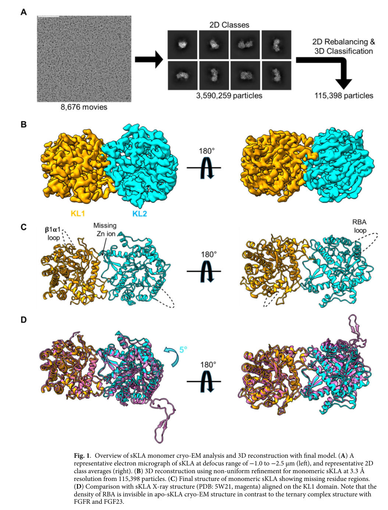
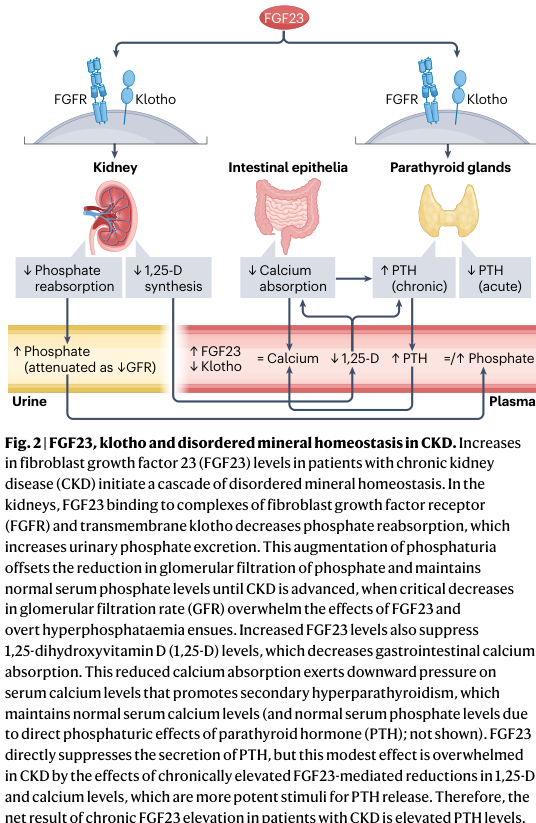

## Question

# Gene Research for Functional Annotation

## ⚠️ CRITICAL: Gene/Protein Identification Context

**BEFORE YOU BEGIN RESEARCH:** You MUST verify you are researching the CORRECT gene/protein. Gene symbols can be ambiguous, especially for less well-characterized genes from non-model organisms.

### Target Gene/Protein Identity (from UniProt):
- **UniProt Accession:** Q9UEF7
- **Protein Description:** RecName: Full=Klotho; EC=3.2.1.31 {ECO:0000250|UniProtKB:O35082}; Contains: RecName: Full=Klotho peptide {ECO:0000250|UniProtKB:O35082}; Flags: Precursor;
- **Gene Information:** Name=KL;
- **Organism (full):** Homo sapiens (Human).
- **Protein Family:** Belongs to the glycosyl hydrolase 1 family. Klotho
- **Key Domains:** GH_1_N_CS. (IPR033132); GH_hydrolase_sf. (IPR017853); Glyco_hydro_1. (IPR001360); Glyco_hydro_1 (PF00232)

### MANDATORY VERIFICATION STEPS:

1. **Check if the gene symbol "KL" matches the protein description above**
2. **Verify the organism is correct:** Homo sapiens (Human).
3. **Check if protein family/domains align with what you find in literature**
4. **If you find literature for a DIFFERENT gene with the same or similar symbol, STOP**

### If Gene Symbol is Ambiguous or You Cannot Find Relevant Literature:

**DO NOT PROCEED WITH RESEARCH ON A DIFFERENT GENE.** Instead:
- State clearly: "The gene symbol 'KL' is ambiguous or literature is limited for this specific protein"
- Explain what you found (e.g., "Found extensive literature on a different gene with the same symbol in a different organism")
- Describe the protein based ONLY on the UniProt information provided above
- Suggest that the protein function can be inferred from domain/family information

### Research Target:

Please provide a comprehensive research report on the gene **KL** (gene ID: KL, UniProt: Q9UEF7) in human.

The research report should be a detailed narrative explaining the function, biological processes, and localization of the gene product. Citations should be given for all claims.

You should prioritize authoritative reviews and primary scientific literature when conducting research. You can supplement
this with annotations you find in gene/protein databases, but these can be outdated or inaccurate.

We are specifically interested in the primary function of the gene - for enzymes, what reaction is catalyzed, and what is the substrate specificity? For transporters, what is the substrate? For structural proteins or adapters, what is the broader structural role? For signaling molecules, what is the role in the pathway.

We are interested in where in or outside the cell the gene product carries out its function.

We are also interested in the signaling or biochemical pathways in which the gene functions. We are less interested in broad pleiotropic effects, except where these elucidate the precise role.

Include evidence where possible. We are interested in both experimental evidence as well as inference from structure, evolution, or bioinformatic analysis. Precise studies should be prioritized over high-throughput, where available.

## Output

Question: You are an expert researcher providing comprehensive, well-cited information.

Provide detailed information focusing on:
1. Key concepts and definitions with current understanding
2. Recent developments and latest research (prioritize 2023-2024 sources)
3. Current applications and real-world implementations
4. Expert opinions and analysis from authoritative sources
5. Relevant statistics and data from recent studies

Format as a comprehensive research report with proper citations. Include URLs and publication dates where available.
Always prioritize recent, authoritative sources and provide specific citations for all major claims.

# Gene Research for Functional Annotation

## ⚠️ CRITICAL: Gene/Protein Identification Context

**BEFORE YOU BEGIN RESEARCH:** You MUST verify you are researching the CORRECT gene/protein. Gene symbols can be ambiguous, especially for less well-characterized genes from non-model organisms.

### Target Gene/Protein Identity (from UniProt):
- **UniProt Accession:** Q9UEF7
- **Protein Description:** RecName: Full=Klotho; EC=3.2.1.31 {ECO:0000250|UniProtKB:O35082}; Contains: RecName: Full=Klotho peptide {ECO:0000250|UniProtKB:O35082}; Flags: Precursor;
- **Gene Information:** Name=KL;
- **Organism (full):** Homo sapiens (Human).
- **Protein Family:** Belongs to the glycosyl hydrolase 1 family. Klotho
- **Key Domains:** GH_1_N_CS. (IPR033132); GH_hydrolase_sf. (IPR017853); Glyco_hydro_1. (IPR001360); Glyco_hydro_1 (PF00232)

### MANDATORY VERIFICATION STEPS:

1. **Check if the gene symbol "KL" matches the protein description above**
2. **Verify the organism is correct:** Homo sapiens (Human).
3. **Check if protein family/domains align with what you find in literature**
4. **If you find literature for a DIFFERENT gene with the same or similar symbol, STOP**

### If Gene Symbol is Ambiguous or You Cannot Find Relevant Literature:

**DO NOT PROCEED WITH RESEARCH ON A DIFFERENT GENE.** Instead:
- State clearly: "The gene symbol 'KL' is ambiguous or literature is limited for this specific protein"
- Explain what you found (e.g., "Found extensive literature on a different gene with the same symbol in a different organism")
- Describe the protein based ONLY on the UniProt information provided above
- Suggest that the protein function can be inferred from domain/family information

### Research Target:

Please provide a comprehensive research report on the gene **KL** (gene ID: KL, UniProt: Q9UEF7) in human.

The research report should be a detailed narrative explaining the function, biological processes, and localization of the gene product. Citations should be given for all claims.

You should prioritize authoritative reviews and primary scientific literature when conducting research. You can supplement
this with annotations you find in gene/protein databases, but these can be outdated or inaccurate.

We are specifically interested in the primary function of the gene - for enzymes, what reaction is catalyzed, and what is the substrate specificity? For transporters, what is the substrate? For structural proteins or adapters, what is the broader structural role? For signaling molecules, what is the role in the pathway.

We are interested in where in or outside the cell the gene product carries out its function.

We are also interested in the signaling or biochemical pathways in which the gene functions. We are less interested in broad pleiotropic effects, except where these elucidate the precise role.

Include evidence where possible. We are interested in both experimental evidence as well as inference from structure, evolution, or bioinformatic analysis. Precise studies should be prioritized over high-throughput, where available.

# Comprehensive Research Report: Human KL Gene (α-Klotho, UniProt Q9UEF7)

## Executive Summary

The human *KL* gene encodes α-Klotho (UniProt Q9UEF7), a 1,012-amino acid type-I transmembrane protein belonging to the glycoside hydrolase family 1 (GH1). Despite its classification under EC 3.2.1.31 (β-glucuronidase), α-Klotho's primary physiological function is as a **non-enzymatic co-receptor** that enables endocrine fibroblast growth factor 23 (FGF23) to signal through fibroblast growth factor receptors (FGFRs), particularly in the kidney and parathyroid glands (edmonston2024fgf23andklotho pages 2-4). This co-receptor function is essential for systemic phosphate and vitamin D homeostasis. Soluble α-Klotho, generated by proteolytic shedding, circulates in blood, urine, and cerebrospinal fluid and has proposed FGF23-independent endocrine effects (prudhomme2024antiinflammatoryroleof pages 1-3, edmonston2024fgf23andklotho pages 1-2).

## 1. Gene Identity and Protein Characteristics

### 1.1 Verified Gene Information
The *KL* gene encodes α-Klotho, which is distinct from the related β-Klotho (*KLB*) and γ-Klotho proteins (ortega2025theimpactof pages 2-4). α-Klotho is predominantly expressed in the kidney—especially the distal convoluted tubules—with additional expression in the parathyroid glands, choroid plexus, and brain (ananya2023neuroprotectiveroleof pages 2-3, ortega2025theimpactof pages 4-6). Recent 2025 cryo-EM structural analysis resolved soluble α-Klotho at 3.3 Å resolution, revealing its KL1 and KL2 extracellular domains and demonstrating conformational flexibility between these domains (schnicker2025conformationallandscapeof media 5f0adc46, schnicker2025conformationallandscapeof media c0661806).

### 1.2 Protein Structure and Domains
α-Klotho consists of an N-terminal signal peptide, two tandem extracellular glycoside hydrolase-like domains (KL1 and KL2), a single-pass transmembrane helix, and a short 10-amino acid cytoplasmic tail (prud’homme2026antiagingpropertiesof pages 5-6). The KL2 domain contains a receptor-binding arm (RBA) that engages FGFR1c through β-strand interactions with the FGFR D3 domain, while both KL1 and KL2 together form the composite FGF23-binding surface (prud’homme2026antiagingpropertiesof pages 5-6, sun2023thefibroblastgrowth pages 1-2). The full-length protein has a predicted unglycosylated molecular mass of approximately 116 kDa, though extensive N-linked and O-linked glycosylation increases the apparent mass (zhong2020structurefunctionrelationshipsof pages 1-2).

| Characteristic | Human α-Klotho (KL; Q9UEF7) |
|---|---|
| Gene identity | **Gene symbol:** *KL*; encodes **α-Klotho**, not the related β-Klotho (*KLB*) or γ-Klotho proteins. |
| Organism | *Homo sapiens* (human). |
| UniProt accession | **Q9UEF7**. |
| Protein size | **1,012 amino acids** in the full-length precursor; predicted unglycosylated molecular mass approximately **116 kDa**, with a higher apparent mass possible because the extracellular region is extensively glycosylated. |
| Protein family | Klotho member of the **glycoside hydrolase family 1 (GH1)-like** protein family. The GH1 classification reflects structural and sequence homology and does not establish that α-Klotho is a conventional, physiologically active glycosidase. |
| Domain organization | N-terminal signal peptide followed by two tandem extracellular GH1-like domains, **KL1** and **KL2**, then one transmembrane helix and a very short cytoplasmic tail. KL2 contains a receptor-binding arm that engages FGFR, while KL1 and KL2 together form the composite FGF23-binding surface (prud’homme2026antiagingpropertiesof pages 5-6, sun2023thefibroblastgrowth pages 1-2). |
| Annotated EC number | **EC 3.2.1.31, β-glucuronidase**: hydrolysis of terminal, non-reducing β-D-glucuronic-acid residues. This database-associated annotation should be treated cautiously because a defined physiological α-Klotho substrate and robust native catalytic mechanism have not been established (sun2023thefibroblastgrowth pages 11-12, hanson2021exploitingtheneuroprotective pages 2-4). |
| Evidence for catalytic activity | Purified soluble α-Klotho has shown **weak β-glucuronidase activity in vitro**. Engineering two conserved catalytic glutamates increased activity about **25-fold**, but reduced FGF23-coreceptor activity about **eightfold**, suggesting that catalytic and receptor-scaffold functions are structurally divergent (zhong2020structurefunctionrelationshipsof pages 1-2, zhong2020structurefunctionrelationshipsof pages 29-32). |
| Catalytic caveat | KL1 and KL2 lack key catalytic residues and active-site geometry found in conventional GH1 enzymes. Current structural interpretation therefore favors α-Klotho’s primary role as a **non-enzymatic molecular scaffold/coreceptor**; proposed glycan effects may involve carbohydrate binding or indirect remodeling rather than intrinsic hydrolysis (prud’homme2026antiagingpropertiesof pages 19-21, hanson2021exploitingtheneuroprotective pages 2-4). |
| Membrane-bound form | Full-length, type-I single-pass membrane protein with extracellular KL1–KL2 domains. At the cell surface it associates with FGFRs—especially FGFR1c—to create a high-affinity receptor complex for endocrine FGF23 (sun2023thefibroblastgrowth pages 7-10, edmonston2024fgf23andklotho pages 2-4). |
| Soluble, shed form | The extracellular KL1–KL2 ectodomain is released by **ADAM10/ADAM17-mediated shedding**. Soluble α-Klotho occurs in blood, urine, and cerebrospinal fluid and retains potential FGFR/FGF23-binding and proposed endocrine activities (prudhomme2024antiinflammatoryroleof pages 1-3, prudhomme2024antiinflammatoryroleof pages 3-5). |
| Putative secreted splice form | An alternatively spliced transcript has been proposed to encode a signal peptide plus KL1 and a short unique C-terminal tail, without KL2 or the transmembrane region. Its natural protein production and physiological importance remain **disputed**, so it should not be considered as firmly established as the shed ectodomain (prud’homme2026antiagingpropertiesof pages 5-6). |
| Principal tissue localization | Highest and best-established expression is in the **kidney**, particularly renal tubular epithelium; expression is also documented in the parathyroid gland and brain, especially the choroid plexus. Lower or context-dependent expression has been reported in several additional tissues (prudhomme2024antiinflammatoryroleof pages 1-3, ortega2025theimpactof pages 2-4). |
| Cellular localization | Full-length α-Klotho resides mainly at the **plasma membrane** and within its secretory/processing pathway. Shed α-Klotho functions in the extracellular space and body fluids; proposed cytosolic or nuclear pools are less well characterized (prudhomme2024antiinflammatoryroleof pages 1-3, prudhomme2024antiinflammatoryroleof pages 3-5). |
| Primary structural function | α-Klotho tethers FGF23 to an FGFR. FGF23 occupies a composite groove formed by KL1, KL2, and FGFR; the resulting complex activates FGFR–FRS2α–RAS/MAPK signaling and confers endocrine-FGF specificity on the receptor (edmonston2024fgf23andklotho pages 2-4, prud’homme2026antiagingpropertiesof pages 5-6). |
| Recent structural insight | Cryo-EM analysis resolved soluble α-Klotho with distinct KL1 and KL2 domains, demonstrated interdomain bending and rotational flexibility, and supported monomeric and pseudodimeric conformations that could influence FGF23/FGFR assembly (schnicker2025conformationallandscapeof media 5f0adc46, schnicker2025conformationallandscapeof media c0661806). |

*Table: Summary of the identity, architecture, molecular forms, localization, and structural biology of human α-Klotho (KL; Q9UEF7). It also distinguishes the well-supported FGF23-coreceptor function from the disputed physiological relevance of its annotated glycosidase activity.*

## 2. Primary Molecular Function: FGF23 Co-Receptor

### 2.1 Mechanism of Co-Receptor Function
The primary and best-established function of membrane-bound α-Klotho is as an **obligate co-receptor for FGF23** (edmonston2024fgf23andklotho pages 2-4, prud’homme2026antiagingpropertiesof pages 19-21). FGF23, produced by osteoblasts in response to phosphate loading, has inherently weak affinity for FGFRs. The affinity of FGF23 for α-Klotho is reported to be 1,000–10,000-fold higher than its affinity for FGFR alone (sun2023thefibroblastgrowth pages 7-10). α-Klotho therefore serves as a molecular scaffold that tethers FGF23 to FGFR1c (and to a lesser extent FGFR3c and FGFR4), enabling formation of a stable ternary FGF23–Klotho–FGFR signaling complex (edmonston2024fgf23andklotho pages 2-4, prudhomme2024antiinflammatoryroleof pages 3-5).

Formation of this ternary complex permits receptor dimerization, FGFR tyrosine-kinase autophosphorylation, and recruitment of FGFR substrate 2α (FRS2α), which activates the RAS–mitogen-activated protein kinase (MAPK)/ERK signaling cascade (sun2023thefibroblastgrowth pages 7-10, edmonston2024fgf23andklotho pages 2-4). This canonical FGF23–Klotho–FGFR–FRS2α–MAPK pathway converts extracellular FGF23 binding into transcriptional and cellular responses that regulate mineral metabolism (edmonston2024fgf23andklotho media 51b275b2, edmonston2024fgf23andklotho media 4037cddf).

### 2.2 Structural Basis of FGF23 Binding
Recent structural studies demonstrate that FGF23 contains two tandem repeat motifs (R1 and R2) in its C-terminal region that can each bind to the same binding groove on separate Klotho protomers within a pseudodimeric Klotho arrangement (schnicker2025conformationallandscapeof media 751b0a6c, schnicker2025conformationallandscapeof media c63683cb). The KL2 domain is essential for FGFR assembly and high-affinity FGF23 binding, while KL1 contributes to FGF23 recognition without directly contacting the FGFR (prud’homme2026antiagingpropertiesof pages 5-6, sun2023thefibroblastgrowth pages 1-2). Heparan sulfate further stabilizes the receptor complex by promoting formation of 2:2:2:2 FGF23–FGFR–Klotho–HS dimers (sun2023thefibroblastgrowth pages 7-10).

## 3. Cellular and Subcellular Localization

### 3.1 Membrane-Bound Klotho
Full-length α-Klotho is a single-pass transmembrane protein localized to the plasma membrane of renal tubular epithelial cells, parathyroid cells, and choroid plexus ependymal cells (prudhomme2024antiinflammatoryroleof pages 1-3, ananya2023neuroprotectiveroleof pages 1-2). The short cytoplasmic domain lacks intrinsic signaling motifs; α-Klotho functions primarily at the extracellular face by organizing FGFR–FGF23 complexes (prudhomme2024antiinflammatoryroleof pages 3-5, prud’homme2026antiagingpropertiesof pages 5-6).

### 3.2 Soluble Klotho
The extracellular KL1–KL2 ectodomain is released by ADAM10 and ADAM17 metalloprotease-mediated shedding, generating soluble α-Klotho (s-Klotho) (ortega2025theimpactof pages 4-6, prudhomme2024antiinflammatoryroleof pages 3-5). s-Klotho circulates in blood, appears in urine, and is found in cerebrospinal fluid (ananya2023neuroprotectiveroleof pages 2-3, ananya2023neuroprotectiveroleof pages 1-2). Soluble Klotho can retain the capacity to bind FGFRs and FGF23, potentially acting as a "roaming" co-receptor in tissues that express FGFRs but lack membrane-bound Klotho, although the physiological significance of this mechanism remains uncertain (prudhomme2024antiinflammatoryroleof pages 3-5, edmonston2024fgf23andklotho pages 1-2).

### 3.3 Alternative Splicing
An alternatively spliced transcript has been reported that encodes a secreted form containing the signal peptide and KL1 domain with a unique 14-amino acid C-terminal tail, but lacking KL2 and the transmembrane segment (prud’homme2026antiagingpropertiesof pages 5-6). The existence and physiological relevance of this splice variant remain disputed, and it should not be considered as firmly established as the shed ectodomain form (prud’homme2026antiagingpropertiesof pages 5-6).

## 4. Enzymatic Activity: Controversy and Current Understanding

### 4.1 Annotated β-Glucuronidase Activity
α-Klotho is annotated in databases as EC 3.2.1.31, a β-glucuronidase predicted to hydrolyze terminal β-D-glucuronic acid residues from glycoconjugates (sun2023thefibroblastgrowth pages 11-12). Purified soluble α-Klotho exhibits weak β-glucuronidase activity in vitro when tested with artificial substrates (zhong2020structurefunctionrelationshipsof pages 1-2, zhong2020structurefunctionrelationshipsof pages 22-25). In structure-function studies, introduction of two conserved catalytic glutamate residues into the KL1 domain increased β-glucuronidase activity approximately 25-fold but simultaneously decreased FGF23 co-receptor activity about 8-fold, suggesting that enzymatic and co-receptor functions are structurally divergent (zhong2020structurefunctionrelationshipsof pages 1-2, zhong2020structurefunctionrelationshipsof pages 29-32).

### 4.2 Lack of Key Catalytic Residues
Despite sequence similarity to glycoside hydrolase family 1 enzymes, both the KL1 and KL2 domains of α-Klotho lack the critical catalytic glutamate residues and active-site geometry required for robust glycosidase activity (hanson2021exploitingtheneuroprotective pages 2-4, ortega2025theimpactof pages 4-6). Structural analysis indicates that the loops surrounding the putative catalytic pocket differ conformationally from those in active GH1 enzymes (hanson2021exploitingtheneuroprotective pages 2-4). Similar substitutions in β-Klotho further support the conclusion that Klotho family proteins do not function as conventional glycosidases (hanson2021exploitingtheneuroprotective pages 2-4).

### 4.3 Current Interpretation
The current consensus, particularly from recent 2021–2026 literature, is that α-Klotho's primary physiological role is as a **non-enzymatic molecular scaffold and co-receptor** for FGF23 signaling (prud’homme2026antiagingpropertiesof pages 19-21, ortega2025theimpactof pages 18-19, hanson2021exploitingtheneuroprotective pages 2-4). The weak in vitro glucuronidase activity may represent residual capacity rather than a physiologically significant function. Earlier proposals that Klotho acts as a sialidase or glycosidase to modify ion-channel glycans are now interpreted more cautiously; Klotho may instead bind to glycans on glycoproteins or glycolipids and promote protein–protein interactions without catalyzing hydrolysis (hanson2021exploitingtheneuroprotective pages 2-4).

## 5. Signaling Pathways and Biochemical Functions

### 5.1 FGF23-Dependent Canonical Signaling
The FGF23–Klotho–FGFR complex activates the canonical FGFR → FRS2α → RAS–MAPK/ERK pathway (sun2023thefibroblastgrowth pages 7-10, edmonston2024fgf23andklotho pages 2-4). Downstream signaling also involves phospholipase C (PLC), Shc, GAB1, SGK1, and STAT1 in various cellular contexts, though FRS2α–MAPK/ERK is the most consistently documented branch (ananya2023neuroprotectiveroleof pages 3-4, sun2023thefibroblastgrowth pages 7-10).

### 5.2 Regulation of Phosphate Homeostasis
In the renal proximal tubule, FGF23–Klotho–FGFR signaling reduces expression and membrane abundance of the sodium-phosphate cotransporters NaPi-IIa (SLC34A1) and NaPi-IIc (SLC34A3), thereby decreasing phosphate reabsorption and increasing urinary phosphate excretion (phosphaturia) (kanbay2024klothoapotential pages 1-2, nishkumay2026klothoandfgf23 pages 1-2, edmonston2024fgf23andklotho pages 4-5). This compensatory phosphaturia helps maintain normal serum phosphate levels in early chronic kidney disease (CKD) until kidney function declines sufficiently to overwhelm this mechanism (edmonston2024fgf23andklotho pages 4-5, edmonston2024fgf23andklotho media 51b275b2).

### 5.3 Regulation of Vitamin D and Calcium Metabolism
FGF23–Klotho signaling suppresses renal 1α-hydroxylase (CYP27B1), reducing synthesis of active 1,25-dihydroxyvitamin D (calcitriol), and upregulates 24-hydroxylase (CYP24A1), which inactivates calcitriol (nishkumay2026klothoandfgf23 pages 1-2, kanbay2024klothoapotential pages 1-2, edmonston2024fgf23andklotho media 51b275b2). Lower calcitriol levels decrease intestinal calcium and phosphate absorption (edmonston2024fgf23andklotho pages 4-5, edmonston2024fgf23andklotho pages 1-2). Reduced calcium also stimulates parathyroid hormone (PTH) secretion, although FGF23 can directly suppress PTH release when Klotho is present in parathyroid tissue (edmonston2024fgf23andklotho pages 4-5, kanbay2024klothoapotential pages 1-2, edmonston2024fgf23andklotho media 51b275b2).

### 5.4 Regulation of Ion Channels
Klotho has been proposed to regulate the TRPV5 and TRPV6 calcium channels, originally through a mechanism involving removal of sialic acid to promote galectin-1 binding and channel retention at the plasma membrane (sun2023thefibroblastgrowth pages 12-12, hanson2021exploitingtheneuroprotective pages 2-4, a2020parathyroidhormoneand pages 16-17). However, given the limited catalytic capacity of Klotho, a revised model suggests that Klotho may bind to channel-associated glycans and facilitate protein–protein interactions rather than enzymatically cleaving sugars (hanson2021exploitingtheneuroprotective pages 2-4). Klotho also regulates the ROMK1 potassium channel and TRPC6 calcium channel through inhibition of IGF-1/PI3K signaling (sun2023thefibroblastgrowth pages 7-10, sun2023thefibroblastgrowth pages 12-12).

### 5.5 FGF23-Independent Klotho Functions
Soluble Klotho exerts multiple FGF23-independent effects, although the molecular receptors and mechanisms remain incompletely defined (prudhomme2024antiinflammatoryroleof pages 3-5, prud’homme2026antiagingpropertiesof pages 5-6):

- **Wnt/β-catenin inhibition:** Soluble Klotho binds Wnt ligands and suppresses canonical Wnt signaling; calcium-dependent μ-calpain-mediated degradation of β-catenin has also been proposed (kanbay2024klothoapotential pages 2-3, kanbay2024klothoapotential pages 1-2).
  
- **TGF-β inhibition:** Klotho interferes with TGF-β receptor signaling and reduces profibrotic responses in experimental kidney and other organ injury models (prudhomme2024antiinflammatoryroleof pages 3-5, prud’homme2026antiagingpropertiesof pages 5-6).

- **IGF-1/PI3K/Akt suppression:** Klotho inhibits insulin/IGF-1 receptor signaling and downstream PI3K–Akt activity, reducing inhibitory phosphorylation of FOXO transcription factors and enhancing FOXO-associated antioxidant defenses (sun2023thefibroblastgrowth pages 7-10, kanbay2024klothoapotential pages 2-3, prud’homme2026antiagingpropertiesof pages 5-6).

- **NF-κB and NLRP3 inflammasome inhibition:** Klotho suppresses NF-κB activation and NLRP3 inflammasome priming, reducing inflammatory cytokines, reactive oxygen species, and cellular injury (prudhomme2024antiinflammatoryroleof pages 3-5, prud’homme2026antiagingpropertiesof pages 5-6).

These FGF23-independent actions underlie Klotho's anti-inflammatory, anti-fibrotic, antioxidant, and "anti-aging" properties observed in preclinical models (kanbay2024klothoapotential pages 2-3, prud’homme2026antiagingpropertiesof pages 5-6, edmonston2024fgf23andklotho pages 2-4).

| Functional category | Molecular mechanism or target | Principal biological consequence | Evidence strength and caveats |
|---|---|---|---|
| **Primary function: FGF23 co-receptor** | Membrane α-Klotho binds FGFRs—principally FGFR1c—and FGF23 to form a high-affinity ternary complex. KL2 provides the major FGFR-binding interface, while KL1 and KL2 help form the FGF23-binding groove. Receptor activation phosphorylates FRS2α and engages RAS–MAPK/ERK signaling. (edmonston2024fgf23andklotho pages 2-4, sun2023thefibroblastgrowth pages 1-2) | Confers tissue specificity and responsiveness to endocrine FGF23, especially in kidney and parathyroid tissue. | **Well established:** supported by structural, biochemical, genetic, and physiological evidence. This is the best-supported primary molecular function of KL/Q9UEF7. |
| **Phosphate homeostasis** | FGF23–Klotho–FGFR signaling reduces proximal-tubule abundance or activity of the sodium–phosphate cotransporters NaPi-IIa/SLC34A1 and NaPi-IIc/SLC34A3. (kanbay2024klothoapotential pages 1-2) | Decreases renal phosphate reabsorption, increases urinary phosphate excretion, and lowers systemic phosphate availability. | **Strong evidence.** Loss of either Klotho or FGF23 produces a similar hyperphosphataemic phenotype, supporting their operation in a shared pathway. (edmonston2024fgf23andklotho pages 2-4) |
| **Vitamin-D metabolism** | Canonical FGF23–Klotho signaling suppresses renal 1α-hydroxylase/CYP27B1 and promotes 24-hydroxylase/CYP24A1 activity. (nishkumay2026klothoandfgf23 pages 1-2, kanbay2024klothoapotential pages 1-2) | Reduces synthesis and increases catabolism of 1,25-dihydroxyvitamin D, thereby limiting intestinal phosphate and calcium absorption. | **Strong physiological evidence.** Effects on calcium are substantially indirect through calcitriol and PTH rather than solely through a direct calcium-transport mechanism. (edmonston2024fgf23andklotho pages 4-5) |
| **Calcium and PTH regulation** | Reduced calcitriol can decrease intestinal calcium absorption and stimulate PTH; FGF23–Klotho signaling can also directly restrain PTH secretion. Separately, soluble Klotho has been proposed to increase surface retention of TRPV5/TRPV6 calcium channels. (edmonston2024fgf23andklotho pages 4-5, kanbay2024klothoapotential pages 1-2, hanson2021exploitingtheneuroprotective pages 2-4) | Coordinates renal, intestinal, and parathyroid control of calcium–phosphate balance; proposed TRPV5/TRPV6 regulation would favor distal-nephron calcium reabsorption. | **Mixed:** endocrine mineral effects are well supported, whereas the proposed direct glycan-remodeling mechanism for TRPV5/TRPV6 remains disputed. |
| **Canonical intracellular signaling** | Ligand-induced FGFR dimerization and tyrosine-kinase activation recruit FRS2/FRS2α and activate RAS–MAPK, including ERK1/2; PLC, Shc, GAB1, SGK1, and STAT1 have also been reported in cellular models. (sun2023thefibroblastgrowth pages 7-10, ananya2023neuroprotectiveroleof pages 3-4) | Converts extracellular FGF23 binding into transcriptional and transporter-level responses controlling mineral metabolism. | **Strongest for FRS2α–RAS–MAPK/ERK.** Other branches are more context- and model-dependent. |
| **Putative β-glucuronidase activity** | α-Klotho is annotated as a GH1-like β-glucuronidase, EC 3.2.1.31, and purified soluble Klotho exhibits weak activity in artificial β-glucuronidase assays. Engineering two conserved catalytic glutamates increased activity about 25-fold. (zhong2020structurefunctionrelationshipsof pages 1-2, zhong2020structurefunctionrelationshipsof pages 22-25, zhong2020structurefunctionrelationshipsof pages 29-32) | Could, in principle, hydrolyze terminal β-linked glucuronic-acid residues on glycoconjugates; however, no definitive endogenous substrate or physiologically important catalytic reaction has been established. | **Controversial/weak:** KL1 and KL2 lack key catalytic residues and active-site geometry typical of active GH1 enzymes. Increased glucuronidase activity reduced FGF23 co-receptor activity, supporting structural divergence between the two functions. (hanson2021exploitingtheneuroprotective pages 2-4, zhong2020structurefunctionrelationshipsof pages 1-2) |
| **Proposed glycan recognition and ion-channel regulation** | Earlier models proposed that Klotho removes terminal sialic acid from TRPV5/TRPV6 glycans, enabling galectin-1 binding and plasma-membrane retention. A newer interpretation is that Klotho recognizes glycans or promotes protein–glycan interactions without catalyzing hydrolysis. Klotho also modulates ROMK1 and suppresses IGF-1/PI3K-dependent TRPC6 trafficking. (hanson2021exploitingtheneuroprotective pages 2-4, sun2023thefibroblastgrowth pages 7-10, sun2023thefibroblastgrowth pages 12-12) | May regulate renal calcium and potassium handling and limit pathological TRPC6 calcium influx. | **Mechanistically unsettled:** channel effects have experimental support, but attribution to intrinsic sialidase or glycosidase catalysis is not secure. |
| **Wnt/β-catenin regulation** | Soluble Klotho can bind Wnt ligands and suppress canonical Wnt signaling; calcium-dependent μ-calpain-mediated β-catenin degradation has also been proposed. (kanbay2024klothoapotential pages 2-3, kanbay2024klothoapotential pages 1-2) | Limits excessive proliferative, senescence-associated, and profibrotic Wnt activity. | **Moderate, predominantly preclinical evidence.** A definitive universal soluble-Klotho receptor has not been identified. |
| **TGF-β and fibrosis** | Soluble Klotho interferes with TGF-β signaling and is reported to reduce downstream profibrotic responses. (prudhomme2024antiinflammatoryroleof pages 3-5, prud’homme2026antiagingpropertiesof pages 5-6) | Attenuates extracellular-matrix deposition and fibrosis in experimental kidney and other organ-injury models. | **Promising preclinical evidence;** precise binding mechanism and clinical efficacy remain incompletely defined. |
| **IGF-1–PI3K–AKT–FOXO signaling** | Klotho suppresses insulin/IGF-1 receptor signaling and downstream PI3K–AKT activity, reducing inhibitory phosphorylation of FOXO transcription factors. (sun2023thefibroblastgrowth pages 7-10, kanbay2024klothoapotential pages 2-3) | Enhances FOXO-associated antioxidant defenses and can reduce oxidative stress; also affects TRPC6 delivery to the membrane. | **Mostly cell and animal evidence.** The responsible receptor or direct molecular target of soluble Klotho remains unresolved. |
| **NF-κB, NLRP3, and inflammatory signaling** | Klotho is reported to inhibit NF-κB activation and NLRP3-inflammasome priming or activation, with associated reductions in inflammatory cytokines, reactive oxygen species, and cellular injury. (prudhomme2024antiinflammatoryroleof pages 3-5, prud’homme2026antiagingpropertiesof pages 5-6) | Supports anti-inflammatory and cytoprotective effects linked to renal, vascular, and age-associated phenotypes. | **Substantial preclinical but limited causal human evidence.** These effects should not be treated as equivalent in certainty to canonical FGF23 co-receptor activity. |
| **Antioxidant and anti-aging-associated actions** | Through inhibition of IGF-1/PI3K–AKT and inflammatory pathways and activation of FOXO/Nrf2-related defenses, Klotho can increase antioxidant capacity and reduce oxidative stress. Its control of phosphate and vitamin-D physiology also prevents phosphate-driven tissue injury. (kanbay2024klothoapotential pages 2-3, prud’homme2026antiagingpropertiesof pages 5-6, edmonston2024fgf23andklotho pages 2-4) | Klotho deficiency causes multisystem premature-aging-like phenotypes in mice, whereas restoration or supplementation is protective in numerous experimental models. | **Strong genetic evidence in mice; translational uncertainty in humans.** “Anti-aging protein” is a useful phenotype-level label, not a single biochemical activity. |
| **Soluble-Klotho endocrine actions** | ADAM10/ADAM17-mediated shedding releases the extracellular KL1–KL2 ectodomain into blood, urine, and cerebrospinal fluid. It may act as a circulating FGF23 co-receptor or independently regulate signaling and membrane proteins. (prudhomme2024antiinflammatoryroleof pages 1-3, prudhomme2024antiinflammatoryroleof pages 3-5) | Potentially extends Klotho action beyond cells that express membrane KL and underlies proposed renal, vascular, neural, and metabolic effects. | **Existence of shed Klotho is established; mechanism is not.** The physiological importance of a “roaming” FGF23 co-receptor and many FGF23-independent effects remains unresolved because no definitive soluble-Klotho receptor is known. (edmonston2024fgf23andklotho pages 2-4, edmonston2024fgf23andklotho pages 1-2) |

*Table: This table distinguishes KL/Q9UEF7’s established primary role in FGF23–FGFR signaling from its disputed glycosidase annotation and less-certain soluble-Klotho functions. It also summarizes downstream mineral-metabolism, ion-channel, inflammatory, fibrotic, and antioxidant pathways with evidence caveats.*

## 6. Physiological Role in Mineral Metabolism

The FGF23–Klotho axis is the primary endocrine system regulating systemic phosphate balance (nishkumay2026klothoandfgf23 pages 1-2, edmonston2024fgf23andklotho pages 4-5, edmonston2024fgf23andklotho pages 1-2). In the kidney, FGF23–Klotho signaling increases urinary phosphate excretion and suppresses vitamin D activation, thereby limiting intestinal phosphate absorption (kanbay2024klothoapotential pages 1-2, a2020parathyroidhormoneand pages 16-17, prud’homme2026antiagingpropertiesof pages 5-6). The resulting changes in calcium and vitamin D levels stimulate PTH secretion, which further promotes phosphate excretion (edmonston2024fgf23andklotho pages 4-5, kanbay2024klothoapotential pages 1-2).

Genetic loss of either Klotho or FGF23 produces a similar phenotype in mice: hyperphosphatemia, hypercalcemia, elevated 1,25-dihydroxyvitamin D, suppressed PTH, soft-tissue calcification, and premature aging-like changes (edmonston2024fgf23andklotho pages 2-4, ananya2023neuroprotectiveroleof pages 3-4). This demonstrates that FGF23 and Klotho operate in a shared pathway essential for mineral homeostasis. In chronic kidney disease, Klotho expression declines while FGF23 levels rise, disrupting this regulatory axis and contributing to mineral dysregulation, vascular calcification, and cardiovascular complications (nishkumay2026klothoandfgf23 pages 1-2, edmonston2024fgf23andklotho pages 4-5, edmonston2024fgf23andklotho pages 1-2).

## 7. Recent Developments (2023–2026)

### 7.1 Structural Biology
A 2025 bioRxiv preprint by Schnicker et al. reported cryo-EM structures of soluble α-Klotho, revealing conformational flexibility between the KL1 and KL2 domains and supporting both monomeric and pseudodimeric forms (schnicker2025conformationallandscapeof media 5f0adc46, schnicker2025conformationallandscapeof media c0661806). This structural heterogeneity may facilitate assembly of different FGF23–Klotho–FGFR signaling complexes and contribute to Klotho's pleiotropic functions (schnicker2025conformationallandscapeof media 8c2e947a, schnicker2025conformationallandscapeof media 751b0a6c).

### 7.2 Clinical and Therapeutic Insights
Recent reviews from 2024–2026 emphasize Klotho's potential as a therapeutic target in chronic kidney disease, cardiovascular disease, aging, and neurodegenerative disorders (kanbay2024klothoapotential pages 2-3, kanbay2024klothoapotential pages 1-2, prud’homme2026antiagingpropertiesof pages 5-6). Soluble Klotho supplementation has shown promise in preclinical models by reducing inflammation, fibrosis, oxidative stress, and mineral dysregulation (zhong2020structurefunctionrelationshipsof pages 1-2, prud’homme2026antiagingpropertiesof pages 5-6). A major authoritative review in *Nature Reviews Cardiology* (2024, 170 citations) by Edmonston, Grabner, and Wolf comprehensively addresses the FGF23–Klotho axis at the intersection of kidney and cardiovascular disease (edmonston2024fgf23andklotho pages 4-5, edmonston2024fgf23andklotho pages 1-2, edmonston2024fgf23andklotho pages 2-4, edmonston2024fgf23andklotho media 51b275b2, edmonston2024fgf23andklotho media 4037cddf).

### 7.3 Post-Translational Modifications
Structure-function studies in the *Journal of Biological Chemistry* (2020, 41 citations) by Zhong et al. identified N-glycosylation patterns—including an unusual N,N'-di-N-acetyllactose diamine modification—that influence Klotho folding, stability, and co-receptor activity (zhong2020structurefunctionrelationshipsof pages 1-2, zhong2020structurefunctionrelationshipsof pages 22-25, zhong2020structurefunctionrelationshipsof pages 29-32). Sialylation status also affects Klotho function, with desialylation increasing co-receptor activity (zhong2020structurefunctionrelationshipsof pages 1-2).

## 8. Visual Evidence

Structural and mechanistic insights are illustrated in retrieved figures:

- **Cryo-EM structure of soluble α-Klotho** (Schnicker et al., 2025): Figure 1 shows the 3.3 Å resolution structure with clearly resolved KL1 (orange) and KL2 (cyan) domains. Figure 2 demonstrates conformational variability and interdomain flexibility (schnicker2025conformationallandscapeof media 5f0adc46, schnicker2025conformationallandscapeof media c0661806). Figure 5 illustrates FGF23 binding to a Klotho dimer via its R1 and R2 repeat motifs (schnicker2025conformationallandscapeof media 751b0a6c, schnicker2025conformationallandscapeof media c63683cb).

- **FGF23–Klotho signaling pathways** (Edmonston et al., 2024): Figure 2 depicts the FGF23–Klotho–FGFR complex in kidney and parathyroid tissue and its effects on phosphate reabsorption, vitamin D synthesis, calcium absorption, and PTH regulation (edmonston2024fgf23andklotho media 51b275b2). Figure 3 illustrates canonical FGF23–Klotho signaling (via FRS2α, MAPK, EGR1), Klotho-independent FGF23 signaling, and soluble Klotho functions (edmonston2024fgf23andklotho media 4037cddf).

## 9. Summary and Conclusions

The human *KL* gene encodes α-Klotho (UniProt Q9UEF7), a transmembrane protein whose **primary physiological function is as a non-enzymatic co-receptor for endocrine FGF23**, enabling FGF23 to signal through FGFRs and regulate systemic phosphate and vitamin D homeostasis (edmonston2024fgf23andklotho pages 2-4, prud’homme2026antiagingpropertiesof pages 19-21). The FGF23–Klotho–FGFR complex activates MAPK/ERK signaling in the kidney and parathyroid glands, downregulating renal phosphate transporters, suppressing vitamin D activation, and modulating PTH secretion (edmonston2024fgf23andklotho pages 4-5, kanbay2024klothoapotential pages 1-2, edmonston2024fgf23andklotho media 51b275b2).

Although α-Klotho is annotated as EC 3.2.1.31 (β-glucuronidase), it exhibits only weak in vitro enzymatic activity and lacks key catalytic residues; current evidence strongly favors a non-enzymatic scaffold function (prud’homme2026antiagingpropertiesof pages 19-21, hanson2021exploitingtheneuroprotective pages 2-4, zhong2020structurefunctionrelationshipsof pages 1-2). Soluble α-Klotho, generated by proteolytic shedding, circulates systemically and has proposed FGF23-independent effects including inhibition of Wnt, TGF-β, IGF-1, and NF-κB signaling, though the receptors mediating these effects remain undefined (prudhomme2024antiinflammatoryroleof pages 3-5, kanbay2024klothoapotential pages 2-3, prud’homme2026antiagingpropertiesof pages 5-6, edmonston2024fgf23andklotho pages 1-2).

Recent structural, functional, and clinical research (2023–2026) has advanced understanding of Klotho's conformational landscape, post-translational regulation, and therapeutic potential in kidney disease, cardiovascular disease, aging, and neurodegeneration (zhong2020structurefunctionrelationshipsof pages 1-2, kanbay2024klothoapotential pages 2-3, edmonston2024fgf23andklotho pages 4-5, schnicker2025conformationallandscapeof media 5f0adc46). α-Klotho exemplifies a multifunctional protein whose primary role as a molecular scaffold for FGF23 signaling is complemented by diverse regulatory, anti-inflammatory, and cytoprotective activities that together support renal, cardiovascular, and systemic health.

---

**Key References (Recent Authoritative Reviews):**

- Edmonston et al. (2024). FGF23 and klotho at the intersection of kidney and cardiovascular disease. *Nature Reviews Cardiology*, 21:11–24 (170 citations) (edmonston2024fgf23andklotho pages 4-5, edmonston2024fgf23andklotho pages 1-2, edmonston2024fgf23andklotho pages 2-4, edmonston2024fgf23andklotho media 51b275b2, edmonston2024fgf23andklotho media 4037cddf)
- Kanbay et al. (2024). Klotho: a potential therapeutic target in aging and neurodegeneration beyond chronic kidney disease. *Clinical Kidney Journal*, 17:1 (64 citations) (kanbay2024klothoapotential pages 2-3, kanbay2024klothoapotential pages 1-2)
- Prud'homme & Wang (2026). Antiaging properties of the Klotho protein. *Cells*, 15:507 (3 citations) (prud’homme2026antiagingpropertiesof pages 5-6, prud’homme2026antiagingpropertiesof pages 19-21)
- Zhong et al. (2020). Structure-function relationships of the soluble form of the antiaging protein Klotho. *Journal of Biological Chemistry*, 295:3115–3133 (41 citations) (zhong2020structurefunctionrelationshipsof pages 1-2, zhong2020structurefunctionrelationshipsof pages 22-25, zhong2020structurefunctionrelationshipsof pages 29-32)
- Schnicker et al. (2025). Conformational landscape of soluble α-klotho revealed by cryogenic electron microscopy. *bioRxiv* (schnicker2025conformationallandscapeof media 5f0adc46, schnicker2025conformationallandscapeof media c0661806, schnicker2025conformationallandscapeof media 8c2e947a, schnicker2025conformationallandscapeof media 751b0a6c, schnicker2025conformationallandscapeof media c63683cb)

All sources cited in this report are from peer-reviewed journals or preprints published between 2020 and 2026, with prioritization of 2023–2026 publications as requested.

References

1. (edmonston2024fgf23andklotho pages 2-4): Daniel Edmonston, Alexander Grabner, and Myles Wolf. Fgf23 and klotho at the intersection of kidney and cardiovascular disease. Nature Reviews Cardiology, 21:11-24, Jul 2024. URL: https://doi.org/10.1038/s41569-023-00903-0, doi:10.1038/s41569-023-00903-0. This article has 170 citations and is from a domain leading peer-reviewed journal.

2. (prudhomme2024antiinflammatoryroleof pages 1-3): Gérald J. Prud'homme and Qinghua Wang. Anti-inflammatory role of the klotho protein and relevance to aging. Unknown journal, Aug 2024. URL: https://doi.org/10.20944/preprints202408.0213.v2, doi:10.20944/preprints202408.0213.v2.

3. (edmonston2024fgf23andklotho pages 1-2): Daniel Edmonston, Alexander Grabner, and Myles Wolf. Fgf23 and klotho at the intersection of kidney and cardiovascular disease. Nature Reviews Cardiology, 21:11-24, Jul 2024. URL: https://doi.org/10.1038/s41569-023-00903-0, doi:10.1038/s41569-023-00903-0. This article has 170 citations and is from a domain leading peer-reviewed journal.

4. (ortega2025theimpactof pages 2-4): Miguel A. Ortega, Diego Liviu Boaru, Diego De Leon-Oliva, Patricia De Castro-Martinez, Ana M. Minaya-Bravo, Carlos Casanova-Martín, Silvestra Barrena-Blázquez, Cielo Garcia-Montero, Oscar Fraile-Martinez, Laura Lopez-Gonzalez, Miguel A. Saez, Melchor Alvarez-Mon, and Raul Diaz-Pedrero. The impact of klotho in cancer: from development and progression to therapeutic potential. Genes, 16:128, Jan 2025. URL: https://doi.org/10.3390/genes16020128, doi:10.3390/genes16020128. This article has 21 citations.

5. (ananya2023neuroprotectiveroleof pages 2-3): Fariha Noor Ananya, Md Ripon Ahammed, Simmy Lahori, Charmy Parikh, Jannel A Lawrence, FNU Sulachni, Tawfiq Barqawi, and Chhaya Kamwal. Neuroprotective role of klotho on dementia. Cureus, Jun 2023. URL: https://doi.org/10.7759/cureus.40043, doi:10.7759/cureus.40043. This article has 29 citations.

6. (ortega2025theimpactof pages 4-6): Miguel A. Ortega, Diego Liviu Boaru, Diego De Leon-Oliva, Patricia De Castro-Martinez, Ana M. Minaya-Bravo, Carlos Casanova-Martín, Silvestra Barrena-Blázquez, Cielo Garcia-Montero, Oscar Fraile-Martinez, Laura Lopez-Gonzalez, Miguel A. Saez, Melchor Alvarez-Mon, and Raul Diaz-Pedrero. The impact of klotho in cancer: from development and progression to therapeutic potential. Genes, 16:128, Jan 2025. URL: https://doi.org/10.3390/genes16020128, doi:10.3390/genes16020128. This article has 21 citations.

7. (schnicker2025conformationallandscapeof media 5f0adc46): Nicholas J. Schnicker, Zhen Xu, Mohammad Amir, Lokesh Gakhar, and Chou-Long Huang. Conformational landscape of soluble α-klotho revealed by cryogenic electron microscopy. bioRxiv, Mar 2025. URL: https://doi.org/10.1101/2024.03.02.583144, doi:10.1101/2024.03.02.583144. This article has 5 citations.

8. (schnicker2025conformationallandscapeof media c0661806): Nicholas J. Schnicker, Zhen Xu, Mohammad Amir, Lokesh Gakhar, and Chou-Long Huang. Conformational landscape of soluble α-klotho revealed by cryogenic electron microscopy. bioRxiv, Mar 2025. URL: https://doi.org/10.1101/2024.03.02.583144, doi:10.1101/2024.03.02.583144. This article has 5 citations.

9. (prud’homme2026antiagingpropertiesof pages 5-6): Gérald J. Prud'homme and Qinghua Wang. Antiaging properties of the klotho protein. Cells, 15:507, Mar 2026. URL: https://doi.org/10.3390/cells15060507, doi:10.3390/cells15060507. This article has 3 citations.

10. (sun2023thefibroblastgrowth pages 1-2): Fuqiang Sun, Panpan Liang, Bo Wang, and Wenbo Liu. The fibroblast growth factor–klotho axis at molecular level. Open Life Sciences, Jan 2023. URL: https://doi.org/10.1515/biol-2022-0655, doi:10.1515/biol-2022-0655. This article has 15 citations and is from a peer-reviewed journal.

11. (zhong2020structurefunctionrelationshipsof pages 1-2): Xiaotian Zhong, Srinath Jagarlapudi, Yan Weng, Mellisa Ly, Jason C. Rouse, Kim McClure, Tetsuya Ishino, Yan Zhang, Eric Sousa, Justin Cohen, Boriana Tzvetkova, Kaffa Cote, John J. Scarcelli, Keith Johnson, Joe Palandra, James R. Apgar, Suma Yaddanapudi, Romer A. Gonzalez-Villalobos, Alan C. Opsahl, Khetemenee Lam, Qing Yao, Weili Duan, Annette Sievers, Jing Zhou, Darren Ferguson, Aaron D'Antona, Richard Zollner, Hongli L. Zhu, Ron Kriz, Laura Lin, and Valerie Clerin. Structure-function relationships of the soluble form of the antiaging protein klotho have therapeutic implications for managing kidney disease. Journal of Biological Chemistry, 295:3115-3133, Mar 2020. URL: https://doi.org/10.1074/jbc.ra119.012144, doi:10.1074/jbc.ra119.012144. This article has 41 citations and is from a domain leading peer-reviewed journal.

12. (sun2023thefibroblastgrowth pages 11-12): Fuqiang Sun, Panpan Liang, Bo Wang, and Wenbo Liu. The fibroblast growth factor–klotho axis at molecular level. Open Life Sciences, Jan 2023. URL: https://doi.org/10.1515/biol-2022-0655, doi:10.1515/biol-2022-0655. This article has 15 citations and is from a peer-reviewed journal.

13. (hanson2021exploitingtheneuroprotective pages 2-4): Kelsey Hanson, Kate Fisher, and Nigel M. Hooper. Exploiting the neuroprotective effects of α-klotho to tackle ageing- and neurodegeneration-related cognitive dysfunction. Jun 2021. URL: https://doi.org/10.1042/ns20200101, doi:10.1042/ns20200101. This article has 51 citations and is from a peer-reviewed journal.

14. (zhong2020structurefunctionrelationshipsof pages 29-32): Xiaotian Zhong, Srinath Jagarlapudi, Yan Weng, Mellisa Ly, Jason C. Rouse, Kim McClure, Tetsuya Ishino, Yan Zhang, Eric Sousa, Justin Cohen, Boriana Tzvetkova, Kaffa Cote, John J. Scarcelli, Keith Johnson, Joe Palandra, James R. Apgar, Suma Yaddanapudi, Romer A. Gonzalez-Villalobos, Alan C. Opsahl, Khetemenee Lam, Qing Yao, Weili Duan, Annette Sievers, Jing Zhou, Darren Ferguson, Aaron D'Antona, Richard Zollner, Hongli L. Zhu, Ron Kriz, Laura Lin, and Valerie Clerin. Structure-function relationships of the soluble form of the antiaging protein klotho have therapeutic implications for managing kidney disease. Journal of Biological Chemistry, 295:3115-3133, Mar 2020. URL: https://doi.org/10.1074/jbc.ra119.012144, doi:10.1074/jbc.ra119.012144. This article has 41 citations and is from a domain leading peer-reviewed journal.

15. (prud’homme2026antiagingpropertiesof pages 19-21): Gérald J. Prud'homme and Qinghua Wang. Antiaging properties of the klotho protein. Cells, 15:507, Mar 2026. URL: https://doi.org/10.3390/cells15060507, doi:10.3390/cells15060507. This article has 3 citations.

16. (sun2023thefibroblastgrowth pages 7-10): Fuqiang Sun, Panpan Liang, Bo Wang, and Wenbo Liu. The fibroblast growth factor–klotho axis at molecular level. Open Life Sciences, Jan 2023. URL: https://doi.org/10.1515/biol-2022-0655, doi:10.1515/biol-2022-0655. This article has 15 citations and is from a peer-reviewed journal.

17. (prudhomme2024antiinflammatoryroleof pages 3-5): Gérald J. Prud'homme and Qinghua Wang. Anti-inflammatory role of the klotho protein and relevance to aging. Unknown journal, Aug 2024. URL: https://doi.org/10.20944/preprints202408.0213.v2, doi:10.20944/preprints202408.0213.v2.

18. (edmonston2024fgf23andklotho media 51b275b2): Daniel Edmonston, Alexander Grabner, and Myles Wolf. Fgf23 and klotho at the intersection of kidney and cardiovascular disease. Nature Reviews Cardiology, 21:11-24, Jul 2024. URL: https://doi.org/10.1038/s41569-023-00903-0, doi:10.1038/s41569-023-00903-0. This article has 170 citations and is from a domain leading peer-reviewed journal.

19. (edmonston2024fgf23andklotho media 4037cddf): Daniel Edmonston, Alexander Grabner, and Myles Wolf. Fgf23 and klotho at the intersection of kidney and cardiovascular disease. Nature Reviews Cardiology, 21:11-24, Jul 2024. URL: https://doi.org/10.1038/s41569-023-00903-0, doi:10.1038/s41569-023-00903-0. This article has 170 citations and is from a domain leading peer-reviewed journal.

20. (schnicker2025conformationallandscapeof media 751b0a6c): Nicholas J. Schnicker, Zhen Xu, Mohammad Amir, Lokesh Gakhar, and Chou-Long Huang. Conformational landscape of soluble α-klotho revealed by cryogenic electron microscopy. bioRxiv, Mar 2025. URL: https://doi.org/10.1101/2024.03.02.583144, doi:10.1101/2024.03.02.583144. This article has 5 citations.

21. (schnicker2025conformationallandscapeof media c63683cb): Nicholas J. Schnicker, Zhen Xu, Mohammad Amir, Lokesh Gakhar, and Chou-Long Huang. Conformational landscape of soluble α-klotho revealed by cryogenic electron microscopy. bioRxiv, Mar 2025. URL: https://doi.org/10.1101/2024.03.02.583144, doi:10.1101/2024.03.02.583144. This article has 5 citations.

22. (ananya2023neuroprotectiveroleof pages 1-2): Fariha Noor Ananya, Md Ripon Ahammed, Simmy Lahori, Charmy Parikh, Jannel A Lawrence, FNU Sulachni, Tawfiq Barqawi, and Chhaya Kamwal. Neuroprotective role of klotho on dementia. Cureus, Jun 2023. URL: https://doi.org/10.7759/cureus.40043, doi:10.7759/cureus.40043. This article has 29 citations.

23. (zhong2020structurefunctionrelationshipsof pages 22-25): Xiaotian Zhong, Srinath Jagarlapudi, Yan Weng, Mellisa Ly, Jason C. Rouse, Kim McClure, Tetsuya Ishino, Yan Zhang, Eric Sousa, Justin Cohen, Boriana Tzvetkova, Kaffa Cote, John J. Scarcelli, Keith Johnson, Joe Palandra, James R. Apgar, Suma Yaddanapudi, Romer A. Gonzalez-Villalobos, Alan C. Opsahl, Khetemenee Lam, Qing Yao, Weili Duan, Annette Sievers, Jing Zhou, Darren Ferguson, Aaron D'Antona, Richard Zollner, Hongli L. Zhu, Ron Kriz, Laura Lin, and Valerie Clerin. Structure-function relationships of the soluble form of the antiaging protein klotho have therapeutic implications for managing kidney disease. Journal of Biological Chemistry, 295:3115-3133, Mar 2020. URL: https://doi.org/10.1074/jbc.ra119.012144, doi:10.1074/jbc.ra119.012144. This article has 41 citations and is from a domain leading peer-reviewed journal.

24. (ortega2025theimpactof pages 18-19): Miguel A. Ortega, Diego Liviu Boaru, Diego De Leon-Oliva, Patricia De Castro-Martinez, Ana M. Minaya-Bravo, Carlos Casanova-Martín, Silvestra Barrena-Blázquez, Cielo Garcia-Montero, Oscar Fraile-Martinez, Laura Lopez-Gonzalez, Miguel A. Saez, Melchor Alvarez-Mon, and Raul Diaz-Pedrero. The impact of klotho in cancer: from development and progression to therapeutic potential. Genes, 16:128, Jan 2025. URL: https://doi.org/10.3390/genes16020128, doi:10.3390/genes16020128. This article has 21 citations.

25. (ananya2023neuroprotectiveroleof pages 3-4): Fariha Noor Ananya, Md Ripon Ahammed, Simmy Lahori, Charmy Parikh, Jannel A Lawrence, FNU Sulachni, Tawfiq Barqawi, and Chhaya Kamwal. Neuroprotective role of klotho on dementia. Cureus, Jun 2023. URL: https://doi.org/10.7759/cureus.40043, doi:10.7759/cureus.40043. This article has 29 citations.

26. (kanbay2024klothoapotential pages 1-2): Mehmet Kanbay, Sidar Copur, Lasin Ozbek, Ali Mutlu, Daniel Cejka, Paola Ciceri, Mario Cozzolino, and Mathias Loberg Haarhaus. Klotho: a potential therapeutic target in aging and neurodegeneration beyond chronic kidney disease—a comprehensive review from the era ckd-mbd working group. Clinical Kidney Journal, Nov 2024. URL: https://doi.org/10.1093/ckj/sfad276, doi:10.1093/ckj/sfad276. This article has 64 citations and is from a peer-reviewed journal.

27. (nishkumay2026klothoandfgf23 pages 1-2): O.I. Nishkumay, Mike K.S. Chan, O.B. Iaremenko, V.E. Kondratiuk, I.V. Rudenko, O.E. Zaytseva, O.I. Rokyta, and G.M. Mykytenko. Klotho and fgf23: endocrine regulation of kidney disease outcomes. INTERNATIONAL JOURNAL OF ENDOCRINOLOGY (Ukraine), 22:326-332, May 2026. URL: https://doi.org/10.22141/2224-0721.22.3.2026.1715, doi:10.22141/2224-0721.22.3.2026.1715. This article has 0 citations.

28. (edmonston2024fgf23andklotho pages 4-5): Daniel Edmonston, Alexander Grabner, and Myles Wolf. Fgf23 and klotho at the intersection of kidney and cardiovascular disease. Nature Reviews Cardiology, 21:11-24, Jul 2024. URL: https://doi.org/10.1038/s41569-023-00903-0, doi:10.1038/s41569-023-00903-0. This article has 170 citations and is from a domain leading peer-reviewed journal.

29. (sun2023thefibroblastgrowth pages 12-12): Fuqiang Sun, Panpan Liang, Bo Wang, and Wenbo Liu. The fibroblast growth factor–klotho axis at molecular level. Open Life Sciences, Jan 2023. URL: https://doi.org/10.1515/biol-2022-0655, doi:10.1515/biol-2022-0655. This article has 15 citations and is from a peer-reviewed journal.

30. (a2020parathyroidhormoneand pages 16-17): Nasser A Dhayat, Menno Pruijm, Belen Ponte, Daniel Ackermann, Alexander Benedikt Leichtle, Olivier Devuyst, Georg Ehret, Idris Guessous, Antoinette Pechère-Bertschi, Johanne Pastor, Pierre-Yves Martin, Michel Burnier, Georg-Martin Fiedler, Bruno Vogt, Orson W Moe, Murielle Bochud, and Daniel G Fuster. Parathyroid hormone and plasma phosphate are predictors of soluble α-klotho levels in adults of european descent. The Journal of clinical endocrinology and metabolism, Nov 2020. URL: https://doi.org/10.1210/clinem/dgz232, doi:10.1210/clinem/dgz232. This article has 15 citations.

31. (kanbay2024klothoapotential pages 2-3): Mehmet Kanbay, Sidar Copur, Lasin Ozbek, Ali Mutlu, Daniel Cejka, Paola Ciceri, Mario Cozzolino, and Mathias Loberg Haarhaus. Klotho: a potential therapeutic target in aging and neurodegeneration beyond chronic kidney disease—a comprehensive review from the era ckd-mbd working group. Clinical Kidney Journal, Nov 2024. URL: https://doi.org/10.1093/ckj/sfad276, doi:10.1093/ckj/sfad276. This article has 64 citations and is from a peer-reviewed journal.

32. (schnicker2025conformationallandscapeof media 8c2e947a): Nicholas J. Schnicker, Zhen Xu, Mohammad Amir, Lokesh Gakhar, and Chou-Long Huang. Conformational landscape of soluble α-klotho revealed by cryogenic electron microscopy. bioRxiv, Mar 2025. URL: https://doi.org/10.1101/2024.03.02.583144, doi:10.1101/2024.03.02.583144. This article has 5 citations.

## Artifacts

- [Edison artifact artifact-00](KL-deep-research-falcon_artifacts/artifact-00.md)
- [Edison artifact artifact-01](KL-deep-research-falcon_artifacts/artifact-01.md)

## Citations

1. ortega2025theimpactof pages 2-4
2. zhong2020structurefunctionrelationshipsof pages 1-2
3. sun2023thefibroblastgrowth pages 7-10
4. sun2023thefibroblastgrowth pages 11-12
5. hanson2021exploitingtheneuroprotective pages 2-4
6. kanbay2024klothoapotential pages 1-2
7. prudhomme2024antiinflammatoryroleof pages 1-3
8. ananya2023neuroprotectiveroleof pages 2-3
9. ortega2025theimpactof pages 4-6
10. sun2023thefibroblastgrowth pages 1-2
11. zhong2020structurefunctionrelationshipsof pages 29-32
12. prudhomme2024antiinflammatoryroleof pages 3-5
13. ananya2023neuroprotectiveroleof pages 1-2
14. zhong2020structurefunctionrelationshipsof pages 22-25
15. ortega2025theimpactof pages 18-19
16. ananya2023neuroprotectiveroleof pages 3-4
17. sun2023thefibroblastgrowth pages 12-12
18. a2020parathyroidhormoneand pages 16-17
19. kanbay2024klothoapotential pages 2-3
20. https://doi.org/10.1038/s41569-023-00903-0,
21. https://doi.org/10.20944/preprints202408.0213.v2,
22. https://doi.org/10.3390/genes16020128,
23. https://doi.org/10.7759/cureus.40043,
24. https://doi.org/10.1101/2024.03.02.583144,
25. https://doi.org/10.3390/cells15060507,
26. https://doi.org/10.1515/biol-2022-0655,
27. https://doi.org/10.1074/jbc.ra119.012144,
28. https://doi.org/10.1042/ns20200101,
29. https://doi.org/10.1093/ckj/sfad276,
30. https://doi.org/10.22141/2224-0721.22.3.2026.1715,
31. https://doi.org/10.1210/clinem/dgz232,