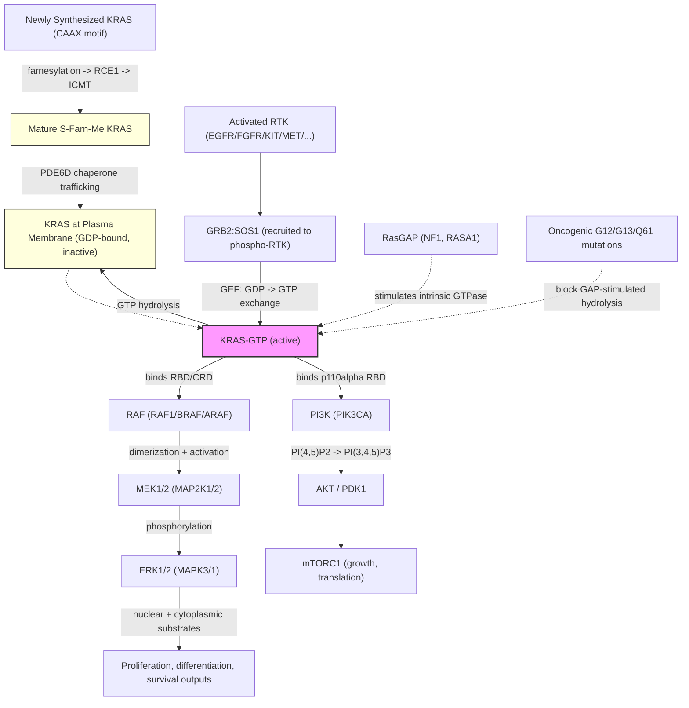

# Pathway Summary for KRAS

## Overview
KRAS is a Ras-family small GTPase that acts as a binary molecular switch on the cytoplasmic face of the plasma membrane. It cycles between an inactive GDP-bound state and an active GTP-bound state; the active conformation engages downstream effectors to propagate growth-factor and other receptor signals into two canonical cascades: the RAF-MEK-ERK MAPK pathway and the PI3K-AKT-mTOR pathway [PMID:33608534, PMID:39788953, Reactome:R-HSA-5673001, Reactome:R-HSA-9658253]. Nucleotide cycling is driven by guanine-nucleotide exchange factors (chiefly SOS1, recruited to ligand-activated receptor tyrosine kinases via GRB2) that catalyze GDP-to-GTP exchange, opposed by GTPase-activating proteins (NF1, RASA1) that accelerate the otherwise weak intrinsic GTP hydrolysis [PMID:38188543, PMID:26037647, Reactome:R-HSA-5658231, Reactome:R-HSA-9649736]. Membrane localization, which is essential for productive effector engagement, is established by C-terminal CAAX prenylation followed by AAX cleavage and carboxymethylation, with PDE6D acting as a solubilizing chaperone for the farnesylated protein during trafficking [PMID:23698361, Reactome:R-HSA-9647977, Reactome:R-HSA-9647978, Reactome:R-HSA-9647999, Reactome:R-HSA-9647980].

## Core Pathways

### Receptor-Driven GDP/GTP Cycle
Ligand-activated receptor tyrosine kinases (EGFR, FGFRs, KIT, MET, FLT3, PDGFRs, ERBBs and others) recruit GRB2-SOS1 to phosphotyrosine docking sites either directly or via SHC1/p-FRS2 adaptors, bringing SOS1 into proximity with membrane-localized KRAS [Reactome:R-HSA-177938, Reactome:R-HSA-1225951, Reactome:R-HSA-1225957, Reactome:R-HSA-5654392, Reactome:R-HSA-5654402, Reactome:R-HSA-1433471, Reactome:R-HSA-8851827, Reactome:R-HSA-9607304]. SOS1 catalyzes GDP-to-GTP exchange on KRAS [PMID:38188543, Reactome:R-HSA-9672965]; in lymphocytes and other contexts RasGRP1/3 acts as a DAG-responsive GEF [Reactome:R-HSA-1168636]. The GTP-bound switch is reset by intrinsic GTP hydrolysis [Reactome:R-HSA-9649736] dramatically accelerated by GAPs that bind RAS-GTP (RASA1, NF1) and contribute the catalytic arginine finger that completes the active site [Reactome:R-HSA-5658231, Reactome:R-HSA-5658435, Reactome:R-HSA-8981353, Reactome:R-HSA-8981355]. Cancer-associated mutations at codons G12/G13/Q61 cripple this hydrolysis step and trap KRAS in the GTP-bound state, explaining their gain-of-function oncogenic effect [PMID:26037647, Reactome:R-HSA-6802834].

### RAF-MEK-ERK MAPK Cascade
GTP-bound KRAS binds the RAS-binding domain (RBD) and cysteine-rich domain (CRD) of RAF-family kinases (CRAF/RAF1, BRAF, ARAF) at the plasma membrane, releasing RAF from its 14-3-3-bridged autoinhibited state and licensing RAF homo- and heterodimerization [PMID:33608534, Reactome:R-HSA-5624494, Reactome:R-HSA-5672950, Reactome:R-HSA-5672966]. Activated RAF dimers phosphorylate MEK1/MEK2 (MAP2K1/2), which in turn phosphorylate ERK1/ERK2 (MAPK3/MAPK1) on the activation-loop T-E-Y motif [Reactome:R-HSA-5672969, Reactome:R-HSA-5672972, Reactome:R-HSA-5672978, Reactome:R-HSA-5672973]. Phosphorylated ERK then translates the upstream signal into nuclear and cytoplasmic substrate phosphorylation [Reactome:R-HSA-5673001]. The cascade is rate-limited at multiple points by negative feedback (PEBP1/RKIP binds activated RAF1; PP2A and PP5 dephosphorylate RAF1; BRAP autoubiquitinates the complex) [Reactome:R-HSA-5675417, Reactome:R-HSA-5675431, Reactome:R-HSA-5675433, Reactome:R-HSA-5674018].

### PI3K-AKT-mTOR Cascade
The second canonical effector arm engages class IA PI3K: GTP-bound KRAS contacts the RBD of the PI3K p110α catalytic subunit (PIK3CA), allosterically activating its lipid-kinase activity to convert PI(4,5)P2 to PI(3,4,5)P3 at the plasma membrane [PMID:39788953, Reactome:R-HSA-9658253]. PIP3 then recruits AKT and PDK1 via their PH domains, leading to AKT activation and downstream mTORC1 stimulation; this branch is mechanistically distinct from the RAF-MEK-ERK cascade and is often required, alongside the MAPK arm, for KRAS-driven proliferation and survival.

### Plasma-Membrane Targeting via the CAAX Prenylation Cycle
KRAS function is strictly dependent on its C-terminal CAAX motif and the post-translational lipid modifications it directs. Newly synthesized KRAS is farnesylated on the CAAX cysteine, then RCE1 cleaves the AAX tripeptide and ICMT carboxymethylates the new C-terminal cysteine, completing the membrane-binding C-terminus [Reactome:R-HSA-9647977, Reactome:R-HSA-9647978, Reactome:R-HSA-9647999]. Mature farnesyl-Me-KRAS translocates to the plasma membrane where it engages effectors [Reactome:R-HSA-9647980]. PDE6D (PDE-delta) is a prenyl-binding chaperone that solubilizes farnesylated KRAS in the cytosol and supports correct membrane sampling and signalling; small-molecule disruption of the KRAS-PDE6D interaction impairs oncogenic KRAS signalling [PMID:23698361]. SmgGDS recognizes the CAAX motif of newly synthesized small GTPases and chaperones their entry into the prenylation pathway [PMID:24415755]. The two splice isoforms differ in this membrane-anchoring step: KRAS4A is dually farnesylated and palmitoylated like HRAS/NRAS [Reactome:R-HSA-9647982, Reactome:R-HSA-9647994], whereas KRAS4B uses a polybasic patch plus farnesylation, and is reversibly displaced from the plasma membrane by PKC-phosphorylated S181 / calmodulin binding before being recycled by the ARL2:GTP-PDE6D system [Reactome:R-HSA-9649732, Reactome:R-HSA-9653503, Reactome:R-HSA-9653585, Reactome:R-HSA-9654521, Reactome:R-HSA-9654523, Reactome:R-HSA-9654525, Reactome:R-HSA-9654533].

## Pathway Diagram

## Molecular Architecture
- **G domain (residues ~1-166)** containing the P-loop, switch I, and switch II — confers GDP/GTP binding and intrinsic GTP hydrolysis, with conformational rearrangements of the switches between states governing effector engagement [PMID:26037647]
- **Effector lobe (switch I/II)** that contacts the RAS-binding domains of RAF, PI3K p110α, RalGDS, and other effectors in the GTP-bound state [PMID:33608534, PMID:39788953, Reactome:R-HSA-170986]
- **Hypervariable region (HVR, residues ~167-188/189)** which differs between KRAS4A and KRAS4B and dictates membrane-targeting mode [Reactome:R-HSA-9647982, Reactome:R-HSA-9649732]
- **C-terminal CAAX motif** (-CVIM) that is sequentially farnesylated, AAX-cleaved by RCE1, and carboxymethylated by ICMT [Reactome:R-HSA-9647977, Reactome:R-HSA-9647978, Reactome:R-HSA-9647999]

## Upstream Inputs
- **Growth-factor and cytokine receptors** (EGFR/ERBBs, FGFRs, PDGFRs, MET, KIT, FLT3, NCAM1, CSF3R, Tie2 and others) recruit GRB2:SOS1 directly or via SHC1/FRS2 adaptors to drive nucleotide exchange on KRAS [Reactome:R-HSA-177938, Reactome:R-HSA-1225951, Reactome:R-HSA-186834, Reactome:R-HSA-210977, Reactome:R-HSA-5654392, Reactome:R-HSA-1433471, Reactome:R-HSA-8851827, Reactome:R-HSA-9607304, Reactome:R-HSA-392054]
- **DAG/phospholipid signals** activating RasGRP-family GEFs (e.g. RasGRP1/3 in lymphocyte and other contexts) [Reactome:R-HSA-1168636]
- **GAP availability and competence** (RASA1, NF1) which set the off-rate of the cycle [Reactome:R-HSA-5658231, Reactome:R-HSA-8981353]
- **Lipid-handling chaperones** (PDE6D for farnesyl-bearing KRAS; SmgGDS for newly translated CAAX clients) controlling whether mature KRAS reaches and remains at the plasma membrane [PMID:23698361, PMID:24415755]

## Downstream Effects
- **RAF-MEK-ERK signalling output** (cell proliferation, differentiation, survival, gene-expression programs) via the canonical MAPK cascade [Reactome:R-HSA-5673001, PMID:33608534]
- **PI3K-AKT-mTOR signalling output** (survival, growth, anabolic metabolism) via direct activation of class IA PI3K [PMID:39788953, Reactome:R-HSA-9658253]
- **Engagement of additional effectors** including RalGDS for Ral-family GTPase activation [Reactome:R-HSA-170986] and RASSF2 (a K-Ras-specific effector implicated in growth suppression in some contexts) [PMID:12732644]

## Non-Core Contexts
- **Oncogenic activation by codon 12/13/61 mutations**: G12C, G12D, G12V, G13D, Q61H/L/R substitutions (and germline activating variants in RASopathies/Noonan syndrome) impair GAP-stimulated GTP hydrolysis and trap KRAS in the GTP-bound state, driving constitutive RAF-MEK-ERK and PI3K-AKT signalling and tumourigenesis [PMID:26037647, PMID:20949621, Reactome:R-HSA-6802834, Reactome:R-HSA-6802837, Reactome:R-HSA-6802908]. This is a disease-mechanism consequence of the same molecular switch the merged review captures as core function, not an additional native role.
- **Isoform-specific membrane and lipid biology**: KRAS4A is acetylated/fatty-acylated on lysines and SIRT2-defatty-acylation regulates its endomembrane localization and selective ARAF interaction [PMID:29239724]; KRAS4B is reversibly displaced from the plasma membrane by PKC phosphorylation of S181 plus Ca2+/calmodulin binding, with mitochondrial outer-membrane localization seen for the phospho-S181 form [Reactome:R-HSA-9653503, Reactome:R-HSA-9653585, Reactome:R-HSA-9653592, Reactome:R-HSA-9653595]. These nuances are correctly flagged as isoform-level and modification-dependent in the merged review's `suggested_questions` block rather than promoted to gene-level core function.
- **SHOC2-MRAS-PP1C holophosphatase**: KRAS can bind the SHOC2-PP1C scaffold weakly relative to the canonical MRAS partner, and the merged review correctly demotes any RAS-family SHOC2 component annotations on KRAS to non-core [PMID:35831509, PMID:36175670].
- **Pathway-level cancer-context outputs**: oncogenic KRAS contributes to context-specific gene-expression effects (e.g. ERK/JNK-driven DR5 induction; rewiring of EGFR network in colorectal cancer) [PMID:22065586, PMID:31980649], context-dependent focal-adhesion and interactome rewiring [PMID:21423176, PMID:30194290, PMID:25416956], and contributes to proliferation, senescence, and apoptosis programs. These are downstream consequences of MAPK/PI3K signalling rather than direct KRAS biochemical activities, and are correctly represented in the merged review's `MARK_AS_OVER_ANNOTATED` and `KEEP_AS_NON_CORE` decisions.

## Functional Integration
KRAS sits at the apex of two canonical effector cascades and is gated by three orthogonal regulatory layers:
1. **Nucleotide state** — the GDP/GTP cycle, set by GEFs (SOS1, RasGRP) and GAPs (NF1, RASA1) plus weak intrinsic GTPase activity, is the molecular switch [PMID:38188543, PMID:26037647, Reactome:R-HSA-9649736, Reactome:R-HSA-5658231]
2. **Subcellular localization** — CAAX prenylation, RCE1/ICMT processing, PDE6D-mediated trafficking, and (for KRAS4B) PKC/calmodulin-dependent plasma-membrane displacement determine where the GTP-bound switch can engage effectors [Reactome:R-HSA-9647977, Reactome:R-HSA-9647980, Reactome:R-HSA-9649732, PMID:23698361]
3. **Effector selection** — the same active conformation engages multiple effectors (RAF, PI3K, RalGDS), with the relative output set by effector availability, isoform identity, and membrane context [PMID:33608534, PMID:39788953, Reactome:R-HSA-5673001, Reactome:R-HSA-9658253, Reactome:R-HSA-170986]

The convergence of these three layers explains why both oncogenic mutation (locking the switch ON) and disruption of membrane targeting (preventing productive effector engagement) abrogate KRAS function, and why pharmacological strategies targeting any of the three layers (GTPase-locked covalent inhibitors against G12C, SHP2/SOS1 inhibitors blocking GEF activation, prenyl-binding pocket inhibitors against PDE6D) all converge on the same downstream MAPK and PI3K outputs.
