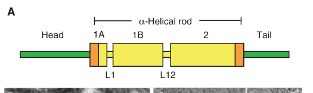

## Question

# Gene Research for Functional Annotation

## ⚠️ CRITICAL: Gene/Protein Identification Context

**BEFORE YOU BEGIN RESEARCH:** You MUST verify you are researching the CORRECT gene/protein. Gene symbols can be ambiguous, especially for less well-characterized genes from non-model organisms.

### Target Gene/Protein Identity (from UniProt):
- **UniProt Accession:** P08727
- **Protein Description:** RecName: Full=Keratin, type I cytoskeletal 19; AltName: Full=Cytokeratin-19; Short=CK-19; AltName: Full=Keratin-19; Short=K19;
- **Gene Information:** Name=KRT19 {ECO:0000312|HGNC:HGNC:6436};
- **Organism (full):** Homo sapiens (Human).
- **Protein Family:** Belongs to the intermediate filament family.
- **Key Domains:** IF_conserved. (IPR018039); IF_rod_dom. (IPR039008); Keratin_I. (IPR002957); Filament (PF00038)

### MANDATORY VERIFICATION STEPS:

1. **Check if the gene symbol "KRT19" matches the protein description above**
2. **Verify the organism is correct:** Homo sapiens (Human).
3. **Check if protein family/domains align with what you find in literature**
4. **If you find literature for a DIFFERENT gene with the same or similar symbol, STOP**

### If Gene Symbol is Ambiguous or You Cannot Find Relevant Literature:

**DO NOT PROCEED WITH RESEARCH ON A DIFFERENT GENE.** Instead:
- State clearly: "The gene symbol 'KRT19' is ambiguous or literature is limited for this specific protein"
- Explain what you found (e.g., "Found extensive literature on a different gene with the same symbol in a different organism")
- Describe the protein based ONLY on the UniProt information provided above
- Suggest that the protein function can be inferred from domain/family information

### Research Target:

Please provide a comprehensive research report on the gene **KRT19** (gene ID: KRT19, UniProt: P08727) in human.

The research report should be a detailed narrative explaining the function, biological processes, and localization of the gene product. Citations should be given for all claims.

You should prioritize authoritative reviews and primary scientific literature when conducting research. You can supplement
this with annotations you find in gene/protein databases, but these can be outdated or inaccurate.

We are specifically interested in the primary function of the gene - for enzymes, what reaction is catalyzed, and what is the substrate specificity? For transporters, what is the substrate? For structural proteins or adapters, what is the broader structural role? For signaling molecules, what is the role in the pathway.

We are interested in where in or outside the cell the gene product carries out its function.

We are also interested in the signaling or biochemical pathways in which the gene functions. We are less interested in broad pleiotropic effects, except where these elucidate the precise role.

Include evidence where possible. We are interested in both experimental evidence as well as inference from structure, evolution, or bioinformatic analysis. Precise studies should be prioritized over high-throughput, where available.

## Output

Question: You are an expert researcher providing comprehensive, well-cited information.

Provide detailed information focusing on:
1. Key concepts and definitions with current understanding
2. Recent developments and latest research (prioritize 2023-2024 sources)
3. Current applications and real-world implementations
4. Expert opinions and analysis from authoritative sources
5. Relevant statistics and data from recent studies

Format as a comprehensive research report with proper citations. Include URLs and publication dates where available.
Always prioritize recent, authoritative sources and provide specific citations for all major claims.

# Gene Research for Functional Annotation

## ⚠️ CRITICAL: Gene/Protein Identification Context

**BEFORE YOU BEGIN RESEARCH:** You MUST verify you are researching the CORRECT gene/protein. Gene symbols can be ambiguous, especially for less well-characterized genes from non-model organisms.

### Target Gene/Protein Identity (from UniProt):
- **UniProt Accession:** P08727
- **Protein Description:** RecName: Full=Keratin, type I cytoskeletal 19; AltName: Full=Cytokeratin-19; Short=CK-19; AltName: Full=Keratin-19; Short=K19;
- **Gene Information:** Name=KRT19 {ECO:0000312|HGNC:HGNC:6436};
- **Organism (full):** Homo sapiens (Human).
- **Protein Family:** Belongs to the intermediate filament family.
- **Key Domains:** IF_conserved. (IPR018039); IF_rod_dom. (IPR039008); Keratin_I. (IPR002957); Filament (PF00038)

### MANDATORY VERIFICATION STEPS:

1. **Check if the gene symbol "KRT19" matches the protein description above**
2. **Verify the organism is correct:** Homo sapiens (Human).
3. **Check if protein family/domains align with what you find in literature**
4. **If you find literature for a DIFFERENT gene with the same or similar symbol, STOP**

### If Gene Symbol is Ambiguous or You Cannot Find Relevant Literature:

**DO NOT PROCEED WITH RESEARCH ON A DIFFERENT GENE.** Instead:
- State clearly: "The gene symbol 'KRT19' is ambiguous or literature is limited for this specific protein"
- Explain what you found (e.g., "Found extensive literature on a different gene with the same symbol in a different organism")
- Describe the protein based ONLY on the UniProt information provided above
- Suggest that the protein function can be inferred from domain/family information

### Research Target:

Please provide a comprehensive research report on the gene **KRT19** (gene ID: KRT19, UniProt: P08727) in human.

The research report should be a detailed narrative explaining the function, biological processes, and localization of the gene product. Citations should be given for all claims.

You should prioritize authoritative reviews and primary scientific literature when conducting research. You can supplement
this with annotations you find in gene/protein databases, but these can be outdated or inaccurate.

We are specifically interested in the primary function of the gene - for enzymes, what reaction is catalyzed, and what is the substrate specificity? For transporters, what is the substrate? For structural proteins or adapters, what is the broader structural role? For signaling molecules, what is the role in the pathway.

We are interested in where in or outside the cell the gene product carries out its function.

We are also interested in the signaling or biochemical pathways in which the gene functions. We are less interested in broad pleiotropic effects, except where these elucidate the precise role.

Include evidence where possible. We are interested in both experimental evidence as well as inference from structure, evolution, or bioinformatic analysis. Precise studies should be prioritized over high-throughput, where available.

# Human KRT19 (UniProt P08727): functional annotation research report

## Identity and primary function

**Identity verified.** Human **KRT19** encodes keratin 19, also called cytokeratin 19, CK19 or K19—not KRT18, KRT7, or a similarly named protein from another organism. It is an acidic **type I intermediate-filament protein**. Its conserved central α-helical rod supports pairing with a type II keratin and filament assembly; unlike many other keratins, K19 has an exceptionally short C-terminal tail. These findings agree with the intermediate-filament, rod-domain and type-I-keratin annotations supplied for P08727. K19 is **structural, not an enzyme or transporter**: its principal established role is to contribute to the epithelial cytoskeleton and its mechanical organization. [UniProt P08727](https://www.uniprot.org/uniprotkb/P08727/entry); [Jacob et al., *Cold Spring Harbor Perspectives in Biology*, April 2018](https://doi.org/10.1101/cshperspect.a018275); [Fradette et al., *Journal of Biological Chemistry*, December 1998](https://doi.org/10.1074/jbc.273.52.35176). (brouillard2008contributionofproteomics pages 3-4, jacob2018typesiand pages 2-4, fradette1998thetypei pages 1-1)

Type I and type II keratins first form coiled-coil heterodimers and then assemble into approximately 10-nm filaments. K19’s choice of type II partner matters: **K8–K19** produced filamentous arrays in transfected cells, whereas **K5–K19** formed filaments in vitro but failed to establish comparable arrays de novo in the tested fibroblastic cells. In the purified-protein experiments, K5–K19 polymerized at approximately **75% efficiency**, versus **more than 90%** for K5–K14; K5–K19 tetramers were also less stable. K19 could nevertheless enter pre-existing networks in epithelial cells. These experiments support a specific contribution to filament properties, rather than a claim that every K19-positive cell uses one invariant keratin pair. [Fradette et al., December 1998](https://doi.org/10.1074/jbc.273.52.35176). (jacob2018typesiand pages 2-4, fradette1998thetypei pages 3-4, fradette1998thetypei pages 6-7, fradette1998thetypei pages 5-6)

The reviewed domain schematic and tissue immunofluorescence show the general keratin rod architecture and K19 staining in gut epithelium alongside K8/K18 staining. The schematic depicts the *keratin-family* architecture; the primary K19 assembly study supplies the evidence for **K19’s unusually short tail**. (jacob2018typesiand pages 1-2, jacob2018typesiand pages 2-4, jacob2018typesiand media 3b73d28d)

## Where K19 acts and what processes it supports

**Normal principal compartment: epithelial cytoplasm.** Keratin filaments form an intracellular network extending through epithelial cells and connecting, through junction-associated proteins, with sites of cell–cell adhesion. Thus K19’s best-established functional location is the **cytoplasmic filament network**, not a membrane-spanning receptor or a normally secreted protein. In gut epithelial sections, K19 staining was prominent toward the apical pole of enterocytes; this is a tissue-specific observation, not a universal K19 localization rule. [Jacob et al., April 2018](https://doi.org/10.1101/cshperspect.a018275). (jacob2018typesiand pages 1-2, jacob2018typesiand pages 2-4, jacob2018typesiand media 3b73d28d)

**Tissue context:** K19 occurs in several simple, ductal and some basal epithelia. In normal adult liver, bile-duct epithelial cells express K19 with K7, K8 and K18, whereas hepatocytes principally express K8/K18. It is consequently useful for identifying **cholangiocytes** and ductular reactions, but K19 expression is **not itself proof of stem-cell identity or of a biliary differentiation mechanism**. Skin studies also identify K19 in subsets of basal cells and the hair-follicle outer root sheath. [Kalabusheva et al., *International Journal of Molecular Sciences*, March 2023](https://doi.org/10.3390/ijms24065603); [Fradette et al., December 1998](https://doi.org/10.1074/jbc.273.52.35176). (kalabusheva2023akaleidoscopeof pages 2-4, fradette1998thetypei pages 1-2)

K19’s contribution to stress resistance has support beyond epithelial staining, although animal results require species qualification. A **mouse skeletal-muscle** study placed Krt19 within an intermediate-filament reticulum involved in force transmission. Reducing Krt18 in Krt19-null muscle produced a **33% post-injury strength deficit**, and reducing Krt19 in Krt18-null muscle produced an **18% deficit** in the reciprocal experiment. These combined-genotype injury results indicate complementary mechanical roles; neither percentage measures the effect of deleting human KRT19 alone. [Muriel et al., *American Journal of Physiology–Cell Physiology*, January 2020](https://doi.org/10.1152/ajpcell.00279.2019). (muriel2020keratin18is pages 1-6)

## Defined molecular interactions and pathways: recent primary research

**K19–HNRNPK: cytoplasmic RNA regulation in human cancer cells.** A 2023 study of human MDA-MB-231 triple-negative breast-cancer cells found K19 associated with the RNA-binding protein **HNRNPK** by proximity assays and reciprocal co-immunoprecipitation; purified K8/K19 filaments also bound HNRNPK in a co-sedimentation experiment. Deleting KRT19 reduced **cytoplasmic, but not total, HNRNPK**; K19 re-expression restored its cytoplasmic localization. RNA-binding measurements linked this localization to the abundance of HNRNPK-associated transcripts, particularly transcripts with 3′-UTR binding sites. KRT19 loss also reduced cell proliferation, with rescue upon K19 re-expression. This provides direct evidence that a K19-containing filament can act as a **cytoplasmic scaffold for a regulatory protein**. Changes in p53-related transcripts and p53/MDM2 protein levels are pathway observations in this cancer-cell model, not evidence that K19 is itself a transcription factor or that the same mechanism operates in every normal epithelium. [Fallatah et al., *BMC Molecular and Cell Biology*, August 2023](https://doi.org/10.1186/s12860-023-00488-z). (fallatah2023keratin19binds pages 4-7, fallatah2023keratin19binds pages 7-9, fallatah2023keratin19binds pages 2-4)

**Extracellular K19–CXCL12: a disease-specific exception.** In **mouse pancreatic ductal adenocarcinoma models**, tumor-cell Krt19 and transglutaminase 2 (*Tgm2*) were required for an extracellular **K19–CXCL12 coating** that limited T-cell entry. Disrupting either gene abolished the coat and permitted infiltration. Following Krt19 editing, tumors had increased T-cell-associated activity; one 2023 analysis reported approximately **200-fold higher *Cxcl9*** and **fivefold higher *Cxcl12*** expression in tumors without the coat. A 2024 follow-up found that the smaller, more immune-infiltrated Krt19-edited tumors accumulated natural-killer T cells and showed a type-I-interferon response; the tumor-growth difference disappeared in hosts lacking CD1d-dependent NKT cells or IFNAR1 signaling. These results assign K19 a **context-specific extracellular role in a tumor chemokine barrier**, distinct from its canonical cytoplasmic role. They do not establish that normal human K19 is constitutively extracellular or that KRT19 inhibition is a validated human treatment. [Yan et al., *Cancer Immunology Research*, May 2023](https://doi.org/10.1158/2326-6066.CIR-22-0593); [Li et al., *PNAS*, July 2024](https://doi.org/10.1073/pnas.2403917121). (yan2023tcell–mediateddevelopment pages 6-8, li2024intratumoralnktcell pages 2-4, li2024intratumoralnktcell pages 2-2, li2024intratumoralnktcell pages 1-2, yan2023tcell–mediateddevelopment pages 1-3)

**Differentiation-pathway readout versus pathway driver.** In 2024 human induced-pluripotent-stem-cell liver organoids, **CK19-positive cholangiocytes** lined bile-duct-like lumens that exhibited epithelial junctions and functional characteristics. The experimentally perturbed developmental signal was **vascular JAG1/Notch**, not KRT19: knocking out vascular JAG1 reduced duct formation. Separately, a 2024 liver-injury study found KRT19-positive reactive cholangiocytes associated with Hedgehog/GLI1 activity; GLI1 inhibition or knockdown reduced KRT19 expression, while GLI1 overexpression increased it. In these studies KRT19 is principally a **readout of biliary identity or injury-associated differentiation**, not an experimentally demonstrated upstream Notch or GLI1 regulator. [Carolina et al., *Nature Communications*, August 2024](https://doi.org/10.1038/s41467-024-51487-3); [Hu et al., *Theranostics*, March 2024](https://doi.org/10.7150/thno.91572). (carolina2024generationofhuman pages 3-4, carolina2024generationofhuman pages 1-2, hu2024hepaticprogenitorcelloriginated pages 1-2)

The following evidence summary separates established function, cell-model mechanisms and applications:

| Role and compartment | Strongest direct evidence | Interpretation / limit |
|---|---|---|
| **Core cytoplasmic intermediate-filament function** | K19 is a 40-kDa type-I keratin with a 312-residue rod and unusually short 13-residue tail. Recombinant K5–K19 formed filaments at ~75% efficiency versus >90% for K5–K14; K8–K19 formed filament arrays in transfected cells, whereas K5–K19 assembly was context-dependent. Keratin networks span epithelial cytoplasm and connect to cell–cell adhesions. [Fradette et al., 1998](https://doi.org/10.1074/jbc.273.52.35176); [Jacob et al., 2018](https://doi.org/10.1101/cshperspect.a018275) (jacob2018typesiand pages 1-2, jacob2018typesiand pages 2-4, fradette1998thetypei pages 3-4, fradette1998thetypei pages 6-7, fradette1998thetypei pages 1-1) | **Best-supported primary function:** K19 pairs with type-II keratins—especially K8 in experimental systems—to build a mechanically resilient epithelial cytoskeleton. It is structural, not an enzyme or transporter; assembly depends on partner and cellular context. |
| **Cytoplasmic scaffold controlling HNRNPK localization and post-transcriptional regulation in human breast-cancer cells** | In MDA-MB-231 cells, proximity ligation, reciprocal co-immunoprecipitation and purified K8/K19-filament co-sedimentation supported direct HNRNPK association. KRT19 knockout reduced cytoplasmic—not total—HNRNPK, decreased HNRNPK-bound transcripts and reduced proliferation; GFP–K19 re-expression rescued localization, p53/MDM2 abundance and proliferation. [Fallatah et al., 2023](https://doi.org/10.1186/s12860-023-00488-z) (fallatah2023keratin19binds pages 4-7, fallatah2023keratin19binds pages 7-9, fallatah2023keratin19binds pages 2-4, fallatah2023keratin19binds pages 1-2) | Demonstrates a nonmechanical scaffold role linking filaments to RNA-protein localization and 3′-UTR-associated transcript abundance. Evidence is mechanistic but mainly from one engineered, TP53-mutant cancer-cell line; in-vivo and normal-epithelium generalizability remain unproven. |
| **Extracellular K19–CXCL12/TG2 coating and immune exclusion in pancreatic cancer** | In murine pancreatic ductal adenocarcinoma, disruption of either tumor-cell *Krt19* or *Tgm2* abolished the covalent CXCL12/K19 coat and permitted T-cell infiltration; *Krt19*-edited tumors showed ~200-fold higher *Cxcl9* versus ~5-fold higher *Cxcl12*. In 2024 mouse models, KRT19-edited tumors accumulated NKT, NK and dendritic cells, lost growth control in CD1d-null or IFNAR1-null hosts, and linked NKT cells to type-I-interferon-dependent antitumor immunity. [Yan et al., 2023](https://doi.org/10.1158/2326-6066.CIR-22-0593); [Li et al., 2024](https://doi.org/10.1073/pnas.2403917121) (yan2023tcell–mediateddevelopment pages 6-8, li2024intratumoralnktcell pages 2-4, li2024intratumoralnktcell pages 2-2, yan2023tcell–mediateddevelopment pages 10-12, li2024intratumoralnktcell pages 1-2, yan2023tcell–mediateddevelopment pages 1-3) | A disease-specific, noncanonical extracellular role rather than K19’s normal location or primary function. Evidence is compelling in mouse tumor models but does not yet establish an equivalent mechanism, therapeutic efficacy or safety in human pancreatic cancer. |
| **Human clinical detection and cholangiocyte-lineage use** | In 487 patients, a CYFRA21-1-containing nomogram distinguished intrahepatic cholangiocarcinoma from hepatocellular carcinoma with AUC 0.972 in training (279 HCC, 86 ICC) and 0.994 in prospective validation (87 HCC, 35 ICC); training sensitivity/specificity were 94.2%/93.5% and validation values 97.1%/96.6%. Separately, CK19-positive cells formed functional bile-duct-like structures in human iPSC liver organoids. [Liu et al., 2024](https://doi.org/10.3389/fonc.2024.1404799); [Carolina et al., 2024](https://doi.org/10.1038/s41467-024-51487-3) (liu2024establishmentandvalidation pages 7-8, liu2024establishmentandvalidation pages 3-5, liu2024establishmentandvalidation pages 1-2, liu2024establishmentandvalidation pages 2-3, carolina2024generationofhuman pages 3-4, carolina2024generationofhuman pages 1-2) | CYFRA21-1 measures a soluble K19 fragment and KRT19 immunostaining marks biliary epithelial identity; neither alone proves causal KRT19 activity. The diagnostic result is a single-center combined model requiring broader external validation, while organoid expression establishes lineage identity rather than showing that KRT19 drives cholangiocyte differentiation. |

*Table: Evidence ranges from KRT19’s established cytoplasmic structural role to context-specific signaling and biomarker applications. The table separates direct functional findings from mouse-specific mechanisms and human clinical associations.*

## Current applications and quantitative clinical evidence

**Tissue and experimental identification.** CK19 immunostaining identifies biliary/ductal epithelial differentiation in pathology and is used to characterize cholangiocytes in human organoid models. This is an application of its expression pattern; a CK19-positive stain does not by itself show that K19 caused the observed differentiation. [Jacob et al., April 2018](https://doi.org/10.1101/cshperspect.a018275); [Carolina et al., August 2024](https://doi.org/10.1038/s41467-024-51487-3). (kalabusheva2023akaleidoscopeof pages 2-4, jacob2018typesiand pages 2-4, carolina2024generationofhuman pages 3-4)

**Blood-based fragment measurement.** **CYFRA 21-1 measures soluble fragments of K19**, not intact intracellular filaments. In a **single-center 2024 study of 487 patients** with intrahepatic cholangiocarcinoma (ICC) or hepatocellular carcinoma (HCC), the retrospective training cohort comprised **86 ICC and 279 HCC** cases; the prospective validation cohort comprised **35 ICC and 87 HCC** cases. Median training-cohort CYFRA 21-1 was **5.66 ng/mL in ICC versus 2.31 ng/mL in HCC**. A **six-variable model that included CYFRA 21-1**, rather than CYFRA 21-1 alone, achieved an area under the receiver-operating-characteristic curve (**AUC**) of **0.972** in training and **0.994** in validation. Its respective sensitivity/specificity values were **94.2%/93.5%** and **97.1%/96.6%**. These numbers must **not** be attributed to a stand-alone K19 test; broader external validation is needed. [Liu et al., *Frontiers in Oncology*, June 2024](https://doi.org/10.3389/fonc.2024.1404799). (liu2024establishmentandvalidation pages 7-8, liu2024establishmentandvalidation pages 3-5, liu2024establishmentandvalidation pages 2-3, liu2024establishmentandvalidation pages 8-9)

**Assay development, not proven diagnostic replacement.** A 2024 serum CYFRA 21-1 immunoaffinity LC–MS/MS method used a K19 signature peptide and achieved a **1–100 ng/mL** calibration range (**R² = 0.98**). Its investigators identified interference and standardization problems with conventional immunoassays; precipitation before affinity capture helped address assay interference. Comparison with an immunoassay involved **60 clinical samples**, but the authors presented clinical benefit over existing methods as requiring further evaluation. Analytical linearity is not a clinical diagnostic AUC. [Genet et al., *Clinical Chemistry and Laboratory Medicine*, 2024](https://doi.org/10.1515/cclm-2023-0795). (genet2024quantificationofthe pages 1-2, genet2024quantificationofthe pages 7-9, genet2024quantificationofthe pages 4-7)

## Functional interpretation and evidence limits

The most defensible annotation for **human KRT19/P08727** is **type I epithelial intermediate-filament structural component, functioning chiefly in cytoplasmic keratin networks and contributing to epithelial architecture and mechanical resilience**. The 2023 human-cell work adds a experimentally supported K19–HNRNPK scaffolding interaction; the 2023–2024 pancreatic studies add a compelling but **mouse-tumor-specific** extracellular K19–CXCL12 mechanism. Human biliary-organoid expression and serum CYFRA 21-1 associations are valuable applications, but **marker expression, circulating fragments and pathway correlation are not interchangeable with direct evidence of KRT19’s molecular function**. (jacob2018typesiand pages 2-4, fradette1998thetypei pages 6-7, fallatah2023keratin19binds pages 2-4, yan2023tcell–mediateddevelopment pages 6-8, li2024intratumoralnktcell pages 2-4, carolina2024generationofhuman pages 3-4, liu2024establishmentandvalidation pages 1-2)

References

1. (brouillard2008contributionofproteomics pages 3-4): Franck Brouillard, Janine Fritsch, Aleksander Edelman, and Mario Ollero. Contribution of proteomics to the study of the role of cytokeratins in disease and physiopathology. PROTEOMICS – Clinical Applications, 2:264-285, Feb 2008. URL: https://doi.org/10.1002/prca.200780018, doi:10.1002/prca.200780018. This article has 20 citations.

2. (jacob2018typesiand pages 2-4): Justin T. Jacob, Pierre A. Coulombe, Raymond Kwan, and M. Bishr Omary. Types i and ii keratin intermediate filaments. Cold Spring Harbor perspectives in biology, 10 4:a018275, Apr 2018. URL: https://doi.org/10.1101/cshperspect.a018275, doi:10.1101/cshperspect.a018275. This article has 340 citations and is from a peer-reviewed journal.

3. (fradette1998thetypei pages 1-1): Julie Fradette, Lucie Germain, Partha Seshaiah, and Pierre A. Coulombe. The type i keratin 19 possesses distinct and context-dependent assembly properties*. The Journal of Biological Chemistry, 273:35176-35184, Dec 1998. URL: https://doi.org/10.1074/jbc.273.52.35176, doi:10.1074/jbc.273.52.35176. This article has 74 citations.

4. (fradette1998thetypei pages 3-4): Julie Fradette, Lucie Germain, Partha Seshaiah, and Pierre A. Coulombe. The type i keratin 19 possesses distinct and context-dependent assembly properties*. The Journal of Biological Chemistry, 273:35176-35184, Dec 1998. URL: https://doi.org/10.1074/jbc.273.52.35176, doi:10.1074/jbc.273.52.35176. This article has 74 citations.

5. (fradette1998thetypei pages 6-7): Julie Fradette, Lucie Germain, Partha Seshaiah, and Pierre A. Coulombe. The type i keratin 19 possesses distinct and context-dependent assembly properties*. The Journal of Biological Chemistry, 273:35176-35184, Dec 1998. URL: https://doi.org/10.1074/jbc.273.52.35176, doi:10.1074/jbc.273.52.35176. This article has 74 citations.

6. (fradette1998thetypei pages 5-6): Julie Fradette, Lucie Germain, Partha Seshaiah, and Pierre A. Coulombe. The type i keratin 19 possesses distinct and context-dependent assembly properties*. The Journal of Biological Chemistry, 273:35176-35184, Dec 1998. URL: https://doi.org/10.1074/jbc.273.52.35176, doi:10.1074/jbc.273.52.35176. This article has 74 citations.

7. (jacob2018typesiand pages 1-2): Justin T. Jacob, Pierre A. Coulombe, Raymond Kwan, and M. Bishr Omary. Types i and ii keratin intermediate filaments. Cold Spring Harbor perspectives in biology, 10 4:a018275, Apr 2018. URL: https://doi.org/10.1101/cshperspect.a018275, doi:10.1101/cshperspect.a018275. This article has 340 citations and is from a peer-reviewed journal.

8. (jacob2018typesiand media 3b73d28d): Justin T. Jacob, Pierre A. Coulombe, Raymond Kwan, and M. Bishr Omary. Types i and ii keratin intermediate filaments. Cold Spring Harbor perspectives in biology, 10 4:a018275, Apr 2018. URL: https://doi.org/10.1101/cshperspect.a018275, doi:10.1101/cshperspect.a018275. This article has 340 citations and is from a peer-reviewed journal.

9. (kalabusheva2023akaleidoscopeof pages 2-4): Ekaterina P. Kalabusheva, Anastasia S. Shtompel, Alexandra L. Rippa, Sergey V. Ulianov, Sergey V. Razin, and Ekaterina A. Vorotelyak. A kaleidoscope of keratin gene expression and the mosaic of its regulatory mechanisms. International Journal of Molecular Sciences, 24:5603, Mar 2023. URL: https://doi.org/10.3390/ijms24065603, doi:10.3390/ijms24065603. This article has 32 citations.

10. (fradette1998thetypei pages 1-2): Julie Fradette, Lucie Germain, Partha Seshaiah, and Pierre A. Coulombe. The type i keratin 19 possesses distinct and context-dependent assembly properties*. The Journal of Biological Chemistry, 273:35176-35184, Dec 1998. URL: https://doi.org/10.1074/jbc.273.52.35176, doi:10.1074/jbc.273.52.35176. This article has 74 citations.

11. (muriel2020keratin18is pages 1-6): Joaquin M. Muriel, Andrea O’Neill, Jaclyn P. Kerr, Emily Kleinhans-Welte, Richard M. Lovering, and Robert J. Bloch. Keratin 18 is an integral part of the intermediate filament network in murine skeletal muscle. American Journal of Physiology-Cell Physiology, 318:C215-C224, Jan 2020. URL: https://doi.org/10.1152/ajpcell.00279.2019, doi:10.1152/ajpcell.00279.2019. This article has 27 citations.

12. (fallatah2023keratin19binds pages 4-7): Arwa Fallatah, Dimitrios G. Anastasakis, Amirhossein Manzourolajdad, Pooja Sharma, Xiantao Wang, Alexis Jacob, Sarah Alsharif, Ahmed Elgerbi, Pierre A. Coulombe, Markus Hafner, and Byung Min Chung. Keratin 19 binds and regulates cytoplasmic hnrnpk mrna targets in triple-negative breast cancer. BMC Molecular and Cell Biology, Aug 2023. URL: https://doi.org/10.1186/s12860-023-00488-z, doi:10.1186/s12860-023-00488-z. This article has 13 citations and is from a peer-reviewed journal.

13. (fallatah2023keratin19binds pages 7-9): Arwa Fallatah, Dimitrios G. Anastasakis, Amirhossein Manzourolajdad, Pooja Sharma, Xiantao Wang, Alexis Jacob, Sarah Alsharif, Ahmed Elgerbi, Pierre A. Coulombe, Markus Hafner, and Byung Min Chung. Keratin 19 binds and regulates cytoplasmic hnrnpk mrna targets in triple-negative breast cancer. BMC Molecular and Cell Biology, Aug 2023. URL: https://doi.org/10.1186/s12860-023-00488-z, doi:10.1186/s12860-023-00488-z. This article has 13 citations and is from a peer-reviewed journal.

14. (fallatah2023keratin19binds pages 2-4): Arwa Fallatah, Dimitrios G. Anastasakis, Amirhossein Manzourolajdad, Pooja Sharma, Xiantao Wang, Alexis Jacob, Sarah Alsharif, Ahmed Elgerbi, Pierre A. Coulombe, Markus Hafner, and Byung Min Chung. Keratin 19 binds and regulates cytoplasmic hnrnpk mrna targets in triple-negative breast cancer. BMC Molecular and Cell Biology, Aug 2023. URL: https://doi.org/10.1186/s12860-023-00488-z, doi:10.1186/s12860-023-00488-z. This article has 13 citations and is from a peer-reviewed journal.

15. (yan2023tcell–mediateddevelopment pages 6-8): Ran Yan, Philip Moresco, Bruno Gegenhuber, and Douglas T. Fearon. T cell–mediated development of stromal fibroblasts with an immune-enhancing chemokine profile. Cancer Immunology Research, 11:1044-1054, May 2023. URL: https://doi.org/10.1158/2326-6066.cir-22-0593, doi:10.1158/2326-6066.cir-22-0593. This article has 28 citations and is from a domain leading peer-reviewed journal.

16. (li2024intratumoralnktcell pages 2-4): Jiayun Li, Philip Moresco, and Douglas T. Fearon. Intratumoral nkt cell accumulation promotes antitumor immunity in pancreatic cancer. Proceedings of the National Academy of Sciences of the United States of America, Jul 2024. URL: https://doi.org/10.1073/pnas.2403917121, doi:10.1073/pnas.2403917121. This article has 14 citations and is from a highest quality peer-reviewed journal.

17. (li2024intratumoralnktcell pages 2-2): Jiayun Li, Philip Moresco, and Douglas T. Fearon. Intratumoral nkt cell accumulation promotes antitumor immunity in pancreatic cancer. Proceedings of the National Academy of Sciences of the United States of America, Jul 2024. URL: https://doi.org/10.1073/pnas.2403917121, doi:10.1073/pnas.2403917121. This article has 14 citations and is from a highest quality peer-reviewed journal.

18. (li2024intratumoralnktcell pages 1-2): Jiayun Li, Philip Moresco, and Douglas T. Fearon. Intratumoral nkt cell accumulation promotes antitumor immunity in pancreatic cancer. Proceedings of the National Academy of Sciences of the United States of America, Jul 2024. URL: https://doi.org/10.1073/pnas.2403917121, doi:10.1073/pnas.2403917121. This article has 14 citations and is from a highest quality peer-reviewed journal.

19. (yan2023tcell–mediateddevelopment pages 1-3): Ran Yan, Philip Moresco, Bruno Gegenhuber, and Douglas T. Fearon. T cell–mediated development of stromal fibroblasts with an immune-enhancing chemokine profile. Cancer Immunology Research, 11:1044-1054, May 2023. URL: https://doi.org/10.1158/2326-6066.cir-22-0593, doi:10.1158/2326-6066.cir-22-0593. This article has 28 citations and is from a domain leading peer-reviewed journal.

20. (carolina2024generationofhuman pages 3-4): Erica Carolina, Yoshiki Kuse, Ayumu Okumura, Kenji Aoshima, Tomomi Tadokoro, Shinya Matsumoto, Eriko Kanai, Takashi Okumura, Toshiharu Kasai, Souichiro Yamabe, Yuji Nishikawa, Kiyoshi Yamaguchi, Yoichi Furukawa, Naoki Tanimizu, and Hideki Taniguchi. Generation of human ipsc-derived 3d bile duct within liver organoid by incorporating human ipsc-derived blood vessel. Nature Communications, Aug 2024. URL: https://doi.org/10.1038/s41467-024-51487-3, doi:10.1038/s41467-024-51487-3. This article has 66 citations and is from a highest quality peer-reviewed journal.

21. (carolina2024generationofhuman pages 1-2): Erica Carolina, Yoshiki Kuse, Ayumu Okumura, Kenji Aoshima, Tomomi Tadokoro, Shinya Matsumoto, Eriko Kanai, Takashi Okumura, Toshiharu Kasai, Souichiro Yamabe, Yuji Nishikawa, Kiyoshi Yamaguchi, Yoichi Furukawa, Naoki Tanimizu, and Hideki Taniguchi. Generation of human ipsc-derived 3d bile duct within liver organoid by incorporating human ipsc-derived blood vessel. Nature Communications, Aug 2024. URL: https://doi.org/10.1038/s41467-024-51487-3, doi:10.1038/s41467-024-51487-3. This article has 66 citations and is from a highest quality peer-reviewed journal.

22. (hu2024hepaticprogenitorcelloriginated pages 1-2): Yonghong Hu, Xinyu Bao, Zheng Zhang, Long Chen, Yue Liang, Yan Qu, Qun Zhou, Xiaoxi Zhou, Jing Fang, Zhun Xiao, Yadong Fu, Hailin Yang, Wei Liu, Ying Lv, Hongyan Cao, Gaofeng Chen, Jian Ping, Hua Zhang, Yongping Mu, Chenghai Liu, Chao-Po Lin, Jian Wu, Ping Liu, and Jiamei Chen. Hepatic progenitor cell-originated ductular reaction facilitates liver fibrosis through activation of hedgehog signaling. Theranostics, 14:2379-2395, Mar 2024. URL: https://doi.org/10.7150/thno.91572, doi:10.7150/thno.91572. This article has 32 citations and is from a domain leading peer-reviewed journal.

23. (fallatah2023keratin19binds pages 1-2): Arwa Fallatah, Dimitrios G. Anastasakis, Amirhossein Manzourolajdad, Pooja Sharma, Xiantao Wang, Alexis Jacob, Sarah Alsharif, Ahmed Elgerbi, Pierre A. Coulombe, Markus Hafner, and Byung Min Chung. Keratin 19 binds and regulates cytoplasmic hnrnpk mrna targets in triple-negative breast cancer. BMC Molecular and Cell Biology, Aug 2023. URL: https://doi.org/10.1186/s12860-023-00488-z, doi:10.1186/s12860-023-00488-z. This article has 13 citations and is from a peer-reviewed journal.

24. (yan2023tcell–mediateddevelopment pages 10-12): Ran Yan, Philip Moresco, Bruno Gegenhuber, and Douglas T. Fearon. T cell–mediated development of stromal fibroblasts with an immune-enhancing chemokine profile. Cancer Immunology Research, 11:1044-1054, May 2023. URL: https://doi.org/10.1158/2326-6066.cir-22-0593, doi:10.1158/2326-6066.cir-22-0593. This article has 28 citations and is from a domain leading peer-reviewed journal.

25. (liu2024establishmentandvalidation pages 7-8): Yuan-Yuan Liu, Yue-Yue Li, Yong-Shuai Liu, Zong-Li Zhang, and Yan-Jing Gao. Establishment and validation of a nomogram containing cytokeratin fragment antigen 21-1 for the differential diagnosis of intrahepatic cholangiocarcinoma and hepatocellular carcinoma. Frontiers in Oncology, Jun 2024. URL: https://doi.org/10.3389/fonc.2024.1404799, doi:10.3389/fonc.2024.1404799. This article has 0 citations.

26. (liu2024establishmentandvalidation pages 3-5): Yuan-Yuan Liu, Yue-Yue Li, Yong-Shuai Liu, Zong-Li Zhang, and Yan-Jing Gao. Establishment and validation of a nomogram containing cytokeratin fragment antigen 21-1 for the differential diagnosis of intrahepatic cholangiocarcinoma and hepatocellular carcinoma. Frontiers in Oncology, Jun 2024. URL: https://doi.org/10.3389/fonc.2024.1404799, doi:10.3389/fonc.2024.1404799. This article has 0 citations.

27. (liu2024establishmentandvalidation pages 1-2): Yuan-Yuan Liu, Yue-Yue Li, Yong-Shuai Liu, Zong-Li Zhang, and Yan-Jing Gao. Establishment and validation of a nomogram containing cytokeratin fragment antigen 21-1 for the differential diagnosis of intrahepatic cholangiocarcinoma and hepatocellular carcinoma. Frontiers in Oncology, Jun 2024. URL: https://doi.org/10.3389/fonc.2024.1404799, doi:10.3389/fonc.2024.1404799. This article has 0 citations.

28. (liu2024establishmentandvalidation pages 2-3): Yuan-Yuan Liu, Yue-Yue Li, Yong-Shuai Liu, Zong-Li Zhang, and Yan-Jing Gao. Establishment and validation of a nomogram containing cytokeratin fragment antigen 21-1 for the differential diagnosis of intrahepatic cholangiocarcinoma and hepatocellular carcinoma. Frontiers in Oncology, Jun 2024. URL: https://doi.org/10.3389/fonc.2024.1404799, doi:10.3389/fonc.2024.1404799. This article has 0 citations.

29. (liu2024establishmentandvalidation pages 8-9): Yuan-Yuan Liu, Yue-Yue Li, Yong-Shuai Liu, Zong-Li Zhang, and Yan-Jing Gao. Establishment and validation of a nomogram containing cytokeratin fragment antigen 21-1 for the differential diagnosis of intrahepatic cholangiocarcinoma and hepatocellular carcinoma. Frontiers in Oncology, Jun 2024. URL: https://doi.org/10.3389/fonc.2024.1404799, doi:10.3389/fonc.2024.1404799. This article has 0 citations.

30. (genet2024quantificationofthe pages 1-2): Sylvia A.A.M. Genet, Sebastian A.H. van den Wildenberg, Maarten A.C. Broeren, Joost L.J. van Dongen, Luc Brunsveld, Volkher Scharnhorst, and Daan van de Kerkhof. Quantification of the lung cancer tumor marker cyfra 21-1 using protein precipitation, immunoaffinity bottom-up lc-ms/ms. Clinical Chemistry and Laboratory Medicine (CCLM), 62:720-728, Oct 2024. URL: https://doi.org/10.1515/cclm-2023-0795, doi:10.1515/cclm-2023-0795. This article has 16 citations.

31. (genet2024quantificationofthe pages 7-9): Sylvia A.A.M. Genet, Sebastian A.H. van den Wildenberg, Maarten A.C. Broeren, Joost L.J. van Dongen, Luc Brunsveld, Volkher Scharnhorst, and Daan van de Kerkhof. Quantification of the lung cancer tumor marker cyfra 21-1 using protein precipitation, immunoaffinity bottom-up lc-ms/ms. Clinical Chemistry and Laboratory Medicine (CCLM), 62:720-728, Oct 2024. URL: https://doi.org/10.1515/cclm-2023-0795, doi:10.1515/cclm-2023-0795. This article has 16 citations.

32. (genet2024quantificationofthe pages 4-7): Sylvia A.A.M. Genet, Sebastian A.H. van den Wildenberg, Maarten A.C. Broeren, Joost L.J. van Dongen, Luc Brunsveld, Volkher Scharnhorst, and Daan van de Kerkhof. Quantification of the lung cancer tumor marker cyfra 21-1 using protein precipitation, immunoaffinity bottom-up lc-ms/ms. Clinical Chemistry and Laboratory Medicine (CCLM), 62:720-728, Oct 2024. URL: https://doi.org/10.1515/cclm-2023-0795, doi:10.1515/cclm-2023-0795. This article has 16 citations.

## Artifacts

- [Edison artifact artifact-00](KRT19-deep-research-falcon_artifacts/artifact-00.md)

## Citations

1. brouillard2008contributionofproteomics pages 3-4
2. jacob2018typesiand pages 2-4
3. fradette1998thetypei pages 1-1
4. fradette1998thetypei pages 3-4
5. fradette1998thetypei pages 6-7
6. fradette1998thetypei pages 5-6
7. jacob2018typesiand pages 1-2
8. kalabusheva2023akaleidoscopeof pages 2-4
9. fradette1998thetypei pages 1-2
10. li2024intratumoralnktcell pages 2-4
11. li2024intratumoralnktcell pages 2-2
12. li2024intratumoralnktcell pages 1-2
13. carolina2024generationofhuman pages 3-4
14. carolina2024generationofhuman pages 1-2
15. hu2024hepaticprogenitorcelloriginated pages 1-2
16. liu2024establishmentandvalidation pages 7-8
17. liu2024establishmentandvalidation pages 3-5
18. liu2024establishmentandvalidation pages 1-2
19. liu2024establishmentandvalidation pages 2-3
20. liu2024establishmentandvalidation pages 8-9
21. genet2024quantificationofthe pages 1-2
22. genet2024quantificationofthe pages 7-9
23. genet2024quantificationofthe pages 4-7
24. UniProt P08727
25. Jacob et al., *Cold Spring Harbor Perspectives in Biology*, April 2018
26. Fradette et al., *Journal of Biological Chemistry*, December 1998
27. Fradette et al., December 1998
28. Jacob et al., April 2018
29. Kalabusheva et al., *International Journal of Molecular Sciences*, March 2023
30. Muriel et al., *American Journal of Physiology–Cell Physiology*, January 2020
31. Fallatah et al., *BMC Molecular and Cell Biology*, August 2023
32. Yan et al., *Cancer Immunology Research*, May 2023
33. Li et al., *PNAS*, July 2024
34. Carolina et al., *Nature Communications*, August 2024
35. Hu et al., *Theranostics*, March 2024
36. Fradette et al., 1998
37. Jacob et al., 2018
38. Fallatah et al., 2023
39. Yan et al., 2023
40. Li et al., 2024
41. Liu et al., 2024
42. Carolina et al., 2024
43. Carolina et al., August 2024
44. Liu et al., *Frontiers in Oncology*, June 2024
45. Genet et al., *Clinical Chemistry and Laboratory Medicine*, 2024
46. https://www.uniprot.org/uniprotkb/P08727/entry
47. https://doi.org/10.1101/cshperspect.a018275
48. https://doi.org/10.1074/jbc.273.52.35176
49. https://doi.org/10.3390/ijms24065603
50. https://doi.org/10.1152/ajpcell.00279.2019
51. https://doi.org/10.1186/s12860-023-00488-z
52. https://doi.org/10.1158/2326-6066.CIR-22-0593
53. https://doi.org/10.1073/pnas.2403917121
54. https://doi.org/10.1038/s41467-024-51487-3
55. https://doi.org/10.7150/thno.91572
56. https://doi.org/10.3389/fonc.2024.1404799
57. https://doi.org/10.1515/cclm-2023-0795
58. https://doi.org/10.1002/prca.200780018,
59. https://doi.org/10.1101/cshperspect.a018275,
60. https://doi.org/10.1074/jbc.273.52.35176,
61. https://doi.org/10.3390/ijms24065603,
62. https://doi.org/10.1152/ajpcell.00279.2019,
63. https://doi.org/10.1186/s12860-023-00488-z,
64. https://doi.org/10.1158/2326-6066.cir-22-0593,
65. https://doi.org/10.1073/pnas.2403917121,
66. https://doi.org/10.1038/s41467-024-51487-3,
67. https://doi.org/10.7150/thno.91572,
68. https://doi.org/10.3389/fonc.2024.1404799,
69. https://doi.org/10.1515/cclm-2023-0795,