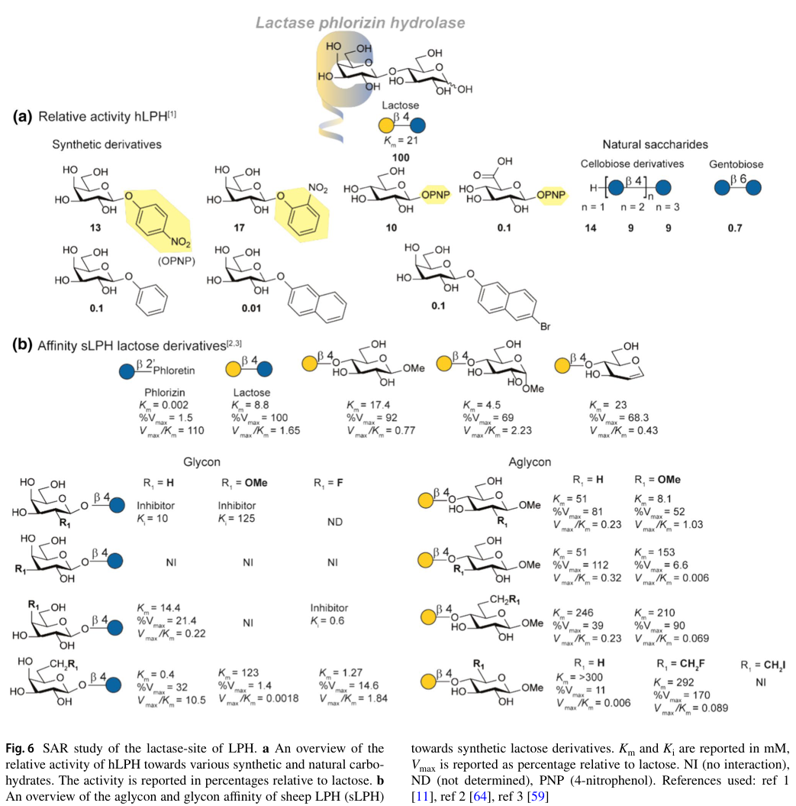

## Question

# Gene Research for Functional Annotation

## ⚠️ CRITICAL: Gene/Protein Identification Context

**BEFORE YOU BEGIN RESEARCH:** You MUST verify you are researching the CORRECT gene/protein. Gene symbols can be ambiguous, especially for less well-characterized genes from non-model organisms.

### Target Gene/Protein Identity (from UniProt):
- **UniProt Accession:** P09848
- **Protein Description:** RecName: Full=Lactase/phlorizin hydrolase {ECO:0000305|PubMed:16400612}; AltName: Full=Lactase/glycosylceramidase {ECO:0000305|PubMed:9762914}; Includes: RecName: Full=Lactase {ECO:0000305|PubMed:9762914}; EC=3.2.1.108 {ECO:0000269|PubMed:12594539, ECO:0000269|PubMed:16400612, ECO:0000269|PubMed:3929764, ECO:0000269|PubMed:9762914}; Includes: RecName: Full=Glycosylceramidase {ECO:0000250|UniProtKB:Q02401}; EC=3.2.1.62 {ECO:0000250|UniProtKB:Q02401}; AltName: Full=Phlorizin hydrolase {ECO:0000305|PubMed:9762914}; Flags: Precursor;
- **Gene Information:** Name=LCT {ECO:0000312|HGNC:HGNC:6530}; Synonyms=LPH {ECO:0000303|PubMed:9762914};
- **Organism (full):** Homo sapiens (Human).
- **Protein Family:** Belongs to the glycosyl hydrolase 1 family. .
- **Key Domains:** GH_1_N_CS. (IPR033132); GH_hydrolase_sf. (IPR017853); Glyco_hydro_1. (IPR001360); Glyco_hydro_1_AS. (IPR018120); Glyco_hydro_1 (PF00232)

### MANDATORY VERIFICATION STEPS:

1. **Check if the gene symbol "LCT" matches the protein description above**
2. **Verify the organism is correct:** Homo sapiens (Human).
3. **Check if protein family/domains align with what you find in literature**
4. **If you find literature for a DIFFERENT gene with the same or similar symbol, STOP**

### If Gene Symbol is Ambiguous or You Cannot Find Relevant Literature:

**DO NOT PROCEED WITH RESEARCH ON A DIFFERENT GENE.** Instead:
- State clearly: "The gene symbol 'LCT' is ambiguous or literature is limited for this specific protein"
- Explain what you found (e.g., "Found extensive literature on a different gene with the same symbol in a different organism")
- Describe the protein based ONLY on the UniProt information provided above
- Suggest that the protein function can be inferred from domain/family information

### Research Target:

Please provide a comprehensive research report on the gene **LCT** (gene ID: LCT, UniProt: P09848) in human.

The research report should be a detailed narrative explaining the function, biological processes, and localization of the gene product. Citations should be given for all claims.

You should prioritize authoritative reviews and primary scientific literature when conducting research. You can supplement
this with annotations you find in gene/protein databases, but these can be outdated or inaccurate.

We are specifically interested in the primary function of the gene - for enzymes, what reaction is catalyzed, and what is the substrate specificity? For transporters, what is the substrate? For structural proteins or adapters, what is the broader structural role? For signaling molecules, what is the role in the pathway.

We are interested in where in or outside the cell the gene product carries out its function.

We are also interested in the signaling or biochemical pathways in which the gene functions. We are less interested in broad pleiotropic effects, except where these elucidate the precise role.

Include evidence where possible. We are interested in both experimental evidence as well as inference from structure, evolution, or bioinformatic analysis. Precise studies should be prioritized over high-throughput, where available.

## Output

Question: You are an expert researcher providing comprehensive, well-cited information.

Provide detailed information focusing on:
1. Key concepts and definitions with current understanding
2. Recent developments and latest research (prioritize 2023-2024 sources)
3. Current applications and real-world implementations
4. Expert opinions and analysis from authoritative sources
5. Relevant statistics and data from recent studies

Format as a comprehensive research report with proper citations. Include URLs and publication dates where available.
Always prioritize recent, authoritative sources and provide specific citations for all major claims.

# Gene Research for Functional Annotation

## ⚠️ CRITICAL: Gene/Protein Identification Context

**BEFORE YOU BEGIN RESEARCH:** You MUST verify you are researching the CORRECT gene/protein. Gene symbols can be ambiguous, especially for less well-characterized genes from non-model organisms.

### Target Gene/Protein Identity (from UniProt):
- **UniProt Accession:** P09848
- **Protein Description:** RecName: Full=Lactase/phlorizin hydrolase {ECO:0000305|PubMed:16400612}; AltName: Full=Lactase/glycosylceramidase {ECO:0000305|PubMed:9762914}; Includes: RecName: Full=Lactase {ECO:0000305|PubMed:9762914}; EC=3.2.1.108 {ECO:0000269|PubMed:12594539, ECO:0000269|PubMed:16400612, ECO:0000269|PubMed:3929764, ECO:0000269|PubMed:9762914}; Includes: RecName: Full=Glycosylceramidase {ECO:0000250|UniProtKB:Q02401}; EC=3.2.1.62 {ECO:0000250|UniProtKB:Q02401}; AltName: Full=Phlorizin hydrolase {ECO:0000305|PubMed:9762914}; Flags: Precursor;
- **Gene Information:** Name=LCT {ECO:0000312|HGNC:HGNC:6530}; Synonyms=LPH {ECO:0000303|PubMed:9762914};
- **Organism (full):** Homo sapiens (Human).
- **Protein Family:** Belongs to the glycosyl hydrolase 1 family. .
- **Key Domains:** GH_1_N_CS. (IPR033132); GH_hydrolase_sf. (IPR017853); Glyco_hydro_1. (IPR001360); Glyco_hydro_1_AS. (IPR018120); Glyco_hydro_1 (PF00232)

### MANDATORY VERIFICATION STEPS:

1. **Check if the gene symbol "LCT" matches the protein description above**
2. **Verify the organism is correct:** Homo sapiens (Human).
3. **Check if protein family/domains align with what you find in literature**
4. **If you find literature for a DIFFERENT gene with the same or similar symbol, STOP**

### If Gene Symbol is Ambiguous or You Cannot Find Relevant Literature:

**DO NOT PROCEED WITH RESEARCH ON A DIFFERENT GENE.** Instead:
- State clearly: "The gene symbol 'LCT' is ambiguous or literature is limited for this specific protein"
- Explain what you found (e.g., "Found extensive literature on a different gene with the same symbol in a different organism")
- Describe the protein based ONLY on the UniProt information provided above
- Suggest that the protein function can be inferred from domain/family information

### Research Target:

Please provide a comprehensive research report on the gene **LCT** (gene ID: LCT, UniProt: P09848) in human.

The research report should be a detailed narrative explaining the function, biological processes, and localization of the gene product. Citations should be given for all claims.

You should prioritize authoritative reviews and primary scientific literature when conducting research. You can supplement
this with annotations you find in gene/protein databases, but these can be outdated or inaccurate.

We are specifically interested in the primary function of the gene - for enzymes, what reaction is catalyzed, and what is the substrate specificity? For transporters, what is the substrate? For structural proteins or adapters, what is the broader structural role? For signaling molecules, what is the role in the pathway.

We are interested in where in or outside the cell the gene product carries out its function.

We are also interested in the signaling or biochemical pathways in which the gene functions. We are less interested in broad pleiotropic effects, except where these elucidate the precise role.

Include evidence where possible. We are interested in both experimental evidence as well as inference from structure, evolution, or bioinformatic analysis. Precise studies should be prioritized over high-throughput, where available.

# Human LCT (UniProt P09848): functional annotation research report

**Identity verified.** Human **LCT**, also called **LPH**, encodes **lactase/phlorizin hydrolase**, not a similarly named protein from another organism. Its four homologous precursor domains are consistent with the specified glycoside-hydrolase-family-1 annotation; the mature digestive enzyme retains catalytic domains III and IV. The biochemical and localization evidence below concerns the human intestinal protein. (amiri2015thediverseforms pages 1-3, behrendt2010characterizationofnatural pages 101-104)

## Primary function and substrate specificity

LCT’s principal physiological function is **hydrolysis of dietary lactose at the small-intestinal brush border**. Lactose is galactose-β(1→4)-glucose; cleavage yields galactose and glucose for absorption, rather than transporting intact lactose into enterocytes. Human LPH accounts for approximately **95% of measured intestinal-mucosal lactase activity** in a cited biochemical review. Its separate phlorizin-hydrolase activity accepts other β-glycosides, but that activity should not be mistaken for the established primary role in milk-sugar digestion. (amiri2015thediverseforms pages 1-3, angima2024prebioticstrategiesto pages 1-2, behrendt2010characterizationofnatural pages 25-28)

The two activities can be distinguished by their catalytic domains and preferred substrates:

| Human LCT product (UniProt P09848) activity | Catalytic site | Reaction and substrate preference | EC number | Functional location | Confidence / physiological role |
|---|---|---|---|---|---|
| Lactase | Domain IV; catalytic Glu1749 | Lactose + H₂O → D-galactose + D-glucose; site preferentially accommodates β-glycosides with hydrophilic aglycones (amiri2015thediverseforms pages 1-3, elferink2020acomprehensiveoverview pages 7-10) | EC 3.2.1.108 | Extracellular face of the apical brush-border membrane, acting in the small-intestinal lumen (amiri2015thediverseforms pages 1-3) | **Established primary function:** digestion of dietary lactose before monosaccharide uptake (amiri2015thediverseforms pages 1-3, elferink2020acomprehensiveoverview pages 7-10) |
| Phlorizin hydrolase / glycosylceramidase | Domain III; catalytic Glu1273 | Phlorizin + H₂O → phloretin + D-glucose; also dietary glycosylceramide + H₂O → ceramide + sugar. Prefers β-glycosides with hydrophobic aglycones, including aryl β-glycosides and glycosylceramides (behrendt2010characterizationofnatural pages 25-28, amiri2015thediverseforms pages 1-3, elferink2020acomprehensiveoverview pages 7-10) | EC 3.2.1.62 | Extracellular face of the apical brush-border membrane, acting toward the small-intestinal lumen (amiri2015thediverseforms pages 1-3, elferink2020acomprehensiveoverview pages 7-10) | **Biochemical activity established; physiological importance incompletely defined:** dietary glycosylceramides are plausible physiological substrates, but the in-vivo role of this site remains unresolved (behrendt2010characterizationofnatural pages 25-28, elferink2020acomprehensiveoverview pages 7-10) |

*Table: The two catalytic sites of human lactase/phlorizin hydrolase have distinct domain locations and aglycone preferences while operating at the luminal brush border. Lactose digestion is firmly established as the primary physiological function; the in-vivo importance of the phlorizin/glycosylceramidase site remains uncertain.*

Biochemical substrate studies support this division rather than a rigid rule that each site accepts only one compound: the lactase site also hydrolyzes some other β-linked carbohydrates, whereas the phlorizin site favors substrates with hydrophobic aglycones. The phlorizin-site reaction yields **phloretin and glucose**. A substrate-specificity review reports a lactose-site *K*m of **21 mM for lactose** versus **4.4 mM for cellobiose** under the reviewed assay conditions; a lower *K*m alone does not establish that cellobiose is the principal physiological substrate. Its substrate diagrams depict the corresponding carbohydrate and phlorizin chemistries. (elferink2020acomprehensiveoverview pages 7-10, elferink2020acomprehensiveoverview media e8fb31d0, elferink2020acomprehensiveoverview media 751520cc)

Dietary glycosylceramides and certain flavonoid glycosides can also be hydrolyzed by LPH. Their biochemical turnover is supported, but **the in-vivo importance of the phlorizin/glycosylceramidase site remains less securely defined** than lactose digestion. Phlorizin is a useful named assay substrate, not evidence that digesting phlorizin is the enzyme’s principal physiological purpose. (behrendt2010characterizationofnatural pages 25-28, elferink2020acomprehensiveoverview pages 7-10)

## Cellular location, maturation and pathway

LPH is a **type-I integral membrane ectoenzyme** of differentiated small-intestinal enterocytes. A C-terminal transmembrane segment anchors it in the **apical microvillar, or brush-border, membrane**, with its catalytic domains exposed to intestinal contents; it is not primarily a cytosolic or lysosomal lactase. Activity is particularly prominent in the proximal small intestine. The human translation product has **1,927 amino acids** and four homologous extracellular domains; the membrane anchor and short cytoplasmic tail establish its topology. (amiri2015thediverseforms pages 1-3, noren2001structurebiosynthesisand pages 1-2)

Expression of LCT mRNA is only one requirement for surface enzyme activity. Pre-pro-LPH enters the endoplasmic reticulum, where its signal sequence is removed, it receives N-linked glycans, and the precursor folds and dimerizes. Further N- and O-glycan maturation occurs during Golgi transit. Its large N-terminal profragment, comprising domains I and II, assists folding as an **intramolecular chaperone** before proteolytic removal; later luminal processing yields the mature, approximately **160-kDa-per-chain** brush-border form containing domains III and IV. These trafficking and processing steps explain why some coding variants impair digestion without simply deleting a catalytic residue. (behrendt2010characterizationofnatural pages 28-31, nairn2001molecularandcellular pages 2-5, amiri2015thediverseforms pages 3-6)

LPH functions in a **digestive biochemical sequence, not a signaling cascade**: luminal lactose → brush-border glucose and galactose → monosaccharide uptake into enterocytes, principally through **SGLT1**. If hydrolysis is inadequate, unabsorbed lactose retains water and reaches colonic microbes, whose fermentation contributes gases and gastrointestinal symptoms. LCT encodes the **hydrolase**, not SGLT1, a microbial fermentation enzyme, or the mammary enzyme that synthesizes lactose. (amiri2015thediverseforms pages 1-3, angima2024prebioticstrategiesto pages 2-3, pratelli2024cow’smilka pages 11-13)

## Developmental regulation and genetic evidence

Lactase expression is generally high during milk-fed infancy and declines after weaning in people with **lactase non-persistence**. Persistence into adulthood is chiefly an **expression-regulation phenotype**, whereas rare damaging variants in the LCT coding sequence can cause congenital enzyme deficiency. Several persistence-associated regulatory variants lie within an enhancer in **intron 13 of neighboring MCM6**, rather than changing the LPH catalytic sequence; the widely studied European **−13910C>T variant is rs4988235**. The association of that marker must not be assumed to capture every persistence-associated allele in every population. (labrie2016lactasenonpersistenceis pages 1-2, cohen2025themolecularbasis pages 1-2, amiri2015thediverseforms pages 1-3)

A mechanistic study of intestinal tissue found substantially different DNA-modification densities around the MCM6 intron-13 regulatory region: **82% in non-persistent CC individuals versus 19% in persistent TT individuals** (*P* < 10⁻¹⁷ for the reported genotype comparison). In adults aged 21–72 years, LCT mRNA fell significantly with age in the CC group but not significantly in CT or TT groups. CRISPR deletion experiments implicated LCT–MCM6 regulatory elements in expression, including effects observed upon enterocyte-like differentiation. Together, these results support **genotype-dependent epigenetic aging of an enhancer network**, not a simple claim that a coding mutation switches the enzyme on or off. The exact transcription-factor and methylation mechanism remains under investigation. (labrie2016lactasenonpersistenceis pages 4-4, labrie2016lactasenonpersistenceis pages 6-6, labrie2016lactasenonpersistenceis pages 7-7)

## Recent research and implementation

**Direct variant-function research, published online 13 December 2023 and in *Gut* in 2024,** tested human LPH variants co-expressed with wild-type protein in COS-1 cells. Four full-length missense variants—**p.G1363S, p.S1124L, p.S688P and p.R1587H**—formed complexes with wild-type LPH, were retained in the early secretory pathway, and impaired lactose-hydrolyzing activity; three tested truncated variants did not show the same interaction. The authors estimated that random dimer assembly in a heterozygote could leave approximately **25% unaffected wild-type homodimers and activity**, but stressed that this is a mechanistic expectation, **not a demonstrated clinical activity or penetrance estimate in carriers**. It illustrates why testing mutant proteins solely in isolation may miss trafficking defects. (wanes2024dominantnegativeeffectof pages 1-1, wanes2024dominantnegativeeffectof pages 1-2)

**Clinical and dietary application, reviewed in 2024,** depends on separating three concepts: *lactase non-persistence* is reduced post-weaning enzyme expression; *lactose malabsorption* is incomplete digestion or absorption of a lactose challenge; and *lactose intolerance* requires attributable **symptoms**. A 2024 review cites roughly **65–75% worldwide non-persistence** and **25–35% persistence**, but these figures must **not** be presented as the prevalence of symptomatic intolerance: exposure, dose and microbiota affect whether symptoms occur. Hydrogen breath testing can assess malabsorption alongside symptom assessment. Management approaches include individually adjusted lactose intake, lactose-hydrolyzed products and oral **supplemental lactase**; the supplemental enzyme or dairy-processing enzyme need not itself be human LCT protein. Proposed prebiotic or microbial-adaptation strategies may alter symptoms **without restoring host LCT expression**, and the 2024 reviewers describe the supporting studies as limited. (angima2024prebioticstrategiesto pages 2-3, angima2024prebioticstrategiesto pages 5-6, angima2024prebioticstrategiesto pages 1-2, pratelli2024cow’smilka pages 11-13)

**Interpretation.** For functional annotation, the strongest assignment is **luminal, apical-membrane lactose β-galactosidase activity**. Domain-specific hydrolysis of hydrophobic β-glycosides is established biochemically, while its independent physiological contribution remains uncertain. Recent variant studies refine how folding and trafficking can modify enzyme function; regulatory studies explain how a functional LCT coding sequence can nevertheless produce little adult brush-border lactase. (elferink2020acomprehensiveoverview pages 7-10, behrendt2010characterizationofnatural pages 25-28, wanes2024dominantnegativeeffectof pages 1-2, labrie2016lactasenonpersistenceis pages 4-4)

### Selected dated sources and links

- **29 March 2024:** Angima *et al.*, “Prebiotic Strategies to Manage Lactose Intolerance Symptoms,” *Nutrients*. https://doi.org/10.3390/nu16071002. (angima2024prebioticstrategiesto pages 1-2)
- **2024** (online **13 December 2023**): Wanes *et al.*, “Dominant-negative effect of lactase missense variants,” *Gut*. https://doi.org/10.1136/gutjnl-2023-331370. (wanes2024dominantnegativeeffectof pages 1-2)
- **January 2024:** Pratelli *et al.*, “Cow’s Milk: A Benefit for Human Health? Omics Tools and Precision Nutrition for Lactose Intolerance Management,” *Nutrients*. https://doi.org/10.3390/nu16020320. (pratelli2024cow’smilka pages 11-13)
- **June 2020:** Elferink *et al.*, “A comprehensive overview of substrate specificity of glycoside hydrolases and transporters in the small intestine,” *Cellular and Molecular Life Sciences*. https://doi.org/10.1007/s00018-020-03564-1. (elferink2020acomprehensiveoverview pages 7-10)
- **May 2016:** Labrie *et al.*, “Lactase nonpersistence is directed by DNA-variation-dependent epigenetic aging,” *Nature Structural & Molecular Biology*. https://doi.org/10.1038/nsmb.3227. (labrie2016lactasenonpersistenceis pages 4-4)
- **28 August 2015:** Amiri *et al.*, “The Diverse Forms of Lactose Intolerance and the Putative Linkage to Several Cancers,” *Nutrients*. https://doi.org/10.3390/nu7095332. (amiri2015thediverseforms pages 1-3)

References

1. (amiri2015thediverseforms pages 1-3): Mahdi Amiri, Lena Diekmann, Maren Von Köckritz-Blickwede, and Hassan Naim. The diverse forms of lactose intolerance and the putative linkage to several cancers. Nutrients, 7:7209-7230, Aug 2015. URL: https://doi.org/10.3390/nu7095332, doi:10.3390/nu7095332. This article has 70 citations.

2. (behrendt2010characterizationofnatural pages 101-104): Marc Behrendt. Characterization of natural and artificial mutants of human intestinal lactase phlorizin hydrolase. Text, Jan 2010. URL: https://doi.org/10.15488/7351, doi:10.15488/7351. This article has 2 citations and is from a peer-reviewed journal.

3. (angima2024prebioticstrategiesto pages 1-2): Gloria Angima, Yunyao Qu, Si Hong Park, and David C. Dallas. Prebiotic strategies to manage lactose intolerance symptoms. Nutrients, 16:1002, Mar 2024. URL: https://doi.org/10.3390/nu16071002, doi:10.3390/nu16071002. This article has 41 citations.

4. (behrendt2010characterizationofnatural pages 25-28): Marc Behrendt. Characterization of natural and artificial mutants of human intestinal lactase phlorizin hydrolase. Text, Jan 2010. URL: https://doi.org/10.15488/7351, doi:10.15488/7351. This article has 2 citations and is from a peer-reviewed journal.

5. (elferink2020acomprehensiveoverview pages 7-10): Hidde Elferink, Jeroen P. J. Bruekers, Gerrit H. Veeneman, and Thomas J. Boltje. A comprehensive overview of substrate specificity of glycoside hydrolases and transporters in the small intestine. Cellular and Molecular Life Sciences: CMLS, 77:4799-4826, Jun 2020. URL: https://doi.org/10.1007/s00018-020-03564-1, doi:10.1007/s00018-020-03564-1. This article has 78 citations.

6. (elferink2020acomprehensiveoverview media e8fb31d0): Hidde Elferink, Jeroen P. J. Bruekers, Gerrit H. Veeneman, and Thomas J. Boltje. A comprehensive overview of substrate specificity of glycoside hydrolases and transporters in the small intestine. Cellular and Molecular Life Sciences: CMLS, 77:4799-4826, Jun 2020. URL: https://doi.org/10.1007/s00018-020-03564-1, doi:10.1007/s00018-020-03564-1. This article has 78 citations.

7. (elferink2020acomprehensiveoverview media 751520cc): Hidde Elferink, Jeroen P. J. Bruekers, Gerrit H. Veeneman, and Thomas J. Boltje. A comprehensive overview of substrate specificity of glycoside hydrolases and transporters in the small intestine. Cellular and Molecular Life Sciences: CMLS, 77:4799-4826, Jun 2020. URL: https://doi.org/10.1007/s00018-020-03564-1, doi:10.1007/s00018-020-03564-1. This article has 78 citations.

8. (noren2001structurebiosynthesisand pages 1-2): Ove Norén and Hans Sjöström. Structure, biosynthesis and regulation of lactase-phlorizin hydrolase. Food & Nutrition Research, 45:156-160, Dec 2001. URL: https://doi.org/10.3402/fnr.v45i0.1798, doi:10.3402/fnr.v45i0.1798. This article has 22 citations and is from a peer-reviewed journal.

9. (behrendt2010characterizationofnatural pages 28-31): Marc Behrendt. Characterization of natural and artificial mutants of human intestinal lactase phlorizin hydrolase. Text, Jan 2010. URL: https://doi.org/10.15488/7351, doi:10.15488/7351. This article has 2 citations and is from a peer-reviewed journal.

10. (nairn2001molecularandcellular pages 2-5): HY Nairn. Molecular and cellular aspects and regulation of intestinal lactase-phlorizin hydrolase. Unknown journal, 2001.

11. (amiri2015thediverseforms pages 3-6): Mahdi Amiri, Lena Diekmann, Maren Von Köckritz-Blickwede, and Hassan Naim. The diverse forms of lactose intolerance and the putative linkage to several cancers. Nutrients, 7:7209-7230, Aug 2015. URL: https://doi.org/10.3390/nu7095332, doi:10.3390/nu7095332. This article has 70 citations.

12. (angima2024prebioticstrategiesto pages 2-3): Gloria Angima, Yunyao Qu, Si Hong Park, and David C. Dallas. Prebiotic strategies to manage lactose intolerance symptoms. Nutrients, 16:1002, Mar 2024. URL: https://doi.org/10.3390/nu16071002, doi:10.3390/nu16071002. This article has 41 citations.

13. (pratelli2024cow’smilka pages 11-13): Giovanni Pratelli, Bartolo Tamburini, Giusto Davide Badami, Marianna Lo Pizzo, Anna De Blasio, Daniela Carlisi, and Diana Di Liberto. Cow’s milk: a benefit for human health? omics tools and precision nutrition for lactose intolerance management. Nutrients, 16:320, Jan 2024. URL: https://doi.org/10.3390/nu16020320, doi:10.3390/nu16020320. This article has 56 citations.

14. (labrie2016lactasenonpersistenceis pages 1-2): Viviane Labrie, Orion J Buske, Edward Oh, Richie Jeremian, Carolyn Ptak, Giedrius Gasiūnas, Almantas Maleckas, Rūta Petereit, Aida Žvirbliene, Kęstutis Adamonis, Edita Kriukienė, Karolis Koncevičius, Juozas Gordevičius, Akhil Nair, Aiping Zhang, Sasha Ebrahimi, Gabriel Oh, Virginijus Šikšnys, Limas Kupčinskas, Michael Brudno, and Arturas Petronis. Lactase nonpersistence is directed by dna-variation-dependent epigenetic aging. Nature Structural &amp; Molecular Biology, 23:566-573, May 2016. URL: https://doi.org/10.1038/nsmb.3227, doi:10.1038/nsmb.3227. This article has 130 citations and is from a highest quality peer-reviewed journal.

15. (cohen2025themolecularbasis pages 1-2): Céleste E. Cohen, Dallas M. Swallow, and Catherine Walker. The molecular basis of lactase persistence: linking genetics and epigenetics. Annals of Human Genetics, 89:321-332, Aug 2025. URL: https://doi.org/10.1111/ahg.12575, doi:10.1111/ahg.12575. This article has 16 citations and is from a peer-reviewed journal.

16. (labrie2016lactasenonpersistenceis pages 4-4): Viviane Labrie, Orion J Buske, Edward Oh, Richie Jeremian, Carolyn Ptak, Giedrius Gasiūnas, Almantas Maleckas, Rūta Petereit, Aida Žvirbliene, Kęstutis Adamonis, Edita Kriukienė, Karolis Koncevičius, Juozas Gordevičius, Akhil Nair, Aiping Zhang, Sasha Ebrahimi, Gabriel Oh, Virginijus Šikšnys, Limas Kupčinskas, Michael Brudno, and Arturas Petronis. Lactase nonpersistence is directed by dna-variation-dependent epigenetic aging. Nature Structural &amp; Molecular Biology, 23:566-573, May 2016. URL: https://doi.org/10.1038/nsmb.3227, doi:10.1038/nsmb.3227. This article has 130 citations and is from a highest quality peer-reviewed journal.

17. (labrie2016lactasenonpersistenceis pages 6-6): Viviane Labrie, Orion J Buske, Edward Oh, Richie Jeremian, Carolyn Ptak, Giedrius Gasiūnas, Almantas Maleckas, Rūta Petereit, Aida Žvirbliene, Kęstutis Adamonis, Edita Kriukienė, Karolis Koncevičius, Juozas Gordevičius, Akhil Nair, Aiping Zhang, Sasha Ebrahimi, Gabriel Oh, Virginijus Šikšnys, Limas Kupčinskas, Michael Brudno, and Arturas Petronis. Lactase nonpersistence is directed by dna-variation-dependent epigenetic aging. Nature Structural &amp; Molecular Biology, 23:566-573, May 2016. URL: https://doi.org/10.1038/nsmb.3227, doi:10.1038/nsmb.3227. This article has 130 citations and is from a highest quality peer-reviewed journal.

18. (labrie2016lactasenonpersistenceis pages 7-7): Viviane Labrie, Orion J Buske, Edward Oh, Richie Jeremian, Carolyn Ptak, Giedrius Gasiūnas, Almantas Maleckas, Rūta Petereit, Aida Žvirbliene, Kęstutis Adamonis, Edita Kriukienė, Karolis Koncevičius, Juozas Gordevičius, Akhil Nair, Aiping Zhang, Sasha Ebrahimi, Gabriel Oh, Virginijus Šikšnys, Limas Kupčinskas, Michael Brudno, and Arturas Petronis. Lactase nonpersistence is directed by dna-variation-dependent epigenetic aging. Nature Structural &amp; Molecular Biology, 23:566-573, May 2016. URL: https://doi.org/10.1038/nsmb.3227, doi:10.1038/nsmb.3227. This article has 130 citations and is from a highest quality peer-reviewed journal.

19. (wanes2024dominantnegativeeffectof pages 1-1): Dalanda Wanes, Tammy Stellbrinck, Lara M Marten, René Santer, and Hassan Y Naim. Dominant-negative effect of lactase missense variants: hetero-complex assembly with the wild-type enzyme impairs intracellular trafficking and digestive function. Gut, 73:e16-e16, Dec 2024. URL: https://doi.org/10.1136/gutjnl-2023-331370, doi:10.1136/gutjnl-2023-331370. This article has 0 citations and is from a highest quality peer-reviewed journal.

20. (wanes2024dominantnegativeeffectof pages 1-2): Dalanda Wanes, Tammy Stellbrinck, Lara M Marten, René Santer, and Hassan Y Naim. Dominant-negative effect of lactase missense variants: hetero-complex assembly with the wild-type enzyme impairs intracellular trafficking and digestive function. Gut, 73:e16-e16, Dec 2024. URL: https://doi.org/10.1136/gutjnl-2023-331370, doi:10.1136/gutjnl-2023-331370. This article has 0 citations and is from a highest quality peer-reviewed journal.

21. (angima2024prebioticstrategiesto pages 5-6): Gloria Angima, Yunyao Qu, Si Hong Park, and David C. Dallas. Prebiotic strategies to manage lactose intolerance symptoms. Nutrients, 16:1002, Mar 2024. URL: https://doi.org/10.3390/nu16071002, doi:10.3390/nu16071002. This article has 41 citations.

## Artifacts

- [Edison artifact artifact-00](LCT-deep-research-falcon_artifacts/artifact-00.md)

## Citations

1. amiri2015thediverseforms pages 1-3
2. angima2024prebioticstrategiesto pages 1-2
3. wanes2024dominantnegativeeffectof pages 1-2
4. elferink2020acomprehensiveoverview pages 7-10
5. labrie2016lactasenonpersistenceis pages 4-4
6. behrendt2010characterizationofnatural pages 101-104
7. behrendt2010characterizationofnatural pages 25-28
8. noren2001structurebiosynthesisand pages 1-2
9. behrendt2010characterizationofnatural pages 28-31
10. nairn2001molecularandcellular pages 2-5
11. amiri2015thediverseforms pages 3-6
12. angima2024prebioticstrategiesto pages 2-3
13. labrie2016lactasenonpersistenceis pages 1-2
14. cohen2025themolecularbasis pages 1-2
15. labrie2016lactasenonpersistenceis pages 6-6
16. labrie2016lactasenonpersistenceis pages 7-7
17. wanes2024dominantnegativeeffectof pages 1-1
18. angima2024prebioticstrategiesto pages 5-6
19. https://doi.org/10.3390/nu16071002.
20. https://doi.org/10.1136/gutjnl-2023-331370.
21. https://doi.org/10.3390/nu16020320.
22. https://doi.org/10.1007/s00018-020-03564-1.
23. https://doi.org/10.1038/nsmb.3227.
24. https://doi.org/10.3390/nu7095332.
25. https://doi.org/10.3390/nu7095332,
26. https://doi.org/10.15488/7351,
27. https://doi.org/10.3390/nu16071002,
28. https://doi.org/10.1007/s00018-020-03564-1,
29. https://doi.org/10.3402/fnr.v45i0.1798,
30. https://doi.org/10.3390/nu16020320,
31. https://doi.org/10.1038/nsmb.3227,
32. https://doi.org/10.1111/ahg.12575,
33. https://doi.org/10.1136/gutjnl-2023-331370,