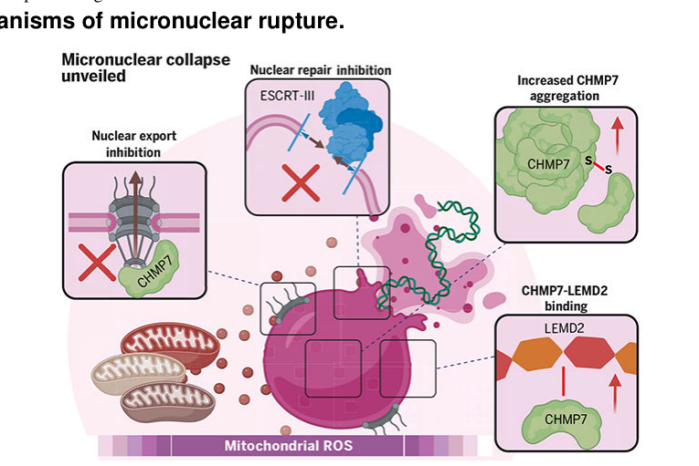

## Question

# Gene Research for Functional Annotation

## ⚠️ CRITICAL: Gene/Protein Identification Context

**BEFORE YOU BEGIN RESEARCH:** You MUST verify you are researching the CORRECT gene/protein. Gene symbols can be ambiguous, especially for less well-characterized genes from non-model organisms.

### Target Gene/Protein Identity (from UniProt):
- **UniProt Accession:** Q8NC56
- **Protein Description:** RecName: Full=LEM domain-containing protein 2; Short=hLEM2;
- **Gene Information:** Name=LEMD2;
- **Organism (full):** Homo sapiens (Human).
- **Protein Family:** Not specified in UniProt
- **Key Domains:** INM_ESCRT-Associated. (IPR052277); LEM/LEM-like_dom_sf. (IPR011015); LEM_dom. (IPR003887); Man1/Src1-like_C. (IPR018996); MAN1_winged_helix_dom. (IPR041885)

### MANDATORY VERIFICATION STEPS:

1. **Check if the gene symbol "LEMD2" matches the protein description above**
2. **Verify the organism is correct:** Homo sapiens (Human).
3. **Check if protein family/domains align with what you find in literature**
4. **If you find literature for a DIFFERENT gene with the same or similar symbol, STOP**

### If Gene Symbol is Ambiguous or You Cannot Find Relevant Literature:

**DO NOT PROCEED WITH RESEARCH ON A DIFFERENT GENE.** Instead:
- State clearly: "The gene symbol 'LEMD2' is ambiguous or literature is limited for this specific protein"
- Explain what you found (e.g., "Found extensive literature on a different gene with the same symbol in a different organism")
- Describe the protein based ONLY on the UniProt information provided above
- Suggest that the protein function can be inferred from domain/family information

### Research Target:

Please provide a comprehensive research report on the gene **LEMD2** (gene ID: LEMD2, UniProt: Q8NC56) in human.

The research report should be a detailed narrative explaining the function, biological processes, and localization of the gene product. Citations should be given for all claims.

You should prioritize authoritative reviews and primary scientific literature when conducting research. You can supplement
this with annotations you find in gene/protein databases, but these can be outdated or inaccurate.

We are specifically interested in the primary function of the gene - for enzymes, what reaction is catalyzed, and what is the substrate specificity? For transporters, what is the substrate? For structural proteins or adapters, what is the broader structural role? For signaling molecules, what is the role in the pathway.

We are interested in where in or outside the cell the gene product carries out its function.

We are also interested in the signaling or biochemical pathways in which the gene functions. We are less interested in broad pleiotropic effects, except where these elucidate the precise role.

Include evidence where possible. We are interested in both experimental evidence as well as inference from structure, evolution, or bioinformatic analysis. Precise studies should be prioritized over high-throughput, where available.

## Output

Question: You are an expert researcher providing comprehensive, well-cited information.

Provide detailed information focusing on:
1. Key concepts and definitions with current understanding
2. Recent developments and latest research (prioritize 2023-2024 sources)
3. Current applications and real-world implementations
4. Expert opinions and analysis from authoritative sources
5. Relevant statistics and data from recent studies

Format as a comprehensive research report with proper citations. Include URLs and publication dates where available.
Always prioritize recent, authoritative sources and provide specific citations for all major claims.

# Gene Research for Functional Annotation

## ⚠️ CRITICAL: Gene/Protein Identification Context

**BEFORE YOU BEGIN RESEARCH:** You MUST verify you are researching the CORRECT gene/protein. Gene symbols can be ambiguous, especially for less well-characterized genes from non-model organisms.

### Target Gene/Protein Identity (from UniProt):
- **UniProt Accession:** Q8NC56
- **Protein Description:** RecName: Full=LEM domain-containing protein 2; Short=hLEM2;
- **Gene Information:** Name=LEMD2;
- **Organism (full):** Homo sapiens (Human).
- **Protein Family:** Not specified in UniProt
- **Key Domains:** INM_ESCRT-Associated. (IPR052277); LEM/LEM-like_dom_sf. (IPR011015); LEM_dom. (IPR003887); Man1/Src1-like_C. (IPR018996); MAN1_winged_helix_dom. (IPR041885)

### MANDATORY VERIFICATION STEPS:

1. **Check if the gene symbol "LEMD2" matches the protein description above**
2. **Verify the organism is correct:** Homo sapiens (Human).
3. **Check if protein family/domains align with what you find in literature**
4. **If you find literature for a DIFFERENT gene with the same or similar symbol, STOP**

### If Gene Symbol is Ambiguous or You Cannot Find Relevant Literature:

**DO NOT PROCEED WITH RESEARCH ON A DIFFERENT GENE.** Instead:
- State clearly: "The gene symbol 'LEMD2' is ambiguous or literature is limited for this specific protein"
- Explain what you found (e.g., "Found extensive literature on a different gene with the same symbol in a different organism")
- Describe the protein based ONLY on the UniProt information provided above
- Suggest that the protein function can be inferred from domain/family information

### Research Target:

Please provide a comprehensive research report on the gene **LEMD2** (gene ID: LEMD2, UniProt: Q8NC56) in human.

The research report should be a detailed narrative explaining the function, biological processes, and localization of the gene product. Citations should be given for all claims.

You should prioritize authoritative reviews and primary scientific literature when conducting research. You can supplement
this with annotations you find in gene/protein databases, but these can be outdated or inaccurate.

We are specifically interested in the primary function of the gene - for enzymes, what reaction is catalyzed, and what is the substrate specificity? For transporters, what is the substrate? For structural proteins or adapters, what is the broader structural role? For signaling molecules, what is the role in the pathway.

We are interested in where in or outside the cell the gene product carries out its function.

We are also interested in the signaling or biochemical pathways in which the gene functions. We are less interested in broad pleiotropic effects, except where these elucidate the precise role.

Include evidence where possible. We are interested in both experimental evidence as well as inference from structure, evolution, or bioinformatic analysis. Precise studies should be prioritized over high-throughput, where available.

# Research Report: Human **LEMD2** (UniProt Q8NC56) — functional annotation, pathways, and disease relevance

## 0) Identity verification (critical)
The target is **human LEMD2** (UniProt **Q8NC56**), also referred to in the literature as **LEM2 / LEM domain-containing protein 2**, an **integral inner nuclear membrane (INM)** protein with a **LEM domain** and a **C-terminal winged-helix (WH)/MAN1-like (MSC) domain**. Multiple retrieved sources explicitly describe LEMD2 as an INM protein and describe the LEM-domain → **BAF** binding and the WH/MSC → **CHMP7/ESCRT-III** interaction axis that matches the UniProt domain expectations. (caravia2022lossoffunction pages 1-2, johnson2020discoveringhowinner pages 13-16, johnson2020discoveringhowinner pages 22-27)

## 1) Key concepts and definitions (current understanding)

### 1.1 LEM-domain proteins
**LEM-domain proteins** (LAP2–emerin–MAN1 family) are nuclear envelope-associated factors, typically **INM localized**, that connect chromatin and the nuclear lamina to nuclear-envelope structure and signaling. A defining feature is the **LEM domain**, described as a **~40 amino-acid bi-helical motif** that binds **Barrier-to-Autointegration Factor (BAF)**, a chromatin-associated protein. (nair2025nuclearenvelopeand pages 8-10)

### 1.2 LEMD2 (LEM2) core cell-biological role
LEMD2 is described as a **ubiquitously expressed INM protein** with a conserved **N-terminal LEM domain** and **two transmembrane segments**, localizing at the nuclear periphery. Its LEM domain enables association with DNA-associated proteins including **lamins** and **BAF**, supporting a chromatin–nuclear envelope tethering function. (caravia2022lossoffunction pages 1-2)

### 1.3 ESCRT-III and the LEMD2–CHMP7 “compartmentalization sensor” module
The **ESCRT-III** machinery is a membrane-remodeling system whose controlled polymerization can seal small membrane discontinuities. In nuclear-envelope maintenance, **CHMP7** together with INM **LEMD2** is implicated in sealing small nuclear-envelope holes, whereas repair of larger ruptures can depend more strongly on BAF-mediated mechanisms. (keeley2024nuclearanddegradative pages 3-4)

Mechanistically, LEM2/LEMD2 can recruit/activate CHMP7 via a C-terminal **WH/MSC** domain; CHMP7 then nucleates downstream ESCRT-III assembly for membrane sealing. (johnson2020discoveringhowinner pages 13-16, johnson2020discoveringhowinner pages 22-27)

## 2) Molecular functions, domains, and localization (functional annotation)

### 2.1 Subcellular localization
LEMD2 is an **integral inner nuclear membrane** protein at the nuclear periphery. (caravia2022lossoffunction pages 1-2)

### 2.2 Domain-to-function mapping
A structured domain/function mapping is provided below.

| Domain/region (approx. position) | Key binding partners | Cellular process/function | Key evidence (paper, year, DOI/URL) | Notes |
|---|---|---|---|---|
| N-terminal LEM domain (~40 aa motif; pathogenic p.L13R falls within this region) | BAF; lamins/chromatin-associated proteins | Tethers chromatin/heterochromatin to the inner nuclear membrane (INM); contributes to nuclear envelope (NE) integrity, chromatin stabilization, and post-mitotic NE reformation | Caravia et al., 2022, *J Clin Invest*, https://doi.org/10.1172/jci158897; Nair et al., 2025, *Nucleus*, https://doi.org/10.1080/19491034.2024.2449520 (caravia2022lossoffunction pages 1-2, nair2025nuclearenvelopeand pages 8-10) | LEM domain is described as a ~40 aa bihelical BAF-binding motif in LEM-family proteins; p.L13R reduces function and is associated with cardiomyopathy phenotypes (caravia2022lossoffunction pages 1-2, nair2025nuclearenvelopeand pages 8-10, lipov2023exploringthecomplex pages 3-4). |
| N-terminal region / LEM-domain-containing chromatin-targeting module (NTD; includes LEM domain) | BAF-coated chromatin | Targets LEMD2/LEM2 to anaphase chromatin and reforming NE; helps establish early nucleocytoplasmic compartmentalization | Johnson/von Appen, 2020, mechanistic LEM2 study (DOI not available in retrieved text); Keeley & Coyne, 2024, *Nucleus*, https://doi.org/10.1080/19491034.2024.2349085 (johnson2020discoveringhowinner pages 13-16, johnson2020discoveringhowinner pages 22-27, keeley2024nuclearanddegradative pages 3-4) | In mechanistic models, BAF–LEM engagement positions LEM2 at NE holes/fenestrations before ESCRT-III recruitment; 2024 review notes CHMP7/LEMD2 mainly seal small holes, while larger ruptures rely more on BAF-mediated mechanisms (johnson2020discoveringhowinner pages 13-16, keeley2024nuclearanddegradative pages 3-4). |
| Low-complexity domain (LCD) / phase-separating region (approx. aa 43–202; NTD aa 1–208 in LEM2 study) | Microtubules; chromatin-proximal membrane environment | Promotes local condensation/phase separation at spindle-associated membrane gaps during mitotic NE reformation; helps spatially organize membrane sealing machinery | Johnson/von Appen, 2020, mechanistic LEM2 study (DOI not available in retrieved text); Borah et al., 2022, *Front Cell Dev Biol*, https://doi.org/10.3389/fcell.2022.989217 (johnson2020discoveringhowinner pages 13-16, johnson2020discoveringhowinner pages 35-39, borah2022thelemescrttoolkit pages 1-3) | Undergoes liquid-like phase separation; contains a microtubule-targeting/basic subregion; phosphomimetic changes block condensation, implying cell-cycle regulation (johnson2020discoveringhowinner pages 13-16, johnson2020discoveringhowinner pages 35-39). |
| Proline/arginine-rich microtubule-binding segment near first transmembrane helix (exact aa not fully resolved in retrieved evidence) | Spindle microtubules | Couples NE reformation to spindle disassembly/clearance; concentrates LEM2 at microtubule-occupied fenestrations | Johnson/von Appen, 2020, mechanistic LEM2 study (DOI not available in retrieved text) (johnson2020discoveringhowinner pages 13-16, johnson2020discoveringhowinner pages 35-39) | Supports a model in which LEMD2 bridges membranes, chromatin, and spindle microtubules to prevent persistent NE openings and genome damage (johnson2020discoveringhowinner pages 13-16, johnson2020discoveringhowinner pages 35-39). |
| Two transmembrane segments / membrane-embedded core | INM membrane environment; nuclear lamina-associated network | Anchors LEMD2 as an integral INM protein, enabling it to act as a chromatin–lamina tether and compartmentalization sensor at NE ruptures | Caravia et al., 2022, *J Clin Invest*, https://doi.org/10.1172/jci158897; Nair et al., 2025, *Nucleus*, https://doi.org/10.1080/19491034.2024.2449520; Borah et al., 2022, *Front Cell Dev Biol*, https://doi.org/10.3389/fcell.2022.989217 (caravia2022lossoffunction pages 1-2, nair2025nuclearenvelopeand pages 8-10, borah2022thelemescrttoolkit pages 3-4) | Caravia explicitly describes LEMD2 as an INM protein with two transmembrane segments; family reviews place LEMD2 among INM LEM proteins that cooperate with lamins and ESCRT pathways (caravia2022lossoffunction pages 1-2, nair2025nuclearenvelopeand pages 8-10). |
| C-terminal winged-helix (WH) / MSC / MAN1-like domain (AA ~395–503 in LEM2 study) | CHMP7 directly; downstream ESCRT-III factors indirectly (e.g., IST1) | Recruits and activates CHMP7; nucleates ESCRT-III assembly for NE sealing/reformation and rupture repair | Johnson/von Appen, 2020, mechanistic LEM2 study (DOI not available in retrieved text); Keeley & Coyne, 2024, *Nucleus*, https://doi.org/10.1080/19491034.2024.2349085 (johnson2020discoveringhowinner pages 22-27, johnson2020discoveringhowinner pages 13-16, keeley2024nuclearanddegradative pages 3-4) | Direct CHMP7-binding interface; relieves CHMP7 autoinhibition and induces polymerization; central to sealing small NE holes (<100 nm) per 2024 review (johnson2020discoveringhowinner pages 22-27, keeley2024nuclearanddegradative pages 3-4). |
| LEMD2–CHMP7 functional module at NE ruptures/interphase repair sites (multi-domain emergent activity rather than single motif) | CHMP7, ESCRT-III machinery, BAF-assisted rupture context | Acts as a compartmentalization sensor that initiates ESCRT-III-dependent membrane repair at exposed chromatin/ruptures | Borah et al., 2022, *Front Cell Dev Biol*, https://doi.org/10.3389/fcell.2022.989217; Keeley & Coyne, 2024, *Nucleus*, https://doi.org/10.1080/19491034.2024.2349085 (borah2022thelemescrttoolkit pages 3-4, keeley2024nuclearanddegradative pages 3-4) | Reviews synthesize LEMD2 as part of the conserved “LEM-ESCRT toolkit”; exposure of LEM proteins to cytosol after rupture activates/recruits CHMP7 and downstream ESCRT-III (borah2022thelemescrttoolkit pages 3-4, keeley2024nuclearanddegradative pages 3-4). |
| Full-length LEMD2/LEM2 as chromatin–lamina–ESCRT integrator | BAF, lamins, CHMP7, microtubules | Maintains genome stability by integrating chromatin tethering, lamina association, membrane remodeling, and NE repair/reformation | Caravia et al., 2022, *J Clin Invest*, https://doi.org/10.1172/jci158897; Johnson/von Appen, 2020; Nair et al., 2025, *Nucleus*, https://doi.org/10.1080/19491034.2024.2449520; Borah et al., 2022, *Front Cell Dev Biol*, https://doi.org/10.3389/fcell.2022.989217; Keeley & Coyne, 2024, *Nucleus*, https://doi.org/10.1080/19491034.2024.2349085 (caravia2022lossoffunction pages 1-2, johnson2020discoveringhowinner pages 13-16, nair2025nuclearenvelopeand pages 8-10, borah2022thelemescrttoolkit pages 3-4, keeley2024nuclearanddegradative pages 3-4) | Loss of function causes NE deformation, DNA damage, p53 activation, apoptosis, and cardiomyopathy in vivo; this broader phenotype is consistent with failure of both structural tethering and ESCRT-coupled repair functions (caravia2022lossoffunction pages 1-2, keeley2024nuclearanddegradative pages 3-4). |

*Table: This table maps the major structural regions of human LEMD2/LEM2 to their known binding partners and molecular functions at the inner nuclear membrane. It is useful for functional annotation because it links UniProt-style domain architecture to experimentally supported roles in chromatin tethering, microtubule-associated nuclear envelope reformation, and CHMP7/ESCRT-III-mediated repair.*

### 2.3 Mechanistic model (mitosis and interphase)

**Mitotic nuclear envelope reformation (open mitosis):** Mechanistic work on LEM2 (ortholog of human LEMD2) describes it as a two-pass INM protein that coordinates ESCRT-mediated sealing during mitotic exit. The **LEM domain** binds **BAF** to target chromatin; a **low-complexity region** can phase-separate, and a microtubule-binding region focuses LEM2 at spindle-associated fenestrations. The **C-terminal WH/MSC domain** binds and activates **CHMP7**, promoting CHMP7 polymerization and recruitment of downstream ESCRT-III factors for NE sealing and early compartmentalization. (johnson2020discoveringhowinner pages 13-16, johnson2020discoveringhowinner pages 22-27)

**Interphase rupture repair:** Reviews synthesize a conserved “LEM–ESCRT toolkit” where exposure of LEM proteins at ruptures recruits CHMP7 and downstream ESCRT-III machinery, contributing to NE repair and maintenance. (borah2022thelemescrttoolkit pages 3-4, keeley2024nuclearanddegradative pages 3-4)

## 3) Recent developments and latest research (prioritizing 2023–2024)

### 3.1 2023: Redundancy between BAF–LEM and LEM2–CHMP7 pathways in NE sealing
A 2023 study in *Journal of Cell Science* (C. elegans) provides primary evidence that LEM-2’s **WH domain activates CHMP-7** to support ESCRT-III polymerization and NE closure, and that CHMP-7 becomes critical when BAF–LEM-mediated closure is compromised—supporting a redundancy/fallback model. While not human, it is explicitly framed in terms of homology (LEM-2 ↔ human LEMD2; CHMP-7 ↔ human CHMP7) and supports conserved mechanistic logic used in human models. (barger2023nuclearenvelopeassembly pages 12-14)

Publication date/URL: Nov 2023; https://doi.org/10.1242/jcs.261385 (barger2023nuclearenvelopeassembly pages 12-14)

### 3.2 2024: Direct connection of LEMD2–CHMP7 to micronuclear collapse under oxidative stress (Science)
A 2024 *Science* paper reports a **pathological axis** in which mitochondrial **reactive oxygen species (ROS)** promote **CHMP7 cysteine oxidation**, CHMP7 oligomerization, and enhanced binding to **LEMD2**, while disrupting CHMP7 interactions with canonical ESCRT-III partners. This shift is associated with **micronuclear envelope collapse**, chromosome shattering, and inflammation, and occurs under **hypoxic conditions**—connecting tumor microenvironment stress to aberrant engagement of the LEMD2–CHMP7 module. (bona2024micronuclearcollapsefrom pages 1-3)

Publication date/URL: Aug 2024; https://doi.org/10.1126/science.adj8691 (bona2024micronuclearcollapsefrom pages 1-3)

### 3.3 2024: Experimental/technical real-time interrogation of LEMD2–CHMP7 recruitment at ruptures
A 2024 *Frontiers in Cell and Developmental Biology* methods paper introduces a deterministic rupture/live-imaging pipeline and states that **CHMP7–LEMD2 binding is the fundamental step enabling ESCRT-III recruitment** to rupture sites, illustrating direct real-world experimental implementation for measuring recruitment dynamics at primary nuclei and micronuclei. (bona2024anewmicroscopy pages 1-2)

Publication date/URL: Sep 2024; https://doi.org/10.3389/fcell.2024.1475095 (bona2024anewmicroscopy pages 1-2)

### 3.4 2024: Review synthesis (neurodegeneration angle)
A 2024 review (*Nucleus*) synthesizes that **CHMP7/LEMD2** are involved in sealing **small (<100 nm)** nuclear-envelope holes, whereas **BAF** is emphasized for larger ruptures; it also emphasizes that nuclear ESCRT requirements may differ across cell types (e.g., neurons vs immortalized lines), highlighting an open problem in translating cell biology to disease contexts. (keeley2024nuclearanddegradative pages 3-4)

Publication date/URL: May 2024; https://doi.org/10.1080/19491034.2024.2349085 (keeley2024nuclearanddegradative pages 3-4)

## 4) Current applications and real-world implementations

### 4.1 Preclinical gene therapy for LEMD2-associated cardiomyopathy (proof of concept)
A 2022 *Journal of Clinical Investigation* study created a knock-in mouse carrying the **human disease allele c.T38>G (p.L13R)** and showed severe dilated cardiomyopathy and fibrosis. Importantly, **cardiomyocyte-specific AAV-mediated Lemd2 gene therapy** rescued cardiac function in KI/KI mice, supporting a direct therapeutic concept for LEMD2-related cardiomyopathy (preclinical). (caravia2022lossoffunction pages 1-2, caravia2022lossoffunction pages 9-11)

Publication date/URL: Nov 2022; https://doi.org/10.1172/jci158897 (caravia2022lossoffunction pages 1-2)

### 4.2 Oncology: LEMD2 as a candidate cancer vulnerability/biomarker target class (preclinical)
A 2024 study in triple-negative breast cancer (TNBC) contexts reported that siRNA depletion of Lem-D family proteins (including **LEMD2**) in TNBC cell lines induced aberrant nuclear morphology, reduced proliferation, and cell death, with minimal effects in non-cancerous breast cells—supporting a hypothesis that INM LEM proteins may represent context-dependent vulnerabilities. (rose2024theexpressionand pages 1-2)

Publication date/URL: Apr 2024; https://doi.org/10.3389/fonc.2024.1222698 (rose2024theexpressionand pages 1-2)

### 4.3 Micronuclei rupture assays and repair-pathway profiling
The 2024 microscopy pipeline provides a standardized assay framework to study recruitment of LEMD2 and CHMP7 at ruptures (primary nuclei and micronuclei), enabling broader adoption of mechanistic nuclear-envelope repair measurements. (bona2024anewmicroscopy pages 1-2)

## 5) Expert opinions and analysis (authoritative synthesis)

### 5.1 Functional partitioning: small-hole sealing vs large-rupture plugging
An emerging consensus is that **LEMD2–CHMP7–ESCRT-III** is well suited to seal **small nuclear-envelope holes**, while **BAF-driven** responses can dominate in large ruptures—implying **parallel and partly redundant repair routes**. This helps interpret why perturbing one component yields context-specific phenotypes across cell types and model systems. (keeley2024nuclearanddegradative pages 3-4, barger2023nuclearenvelopeassembly pages 12-14)

### 5.2 Disease mechanism framing
Mechanistic cardiomyopathy models support a view that LEMD2 protects mechanically stressed post-mitotic cells (cardiomyocytes) by maintaining nuclear-envelope integrity and genome stability; failure leads to DNA damage, p53 activation, apoptosis, fibrosis, and arrhythmia susceptibility. (caravia2022lossoffunction pages 1-2, caravia2022lossoffunction pages 9-11, ravera2025cardiovascularinvolvementin pages 8-9)

### 5.3 Cancer relevance: “too much” versus “too little” repair
The 2024 *Science* study suggests that the LEMD2–CHMP7 module can become **pathological** under oxidative stress/hypoxia by driving micronuclear collapse; thus, therapeutic manipulation of this axis would need to consider the trade-off between facilitating repair and avoiding deleterious hyperactivation/mislocalization. (bona2024micronuclearcollapsefrom pages 1-3)

## 6) Key statistics and quantitative data (recent and foundational)

### 6.1 Human genetics (from 2023 synthesis)
A 2023 cardiomyopathy genetics synthesis reports for **LEMD2**: **2 families** and **11 biallelic cases**, with exome evidence from two large pedigrees and an estimated **Max LOD = 7.3**. (lipov2023exploringthecomplex pages 3-4)

Publication date/URL: Oct 2023; https://doi.org/10.1038/s44161-023-00346-3 (lipov2023exploringthecomplex pages 3-4)

### 6.2 Preclinical therapy parameters (JCI 2022)
In the KI/KI cardiomyopathy model, AAV9-Lemd2 was delivered at **5 × 10^13 vg/kg** (P4), with echocardiography at 2 months. Sample sizes included WT **n=7**, KI/KI **n=10**, and KI/KI + AAV9-Lemd2 **n=4**. Lemd2 mRNA was increased **>10-fold** after AAV, with protein restoration near WT. (caravia2022lossoffunction pages 9-11)

### 6.3 Survival/lethality in mouse models (JCI 2022)
Cardiomyocyte-specific knockout had **median survival of 2 days** (caravia2022lossoffunction pages 9-11). An additional excerpt reports **50% mortality by postnatal day 2** and a survival analysis comparing controls (n=19) and cKO (n=23) with ****P<0.0001. (caravia2022lossoffunction pages 7-9, caravia2022lossoffunction pages 6-7)

### 6.4 Variant impact on expression and conduction phenotypes
A narrative review cites a homozygous **Lemd2 p.L13R** knock-in model with **Lemd2 mRNA reduced to 65%**, reduced protein levels, and conduction abnormalities (PR/QRS prolongation) at **6 months**, preceding pronounced LV dilation at **9 months**. (ravera2025cardiovascularinvolvementin pages 8-9)

### 6.5 Mechanistic size/geometry constraints
A 2024 review states CHMP7/LEMD2 seal small NE holes such as **<100 nm**. (keeley2024nuclearanddegradative pages 3-4)

Foundational mechanistic measurements in LEM2/CHMP7 polymerization report WH-induced CHMP7 polymers with variable inner diameters **~50–100 nm**. (johnson2020discoveringhowinner pages 22-27)

## 7) Visual evidence: ROS–CHMP7–LEMD2 model
A schematic from the 2024 *Science* study illustrates the ROS-driven CHMP7 oligomerization and aberrant binding to LEMD2 leading to micronuclear collapse. (bona2024micronuclearcollapsefrom media c1457801, bona2024micronuclearcollapsefrom pages 1-3)

## 8) Limitations and evidence gaps (within retrieved corpus)
* Progeroid-syndrome specifics for LEMD2 (e.g., Marbach–Rustad progeroid syndrome clinical series) were referenced in retrieved documents but the core case-report/phenotype-expansion papers were not obtainable in this run, so detailed phenotype frequencies/statistics for those syndromes are not included here. (caravia2022lossoffunction pages 7-9)
* Several mechanistic claims about lipid composition and “regulated lipid synthesis with LEM2/CHMP7” were cited indirectly in the 2023 JCS paper’s discussion, but the primary lipid-focused papers themselves were not retrieved in full text here. (barger2023nuclearenvelopeassembly pages 25-27)

## References (URLs, dates)
* Caravia XM et al. **Loss of function of the nuclear envelope protein LEMD2 causes DNA damage–dependent cardiomyopathy.** *J Clin Invest.* **Nov 2022**. https://doi.org/10.1172/jci158897 (caravia2022lossoffunction pages 1-2)
* Lipov A et al. **Exploring the complex spectrum of dominance and recessiveness in genetic cardiomyopathies.** *Nat Cardiovasc Res.* **Oct 2023**. https://doi.org/10.1038/s44161-023-00346-3 (lipov2023exploringthecomplex pages 3-4)
* Barger SR et al. **Nuclear envelope assembly relies on CHMP-7 in the absence of BAF–LEM-mediated hole closure.** *J Cell Sci.* **Nov 2023**. https://doi.org/10.1242/jcs.261385 (barger2023nuclearenvelopeassembly pages 12-14)
* Keeley O, Coyne AN. **Nuclear and degradative functions of the ESCRT-III pathway: implications for neurodegenerative disease.** *Nucleus.* **May 2024**. https://doi.org/10.1080/19491034.2024.2349085 (keeley2024nuclearanddegradative pages 3-4)
* Di Bona M, Bakhoum SF. **A new microscopy pipeline for studying the initial stages of nuclear and micronuclear rupture and repair.** *Front Cell Dev Biol.* **Sep 2024**. https://doi.org/10.3389/fcell.2024.1475095 (bona2024anewmicroscopy pages 1-2)
* Di Bona M et al. **Micronuclear collapse from oxidative damage.** *Science.* **Aug 2024**. https://doi.org/10.1126/science.adj8691 (bona2024micronuclearcollapsefrom pages 1-3)
* Rose M et al. **The expression and role of the Lem-D proteins Ankle2, Emerin, Lemd2, and TMPO in triple-negative breast cancer cell growth.** *Front Oncol.* **Apr 2024**. https://doi.org/10.3389/fonc.2024.1222698 (rose2024theexpressionand pages 1-2)
* Nair A et al. **Nuclear envelope and chromatin choreography direct cellular differentiation.** *Nucleus.* **Feb 2025**. https://doi.org/10.1080/19491034.2024.2449520 (nair2025nuclearenvelopeand pages 8-10)
* Borah S et al. **The LEM-ESCRT toolkit: Repair and maintenance of the nucleus.** *Front Cell Dev Biol.* **Sep 2022**. https://doi.org/10.3389/fcell.2022.989217 (borah2022thelemescrttoolkit pages 3-4)

References

1. (caravia2022lossoffunction pages 1-2): Xurde M. Caravia, Andres Ramirez-Martinez, Peiheng Gan, Feng Wang, John R. McAnally, Lin Xu, Rhonda Bassel-Duby, Ning Liu, and Eric N. Olson. Loss of function of the nuclear envelope protein lemd2 causes dna damage–dependent cardiomyopathy. The Journal of Clinical Investigation, Nov 2022. URL: https://doi.org/10.1172/jci158897, doi:10.1172/jci158897. This article has 23 citations.

2. (johnson2020discoveringhowinner pages 13-16): IE Johnson. Discovering how inner nuclear membrane protein, lem2, orchestrates timely nuclear envelope reformation during open mitosis. Unknown journal, 2020.

3. (johnson2020discoveringhowinner pages 22-27): IE Johnson. Discovering how inner nuclear membrane protein, lem2, orchestrates timely nuclear envelope reformation during open mitosis. Unknown journal, 2020.

4. (nair2025nuclearenvelopeand pages 8-10): Anjitha Nair, Jayati Khanna, Jashan Kler, Rohith Ragesh, and Kundan Sengupta. Nuclear envelope and chromatin choreography direct cellular differentiation. Nucleus, Feb 2025. URL: https://doi.org/10.1080/19491034.2024.2449520, doi:10.1080/19491034.2024.2449520. This article has 4 citations and is from a peer-reviewed journal.

5. (keeley2024nuclearanddegradative pages 3-4): Olivia Keeley and Alyssa N. Coyne. Nuclear and degradative functions of the escrt-iii pathway: implications for neurodegenerative disease. Nucleus, May 2024. URL: https://doi.org/10.1080/19491034.2024.2349085, doi:10.1080/19491034.2024.2349085. This article has 16 citations and is from a peer-reviewed journal.

6. (lipov2023exploringthecomplex pages 3-4): Alex Lipov, Sean J. Jurgens, Francesco Mazzarotto, Mona Allouba, James P. Pirruccello, Yasmine Aguib, Massimo Gennarelli, Magdi H. Yacoub, Patrick T. Ellinor, Connie R. Bezzina, and Roddy Walsh. Exploring the complex spectrum of dominance and recessiveness in genetic cardiomyopathies. Nature Cardiovascular Research, 2:1078-1094, Oct 2023. URL: https://doi.org/10.1038/s44161-023-00346-3, doi:10.1038/s44161-023-00346-3. This article has 39 citations and is from a peer-reviewed journal.

7. (johnson2020discoveringhowinner pages 35-39): IE Johnson. Discovering how inner nuclear membrane protein, lem2, orchestrates timely nuclear envelope reformation during open mitosis. Unknown journal, 2020.

8. (borah2022thelemescrttoolkit pages 1-3): Sapan Borah, Karthigeyan Dhanasekaran, and Santosh Kumar. The lem-escrt toolkit: repair and maintenance of the nucleus. Frontiers in Cell and Developmental Biology, Sep 2022. URL: https://doi.org/10.3389/fcell.2022.989217, doi:10.3389/fcell.2022.989217. This article has 13 citations.

9. (borah2022thelemescrttoolkit pages 3-4): Sapan Borah, Karthigeyan Dhanasekaran, and Santosh Kumar. The lem-escrt toolkit: repair and maintenance of the nucleus. Frontiers in Cell and Developmental Biology, Sep 2022. URL: https://doi.org/10.3389/fcell.2022.989217, doi:10.3389/fcell.2022.989217. This article has 13 citations.

10. (barger2023nuclearenvelopeassembly pages 12-14): Sarah R. Barger, Lauren Penfield, and Shirin Bahmanyar. Nuclear envelope assembly relies on chmp-7 in the absence of baf–lem-mediated hole closure. Journal of Cell Science, Nov 2023. URL: https://doi.org/10.1242/jcs.261385, doi:10.1242/jcs.261385. This article has 10 citations and is from a domain leading peer-reviewed journal.

11. (bona2024micronuclearcollapsefrom pages 1-3): Melody Di Bona, Yanyang Chen, Albert S. Agustinus, Alice Mazzagatti, Mercedes A. Duran, Matthew Deyell, Daniel Bronder, James Hickling, Christy Hong, Lorenzo Scipioni, Giulia Tedeschi, Sara Martin, Jun Li, Aušrinė Ruzgaitė, Nadeem Riaz, Parin Shah, Edridge K. D’Souza, D. Zack Brodtman, Simone Sidoli, Bill Diplas, Manisha Jalan, Nancy Y. Lee, Alban Ordureau, Benjamin Izar, Ashley M. Laughney, Simon Powell, Enrico Gratton, Stefano Santaguida, John Maciejowski, Peter Ly, Thomas M. Jeitner, and Samuel F. Bakhoum. Micronuclear collapse from oxidative damage. Science, Aug 2024. URL: https://doi.org/10.1126/science.adj8691, doi:10.1126/science.adj8691. This article has 75 citations and is from a highest quality peer-reviewed journal.

12. (bona2024anewmicroscopy pages 1-2): Melody Di Bona and Samuel F. Bakhoum. A new microscopy pipeline for studying the initial stages of nuclear and micronuclear rupture and repair. Frontiers in Cell and Developmental Biology, Sep 2024. URL: https://doi.org/10.3389/fcell.2024.1475095, doi:10.3389/fcell.2024.1475095. This article has 1 citations.

13. (caravia2022lossoffunction pages 9-11): Xurde M. Caravia, Andres Ramirez-Martinez, Peiheng Gan, Feng Wang, John R. McAnally, Lin Xu, Rhonda Bassel-Duby, Ning Liu, and Eric N. Olson. Loss of function of the nuclear envelope protein lemd2 causes dna damage–dependent cardiomyopathy. The Journal of Clinical Investigation, Nov 2022. URL: https://doi.org/10.1172/jci158897, doi:10.1172/jci158897. This article has 23 citations.

14. (rose2024theexpressionand pages 1-2): Maddison Rose, Joshua T. Burgess, Chee Man Cheong, Mark N. Adams, Parastoo Shahrouzi, Kenneth J. O’Byrne, Derek J. Richard, and Emma Bolderson. The expression and role of the lem-d proteins ankle2, emerin, lemd2, and tmpo in triple-negative breast cancer cell growth. Frontiers in Oncology, Apr 2024. URL: https://doi.org/10.3389/fonc.2024.1222698, doi:10.3389/fonc.2024.1222698. This article has 1 citations.

15. (ravera2025cardiovascularinvolvementin pages 8-9): Francesco Ravera, Veronica Dusi, Pier Paolo Bocchino, Giulia Gobello, Giuseppe Giannino, Daniele Melis, Giulia Margherita Brach Del Prever, Filippo Angelini, Andrea Saglietto, Carla Giustetto, Guglielmo Gallone, Stefano Pidello, Margherita Cannillo, Marco Matteo Cingolani, Silvia Deaglio, Walter Grosso Marra, Gaetano Maria De Ferrari, and Claudia Raineri. Cardiovascular involvement in syne variants: a case series and narrative review. Cardiogenetics, 15:2, Jan 2025. URL: https://doi.org/10.3390/cardiogenetics15010002, doi:10.3390/cardiogenetics15010002. This article has 3 citations.

16. (caravia2022lossoffunction pages 7-9): Xurde M. Caravia, Andres Ramirez-Martinez, Peiheng Gan, Feng Wang, John R. McAnally, Lin Xu, Rhonda Bassel-Duby, Ning Liu, and Eric N. Olson. Loss of function of the nuclear envelope protein lemd2 causes dna damage–dependent cardiomyopathy. The Journal of Clinical Investigation, Nov 2022. URL: https://doi.org/10.1172/jci158897, doi:10.1172/jci158897. This article has 23 citations.

17. (caravia2022lossoffunction pages 6-7): Xurde M. Caravia, Andres Ramirez-Martinez, Peiheng Gan, Feng Wang, John R. McAnally, Lin Xu, Rhonda Bassel-Duby, Ning Liu, and Eric N. Olson. Loss of function of the nuclear envelope protein lemd2 causes dna damage–dependent cardiomyopathy. The Journal of Clinical Investigation, Nov 2022. URL: https://doi.org/10.1172/jci158897, doi:10.1172/jci158897. This article has 23 citations.

18. (bona2024micronuclearcollapsefrom media c1457801): Melody Di Bona, Yanyang Chen, Albert S. Agustinus, Alice Mazzagatti, Mercedes A. Duran, Matthew Deyell, Daniel Bronder, James Hickling, Christy Hong, Lorenzo Scipioni, Giulia Tedeschi, Sara Martin, Jun Li, Aušrinė Ruzgaitė, Nadeem Riaz, Parin Shah, Edridge K. D’Souza, D. Zack Brodtman, Simone Sidoli, Bill Diplas, Manisha Jalan, Nancy Y. Lee, Alban Ordureau, Benjamin Izar, Ashley M. Laughney, Simon Powell, Enrico Gratton, Stefano Santaguida, John Maciejowski, Peter Ly, Thomas M. Jeitner, and Samuel F. Bakhoum. Micronuclear collapse from oxidative damage. Science, Aug 2024. URL: https://doi.org/10.1126/science.adj8691, doi:10.1126/science.adj8691. This article has 75 citations and is from a highest quality peer-reviewed journal.

19. (barger2023nuclearenvelopeassembly pages 25-27): Sarah R. Barger, Lauren Penfield, and Shirin Bahmanyar. Nuclear envelope assembly relies on chmp-7 in the absence of baf–lem-mediated hole closure. Journal of Cell Science, Nov 2023. URL: https://doi.org/10.1242/jcs.261385, doi:10.1242/jcs.261385. This article has 10 citations and is from a domain leading peer-reviewed journal.

## Artifacts

- [Edison artifact artifact-00](LEMD2-deep-research-falcon_artifacts/artifact-00.md)

## Citations

1. nair2025nuclearenvelopeand pages 8-10
2. caravia2022lossoffunction pages 1-2
3. keeley2024nuclearanddegradative pages 3-4
4. barger2023nuclearenvelopeassembly pages 12-14
5. bona2024micronuclearcollapsefrom pages 1-3
6. bona2024anewmicroscopy pages 1-2
7. rose2024theexpressionand pages 1-2
8. lipov2023exploringthecomplex pages 3-4
9. caravia2022lossoffunction pages 9-11
10. ravera2025cardiovascularinvolvementin pages 8-9
11. johnson2020discoveringhowinner pages 22-27
12. caravia2022lossoffunction pages 7-9
13. barger2023nuclearenvelopeassembly pages 25-27
14. borah2022thelemescrttoolkit pages 3-4
15. johnson2020discoveringhowinner pages 13-16
16. johnson2020discoveringhowinner pages 35-39
17. borah2022thelemescrttoolkit pages 1-3
18. caravia2022lossoffunction pages 6-7
19. https://doi.org/10.1172/jci158897;
20. https://doi.org/10.1080/19491034.2024.2449520
21. https://doi.org/10.1080/19491034.2024.2349085
22. https://doi.org/10.3389/fcell.2022.989217
23. https://doi.org/10.1080/19491034.2024.2449520;
24. https://doi.org/10.3389/fcell.2022.989217;
25. https://doi.org/10.1242/jcs.261385
26. https://doi.org/10.1126/science.adj8691
27. https://doi.org/10.3389/fcell.2024.1475095
28. https://doi.org/10.1172/jci158897
29. https://doi.org/10.3389/fonc.2024.1222698
30. https://doi.org/10.1038/s44161-023-00346-3
31. https://doi.org/10.1172/jci158897,
32. https://doi.org/10.1080/19491034.2024.2449520,
33. https://doi.org/10.1080/19491034.2024.2349085,
34. https://doi.org/10.1038/s44161-023-00346-3,
35. https://doi.org/10.3389/fcell.2022.989217,
36. https://doi.org/10.1242/jcs.261385,
37. https://doi.org/10.1126/science.adj8691,
38. https://doi.org/10.3389/fcell.2024.1475095,
39. https://doi.org/10.3389/fonc.2024.1222698,
40. https://doi.org/10.3390/cardiogenetics15010002,