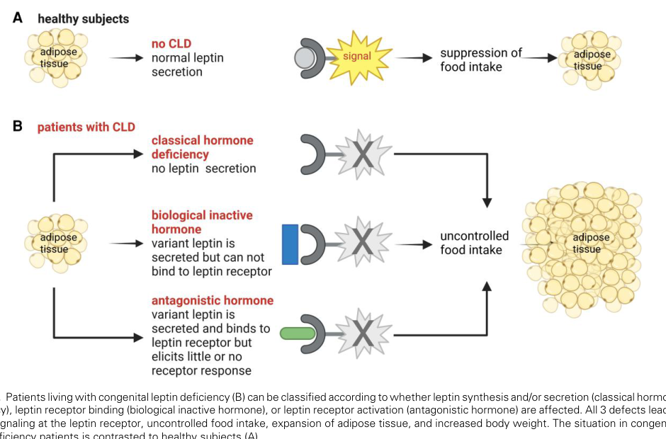

## Question

# Gene Research for Functional Annotation

## ⚠️ CRITICAL: Gene/Protein Identification Context

**BEFORE YOU BEGIN RESEARCH:** You MUST verify you are researching the CORRECT gene/protein. Gene symbols can be ambiguous, especially for less well-characterized genes from non-model organisms.

### Target Gene/Protein Identity (from UniProt):
- **UniProt Accession:** P41159
- **Protein Description:** RecName: Full=Leptin {ECO:0000312|HGNC:HGNC:6553}; AltName: Full=Obese protein; AltName: Full=Obesity factor; Flags: Precursor;
- **Gene Information:** Name=LEP {ECO:0000312|HGNC:HGNC:6553}; Synonyms=OB {ECO:0000312|HGNC:HGNC:6553}, OBS {ECO:0000312|HGNC:HGNC:6553};
- **Organism (full):** Homo sapiens (Human).
- **Protein Family:** Belongs to the leptin family. .
- **Key Domains:** 4_helix_cytokine-like_core. (IPR009079); Leptin. (IPR000065); Leptin (PF02024)

### MANDATORY VERIFICATION STEPS:

1. **Check if the gene symbol "LEP" matches the protein description above**
2. **Verify the organism is correct:** Homo sapiens (Human).
3. **Check if protein family/domains align with what you find in literature**
4. **If you find literature for a DIFFERENT gene with the same or similar symbol, STOP**

### If Gene Symbol is Ambiguous or You Cannot Find Relevant Literature:

**DO NOT PROCEED WITH RESEARCH ON A DIFFERENT GENE.** Instead:
- State clearly: "The gene symbol 'LEP' is ambiguous or literature is limited for this specific protein"
- Explain what you found (e.g., "Found extensive literature on a different gene with the same symbol in a different organism")
- Describe the protein based ONLY on the UniProt information provided above
- Suggest that the protein function can be inferred from domain/family information

### Research Target:

Please provide a comprehensive research report on the gene **LEP** (gene ID: LEP, UniProt: P41159) in human.

The research report should be a detailed narrative explaining the function, biological processes, and localization of the gene product. Citations should be given for all claims.

You should prioritize authoritative reviews and primary scientific literature when conducting research. You can supplement
this with annotations you find in gene/protein databases, but these can be outdated or inaccurate.

We are specifically interested in the primary function of the gene - for enzymes, what reaction is catalyzed, and what is the substrate specificity? For transporters, what is the substrate? For structural proteins or adapters, what is the broader structural role? For signaling molecules, what is the role in the pathway.

We are interested in where in or outside the cell the gene product carries out its function.

We are also interested in the signaling or biochemical pathways in which the gene functions. We are less interested in broad pleiotropic effects, except where these elucidate the precise role.

Include evidence where possible. We are interested in both experimental evidence as well as inference from structure, evolution, or bioinformatic analysis. Precise studies should be prioritized over high-throughput, where available.

## Output

Question: You are an expert researcher providing comprehensive, well-cited information.

Provide detailed information focusing on:
1. Key concepts and definitions with current understanding
2. Recent developments and latest research (prioritize 2023-2024 sources)
3. Current applications and real-world implementations
4. Expert opinions and analysis from authoritative sources
5. Relevant statistics and data from recent studies

Format as a comprehensive research report with proper citations. Include URLs and publication dates where available.
Always prioritize recent, authoritative sources and provide specific citations for all major claims.

# Gene Research for Functional Annotation

## ⚠️ CRITICAL: Gene/Protein Identification Context

**BEFORE YOU BEGIN RESEARCH:** You MUST verify you are researching the CORRECT gene/protein. Gene symbols can be ambiguous, especially for less well-characterized genes from non-model organisms.

### Target Gene/Protein Identity (from UniProt):
- **UniProt Accession:** P41159
- **Protein Description:** RecName: Full=Leptin {ECO:0000312|HGNC:HGNC:6553}; AltName: Full=Obese protein; AltName: Full=Obesity factor; Flags: Precursor;
- **Gene Information:** Name=LEP {ECO:0000312|HGNC:HGNC:6553}; Synonyms=OB {ECO:0000312|HGNC:HGNC:6553}, OBS {ECO:0000312|HGNC:HGNC:6553};
- **Organism (full):** Homo sapiens (Human).
- **Protein Family:** Belongs to the leptin family. .
- **Key Domains:** 4_helix_cytokine-like_core. (IPR009079); Leptin. (IPR000065); Leptin (PF02024)

### MANDATORY VERIFICATION STEPS:

1. **Check if the gene symbol "LEP" matches the protein description above**
2. **Verify the organism is correct:** Homo sapiens (Human).
3. **Check if protein family/domains align with what you find in literature**
4. **If you find literature for a DIFFERENT gene with the same or similar symbol, STOP**

### If Gene Symbol is Ambiguous or You Cannot Find Relevant Literature:

**DO NOT PROCEED WITH RESEARCH ON A DIFFERENT GENE.** Instead:
- State clearly: "The gene symbol 'LEP' is ambiguous or literature is limited for this specific protein"
- Explain what you found (e.g., "Found extensive literature on a different gene with the same symbol in a different organism")
- Describe the protein based ONLY on the UniProt information provided above
- Suggest that the protein function can be inferred from domain/family information

### Research Target:

Please provide a comprehensive research report on the gene **LEP** (gene ID: LEP, UniProt: P41159) in human.

The research report should be a detailed narrative explaining the function, biological processes, and localization of the gene product. Citations should be given for all claims.

You should prioritize authoritative reviews and primary scientific literature when conducting research. You can supplement
this with annotations you find in gene/protein databases, but these can be outdated or inaccurate.

We are specifically interested in the primary function of the gene - for enzymes, what reaction is catalyzed, and what is the substrate specificity? For transporters, what is the substrate? For structural proteins or adapters, what is the broader structural role? For signaling molecules, what is the role in the pathway.

We are interested in where in or outside the cell the gene product carries out its function.

We are also interested in the signaling or biochemical pathways in which the gene functions. We are less interested in broad pleiotropic effects, except where these elucidate the precise role.

Include evidence where possible. We are interested in both experimental evidence as well as inference from structure, evolution, or bioinformatic analysis. Precise studies should be prioritized over high-throughput, where available.

# Human LEP (UniProt P41159): functional annotation and research report

## Identity and primary function

**Identity verified.** Human **LEP** (also called *OB*) encodes **leptin**, whereas **LEPR** encodes its distinct receptor. A 2023 structural study explicitly identifies human leptin as UniProt **P41159** and studies its mature residues 22–167 separately from human LEPR constructs. The protein’s four-helix, cytokine-like fold agrees with the leptin-family domains specified for the target. LEP is **not an enzyme or transporter**: its primary molecular function is to act as a secreted ligand that activates the leptin receptor and communicates the availability of adipose energy stores to the brain. (tsirigotaki2023mechanismofreceptora pages 58-64, hristov2025leptinsignalingin pages 1-3, schnurbein2024classificationofcongenital pages 1-2, tsirigotaki2023mechanismofreceptor pages 1-3)

Human leptin is synthesized as a **167-amino-acid precursor**; cleavage of its 21-residue signal peptide yields the **146-amino-acid mature hormone**. Its principal source is white adipocytes. It is released into extracellular fluid and blood, so its principal site of function is **outside cells**, at the extracellular surface of LEPR-expressing cells—particularly neurons in the hypothalamus. Additional tissues express leptin or its receptor, but adipose-to-brain endocrine signaling is the best-established explanation of LEP’s role in body-weight regulation. Leptin does not itself reside in the neuronal cytoplasm or catalyze the intracellular reactions described below. (hristov2025leptinsignalingin pages 1-3, tsirigotaki2023mechanismofreceptor pages 1-3)

## Pathway and anatomical site of action

Circulating leptin generally increases with fat mass and decreases during energy restriction. An important refinement of the original “satiety hormone” description is that **falling leptin also signals inadequate energy reserves**: low signaling promotes food seeking and energy-conserving neuroendocrine responses. Leptin replacement reverses profound deficiency, whereas simply adding leptin to the already elevated concentrations typical of common obesity usually does not produce substantial weight loss. These patterns support a physiological role in defending against energy deficiency, not a simple proportional switch that prevents all obesity. (ahima2026leptin30years pages 1-3, ahima2026leptin30years pages 6-7, ahima2026leptin30years pages 14-16)

At the target-cell surface, leptin binds **LEPRb**, the long, signaling-competent isoform of the class-I cytokine receptor. LEPRb lacks intrinsic kinase activity: ligand-dependent receptor assembly activates associated **JAK2**, which phosphorylates receptor tyrosines and recruits **STAT3**. Activated STAT3 regulates neuronal transcription, including *POMC*; **SOCS3** provides inhibitory feedback. Other receptor-associated signaling routes include **PI3K–AKT** and **MAPK–ERK**. These are actions of the receptor and its intracellular partners, initiated by extracellular LEP, rather than biochemical reactions performed by leptin itself. (hristov2025leptinsignalingin pages 3-5, ahima2026leptin30years pages 3-4, schnurbein2024classificationofcongenital pages 1-2)

In the hypothalamic **arcuate nucleus**, leptin-responsive circuits include anorexigenic **POMC** neurons and orexigenic **AgRP/NPY** neurons. POMC-derived α-MSH acts downstream at melanocortin receptors, particularly **MC4R**, while AgRP opposes melanocortin signaling. The shorthand that leptin “activates POMC and inhibits AgRP” describes a useful pathway but is **not a complete map of its feeding effects**: additional LEPR-expressing neuronal populations contribute, and much of the cell-specific causal evidence comes from mice. Human genetic and replacement studies establish the pathway’s physiological importance more directly than they establish the precise contribution of each neuronal subtype in people. (hristov2025leptinsignalingin pages 3-5, ahima2026leptin30years pages 3-4, hristov2025leptinsignalingin pages 5-7, ahima2026leptin30years pages 14-16)

## Structural and experimental evidence

Leptin has a four-major-helix cytokine-like bundle, with an additional short helix and a stabilizing intramolecular disulfide bond. **Interaction site II**, involving helices A and C, binds the LEPR **CRH2** domain with high affinity; conformational changes facilitate **site III** engagement of an adjacent receptor’s immunoglobulin-like domain. Accordingly, ligand binding and productive receptor activation are experimentally separable functions. (tsirigotaki2023mechanismofreceptora pages 16-21, schnurbein2024classificationofcongenital pages 1-2)

**Tsirigotaki and colleagues (2023)** resolved both human and mouse leptin–receptor binding-domain complexes and proposed a higher-order **3:3 leptin:LEPR assembly**. Cryo-EM, biophysical analyses and live-cell single-molecule experiments support leptin-induced receptor trimerization rather than an exclusively simple dimer model. The full-assembly and live-cell evidence relies substantially on mouse proteins or engineered experimental systems; it should **not** be described as a direct measurement of the predominant native receptor stoichiometry in human hypothalamic neurons. See [*Nature Structural & Molecular Biology*, March 2023, DOI: 10.1038/s41594-023-00941-9](https://doi.org/10.1038/s41594-023-00941-9). (tsirigotaki2023mechanismofreceptor pages 1-3, tsirigotaki2023mechanismofreceptora pages 16-21)

**Human causal evidence** is unusually strong for a secreted metabolic signal. Montague and colleagues identified two children with severe early-onset obesity, extremely low circulating leptin despite high fat mass, and a homozygous *LEP* frameshift variant ([*Nature*, June 1997, DOI: 10.1038/43185](https://doi.org/10.1038/43185)). In one of these children, daily recombinant leptin produced a **16.4-kg weight reduction over 12 months**, including **15.6 kg of fat loss**; initial standardized test-meal intake decreased **42%, from 1,600 to 930 kcal** ([Farooqi and colleagues, *NEJM*, September 1999, DOI: 10.1056/NEJM199909163411204](https://doi.org/10.1056/NEJM199909163411204)). The study demonstrates correction of pathological hunger but **does not show that increased energy expenditure caused the weight loss**: basal metabolic rate declined during treatment, and total expenditure was near baseline after 12 months. (renard2024medicalsemiologyof pages 5-5, farooqi1999effectsofrecombinant pages 1-3, farooqi1999effectsofrecombinant pages 1-1, farooqi1999effectsofrecombinant pages 3-4)

The following table brings together evidence for the molecular annotation, distinguishing direct human observations from structural models and biomarker studies.

| Molecular/clinical context | Direct observation or molecular defect | Meaning for LEP function | Key source |
|---|---|---|---|
| Normal human LEP (UniProt P41159) | A 167-aa precursor loses its 21-aa signal peptide to yield mature, secreted leptin (residues 22–167), a four-helix cytokine-family protein produced principally by white adipose tissue; circulating leptin binds neuronal LEPRb, especially in the hypothalamus. | LEP encodes an extracellular endocrine ligand—not LEPR or an enzyme—that communicates adipose energy stores to CNS circuits controlling appetite, energy balance and neuroendocrine physiology. | Hristov, 2025, [DOI](https://doi.org/10.3390/endocrines6030042) (hristov2025leptinsignalingin pages 1-3); von Schnurbein et al., 2024, [DOI](https://doi.org/10.1210/clinem/dgae149) (schnurbein2024classificationofcongenital pages 1-2) |
| Receptor-assembly mechanism | Leptin site II binds LEPR CRH2 with high affinity; restructuring enables site III to engage the Ig-like domain of another receptor. Structural and cell experiments support a 3:3 leptin–LEPR signaling assembly. Human and mouse site-II complexes were crystallized, but full-assembly cryo-EM and live-cell trimerization evidence relied substantially on mouse or engineered receptor systems. | Receptor activation depends on higher-order assembly rather than simple ligand occupancy; site II chiefly mediates binding, whereas site III is critical for productive receptor activation. The native human stoichiometry should therefore be interpreted with the experimental-species caveat. | Tsirigotaki et al., 2023, [DOI](https://doi.org/10.1038/s41594-023-00941-9) (tsirigotaki2023mechanismofreceptor pages 1-3, tsirigotaki2023mechanismofreceptora pages 16-21) |
| Congenital leptin deficiency: replacement evidence | In one nine-year-old girl, daily recombinant leptin for 12 months reduced weight by 16.4 kg; fat loss was 15.6 kg. Test-meal intake fell 42%, from 1,600 to 930 kcal, within the early treatment period. Energy expenditure did **not** increase: basal metabolic rate declined with weight loss, while total expenditure was near baseline at month 12. | Direct human rescue supports leptin’s primary role in suppressing pathological hunger and regulating adiposity; it does not justify claiming that human weight loss resulted from increased energy expenditure. | Farooqi et al., 1999, [DOI](https://doi.org/10.1056/NEJM199909163411204) (farooqi1999effectsofrecombinant pages 1-3, farooqi1999effectsofrecombinant pages 1-1, farooqi1999effectsofrecombinant pages 3-4) |
| Secreted antagonistic LEP variants | Two unrelated children carried homozygous p.Pro64Ser or p.Gly59Ser. Both mutant proteins were secreted and bound LEPRb but produced marginal or absent STAT3 signaling and competitively antagonized normal leptin. High-dose, subsequently tapered recombinant leptin enabled both children to attain near-normal weight; this was a two-patient report. | Normal or high immunoreactive leptin does not prove biological activity. LEP variants can disrupt receptor activation without disrupting secretion or binding, requiring functional assays and variant-tailored replacement dosing. | Funcke et al., 2023, [DOI](https://doi.org/10.1056/NEJMoa2204041) (funcke2023rareantagonisticleptin pages 1-2) |
| Functional classification of congenital LEP disease | A systematic analysis identified 28 distinct homozygous LEP variants in 148 patients and classified disease by the affected step: classical synthesis/secretion deficiency, biologically inactive hormone with impaired receptor binding, or antagonistic hormone that binds but fails to activate LEPR. Exact subgroup counts are not reproduced here because the accessible excerpts did not independently verify all patient totals. | Diagnosis should combine conventional immunoreactive leptin measurement with receptor-binding and, where necessary, receptor-activation or competition assays; serum concentration alone can miss inactive or antagonistic leptin. | von Schnurbein et al., 2024, [DOI](https://doi.org/10.1210/clinem/dgae149) (schnurbein2024classificationofcongenital pages 8-9, schnurbein2024classificationofcongenital pages 12-13, schnurbein2024classificationofcongenital pages 7-7) |
| Leptin as an intervention-responsive biomarker | A 2024 meta-analysis of six randomized studies involving 153 adults found that intermittent fasting plus exercise reduced serum leptin relative to exercise alone (SMD −0.47, *p*=0.03), alongside a borderline 1.25-kg greater weight reduction. Studies were few and heterogeneous, and most participants were young men. | Circulating leptin tracks changes in energy balance and adiposity, but a lower leptin concentration is a biomarker response—not evidence that lowering LEP itself mediates therapeutic benefit or restores leptin sensitivity. | Kazeminasab et al., 2024, [DOI](https://doi.org/10.3389/fnut.2024.1362731) (kazeminasab2024effectsofintermittent pages 8-9, kazeminasab2024effectsofintermittent pages 1-2, kazeminasab2024effectsofintermittent pages 3-5) |

*Table: Evidence linking the molecular structure and receptor mechanism of human leptin to genetic loss-of-function, antagonistic variants, replacement therapy and intervention-responsive circulating levels. Species and study-design limitations are stated to prevent overinterpretation.*

## Developments in 2023–2024

A decisive demonstration that leptin concentration is not equivalent to leptin **function** came from **Funcke and colleagues (2023)**. Two unrelated children with hyperphagia and severe obesity had **high circulating leptin** and homozygous **p.Pro64Ser** or **p.Gly59Ser** variants. Their leptin was secreted and bound LEPR, yet elicited little or no STAT3 response and competitively antagonized normal leptin. Initially high-dose recombinant leptin, subsequently tapered, was associated with near-normal weight in both children. This is compelling mechanistic and therapeutic evidence, but it is a **two-patient report**, not a controlled efficacy trial. See [*NEJM*, June 2023, DOI: 10.1056/NEJMoa2204041](https://doi.org/10.1056/NEJMoa2204041). (funcke2023rareantagonisticleptin pages 1-2)

**Von Schnurbein and colleagues (2024)** synthesized reports of **28 distinct homozygous LEP variants in 148 patients** and proposed three functional disease classes: **classical hormone deficiency** from defective production or secretion; **biologically inactive leptin** that is secreted but binds LEPR poorly; and **antagonistic leptin** that binds LEPR but fails to activate it. Those are compiled **reported cases**, not a population-prevalence estimate. The distinction matters diagnostically: an ordinary immunoassay can detect inactive mutant protein, a receptor-binding assay can miss a defect in activation, and a suspected antagonist may require cellular signaling and competition experiments. Figure 3 of the study depicts the three defects and their common loss of productive receptor signaling. See [*Journal of Clinical Endocrinology & Metabolism*, March 2024, DOI: 10.1210/clinem/dgae149](https://doi.org/10.1210/clinem/dgae149). (schnurbein2024classificationofcongenital pages 8-9, schnurbein2024classificationofcongenital pages 12-13, schnurbein2024classificationofcongenital media 1111f96c)

Recent intervention data are useful primarily for interpreting **circulating leptin as a biomarker**. A 2024 meta-analysis of **six randomized studies comprising 153 adults** found that intermittent fasting plus exercise lowered leptin more than exercise alone (**standardized mean difference −0.47; p = 0.03**), alongside a borderline **1.25-kg** greater weight reduction. The small, heterogeneous evidence base does **not** establish that deliberately lowering leptin restores leptin sensitivity or causes clinical benefit. See [Kazeminasab and colleagues, *Frontiers in Nutrition*, June 2024, DOI: 10.3389/fnut.2024.1362731](https://doi.org/10.3389/fnut.2024.1362731). (kazeminasab2024effectsofintermittent pages 8-9, kazeminasab2024effectsofintermittent pages 1-2, kazeminasab2024effectsofintermittent pages 3-5)

## Clinical applications and interpretation

**Functional annotation has immediate diagnostic value.** Severe childhood-onset hyperphagia and obesity can prompt *LEP* testing alongside leptin measurements; an unexpectedly normal or high immunoreactive level does **not** exclude pathogenic LEP dysfunction. Comparing total immunoreactive leptin with receptor-binding leptin, followed where indicated by receptor-activation assays, helps identify the defective step. The 2024 classification notes that **antagonistic variants may require higher initial metreleptin doses** than classical deficiency because mutant hormone competes at LEPR. That conclusion is variant-specific and should not be generalized to every patient with obesity. (funcke2023rareantagonisticleptin pages 1-2, schnurbein2024classificationofcongenital pages 8-9, schnurbein2024classificationofcongenital pages 12-13)

**Leptin replacement also has a separate clinical use in generalized lipodystrophy**, where loss of adipose tissue produces leptin insufficiency and serious metabolic complications; the underlying lipodystrophy need not be caused by an *LEP* mutation. The [MEASuRE metreleptin registry, NCT02325674](https://clinicaltrials.gov/study/NCT02325674), follows treatment in routine practice and tracks safety and metabolic laboratory outcomes in US generalized lipodystrophy and European generalized or partial lipodystrophy. Its registry status and intended enrollment are **study-design information, not efficacy results**. By contrast, common obesity generally involves elevated leptin with **incomplete or reduced responsiveness**; authoritative physiological review finds that leptin replacement is effective in selected deficiency states but generally not as a stand-alone treatment for common obesity ([Ahima and Flier, *Annual Review of Physiology*, February 2026, DOI: 10.1146/annurev-physiol-042324-100259](https://doi.org/10.1146/annurev-physiol-042324-100259)). The exact causes of human leptin resistance remain incompletely resolved. (ahima2026leptin30years pages 6-7, ahima2026leptin30years pages 14-16, NCT02325674 chunk 1)

**Bottom-line annotation:** **LEP/P41159 is a mature, extracellular adipocyte-derived cytokine-like endocrine ligand that binds LEPR at target-cell surfaces and initiates hypothalamic JAK2–STAT3-centered signaling to communicate energy availability and regulate feeding.** The strongest human functional tests are pathogenic *LEP* variants and their rescue by recombinant leptin; the detailed receptor-assembly and neuronal-circuit models add molecular resolution but require their experimental-system and species limitations to be kept in view. (tsirigotaki2023mechanismofreceptor pages 1-3, funcke2023rareantagonisticleptin pages 1-2, farooqi1999effectsofrecombinant pages 1-3)

References

1. (tsirigotaki2023mechanismofreceptora pages 58-64): Alexandra Tsirigotaki, Ann Dansercoer, Koen H. G. Verschueren, Iva Marković, Christoph Pollmann, Maximillian Hafer, Jan Felix, Catherine Birck, Wouter Van Putte, Dominiek Catteeuw, Jan Tavernier, J. Fernando Bazan, Jacob Piehler, Savvas N. Savvides, and Kenneth Verstraete. Mechanism of receptor assembly via the pleiotropic adipokine leptin. Nature Structural &amp; Molecular Biology, 30:551-563, Mar 2023. URL: https://doi.org/10.1038/s41594-023-00941-9, doi:10.1038/s41594-023-00941-9. This article has 32 citations and is from a highest quality peer-reviewed journal.

2. (hristov2025leptinsignalingin pages 1-3): Milen Hristov. Leptin signaling in the hypothalamus: cellular insights and therapeutic perspectives in obesity. Endocrines, 6:42, Aug 2025. URL: https://doi.org/10.3390/endocrines6030042, doi:10.3390/endocrines6030042. This article has 16 citations.

3. (schnurbein2024classificationofcongenital pages 1-2): Julia von Schnurbein, Stefanie Zorn, Adriana Nunziata, Stephanie Brandt, Barbara Moepps, Jan-Bernd Funcke, Khalid Hussain, I Sadaf Farooqi, Pamela Fischer-Posovszky, and Martin Wabitsch. Classification of congenital leptin deficiency. The Journal of Clinical Endocrinology and Metabolism, 109:2602-2616, Mar 2024. URL: https://doi.org/10.1210/clinem/dgae149, doi:10.1210/clinem/dgae149. This article has 29 citations.

4. (tsirigotaki2023mechanismofreceptor pages 1-3): Alexandra Tsirigotaki, Ann Dansercoer, Koen H. G. Verschueren, Iva Markovic, Christoph Pollmann, Maximillian Hafer, Jan Felix, Catherine Birck, Wouter Van Putte, Dominiek Catteeuw, Jan Tavernier, J. Fernando Bazan, Jacob Piehler, Savvas Savvides, and Kenneth Verstraete. Mechanism of receptor assembly via the pleiotropic adipokine leptin. Nature structural & molecular biology 30(4), Jan 2023. URL: https://doi.org/10.3204/pubdb-2023-03196, doi:10.3204/pubdb-2023-03196. This article has 35 citations.

5. (ahima2026leptin30years pages 1-3): Rexford S. Ahima and Jeffrey S. Flier. Leptin: 30 years later. Annual Review of Physiology, 88:229-250, Feb 2026. URL: https://doi.org/10.1146/annurev-physiol-042324-100259, doi:10.1146/annurev-physiol-042324-100259. This article has 12 citations and is from a highest quality peer-reviewed journal.

6. (ahima2026leptin30years pages 6-7): Rexford S. Ahima and Jeffrey S. Flier. Leptin: 30 years later. Annual Review of Physiology, 88:229-250, Feb 2026. URL: https://doi.org/10.1146/annurev-physiol-042324-100259, doi:10.1146/annurev-physiol-042324-100259. This article has 12 citations and is from a highest quality peer-reviewed journal.

7. (ahima2026leptin30years pages 14-16): Rexford S. Ahima and Jeffrey S. Flier. Leptin: 30 years later. Annual Review of Physiology, 88:229-250, Feb 2026. URL: https://doi.org/10.1146/annurev-physiol-042324-100259, doi:10.1146/annurev-physiol-042324-100259. This article has 12 citations and is from a highest quality peer-reviewed journal.

8. (hristov2025leptinsignalingin pages 3-5): Milen Hristov. Leptin signaling in the hypothalamus: cellular insights and therapeutic perspectives in obesity. Endocrines, 6:42, Aug 2025. URL: https://doi.org/10.3390/endocrines6030042, doi:10.3390/endocrines6030042. This article has 16 citations.

9. (ahima2026leptin30years pages 3-4): Rexford S. Ahima and Jeffrey S. Flier. Leptin: 30 years later. Annual Review of Physiology, 88:229-250, Feb 2026. URL: https://doi.org/10.1146/annurev-physiol-042324-100259, doi:10.1146/annurev-physiol-042324-100259. This article has 12 citations and is from a highest quality peer-reviewed journal.

10. (hristov2025leptinsignalingin pages 5-7): Milen Hristov. Leptin signaling in the hypothalamus: cellular insights and therapeutic perspectives in obesity. Endocrines, 6:42, Aug 2025. URL: https://doi.org/10.3390/endocrines6030042, doi:10.3390/endocrines6030042. This article has 16 citations.

11. (tsirigotaki2023mechanismofreceptora pages 16-21): Alexandra Tsirigotaki, Ann Dansercoer, Koen H. G. Verschueren, Iva Marković, Christoph Pollmann, Maximillian Hafer, Jan Felix, Catherine Birck, Wouter Van Putte, Dominiek Catteeuw, Jan Tavernier, J. Fernando Bazan, Jacob Piehler, Savvas N. Savvides, and Kenneth Verstraete. Mechanism of receptor assembly via the pleiotropic adipokine leptin. Nature Structural &amp; Molecular Biology, 30:551-563, Mar 2023. URL: https://doi.org/10.1038/s41594-023-00941-9, doi:10.1038/s41594-023-00941-9. This article has 32 citations and is from a highest quality peer-reviewed journal.

12. (renard2024medicalsemiologyof pages 5-5): Emeline Renard, Ariane Thevenard‐Berger, and David Meyre. Medical semiology of patients with monogenic obesity: a systematic review. Obesity Reviews, Jul 2024. URL: https://doi.org/10.1111/obr.13797, doi:10.1111/obr.13797. This article has 20 citations and is from a peer-reviewed journal.

13. (farooqi1999effectsofrecombinant pages 1-3): I. Sadaf Farooqi, Susan A. Jebb, Gill Langmack, Elizabeth Lawrence, Christopher H. Cheetham, Andrew M. Prentice, Ieuan A. Hughes, Mark A. McCamish, and Stephen O'Rahilly. Effects of recombinant leptin therapy in a child with congenital leptin deficiency. The New England journal of medicine, 341 12:879-84, Sep 1999. URL: https://doi.org/10.1056/nejm199909163411204, doi:10.1056/nejm199909163411204. This article has 2630 citations and is from a highest quality peer-reviewed journal.

14. (farooqi1999effectsofrecombinant pages 1-1): I. Sadaf Farooqi, Susan A. Jebb, Gill Langmack, Elizabeth Lawrence, Christopher H. Cheetham, Andrew M. Prentice, Ieuan A. Hughes, Mark A. McCamish, and Stephen O'Rahilly. Effects of recombinant leptin therapy in a child with congenital leptin deficiency. The New England journal of medicine, 341 12:879-84, Sep 1999. URL: https://doi.org/10.1056/nejm199909163411204, doi:10.1056/nejm199909163411204. This article has 2630 citations and is from a highest quality peer-reviewed journal.

15. (farooqi1999effectsofrecombinant pages 3-4): I. Sadaf Farooqi, Susan A. Jebb, Gill Langmack, Elizabeth Lawrence, Christopher H. Cheetham, Andrew M. Prentice, Ieuan A. Hughes, Mark A. McCamish, and Stephen O'Rahilly. Effects of recombinant leptin therapy in a child with congenital leptin deficiency. The New England journal of medicine, 341 12:879-84, Sep 1999. URL: https://doi.org/10.1056/nejm199909163411204, doi:10.1056/nejm199909163411204. This article has 2630 citations and is from a highest quality peer-reviewed journal.

16. (funcke2023rareantagonisticleptin pages 1-2): Jan-Bernd Funcke, Barbara Moepps, Julian Roos, Julia von Schnurbein, Kenneth Verstraete, Elke Fröhlich-Reiterer, Katja Kohlsdorf, Adriana Nunziata, Stephanie Brandt, Alexandra Tsirigotaki, Ann Dansercoer, Elisabeth Suppan, Basma Haris, Klaus-Michael Debatin, Savvas N. Savvides, I. Sadaf Farooqi, Khalid Hussain, Peter Gierschik, Pamela Fischer-Posovszky, and Martin Wabitsch. Rare antagonistic leptin variants and severe, early-onset obesity. The New England journal of medicine, 388 24:2253-2261, Jun 2023. URL: https://doi.org/10.1056/nejmoa2204041, doi:10.1056/nejmoa2204041. This article has 40 citations and is from a highest quality peer-reviewed journal.

17. (schnurbein2024classificationofcongenital pages 8-9): Julia von Schnurbein, Stefanie Zorn, Adriana Nunziata, Stephanie Brandt, Barbara Moepps, Jan-Bernd Funcke, Khalid Hussain, I Sadaf Farooqi, Pamela Fischer-Posovszky, and Martin Wabitsch. Classification of congenital leptin deficiency. The Journal of Clinical Endocrinology and Metabolism, 109:2602-2616, Mar 2024. URL: https://doi.org/10.1210/clinem/dgae149, doi:10.1210/clinem/dgae149. This article has 29 citations.

18. (schnurbein2024classificationofcongenital pages 12-13): Julia von Schnurbein, Stefanie Zorn, Adriana Nunziata, Stephanie Brandt, Barbara Moepps, Jan-Bernd Funcke, Khalid Hussain, I Sadaf Farooqi, Pamela Fischer-Posovszky, and Martin Wabitsch. Classification of congenital leptin deficiency. The Journal of Clinical Endocrinology and Metabolism, 109:2602-2616, Mar 2024. URL: https://doi.org/10.1210/clinem/dgae149, doi:10.1210/clinem/dgae149. This article has 29 citations.

19. (schnurbein2024classificationofcongenital pages 7-7): Julia von Schnurbein, Stefanie Zorn, Adriana Nunziata, Stephanie Brandt, Barbara Moepps, Jan-Bernd Funcke, Khalid Hussain, I Sadaf Farooqi, Pamela Fischer-Posovszky, and Martin Wabitsch. Classification of congenital leptin deficiency. The Journal of Clinical Endocrinology and Metabolism, 109:2602-2616, Mar 2024. URL: https://doi.org/10.1210/clinem/dgae149, doi:10.1210/clinem/dgae149. This article has 29 citations.

20. (kazeminasab2024effectsofintermittent pages 8-9): Fatemeh Kazeminasab, Nasim Behzadnejad, Henrique S. Cerqueira, Heitor O. Santos, and Sara K. Rosenkranz. Effects of intermittent fasting combined with exercise on serum leptin and adiponectin in adults with or without obesity: a systematic review and meta-analysis of randomized clinical trials. Frontiers in Nutrition, Jun 2024. URL: https://doi.org/10.3389/fnut.2024.1362731, doi:10.3389/fnut.2024.1362731. This article has 28 citations.

21. (kazeminasab2024effectsofintermittent pages 1-2): Fatemeh Kazeminasab, Nasim Behzadnejad, Henrique S. Cerqueira, Heitor O. Santos, and Sara K. Rosenkranz. Effects of intermittent fasting combined with exercise on serum leptin and adiponectin in adults with or without obesity: a systematic review and meta-analysis of randomized clinical trials. Frontiers in Nutrition, Jun 2024. URL: https://doi.org/10.3389/fnut.2024.1362731, doi:10.3389/fnut.2024.1362731. This article has 28 citations.

22. (kazeminasab2024effectsofintermittent pages 3-5): Fatemeh Kazeminasab, Nasim Behzadnejad, Henrique S. Cerqueira, Heitor O. Santos, and Sara K. Rosenkranz. Effects of intermittent fasting combined with exercise on serum leptin and adiponectin in adults with or without obesity: a systematic review and meta-analysis of randomized clinical trials. Frontiers in Nutrition, Jun 2024. URL: https://doi.org/10.3389/fnut.2024.1362731, doi:10.3389/fnut.2024.1362731. This article has 28 citations.

23. (schnurbein2024classificationofcongenital media 1111f96c): Julia von Schnurbein, Stefanie Zorn, Adriana Nunziata, Stephanie Brandt, Barbara Moepps, Jan-Bernd Funcke, Khalid Hussain, I Sadaf Farooqi, Pamela Fischer-Posovszky, and Martin Wabitsch. Classification of congenital leptin deficiency. The Journal of Clinical Endocrinology and Metabolism, 109:2602-2616, Mar 2024. URL: https://doi.org/10.1210/clinem/dgae149, doi:10.1210/clinem/dgae149. This article has 29 citations.

24. (NCT02325674 chunk 1):  MEASuRE: Metreleptin Effectiveness And Safety Registry. Chiesi Farmaceutici S.p.A.. 2016. ClinicalTrials.gov Identifier: NCT02325674

## Artifacts

- [Edison artifact artifact-00](LEP-deep-research-falcon_artifacts/artifact-00.md)

## Citations

1. hristov2025leptinsignalingin pages 1-3
2. schnurbein2024classificationofcongenital pages 1-2
3. funcke2023rareantagonisticleptin pages 1-2
4. tsirigotaki2023mechanismofreceptora pages 58-64
5. tsirigotaki2023mechanismofreceptor pages 1-3
6. hristov2025leptinsignalingin pages 3-5
7. hristov2025leptinsignalingin pages 5-7
8. tsirigotaki2023mechanismofreceptora pages 16-21
9. renard2024medicalsemiologyof pages 5-5
10. farooqi1999effectsofrecombinant pages 1-3
11. farooqi1999effectsofrecombinant pages 1-1
12. farooqi1999effectsofrecombinant pages 3-4
13. schnurbein2024classificationofcongenital pages 8-9
14. schnurbein2024classificationofcongenital pages 12-13
15. schnurbein2024classificationofcongenital pages 7-7
16. kazeminasab2024effectsofintermittent pages 8-9
17. kazeminasab2024effectsofintermittent pages 1-2
18. kazeminasab2024effectsofintermittent pages 3-5
19. *Nature Structural & Molecular Biology*, March 2023, DOI: 10.1038/s41594-023-00941-9
20. *Nature*, June 1997, DOI: 10.1038/43185
21. Farooqi and colleagues, *NEJM*, September 1999, DOI: 10.1056/NEJM199909163411204
22. DOI
23. *NEJM*, June 2023, DOI: 10.1056/NEJMoa2204041
24. *Journal of Clinical Endocrinology & Metabolism*, March 2024, DOI: 10.1210/clinem/dgae149
25. Kazeminasab and colleagues, *Frontiers in Nutrition*, June 2024, DOI: 10.3389/fnut.2024.1362731
26. MEASuRE metreleptin registry, NCT02325674
27. Ahima and Flier, *Annual Review of Physiology*, February 2026, DOI: 10.1146/annurev-physiol-042324-100259
28. https://doi.org/10.1038/s41594-023-00941-9
29. https://doi.org/10.1038/43185
30. https://doi.org/10.1056/NEJM199909163411204
31. https://doi.org/10.3390/endocrines6030042
32. https://doi.org/10.1210/clinem/dgae149
33. https://doi.org/10.1056/NEJMoa2204041
34. https://doi.org/10.3389/fnut.2024.1362731
35. https://clinicaltrials.gov/study/NCT02325674
36. https://doi.org/10.1146/annurev-physiol-042324-100259
37. https://doi.org/10.1038/s41594-023-00941-9,
38. https://doi.org/10.3390/endocrines6030042,
39. https://doi.org/10.1210/clinem/dgae149,
40. https://doi.org/10.3204/pubdb-2023-03196,
41. https://doi.org/10.1146/annurev-physiol-042324-100259,
42. https://doi.org/10.1111/obr.13797,
43. https://doi.org/10.1056/nejm199909163411204,
44. https://doi.org/10.1056/nejmoa2204041,
45. https://doi.org/10.3389/fnut.2024.1362731,