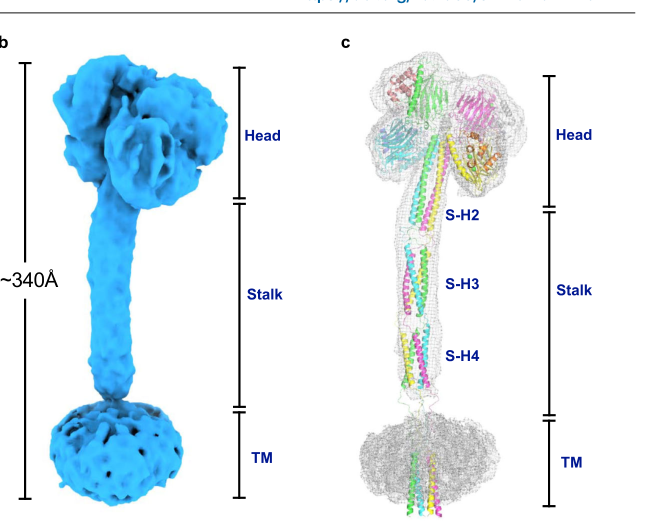

## Question

# Gene Research for Functional Annotation

## ⚠️ CRITICAL: Gene/Protein Identification Context

**BEFORE YOU BEGIN RESEARCH:** You MUST verify you are researching the CORRECT gene/protein. Gene symbols can be ambiguous, especially for less well-characterized genes from non-model organisms.

### Target Gene/Protein Identity (from UniProt):
- **UniProt Accession:** P49257
- **Protein Description:** RecName: Full=Protein ERGIC-53; AltName: Full=ER-Golgi intermediate compartment 53 kDa protein; AltName: Full=Gp58; AltName: Full=Intracellular mannose-specific lectin MR60; AltName: Full=Lectin mannose-binding 1; Flags: Precursor;
- **Gene Information:** Name=LMAN1; Synonyms=ERGIC53, F5F8D;
- **Organism (full):** Homo sapiens (Human).
- **Protein Family:** Not specified in UniProt
- **Key Domains:** ConA-like_dom_sf. (IPR013320); Intracellular_Lectin-GPT. (IPR051136); Lectin_leg. (IPR005052); Lectin_leg-like (PF03388)

### MANDATORY VERIFICATION STEPS:

1. **Check if the gene symbol "LMAN1" matches the protein description above**
2. **Verify the organism is correct:** Homo sapiens (Human).
3. **Check if protein family/domains align with what you find in literature**
4. **If you find literature for a DIFFERENT gene with the same or similar symbol, STOP**

### If Gene Symbol is Ambiguous or You Cannot Find Relevant Literature:

**DO NOT PROCEED WITH RESEARCH ON A DIFFERENT GENE.** Instead:
- State clearly: "The gene symbol 'LMAN1' is ambiguous or literature is limited for this specific protein"
- Explain what you found (e.g., "Found extensive literature on a different gene with the same symbol in a different organism")
- Describe the protein based ONLY on the UniProt information provided above
- Suggest that the protein function can be inferred from domain/family information

### Research Target:

Please provide a comprehensive research report on the gene **LMAN1** (gene ID: LMAN1, UniProt: P49257) in human.

The research report should be a detailed narrative explaining the function, biological processes, and localization of the gene product. Citations should be given for all claims.

You should prioritize authoritative reviews and primary scientific literature when conducting research. You can supplement
this with annotations you find in gene/protein databases, but these can be outdated or inaccurate.

We are specifically interested in the primary function of the gene - for enzymes, what reaction is catalyzed, and what is the substrate specificity? For transporters, what is the substrate? For structural proteins or adapters, what is the broader structural role? For signaling molecules, what is the role in the pathway.

We are interested in where in or outside the cell the gene product carries out its function.

We are also interested in the signaling or biochemical pathways in which the gene functions. We are less interested in broad pleiotropic effects, except where these elucidate the precise role.

Include evidence where possible. We are interested in both experimental evidence as well as inference from structure, evolution, or bioinformatic analysis. Precise studies should be prioritized over high-throughput, where available.

## Output

Question: You are an expert researcher providing comprehensive, well-cited information.

Provide detailed information focusing on:
1. Key concepts and definitions with current understanding
2. Recent developments and latest research (prioritize 2023-2024 sources)
3. Current applications and real-world implementations
4. Expert opinions and analysis from authoritative sources
5. Relevant statistics and data from recent studies

Format as a comprehensive research report with proper citations. Include URLs and publication dates where available.
Always prioritize recent, authoritative sources and provide specific citations for all major claims.

# Gene Research for Functional Annotation

## ⚠️ CRITICAL: Gene/Protein Identification Context

**BEFORE YOU BEGIN RESEARCH:** You MUST verify you are researching the CORRECT gene/protein. Gene symbols can be ambiguous, especially for less well-characterized genes from non-model organisms.

### Target Gene/Protein Identity (from UniProt):
- **UniProt Accession:** P49257
- **Protein Description:** RecName: Full=Protein ERGIC-53; AltName: Full=ER-Golgi intermediate compartment 53 kDa protein; AltName: Full=Gp58; AltName: Full=Intracellular mannose-specific lectin MR60; AltName: Full=Lectin mannose-binding 1; Flags: Precursor;
- **Gene Information:** Name=LMAN1; Synonyms=ERGIC53, F5F8D;
- **Organism (full):** Homo sapiens (Human).
- **Protein Family:** Not specified in UniProt
- **Key Domains:** ConA-like_dom_sf. (IPR013320); Intracellular_Lectin-GPT. (IPR051136); Lectin_leg. (IPR005052); Lectin_leg-like (PF03388)

### MANDATORY VERIFICATION STEPS:

1. **Check if the gene symbol "LMAN1" matches the protein description above**
2. **Verify the organism is correct:** Homo sapiens (Human).
3. **Check if protein family/domains align with what you find in literature**
4. **If you find literature for a DIFFERENT gene with the same or similar symbol, STOP**

### If Gene Symbol is Ambiguous or You Cannot Find Relevant Literature:

**DO NOT PROCEED WITH RESEARCH ON A DIFFERENT GENE.** Instead:
- State clearly: "The gene symbol 'LMAN1' is ambiguous or literature is limited for this specific protein"
- Explain what you found (e.g., "Found extensive literature on a different gene with the same symbol in a different organism")
- Describe the protein based ONLY on the UniProt information provided above
- Suggest that the protein function can be inferred from domain/family information

### Research Target:

Please provide a comprehensive research report on the gene **LMAN1** (gene ID: LMAN1, UniProt: P49257) in human.

The research report should be a detailed narrative explaining the function, biological processes, and localization of the gene product. Citations should be given for all claims.

You should prioritize authoritative reviews and primary scientific literature when conducting research. You can supplement
this with annotations you find in gene/protein databases, but these can be outdated or inaccurate.

We are specifically interested in the primary function of the gene - for enzymes, what reaction is catalyzed, and what is the substrate specificity? For transporters, what is the substrate? For structural proteins or adapters, what is the broader structural role? For signaling molecules, what is the role in the pathway.

We are interested in where in or outside the cell the gene product carries out its function.

We are also interested in the signaling or biochemical pathways in which the gene functions. We are less interested in broad pleiotropic effects, except where these elucidate the precise role.

Include evidence where possible. We are interested in both experimental evidence as well as inference from structure, evolution, or bioinformatic analysis. Precise studies should be prioritized over high-throughput, where available.

# Research Report: Human **LMAN1 (ERGIC-53)** Functional Annotation (UniProt **P49257**)

## 0) Target identity verification (critical)
The UniProt accession **P49257** corresponds to **human LMAN1**, whose protein product is also known as **ERGIC-53/p58/Gp58** and functions as a **type I transmembrane L-type lectin cargo receptor** in the **early secretory pathway** (ER→ERGIC→Golgi). This identity is consistent with (i) a luminal carbohydrate-recognition domain (CRD) that binds mannose/high-mannose glycans in a Ca2+-dependent manner, (ii) a long luminal coiled-coil stalk, (iii) a single-pass transmembrane helix, and (iv) a short cytosolic tail with a **C-terminal KKFF** trafficking motif required for ER–Golgi cycling. (watanabe2024structureoffulllength pages 1-2, tang2023cargoselectionin pages 5-7)

## 1) Key concepts and definitions (current understanding)

### 1.1 LMAN1/ERGIC-53 as a cargo receptor
In mammalian cells, **cargo receptors** are transmembrane proteins that facilitate recruitment of selected luminal cargo into **COPII** carriers at ER exit sites, accelerating ER-to-Golgi transport compared with bulk flow. LMAN1/ERGIC-53 is a prototypical mammalian cargo receptor: it captures subsets of newly synthesized secretory and membrane proteins in the ER and promotes their export to the Golgi apparatus. (watanabe2024structureoffulllength pages 1-2, tang2023cargoselectionin pages 5-7)

### 1.2 Domain architecture and topology
LMAN1 is a **type I transmembrane protein** with an **N-terminal luminal L-type lectin CRD** (carbohydrate-recognition domain) and a long luminal stalk (coiled-coils), followed by a transmembrane helix and a short cytosolic tail. The cytosolic tail contains the **KKFF motif** that supports cycling between ER/ERGIC/Golgi. (watanabe2024structureoffulllength pages 1-2, tang2023cargoselectionin pages 5-7, watanabe2024structureoffulllength media cf25ea0c)

### 1.3 The LMAN1–MCFD2 cargo receptor complex
LMAN1 forms a functional complex with **MCFD2**, a small soluble **EF-hand** protein that binds Ca2+. The complex is **Ca2+-dependent** and is central to ER export of canonical cargos such as coagulation factors V and VIII. (zhang2023separaterolesof pages 1-2, tang2023cargoselectionin pages 5-7)

## 2) Molecular function and mechanism

### 2.1 Lectin (glycan) recognition and its limits
LMAN1’s luminal CRD binds mannose/high-mannose glycans in a **Ca2+-dependent** manner and contributes to selective trafficking of certain glycoprotein cargos. (watanabe2024structureoffulllength pages 1-2, tang2023cargoselectionin pages 5-7)

However, lectin binding is not universally required for all LMAN1-dependent cargos: in a mechanistic cell system, **carbohydrate-binding mutants** of LMAN1 retained the ability to rescue much of **FVIII secretion**, supporting at least partial **lectin-independent** cargo recognition (protein–protein interactions) for some cargos. (zhang2023separaterolesof pages 8-9)

### 2.2 New structural mechanism (2024): full-length ERGIC-53/LMAN1–MCFD2 architecture
A major 2024 advance is the cryo-EM structure of **full-length human ERGIC-53 (LMAN1) in complex with MCFD2**, revealing:
- A **homotetrameric** assembly (revising older hexamer models), with a “four-leaf clover-like” head region and a **long stalk** built from multiple four-helix coiled-coils leading to the transmembrane anchor. (watanabe2024structureoffulllength pages 1-2)
- Proposed regulation of cargo capture/release via **stalk bending** and **metal binding**, including an N-terminal **Zn2+-binding site** in MCFD2 that may modulate cargo binding. (watanabe2024structureoffulllength pages 1-2)

The corresponding figure panels provide a compact visual summary of the tetrameric architecture and domain organization (head/stalk/TM/tail). (watanabe2024structureoffulllength media cf25ea0c, watanabe2024structureoffulllength media 7e4fa169)

### 2.3 Partner function partitioning (2023): “separate roles” model
A 2023 mechanistic study supports a model in which **MCFD2 is the primary interacting partner for FV/FVIII cargo**, while **LMAN1 primarily serves as the shuttling membrane carrier** of MCFD2 within the ER–ERGIC cycling route. (zhang2023separaterolesof pages 1-2, zhang2023separaterolesof pages 8-9)

## 3) Subcellular localization and pathway context

### 3.1 Where LMAN1 acts in the cell
LMAN1/ERGIC-53 is primarily localized to the **ER and ERGIC**, and cycles through the **ER → ERGIC → cis-Golgi** compartments as part of early secretory trafficking. (tang2023cargoselectionin pages 5-7, tang2023cargoselectionin pages 9-10, watanabe2024structureoffulllength pages 1-2)

### 3.2 Trafficking signals and coat usage (COPII export and COPI retrieval)
The **KKFF** motif in the cytosolic tail is functionally subdivided:
- **FF** acts as an **ER exit determinant** that promotes export (consistent with COPII-mediated trafficking from ER exit sites).
- **KK** mediates **COPI-dependent retrieval** to the ER, enabling receptor recycling. (tang2023cargoselectionin pages 5-7)

Oligomerization is an important determinant for sorting into COPII-coated carriers (notably dimerization is described as required for efficient exit in the review context, while the full-length structure resolves tetrameric architecture). (tang2023cargoselectionin pages 5-7, watanabe2024structureoffulllength pages 1-2)

## 4) Cargo repertoire (substrate specificity = transported cargos)

### 4.1 Canonical cargos: coagulation factor V (FV) and factor VIII (FVIII)
The best-established physiological role for LMAN1 is facilitating ER-to-Golgi trafficking of **FV and FVIII**, via the LMAN1–MCFD2 complex. Loss-of-function variants in LMAN1 or MCFD2 cause the autosomal recessive bleeding disorder **combined deficiency of FV and FVIII (F5F8D)** due to impaired secretion/transport of both factors. (tang2023cargoselectionin pages 5-7, zhang2023separaterolesof pages 1-2)

### 4.2 Additional cargos supported in recent literature
Recent sources and cited evidence support an expanding (but still limited) cargo list including:
- **α1-antitrypsin (A1AT)**, with experimental evidence of reduced secretion in LMAN1-deficient contexts and review-level synthesis that A1AT export requires both LMAN1 and MCFD2. (zhang2023separaterolesof pages 8-9, everett2024lman1servesas pages 6-7)
- **Thrombopoietin (TPO)** (new 2024 primary discovery): LMAN1 is required for efficient TPO secretion from hepatocytes, and this appears to be **MCFD2-independent**. (everett2024lman1servesas pages 1-2, everett2024lman1servesas pages 4-6)
- Review-level summary indicates some cargos are glycan-binding dependent (e.g., CTSC/CTSZ/A1AT/Mac-2BP/MMP-9), while FVIII and some neuroreceptors may not require carbohydrate binding. (tang2023cargoselectionin pages 5-7)

### 4.3 Expert assessment: cargo specificity remains an open problem
A 2023 expert review emphasizes that, despite LMAN1 being a prototypical cargo receptor, the **recognition motif(s)** and determinants for many LMAN1/MCFD2-dependent cargos remain unclear, and the full cargo spectrum is still incompletely defined. (tang2023cargoselectionin pages 5-7, tang2023cargoselectionin pages 7-8)

## 5) Disease relevance and real-world implementations

### 5.1 Genetic disease: combined factor V and VIII deficiency (F5F8D)
**Etiology and genetics.** F5F8D is caused by loss-of-function variants in **LMAN1 (~70% of cases)** or **MCFD2 (~30%)**, disrupting ER-to-Golgi trafficking of FV and FVIII rather than directly mutating F5 or F8. (tang2023cargoselectionin pages 5-7, zhang2023separaterolesof pages 1-2)

**Epidemiology.** F5F8D is rare, with an estimated prevalence around **1:1,000,000** in the general population (higher in consanguineous populations). (yakovleva2024hereditarycombineddeficiency pages 1-3)

**Clinical phenotype and statistics (2024 case series).** In a 2024 Russian series (n=6), mean FV activity was **5.7%**, mean FVIII activity **9.0%**, mean aPTT **85 s**, and bleeding severity (ISTH-BAT) ranged **17–29** (mean **23.5**). (yakovleva2024hereditarycombineddeficiency pages 1-3)

**Diagnostic implementation.** Clinical evaluation and genetic confirmation (LMAN1/MCFD2) are used to establish diagnosis and inform counseling; 2024 work illustrates family sequencing approaches (e.g., Sanger sequencing for causal variants) integrated with coagulation assays (PT/aPTT and FV/FVIII activity). (ma2024rnaitargetinglman1mcfd2 pages 3-5)

### 5.2 New physiological implication (2024): platelet biology via TPO secretion
A 2024 primary study links LMAN1 to platelet homeostasis via TPO secretion. In Lman1–/– mice, **plasma TPO** was reduced (about **230×10^3 pg/mL → 120×10^3 pg/mL**, ELISA; P<0.0024) despite unchanged hepatic Tpo mRNA, consistent with a secretion defect. Hepatocyte-specific Lman1 deletion caused thrombocytopenia, and TPO physically interacted with LMAN1 by co-IP, while MCFD2 did not co-IP with TPO—supporting an **MCFD2-independent** LMAN1 cargo relationship. (everett2024lman1servesas pages 4-6)

### 5.3 Emerging translational concept (2024): targeting LMAN1/MCFD2 for anticoagulation
A 2024 preclinical study explored **GalNAc-conjugated siRNA** knockdown of LMAN1/MCFD2 in mouse liver as an anticoagulation strategy. A single **3 mg/kg** dose reduced hepatic **LMAN1 mRNA to ~19.97%±3.78%** and **MCFD2 mRNA to ~32.22%±13.14%** at 7 days; protein levels dropped to ~30% (LMAN1) and ~50% (MCFD2) of control in liver. Functional effects included APTT prolongation and reduced FVIII activity, with tail-bleeding generally not significantly increased in this model. (ma2024rnaitargetinglman1mcfd2 pages 1-3, ma2024rnaitargetinglman1mcfd2 pages 9-10, ma2024rnaitargetinglman1mcfd2 pages 10-12)

## 6) Recent developments (2023–2024 highlights)

1. **Structural resolution of full-length complex (2024):** cryo-EM structures revised ERGIC-53/LMAN1 oligomeric state to a **homotetramer** and proposed new mechanistic elements (stalk flexibility; Zn2+ regulation in MCFD2) for cargo capture/release. (Watanabe et al., 2024-03; https://doi.org/10.1038/s41467-024-46747-1) (watanabe2024structureoffulllength pages 1-2)
2. **Expanded cargo repertoire (2024):** **thrombopoietin** identified as an **LMAN1-dependent, MCFD2-independent** cargo, connecting LMAN1 to platelet biology. (Everett et al., 2024-12; https://doi.org/10.1172/jci.insight.175704) (everett2024lman1servesas pages 1-2, everett2024lman1servesas pages 4-6)
3. **Mechanistic partitioning (2023):** evidence supporting distinct roles for LMAN1 vs MCFD2 in FV/FVIII transport, including lectin-independent aspects for FVIII secretion. (Zhang et al., 2023-03; https://doi.org/10.1182/bloodadvances.2022008788) (zhang2023separaterolesof pages 1-2, zhang2023separaterolesof pages 8-9)
4. **Therapeutic targeting concept (2024):** proof-of-concept liver-directed RNAi inhibition of LMAN1/MCFD2 decreases FVIII and prolongs clotting time in mice. (Ma et al., 2024-09; https://doi.org/10.1007/s11239-024-03034-6) (ma2024rnaitargetinglman1mcfd2 pages 1-3, ma2024rnaitargetinglman1mcfd2 pages 9-10)

## 7) Consolidated quick-reference table
The following table summarizes the core functional annotation elements, evidence types, and quantitative highlights.

| Concept/Entity | Current understanding | Evidence type | Key quantitative/statistical data if available | Primary recent source(s) with year |
|---|---|---|---|---|
| Protein type / topology | Human LMAN1 (ERGIC-53; UniProt P49257) is a type I transmembrane L-type lectin cargo receptor of the early secretory pathway. It has an N-terminal luminal carbohydrate-recognition domain (CRD), a long luminal stalk, a single-pass TM helix, and a short cytosolic tail carrying trafficking motifs including KKFF for ER/Golgi cycling. (watanabe2024structureoffulllength pages 1-2, tang2023cargoselectionin pages 5-7) | Cryo-EM, structural analysis, review | Cytosolic tail is described as 12 residues in the 2023 review; full-length structure is ~340 Å long in cryo-EM figures. (tang2023cargoselectionin pages 5-7, watanabe2024structureoffulllength media cf25ea0c) | Watanabe et al., 2024; Tang & Ginsburg, 2023 |
| Lectin domain / glycan recognition | The luminal CRD binds mannose/high-mannose glycans in a Ca2+-dependent manner and contributes to selective recruitment of glycoprotein cargo. Some cargos appear glycan-dependent, whereas others can be recognized through lectin-independent protein interactions. (watanabe2024structureoffulllength pages 1-2, tang2023cargoselectionin pages 5-7, zhang2023separaterolesof pages 8-9) | Cryo-EM, prior structural/biochemical evidence summarized in review, rescue assays | No single universal cargo motif has been defined; carbohydrate-binding mutants can still rescue much of FVIII secretion in KO cells, supporting partial lectin-independent recognition. (zhang2023separaterolesof pages 8-9) | Watanabe et al., 2024; Tang & Ginsburg, 2023; Zhang et al., 2023 |
| Oligomerization | A major 2024 advance is that full-length ERGIC-53 was resolved as a homotetramer with a four-leaf-clover head and long flexible coiled-coil stalk, revising older hexamer models. Oligomerization is functionally linked to early secretory pathway trafficking. (watanabe2024structureoffulllength pages 1-2) | Cryo-EM, review | Cryo-EM consensus map at 3.51 Å; head substates at ~3.3–3.4 Å. (watanabe2024structureoffulllength pages 11-12) | Watanabe et al., 2024 |
| Binding partner MCFD2 | MCFD2 is a soluble EF-hand protein that forms a Ca2+-dependent 1:1 complex with LMAN1 and is required for efficient export of canonical cargos such as FV and FVIII. Recent structural work also indicates an N-terminal Zn2+-binding site in MCFD2 that may regulate cargo binding/release. (zhang2023separaterolesof pages 1-2, watanabe2024structureoffulllength pages 1-2, tang2023cargoselectionin pages 5-7) | Cryo-EM, structural analysis, review | F5F8D genetics are attributed to LMAN1 in ~70% of cases and MCFD2 in ~30% of cases. (tang2023cargoselectionin pages 5-7, zhang2023separaterolesof pages 1-2) | Watanabe et al., 2024; Tang & Ginsburg, 2023; Zhang et al., 2023 |
| Localization / trafficking cycle | LMAN1 cycles between the ER, ER-Golgi intermediate compartment (ERGIC), and Golgi/cis-Golgi, acting as a cargo receptor that helps recruit selected clients into COPII-mediated ER export and then recycles back through retrieval signals. (watanabe2024structureoffulllength pages 1-2, watanabe2024structureoffulllength pages 12-13, tang2023cargoselectionin pages 9-10) | Cryo-EM-informed structural analysis, review | Not quantified directly in the extracted evidence; pathway placement is consistent across review and structural sources. (watanabe2024structureoffulllength pages 1-2, tang2023cargoselectionin pages 9-10) | Watanabe et al., 2024; Tang & Ginsburg, 2023 |
| Canonical cargos: factor V and factor VIII | The best-established physiological role of the LMAN1-MCFD2 complex is ER-to-Golgi transport of coagulation factors V and VIII. Recent mechanistic work suggests MCFD2 is likely the primary interacting partner for FV/FVIII cargo, while LMAN1 mainly serves as the shuttling membrane carrier. (zhang2023separaterolesof pages 1-2, zhang2023separaterolesof pages 8-9) | Knockout/complementation, secretion assays, review | In human F5F8D, FV and FVIII are typically reduced to ~5%–30% of normal; some summaries cite average levels around 9%–15%. (ma2024rnaitargetinglman1mcfd2 pages 1-3, ma2024rnaitargetinglman1mcfd2 pages 10-12, zhang2023separaterolesof pages 1-2) | Zhang et al., 2023; Ma et al., 2024 |
| Additional cargos | Beyond FV/FVIII, evidence supports LMAN1-dependent trafficking of α1-antitrypsin (A1AT), Mac-2BP, MMP-9, and now thrombopoietin (TPO). A1AT appears to require both LMAN1 and MCFD2, whereas TPO is the first reported LMAN1-dependent cargo that is MCFD2-independent. (zhang2023separaterolesof pages 10-11, everett2024lman1servesas pages 4-6, watanabe2024structureoffulllength pages 11-12, everett2024lman1servesas pages 6-7, everett2024lman1servesas pages 1-2) | Knockout mice, hepatocyte-specific deletion, co-IP, secretion assays, review | In Lman1-deficient mice, plasma TPO fell from about 230 × 10^3 to 120 × 10^3 pg/mL; hepatocyte-specific loss caused significant thrombocytopenia. (everett2024lman1servesas pages 4-6) | Everett et al., 2024; Zhang et al., 2023; Watanabe et al., 2024 |
| Disease association: F5F8D | Biallelic loss-of-function variants in LMAN1 cause combined deficiency of coagulation factors V and VIII (F5F8D), a rare autosomal recessive bleeding disorder due to impaired cargo export rather than defects in F5 or F8 genes themselves. (tang2023cargoselectionin pages 5-7, yakovleva2024hereditarycombineddeficiency pages 1-3, zhang2023separaterolesof pages 1-2) | Human genetics, clinical case series, review | Prevalence is about 1:1,000,000 overall, but can be much higher in some consanguineous populations; a 2024 Russian series of 6 patients reported mean FV 5.7%, FVIII 9.0%, aPTT 85 s, and mean ISTH-BAT 23.5. (yakovleva2024hereditarycombineddeficiency pages 1-3, zhang2023separaterolesof pages 1-2) | Yakovleva et al., 2024; Tang & Ginsburg, 2023; Zhang et al., 2023 |
| Emerging therapeutic targeting | Experimental liver-directed GalNAc-siRNA knockdown of LMAN1 or MCFD2 reduces FVIII and prolongs coagulation times in mice, suggesting partial inhibition of the complex could be explored as an anticoagulation strategy. (ma2024rnaitargetinglman1mcfd2 pages 10-12, ma2024rnaitargetinglman1mcfd2 pages 9-10, ma2024rnaitargetinglman1mcfd2 pages 1-3) | Preclinical RNAi, RT-qPCR, western blot, coagulation assays | After a single 3 mg/kg dose, hepatic LMAN1 mRNA fell to 19.97% ± 3.78% and MCFD2 mRNA to 32.22% ± 13.14%; liver LMAN1 and MCFD2 proteins fell to ~30% and ~50% of control, respectively. APTT peaked around day 13, and tail bleeding was generally not significantly increased. (ma2024rnaitargetinglman1mcfd2 pages 9-10, ma2024rnaitargetinglman1mcfd2 pages 1-3) | Ma et al., 2024 |
| Open mechanistic questions | Expert reviews emphasize that the full cargo repertoire remains limited and incompletely defined, the recognition motifs for many cargos are still unclear, and secretion may involve backup receptors or bulk-flow pathways. Recent structure work clarifies architecture but not all determinants of cargo specificity or in vivo release dynamics. (watanabe2024structureoffulllength pages 1-2, tang2023cargoselectionin pages 5-7, tang2023cargoselectionin pages 7-8) | Review, cryo-EM primary study | No definitive quantitative estimate of total cargo repertoire is available in the extracted evidence. (tang2023cargoselectionin pages 5-7, tang2023cargoselectionin pages 7-8) | Tang & Ginsburg, 2023; Watanabe et al., 2024 |

*Table: This table compiles compact, evidence-backed functional annotation points for human LMAN1/ERGIC-53, emphasizing mechanism, trafficking, cargo specificity, disease relevance, and recent 2023–2024 advances. It is useful as a quick reference for integrating structural, cell-biological, and clinical findings.*

## 8) Limitations and remaining knowledge gaps (from expert reviews)
Despite extensive study of ER export, experts emphasize that only a small fraction of secreted proteins have known cargo receptors; for LMAN1 specifically, the **complete cargo repertoire** and **generalizable cargo recognition rules** remain incompletely defined, and secretion may rely on bulk flow and/or backup receptors for many proteins. (tang2023cargoselectionin pages 7-8, tang2023cargoselectionin pages 5-7)

## Key sources (with dates and URLs)
- Watanabe S. et al. **“Structure of full-length ERGIC-53 in complex with MCFD2 for cargo transport”**. *Nature Communications*. **2024-03**. https://doi.org/10.1038/s41467-024-46747-1 (watanabe2024structureoffulllength pages 1-2)
- Tang V.T., Ginsburg D. **“Cargo selection in endoplasmic reticulum–to–Golgi transport and relevant diseases”**. *Journal of Clinical Investigation*. **2023-01**. https://doi.org/10.1172/jci163838 (tang2023cargoselectionin pages 5-7)
- Zhang Y. et al. **“Separate roles of LMAN1 and MCFD2 in ER-to-Golgi trafficking of FV and FVIII”**. *Blood Advances*. **2023-03**. https://doi.org/10.1182/bloodadvances.2022008788 (zhang2023separaterolesof pages 1-2)
- Everett L.A. et al. **“LMAN1 serves as a cargo receptor for thrombopoietin”**. *JCI Insight*. **2024-12**. https://doi.org/10.1172/jci.insight.175704 (everett2024lman1servesas pages 1-2)
- Ma S. et al. **“RNAi targeting LMAN1-MCFD2 complex promotes anticoagulation in mice”**. *Journal of Thrombosis and Thrombolysis*. **2024-09**. https://doi.org/10.1007/s11239-024-03034-6 (ma2024rnaitargetinglman1mcfd2 pages 1-3)
- Yakovleva E.V. et al. **“Hereditary combined deficiency of factors V and VIII: observations in the Russian population”**. *Russian Journal of Hematology and Transfusiology*. **2024-11**. https://doi.org/10.35754/0234-5730-2024-69-3-344-355 (yakovleva2024hereditarycombineddeficiency pages 1-3)

References

1. (watanabe2024structureoffulllength pages 1-2): Satoshi Watanabe, Yoshiaki Kise, Kento Yonezawa, Mariko Inoue, Nobutaka Shimizu, Osamu Nureki, and Kenji Inaba. Structure of full-length ergic-53 in complex with mcfd2 for cargo transport. Nature Communications, Mar 2024. URL: https://doi.org/10.1038/s41467-024-46747-1, doi:10.1038/s41467-024-46747-1. This article has 14 citations and is from a highest quality peer-reviewed journal.

2. (tang2023cargoselectionin pages 5-7): Vi T. Tang and David Ginsburg. Cargo selection in endoplasmic reticulum–to–golgi transport and relevant diseases. The Journal of Clinical Investigation, Jan 2023. URL: https://doi.org/10.1172/jci163838, doi:10.1172/jci163838. This article has 60 citations.

3. (watanabe2024structureoffulllength media cf25ea0c): Satoshi Watanabe, Yoshiaki Kise, Kento Yonezawa, Mariko Inoue, Nobutaka Shimizu, Osamu Nureki, and Kenji Inaba. Structure of full-length ergic-53 in complex with mcfd2 for cargo transport. Nature Communications, Mar 2024. URL: https://doi.org/10.1038/s41467-024-46747-1, doi:10.1038/s41467-024-46747-1. This article has 14 citations and is from a highest quality peer-reviewed journal.

4. (zhang2023separaterolesof pages 1-2): Yuanbao Zhang, Zhigang Liu, and Bin Zhang. Separate roles of lman1 and mcfd2 in er-to-golgi trafficking of fv and fviii. Mar 2023. URL: https://doi.org/10.1182/bloodadvances.2022008788, doi:10.1182/bloodadvances.2022008788. This article has 15 citations and is from a peer-reviewed journal.

5. (zhang2023separaterolesof pages 8-9): Yuanbao Zhang, Zhigang Liu, and Bin Zhang. Separate roles of lman1 and mcfd2 in er-to-golgi trafficking of fv and fviii. Mar 2023. URL: https://doi.org/10.1182/bloodadvances.2022008788, doi:10.1182/bloodadvances.2022008788. This article has 15 citations and is from a peer-reviewed journal.

6. (watanabe2024structureoffulllength media 7e4fa169): Satoshi Watanabe, Yoshiaki Kise, Kento Yonezawa, Mariko Inoue, Nobutaka Shimizu, Osamu Nureki, and Kenji Inaba. Structure of full-length ergic-53 in complex with mcfd2 for cargo transport. Nature Communications, Mar 2024. URL: https://doi.org/10.1038/s41467-024-46747-1, doi:10.1038/s41467-024-46747-1. This article has 14 citations and is from a highest quality peer-reviewed journal.

7. (tang2023cargoselectionin pages 9-10): Vi T. Tang and David Ginsburg. Cargo selection in endoplasmic reticulum–to–golgi transport and relevant diseases. The Journal of Clinical Investigation, Jan 2023. URL: https://doi.org/10.1172/jci163838, doi:10.1172/jci163838. This article has 60 citations.

8. (everett2024lman1servesas pages 6-7): Lesley A. Everett, Zesen Lin, Ann Friedman, Vi T. Tang, Greggory Myers, Ginette Balbin-Cuesta, Richard King, Guojing Zhu, Beth McGee, and Rami Khoriaty. Lman1 serves as a cargo receptor for thrombopoietin. JCI Insight, Dec 2024. URL: https://doi.org/10.1172/jci.insight.175704, doi:10.1172/jci.insight.175704. This article has 1 citations and is from a domain leading peer-reviewed journal.

9. (everett2024lman1servesas pages 1-2): Lesley A. Everett, Zesen Lin, Ann Friedman, Vi T. Tang, Greggory Myers, Ginette Balbin-Cuesta, Richard King, Guojing Zhu, Beth McGee, and Rami Khoriaty. Lman1 serves as a cargo receptor for thrombopoietin. JCI Insight, Dec 2024. URL: https://doi.org/10.1172/jci.insight.175704, doi:10.1172/jci.insight.175704. This article has 1 citations and is from a domain leading peer-reviewed journal.

10. (everett2024lman1servesas pages 4-6): Lesley A. Everett, Zesen Lin, Ann Friedman, Vi T. Tang, Greggory Myers, Ginette Balbin-Cuesta, Richard King, Guojing Zhu, Beth McGee, and Rami Khoriaty. Lman1 serves as a cargo receptor for thrombopoietin. JCI Insight, Dec 2024. URL: https://doi.org/10.1172/jci.insight.175704, doi:10.1172/jci.insight.175704. This article has 1 citations and is from a domain leading peer-reviewed journal.

11. (tang2023cargoselectionin pages 7-8): Vi T. Tang and David Ginsburg. Cargo selection in endoplasmic reticulum–to–golgi transport and relevant diseases. The Journal of Clinical Investigation, Jan 2023. URL: https://doi.org/10.1172/jci163838, doi:10.1172/jci163838. This article has 60 citations.

12. (yakovleva2024hereditarycombineddeficiency pages 1-3): E. V. Yakovleva, N. I. Zozulya, O. S. Pshenichnikova, V. L. Surin V.L, N. V. Sats, E. B. Orel, A. A. Surenkov, and S. Yu. Mamleeva. Hereditary combined deficiency of factors v and viii: observations in the russian population. Russian journal of hematology and transfusiology, 69:344-355, Nov 2024. URL: https://doi.org/10.35754/0234-5730-2024-69-3-344-355, doi:10.35754/0234-5730-2024-69-3-344-355. This article has 1 citations.

13. (ma2024rnaitargetinglman1mcfd2 pages 3-5): Siqian Ma, Boyan Liu, Hong Du, Fei Yang, Jingjing Han, Xinqi Huang, Minyang Zhang, Shundong Ji, and Miao Jiang. Rnai targeting lman1-mcfd2 complex promotes anticoagulation in mice. Journal of Thrombosis and Thrombolysis, 57:1349-1362, Sep 2024. URL: https://doi.org/10.1007/s11239-024-03034-6, doi:10.1007/s11239-024-03034-6. This article has 1 citations and is from a peer-reviewed journal.

14. (ma2024rnaitargetinglman1mcfd2 pages 1-3): Siqian Ma, Boyan Liu, Hong Du, Fei Yang, Jingjing Han, Xinqi Huang, Minyang Zhang, Shundong Ji, and Miao Jiang. Rnai targeting lman1-mcfd2 complex promotes anticoagulation in mice. Journal of Thrombosis and Thrombolysis, 57:1349-1362, Sep 2024. URL: https://doi.org/10.1007/s11239-024-03034-6, doi:10.1007/s11239-024-03034-6. This article has 1 citations and is from a peer-reviewed journal.

15. (ma2024rnaitargetinglman1mcfd2 pages 9-10): Siqian Ma, Boyan Liu, Hong Du, Fei Yang, Jingjing Han, Xinqi Huang, Minyang Zhang, Shundong Ji, and Miao Jiang. Rnai targeting lman1-mcfd2 complex promotes anticoagulation in mice. Journal of Thrombosis and Thrombolysis, 57:1349-1362, Sep 2024. URL: https://doi.org/10.1007/s11239-024-03034-6, doi:10.1007/s11239-024-03034-6. This article has 1 citations and is from a peer-reviewed journal.

16. (ma2024rnaitargetinglman1mcfd2 pages 10-12): Siqian Ma, Boyan Liu, Hong Du, Fei Yang, Jingjing Han, Xinqi Huang, Minyang Zhang, Shundong Ji, and Miao Jiang. Rnai targeting lman1-mcfd2 complex promotes anticoagulation in mice. Journal of Thrombosis and Thrombolysis, 57:1349-1362, Sep 2024. URL: https://doi.org/10.1007/s11239-024-03034-6, doi:10.1007/s11239-024-03034-6. This article has 1 citations and is from a peer-reviewed journal.

17. (watanabe2024structureoffulllength pages 11-12): Satoshi Watanabe, Yoshiaki Kise, Kento Yonezawa, Mariko Inoue, Nobutaka Shimizu, Osamu Nureki, and Kenji Inaba. Structure of full-length ergic-53 in complex with mcfd2 for cargo transport. Nature Communications, Mar 2024. URL: https://doi.org/10.1038/s41467-024-46747-1, doi:10.1038/s41467-024-46747-1. This article has 14 citations and is from a highest quality peer-reviewed journal.

18. (watanabe2024structureoffulllength pages 12-13): Satoshi Watanabe, Yoshiaki Kise, Kento Yonezawa, Mariko Inoue, Nobutaka Shimizu, Osamu Nureki, and Kenji Inaba. Structure of full-length ergic-53 in complex with mcfd2 for cargo transport. Nature Communications, Mar 2024. URL: https://doi.org/10.1038/s41467-024-46747-1, doi:10.1038/s41467-024-46747-1. This article has 14 citations and is from a highest quality peer-reviewed journal.

19. (zhang2023separaterolesof pages 10-11): Yuanbao Zhang, Zhigang Liu, and Bin Zhang. Separate roles of lman1 and mcfd2 in er-to-golgi trafficking of fv and fviii. Mar 2023. URL: https://doi.org/10.1182/bloodadvances.2022008788, doi:10.1182/bloodadvances.2022008788. This article has 15 citations and is from a peer-reviewed journal.

## Artifacts

- [Edison artifact artifact-00](LMAN1-deep-research-falcon_artifacts/artifact-00.md)

## Citations

1. zhang2023separaterolesof pages 8-9
2. watanabe2024structureoffulllength pages 1-2
3. tang2023cargoselectionin pages 5-7
4. yakovleva2024hereditarycombineddeficiency pages 1-3
5. watanabe2024structureoffulllength pages 11-12
6. zhang2023separaterolesof pages 1-2
7. tang2023cargoselectionin pages 9-10
8. tang2023cargoselectionin pages 7-8
9. watanabe2024structureoffulllength pages 12-13
10. zhang2023separaterolesof pages 10-11
11. https://doi.org/10.1038/s41467-024-46747-1
12. https://doi.org/10.1172/jci.insight.175704
13. https://doi.org/10.1182/bloodadvances.2022008788
14. https://doi.org/10.1007/s11239-024-03034-6
15. https://doi.org/10.1172/jci163838
16. https://doi.org/10.35754/0234-5730-2024-69-3-344-355
17. https://doi.org/10.1038/s41467-024-46747-1,
18. https://doi.org/10.1172/jci163838,
19. https://doi.org/10.1182/bloodadvances.2022008788,
20. https://doi.org/10.1172/jci.insight.175704,
21. https://doi.org/10.35754/0234-5730-2024-69-3-344-355,
22. https://doi.org/10.1007/s11239-024-03034-6,