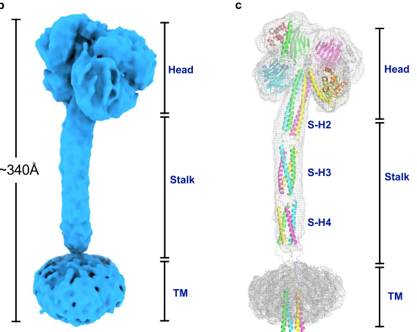

## Question

# Gene Research for Functional Annotation

## ⚠️ CRITICAL: Gene/Protein Identification Context

**BEFORE YOU BEGIN RESEARCH:** You MUST verify you are researching the CORRECT gene/protein. Gene symbols can be ambiguous, especially for less well-characterized genes from non-model organisms.

### Target Gene/Protein Identity (from UniProt):
- **UniProt Accession:** Q9HAT1
- **Protein Description:** RecName: Full=Protein ERGIC-53-like; AltName: Full=ERGIC53-like protein; AltName: Full=Lectin mannose-binding 1-like; Short=LMAN1-like protein; Flags: Precursor;
- **Gene Information:** Name=LMAN1L; Synonyms=ERGL; ORFNames=UNQ2784/PRO7174;
- **Organism (full):** Homo sapiens (Human).
- **Protein Family:** Not specified in UniProt
- **Key Domains:** ConA-like_dom_sf. (IPR013320); Intracellular_Lectin-GPT. (IPR051136); Lectin_leg. (IPR005052); Lectin_leg-like (PF03388)

### MANDATORY VERIFICATION STEPS:

1. **Check if the gene symbol "LMAN1L" matches the protein description above**
2. **Verify the organism is correct:** Homo sapiens (Human).
3. **Check if protein family/domains align with what you find in literature**
4. **If you find literature for a DIFFERENT gene with the same or similar symbol, STOP**

### If Gene Symbol is Ambiguous or You Cannot Find Relevant Literature:

**DO NOT PROCEED WITH RESEARCH ON A DIFFERENT GENE.** Instead:
- State clearly: "The gene symbol 'LMAN1L' is ambiguous or literature is limited for this specific protein"
- Explain what you found (e.g., "Found extensive literature on a different gene with the same symbol in a different organism")
- Describe the protein based ONLY on the UniProt information provided above
- Suggest that the protein function can be inferred from domain/family information

### Research Target:

Please provide a comprehensive research report on the gene **LMAN1L** (gene ID: LMAN1L, UniProt: Q9HAT1) in human.

The research report should be a detailed narrative explaining the function, biological processes, and localization of the gene product. Citations should be given for all claims.

You should prioritize authoritative reviews and primary scientific literature when conducting research. You can supplement
this with annotations you find in gene/protein databases, but these can be outdated or inaccurate.

We are specifically interested in the primary function of the gene - for enzymes, what reaction is catalyzed, and what is the substrate specificity? For transporters, what is the substrate? For structural proteins or adapters, what is the broader structural role? For signaling molecules, what is the role in the pathway.

We are interested in where in or outside the cell the gene product carries out its function.

We are also interested in the signaling or biochemical pathways in which the gene functions. We are less interested in broad pleiotropic effects, except where these elucidate the precise role.

Include evidence where possible. We are interested in both experimental evidence as well as inference from structure, evolution, or bioinformatic analysis. Precise studies should be prioritized over high-throughput, where available.

## Output

Question: You are an expert researcher providing comprehensive, well-cited information.

Provide detailed information focusing on:
1. Key concepts and definitions with current understanding
2. Recent developments and latest research (prioritize 2023-2024 sources)
3. Current applications and real-world implementations
4. Expert opinions and analysis from authoritative sources
5. Relevant statistics and data from recent studies

Format as a comprehensive research report with proper citations. Include URLs and publication dates where available.
Always prioritize recent, authoritative sources and provide specific citations for all major claims.

# Gene Research for Functional Annotation

## ⚠️ CRITICAL: Gene/Protein Identification Context

**BEFORE YOU BEGIN RESEARCH:** You MUST verify you are researching the CORRECT gene/protein. Gene symbols can be ambiguous, especially for less well-characterized genes from non-model organisms.

### Target Gene/Protein Identity (from UniProt):
- **UniProt Accession:** Q9HAT1
- **Protein Description:** RecName: Full=Protein ERGIC-53-like; AltName: Full=ERGIC53-like protein; AltName: Full=Lectin mannose-binding 1-like; Short=LMAN1-like protein; Flags: Precursor;
- **Gene Information:** Name=LMAN1L; Synonyms=ERGL; ORFNames=UNQ2784/PRO7174;
- **Organism (full):** Homo sapiens (Human).
- **Protein Family:** Not specified in UniProt
- **Key Domains:** ConA-like_dom_sf. (IPR013320); Intracellular_Lectin-GPT. (IPR051136); Lectin_leg. (IPR005052); Lectin_leg-like (PF03388)

### MANDATORY VERIFICATION STEPS:

1. **Check if the gene symbol "LMAN1L" matches the protein description above**
2. **Verify the organism is correct:** Homo sapiens (Human).
3. **Check if protein family/domains align with what you find in literature**
4. **If you find literature for a DIFFERENT gene with the same or similar symbol, STOP**

### If Gene Symbol is Ambiguous or You Cannot Find Relevant Literature:

**DO NOT PROCEED WITH RESEARCH ON A DIFFERENT GENE.** Instead:
- State clearly: "The gene symbol 'LMAN1L' is ambiguous or literature is limited for this specific protein"
- Explain what you found (e.g., "Found extensive literature on a different gene with the same symbol in a different organism")
- Describe the protein based ONLY on the UniProt information provided above
- Suggest that the protein function can be inferred from domain/family information

### Research Target:

Please provide a comprehensive research report on the gene **LMAN1L** (gene ID: LMAN1L, UniProt: Q9HAT1) in human.

The research report should be a detailed narrative explaining the function, biological processes, and localization of the gene product. Citations should be given for all claims.

You should prioritize authoritative reviews and primary scientific literature when conducting research. You can supplement
this with annotations you find in gene/protein databases, but these can be outdated or inaccurate.

We are specifically interested in the primary function of the gene - for enzymes, what reaction is catalyzed, and what is the substrate specificity? For transporters, what is the substrate? For structural proteins or adapters, what is the broader structural role? For signaling molecules, what is the role in the pathway.

We are interested in where in or outside the cell the gene product carries out its function.

We are also interested in the signaling or biochemical pathways in which the gene functions. We are less interested in broad pleiotropic effects, except where these elucidate the precise role.

Include evidence where possible. We are interested in both experimental evidence as well as inference from structure, evolution, or bioinformatic analysis. Precise studies should be prioritized over high-throughput, where available.

## Research report: Human **LMAN1L** (UniProt **Q9HAT1**; gene **LMAN1L**; synonym **ERGL**) — functional annotation

### 0) Target identity verification (critical)
The literature retrieved here uses **ERGL** explicitly to denote **ERGIC-53-like protein / LMAN1L** (human), and consistently contrasts it with **LMAN1/ERGIC-53** and the related lectin cargo receptors **VIP36/LMAN2** and **VIPL/LMAN2L**. This supports that the report below is focused on the correct human target: **LMAN1L (Q9HAT1)**, not LMAN1 or LMAN2L. (watanabe2024structureoffulllength pages 7-8, watanabe2024structureoffulllength pages 8-9, tempio2020thepivotalrole pages 1-2, suzuki2021foldingandquality pages 12-14)

### 1) Key concepts and current definitions
#### 1.1 L-type (legume-like) lectins in the early secretory pathway
Animal **L-type lectins** are luminal lectin domains (structurally related to legume seed lectins) commonly embedded in type I membrane proteins that localize to the **ER–Golgi interface** (ER exit sites/ERGIC/cis-Golgi). In this family, the lectin **carbohydrate-recognition domain (CRD)** typically recognizes **high-mannose N-glycans**, often in a **Ca2+-dependent** manner, enabling selective trafficking (“cargo receptor” function) rather than bulk flow. (gupta2012ltypelectinsin pages 1-2)

A canonical reference point is **LMAN1/ERGIC-53**, which binds certain glycoprotein cargos in the ER in a **carbohydrate- and Ca2+-dependent** manner, releases cargo in ERGIC, and cycles between ER and Golgi using coat-dependent motifs. (gupta2012ltypelectinsin pages 8-9, fu2019proteostasismaintenanceof pages 103-114)

#### 1.2 What LMAN1L/ERGL is (definition)
**LMAN1L (ERGL)** is described as an **ERGIC-53 homolog** and part of the mammalian L-type lectin repertoire at the ER–Golgi interface (often discussed alongside ERGIC-53/LMAN1 and VIP36/VIPL lectins). (gupta2012ltypelectinsin pages 2-3, tempio2020thepivotalrole pages 1-2, suzuki2021foldingandquality pages 12-14)

### 2) Molecular features of LMAN1L: domains, topology, and inferred mechanism
#### 2.1 Domains/topology (current understanding)
Reviews summarize the general ERGIC L-type lectin architecture as a luminal region organized into (i) an **N-terminal L-type lectin domain/CRD**, (ii) a **proline-rich (P) domain**, and (iii) a membrane-proximal region described as a **Ca2+-binding domain** near the transmembrane segment. ERGL/LMAN1L is discussed within this framework as an ERGIC-53-related protein in the early secretory pathway. (gupta2012ltypelectinsin pages 2-3, gupta2012ltypelectinsin pages 1-2)

A 2024 cryo-EM study resolved **full-length ERGIC-53** architecture (head + long coiled-coil stalk + TM) and, importantly for LMAN1L inference, noted ERGL/LMAN1L is predicted to have a **coiled-coil stalk** (low sequence similarity but similar predicted architecture) and could plausibly form tetramers or heterotetramers with ERGIC-53 via coiled-coils based on AlphaFold multimer modeling. (watanabe2024structureoffulllength pages 7-8)

**Figure evidence:** the ERGIC-53 domain architecture (CRD “head”, coiled-coil “stalk”, and TM) is shown in the extracted images from Watanabe et al. 2024, providing structural context for ERGL/LMAN1L homology-based models. (watanabe2024structureoffulllength media 673423b5, watanabe2024structureoffulllength media 54d9b05c, watanabe2024structureoffulllength media ea80d90b)

#### 2.2 Sorting motifs and cycling vs retention (distinguishing LMAN1L from LMAN1)
A key question is whether LMAN1L is a **cycling cargo receptor** (like LMAN1) or a more **ER-retained** lectin. One review describes human **LMAN1L/ERGL** as a type I transmembrane protein with a short cytosolic tail ending in **KRFY** (a recycling-related motif) but with an additional arginine forming an **RKR** signal, which correlates with **ER retention/localization** and a **non-cycling, ER-resident** behavior (primarily ER; partly Golgi), contrasting with LMAN1’s robust ER↔ERGIC cycling. (gupta2012ltypelectinsin pages 15-16)

This contrasts with the well-established model for LMAN1/ERGIC-53, whose cytosolic tail contains motifs enabling coat interactions (e.g., COPII export and COPI retrieval), supporting continual cycling and cargo capture/release across compartments. (fu2019proteostasismaintenanceof pages 103-114, dancourt2010proteinsortingreceptors pages 9-10)

### 3) Subcellular localization of LMAN1L (evidence)
Direct protein-level localization data for LMAN1L is limited in the retrieved set. The most concrete synthesis is from the review evidence above: LMAN1L is described as primarily **ER-localized** with some presence in Golgi/ERGIC-related compartments, consistent with an ER-retained or ER-biased protein rather than a strongly cycling receptor. (gupta2012ltypelectinsin pages 15-16)

An earlier dissertation-style source emphasized that (at that time) protein expression/localization data for ERGL remained limited (“until now no data on protein expression are available”), highlighting the historical gap in direct characterization. (veronika2010theroleof pages 28-32)

### 4) Binding specificity and biochemical activity (what is known vs uncertain)
The strongest specific claims about LMAN1L binding come from a review summarizing primary experiments:

* **Mixed lectin activity results:** in some assays, HA-tagged LMAN1L/VIPL (as described in that source) failed to bind immobilized mannose or Glc/GlcNAc conjugates; this led to a view that it might lack sugar-binding activity. (gupta2012ltypelectinsin pages 15-16)
* **Defined high-mannose motif binding:** recombinant soluble LMAN1L (sVIPL, in the cited summary) bound a **high-mannose Man1–2Man1–2Man motif**; binding decreased when an outer mannose was **glucosylated** (suggesting sensitivity to glycan processing state). (gupta2012ltypelectinsin pages 15-16)
* **pH dependence:** binding was stronger at **neutral (ER-like) pH** than at acidic pH. (gupta2012ltypelectinsin pages 15-16)

**Ca2+ dependence:** while Ca2+-dependent binding is a general property of L-type lectins and is clearly supported for LMAN1/ERGIC-53, the retrieved excerpts do **not** provide direct experimental proof that LMAN1L itself is Ca2+-dependent; thus Ca2+ dependence for LMAN1L should be treated as **inferred but not confirmed** here. (gupta2012ltypelectinsin pages 1-2, fu2019proteostasismaintenanceof pages 103-114, gupta2012ltypelectinsin pages 15-16)

### 5) Functional role in trafficking: cargo receptor, regulator, or auxiliary factor?
#### 5.1 Consensus model (qualitative)
Multiple authoritative reviews and a recent high-impact structural paper converge on a cautious view: LMAN1L/ERGL is an ERGIC-53-family lectin that likely contributes to **selective handling of glycoprotein cargo** at the ER–Golgi interface, but its exact cargo spectrum and mechanism are not as firmly established as LMAN1. (tempio2020thepivotalrole pages 1-2, suzuki2021foldingandquality pages 12-14, watanabe2024structureoffulllength pages 7-8)

#### 5.2 Evidence for functional relationship to ERGIC-53
A review argues that LMAN1L/ERGL may act as a **regulator of ERGIC-53** rather than a simple redundant replacement; it also reports that LMAN1L does **not compete** with ERGIC-53 for binding to immobilized mannose in one summarized assay. (gupta2012ltypelectinsin pages 15-16)

The 2024 Nature Communications cryo-EM paper proposes (based on sequence/structure prediction) that ERGL may form **homotetramers** or **heterotetramers** with ERGIC-53 via coiled-coil stalk interactions, and therefore could function as an **additional/auxiliary cargo receptor** in some tissues/cells, though the paper notes ERGL’s contribution may be negligible in HEK293-based rescue assays (suggesting strong cell-type dependence). (watanabe2024structureoffulllength pages 7-8)

#### 5.3 Reported cargo-related phenotypes (limited)
The same review summarized that **siRNA knockdown** of the ER-retained lectin (LMAN1L/VIPL as described there) slowed secretion of two glycoproteins, consistent with a possible role in ER export of specific glycoproteins; however, the excerpt does not provide the full experimental context or cargo identity details. (gupta2012ltypelectinsin pages 15-16)

A 2024 discussion section notes a “recent study” reported ERGL involvement in secretion of **factor VIII** in **HCT116** cells, suggesting possible overlap or compensation with the LMAN1/MCFD2 pathway in some contexts, though the detailed methods/results of that “recent study” were not captured in the retrieved corpus. (watanabe2024structureoffulllength pages 8-9)

### 6) Recent developments (prioritizing 2023–2024)
#### 6.1 2024: structural mechanism of ERGIC-53 (context for ERGL/LMAN1L)
Watanabe et al. (Nature Communications, **Mar 2024**, URL: https://doi.org/10.1038/s41467-024-46747-1) resolved the full-length ERGIC-53–MCFD2 complex by cryo-EM and proposed mechanistic features (tetrameric architecture; flexible coiled-coil stalk; metal-binding modulation in MCFD2). Within that updated mechanistic framework, the authors explicitly discuss ERGL/LMAN1L as a homolog potentially forming tetramers or heterotetramers with ERGIC-53 (predicted by AF2 multimer) and as part of broader secretory cargo homeostasis models. (watanabe2024structureoffulllength pages 7-8, watanabe2024structureoffulllength pages 8-9)

#### 6.2 2023: human genetics in relevant tissue — cartilage AEI at CSK–LMAN1L locus
de Almeida et al. (Rheumatology, **Aug 2023**, URL: https://doi.org/10.1093/rheumatology/keac498) used RNA-seq from osteoarthritis patient tissues to identify allelic expression imbalance (AEI) at GWAS loci. They report AEI signals in **articular cartilage** at a locus annotated **CSK—LMAN1L**, with OA risk SNP **rs35206230** linked to proxy transcript SNPs including **rs12487 (r²=0.72; chr15:74851253)** and **rs1127796 (r²=0.63; chr15:74900663)**, providing tissue-relevant genetic support implicating this genomic region in OA biology. (almeida2023allelicexpressionimbalance pages 4-6)

### 7) Human disease/trait associations and statistics
#### 7.1 Open Targets genetic association overview (database-integrated)
Open Targets reports genetic association evidence (credible sets) linking **LMAN1L (ENSG00000140506)** to traits including **hypertension**, **essential hypertension**, **osteoarthritis**, **hip osteoarthritis**, **alcohol drinking**, and **pregnancy-induced hypertension**, with internal association scores (e.g., hypertension overall score ~0.39 in the excerpt). The extracted Open Targets output provides literature PubMed IDs but does not provide p-values/effect sizes in the shown rows; therefore, these should be treated as **association signals requiring follow-up in the primary GWAS papers**. (OpenTargets Search: -LMAN1L, OpenTargets Search: hypertension,osteoarthritis-LMAN1L)

#### 7.2 CNV/microdeletion context
In the context of **15q24.1 microdeletion syndrome**, Ng et al. (Twin Research and Human Genetics, **Aug 2011**, URL: https://doi.org/10.1375/twin.14.4.333) note that **LMAN1L encodes an integral membrane protein** and is “highly expressed in normal and neoplastic prostate” but also expressed in **brain** (citing Yerushalmi et al. 2001). They discuss LMAN1L among deleted genes with reproductive tissue expression when considering contributors to genital/reproductive phenotypes in the microdeletion syndrome. (ng2011anadditionalcase pages 5-6)

### 8) Current applications and real-world implementations
No direct clinical diagnostic, therapeutic, or biotechnology application specific to **LMAN1L** is established in the retrieved evidence. Practical relevance at present is mainly:

1. **Hypothesis generation in secretion biology:** LMAN1L is considered an ERGIC-53-family factor potentially modulating or supplementing lectin cargo receptor function in certain tissues. (watanabe2024structureoffulllength pages 7-8, tempio2020thepivotalrole pages 1-2)
2. **Human genetics prioritization:** cartilage AEI and Open Targets associations make LMAN1L a candidate gene for follow-up functional studies in **osteoarthritis** and cardiovascular traits, though causality and mechanism remain to be validated. (almeida2023allelicexpressionimbalance pages 4-6, OpenTargets Search: -LMAN1L)

### 9) Expert synthesis and critical gaps (authoritative analysis)
Authoritative sources repeatedly emphasize that **LMAN1/ERGIC-53** is the best-characterized member of this lectin cargo receptor family, while **LMAN1L/ERGL** remains comparatively under-characterized at the mechanistic level. (suzuki2021foldingandquality pages 12-14, veronika2010theroleof pages 28-32)

The strongest “expert consensus” that can be supported from the retrieved evidence is:

* LMAN1L is very likely a **type I membrane L-type lectin** acting in the early secretory pathway, but its precise **cycling dynamics**, **glycan specificity**, and **cargo repertoire** are incompletely defined. (gupta2012ltypelectinsin pages 15-16, tempio2020thepivotalrole pages 1-2, suzuki2021foldingandquality pages 12-14)
* It may act as an **auxiliary receptor/regulator** of ERGIC-53 rather than a direct functional duplicate, and its functional impact appears **cell-type dependent**. (gupta2012ltypelectinsin pages 15-16, watanabe2024structureoffulllength pages 7-8)

Major evidence gaps that limit definitive functional annotation include the scarcity (in this corpus) of:

* a dedicated LMAN1L localization study (endogenous protein),
* a definitive glycan-binding/Ca2+-dependence characterization for LMAN1L,
* validated client cargo lists or interaction partners (analogous to FV/FVIII–LMAN1/MCFD2 for LMAN1). (gupta2012ltypelectinsin pages 15-16, veronika2010theroleof pages 28-32, watanabe2024structureoffulllength pages 7-8)

### Summary evidence map
The table below consolidates the major findings, evidence types, and URLs/dates.

| Aspect | Key findings | Evidence type (review/primary/DB) | Key citations (pqac ids) | URLs & publication dates |
|---|---|---|---|---|
| Identity | Target verified as human **LMAN1L** / **ERGL** / **lectin, mannose-binding 1-like**, an ERGIC-53-like L-type lectin distinct from **LMAN1/ERGIC-53** and **LMAN2L/VIPL**; recent structural paper explicitly names ERGL as **LMAN1L**. | Review + primary | (gupta2012ltypelectinsin pages 15-16, watanabe2024structureoffulllength pages 7-8, watanabe2024structureoffulllength pages 8-9, suzuki2021foldingandquality pages 12-14) | Gupta 2012: https://doi.org/10.1007/978-3-7091-1065-2_7 (Mar 2012); Watanabe et al. 2024: https://doi.org/10.1038/s41467-024-46747-1 (Mar 2024); Suzuki & Fujihira 2021: https://doi.org/10.1016/b978-0-12-409547-2.14947-9 (Dec 2021) |
| Domains | Family/domain evidence supports a **type I membrane L-type lectin** with luminal **carbohydrate-recognition domain (CRD)**, proline-rich/P-like region, and membrane-proximal Ca2+-related region typical of ERGIC lectins; recent ERGIC-53 work suggests ERGL has a **putative coiled-coil stalk** analogous to ERGIC-53. | Review + inference from family + primary structural comparison | (gupta2012ltypelectinsin pages 2-3, gupta2012ltypelectinsin pages 1-2, watanabe2024structureoffulllength pages 7-8, watanabe2024structureoffulllength media 673423b5) | Gupta 2012: https://doi.org/10.1007/978-3-7091-1065-2_7 (Mar 2012); Watanabe et al. 2024: https://doi.org/10.1038/s41467-024-46747-1 (Mar 2024) |
| Localization | Best-supported localization is **primarily ER** with some Golgi/early secretory pathway presence; one review emphasizes an **RKR-like ER-retention/localization signal** and argues LMAN1L is likely a **non-cycling ER-resident** protein, unlike LMAN1. Earlier literature noted localization/function remained insufficiently defined. | Review | (gupta2012ltypelectinsin pages 15-16, veronika2010theroleof pages 28-32, tempio2020thepivotalrole pages 1-2) | Gupta 2012: https://doi.org/10.1007/978-3-7091-1065-2_7 (Mar 2012); Reiterer 2010: https://doi.org/10.5451/unibas-005405317 (2010); Tempio & Anelli 2020: https://doi.org/10.1242/jcs.240366 (Nov 2020) |
| Binding | Direct binding evidence is **mixed**: some assays found no binding to immobilized mannose/Glc/GlcNAc ligands, but soluble recombinant LMAN1L reportedly bound a **Man1-2Man1-2Man high-mannose motif**, with weaker binding after glucosylation and stronger binding at **neutral vs acidic pH**. **Direct Ca2+ dependence for LMAN1L itself remains unproven**; it is inferred from family membership. | Review summarizing primary data | (gupta2012ltypelectinsin pages 15-16, gupta2012ltypelectinsin pages 1-2) | Gupta 2012: https://doi.org/10.1007/978-3-7091-1065-2_7 (Mar 2012) |
| Interactions | Proposed functional relationship with **ERGIC-53/LMAN1**: LMAN1L may **regulate ERGIC-53** and does **not compete** with ERGIC-53 for immobilized mannose in one summarized study. 2024 structural analysis predicts possible **ERGIC-53:ERGL heterotetramers** via coiled-coils, but this remains **computational/predictive**, not demonstrated biochemically in the cited excerpt. | Review + primary structural modeling | (gupta2012ltypelectinsin pages 15-16, watanabe2024structureoffulllength pages 7-8) | Gupta 2012: https://doi.org/10.1007/978-3-7091-1065-2_7 (Mar 2012); Watanabe et al. 2024: https://doi.org/10.1038/s41467-024-46747-1 (Mar 2024) |
| Role/function | Current consensus is **tentative**: LMAN1L is an **L-type lectin in the early secretory pathway** likely involved in **selective ER export/handling of glycoproteins or membrane proteins**. Reviews cite evidence that knockdown slows secretion of some glycoproteins and suggest roles in export of **type I/polytopic membrane proteins**; 2024 discussion notes a report implicating ERGL in **factor VIII secretion in HCT116 cells**. | Review + primary mention | (gupta2012ltypelectinsin pages 2-3, watanabe2024structureoffulllength pages 8-9, tempio2020thepivotalrole pages 1-2) | Gupta 2012: https://doi.org/10.1007/978-3-7091-1065-2_7 (Mar 2012); Watanabe et al. 2024: https://doi.org/10.1038/s41467-024-46747-1 (Mar 2024); Tempio & Anelli 2020: https://doi.org/10.1242/jcs.240366 (Nov 2020) |
| Distinction from LMAN1 | **LMAN1/ERGIC-53** is well established as a **cycling, Ca2+-dependent cargo receptor** with COPII/COPI sorting motifs and defined cargos (FV/FVIII, cathepsins, A1AT, etc.), whereas **LMAN1L lacks comparable direct mechanistic evidence**, may be more ER-retained, and has no equally validated cargo repertoire. | Review + primary comparator | (gupta2012ltypelectinsin pages 8-9, fu2019proteostasismaintenanceof pages 103-114, gupta2012ltypelectinsin pages 9-10, suzuki2021foldingandquality pages 12-14) | Gupta 2012: https://doi.org/10.1007/978-3-7091-1065-2_7 (Mar 2012); Dancourt & Barlowe 2010: https://doi.org/10.1146/annurev-biochem-061608-091319 (Jun 2010); Suzuki & Fujihira 2021: https://doi.org/10.1016/b978-0-12-409547-2.14947-9 (Dec 2021) |
| Disease links | Human genetic links are currently **association-level**, not clearly mechanistic: Open Targets lists associations with **hypertension, pregnancy-induced hypertension, alcohol drinking, osteoarthritis, and hip osteoarthritis**. A 2023 cartilage AEI study implicated the **CSK–LMAN1L locus** in osteoarthritis, including cartilage signals at **rs12487** and **rs1127796** linked to GWAS SNP **rs35206230**. | DB + primary genetics | (OpenTargets Search: -LMAN1L, almeida2023allelicexpressionimbalance pages 4-6) | Open Targets Platform (query evidence summarized in 2025 platform paper context); de Almeida et al. 2023: https://doi.org/10.1093/rheumatology/keac498 (Aug 2023) |
| Applications | No established therapeutic or diagnostic use specific to LMAN1L in humans yet. The main practical relevance is as a **candidate glycoprotein trafficking factor** and **trait-associated gene**; its family context informs secretion biology and may eventually aid biomarker or cargo-engineering strategies, but such applications are not yet validated for LMAN1L itself. | Synthesis from family evidence + DB | (watanabe2024structureoffulllength pages 7-8, tempio2020thepivotalrole pages 1-2, OpenTargets Search: -LMAN1L) | Watanabe et al. 2024: https://doi.org/10.1038/s41467-024-46747-1 (Mar 2024); Tempio & Anelli 2020: https://doi.org/10.1242/jcs.240366 (Nov 2020) |
| Gaps | Major gaps: **very limited direct primary literature on human LMAN1L**, uncertain **subcellular cycling behavior**, unresolved **glycan specificity/Ca2+ dependence**, few verified **interaction partners/cargos**, and limited **protein-level expression/localization** data across tissues. Much current annotation remains **inferred from homology to LMAN1 family proteins** rather than directly demonstrated. | Evidence synthesis | (gupta2012ltypelectinsin pages 15-16, veronika2010theroleof pages 28-32, watanabe2024structureoffulllength pages 7-8, watanabe2024structureoffulllength pages 8-9) | Gupta 2012: https://doi.org/10.1007/978-3-7091-1065-2_7 (Mar 2012); Reiterer 2010: https://doi.org/10.5451/unibas-005405317 (2010); Watanabe et al. 2024: https://doi.org/10.1038/s41467-024-46747-1 (Mar 2024) |

*Table: This table summarizes the available functional annotation evidence for human LMAN1L/ERGL, separating direct findings from homology-based inference. It is useful for quickly identifying what is established, what is tentative, and where key knowledge gaps remain.*

### Key references (with URLs and publication dates)
* Watanabe S. et al. **Nature Communications** (Mar **2024**). “Structure of full-length ERGIC-53 in complex with MCFD2 for cargo transport.” https://doi.org/10.1038/s41467-024-46747-1 (watanabe2024structureoffulllength pages 7-8, watanabe2024structureoffulllength pages 8-9)
* de Almeida R.C. et al. **Rheumatology** (Aug **2023**). “Allelic expression imbalance in articular cartilage and subchondral bone refined genome-wide association signals in osteoarthritis.” https://doi.org/10.1093/rheumatology/keac498 (almeida2023allelicexpressionimbalance pages 4-6)
* Tempio T., Anelli T. **Journal of Cell Science** (Nov **2020**). “The pivotal role of ERp44 in patrolling protein secretion.” https://doi.org/10.1242/jcs.240366 (tempio2020thepivotalrole pages 1-2, tempio2020thepivotalrole pages 2-3)
* Suzuki T., Fujihira H. **Comprehensive Glycoscience** (Dec **2021**). “Folding and Quality Control of Glycoproteins.” https://doi.org/10.1016/b978-0-12-409547-2.14947-9 (suzuki2021foldingandquality pages 12-14)
* Gupta G.S. Book chapter (Mar **2012**). “L-Type Lectins in ER-Golgi Intermediate Compartment.” https://doi.org/10.1007/978-3-7091-1065-2_7 (gupta2012ltypelectinsin pages 15-16, gupta2012ltypelectinsin pages 2-3)
* Open Targets Platform (queried 2026; platform paper context indicated as NAR 2025 in the tool output). https://platform.opentargets.org/ (association evidence summarized in tool output) (OpenTargets Search: -LMAN1L, OpenTargets Search: hypertension,osteoarthritis-LMAN1L)

References

1. (watanabe2024structureoffulllength pages 7-8): Satoshi Watanabe, Yoshiaki Kise, Kento Yonezawa, Mariko Inoue, Nobutaka Shimizu, Osamu Nureki, and Kenji Inaba. Structure of full-length ergic-53 in complex with mcfd2 for cargo transport. Nature Communications, Mar 2024. URL: https://doi.org/10.1038/s41467-024-46747-1, doi:10.1038/s41467-024-46747-1. This article has 14 citations and is from a highest quality peer-reviewed journal.

2. (watanabe2024structureoffulllength pages 8-9): Satoshi Watanabe, Yoshiaki Kise, Kento Yonezawa, Mariko Inoue, Nobutaka Shimizu, Osamu Nureki, and Kenji Inaba. Structure of full-length ergic-53 in complex with mcfd2 for cargo transport. Nature Communications, Mar 2024. URL: https://doi.org/10.1038/s41467-024-46747-1, doi:10.1038/s41467-024-46747-1. This article has 14 citations and is from a highest quality peer-reviewed journal.

3. (tempio2020thepivotalrole pages 1-2): Tiziana Tempio and Tiziana Anelli. The pivotal role of erp44 in patrolling protein secretion. Journal of Cell Science, Nov 2020. URL: https://doi.org/10.1242/jcs.240366, doi:10.1242/jcs.240366. This article has 47 citations and is from a domain leading peer-reviewed journal.

4. (suzuki2021foldingandquality pages 12-14): Tadashi Suzuki and Haruhiko Fujihira. Folding and quality control of glycoproteins. Comprehensive Glycoscience, pages 1-28, Dec 2021. URL: https://doi.org/10.1016/b978-0-12-409547-2.14947-9, doi:10.1016/b978-0-12-409547-2.14947-9. This article has 12 citations.

5. (gupta2012ltypelectinsin pages 1-2): G. S. Gupta. L-type lectins in er-golgi intermediate compartment. Animal Lectins: Form, Function and Clinical Applications, pages 145-161, Mar 2012. URL: https://doi.org/10.1007/978-3-7091-1065-2\_7, doi:10.1007/978-3-7091-1065-2\_7. This article has 3 citations.

6. (gupta2012ltypelectinsin pages 8-9): G. S. Gupta. L-type lectins in er-golgi intermediate compartment. Animal Lectins: Form, Function and Clinical Applications, pages 145-161, Mar 2012. URL: https://doi.org/10.1007/978-3-7091-1065-2\_7, doi:10.1007/978-3-7091-1065-2\_7. This article has 3 citations.

7. (fu2019proteostasismaintenanceof pages 103-114): Y Fu. Proteostasis maintenance of γ-aminobutyric acid type a receptors (gabaars). Unknown journal, 2019.

8. (gupta2012ltypelectinsin pages 2-3): G. S. Gupta. L-type lectins in er-golgi intermediate compartment. Animal Lectins: Form, Function and Clinical Applications, pages 145-161, Mar 2012. URL: https://doi.org/10.1007/978-3-7091-1065-2\_7, doi:10.1007/978-3-7091-1065-2\_7. This article has 3 citations.

9. (watanabe2024structureoffulllength media 673423b5): Satoshi Watanabe, Yoshiaki Kise, Kento Yonezawa, Mariko Inoue, Nobutaka Shimizu, Osamu Nureki, and Kenji Inaba. Structure of full-length ergic-53 in complex with mcfd2 for cargo transport. Nature Communications, Mar 2024. URL: https://doi.org/10.1038/s41467-024-46747-1, doi:10.1038/s41467-024-46747-1. This article has 14 citations and is from a highest quality peer-reviewed journal.

10. (watanabe2024structureoffulllength media 54d9b05c): Satoshi Watanabe, Yoshiaki Kise, Kento Yonezawa, Mariko Inoue, Nobutaka Shimizu, Osamu Nureki, and Kenji Inaba. Structure of full-length ergic-53 in complex with mcfd2 for cargo transport. Nature Communications, Mar 2024. URL: https://doi.org/10.1038/s41467-024-46747-1, doi:10.1038/s41467-024-46747-1. This article has 14 citations and is from a highest quality peer-reviewed journal.

11. (watanabe2024structureoffulllength media ea80d90b): Satoshi Watanabe, Yoshiaki Kise, Kento Yonezawa, Mariko Inoue, Nobutaka Shimizu, Osamu Nureki, and Kenji Inaba. Structure of full-length ergic-53 in complex with mcfd2 for cargo transport. Nature Communications, Mar 2024. URL: https://doi.org/10.1038/s41467-024-46747-1, doi:10.1038/s41467-024-46747-1. This article has 14 citations and is from a highest quality peer-reviewed journal.

12. (gupta2012ltypelectinsin pages 15-16): G. S. Gupta. L-type lectins in er-golgi intermediate compartment. Animal Lectins: Form, Function and Clinical Applications, pages 145-161, Mar 2012. URL: https://doi.org/10.1007/978-3-7091-1065-2\_7, doi:10.1007/978-3-7091-1065-2\_7. This article has 3 citations.

13. (dancourt2010proteinsortingreceptors pages 9-10): Julia Dancourt and Charles Barlowe. Protein sorting receptors in the early secretory pathway. Annual review of biochemistry, 79:777-802, Jun 2010. URL: https://doi.org/10.1146/annurev-biochem-061608-091319, doi:10.1146/annurev-biochem-061608-091319. This article has 382 citations and is from a domain leading peer-reviewed journal.

14. (veronika2010theroleof pages 28-32): Veronika Reiterer. The role of the lectin vip36 in the early secretory pathway. ArXiv, 2010. URL: https://doi.org/10.5451/unibas-005405317, doi:10.5451/unibas-005405317. This article has 0 citations.

15. (almeida2023allelicexpressionimbalance pages 4-6): Rodrigo Coutinho de Almeida, Margo Tuerlings, Yolande Ramos, Wouter Den Hollander, Eka Suchiman, Nico Lakenberg, Rob G H H Nelissen, Hailiang Mei, and Ingrid Meulenbelt. Allelic expression imbalance in articular cartilage and subchondral bone refined genome-wide association signals in osteoarthritis. Rheumatology, 62:1669-1676, Aug 2023. URL: https://doi.org/10.1093/rheumatology/keac498, doi:10.1093/rheumatology/keac498. This article has 17 citations and is from a peer-reviewed journal.

16. (OpenTargets Search: -LMAN1L): Open Targets Query (-LMAN1L, 5 results). Buniello, A. et al. (2025). Open Targets Platform: facilitating therapeutic hypotheses building in drug discovery. Nucleic Acids Research.

17. (OpenTargets Search: hypertension,osteoarthritis-LMAN1L): Open Targets Query (hypertension,osteoarthritis-LMAN1L, 2 results). Buniello, A. et al. (2025). Open Targets Platform: facilitating therapeutic hypotheses building in drug discovery. Nucleic Acids Research.

18. (ng2011anadditionalcase pages 5-6): Ivy S. L. Ng, Wai-Hoe Chin, Eileen C. P. Lim, and Ene-Choo Tan. An additional case of the recurrent 15q24.1 microdeletion syndrome and review of the literature. Twin Research and Human Genetics, 14:333-339, Aug 2011. URL: https://doi.org/10.1375/twin.14.4.333, doi:10.1375/twin.14.4.333. This article has 10 citations and is from a peer-reviewed journal.

19. (gupta2012ltypelectinsin pages 9-10): G. S. Gupta. L-type lectins in er-golgi intermediate compartment. Animal Lectins: Form, Function and Clinical Applications, pages 145-161, Mar 2012. URL: https://doi.org/10.1007/978-3-7091-1065-2\_7, doi:10.1007/978-3-7091-1065-2\_7. This article has 3 citations.

20. (tempio2020thepivotalrole pages 2-3): Tiziana Tempio and Tiziana Anelli. The pivotal role of erp44 in patrolling protein secretion. Journal of Cell Science, Nov 2020. URL: https://doi.org/10.1242/jcs.240366, doi:10.1242/jcs.240366. This article has 47 citations and is from a domain leading peer-reviewed journal.

## Artifacts

- [Edison artifact artifact-00](LMAN1L-deep-research-falcon_artifacts/artifact-00.md)

## Citations

1. gupta2012ltypelectinsin pages 1-2
2. watanabe2024structureoffulllength pages 7-8
3. gupta2012ltypelectinsin pages 15-16
4. veronika2010theroleof pages 28-32
5. watanabe2024structureoffulllength pages 8-9
6. almeida2023allelicexpressionimbalance pages 4-6
7. ng2011anadditionalcase pages 5-6
8. suzuki2021foldingandquality pages 12-14
9. tempio2020thepivotalrole pages 1-2
10. gupta2012ltypelectinsin pages 8-9
11. fu2019proteostasismaintenanceof pages 103-114
12. gupta2012ltypelectinsin pages 2-3
13. dancourt2010proteinsortingreceptors pages 9-10
14. gupta2012ltypelectinsin pages 9-10
15. tempio2020thepivotalrole pages 2-3
16. https://doi.org/10.1038/s41467-024-46747-1
17. https://doi.org/10.1093/rheumatology/keac498
18. https://doi.org/10.1375/twin.14.4.333
19. https://doi.org/10.1007/978-3-7091-1065-2_7
20. https://doi.org/10.1016/b978-0-12-409547-2.14947-9
21. https://doi.org/10.5451/unibas-005405317
22. https://doi.org/10.1242/jcs.240366
23. https://doi.org/10.1146/annurev-biochem-061608-091319
24. https://platform.opentargets.org/
25. https://doi.org/10.1038/s41467-024-46747-1,
26. https://doi.org/10.1242/jcs.240366,
27. https://doi.org/10.1016/b978-0-12-409547-2.14947-9,
28. https://doi.org/10.1007/978-3-7091-1065-2\_7,
29. https://doi.org/10.1146/annurev-biochem-061608-091319,
30. https://doi.org/10.5451/unibas-005405317,
31. https://doi.org/10.1093/rheumatology/keac498,
32. https://doi.org/10.1375/twin.14.4.333,