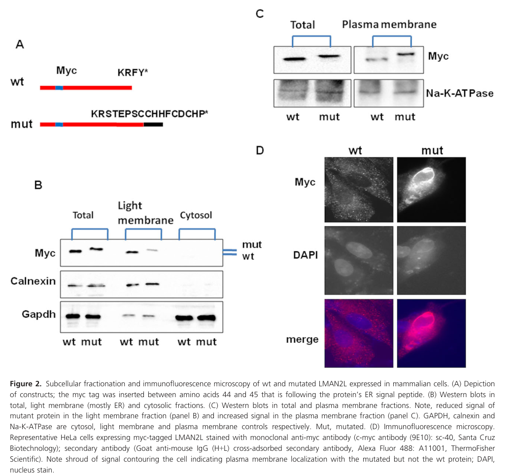

## Question

# Gene Research for Functional Annotation

## ⚠️ CRITICAL: Gene/Protein Identification Context

**BEFORE YOU BEGIN RESEARCH:** You MUST verify you are researching the CORRECT gene/protein. Gene symbols can be ambiguous, especially for less well-characterized genes from non-model organisms.

### Target Gene/Protein Identity (from UniProt):
- **UniProt Accession:** Q9H0V9
- **Protein Description:** RecName: Full=VIP36-like protein; AltName: Full=Lectin mannose-binding 2-like; Short=LMAN2-like protein; Flags: Precursor;
- **Gene Information:** Name=LMAN2L; Synonyms=VIPL; ORFNames=PSEC0028, UNQ368/PRO704;
- **Organism (full):** Homo sapiens (Human).
- **Protein Family:** Not specified in UniProt
- **Key Domains:** ConA-like_dom_sf. (IPR013320); Intracellular_Lectin-GPT. (IPR051136); Lectin_leg. (IPR005052); Lectin_leg-like (PF03388)

### MANDATORY VERIFICATION STEPS:

1. **Check if the gene symbol "LMAN2L" matches the protein description above**
2. **Verify the organism is correct:** Homo sapiens (Human).
3. **Check if protein family/domains align with what you find in literature**
4. **If you find literature for a DIFFERENT gene with the same or similar symbol, STOP**

### If Gene Symbol is Ambiguous or You Cannot Find Relevant Literature:

**DO NOT PROCEED WITH RESEARCH ON A DIFFERENT GENE.** Instead:
- State clearly: "The gene symbol 'LMAN2L' is ambiguous or literature is limited for this specific protein"
- Explain what you found (e.g., "Found extensive literature on a different gene with the same symbol in a different organism")
- Describe the protein based ONLY on the UniProt information provided above
- Suggest that the protein function can be inferred from domain/family information

### Research Target:

Please provide a comprehensive research report on the gene **LMAN2L** (gene ID: LMAN2L, UniProt: Q9H0V9) in human.

The research report should be a detailed narrative explaining the function, biological processes, and localization of the gene product. Citations should be given for all claims.

You should prioritize authoritative reviews and primary scientific literature when conducting research. You can supplement
this with annotations you find in gene/protein databases, but these can be outdated or inaccurate.

We are specifically interested in the primary function of the gene - for enzymes, what reaction is catalyzed, and what is the substrate specificity? For transporters, what is the substrate? For structural proteins or adapters, what is the broader structural role? For signaling molecules, what is the role in the pathway.

We are interested in where in or outside the cell the gene product carries out its function.

We are also interested in the signaling or biochemical pathways in which the gene functions. We are less interested in broad pleiotropic effects, except where these elucidate the precise role.

Include evidence where possible. We are interested in both experimental evidence as well as inference from structure, evolution, or bioinformatic analysis. Precise studies should be prioritized over high-throughput, where available.

## Output

Question: You are an expert researcher providing comprehensive, well-cited information.

Provide detailed information focusing on:
1. Key concepts and definitions with current understanding
2. Recent developments and latest research (prioritize 2023-2024 sources)
3. Current applications and real-world implementations
4. Expert opinions and analysis from authoritative sources
5. Relevant statistics and data from recent studies

Format as a comprehensive research report with proper citations. Include URLs and publication dates where available.
Always prioritize recent, authoritative sources and provide specific citations for all major claims.

# Gene Research for Functional Annotation

## ⚠️ CRITICAL: Gene/Protein Identification Context

**BEFORE YOU BEGIN RESEARCH:** You MUST verify you are researching the CORRECT gene/protein. Gene symbols can be ambiguous, especially for less well-characterized genes from non-model organisms.

### Target Gene/Protein Identity (from UniProt):
- **UniProt Accession:** Q9H0V9
- **Protein Description:** RecName: Full=VIP36-like protein; AltName: Full=Lectin mannose-binding 2-like; Short=LMAN2-like protein; Flags: Precursor;
- **Gene Information:** Name=LMAN2L; Synonyms=VIPL; ORFNames=PSEC0028, UNQ368/PRO704;
- **Organism (full):** Homo sapiens (Human).
- **Protein Family:** Not specified in UniProt
- **Key Domains:** ConA-like_dom_sf. (IPR013320); Intracellular_Lectin-GPT. (IPR051136); Lectin_leg. (IPR005052); Lectin_leg-like (PF03388)

### MANDATORY VERIFICATION STEPS:

1. **Check if the gene symbol "LMAN2L" matches the protein description above**
2. **Verify the organism is correct:** Homo sapiens (Human).
3. **Check if protein family/domains align with what you find in literature**
4. **If you find literature for a DIFFERENT gene with the same or similar symbol, STOP**

### If Gene Symbol is Ambiguous or You Cannot Find Relevant Literature:

**DO NOT PROCEED WITH RESEARCH ON A DIFFERENT GENE.** Instead:
- State clearly: "The gene symbol 'LMAN2L' is ambiguous or literature is limited for this specific protein"
- Explain what you found (e.g., "Found extensive literature on a different gene with the same symbol in a different organism")
- Describe the protein based ONLY on the UniProt information provided above
- Suggest that the protein function can be inferred from domain/family information

### Research Target:

Please provide a comprehensive research report on the gene **LMAN2L** (gene ID: LMAN2L, UniProt: Q9H0V9) in human.

The research report should be a detailed narrative explaining the function, biological processes, and localization of the gene product. Citations should be given for all claims.

You should prioritize authoritative reviews and primary scientific literature when conducting research. You can supplement
this with annotations you find in gene/protein databases, but these can be outdated or inaccurate.

We are specifically interested in the primary function of the gene - for enzymes, what reaction is catalyzed, and what is the substrate specificity? For transporters, what is the substrate? For structural proteins or adapters, what is the broader structural role? For signaling molecules, what is the role in the pathway.

We are interested in where in or outside the cell the gene product carries out its function.

We are also interested in the signaling or biochemical pathways in which the gene functions. We are less interested in broad pleiotropic effects, except where these elucidate the precise role.

Include evidence where possible. We are interested in both experimental evidence as well as inference from structure, evolution, or bioinformatic analysis. Precise studies should be prioritized over high-throughput, where available.

## Research Report: Human **LMAN2L** (VIPL; UniProt **Q9H0V9**) — Functional Annotation and Current Evidence

### 1) Target verification (gene/protein identity)
The research target is **human LMAN2L** (synonym **VIPL**, “VIP36-like protein”), consistent across genetics, cell-biology, and infection/proteomics studies that explicitly refer to **LMAN2L/VIPL** as an **ER-resident L-type (legume-like) intracellular lectin** involved in glycoprotein handling in the early secretory pathway. This aligns with the UniProt-provided description (VIP36-like; L-type lectin/ConA-like domain superfamily; precursor/type I membrane protein). (gupta2012ltypelectinsin pages 15-16, hunter2023functionalcharacterisationof pages 91-94, casalnuovo2024characterizationofthe pages 5-9)

### 2) Key concepts and definitions (current understanding)

#### 2.1 Intracellular L-type (legume-like) lectins
**L-type lectins** are defined by a **luminal carbohydrate-recognition domain (CRD)** structurally related to legume seed lectins, typically a **β-sandwich** that binds **Ca2+** adjacent to the carbohydrate-binding site; Ca2+ helps organize binding-site residues and supports glycan binding. (gupta2012ltypelectinsin pages 13-15)

In mammalian secretory trafficking, L-type lectins include **ERGIC-53/LMAN1**, **VIP36/LMAN2**, and **VIPL/LMAN2L** and are proposed to recognize **high-mannose N-glycans** in regulated ways (compared with high-affinity plant lectins). Binding is often **Ca2+-dependent** and **pH-sensitive**, allowing capture/release across the ER→ERGIC→Golgi pH gradient. (yamamoto2009intracellularlectinsinvolved pages 5-6, yamamoto2009intracellularlectinsinvolved pages 3-5)

#### 2.2 Cargo receptors and receptor-mediated ER export
A **cargo receptor** is a transmembrane protein that binds **soluble secretory cargo** in the ER lumen and links them to cytosolic coat machinery (e.g., **COPII**) for ER exit, then typically **recycles** via COPI. ERGIC-53 is described as a best-characterized example, with oligomerization enabling COPII-recognized sorting signals and selective export of folded cargo. (hunter2023functionalcharacterisationof pages 91-94, gupta2012ltypelectinsin pages 2-3)

#### 2.3 LMAN2L/VIPL’s position within this framework
LMAN2L is repeatedly distinguished from cycling receptors (ERGIC-53, VIP36) by being **primarily ER-resident / non-cycling**, consistent with cytosolic retention signals. (hunter2023functionalcharacterisationof pages 91-94, yamamoto2009intracellularlectinsinvolved pages 5-6)

### 3) Molecular function of LMAN2L (VIPL): what it does and how

#### 3.1 Proposed primary function: glycoprotein-binding lectin facilitating ER export and/or quality control
Multiple sources converge on LMAN2L as an **ER-resident L-type lectin** implicated in **glycoprotein trafficking/export** rather than enzymatic catalysis. It has been framed as a **cargo receptor or “secretion chaperone”** whose specific endogenous glycoprotein clients remain incompletely defined. (alkhater2019dominantlman2lmutation pages 1-3, gupta2012ltypelectinsin pages 15-16, hunter2023functionalcharacterisationof pages 91-94)

Mechanistically, LMAN2L is proposed to bind **native (properly folded) glycoproteins** after they exit the **calnexin/calreticulin (CNX/CRT) folding cycle**, thereby helping them avoid mannose trimming that would otherwise target them to ER-associated degradation (ERAD), and possibly facilitating onward transport (including potential handoff to ERGIC-53). (hunter2023functionalcharacterisationof pages 91-94)

#### 3.2 Glycan-binding specificity and biochemical determinants
The strongest and most specific statements in the retrieved literature indicate that LMAN2L/VIPL:
- Binds **high-mannose-type N-glycans**, with selectivity for **deglucosylated** forms. (hunter2024hcmvus2coopts pages 5-7, hunter2023functionalcharacterisationof pages 91-94)
- Recognizes motifs including **Manα1-2Manα1-2Man** (reported from competition assays). (gupta2012ltypelectinsin pages 15-16)
- Shows **Ca2+** and **pH dependence**, with stronger binding at **neutral (ER-like) pH** and weaker binding after glucosylation or mannose trimming. (hunter2023functionalcharacterisationof pages 91-94, gupta2012ltypelectinsin pages 15-16)

However, some experimental reports summarized in review text note conflicting results (e.g., failure of certain tagged constructs to detect binding to immobilized mannose/Glc/GlcNAc ligands), so glycan-binding activity is supported but not uniformly observed across assay formats. (gupta2012ltypelectinsin pages 15-16)

#### 3.3 Subcellular localization and trafficking signals
LMAN2L is described as **primarily ER-resident** with some partial Golgi localization, and **not cycling** like ERGIC-53/VIP36. (gupta2012ltypelectinsin pages 15-16, yamamoto2009intracellularlectinsinvolved pages 5-6)

Sorting/retention motifs reported for LMAN2L/VIPL include:
- A cytosolic **KRFY** motif (associated with ER/ERGIC/cis-Golgi recycling signals in the L-type lectin family context). (gupta2012ltypelectinsin pages 15-16)
- An **RKR** ER-retention/localization motif described in its cytosolic domain (noted as a determinant of ER residency). (hunter2023functionalcharacterisationof pages 91-94, yamamoto2009intracellularlectinsinvolved pages 5-6, gupta2012ltypelectinsin pages 15-16)

#### 3.4 Interacting partners and candidate client proteins
**ERGIC-53 (LMAN1)**: LMAN2L has been proposed to interact with ERGIC-53; overexpression of LMAN2L can redistribute/retain ERGIC-53 in the ER, suggesting regulatory interplay in receptor-mediated export. (hunter2023functionalcharacterisationof pages 91-94, casalnuovo2024characterizationofthe pages 5-9)

**Integrin trafficking (ITGA6)**: A key 2023–2024 development is the emergence of at least one plausible cell-surface client: **ITGA6**. In infection-linked and depletion experiments, **surface ITGA6 was reduced in LMAN2L-deficient cells**, and interactome work detected **ITGB1** (ITGA6 partner) as a potential associated protein, supporting a model in which LMAN2L contributes to trafficking of specific glycoproteins to the plasma membrane. (hunter2023functionalcharacterisationof pages 121-124, hunter2024hcmvus2coopts pages 5-7)

**Unbiased proteomics interaction screening (2024)**: A RUSH-based co-IP/MS workflow yielded **87 VIPL-associated candidate interactors/cargos** after localization filtering, including proteins annotated to **ER/Golgi** and **COPII-related components** (e.g., SEC23A/SEC23B, COPB2) plus many cytoskeleton-associated proteins. This dataset is hypothesis-generating and requires orthogonal validation to separate direct interactors from indirect associations. (casalnuovo2024characterizationofthe pages 49-52, casalnuovo2024characterizationofthe pages 45-49)

### 4) Recent developments and latest research (prioritizing 2023–2024)

#### 4.1 Viral exploitation of LMAN2L: HCMV pUS2–TRC8 axis (2024)
A major 2024 advance is the demonstration that **human cytomegalovirus (HCMV) pUS2** targets LMAN2L for degradation by co-opting the host ERAD machinery:
- LMAN2L is **downregulated early (as early as 4 hours post-infection)**.
- Downregulation is **rescued by proteasome inhibition (MG132)** but not lysosomal inhibition (leupeptin), supporting proteasome-dependent degradation.
- Deletion mapping indicates **pUS2 is necessary** for LMAN2L downregulation during infection.
- LMAN2L degradation is **TRC8-dependent** (TRC8 knockdown strongly rescues LMAN2L), consistent with US2 recruiting TRC8 to ubiquitinate substrates for dislocation and proteasomal degradation.
- Proteomics supporting data deposition: **PRIDE PXD050878** (reported in the paper). (hunter2024hcmvus2coopts pages 5-7, hunter2024hcmvus2coopts pages 4-5)

The study interprets these results as consistent with LMAN2L’s hypothesized role in **glycoprotein trafficking** and suggests US2-mediated targeting may indirectly affect specific surface proteins, including **ITGA6**. (hunter2024hcmvus2coopts pages 5-7)

**URL and publication date**: Hunter et al., *Journal of General Virology*, **Apr 2024**. https://doi.org/10.1099/jgv.0.001980 (hunter2024hcmvus2coopts pages 5-7)

#### 4.2 Human genetics update: compound heterozygous LMAN2L variants with expanded phenotype (2023)
A 2023 clinical report extends LMAN2L-related neurodevelopmental disease beyond homozygous consanguineous pedigrees by identifying **compound heterozygous** variants in a Chinese patient:
- Variants: **c.256C>T (p.R86C)** and **c.902del (p.F301Sfs*8)**.
- Phenotype: global developmental delay, severe intellectual disability, seizures starting at **2 months**; additional features include **hearing loss** and **dystonia** (phenotype expansion).
- Quantitative clinical details: tonic seizures lasting ~10 seconds; seizure frequency about **twice per month** on therapy; developmental indices **<50** (mean 100).
- Diagnostic implementation: **trio-WES**, Sanger confirmation, ACMG classification, plus CMA noting a small duplication VUS. (zhou2023novelcompoundheterozygous pages 1-2, zhou2023novelcompoundheterozygous pages 2-3)

**URL and publication date**: Zhou et al., *Chinese Medical Journal*, **Feb 2023**. https://doi.org/10.1097/cm9.0000000000002285 (zhou2023novelcompoundheterozygous pages 1-2)

### 5) Disease associations, expert analysis, and strength of evidence

#### 5.1 Core Mendelian disorder association: neurodevelopmental disorder with seizures (MRT52 / ID with epilepsy)
**Autosomal recessive**: The foundational Mendelian evidence is a 2016 consanguineous family where **LMAN2L p.R53Q (c.158G>A)** co-segregated with **severe intellectual disability** and **infantile seizures until age 5**, with **5 affected** homozygotes and **7 unaffected** relatives showing heterozygosity or non-carrier status, strongly supporting causality in that pedigree. (rafiullah2016homozygousmissensemutation pages 2-4)

**Autosomal dominant**: A 2019 report identified a heterozygous frameshift **c.1073delT; p.(Phe358Serfs*16)** that removes the ER-retention/localization motif and causes **ID with remitting epilepsy** in **4 affected** family members. A central mechanistic interpretation is that loss of ER retention causes mislocalization and disrupts glycoprotein handling critical for neurodevelopment. (alkhater2019dominantlman2lmutation pages 1-3, alkhater2019dominantlman2lmutation pages 3-5)

**Image-based evidence for mechanism (2019)**: Figure 2 provides direct evidence that the c.1073delT variant shifts LMAN2L into the **plasma membrane fraction** and produces peripheral **cell-surface immunofluorescence**, supporting mislocalization due to loss of ER retention. (alkhater2019dominantlman2lmutation media 119efd23)

**Expert interpretation**: The 2019 authors explicitly frame LMAN2L as among “glycoprotein secretion chaperone” family members and emphasize that its specific processed glycoproteins are unknown, while arguing that mislocalization or impaired glycoprotein interaction can disturb brain development and produce remitting childhood epilepsy. (alkhater2019dominantlman2lmutation pages 1-3, alkhater2019dominantlman2lmutation pages 3-5)

#### 5.2 Psychiatric/neuropsychiatric associations (GWAS / database)
LMAN2L has been repeatedly mentioned as associated in GWAS contexts with disorders including bipolar disorder and schizophrenia in the genetics literature, but these do not establish causal mechanism in the same way as family segregation. (alkhater2019dominantlman2lmutation pages 1-3, rafiullah2016homozygousmissensemutation pages 2-4)

A disease-target association query in Open Targets lists associations for LMAN2L with **autosomal dominant intellectual disability**, **autosomal recessive non-syndromic intellectual disability**, and psychiatric phenotypes (major depressive disorder, bipolar disorder, schizophrenia), reflecting aggregated evidence links and literature mapping. (OpenTargets Search: -LMAN2L)

### 6) Current applications and real-world implementations

#### 6.1 Clinical genetics/diagnostics
The most mature real-world application is **rare-disease genetic diagnosis**:
- LMAN2L variants are identified via **whole-exome sequencing (WES)** with segregation/Sanger validation in families and probands; trio-WES is used in contemporary diagnostics. (zhou2023novelcompoundheterozygous pages 1-2, rafiullah2016homozygousmissensemutation pages 2-4, alkhater2019dominantlman2lmutation pages 1-3)
- Reported inheritance spans **autosomal recessive** (homozygous or compound heterozygous) and **autosomal dominant** (ER-retention-loss frameshift) presentations, which is relevant for variant interpretation and counseling. (rafiullah2016homozygousmissensemutation pages 2-4, alkhater2019dominantlman2lmutation pages 1-3)

#### 6.2 Infection biology and host–pathogen interaction
LMAN2L has emerging relevance as a **host factor targeted by HCMV immune evasion**. The pUS2–TRC8-mediated degradation of LMAN2L demonstrates a concrete host–virus interaction and provides a tool/perturbation axis for dissecting LMAN2L-dependent trafficking of specific glycoproteins. (hunter2024hcmvus2coopts pages 5-7)

#### 6.3 Proteomics resources
The 2024 HCMV study reports proteomics deposition (**PRIDE: PXD050878**) supporting LMAN2L degradation and downstream surface-proteome analysis, enabling reanalysis and integration by other investigators. (hunter2024hcmvus2coopts pages 5-7, hunter2024hcmvus2coopts pages 4-5)

### 7) Statistics and quantitative data points from recent studies

#### 7.1 Human genetics (cases, inheritance, phenotypes)
- **2016 family study**: 1 consanguineous family; **5 affected** homozygous p.R53Q; **7 unaffected** evaluated; seizures in infancy until age **5**. (rafiullah2016homozygousmissensemutation pages 2-4)
- **2019 dominant family study**: **4 affected** (father + 3 sons) with c.1073delT frameshift; seizure onset around **age 6**; carbamazepine-responsive with remission (weaned ~10 years, EEG normalized). (alkhater2019dominantlman2lmutation pages 1-3)
- **2023 case report**: 1 proband, seizure onset **2 months**, frequency ~**2/month** on therapy; developmental index **<50**. (zhou2023novelcompoundheterozygous pages 1-2)

#### 7.2 2023–2024 trafficking/proteomics (quantitative)
- LMAN2L downregulation observed as early as **4 h** post HCMV infection. (hunter2024hcmvus2coopts pages 5-7)
- Deletion of US1–US11 block increases LMAN2L abundance by **>20-fold** (consistent with viral locus controlling its degradation). (hunter2024hcmvus2coopts pages 5-7)
- TRC8 knockdown provided an approximately **~40-fold** reduction (as reported) and rescued LMAN2L during infection, supporting TRC8 dependence. (hunter2024hcmvus2coopts pages 5-7)
- LMAN2L depletion decreased **surface ITGA6**; in the 2023 thesis, ITGA6 was reproducibly ~**1.5-fold downregulated** upon LMAN2L depletion. (hunter2023functionalcharacterisationof pages 121-124)

### 8) Evidence gaps and priorities for future functional annotation
1. **Endogenous client glycoproteins**: Beyond emerging integrin evidence (ITGA6), definitive endogenous “client lists” are not yet established; unbiased interaction screens are currently hypothesis-generating. (hunter2023functionalcharacterisationof pages 121-124, casalnuovo2024characterizationofthe pages 49-52, casalnuovo2024characterizationofthe pages 45-49)
2. **Binding specificity and structural basis for LMAN2L**: Although binding to deglucosylated high-mannose motifs is reported, assay-dependent discrepancies exist, and high-resolution structures specifically for LMAN2L (vs paralogs) would clarify determinants of selectivity. (gupta2012ltypelectinsin pages 15-16)
3. **Neurodevelopment mechanism**: Genetics and mislocalization experiments support a secretion/trafficking mechanism, but direct links between LMAN2L dysfunction, specific neuronal glycoprotein secretion defects, and epilepsy remain to be experimentally mapped. (alkhater2019dominantlman2lmutation pages 1-3, alkhater2019dominantlman2lmutation pages 3-5, alkhater2019dominantlman2lmutation media 119efd23)

### Summary evidence map
| Category | Key findings | Evidence type | Citation id(s) | Publication year | URL |
|---|---|---|---|---|---|
| Protein identity, localization, motifs | Human LMAN2L (VIPL; UniProt Q9H0V9) is a VIP36-like, ER-resident L-type intracellular lectin/cargo-receptor family member. It is largely non-cycling relative to ERGIC-53/LMAN1 and LMAN2/VIP36. Reported cytosolic sorting motifs include KRFY and an additional RKR ER-retention/localization signal; mutation of KR can redirect VIPL to the cell surface. | Reviews/summaries of prior cell biology; mechanistic thesis synthesis | (gupta2012ltypelectinsin pages 15-16, hunter2023functionalcharacterisationof pages 91-94, casalnuovo2024characterizationofthe pages 5-9) | 2012, 2023, 2024 | https://doi.org/10.1007/978-3-7091-1065-2_7; https://doi.org/10.17863/cam.108565 |
| Glycan binding and mechanistic role | VIPL/LMAN2L has been reported to recognize deglucosylated high-mannose N-glycans, especially Manα1-2Manα1-2Man motifs; binding is stronger at neutral ER-like pH and is Ca2+-dependent. Proposed role: bind native glycoproteins exiting the calnexin/calreticulin cycle, protect them from demannosylation/ERAD, and possibly hand cargo to ERGIC-53 for anterograde transport. siRNA knockdown delayed secretion of two glycoproteins. Some earlier assays failed to detect sugar binding, so this function remains supported but not fully settled. | Binding assays/competition data, knockdown experiments, mechanistic synthesis | (gupta2012ltypelectinsin pages 15-16, hunter2023functionalcharacterisationof pages 91-94) | 2012, 2023 | https://doi.org/10.1007/978-3-7091-1065-2_7; https://doi.org/10.17863/cam.108565 |
| 2016 clinical variant | Homozygous c.158G>A (p.R53Q) in a consanguineous Pakistani family co-segregated with severe intellectual disability and infantile epileptic seizures. Studied pedigree included 5 affected and 7 unaffected relatives; all affected were homozygous, unaffected relatives were heterozygous, supporting autosomal recessive inheritance. | Family-based WES, segregation, Sanger validation, homology modeling | (rafiullah2016homozygousmissensemutation pages 2-4) | 2016 | https://doi.org/10.1136/jmedgenet-2015-103179 |
| 2019 clinical variant | Heterozygous c.1073delT, p.(Phe358Serfs*16) disrupted the C-terminal KRFY ER-retention motif in a family with autosomal dominant intellectual disability and remitting epilepsy. Functional studies in HeLa cells showed mutant LMAN2L shifted from ER/light-membrane fractions to the plasma membrane; immunofluorescence showed a peripheral “shroud” consistent with surface mislocalization. | WES/segregation plus membrane fractionation and immunofluorescence | (alkhater2019dominantlman2lmutation pages 1-3, alkhater2019dominantlman2lmutation pages 3-5, alkhater2019dominantlman2lmutation media 119efd23) | 2019 | https://doi.org/10.1002/acn3.727 |
| 2023 clinical variant | A Chinese MRT52 proband carried compound heterozygous variants c.256C>T (p.R86C) and c.902del (p.F301Sfs*8), extending LMAN2L disease beyond homozygous cases. Phenotype included global developmental delay, severe ID, seizures beginning at 2 months, hearing loss, and dystonia; seizures occurred about twice monthly despite therapy. | Trio-WES, Sanger confirmation, ACMG classification, case report | (zhou2023novelcompoundheterozygous pages 1-2, zhou2023novelcompoundheterozygous pages 2-3) | 2023 | https://doi.org/10.1097/cm9.0000000000002285 |
| 2024 HCMV/ERAD finding | HCMV pUS2 targets LMAN2L for degradation through the host E3 ligase TRC8. LMAN2L was downregulated as early as 4 h post-infection, rescued by MG132 but not leupeptin, and restored in ΔUS2 infection. This supports a bona fide ER-resident role for LMAN2L and implicates it in host glycoprotein trafficking exploited by virus. | Quantitative proteomics, viral genetics, inhibitor rescue, knockdown | (hunter2024hcmvus2coopts pages 5-7, hunter2024hcmvus2coopts pages 4-5) | 2024 | https://doi.org/10.1099/jgv.0.001980 |
| 2024 trafficking/client evidence | In LMAN2L-deficient cells, surface ITGA6 was reproducibly reduced; 2023-2024 proteomic work also detected ITGB1 in the LMAN2L interactome, suggesting integrin-related client trafficking. Effect size reported for ITGA6 in the thesis was ~1.5-fold downregulation upon LMAN2L depletion. | Plasma-membrane profiling, CRISPR/siRNA depletion, interactome proteomics | (hunter2023functionalcharacterisationof pages 121-124, hunter2024hcmvus2coopts pages 5-7) | 2023, 2024 | https://doi.org/10.17863/cam.108565; https://doi.org/10.1099/jgv.0.001980 |
| 2024 proteomics interaction screening | A RUSH-based co-IP/MS study identified 87 candidate VIPL-associated proteins/cargos after localization filtering, including ER/Golgi and COPII-related proteins such as SEC23A, SEC23B, and COPB2, plus many cytoskeleton-associated proteins. Authors cautioned that these are candidate interactors/cargos requiring orthogonal validation. | RUSH live-cell trafficking, GFP-nanobody IP, mass spectrometry, imaging | (casalnuovo2024characterizationofthe pages 49-52, casalnuovo2024characterizationofthe pages 45-49) | 2024 | No stable journal URL available in retrieved context |

*Table: This table condenses the main experimentally supported findings for human LMAN2L/VIPL, spanning identity, localization, glycan-binding biology, disease variants, and the most relevant 2023-2024 mechanistic studies. It is useful as a quick-reference evidence map linking each claim to specific cited contexts and source URLs.*

### Key cited sources (URLs, dates)
- Hunter LM et al. **Apr 2024**. *Journal of General Virology*. “HCMV US2 co-opts TRC8 to degrade the endoplasmic reticulum-resident protein LMAN2L.” https://doi.org/10.1099/jgv.0.001980 (hunter2024hcmvus2coopts pages 5-7)
- Zhou C et al. **Feb 2023**. *Chinese Medical Journal*. “Novel compound heterozygous variants in LMAN2L…” https://doi.org/10.1097/cm9.0000000000002285 (zhou2023novelcompoundheterozygous pages 1-2)
- Alkhater RA et al. **Mar 2019**. *Annals of Clinical and Translational Neurology*. “Dominant LMAN2L mutation…” https://doi.org/10.1002/acn3.727 (alkhater2019dominantlman2lmutation pages 1-3)
- Rafiullah et al. (epub details in retrieved text) **2016**. *Journal of Medical Genetics*. “Homozygous missense mutation in LMAN2L…” https://doi.org/10.1136/jmedgenet-2015-103179 (rafiullah2016homozygousmissensemutation pages 2-4)
- Yamamoto K. **May 2009**. *Biological & Pharmaceutical Bulletin*. “Intracellular lectins involved in folding and transport in the endoplasmic reticulum.” https://doi.org/10.1248/bpb.32.767 (yamamoto2009intracellularlectinsinvolved pages 5-6)
- Gupta GS. **Mar 2012**. Book chapter. “L-Type Lectins in ER-Golgi Intermediate Compartment.” https://doi.org/10.1007/978-3-7091-1065-2_7 (gupta2012ltypelectinsin pages 13-15)

References

1. (gupta2012ltypelectinsin pages 15-16): G. S. Gupta. L-type lectins in er-golgi intermediate compartment. Animal Lectins: Form, Function and Clinical Applications, pages 145-161, Mar 2012. URL: https://doi.org/10.1007/978-3-7091-1065-2\_7, doi:10.1007/978-3-7091-1065-2\_7. This article has 3 citations.

2. (hunter2023functionalcharacterisationof pages 91-94): Functional Characterisation of Protein Degradation during Human Cytomegalovirus Infection This article has 0 citations.

3. (casalnuovo2024characterizationofthe pages 5-9): S Casalnuovo. Characterization of the protein vip36 and vipl and identification of their interaction partners. Unknown journal, 2024.

4. (gupta2012ltypelectinsin pages 13-15): G. S. Gupta. L-type lectins in er-golgi intermediate compartment. Animal Lectins: Form, Function and Clinical Applications, pages 145-161, Mar 2012. URL: https://doi.org/10.1007/978-3-7091-1065-2\_7, doi:10.1007/978-3-7091-1065-2\_7. This article has 3 citations.

5. (yamamoto2009intracellularlectinsinvolved pages 5-6): Kazuo Yamamoto. Intracellular lectins involved in folding and transport in the endoplasmic reticulum. Biological & pharmaceutical bulletin, 32 5:767-73, May 2009. URL: https://doi.org/10.1248/bpb.32.767, doi:10.1248/bpb.32.767. This article has 29 citations and is from a peer-reviewed journal.

6. (yamamoto2009intracellularlectinsinvolved pages 3-5): Kazuo Yamamoto. Intracellular lectins involved in folding and transport in the endoplasmic reticulum. Biological & pharmaceutical bulletin, 32 5:767-73, May 2009. URL: https://doi.org/10.1248/bpb.32.767, doi:10.1248/bpb.32.767. This article has 29 citations and is from a peer-reviewed journal.

7. (gupta2012ltypelectinsin pages 2-3): G. S. Gupta. L-type lectins in er-golgi intermediate compartment. Animal Lectins: Form, Function and Clinical Applications, pages 145-161, Mar 2012. URL: https://doi.org/10.1007/978-3-7091-1065-2\_7, doi:10.1007/978-3-7091-1065-2\_7. This article has 3 citations.

8. (alkhater2019dominantlman2lmutation pages 1-3): Reem A. Alkhater, Peixiang Wang, Alessandra Ruggieri, Lori Israelian, Susan Walker, Stephen W. Scherer, Mary Lou Smith, and Berge A. Minassian. Dominant lman2l mutation causes intellectual disability with remitting epilepsy. Annals of Clinical and Translational Neurology, 6:807-811, Mar 2019. URL: https://doi.org/10.1002/acn3.727, doi:10.1002/acn3.727. This article has 14 citations and is from a peer-reviewed journal.

9. (hunter2024hcmvus2coopts pages 5-7): Leah M. Hunter, Joanne Kite, Alice Fletcher-Etherington, Katie Nightingale, Luis Nobre, Robin Antrobus, Ceri A. Fielding, Richard J. Stanton, and Michael P. Weekes. Hcmv us2 co-opts trc8 to degrade the endoplasmic reticulum-resident protein lman2l. Apr 2024. URL: https://doi.org/10.1099/jgv.0.001980, doi:10.1099/jgv.0.001980. This article has 4 citations and is from a peer-reviewed journal.

10. (hunter2023functionalcharacterisationof pages 121-124): Functional Characterisation of Protein Degradation during Human Cytomegalovirus Infection This article has 0 citations.

11. (casalnuovo2024characterizationofthe pages 49-52): S Casalnuovo. Characterization of the protein vip36 and vipl and identification of their interaction partners. Unknown journal, 2024.

12. (casalnuovo2024characterizationofthe pages 45-49): S Casalnuovo. Characterization of the protein vip36 and vipl and identification of their interaction partners. Unknown journal, 2024.

13. (hunter2024hcmvus2coopts pages 4-5): Leah M. Hunter, Joanne Kite, Alice Fletcher-Etherington, Katie Nightingale, Luis Nobre, Robin Antrobus, Ceri A. Fielding, Richard J. Stanton, and Michael P. Weekes. Hcmv us2 co-opts trc8 to degrade the endoplasmic reticulum-resident protein lman2l. Apr 2024. URL: https://doi.org/10.1099/jgv.0.001980, doi:10.1099/jgv.0.001980. This article has 4 citations and is from a peer-reviewed journal.

14. (zhou2023novelcompoundheterozygous pages 1-2): Cong Zhou, Xing Wei, Yuanyuan Xiao, Shanling Liu, and Jing Wang. Novel compound heterozygous variants in lectin mannose-binding 2-like gene identified in a chinese autosomal recessive mental retardation-52 (mrt52) patient with phenotype expansion. Chinese Medical Journal, 136:2107-2109, Feb 2023. URL: https://doi.org/10.1097/cm9.0000000000002285, doi:10.1097/cm9.0000000000002285. This article has 2 citations and is from a peer-reviewed journal.

15. (zhou2023novelcompoundheterozygous pages 2-3): Cong Zhou, Xing Wei, Yuanyuan Xiao, Shanling Liu, and Jing Wang. Novel compound heterozygous variants in lectin mannose-binding 2-like gene identified in a chinese autosomal recessive mental retardation-52 (mrt52) patient with phenotype expansion. Chinese Medical Journal, 136:2107-2109, Feb 2023. URL: https://doi.org/10.1097/cm9.0000000000002285, doi:10.1097/cm9.0000000000002285. This article has 2 citations and is from a peer-reviewed journal.

16. (rafiullah2016homozygousmissensemutation pages 2-4): Rafiullah Rafiullah, Muhammad Aslamkhan, Nagarajan Paramasivam, Christian Thiel, Ghulam Mustafa, Stefan Wiemann, Matthias Schlesner, Rebecca C Wade, Gudrun A Rappold, and Simone Berkel. Homozygous missense mutation in the lman2l gene segregates with intellectual disability in a large consanguineous pakistani family. Journal of Medical Genetics, 53:138-144, Nov 2016. URL: https://doi.org/10.1136/jmedgenet-2015-103179, doi:10.1136/jmedgenet-2015-103179. This article has 25 citations and is from a domain leading peer-reviewed journal.

17. (alkhater2019dominantlman2lmutation pages 3-5): Reem A. Alkhater, Peixiang Wang, Alessandra Ruggieri, Lori Israelian, Susan Walker, Stephen W. Scherer, Mary Lou Smith, and Berge A. Minassian. Dominant lman2l mutation causes intellectual disability with remitting epilepsy. Annals of Clinical and Translational Neurology, 6:807-811, Mar 2019. URL: https://doi.org/10.1002/acn3.727, doi:10.1002/acn3.727. This article has 14 citations and is from a peer-reviewed journal.

18. (alkhater2019dominantlman2lmutation media 119efd23): Reem A. Alkhater, Peixiang Wang, Alessandra Ruggieri, Lori Israelian, Susan Walker, Stephen W. Scherer, Mary Lou Smith, and Berge A. Minassian. Dominant lman2l mutation causes intellectual disability with remitting epilepsy. Annals of Clinical and Translational Neurology, 6:807-811, Mar 2019. URL: https://doi.org/10.1002/acn3.727, doi:10.1002/acn3.727. This article has 14 citations and is from a peer-reviewed journal.

19. (OpenTargets Search: -LMAN2L): Open Targets Query (-LMAN2L, 5 results). Buniello, A. et al. (2025). Open Targets Platform: facilitating therapeutic hypotheses building in drug discovery. Nucleic Acids Research.

## Artifacts

- [Edison artifact artifact-00](LMAN2L-deep-research-falcon_artifacts/artifact-00.md)

## Citations

1. gupta2012ltypelectinsin pages 13-15
2. hunter2023functionalcharacterisationof pages 91-94
3. gupta2012ltypelectinsin pages 15-16
4. zhou2023novelcompoundheterozygous pages 1-2
5. rafiullah2016homozygousmissensemutation pages 2-4
6. hunter2023functionalcharacterisationof pages 121-124
7. yamamoto2009intracellularlectinsinvolved pages 5-6
8. casalnuovo2024characterizationofthe pages 5-9
9. yamamoto2009intracellularlectinsinvolved pages 3-5
10. gupta2012ltypelectinsin pages 2-3
11. casalnuovo2024characterizationofthe pages 49-52
12. casalnuovo2024characterizationofthe pages 45-49
13. zhou2023novelcompoundheterozygous pages 2-3
14. https://doi.org/10.1099/jgv.0.001980
15. https://doi.org/10.1097/cm9.0000000000002285
16. https://doi.org/10.1007/978-3-7091-1065-2_7;
17. https://doi.org/10.17863/cam.108565
18. https://doi.org/10.1136/jmedgenet-2015-103179
19. https://doi.org/10.1002/acn3.727
20. https://doi.org/10.17863/cam.108565;
21. https://doi.org/10.1248/bpb.32.767
22. https://doi.org/10.1007/978-3-7091-1065-2_7
23. https://doi.org/10.1007/978-3-7091-1065-2\_7,
24. https://doi.org/10.1248/bpb.32.767,
25. https://doi.org/10.1002/acn3.727,
26. https://doi.org/10.1099/jgv.0.001980,
27. https://doi.org/10.1097/cm9.0000000000002285,
28. https://doi.org/10.1136/jmedgenet-2015-103179,