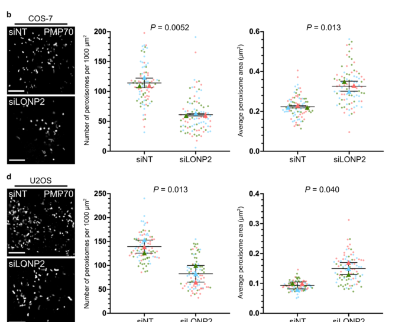

## Question

# Gene Research for Functional Annotation

## ⚠️ CRITICAL: Gene/Protein Identification Context

**BEFORE YOU BEGIN RESEARCH:** You MUST verify you are researching the CORRECT gene/protein. Gene symbols can be ambiguous, especially for less well-characterized genes from non-model organisms.

### Target Gene/Protein Identity (from UniProt):
- **UniProt Accession:** Q86WA8
- **Protein Description:** RecName: Full=Lon protease homolog 2, peroxisomal {ECO:0000255|HAMAP-Rule:MF_03121}; EC=3.4.21.53 {ECO:0000255|HAMAP-Rule:MF_03121}; AltName: Full=Lon protease-like protein 2 {ECO:0000255|HAMAP-Rule:MF_03121}; Short=Lon protease 2 {ECO:0000255|HAMAP-Rule:MF_03121}; AltName: Full=Peroxisomal Lon protease {ECO:0000255|HAMAP-Rule:MF_03121}; Short=pLon {ECO:0000303|PubMed:18281296};
- **Gene Information:** Name=LONP2 {ECO:0000255|HAMAP-Rule:MF_03121}; Synonyms=LONP;
- **Organism (full):** Homo sapiens (Human).
- **Protein Family:** Belongs to the peptidase S16 family. {ECO:0000255|HAMAP-
- **Key Domains:** AAA+_ATPase. (IPR003593); ATPase_AAA_core. (IPR003959); Lon_bac/euk-typ. (IPR004815); Lon_lid. (IPR054594); Lon_proteolytic. (IPR008269)

### MANDATORY VERIFICATION STEPS:

1. **Check if the gene symbol "LONP2" matches the protein description above**
2. **Verify the organism is correct:** Homo sapiens (Human).
3. **Check if protein family/domains align with what you find in literature**
4. **If you find literature for a DIFFERENT gene with the same or similar symbol, STOP**

### If Gene Symbol is Ambiguous or You Cannot Find Relevant Literature:

**DO NOT PROCEED WITH RESEARCH ON A DIFFERENT GENE.** Instead:
- State clearly: "The gene symbol 'LONP2' is ambiguous or literature is limited for this specific protein"
- Explain what you found (e.g., "Found extensive literature on a different gene with the same symbol in a different organism")
- Describe the protein based ONLY on the UniProt information provided above
- Suggest that the protein function can be inferred from domain/family information

### Research Target:

Please provide a comprehensive research report on the gene **LONP2** (gene ID: LONP2, UniProt: Q86WA8) in human.

The research report should be a detailed narrative explaining the function, biological processes, and localization of the gene product. Citations should be given for all claims.

You should prioritize authoritative reviews and primary scientific literature when conducting research. You can supplement
this with annotations you find in gene/protein databases, but these can be outdated or inaccurate.

We are specifically interested in the primary function of the gene - for enzymes, what reaction is catalyzed, and what is the substrate specificity? For transporters, what is the substrate? For structural proteins or adapters, what is the broader structural role? For signaling molecules, what is the role in the pathway.

We are interested in where in or outside the cell the gene product carries out its function.

We are also interested in the signaling or biochemical pathways in which the gene functions. We are less interested in broad pleiotropic effects, except where these elucidate the precise role.

Include evidence where possible. We are interested in both experimental evidence as well as inference from structure, evolution, or bioinformatic analysis. Precise studies should be prioritized over high-throughput, where available.

## Output

Question: You are an expert researcher providing comprehensive, well-cited information.

Provide detailed information focusing on:
1. Key concepts and definitions with current understanding
2. Recent developments and latest research (prioritize 2023-2024 sources)
3. Current applications and real-world implementations
4. Expert opinions and analysis from authoritative sources
5. Relevant statistics and data from recent studies

Format as a comprehensive research report with proper citations. Include URLs and publication dates where available.
Always prioritize recent, authoritative sources and provide specific citations for all major claims.

# Gene Research for Functional Annotation

## ⚠️ CRITICAL: Gene/Protein Identification Context

**BEFORE YOU BEGIN RESEARCH:** You MUST verify you are researching the CORRECT gene/protein. Gene symbols can be ambiguous, especially for less well-characterized genes from non-model organisms.

### Target Gene/Protein Identity (from UniProt):
- **UniProt Accession:** Q86WA8
- **Protein Description:** RecName: Full=Lon protease homolog 2, peroxisomal {ECO:0000255|HAMAP-Rule:MF_03121}; EC=3.4.21.53 {ECO:0000255|HAMAP-Rule:MF_03121}; AltName: Full=Lon protease-like protein 2 {ECO:0000255|HAMAP-Rule:MF_03121}; Short=Lon protease 2 {ECO:0000255|HAMAP-Rule:MF_03121}; AltName: Full=Peroxisomal Lon protease {ECO:0000255|HAMAP-Rule:MF_03121}; Short=pLon {ECO:0000303|PubMed:18281296};
- **Gene Information:** Name=LONP2 {ECO:0000255|HAMAP-Rule:MF_03121}; Synonyms=LONP;
- **Organism (full):** Homo sapiens (Human).
- **Protein Family:** Belongs to the peptidase S16 family. {ECO:0000255|HAMAP-
- **Key Domains:** AAA+_ATPase. (IPR003593); ATPase_AAA_core. (IPR003959); Lon_bac/euk-typ. (IPR004815); Lon_lid. (IPR054594); Lon_proteolytic. (IPR008269)

### MANDATORY VERIFICATION STEPS:

1. **Check if the gene symbol "LONP2" matches the protein description above**
2. **Verify the organism is correct:** Homo sapiens (Human).
3. **Check if protein family/domains align with what you find in literature**
4. **If you find literature for a DIFFERENT gene with the same or similar symbol, STOP**

### If Gene Symbol is Ambiguous or You Cannot Find Relevant Literature:

**DO NOT PROCEED WITH RESEARCH ON A DIFFERENT GENE.** Instead:
- State clearly: "The gene symbol 'LONP2' is ambiguous or literature is limited for this specific protein"
- Explain what you found (e.g., "Found extensive literature on a different gene with the same symbol in a different organism")
- Describe the protein based ONLY on the UniProt information provided above
- Suggest that the protein function can be inferred from domain/family information

### Research Target:

Please provide a comprehensive research report on the gene **LONP2** (gene ID: LONP2, UniProt: Q86WA8) in human.

The research report should be a detailed narrative explaining the function, biological processes, and localization of the gene product. Citations should be given for all claims.

You should prioritize authoritative reviews and primary scientific literature when conducting research. You can supplement
this with annotations you find in gene/protein databases, but these can be outdated or inaccurate.

We are specifically interested in the primary function of the gene - for enzymes, what reaction is catalyzed, and what is the substrate specificity? For transporters, what is the substrate? For structural proteins or adapters, what is the broader structural role? For signaling molecules, what is the role in the pathway.

We are interested in where in or outside the cell the gene product carries out its function.

We are also interested in the signaling or biochemical pathways in which the gene functions. We are less interested in broad pleiotropic effects, except where these elucidate the precise role.

Include evidence where possible. We are interested in both experimental evidence as well as inference from structure, evolution, or bioinformatic analysis. Precise studies should be prioritized over high-throughput, where available.

# Research Report: Human **LONP2** (UniProt **Q86WA8**) — Functional Annotation and Current Evidence

## 1. Target verification (identity, organism, and domain agreement)
The research target **LONP2** (Homo sapiens) corresponds to a **peroxisomal Lon protease** (Lon protease homolog 2), distinct from the mitochondrial paralog **LONP1**. Authoritative synthesis of the field describes human LonP2 as a nuclear-encoded ~**852 aa** (~**95 kDa**) LonA-family protease, with the canonical Lon architecture: an N-terminal substrate-recognition region, an **AAA+ ATPase** domain (Walker motifs), and a C-terminal **serine protease** domain with a catalytic Ser–Lys dyad; the protein is peroxisome-targeted by a **C-terminal PTS1 motif** (reported as **SRL** in humans). (pomatto2017theperoxisomallon pages 4-6)

## 2. Key concepts and definitions (current understanding)

### 2.1 What kind of enzyme is LONP2?
LONP2 is an ATP-dependent Lon-family serine protease (LonA-type), annotated as **EC 3.4.21.53**, meaning it is an endopeptidase using an active-site serine for catalysis and requiring ATP hydrolysis (via its AAA+ module) to unfold and process substrates. Lon-family proteases are frequently described as **protease/chaperone** systems: ATP binding/hydrolysis supports substrate recognition, unfolding, and proteolytic turnover of damaged or misfolded proteins. (pomatto2017theperoxisomallon pages 4-6, yamashita2023depletionoflonp2 pages 1-2)

### 2.2 Peroxisomal protein quality control (PQC)
Peroxisomes import many matrix proteins post-translationally and must remove damaged or dysfunctional proteins to preserve organelle function. A 2023 review of peroxisomal import and quality control emphasizes that **most organisms harbor a peroxisomal LON protease** to degrade misfolded/dysfunctional **peroxisomal matrix proteins**, while peroxisomal membrane protein QC relies heavily on the **ubiquitin–proteasome system (UPS)** and extraction machineries. (rudowitz2023importandquality pages 7-8)

## 3. Subcellular localization and import mechanism

### 3.1 Localization: peroxisomal matrix (core enrichment reported in liver)
LonP2 was originally identified as a peroxisome-specific Lon isoform and localized to peroxisomes in mammalian tissues; expert synthesis reports that it can concentrate in the dense core of rat liver peroxisomes, a highly oxidizing microenvironment. (pomatto2017theperoxisomallon pages 3-4)

### 3.2 Import signal: C-terminal PTS1
LonP2 is targeted to the peroxisomal matrix via a **C-terminal PTS1** motif (reported as **SRL** in human LonP2), consistent with peroxisomal matrix import pathways. (pomatto2017theperoxisomallon pages 4-6)

### 3.3 Recent functional readout of matrix import failure upon LONP2 depletion (2023)
In mammalian cells, **LONP2 silencing** causes failure of matrix import for a canonical luminal reporter (**CFP-SKL**, a PTS1-containing protein), while import of a membrane marker (**PEX3-YFP**) is maintained, consistent with selective impairment of matrix/lumenal proteostasis and/or import competency rather than generalized peroxisome biogenesis collapse. (yamashita2023depletionoflonp2 pages 2-5)

Figure-based evidence from the 2023 Biology Direct study visually shows **diffuse CFP-SKL** (loss of punctate peroxisomal localization) after LONP2 knockdown, and quantifies associated peroxisome morphological changes. (yamashita2023depletionoflonp2 media 013dcd11)

## 4. Primary molecular function: enzymatic activity and substrate specificity

### 4.1 Biochemical activity (ATP-stimulated proteolysis)
Authoritative review of biochemical work indicates purified LonP2 is an **ATPase** and an **ATP-stimulated protease**: it degrades model misfolded substrates such as **α- and β-casein** in vitro **only in the presence of ATP**, and catalytic-serine mutation abolishes proteolysis. This supports a classical Lon mechanism coupling AAA+ ATPase activity to proteolysis. (pomatto2017theperoxisomallon pages 4-6)

### 4.2 Substrate classes and specificity (oxidation/misfolding; pathway-linked substrates)
Current evidence supports two major substrate categories:

1. **Oxidatively damaged/misfolded peroxisomal proteins.** Expert synthesis describes LonP2 as important in clearing oxidatively damaged proteins generated in the ROS-rich peroxisomal environment. Oxidation can convert otherwise resistant proteins into LonP2 substrates; one example discussed is that catalase becomes susceptible to LonP2-dependent degradation after oxidative pretreatment. (pomatto2017theperoxisomallon pages 7-8)

2. **Regulatory protease TYSND1 (turnover of cleavage products).** A key primary substrate relationship is that **TYSND1 self-cleaves into smaller chains** that are subsequently degraded by **peroxisomal Lon protease (PsLon/LONP2)**. This positions LONP2 as a regulator of peroxisomal protease homeostasis and indirectly links it to maturation/processing of β-oxidation enzymes that are TYSND1 substrates. (okumoto2011twoproteasestrypsin pages 1-2, okumoto2011twoproteasestrypsin pages 2-3)

### 4.3 Impact on peroxisomal fatty-acid β-oxidation (functional coupling)
In a primary study of peroxisomal proteases, knockdown of **TYSND1** significantly reduced peroxisomal β-oxidation of a very-long-chain fatty acid, and knockdown of **PsLon/LONP2** partially lowered β-oxidation, consistent with a modulatory role for LONP2 in maintaining the peroxisomal enzyme environment required for efficient β-oxidation. The assay used **1-14C-labeled lignoceric acid** in HeLa cells and quantified acid-soluble products. (okumoto2011twoproteasestrypsin pages 3-4, okumoto2011twoproteasestrypsin pages 1-2)

## 5. Biological roles and pathways (mechanistic interpretation)

### 5.1 LONP2 as a peroxisomal proteostasis “protease/chaperone”
A 2023 primary study frames LONP2 as a peroxisomal **protease/chaperone** and demonstrates that acute LONP2 silencing triggers “early” peroxisomal proteotoxic stress: accumulation of the reported substrate **TYSND1** occurs while some downstream TYSND1-dependent processing (e.g., ACOX1 processing) appears initially preserved, suggesting LONP2 loss first perturbs matrix proteostasis and organelle competence before large-scale loss of peroxisomal proteins. (yamashita2023depletionoflonp2 pages 1-2, yamashita2023depletionoflonp2 pages 2-5)

### 5.2 Peroxisome morphology, number, and matrix import competency
Upon LONP2 depletion, peroxisomes become fewer and enlarged/elongated, and matrix import fails for a luminal reporter, establishing LONP2 as a determinant of peroxisome structural/functional homeostasis. (yamashita2023depletionoflonp2 pages 2-5, yamashita2023depletionoflonp2 media 013dcd11)

### 5.3 Cell-type-specific stress signaling and lipid/cholesterol remodeling (2023)
Acute LONP2 silencing reveals organelle-to-cell signaling outputs:
- In COS-7 cells, LONP2 depletion strongly activates the **integrated stress response (ISR)**, with induction of associated stress programs. (yamashita2023depletionoflonp2 pages 1-2)
- In both COS-7 and U2OS cells, common responses include repression of **retinoic acid signaling**, increased sphingolipids, and **cholesterol accumulation in endomembrane compartments**, consistent with peroxisome contributions to cholesterol flux out of late endosomes. (yamashita2023depletionoflonp2 pages 1-2)

The associated lipidomics dataset reported **2,094 lipid features** detected and **206 annotated** (n=5 independent experiments), grounding these pathway links in broad quantitative lipid remodeling. (yamashita2023depletionoflonp2 pages 9-11)

### 5.4 Relationship to pexophagy and peroxisome quality-control circuits
Peroxisome QC can engage autophagic turnover (pexophagy) when import is impaired or peroxisomes are damaged. Mechanistic context highlights sentinel roles of peroxisome import machinery (e.g., PEX2-mediated ubiquitination recruiting p62/NBR1) in targeting peroxisomes for pexophagy when import is compromised; LONP2 depletion is proposed as a useful perturbation to probe how matrix proteotoxicity couples to import stress and turnover pathways. (yamashita2023elucidatingmechanismof pages 27-33)

Notably, in the 2023 LONP2 knockdown experiments, there was **no evidence of induced pexophagy** under the tested conditions (no increase in LC3/p62 colocalization with peroxisomes), indicating that LONP2-dependent proteotoxic stress can manifest without necessarily triggering bulk pexophagy in the acute setting. (yamashita2023depletionoflonp2 pages 2-5)

## 6. Recent developments (prioritizing 2023–2024)

### 6.1 2023: Import and quality control review updates
A 2023 Journal of Cell Science review synthesizes updated models of peroxisomal protein import and QC and reiterates that peroxisomal matrix protein QC commonly depends on a peroxisomal LON protease, placing LONP2 within a conserved QC module across eukaryotes. (rudowitz2023importandquality pages 7-8)

### 6.2 2023: New experimental evidence linking LONP2 to cholesterol trafficking and RA signaling
The 2023 Biology Direct study provides a direct experimental perturbation of LONP2 showing connections to cholesterol trafficking defects (cholesterol trapped in endomembranes) and repression of retinoic acid signaling, suggesting that peroxisomal proteostasis can influence broader lipid signaling programs and sterol flux. (yamashita2023depletionoflonp2 pages 1-2, yamashita2023depletionoflonp2 pages 9-11)

### 6.3 2023: Community/expert synthesis emphasizes variable cellular responses and cholesterol phenotypes
A 2023 peroxisome meeting report highlights that LONP2 silencing yields ubiquitous peroxisomal phenotypes across cell types but with variable magnitude of global cellular stress responses, and it emphasizes blocked cholesterol flux between lysosomes and ER with lysosomal cholesteryl ester accumulation. (pedrosa2023peroxisomesnovel pages 7-8)

### 6.4 2024: Peroxisome homeostasis/turnover mechanisms continue to be mapped
A 2024 Nature Communications study on basal pexophagy and peroxisome membrane protein turnover places peroxisomal matrix QC components (including PsLon/LONP2 and TYSND1) within the broader network maintaining peroxisomal integrity, reinforcing that peroxisome homeostasis integrates matrix proteostasis with membrane-protein turnover and autophagy regulation. (OpenTargets Search: -LONP2)

## 7. Current applications and real-world implementations

### 7.1 Experimental implementation as a peroxisomal proteotoxic-stress model
LONP2 depletion has emerged as an experimentally tractable means to induce **peroxisomal proteotoxic stress** and study downstream consequences, including matrix import defects, peroxisome remodeling, ISR engagement (cell-type dependent), and cholesterol trafficking abnormalities. This provides a functional model system for dissecting peroxisome–endomembrane communication and stress signaling. (yamashita2023depletionoflonp2 pages 1-2, yamashita2023depletionoflonp2 pages 2-5, yamashita2023depletionoflonp2 media 013dcd11)

### 7.2 Disease association resources (database-driven; caution on causality)
Open Targets lists disease associations for **LONP2** (ENSG00000102910), including terms such as **Buratti–Harel syndrome**, neurodevelopmental disorder, gestational diabetes, neurodegenerative disease, and esophageal disease, with linked literature evidence (e.g., PMID 32430360). These should be treated as **association evidence** rather than definitive mechanistic proof of causality for LONP2, pending focused experimental/clinical studies. (OpenTargets Search: -LONP2)

## 8. Expert opinion and analysis (authoritative perspectives)
A domain-leading review emphasizes that, relative to LONP1, **LonP2/LONP2 remains less well characterized** in mechanistic and clinical terms, despite strong evidence for a core role in peroxisomal proteostasis. It highlights multiple open questions: how LonP2 selects substrates in vivo, how ATP hydrolysis is coupled to unfolding/proteolysis in peroxisomes, and how LonP2-mediated proteostasis intersects with organelle turnover pathways and organismal aging/disease. (pomatto2017theperoxisomallon pages 1-2, pomatto2017theperoxisomallon pages 4-6)

## 9. Quantitative highlights from recent and foundational studies
- **Peroxisome morphology/import (2023):** LONP2 knockdown decreases peroxisome number and increases peroxisome size, while causing loss of punctate peroxisomal localization of a **CFP-SKL** luminal reporter (quantified and imaged in Fig. 1). (yamashita2023depletionoflonp2 media 013dcd11)
- **Lipidomics scale (2023):** **2,094** lipid features detected and **206** annotated in the LONP2 depletion study (n=5). (yamashita2023depletionoflonp2 pages 9-11)
- **Cholesterol phenotype rescue timing (2023):** cholesterol clearance phenotype was reported to be rescued after **48 h** of transient expression of siRNA-resistant LONP2 cDNA. (yamashita2023depletionoflonp2 pages 9-11)
- **ROS context (reviewed values):** peroxisomal H2O2 production rates were summarized as ~**44–172 nmol·min−1·g−1 protein**, with ~30% diffusion to cytosol (~**13.2–51.6 nmol·min−1·g−1 protein**); and **100 μM H2O2** was reported to cause ~**40%** loss of catalase function (context for oxidative substrate generation relevant to LonP2 substrate selection). (pomatto2017theperoxisomallon pages 7-8)

## 10. Consolidated evidence map
The following table summarizes the strongest evidence-supported claims about LONP2/Q86WA8 across identity, localization, enzymatic function, substrates, pathway roles, and disease association context.

| Category | Key claims | Evidence type (review/primary/DB) | Key citations (context IDs) | Source (paper title, year, DOI URL) |
|---|---|---|---|---|
| Identity/domains | Human **LONP2** corresponds to UniProt **Q86WA8**, a nuclear-encoded peroxisomal Lon A family protease of ~852 aa/~95 kDa with N-terminal substrate-recognition region, **AAA+ ATPase** domain (Walker motifs), serine protease domain, and C-terminal **PTS1/SRL** targeting motif; it shares ~39.6% identity with mitochondrial LONP1. | Review | (pomatto2017theperoxisomallon pages 4-6) | *The peroxisomal Lon protease LonP2 in aging and disease: functions and comparisons with mitochondrial Lon protease LonP1* (2017), https://doi.org/10.1111/brv.12253 |
| Localization/import | LONP2 is localized to the **peroxisomal matrix** and imported via a **C-terminal PTS1** recognized by the peroxisomal import machinery; mammalian studies localized LonP2 to peroxisomes, with enrichment in the dense core of rat liver peroxisomes. | Review | (pomatto2017theperoxisomallon pages 3-4, pomatto2017theperoxisomallon pages 4-6) | *The peroxisomal Lon protease LonP2 in aging and disease: functions and comparisons with mitochondrial Lon protease LonP1* (2017), https://doi.org/10.1111/brv.12253 |
| Localization/import | In LONP2-silenced cells, import of a luminal **CFP-SKL** reporter fails while membrane import (**PEX3-YFP**) remains intact, indicating a selective defect in matrix/lumenal protein homeostasis rather than membrane protein targeting. | Primary | (yamashita2023depletionoflonp2 pages 2-5, yamashita2023depletionoflonp2 media 013dcd11) | *Depletion of LONP2 unmasks differential requirements for peroxisomal function between cell types and in cholesterol metabolism* (2023), https://doi.org/10.1186/s13062-023-00416-3 |
| Enzymatic activity | LONP2 is an **ATPase** and **ATP-stimulated serine protease** (EC 3.4.21.53); purified LonP2 degrades misfolded **α- and β-casein** in vitro in an ATP-dependent manner, and catalytic-serine mutation abolishes proteolysis. | Review summarizing primary biochemistry | (pomatto2017theperoxisomallon pages 4-6) | *The peroxisomal Lon protease LonP2 in aging and disease: functions and comparisons with mitochondrial Lon protease LonP1* (2017), https://doi.org/10.1111/brv.12253 |
| Enzymatic activity | Human/vertebrate peroxisomal Lon protease architecture includes **AAA ATPase** and serine protease domains; protease-inactive mutant **Ser743Ala** was used to probe function in cells. | Primary | (okumoto2011twoproteasestrypsin pages 2-3, okumoto2011twoproteasestrypsin pages 4-5) | *Two Proteases, Trypsin Domain-containing 1 (Tysnd1) and Peroxisomal Lon Protease (PsLon), Cooperatively Regulate Fatty Acid β-Oxidation in Peroxisomal Matrix* (2011), https://doi.org/10.1074/jbc.m111.285197 |
| Substrates | A supported substrate relationship is **TYSND1 → LONP2**: TYSND1 self-cleaves into 15- and 45-kDa fragments, and these processed forms are degraded by peroxisomal Lon/PsLon. | Primary | (okumoto2011twoproteasestrypsin pages 1-2, okumoto2011twoproteasestrypsin pages 2-3) | *Two Proteases, Trypsin Domain-containing 1 (Tysnd1) and Peroxisomal Lon Protease (PsLon), Cooperatively Regulate Fatty Acid β-Oxidation in Peroxisomal Matrix* (2011), https://doi.org/10.1074/jbc.m111.285197 |
| Substrates | LONP2 also preferentially removes **oxidatively damaged/misfolded proteins**; oxidized catalase becomes susceptible to LonP2-dependent degradation, whereas native catalase is resistant. | Review summarizing primary biochemistry | (pomatto2017theperoxisomallon pages 7-8, pomatto2017theperoxisomallon pages 1-2) | *The peroxisomal Lon protease LonP2 in aging and disease: functions and comparisons with mitochondrial Lon protease LonP1* (2017), https://doi.org/10.1111/brv.12253 |
| Cellular pathways/phenotypes | Acute LONP2 depletion triggers **peroxisomal proteotoxic stress**, causing accumulation of TYSND1, **fewer and enlarged/elongated peroxisomes**, and failure of luminal import while many steady-state peroxisomal protein levels remain initially preserved. | Primary | (yamashita2023depletionoflonp2 pages 1-2, yamashita2023depletionoflonp2 pages 2-5, yamashita2023depletionoflonp2 media 013dcd11) | *Depletion of LONP2 unmasks differential requirements for peroxisomal function between cell types and in cholesterol metabolism* (2023), https://doi.org/10.1186/s13062-023-00416-3 |
| Cellular pathways/phenotypes | LONP2 loss reveals cell-type-specific signaling responses: strong **integrated stress response (ISR)** activation in COS-7 cells, plus shared **retinoic acid signaling repression**, **sphingolipid upregulation**, and **cholesterol accumulation in endomembrane compartments** in both COS-7 and U2OS cells. | Primary | (yamashita2023depletionoflonp2 pages 1-2, yamashita2023depletionoflonp2 pages 9-11) | *Depletion of LONP2 unmasks differential requirements for peroxisomal function between cell types and in cholesterol metabolism* (2023), https://doi.org/10.1186/s13062-023-00416-3 |
| Cellular pathways/phenotypes | The 2023 lipidomics dataset comprised **2,094 lipid features** with **206 annotated**, supporting links between LONP2 deficiency, altered very-long-chain lipid handling, sphingomyelin remodeling, and cholesterol trafficking defects. | Primary | (yamashita2023depletionoflonp2 pages 9-11) | *Depletion of LONP2 unmasks differential requirements for peroxisomal function between cell types and in cholesterol metabolism* (2023), https://doi.org/10.1186/s13062-023-00416-3 |
| Cellular pathways/phenotypes | In the Okumoto study, peroxisomal β-oxidation of **1-14C-lignoceric acid** was significantly decreased after **TYSND1** knockdown and partially reduced after **PsLon/LONP2** knockdown, supporting a modulatory role in peroxisomal fatty-acid β-oxidation. | Primary | (okumoto2011twoproteasestrypsin pages 3-4, okumoto2011twoproteasestrypsin pages 1-2) | *Two Proteases, Trypsin Domain-containing 1 (Tysnd1) and Peroxisomal Lon Protease (PsLon), Cooperatively Regulate Fatty Acid β-Oxidation in Peroxisomal Matrix* (2011), https://doi.org/10.1074/jbc.m111.285197 |
| Cellular pathways/phenotypes | General peroxisomal QC context: most organisms use a **peroxisomal LON protease** to degrade misfolded/dysfunctional matrix proteins, while membrane-protein QC relies mainly on the **ubiquitin–proteasome system**. | Review | (rudowitz2023importandquality pages 7-8) | *Import and quality control of peroxisomal proteins* (2023), https://doi.org/10.1242/jcs.260999 |
| Disease links | Direct human disease mechanism data remain limited, but authoritative databases list **LONP2** associations including **Buratti-Harel syndrome** and other disease terms; these database links appear to be driven by shared evidence and should be interpreted cautiously pending dedicated functional validation. | DB | (OpenTargets Search: -LONP2) | Open Targets LONP2 associations (accessed via Open Targets context), evidence linked to PMID 32430360 |
| Disease links | Expert reviews emphasize that, compared with LONP1, **much less is known** about LONP2 in human aging and disease, and mechanistic/clinical studies are still sparse. | Review/expert analysis | (pomatto2017theperoxisomallon pages 1-2, pomatto2017theperoxisomallon pages 4-6) | *The peroxisomal Lon protease LonP2 in aging and disease: functions and comparisons with mitochondrial Lon protease LonP1* (2017), https://doi.org/10.1111/brv.12253 |

*Table: This table condenses the strongest gathered evidence on human LONP2/Q86WA8, covering verified identity, localization, enzymatic function, substrates, pathway roles, and disease evidence. It is designed as a citation-ready scaffold for the final research report.*

## 11. Key references (with publication dates and URLs)
- Yamashita A. *et al.* (2023-09). **Depletion of LONP2 unmasks differential requirements for peroxisomal function between cell types and in cholesterol metabolism.** *Biology Direct.* https://doi.org/10.1186/s13062-023-00416-3 (yamashita2023depletionoflonp2 pages 1-2, yamashita2023depletionoflonp2 pages 2-5, yamashita2023depletionoflonp2 pages 9-11, yamashita2023depletionoflonp2 media 013dcd11)
- Rudowitz M, Erdmann R. (2023-08). **Import and quality control of peroxisomal proteins.** *Journal of Cell Science.* https://doi.org/10.1242/jcs.260999 (rudowitz2023importandquality pages 7-8)
- Pedrosa AG. *et al.* (2023-05). **Peroxisomes: novel findings and future directions.** *Histochemistry and Cell Biology.* https://doi.org/10.1007/s00418-023-02201-9 (pedrosa2023peroxisomesnovel pages 7-8)
- Okumoto K, Kametani Y, Fujiki Y. (2011-12). **Two Proteases, Tysnd1 and Peroxisomal Lon Protease (PsLon), Cooperatively Regulate Fatty Acid β-Oxidation in Peroxisomal Matrix.** *J Biol Chem.* https://doi.org/10.1074/jbc.m111.285197 (okumoto2011twoproteasestrypsin pages 1-2, okumoto2011twoproteasestrypsin pages 2-3)
- Pomatto LCD, Raynes R, Davies KJA. (2017-05). **The peroxisomal Lon protease LonP2 in aging and disease: functions and comparisons with mitochondrial Lon protease LonP1.** *Biological Reviews.* https://doi.org/10.1111/brv.12253 (pomatto2017theperoxisomallon pages 4-6)
- Open Targets Platform (accessed via tool context). **LONP2 disease associations** (evidence linked to PMID 32430360). https://platform.opentargets.org/target/ENSG00000102910 (OpenTargets Search: -LONP2)

References

1. (pomatto2017theperoxisomallon pages 4-6): Laura C. D. Pomatto, Rachel Raynes, and Kelvin J. A. Davies. The peroxisomal lon protease lonp2 in aging and disease: functions and comparisons with mitochondrial lon protease lonp1. Biological Reviews, 92:739-753, May 2017. URL: https://doi.org/10.1111/brv.12253, doi:10.1111/brv.12253. This article has 56 citations and is from a domain leading peer-reviewed journal.

2. (yamashita2023depletionoflonp2 pages 1-2): Akihiro Yamashita, Olesia Ignatenko, Mai Nguyen, Raphaëlle Lambert, Kathleen Watt, Caroline Daneault, Isabelle Robillard-Frayne, Ivan Topisirovic, Christine Des Rosiers, and Heidi M. McBride. Depletion of lonp2 unmasks differential requirements for peroxisomal function between cell types and in cholesterol metabolism. Biology Direct, Sep 2023. URL: https://doi.org/10.1186/s13062-023-00416-3, doi:10.1186/s13062-023-00416-3. This article has 3 citations and is from a peer-reviewed journal.

3. (rudowitz2023importandquality pages 7-8): Markus Rudowitz and Ralf Erdmann. Import and quality control of peroxisomal proteins. Journal of cell science, Aug 2023. URL: https://doi.org/10.1242/jcs.260999, doi:10.1242/jcs.260999. This article has 21 citations and is from a domain leading peer-reviewed journal.

4. (pomatto2017theperoxisomallon pages 3-4): Laura C. D. Pomatto, Rachel Raynes, and Kelvin J. A. Davies. The peroxisomal lon protease lonp2 in aging and disease: functions and comparisons with mitochondrial lon protease lonp1. Biological Reviews, 92:739-753, May 2017. URL: https://doi.org/10.1111/brv.12253, doi:10.1111/brv.12253. This article has 56 citations and is from a domain leading peer-reviewed journal.

5. (yamashita2023depletionoflonp2 pages 2-5): Akihiro Yamashita, Olesia Ignatenko, Mai Nguyen, Raphaëlle Lambert, Kathleen Watt, Caroline Daneault, Isabelle Robillard-Frayne, Ivan Topisirovic, Christine Des Rosiers, and Heidi M. McBride. Depletion of lonp2 unmasks differential requirements for peroxisomal function between cell types and in cholesterol metabolism. Biology Direct, Sep 2023. URL: https://doi.org/10.1186/s13062-023-00416-3, doi:10.1186/s13062-023-00416-3. This article has 3 citations and is from a peer-reviewed journal.

6. (yamashita2023depletionoflonp2 media 013dcd11): Akihiro Yamashita, Olesia Ignatenko, Mai Nguyen, Raphaëlle Lambert, Kathleen Watt, Caroline Daneault, Isabelle Robillard-Frayne, Ivan Topisirovic, Christine Des Rosiers, and Heidi M. McBride. Depletion of lonp2 unmasks differential requirements for peroxisomal function between cell types and in cholesterol metabolism. Biology Direct, Sep 2023. URL: https://doi.org/10.1186/s13062-023-00416-3, doi:10.1186/s13062-023-00416-3. This article has 3 citations and is from a peer-reviewed journal.

7. (pomatto2017theperoxisomallon pages 7-8): Laura C. D. Pomatto, Rachel Raynes, and Kelvin J. A. Davies. The peroxisomal lon protease lonp2 in aging and disease: functions and comparisons with mitochondrial lon protease lonp1. Biological Reviews, 92:739-753, May 2017. URL: https://doi.org/10.1111/brv.12253, doi:10.1111/brv.12253. This article has 56 citations and is from a domain leading peer-reviewed journal.

8. (okumoto2011twoproteasestrypsin pages 1-2): Kanji Okumoto, Yukari Kametani, and Yukio Fujiki. Two proteases, trypsin domain-containing 1 (tysnd1) and peroxisomal lon protease (pslon), cooperatively regulate fatty acid β-oxidation in peroxisomal matrix. Journal of Biological Chemistry, 286:44367-44379, Dec 2011. URL: https://doi.org/10.1074/jbc.m111.285197, doi:10.1074/jbc.m111.285197. This article has 67 citations and is from a domain leading peer-reviewed journal.

9. (okumoto2011twoproteasestrypsin pages 2-3): Kanji Okumoto, Yukari Kametani, and Yukio Fujiki. Two proteases, trypsin domain-containing 1 (tysnd1) and peroxisomal lon protease (pslon), cooperatively regulate fatty acid β-oxidation in peroxisomal matrix. Journal of Biological Chemistry, 286:44367-44379, Dec 2011. URL: https://doi.org/10.1074/jbc.m111.285197, doi:10.1074/jbc.m111.285197. This article has 67 citations and is from a domain leading peer-reviewed journal.

10. (okumoto2011twoproteasestrypsin pages 3-4): Kanji Okumoto, Yukari Kametani, and Yukio Fujiki. Two proteases, trypsin domain-containing 1 (tysnd1) and peroxisomal lon protease (pslon), cooperatively regulate fatty acid β-oxidation in peroxisomal matrix. Journal of Biological Chemistry, 286:44367-44379, Dec 2011. URL: https://doi.org/10.1074/jbc.m111.285197, doi:10.1074/jbc.m111.285197. This article has 67 citations and is from a domain leading peer-reviewed journal.

11. (yamashita2023depletionoflonp2 pages 9-11): Akihiro Yamashita, Olesia Ignatenko, Mai Nguyen, Raphaëlle Lambert, Kathleen Watt, Caroline Daneault, Isabelle Robillard-Frayne, Ivan Topisirovic, Christine Des Rosiers, and Heidi M. McBride. Depletion of lonp2 unmasks differential requirements for peroxisomal function between cell types and in cholesterol metabolism. Biology Direct, Sep 2023. URL: https://doi.org/10.1186/s13062-023-00416-3, doi:10.1186/s13062-023-00416-3. This article has 3 citations and is from a peer-reviewed journal.

12. (yamashita2023elucidatingmechanismof pages 27-33): A Yamashita. Elucidating mechanism of peroxisomal homeostasis in mammalian cells. Unknown journal, 2023.

13. (pedrosa2023peroxisomesnovel pages 7-8): Ana G. Pedrosa, Katharina Reglinski, Celien Lismont, Suzan Kors, Joseph Costello, Tony A. Rodrigues, Mariana Marques, Nicole Linka, Catherine Argyriou, Isabelle Weinhofer, Sai Kocherlakota, Victoria Riccio, Vanessa Ferreira, Francesca Di Cara, Ana Rita Ferreira, Tânia Francisco, Jorge E. Azevedo, and Daniela Ribeiro. Peroxisomes : novel findings and future directions. Histochemistry and Cell Biology, 159:379-387, May 2023. URL: https://doi.org/10.1007/s00418-023-02201-9, doi:10.1007/s00418-023-02201-9. This article has 3 citations and is from a peer-reviewed journal.

14. (OpenTargets Search: -LONP2): Open Targets Query (-LONP2, 5 results). Buniello, A. et al. (2025). Open Targets Platform: facilitating therapeutic hypotheses building in drug discovery. Nucleic Acids Research.

15. (pomatto2017theperoxisomallon pages 1-2): Laura C. D. Pomatto, Rachel Raynes, and Kelvin J. A. Davies. The peroxisomal lon protease lonp2 in aging and disease: functions and comparisons with mitochondrial lon protease lonp1. Biological Reviews, 92:739-753, May 2017. URL: https://doi.org/10.1111/brv.12253, doi:10.1111/brv.12253. This article has 56 citations and is from a domain leading peer-reviewed journal.

16. (okumoto2011twoproteasestrypsin pages 4-5): Kanji Okumoto, Yukari Kametani, and Yukio Fujiki. Two proteases, trypsin domain-containing 1 (tysnd1) and peroxisomal lon protease (pslon), cooperatively regulate fatty acid β-oxidation in peroxisomal matrix. Journal of Biological Chemistry, 286:44367-44379, Dec 2011. URL: https://doi.org/10.1074/jbc.m111.285197, doi:10.1074/jbc.m111.285197. This article has 67 citations and is from a domain leading peer-reviewed journal.

## Artifacts

- [Edison artifact artifact-00](LONP2-deep-research-falcon_artifacts/artifact-00.md)

## Citations

1. pomatto2017theperoxisomallon pages 4-6
2. rudowitz2023importandquality pages 7-8
3. pomatto2017theperoxisomallon pages 3-4
4. pomatto2017theperoxisomallon pages 7-8
5. yamashita2023elucidatingmechanismof pages 27-33
6. pedrosa2023peroxisomesnovel pages 7-8
7. okumoto2011twoproteasestrypsin pages 1-2
8. okumoto2011twoproteasestrypsin pages 2-3
9. okumoto2011twoproteasestrypsin pages 3-4
10. pomatto2017theperoxisomallon pages 1-2
11. okumoto2011twoproteasestrypsin pages 4-5
12. https://doi.org/10.1111/brv.12253
13. https://doi.org/10.1186/s13062-023-00416-3
14. https://doi.org/10.1074/jbc.m111.285197
15. https://doi.org/10.1242/jcs.260999
16. https://doi.org/10.1007/s00418-023-02201-9
17. https://platform.opentargets.org/target/ENSG00000102910
18. https://doi.org/10.1111/brv.12253,
19. https://doi.org/10.1186/s13062-023-00416-3,
20. https://doi.org/10.1242/jcs.260999,
21. https://doi.org/10.1074/jbc.m111.285197,
22. https://doi.org/10.1007/s00418-023-02201-9,