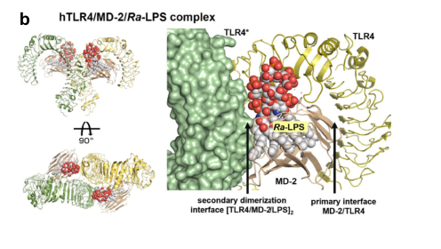
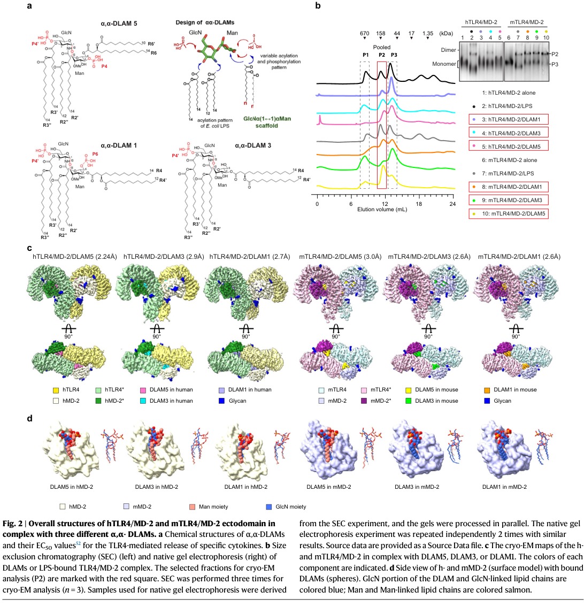

## Question

# Gene Research for Functional Annotation

## ⚠️ CRITICAL: Gene/Protein Identification Context

**BEFORE YOU BEGIN RESEARCH:** You MUST verify you are researching the CORRECT gene/protein. Gene symbols can be ambiguous, especially for less well-characterized genes from non-model organisms.

### Target Gene/Protein Identity (from UniProt):
- **UniProt Accession:** Q9Y6Y9
- **Protein Description:** RecName: Full=Lymphocyte antigen 96; Short=Ly-96; AltName: Full=ESOP-1 {ECO:0000303|PubMed:10891475}; AltName: Full=Protein MD-2 {ECO:0000303|PubMed:10359581}; Flags: Precursor;
- **Gene Information:** Name=LY96; Synonyms=ESOP1, MD2;
- **Organism (full):** Homo sapiens (Human).
- **Protein Family:** Not specified in UniProt
- **Key Domains:** Ig_E-set. (IPR014756); LY96. (IPR039217); ML_dom. (IPR003172); E1_DerP2_DerF2 (PF02221)

### MANDATORY VERIFICATION STEPS:

1. **Check if the gene symbol "LY96" matches the protein description above**
2. **Verify the organism is correct:** Homo sapiens (Human).
3. **Check if protein family/domains align with what you find in literature**
4. **If you find literature for a DIFFERENT gene with the same or similar symbol, STOP**

### If Gene Symbol is Ambiguous or You Cannot Find Relevant Literature:

**DO NOT PROCEED WITH RESEARCH ON A DIFFERENT GENE.** Instead:
- State clearly: "The gene symbol 'LY96' is ambiguous or literature is limited for this specific protein"
- Explain what you found (e.g., "Found extensive literature on a different gene with the same symbol in a different organism")
- Describe the protein based ONLY on the UniProt information provided above
- Suggest that the protein function can be inferred from domain/family information

### Research Target:

Please provide a comprehensive research report on the gene **LY96** (gene ID: LY96, UniProt: Q9Y6Y9) in human.

The research report should be a detailed narrative explaining the function, biological processes, and localization of the gene product. Citations should be given for all claims.

You should prioritize authoritative reviews and primary scientific literature when conducting research. You can supplement
this with annotations you find in gene/protein databases, but these can be outdated or inaccurate.

We are specifically interested in the primary function of the gene - for enzymes, what reaction is catalyzed, and what is the substrate specificity? For transporters, what is the substrate? For structural proteins or adapters, what is the broader structural role? For signaling molecules, what is the role in the pathway.

We are interested in where in or outside the cell the gene product carries out its function.

We are also interested in the signaling or biochemical pathways in which the gene functions. We are less interested in broad pleiotropic effects, except where these elucidate the precise role.

Include evidence where possible. We are interested in both experimental evidence as well as inference from structure, evolution, or bioinformatic analysis. Precise studies should be prioritized over high-throughput, where available.

## Output

Question: You are an expert researcher providing comprehensive, well-cited information.

Provide detailed information focusing on:
1. Key concepts and definitions with current understanding
2. Recent developments and latest research (prioritize 2023-2024 sources)
3. Current applications and real-world implementations
4. Expert opinions and analysis from authoritative sources
5. Relevant statistics and data from recent studies

Format as a comprehensive research report with proper citations. Include URLs and publication dates where available.
Always prioritize recent, authoritative sources and provide specific citations for all major claims.

# Gene Research for Functional Annotation

## ⚠️ CRITICAL: Gene/Protein Identification Context

**BEFORE YOU BEGIN RESEARCH:** You MUST verify you are researching the CORRECT gene/protein. Gene symbols can be ambiguous, especially for less well-characterized genes from non-model organisms.

### Target Gene/Protein Identity (from UniProt):
- **UniProt Accession:** Q9Y6Y9
- **Protein Description:** RecName: Full=Lymphocyte antigen 96; Short=Ly-96; AltName: Full=ESOP-1 {ECO:0000303|PubMed:10891475}; AltName: Full=Protein MD-2 {ECO:0000303|PubMed:10359581}; Flags: Precursor;
- **Gene Information:** Name=LY96; Synonyms=ESOP1, MD2;
- **Organism (full):** Homo sapiens (Human).
- **Protein Family:** Not specified in UniProt
- **Key Domains:** Ig_E-set. (IPR014756); LY96. (IPR039217); ML_dom. (IPR003172); E1_DerP2_DerF2 (PF02221)

### MANDATORY VERIFICATION STEPS:

1. **Check if the gene symbol "LY96" matches the protein description above**
2. **Verify the organism is correct:** Homo sapiens (Human).
3. **Check if protein family/domains align with what you find in literature**
4. **If you find literature for a DIFFERENT gene with the same or similar symbol, STOP**

### If Gene Symbol is Ambiguous or You Cannot Find Relevant Literature:

**DO NOT PROCEED WITH RESEARCH ON A DIFFERENT GENE.** Instead:
- State clearly: "The gene symbol 'LY96' is ambiguous or literature is limited for this specific protein"
- Explain what you found (e.g., "Found extensive literature on a different gene with the same symbol in a different organism")
- Describe the protein based ONLY on the UniProt information provided above
- Suggest that the protein function can be inferred from domain/family information

### Research Target:

Please provide a comprehensive research report on the gene **LY96** (gene ID: LY96, UniProt: Q9Y6Y9) in human.

The research report should be a detailed narrative explaining the function, biological processes, and localization of the gene product. Citations should be given for all claims.

You should prioritize authoritative reviews and primary scientific literature when conducting research. You can supplement
this with annotations you find in gene/protein databases, but these can be outdated or inaccurate.

We are specifically interested in the primary function of the gene - for enzymes, what reaction is catalyzed, and what is the substrate specificity? For transporters, what is the substrate? For structural proteins or adapters, what is the broader structural role? For signaling molecules, what is the role in the pathway.

We are interested in where in or outside the cell the gene product carries out its function.

We are also interested in the signaling or biochemical pathways in which the gene functions. We are less interested in broad pleiotropic effects, except where these elucidate the precise role.

Include evidence where possible. We are interested in both experimental evidence as well as inference from structure, evolution, or bioinformatic analysis. Precise studies should be prioritized over high-throughput, where available.

# Comprehensive Research Report: LY96 Gene (MD-2 Protein) - Functional Annotation

## Gene Identity Confirmation

The human **LY96** gene (UniProt Q9Y6Y9) encodes **Myeloid Differentiation factor-2 (MD-2)**, also known as Lymphocyte antigen 96 or ESOP-1. The protein is a critical component of the innate immune system that serves as the essential lipopolysaccharide (LPS)-binding co-receptor for Toll-like receptor 4 (TLR4) (kircheis2022couldalower pages 20-21, luo2025anexaminationof pages 2-4). The gene annotation from UniProt is consistent with extensive literature characterization: MD-2 is a secreted glycoprotein with domains including Ig_E-set, ML_dom, and E1_DerP2_DerF2, confirming its identity as a lipid-recognition protein (kircheis2022couldalower pages 20-21, gangloff2025elucidationofthe pages 16-22).

## Primary Function and Molecular Mechanism

### Core Function: LPS-Binding Co-Receptor

MD-2 functions as the **principal ligand-binding component** of the TLR4 innate immune receptor complex, not as a catalytic enzyme or intracellular signaling adaptor (kircheis2022couldalower pages 20-21, gangloff2025elucidationofthe pages 16-22). Its primary substrate is bacterial lipopolysaccharide (LPS), specifically the **lipid A** moiety from Gram-negative bacteria (fu2025structuralinsightinto pages 1-2, gauthier2022lipopolysaccharidedetectionby pages 2-3). MD-2 is absolutely required for TLR4 to respond to LPS; no physiological TLR4 role has been demonstrated in the absence of MD-2 (bezhaeva2022theintriguingrole pages 5-6).

### Substrate Recognition and Specificity

The substrate specificity of MD-2 is highly selective for lipid A-like structures. Recognition involves:

1. **Hydrophobic acyl chains**: MD-2 preferentially binds hexa-acylated lipid A with C14-C12 chain lengths. Five to six acyl chains, particularly (R)-3-acyloxyacyl tails, insert into MD-2's hydrophobic binding cavity (fu2025structuralinsightinto pages 9-9).

2. **Carbohydrate backbone**: The flexible β(1→6)-linked diglucosamine backbone of natural lipid A can adapt its conformation to fit the MD-2 pocket. Synthetic disaccharide lipid A mimetics (DLAMs) with rigid α,α-1,1'-disaccharide scaffolds can produce alternative binding modes while maintaining high potency (fu2025structuralinsightinto pages 9-9, fu2025structuralinsightinto pages 1-2).

3. **Phosphate groups**: Bisphosphorylation on the carbohydrate head groups is critical for high-affinity binding and efficient TLR4 activation. Phosphate placement determines whether ligands act as full agonists, partial agonists, or antagonists (fu2025structuralinsightinto pages 9-9, fu2025structuralinsightinto pages 9-10).

### Mechanism of Action

The mechanism by which MD-2 activates TLR4 signaling involves a stepwise molecular assembly (kircheis2022couldalower pages 20-21, luo2025anexaminationof pages 2-4, gangloff2025elucidationofthe pages 16-22):

**Step 1: LPS Delivery**  
LPS-binding protein (LBP) extracts LPS from bacterial membranes and transfers it to CD14. CD14 then disaggregates LPS and delivers monomeric LPS to the MD-2 hydrophobic pocket (kircheis2022couldalower pages 20-21, schiblerUnknownyearrôleetrégulation pages 82-84).

**Step 2: Ligand Accommodation and Conformational Change**  
Lipid A acyl chains insert into MD-2's deep hydrophobic cavity. This binding induces a conformational change in MD-2, notably the inward movement of the conserved **F126 loop**, which stabilizes the closed, signaling-competent state (fu2025structuralinsightinto pages 3-4, fu2025structuralinsightinto pages 9-9).

**Step 3: Receptor Dimerization**  
One exposed lipid chain and the phosphate groups create a composite binding surface that engages a second TLR4 molecule. This forms the active **[TLR4/MD-2/LPS]₂** heterotetramer (two TLR4, two MD-2, two LPS molecules) in an M-shaped configuration (kircheis2022couldalower pages 20-21, fu2025structuralinsightinto pages 1-2, fu2025structuralinsightinto media 0b17b6ab, fu2025structuralinsightinto media 38198474).

**Step 4: Signal Initiation**  
The extracellular receptor dimerization brings the intracellular TLR4 TIR (Toll/interleukin-1 receptor) domains into proximity, enabling recruitment of downstream adaptor proteins and initiating inflammatory signaling (luo2025anexaminationof pages 2-4, gangloff2025elucidationofthe pages 16-22).

## Protein Structure

### Overall Architecture

MD-2 is a compact, approximately **160-amino-acid, 18-kDa protein** with a **β-cup, β-sandwich, or clamshell-like fold** comprising two antiparallel β-sheets that enclose a large, accessible internal hydrophobic cavity (luo2025anexaminationof pages 2-4, kircheis2022couldalower pages 20-21, fu2025structuralinsightinto pages 3-4). This architecture is characteristic of the ML (MD-2-related lipid-recognition) domain family (gangloff2025elucidationofthe pages 16-22).

### Ligand-Binding Pocket

The ligand-binding cavity is lined by predominantly hydrophobic residues including **I46, V48, I52, L54, F76, L78, I/L80, Y102, F104, V113, F119, S120, F121, and F147/F151** (gangloff2025elucidationofthe pages 33-46, gangloff2025elucidationofthe pages 22-27). The central region spanning residues **57-106** is particularly important for both ligand recognition and TLR4 binding (gangloff2025elucidationofthe pages 16-22). Recent 2025 cryo-EM structures resolved at 2.2-3.1 Å resolution confirmed that five of six lipid chains are deeply buried in this pocket, while one remains partly exposed to participate in the secondary dimerization interface (fu2025structuralinsightinto pages 3-4, fu2025structuralinsightinto pages 2-3, fu2025structuralinsightinto pages 1-2, fu2025structuralinsightinto media d7770395).

### TLR4-Binding Interfaces

MD-2 contacts TLR4 through two distinct interfaces:

**Primary interface**: Highly conserved residues including **R68, D99, D101, Y102, S103, F104, R106, L108, K109, G110, E111, T112**, and the **C95-C105 disulfide region** mediate direct MD-2 binding to the TLR4 ectodomain through hydrogen bonds and electrostatic interactions (gangloff2025elucidationofthe pages 33-46, kircheis2022couldalower pages 20-21, zhao2023demethyleneberberinealleviatedthe pages 1-2).

**Secondary dimerization interface**: Ligand-bound MD-2, particularly residues **F126** and **H155**, helps cross-link two TLR4 molecules. The F126 loop repositioning upon ligand binding is critical for creating the active dimeric receptor assembly (gangloff2025elucidationofthe pages 16-22, fu2025structuralinsightinto pages 8-8).

### Post-Translational Modifications

MD-2 requires specific post-translational modifications for proper function:

- **N-linked glycosylation** at **Asn26** and **Asn114** is required for efficient TLR4-mediated NF-κB activation (schiblerUnknownyearrôleetrégulation pages 82-84).
- **Disulfide bonds** stabilize the MD-2 fold and are essential for both assembly and endotoxin responsiveness (gangloff2025elucidationofthe pages 22-27, schiblerUnknownyearrôleetrégulation pages 82-84).

| Feature category | Specific details | Key findings |
|---|---|---|
| Identity | Human **LY96** encodes lymphocyte antigen 96, commonly called **MD-2** or ESOP-1; UniProt accession **Q9Y6Y9**. | Human LY96/MD-2 is the extracellular ligand-binding coreceptor of TLR4, not a catalytic enzyme or intracellular adaptor. (kircheis2022couldalower pages 20-21, luo2025anexaminationof pages 2-4) |
| Protein size and maturation | Synthesized as a precursor with an N-terminal secretory signal peptide; the mature protein is approximately **160 amino acids** and **18 kDa**. | Signal-peptide-directed secretion is consistent with MD-2's extracellular localization and association with the TLR4 ectodomain. (feldtmann2022myeloiddifferentiationfactor‐2 pages 11-12, luo2025anexaminationof pages 2-4) |
| Domain and family architecture | Classified in the **ML lipid-recognition domain** family; annotations also identify LY96-specific, Ig_E-set-related, and E1_DerP2_DerF2 signatures. | These annotations agree with the experimentally determined compact lipid-binding fold and similarity to other ML-domain proteins. (gangloff2025elucidationofthe pages 16-22) |
| Overall fold | Compact **beta-cup, beta-sandwich, or clamshell-like fold** comprising two antiparallel beta-sheets around an accessible internal cavity. | The fold creates a protected hydrophobic environment specialized for lipid acyl chains. (kircheis2022couldalower pages 20-21, fu2025structuralinsightinto pages 3-4) |
| Principal function | Nonenzymatic coreceptor that captures bacterial endotoxin, principally the **lipid A** moiety of Gram-negative bacterial LPS, and enables TLR4 dimerization. | MD-2 supplies the principal endotoxin-binding cavity; TLR4 supplies the transmembrane and intracellular signaling machinery. (kircheis2022couldalower pages 20-21, bezhaeva2022theintriguingrole pages 5-6) |
| Ligand-binding pocket | Large, deep, predominantly hydrophobic cavity lined by residues including **I46, V48, I52, L54, F76, L78, I/L80, Y102, F104, V113, F119, F121, and F147/F151**. | Hydrophobic packing enables recognition of lipid A-like molecules; pocket substitutions contribute to species-dependent pharmacology. (gangloff2025elucidationofthe pages 33-46) |
| LPS accommodation | In activating hexa-acylated ligands, about five acyl chains are buried and one remains partly exposed near the pocket entrance. | The exposed chain helps create the composite secondary interface that recruits the second TLR4 molecule. (fu2025structuralinsightinto pages 3-4) |
| Ligand specificity | Recognition depends on acyl-chain number, length, attachment pattern, hydrophobic volume, carbohydrate geometry, and phosphate placement; hexa-acylated **C14-C12** architectures are favorable. | Binding alone does not guarantee signaling: ligand orientation determines agonism, partial agonism, or antagonism. (fu2025structuralinsightinto pages 9-9) |
| Conformational switch | Ligand binding moves the conserved **F126 loop** inward, stabilizing a closed, signaling-competent state. | F126 couples lipid-pocket occupancy to formation of the secondary receptor-dimerization interface. (fu2025structuralinsightinto pages 3-4, fu2025structuralinsightinto pages 9-9) |
| Other ligand-associated residues | The central region **57-106** contributes to ligand recognition and receptor association; **F119-K132**, including **K128/K132**, is implicated in LPS binding and receptor aggregation. | Overlapping MD-2 surfaces support ligand capture, TLR4 binding, and ligand-induced clustering. (gangloff2025elucidationofthe pages 22-27, gangloff2025elucidationofthe pages 16-22, zhao2023demethyleneberberinealleviatedthe pages 1-2) |
| Primary TLR4 interface | Conserved residues include **R68, D99, D101, Y102, S103, F104, R106, L108, K109, G110, E111, T112, I/V117, and P/S/G118**; **C95-C105** is also functionally implicated. | Hydrogen bonds and electrostatic interactions dominate MD-2 binding to the TLR4 ectodomain. (gangloff2025elucidationofthe pages 33-46, kircheis2022couldalower pages 20-21, zhao2023demethyleneberberinealleviatedthe pages 1-2) |
| Secondary dimerization interface | Ligand-bound MD-2 contacts a second TLR4 protomer; **F126** and **H155** contribute to receptor cross-linking. | Productive agonists stabilize a dimeric **[TLR4-MD-2-ligand]2** complex and bring TLR4 TIR domains into signaling proximity. (gangloff2025elucidationofthe pages 16-22) |
| Active receptor stoichiometry | Canonical complex contains **two TLR4, two MD-2, and two LPS molecules** in an M-shaped assembly. | Dimerization initiates MyD88- and TRIF-dependent signaling; MD-2 itself has no cytoplasmic signaling domain. (kircheis2022couldalower pages 20-21, fu2025structuralinsightinto pages 1-2) |
| Cell-surface localization | Extracellular MD-2 associates noncovalently with the ectodomain of plasma-membrane TLR4. | Its principal site of action is the extracellular cell surface, where CD14 transfers monomeric LPS to MD-2. (schiblerUnknownyearrôleetrégulation pages 82-84, loes2021identificationandcharacterization pages 20-26) |
| Secreted localization | A soluble form is detectable in plasma and can bind TLR4 and confer or augment LPS responsiveness. | MD-2 is not an integral membrane protein; its membrane association is mediated by TLR4. (feldtmann2022myeloiddifferentiationfactor‐2 pages 11-12, feldtmann2022myeloiddifferentiationfactor‐2 pages 1-2) |
| Secretory-pathway role | MD-2 is processed through the secretory pathway and supports TLR4 maturation, glycosylation, and surface delivery. | MD-2 affects both ligand recognition and the abundance of signaling-competent surface TLR4. (bezhaeva2022theintriguingrole pages 5-6) |
| N-linked glycosylation | Glycosylation at **Asn26** and **Asn114** is required for efficient LPS-induced TLR4/NF-kappaB activation. | Glycosylation likely supports folding, assembly, trafficking, or receptor competence. (schiblerUnknownyearrôleetrégulation pages 82-84) |
| Disulfide bonds | Conserved disulfide bonds stabilize MD-2 assembly and conformation. | Disrupting disulfide connectivity impairs TLR4 association or endotoxin responsiveness. (gangloff2025elucidationofthe pages 22-27, schiblerUnknownyearrôleetrégulation pages 82-84) |
| Structural evidence | Crystal structures established the beta-cup and lipid-binding pocket; 2025 cryo-EM resolved six human and mouse ligand-bound receptor dimers at **2.2-3.1 angstroms**. | Structures confirm that pocket occupancy, ligand orientation, phosphate contacts, and secondary-interface geometry jointly govern activation and species specificity. (fu2025structuralinsightinto pages 2-3, fu2025structuralinsightinto pages 1-2, fu2025structuralinsightinto media d7770395) |

*Table: This table summarizes the identity, architecture, ligand-binding determinants, TLR4 interfaces, localization, and post-translational maturation of human LY96/MD-2. It links residue-level structural evidence to MD-2's role in LPS recognition and receptor activation.*

## Subcellular Localization

MD-2 is synthesized with an **N-terminal secretory signal peptide** that directs it through the secretory pathway (feldtmann2022myeloiddifferentiationfactor‐2 pages 11-12, luo2025anexaminationof pages 2-4). The protein exists in two functionally relevant forms:

1. **Membrane-associated MD-2**: MD-2 is not an integral membrane protein but associates non-covalently with the extracellular ectodomain of plasma membrane-anchored TLR4. This is the principal site where MD-2 carries out its LPS-recognition and receptor-activation function at the cell surface (schiblerUnknownyearrôleetrégulation pages 82-84, loes2021identificationandcharacterization pages 20-26, gangloff2025elucidationofthe pages 16-22).

2. **Soluble/secreted MD-2**: A soluble form is detectable in blood plasma and can bind TLR4 to confer or augment LPS responsiveness. Elevated plasma MD-2 levels have been reported in patients with dilated cardiomyopathy and sepsis (feldtmann2022myeloiddifferentiationfactor‐2 pages 11-12, feldtmann2022myeloiddifferentiationfactor‐2 pages 12-13, feldtmann2022myeloiddifferentiationfactor‐2 pages 1-2).

MD-2 also plays a role in TLR4 maturation, glycosylation, and surface trafficking, supporting the delivery of functional TLR4 to the cell surface (bezhaeva2022theintriguingrole pages 5-6).

## Signaling Pathways and Biochemical Processes

MD-2 enables TLR4 activation through two major intracellular signaling branches:

### MyD88-Dependent Pathway

Upon TLR4/MD-2 complex formation at the plasma membrane, the adaptor proteins **TIRAP/MAL** and **MyD88** are recruited to the TLR4 intracellular TIR domain. This initiates a cascade involving:

- **IRAK family kinases** (IRAK1, IRAK4)
- **TRAF6** and the **TAK1-TAB complex**
- Activation of **IKK** leading to **NF-κB** nuclear translocation
- Activation of **MAPKs** (JNK, ERK, p38) leading to **AP-1** activation

**Biological outcomes**: Rapid production of pro-inflammatory cytokines including **TNF-α, IL-1β, IL-6, and IL-8**, supporting antimicrobial defense and macrophage M1 polarization (bezhaeva2022theintriguingrole pages 5-6, luo2025anexaminationof pages 2-4, schiblerUnknownyearrôleetrégulation pages 82-84, schenk2024functionalinsightsof pages 116-120).

### TRIF-Dependent (MyD88-Independent) Pathway

Following initial activation, CD14 mediates endocytosis of the TLR4/MD-2 complex. From endosomes, TLR4 engages:

- **TRAM** and **TRIF** adaptors
- **TBK1** activation leading to **IRF3** phosphorylation
- **Type I interferon (IFN-β)** production
- Later-phase NF-κB activation
- Production of interferon-inducible chemokines

**Biological outcomes**: Antiviral responses, enhanced adaptive immunity, and sustained inflammatory gene expression (gauthier2022lipopolysaccharidedetectionby pages 2-3, bezhaeva2022theintriguingrole pages 5-6, schiblerUnknownyearrôleetrégulation pages 82-84, schenk2024functionalinsightsof pages 116-120).

### Cellular Consequences

In monocytes, macrophages, and endothelial cells, MD-2/TLR4 signaling drives:

- **NF-κB phosphorylation** at Ser536
- Expression of adhesion molecules: **CD54/ICAM-1, CD106/VCAM-1, CD62E/E-selectin**
- Chemokine secretion: **MCP-1** (monocyte chemoattractant protein-1)
- Enhanced monocyte recruitment and inflammatory cell infiltration (feldtmann2022myeloiddifferentiationfactor‐2 pages 12-13, feldtmann2022myeloiddifferentiationfactor‐2 pages 1-2, feldtmann2022myeloiddifferentiationfactor‐2 pages 12-12, feldtmann2022myeloiddifferentiationfactor‐2 pages 8-9)

Loss or inhibition of MD-2 (LY96 knockout, siRNA) reduces LPS-induced inflammatory responses, demonstrating MD-2's essential role in the pathway (feldtmann2022myeloiddifferentiationfactor‐2 pages 12-13, feldtmann2022myeloiddifferentiationfactor‐2 pages 1-2).

| Pathway/Process | Key components | Downstream effectors | Biological outcomes |
|---|---|---|---|
| Extracellular LPS recognition and receptor activation | LBP extracts LPS from bacterial membranes; CD14 transfers monomeric LPS to the hydrophobic pocket of MD-2/LY96; ligand-bound MD-2 promotes assembly of the active TLR4–MD-2–LPS dimer | TLR4 ectodomain dimerization juxtaposes intracellular TIR domains and permits adaptor recruitment | Converts detection of Gram-negative bacterial lipid A into signaling-competent TLR4 activation; MD-2 is the ligand-binding coreceptor rather than an enzyme or intracellular adaptor (kircheis2022couldalower pages 20-21, bezhaeva2022theintriguingrole pages 5-6, luo2025anexaminationof pages 2-4) |
| MyD88-dependent TLR4 signaling | Plasma-membrane TLR4–MD-2 complex, TIRAP/MAL, MyD88, IRAK-family kinases, TRAF6 and the TAK1–TAB complex | IKK–NF-κB and MAPK–AP-1 signaling | Drives rapid inflammatory transcription, including TNF, IL-1β, IL-6 and IL-8; supports antimicrobial inflammation and macrophage M1-associated responses (luo2025anexaminationof pages 2-4, schiblerUnknownyearrôleetrégulation pages 82-84, schenk2024functionalinsightsof pages 116-120) |
| TRIF-dependent, MyD88-independent signaling | CD14-dependent internalization of activated TLR4–MD-2; endosomal TLR4, TRAM and TRIF | TBK1–IRF3 and later NF-κB activation | Produces IFN-β, other type-I-interferon responses and interferon-inducible chemokines, complementing the early MyD88-driven response (gauthier2022lipopolysaccharidedetectionby pages 2-3, bezhaeva2022theintriguingrole pages 5-6, schiblerUnknownyearrôleetrégulation pages 82-84, schenk2024functionalinsightsof pages 116-120) |
| NF-κB-linked monocyte activation and recruitment | MD-2–TLR4 signaling in monocytes, macrophages and endothelial cells | NF-κB phosphorylation, IL-6, MCP-1, CD54/ICAM-1, CD106/VCAM-1 and CD62E/E-selectin | Enhances monocyte activation, endothelial adhesion and inflammatory-cell recruitment; TLR4 interference, NF-κB inhibition or LY96 loss reduces these effects experimentally (feldtmann2022myeloiddifferentiationfactor‐2 pages 12-13, feldtmann2022myeloiddifferentiationfactor‐2 pages 1-2, feldtmann2022myeloiddifferentiationfactor‐2 pages 12-12) |
| Ligand-controlled receptor dimerization and signaling strength | MD-2 hydrophobic cavity, lipid acyl chains, the F126 loop, ligand phosphate and carbohydrate groups, and the secondary TLR4 dimerization interface | Variable engagement of MyD88- and TRIF-pathway machinery according to receptor-dimer stability | Acyl-chain packing, phosphorylation and ligand orientation distinguish full agonism, partial activation and antagonism; species-specific contacts modify responses to lipid IVa and synthetic mimetics (gangloff2025elucidationofthe pages 16-22, fu2025structuralinsightinto pages 9-9, fu2025structuralinsightinto pages 9-10) |
| Dysregulated inflammatory signaling in disease | Increased or persistent LY96/MD-2–TLR4 activity in intestinal, cardiovascular and systemic inflammatory settings | NF-κB, AP-1, JNK, ERK and inflammatory cytokine and adhesion programs | May amplify intestinal inflammation, endothelial activation, cardiac remodeling, fibrosis and endotoxin-associated pathology; MD-2 remains an investigational anti-inflammatory target rather than an established stand-alone clinical therapy (schenk2024functionalinsightsof pages 116-120, feldtmann2022myeloiddifferentiationfactor‐2 pages 11-12, bezhaeva2022theintriguingrole pages 5-6) |

*Table: This table traces MD-2/LY96 from extracellular ligand recognition through the MyD88- and TRIF-dependent branches of TLR4 signaling. It links each process to its principal effectors, cytokines and biological outcomes.*

## Recent Structural Insights (2023-2025)

### 2025 Cryo-EM Structures

A landmark 2025 study published in *Nature Communications* by Fu et al. provided high-resolution cryo-EM structures of six human and mouse TLR4/MD-2 complexes bound to synthetic LPS mimetics at resolutions of 2.2-3.1 Å (fu2025structuralinsightinto pages 9-9, fu2025structuralinsightinto pages 3-4, fu2025structuralinsightinto pages 2-3, fu2025structuralinsightinto pages 1-2, fu2025structuralinsightinto media d7770395). Key findings include:

1. **Distinct binding modes**: Synthetic disaccharide lipid A mimetics (DLAMs) bind MD-2 through modes distinct from natural LPS, acting as molecular bridges between two TLR4/MD-2 units (fu2025structuralinsightinto pages 1-2).

2. **Species-independent activation**: Despite species-specific receptor contacts, DLAMs can achieve comparable potency in both human and mouse systems by adapting their binding orientation (fu2025structuralinsightinto pages 9-9, fu2025structuralinsightinto pages 8-8).

3. **Phosphate-dependent activation**: Adding a second phosphate dramatically alters ligand pose, repositioning the carbohydrate backbone by ~5 Å and creating stronger electrostatic contacts with TLR4 residues, thereby enhancing dimerization and signaling (fu2025structuralinsightinto pages 9-10, fu2025structuralinsightinto pages 8-8).

4. **F126 loop dynamics**: Ligand binding consistently induces inward movement of the MD-2 F126 loop, stabilizing the closed conformation required for productive receptor dimerization (fu2025structuralinsightinto pages 9-9, fu2025structuralinsightinto pages 3-4).

### 2023-2024 Functional Studies

- **2023**: Zhao et al. demonstrated that demethyleneberberine (DMB) targets MD-2 by forming a π-π interaction with Phe76, effectively inhibiting both MyD88-dependent and TRIF-dependent TLR4 signaling and protecting mice from colitis and septic shock (zhao2023demethyleneberberinealleviatedthe pages 13-13, zhao2023demethyleneberberinealleviatedthe pages 1-2).

- **2024**: Pan et al. showed that ginsenoside Rh2 binds TLR4/MD-2 and blocks receptor dimerization, providing anti-inflammatory effects in LPS-stimulated macrophages (pan2024ginsenosiderh2alleviates pages 11-12).

- **2024**: Schenk's dissertation identified a homozygous LY96 variant (p.T116del) in a patient with very-early-onset inflammatory bowel disease, linking MD-2 deficiency to impaired innate immunity and intestinal inflammation (schenk2024functionalinsightsof pages 116-120).

## Current Applications and Clinical Relevance

### Disease Contexts

**Inflammatory Bowel Disease (IBD)**  
TLR4 and MD-2 expression is upregulated in the intestinal epithelium of IBD patients, particularly in the terminal ileum and colon. A functionally deficient LY96 variant has been associated with very-early-onset IBD, severe bloody diarrhea, anal ulcers, and poor treatment response, highlighting MD-2's role in intestinal immune homeostasis (schenk2024functionalinsightsof pages 116-120).

**Dilated Cardiomyopathy (DCM)**  
Elevated plasma MD-2 levels and increased monocyte LY96 expression have been observed in DCM patients. MD-2 activates monocytes through TLR4/NF-κB signaling and promotes endothelial adhesion molecule expression, facilitating inflammatory cell recruitment to cardiac tissue. Plasma MD-2 has been proposed as a biomarker that independently predicts mortality in DCM (feldtmann2022myeloiddifferentiationfactor‐2 pages 11-12, feldtmann2022myeloiddifferentiationfactor‐2 pages 12-12, feldtmann2022myeloiddifferentiationfactor‐2 pages 1-2).

**Cardiovascular Remodeling**  
MD-2 directly binds angiotensin II and activates TLR4/MyD88/NF-κB signaling, contributing to endothelial-to-mesenchymal transition and cardiac fibrosis. MD-2 inhibition or genetic deletion has attenuated obesity-induced cardiac inflammation and remodeling in experimental models (bezhaeva2022theintriguingrole pages 5-6).

**Sepsis and Endotoxemia**  
As the essential LPS receptor component, MD-2 is central to endotoxin-driven septic shock. Elevated circulating MD-2 has been reported in sepsis patients. Experimental MD-2 antagonists have shown protective effects in mouse models of LPS-induced septic death (feldtmann2022myeloiddifferentiationfactor‐2 pages 11-12, schiblerUnknownyearrôleetrégulation pages 82-84, zhao2023demethyleneberberinealleviatedthe pages 1-2).

### Therapeutic Targeting

Multiple compounds have been developed or identified as MD-2 modulators:

**Antagonists**:
- **Eritoran (E5564)**: A lipid A analog that competitively occupies MD-2 without inducing productive TLR4 dimerization. Investigated for sepsis but not clinically approved (zhao2023demethyleneberberinealleviatedthe pages 13-13, kircheis2022couldalower pages 20-21).
- **Demethyleneberberine**: Embeds in MD-2's hydrophobic pocket via π-π interaction with Phe76, blocking both MyD88 and TRIF pathways (preclinical) (zhao2023demethyleneberberinealleviatedthe pages 1-2).
- **Ginsenoside Rh2**: Blocks TLR4/MD-2 dimerization and reduces LPS-induced inflammation (preclinical) (pan2024ginsenosiderh2alleviates pages 11-12).
- **L6H21, 3-(indol-5-yl)-indazole derivatives**: Small-molecule MD-2 antagonists in development for acute lung injury and inflammation (pan2024ginsenosiderh2alleviates pages 11-12).

**Agonists/Adjuvants**:
- **Monophosphoryl lipid A (MPLA)**: Detoxified lipid A used as a vaccine adjuvant with attenuated inflammatory activity (clinically approved) (fu2025structuralinsightinto pages 1-2).
- **DLAMs (Disaccharide Lipid A Mimetics)**: Synthetic agonists with picomolar to nanomolar potency, designed as immunotherapeutic agents and adjuvants with species-independent activity (fu2025structuralinsightinto pages 9-9, fu2025structuralinsightinto pages 1-2).

**Natural Products**:
- **Arachidonic acid**: Directly binds MD-2 and reduces LPS-induced inflammation (feldtmann2022myeloiddifferentiationfactor‐2 pages 11-12).
- **Anthocyanins, dihydrotanshinone**: Inhibit TLR4/MD-2-mediated NF-κB signaling (pan2024ginsenosiderh2alleviates pages 11-12).

| Compound or modality | Mechanism of action | Target site/residues | Investigated application | Development status |
|---|---|---|---|---|
| **Demethyleneberberine (DMB)** | Occupies the MD-2 hydrophobic pocket, suppressing MyD88-dependent and TRIF-dependent TLR4 signaling | Noncovalent π–π interaction with **MD-2 Phe76** | TNBS-induced colitis and LPS-induced septic shock | Preclinical cellular, rat-colitis, and mouse-sepsis evidence (zhao2023demethyleneberberinealleviatedthe pages 13-13, zhao2023demethyleneberberinealleviatedthe pages 1-2) |
| **Ginsenoside Rh2** | Interacts with MD-2/TLR4, reduces LPS association with macrophage membranes, and blocks productive receptor dimerization and NF-κB activation | MD-2/TLR4 complex; no functionally validated residue reported | LPS-driven inflammation | Preclinical biochemical and macrophage evidence (pan2024ginsenosiderh2alleviates pages 11-12) |
| **Eritoran (E5564)** | Lipid A analogue that competitively occupies MD-2 without creating a productive TLR4 dimerization interface | MD-2 hydrophobic lipid-binding cavity | Sepsis, endotoxemia, and experimental inhibition of microbial ligand-induced TLR4 activation | Investigational antagonist; not approved for sepsis (zhao2023demethyleneberberinealleviatedthe pages 13-13, kircheis2022couldalower pages 20-21) |
| **LPS-RS** (*Rhodobacter sphaeroides* LPS) | Competitively engages MD-2 and suppresses agonist-induced TLR4 signaling | MD-2 hydrophobic pocket | Experimental inhibition of LPS-, RSV F-, Ebola glycoprotein-, and dengue NS1-associated TLR4 activation | Research reagent and preclinical antagonist (kircheis2022couldalower pages 20-21) |
| **Arachidonic acid** | Directly binds MD-2 and reduces LPS-induced macrophage inflammation | Exact residue not established in the retrieved evidence | Experimental endotoxemia/sepsis and possible cardiovascular-inflammation modulation | Preclinical; protected mice from septic death in cited experiments (feldtmann2022myeloiddifferentiationfactor‐2 pages 11-12) |
| **DLAM1 and DLAM5** | Synthetic agonists whose lipid chains engage MD-2 while carbohydrate and phosphate groups bridge two TLR4/MD-2 units | MD-2 hydrophobic cavity and ligand-responsive **F126 loop** | Prospective vaccine adjuvants and immunotherapeutic agonists | Preclinical structural and functional development; pico- to nanomolar potency (fu2025structuralinsightinto pages 9-9, fu2025structuralinsightinto pages 1-2) |
| **DLAM3** | Monophosphorylated lipid A mimetic with weaker secondary-dimer contacts, lower affinity, and reduced activation relative to bisphosphorylated DLAMs | MD-2 hydrophobic cavity and F126 loop | Lower-potency immunomodulator and structure-guided adjuvant template | Preclinical structural and biophysical research (fu2025structuralinsightinto pages 9-9) |
| **Monophosphoryl lipid A (MPLA)** | Detoxified lipid A derivative that activates TLR4/MD-2 with attenuated inflammatory activity relative to native LPS | MD-2 lipid-binding pocket and TLR4 dimerization interface | Vaccine-adjuvant platform | Clinically implemented adjuvant class; approvals are formulation-specific (fu2025structuralinsightinto pages 1-2) |
| **L6H21** | MD-2 antagonist that attenuates LPS-induced inflammatory signaling | MD-2; exact residue not reported | Experimental inflammation and sepsis | Preclinical (pan2024ginsenosiderh2alleviates pages 11-12) |
| **3-(Indol-5-yl)-indazole derivatives** | Antagonize the MD-2/TLR4 complex and reduce inflammatory activation | MD-2/TLR4 complex; exact residues not reported | Acute lung injury | Discovery-stage/preclinical lead series (pan2024ginsenosiderh2alleviates pages 11-12) |
| **Anthocyanins from *Hibiscus syriacus* and *Epimedium sagittatum*** | Inhibit TLR4/MD-2-mediated NF-κB signaling | Direct residue-level interaction not established | Experimental inflammatory disorders | Preclinical natural-product evidence (pan2024ginsenosiderh2alleviates pages 11-12) |
| **Dihydrotanshinone** | Blocks TLR4 dimerization and downstream inflammatory signaling | TLR4/MD-2 assembly; direct MD-2 binding not established | LPS-driven inflammation | Preclinical (pan2024ginsenosiderh2alleviates pages 11-12) |
| **Curcumin** | Suppresses intestinal epithelial MD-2-associated signaling and NLRP3-sensitive inflammasome activation | Exact direct MD-2 site not established | Intestinal inflammation and LPS-induced septic shock | Preclinical; not confirmed here as a selective MD-2 ligand (zhao2023demethyleneberberinealleviatedthe pages 13-13) |
| **TAK-242 (resatorvid)** | Inhibits signaling through intracellular TLR4 rather than binding MD-2; serves as a pathway comparator | Intracellular TLR4, **not MD-2** | TLR4-driven inflammatory conditions, including sepsis | Investigational TLR4 inhibitor; not MD-2-directed (pan2024ginsenosiderh2alleviates pages 11-12) |
| **LY96 deletion or knockdown** | Removes the required LPS-recognition co-receptor, reducing NF-κB activation, adhesion-molecule expression, and inflammatory recruitment | **LY96** gene or MD-2 protein | Models of sepsis, cardiac remodeling, cardiomyopathy, and intestinal inflammation | Experimental genetic modality; not a current human therapy (feldtmann2022myeloiddifferentiationfactor‐2 pages 12-13, schenk2024functionalinsightsof pages 116-120, bezhaeva2022theintriguingrole pages 5-6) |
| **MD-2/TLR4/NF-κB-axis inhibition in dilated cardiomyopathy** | Seeks to reduce IL-6, endothelial MCP-1, adhesion molecules, and inflammatory monocyte recruitment | MD-2/TLR4 or downstream IKK/NF-κB; CD54 is an additional downstream target | Dilated cardiomyopathy and inflammatory cardiac remodeling | Biomarker/target concept supported by patient samples and cell experiments; no established MD-2-directed treatment (feldtmann2022myeloiddifferentiationfactor‐2 pages 11-12, feldtmann2022myeloiddifferentiationfactor‐2 pages 12-12, feldtmann2022myeloiddifferentiationfactor‐2 pages 1-2) |
| **LY96 variant analysis in very-early-onset IBD** | Identifies variants that impair MD-2/TLR4 signaling and may indicate innate-immune deficiency | Reported homozygous **p.Thr116del** variant | Very-early-onset IBD and recurrent infection | Emerging diagnostic and mechanistic application; not a validated targeted therapy (schenk2024functionalinsightsof pages 116-120) |

*Table: Summary of direct MD-2 ligands, TLR4/MD-2 modulators, and LY96-based experimental strategies, including mechanisms, target sites, disease applications, and translational status.*

### Biomarker Potential

Circulating MD-2 levels have been explored as biomarkers in:
- Dilated cardiomyopathy (elevated levels associated with worse outcomes)
- Sepsis and systemic inflammation
- Cardiovascular remodeling and heart failure (feldtmann2022myeloiddifferentiationfactor‐2 pages 11-12, bezhaeva2022theintriguingrole pages 5-6)

However, MD-2-targeted therapeutics remain largely investigational, with no approved drugs specifically designed to modulate MD-2 for human disease as of 2025 (schiblerUnknownyearrôleetrégulation pages 82-84, feldtmann2022myeloiddifferentiationfactor‐2 pages 12-13).

## Structural Images

Recent high-resolution structures illustrate the molecular basis of MD-2 function:

(fu2025structuralinsightinto media 0b17b6ab, fu2025structuralinsightinto media 38198474, fu2025structuralinsightinto media 0f088f3e)

These images from the 2025 *Nature Communications* study show:
- Panel a: LPS structure and lipid A architecture
- Panel b: Crystal structure of human TLR4/MD-2/Ra-LPS complex showing primary MD-2/TLR4 interface and secondary dimerization interface
- Panel c: Design of synthetic disaccharide lipid A mimetics (DLAMs)

(fu2025structuralinsightinto media d7770395)

This figure displays cryo-EM structures of human and mouse TLR4/MD-2 complexes with three different DLAMs at 2.24-3.0 Å resolution, demonstrating the heterotetrameric assembly and diverse ligand-binding modes within the MD-2 pocket.

## Expert Analysis and Mechanistic Insights

### Ligand-Dependent Activation States

Recent structural and functional studies have established that MD-2 does not simply bind ligands—it discriminates among them to control TLR4 activation levels (gangloff2025elucidationofthe pages 16-22, fu2025structuralinsightinto pages 9-9):

- **Full agonists** (hexa-acylated, bisphosphorylated LPS/lipid A) fully stabilize the closed MD-2 conformation and create optimal secondary-interface contacts, producing picomolar potency.
- **Partial agonists** (monophosphorylated MPLA, lipid IVa in some species) produce weaker or transient receptor dimerization.
- **Antagonists** (eritoran, lipid IVa in humans) occupy MD-2 without enabling productive TLR4 dimerization.

This mechanism allows fine-tuning of inflammatory responses based on lipid structure (gangloff2025elucidationofthe pages 16-22, fu2025structuralinsightinto pages 9-9, fu2025structuralinsightinto pages 9-10).

### Species-Specific Recognition

MD-2 exhibits species-dependent pharmacology. For example, lipid IVa acts as:
- An **antagonist** in human MD-2/TLR4
- A **full or partial agonist** in mouse and horse MD-2/TLR4

Differences in residues 57-66 and 82-89, particularly increased hydrophobicity at horse MD-2 residue 87, can promote constitutive activity or altered ligand responses (gangloff2025elucidationofthe pages 11-16, gangloff2025elucidationofthe pages 16-22). The 2025 DLAM structures demonstrate that synthetic ligands can overcome species barriers by adopting alternative binding modes that accommodate receptor sequence variation (fu2025structuralinsightinto pages 9-9, fu2025structuralinsightinto pages 8-8).

### Evolutionary Conservation and Functional Divergence

Zebrafish possess an MD-2 ortholog encoded by *ly96* that functions with zebrafish Tlr4ba to activate NF-κB in response to LPS (loes2021identificationandcharacterization pages 11-13, loes2021identificationandcharacterization pages 8-9). This indicates that the Tlr4/Md-2 partnership arose before the teleost-tetrapod divergence and represents an ancestral feature of vertebrate innate immunity (loes2021identificationandcharacterization pages 11-13). However, zebrafish MD-2 shows lower sensitivity than mammalian MD-2, and some fish TLR4 paralogs may have evolved distinct ligand preferences.

## Summary

The LY96 gene encodes MD-2, an essential extracellular co-receptor that enables TLR4 to recognize bacterial lipopolysaccharide. MD-2 is not an enzyme but a lipid-recognition protein with a β-cup fold containing a large hydrophobic cavity that selectively binds the lipid A portion of LPS. Upon ligand binding, MD-2 undergoes a conformational change that promotes assembly of a [TLR4/MD-2/LPS]₂ dimer, initiating both MyD88-dependent and TRIF-dependent inflammatory signaling pathways that produce cytokines, chemokines, and type I interferons.

Recent 2023-2025 structural studies have provided atomic-resolution views of MD-2/TLR4 complexes, revealing how phosphate placement, acyl-chain packing, and carbohydrate geometry control agonism versus antagonism. MD-2 is implicated in multiple inflammatory diseases including IBD, dilated cardiomyopathy, and sepsis, and is being explored as a therapeutic target. Several MD-2-binding compounds are in preclinical development as anti-inflammatory agents or vaccine adjuvants, though no MD-2-specific drug has yet been clinically approved. The protein's essential role in innate immunity, detailed structural characterization, and emerging translational applications make MD-2/LY96 a central focus in immunology and drug development.

---

**Publication Dates and URLs of Key Recent Sources:**

- Fu et al. (2025). *Structural insight into TLR4/MD-2 activation by synthetic LPS mimetics with distinct binding modes.* Nature Communications. https://doi.org/10.1038/s41467-025-59550-3
- Luo et al. (2025). *An examination of the LPS-TLR4 immune response through molecular structures and protein-protein interactions.* Cell Communication and Signaling. https://doi.org/10.1186/s12964-025-02149-4
- Lopez et al. (2025). *Structural modifications to pregnane neurosteroids alter inhibition of LPS/Lipid A binding at MD-2.* Frontiers in Immunology. https://doi.org/10.3389/fimmu.2025.1632891
- Pan et al. (2024). *Ginsenoside Rh2 alleviates LPS-induced inflammatory responses by binding to TLR4/MD-2.* International Journal of Molecular Sciences. https://doi.org/10.3390/ijms25179546
- Schenk (2024). *Functional insights of ZYX and LY96 sequence variants identified in patients with Inflammatory Bowel Disease.* Dissertation. https://doi.org/10.5282/edoc.34157
- Zhao et al. (2023). *Demethyleneberberine alleviated the inflammatory response by targeting MD-2 to inhibit TLR4 signaling.* Frontiers in Immunology. https://doi.org/10.3389/fimmu.2023.1130404

References

1. (kircheis2022couldalower pages 20-21): Ralf Kircheis and Oliver Planz. Could a lower toll-like receptor (tlr) and nf-κb activation due to a changed charge distribution in the spike protein be the reason for the lower pathogenicity of omicron? International Journal of Molecular Sciences, 23:5966, May 2022. URL: https://doi.org/10.3390/ijms23115966, doi:10.3390/ijms23115966. This article has 26 citations.

2. (luo2025anexaminationof pages 2-4): Ruiqin Luo, Yuexin Yao, Zhuo Chen, and Xiaoming Sun. An examination of the lps-tlr4 immune response through the analysis of molecular structures and protein–protein interactions. Cell Communication and Signaling : CCS, Mar 2025. URL: https://doi.org/10.1186/s12964-025-02149-4, doi:10.1186/s12964-025-02149-4. This article has 219 citations.

3. (gangloff2025elucidationofthe pages 16-22): M Gangloff, T Monie, T Smythe, B Wei, and TJ McKinley. Elucidation of the md-2/tlr4 interface required for signalling by lipid iva. Unknown journal, 2025.

4. (fu2025structuralinsightinto pages 1-2): Yaoyao Fu, Hyojin Kim, Dong Sun Lee, Ah-reum Han, Holger Heine, Alla Zamyatina, and Ho Min Kim. Structural insight into tlr4/md-2 activation by synthetic lps mimetics with distinct binding modes. Nature Communications, May 2025. URL: https://doi.org/10.1038/s41467-025-59550-3, doi:10.1038/s41467-025-59550-3. This article has 44 citations and is from a highest quality peer-reviewed journal.

5. (gauthier2022lipopolysaccharidedetectionby pages 2-3): Anna E. Gauthier, Randi D. Rotjan, and Jonathan C. Kagan. Lipopolysaccharide detection by the innate immune system may be an uncommon defence strategy used in nature. Open Biology, Oct 2022. URL: https://doi.org/10.1098/rsob.220146, doi:10.1098/rsob.220146. This article has 99 citations and is from a peer-reviewed journal.

6. (bezhaeva2022theintriguingrole pages 5-6): Taisiya Bezhaeva, Jacco Karper, Paul H. A. Quax, and Margreet R. de Vries. The intriguing role of tlr accessory molecules in cardiovascular health and disease. Frontiers in Cardiovascular Medicine, Feb 2022. URL: https://doi.org/10.3389/fcvm.2022.820962, doi:10.3389/fcvm.2022.820962. This article has 56 citations and is from a peer-reviewed journal.

7. (fu2025structuralinsightinto pages 9-9): Yaoyao Fu, Hyojin Kim, Dong Sun Lee, Ah-reum Han, Holger Heine, Alla Zamyatina, and Ho Min Kim. Structural insight into tlr4/md-2 activation by synthetic lps mimetics with distinct binding modes. Nature Communications, May 2025. URL: https://doi.org/10.1038/s41467-025-59550-3, doi:10.1038/s41467-025-59550-3. This article has 44 citations and is from a highest quality peer-reviewed journal.

8. (fu2025structuralinsightinto pages 9-10): Yaoyao Fu, Hyojin Kim, Dong Sun Lee, Ah-reum Han, Holger Heine, Alla Zamyatina, and Ho Min Kim. Structural insight into tlr4/md-2 activation by synthetic lps mimetics with distinct binding modes. Nature Communications, May 2025. URL: https://doi.org/10.1038/s41467-025-59550-3, doi:10.1038/s41467-025-59550-3. This article has 44 citations and is from a highest quality peer-reviewed journal.

9. (schiblerUnknownyearrôleetrégulation pages 82-84): U Schibler, S Intensifs, and J Pugin. Rôle et régulation de md-2, la protéine réceptrice de l'endotoxine bactérienne. Unknown journal, Unknown year.

10. (fu2025structuralinsightinto pages 3-4): Yaoyao Fu, Hyojin Kim, Dong Sun Lee, Ah-reum Han, Holger Heine, Alla Zamyatina, and Ho Min Kim. Structural insight into tlr4/md-2 activation by synthetic lps mimetics with distinct binding modes. Nature Communications, May 2025. URL: https://doi.org/10.1038/s41467-025-59550-3, doi:10.1038/s41467-025-59550-3. This article has 44 citations and is from a highest quality peer-reviewed journal.

11. (fu2025structuralinsightinto media 0b17b6ab): Yaoyao Fu, Hyojin Kim, Dong Sun Lee, Ah-reum Han, Holger Heine, Alla Zamyatina, and Ho Min Kim. Structural insight into tlr4/md-2 activation by synthetic lps mimetics with distinct binding modes. Nature Communications, May 2025. URL: https://doi.org/10.1038/s41467-025-59550-3, doi:10.1038/s41467-025-59550-3. This article has 44 citations and is from a highest quality peer-reviewed journal.

12. (fu2025structuralinsightinto media 38198474): Yaoyao Fu, Hyojin Kim, Dong Sun Lee, Ah-reum Han, Holger Heine, Alla Zamyatina, and Ho Min Kim. Structural insight into tlr4/md-2 activation by synthetic lps mimetics with distinct binding modes. Nature Communications, May 2025. URL: https://doi.org/10.1038/s41467-025-59550-3, doi:10.1038/s41467-025-59550-3. This article has 44 citations and is from a highest quality peer-reviewed journal.

13. (gangloff2025elucidationofthe pages 33-46): M Gangloff, T Monie, T Smythe, B Wei, and TJ McKinley. Elucidation of the md-2/tlr4 interface required for signalling by lipid iva. Unknown journal, 2025.

14. (gangloff2025elucidationofthe pages 22-27): M Gangloff, T Monie, T Smythe, B Wei, and TJ McKinley. Elucidation of the md-2/tlr4 interface required for signalling by lipid iva. Unknown journal, 2025.

15. (fu2025structuralinsightinto pages 2-3): Yaoyao Fu, Hyojin Kim, Dong Sun Lee, Ah-reum Han, Holger Heine, Alla Zamyatina, and Ho Min Kim. Structural insight into tlr4/md-2 activation by synthetic lps mimetics with distinct binding modes. Nature Communications, May 2025. URL: https://doi.org/10.1038/s41467-025-59550-3, doi:10.1038/s41467-025-59550-3. This article has 44 citations and is from a highest quality peer-reviewed journal.

16. (fu2025structuralinsightinto media d7770395): Yaoyao Fu, Hyojin Kim, Dong Sun Lee, Ah-reum Han, Holger Heine, Alla Zamyatina, and Ho Min Kim. Structural insight into tlr4/md-2 activation by synthetic lps mimetics with distinct binding modes. Nature Communications, May 2025. URL: https://doi.org/10.1038/s41467-025-59550-3, doi:10.1038/s41467-025-59550-3. This article has 44 citations and is from a highest quality peer-reviewed journal.

17. (zhao2023demethyleneberberinealleviatedthe pages 1-2): Yaxing Zhao, Peng Liu, Haofan Luan, Hua Jiang, Yingmei Xu, Yuanqiang Zhang, Yubin Zhang, and Ruiyan Li. Demethyleneberberine alleviated the inflammatory response by targeting md-2 to inhibit the tlr4 signaling. Frontiers in Immunology, Apr 2023. URL: https://doi.org/10.3389/fimmu.2023.1130404, doi:10.3389/fimmu.2023.1130404. This article has 17 citations and is from a peer-reviewed journal.

18. (fu2025structuralinsightinto pages 8-8): Yaoyao Fu, Hyojin Kim, Dong Sun Lee, Ah-reum Han, Holger Heine, Alla Zamyatina, and Ho Min Kim. Structural insight into tlr4/md-2 activation by synthetic lps mimetics with distinct binding modes. Nature Communications, May 2025. URL: https://doi.org/10.1038/s41467-025-59550-3, doi:10.1038/s41467-025-59550-3. This article has 44 citations and is from a highest quality peer-reviewed journal.

19. (feldtmann2022myeloiddifferentiationfactor‐2 pages 11-12): Rico Feldtmann, Andreas Kümmel, Bishwas Chamling, Anne Strohbach, Kristin Lehnert, Stefan Gross, Lisa Loerzer, Alexander Riad, Diana Lindner, Dirk Westermann, Jens Fielitz, Marcus Dörr, and Stephan B. Felix. Myeloid differentiation factor‐2 activates monocytes in patients with dilated cardiomyopathy. Immunology, 167:40-53, Jun 2022. URL: https://doi.org/10.1111/imm.13490, doi:10.1111/imm.13490. This article has 13 citations and is from a peer-reviewed journal.

20. (loes2021identificationandcharacterization pages 20-26): Andrea N. Loes, Melissa N. Hinman, Dylan R. Farnsworth, Adam C. Miller, Karen Guillemin, and Michael J. Harms. Identification and characterization of zebrafish tlr4 coreceptor md-2. Mar 2021. URL: https://doi.org/10.4049/jimmunol.1901288, doi:10.4049/jimmunol.1901288. This article has 53 citations.

21. (feldtmann2022myeloiddifferentiationfactor‐2 pages 1-2): Rico Feldtmann, Andreas Kümmel, Bishwas Chamling, Anne Strohbach, Kristin Lehnert, Stefan Gross, Lisa Loerzer, Alexander Riad, Diana Lindner, Dirk Westermann, Jens Fielitz, Marcus Dörr, and Stephan B. Felix. Myeloid differentiation factor‐2 activates monocytes in patients with dilated cardiomyopathy. Immunology, 167:40-53, Jun 2022. URL: https://doi.org/10.1111/imm.13490, doi:10.1111/imm.13490. This article has 13 citations and is from a peer-reviewed journal.

22. (feldtmann2022myeloiddifferentiationfactor‐2 pages 12-13): Rico Feldtmann, Andreas Kümmel, Bishwas Chamling, Anne Strohbach, Kristin Lehnert, Stefan Gross, Lisa Loerzer, Alexander Riad, Diana Lindner, Dirk Westermann, Jens Fielitz, Marcus Dörr, and Stephan B. Felix. Myeloid differentiation factor‐2 activates monocytes in patients with dilated cardiomyopathy. Immunology, 167:40-53, Jun 2022. URL: https://doi.org/10.1111/imm.13490, doi:10.1111/imm.13490. This article has 13 citations and is from a peer-reviewed journal.

23. (schenk2024functionalinsightsof pages 116-120): Madlin Schenk. Functional insights of zyx and ly96 sequence variants identified in patients with inflammatory bowel disease. Dissertation, Jan 2024. URL: https://doi.org/10.5282/edoc.34157, doi:10.5282/edoc.34157. This article has 0 citations.

24. (feldtmann2022myeloiddifferentiationfactor‐2 pages 12-12): Rico Feldtmann, Andreas Kümmel, Bishwas Chamling, Anne Strohbach, Kristin Lehnert, Stefan Gross, Lisa Loerzer, Alexander Riad, Diana Lindner, Dirk Westermann, Jens Fielitz, Marcus Dörr, and Stephan B. Felix. Myeloid differentiation factor‐2 activates monocytes in patients with dilated cardiomyopathy. Immunology, 167:40-53, Jun 2022. URL: https://doi.org/10.1111/imm.13490, doi:10.1111/imm.13490. This article has 13 citations and is from a peer-reviewed journal.

25. (feldtmann2022myeloiddifferentiationfactor‐2 pages 8-9): Rico Feldtmann, Andreas Kümmel, Bishwas Chamling, Anne Strohbach, Kristin Lehnert, Stefan Gross, Lisa Loerzer, Alexander Riad, Diana Lindner, Dirk Westermann, Jens Fielitz, Marcus Dörr, and Stephan B. Felix. Myeloid differentiation factor‐2 activates monocytes in patients with dilated cardiomyopathy. Immunology, 167:40-53, Jun 2022. URL: https://doi.org/10.1111/imm.13490, doi:10.1111/imm.13490. This article has 13 citations and is from a peer-reviewed journal.

26. (zhao2023demethyleneberberinealleviatedthe pages 13-13): Yaxing Zhao, Peng Liu, Haofan Luan, Hua Jiang, Yingmei Xu, Yuanqiang Zhang, Yubin Zhang, and Ruiyan Li. Demethyleneberberine alleviated the inflammatory response by targeting md-2 to inhibit the tlr4 signaling. Frontiers in Immunology, Apr 2023. URL: https://doi.org/10.3389/fimmu.2023.1130404, doi:10.3389/fimmu.2023.1130404. This article has 17 citations and is from a peer-reviewed journal.

27. (pan2024ginsenosiderh2alleviates pages 11-12): Shujuan Pan, Luyuan Peng, Qion Yi, Weijin Qi, Hui Yang, Hongying Wang, and Lu Wang. Ginsenoside rh2 alleviates lps-induced inflammatory responses by binding to tlr4/md-2 and blocking tlr4 dimerization. Sep 2024. URL: https://doi.org/10.3390/ijms25179546, doi:10.3390/ijms25179546. This article has 13 citations.

28. (fu2025structuralinsightinto media 0f088f3e): Yaoyao Fu, Hyojin Kim, Dong Sun Lee, Ah-reum Han, Holger Heine, Alla Zamyatina, and Ho Min Kim. Structural insight into tlr4/md-2 activation by synthetic lps mimetics with distinct binding modes. Nature Communications, May 2025. URL: https://doi.org/10.1038/s41467-025-59550-3, doi:10.1038/s41467-025-59550-3. This article has 44 citations and is from a highest quality peer-reviewed journal.

29. (gangloff2025elucidationofthe pages 11-16): M Gangloff, T Monie, T Smythe, B Wei, and TJ McKinley. Elucidation of the md-2/tlr4 interface required for signalling by lipid iva. Unknown journal, 2025.

30. (loes2021identificationandcharacterization pages 11-13): Andrea N. Loes, Melissa N. Hinman, Dylan R. Farnsworth, Adam C. Miller, Karen Guillemin, and Michael J. Harms. Identification and characterization of zebrafish tlr4 coreceptor md-2. Mar 2021. URL: https://doi.org/10.4049/jimmunol.1901288, doi:10.4049/jimmunol.1901288. This article has 53 citations.

31. (loes2021identificationandcharacterization pages 8-9): Andrea N. Loes, Melissa N. Hinman, Dylan R. Farnsworth, Adam C. Miller, Karen Guillemin, and Michael J. Harms. Identification and characterization of zebrafish tlr4 coreceptor md-2. Mar 2021. URL: https://doi.org/10.4049/jimmunol.1901288, doi:10.4049/jimmunol.1901288. This article has 53 citations.

## Artifacts

- [Edison artifact artifact-00](LY96-deep-research-falcon_artifacts/artifact-00.md)
- [Edison artifact artifact-01](LY96-deep-research-falcon_artifacts/artifact-01.md)
- [Edison artifact artifact-02](LY96-deep-research-falcon_artifacts/artifact-02.md)

## Citations

1. bezhaeva2022theintriguingrole pages 5-6
2. fu2025structuralinsightinto pages 9-9
3. gangloff2025elucidationofthe pages 16-22
4. gangloff2025elucidationofthe pages 33-46
5. fu2025structuralinsightinto pages 3-4
6. fu2025structuralinsightinto pages 1-2
7. schenk2024functionalinsightsof pages 116-120
8. zhao2023demethyleneberberinealleviatedthe pages 1-2
9. kircheis2022couldalower pages 20-21
10. zhao2023demethyleneberberinealleviatedthe pages 13-13
11. loes2021identificationandcharacterization pages 11-13
12. luo2025anexaminationof pages 2-4
13. gauthier2022lipopolysaccharidedetectionby pages 2-3
14. fu2025structuralinsightinto pages 9-10
15. gangloff2025elucidationofthe pages 22-27
16. fu2025structuralinsightinto pages 2-3
17. fu2025structuralinsightinto pages 8-8
18. loes2021identificationandcharacterization pages 20-26
19. gangloff2025elucidationofthe pages 11-16
20. loes2021identificationandcharacterization pages 8-9
21. TLR4/MD-2/LPS
22. TLR4-MD-2-ligand
23. https://doi.org/10.1038/s41467-025-59550-3
24. https://doi.org/10.1186/s12964-025-02149-4
25. https://doi.org/10.3389/fimmu.2025.1632891
26. https://doi.org/10.3390/ijms25179546
27. https://doi.org/10.5282/edoc.34157
28. https://doi.org/10.3389/fimmu.2023.1130404
29. https://doi.org/10.3390/ijms23115966,
30. https://doi.org/10.1186/s12964-025-02149-4,
31. https://doi.org/10.1038/s41467-025-59550-3,
32. https://doi.org/10.1098/rsob.220146,
33. https://doi.org/10.3389/fcvm.2022.820962,
34. https://doi.org/10.3389/fimmu.2023.1130404,
35. https://doi.org/10.1111/imm.13490,
36. https://doi.org/10.4049/jimmunol.1901288,
37. https://doi.org/10.5282/edoc.34157,
38. https://doi.org/10.3390/ijms25179546,