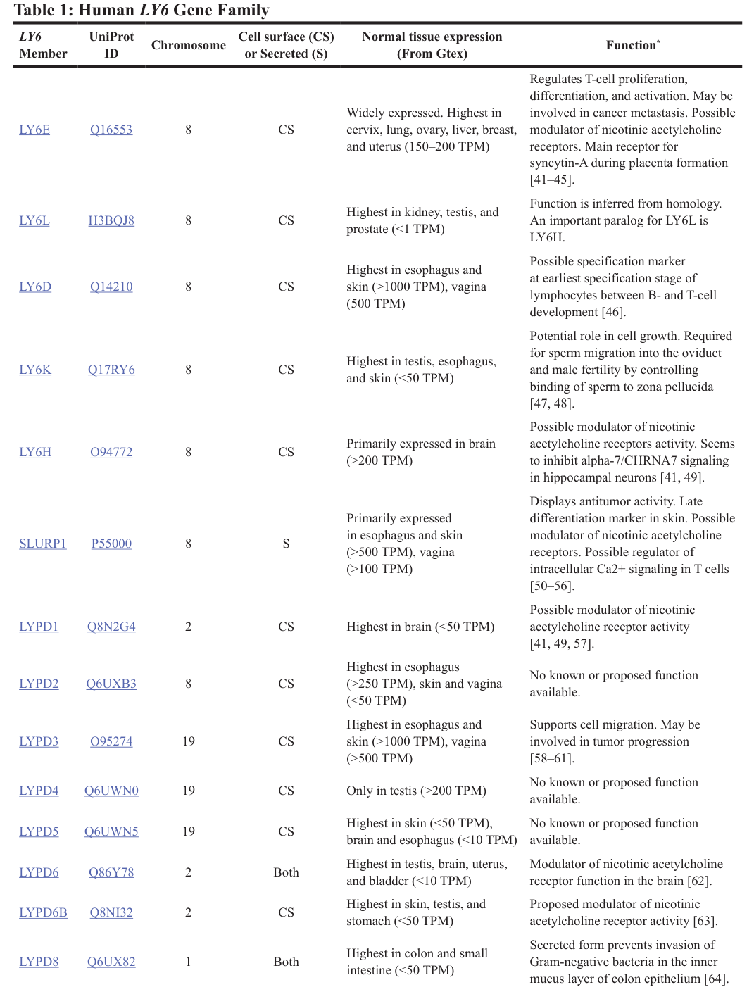

## Question

# Gene Research for Functional Annotation

## ⚠️ CRITICAL: Gene/Protein Identification Context

**BEFORE YOU BEGIN RESEARCH:** You MUST verify you are researching the CORRECT gene/protein. Gene symbols can be ambiguous, especially for less well-characterized genes from non-model organisms.

### Target Gene/Protein Identity (from UniProt):
- **UniProt Accession:** Q6UXB3
- **Protein Description:** RecName: Full=Ly6/PLAUR domain-containing protein 2; Flags: Precursor;
- **Gene Information:** Name=LYPD2; Synonyms=LYPDC2; ORFNames=UNQ430/PRO788;
- **Organism (full):** Homo sapiens (Human).
- **Protein Family:** Not specified in UniProt
- **Key Domains:** CD59_antigen_CS. (IPR018363); Ly-6/neurotoxin-like_GPI-ap. (IPR051110); LY6_UPA_recep-like. (IPR016054); Snake_toxin-like_sf. (IPR045860); Toxin/TOLIP. (IPR035076)

### MANDATORY VERIFICATION STEPS:

1. **Check if the gene symbol "LYPD2" matches the protein description above**
2. **Verify the organism is correct:** Homo sapiens (Human).
3. **Check if protein family/domains align with what you find in literature**
4. **If you find literature for a DIFFERENT gene with the same or similar symbol, STOP**

### If Gene Symbol is Ambiguous or You Cannot Find Relevant Literature:

**DO NOT PROCEED WITH RESEARCH ON A DIFFERENT GENE.** Instead:
- State clearly: "The gene symbol 'LYPD2' is ambiguous or literature is limited for this specific protein"
- Explain what you found (e.g., "Found extensive literature on a different gene with the same symbol in a different organism")
- Describe the protein based ONLY on the UniProt information provided above
- Suggest that the protein function can be inferred from domain/family information

### Research Target:

Please provide a comprehensive research report on the gene **LYPD2** (gene ID: LYPD2, UniProt: Q6UXB3) in human.

The research report should be a detailed narrative explaining the function, biological processes, and localization of the gene product. Citations should be given for all claims.

You should prioritize authoritative reviews and primary scientific literature when conducting research. You can supplement
this with annotations you find in gene/protein databases, but these can be outdated or inaccurate.

We are specifically interested in the primary function of the gene - for enzymes, what reaction is catalyzed, and what is the substrate specificity? For transporters, what is the substrate? For structural proteins or adapters, what is the broader structural role? For signaling molecules, what is the role in the pathway.

We are interested in where in or outside the cell the gene product carries out its function.

We are also interested in the signaling or biochemical pathways in which the gene functions. We are less interested in broad pleiotropic effects, except where these elucidate the precise role.

Include evidence where possible. We are interested in both experimental evidence as well as inference from structure, evolution, or bioinformatic analysis. Precise studies should be prioritized over high-throughput, where available.

## Output

Question: You are an expert researcher providing comprehensive, well-cited information.

Provide detailed information focusing on:
1. Key concepts and definitions with current understanding
2. Recent developments and latest research (prioritize 2023-2024 sources)
3. Current applications and real-world implementations
4. Expert opinions and analysis from authoritative sources
5. Relevant statistics and data from recent studies

Format as a comprehensive research report with proper citations. Include URLs and publication dates where available.
Always prioritize recent, authoritative sources and provide specific citations for all major claims.

# Gene Research for Functional Annotation

## ⚠️ CRITICAL: Gene/Protein Identification Context

**BEFORE YOU BEGIN RESEARCH:** You MUST verify you are researching the CORRECT gene/protein. Gene symbols can be ambiguous, especially for less well-characterized genes from non-model organisms.

### Target Gene/Protein Identity (from UniProt):
- **UniProt Accession:** Q6UXB3
- **Protein Description:** RecName: Full=Ly6/PLAUR domain-containing protein 2; Flags: Precursor;
- **Gene Information:** Name=LYPD2; Synonyms=LYPDC2; ORFNames=UNQ430/PRO788;
- **Organism (full):** Homo sapiens (Human).
- **Protein Family:** Not specified in UniProt
- **Key Domains:** CD59_antigen_CS. (IPR018363); Ly-6/neurotoxin-like_GPI-ap. (IPR051110); LY6_UPA_recep-like. (IPR016054); Snake_toxin-like_sf. (IPR045860); Toxin/TOLIP. (IPR035076)

### MANDATORY VERIFICATION STEPS:

1. **Check if the gene symbol "LYPD2" matches the protein description above**
2. **Verify the organism is correct:** Homo sapiens (Human).
3. **Check if protein family/domains align with what you find in literature**
4. **If you find literature for a DIFFERENT gene with the same or similar symbol, STOP**

### If Gene Symbol is Ambiguous or You Cannot Find Relevant Literature:

**DO NOT PROCEED WITH RESEARCH ON A DIFFERENT GENE.** Instead:
- State clearly: "The gene symbol 'LYPD2' is ambiguous or literature is limited for this specific protein"
- Explain what you found (e.g., "Found extensive literature on a different gene with the same symbol in a different organism")
- Describe the protein based ONLY on the UniProt information provided above
- Suggest that the protein function can be inferred from domain/family information

### Research Target:

Please provide a comprehensive research report on the gene **LYPD2** (gene ID: LYPD2, UniProt: Q6UXB3) in human.

The research report should be a detailed narrative explaining the function, biological processes, and localization of the gene product. Citations should be given for all claims.

You should prioritize authoritative reviews and primary scientific literature when conducting research. You can supplement
this with annotations you find in gene/protein databases, but these can be outdated or inaccurate.

We are specifically interested in the primary function of the gene - for enzymes, what reaction is catalyzed, and what is the substrate specificity? For transporters, what is the substrate? For structural proteins or adapters, what is the broader structural role? For signaling molecules, what is the role in the pathway.

We are interested in where in or outside the cell the gene product carries out its function.

We are also interested in the signaling or biochemical pathways in which the gene functions. We are less interested in broad pleiotropic effects, except where these elucidate the precise role.

Include evidence where possible. We are interested in both experimental evidence as well as inference from structure, evolution, or bioinformatic analysis. Precise studies should be prioritized over high-throughput, where available.

## Research report: Human **LYPD2** (UniProt: **Q6UXB3**) — functional annotation and evidence landscape

### Executive summary
LYPD2 (Ly6/PLAUR domain-containing protein 2) is a human Ly6/uPAR (LU-domain) superfamily member encoded on chromosome 8q24.3. Across authoritative reviews and recent multi-omics analyses, LYPD2 is consistently annotated as a **cell-surface** LU-domain protein, but **a specific, experimentally validated molecular function (ligand/receptor, pathway mechanism, enzymatic activity) is not established** in the accessible literature excerpts. Current evidence supports a working model that LYPD2 is a **GPI-anchored extracellular (outer-leaflet) cell-surface protein** based on superfamily characteristics; however, direct biochemical validation of a GPI anchor for human LYPD2 was not found in the retrieved excerpts. Recent (2023–2024) studies primarily implicate LYPD2 as (i) a **tissue-enriched transcript** (esophagus) and (ii) a **marker of a non-classical monocyte subset** in autoimmune disease scRNA-seq integration, with additional hypothesis-generating links to cancer prognosis and functional-genomics screens. (kong2012characterizationandfunction pages 1-3, loughner2016organizationevolutionand pages 2-4, luo2023singlecellrnasequencingintegration pages 6-7, rathbun2023humanly6gene media 88ea3c53)

---

### 1) Key concepts and definitions (current understanding)

#### 1.1 Ly6/uPAR (LU-domain) superfamily
LYPD2 belongs to the Ly6/uPAR superfamily characterized by a cysteine-rich LU domain (often producing a “three-finger” fold stabilized by disulfide bonds). Family members are commonly either secreted or membrane-associated; a major subfamily is **GPI-anchored** on the cell surface and often participates in receptor modulation, adhesion, immune signaling, and tumor biology, although physiological roles for many members remain poorly characterized. (kong2012characterizationandfunction pages 1-3, loughner2016organizationevolutionand pages 2-4)

#### 1.2 What “cell surface (CS)” implies here
A recent curated table of the human LY6 gene family explicitly annotates LYPD2 as **cell surface (CS)**, consistent with the wider Ly6/uPAR family framework of extracellular-facing proteins. (rathbun2023humanly6gene media 88ea3c53, rathbun2023humanly6gene pages 2-3)

#### 1.3 What is known vs inferred for LYPD2
* **Known from cited sources:** LYPD2 is a human LY6-family gene/protein (UniProt Q6UXB3) on chromosome 8, annotated as cell-surface, with tissue-enriched RNA expression patterns and use as a marker gene in scRNA-seq. (rathbun2023humanly6gene pages 2-3, loughner2016organizationevolutionand pages 2-4, luo2023singlecellrnasequencingintegration pages 6-7, rathbun2023humanly6gene media 88ea3c53)
* **Inferred:** Because many Ly6/uPAR cell-surface members are GPI-anchored and extracellular-facing, LYPD2 is often treated as likely **GPI-anchored**; however, the provided excerpts do not supply direct biochemical confirmation for human LYPD2’s GPI anchor or its specific binding partners. (kong2012characterizationandfunction pages 1-3)

---

### 2) Gene/protein identity verification (mandatory context)
The target identity is consistent across retrieved sources:
* **Symbol:** LYPD2
* **Protein:** Ly6/PLAUR domain-containing protein 2
* **UniProt accession explicitly listed:** **Q6UXB3**
* **Genomic locus:** chromosome **8q24.3**; reviewed as having **3 exons** and encoding a **single LU domain**. (rathbun2023humanly6gene media 88ea3c53, loughner2016organizationevolutionand pages 2-4)

No conflicting “LYPD2” usage (different organism/protein) was encountered in the retrieved evidence for the claims presented in this report.

---

### 3) Protein features, localization, and expression

#### 3.1 Domain architecture and family placement
LYPD2 is listed in a comprehensive review of human and mouse Ly6/uPAR genes as encoding a **single LU domain** and residing in the chromosome 8 gene cluster of Ly6/uPAR-family members. (loughner2016organizationevolutionand pages 2-4)

A human Ly6/uPAR review that catalogs human family members includes LYPD2 among LU-domain proteins, describing shared LU-domain cysteine patterns and distinguishing GPI-anchored vs secreted subfamilies (with GPI-anchored members possessing a C-terminal signal for GPI anchor biosynthesis). LYPD2 is included among cell-surface family members in that framework. (kong2012characterizationandfunction pages 1-3)

#### 3.2 Subcellular localization
A 2023 LY6-family table annotates LYPD2 as **cell surface (CS)**. (rathbun2023humanly6gene media 88ea3c53)

Family-level evidence (not LYPD2-specific) indicates that most Ly6 proteins are extracellular, frequently tethered to the outer leaflet of the plasma membrane by a **C-terminal GPI anchor**. This supports an inference (not direct proof) that human LYPD2 is likely extracellular and GPI-anchored. (lauriello2022glur2qandglur2r pages 1-2, kong2012characterizationandfunction pages 1-3)

#### 3.3 Tissue-level expression (recent curated summary)
A 2023 Oncotarget analysis of the human LY6 gene family provides a GTEx-derived expression summary for LYPD2, reporting highest RNA expression in **esophagus (>250 TPM)** and lower expression in **skin and vagina (<50 TPM)**, with LYPD2 annotated as cell-surface and with “no known function” in that table. (rathbun2023humanly6gene media 88ea3c53, rathbun2023humanly6gene pages 2-3)

#### 3.4 Cell-type expression (single-cell evidence, 2023)
In an integrated scRNA-seq analysis spanning five autoimmune diseases (IgAN, KD, MS, SS, SLE), non-classical monocytes were subclustered into five subsets; one subset was explicitly defined as **“LYPD2highVMO1high”** (cluster 0), indicating LYPD2 as a marker gene for a non-classical monocyte state in these data. (luo2023singlecellrnasequencingintegration pages 6-7)

---

### 4) Biological function, pathways, and interaction evidence

#### 4.1 Direct human functional evidence remains limited
A 2023 LY6-family table explicitly states **“No known or proposed function available”** for LYPD2. This reflects the current state of evidence in accessible curated summaries, emphasizing that LYPD2’s primary molecular function is not yet established by targeted experiments in human systems (from the evidence retrieved here). (rathbun2023humanly6gene pages 2-3, rathbun2023humanly6gene media 88ea3c53)

#### 4.2 Family-level mechanism hypotheses (authoritative reviews)
Reviews of Ly6/uPAR proteins describe diverse roles for LU-domain/GPI-anchored proteins, including modulation of receptor signaling, immunity, adhesion, and cancer-associated phenotypes. These sources provide mechanistic precedent for LU-domain proteins acting as receptor modulators but do not assign a specific receptor/ligand/pathway to human LYPD2 in the retrieved excerpts. (lauriello2022glur2qandglur2r pages 1-2, kong2012characterizationandfunction pages 1-3, loughner2016organizationevolutionand pages 2-4)

#### 4.3 Non-human / indirect experimental evidence (caution in interpretation)
* A 2016 review table summarizing **mouse** Ly6/uPAR family evidence lists LYPD2 with an interacting factor **α4β2 nicotinic acetylcholine receptors (nAChRs)** and a cellular function described as **“nAChR Modulator.”** This is not direct evidence for the human ortholog’s function, but it provides a plausible functional hypothesis (receptor modulation) to test experimentally. (loughner2016organizationevolutionand pages 10-11)
* A 2022 experimental study in mouse tested whether lypd2 interacts with AMPA receptor GluR2 Q/R isoforms and reported **no interaction** with either GluR2Q or GluR2R. This negative result constrains certain receptor-target hypotheses (at least in the tested context) while highlighting the broader idea that Ly6 family members can modulate ionotropic receptors. (lauriello2022glur2qandglur2r pages 1-2)

#### 4.4 Functional-genomics screening evidence (host-pathogen context; hypothesis-generating)
A 2025 PLOS Pathogens study used focused CRISPR knockout screens targeting **193 known or predicted GPI-anchored proteins** to identify host factors restricting coronavirus entry. LYPD2 was repeatedly identified: it ranked among the **top 10 enriched genes** in each infection condition and was identified in **all four screens** (Fig. 6C). The excerpt indicates candidates were taken into knockout validation workflows, but it does not provide LYPD2-specific validation phenotypes in the available text; LY6E was the highlighted validated antiviral effector. Thus, the current evidence supports LYPD2 as a **recurrent screen hit** but not yet a validated mechanistic effector in the excerpted material. (ma2025glycosylphosphatidylinositolbiosynthesisfunctions pages 8-10, ma2025glycosylphosphatidylinositolbiosynthesisfunctions pages 10-13)

---

### 5) Disease associations, cancer relevance, and real-world applications

#### 5.1 Cancer expression/prognosis (secondary analyses)
A 2019 review summarizing Human Protein Atlas observations reports that LYPD2 RNA is expressed at higher levels compared to adjacent normal tissues in **cervical** and **head and neck** cancers and is associated with **favorable prognosis** in those analyses; no hazard ratios or cohort sizes are provided in the excerpt. (upadhyay2019emergingroleof pages 11-16)

In contrast, a 2023 Oncotarget analysis focusing on uterine corpus endometrial carcinoma (UCEC) reports **no significant change** in LYPD2 mRNA expression in UCEC when comparing tumor vs normal in their in silico analyses. (rathbun2023humanly6gene pages 2-3)

Interpretation: current evidence suggests cancer associations for LYPD2 may be **cancer-type-specific** and are largely based on transcriptomic/prognostic mining rather than mechanistic studies. (rathbun2023humanly6gene pages 2-3, upadhyay2019emergingroleof pages 11-16)

#### 5.2 Autoimmune disease and immune heterogeneity (2023 scRNA-seq)
The use of LYPD2 as a marker for a non-classical monocyte subset in integrated autoimmune disease scRNA-seq suggests a possible role as an immune-state marker (or contributor) in inflammatory contexts, but the excerpt does not establish causality or define a pathway mechanism for LYPD2. (luo2023singlecellrnasequencingintegration pages 6-7)

#### 5.3 Database-mined disease associations (Open Targets)
Open Targets lists associations between LYPD2 and multiple disease concepts (e.g., neurodegenerative disease, thrombocytopenia, congenital neutropenia, macrothrombocytopenia, Blackfan-Diamond anemia) with modest scores and limited evidence entries. These should be treated as **hypothesis-generating**, not as proof of causal involvement, especially given the limited mechanistic literature directly linking LYPD2 to these phenotypes in the retrieved sources. (OpenTargets Search: -LYPD2)

#### 5.4 Current applications / implementations
At present, the best-supported “real-world” uses of LYPD2 in the accessible evidence are:
* **Biomarker/marker-gene usage** in single-cell clustering of non-classical monocytes (research workflows). (luo2023singlecellrnasequencingintegration pages 6-7)
* **Candidate cell-surface antigen consideration** within broad discussions of LY6-family tumor-associated antigens (family-level rationale), though LYPD2-specific therapeutic targeting is not supported by direct functional validation in the retrieved excerpts. (kong2012characterizationandfunction pages 1-3, rathbun2023humanly6gene pages 2-3)

---

### 6) Recent developments (prioritizing 2023–2024)

#### 6.1 2023 (Oncotarget) — curated LY6 family table + UCEC expression analysis
Rathbun et al. (May 2023; https://doi.org/10.18632/oncotarget.28409) provides a compact LYPD2 snapshot: UniProt Q6UXB3, chromosome 8, cell-surface annotation, GTEx tissue expression values (esophagus >250 TPM; skin/vagina <50 TPM), and explicitly notes “no known function.” It also reports no significant change for LYPD2 mRNA in UCEC in their analysis. (rathbun2023humanly6gene media 88ea3c53, rathbun2023humanly6gene pages 2-3)

#### 6.2 2023 (BIO Integration) — scRNA-seq integration across five autoimmune diseases
Luo et al. (Jan 2023; https://doi.org/10.15212/bioi-2023-0012) uses LYPD2 to define a non-classical monocyte subset (“LYPD2highVMO1high”), advancing LYPD2’s role as a marker of immune heterogeneity in multi-disease integration analyses. (luo2023singlecellrnasequencingintegration pages 6-7)

#### 6.3 2024 — limited direct mechanistic updates retrieved
Within retrieved evidence, 2024 sources mentioning LYPD2 (e.g., in transcriptome gene lists for computational purposes) do not provide new mechanistic function or localization validation for human LYPD2 in the excerpted text. (luo2023singlecellrnasequencingintegration pages 6-7)

---

### 7) Data and statistics highlighted from recent studies
* **GTEx tissue RNA expression summary (table):** esophagus **>250 TPM**; skin and vagina **<50 TPM**. (rathbun2023humanly6gene media 88ea3c53)
* **scRNA-seq marker usage (subset definition):** a non-classical monocyte subset labeled **LYPD2highVMO1high** in integrated autoimmune disease PBMC scRNA-seq analysis; no LYPD2-specific fold-change/p-values provided in the excerpt. (luo2023singlecellrnasequencingintegration pages 6-7)
* **CRISPR screen recurrence:** LYPD2 among **top-10 enriched genes** in each infection condition and present in **all four** focused GPI-AP coronavirus screens (figure-referenced). (ma2025glycosylphosphatidylinositolbiosynthesisfunctions pages 8-10, ma2025glycosylphosphatidylinositolbiosynthesisfunctions pages 10-13)

---

### 8) Expert opinions and analysis (authoritative sources)
Authoritative reviews emphasize that many Ly6/uPAR-family proteins (especially GPI-anchored LU-domain proteins) have diverse roles in immunity and cancer but that physiological roles for numerous family members remain incompletely characterized. This aligns with the explicit “no known function” annotation for LYPD2 in recent curated summaries. (kong2012characterizationandfunction pages 1-3, rathbun2023humanly6gene pages 2-3)

From a functional-annotation standpoint, the most defensible expert synthesis based on current evidence is:
1) LYPD2 is very likely a **cell-surface LU-domain protein**; 
2) it is **plausibly GPI-anchored and extracellular-facing** by family analogy; 
3) its most reproducible “functional” signal in recent data is as a **marker of specific cell states/tissues** (esophagus enrichment; non-classical monocyte subset); 
4) mechanistic function (binding partners, pathway roles) remains a high-priority experimental gap. (rathbun2023humanly6gene media 88ea3c53, kong2012characterizationandfunction pages 1-3, luo2023singlecellrnasequencingintegration pages 6-7)

---

### 9) Key knowledge gaps and recommended next experiments
Based strictly on the evidence retrieved here:
* **Missing direct evidence:** biochemical confirmation of the GPI anchor for human LYPD2; validated binding partners; functional assays demonstrating pathway impact in human cells. (kong2012characterizationandfunction pages 1-3, rathbun2023humanly6gene pages 2-3)
* **High-value next steps:**
  * Proteomic validation of GPI anchoring (PI-PLC sensitivity; mass spectrometry of GPI remnant) and surface localization in relevant cell types (esophageal epithelium; non-classical monocytes).
  * CRISPR KO/KO-rescue in relevant models to test whether LYPD2 contributes to phenotypes suggested by screening (e.g., viral entry restriction) rather than acting as a correlated marker.
  * Interaction mapping (AP-MS / proximity labeling) to discover receptor partners, particularly given family precedent for receptor modulation. (lauriello2022glur2qandglur2r pages 1-2, ma2025glycosylphosphatidylinositolbiosynthesisfunctions pages 8-10)

---

## Evidence summary table
| Aspect | Key finding | Evidence type | Source (with year) | Notes/limitations |
|---|---|---|---|---|
| Identity | Human **LYPD2** encodes **Ly6/PLAUR domain-containing protein 2**; UniProt **Q6UXB3** | Review/database summary | Rathbun et al., 2023; Loughner et al., 2016 | Rathbun table explicitly lists Q6UXB3; Loughner lists aliases and family placement (rathbun2023humanly6gene pages 2-3, loughner2016organizationevolutionand pages 2-4) |
| Genomic location | Located on **chromosome 8q24.3** and reported to have **3 exons** | Review/database summary | Loughner et al., 2016 | Family/genome annotation rather than direct functional experiment (loughner2016organizationevolutionand pages 2-4) |
| Domain architecture | Encodes a **single LU (Ly6/uPAR) domain** consistent with the Ly6/uPAR superfamily | Review | Loughner et al., 2016; Kong & Park, 2012 | Structural assignment is family-based; no LYPD2-specific structure solved in provided context (loughner2016organizationevolutionand pages 2-4, kong2012characterizationandfunction pages 1-3) |
| Localization | Annotated as **cell surface (CS)** | Database-style table / review | Rathbun et al., 2023 | Table-level annotation; not a direct localization experiment in the cited excerpt (rathbun2023humanly6gene pages 2-3, rathbun2023humanly6gene media 88ea3c53) |
| Localization / anchoring inference | As a Ly6/uPAR family cell-surface member, LYPD2 is placed in the **GPI-anchored subgroup** with extracellular LU-domain architecture | Review / inference from family classification | Kong & Park, 2012 | This is an inference from family classification, not direct biochemical confirmation of a GPI anchor for human LYPD2 in the provided context (kong2012characterizationandfunction pages 1-3) |
| Normal tissue expression | GTEx summary indicates highest expression in **esophagus** (**>250 TPM**), with lower expression in **skin** and **vagina** | Database-style table | Rathbun et al., 2023 | Numeric tissue expression comes from table image/context; tissue-level RNA only, not protein localization or function (rathbun2023humanly6gene media 88ea3c53, rathbun2023humanly6gene pages 2-3) |
| Normal tissue expression | Human Protein Atlas-based summary states **LYPD2 RNA is expressed in esophagus and tonsil** | Review/database summary | Upadhyay, 2019 | Qualitative statement; no TPM values given in this excerpt (upadhyay2019emergingroleof pages 6-11) |
| Reported function | **No known or proposed function available** in the human LY6 family table | Database-style table / review | Rathbun et al., 2023 | Strong evidence gap for human-specific mechanism; no validated ligand, receptor, or pathway in provided human literature (rathbun2023humanly6gene pages 2-3) |
| Family-level functional analogy | Mouse-focused family table lists **LYPD2** as an **α4β2 nAChR modulator** | Review summarizing mouse evidence | Loughner et al., 2016 | This row is for **mouse** Ly6/uPAR family evidence, not direct evidence for human LYPD2; should not be overinterpreted (loughner2016organizationevolutionand pages 10-11) |
| Experimental interaction testing | A 2022 study reported **no interaction** between **mouse lypd2** and **GluR2Q/GluR2R AMPA receptor** isoforms | Experimental (mouse) | Lauriello et al., 2022 | Useful negative evidence for family hypotheses, but species-specific and not direct evidence for human LYPD2 function (lauriello2022glur2qandglur2r pages 1-2) |
| Single-cell expression | **LYPD2-high/VMO1-high** marks one **non-classical monocyte** subset in integrated scRNA-seq from autoimmune diseases | High-throughput single-cell transcriptomics | Luo et al., 2023 | Marker-gene evidence only; excerpt gives no LYPD2-specific effect size, fold-change, or mechanistic role (luo2023singlecellrnasequencingintegration pages 6-7) |
| Cancer-associated expression | Review states LYPD2 RNA is higher than adjacent normal tissue in **cervical** and **head and neck** cancers and associated with **favorable prognosis** in Human Protein Atlas analyses | Review/database mining | Upadhyay, 2019 | Secondary summary; no cohort size or hazard statistics provided in excerpt (upadhyay2019emergingroleof pages 11-16) |
| UCEC association | In **uterine corpus endometrial carcinoma (UCEC)**, **no significant change** in LYPD2 mRNA expression was reported | In silico tumor expression analysis | Rathbun et al., 2023 | Negative result in one cancer type; does not exclude relevance in others (rathbun2023humanly6gene pages 2-3) |
| Screening evidence / host-pathogen context | In focused CRISPR knockout screens of predicted GPI-anchored proteins, **LYPD2 was among top-10 enriched genes in each infection condition** and was identified in **all four coronavirus screens** | High-throughput functional genomics | Ma et al., 2025 | Recurrent screen hit suggests relevance, but provided excerpt does not show LYPD2-specific validation phenotype or mechanism; LY6E, not LYPD2, was the lead validated hit (ma2025glycosylphosphatidylinositolbiosynthesisfunctions pages 8-10, ma2025glycosylphosphatidylinositolbiosynthesisfunctions pages 10-13) |
| Disease associations | Open Targets lists low-to-moderate evidence links to **neurodegenerative disease**, **thrombocytopenia**, **X-linked severe congenital neutropenia**, **autosomal dominant macrothrombocytopenia**, and **Blackfan-Diamond anemia** | Database association mining | Open Targets | Associations appear driven by limited evidence and should be treated as hypothesis-generating rather than causal/validated for LYPD2 biology (OpenTargets Search: -LYPD2) |

*Table: This table compiles the main supported findings for human LYPD2 (Q6UXB3), separating direct human evidence from family-based inference and non-human data. It is useful for identifying what is known, what is only predicted, and where major evidence gaps remain.*

---

## Key sources with URLs and publication dates (from retrieved evidence)
* Rathbun LA, Magliocco AM, Bamezai AK. *Human LY6 gene family: potential tumor-associated antigens and biomarkers of prognosis in uterine corpus endometrial carcinoma.* **Oncotarget**. **May 2023**. https://doi.org/10.18632/oncotarget.28409 (rathbun2023humanly6gene pages 2-3, rathbun2023humanly6gene media 88ea3c53)
* Luo S et al. *Single-Cell RNA-Sequencing Integration Analysis Revealed Immune Cell Heterogeneity in Five Human Autoimmune Diseases.* **BIO Integration**. **Jan 2023**. https://doi.org/10.15212/bioi-2023-0012 (luo2023singlecellrnasequencingintegration pages 6-7)
* Loughner CL et al. *Organization, evolution and functions of the human and mouse Ly6/uPAR family genes.* **Human Genomics**. **Apr 2016**. https://doi.org/10.1186/s40246-016-0074-2 (loughner2016organizationevolutionand pages 2-4, loughner2016organizationevolutionand pages 10-11)
* Kong HK, Park JH. *Characterization and function of human Ly-6/uPAR molecules.* **BMB Reports**. **Nov 2012**. https://doi.org/10.5483/bmbrep.2012.45.11.210 (kong2012characterizationandfunction pages 1-3)
* Upadhyay G. *Emerging Role of Lymphocyte Antigen-6 Family of Genes in Cancer and Immune Cells.* **Frontiers in Immunology**. **Apr 2019**. https://doi.org/10.3389/fimmu.2019.00819 (upadhyay2019emergingroleof pages 6-11, upadhyay2019emergingroleof pages 11-16)
* Lauriello A et al. *GluR2Q and GluR2R AMPA Subunits are not Targets of lypd2 Interaction.* **PLOS ONE**. **Nov 2022**. https://doi.org/10.1371/journal.pone.0278278 (lauriello2022glur2qandglur2r pages 1-2)
* Open Targets Platform, LYPD2 disease associations (database access date not captured in tool output). https://platform.opentargets.org/ (OpenTargets Search: -LYPD2)

References

1. (kong2012characterizationandfunction pages 1-3): Hyun Kyung Kong and Jong Hoon Park. Characterization and function of human ly-6/upar molecules. BMB Reports, 45:595-603, Nov 2012. URL: https://doi.org/10.5483/bmbrep.2012.45.11.210, doi:10.5483/bmbrep.2012.45.11.210. This article has 42 citations and is from a peer-reviewed journal.

2. (loughner2016organizationevolutionand pages 2-4): Chelsea L. Loughner, Elspeth A. Bruford, Monica S. McAndrews, Emili E. Delp, Sudha Swamynathan, and Shivalingappa K. Swamynathan. Organization, evolution and functions of the human and mouse ly6/upar family genes. Human Genomics, Apr 2016. URL: https://doi.org/10.1186/s40246-016-0074-2, doi:10.1186/s40246-016-0074-2. This article has 234 citations and is from a peer-reviewed journal.

3. (luo2023singlecellrnasequencingintegration pages 6-7): Siweier Luo, Le Wang, Yi Xiao, Chunwei Cao, Qinghua Liu, and Yiming Zhou. Single-cell rna-sequencing integration analysis revealed immune cell heterogeneity in five human autoimmune diseases. BIO Integration, Jan 2023. URL: https://doi.org/10.15212/bioi-2023-0012, doi:10.15212/bioi-2023-0012. This article has 31 citations.

4. (rathbun2023humanly6gene media 88ea3c53): Luke A. Rathbun, Anthony M. Magliocco, and Anil K. Bamezai. Human ly6 gene family: potential tumor-associated antigens and biomarkers of prognosis in uterine corpus endometrial carcinoma. Oncotarget, 14:426-437, May 2023. URL: https://doi.org/10.18632/oncotarget.28409, doi:10.18632/oncotarget.28409. This article has 6 citations.

5. (rathbun2023humanly6gene pages 2-3): Luke A. Rathbun, Anthony M. Magliocco, and Anil K. Bamezai. Human ly6 gene family: potential tumor-associated antigens and biomarkers of prognosis in uterine corpus endometrial carcinoma. Oncotarget, 14:426-437, May 2023. URL: https://doi.org/10.18632/oncotarget.28409, doi:10.18632/oncotarget.28409. This article has 6 citations.

6. (lauriello2022glur2qandglur2r pages 1-2): Anna Lauriello, Quinn McVeigh, and Rou-Jia Sung. Glur2q and glur2r ampa subunits are not targets of lypd2 interaction. PLOS ONE, 17:e0278278, Nov 2022. URL: https://doi.org/10.1371/journal.pone.0278278, doi:10.1371/journal.pone.0278278. This article has 0 citations and is from a peer-reviewed journal.

7. (loughner2016organizationevolutionand pages 10-11): Chelsea L. Loughner, Elspeth A. Bruford, Monica S. McAndrews, Emili E. Delp, Sudha Swamynathan, and Shivalingappa K. Swamynathan. Organization, evolution and functions of the human and mouse ly6/upar family genes. Human Genomics, Apr 2016. URL: https://doi.org/10.1186/s40246-016-0074-2, doi:10.1186/s40246-016-0074-2. This article has 234 citations and is from a peer-reviewed journal.

8. (ma2025glycosylphosphatidylinositolbiosynthesisfunctions pages 8-10): Yanlong Ma, Fei Feng, Hui Feng, Xue Ma, Ziqiao Wang, Yutong Han, Yunkai Zhu, Yuyan Wang, Zhichao Gao, Yuyuan Zhang, Qiang Ding, Jincun Zhao, and Rong Zhang. Glycosylphosphatidylinositol biosynthesis functions as a conserved host defense pathway against coronaviruses via regulation of ly6e. PLOS Pathogens, 21:e1013441, Sep 2025. URL: https://doi.org/10.1371/journal.ppat.1013441, doi:10.1371/journal.ppat.1013441. This article has 2 citations and is from a highest quality peer-reviewed journal.

9. (ma2025glycosylphosphatidylinositolbiosynthesisfunctions pages 10-13): Yanlong Ma, Fei Feng, Hui Feng, Xue Ma, Ziqiao Wang, Yutong Han, Yunkai Zhu, Yuyan Wang, Zhichao Gao, Yuyuan Zhang, Qiang Ding, Jincun Zhao, and Rong Zhang. Glycosylphosphatidylinositol biosynthesis functions as a conserved host defense pathway against coronaviruses via regulation of ly6e. PLOS Pathogens, 21:e1013441, Sep 2025. URL: https://doi.org/10.1371/journal.ppat.1013441, doi:10.1371/journal.ppat.1013441. This article has 2 citations and is from a highest quality peer-reviewed journal.

10. (upadhyay2019emergingroleof pages 11-16): Geeta Upadhyay. Emerging role of lymphocyte antigen-6 family of genes in cancer and immune cells. Frontiers in Immunology, Apr 2019. URL: https://doi.org/10.3389/fimmu.2019.00819, doi:10.3389/fimmu.2019.00819. This article has 161 citations and is from a peer-reviewed journal.

11. (OpenTargets Search: -LYPD2): Open Targets Query (-LYPD2, 5 results). Buniello, A. et al. (2025). Open Targets Platform: facilitating therapeutic hypotheses building in drug discovery. Nucleic Acids Research.

12. (upadhyay2019emergingroleof pages 6-11): Geeta Upadhyay. Emerging role of lymphocyte antigen-6 family of genes in cancer and immune cells. Frontiers in Immunology, Apr 2019. URL: https://doi.org/10.3389/fimmu.2019.00819, doi:10.3389/fimmu.2019.00819. This article has 161 citations and is from a peer-reviewed journal.

## Artifacts

- [Edison artifact artifact-00](LYPD2-deep-research-falcon_artifacts/artifact-00.md)

## Citations

1. kong2012characterizationandfunction pages 1-3
2. loughner2016organizationevolutionand pages 2-4
3. luo2023singlecellrnasequencingintegration pages 6-7
4. loughner2016organizationevolutionand pages 10-11
5. upadhyay2019emergingroleof pages 11-16
6. upadhyay2019emergingroleof pages 6-11
7. ma2025glycosylphosphatidylinositolbiosynthesisfunctions pages 8-10
8. ma2025glycosylphosphatidylinositolbiosynthesisfunctions pages 10-13
9. https://doi.org/10.18632/oncotarget.28409
10. https://doi.org/10.15212/bioi-2023-0012
11. https://doi.org/10.1186/s40246-016-0074-2
12. https://doi.org/10.5483/bmbrep.2012.45.11.210
13. https://doi.org/10.3389/fimmu.2019.00819
14. https://doi.org/10.1371/journal.pone.0278278
15. https://platform.opentargets.org/
16. https://doi.org/10.5483/bmbrep.2012.45.11.210,
17. https://doi.org/10.1186/s40246-016-0074-2,
18. https://doi.org/10.15212/bioi-2023-0012,
19. https://doi.org/10.18632/oncotarget.28409,
20. https://doi.org/10.1371/journal.pone.0278278,
21. https://doi.org/10.1371/journal.ppat.1013441,
22. https://doi.org/10.3389/fimmu.2019.00819,