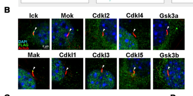

## Question

# Gene Research for Functional Annotation

## ⚠️ CRITICAL: Gene/Protein Identification Context

**BEFORE YOU BEGIN RESEARCH:** You MUST verify you are researching the CORRECT gene/protein. Gene symbols can be ambiguous, especially for less well-characterized genes from non-model organisms.

### Target Gene/Protein Identity (from UniProt):
- **UniProt Accession:** P20794
- **Protein Description:** RecName: Full=Serine/threonine-protein kinase MAK; EC=2.7.11.1 {ECO:0000269|PubMed:12084720, ECO:0000269|PubMed:21986944}; AltName: Full=Male germ cell-associated kinase;
- **Gene Information:** Name=MAK;
- **Organism (full):** Homo sapiens (Human).
- **Protein Family:** Belongs to the protein kinase superfamily. CMGC Ser/Thr
- **Key Domains:** Kinase-like_dom_sf. (IPR011009); MAPK. (IPR050117); Prot_kinase_dom. (IPR000719); Protein_kinase_ATP_BS. (IPR017441); Ser/Thr_kinase_AS. (IPR008271)

### MANDATORY VERIFICATION STEPS:

1. **Check if the gene symbol "MAK" matches the protein description above**
2. **Verify the organism is correct:** Homo sapiens (Human).
3. **Check if protein family/domains align with what you find in literature**
4. **If you find literature for a DIFFERENT gene with the same or similar symbol, STOP**

### If Gene Symbol is Ambiguous or You Cannot Find Relevant Literature:

**DO NOT PROCEED WITH RESEARCH ON A DIFFERENT GENE.** Instead:
- State clearly: "The gene symbol 'MAK' is ambiguous or literature is limited for this specific protein"
- Explain what you found (e.g., "Found extensive literature on a different gene with the same symbol in a different organism")
- Describe the protein based ONLY on the UniProt information provided above
- Suggest that the protein function can be inferred from domain/family information

### Research Target:

Please provide a comprehensive research report on the gene **MAK** (gene ID: MAK, UniProt: P20794) in human.

The research report should be a detailed narrative explaining the function, biological processes, and localization of the gene product. Citations should be given for all claims.

You should prioritize authoritative reviews and primary scientific literature when conducting research. You can supplement
this with annotations you find in gene/protein databases, but these can be outdated or inaccurate.

We are specifically interested in the primary function of the gene - for enzymes, what reaction is catalyzed, and what is the substrate specificity? For transporters, what is the substrate? For structural proteins or adapters, what is the broader structural role? For signaling molecules, what is the role in the pathway.

We are interested in where in or outside the cell the gene product carries out its function.

We are also interested in the signaling or biochemical pathways in which the gene functions. We are less interested in broad pleiotropic effects, except where these elucidate the precise role.

Include evidence where possible. We are interested in both experimental evidence as well as inference from structure, evolution, or bioinformatic analysis. Precise studies should be prioritized over high-throughput, where available.

## Output

Question: You are an expert researcher providing comprehensive, well-cited information.

Provide detailed information focusing on:
1. Key concepts and definitions with current understanding
2. Recent developments and latest research (prioritize 2023-2024 sources)
3. Current applications and real-world implementations
4. Expert opinions and analysis from authoritative sources
5. Relevant statistics and data from recent studies

Format as a comprehensive research report with proper citations. Include URLs and publication dates where available.
Always prioritize recent, authoritative sources and provide specific citations for all major claims.

# Gene Research for Functional Annotation

## ⚠️ CRITICAL: Gene/Protein Identification Context

**BEFORE YOU BEGIN RESEARCH:** You MUST verify you are researching the CORRECT gene/protein. Gene symbols can be ambiguous, especially for less well-characterized genes from non-model organisms.

### Target Gene/Protein Identity (from UniProt):
- **UniProt Accession:** P20794
- **Protein Description:** RecName: Full=Serine/threonine-protein kinase MAK; EC=2.7.11.1 {ECO:0000269|PubMed:12084720, ECO:0000269|PubMed:21986944}; AltName: Full=Male germ cell-associated kinase;
- **Gene Information:** Name=MAK;
- **Organism (full):** Homo sapiens (Human).
- **Protein Family:** Belongs to the protein kinase superfamily. CMGC Ser/Thr
- **Key Domains:** Kinase-like_dom_sf. (IPR011009); MAPK. (IPR050117); Prot_kinase_dom. (IPR000719); Protein_kinase_ATP_BS. (IPR017441); Ser/Thr_kinase_AS. (IPR008271)

### MANDATORY VERIFICATION STEPS:

1. **Check if the gene symbol "MAK" matches the protein description above**
2. **Verify the organism is correct:** Homo sapiens (Human).
3. **Check if protein family/domains align with what you find in literature**
4. **If you find literature for a DIFFERENT gene with the same or similar symbol, STOP**

### If Gene Symbol is Ambiguous or You Cannot Find Relevant Literature:

**DO NOT PROCEED WITH RESEARCH ON A DIFFERENT GENE.** Instead:
- State clearly: "The gene symbol 'MAK' is ambiguous or literature is limited for this specific protein"
- Explain what you found (e.g., "Found extensive literature on a different gene with the same symbol in a different organism")
- Describe the protein based ONLY on the UniProt information provided above
- Suggest that the protein function can be inferred from domain/family information

### Research Target:

Please provide a comprehensive research report on the gene **MAK** (gene ID: MAK, UniProt: P20794) in human.

The research report should be a detailed narrative explaining the function, biological processes, and localization of the gene product. Citations should be given for all claims.

You should prioritize authoritative reviews and primary scientific literature when conducting research. You can supplement
this with annotations you find in gene/protein databases, but these can be outdated or inaccurate.

We are specifically interested in the primary function of the gene - for enzymes, what reaction is catalyzed, and what is the substrate specificity? For transporters, what is the substrate? For structural proteins or adapters, what is the broader structural role? For signaling molecules, what is the role in the pathway.

We are interested in where in or outside the cell the gene product carries out its function.

We are also interested in the signaling or biochemical pathways in which the gene functions. We are less interested in broad pleiotropic effects, except where these elucidate the precise role.

Include evidence where possible. We are interested in both experimental evidence as well as inference from structure, evolution, or bioinformatic analysis. Precise studies should be prioritized over high-throughput, where available.

# Human MAK (UniProt P20794): functional-annotation research report

**Identity and scope.** The target is human **MAK**, *male germ cell-associated kinase*, a CMGC-family serine/threonine protein kinase with a protein-kinase domain and a MAP-kinase-like **TDY** activation motif. This identification agrees with human MAK studies in retina and prostate cells. **ICK**, also called *MAK-related kinase* or MRK, is a related **different gene**; its experimentally determined substrates must not automatically be assigned to MAK. The accession P20794 is the identifier supplied in the question; the retrieved research articles identify the protein by gene and protein name rather than accession. [Fu et al., *Molecular and Cellular Biology*, November 2006](https://doi.org/10.1128/mcb.00816-06); [Wang and Kung, *Oncogene*, June 2012](https://doi.org/10.1038/onc.2011.464). (fu2006identificationofyinyang pages 1-2, wang2012malegermcellassociated pages 1-2)

## Primary biochemical function and substrate specificity

MAK catalyzes ATP-dependent phosphorylation of protein serine/threonine residues. Its best-supported **direct protein substrate in the retrieved MAK experiments is CDH1/FZR1**, an activator of the APC/C ubiquitin ligase: cell-isolated and bacterially produced MAK phosphorylated CDH1 in vitro, whereas kinase-defective MAK showed little activity. Alanine-substitution experiments implicated a *group* of nine sites also targeted by cyclin-dependent kinases—T32, S36, S40, S70, T121, S138, S146, S151 and S163—but did **not** individually establish that MAK modifies every listed residue in cells. Residual phosphorylation and possible contribution from an associated kinase limit assignment of further sites. [Wang and Kung, June 2012](https://doi.org/10.1038/onc.2011.464). (wang2012malegermcellassociated pages 5-6, wang2012malegermcellassociated pages 4-5, wang2012malegermcellassociated pages 8-9)

Activation depends on phosphorylation of MAK’s **T157–D158–Y159** motif. TDY substitutions impair its in-vitro kinase readout; CCRK/CDK20 interacts with MAK and promotes activation-loop phosphorylation, while MAK autokinase activity also contributes. In mouse photoreceptors, loss of Ccrk markedly reduces phosphorylated Mak. These results establish an upstream **CCRK→MAK** relationship, although the residue-specific mechanism should not be inferred solely from experiments on ICK. [Wang and Kung, June 2012](https://doi.org/10.1038/onc.2011.464); [Chaya et al., *Life Science Alliance*, September 2024](https://doi.org/10.26508/lsa.202402880). (wang2012malegermcellassociated pages 3-4, chaya2024ccrkmakicksignalingis pages 13-14, chaya2024ccrkmakicksignalingis pages 9-9)

**The precise MAK-wide peptide-substrate consensus and its direct ciliary substrate repertoire remain unresolved.** The often-quoted R-P-X-S/T-P peptide preference was measured for **ICK/MRK**, not MAK; phosphorylation of Raptor T908 likewise belongs to ICK research. KIF3A is a plausible *pathway-associated* MAK target because phosphorylated Kif3a decreases in *Mak*-null mouse retina, but the 2024 study did not demonstrate direct phosphorylation of KIF3A by purified human MAK. Kif3a was independently characterized as an Ick substrate. [Fu et al., November 2006](https://doi.org/10.1128/mcb.00816-06); [Wu et al., *Journal of Biological Chemistry*, April 2012](https://doi.org/10.1074/jbc.m111.302117); [Chaya et al., September 2024](https://doi.org/10.26508/lsa.202402880). (fu2006identificationofyinyang pages 1-2, wu2012intestinalcellkinase pages 1-2, chaya2024ccrkmakicksignalingis pages 4-6, chaya2024ccrkmakicksignalingis pages 3-4)

The table distinguishes direct biochemical findings from genetic and phosphorylation-state associations.

| Functional axis | Direct molecular readout/target | Cellular compartment and organism | Confidence / limitations | Primary source year and DOI URL |
|---|---|---|---|---|
| Catalytic activation: TDY motif (Thr157/Tyr159) and CCRK/CDK20 | TDY-mutant MAK showed impaired kinase-associated phosphorylation of myelin basic protein; CCRK interacted with MAK and increased TDY phosphorylation. Evidence supports CCRK-dependent Thr157 activation plus MAK autophosphorylation, including Tyr159. | Human MAK expressed in mammalian prostate-cell systems; cell-cycle-regulated activity | **High for TDY dependence; moderate for residue-by-residue mechanism.** Kinase assays establish activation-loop dependence, but some phosphorylation could involve associated kinases. | Wang & Kung, 2012. https://doi.org/10.1038/onc.2011.464 (wang2012malegermcellassociated pages 3-4, wang2012malegermcellassociated pages 2-3) |
| CDH1/FZR1 phosphorylation and APC/C inhibition | Cell-derived and bacterially purified wild-type MAK phosphorylated CDH1; kinase-defective MAK had little activity. Alanine-mutant analysis implicated nine known CDK sites—Thr32, Ser36, Ser40, Ser70, Thr121, Ser138, Ser146, Ser151 and Ser163—as a group. Phosphorylation weakened CDH1–CDC27 association, inhibited APC/C–CDH1 and stabilized Aurora A and PLK1. | Human prostate-cancer cells; purified recombinant proteins; nucleus and mitotic structures | **High for direct CDH1 phosphorylation and pathway effect; moderate for individual sites.** The nine residues were implicated collectively rather than mapped individually; an associated kinase could contribute to residual phosphorylation. Aurora A and PLK1 are APC/C substrates, not demonstrated MAK phosphorylation substrates. | Wang & Kung, 2012. https://doi.org/10.1038/onc.2011.464 (wang2012malegermcellassociated pages 5-6, wang2012malegermcellassociated pages 4-5, wang2012malegermcellassociated pages 8-9, wang2012malegermcellassociated pages 6-7) |
| KIF3A phosphorylation association | Phos-tag analysis showed reduced phosphorylated Kif3a in *Mak*−/− retina; FGFR inhibition increased Kif3a phosphorylation through compensatory Ick activation. | Mouse retinal photoreceptors and retina lysates | **Moderate-to-low for direct Mak→Kif3a catalysis.** Genetic and phospho-state association supports pathway placement, but direct phosphorylation by purified human MAK and a MAK-dependent residue were not shown. Kif3a is an established Ick substrate; it should therefore be described only as a candidate Mak substrate. | Chaya et al., 2024. https://doi.org/10.26508/lsa.202402880 (chaya2024ccrkmakicksignalingis pages 4-6, chaya2024ccrkmakicksignalingis pages 3-4, chaya2024ccrkmakicksignalingis pages 9-10) |
| Distal-ciliary IFT regulation and Mak–Ick cooperation | Mak localized to ciliary tips; *Mak* loss caused IFT88/IFT140 accumulation at elongated photoreceptor connecting-cilium tips. Combined *Mak/Ick* loss eliminated detectable axonemes and outer segments, mislocalized opsins and abolished measurable ERG responses, supporting defective IFT turnaround/retrograde transport. | Cultured mammalian-cell cilia and mouse retinal photoreceptor distal axonemes | **High for mouse/cell-model ciliary function; indirect for human physiology.** Double-knockout severity establishes cooperation but does not identify all direct MAK substrates; other kinases or non-IFT functions remain possible. | Chaya et al., 2024. https://doi.org/10.26508/lsa.202402880 (chaya2024ccrkmakicksignalingis pages 3-4, chaya2024ccrkmakicksignalingis pages 12-13, chaya2024ccrkmakicksignalingis media a22506e3) |
| Human retinal localization and alternative splicing | Human donor-retina immunohistochemistry detected MAK mainly in photoreceptor inner segments, cell bodies and axons, with strong cone inner-segment/Henle-fiber labeling. Normal retina expressed retina-enriched MAK transcripts; the exon-9 Alu insertion disrupted inclusion of retina-specific exon 12 and eliminated the large retinal isoform. A separate study identified a longer photoreceptor-enriched isoform containing an alternative exon numbered 13 under its transcript scheme. | Human rod and cone photoreceptors; inner segments, outer nuclear layer and axons—not strong in rhodopsin-rich outer segments | **High for human retinal expression and splice disruption.** The 2011 human staining did not directly establish distal ciliary-tip localization; that more precise localization derives mainly from mouse and cultured-cell work. Exon numbering differs across transcript annotations. | Tucker et al., 2011. https://doi.org/10.1073/pnas.1108918108; Özgül et al., 2011. https://doi.org/10.1016/j.ajhg.2011.07.005 (tucker2011exomesequencingand pages 5-6, tucker2011exomesequencingand pages 4-5, tucker2011exomesequencingand pages 3-4, ozgul2011exomesequencingand pages 7-9) |
| Nuclear androgen-receptor coactivation | Androgen induced MAK transcription; MAK associated and colocalized with AR, was recruited to the PSA promoter and enhanced androgen-dependent AR transcription. MAK knockdown or kinase-dead MAK reduced AR-responsive transcription and LNCaP-cell growth. Direct assays did **not** identify AR as a MAK phosphorylation substrate. | Nucleus of human prostate-cancer cell lines, particularly LNCaP; PSA-promoter transcriptional complex | **High for cell-based AR coactivation; low for a direct phosphorylation mechanism.** Results rely largely on cancer-cell reporter, ChIP, interaction and perturbation assays. Residual activity of kinase-dead MAK suggests both catalytic and noncatalytic contributions. | Ma et al., 2006. https://doi.org/10.1158/0008-5472.CAN-06-1636 (ma2006malegermcellassociated pages 2-2, ma2006malegermcellassociated pages 6-8, ma2006malegermcellassociated pages 2-3, ma2006malegermcellassociated pages 1-2) |

*Table: Evidence-graded summary of the principal molecular functions, localization findings, and experimentally supported targets of human MAK/P20794 and orthologous mouse Mak. It distinguishes direct MAK evidence from candidate substrates and ICK-specific findings.*

## Principal biological role: photoreceptor ciliary transport

The strongest **human physiological evidence** places MAK in photoreceptor maintenance: independent studies identified **biallelic MAK variants causing autosomal-recessive retinitis pigmentosa (RP)**, and patient-associated kinase-domain variants p.Gly13Ser and p.Asn130His had little detectable activity in an in-vitro myelin-basic-protein assay. These observations link kinase function—not simply the gene’s historical association with germ cells—to retinal survival. [Özgül et al., *American Journal of Human Genetics*, August 2011](https://doi.org/10.1016/j.ajhg.2011.07.005); [Tucker et al., *PNAS*, August 2011](https://doi.org/10.1073/pnas.1108918108). (ozgul2011exomesequencingand pages 1-2, ozgul2011exomesequencingand pages 7-9, tucker2011exomesequencingand pages 2-3)

Mechanistically, the peer-reviewed **2024** study positions mouse Mak at the **distal photoreceptor ciliary axoneme/tip**, where it cooperates with Ick to regulate intraflagellar-transport (IFT) turnaround. IFT carries material toward the tip and returns it toward the base; loss of *Mak* lengthened photoreceptor connecting cilia and concentrated IFT88 and IFT140 at their tips, consistent with disrupted tip processing or retrograde transport. Removing **both** *Mak* and *Ick* produced a more severe, qualitatively different phenotype: no detectable connecting-cilium axonemes or outer segments, mislocalized rod and cone opsins, progressive photoreceptor loss and no significant electroretinographic responses. *Ccrk* disruption reduced Mak activation and produced severe ciliary and retinal defects. These are **mouse and cultured-cell mechanistic results**, not direct measurements of IFT kinetics in human MAK-mutant photoreceptors. [Chaya et al., September 2024](https://doi.org/10.26508/lsa.202402880), including the study’s Figure 1 localization and phosphorylation panels. (chaya2024ccrkmakicksignalingis pages 3-4, chaya2024ccrkmakicksignalingis pages 13-14, chaya2024ccrkmakicksignalingis pages 12-13, chaya2024ccrkmakicksignalingis media a22506e3)

**Location requires a species distinction.** In human donor retina, immunostaining detected MAK predominantly in **rod and cone inner segments, photoreceptor cell bodies and axons**, including strong labeling of foveal cone inner segments and Henle fibers; it did not show strong distal outer-segment staining. Ciliary-tip localization is supported more specifically by the later mouse-retina and cultured-cell experiments. Outside retina, human prostate-cancer-cell studies located MAK in the **nucleus during interphase** and at mitotic structures including spindles, centrosomes and the midbody. Thus, MAK acts *inside* cells—in a ciliary compartment in the retinal model and in nuclear/mitotic compartments in the prostate-cell model—not as a secreted protein. [Tucker et al., August 2011](https://doi.org/10.1073/pnas.1108918108); [Chaya et al., September 2024](https://doi.org/10.26508/lsa.202402880); [Wang and Kung, June 2012](https://doi.org/10.1038/onc.2011.464). (tucker2011exomesequencingand pages 3-4, chaya2024ccrkmakicksignalingis pages 12-13, wang2012malegermcellassociated pages 6-7, wang2012malegermcellassociated pages 2-3)

MAK also has **tissue-enriched transcript isoforms**. A patient-derived-cell study showed that an exon-9 Alu insertion disrupts normal expression of a retina-specific transcript incorporating exon 12; a separate human-retina study identified a photoreceptor-enriched longer isoform containing an alternative exon numbered **13** in its transcript scheme, while the shorter isoform predominated in testis. These exon labels come from different transcript descriptions and should not be assumed to denote the same exon without transcript-level reconciliation. [Tucker et al., August 2011](https://doi.org/10.1073/pnas.1108918108); [Özgül et al., August 2011](https://doi.org/10.1016/j.ajhg.2011.07.005). (tucker2011exomesequencingand pages 4-5, tucker2011exomesequencingand pages 3-4, ozgul2011exomesequencingand pages 7-9)

## Other experimentally studied pathways

In human prostate-cancer cells, androgen induces **MAK expression**, and MAK associates with the androgen receptor (AR) transcriptional complex in the nucleus. Co-recruitment to the PSA promoter, reporter assays, knockdown and kinase-defective constructs support **androgen-dependent AR coactivation** and a contribution to LNCaP-cell growth. Importantly, the investigators did **not** identify AR itself as a direct MAK phosphorylation substrate; the immediate phosphorylation event responsible for transcriptional coactivation remains unknown. This is a defined cell-context finding, not evidence that AR signaling is MAK’s primary retinal function. [Ma et al., *Cancer Research*, September 2006](https://doi.org/10.1158/0008-5472.CAN-06-1636). (ma2006malegermcellassociated pages 1-2, ma2006malegermcellassociated pages 6-8, ma2006malegermcellassociated pages 2-3)

A second prostate-cell pathway connects MAK’s **direct phosphorylation of CDH1** to inhibition of **APC/C–CDH1**: phosphorylated CDH1 associates less well with the APC/C component CDC27, and downstream APC/C substrates including **Aurora A and PLK1** become stabilized. MAK overexpression was associated with centrosome amplification and chromosome-segregation defects. Aurora A and PLK1 are **stabilized downstream proteins, not demonstrated direct MAK phosphorylation substrates**. The study found elevated MAK in prostate-tumor specimens and several castration-resistant cell lines, but those observations do not establish clinical efficacy for a MAK-directed cancer therapy. [Wang and Kung, June 2012](https://doi.org/10.1038/onc.2011.464). (wang2012malegermcellassociated pages 8-9, wang2012malegermcellassociated pages 6-7, wang2012malegermcellassociated pages 2-3)

## Human disease, recent applications and quantitative evidence

The 2011 founder-variant investigation found a **353-bp Alu insertion in MAK exon 9 homozygously in 21 of 1,798 unrelated probands** with RP compatible with recessive inheritance—approximately **1.2% of that ascertained cohort**. All 21 homozygous families reported Jewish ancestry; the variant was absent from **2,952 screened people without photoreceptor disease**. This is a cohort- and ancestry-dependent finding, **not a worldwide MAK-RP prevalence estimate**. Independent 2011 families with different biallelic MAK variants established that disease is not confined to the founder insertion. [Tucker et al., August 2011](https://doi.org/10.1073/pnas.1108918108); [Özgül et al., August 2011](https://doi.org/10.1016/j.ajhg.2011.07.005). (tucker2011exomesequencingand pages 2-3, ozgul2011exomesequencingand pages 5-6)

**Current clinical application is molecular diagnosis and interpretation.** In a July **2024** study, a **351-gene retinal-dystrophy panel** identified a cause in **138/252 index cases (55%)**; the MAK insertion **c.1297_1298ins353** was among the most recurrent disease-associated variants. The article excerpt does not establish a separate MAK patient count. Because repeat insertions can evade routine short-read variant calling—as illustrated by the original MAK discovery—MAK-aware testing and confirmation are particularly relevant when clinical suspicion or ancestry warrants them. A December **2024** diagnostic study described supplementary computational screening for this insertion rather than reliance on a standard next-generation-sequencing pipeline. [Elasal et al., *Genes*, July 2024](https://doi.org/10.3390/genes15070926); [Tucker et al., August 2011](https://doi.org/10.1073/pnas.1108918108); [Midgley et al., *Molecular Genetics & Genomic Medicine*, December 2024](https://doi.org/10.1002/mgg3.70046). (elasal2024geneticanalysisof pages 1-2, tucker2011exomesequencingand pages 2-3, midgley2024screeningofinherited pages 7-8, elasal2024geneticanalysisof pages 4-6)

**Therapeutic development remains preclinical for MAK-associated RP.** The September **2024** study reported that photoreceptor-directed **AAV-*Ick*** partially reduced rhodopsin mislocalization in *Mak*-null mice, while the FGFR inhibitor **BGJ398** improved retinal outer-nuclear-layer thickness and scotopic responses and increased Kif3a phosphorylation. BGJ398 did not rescue *Mak/Ick* double-knockout mice, supporting Ick-dependent compensation in this model. These experiments provide a mechanism-led therapeutic hypothesis, **not evidence of benefit in people with MAK-RP**; a targeted clinical-trial-registry search did not identify a MAK-specific intervention trial. [Chaya et al., September 2024](https://doi.org/10.26508/lsa.202402880). (chaya2024ccrkmakicksignalingis pages 4-6, chaya2024ccrkmakicksignalingis pages 9-10)

**Overall assessment.** Human genetics firmly establishes MAK as a photoreceptor-survival kinase; mouse and cell experiments now identify **CCRK–MAK/ICK control of ciliary IFT** as its most compelling mechanistic role. CDH1 is an experimentally supported direct MAK substrate in a distinct prostate-cell pathway. The principal unresolved annotation is **which proteins human MAK directly phosphorylates at the photoreceptor ciliary tip**; neither the ICK-derived peptide consensus nor mouse Kif3a phosphorylation-state changes close that gap. (ozgul2011exomesequencingand pages 1-2, chaya2024ccrkmakicksignalingis pages 3-4, wang2012malegermcellassociated pages 4-5, fu2006identificationofyinyang pages 1-2)

References

1. (fu2006identificationofyinyang pages 1-2): Zheng Fu, Katherine A. Larson, Raghu K. Chitta, Sirlester A. Parker, Benjamin E. Turk, Matthew W. Lawrence, Philipp Kaldis, Konstantin Galaktionov, Steven M. Cohn, Jeffrey Shabanowitz, Donald F. Hunt, and Thomas W. Sturgill. Identification of yin-yang regulators and a phosphorylation consensus for male germ cell-associated kinase (mak)-related kinase. Nov 2006. URL: https://doi.org/10.1128/mcb.00816-06, doi:10.1128/mcb.00816-06. This article has 98 citations and is from a domain leading peer-reviewed journal.

2. (wang2012malegermcellassociated pages 1-2): Lyu-Yao Wang and H. Kung. Male germ cell-associated kinase is overexpressed in prostate cancer cells and causes mitotic defects via deregulation of apc/ccdh1. Oncogene, 31:2907-2918, Jun 2012. URL: https://doi.org/10.1038/onc.2011.464, doi:10.1038/onc.2011.464. This article has 37 citations and is from a domain leading peer-reviewed journal.

3. (wang2012malegermcellassociated pages 5-6): Lyu-Yao Wang and H. Kung. Male germ cell-associated kinase is overexpressed in prostate cancer cells and causes mitotic defects via deregulation of apc/ccdh1. Oncogene, 31:2907-2918, Jun 2012. URL: https://doi.org/10.1038/onc.2011.464, doi:10.1038/onc.2011.464. This article has 37 citations and is from a domain leading peer-reviewed journal.

4. (wang2012malegermcellassociated pages 4-5): Lyu-Yao Wang and H. Kung. Male germ cell-associated kinase is overexpressed in prostate cancer cells and causes mitotic defects via deregulation of apc/ccdh1. Oncogene, 31:2907-2918, Jun 2012. URL: https://doi.org/10.1038/onc.2011.464, doi:10.1038/onc.2011.464. This article has 37 citations and is from a domain leading peer-reviewed journal.

5. (wang2012malegermcellassociated pages 8-9): Lyu-Yao Wang and H. Kung. Male germ cell-associated kinase is overexpressed in prostate cancer cells and causes mitotic defects via deregulation of apc/ccdh1. Oncogene, 31:2907-2918, Jun 2012. URL: https://doi.org/10.1038/onc.2011.464, doi:10.1038/onc.2011.464. This article has 37 citations and is from a domain leading peer-reviewed journal.

6. (wang2012malegermcellassociated pages 3-4): Lyu-Yao Wang and H. Kung. Male germ cell-associated kinase is overexpressed in prostate cancer cells and causes mitotic defects via deregulation of apc/ccdh1. Oncogene, 31:2907-2918, Jun 2012. URL: https://doi.org/10.1038/onc.2011.464, doi:10.1038/onc.2011.464. This article has 37 citations and is from a domain leading peer-reviewed journal.

7. (chaya2024ccrkmakicksignalingis pages 13-14): Taro Chaya, Yamato Maeda, Ryotaro Tsutsumi, Makoto Ando, Yujie Ma, Naoko Kajimura, Teruyuki Tanaka, and Takahisa Furukawa. Ccrk-mak/ick signaling is a ciliary transport regulator essential for retinal photoreceptor survival. Life Science Alliance, 7:e202402880, Sep 2024. URL: https://doi.org/10.26508/lsa.202402880, doi:10.26508/lsa.202402880. This article has 7 citations and is from a peer-reviewed journal.

8. (chaya2024ccrkmakicksignalingis pages 9-9): Taro Chaya, Yamato Maeda, Ryotaro Tsutsumi, Makoto Ando, Yujie Ma, Naoko Kajimura, Teruyuki Tanaka, and Takahisa Furukawa. Ccrk-mak/ick signaling is a ciliary transport regulator essential for retinal photoreceptor survival. Life Science Alliance, 7:e202402880, Sep 2024. URL: https://doi.org/10.26508/lsa.202402880, doi:10.26508/lsa.202402880. This article has 7 citations and is from a peer-reviewed journal.

9. (wu2012intestinalcellkinase pages 1-2): Di Wu, Jessica R. Chapman, Lifu Wang, Thurl E. Harris, Jeffrey Shabanowitz, Donald F. Hunt, and Zheng Fu. Intestinal cell kinase (ick) promotes activation of mtor complex 1 (mtorc1) through phosphorylation of raptor thr-908. Apr 2012. URL: https://doi.org/10.1074/jbc.m111.302117, doi:10.1074/jbc.m111.302117. This article has 46 citations and is from a domain leading peer-reviewed journal.

10. (chaya2024ccrkmakicksignalingis pages 4-6): Taro Chaya, Yamato Maeda, Ryotaro Tsutsumi, Makoto Ando, Yujie Ma, Naoko Kajimura, Teruyuki Tanaka, and Takahisa Furukawa. Ccrk-mak/ick signaling is a ciliary transport regulator essential for retinal photoreceptor survival. Life Science Alliance, 7:e202402880, Sep 2024. URL: https://doi.org/10.26508/lsa.202402880, doi:10.26508/lsa.202402880. This article has 7 citations and is from a peer-reviewed journal.

11. (chaya2024ccrkmakicksignalingis pages 3-4): Taro Chaya, Yamato Maeda, Ryotaro Tsutsumi, Makoto Ando, Yujie Ma, Naoko Kajimura, Teruyuki Tanaka, and Takahisa Furukawa. Ccrk-mak/ick signaling is a ciliary transport regulator essential for retinal photoreceptor survival. Life Science Alliance, 7:e202402880, Sep 2024. URL: https://doi.org/10.26508/lsa.202402880, doi:10.26508/lsa.202402880. This article has 7 citations and is from a peer-reviewed journal.

12. (wang2012malegermcellassociated pages 2-3): Lyu-Yao Wang and H. Kung. Male germ cell-associated kinase is overexpressed in prostate cancer cells and causes mitotic defects via deregulation of apc/ccdh1. Oncogene, 31:2907-2918, Jun 2012. URL: https://doi.org/10.1038/onc.2011.464, doi:10.1038/onc.2011.464. This article has 37 citations and is from a domain leading peer-reviewed journal.

13. (wang2012malegermcellassociated pages 6-7): Lyu-Yao Wang and H. Kung. Male germ cell-associated kinase is overexpressed in prostate cancer cells and causes mitotic defects via deregulation of apc/ccdh1. Oncogene, 31:2907-2918, Jun 2012. URL: https://doi.org/10.1038/onc.2011.464, doi:10.1038/onc.2011.464. This article has 37 citations and is from a domain leading peer-reviewed journal.

14. (chaya2024ccrkmakicksignalingis pages 9-10): Taro Chaya, Yamato Maeda, Ryotaro Tsutsumi, Makoto Ando, Yujie Ma, Naoko Kajimura, Teruyuki Tanaka, and Takahisa Furukawa. Ccrk-mak/ick signaling is a ciliary transport regulator essential for retinal photoreceptor survival. Life Science Alliance, 7:e202402880, Sep 2024. URL: https://doi.org/10.26508/lsa.202402880, doi:10.26508/lsa.202402880. This article has 7 citations and is from a peer-reviewed journal.

15. (chaya2024ccrkmakicksignalingis pages 12-13): Taro Chaya, Yamato Maeda, Ryotaro Tsutsumi, Makoto Ando, Yujie Ma, Naoko Kajimura, Teruyuki Tanaka, and Takahisa Furukawa. Ccrk-mak/ick signaling is a ciliary transport regulator essential for retinal photoreceptor survival. Life Science Alliance, 7:e202402880, Sep 2024. URL: https://doi.org/10.26508/lsa.202402880, doi:10.26508/lsa.202402880. This article has 7 citations and is from a peer-reviewed journal.

16. (chaya2024ccrkmakicksignalingis media a22506e3): Taro Chaya, Yamato Maeda, Ryotaro Tsutsumi, Makoto Ando, Yujie Ma, Naoko Kajimura, Teruyuki Tanaka, and Takahisa Furukawa. Ccrk-mak/ick signaling is a ciliary transport regulator essential for retinal photoreceptor survival. Life Science Alliance, 7:e202402880, Sep 2024. URL: https://doi.org/10.26508/lsa.202402880, doi:10.26508/lsa.202402880. This article has 7 citations and is from a peer-reviewed journal.

17. (tucker2011exomesequencingand pages 5-6): Budd A. Tucker, Todd E. Scheetz, Robert F. Mullins, Adam P. DeLuca, Jeremy M. Hoffmann, Rebecca M. Johnston, Samuel G. Jacobson, Val C. Sheffield, and Edwin M. Stone. Exome sequencing and analysis of induced pluripotent stem cells identify the cilia-related gene male germ cell-associated kinase (mak) as a cause of retinitis pigmentosa. Proceedings of the National Academy of Sciences, 108:E569-E576, Aug 2011. URL: https://doi.org/10.1073/pnas.1108918108, doi:10.1073/pnas.1108918108. This article has 254 citations and is from a highest quality peer-reviewed journal.

18. (tucker2011exomesequencingand pages 4-5): Budd A. Tucker, Todd E. Scheetz, Robert F. Mullins, Adam P. DeLuca, Jeremy M. Hoffmann, Rebecca M. Johnston, Samuel G. Jacobson, Val C. Sheffield, and Edwin M. Stone. Exome sequencing and analysis of induced pluripotent stem cells identify the cilia-related gene male germ cell-associated kinase (mak) as a cause of retinitis pigmentosa. Proceedings of the National Academy of Sciences, 108:E569-E576, Aug 2011. URL: https://doi.org/10.1073/pnas.1108918108, doi:10.1073/pnas.1108918108. This article has 254 citations and is from a highest quality peer-reviewed journal.

19. (tucker2011exomesequencingand pages 3-4): Budd A. Tucker, Todd E. Scheetz, Robert F. Mullins, Adam P. DeLuca, Jeremy M. Hoffmann, Rebecca M. Johnston, Samuel G. Jacobson, Val C. Sheffield, and Edwin M. Stone. Exome sequencing and analysis of induced pluripotent stem cells identify the cilia-related gene male germ cell-associated kinase (mak) as a cause of retinitis pigmentosa. Proceedings of the National Academy of Sciences, 108:E569-E576, Aug 2011. URL: https://doi.org/10.1073/pnas.1108918108, doi:10.1073/pnas.1108918108. This article has 254 citations and is from a highest quality peer-reviewed journal.

20. (ozgul2011exomesequencingand pages 7-9): Rıza Köksal Özgül, Anna M. Siemiatkowska, Didem Yücel, Connie A. Myers, Rob W.J. Collin, Marijke N. Zonneveld, Avigail Beryozkin, Eyal Banin, Carel B. Hoyng, L. Ingeborgh van den Born, Ron Bose, Wei Shen, Dror Sharon, Frans P.M. Cremers, B. Jeroen Klevering, Anneke I. den Hollander, and Joseph C. Corbo. Exome sequencing and cis-regulatory mapping identify mutations in mak, a gene encoding a regulator of ciliary length, as a cause of retinitis pigmentosa. American journal of human genetics, 89 2:253-64, Aug 2011. URL: https://doi.org/10.1016/j.ajhg.2011.07.005, doi:10.1016/j.ajhg.2011.07.005. This article has 129 citations and is from a highest quality peer-reviewed journal.

21. (ma2006malegermcellassociated pages 2-2): Ai-Hong Ma, Liang Xia, Sonal J. Desai, David L. Boucher, Yi Guan, Hsiu-Ming Shih, Xu-Bao Shi, Ralph W. deVere White, Hong-Wu Chen, Cliff G. Tepper, and Hsing-Jien Kung. Male germ cell-associated kinase, a male-specific kinase regulated by androgen, is a coactivator of androgen receptor in prostate cancer cells. Cancer research, 66 17:8439-47, Sep 2006. URL: https://doi.org/10.1158/0008-5472.can-06-1636, doi:10.1158/0008-5472.can-06-1636. This article has 38 citations and is from a highest quality peer-reviewed journal.

22. (ma2006malegermcellassociated pages 6-8): Ai-Hong Ma, Liang Xia, Sonal J. Desai, David L. Boucher, Yi Guan, Hsiu-Ming Shih, Xu-Bao Shi, Ralph W. deVere White, Hong-Wu Chen, Cliff G. Tepper, and Hsing-Jien Kung. Male germ cell-associated kinase, a male-specific kinase regulated by androgen, is a coactivator of androgen receptor in prostate cancer cells. Cancer research, 66 17:8439-47, Sep 2006. URL: https://doi.org/10.1158/0008-5472.can-06-1636, doi:10.1158/0008-5472.can-06-1636. This article has 38 citations and is from a highest quality peer-reviewed journal.

23. (ma2006malegermcellassociated pages 2-3): Ai-Hong Ma, Liang Xia, Sonal J. Desai, David L. Boucher, Yi Guan, Hsiu-Ming Shih, Xu-Bao Shi, Ralph W. deVere White, Hong-Wu Chen, Cliff G. Tepper, and Hsing-Jien Kung. Male germ cell-associated kinase, a male-specific kinase regulated by androgen, is a coactivator of androgen receptor in prostate cancer cells. Cancer research, 66 17:8439-47, Sep 2006. URL: https://doi.org/10.1158/0008-5472.can-06-1636, doi:10.1158/0008-5472.can-06-1636. This article has 38 citations and is from a highest quality peer-reviewed journal.

24. (ma2006malegermcellassociated pages 1-2): Ai-Hong Ma, Liang Xia, Sonal J. Desai, David L. Boucher, Yi Guan, Hsiu-Ming Shih, Xu-Bao Shi, Ralph W. deVere White, Hong-Wu Chen, Cliff G. Tepper, and Hsing-Jien Kung. Male germ cell-associated kinase, a male-specific kinase regulated by androgen, is a coactivator of androgen receptor in prostate cancer cells. Cancer research, 66 17:8439-47, Sep 2006. URL: https://doi.org/10.1158/0008-5472.can-06-1636, doi:10.1158/0008-5472.can-06-1636. This article has 38 citations and is from a highest quality peer-reviewed journal.

25. (ozgul2011exomesequencingand pages 1-2): Rıza Köksal Özgül, Anna M. Siemiatkowska, Didem Yücel, Connie A. Myers, Rob W.J. Collin, Marijke N. Zonneveld, Avigail Beryozkin, Eyal Banin, Carel B. Hoyng, L. Ingeborgh van den Born, Ron Bose, Wei Shen, Dror Sharon, Frans P.M. Cremers, B. Jeroen Klevering, Anneke I. den Hollander, and Joseph C. Corbo. Exome sequencing and cis-regulatory mapping identify mutations in mak, a gene encoding a regulator of ciliary length, as a cause of retinitis pigmentosa. American journal of human genetics, 89 2:253-64, Aug 2011. URL: https://doi.org/10.1016/j.ajhg.2011.07.005, doi:10.1016/j.ajhg.2011.07.005. This article has 129 citations and is from a highest quality peer-reviewed journal.

26. (tucker2011exomesequencingand pages 2-3): Budd A. Tucker, Todd E. Scheetz, Robert F. Mullins, Adam P. DeLuca, Jeremy M. Hoffmann, Rebecca M. Johnston, Samuel G. Jacobson, Val C. Sheffield, and Edwin M. Stone. Exome sequencing and analysis of induced pluripotent stem cells identify the cilia-related gene male germ cell-associated kinase (mak) as a cause of retinitis pigmentosa. Proceedings of the National Academy of Sciences, 108:E569-E576, Aug 2011. URL: https://doi.org/10.1073/pnas.1108918108, doi:10.1073/pnas.1108918108. This article has 254 citations and is from a highest quality peer-reviewed journal.

27. (ozgul2011exomesequencingand pages 5-6): Rıza Köksal Özgül, Anna M. Siemiatkowska, Didem Yücel, Connie A. Myers, Rob W.J. Collin, Marijke N. Zonneveld, Avigail Beryozkin, Eyal Banin, Carel B. Hoyng, L. Ingeborgh van den Born, Ron Bose, Wei Shen, Dror Sharon, Frans P.M. Cremers, B. Jeroen Klevering, Anneke I. den Hollander, and Joseph C. Corbo. Exome sequencing and cis-regulatory mapping identify mutations in mak, a gene encoding a regulator of ciliary length, as a cause of retinitis pigmentosa. American journal of human genetics, 89 2:253-64, Aug 2011. URL: https://doi.org/10.1016/j.ajhg.2011.07.005, doi:10.1016/j.ajhg.2011.07.005. This article has 129 citations and is from a highest quality peer-reviewed journal.

28. (elasal2024geneticanalysisof pages 1-2): Maria Abu Elasal, Samira Mousa, Manar Salameh, Anat Blumenfeld, Samer Khateb, Eyal Banin, and Dror Sharon. Genetic analysis of 252 index cases with inherited retinal diseases using a panel of 351 retinal genes. Jul 2024. URL: https://doi.org/10.3390/genes15070926, doi:10.3390/genes15070926. This article has 5 citations.

29. (midgley2024screeningofinherited pages 7-8): Nicole Midgley, George Rebello, Lara K. Holtes, Raj Ramesar, and Lisa Roberts. Screening of inherited retinal disease patients in a low‐resource setting using an augmented next‐generation sequencing panel. Molecular Genetics & Genomic Medicine, Dec 2024. URL: https://doi.org/10.1002/mgg3.70046, doi:10.1002/mgg3.70046. This article has 3 citations and is from a peer-reviewed journal.

30. (elasal2024geneticanalysisof pages 4-6): Maria Abu Elasal, Samira Mousa, Manar Salameh, Anat Blumenfeld, Samer Khateb, Eyal Banin, and Dror Sharon. Genetic analysis of 252 index cases with inherited retinal diseases using a panel of 351 retinal genes. Jul 2024. URL: https://doi.org/10.3390/genes15070926, doi:10.3390/genes15070926. This article has 5 citations.

## Artifacts

- [Edison artifact artifact-00](MAK-deep-research-falcon_artifacts/artifact-00.md)

## Citations

1. fu2006identificationofyinyang pages 1-2
2. wang2012malegermcellassociated pages 1-2
3. wang2012malegermcellassociated pages 5-6
4. wang2012malegermcellassociated pages 4-5
5. wang2012malegermcellassociated pages 8-9
6. wang2012malegermcellassociated pages 3-4
7. chaya2024ccrkmakicksignalingis pages 13-14
8. chaya2024ccrkmakicksignalingis pages 9-9
9. wu2012intestinalcellkinase pages 1-2
10. chaya2024ccrkmakicksignalingis pages 4-6
11. chaya2024ccrkmakicksignalingis pages 3-4
12. wang2012malegermcellassociated pages 2-3
13. wang2012malegermcellassociated pages 6-7
14. chaya2024ccrkmakicksignalingis pages 9-10
15. chaya2024ccrkmakicksignalingis pages 12-13
16. tucker2011exomesequencingand pages 5-6
17. tucker2011exomesequencingand pages 4-5
18. tucker2011exomesequencingand pages 3-4
19. ozgul2011exomesequencingand pages 7-9
20. ma2006malegermcellassociated pages 2-2
21. ma2006malegermcellassociated pages 6-8
22. ma2006malegermcellassociated pages 2-3
23. ma2006malegermcellassociated pages 1-2
24. ozgul2011exomesequencingand pages 1-2
25. tucker2011exomesequencingand pages 2-3
26. ozgul2011exomesequencingand pages 5-6
27. elasal2024geneticanalysisof pages 1-2
28. midgley2024screeningofinherited pages 7-8
29. elasal2024geneticanalysisof pages 4-6
30. Fu et al., *Molecular and Cellular Biology*, November 2006
31. Wang and Kung, *Oncogene*, June 2012
32. Wang and Kung, June 2012
33. Chaya et al., *Life Science Alliance*, September 2024
34. Fu et al., November 2006
35. Wu et al., *Journal of Biological Chemistry*, April 2012
36. Chaya et al., September 2024
37. Özgül et al., *American Journal of Human Genetics*, August 2011
38. Tucker et al., *PNAS*, August 2011
39. Tucker et al., August 2011
40. Özgül et al., August 2011
41. Ma et al., *Cancer Research*, September 2006
42. Elasal et al., *Genes*, July 2024
43. Midgley et al., *Molecular Genetics & Genomic Medicine*, December 2024
44. https://doi.org/10.1128/mcb.00816-06
45. https://doi.org/10.1038/onc.2011.464
46. https://doi.org/10.26508/lsa.202402880
47. https://doi.org/10.1074/jbc.m111.302117
48. https://doi.org/10.1073/pnas.1108918108;
49. https://doi.org/10.1016/j.ajhg.2011.07.005
50. https://doi.org/10.1158/0008-5472.CAN-06-1636
51. https://doi.org/10.1073/pnas.1108918108
52. https://doi.org/10.3390/genes15070926
53. https://doi.org/10.1002/mgg3.70046
54. https://doi.org/10.1128/mcb.00816-06,
55. https://doi.org/10.1038/onc.2011.464,
56. https://doi.org/10.26508/lsa.202402880,
57. https://doi.org/10.1074/jbc.m111.302117,
58. https://doi.org/10.1073/pnas.1108918108,
59. https://doi.org/10.1016/j.ajhg.2011.07.005,
60. https://doi.org/10.1158/0008-5472.can-06-1636,
61. https://doi.org/10.3390/genes15070926,
62. https://doi.org/10.1002/mgg3.70046,