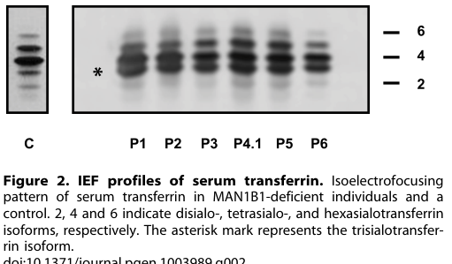

## Question

# Gene Research for Functional Annotation

## ⚠️ CRITICAL: Gene/Protein Identification Context

**BEFORE YOU BEGIN RESEARCH:** You MUST verify you are researching the CORRECT gene/protein. Gene symbols can be ambiguous, especially for less well-characterized genes from non-model organisms.

### Target Gene/Protein Identity (from UniProt):
- **UniProt Accession:** Q9UKM7
- **Protein Description:** RecName: Full=Endoplasmic reticulum mannosyl-oligosaccharide 1,2-alpha-mannosidase; EC=3.2.1.113 {ECO:0000269|PubMed:10409699, ECO:0000269|PubMed:12090241, ECO:0000269|PubMed:15713668}; AltName: Full=ER alpha-1,2-mannosidase; AltName: Full=ER mannosidase 1; Short=ERMan1; AltName: Full=Man9GlcNAc2-specific-processing alpha-mannosidase; AltName: Full=Mannosidase alpha class 1B member 1;
- **Gene Information:** Name=MAN1B1; ORFNames=UNQ747/PRO1477;
- **Organism (full):** Homo sapiens (Human).
- **Protein Family:** Belongs to the glycosyl hydrolase 47 family. .
- **Key Domains:** 6hp_glycosidase-like_sf. (IPR012341); Glyco_hydro_47. (IPR001382); Glycosyl_Hydrolase_47. (IPR050749); Seven-hairpin_glycosidases. (IPR036026); Glyco_hydro_47 (PF01532)

### MANDATORY VERIFICATION STEPS:

1. **Check if the gene symbol "MAN1B1" matches the protein description above**
2. **Verify the organism is correct:** Homo sapiens (Human).
3. **Check if protein family/domains align with what you find in literature**
4. **If you find literature for a DIFFERENT gene with the same or similar symbol, STOP**

### If Gene Symbol is Ambiguous or You Cannot Find Relevant Literature:

**DO NOT PROCEED WITH RESEARCH ON A DIFFERENT GENE.** Instead:
- State clearly: "The gene symbol 'MAN1B1' is ambiguous or literature is limited for this specific protein"
- Explain what you found (e.g., "Found extensive literature on a different gene with the same symbol in a different organism")
- Describe the protein based ONLY on the UniProt information provided above
- Suggest that the protein function can be inferred from domain/family information

### Research Target:

Please provide a comprehensive research report on the gene **MAN1B1** (gene ID: MAN1B1, UniProt: Q9UKM7) in human.

The research report should be a detailed narrative explaining the function, biological processes, and localization of the gene product. Citations should be given for all claims.

You should prioritize authoritative reviews and primary scientific literature when conducting research. You can supplement
this with annotations you find in gene/protein databases, but these can be outdated or inaccurate.

We are specifically interested in the primary function of the gene - for enzymes, what reaction is catalyzed, and what is the substrate specificity? For transporters, what is the substrate? For structural proteins or adapters, what is the broader structural role? For signaling molecules, what is the role in the pathway.

We are interested in where in or outside the cell the gene product carries out its function.

We are also interested in the signaling or biochemical pathways in which the gene functions. We are less interested in broad pleiotropic effects, except where these elucidate the precise role.

Include evidence where possible. We are interested in both experimental evidence as well as inference from structure, evolution, or bioinformatic analysis. Precise studies should be prioritized over high-throughput, where available.

## Output

Question: You are an expert researcher providing comprehensive, well-cited information.

Provide detailed information focusing on:
1. Key concepts and definitions with current understanding
2. Recent developments and latest research (prioritize 2023-2024 sources)
3. Current applications and real-world implementations
4. Expert opinions and analysis from authoritative sources
5. Relevant statistics and data from recent studies

Format as a comprehensive research report with proper citations. Include URLs and publication dates where available.
Always prioritize recent, authoritative sources and provide specific citations for all major claims.

# Gene Research for Functional Annotation

## ⚠️ CRITICAL: Gene/Protein Identification Context

**BEFORE YOU BEGIN RESEARCH:** You MUST verify you are researching the CORRECT gene/protein. Gene symbols can be ambiguous, especially for less well-characterized genes from non-model organisms.

### Target Gene/Protein Identity (from UniProt):
- **UniProt Accession:** Q9UKM7
- **Protein Description:** RecName: Full=Endoplasmic reticulum mannosyl-oligosaccharide 1,2-alpha-mannosidase; EC=3.2.1.113 {ECO:0000269|PubMed:10409699, ECO:0000269|PubMed:12090241, ECO:0000269|PubMed:15713668}; AltName: Full=ER alpha-1,2-mannosidase; AltName: Full=ER mannosidase 1; Short=ERMan1; AltName: Full=Man9GlcNAc2-specific-processing alpha-mannosidase; AltName: Full=Mannosidase alpha class 1B member 1;
- **Gene Information:** Name=MAN1B1; ORFNames=UNQ747/PRO1477;
- **Organism (full):** Homo sapiens (Human).
- **Protein Family:** Belongs to the glycosyl hydrolase 47 family. .
- **Key Domains:** 6hp_glycosidase-like_sf. (IPR012341); Glyco_hydro_47. (IPR001382); Glycosyl_Hydrolase_47. (IPR050749); Seven-hairpin_glycosidases. (IPR036026); Glyco_hydro_47 (PF01532)

### MANDATORY VERIFICATION STEPS:

1. **Check if the gene symbol "MAN1B1" matches the protein description above**
2. **Verify the organism is correct:** Homo sapiens (Human).
3. **Check if protein family/domains align with what you find in literature**
4. **If you find literature for a DIFFERENT gene with the same or similar symbol, STOP**

### If Gene Symbol is Ambiguous or You Cannot Find Relevant Literature:

**DO NOT PROCEED WITH RESEARCH ON A DIFFERENT GENE.** Instead:
- State clearly: "The gene symbol 'MAN1B1' is ambiguous or literature is limited for this specific protein"
- Explain what you found (e.g., "Found extensive literature on a different gene with the same symbol in a different organism")
- Describe the protein based ONLY on the UniProt information provided above
- Suggest that the protein function can be inferred from domain/family information

### Research Target:

Please provide a comprehensive research report on the gene **MAN1B1** (gene ID: MAN1B1, UniProt: Q9UKM7) in human.

The research report should be a detailed narrative explaining the function, biological processes, and localization of the gene product. Citations should be given for all claims.

You should prioritize authoritative reviews and primary scientific literature when conducting research. You can supplement
this with annotations you find in gene/protein databases, but these can be outdated or inaccurate.

We are specifically interested in the primary function of the gene - for enzymes, what reaction is catalyzed, and what is the substrate specificity? For transporters, what is the substrate? For structural proteins or adapters, what is the broader structural role? For signaling molecules, what is the role in the pathway.

We are interested in where in or outside the cell the gene product carries out its function.

We are also interested in the signaling or biochemical pathways in which the gene functions. We are less interested in broad pleiotropic effects, except where these elucidate the precise role.

Include evidence where possible. We are interested in both experimental evidence as well as inference from structure, evolution, or bioinformatic analysis. Precise studies should be prioritized over high-throughput, where available.

# Comprehensive Research Report: Human **MAN1B1** (UniProt: **Q9UKM7**) Functional Annotation

## 0. Target verification (critical identity check)
The target gene/protein in this report is **human MAN1B1**, encoding **endoplasmic reticulum α-1,2-mannosidase I (ERManI)**, a **type II membrane** class I α1,2-mannosidase of the **glycosyl hydrolase 47 (GH47)** family. This identity (MAN1B1 ⇔ ERManI) and architecture (N-terminal cytosolic tail, TM helix, luminal catalytic domain) are explicitly described in mechanistic studies on human Man1b1/ERManI. (pan2011golgilocalizationof pages 1-2, sun2020thecytoplasmictail pages 1-3)

**Key canonical references used for gene/protein verification and function:**
- Pan et al., *Molecular Biology of the Cell* (2011-08). https://doi.org/10.1091/mbc.e11-02-0118 (pan2011golgilocalizationof pages 1-2)
- Benyair et al., *Molecular Biology of the Cell* (2015-01). https://doi.org/10.1091/mbc.e14-06-1152 (benyair2015mammalianermannosidase pages 1-2)
- Sun et al., *PNAS* (2020-09). https://doi.org/10.1073/pnas.1919013117 (sun2020thecytoplasmictail pages 1-1)
- Rymen et al., *PLoS Genetics* (2013-12). https://doi.org/10.1371/journal.pgen.1003989 (rymen2013man1b1deficiencyan pages 1-2)

## 1. Key concepts and definitions (current understanding)

### 1.1 What MAN1B1 does (enzyme definition)
MAN1B1/ERManI is a **class I α1,2-mannosidase** that cleaves **α1,2-linked mannose residues** from high-mannose **N-glycans**. In the context of N-glycan processing and quality control, it is widely implicated in generating demannosylated glycan structures that can serve as **sorting signals** for misfolded glycoprotein disposal. (pan2011golgilocalizationof pages 2-3, benyair2015mammalianermannosidase pages 1-2)

### 1.2 Canonical biochemical reaction and substrate specificity
A central and clinically relevant activity attributed to MAN1B1 is trimming **Man9GlcNAc2 → Man8GlcNAc2 isomer B** by removing the **terminal mannose on the middle (B) branch**, which has been described as a recognized degradation-related signal. (rymen2013man1b1deficiencyan pages 1-2, benyair2015mammalianermannosidase pages 1-2)

Benyair et al. further report that ERManI **trims α1,2-linked mannose residues with preference for the B-branch terminal mannose**, supporting a branch preference relevant to ER quality control timing. (benyair2015mammalianermannosidase pages 1-2, benyair2015mammalianermannosidase pages 2-4)

### 1.3 MAN1B1 in ER glycoprotein quality control and ER-associated degradation (ERAD)
MAN1B1 is mechanistically linked to **N-glycan-dependent ER quality control (ERQC)** and **ERAD**. In this model, progressive demannosylation helps drive misfolded glycoproteins away from productive folding cycles and toward degradative pathways. Pan et al. describe ERManI as being capable of cleaving α1,2-mannose residues from Man9GlcNAc2 and show that wild-type ERManI can accelerate degradation of a model misfolded substrate (NHK), supporting its ERAD role. (pan2011golgilocalizationof pages 2-3, pan2011golgilocalizationof pages 9-10)

## 2. Subcellular localization and where MAN1B1 acts

### 2.1 A debated and dynamic localization: Golgi vs ER-derived quality control vesicles
A key area of expert discussion is **where MAN1B1 resides at steady state** and where it encounters substrates.

**Golgi/cis-Golgi model:** Pan et al. report endogenous ERManI as predominantly **Golgi-localized**, proposing spatial separation between folding/retention steps and later quality control tagging steps. In this view, Golgi localization is apparently important for its functional impact on ERAD, and forced redistribution can change trimming without necessarily increasing degradation. (pan2011golgilocalizationof pages 1-2, pan2011golgilocalizationof pages 9-10)

**ER-derived QCV/ERQC model:** Benyair et al. provide evidence that ERManI resides in **quality control vesicles (QCVs)** with **ER-like density**, separated from Golgi fractions, and localizes to a perinuclear ERQC region under stress. They note that fixation/immunofluorescence artifacts can make ERManI appear Golgi-localized, arguing that QCV/ERQC localization better explains substrate encounter. (benyair2015mammalianermannosidase pages 1-2, benyair2015mammalianermannosidase pages 2-4)

### 2.2 Implication
Taken together, these studies support a **trafficking- and stress-sensitive compartmentalization** model: MAN1B1 likely operates at the interface of ER and early secretory compartments, with localization influenced by cycling/vesicular organization, and its functional coupling to ERAD can depend on that compartmentalization. (pan2011golgilocalizationof pages 9-10, benyair2015mammalianermannosidase pages 2-4)

## 3. Mechanistic depth: catalysis-dependent and catalysis-independent functions

### 3.1 Catalysis-dependent (glycan trimming) ERAD contribution
The classical role is that the **luminal catalytic domain** trims mannose residues on N-glycans to create or promote degradative glycan signatures. Pan et al. show that ERManI expression can accelerate NHK degradation, consistent with a catalytic contribution to ERAD. (pan2011golgilocalizationof pages 2-3, pan2011golgilocalizationof pages 9-10)

### 3.2 Catalysis-independent (cytoplasmic tail) quality-control function
Sun et al. (PNAS, 2020-09-29) provide strong evidence that MAN1B1 has a second separable role: an **unconventional, catalysis-independent pathway** controlled by the **evolutionarily extended N-terminal cytoplasmic tail**.

Key experimental findings include:
- Tail involvement: deletion of residues **1–54** impairs Man1b1’s ability to accelerate degradation of misfolded AAT variants. (sun2020thecytoplasmictail pages 1-3, sun2020thecytoplasmictail pages 5-7)
- Independence from catalytic activity: the catalytic-dead mutant **D463N** still supports aspects of the unconventional clearance pathway, and combined tail deletion + catalytic inactivation strongly reduces clearance, consistent with two partially independent contributions. (sun2020thecytoplasmictail pages 3-4)
- **Independence from substrate N-glycans**: tail-mediated elimination of misfolded AAT was reported to be independent of the client’s glycosylation status, indicating this pathway does not require glycan trimming on the substrate. (sun2020thecytoplasmictail pages 1-1, sun2020thecytoplasmictail pages 5-7)
- Endpoint: proteasomal degradation is a key endpoint for Man1b1-promoted NHK degradation, supported by proteasome inhibitor effects. (sun2020thecytoplasmictail pages 5-7)

This tail-mediated function is an important modern refinement of MAN1B1 functional annotation because it implies MAN1B1 can contribute to proteostasis beyond direct substrate demannosylation. (sun2020thecytoplasmictail pages 9-11, sun2020thecytoplasmictail pages 1-1)

## 4. Disease relevance: MAN1B1-CDG (Rafiq syndrome)

### 4.1 Genetic disease association and phenotype
Rymen et al. (PLoS Genetics, 2013-12-05) identified **biallelic MAN1B1 mutations** causing a **CDG-II** phenotype (often referred to as **MAN1B1-CDG** and clinically associated with **Rafiq syndrome**). The phenotype described includes **developmental delay/psychomotor retardation**, **facial dysmorphism**, and **truncal obesity**, and patient fibroblasts showed **markedly dilated and fragmented Golgi morphology**, supporting secretory-pathway involvement. (rymen2013man1b1deficiencyan pages 1-2, rymen2013man1b1deficiencyan pages 2-3)

### 4.2 Biochemical signature / biomarkers (glycan phenotypes)
Rymen et al. provide quantitative and structural biomarker evidence:
- **Transferrin pattern:** serum transferrin isoelectrofocusing showed a **type 2 pattern** with markedly increased **trisialotransferrin (31–41%)** versus normal (1–8%). (rymen2013man1b1deficiencyan pages 3-4)
- **Hybrid N-glycans:** N-glycan mass spectrometry revealed accumulation of hybrid-type glycans, including **NeuAc1Hex6HexNAc3 (m/z 2390)** and **NeuAc1Hex5HexNAc3 (m/z 2186)**, often with fucosylated counterparts; these species were reported absent in controls. (rymen2013man1b1deficiencyan pages 3-4)
- **Processing delay:** metabolic labeling/pulse-chase in patient fibroblasts showed delayed trimming of Man9GlcNAc2 to Man8GlcNAc2 with accumulation of **Man9GlcNAc2 and Glc1Man9GlcNAc2** species. (rymen2013man1b1deficiencyan pages 4-7)

Visual evidence supporting these diagnostic findings (transferrin profiles and MALDI-TOF N-glycan profiles) was retrieved from the paper’s figures. (rymen2013man1b1deficiencyan media f357a49a, rymen2013man1b1deficiencyan media 50a6e23d, rymen2013man1b1deficiencyan media 194a2f89)

A later diagnostic review emphasizes that the **presence of hybrid glycans on transferrin may be indicative of MAN1B1-CDG**, underscoring that this remains a clinically actionable glycan signature. (Wada, 2025-02-14; https://doi.org/10.5702/massspectrometry.a0169) (wada2025massspectrometryas pages 5-6)

## 5. Recent developments (prioritizing 2023–2024)

### 5.1 2023: Modern glycoproteomics to map class I mannosidase–sensitive secretory cargo
A 2023 study developed a targeted glyco/deglycoproteomics workflow using **kifunensine** (a class I mannosidase inhibitor) to delineate oligomannosidic glycoproteins and glycosites in the early secretory pathway. Although not MAN1B1-specific, this work operationalizes how MAN1B1-class trimming is perturbed and quantified at scale (lectin enrichment + Endo H digestion + high-resolution MS), enabling identification of class I mannosidase-dependent substrate candidates relevant to ERQC/ERAD biology. (Munteanu et al., 2023-01-10; https://doi.org/10.3389/fmolb.2022.1064868) (munteanu2023definingthealtered pages 1-2, munteanu2023definingthealtered pages 2-3)

This paper also explicitly states that class I mannosidases cleave **only α1,2-linked mannose residues** and that kifunensine leads to accumulation of unprocessed oligomannose (e.g., Man9) glycoforms—important experimental context for functional studies of MAN1B1. (munteanu2023definingthealtered pages 7-8)

### 5.2 2024: Real-world clinical implementation—clinical exome sequencing identifies Rafiq syndrome and yields actionable diagnoses
Baz et al. (Frontiers in Pediatrics, 2024-04-25) provide real-world evidence that clinical exome sequencing ordered by general pediatricians can identify MAN1B1-related disease. They report a patient homozygous for **MAN1B1 NM_016219.5:c.2072A>G p.(His691Arg)** diagnosed with **Rafiq syndrome (OMIM #614202)** (in a dual molecular diagnosis). (https://doi.org/10.3389/fped.2024.1392444) (baz2024clinicalexomesequencing pages 5-6, baz2024clinicalexomesequencing pages 4-5)

Quantitatively, their cohort (n=30) had:
- Diagnostic yield: **11/30 (36.7%)** positive; **3/30 (10%)** VUS; **16/30 (53%)** negative. (baz2024clinicalexomesequencing pages 1-2, baz2024clinicalexomesequencing pages 2-3)
- Reported clinical utility in **all 11/11** positive cases (100%), with several downstream impacts (e.g., subsequent testing, targeted therapy). (baz2024clinicalexomesequencing pages 1-2, baz2024clinicalexomesequencing pages 2-3)

These 2024 data primarily advance MAN1B1’s **clinical implementation context** (diagnostic workflows and utility), rather than revising its enzymology.

## 6. Current applications and real-world implementations

### 6.1 Clinical diagnostics (MAN1B1-CDG / Rafiq syndrome)
Current diagnostic practice supported by the cited literature combines:
1) **Genetic diagnosis** (exome sequencing) for suspected syndromic neurodevelopmental phenotypes (e.g., Rafiq syndrome diagnosis via homozygous MAN1B1 variant). (baz2024clinicalexomesequencing pages 5-6, yalcintepe2023clinicalexomesequencing pages 5-8)
2) **Biochemical confirmation / pathway localization** using:
   - **Transferrin isoelectrofocusing/capillary zone electrophoresis** to detect CDG-II patterns and quantify abnormal trisialotransferrin. (rymen2013man1b1deficiencyan pages 3-4)
   - **Serum N-glycan MS** (e.g., MALDI-TOF of permethylated N-glycans) identifying hybrid glycan accumulation, including specific m/z species. (rymen2013man1b1deficiencyan pages 3-4)

### 6.2 Research/biotechnology applications
- **Kifunensine** is a practical tool compound to inhibit class I mannosidases (including MAN1B1-class activity) and interrogate effects on glycoprotein maturation versus ERAD targeting in cells. (munteanu2023definingthealtered pages 1-2, munteanu2023definingthealtered pages 7-8)
- Glycoproteomics workflows can quantify glycosite-level macro- and microheterogeneity under mannosidase inhibition, enabling identification of endogenous candidate substrates and mechanistic inference about early secretory pathway clients. (munteanu2023definingthealtered pages 2-3)

## 7. Expert opinions, analysis, and unresolved questions

### 7.1 Compartmentalization controversy: how to reconcile Golgi vs ER/QCV evidence
Primary papers provide conflicting steady-state localizations (Golgi vs ER-derived QCV/ERQC). Pan et al. propose a Golgi-localized ERManI model linked to ERAD regulation, whereas Benyair et al. argue Golgi appearance can be artifactual and support QCV localization using fractionation and optimized imaging. (pan2011golgilocalizationof pages 1-2, benyair2015mammalianermannosidase pages 1-2)

A reasonable synthesis of these authoritative sources is that MAN1B1 is part of a **distributed quality-control network** whose functional output depends on **dynamic trafficking and compartment convergence** under stress, rather than being restricted to a single static organelle address. (pan2011golgilocalizationof pages 9-10, benyair2015mammalianermannosidase pages 2-4)

### 7.2 Functional dichotomy: trimming enzyme versus tail-mediated proteostasis factor
Sun et al. add a conceptually important refinement: MAN1B1 is not solely a glycan-trimming timer but can also participate in **catalysis-independent, glycan-independent** degradation promotion via its cytosolic tail. This creates a framework where pathogenic MAN1B1 variants could impair one or both functional axes (enzymatic trimming and/or trafficking/recruitment functions), potentially contributing to variable phenotypes. (sun2020thecytoplasmictail pages 1-1, sun2020thecytoplasmictail pages 3-4)

## 8. Summary evidence map
The following table consolidates the major functional and clinical claims with supporting evidence.

| Topic | Key points | Representative evidence/source | Citation IDs |
|---|---|---|---|
| Identity/domains | • Human **MAN1B1** encodes **ERManI/ER α1,2-mannosidase I** linked to UniProt **Q9UKM7**. • It is a **type II membrane** glycosidase in the **GH47/class I α1,2-mannosidase** family. • Protein architecture includes an **N-terminal cytosolic tail**, **TM segment**, and **luminal catalytic domain**. | Pan 2011; Sun 2020 | (pan2011golgilocalizationof pages 1-2, sun2020thecytoplasmictail pages 1-3) |
| Catalytic reaction | • Catalyzes removal of **α1,2-linked mannose** residues from high-mannose N-glycans. • Canonical reaction highlighted for MAN1B1 is **Man9GlcNAc2 → Man8GlcNAc2 isomer B**. • Overexpression studies also support further trimming toward **Man5-7GlcNAc2** in cells. | Rymen 2013; Pan 2011; Zhang 2021 review | (rymen2013man1b1deficiencyan pages 1-2, pan2011golgilocalizationof pages 2-3, zhang2021thecrucialrole pages 14-15) |
| Substrate specificity | • Shows preference for the **B-branch terminal mannose** of **Man9GlcNAc2**. • Substrates are mainly **N-glycosylated secretory pathway glycoproteins**, especially misfolded ERAD clients. • Class I mannosidases cleave **only α1,2-linked mannose** residues; kifunensine blocks this processing and causes **Man9** accumulation. | Benyair 2015; Munteanu 2023 | (benyair2015mammalianermannosidase pages 1-2, benyair2015mammalianermannosidase pages 2-4, munteanu2023definingthealtered pages 7-8) |
| Localization | • Localization is **debated/dynamic**: endogenous MAN1B1 was reported in the **Golgi/cis-Golgi** by some studies. • Other work places it in **ER-derived quality control vesicles (QCVs)** and the **ER quality control compartment (ERQC)**, distinct from Golgi under optimized imaging/fractionation. • Trafficking/localization may be stress-sensitive and influenced by **COPI/COPII-related cycling**. | Pan 2011; Rymen 2013; Benyair 2015 | (pan2011golgilocalizationof pages 1-2, rymen2013man1b1deficiencyan pages 2-3, benyair2015mammalianermannosidase pages 1-2, benyair2015mammalianermannosidase pages 2-4) |
| ERAD roles | • Mannose trimming by MAN1B1 helps generate the **glycan timer/sorting signal** that routes terminally misfolded glycoproteins from folding cycles to **ER-associated degradation (ERAD)**. • WT MAN1B1 accelerates degradation of model ERAD substrates such as **NHK** and influences degradation of **ATZ/PIZ**-related clients. • Inhibition or knockdown of class I mannosidase activity impairs ERAD, supporting a causal role. | Pan 2011; Zhang 2021 review; Munteanu 2023 | (pan2011golgilocalizationof pages 9-10, pan2011golgilocalizationof pages 2-3, zhang2021thecrucialrole pages 14-15, munteanu2023definingthealtered pages 1-2) |
| Catalysis-independent role | • MAN1B1 has a second, **catalysis-independent** quality-control activity mediated by the **N-terminal cytoplasmic tail (aa 1-54)**. • This pathway can promote **proteasomal degradation** of misfolded AAT variants even when MAN1B1 catalytic activity is disabled. • Tail-dependent activity is **independent of N-glycans on the client substrate**, implying a noncanonical recruitment/sorting role. | Sun 2020 | (sun2020thecytoplasmictail pages 9-11, sun2020thecytoplasmictail pages 1-1, sun2020thecytoplasmictail pages 5-7, sun2020thecytoplasmictail pages 3-4) |
| Disease association | • **Biallelic MAN1B1 variants** cause **MAN1B1-CDG / Rafiq syndrome**, a **CDG-II** processing defect. • Core phenotype includes **developmental delay/intellectual disability**, **facial dysmorphism**, and often **truncal obesity**. • Patient cells also show **Golgi fragmentation/dilatation**, linking enzyme deficiency to secretory-pathway dysfunction. | Rymen 2013; Baz 2024; Yalcintepe 2023 | (rymen2013man1b1deficiencyan pages 1-2, rymen2013man1b1deficiencyan pages 2-3, baz2024clinicalexomesequencing pages 5-6, yalcintepe2023clinicalexomesequencing pages 5-8) |
| Diagnostic biomarkers | • Serum transferrin testing shows a **type II pattern** with markedly increased **trisialotransferrin**. • Serum N-glycan MS reveals distinctive **hybrid glycans**, including **NeuAc1Hex6HexNAc3** and **NeuAc1Hex5HexNAc3**, often with **fucosylated counterparts**. • A 2025 diagnostic review highlights **hybrid glycans on transferrin** as a characteristic clue for MAN1B1-CDG. | Rymen 2013; Wada 2025 | (rymen2013man1b1deficiencyan pages 3-4, rymen2013man1b1deficiencyan pages 4-7, wada2025massspectrometryas pages 5-6) |
| Experimental tools/applications | • **Kifunensine** is a widely used **class I mannosidase inhibitor** to probe MAN1B1-class trimming and ERQC/ERAD function. • Modern workflows combine **lectin enrichment, Endo H digestion, and LC-MS/MS glycoproteomics** to identify class I mannosidase-dependent substrates. • Clinical implementation includes **exome sequencing** plus **transferrin glycoform/MS glycan profiling** for diagnosis. | Munteanu 2023; Wada 2025; Baz 2024 | (munteanu2023definingthealtered pages 2-3, munteanu2023definingthealtered pages 1-2, munteanu2023definingthealtered pages 7-8, wada2025massspectrometryas pages 5-6, baz2024clinicalexomesequencing pages 1-2) |
| Recent (2023-2024) developments | • **2023 glycoproteomics** work expanded practical mapping of class I mannosidase-sensitive glycoproteins and early secretory pathway cargo under **kifunensine** perturbation. • **2024 clinical exome** data show real-world diagnostic utility, including a patient diagnosed with **Rafiq syndrome** due to homozygous **MAN1B1 p.His691Arg**. • Recent disease-focused literature emphasizes improved **molecular diagnostics** and phenotypic recognition of glycosylation disorders, including MAN1B1-CDG. | Munteanu 2023; Baz 2024 | (munteanu2023definingthealtered pages 2-3, munteanu2023definingthealtered pages 1-2, baz2024clinicalexomesequencing pages 5-6, baz2024clinicalexomesequencing pages 4-5) |

*Table: This table summarizes the core functional annotation of human MAN1B1/ERManI, including catalytic activity, localization, ERAD roles, disease links, and recent diagnostic/experimental developments. It is useful as a compact evidence map for interpreting the gene’s molecular function and clinical relevance.*

## 9. Key figures (diagnostic glycan phenotype)
- Transferrin IEF and serum N-glycan MALDI-TOF profiles illustrating MAN1B1-CDG signatures (type II pattern; hybrid glycan accumulation) are shown in cropped figures from Rymen et al. (2013). (rymen2013man1b1deficiencyan media f357a49a, rymen2013man1b1deficiencyan media 50a6e23d, rymen2013man1b1deficiencyan media 194a2f89)

## 10. Limitations of this evidence set
- The retrieved corpus contains relatively few **2023–2024 MAN1B1-specific mechanistic** studies; recent advances captured here are primarily **methodological (glycoproteomics)** and **clinical-implementation (exome sequencing)** rather than new enzyme mechanism. (munteanu2023definingthealtered pages 1-2, baz2024clinicalexomesequencing pages 5-6)
- Prevalence estimates and comprehensive variant-count statistics for MAN1B1-CDG were not available in the retrieved documents; therefore, this report does not provide prevalence rates beyond the cited cohort-level diagnostic yields and biomarker frequencies. (baz2024clinicalexomesequencing pages 1-2, rymen2013man1b1deficiencyan pages 3-4)

References

1. (pan2011golgilocalizationof pages 1-2): Shujuan Pan, Shufang Wang, Budi Utama, Lu Huang, Neil Blok, Mary K. Estes, Kelley W. Moremen, and Richard N. Sifers. Golgi localization of ermani defines spatial separation of the mammalian glycoprotein quality control system. Molecular Biology of the Cell, 22:2810-2822, Aug 2011. URL: https://doi.org/10.1091/mbc.e11-02-0118, doi:10.1091/mbc.e11-02-0118. This article has 95 citations and is from a domain leading peer-reviewed journal.

2. (sun2020thecytoplasmictail pages 1-3): Ashlee H. Sun, John R. Collette, and Richard N. Sifers. The cytoplasmic tail of human mannosidase man1b1 contributes to catalysis-independent quality control of misfolded alpha1-antitrypsin. Proceedings of the National Academy of Sciences, 117:24825-24836, Sep 2020. URL: https://doi.org/10.1073/pnas.1919013117, doi:10.1073/pnas.1919013117. This article has 23 citations and is from a highest quality peer-reviewed journal.

3. (benyair2015mammalianermannosidase pages 1-2): Ron Benyair, Navit Ogen-Shtern, Niv Mazkereth, Ben Shai, Marcelo Ehrlich, and Gerardo Z. Lederkremer. Mammalian er mannosidase i resides in quality control vesicles, where it encounters its glycoprotein substrates. Molecular Biology of the Cell, 26:172-184, Jan 2015. URL: https://doi.org/10.1091/mbc.e14-06-1152, doi:10.1091/mbc.e14-06-1152. This article has 74 citations and is from a domain leading peer-reviewed journal.

4. (sun2020thecytoplasmictail pages 1-1): Ashlee H. Sun, John R. Collette, and Richard N. Sifers. The cytoplasmic tail of human mannosidase man1b1 contributes to catalysis-independent quality control of misfolded alpha1-antitrypsin. Proceedings of the National Academy of Sciences, 117:24825-24836, Sep 2020. URL: https://doi.org/10.1073/pnas.1919013117, doi:10.1073/pnas.1919013117. This article has 23 citations and is from a highest quality peer-reviewed journal.

5. (rymen2013man1b1deficiencyan pages 1-2): Daisy Rymen, Romain Peanne, María B. Millón, Valérie Race, Luisa Sturiale, Domenico Garozzo, Philippa Mills, Peter Clayton, Carla G. Asteggiano, Dulce Quelhas, Ali Cansu, Esmeralda Martins, Marie-Cécile Nassogne, Miguel Gonçalves-Rocha, Haluk Topaloglu, Jaak Jaeken, François Foulquier, and Gert Matthijs. Man1b1 deficiency: an unexpected cdg-ii. PLoS Genetics, 9:e1003989, Dec 2013. URL: https://doi.org/10.1371/journal.pgen.1003989, doi:10.1371/journal.pgen.1003989. This article has 102 citations and is from a domain leading peer-reviewed journal.

6. (pan2011golgilocalizationof pages 2-3): Shujuan Pan, Shufang Wang, Budi Utama, Lu Huang, Neil Blok, Mary K. Estes, Kelley W. Moremen, and Richard N. Sifers. Golgi localization of ermani defines spatial separation of the mammalian glycoprotein quality control system. Molecular Biology of the Cell, 22:2810-2822, Aug 2011. URL: https://doi.org/10.1091/mbc.e11-02-0118, doi:10.1091/mbc.e11-02-0118. This article has 95 citations and is from a domain leading peer-reviewed journal.

7. (benyair2015mammalianermannosidase pages 2-4): Ron Benyair, Navit Ogen-Shtern, Niv Mazkereth, Ben Shai, Marcelo Ehrlich, and Gerardo Z. Lederkremer. Mammalian er mannosidase i resides in quality control vesicles, where it encounters its glycoprotein substrates. Molecular Biology of the Cell, 26:172-184, Jan 2015. URL: https://doi.org/10.1091/mbc.e14-06-1152, doi:10.1091/mbc.e14-06-1152. This article has 74 citations and is from a domain leading peer-reviewed journal.

8. (pan2011golgilocalizationof pages 9-10): Shujuan Pan, Shufang Wang, Budi Utama, Lu Huang, Neil Blok, Mary K. Estes, Kelley W. Moremen, and Richard N. Sifers. Golgi localization of ermani defines spatial separation of the mammalian glycoprotein quality control system. Molecular Biology of the Cell, 22:2810-2822, Aug 2011. URL: https://doi.org/10.1091/mbc.e11-02-0118, doi:10.1091/mbc.e11-02-0118. This article has 95 citations and is from a domain leading peer-reviewed journal.

9. (sun2020thecytoplasmictail pages 5-7): Ashlee H. Sun, John R. Collette, and Richard N. Sifers. The cytoplasmic tail of human mannosidase man1b1 contributes to catalysis-independent quality control of misfolded alpha1-antitrypsin. Proceedings of the National Academy of Sciences, 117:24825-24836, Sep 2020. URL: https://doi.org/10.1073/pnas.1919013117, doi:10.1073/pnas.1919013117. This article has 23 citations and is from a highest quality peer-reviewed journal.

10. (sun2020thecytoplasmictail pages 3-4): Ashlee H. Sun, John R. Collette, and Richard N. Sifers. The cytoplasmic tail of human mannosidase man1b1 contributes to catalysis-independent quality control of misfolded alpha1-antitrypsin. Proceedings of the National Academy of Sciences, 117:24825-24836, Sep 2020. URL: https://doi.org/10.1073/pnas.1919013117, doi:10.1073/pnas.1919013117. This article has 23 citations and is from a highest quality peer-reviewed journal.

11. (sun2020thecytoplasmictail pages 9-11): Ashlee H. Sun, John R. Collette, and Richard N. Sifers. The cytoplasmic tail of human mannosidase man1b1 contributes to catalysis-independent quality control of misfolded alpha1-antitrypsin. Proceedings of the National Academy of Sciences, 117:24825-24836, Sep 2020. URL: https://doi.org/10.1073/pnas.1919013117, doi:10.1073/pnas.1919013117. This article has 23 citations and is from a highest quality peer-reviewed journal.

12. (rymen2013man1b1deficiencyan pages 2-3): Daisy Rymen, Romain Peanne, María B. Millón, Valérie Race, Luisa Sturiale, Domenico Garozzo, Philippa Mills, Peter Clayton, Carla G. Asteggiano, Dulce Quelhas, Ali Cansu, Esmeralda Martins, Marie-Cécile Nassogne, Miguel Gonçalves-Rocha, Haluk Topaloglu, Jaak Jaeken, François Foulquier, and Gert Matthijs. Man1b1 deficiency: an unexpected cdg-ii. PLoS Genetics, 9:e1003989, Dec 2013. URL: https://doi.org/10.1371/journal.pgen.1003989, doi:10.1371/journal.pgen.1003989. This article has 102 citations and is from a domain leading peer-reviewed journal.

13. (rymen2013man1b1deficiencyan pages 3-4): Daisy Rymen, Romain Peanne, María B. Millón, Valérie Race, Luisa Sturiale, Domenico Garozzo, Philippa Mills, Peter Clayton, Carla G. Asteggiano, Dulce Quelhas, Ali Cansu, Esmeralda Martins, Marie-Cécile Nassogne, Miguel Gonçalves-Rocha, Haluk Topaloglu, Jaak Jaeken, François Foulquier, and Gert Matthijs. Man1b1 deficiency: an unexpected cdg-ii. PLoS Genetics, 9:e1003989, Dec 2013. URL: https://doi.org/10.1371/journal.pgen.1003989, doi:10.1371/journal.pgen.1003989. This article has 102 citations and is from a domain leading peer-reviewed journal.

14. (rymen2013man1b1deficiencyan pages 4-7): Daisy Rymen, Romain Peanne, María B. Millón, Valérie Race, Luisa Sturiale, Domenico Garozzo, Philippa Mills, Peter Clayton, Carla G. Asteggiano, Dulce Quelhas, Ali Cansu, Esmeralda Martins, Marie-Cécile Nassogne, Miguel Gonçalves-Rocha, Haluk Topaloglu, Jaak Jaeken, François Foulquier, and Gert Matthijs. Man1b1 deficiency: an unexpected cdg-ii. PLoS Genetics, 9:e1003989, Dec 2013. URL: https://doi.org/10.1371/journal.pgen.1003989, doi:10.1371/journal.pgen.1003989. This article has 102 citations and is from a domain leading peer-reviewed journal.

15. (rymen2013man1b1deficiencyan media f357a49a): Daisy Rymen, Romain Peanne, María B. Millón, Valérie Race, Luisa Sturiale, Domenico Garozzo, Philippa Mills, Peter Clayton, Carla G. Asteggiano, Dulce Quelhas, Ali Cansu, Esmeralda Martins, Marie-Cécile Nassogne, Miguel Gonçalves-Rocha, Haluk Topaloglu, Jaak Jaeken, François Foulquier, and Gert Matthijs. Man1b1 deficiency: an unexpected cdg-ii. PLoS Genetics, 9:e1003989, Dec 2013. URL: https://doi.org/10.1371/journal.pgen.1003989, doi:10.1371/journal.pgen.1003989. This article has 102 citations and is from a domain leading peer-reviewed journal.

16. (rymen2013man1b1deficiencyan media 50a6e23d): Daisy Rymen, Romain Peanne, María B. Millón, Valérie Race, Luisa Sturiale, Domenico Garozzo, Philippa Mills, Peter Clayton, Carla G. Asteggiano, Dulce Quelhas, Ali Cansu, Esmeralda Martins, Marie-Cécile Nassogne, Miguel Gonçalves-Rocha, Haluk Topaloglu, Jaak Jaeken, François Foulquier, and Gert Matthijs. Man1b1 deficiency: an unexpected cdg-ii. PLoS Genetics, 9:e1003989, Dec 2013. URL: https://doi.org/10.1371/journal.pgen.1003989, doi:10.1371/journal.pgen.1003989. This article has 102 citations and is from a domain leading peer-reviewed journal.

17. (rymen2013man1b1deficiencyan media 194a2f89): Daisy Rymen, Romain Peanne, María B. Millón, Valérie Race, Luisa Sturiale, Domenico Garozzo, Philippa Mills, Peter Clayton, Carla G. Asteggiano, Dulce Quelhas, Ali Cansu, Esmeralda Martins, Marie-Cécile Nassogne, Miguel Gonçalves-Rocha, Haluk Topaloglu, Jaak Jaeken, François Foulquier, and Gert Matthijs. Man1b1 deficiency: an unexpected cdg-ii. PLoS Genetics, 9:e1003989, Dec 2013. URL: https://doi.org/10.1371/journal.pgen.1003989, doi:10.1371/journal.pgen.1003989. This article has 102 citations and is from a domain leading peer-reviewed journal.

18. (wada2025massspectrometryas pages 5-6): Yoshinao Wada. Mass spectrometry as a first-line diagnostic aid for congenital disorders of glycosylation. Mass Spectrometry, 14:A0169-A0169, Feb 2025. URL: https://doi.org/10.5702/massspectrometry.a0169, doi:10.5702/massspectrometry.a0169. This article has 4 citations.

19. (munteanu2023definingthealtered pages 1-2): Cristian V. A. Munteanu, Gabriela N. Chirițoiu, Andrei-Jose Petrescu, and Ștefana M. Petrescu. Defining the altered glycoproteomic space of the early secretory pathway by class i mannosidase pharmacological inhibition. Frontiers in Molecular Biosciences, Jan 2023. URL: https://doi.org/10.3389/fmolb.2022.1064868, doi:10.3389/fmolb.2022.1064868. This article has 4 citations.

20. (munteanu2023definingthealtered pages 2-3): Cristian V. A. Munteanu, Gabriela N. Chirițoiu, Andrei-Jose Petrescu, and Ștefana M. Petrescu. Defining the altered glycoproteomic space of the early secretory pathway by class i mannosidase pharmacological inhibition. Frontiers in Molecular Biosciences, Jan 2023. URL: https://doi.org/10.3389/fmolb.2022.1064868, doi:10.3389/fmolb.2022.1064868. This article has 4 citations.

21. (munteanu2023definingthealtered pages 7-8): Cristian V. A. Munteanu, Gabriela N. Chirițoiu, Andrei-Jose Petrescu, and Ștefana M. Petrescu. Defining the altered glycoproteomic space of the early secretory pathway by class i mannosidase pharmacological inhibition. Frontiers in Molecular Biosciences, Jan 2023. URL: https://doi.org/10.3389/fmolb.2022.1064868, doi:10.3389/fmolb.2022.1064868. This article has 4 citations.

22. (baz2024clinicalexomesequencing pages 5-6): Danya Salah Baz, Dareen Baz, Fawzah Alrwuili, Abdullah Aldowaish, Hanan E. Shamseldin, Ayman Elhomoudi, and Fowzan S. Alkuraya. Clinical exome sequencing by general pediatricians: high clinical utility and no evidence of inappropriate testing. Frontiers in Pediatrics, Apr 2024. URL: https://doi.org/10.3389/fped.2024.1392444, doi:10.3389/fped.2024.1392444. This article has 3 citations.

23. (baz2024clinicalexomesequencing pages 4-5): Danya Salah Baz, Dareen Baz, Fawzah Alrwuili, Abdullah Aldowaish, Hanan E. Shamseldin, Ayman Elhomoudi, and Fowzan S. Alkuraya. Clinical exome sequencing by general pediatricians: high clinical utility and no evidence of inappropriate testing. Frontiers in Pediatrics, Apr 2024. URL: https://doi.org/10.3389/fped.2024.1392444, doi:10.3389/fped.2024.1392444. This article has 3 citations.

24. (baz2024clinicalexomesequencing pages 1-2): Danya Salah Baz, Dareen Baz, Fawzah Alrwuili, Abdullah Aldowaish, Hanan E. Shamseldin, Ayman Elhomoudi, and Fowzan S. Alkuraya. Clinical exome sequencing by general pediatricians: high clinical utility and no evidence of inappropriate testing. Frontiers in Pediatrics, Apr 2024. URL: https://doi.org/10.3389/fped.2024.1392444, doi:10.3389/fped.2024.1392444. This article has 3 citations.

25. (baz2024clinicalexomesequencing pages 2-3): Danya Salah Baz, Dareen Baz, Fawzah Alrwuili, Abdullah Aldowaish, Hanan E. Shamseldin, Ayman Elhomoudi, and Fowzan S. Alkuraya. Clinical exome sequencing by general pediatricians: high clinical utility and no evidence of inappropriate testing. Frontiers in Pediatrics, Apr 2024. URL: https://doi.org/10.3389/fped.2024.1392444, doi:10.3389/fped.2024.1392444. This article has 3 citations.

26. (yalcintepe2023clinicalexomesequencing pages 5-8): Sinem Yalcintepe, Isik Gorker, Leyla Bozatli, Hazal Sezginer Guler, Drenushe Zhuri, Selma Demir, Emine Ikbal Atli, Engin Atli, Damla Eker, and Hakan Gurkan. Clinical exome sequencing reveals an important role for clinical diagnosis of intellectual disability with definition of seven novel variants. Neurology Asia, 28:1041-1052, Dec 2023. URL: https://doi.org/10.54029/2023rfz, doi:10.54029/2023rfz. This article has 2 citations and is from a peer-reviewed journal.

27. (zhang2021thecrucialrole pages 14-15): Jianjun Zhang, Jiarui Wu, Linchuan Liu, and Jianming Li. The crucial role of demannosylating asparagine-linked glycans in eradicating misfolded glycoproteins in the endoplasmic reticulum. Frontiers in Plant Science, Jan 2021. URL: https://doi.org/10.3389/fpls.2020.625033, doi:10.3389/fpls.2020.625033. This article has 30 citations.

## Artifacts

- [Edison artifact artifact-00](MAN1B1-deep-research-falcon_artifacts/artifact-00.md)

## Citations

1. pan2011golgilocalizationof pages 1-2
2. benyair2015mammalianermannosidase pages 1-2
3. sun2020thecytoplasmictail pages 1-1
4. sun2020thecytoplasmictail pages 3-4
5. sun2020thecytoplasmictail pages 5-7
6. wada2025massspectrometryas pages 5-6
7. munteanu2023definingthealtered pages 7-8
8. munteanu2023definingthealtered pages 2-3
9. sun2020thecytoplasmictail pages 1-3
10. pan2011golgilocalizationof pages 2-3
11. benyair2015mammalianermannosidase pages 2-4
12. pan2011golgilocalizationof pages 9-10
13. sun2020thecytoplasmictail pages 9-11
14. munteanu2023definingthealtered pages 1-2
15. baz2024clinicalexomesequencing pages 5-6
16. baz2024clinicalexomesequencing pages 4-5
17. baz2024clinicalexomesequencing pages 1-2
18. baz2024clinicalexomesequencing pages 2-3
19. yalcintepe2023clinicalexomesequencing pages 5-8
20. zhang2021thecrucialrole pages 14-15
21. https://doi.org/10.1091/mbc.e11-02-0118
22. https://doi.org/10.1091/mbc.e14-06-1152
23. https://doi.org/10.1073/pnas.1919013117
24. https://doi.org/10.1371/journal.pgen.1003989
25. https://doi.org/10.5702/massspectrometry.a0169
26. https://doi.org/10.3389/fmolb.2022.1064868
27. https://doi.org/10.3389/fped.2024.1392444
28. https://doi.org/10.1091/mbc.e11-02-0118,
29. https://doi.org/10.1073/pnas.1919013117,
30. https://doi.org/10.1091/mbc.e14-06-1152,
31. https://doi.org/10.1371/journal.pgen.1003989,
32. https://doi.org/10.5702/massspectrometry.a0169,
33. https://doi.org/10.3389/fmolb.2022.1064868,
34. https://doi.org/10.3389/fped.2024.1392444,
35. https://doi.org/10.54029/2023rfz,
36. https://doi.org/10.3389/fpls.2020.625033,