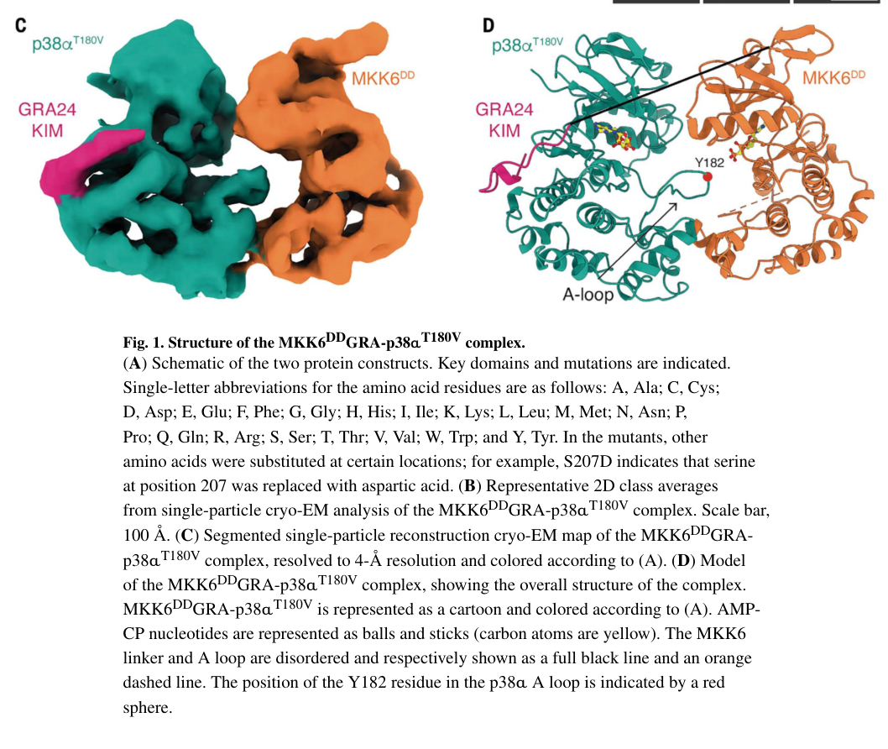

## Question

# Gene Research for Functional Annotation

## ⚠️ CRITICAL: Gene/Protein Identification Context

**BEFORE YOU BEGIN RESEARCH:** You MUST verify you are researching the CORRECT gene/protein. Gene symbols can be ambiguous, especially for less well-characterized genes from non-model organisms.

### Target Gene/Protein Identity (from UniProt):
- **UniProt Accession:** P52564
- **Protein Description:** RecName: Full=Dual specificity mitogen-activated protein kinase kinase 6; Short=MAP kinase kinase 6; Short=MAPKK 6; EC=2.7.12.2; AltName: Full=MAPK/ERK kinase 6; Short=MEK 6; AltName: Full=Stress-activated protein kinase kinase 3; Short=SAPK kinase 3; Short=SAPKK-3; Short=SAPKK3;
- **Gene Information:** Name=MAP2K6; Synonyms=MEK6, MKK6, PRKMK6, SKK3;
- **Organism (full):** Homo sapiens (Human).
- **Protein Family:** Belongs to the protein kinase superfamily. STE Ser/Thr
- **Key Domains:** Kinase-like_dom_sf. (IPR011009); Prot_kinase_dom. (IPR000719); Protein_kinase_ATP_BS. (IPR017441); Ser/Thr_kinase_AS. (IPR008271); Pkinase (PF00069)

### MANDATORY VERIFICATION STEPS:

1. **Check if the gene symbol "MAP2K6" matches the protein description above**
2. **Verify the organism is correct:** Homo sapiens (Human).
3. **Check if protein family/domains align with what you find in literature**
4. **If you find literature for a DIFFERENT gene with the same or similar symbol, STOP**

### If Gene Symbol is Ambiguous or You Cannot Find Relevant Literature:

**DO NOT PROCEED WITH RESEARCH ON A DIFFERENT GENE.** Instead:
- State clearly: "The gene symbol 'MAP2K6' is ambiguous or literature is limited for this specific protein"
- Explain what you found (e.g., "Found extensive literature on a different gene with the same symbol in a different organism")
- Describe the protein based ONLY on the UniProt information provided above
- Suggest that the protein function can be inferred from domain/family information

### Research Target:

Please provide a comprehensive research report on the gene **MAP2K6** (gene ID: MAP2K6, UniProt: P52564) in human.

The research report should be a detailed narrative explaining the function, biological processes, and localization of the gene product. Citations should be given for all claims.

You should prioritize authoritative reviews and primary scientific literature when conducting research. You can supplement
this with annotations you find in gene/protein databases, but these can be outdated or inaccurate.

We are specifically interested in the primary function of the gene - for enzymes, what reaction is catalyzed, and what is the substrate specificity? For transporters, what is the substrate? For structural proteins or adapters, what is the broader structural role? For signaling molecules, what is the role in the pathway.

We are interested in where in or outside the cell the gene product carries out its function.

We are also interested in the signaling or biochemical pathways in which the gene functions. We are less interested in broad pleiotropic effects, except where these elucidate the precise role.

Include evidence where possible. We are interested in both experimental evidence as well as inference from structure, evolution, or bioinformatic analysis. Precise studies should be prioritized over high-throughput, where available.

## Output

Question: You are an expert researcher providing comprehensive, well-cited information.

Provide detailed information focusing on:
1. Key concepts and definitions with current understanding
2. Recent developments and latest research (prioritize 2023-2024 sources)
3. Current applications and real-world implementations
4. Expert opinions and analysis from authoritative sources
5. Relevant statistics and data from recent studies

Format as a comprehensive research report with proper citations. Include URLs and publication dates where available.
Always prioritize recent, authoritative sources and provide specific citations for all major claims.

# Gene Research for Functional Annotation

## ⚠️ CRITICAL: Gene/Protein Identification Context

**BEFORE YOU BEGIN RESEARCH:** You MUST verify you are researching the CORRECT gene/protein. Gene symbols can be ambiguous, especially for less well-characterized genes from non-model organisms.

### Target Gene/Protein Identity (from UniProt):
- **UniProt Accession:** P52564
- **Protein Description:** RecName: Full=Dual specificity mitogen-activated protein kinase kinase 6; Short=MAP kinase kinase 6; Short=MAPKK 6; EC=2.7.12.2; AltName: Full=MAPK/ERK kinase 6; Short=MEK 6; AltName: Full=Stress-activated protein kinase kinase 3; Short=SAPK kinase 3; Short=SAPKK-3; Short=SAPKK3;
- **Gene Information:** Name=MAP2K6; Synonyms=MEK6, MKK6, PRKMK6, SKK3;
- **Organism (full):** Homo sapiens (Human).
- **Protein Family:** Belongs to the protein kinase superfamily. STE Ser/Thr
- **Key Domains:** Kinase-like_dom_sf. (IPR011009); Prot_kinase_dom. (IPR000719); Protein_kinase_ATP_BS. (IPR017441); Ser/Thr_kinase_AS. (IPR008271); Pkinase (PF00069)

### MANDATORY VERIFICATION STEPS:

1. **Check if the gene symbol "MAP2K6" matches the protein description above**
2. **Verify the organism is correct:** Homo sapiens (Human).
3. **Check if protein family/domains align with what you find in literature**
4. **If you find literature for a DIFFERENT gene with the same or similar symbol, STOP**

### If Gene Symbol is Ambiguous or You Cannot Find Relevant Literature:

**DO NOT PROCEED WITH RESEARCH ON A DIFFERENT GENE.** Instead:
- State clearly: "The gene symbol 'MAP2K6' is ambiguous or literature is limited for this specific protein"
- Explain what you found (e.g., "Found extensive literature on a different gene with the same symbol in a different organism")
- Describe the protein based ONLY on the UniProt information provided above
- Suggest that the protein function can be inferred from domain/family information

### Research Target:

Please provide a comprehensive research report on the gene **MAP2K6** (gene ID: MAP2K6, UniProt: P52564) in human.

The research report should be a detailed narrative explaining the function, biological processes, and localization of the gene product. Citations should be given for all claims.

You should prioritize authoritative reviews and primary scientific literature when conducting research. You can supplement
this with annotations you find in gene/protein databases, but these can be outdated or inaccurate.

We are specifically interested in the primary function of the gene - for enzymes, what reaction is catalyzed, and what is the substrate specificity? For transporters, what is the substrate? For structural proteins or adapters, what is the broader structural role? For signaling molecules, what is the role in the pathway.

We are interested in where in or outside the cell the gene product carries out its function.

We are also interested in the signaling or biochemical pathways in which the gene functions. We are less interested in broad pleiotropic effects, except where these elucidate the precise role.

Include evidence where possible. We are interested in both experimental evidence as well as inference from structure, evolution, or bioinformatic analysis. Precise studies should be prioritized over high-throughput, where available.

# MAP2K6 (MKK6/MEK6; UniProt P52564): Functional-Annotation Research Report

## Executive summary

**Identity is verified.** The requested protein is unambiguously human **mitogen-activated protein kinase kinase 6**, encoded by **MAP2K6** and commonly called **MKK6** or **MEK6**. Contemporary human structural literature explicitly identifies MKK6 as MAP2K6 and its substrate p38α as MAPK14; nothing retrieved indicates confusion with a similarly named gene or a non-human orthologue. Its experimentally established catalytic behavior and kinase fold agree with the supplied UniProt assignment to the STE protein-kinase family and with the supplied protein-kinase, ATP-binding, and Ser/Thr-kinase domain annotations. (juyoux2023architectureofthe pages 1-3)

MAP2K6 is an intracellular, dual-specificity MAPK kinase whose primary function is to receive stress/inflammatory signals from MAP3Ks and activate p38-family MAPKs. It transfers ATP γ-phosphate to both the threonine and tyrosine of the p38 activation-loop **TGY** motif—Thr180 and Tyr182 in p38α—thereby converting p38 into its signaling-competent form. Its best-established substrate is p38α/MAPK14; direct evidence also supports p38β2/MAPK11 and p38γ/MAPK12, while activation of p38δ/MAPK13 is supported more generally but appears context- and assay-dependent. MAP2K6 should not be annotated as a general ERK- or JNK-activating kinase. (enslen1998selectiveactivationof pages 1-2, canovas2021diversityandversatility pages 5-5, wang2019kineticandmechanistic pages 1-2)

The major recent advance was the **15 September 2023 Science** report of an integrative MKK6–p38α structure. It revealed a dynamic face-to-face heterokinase complex in which an N-terminal kinase-interaction motif and a second C-lobe interface establish specificity while allowing either p38 phosphoacceptor to approach the MKK6 active site. This resolves how one kinase can efficiently phosphorylate both amino-acid classes without rigidly recognizing one activation-loop residue. (juyoux2023architectureofthe pages 15-17, juyoux2023architectureofthe pages 3-4)

## Evidence-weighted annotation

| Aspect | Best-supported annotation | Evidence type/strength | Key source/date |
|---|---|---|---|
| Identity and family | Human **MAP2K6** encodes **MKK6/MEK6** (UniProt **P52564**), a dual-specificity MAPK kinase in the STE kinase group. Its kinase domain, ATP-binding site and catalytic motifs align with the supplied UniProt, InterPro and Pfam annotations; no gene-symbol or organism ambiguity was found. | **High:** concordant curated identity and human mechanistic literature. | Juyoux *et al.*, *Science*, 15 Sep 2023 (juyoux2023architectureofthe pages 1-3) |
| Catalytic function | ATP-dependent phosphotransfer converts p38 MAPK into its dual-phosphorylated form while producing ADP. MKK6 phosphorylates both Thr and Tyr in the p38 activation-loop **TGY** motif; in p38α these residues are **Thr180 and Tyr182**. | **High:** direct biochemistry, kinetics and kinase–substrate structural evidence. | Wang *et al.*, *FEBS Journal*, Feb 2019; Juyoux *et al.*, *Science*, Sep 2023 (wang2019kineticandmechanistic pages 1-2, juyoux2023architectureofthe pages 15-17) |
| Catalytic mechanism | p38α phosphorylation starts in a random order but favors Tyr. Release and rebinding measurements support a **partially processive** two-site mechanism. Structural work indicates that MKK6 creates a proximity zone in which either TGY phosphoacceptor can approach its active site. | **High:** quantitative enzyme kinetics plus integrative structural evidence. | Wang *et al.*, 2019; Juyoux *et al.*, 2023 (wang2019kineticandmechanistic pages 1-2, juyoux2023architectureofthe pages 15-17) |
| Substrate specificity | The best-established substrates are p38-family MAPKs. Direct studies support activation of **p38α/MAPK14, p38β2/MAPK11 and p38γ/MAPK12**. Reviews describe MKK6 as capable of activating all four p38 isoforms, including p38δ/MAPK13, but isoform activity varies by assay and context. MAP2K6 should not be annotated as a general ERK- or JNK-activating kinase. | **High** for p38α; **moderate** for the complete p38 isoform spectrum. | Enslen *et al.*, *JBC*, Jan 1998; Cargnello and Roux, *MMBR*, Mar 2011 (enslen1998selectiveactivationof pages 1-2) |
| MKK6 activation | Upstream MAP3Ks activate MKK6 through activation-loop phosphorylation at **Ser207 and Thr211**. S207D/T211D and S207E/T211E substitutions are experimentally used as constitutively active phosphomimetics. | **High** for site function in engineered and cellular systems; upstream kinase use is stimulus-dependent. | Rahman *et al.*, *JBC*, 5 May 2020; Juyoux *et al.*, 2023 (rahman2020opticalcontrolof pages 1-2, juyoux2023architectureofthe pages 3-4) |
| Structural specificity | The disordered MKK6 N terminus contains a **kinase-interaction motif**, or KIM/D motif, that docks to the p38α common-docking site. A second interface connects the MKK6 **αG helix** with a hydrophobic MAPK-specific pocket in the p38α C lobe. This face-to-face complex positions the p38 activation loop near the MKK6 active site, while N-terminal linker length and structure help determine pathway specificity. | **High:** cryo-EM, HDX-MS, SAXS, molecular dynamics and cellular assays. The trapped complex was engineered, but orthogonal analyses supported similarity to wild type. | Juyoux *et al.*, *Science*, 15 Sep 2023 (juyoux2023architectureofthe pages 15-17, juyoux2023architectureofthe pages 3-4, juyoux2023architectureofthe media f582cb4e) |
| Structural statistics | The engineered MKK6–p38α complex was approximately **80 kDa** and reconstructed at nominal **4 Å** cryo-EM resolution, with local resolution of **2.7–6.5 Å**. The substituted GRA24 KIM bound p38α about **100-fold** more strongly than the native MKK6 KIM while inducing the same p38α conformation. | **High** for the engineered structural sample; the affinity difference is not a measurement of native MKK6 binding. | Juyoux *et al.*, 2023 (juyoux2023architectureofthe pages 3-4) |
| Cellular geography | MAP2K6 is an intracellular signaling kinase generally assigned to the cytoplasmic or cytosolic portion of the pathway, where it receives MAP3K input and activates p38. Activated p38 can enter the nucleus and regulate transcription. Evidence is insufficient to classify MAP2K6 itself as exclusively cytosolic or obligatorily nuclear-translocating. | **Moderate:** pathway geography is well supported, but direct localization evidence for endogenous human MAP2K6 is limited. | Juyoux *et al.*, 2023 (juyoux2023architectureofthe pages 1-3) |
| Inputs and upstream pathway | MKK6 integrates osmotic, oxidative, hypoxic, irradiation and inflammatory-cytokine signals. Reported upstream MAP3Ks include **TAK1, ASK1, MEKK1–4, MLK2/3, DLK and Tpl2/Cot**; the operative kinase depends on receptor, scaffold and cellular context. | **Moderate–high:** authoritative pathway synthesis, with individual regulatory edges varying in directness and context. | Roux and Blenis, *MMBR*, Jun 2004 (roux2004erkandp38 pages 2-3) |
| Core biological role | MAP2K6 is a signal-transmission node rather than a terminal effector. It converts MAP3K input into p38 activity, thereby influencing transcription, mRNA regulation, cell-cycle control, differentiation, inflammation, stress adaptation, senescence and apoptosis. Acute optical activation induced p38-dependent apoptosis and inhibited ERK signaling; ERK inhibition persisted under pan-p38 blockade, indicating additional cross-talk. | **High** for acute cultured-cell signaling; many broader phenotypes remain indirect and context-dependent. | Rahman *et al.*, *JBC*, Jun 2020; Canovas and Nebreda, *Nature Reviews Molecular Cell Biology*, 2021 (rahman2020opticalcontrolof pages 1-2, canovas2021diversityandversatility pages 5-5) |
| 2023 structural advance | The first integrative architecture of an active MKK6–p38α heterokinase complex explained how a MAP2K can retain Thr/Tyr dual specificity without rigid recognition of either phosphoacceptor. It also identified interfaces that may support future allosteric drug design. | **High:** major peer-reviewed mechanistic advance; therapeutic implications remain prospective. | Juyoux *et al.*, *Science*, 15 Sep 2023 (juyoux2023architectureofthe pages 3-4, juyoux2023architectureofthe pages 15-17) |
| 2024 physiological research | T-cell-specific combined **MKK3/6** deletion protected mice from diet-induced obesity and altered adipose thermogenesis and IL-35 biology. Experiments included **8–9 mice per group** for adipose gene expression and **7 mice per group** for immune phenotyping. Human adipose single-cell analyses included **5 non-obese, 3 obese and 6 severely obese** participants. Because both kinases were deleted, the phenotype cannot be attributed specifically to MAP2K6. | **Moderate:** strong genetic pathway evidence but not a MAP2K6-selective perturbation. | Nikolic *et al.*, *EMBO Reports*, May 2024 (nikolic2024lackofp38 pages 25-27) |
| 2024 toxicology research | Prenatal exposure to 30-nm polystyrene nanoparticles was associated with placental and embryonic abnormalities, **102 differentially expressed genes**, altered p38-pathway mapping, and reduced viability and migration in a human trophoblast cell line. The work implicates a MAP2K6/p38 axis but does not establish MAP2K6 as the sole causal target or demonstrate human in-vivo risk. | **Low–moderate for MAP2K6 causality:** mouse exposure, transcriptomics and human cell-line validation. | Lv *et al.*, *Toxics*, 17 May 2024 (lv2024inhibitoryimpactof pages 1-2) |
| Disease relevance | MAP2K6/p38 dysregulation has been reported in inflammatory, metabolic, degenerative and neoplastic settings, sometimes with opposing effects across tissues. Open Targets reports associations with osteoarthritis, skeletal abnormalities and neurodegenerative disease, but aggregated associations do not establish causal therapeutic direction. | **Moderate and variable:** mechanistic and association evidence with substantial context dependence. | Open Targets search (OpenTargets Search: -MAP2K6) |
| Translational status | MAP2K6 is experimentally tractable, and its docking interfaces provide drug-discovery hypotheses. The reviewed evidence identified **no approved MAP2K6-specific drug, validated direct clinical application or clearly MAP2K6-specific clinical trial**. Development has more commonly targeted downstream p38, where selectivity, toxicity and pathway complexity have limited clinical success. | **High within the searched sources:** the absence of a specific clinical product or trial should be periodically rechecked. | Juyoux *et al.*, 2023; target and clinical-trial searches (juyoux2023architectureofthe pages 1-3) |

*Table: Evidence-weighted annotation of human MAP2K6/MKK6, separating direct biochemical and structural findings from combined MKK3/6, downstream-p38 and disease-association evidence. It also highlights localization uncertainty and the absence of an established MAP2K6-specific clinical product.*

## 1. Identity, nomenclature, family and domains

The literature supports the following identity:

- **Gene:** MAP2K6
- **Protein:** dual-specificity mitogen-activated protein kinase kinase 6
- **Aliases:** MKK6, MEK6; historically SAPKK3/SKK3
- **Organism:** *Homo sapiens*
- **UniProt accession supplied:** P52564
- **Enzyme class:** EC 2.7.12.2, dual-specificity kinase
- **Pathway tier:** MAPK kinase, or MAP2K, positioned between MAP3Ks and p38 MAPKs.

The protein contains the conventional bilobal protein-kinase core, ATP-binding machinery, activation segment and catalytic motifs expected from the supplied InterPro/Pfam annotations. Its N-terminal extension is partly intrinsically disordered and contains a kinase-interaction motif (KIM/D motif), an important specificity element not captured simply by labeling the catalytic kinase domain. The 2023 work directly studied human MAP2K6 and therefore satisfies the required gene, organism and protein-family checks. (juyoux2023architectureofthe pages 15-17, juyoux2023architectureofthe pages 1-3)

## 2. Primary biochemical function

### Catalyzed reaction

The functional reaction can be summarized as two ATP-dependent phosphotransfers:

**p38-MAPK + 2 ATP → p38-MAPK-pThr-pTyr + 2 ADP**

More precisely, MAP2K6 phosphorylates the threonine and tyrosine in the substrate MAPK’s **Thr-Gly-Tyr activation-loop motif**. In human p38α/MAPK14 these sites are **Thr180 and Tyr182**. Phosphorylation reorganizes the p38 activation loop and residues around ATP and Mg²⁺, stabilizing the active MAPK conformation. (canovas2021diversityandversatility pages 5-5, juyoux2023architectureofthe pages 1-3, wang2019kineticandmechanistic pages 1-2)

“Dual specificity” here means that one kinase catalyzes phosphorylation of both a hydroxyl-bearing threonine and a phenolic tyrosine in its MAPK substrate. It does not mean that MAP2K6 indiscriminately phosphorylates broad classes of Ser/Thr- and Tyr-containing proteins.

### Substrate spectrum

The strongest substrate evidence is for the p38 family:

- **p38α/MAPK14:** definitive biochemical, kinetic, cellular and structural evidence.
- **p38β2/MAPK11 and p38γ/MAPK12:** direct activation evidence from isoform-comparison experiments.
- **p38δ/MAPK13:** commonly included in the MKK6 substrate spectrum in pathway reviews, but activation efficiency and dependence on MKK6 versus MKK3 vary with cell context and assay.

A foundational comparison found that MKK6 activated p38α, p38β2 and p38γ, whereas MKK3 activated p38α and p38γ but not p38β2. Thus MKK3 and MKK6 are partially redundant, not interchangeable. (enslen1998selectiveactivationof pages 1-2)

### Kinetic mechanism

A 2019 kinetic study used continuous enzyme-coupled assays and viscosity analysis to resolve the two phosphorylation steps. Initial phosphorylation was **random but favored Tyr182**. Rates of monophosphorylated-p38 release were comparable to adjacent phosphotransfer steps, supporting a **random, partially processive** mechanism rather than a strictly one-binding/two-phosphate process or an obligatorily distributive mechanism. Modeling further showed that this experimentally constrained MKK6–p38α–MKP5 cycle can support bistability at biologically feasible parameter values. (wang2019kineticandmechanistic pages 1-2)

## 3. Regulation and activation of MAP2K6

MAP2K6 itself is activated through phosphorylation of its activation segment at **Ser207 and Thr211**. Phosphomimetic S207D/T211D or S207E/T211E variants are constitutively active experimental constructs; these substitutions were used in the 2023 structural work and in a 2020 optogenetic study. They are tools approximating the activated state, not naturally occurring evidence that acidic substitutions fully reproduce every property of phosphorylation. (juyoux2023architectureofthe pages 3-4, rahman2020opticalcontrolof pages 1-2)

Reported upstream MAP3Ks include TAK1, ASK1, MEKK1–4, MLK2/3, DLK and Tpl2/Cot. Their use is stimulus-, scaffold- and cell-dependent. Inputs associated with the broader module include inflammatory cytokines such as IL-1 and TNF, oxidative and osmotic stress, irradiation, hypoxia and ischemia. MKK4 can activate some p38 signaling experimentally, but its principal relationship to JNK and its in-vivo contribution should not be conflated with the more canonical MKK3/6–p38 module. (roux2004erkandp38 pages 2-3, enslen1998selectiveactivationof pages 1-2)

The concise pathway is therefore:

**stress/cytokine receptor or cellular damage → context-specific MAP3K → MAP2K6 Ser207/Thr211 phosphorylation → p38 TGY dual phosphorylation → cytoplasmic and nuclear p38 outputs.**

## 4. Structural basis of specificity and dual phosphorylation

Juyoux and colleagues combined cryo-EM, SAXS, hydrogen–deuterium exchange mass spectrometry, molecular dynamics and cellular assays. Because the native complex is transient, they replaced the native MKK6 KIM with the *Toxoplasma gondii* GRA24 KIM, which had approximately **100-fold greater affinity** for p38α while inducing the same p38α conformation. They also used activated MKK6 S207D/T211D, p38α T180V and ADP·AlF₄⁻ to enrich a transphosphorylation-competent state. The approximately **80-kDa** complex yielded a nominal **4-Å** cryo-EM reconstruction, with local resolution of **2.7–6.5 Å**. These engineering choices are an important limitation, although HDX-MS, simulations, Bayesian modeling and wild-type-consistent models supported physiological relevance. (juyoux2023architectureofthe pages 3-4)

Two principal contacts organize the complex:

1. The N-terminal **MKK6 KIM/D motif** engages the p38α common-docking site.
2. The MKK6 **αG helix**—approximately residues 262–273 in the structural model—contacts a hydrophobic pocket in the p38α C lobe involving the MAPK-specific insert.

The resulting kinases face each other mainly through their C lobes. The p38 activation loop remains mobile but extends toward the MKK6 catalytic cleft. Rather than locking one residue into a rigid recognition pocket, the assembly creates a proximity zone in which either Thr180 or Tyr182 can sample the active site. The length and secondary structure of the disordered MKK6 N-terminal linker help tune the correct inter-kinase distance and therefore pathway specificity. (juyoux2023architectureofthe pages 15-17, juyoux2023architectureofthe pages 3-4)

The retrieved structural image directly shows the face-to-face arrangement and p38α activation loop approaching MKK6. (juyoux2023architectureofthe media f582cb4e)

## 5. Subcellular localization and signaling geography

MAP2K6 is a soluble intracellular kinase, generally placed in the **cytoplasmic/cytosolic signaling compartment**, where scaffolded MAP3K–MAP2K–MAPK assemblies receive receptor- and stress-derived signals. After MKK6-mediated activation, p38 can act on cytoplasmic substrates or move into the nucleus to regulate transcription. (juyoux2023architectureofthe pages 1-3)

A strict annotation of endogenous human MAP2K6 as exclusively cytosolic would, however, exceed the available evidence. MAPK modules are dynamic, scaffold-dependent and capable of compartment-specific assembly. The safest functional annotation is therefore: **predominantly intracellular and cytoplasmic pathway operation, with possible context-dependent nuclear presence; the most firmly established translocation event is activated p38 entering the nucleus, not obligatory nuclear translocation of MAP2K6 itself.**

MAP2K6 is not a secreted enzyme, transmembrane receptor or extracellular kinase.

## 6. Biological processes supported by mechanism

MAP2K6 is best understood as a **signal-transmission node**, not as the final executor of a single cell fate. By activating p38 isoforms, it can influence transcription, chromatin regulation, mRNA stability and translation, cytoskeletal remodeling, metabolism, differentiation, cell-cycle arrest, senescence, inflammatory mediator production and apoptosis. More than 100 downstream proteins have been described for p38α, explaining why the same MAP2K6 input can yield different outcomes by cell type, signal amplitude and duration. (canovas2021diversityandversatility pages 5-5)

Direct acute-activation evidence helps separate MAP2K6 function from nonspecific stress responses. In 2020, investigators placed a photocaged lysine at MKK6 Lys82 while using S207E/T211E to create an otherwise active kinase. Light-induced restoration of catalytic activity in fibroblasts was sufficient to cause **p38-dependent apoptosis**. Acute MKK6 activation also strongly inhibited ERK signaling in fibroblasts and BRAF-mutant murine melanoma cells; unexpectedly, this ERK suppression persisted under pan-p38 inhibition, suggesting p38-independent network cross-talk downstream of or parallel to MKK6. (rahman2020opticalcontrolof pages 1-2)

This result also illustrates why broad phenotypes should not automatically be assigned solely to canonical p38. MAP2K6 abundance, timing, scaffolding and cross-pathway effects can change network behavior.

## 7. Recent developments, 2023–2024

### 2023: first architecture of the active MKK6–p38α complex

The 2023 *Science* study is the most important recent MAP2K6-specific advance. It supplied the first integrative architecture of an activating MAP2K–MAPK heterokinase complex and explained dual specificity as dynamic proximity rather than rigid recognition. It also identified non-ATP-pocket interfaces—the KIM/common-docking interaction and αG/C-lobe interface—that may be investigated for allosteric modulation. This is a mechanistic platform for drug discovery, not yet a validated therapeutic application. Published **15 September 2023**, DOI: https://doi.org/10.1126/science.add7859. (juyoux2023architectureofthe pages 3-4, juyoux2023architectureofthe pages 15-17)

### 2024: immune-metabolic physiology

A 2024 *EMBO Reports* study found that T-cell-specific deletion of the p38 activators **MKK3 and MKK6 together** protected mice from high-fat-diet-induced obesity and promoted thermogenic/IL-35-associated phenotypes. Adipose gene-expression experiments used **8–9 mice per group**, and immune phenotyping used **7 mice per group** after eight weeks of high-fat diet. Human adipose single-cell analyses included **5 non-obese, 3 obese and 6 severely obese participants**. This is meaningful p38-pathway evidence, but because both MKK3 and MKK6 were deleted, it cannot establish a MAP2K6-specific physiological effect. Published **May 2024**, DOI: https://doi.org/10.1038/s44319-024-00149-y. (nikolic2024lackofp38 pages 25-27)

### 2024: environmental toxicology

Prenatal exposure to **30-nm polystyrene nanoparticles** in mice was associated with reduced placental weight, trophoblast-layer changes and abnormal embryonic development. Transcriptomics identified **102 differentially expressed genes** and implicated altered p38 signaling; nanoparticle exposure also reduced viability and migration of HTR-8/SVneo human trophoblast cells and suppressed the MAP2K6/p38 axis. This supports pathway involvement but neither proves direct binding to MAP2K6 nor demonstrates human in-vivo risk. Published **17 May 2024**, DOI: https://doi.org/10.3390/toxics12050370. (lv2024inhibitoryimpactof pages 1-2)

## 8. Disease relevance and applications

MAP2K6–p38 signaling is investigated in inflammation, infection, metabolic dysfunction, neurodegeneration, musculoskeletal disease and cancer. Open Targets aggregates MAP2K6 associations with osteoarthritis, skeletal phenotypes and neurodegenerative disease, with displayed association scores of approximately **0.44–0.51**. These scores summarize heterogeneous evidence and should not be interpreted as clinical effect sizes or proof that inhibition will be beneficial. (OpenTargets Search: -MAP2K6)

Cancer evidence is especially context-dependent. Stress-activated p38 signaling can support inflammatory tumor environments or adaptation, but it can also impose apoptosis, cell-cycle arrest or senescence. Acute MKK6 activation causing apoptosis and ERK suppression illustrates potential tumor-suppressive behavior, whereas other disease models report elevated MAP2K6 signaling in tumor progression. Therefore, “MAP2K6 is an oncogene” or “MAP2K6 is a tumor suppressor” is not a generally valid annotation; tissue, genotype, signal duration and p38 isoform determine direction. (canovas2021diversityandversatility pages 5-5, rahman2020opticalcontrolof pages 1-2)

### Current implementation status

MAP2K6 is currently used primarily as:

- a mechanistic node in stress- and inflammatory-signaling research;
- an experimental perturbation target using knockdown, knockout, phosphomimetic mutants and optogenetic activation;
- a pathway biomarker through phospho-MKK3/6 and phospho-p38 assays;
- a structural template for future interface-directed or allosteric drug discovery.

The searches identified **no approved MAP2K6-specific medicine**, no established diagnostic based solely on MAP2K6, and no clearly direct MAP2K6-specific clinical trial. Most translational work has targeted downstream p38. Authoritative analyses emphasize that ATP-pocket p38 inhibitors have often encountered selectivity, toxicity or efficacy limitations; the 2023 structure motivates—but does not validate—alternative targeting of kinase–kinase interfaces. (juyoux2023architectureofthe pages 1-3)

## 9. Expert interpretation and evidence limitations

The strongest annotation is narrow and mechanistic: **MAP2K6 is an activated MAP2K that selectively dual-phosphorylates p38-family MAPKs and relays stress/inflammatory signals.** This conclusion rests on direct enzyme assays, substrate comparisons, acute activation experiments and an integrative human MKK6–p38α structure.

Several caveats matter:

1. **MKK3/6 antibodies and double-knockout models do not isolate MAP2K6.** Recent physiological studies often measure or perturb both kinases.
2. **Downstream p38 phenotypes are not automatically MAP2K6-specific.** MKK3, MKK4 and noncanonical p38 activation may contribute.
3. **The 2023 trapped complex was engineered.** Its orthogonal validation makes it compelling, but atomic details in flexible regions should not be treated as a completely native static structure.
4. **Localization is dynamic.** Cytoplasmic pathway operation and nuclear p38 output are well supported; exclusive localization of MAP2K6 is not.
5. **Disease direction is contextual.** Depending on cell type and timing, the pathway may drive inflammation or adaptation, or instead enforce apoptosis, senescence and growth arrest.

## Conclusion

Human MAP2K6/P52564 is a correctly identified STE-family dual-specificity MAP kinase kinase. Its primary biochemical role is ATP-dependent phosphorylation of both residues in the p38 TGY activation motif, most conclusively p38α Thr180 and Tyr182. MAP2K6 is activated at Ser207/Thr211 by context-dependent MAP3Ks, engages p38 through an N-terminal KIM and a second αG/C-lobe interface, and operates mainly in intracellular stress-signaling assemblies before activated p38 distributes signals to cytoplasmic and nuclear effectors. The 2023 MKK6–p38α architecture substantially advanced understanding of specificity and dual phosphorylation, while 2024 work extended pathway relevance to immune metabolism and environmental toxicology. Nevertheless, current therapeutic use remains exploratory: there is no established MAP2K6-specific drug or direct clinical implementation, and rigorous translation will require selective perturbations that distinguish MAP2K6 from MKK3 and downstream p38 isoforms.

References

1. (juyoux2023architectureofthe pages 1-3): Pauline Juyoux, Ioannis Galdadas, Dorothea Gobbo, Jill von Velsen, Martin Pelosse, Mark Tully, Oscar Vadas, Francesco Luigi Gervasio, Erika Pellegrini, and Matthew W. Bowler. Architecture of the mkk6-p38α complex defines the basis of mapk specificity and activation. Science, 381:1217-1225, Sep 2023. URL: https://doi.org/10.1126/science.add7859, doi:10.1126/science.add7859. This article has 58 citations and is from a highest quality peer-reviewed journal.

2. (enslen1998selectiveactivationof pages 1-2): Hervé Enslen, Joël Raingeaud, and Roger J. Davis. Selective activation of p38 mitogen-activated protein (map) kinase isoforms by the map kinase kinases mkk3 and mkk6*. The Journal of Biological Chemistry, 273:1741-1748, Jan 1998. URL: https://doi.org/10.1074/jbc.273.3.1741, doi:10.1074/jbc.273.3.1741. This article has 778 citations.

3. (canovas2021diversityandversatility pages 5-5): Begoña Canovas and Angel R. Nebreda. Diversity and versatility of p38 kinase signalling in health and disease. Nature Reviews. Molecular Cell Biology, 22:346-366, Jan 2021. URL: https://doi.org/10.1038/s41580-020-00322-w, doi:10.1038/s41580-020-00322-w. This article has 789 citations.

4. (wang2019kineticandmechanistic pages 1-2): Yu‐Lu Wang, Yuan‐Yuan Zhang, Chang Lu, Wenhao Zhang, Haiteng Deng, Jia‐Wei Wu, Jue Wang, and Zhi‐Xin Wang. Kinetic and mechanistic studies of p38α map kinase phosphorylation by mkk6. The FEBS Journal, 286:1030-1052, Feb 2019. URL: https://doi.org/10.1111/febs.14762, doi:10.1111/febs.14762. This article has 15 citations.

5. (juyoux2023architectureofthe pages 15-17): Pauline Juyoux, Ioannis Galdadas, Dorothea Gobbo, Jill von Velsen, Martin Pelosse, Mark Tully, Oscar Vadas, Francesco Luigi Gervasio, Erika Pellegrini, and Matthew W. Bowler. Architecture of the mkk6-p38α complex defines the basis of mapk specificity and activation. Science, 381:1217-1225, Sep 2023. URL: https://doi.org/10.1126/science.add7859, doi:10.1126/science.add7859. This article has 58 citations and is from a highest quality peer-reviewed journal.

6. (juyoux2023architectureofthe pages 3-4): Pauline Juyoux, Ioannis Galdadas, Dorothea Gobbo, Jill von Velsen, Martin Pelosse, Mark Tully, Oscar Vadas, Francesco Luigi Gervasio, Erika Pellegrini, and Matthew W. Bowler. Architecture of the mkk6-p38α complex defines the basis of mapk specificity and activation. Science, 381:1217-1225, Sep 2023. URL: https://doi.org/10.1126/science.add7859, doi:10.1126/science.add7859. This article has 58 citations and is from a highest quality peer-reviewed journal.

7. (rahman2020opticalcontrolof pages 1-2): Shah Md. Toufiqur Rahman, Wenyuan Zhou, Alexander Deiters, and Jason M. Haugh. Optical control of map kinase kinase 6 (mkk6) reveals that it has divergent roles in pro-apoptotic and anti-proliferative signaling. Jun 2020. URL: https://doi.org/10.1074/jbc.ra119.012079, doi:10.1074/jbc.ra119.012079. This article has 25 citations and is from a domain leading peer-reviewed journal.

8. (juyoux2023architectureofthe media f582cb4e): Pauline Juyoux, Ioannis Galdadas, Dorothea Gobbo, Jill von Velsen, Martin Pelosse, Mark Tully, Oscar Vadas, Francesco Luigi Gervasio, Erika Pellegrini, and Matthew W. Bowler. Architecture of the mkk6-p38α complex defines the basis of mapk specificity and activation. Science, 381:1217-1225, Sep 2023. URL: https://doi.org/10.1126/science.add7859, doi:10.1126/science.add7859. This article has 58 citations and is from a highest quality peer-reviewed journal.

9. (roux2004erkandp38 pages 2-3): Philippe P. Roux and John Blenis. Erk and p38 mapk-activated protein kinases: a family of protein kinases with diverse biological functions. Microbiology and Molecular Biology Reviews, 68:320-344, Jun 2004. URL: https://doi.org/10.1128/mmbr.68.2.320-344.2004, doi:10.1128/mmbr.68.2.320-344.2004. This article has 3501 citations and is from a domain leading peer-reviewed journal.

10. (nikolic2024lackofp38 pages 25-27): Ivana Nikolic, Irene Ruiz-Garrido, María Crespo, Rafael Romero-Becerra, Luis Leiva-Vega, Alfonso Mora, Marta León, Elena Rodríguez, Magdalena Leiva, Ana Belén Plata-Gómez, Maria Beatriz Alvarez Flores, Jorge L Torres, Lourdes Hernández-Cosido, Juan Antonio López, Jesús Vázquez, Alejo Efeyan, Pilar Martin, Miguel Marcos, and Guadalupe Sabio. Lack of p38 activation in t cells increases il-35 and protects against obesity by promoting thermogenesis. EMBO Reports, 25:2635-2661, May 2024. URL: https://doi.org/10.1038/s44319-024-00149-y, doi:10.1038/s44319-024-00149-y. This article has 5 citations and is from a highest quality peer-reviewed journal.

11. (lv2024inhibitoryimpactof pages 1-2): Junyi Lv, Qing He, Zixiang Yan, Yuan Xie, Yao Wu, Anqi Li, Yuqing Zhang, Jing Li, and Zhenyao Huang. Inhibitory impact of prenatal exposure to nano-polystyrene particles on the map2k6/p38 mapk axis inducing embryonic developmental abnormalities in mice. Toxics, 12:370, May 2024. URL: https://doi.org/10.3390/toxics12050370, doi:10.3390/toxics12050370. This article has 19 citations.

12. (OpenTargets Search: -MAP2K6): Open Targets Query (-MAP2K6, 5 results). Buniello, A. et al. (2025). Open Targets Platform: facilitating therapeutic hypotheses building in drug discovery. Nucleic Acids Research.

## Artifacts

- [Edison artifact artifact-00](MAP2K6-deep-research-falcon_artifacts/artifact-00.md)

## Citations

1. juyoux2023architectureofthe pages 1-3
2. enslen1998selectiveactivationof pages 1-2
3. juyoux2023architectureofthe pages 3-4
4. lv2024inhibitoryimpactof pages 1-2
5. wang2019kineticandmechanistic pages 1-2
6. canovas2021diversityandversatility pages 5-5
7. rahman2020opticalcontrolof pages 1-2
8. juyoux2023architectureofthe pages 15-17
9. https://doi.org/10.1126/science.add7859.
10. https://doi.org/10.1038/s44319-024-00149-y.
11. https://doi.org/10.3390/toxics12050370.
12. https://doi.org/10.1126/science.add7859,
13. https://doi.org/10.1074/jbc.273.3.1741,
14. https://doi.org/10.1038/s41580-020-00322-w,
15. https://doi.org/10.1111/febs.14762,
16. https://doi.org/10.1074/jbc.ra119.012079,
17. https://doi.org/10.1128/mmbr.68.2.320-344.2004,
18. https://doi.org/10.1038/s44319-024-00149-y,
19. https://doi.org/10.3390/toxics12050370,