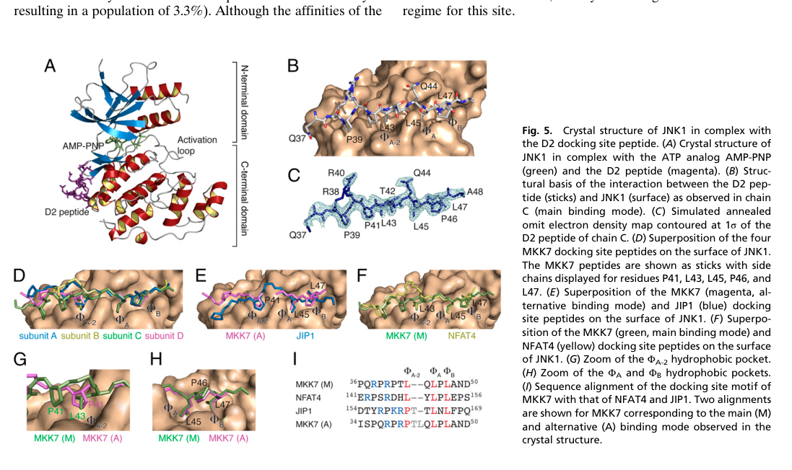

## Question

# Gene Research for Functional Annotation

## ⚠️ CRITICAL: Gene/Protein Identification Context

**BEFORE YOU BEGIN RESEARCH:** You MUST verify you are researching the CORRECT gene/protein. Gene symbols can be ambiguous, especially for less well-characterized genes from non-model organisms.

### Target Gene/Protein Identity (from UniProt):
- **UniProt Accession:** O14733
- **Protein Description:** RecName: Full=Dual specificity mitogen-activated protein kinase kinase 7; Short=MAP kinase kinase 7; Short=MAPKK 7; EC=2.7.12.2; AltName: Full=JNK-activating kinase 2; AltName: Full=MAPK/ERK kinase 7; Short=MEK 7; AltName: Full=Stress-activated protein kinase kinase 4; Short=SAPK kinase 4; Short=SAPKK-4; Short=SAPKK4; AltName: Full=c-Jun N-terminal kinase kinase 2; Short=JNK kinase 2; Short=JNKK 2;
- **Gene Information:** Name=MAP2K7; Synonyms=JNKK2, MEK7, MKK7, PRKMK7, SKK4;
- **Organism (full):** Homo sapiens (Human).
- **Protein Family:** Belongs to the protein kinase superfamily. STE Ser/Thr
- **Key Domains:** Dual_spec_MAPK_kinase. (IPR052468); Kinase-like_dom_sf. (IPR011009); Prot_kinase_dom. (IPR000719); Ser/Thr_kinase_AS. (IPR008271); Pkinase (PF00069)

### MANDATORY VERIFICATION STEPS:

1. **Check if the gene symbol "MAP2K7" matches the protein description above**
2. **Verify the organism is correct:** Homo sapiens (Human).
3. **Check if protein family/domains align with what you find in literature**
4. **If you find literature for a DIFFERENT gene with the same or similar symbol, STOP**

### If Gene Symbol is Ambiguous or You Cannot Find Relevant Literature:

**DO NOT PROCEED WITH RESEARCH ON A DIFFERENT GENE.** Instead:
- State clearly: "The gene symbol 'MAP2K7' is ambiguous or literature is limited for this specific protein"
- Explain what you found (e.g., "Found extensive literature on a different gene with the same symbol in a different organism")
- Describe the protein based ONLY on the UniProt information provided above
- Suggest that the protein function can be inferred from domain/family information

### Research Target:

Please provide a comprehensive research report on the gene **MAP2K7** (gene ID: MAP2K7, UniProt: O14733) in human.

The research report should be a detailed narrative explaining the function, biological processes, and localization of the gene product. Citations should be given for all claims.

You should prioritize authoritative reviews and primary scientific literature when conducting research. You can supplement
this with annotations you find in gene/protein databases, but these can be outdated or inaccurate.

We are specifically interested in the primary function of the gene - for enzymes, what reaction is catalyzed, and what is the substrate specificity? For transporters, what is the substrate? For structural proteins or adapters, what is the broader structural role? For signaling molecules, what is the role in the pathway.

We are interested in where in or outside the cell the gene product carries out its function.

We are also interested in the signaling or biochemical pathways in which the gene functions. We are less interested in broad pleiotropic effects, except where these elucidate the precise role.

Include evidence where possible. We are interested in both experimental evidence as well as inference from structure, evolution, or bioinformatic analysis. Precise studies should be prioritized over high-throughput, where available.

## Output

Question: You are an expert researcher providing comprehensive, well-cited information.

Provide detailed information focusing on:
1. Key concepts and definitions with current understanding
2. Recent developments and latest research (prioritize 2023-2024 sources)
3. Current applications and real-world implementations
4. Expert opinions and analysis from authoritative sources
5. Relevant statistics and data from recent studies

Format as a comprehensive research report with proper citations. Include URLs and publication dates where available.
Always prioritize recent, authoritative sources and provide specific citations for all major claims.

# Gene Research for Functional Annotation

## ⚠️ CRITICAL: Gene/Protein Identification Context

**BEFORE YOU BEGIN RESEARCH:** You MUST verify you are researching the CORRECT gene/protein. Gene symbols can be ambiguous, especially for less well-characterized genes from non-model organisms.

### Target Gene/Protein Identity (from UniProt):
- **UniProt Accession:** O14733
- **Protein Description:** RecName: Full=Dual specificity mitogen-activated protein kinase kinase 7; Short=MAP kinase kinase 7; Short=MAPKK 7; EC=2.7.12.2; AltName: Full=JNK-activating kinase 2; AltName: Full=MAPK/ERK kinase 7; Short=MEK 7; AltName: Full=Stress-activated protein kinase kinase 4; Short=SAPK kinase 4; Short=SAPKK-4; Short=SAPKK4; AltName: Full=c-Jun N-terminal kinase kinase 2; Short=JNK kinase 2; Short=JNKK 2;
- **Gene Information:** Name=MAP2K7; Synonyms=JNKK2, MEK7, MKK7, PRKMK7, SKK4;
- **Organism (full):** Homo sapiens (Human).
- **Protein Family:** Belongs to the protein kinase superfamily. STE Ser/Thr
- **Key Domains:** Dual_spec_MAPK_kinase. (IPR052468); Kinase-like_dom_sf. (IPR011009); Prot_kinase_dom. (IPR000719); Ser/Thr_kinase_AS. (IPR008271); Pkinase (PF00069)

### MANDATORY VERIFICATION STEPS:

1. **Check if the gene symbol "MAP2K7" matches the protein description above**
2. **Verify the organism is correct:** Homo sapiens (Human).
3. **Check if protein family/domains align with what you find in literature**
4. **If you find literature for a DIFFERENT gene with the same or similar symbol, STOP**

### If Gene Symbol is Ambiguous or You Cannot Find Relevant Literature:

**DO NOT PROCEED WITH RESEARCH ON A DIFFERENT GENE.** Instead:
- State clearly: "The gene symbol 'MAP2K7' is ambiguous or literature is limited for this specific protein"
- Explain what you found (e.g., "Found extensive literature on a different gene with the same symbol in a different organism")
- Describe the protein based ONLY on the UniProt information provided above
- Suggest that the protein function can be inferred from domain/family information

### Research Target:

Please provide a comprehensive research report on the gene **MAP2K7** (gene ID: MAP2K7, UniProt: O14733) in human.

The research report should be a detailed narrative explaining the function, biological processes, and localization of the gene product. Citations should be given for all claims.

You should prioritize authoritative reviews and primary scientific literature when conducting research. You can supplement
this with annotations you find in gene/protein databases, but these can be outdated or inaccurate.

We are specifically interested in the primary function of the gene - for enzymes, what reaction is catalyzed, and what is the substrate specificity? For transporters, what is the substrate? For structural proteins or adapters, what is the broader structural role? For signaling molecules, what is the role in the pathway.

We are interested in where in or outside the cell the gene product carries out its function.

We are also interested in the signaling or biochemical pathways in which the gene functions. We are less interested in broad pleiotropic effects, except where these elucidate the precise role.

Include evidence where possible. We are interested in both experimental evidence as well as inference from structure, evolution, or bioinformatic analysis. Precise studies should be prioritized over high-throughput, where available.

# MAP2K7 (MKK7/MEK7; UniProt O14733) functional-annotation report

## Executive conclusion

The requested target is unambiguously **human MAP2K7**, encoding **dual-specificity mitogen-activated protein kinase kinase 7** (MKK7/MEK7; UniProt **O14733**), not MAP2K4/MKK4 or the unrelated MAP4K4. Its principal molecular function is to receive stress signals from MAP3Ks and activate c-Jun N-terminal kinases (JNK1–3) by ATP-dependent phosphorylation of their activation-loop **Thr-Pro-Tyr (TPY)** motif. MKK7 strongly prefers the threonine site—classically JNK Thr183—whereas MKK4 preferentially phosphorylates Tyr185 and can also activate p38. Thus, MKK7 is best annotated as the relatively JNK-selective MAP2K and an essential, partially nonredundant JNK activator. Evidence for p38 regulation exists in particular in-vivo contexts, but it is not the canonical primary function. (lacorazza2024pharmacologicalinhibitionof pages 1-2, gehi2022intrinsicdisorderin pages 15-17, katzengruber2023mkk4inhibitors—recentdevelopment pages 2-4)

| Topic | Current annotation | Strongest evidence/quantitative detail | Confidence/caveat |
|---|---|---|---|
| Identity | Human **MAP2K7/MKK7/MEK7**, UniProt **O14733**; dual-specificity MAP kinase kinase in the STE kinase family | O14733 corresponds to a 419-aa human kinase encoded at 19p13.2; it is distinct from MAP2K4/MKK4 and MAP4K4 (gehi2022intrinsicdisorderin pages 17-18, lacorazza2024pharmacologicalinhibitionof pages 1-2) | **High**; identity and organism verified |
| Architecture and isoforms | N-terminal disordered regulatory region with three JNK-docking motifs, catalytic kinase domain, and C-terminal DVD domain; multiple splice isoforms | Six α/β/γ–1/2 isoforms are reported, spanning approximately 345–467 aa and 38–52 kDa; the O14733 reference protein is 419 aa. A residues 103–419 structure was solved at 2.10 Å (PDB 5B2L) (caliz2022mitogenactivatedproteinkinase pages 2-4, gehi2022intrinsicdisorderin pages 17-18) | **High** for architecture; isoform-specific functions remain incompletely defined |
| Catalytic reaction | ATP-dependent phosphorylation of protein Ser/Thr and Tyr residues: ATP + JNK → ADP + phospho-JNK | As a dual-specificity MAP2K, MKK7 can phosphorylate both residue classes in the JNK activation-loop TPY motif; “dual specificity” does not imply broad substrate promiscuity (caliz2022mitogenactivatedproteinkinase pages 2-4, lacorazza2024pharmacologicalinhibitionof pages 1-2) | **High** for reaction class; cellular phosphorylation usually cooperates with MKK4 |
| Canonical substrate specificity versus MKK4 | Canonical substrate is JNK1/2/3; MKK7 preferentially phosphorylates **JNK Thr183**, whereas MKK4 favors **Tyr185** and can also activate p38 | MKK7 deficiency abolishes stress-induced JNK activation in reported mouse comparisons, whereas MKK4 deficiency leaves about 50% activation; p38 regulation by MKK7 is noncanonical/context-dependent (gehi2022intrinsicdisorderin pages 15-17, katzengruber2023mkk4inhibitors—recentdevelopment pages 2-4) | **High** for JNK preference; **moderate** for direct p38 activity |
| Activation and upstream inputs | MAP3Ks activate MKK7 by phosphorylation of **Ser271 and Thr275** in its SXAKT activation-loop motif | Reported upstream kinases include ASK1–3, TAK1, MEKK1–4, MLK1–4, TAOK1–3, TPL2, DLK, LZK, and ZAK; inputs include inflammatory cytokines, UV/genotoxic, osmotic, metabolic, and oxidative stress (lacorazza2024pharmacologicalinhibitionof pages 1-2, caliz2022mitogenactivatedproteinkinase pages 2-4) | **High** for activation sites and cascade placement; upstream kinase usage is cell- and stimulus-dependent |
| Docking structural evidence | Three N-terminal D motifs create multivalent, dynamic recognition of JNK1 | ITC gave Kd values of 12 μM (D1), 7.9 μM (D2), and 11 μM (extended D3), with up to 1:3 MKK7:JNK1 stoichiometry. A 2.4-Å D2–JNK1 structure showed two alternative binding modes across three hydrophobic pockets (kragelj2015structureanddynamics pages 2-3, kragelj2015structureanddynamics pages 4-5, kragelj2015structureanddynamics media 67a8813c) | **High**; measurements used purified constructs and may not reproduce scaffold-constrained cellular stoichiometry |
| Localization and scaffolds | Functions in both cytoplasm and nucleus and within stress-induced signaling complexes | Immunofluorescence detected cytoplasmic and nuclear MKK7, with stress-associated nuclear accumulation. JIP1–4, POSH, and RACK1 assemble MKK7 with MAP3Ks and JNK; neuronal growth cones contain **Mkk7 mRNA**, suggesting local translation (coffey2014nuclearandcytosolic pages 3-4, davis2000signaltransductionby pages 3-4, caliz2022mitogenactivatedproteinkinase pages 2-4) | **Moderate–high**; growth-cone evidence concerns mRNA, not definitive protein localization |
| Physiological evidence | Required for embryonic hematopoietic/hepatic development and contributes to neural development, inflammation, and injury responses | Constitutive knockout causes embryonic death with anemia and defective hepatogenesis at E11.5–E13.5. After optic-nerve injury, deletion increased retinal ganglion-cell survival from 15.2% to 29.1% (p < 0.001) (caliz2022mitogenactivatedproteinkinase pages 2-4, caliz2022mitogenactivatedproteinkinase pages 5-6) | **High** in genetic mouse models; extrapolation to adult human physiology requires caution |
| 2023–2024 cancer evidence | MAP2K7/JNK can be tumor-suppressive or tumor-promoting depending on cellular context | In a 2023 HER2/Neu mouse model, mammary epithelial Map2k7 deletion accelerated tumor development (n = 18, p < 0.0002) and reduced UV-induced JNK activation. Other models link elevated MKK7 signaling to leukemia or ovarian-cancer stemness (itah2023her2drivenbreastcancer pages 6-8, lacorazza2024pharmacologicalinhibitionof pages 5-6) | **High** for the HER2 model; directionality is context-dependent, arguing against indication-agnostic inhibition |
| Inhibitor status | Selective MAP2K7 pharmacology remains preclinical; no MAP2K7-directed approved therapy | Compound 4a inhibits MKK7 at 10 nM through Cys218 but has kinase off-targets. OTSSP167 inhibits purified MKK7 at 160 nM and controlled T-ALL PDX disease at 10 mg/kg but is a pan-kinase compound. DK-2403 shows cellular IC50 values of 1.1–2.9 μM. The 2024 bident ZNL-8162 targets Cys218 and Cys276 (lacorazza2024pharmacologicalinhibitionof pages 6-8, lacorazza2024pharmacologicalinhibitionof pages 8-9, li2024molecularbidentswith pages 1-2) | **Moderate**; potency does not establish target-selective efficacy, and clinical validation is absent |

*Table: Concise evidence matrix for the identity, biochemical function, localization, physiology, disease relevance, and inhibitor status of human MAP2K7 (UniProt O14733). Confidence notes distinguish established functional annotation from context-dependent or preclinical findings.*

## 1. Identity verification and nomenclature

The supplied identity is correct. O14733 corresponds to **Homo sapiens MAP2K7**, approved name *mitogen-activated protein kinase kinase 7*; commonly used aliases include **MKK7, MEK7, JNKK2, SKK4, PRKMK7**, and SAPKK4. Open Targets maps human MAP2K7 to ENSG00000076984, while O14733-specific structural literature describes a 419-residue human protein encoded at chromosome 19p13.2. It belongs to the STE/MAP2K branch of the protein-kinase superfamily and has the expected protein-kinase and dual-specificity MAPK-kinase architecture. (OpenTargets Search: -MAP2K7, gehi2022intrinsicdisorderin pages 17-18)

This identity must not be confused with:

- **MAP2K4/MKK4/SEK1**, a related MAP2K that activates both JNK and p38 and favors JNK Tyr185.
- **MAP4K4**, an upstream STE20-family MAP4K and a different gene/protein.

Results concerning either protein are used below only for explicit mechanistic comparison, not attributed to MAP2K7.

## 2. Protein architecture and isoforms

The reference O14733 protein is 419 amino acids. Its major functional regions are:

1. An approximately 100-residue, intrinsically disordered **N-terminal regulatory region**, containing three JNK docking motifs (D1–D3) and a coiled-coil-like segment.
2. A conventional bilobal **protein-kinase domain**, including the ATP pocket and activation loop.
3. A C-terminal **DVD domain** (*domain for versatile docking*), which helps engage upstream MAP3Ks. (lacorazza2024pharmacologicalinhibitionof pages 1-2, gehi2022intrinsicdisorderin pages 17-18, kragelj2015structureanddynamics pages 1-2)

An X-ray structure of residues 103–419 was solved at 2.10 Å (PDB **5B2L**); residues 267–278 and 404–419 were unresolved, consistent with local flexibility. Disorder prediction places most disorder in residues 1–94 and estimates a mean predicted-disordered fraction of 26.7%; the kinase and DVD regions are substantially more ordered. (gehi2022intrinsicdisorderin pages 17-18)

Alternative splicing produces α-, β-, and γ-N-terminal forms combined with two C-terminal forms, commonly described as six isoforms (α1/α2, β1/β2, γ1/γ2). Reported products span approximately 345–467 residues and 38–52 kDa. The shorter α form lacks an N-terminal extension and has lower basal JNK-activating activity than β/γ forms, consistent with loss of N-terminal docking capacity. The exact physiological division of labor among human isoforms remains incompletely established. (lacorazza2024pharmacologicalinhibitionof pages 1-2, caliz2022mitogenactivatedproteinkinase pages 2-4)

## 3. Primary biochemical function

### Catalytic reaction

MAP2K7 catalyzes the general protein-kinase reaction:

**ATP + JNK protein → ADP + phospho-JNK protein**

The enzyme is called **dual-specificity** because it can phosphorylate both threonine and tyrosine residues in a MAPK activation-loop TxY motif. This designation concerns phosphoacceptor chemistry; it does not imply broad protein-substrate promiscuity. The best-supported canonical protein substrates are the JNK MAPKs encoded by **MAPK8/JNK1, MAPK9/JNK2, and MAPK10/JNK3**. (caliz2022mitogenactivatedproteinkinase pages 2-4, lacorazza2024pharmacologicalinhibitionof pages 1-2)

### Site and substrate specificity

MKK7 preferentially phosphorylates the **threonine** of the JNK TPY motif—commonly numbered Thr183—whereas MKK4 preferentially phosphorylates Tyr185. Full JNK activation therefore frequently reflects cooperation between MKK7 and MKK4, although MKK7 is the more indispensable component in many stress responses. Comparative knockout evidence summarized in the literature indicates that stress-induced JNK activity is lost with MKK7 deficiency, whereas MKK4 deficiency leaves roughly 50% activity. MKK4 activates both JNK and p38; MKK7 is much more JNK-selective. (gehi2022intrinsicdisorderin pages 17-18, gehi2022intrinsicdisorderin pages 15-17, katzengruber2023mkk4inhibitors—recentdevelopment pages 2-4)

Reports that MKK7 affects p38 signaling, particularly in macrophages, warrant a qualified annotation: they support context-dependent cross-talk or noncanonical signaling, not equivalence to MKK4 as a general p38 kinase. JNK should remain the primary substrate in functional annotation. (lacorazza2024pharmacologicalinhibitionof pages 1-2, caliz2022mitogenactivatedproteinkinase pages 2-4)

## 4. Activation mechanism and pathway placement

MAP2K7 is the middle tier of the stress-responsive cascade:

**stress/receptor input → MAP3K → MAP2K7/MKK7 → JNK → transcriptional and cytoplasmic substrates**.

Upstream MAP3Ks phosphorylate the MAP2K7 activation-loop **Ser271 and Thr275** in its SXAKT/SXKAT motif, promoting an active conformation and JNK phosphorylation. Reported upstream enzymes include ASK1–3, TAK1, MEKK1–4, MLK1–4, TAOK1–3, TPL2, DLK, LZK, and ZAK. Which MAP3K is used depends on cell type and stimulus. (lacorazza2024pharmacologicalinhibitionof pages 1-2, caliz2022mitogenactivatedproteinkinase pages 2-4)

Inputs include inflammatory cytokines such as TNF, ultraviolet and genomic damage, oxidative and osmotic stress, and metabolic signals including free fatty acids. Activated JNK then phosphorylates effectors such as c-Jun and ATF2, altering stress-responsive transcription, apoptosis or survival, differentiation, motility, and cytoskeletal behavior. These outcomes are context-dependent properties of the wider JNK network rather than evidence that MKK7 directly phosphorylates every downstream effector. (lacorazza2024pharmacologicalinhibitionof pages 1-2)

## 5. Structural basis of JNK recognition

MKK7 is unusual among human MAP2Ks in possessing **three** N-terminal JNK docking sites. ITC measurements with human JNK1 found low-micromolar affinities: D1, **Kd 12 μM**; D2, **7.9 μM**; and extended D3, **11 μM**. The isolated canonical D3 peptide bound more weakly at **49 μM**, showing that flanking residues contribute. Stoichiometry increased from 1:1 for D1 alone to 1:2 for D1+D2 and 1:3 for the complete regulatory region, demonstrating that purified MKK7 can bind three JNK1 molecules simultaneously. Cellular stoichiometry may be more constrained by scaffolds and local concentration. (kragelj2015structureanddynamics pages 2-3)

A 2.4-Å JNK1–MKK7 D2 structure showed the peptide occupying three hydrophobic pockets on JNK1. The main mode is anchored by MKK7 Leu43, Leu45, and Leu47; an alternative mode uses Arg40, Pro41, Leu45, and Leu47. NMR detected bound-state exchange on microsecond-to-millisecond timescales, with D2 exchange rates of 70–275 s⁻¹ and D3 at 707 ± 34 s⁻¹. These findings support a dynamic-recognition model in which multivalent, disordered docking motifs confer high pathway specificity without a single rigid interface. (kragelj2015structureanddynamics pages 3-4, kragelj2015structureanddynamics pages 5-6, kragelj2015structureanddynamics pages 4-5)

The inspected structural figure directly shows the D2 peptide, JNK1 hydrophobic pockets, and the NFAT4-like and JIP1-like alternative binding modes. (kragelj2015structureanddynamics media 67a8813c)

## 6. Cellular localization and signaling assemblies

Immunofluorescence has detected MKK7 in both **cytoplasm and nucleus**, with reported nuclear accumulation after cellular stress. This supports signaling in both compartments rather than a fixed organelle-specific role. In neurons, **Mkk7 mRNA** is present in growth cones and may undergo local translation during axonal growth; this is evidence for localized RNA, not by itself definitive localization of the mature protein. (coffey2014nuclearandcytosolic pages 3-4, davis2000signaltransductionby pages 3-4)

Spatial organization depends strongly on protein complexes:

- **JIP1–4** and **POSH** scaffold MAP3K–MKK7–JNK modules.
- **RACK1** promotes association between MKK7 and upstream MAP3Ks and enhances MKK7/JNK signaling.
- **GADD45β** directly binds and inhibits MKK7 catalytic activity; disruption of this complex by DTP3 reactivates MKK7–JNK.
- **TIPRL** promotes association with PP2A catalytic subunit, limiting prolonged MKK7 activity.
- **RASSF7** can suppress UV-induced MKK7–JNK signaling. (caliz2022mitogenactivatedproteinkinase pages 2-4)

Accordingly, the most precise localization annotation is **cytoplasmic and nuclear, dynamically recruited into scaffolded stress-signaling complexes**, with specialized local translation/signaling in neuronal projections.

## 7. Biological functions supported by experimental evidence

### Development

Constitutive Mkk7 deletion in mice causes embryonic death associated with anemia and abnormal hepatogenesis around embryonic days **E11.5–E13.5**. This demonstrates a nonredundant developmental requirement, especially in hematopoietic and hepatic development, even though MKK4 also activates JNK. (caliz2022mitogenactivatedproteinkinase pages 2-4)

### Nervous system

Genetic studies implicate MKK7–JNK signaling in neurite elongation, axon formation, neuronal maintenance, hippocampal organization, and motor/circadian functions. After optic-nerve crush, Mkk7 deletion increased retinal ganglion-cell survival from **15.2% to 29.1%** (*p*<0.001), illustrating that the same pathway required for development can promote injury-associated neuronal death. (caliz2022mitogenactivatedproteinkinase pages 5-6)

### Inflammation and stress responses

MKK7 organizes cytokine- and stress-induced JNK activation and affects macrophage migration, invasion, and cytokine production. Free-fatty-acid-triggered JNK signaling requires intact JIP1 and MKK7 in reported in-vitro and in-vivo systems. The precise outcome—survival, apoptosis, inflammation, or adaptation—depends on stimulus duration, scaffold composition, and cell type. (caliz2022mitogenactivatedproteinkinase pages 2-4)

## 8. Disease relevance and current expert interpretation

MAP2K7 is not simply an oncogene or tumor suppressor. It can promote stress tolerance, inflammatory signaling, leukemia-cell maintenance, metastatic behavior, or stem-like phenotypes in some settings, but can support p53/JNK-mediated tumor suppression in others. Therefore, disease indication and molecular context must be established before inhibition is rational. (caliz2022mitogenactivatedproteinkinase pages 5-6, lacorazza2024pharmacologicalinhibitionof pages 5-6)

Open Targets lists associations with neurodegenerative and CNS immune disorders, including Alzheimer and Parkinson diseases, but the displayed association scores are modest—approximately **0.37** for Alzheimer/Parkinson disease and **0.53** for the broad neurodegenerative-disease category—and include literature or screening evidence rather than definitive human causal genetics. These entries are hypothesis-generating, not clinical validation. (OpenTargets Search: -MAP2K7)

## 9. Recent research, 2023–2024

### HER2-positive breast-cancer genetics (2023)

A conditional mouse study provided strong evidence that the JNK pathway can suppress HER2/Neu-driven mammary cancer. Mammary epithelial **Map2k7 deletion** accelerated tumor development in MMTV-NIC mice (**n=18 MKK7-knockout mice; p<0.0002** versus control). Primary MKK7-deficient tumor cells had reduced UV-C-induced JNK activation without major changes in ERK or p38 activation, supporting a relatively selective MKK7–JNK defect. This result cautions that systemic MKK7 inhibition could be harmful in tumors where JNK signaling restrains initiation or progression. Published January 2023; DOI: https://doi.org/10.1073/pnas.2218373120. (itah2023her2drivenbreastcancer pages 6-8)

### Dual-covalent “molecular bident” inhibition (2024)

Li and colleagues developed **ZNL-8162**, an ATP-competitive MKK7 inhibitor designed to form covalent bonds with both **Cys218 and Cys276**. The strategy seeks to preserve activity when one target cysteine mutates and potentially improve selectivity and residence time. It is an innovative chemical-probe concept, but no evidence retrieved here establishes clinical efficacy or an approved use. Published in *ACS Central Science* in 2024; DOI: https://doi.org/10.1021/acscentsci.3c01245. (li2024molecularbidentswith pages 1-2)

### Expanding inhibitor landscape (2024 review)

A December 2024 review concluded that MAP2K7 pharmacology remains preclinical and selectivity is the central obstacle. Representative findings include:

- **Compound 4a:** biochemical inhibition around **10 nM**, covalently targeting Cys218, but with off-target activity against BLK, BMX, BTK, ITK, JAK3, mTOR, and S6K.
- **OTSSP167:** MAP2K7 IC50 **160 nM**; T-ALL-cell activity at **10–57 nM** and disease control in T-ALL PDX mice at **10 mg/kg**, but it is a pan-kinase compound, preventing clean target attribution.
- **DK-2403:** irreversible Cys218-directed inhibitor; cellular IC50 **1.1–2.9 μM**, with reduced phospho-JNK and phospho-ATF2; no mouse testing was reported in the reviewed evidence.
- **DTP3:** disrupts the inhibitory GADD45β–MKK7 complex rather than inhibiting the kinase, thereby activating MKK7–JNK; reported interaction IC50 **28 nM** and mouse activity at **14.5 mg/kg**.
- A 360-compound thermal-shift screen identified type-I and type-II binders, including ibrutinib, OTSSP167, XMD15-46, and TL10-105, with nanomolar binding and full-length-protein IC50 values of approximately **60–160 nM** for selected compounds. (lacorazza2024pharmacologicalinhibitionof pages 6-8, lacorazza2024pharmacologicalinhibitionof pages 8-9, lacorazza2024pharmacologicalinhibitionof pages 5-6)

The authoritative interpretation is that these are valuable probes and leads, but biochemical potency alone does not prove that cellular or animal efficacy is caused by MAP2K7. The review was published 9 December 2024; DOI: https://doi.org/10.3389/fonc.2024.1486756. (lacorazza2024pharmacologicalinhibitionof pages 1-2)

## 10. Current applications and translational status

Current real-world uses are principally **research applications**:

1. Genetic deletion or knockdown to dissect stress/JNK signaling.
2. Phospho-JNK, phospho-c-Jun, and phospho-ATF2 readouts to monitor pathway output.
3. Structural and covalent-chemistry platforms for selective kinase-inhibitor development.
4. Context-specific cancer models, including T-ALL, multiple myeloma, ovarian cancer stemness, and HER2-positive breast cancer.

No retrieved evidence supports an approved drug whose clinical indication is based on selective MAP2K7 inhibition, and no MAP2K7-directed therapy should be considered clinically validated. Some compounds, notably ibrutinib, are approved for other targets and indications; their experimental MKK7 activity is repurposing evidence, not approval of MAP2K7 as the therapeutic mechanism. The directionally opposite cancer findings further imply that biomarker selection—tumor genotype, MKK7/JNK activation state, splice isoform, and pathway dependence—will be essential. (lacorazza2024pharmacologicalinhibitionof pages 6-8, lacorazza2024pharmacologicalinhibitionof pages 8-9, itah2023her2drivenbreastcancer pages 6-8)

## Final functional annotation

**MAP2K7 encodes a cytoplasmic and nuclear, scaffold-regulated dual-specificity MAP kinase kinase that converts diverse stress inputs into JNK activation. Following activation-loop phosphorylation at Ser271/Thr275 by upstream MAP3Ks, MKK7 binds JNK through three N-terminal docking motifs and preferentially phosphorylates the threonine of JNK’s TPY activation motif. Its canonical role is therefore a relatively selective, partially nonredundant JNK-activating kinase controlling stress-responsive transcription and cytoplasmic signaling. Developmental, neural, inflammatory, and tumor phenotypes derive from this signaling function, but their direction is highly context dependent. MAP2K7 is structurally and pharmacologically tractable, yet selective therapeutic targeting remained preclinical through 2024.**

References

1. (lacorazza2024pharmacologicalinhibitionof pages 1-2): H. Daniel Lacorazza. Pharmacological inhibition of the map2k7 kinase in human disease. Frontiers in Oncology, Dec 2024. URL: https://doi.org/10.3389/fonc.2024.1486756, doi:10.3389/fonc.2024.1486756. This article has 10 citations.

2. (gehi2022intrinsicdisorderin pages 15-17): Bhuvaneshwari R. Gehi, Kundlik Gadhave, Vladimir N. Uversky, and Rajanish Giri. Intrinsic disorder in proteins associated with oxidative stress-induced jnk signaling. Cellular and Molecular Life Sciences, Mar 2022. URL: https://doi.org/10.1007/s00018-022-04230-4, doi:10.1007/s00018-022-04230-4. This article has 23 citations and is from a domain leading peer-reviewed journal.

3. (katzengruber2023mkk4inhibitors—recentdevelopment pages 2-4): Leon Katzengruber, Pascal Sander, and Stefan A. Laufer. Mkk4 inhibitors—recent development status and therapeutic potential. International Journal of Molecular Sciences, 24:7495, Apr 2023. URL: https://doi.org/10.3390/ijms24087495, doi:10.3390/ijms24087495. This article has 26 citations.

4. (gehi2022intrinsicdisorderin pages 17-18): Bhuvaneshwari R. Gehi, Kundlik Gadhave, Vladimir N. Uversky, and Rajanish Giri. Intrinsic disorder in proteins associated with oxidative stress-induced jnk signaling. Cellular and Molecular Life Sciences, Mar 2022. URL: https://doi.org/10.1007/s00018-022-04230-4, doi:10.1007/s00018-022-04230-4. This article has 23 citations and is from a domain leading peer-reviewed journal.

5. (caliz2022mitogenactivatedproteinkinase pages 2-4): Amada D. Caliz, Anastassiia Vertii, Vijay Fisch, Soonsang Yoon, Hyung-Jin Yoo, John F. Keaney, and Shashi Kant. Mitogen-activated protein kinase kinase 7 in inflammatory, cancer, and neurological diseases. Frontiers in Cell and Developmental Biology, Oct 2022. URL: https://doi.org/10.3389/fcell.2022.979673, doi:10.3389/fcell.2022.979673. This article has 20 citations.

6. (kragelj2015structureanddynamics pages 2-3): Jaka Kragelj, Andrés Palencia, Max H. Nanao, Damien Maurin, Guillaume Bouvignies, Martin Blackledge, and Malene Ringkjøbing Jensen. Structure and dynamics of the mkk7–jnk signaling complex. Proceedings of the National Academy of Sciences, 112:3409-3414, Mar 2015. URL: https://doi.org/10.1073/pnas.1419528112, doi:10.1073/pnas.1419528112. This article has 96 citations and is from a highest quality peer-reviewed journal.

7. (kragelj2015structureanddynamics pages 4-5): Jaka Kragelj, Andrés Palencia, Max H. Nanao, Damien Maurin, Guillaume Bouvignies, Martin Blackledge, and Malene Ringkjøbing Jensen. Structure and dynamics of the mkk7–jnk signaling complex. Proceedings of the National Academy of Sciences, 112:3409-3414, Mar 2015. URL: https://doi.org/10.1073/pnas.1419528112, doi:10.1073/pnas.1419528112. This article has 96 citations and is from a highest quality peer-reviewed journal.

8. (kragelj2015structureanddynamics media 67a8813c): Jaka Kragelj, Andrés Palencia, Max H. Nanao, Damien Maurin, Guillaume Bouvignies, Martin Blackledge, and Malene Ringkjøbing Jensen. Structure and dynamics of the mkk7–jnk signaling complex. Proceedings of the National Academy of Sciences, 112:3409-3414, Mar 2015. URL: https://doi.org/10.1073/pnas.1419528112, doi:10.1073/pnas.1419528112. This article has 96 citations and is from a highest quality peer-reviewed journal.

9. (coffey2014nuclearandcytosolic pages 3-4): Eleanor T. Coffey. Nuclear and cytosolic jnk signalling in neurons. Nature Reviews Neuroscience, 15:285-299, Apr 2014. URL: https://doi.org/10.1038/nrn3729, doi:10.1038/nrn3729. This article has 424 citations and is from a highest quality peer-reviewed journal.

10. (davis2000signaltransductionby pages 3-4): Roger J Davis. Signal transduction by the jnk group of map kinases. Cell, 103:239-252, Oct 2000. URL: https://doi.org/10.1016/s0092-8674(00)00116-1, doi:10.1016/s0092-8674(00)00116-1. This article has 5924 citations and is from a highest quality peer-reviewed journal.

11. (caliz2022mitogenactivatedproteinkinase pages 5-6): Amada D. Caliz, Anastassiia Vertii, Vijay Fisch, Soonsang Yoon, Hyung-Jin Yoo, John F. Keaney, and Shashi Kant. Mitogen-activated protein kinase kinase 7 in inflammatory, cancer, and neurological diseases. Frontiers in Cell and Developmental Biology, Oct 2022. URL: https://doi.org/10.3389/fcell.2022.979673, doi:10.3389/fcell.2022.979673. This article has 20 citations.

12. (itah2023her2drivenbreastcancer pages 6-8): Zeynep Itah, Shanzah Chaudhry, Sithara Raju Ponny, Ozkan Aydemir, Alexandra Lee, Julie Cavanagh-Kyros, Cathy Tournier, William J. Muller, and Roger J. Davis. Her2-driven breast cancer suppression by the jnk signaling pathway. Proceedings of the National Academy of Sciences of the United States of America, Jan 2023. URL: https://doi.org/10.1073/pnas.2218373120, doi:10.1073/pnas.2218373120. This article has 35 citations and is from a highest quality peer-reviewed journal.

13. (lacorazza2024pharmacologicalinhibitionof pages 5-6): H. Daniel Lacorazza. Pharmacological inhibition of the map2k7 kinase in human disease. Frontiers in Oncology, Dec 2024. URL: https://doi.org/10.3389/fonc.2024.1486756, doi:10.3389/fonc.2024.1486756. This article has 10 citations.

14. (lacorazza2024pharmacologicalinhibitionof pages 6-8): H. Daniel Lacorazza. Pharmacological inhibition of the map2k7 kinase in human disease. Frontiers in Oncology, Dec 2024. URL: https://doi.org/10.3389/fonc.2024.1486756, doi:10.3389/fonc.2024.1486756. This article has 10 citations.

15. (lacorazza2024pharmacologicalinhibitionof pages 8-9): H. Daniel Lacorazza. Pharmacological inhibition of the map2k7 kinase in human disease. Frontiers in Oncology, Dec 2024. URL: https://doi.org/10.3389/fonc.2024.1486756, doi:10.3389/fonc.2024.1486756. This article has 10 citations.

16. (li2024molecularbidentswith pages 1-2): Zhengnian Li, Jie Jiang, Scott B. Ficarro, Tyler S. Beyett, Ciric To, Isidoro Tavares, Yingde Zhu, Jiaqi Li, Michael J. Eck, Pasi A. Jänne, Jarrod A. Marto, Tinghu Zhang, Jianwei Che, and Nathanael S. Gray. Molecular bidents with two electrophilic warheads as a new pharmacological modality. ACS Central Science, 10:1156-1166, Feb 2024. URL: https://doi.org/10.1021/acscentsci.3c01245, doi:10.1021/acscentsci.3c01245. This article has 21 citations and is from a highest quality peer-reviewed journal.

17. (OpenTargets Search: -MAP2K7): Open Targets Query (-MAP2K7, 5 results). Buniello, A. et al. (2025). Open Targets Platform: facilitating therapeutic hypotheses building in drug discovery. Nucleic Acids Research.

18. (kragelj2015structureanddynamics pages 1-2): Jaka Kragelj, Andrés Palencia, Max H. Nanao, Damien Maurin, Guillaume Bouvignies, Martin Blackledge, and Malene Ringkjøbing Jensen. Structure and dynamics of the mkk7–jnk signaling complex. Proceedings of the National Academy of Sciences, 112:3409-3414, Mar 2015. URL: https://doi.org/10.1073/pnas.1419528112, doi:10.1073/pnas.1419528112. This article has 96 citations and is from a highest quality peer-reviewed journal.

19. (kragelj2015structureanddynamics pages 3-4): Jaka Kragelj, Andrés Palencia, Max H. Nanao, Damien Maurin, Guillaume Bouvignies, Martin Blackledge, and Malene Ringkjøbing Jensen. Structure and dynamics of the mkk7–jnk signaling complex. Proceedings of the National Academy of Sciences, 112:3409-3414, Mar 2015. URL: https://doi.org/10.1073/pnas.1419528112, doi:10.1073/pnas.1419528112. This article has 96 citations and is from a highest quality peer-reviewed journal.

20. (kragelj2015structureanddynamics pages 5-6): Jaka Kragelj, Andrés Palencia, Max H. Nanao, Damien Maurin, Guillaume Bouvignies, Martin Blackledge, and Malene Ringkjøbing Jensen. Structure and dynamics of the mkk7–jnk signaling complex. Proceedings of the National Academy of Sciences, 112:3409-3414, Mar 2015. URL: https://doi.org/10.1073/pnas.1419528112, doi:10.1073/pnas.1419528112. This article has 96 citations and is from a highest quality peer-reviewed journal.

## Artifacts

- [Edison artifact artifact-00](MAP2K7-deep-research-falcon_artifacts/artifact-00.md)

## Citations

1. gehi2022intrinsicdisorderin pages 17-18
2. lacorazza2024pharmacologicalinhibitionof pages 1-2
3. kragelj2015structureanddynamics pages 2-3
4. caliz2022mitogenactivatedproteinkinase pages 2-4
5. caliz2022mitogenactivatedproteinkinase pages 5-6
6. li2024molecularbidentswith pages 1-2
7. gehi2022intrinsicdisorderin pages 15-17
8. kragelj2015structureanddynamics pages 4-5
9. coffey2014nuclearandcytosolic pages 3-4
10. davis2000signaltransductionby pages 3-4
11. lacorazza2024pharmacologicalinhibitionof pages 5-6
12. lacorazza2024pharmacologicalinhibitionof pages 6-8
13. lacorazza2024pharmacologicalinhibitionof pages 8-9
14. kragelj2015structureanddynamics pages 1-2
15. kragelj2015structureanddynamics pages 3-4
16. kragelj2015structureanddynamics pages 5-6
17. https://doi.org/10.1073/pnas.2218373120.
18. https://doi.org/10.1021/acscentsci.3c01245.
19. https://doi.org/10.3389/fonc.2024.1486756.
20. https://doi.org/10.3389/fonc.2024.1486756,
21. https://doi.org/10.1007/s00018-022-04230-4,
22. https://doi.org/10.3390/ijms24087495,
23. https://doi.org/10.3389/fcell.2022.979673,
24. https://doi.org/10.1073/pnas.1419528112,
25. https://doi.org/10.1038/nrn3729,
26. https://doi.org/10.1016/s0092-8674(00
27. https://doi.org/10.1073/pnas.2218373120,
28. https://doi.org/10.1021/acscentsci.3c01245,