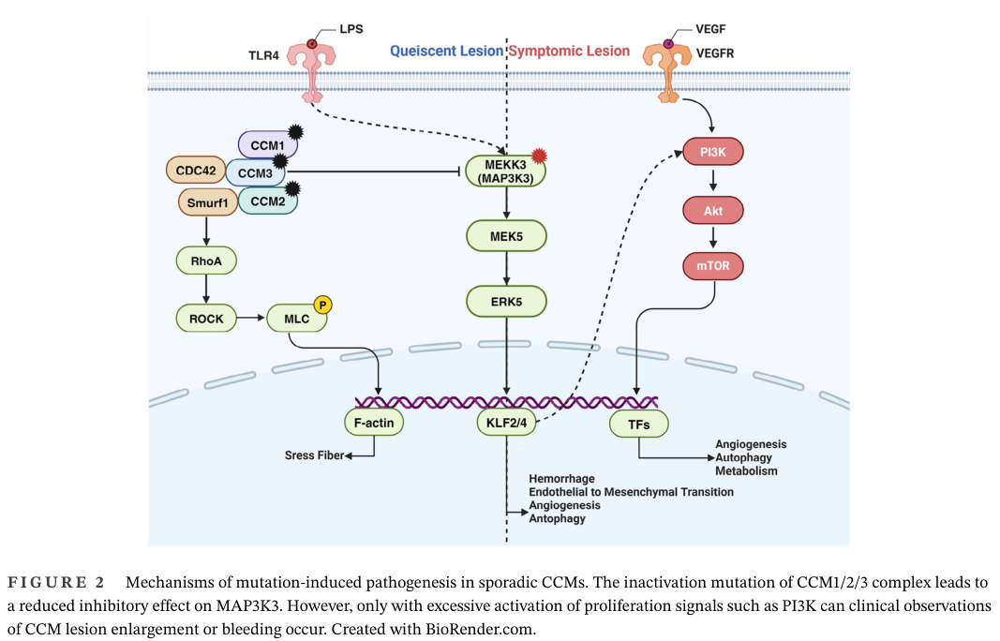

## Question

# Gene Research for Functional Annotation

## ⚠️ CRITICAL: Gene/Protein Identification Context

**BEFORE YOU BEGIN RESEARCH:** You MUST verify you are researching the CORRECT gene/protein. Gene symbols can be ambiguous, especially for less well-characterized genes from non-model organisms.

### Target Gene/Protein Identity (from UniProt):
- **UniProt Accession:** Q99759
- **Protein Description:** RecName: Full=Mitogen-activated protein kinase kinase kinase 3; EC=2.7.11.25; AltName: Full=MAPK/ERK kinase kinase 3; Short=MEK kinase 3; Short=MEKK 3;
- **Gene Information:** Name=MAP3K3; Synonyms=MAPKKK3, MEKK3;
- **Organism (full):** Homo sapiens (Human).
- **Protein Family:** Belongs to the protein kinase superfamily. STE Ser/Thr
- **Key Domains:** Kinase-like_dom_sf. (IPR011009); PB1-like. (IPR053793); PB1_dom. (IPR000270); PB1_MEKK2/3. (IPR034879); Prot_kinase_dom. (IPR000719)

### MANDATORY VERIFICATION STEPS:

1. **Check if the gene symbol "MAP3K3" matches the protein description above**
2. **Verify the organism is correct:** Homo sapiens (Human).
3. **Check if protein family/domains align with what you find in literature**
4. **If you find literature for a DIFFERENT gene with the same or similar symbol, STOP**

### If Gene Symbol is Ambiguous or You Cannot Find Relevant Literature:

**DO NOT PROCEED WITH RESEARCH ON A DIFFERENT GENE.** Instead:
- State clearly: "The gene symbol 'MAP3K3' is ambiguous or literature is limited for this specific protein"
- Explain what you found (e.g., "Found extensive literature on a different gene with the same symbol in a different organism")
- Describe the protein based ONLY on the UniProt information provided above
- Suggest that the protein function can be inferred from domain/family information

### Research Target:

Please provide a comprehensive research report on the gene **MAP3K3** (gene ID: MAP3K3, UniProt: Q99759) in human.

The research report should be a detailed narrative explaining the function, biological processes, and localization of the gene product. Citations should be given for all claims.

You should prioritize authoritative reviews and primary scientific literature when conducting research. You can supplement
this with annotations you find in gene/protein databases, but these can be outdated or inaccurate.

We are specifically interested in the primary function of the gene - for enzymes, what reaction is catalyzed, and what is the substrate specificity? For transporters, what is the substrate? For structural proteins or adapters, what is the broader structural role? For signaling molecules, what is the role in the pathway.

We are interested in where in or outside the cell the gene product carries out its function.

We are also interested in the signaling or biochemical pathways in which the gene functions. We are less interested in broad pleiotropic effects, except where these elucidate the precise role.

Include evidence where possible. We are interested in both experimental evidence as well as inference from structure, evolution, or bioinformatic analysis. Precise studies should be prioritized over high-throughput, where available.

## Output

Question: You are an expert researcher providing comprehensive, well-cited information.

Provide detailed information focusing on:
1. Key concepts and definitions with current understanding
2. Recent developments and latest research (prioritize 2023-2024 sources)
3. Current applications and real-world implementations
4. Expert opinions and analysis from authoritative sources
5. Relevant statistics and data from recent studies

Format as a comprehensive research report with proper citations. Include URLs and publication dates where available.
Always prioritize recent, authoritative sources and provide specific citations for all major claims.

# Gene Research for Functional Annotation

## ⚠️ CRITICAL: Gene/Protein Identification Context

**BEFORE YOU BEGIN RESEARCH:** You MUST verify you are researching the CORRECT gene/protein. Gene symbols can be ambiguous, especially for less well-characterized genes from non-model organisms.

### Target Gene/Protein Identity (from UniProt):
- **UniProt Accession:** Q99759
- **Protein Description:** RecName: Full=Mitogen-activated protein kinase kinase kinase 3; EC=2.7.11.25; AltName: Full=MAPK/ERK kinase kinase 3; Short=MEK kinase 3; Short=MEKK 3;
- **Gene Information:** Name=MAP3K3; Synonyms=MAPKKK3, MEKK3;
- **Organism (full):** Homo sapiens (Human).
- **Protein Family:** Belongs to the protein kinase superfamily. STE Ser/Thr
- **Key Domains:** Kinase-like_dom_sf. (IPR011009); PB1-like. (IPR053793); PB1_dom. (IPR000270); PB1_MEKK2/3. (IPR034879); Prot_kinase_dom. (IPR000719)

### MANDATORY VERIFICATION STEPS:

1. **Check if the gene symbol "MAP3K3" matches the protein description above**
2. **Verify the organism is correct:** Homo sapiens (Human).
3. **Check if protein family/domains align with what you find in literature**
4. **If you find literature for a DIFFERENT gene with the same or similar symbol, STOP**

### If Gene Symbol is Ambiguous or You Cannot Find Relevant Literature:

**DO NOT PROCEED WITH RESEARCH ON A DIFFERENT GENE.** Instead:
- State clearly: "The gene symbol 'MAP3K3' is ambiguous or literature is limited for this specific protein"
- Explain what you found (e.g., "Found extensive literature on a different gene with the same symbol in a different organism")
- Describe the protein based ONLY on the UniProt information provided above
- Suggest that the protein function can be inferred from domain/family information

### Research Target:

Please provide a comprehensive research report on the gene **MAP3K3** (gene ID: MAP3K3, UniProt: Q99759) in human.

The research report should be a detailed narrative explaining the function, biological processes, and localization of the gene product. Citations should be given for all claims.

You should prioritize authoritative reviews and primary scientific literature when conducting research. You can supplement
this with annotations you find in gene/protein databases, but these can be outdated or inaccurate.

We are specifically interested in the primary function of the gene - for enzymes, what reaction is catalyzed, and what is the substrate specificity? For transporters, what is the substrate? For structural proteins or adapters, what is the broader structural role? For signaling molecules, what is the role in the pathway.

We are interested in where in or outside the cell the gene product carries out its function.

We are also interested in the signaling or biochemical pathways in which the gene functions. We are less interested in broad pleiotropic effects, except where these elucidate the precise role.

Include evidence where possible. We are interested in both experimental evidence as well as inference from structure, evolution, or bioinformatic analysis. Precise studies should be prioritized over high-throughput, where available.

# Functional annotation report: human MAP3K3/MEKK3 (UniProt Q99759)

## Executive conclusion

The requested target is unambiguous: **human MAP3K3 encodes mitogen-activated protein kinase kinase kinase 3 (MEKK3)**, not the closely related MAP3K2/MEKK2. Its architecture—an N-terminal PB1 interaction domain, an intervening regulatory region, and a C-terminal STE-family serine/threonine kinase domain—matches UniProt Q99759 and the literature. MEKK2 is a useful paralog but should not be treated as interchangeable experimental evidence; the two proteins are about 67% identical overall and over 86% identical in their catalytic domains. (vish2025structuralbasisfor pages 2-3, vish2025structuralbasisfor pages 1-2)

The best-supported primary function of MEKK3 is that of a **cytoplasmic MAP kinase kinase kinase**, converting environmental, inflammatory, mechanical, and junctional inputs into phosphorylation of downstream MAP2Ks. Its clearest canonical substrate is **MAP2K5/MEK5**, which MEKK3 phosphorylates at **Ser311 and Thr315**, initiating the MEK5–ERK5 cascade. This module is especially important in vascular endothelial mechanotransduction and KLF2/KLF4-dependent gene regulation. MEKK3 can also engage MKK3/6–p38, NF-κB, and Hippo/YAP signaling, but these branches are more context-dependent. A 2024 study additionally identified YAP Ser405 as a direct noncanonical MEKK3 substrate in therapy-resistant cancer cells. (hoang2017oncogenicsignalingof pages 1-5, tsitsikov2023traf7isan pages 1-2, park2024overcomingbrafand pages 2-2)

## 1. Identity and molecular architecture

- **Gene/protein:** MAP3K3 / MEKK3 / MAPKKK3; human UniProt **Q99759**.
- **Organism:** *Homo sapiens*.
- **Protein class:** STE-family serine/threonine protein kinase and MAP3K.
- **Architecture:** N-terminal **PB1 domain**, regulatory/linker region, and C-terminal catalytic protein-kinase domain. The PB1 domain organizes selective protein interactions, whereas the kinase domain binds ATP and transfers phosphate to protein Ser/Thr residues. (vish2025structuralbasisfor pages 1-2)
- **Critical distinction:** MAP3K2 encodes MEKK2, a paralog. Recent structural data on MEKK2 illuminate likely conserved principles but do not directly establish every feature of MEKK3. In particular, MEKK2 αG-helix dimerization and trans-autophosphorylation should not automatically be assigned to MEKK3. (vish2025structuralbasisfor pages 2-3)

| Feature | Best-supported annotation | Evidence type / strength | Key caveat |
|---|---|---|---|
| Identity and architecture | Human **MAP3K3 encodes MEKK3** (Q99759), an STE-family Ser/Thr MAP3K with an N-terminal PB1 domain, intervening regulatory region, and C-terminal kinase domain. (vish2025structuralbasisfor pages 1-2) | **Strong:** consistent database/literature identity and domain assignment | Do not confuse with paralog **MAP3K2/MEKK2**; recent structural work chiefly examined MEKK2. (vish2025structuralbasisfor pages 2-3) |
| Catalytic reaction | Transfers the γ-phosphate of ATP to Ser/Thr residues in protein substrates: ATP + protein-OH → ADP + phosphoprotein. | **Strong class-level inference:** conserved active protein-kinase domain and EC 2.7.11.25 annotation | Detailed human-MEKK3 kinetic constants and a comprehensive physiological substrate spectrum remain limited. |
| Direct canonical substrate | Directly activates **MAP2K5/MEK5**, phosphorylating **Ser311 and Thr315**; PB1–PB1 binding recruits MEK5 to MEKK3. (monti2022clinicalsignificanceand pages 18-20, hoang2017oncogenicsignalingof pages 1-5) | **Strong:** biochemical and interaction evidence supported by primary literature | MEKK2 can use the same module, so cellular attribution requires MEKK3-specific loss-of-function evidence. |
| MKK3/6–p38 branch | MEKK3 can feed the p38 pathway through MAP2Ks, particularly MKK6; CCM2/Rac-dependent osmotic-stress signaling also links MEKK3 to MKK3/6–p38. (vish2025structuralbasisfor pages 2-3) | **Moderate:** biochemical/pathway evidence | Less selective and less consistently established than the MEK5–ERK5 branch; stimulus and cell type matter, and some structural details derive from MEKK2. |
| Direct YAP substrate (2024) | MAP3K3 directly phosphorylates **YAP Ser405**, reducing FBXW7/p62-associated lysosomal degradation and stabilizing YAP in drug-resistant cancer cells. (park2024overcomingbrafand pages 2-2) | **Strong mechanistic, preclinical:** recombinant kinase assay, phosphosite mutants, kinase-dead MAP3K3, RNAi and pharmacology | Demonstrated in cultured melanoma/breast-cancer models; physiological generality and clinical utility are unproven. |
| Indirect Hippo–YAP axis | MEKK3 also promotes LATS1/2 activation and **YAP Ser127** phosphorylation/cytoplasmic redistribution under several stresses; this is distinct from direct YAP-Ser405 phosphorylation. (lu2021mekk2andmekk3 pages 5-7) | **Moderate–strong cellular evidence** | MEKK2 and MEKK3 were often deleted or analyzed together; YAP Ser127 is principally a LATS-site, not established here as a direct MEKK3 site. |
| Localization | Predominantly a **cytosolic, complex-associated signaling kinase**; CCM2 binding can recruit/localize MEKK3 to actin-associated or junction-proximal signaling compartments. (lu2021mekk2andmekk3 pages 5-7) | **Moderate:** imaging, fractionation and interaction evidence | Localization is dynamic and context dependent; nuclear/cytoplasmic immunostaining in tumors does not by itself identify the active compartment. |
| Endothelial mechanotransduction | In endothelial cells, shear stress engages **TRAF7/SCRIB–MEKK3–MEK5–ERK5–KLF2/4**, supporting flow-responsive transcription and vascular integrity. TRAF7 or SCRIB depletion reduces shear-induced ERK5 phosphorylation. (tsitsikov2023traf7isan pages 7-9, tsitsikov2023traf7isan pages 1-2, tsitsikov2023traf7isan pages 13-15) | **Strong preclinical:** HUVEC perturbation plus endothelial/global mouse genetics | Upstream force sensing and the precise mechanism by which TRAF7/SCRIB activates MEKK3 remain unresolved. |
| CCM-complex regulation | CCM2 binds MEKK3 directly; the CCM1/2/3 network restrains MEKK3 signaling. CCM loss releases the **MEKK3–MEK5–ERK5–KLF2/4** axis and contributes to endothelial dysfunction. (zhang2025cerebralcavernousmalformation pages 4-5, lu2021mekk2andmekk3 pages 5-7, he2024cerebralvascularmalformations media 958536a9) | **Strong:** structural, biochemical, genetic and animal-model evidence | CCM pathology also involves Rho/ROCK and PI3K–AKT–mTOR; MEKK3 activation alone may not explain lesion growth or hemorrhage. |
| Somatic I441M mutation | **MAP3K3 c.1323C>G (p.Ile441Met)** occurred in **34/92 (37.0%)** simplex CCM cases and in **22/23 (95.7%)** popcorn-like lesions; tissue variant allele fractions were low, consistent with somatic mosaicism. (weng2021somaticmap3k3mutation pages 1-3, weng2021somaticmap3k3mutation pages 3-6) | **Strong association plus functional/structural evidence:** lesional sequencing, imaging correlation and signaling assays | Frequencies vary by cohort, ascertainment and assay sensitivity; the mutation is not a germline explanation for all CCMs and may cooperate with PIK3CA. (he2024cerebralvascularmalformations pages 4-5) |
| Translational status | MAP3K3 is a candidate target/biomarker for molecularly stratified CCM and therapy-resistant cancers; experimental inhibition restored BRAF- or CDK4/6-inhibitor sensitivity in cell models. (park2024overcomingbrafand pages 2-2) | **Early preclinical** | No MAP3K3-selective approved therapy or validated MAP3K3-directed clinical implementation was identified; systemic inhibition may threaten essential endothelial functions. |

*Table: Evidence-graded annotation of human MAP3K3/MEKK3, separating well-established catalytic and endothelial functions from context-dependent pathways and preclinical translational hypotheses.*

## 2. Enzymatic function and substrate specificity

### 2.1 Catalytic reaction

As a protein serine/threonine kinase, MEKK3 catalyzes:

**ATP + protein–OH → ADP + protein–O–phosphate**

The acceptor is a serine or threonine side chain in a protein substrate. The EC assignment is **2.7.11.25**, corresponding to a MAP kinase kinase kinase. The reaction chemistry follows directly from the conserved active protein-kinase domain; however, comprehensive kinetic constants for purified human MEKK3 and a complete physiological substrate catalogue remain limited.

### 2.2 MEK5 is the best-established canonical substrate

MEKK3 binds the N-terminal region of **MAP2K5/MEK5** and phosphorylates its activation loop at **Ser311 and Thr315**. Activated MEK5 then phosphorylates ERK5/MAPK7. PB1–PB1 interactions between MEKK3 and MEK5 provide recruitment and pathway specificity, while the MEKK3 kinase domain executes phosphorylation. (monti2022clinicalsignificanceand pages 18-20, hoang2017oncogenicsignalingof pages 1-5)

This yields the canonical sequence:

**MEKK3 → MEK5(S311/T315) → ERK5 → transcriptional effectors, prominently KLF2/KLF4 in endothelium.**

The PB1 module is important because MEKK3 is not simply a freely diffusing kinase with indiscriminate substrate selection: docking and scaffold context help determine which downstream MAP2K it reaches. Structural work on the paralog MEKK2 indicates that MEK5 recruitment differs mechanistically from MKK6 recruitment, supporting substrate-specific recognition rather than one universal docking mechanism. (vish2025structuralbasisfor pages 2-3)

### 2.3 p38 pathway substrates

MEKK3 can activate the p38 MAPK branch through MAP2Ks, particularly **MKK3/MAP2K3 and MKK6/MAP2K6**. The evidence supports MEKK3-dependent MKK3/6–p38 signaling during osmotic stress and in selected inflammatory or developmental settings. However, this branch is less uniquely attributable to MEKK3 than the MEK5–ERK5 module because several MAP3Ks converge on MKK3/6, and contribution varies with stimulus and cell type. (vish2025structuralbasisfor pages 2-3, hoang2017oncogenicsignalingof pages 1-5)

### 2.4 Direct YAP phosphorylation discovered in 2024

Park and colleagues reported that recombinant human MAP3K3 directly phosphorylates **YAP at Ser405**. Their evidence included an in-vitro kinase reaction with purified MAP3K3 and YAP, kinase-dead MAP3K3-K391A, phosphosite-specific antibody detection, and YAP S405A/S405D mutants. Ser405 phosphorylation inhibited FBXW7-associated ubiquitination and p62-mediated lysosomal degradation, thereby stabilizing YAP. This mechanism is distinct from canonical Hippo regulation through LATS-mediated YAP Ser127 phosphorylation. Published April 2024; DOI: https://doi.org/10.1038/s12276-024-01210-5. (park2024overcomingbrafand pages 2-2)

## 3. Regulation and molecular complexes

### CCM2 and the CCM complex

MEKK3 directly binds CCM2. CCM2 can connect MEKK3 to other components of the CCM network, and the CCM1/CCM2/CCM3 system normally restrains MEKK3 output in endothelial cells. Signal-dependent remodeling is evident: serum starvation and actin depolymerization disrupt MEKK3 associations with CCM2/CCM3 and STRN3, a STRIPAK component. Coexpression of CCM2 and CCM3 reduces MEKK3 and LATS1 phosphorylation in cellular assays. (lu2021mekk2andmekk3 pages 5-7)

Loss of CCM-complex function therefore releases MEKK3–MEK5–ERK5–KLF2/4 signaling. This is now considered a central mechanistic axis in cerebral cavernous malformation rather than merely a correlative pathway. Nevertheless, CCM pathology also involves RhoA–ROCK, endothelial junctions, PI3K–AKT–mTOR, inflammation, and angiogenesis. (zhang2025cerebralcavernousmalformation pages 4-5, he2024cerebralvascularmalformations media 958536a9)

### TRAF7 and SCRIB

A 2023 mouse and endothelial-cell study placed TRAF7 and the polarity scaffold SCRIB upstream of MEKK3 in flow signaling. TRAF7 binds MEKK3 through its C-terminal WD40 region and also associates with MEK5 and SCRIB. Depletion of either TRAF7 or SCRIB reduced fluid-shear-induced ERK5 phosphorylation in cultured endothelial cells. Published August 18, 2023; DOI: https://doi.org/10.1016/j.isci.2023.107474. (tsitsikov2023traf7isan pages 1-2, tsitsikov2023traf7isan pages 13-15)

The physiological evidence was substantial: endothelial Traf7 deletion produced no surviving homozygous pups, versus an expected 25%; embryos died around embryonic day 10 with fragile and fragmented vessels. Global Traf7 deletion reduced Klf2, while Klf4 was approximately 1.5-fold lower but not statistically significant in the reported analysis. These results support a TRAF7/SCRIB–MEKK3–MEK5–ERK5–KLF2 flow-response module, although the precise biochemical step by which TRAF7 activates MEKK3 remains unresolved. (tsitsikov2023traf7isan pages 7-9, tsitsikov2023traf7isan pages 1-2, tsitsikov2023traf7isan pages 13-15)

## 4. Cellular localization

MEKK3 is best regarded as a **predominantly cytosolic, dynamically complex-associated kinase**, not a membrane-spanning, secreted, or constitutively nuclear protein. Its functional location changes with scaffolding and stimulus:

1. PB1-mediated association with MEK5 organizes a cytoplasmic kinase module.
2. CCM2 regulates MEKK3 positioning in cytosolic, actin-associated, and junction-proximal complexes.
3. STRIPAK, TRAF7, and SCRIB link MEKK3 to cytoskeletal or polarity-related signaling assemblies.
4. Cytoplasmic and nuclear immunoreactivity has been reported in tumors, but immunostaining alone does not establish where catalytically active MEKK3 resides.

Thus, the most defensible annotation is **cytosol and intracellular signaling complexes, with recruitment toward cytoskeletal/cell-junction compartments in endothelial cells**. Its downstream effectors, particularly ERK5 and YAP, can subsequently alter nuclear transcription. (lu2021mekk2andmekk3 pages 5-7)

## 5. Principal pathways and biological processes

### 5.1 Endothelial shear-stress response and vascular integrity

The most coherent physiological role is endothelial mechanotransduction. Blood-flow shear is transmitted through upstream polarity/scaffold systems to MEKK3, which activates MEK5 and ERK5. ERK5 then supports expression of flow-responsive transcription factors such as KLF2 and KLF4, helping maintain endothelial identity, vessel integrity, and appropriate inflammatory tone. The close phenotypic similarity among Mekk3-, Mek5-, Erk5-, and Traf7-deficient embryos reinforces the interpretation that these proteins function in one essential vascular pathway. (tsitsikov2023traf7isan pages 7-9, tsitsikov2023traf7isan pages 1-2)

### 5.2 Cerebral cavernous malformation signaling

In healthy endothelium, the CCM protein network constrains MEKK3. Loss of CCM1/2/3 or an activating MAP3K3 mutation raises MEKK3–MEK5–ERK5–KLF2/4 activity, promoting endothelial-state changes and lesion formation. A 2024 synthesis emphasizes that PI3K–AKT–mTOR proliferative signaling can cooperate with MEKK3 activation to convert a quiescent lesion into one that enlarges or bleeds. (he2024cerebralvascularmalformations pages 9-11, he2024cerebralvascularmalformations media 958536a9)

Somatic **MAP3K3 c.1323C>G, p.Ile441Met (I441M)** is the major lesion-specific variant. In the foundational cohort it occurred in **34/92 simplex CCM cases (37.0%)** and **22/23 popcorn-like lesions (95.7%)**. Mutant allele fractions were low—approximately 0.034–13.47% in one validation set—consistent with endothelial mosaicism. It occurred in 24/26 Zabramski type II and 4/5 type III lesions, compared with 6/52 type I and 0/11 type IV lesions. Structural modeling places Ile441 adjacent to the regulatory spine and gatekeeper Met443; I441M enhances signaling and alters modeled substrate engagement. Published May 2021; DOI: https://doi.org/10.1016/j.ajhg.2021.04.005. (weng2021somaticmap3k3mutation pages 1-3, weng2021somaticmap3k3mutation pages 3-6)

A 2024 review summarized MAP3K3 mutations in approximately **37%** of sporadic CCMs versus CCM1/2/3 mutations in 19.4%, noting mutual exclusivity in the cited cohorts. It also reported that, among 94 patients in a Chinese cohort, 44 carried CCM1/CCM2 or MAP3K3 mutations and 75% of those cases also carried PIK3CA mutations. Such frequencies depend strongly on tissue sampling, sequencing depth, lesion classification, and assay sensitivity and should not be generalized to all CCM populations. Published December 2024; DOI: https://doi.org/10.1002/mco2.70027. (he2024cerebralvascularmalformations pages 4-5)

### 5.3 Hippo/YAP signaling

MEKK3 affects YAP by at least two experimentally distinct routes:

- **Indirect canonical route:** MEKK2/3 promote LATS1/2 activation under TNF, FGF2, cell contact, serum starvation, or actin depolymerization. LATS then phosphorylates YAP Ser127, favoring cytoplasmic redistribution. Because some experiments perturbed MEKK2 and MEKK3 together, the exact contribution of MEKK3 is context-dependent. (lu2021mekk2andmekk3 pages 5-7)
- **Direct noncanonical route:** MAP3K3 phosphorylates YAP Ser405, protecting it from lysosomal degradation in resistant melanoma and breast-cancer cells. (park2024overcomingbrafand pages 2-2)

These mechanisms are not contradictory: different stimuli and complexes can route MEKK3 toward either Hippo activation or YAP stabilization.

### 5.4 NF-κB and inflammatory signaling

MEKK3 is required for selected NF-κB responses, including signaling downstream of TNF-receptor complexes, and can cooperate with TRAF7 in NF-κB, p38, and JNK activation. This is well established at pathway level, but MEKK3 is not a universal or exclusive NF-κB kinase. The endothelial flow pathway may be vasoprotective and anti-inflammatory, whereas receptor-associated MEKK3 activity can promote inflammatory transcription; biological outcome is determined by scaffold, stimulus, and cell type. (lu2021mekk2andmekk3 pages 5-7, tsitsikov2023traf7isan pages 13-15)

## 6. Recent developments, applications, and translational status

### 2023–2024 advances

1. **Upstream mechanosensory organization:** The 2023 TRAF7 study supplied genetic and cellular evidence that TRAF7 and SCRIB participate upstream of MEKK3–MEK5–ERK5 during endothelial shear sensing, while explicitly identifying unresolved activation chemistry. (tsitsikov2023traf7isan pages 1-2, tsitsikov2023traf7isan pages 13-15)
2. **Human lesion ecosystems:** A 2023 single-cell study analyzed **112,670 cells from 12 human cavernous malformations and three controls**, identifying PLVAP-positive endothelial cells, endothelial-to-mesenchymal transition cells, and strong PI3K/AKT/mTOR activation even in lesions without PIK3CA mutation. These findings help explain why MAP3K3 genotype alone does not fully determine lesion behavior, although they do not make every identified cell state a direct MEKK3 substrate effect. DOI: https://doi.org/10.1038/s12276-023-00962-w.
3. **Cancer-drug resistance:** The 2024 YAP-Ser405 study showed that MAP3K3 depletion or pharmacological inhibition reduced YAP activity and restored sensitivity to CDK4/6 inhibitors in resistant luminal breast-cancer cells and to BRAF inhibitors in resistant melanoma models. This is mechanistically detailed but still preclinical. (park2024overcomingbrafand pages 2-2)
4. **Genotype-guided CCM classification:** Recent vascular-malformation analyses increasingly treat MAP3K3-I441M and PIK3CA status as biologically meaningful lesion subclasses associated with MRI and histopathological differences. At present, this is most relevant to research diagnostics, prognosis development, and trial stratification—not an established routine companion diagnostic. (he2024cerebralvascularmalformations pages 9-11, he2024cerebralvascularmalformations pages 4-5)

### Current real-world implementation

No **MAP3K3-selective drug** or MAP3K3-directed therapy was identified as approved for CCM or cancer. MAP3K3 mutation testing can be performed on resected lesion tissue by deep sequencing or droplet-digital PCR, but low variant allele fractions make standard-depth sequencing liable to false negatives. Current CCM management remains centered on observation, MRI surveillance, and surgery where clinically indicated; pharmacological strategies directed at ROCK, PI3K/mTOR, MEK/ERK, or related pathways remain investigational in this context.

MAP3K3 is therefore presently most actionable as:

- a **mechanistic biomarker** defining a molecular CCM subgroup;
- a candidate component of molecularly stratified vascular-malformation diagnostics;
- a **preclinical therapeutic target** in YAP-dependent resistance to BRAF and CDK4/6 inhibitors; and
- a pathway node useful for experimental models of endothelial flow and vascular integrity.

## 7. Expert assessment and limitations

The strongest functional annotation is not “a general stress kinase” but **a scaffold-controlled MAP3K whose principal defined module is MEKK3–MEK5–ERK5, with a particularly important endothelial role**. Its PB1 domain, CCM2 association, and TRAF7/SCRIB/STRIPAK interactions explain how one kinase can produce different outputs in flow, osmotic stress, inflammatory signaling, Hippo control, and cancer.

Three cautions are important:

1. **Paralog contamination:** MEKK2 and MEKK3 are highly similar, and studies using combined deletion or MEKK2 structures cannot prove a MEKK3-specific mechanism.
2. **Pathway versus substrate evidence:** MEK5 and YAP Ser405 have direct phosphorylation support. YAP Ser127 is principally a LATS site, while NF-κB and KLF2/4 are downstream outputs rather than direct MEKK3 substrates.
3. **Therapeutic window:** Germline and endothelial knockout evidence shows that the MEKK3–MEK5–ERK5 axis is essential for vascular development and integrity. Systemic MEKK3 inhibition could therefore disrupt normal endothelium even if it suppresses CCM or tumor-resistance signaling. The rational direction is likely context-selective inhibition, mutant-selective targeting, or disruption of disease-specific complexes rather than indiscriminate chronic kinase blockade. (tsitsikov2023traf7isan pages 7-9, tsitsikov2023traf7isan pages 1-2)

## Overall annotation

**MAP3K3/MEKK3 (Q99759) is an intracellular STE-family serine/threonine MAP kinase kinase kinase. Its primary established catalytic role is PB1-assisted phosphorylation and activation of MEK5 at Ser311/Thr315, driving ERK5-dependent transcription, especially KLF2/KLF4-mediated endothelial flow responses. It also activates MKK3/6–p38 and context-specific NF-κB/Hippo pathways and can directly phosphorylate YAP Ser405. MEKK3 functions mainly in cytosolic, cytoskeletal, and junction-associated signaling complexes regulated by CCM2, the CCM complex, TRAF7/SCRIB, and STRIPAK. Somatic MAP3K3-I441M is a recurrent activating alteration defining a major molecular and imaging subclass of simplex cerebral cavernous malformation, but MAP3K3-targeted treatment remains preclinical.**

References

1. (vish2025structuralbasisfor pages 2-3): Kimberly J. Vish, Clotilde Huet-Calderwood, Byung Hak Ha, David A. Calderwood, and Titus J. Boggon. Structural basis for mekk2 dimerization and substrate recognition. Nature Communications, Nov 2025. URL: https://doi.org/10.1038/s41467-025-66884-5, doi:10.1038/s41467-025-66884-5. This article has 3 citations and is from a highest quality peer-reviewed journal.

2. (vish2025structuralbasisfor pages 1-2): Kimberly J. Vish, Clotilde Huet-Calderwood, Byung Hak Ha, David A. Calderwood, and Titus J. Boggon. Structural basis for mekk2 dimerization and substrate recognition. Nature Communications, Nov 2025. URL: https://doi.org/10.1038/s41467-025-66884-5, doi:10.1038/s41467-025-66884-5. This article has 3 citations and is from a highest quality peer-reviewed journal.

3. (hoang2017oncogenicsignalingof pages 1-5): Van T. Hoang, Thomas J. Yan, J. Cavanaugh, P. Flaherty, B. Beckman, and M. Burow. Mek5-erk5 signaling in cancer: implications for targeted therapy. Cancer letters, 392:51-59, Jan 2017. URL: https://doi.org/10.1016/j.canlet.2017.01.034, doi:10.1016/j.canlet.2017.01.034. This article has 92 citations and is from a peer-reviewed journal.

4. (tsitsikov2023traf7isan pages 1-2): Erdyni N. Tsitsikov, Khanh P. Phan, Yufeng Liu, Alla V. Tsytsykova, Mike Kinter, Lauren Selland, Lori Garman, Courtney Griffin, and Ian F. Dunn. Traf7 is an essential regulator of blood vessel integrity during mouse embryonic and neonatal development. iScience, 26:107474, Aug 2023. URL: https://doi.org/10.1016/j.isci.2023.107474, doi:10.1016/j.isci.2023.107474. This article has 15 citations and is from a peer-reviewed journal.

5. (park2024overcomingbrafand pages 2-2): Sanghyun Park, Won-Ji Ryu, Tae Yeong Kim, Yumi Hwang, Hyun Ju Han, Jeong Dong Lee, Gun Min Kim, Joohyuk Sohn, Sang Kyum Kim, Min Hwan Kim, and Joon Kim. Overcoming braf and cdk4/6 inhibitor resistance by inhibiting map3k3-dependent protection against yap lysosomal degradation. Experimental &amp; Molecular Medicine, 56:987-1000, Apr 2024. URL: https://doi.org/10.1038/s12276-024-01210-5, doi:10.1038/s12276-024-01210-5. This article has 11 citations and is from a peer-reviewed journal.

6. (monti2022clinicalsignificanceand pages 18-20): Matilde Monti, Jacopo Celli, Francesco Missale, Francesca Cersosimo, Mariapia Russo, Elisa Belloni, Anna Di Matteo, Silvia Lonardi, William Vermi, Claudia Ghigna, and Emanuele Giurisato. Clinical significance and regulation of erk5 expression and function in cancer. Cancers, 14:348, Jan 2022. URL: https://doi.org/10.3390/cancers14020348, doi:10.3390/cancers14020348. This article has 37 citations.

7. (lu2021mekk2andmekk3 pages 5-7): Jinqiu Lu, Zonghao Hu, Yujie Deng, Qingzhe Wu, Ming Wu, and Hai Song. Mekk2 and mekk3 orchestrate multiple signals to regulate hippo pathway. The Journal of Biological Chemistry, 296:100400, Feb 2021. URL: https://doi.org/10.1016/j.jbc.2021.100400, doi:10.1016/j.jbc.2021.100400. This article has 27 citations.

8. (tsitsikov2023traf7isan pages 7-9): Erdyni N. Tsitsikov, Khanh P. Phan, Yufeng Liu, Alla V. Tsytsykova, Mike Kinter, Lauren Selland, Lori Garman, Courtney Griffin, and Ian F. Dunn. Traf7 is an essential regulator of blood vessel integrity during mouse embryonic and neonatal development. iScience, 26:107474, Aug 2023. URL: https://doi.org/10.1016/j.isci.2023.107474, doi:10.1016/j.isci.2023.107474. This article has 15 citations and is from a peer-reviewed journal.

9. (tsitsikov2023traf7isan pages 13-15): Erdyni N. Tsitsikov, Khanh P. Phan, Yufeng Liu, Alla V. Tsytsykova, Mike Kinter, Lauren Selland, Lori Garman, Courtney Griffin, and Ian F. Dunn. Traf7 is an essential regulator of blood vessel integrity during mouse embryonic and neonatal development. iScience, 26:107474, Aug 2023. URL: https://doi.org/10.1016/j.isci.2023.107474, doi:10.1016/j.isci.2023.107474. This article has 15 citations and is from a peer-reviewed journal.

10. (zhang2025cerebralcavernousmalformation pages 4-5): Zhuangzhuang Zhang, Jianwen Deng, Weiping Sun, and Zhaoxia Wang. Cerebral cavernous malformation: from genetics to pharmacotherapy. Brain and Behavior, Dec 2025. URL: https://doi.org/10.1002/brb3.70223, doi:10.1002/brb3.70223. This article has 8 citations and is from a peer-reviewed journal.

11. (he2024cerebralvascularmalformations media 958536a9): Qiheng He, Ran Huo, Yingfan Sun, Zhiyao Zheng, Hongyuan Xu, Shaozhi Zhao, Yang Ni, Qifeng Yu, Yuming Jiao, Wenqian Zhang, Jizong Zhao, and Yong Cao. Cerebral vascular malformations: pathogenesis and therapy. MedComm, Dec 2024. URL: https://doi.org/10.1002/mco2.70027, doi:10.1002/mco2.70027. This article has 10 citations.

12. (weng2021somaticmap3k3mutation pages 1-3): Jiancong Weng, Yingxi Yang, Dong Song, Ran Huo, Hao Li, Yiyun Chen, Yoonhee Nam, Qiuxia Zhou, Yuming Jiao, Weilun Fu, Zihan Yan, Jie Wang, Hongyuan Xu, Lin Di, Jie Li, Shuo Wang, Jizong Zhao, Jiguang Wang, and Yong Cao. Somatic map3k3 mutation defines a subclass of cerebral cavernous malformation. The American Journal of Human Genetics, 108:942-950, May 2021. URL: https://doi.org/10.1016/j.ajhg.2021.04.005, doi:10.1016/j.ajhg.2021.04.005. This article has 120 citations.

13. (weng2021somaticmap3k3mutation pages 3-6): Jiancong Weng, Yingxi Yang, Dong Song, Ran Huo, Hao Li, Yiyun Chen, Yoonhee Nam, Qiuxia Zhou, Yuming Jiao, Weilun Fu, Zihan Yan, Jie Wang, Hongyuan Xu, Lin Di, Jie Li, Shuo Wang, Jizong Zhao, Jiguang Wang, and Yong Cao. Somatic map3k3 mutation defines a subclass of cerebral cavernous malformation. The American Journal of Human Genetics, 108:942-950, May 2021. URL: https://doi.org/10.1016/j.ajhg.2021.04.005, doi:10.1016/j.ajhg.2021.04.005. This article has 120 citations.

14. (he2024cerebralvascularmalformations pages 4-5): Qiheng He, Ran Huo, Yingfan Sun, Zhiyao Zheng, Hongyuan Xu, Shaozhi Zhao, Yang Ni, Qifeng Yu, Yuming Jiao, Wenqian Zhang, Jizong Zhao, and Yong Cao. Cerebral vascular malformations: pathogenesis and therapy. MedComm, Dec 2024. URL: https://doi.org/10.1002/mco2.70027, doi:10.1002/mco2.70027. This article has 10 citations.

15. (he2024cerebralvascularmalformations pages 9-11): Qiheng He, Ran Huo, Yingfan Sun, Zhiyao Zheng, Hongyuan Xu, Shaozhi Zhao, Yang Ni, Qifeng Yu, Yuming Jiao, Wenqian Zhang, Jizong Zhao, and Yong Cao. Cerebral vascular malformations: pathogenesis and therapy. MedComm, Dec 2024. URL: https://doi.org/10.1002/mco2.70027, doi:10.1002/mco2.70027. This article has 10 citations.

## Artifacts

- [Edison artifact artifact-00](MAP3K3-deep-research-falcon_artifacts/artifact-00.md)

## Citations

1. vish2025structuralbasisfor pages 1-2
2. vish2025structuralbasisfor pages 2-3
3. park2024overcomingbrafand pages 2-2
4. he2024cerebralvascularmalformations pages 4-5
5. hoang2017oncogenicsignalingof pages 1-5
6. monti2022clinicalsignificanceand pages 18-20
7. zhang2025cerebralcavernousmalformation pages 4-5
8. he2024cerebralvascularmalformations pages 9-11
9. https://doi.org/10.1038/s12276-024-01210-5.
10. https://doi.org/10.1016/j.isci.2023.107474.
11. https://doi.org/10.1016/j.ajhg.2021.04.005.
12. https://doi.org/10.1002/mco2.70027.
13. https://doi.org/10.1038/s12276-023-00962-w.
14. https://doi.org/10.1038/s41467-025-66884-5,
15. https://doi.org/10.1016/j.canlet.2017.01.034,
16. https://doi.org/10.1016/j.isci.2023.107474,
17. https://doi.org/10.1038/s12276-024-01210-5,
18. https://doi.org/10.3390/cancers14020348,
19. https://doi.org/10.1016/j.jbc.2021.100400,
20. https://doi.org/10.1002/brb3.70223,
21. https://doi.org/10.1002/mco2.70027,
22. https://doi.org/10.1016/j.ajhg.2021.04.005,