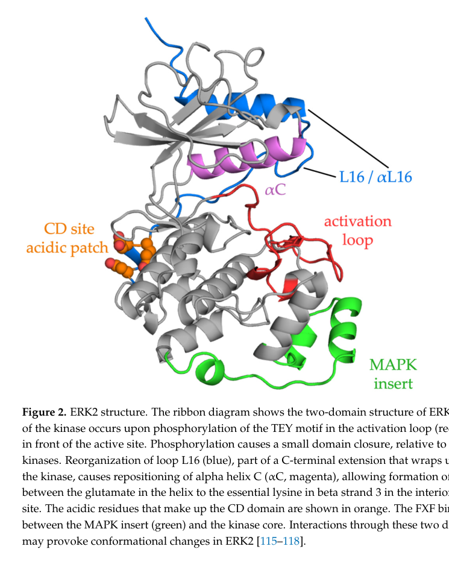

## Question

# Gene Research for Functional Annotation

## ⚠️ CRITICAL: Gene/Protein Identification Context

**BEFORE YOU BEGIN RESEARCH:** You MUST verify you are researching the CORRECT gene/protein. Gene symbols can be ambiguous, especially for less well-characterized genes from non-model organisms.

### Target Gene/Protein Identity (from UniProt):
- **UniProt Accession:** P27361
- **Protein Description:** RecName: Full=Mitogen-activated protein kinase 3; Short=MAP kinase 3; Short=MAPK 3; EC=2.7.11.24; AltName: Full=ERT2; AltName: Full=Extracellular signal-regulated kinase 1; Short=ERK-1; AltName: Full=Insulin-stimulated MAP2 kinase; AltName: Full=MAP kinase isoform p44; Short=p44-MAPK; AltName: Full=Microtubule-associated protein 2 kinase; AltName: Full=p44-ERK1;
- **Gene Information:** Name=MAPK3; Synonyms=ERK1, PRKM3;
- **Organism (full):** Homo sapiens (Human).
- **Protein Family:** Belongs to the protein kinase superfamily. CMGC Ser/Thr
- **Key Domains:** Kinase-like_dom_sf. (IPR011009); MAP_kinase_CS. (IPR003527); MAPK. (IPR050117); MAPK_ERK1/2. (IPR008349); Prot_kinase_dom. (IPR000719)

### MANDATORY VERIFICATION STEPS:

1. **Check if the gene symbol "MAPK3" matches the protein description above**
2. **Verify the organism is correct:** Homo sapiens (Human).
3. **Check if protein family/domains align with what you find in literature**
4. **If you find literature for a DIFFERENT gene with the same or similar symbol, STOP**

### If Gene Symbol is Ambiguous or You Cannot Find Relevant Literature:

**DO NOT PROCEED WITH RESEARCH ON A DIFFERENT GENE.** Instead:
- State clearly: "The gene symbol 'MAPK3' is ambiguous or literature is limited for this specific protein"
- Explain what you found (e.g., "Found extensive literature on a different gene with the same symbol in a different organism")
- Describe the protein based ONLY on the UniProt information provided above
- Suggest that the protein function can be inferred from domain/family information

### Research Target:

Please provide a comprehensive research report on the gene **MAPK3** (gene ID: MAPK3, UniProt: P27361) in human.

The research report should be a detailed narrative explaining the function, biological processes, and localization of the gene product. Citations should be given for all claims.

You should prioritize authoritative reviews and primary scientific literature when conducting research. You can supplement
this with annotations you find in gene/protein databases, but these can be outdated or inaccurate.

We are specifically interested in the primary function of the gene - for enzymes, what reaction is catalyzed, and what is the substrate specificity? For transporters, what is the substrate? For structural proteins or adapters, what is the broader structural role? For signaling molecules, what is the role in the pathway.

We are interested in where in or outside the cell the gene product carries out its function.

We are also interested in the signaling or biochemical pathways in which the gene functions. We are less interested in broad pleiotropic effects, except where these elucidate the precise role.

Include evidence where possible. We are interested in both experimental evidence as well as inference from structure, evolution, or bioinformatic analysis. Precise studies should be prioritized over high-throughput, where available.

## Output

Question: You are an expert researcher providing comprehensive, well-cited information.

Provide detailed information focusing on:
1. Key concepts and definitions with current understanding
2. Recent developments and latest research (prioritize 2023-2024 sources)
3. Current applications and real-world implementations
4. Expert opinions and analysis from authoritative sources
5. Relevant statistics and data from recent studies

Format as a comprehensive research report with proper citations. Include URLs and publication dates where available.
Always prioritize recent, authoritative sources and provide specific citations for all major claims.

# Gene Research for Functional Annotation

## ⚠️ CRITICAL: Gene/Protein Identification Context

**BEFORE YOU BEGIN RESEARCH:** You MUST verify you are researching the CORRECT gene/protein. Gene symbols can be ambiguous, especially for less well-characterized genes from non-model organisms.

### Target Gene/Protein Identity (from UniProt):
- **UniProt Accession:** P27361
- **Protein Description:** RecName: Full=Mitogen-activated protein kinase 3; Short=MAP kinase 3; Short=MAPK 3; EC=2.7.11.24; AltName: Full=ERT2; AltName: Full=Extracellular signal-regulated kinase 1; Short=ERK-1; AltName: Full=Insulin-stimulated MAP2 kinase; AltName: Full=MAP kinase isoform p44; Short=p44-MAPK; AltName: Full=Microtubule-associated protein 2 kinase; AltName: Full=p44-ERK1;
- **Gene Information:** Name=MAPK3; Synonyms=ERK1, PRKM3;
- **Organism (full):** Homo sapiens (Human).
- **Protein Family:** Belongs to the protein kinase superfamily. CMGC Ser/Thr
- **Key Domains:** Kinase-like_dom_sf. (IPR011009); MAP_kinase_CS. (IPR003527); MAPK. (IPR050117); MAPK_ERK1/2. (IPR008349); Prot_kinase_dom. (IPR000719)

### MANDATORY VERIFICATION STEPS:

1. **Check if the gene symbol "MAPK3" matches the protein description above**
2. **Verify the organism is correct:** Homo sapiens (Human).
3. **Check if protein family/domains align with what you find in literature**
4. **If you find literature for a DIFFERENT gene with the same or similar symbol, STOP**

### If Gene Symbol is Ambiguous or You Cannot Find Relevant Literature:

**DO NOT PROCEED WITH RESEARCH ON A DIFFERENT GENE.** Instead:
- State clearly: "The gene symbol 'MAPK3' is ambiguous or literature is limited for this specific protein"
- Explain what you found (e.g., "Found extensive literature on a different gene with the same symbol in a different organism")
- Describe the protein based ONLY on the UniProt information provided above
- Suggest that the protein function can be inferred from domain/family information

### Research Target:

Please provide a comprehensive research report on the gene **MAPK3** (gene ID: MAPK3, UniProt: P27361) in human.

The research report should be a detailed narrative explaining the function, biological processes, and localization of the gene product. Citations should be given for all claims.

You should prioritize authoritative reviews and primary scientific literature when conducting research. You can supplement
this with annotations you find in gene/protein databases, but these can be outdated or inaccurate.

We are specifically interested in the primary function of the gene - for enzymes, what reaction is catalyzed, and what is the substrate specificity? For transporters, what is the substrate? For structural proteins or adapters, what is the broader structural role? For signaling molecules, what is the role in the pathway.

We are interested in where in or outside the cell the gene product carries out its function.

We are also interested in the signaling or biochemical pathways in which the gene functions. We are less interested in broad pleiotropic effects, except where these elucidate the precise role.

Include evidence where possible. We are interested in both experimental evidence as well as inference from structure, evolution, or bioinformatic analysis. Precise studies should be prioritized over high-throughput, where available.

# Human MAPK3/ERK1 Functional Annotation Report

## Executive summary

The requested target is unambiguous: **human MAPK3 encodes extracellular signal-regulated kinase 1 (ERK1), historically p44-MAPK**, and corresponds to **UniProt P27361**. It is distinct from **MAPK1/ERK2/p42-MAPK**. The supplied protein-family and domain annotations are internally consistent with the literature: ERK1 is a conventional, bilobed CMGC-family serine/threonine protein kinase containing the conserved protein-kinase catalytic core, MAPK insert, TEY activation loop, and MAPK substrate-docking surfaces. A critical numbering point is that ERK1 is activated at **Thr202 and Tyr204**; the commonly quoted Thr185/Tyr187 pair belongs to ERK2. No evidence requiring termination because of gene-symbol ambiguity was found. (lavoie2020erksignallinga pages 2-3, kyriakis2012mammalianmapksignal pages 2-3, barbosa2021themekerknetwork pages 5-8)

Functionally, ERK1 is one of two closely related terminal kinases of the canonical **RTK/GPCR–RAS–RAF–MEK–ERK** module. Once dually phosphorylated by MEK1/2, it transfers phosphate from ATP to serine or threonine residues in protein substrates, with preference for proline-directed sites. Its broad biological reach results not merely from the short phosphoacceptor sequence, but from substrate-docking motifs, scaffolds, signal dynamics, and movement among cytoplasmic, membrane-associated and nuclear compartments. Most mechanistic literature measures ERK1 and ERK2 together; current evidence supports substantial redundancy rather than a large MAPK3-specific substrate program. (barbosa2021themekerknetwork pages 1-5, klomp2024determiningtheerkregulated pages 3-4, martinvega2023navigatingtheerk12 pages 5-7)

The following table summarizes the evidence and the distinction between MAPK3-specific and joint ERK1/2 conclusions.

| Annotation dimension | Best-supported conclusion | Evidence type/strength | Important caveat |
|---|---|---|---|
| Identity | **Human MAPK3, UniProt P27361**, encodes **ERK1/p44-MAPK**, a 379-aa, approximately 43–44-kDa conventional CMGC-family MAP kinase distinct from MAPK1/ERK2/p42-MAPK. (lavoie2020erksignallinga pages 2-3, kyriakis2012mammalianmapksignal pages 2-3, barbosa2021themekerknetwork pages 5-8) | UniProt target specification and consistent nomenclature in authoritative reviews; **high confidence**. | Do not confuse MAPK3/ERK1 with MAPK1/ERK2. Some literature discusses “ERK” generically or reverses the gene-symbol assignments. |
| Enzymatic reaction and specificity | Active ERK1 transfers the γ-phosphate of ATP to protein serine or threonine: **ATP + protein-OH → ADP + phosphoprotein**. ERK1/2 are proline-directed and prefer **PX(S/T)P**, with **(S/T)P** as the minimal motif; glycine and rarely alanine can occupy the P+1 position. (barbosa2021themekerknetwork pages 1-5, martinvega2023navigatingtheerk12 pages 5-7) | Biochemical and structural reviews, supported by 2024 motif enrichment; **high confidence for ERK1/2 jointly**. | The short phosphoacceptor motif cannot identify a physiological substrate by itself; docking, localization, scaffolds, and stimulus context supply specificity. |
| Activation | MEK1/2 activate ERK1 by phosphorylating its activation-loop **Thr202–Glu203–Tyr204 (TEY)** motif. Dual phosphorylation reorganizes the kinase fold and increases activity by approximately **50,000-fold**. (martinvega2023navigatingtheerk12 pages 4-5, barbosa2021themekerknetwork pages 5-8) | Structural and biochemical evidence synthesized in authoritative reviews; **high confidence**. | **Thr185/Tyr187 are ERK2 residues**, not ERK1 residues. Sources discussing ERK1/2 collectively sometimes use ERK2 numbering. |
| Substrate docking | ERK1/2 use a common-docking or D-recruitment site to bind basic and hydrophobic **D motifs**, typically K/R-X₂–₄-L-X-L, and an F-recruitment site to bind **DEF/FXF motifs**; activation increases accessibility of the latter site. (klomp2024determiningtheerkregulated pages 8-9, busca2016erk1anderk2 pages 2-3, martinvega2023navigatingtheerk12 pages 5-7) | Structural literature and 2024 human-cell docking-mutant rescue experiments; **strong causal evidence for ERK1/2**. | Disrupting either docking interaction prevented activated ERK1/2 from rescuing KRAS-dependent growth, but not every genuine substrate contains a recognizable D or DEF motif. |
| Pathway position | ERK1 is a terminal effector kinase in the canonical **RTK or GPCR → RAS-GTP → RAF → MEK1/2 → ERK1/2** cascade, converting extracellular signals into cytoplasmic and nuclear phosphorylation programs. (barbosa2021themekerknetwork pages 1-5, smorodinskyatias2020mutationsthatconfer pages 3-5, klomp2024determiningtheerkregulated pages 1-3) | Extensive biochemical and genetic evidence; **high confidence**. | This pathway-level conclusion generally concerns ERK1 and ERK2 together; noncanonical activation can occur in selected contexts. |
| Subcellular localization | ERK1/2 dynamically occupy cytoplasmic, nuclear, membrane-associated, focal-adhesion, and scaffolded compartments. Resting ERK is commonly retained in the cytoplasm; stimulation releases anchors and promotes nuclear entry through nucleoporins and an SPS-containing nuclear-translocation signal/importin-7 mechanism. (maikrachline2019nuclearerkmechanism pages 3-4, martinvega2023navigatingtheerk12 pages 5-7) | Imaging, interaction, mutation, and transport studies; **strong evidence, mostly ERK1/2-joint**. | Distribution depends on stimulus, duration, scaffold, and cell type. MEK, PEA-15, β-arrestin, DUSP6, and other partners can retain or export ERK. |
| Representative outputs | Direct or proximal targets include RSKs, MSKs, ELK1, MYC, FRA1/FOSL1, FOXO3, BIM, MCL1, RAF, MEK, and paxillin. Outputs include immediate-early transcription, cell-cycle progression, survival, migration, adhesion, differentiation, and negative feedback. (smorodinskyatias2020mutationsthatconfer pages 3-5, barbosa2021themekerknetwork pages 11-14, klomp2024determiningtheerkregulated pages 8-9) | Targeted biochemistry and broad phosphoproteomic support; **strong pathway-level evidence**. | Most substrates and phenotypes were established for **ERK1/2 collectively**, not uniquely for MAPK3. Direct phosphorylation must be distinguished from downstream indirect regulation. |
| ERK1 versus ERK2 | ERK1 and ERK2 are **83% identical** and generally have overlapping substrate specificity. ERK1-null mice are viable and fertile, whereas whole-body ERK2 loss is embryonically lethal. In KRAS-mutant pancreatic cancer, activated ERK1 and ERK2 produced near-identical signaling and transforming outputs. (klomp2024determiningtheerkregulated pages 3-4, martinvega2023navigatingtheerk12 pages 4-5, martinvega2023navigatingtheerk12 pages 5-7) | Mouse genetics, replacement experiments, siRNA/RPPA, and activated-mutant rescue; **strong evidence for substantial redundancy**. | Redundancy is not absolute; isoform expression, localization, regulatory interactions, and selected context-specific phenotypes can differ. |
| 2024 phosphoproteome | Across six KRAS-mutant pancreatic-cancer lines, selective ERK1/2 inhibition identified **4,666 ERK-dependent phosphosites on 2,123 proteins**; **79% of sites and 66% of proteins** had not previously been associated with ERK. Approximately **75%** of downregulated sites contained (S/T)P, and approximately **40%** also had a D and/or DEF motif. (klomp2024determiningtheerkregulated pages 1-3, klomp2024determiningtheerkregulated pages 8-9, klomp2024determiningtheerkregulated pages 4-6) | Quantitative LC–MS/MS after 1- and 24-hour inhibition, kinome-selectivity profiling, six-cell-line replication, and genetic rescue; **high-quality primary evidence**. | These are **combined ERK1/2-dependent** direct and indirect events in KRAS-mutant pancreatic cancer, not an ERK1-only substrate catalogue. Acute changes are more likely direct than 24-hour changes. |
| Disease relevance | Persistent ERK output is a central consequence of oncogenic RAS/RAF signaling. ERK1 alterations occurred in approximately **0.5%** of analyzed cancer samples as of September 2023, without a clear hotspot; oncogenic activation therefore usually originates upstream rather than in MAPK3. (martinvega2023navigatingtheerk12 pages 7-8, klomp2024determiningtheerkregulated pages 1-3) | Cancer-genome data integrated with functional experiments; **moderate-to-strong evidence**. | Pathway activation or phospho-ERK is not equivalent to a causal MAPK3 mutation, and clinical assays commonly do not distinguish ERK1 from ERK2 activity. |
| Therapeutic relevance | Approved clinical applications predominantly inhibit upstream BRAF or MEK1/2. Direct agents such as **ulixertinib** and **temuterkib** remain investigational and inhibit **ERK1/2**, not MAPK3 selectively. Combination strategies pair ERK blockade with autophagy, CDK4/6, SHP2, SOS1, KRAS, or cell-cycle inhibition. (adamopoulos2024inhibitionofthe pages 9-10, adamopoulos2024inhibitionofthe pages 7-9, barbosa2021themekerknetwork pages 20-23) | Approved pathway therapies, clinical studies, and 2024 translational reviews; **high confidence for development status, variable efficacy evidence**. | Early direct-ERK trials in RAS-mutant tumors were disappointing; adaptive reactivation, toxicity, normal-tissue dependence, and ERK1/ERK2 redundancy limit MAPK3-specific interpretation. |

*Table: Compact evidence map for human MAPK3/ERK1 that separates protein-specific conclusions from findings established jointly for ERK1/2. It summarizes mechanistic confidence, quantitative 2024 results, and major annotation caveats.*

## 1. Identity verification and structural classification

**Verified identity**

- **Gene:** MAPK3; aliases include ERK1 and PRKM3.
- **Protein:** mitogen-activated protein kinase 3; ERK1; p44-MAPK.
- **Organism:** *Homo sapiens*.
- **Accession:** UniProt **P27361**.
- **Distinct paralogue:** MAPK1 encodes ERK2/p42-MAPK, not ERK1. Authoritative nomenclature tables explicitly pair MAPK3 with ERK1/p44 and MAPK1 with ERK2/p42. (lavoie2020erksignallinga pages 2-3, kyriakis2012mammalianmapksignal pages 2-3, keshet2010themapkinase pages 9-11)

The UniProt-supplied length of 379 amino acids and approximately 43–44-kDa size agree with the historical p44 designation. Structurally, ERK1 has the canonical kinase N-lobe and C-lobe, ATP-binding cleft, catalytic lysine, αC helix, DFG and APE/SPE-region motifs, activation segment, MAPK insert, and C-terminal extension. These features align with the supplied InterPro annotations **protein kinase domain**, **MAP kinase signature**, **MAPK ERK1/2**, and **kinase-like domain superfamily**. (barbosa2021themekerknetwork pages 5-8, smorodinskyatias2020mutationsthatconfer pages 3-5)

The available structure illustration is of the highly related ERK2, not ERK1, but it usefully identifies conserved ERK architecture: TEY-containing activation loop, αC/L16 regulatory elements, acidic common-docking patch, and the MAPK insert neighboring the FXF-binding site. It should therefore be interpreted as a paralogue-based structural model rather than an ERK1-specific structure. (martinvega2023navigatingtheerk12 media 129910b0)

## 2. Primary molecular function and reaction

MAPK3 is an ATP-dependent, proline-directed protein serine/threonine kinase. Its net reaction is:

**ATP + protein-serine/threonine → ADP + protein-phosphoserine/phosphothreonine.**

ERK1/2 preferentially phosphorylate **PX(S/T)P**, although the minimal sequence is frequently **(S/T)P**. The shallow P+1 pocket favors proline immediately after the phosphoacceptor; glycine and, less commonly, alanine can sometimes be accommodated. Thus, ERK1 is not specific to one substrate molecule. It recognizes a broad protein-substrate class whose physiological selection depends on docking interactions, accessibility, localization and signal timing. (barbosa2021themekerknetwork pages 1-5, martinvega2023navigatingtheerk12 pages 5-7)

### Docking-based specificity

Two conserved interaction surfaces refine specificity:

1. The **common-docking/D-recruitment site (CD/DRS)** binds basic-hydrophobic D motifs, commonly represented as **K/R-X₂–₄-L-X-L**. MEK1/2, DUSP6 and numerous substrates use this interface.
2. The **F-recruitment site/DEF-binding site (FRS)** recognizes **FXF/DEF** motifs and becomes more accessible upon kinase activation. Some substrates, including ELK1, contain both docking types. (busca2016erk1anderk2 pages 2-3, martinvega2023navigatingtheerk12 pages 5-7)

This mechanism has direct functional support. In the 2024 KRAS-mutant pancreatic-cancer study, activated human ERK1 or ERK2 mutants selectively impaired in D- or DEF-motif binding failed to restore signaling or KRAS-dependent growth, although the mutations were designed not to abolish intrinsic catalytic function. Docking is therefore causal to productive signaling, not merely correlative. (klomp2024determiningtheerkregulated pages 8-9)

## 3. Activation and pathway position

In the canonical growth-factor pathway, ligand-activated RTKs recruit adaptor and exchange-factor machinery such as GRB2–SOS, generating RAS-GTP. RAS recruits and activates RAF kinases at the plasma membrane; RAF phosphorylates MEK1/2; MEK1/2 then activate ERK1/2. GPCRs and other receptors can feed into the same module, and alternative MAP3Ks can activate MEK in selected contexts. (barbosa2021themekerknetwork pages 1-5, smorodinskyatias2020mutationsthatconfer pages 3-5, martinvega2023navigatingtheerk12 pages 4-5)

MEK1/2 phosphorylate ERK1 sequentially on the activation-loop **Thr202–Glu203–Tyr204** motif. Both sites are required for full activity. Dual phosphorylation promotes domain closure, repositions αC and regulatory C-terminal elements, and enables the catalytic salt bridge; combined phosphorylation increases ERK activity by approximately **50,000-fold**. ERKs have negligible basal/autophosphorylation activity under ordinary conditions and normally depend on upstream MAP2Ks. (martinvega2023navigatingtheerk12 pages 4-5, barbosa2021themekerknetwork pages 5-8, smorodinskyatias2020mutationsthatconfer pages 3-5)

Active ERK1 phosphorylates substrates but also participates in feedback: ERK-dependent phosphorylation of RAF/MEK and induction or activation of phosphatases help terminate or reshape signaling. DUSPs can remove one or both TEY phosphates, while scaffold proteins such as KSR organize pathway components. Consequently, ERK signaling is a dynamic feedback-controlled system rather than a simple linear switch. (smorodinskyatias2020mutationsthatconfer pages 3-5, busca2016erk1anderk2 pages 2-3)

## 4. Cellular localization and site of action

MAPK3 has no single permanent organellar location. ERK1/2 operate in **cytoplasmic, membrane-associated, focal-adhesion, scaffolded and nuclear compartments**, with localization determining substrate access. In resting cells, ERK is commonly cytoplasmic because of anchoring by MEK and proteins such as PEA-15. β-Arrestin can retain activated ERK in the cytoplasm, favoring cytoplasmic phosphorylation while reducing ERK-dependent transcription. DUSP6 provides another cytoplasmic docking and export mechanism. (barbosa2021themekerknetwork pages 11-14, martinvega2023navigatingtheerk12 pages 5-7)

After stimulation and TEY phosphorylation, conformational changes weaken anchoring interactions. An SPS-containing nuclear-translocation signal in the kinase-insert region can be phosphorylated, facilitating importin-7 binding and passage through nuclear pores; nucleoporin interactions also support rapid nuclear–cytoplasmic exchange. Nuclear Ran releases the kinase from importin-7. ERK lacks a conventional classical nuclear-localization signal, so its trafficking differs from canonical importin-α/β cargo. (maikrachline2019nuclearerkmechanism pages 3-4, martinvega2023navigatingtheerk12 pages 5-7)

Nuclear entry exposes ERK to transcription factors and chromatin-associated regulators and is especially linked to proliferation. Cytoplasmic ERK acts on kinases, cytoskeletal and adhesion machinery, and localized signaling complexes. More than 600 confirmed ERK substrates had been compiled by 2019–2021; one localization analysis classified approximately 125 as exclusively nuclear and another 44 as predominantly nuclear. These counts concern ERK1/2 collectively and do not constitute an ERK1-only substrate catalogue. (barbosa2021themekerknetwork pages 11-14, maikrachline2019nuclearerkmechanism pages 3-4)

## 5. Representative substrates and precise outputs

Representative direct or proximal targets include:

- **ELK1 and immediate-early transcription:** ERK phosphorylation of ELK1 promotes expression of FOS-family genes. Sustained signaling further phosphorylates and stabilizes immediate-early proteins such as FOS, FRA1/FOSL1 and MYC, converting transient receptor input into longer-lived transcriptional and proliferative output. (barbosa2021themekerknetwork pages 11-14)
- **RSK and MSK kinase families:** ERK activates RSKs and MSKs, extending signaling to translational, transcriptional, migratory and cell-cycle machinery. (lavoie2020erksignallinga pages 2-3, smorodinskyatias2020mutationsthatconfer pages 3-5)
- **Cell-cycle and survival regulators:** ERK can inhibit antiproliferative FOXO3 and TOB, inhibit pro-apoptotic BIM, or stabilize anti-apoptotic MCL1. The outcome remains context dependent; ERK can support or oppose apoptosis depending on stimulus and cell state. (barbosa2021themekerknetwork pages 11-14)
- **Adhesion and cytoskeleton:** focal-adhesion-localized ERK phosphorylates paxillin, increasing paxillin–FAK association and promoting spreading and adhesion. (barbosa2021themekerknetwork pages 11-14)
- **Feedback components:** RAF, MEK and phosphatase-expression programs are regulated directly or indirectly by ERK, shaping pathway amplitude and duration. (smorodinskyatias2020mutationsthatconfer pages 3-5)

Accordingly, the most precise functional description is that MAPK3/ERK1 is a **signal-propagating effector kinase** that translates the strength, duration and spatial distribution of upstream RAS–RAF–MEK activity into phosphorylation programs controlling transcription, cell-cycle transitions, survival, differentiation, migration, adhesion and feedback. These broad effects are mechanistically unified by substrate phosphorylation rather than representing unrelated pleiotropy.

## 6. ERK1 versus ERK2: annotation caveat and current expert interpretation

ERK1 and ERK2 are approximately **83% identical**, have strongly overlapping substrate specificity, and commonly compensate for each other. ERK1-null mice are viable and fertile, whereas whole-body ERK2 deletion is embryonically lethal; however, ectopic expression of one isoform can compensate for loss of the other, and experts have argued that total ERK dosage often explains apparent isoform-specific phenotypes. Context-dependent differences in abundance, regulation and localization may nevertheless occur. (klomp2024determiningtheerkregulated pages 3-4, martinvega2023navigatingtheerk12 pages 4-5, martinvega2023navigatingtheerk12 pages 5-7)

The strongest recent experimental test came from KRAS-mutant pancreatic ductal adenocarcinoma. Activated ERK1 and ERK2 each supported resistance to KRAS-pathway inhibition; ERK1 and ERK2 depletion produced highly correlated changes across 147 signaling measurements; and activated ERK1 and ERK2 reversed **92% and 83%**, respectively, of KRAS-G12D-inhibitor-induced transcriptional changes. The authors concluded that the two isoforms have near-identical signaling and transforming outputs in that model. (klomp2024determiningtheerkregulated pages 1-3, klomp2024determiningtheerkregulated pages 3-4)

Therefore, literature reporting “phospho-ERK1/2,” pan-ERK inhibition or total ERK output should not be reannotated as MAPK3-specific. A rigorous MAPK3 annotation should use ERK1-specific perturbation, rescue or biochemical evidence where available and label the remainder as ERK1/2-family evidence.

## 7. Major 2023–2024 developments

### 2023 synthesis of structure and signaling

The October 2023 review by Martín-Vega and Cobb consolidated current understanding of TEY-mediated activation, docking motifs, scaffolds and compartmental control. It also reported that ERK1 alterations appeared in only about **0.5% of analyzed cancer samples** as of September 2023, lacked a recurrent hotspot, and were generally isolated events. This supports the expert view that cancers usually activate ERK output through upstream RAS/RAF/MEK lesions rather than recurrent MAPK3 driver mutations. The experimentally active ERK1 R84S mutant transformed model cells, but it had not been observed as a human-cancer mutation at that time; R84H had been associated with ERK-inhibitor resistance. (martinvega2023navigatingtheerk12 pages 5-7, martinvega2023navigatingtheerk12 pages 7-8)

### 2024 ERK-regulated phosphoproteome

A June 7, 2024 *Science* study used the ERK1/2-selective inhibitor SCH772984, quantitative LC–MS/MS, acute and 24-hour sampling, six heterogeneous KRAS-mutant pancreatic-cancer cell lines, kinome profiling and genetic rescue. Of 207 quantified kinases, only ERK1 and ERK2 were selectively inhibited at both time points, strengthening attribution of the resulting phosphorylation changes. (klomp2024determiningtheerkregulated pages 4-6)

The study detected **13,646 unique phosphosites**; 932 changed after one hour and 4,288 after 24 hours. Its integrated ERK-dependent set comprised **4,666 phosphosites on 2,123 proteins**, of which **79% of sites and 66% of proteins** had not previously been associated with ERK. More than 2,500 sites and 200 proteins were absent from pre-existing comparison databases, 91% overlapped a machine-learning-defined functional phosphoproteome, and 75% of ERK-dependent sites were detected in at least two cell lines. (klomp2024determiningtheerkregulated pages 4-6, klomp2024determiningtheerkregulated pages 1-3)

Approximately **75%** of downregulated sites contained the minimal (S/T)P motif, and approximately **40%** combined that motif with a D and/or DEF docking motif. D motifs occurred across compartments, whereas DEF motifs were concentrated in nuclear proteins. After one hour of inhibition, decreased sites occurred on 33 epigenetic regulators, 31 transcription factors, 28 kinases, 16 E3 ligases and 5 phosphatases; after 24 hours, the respective counts were 107, 98, 55, 44 and 13. The network converged on CDK/cell-cycle control, RHO-GTPase signaling, transcription, protein turnover and cytoskeletal regulation. (klomp2024determiningtheerkregulated pages 8-9)

DepMap integration showed nuclear enrichment among strongly dependent ERK-regulated proteins—**76% (288/1,072)**—while also identifying substantial cytoplasmic output, **36% (136/406)**. Combining ERK and APC/C inhibition synergistically suppressed pancreatic-cancer growth. These results greatly expand the functional map, but they represent combined ERK1/2-dependent direct and indirect signaling in KRAS-mutant cancer, not a purified MAPK3-only substrate set. (klomp2024determiningtheerkregulated pages 14-16)

## 8. Disease relevance and applications

### Cancer biology

Persistent ERK activity is a common final output of oncogenic RTK, RAS, RAF or MEK alterations. A 2021 synthesis estimated aberrant pathway activation in more than one-third of human cancers and approximately 90% of cutaneous melanomas. In KRAS-mutant pancreatic cancer, ERK-dependent signaling was sufficient to generate near-complete resistance to KRAS-G12C- and KRAS-G12D-selective inhibitors, showing why rebound ERK activity is a major therapeutic problem. (barbosa2021themekerknetwork pages 1-5, klomp2024determiningtheerkregulated pages 1-3)

Open Targets links MAPK3 evidence to cancer, non-small-cell lung carcinoma, hypertrophic cardiomyopathy and RASopathies including Noonan and Costello syndromes. These associations should be interpreted as pathway/disease evidence, not proof that MAPK3 mutation is the usual primary lesion; for RASopathies and most cancers, upstream genes commonly drive abnormal ERK1/2 activity. (OpenTargets Search: -MAPK3)

### Real-world therapeutic implementation

Established clinical implementation predominantly targets **upstream BRAF or MEK1/2**, not MAPK3 alone. FDA-approved MEK inhibitors include trametinib, cobimetinib, binimetinib and selumetinib, and vertical BRAF–MEK combinations are established for molecularly selected BRAF-V600 tumors. These drugs suppress ERK1/2 output indirectly and should not be called MAPK3-selective therapies. (barbosa2021themekerknetwork pages 20-23, martinvega2023navigatingtheerk12 pages 21-22)

Direct ERK inhibitors such as **ulixertinib** and **temuterkib** remain investigational and generally inhibit both ERK1 and ERK2. Early direct-ERK trials in RAS-mutant tumors, including pancreatic cancer, were disappointing. Current strategies therefore emphasize combinations—for example, ERK inhibition with hydroxychloroquine to block induced autophagy, ulixertinib with CDK4/6 inhibition, or pathway combinations involving SHP2, SOS1, mutant KRAS, WEE1, CHK1 or APC/C. (adamopoulos2024inhibitionofthe pages 7-9, perurena2024combinatorialstrategiesto pages 13-14)

The principal translational constraints are adaptive RTK/RAS pathway reactivation, loss of ERK-mediated negative feedback, compensatory kinase programs, acquired KRAS/MEK/ERK resistance mutations, toxicity from inhibiting a pathway required in normal tissue, and overlapping toxicity in combination regimens. These limitations, plus ERK1/ERK2 redundancy, explain why a therapeutically useful MAPK3-only inhibitor has not become standard practice. (adamopoulos2024inhibitionofthe pages 9-10, barbosa2021themekerknetwork pages 20-23, adamopoulos2024inhibitionofthe pages 7-9)

## 9. Evidence assessment and annotation conclusion

The highest-confidence annotation is:

> **MAPK3 encodes human ERK1/p44, a conventional CMGC-family proline-directed serine/threonine kinase activated by MEK1/2-mediated phosphorylation of Thr202 and Tyr204. As a terminal effector of the RAS–RAF–MEK cascade, active ERK1 phosphorylates docking-selected substrates in cytoplasmic, membrane-associated and nuclear compartments, thereby coupling extracellular signals to transcription, cell-cycle, survival, differentiation, migration, adhesion and feedback programs.**

Evidence for identity, kinase architecture, TEY activation, docking and pathway position is strong. Evidence for hundreds of substrates and most physiological outputs is also strong but usually pertains to **ERK1/2 jointly**. The 2024 phosphoproteomic work provides unusually broad and quantitative causal evidence, while simultaneously reinforcing near-functional redundancy between ERK1 and ERK2. MAPK3-specific functional claims should therefore be conservative unless based on isoform-specific knockout, knockdown, rescue, mutation or biochemistry.

## Key recent and authoritative sources

- Klomp JE et al. **Determining the ERK-regulated phosphoproteome driving KRAS-mutant cancer.** *Science*. Published June 7, 2024. https://doi.org/10.1126/science.adk0850 (klomp2024determiningtheerkregulated pages 1-3)
- Klomp JA et al. **Defining the KRAS- and ERK-dependent transcriptome in KRAS-mutant cancers.** *Science*. Published June 2024. https://doi.org/10.1126/science.adk0775 (klomp2024definingthekras pages 13-14)
- Adamopoulos C et al. **Inhibition of the RAF/MEK/ERK Signaling Cascade in Pancreatic Cancer.** *International Journal of Molecular Sciences*. Published January 2024. https://doi.org/10.3390/ijms25031631 (adamopoulos2024inhibitionofthe pages 9-10)
- Perurena N et al. **Combinatorial strategies to target RAS-driven cancers.** *Nature Reviews Cancer*. Published April 2024. https://doi.org/10.1038/s41568-024-00679-6 (perurena2024combinatorialstrategiesto pages 13-14)
- Martín-Vega A, Cobb MH. **Navigating the ERK1/2 MAPK Cascade.** *Biomolecules*. Published October 2023. https://doi.org/10.3390/biom13101555 (martinvega2023navigatingtheerk12 pages 5-7)
- Lavoie H et al. **ERK signalling: a master regulator of cell behaviour, life and fate.** *Nature Reviews Molecular Cell Biology*. Published June 2020. https://doi.org/10.1038/s41580-020-0255-7 (lavoie2020erksignallinga pages 1-2)
- Barbosa R et al. **The MEK/ERK Network as a Therapeutic Target in Human Cancer.** *Molecular Cancer Research*. Published March 2021. https://doi.org/10.1158/1541-7786.MCR-20-0687 (barbosa2021themekerknetwork pages 1-5)
- Buscà R et al. **ERK1 and ERK2 MAP Kinases: Specific Roles or Functional Redundancy?** *Frontiers in Cell and Developmental Biology*. Published June 2016. https://doi.org/10.3389/fcell.2016.00053 (busca2016erk1anderk2 pages 2-3)

References

1. (lavoie2020erksignallinga pages 2-3): Hugo Lavoie, Jessica Gagnon, and Marc Therrien. Erk signalling: a master regulator of cell behaviour, life and fate. Nature Reviews Molecular Cell Biology, 21:607-632, Jun 2020. URL: https://doi.org/10.1038/s41580-020-0255-7, doi:10.1038/s41580-020-0255-7. This article has 1430 citations and is from a domain leading peer-reviewed journal.

2. (kyriakis2012mammalianmapksignal pages 2-3): John M. Kyriakis and Joseph Avruch. Mammalian mapk signal transduction pathways activated by stress and inflammation: a 10-year update. Physiological reviews, 92 2:689-737, Apr 2012. URL: https://doi.org/10.1152/physrev.00028.2011, doi:10.1152/physrev.00028.2011. This article has 1833 citations and is from a highest quality peer-reviewed journal.

3. (barbosa2021themekerknetwork pages 5-8): Renee Barbosa, Lucila A. Acevedo, and Ronen Marmorstein. The mek/erk network as a therapeutic target in human cancer. Molecular Cancer Research, 19:361-374, Mar 2021. URL: https://doi.org/10.1158/1541-7786.mcr-20-0687, doi:10.1158/1541-7786.mcr-20-0687. This article has 254 citations and is from a peer-reviewed journal.

4. (barbosa2021themekerknetwork pages 1-5): Renee Barbosa, Lucila A. Acevedo, and Ronen Marmorstein. The mek/erk network as a therapeutic target in human cancer. Molecular Cancer Research, 19:361-374, Mar 2021. URL: https://doi.org/10.1158/1541-7786.mcr-20-0687, doi:10.1158/1541-7786.mcr-20-0687. This article has 254 citations and is from a peer-reviewed journal.

5. (klomp2024determiningtheerkregulated pages 3-4): Jennifer E. Klomp, J. Nathaniel Diehl, Jeffrey A. Klomp, A. Cole Edwards, Runying Yang, Alexis J. Morales, Khalilah E. Taylor, Kristina Drizyte-Miller, Kirsten L. Bryant, Antje Schaefer, Jared L. Johnson, Emily M. Huntsman, Tomer M. Yaron, Mariaelena Pierobon, Elisa Baldelli, Alex W. Prevatte, Natalie K. Barker, Laura E. Herring, Emanuel F. Petricoin, Lee M. Graves, Lewis C. Cantley, Adrienne D. Cox, Channing J. Der, and Clint A. Stalnecker. Determining the erk-regulated phosphoproteome driving kras-mutant cancer. Science, Jun 2024. URL: https://doi.org/10.1126/science.adk0850, doi:10.1126/science.adk0850. This article has 107 citations and is from a highest quality peer-reviewed journal.

6. (martinvega2023navigatingtheerk12 pages 5-7): Ana Martín-Vega and Melanie H. Cobb. Navigating the erk1/2 mapk cascade. Biomolecules, 13:1555, Oct 2023. URL: https://doi.org/10.3390/biom13101555, doi:10.3390/biom13101555. This article has 144 citations.

7. (martinvega2023navigatingtheerk12 pages 4-5): Ana Martín-Vega and Melanie H. Cobb. Navigating the erk1/2 mapk cascade. Biomolecules, 13:1555, Oct 2023. URL: https://doi.org/10.3390/biom13101555, doi:10.3390/biom13101555. This article has 144 citations.

8. (klomp2024determiningtheerkregulated pages 8-9): Jennifer E. Klomp, J. Nathaniel Diehl, Jeffrey A. Klomp, A. Cole Edwards, Runying Yang, Alexis J. Morales, Khalilah E. Taylor, Kristina Drizyte-Miller, Kirsten L. Bryant, Antje Schaefer, Jared L. Johnson, Emily M. Huntsman, Tomer M. Yaron, Mariaelena Pierobon, Elisa Baldelli, Alex W. Prevatte, Natalie K. Barker, Laura E. Herring, Emanuel F. Petricoin, Lee M. Graves, Lewis C. Cantley, Adrienne D. Cox, Channing J. Der, and Clint A. Stalnecker. Determining the erk-regulated phosphoproteome driving kras-mutant cancer. Science, Jun 2024. URL: https://doi.org/10.1126/science.adk0850, doi:10.1126/science.adk0850. This article has 107 citations and is from a highest quality peer-reviewed journal.

9. (busca2016erk1anderk2 pages 2-3): Roser Buscà, Jacques Pouysségur, and Philippe Lenormand. Erk1 and erk2 map kinases: specific roles or functional redundancy? Frontiers in Cell and Developmental Biology, Jun 2016. URL: https://doi.org/10.3389/fcell.2016.00053, doi:10.3389/fcell.2016.00053. This article has 261 citations.

10. (smorodinskyatias2020mutationsthatconfer pages 3-5): Karina Smorodinsky-Atias, Nadine Soudah, and David Engelberg. Mutations that confer drug-resistance, oncogenicity and intrinsic activity on the erk map kinases—current state of the art. Cells, 9:129, Jan 2020. URL: https://doi.org/10.3390/cells9010129, doi:10.3390/cells9010129. This article has 46 citations.

11. (klomp2024determiningtheerkregulated pages 1-3): Jennifer E. Klomp, J. Nathaniel Diehl, Jeffrey A. Klomp, A. Cole Edwards, Runying Yang, Alexis J. Morales, Khalilah E. Taylor, Kristina Drizyte-Miller, Kirsten L. Bryant, Antje Schaefer, Jared L. Johnson, Emily M. Huntsman, Tomer M. Yaron, Mariaelena Pierobon, Elisa Baldelli, Alex W. Prevatte, Natalie K. Barker, Laura E. Herring, Emanuel F. Petricoin, Lee M. Graves, Lewis C. Cantley, Adrienne D. Cox, Channing J. Der, and Clint A. Stalnecker. Determining the erk-regulated phosphoproteome driving kras-mutant cancer. Science, Jun 2024. URL: https://doi.org/10.1126/science.adk0850, doi:10.1126/science.adk0850. This article has 107 citations and is from a highest quality peer-reviewed journal.

12. (maikrachline2019nuclearerkmechanism pages 3-4): Galia Maik-Rachline, Avital Hacohen-Lev-Ran, and Rony Seger. Nuclear erk: mechanism of translocation, substrates, and role in cancer. International Journal of Molecular Sciences, 20:1194, Mar 2019. URL: https://doi.org/10.3390/ijms20051194, doi:10.3390/ijms20051194. This article has 305 citations.

13. (barbosa2021themekerknetwork pages 11-14): Renee Barbosa, Lucila A. Acevedo, and Ronen Marmorstein. The mek/erk network as a therapeutic target in human cancer. Molecular Cancer Research, 19:361-374, Mar 2021. URL: https://doi.org/10.1158/1541-7786.mcr-20-0687, doi:10.1158/1541-7786.mcr-20-0687. This article has 254 citations and is from a peer-reviewed journal.

14. (klomp2024determiningtheerkregulated pages 4-6): Jennifer E. Klomp, J. Nathaniel Diehl, Jeffrey A. Klomp, A. Cole Edwards, Runying Yang, Alexis J. Morales, Khalilah E. Taylor, Kristina Drizyte-Miller, Kirsten L. Bryant, Antje Schaefer, Jared L. Johnson, Emily M. Huntsman, Tomer M. Yaron, Mariaelena Pierobon, Elisa Baldelli, Alex W. Prevatte, Natalie K. Barker, Laura E. Herring, Emanuel F. Petricoin, Lee M. Graves, Lewis C. Cantley, Adrienne D. Cox, Channing J. Der, and Clint A. Stalnecker. Determining the erk-regulated phosphoproteome driving kras-mutant cancer. Science, Jun 2024. URL: https://doi.org/10.1126/science.adk0850, doi:10.1126/science.adk0850. This article has 107 citations and is from a highest quality peer-reviewed journal.

15. (martinvega2023navigatingtheerk12 pages 7-8): Ana Martín-Vega and Melanie H. Cobb. Navigating the erk1/2 mapk cascade. Biomolecules, 13:1555, Oct 2023. URL: https://doi.org/10.3390/biom13101555, doi:10.3390/biom13101555. This article has 144 citations.

16. (adamopoulos2024inhibitionofthe pages 9-10): Christos Adamopoulos, Donatella Delle Cave, and Athanasios G. Papavassiliou. Inhibition of the raf/mek/erk signaling cascade in pancreatic cancer: recent advances and future perspectives. International Journal of Molecular Sciences, 25:1631, Jan 2024. URL: https://doi.org/10.3390/ijms25031631, doi:10.3390/ijms25031631. This article has 44 citations.

17. (adamopoulos2024inhibitionofthe pages 7-9): Christos Adamopoulos, Donatella Delle Cave, and Athanasios G. Papavassiliou. Inhibition of the raf/mek/erk signaling cascade in pancreatic cancer: recent advances and future perspectives. International Journal of Molecular Sciences, 25:1631, Jan 2024. URL: https://doi.org/10.3390/ijms25031631, doi:10.3390/ijms25031631. This article has 44 citations.

18. (barbosa2021themekerknetwork pages 20-23): Renee Barbosa, Lucila A. Acevedo, and Ronen Marmorstein. The mek/erk network as a therapeutic target in human cancer. Molecular Cancer Research, 19:361-374, Mar 2021. URL: https://doi.org/10.1158/1541-7786.mcr-20-0687, doi:10.1158/1541-7786.mcr-20-0687. This article has 254 citations and is from a peer-reviewed journal.

19. (keshet2010themapkinase pages 9-11): Yonat Keshet and Rony Seger. The map kinase signaling cascades: a system of hundreds of components regulates a diverse array of physiological functions. Methods in molecular biology, 661:3-38, Jan 2010. URL: https://doi.org/10.1007/978-1-60761-795-2\_1, doi:10.1007/978-1-60761-795-2\_1. This article has 867 citations and is from a peer-reviewed journal.

20. (martinvega2023navigatingtheerk12 media 129910b0): Ana Martín-Vega and Melanie H. Cobb. Navigating the erk1/2 mapk cascade. Biomolecules, 13:1555, Oct 2023. URL: https://doi.org/10.3390/biom13101555, doi:10.3390/biom13101555. This article has 144 citations.

21. (klomp2024determiningtheerkregulated pages 14-16): Jennifer E. Klomp, J. Nathaniel Diehl, Jeffrey A. Klomp, A. Cole Edwards, Runying Yang, Alexis J. Morales, Khalilah E. Taylor, Kristina Drizyte-Miller, Kirsten L. Bryant, Antje Schaefer, Jared L. Johnson, Emily M. Huntsman, Tomer M. Yaron, Mariaelena Pierobon, Elisa Baldelli, Alex W. Prevatte, Natalie K. Barker, Laura E. Herring, Emanuel F. Petricoin, Lee M. Graves, Lewis C. Cantley, Adrienne D. Cox, Channing J. Der, and Clint A. Stalnecker. Determining the erk-regulated phosphoproteome driving kras-mutant cancer. Science, Jun 2024. URL: https://doi.org/10.1126/science.adk0850, doi:10.1126/science.adk0850. This article has 107 citations and is from a highest quality peer-reviewed journal.

22. (OpenTargets Search: -MAPK3): Open Targets Query (-MAPK3, 5 results). Buniello, A. et al. (2025). Open Targets Platform: facilitating therapeutic hypotheses building in drug discovery. Nucleic Acids Research.

23. (martinvega2023navigatingtheerk12 pages 21-22): Ana Martín-Vega and Melanie H. Cobb. Navigating the erk1/2 mapk cascade. Biomolecules, 13:1555, Oct 2023. URL: https://doi.org/10.3390/biom13101555, doi:10.3390/biom13101555. This article has 144 citations.

24. (perurena2024combinatorialstrategiesto pages 13-14): Naiara Perurena, Lisa Situ, and Karen Cichowski. Combinatorial strategies to target ras-driven cancers. Nature reviews. Cancer, 24:316-337, Apr 2024. URL: https://doi.org/10.1038/s41568-024-00679-6, doi:10.1038/s41568-024-00679-6. This article has 115 citations.

25. (klomp2024definingthekras pages 13-14): Jeffrey A. Klomp, Jennifer E. Klomp, Clint A. Stalnecker, Kirsten L. Bryant, A. Cole Edwards, Kristina Drizyte-Miller, Priya S. Hibshman, J. Nathaniel Diehl, Ye S. Lee, Alexis J. Morales, Khalilah E. Taylor, Sen Peng, Nhan L. Tran, Laura E. Herring, Alex W. Prevatte, Natalie K. Barker, Laura D. Hover, Jill Hallin, Saikat Chowdhury, Oluwadara Coker, Hey Min Lee, Craig M. Goodwin, Prson Gautam, Peter Olson, James G. Christensen, John P. Shen, Scott Kopetz, Lee M. Graves, Kian-Huat Lim, Andrea Wang-Gillam, Krister Wennerberg, Adrienne D. Cox, and Channing J. Der. Defining the kras- and erk-dependent transcriptome in kras-mutant cancers. Science, Jun 2024. URL: https://doi.org/10.1126/science.adk0775, doi:10.1126/science.adk0775. This article has 155 citations and is from a highest quality peer-reviewed journal.

26. (lavoie2020erksignallinga pages 1-2): Hugo Lavoie, Jessica Gagnon, and Marc Therrien. Erk signalling: a master regulator of cell behaviour, life and fate. Nature Reviews Molecular Cell Biology, 21:607-632, Jun 2020. URL: https://doi.org/10.1038/s41580-020-0255-7, doi:10.1038/s41580-020-0255-7. This article has 1430 citations and is from a domain leading peer-reviewed journal.

## Artifacts

- [Edison artifact artifact-00](MAPK3-deep-research-falcon_artifacts/artifact-00.md)

## Citations

1. klomp2024determiningtheerkregulated pages 8-9
2. barbosa2021themekerknetwork pages 11-14
3. smorodinskyatias2020mutationsthatconfer pages 3-5
4. klomp2024determiningtheerkregulated pages 4-6
5. klomp2024determiningtheerkregulated pages 14-16
6. klomp2024determiningtheerkregulated pages 1-3
7. klomp2024definingthekras pages 13-14
8. adamopoulos2024inhibitionofthe pages 9-10
9. perurena2024combinatorialstrategiesto pages 13-14
10. lavoie2020erksignallinga pages 1-2
11. barbosa2021themekerknetwork pages 1-5
12. lavoie2020erksignallinga pages 2-3
13. kyriakis2012mammalianmapksignal pages 2-3
14. barbosa2021themekerknetwork pages 5-8
15. klomp2024determiningtheerkregulated pages 3-4
16. maikrachline2019nuclearerkmechanism pages 3-4
17. adamopoulos2024inhibitionofthe pages 7-9
18. barbosa2021themekerknetwork pages 20-23
19. keshet2010themapkinase pages 9-11
20. https://doi.org/10.1126/science.adk0850
21. https://doi.org/10.1126/science.adk0775
22. https://doi.org/10.3390/ijms25031631
23. https://doi.org/10.1038/s41568-024-00679-6
24. https://doi.org/10.3390/biom13101555
25. https://doi.org/10.1038/s41580-020-0255-7
26. https://doi.org/10.1158/1541-7786.MCR-20-0687
27. https://doi.org/10.3389/fcell.2016.00053
28. https://doi.org/10.1038/s41580-020-0255-7,
29. https://doi.org/10.1152/physrev.00028.2011,
30. https://doi.org/10.1158/1541-7786.mcr-20-0687,
31. https://doi.org/10.1126/science.adk0850,
32. https://doi.org/10.3390/biom13101555,
33. https://doi.org/10.3389/fcell.2016.00053,
34. https://doi.org/10.3390/cells9010129,
35. https://doi.org/10.3390/ijms20051194,
36. https://doi.org/10.3390/ijms25031631,
37. https://doi.org/10.1007/978-1-60761-795-2\_1,
38. https://doi.org/10.1038/s41568-024-00679-6,
39. https://doi.org/10.1126/science.adk0775,