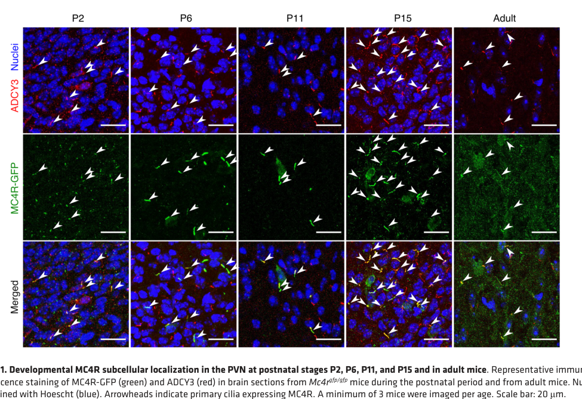

## Question

# Gene Research for Functional Annotation

## ⚠️ CRITICAL: Gene/Protein Identification Context

**BEFORE YOU BEGIN RESEARCH:** You MUST verify you are researching the CORRECT gene/protein. Gene symbols can be ambiguous, especially for less well-characterized genes from non-model organisms.

### Target Gene/Protein Identity (from UniProt):
- **UniProt Accession:** P32245
- **Protein Description:** RecName: Full=Melanocortin receptor 4; Short=MC4-R;
- **Gene Information:** Name=MC4R {ECO:0000303|PubMed:29311635, ECO:0000312|HGNC:HGNC:6932};
- **Organism (full):** Homo sapiens (Human).
- **Protein Family:** Belongs to the G protein-coupled receptor 1 family.
- **Key Domains:** GPCR_Rhodpsn. (IPR000276); GPCR_Rhodpsn_7TM. (IPR017452); MC3-5R. (IPR001908); Mcort_rcpt_4. (IPR000155); Melcrt_ACTH_rcpt. (IPR001671)

### MANDATORY VERIFICATION STEPS:

1. **Check if the gene symbol "MC4R" matches the protein description above**
2. **Verify the organism is correct:** Homo sapiens (Human).
3. **Check if protein family/domains align with what you find in literature**
4. **If you find literature for a DIFFERENT gene with the same or similar symbol, STOP**

### If Gene Symbol is Ambiguous or You Cannot Find Relevant Literature:

**DO NOT PROCEED WITH RESEARCH ON A DIFFERENT GENE.** Instead:
- State clearly: "The gene symbol 'MC4R' is ambiguous or literature is limited for this specific protein"
- Explain what you found (e.g., "Found extensive literature on a different gene with the same symbol in a different organism")
- Describe the protein based ONLY on the UniProt information provided above
- Suggest that the protein function can be inferred from domain/family information

### Research Target:

Please provide a comprehensive research report on the gene **MC4R** (gene ID: MC4R, UniProt: P32245) in human.

The research report should be a detailed narrative explaining the function, biological processes, and localization of the gene product. Citations should be given for all claims.

You should prioritize authoritative reviews and primary scientific literature when conducting research. You can supplement
this with annotations you find in gene/protein databases, but these can be outdated or inaccurate.

We are specifically interested in the primary function of the gene - for enzymes, what reaction is catalyzed, and what is the substrate specificity? For transporters, what is the substrate? For structural proteins or adapters, what is the broader structural role? For signaling molecules, what is the role in the pathway.

We are interested in where in or outside the cell the gene product carries out its function.

We are also interested in the signaling or biochemical pathways in which the gene functions. We are less interested in broad pleiotropic effects, except where these elucidate the precise role.

Include evidence where possible. We are interested in both experimental evidence as well as inference from structure, evolution, or bioinformatic analysis. Precise studies should be prioritized over high-throughput, where available.

## Output

Question: You are an expert researcher providing comprehensive, well-cited information.

Provide detailed information focusing on:
1. Key concepts and definitions with current understanding
2. Recent developments and latest research (prioritize 2023-2024 sources)
3. Current applications and real-world implementations
4. Expert opinions and analysis from authoritative sources
5. Relevant statistics and data from recent studies

Format as a comprehensive research report with proper citations. Include URLs and publication dates where available.
Always prioritize recent, authoritative sources and provide specific citations for all major claims.

# Gene Research for Functional Annotation

## ⚠️ CRITICAL: Gene/Protein Identification Context

**BEFORE YOU BEGIN RESEARCH:** You MUST verify you are researching the CORRECT gene/protein. Gene symbols can be ambiguous, especially for less well-characterized genes from non-model organisms.

### Target Gene/Protein Identity (from UniProt):
- **UniProt Accession:** P32245
- **Protein Description:** RecName: Full=Melanocortin receptor 4; Short=MC4-R;
- **Gene Information:** Name=MC4R {ECO:0000303|PubMed:29311635, ECO:0000312|HGNC:HGNC:6932};
- **Organism (full):** Homo sapiens (Human).
- **Protein Family:** Belongs to the G protein-coupled receptor 1 family.
- **Key Domains:** GPCR_Rhodpsn. (IPR000276); GPCR_Rhodpsn_7TM. (IPR017452); MC3-5R. (IPR001908); Mcort_rcpt_4. (IPR000155); Melcrt_ACTH_rcpt. (IPR001671)

### MANDATORY VERIFICATION STEPS:

1. **Check if the gene symbol "MC4R" matches the protein description above**
2. **Verify the organism is correct:** Homo sapiens (Human).
3. **Check if protein family/domains align with what you find in literature**
4. **If you find literature for a DIFFERENT gene with the same or similar symbol, STOP**

### If Gene Symbol is Ambiguous or You Cannot Find Relevant Literature:

**DO NOT PROCEED WITH RESEARCH ON A DIFFERENT GENE.** Instead:
- State clearly: "The gene symbol 'MC4R' is ambiguous or literature is limited for this specific protein"
- Explain what you found (e.g., "Found extensive literature on a different gene with the same symbol in a different organism")
- Describe the protein based ONLY on the UniProt information provided above
- Suggest that the protein function can be inferred from domain/family information

### Research Target:

Please provide a comprehensive research report on the gene **MC4R** (gene ID: MC4R, UniProt: P32245) in human.

The research report should be a detailed narrative explaining the function, biological processes, and localization of the gene product. Citations should be given for all claims.

You should prioritize authoritative reviews and primary scientific literature when conducting research. You can supplement
this with annotations you find in gene/protein databases, but these can be outdated or inaccurate.

We are specifically interested in the primary function of the gene - for enzymes, what reaction is catalyzed, and what is the substrate specificity? For transporters, what is the substrate? For structural proteins or adapters, what is the broader structural role? For signaling molecules, what is the role in the pathway.

We are interested in where in or outside the cell the gene product carries out its function.

We are also interested in the signaling or biochemical pathways in which the gene functions. We are less interested in broad pleiotropic effects, except where these elucidate the precise role.

Include evidence where possible. We are interested in both experimental evidence as well as inference from structure, evolution, or bioinformatic analysis. Precise studies should be prioritized over high-throughput, where available.

# Human MC4R: functional annotation and research report

## Identity and principal function

**Identity verified.** Human **MC4R** encodes melanocortin receptor 4 (**MC4-R; UniProt [P32245](https://www.uniprot.org/uniprotkb/P32245/entry)**), not another melanocortin receptor or a similarly named protein. A 2024 receptor-family review explicitly assigns P32245 to *human* MC4R; human receptor structures confirm that it is a class-A, seven-transmembrane G-protein-coupled receptor (GPCR). Its rhodopsin-like and melanocortin-receptor domain annotations are consistent with that architecture. **MC4R is a signaling receptor, not an enzyme or transporter:** its primary function is to detect extracellular melanocortin peptides and convert their binding into intracellular signals that regulate neuronal activity, satiety and energy balance. (weirath2024recommendedtoolcompounds pages 1-3, gimenez2024novelcocrystalstructures pages 1-5)

The following evidence map distinguishes observations on the human protein from neuronal mechanisms established mainly in mice. (gimenez2024novelcocrystalstructures pages 1-5, lotta2019humangainoffunctionmc4r pages 1-3, wang2021melanocortin4receptor pages 1-2)

| Molecular aspect | Supported finding | Evidence scope and grade | Source |
|---|---|---|---|
| Identity and topology | Human **MC4R** is UniProt **P32245**, a melanocortin-family **class A, seven-transmembrane GPCR**. | **Direct human annotation and structural evidence; high confidence.** | 2024 receptor-family review and human MC4R crystallography (weirath2024recommendedtoolcompounds pages 1-3, gimenez2024novelcocrystalstructures pages 1-5) |
| Endogenous ligand logic | POMC processing generates **α-MSH and β-MSH** (also γ-MSH and ACTH); α-/β-MSH activate MC4R, whereas **AgRP is an endogenous antagonist/inverse agonist** that opposes basal and agonist-driven activity. | **Human receptor pharmacology plus conserved mammalian neurobiology; high confidence.** | 2024 pharmacology review; human genetics study; mouse-neuron study (weirath2024recommendedtoolcompounds pages 1-3, lotta2019humangainoffunctionmc4r pages 1-3, wang2021melanocortin4receptor pages 1-2) |
| Canonical signaling | Agonist-bound MC4R recruits **Gαs**, activates adenylyl cyclase and raises intracellular **cAMP**, producing downstream anorexigenic signaling. | **Human receptor biochemical/structural evidence; high confidence.** | Human receptor review and active-state/functional studies (weirath2024recommendedtoolcompounds pages 1-3, weirath2024recommendedtoolcompounds pages 11-12, gimenez2024novelcocrystalstructures pages 1-5) |
| Ciliary MC4R–MRAP2–ADCY3 axis | MC4R colocalizes with **ADCY3** at neuronal primary cilia; cilia and ciliary adenylyl-cyclase activity in PVN MC4R neurons are required to restrain feeding. **MRAP2** promotes ciliary MC4R targeting. | **Mouse genetic and imaging evidence for ADCY3/PVN physiology; mechanistic cell and rodent evidence for MRAP2. Translationally compelling but not direct human-neuron proof.** | Mouse ciliary study and trafficking analysis (wang2021melanocortin4receptor pages 1-2, wang2021melanocortin4receptor media 7933b9fd, ojedanaharros2025tonicubiquitinationof pages 1-2) |
| Alternative Kir7.1 pathway | MC4R can regulate the inward-rectifier K⁺ channel **Kir7.1** independently of G proteins: ligand-dependent channel opening or closure alters neuronal excitability and feeding-related responses. | **Cultured-cell electrophysiology with supportive mouse intervention/genetic evidence; moderate confidence for physiology, unconfirmed as a dominant human pathway.** | 2024 structural/pharmacological and Kir7.1 studies (gimenez2024novelcocrystalstructures pages 1-5, peisley2024structureofthe pages 9-12) |
| Ca²⁺-dependent ligand recognition | Human MC4R structures show **Ca²⁺** coordinated by acidic TM2/TM3 residues and peptide backbone interactions, functioning as a ligand-adaptable cofactor for many melanocortin ligands; this requirement is not universal, because pN162 can activate MC4R without Ca²⁺. | **Direct human receptor crystallography/cryo-EM; high confidence.** | Structural review and 3.4 Å pN162–MC4R structure (weirath2024recommendedtoolcompounds pages 11-12, fontaine2024structureelucidationof pages 7-8, fontaine2024structureelucidationof pages 1-2) |
| Human β-arrestin-biased genetics | In **452,300 people**, 61 MC4R variants were functionally characterized. Maximal **β-arrestin recruitment** explained **88%** of variant-associated BMI variance better than Gαs–cAMP efficacy; gain-of-function, β-arrestin-biased variants were associated with lower BMI and reduced obesity and cardiometabolic risk. | **Large human genetic association plus heterologous-cell functional assays; high confidence for association, but not proof that β-arrestin alone mediates protection in native neurons.** | Lotta et al., 2019 (lotta2019humangainoffunctionmc4r pages 1-3) |

*Table: Evidence-graded annotation of human MC4R identity, ligands, canonical and alternative signaling, ciliary localization, structural pharmacology, and human variant biology. Species and experimental scope are separated to prevent mouse or cell-culture findings from being presented as direct human-neuronal evidence.*

## Ligands and position in the pathway

MC4R is a downstream effector of the **leptin–melanocortin pathway**. In the fed state, leptin signaling favors activity of hypothalamic pro-opiomelanocortin (POMC) neurons; processing of POMC produces melanocortins, particularly **α-MSH and β-MSH**, that activate MC4R on target neurons. Other POMC-derived peptides, including γ-MSH and ACTH, can stimulate melanocortin receptors, although receptor subtype preferences and the physiological importance of each peptide differ. In the opposing hunger-related pathway, arcuate AgRP neurons release **agouti-related peptide (AgRP)**, an MC4R antagonist/inverse agonist that opposes melanocortin stimulation and can suppress the receptor’s constitutive activity. Thus, the precise molecular role of MC4R is to integrate opposing peptide inputs—not to synthesize or transport either peptide. (weirath2024recommendedtoolcompounds pages 1-3, gimenez2024novelcocrystalstructures pages 1-5, wang2021melanocortin4receptor pages 1-2, ojedanaharros2025tonicubiquitinationof pages 1-2, trapp2023setmelanotideapromising pages 2-4)

Upon agonist binding, the established **canonical mechanism** is MC4R coupling to **Gαs → adenylyl cyclase activation → increased cAMP**. Human active-receptor structural studies directly support Gs coupling; mouse neuronal experiments link local adenylyl-cyclase activity to feeding control. MC4R can also show ligand-dependent Gq/11 signaling, β-arrestin recruitment and regulation of Kir7.1, but these should not be treated as interchangeable readouts of its canonical Gs response. (gimenez2024novelcocrystalstructures pages 1-5, weirath2024recommendedtoolcompounds pages 1-3, wang2021melanocortin4receptor pages 1-2, lotta2019humangainoffunctionmc4r pages 1-3)

## Where MC4R acts

MC4R is an **integral cell-surface membrane receptor**: melanocortins engage its extracellular-facing binding pocket, while G proteins and other effectors interact on the cytoplasmic side. Its best-established energy-balance role is in central neurons, notably the **paraventricular hypothalamus** (PVH, also termed PVN); expression and relevant circuits also occur elsewhere in the hypothalamus and brainstem. The critical distinction is that arcuate POMC and AgRP neurons chiefly *supply the opposing ligands*, whereas PVH MC4R-expressing neurons are prominent *postsynaptic recipients*. Agonist signaling increases their activity and restrains feeding; AgRP has the opposite effect. Different MC4R-expressing neuronal populations contribute to feeding and autonomic or energy-expenditure responses, so a single nucleus should not be assumed to explain every phenotype. (gimenez2024novelcocrystalstructures pages 1-5, sweeney2023targetingthecentral pages 9-10, wang2021melanocortin4receptor pages 1-2)

A functionally important **subcellular site** is the membrane of the neuronal *primary cilium*. In mice, tagged MC4R colocalizes there with adenylyl cyclase 3 (**ADCY3**); the published PVN immunofluorescence shows this localization across postnatal stages and adulthood. Removing cilia from MC4R neurons, or inhibiting ciliary adenylyl-cyclase activity in PVN MC4R neurons, causes hyperphagia and obesity. These experiments demonstrate a requirement for the compartment in mouse feeding control; they do **not** by themselves establish that every human MC4R neuron signals exclusively from cilia. (wang2021melanocortin4receptor pages 1-2, wang2021melanocortin4receptor media 7933b9fd)

**Figure evidence:** Wang and colleagues’ Figure 1 visualizes MC4R–ADCY3 colocalization in mouse PVN primary cilia; their targeted genetic and pharmacological interventions provide the accompanying functional evidence. [Wang *et al.*, *Journal of Clinical Investigation*, published 3 May 2021](https://doi.org/10.1172/JCI142064). (wang2021melanocortin4receptor media 7933b9fd, wang2021melanocortin4receptor pages 1-2)

## Structural and signaling developments

Human MC4R structures show that peptide recognition occurs in a relatively open extracellular pocket within the seven-helix bundle. For several melanocortin ligands, **Ca²⁺ is a binding cofactor**, coordinated in part by acidic residues in transmembrane helices 2 and 3 and the bound peptide. This is a ligand-recognition mechanism, **not evidence that MC4R catalyzes a calcium-dependent reaction**. The 2024 structural review documents the relevant human-receptor residues and comparisons among peptide-bound structures. [Weirath and Haskell-Luevano, *ACS Pharmacology & Translational Science*, published 26 August 2024](https://doi.org/10.1021/acsptsci.4c00129). (weirath2024recommendedtoolcompounds pages 11-12, weirath2024recommendedtoolcompounds pages 1-3)

Two **2024 human-receptor studies** sharpened this mechanism. Fontaine and colleagues solved a **3.4-Å cryo-EM structure** of active MC4R bound to **pN162**, a full-agonist nanobody that binds deeply in the orthosteric pocket and is selective for MC4R over other human melanocortin receptors. Its reported activation does not require the Ca²⁺ cofactor in the way characterized for several peptide agonists. This is a receptor-selective *research and therapeutic lead*, not an approved treatment. [Fontaine *et al.*, *Nature Communications*, October 2024](https://doi.org/10.1038/s41467-024-50827-7). (fontaine2024structureelucidationof pages 1-2, fontaine2024structureelucidationof pages 7-8)

Gimenez and colleagues determined human MC4R crystal complexes with the experimental peptide **antagonists PG-934 and SBL-MC-31**, identifying binding subpockets near helices 1, 2 and 7. Structure-guided analogues achieved **60- to 132-fold greater MC4R-versus-MC1R selectivity** for several compounds. The study also found ligand-specific opening or closure of the associated inward-rectifier K⁺ channel **Kir7.1**, including responses independent of G-protein coupling. These data establish a plausible route from receptor occupancy to neuronal excitability, but the relative importance of this channel pathway in human feeding remains unresolved. [Gimenez *et al.*, *Journal of Medicinal Chemistry*, February 2024](https://doi.org/10.1021/acs.jmedchem.3c01822). (gimenez2024novelcocrystalstructures pages 1-5, gimenez2024novelcocrystalstructures pages 5-8, peisley2024structureofthe pages 9-12)

Receptor abundance at the cilium is itself regulated. A **2025** mechanistic study found that **MRAP2** promotes MC4R ciliary targeting, whereas β-arrestin, ubiquitination and the **BBSome** participate in its exit; suppressing MC4R activity with AgRP increased ciliary receptor accumulation. This helps explain why receptor localization and signaling cannot always be inferred from transcript abundance alone. [Ojeda-Naharros *et al.*, *PLOS Biology*, published 3 February 2025](https://doi.org/10.1371/journal.pbio.3003025). (ojedanaharros2025tonicubiquitinationof pages 1-2)

## Human genetic evidence and interpretation

Loss-of-function **MC4R** variants provide strong human evidence that the receptor is necessary for normal appetite and weight regulation: they are a leading cause of severe, early-onset monogenic obesity. A December **2024** clinical review estimated loss-of-function variant prevalence at approximately **1 in 340** in the UK population, while emphasizing enrichment among people with obesity; such estimates depend on how variant pathogenicity and the sampled population are defined. [Collet and Schwitzgebel, *Frontiers in Nutrition*, published 23 December 2024](https://doi.org/10.3389/fnut.2024.1509994). (collet2024exploringthetherapeutic pages 1-2, wang2021melanocortin4receptor pages 1-2)

Human variation also reveals that MC4R function is more nuanced than a single cAMP measurement. In **452,300 UK Biobank participants**, investigators functionally characterized **61 MC4R variants**. Across those variants, maximal **β-arrestin recruitment explained 88% of the variance** in their association with body-mass index, outperforming the measured Gαs–cAMP response; gain-of-function, β-arrestin-biased variants were associated with lower BMI and lower odds of obesity and certain cardiometabolic diseases. This is compelling human genetic association coupled to cell-based assays, **not proof that β-arrestin alone causes protection in native human neurons**. [Lotta *et al.*, *Cell*, published 18 April 2019](https://doi.org/10.1016/j.cell.2019.03.044). (lotta2019humangainoffunctionmc4r pages 1-3)

## Clinical implementation and limitations

**Setmelanotide**, a synthetic MC4R agonist, is the clearest clinical implementation of this functional annotation. It acts **downstream of deficient LEPR, POMC or PCSK1 signaling**, provided enough functional MC4R remains, and is used for specified genetically defined obesity disorders, including Bardet–Biedl syndrome (BBS); it is **not an established general treatment for all obesity or for complete MC4R receptor deficiency**. Molecular diagnosis and variant interpretation therefore matter before attributing likely benefit to a patient. (collet2024exploringthetherapeutic pages 3-5, trapp2023setmelanotideapromising pages 2-4)

In the pivotal approximately one-year studies, **8/10 (80%)** participants in the **POMC/PCSK1-deficiency** efficacy cohort and **5/11 (45%)** in the **LEPR-deficiency** cohort achieved at least **10% body-weight loss**. Mean reported changes were **−25.6%** and **−12.5%**, respectively. Importantly, the POMC/PCSK1 cohort contained **only one person with PCSK1 deficiency**: its aggregate result must not be represented as a separate 80% PCSK1 response rate. The registries list **15 enrolled in each study**, distinct from these analyzed efficacy denominators. The designs were predominantly open-label with brief blinded withdrawal periods, rather than full-year parallel placebo comparisons. Trial records: [NCT02896192](https://clinicaltrials.gov/study/NCT02896192) and [NCT03287960](https://clinicaltrials.gov/study/NCT03287960). (qamar2024setmelanotideamelanocortin4 pages 5-6, trapp2023setmelanotideapromising pages 2-4, NCT02896192 chunk 1, NCT03287960 chunk 1)

For **BBS**, approximately **32%** of the evaluated participants reached at least **10% weight loss** after roughly one year in the phase 3 program; the study initially randomized participants to a **14-week** setmelanotide/placebo period before open-label treatment, so its year-long responder percentage is not a year-long placebo-controlled effect. [NCT03746522](https://clinicaltrials.gov/study/NCT03746522); [Qamar *et al.*, October 2024](https://doi.org/10.17925/ee.2024.20.2.9). A separate **2024** open-label, phase 2 investigation of *acquired hypothalamic obesity* reported a **14.9% mean BMI reduction at 16 weeks among 18 participants**; this is preliminary evidence for an additional indication, not evidence that it was already approved for that use. Commonly reported adverse effects include **injection-site reactions, hyperpigmentation, nausea and vomiting**; pigmentation is consistent with imperfect selectivity across melanocortin-receptor subtypes. (qamar2024setmelanotideamelanocortin4 pages 5-6, NCT03746522 chunk 1, qamar2024setmelanotideamelanocortin4 pages 6-7, trapp2023setmelanotideapromising pages 2-4, tomlinson2024bardet‐biedlsyndromea pages 8-8)

**Functional-annotation conclusion.** Human MC4R is best annotated as a **neuronal, membrane-embedded melanocortin peptide receptor** that converts the balance of POMC-derived agonists and AgRP into predominantly Gs–adenylyl-cyclase–cAMP signaling, neuronal satiety responses and long-term control of energy intake. Human receptor structures and genetics directly substantiate its ligand recognition and disease relevance; primary-cilium compartmentalization, MRAP2 trafficking and Kir7.1-mediated excitability add mechanistic detail supported substantially by cellular and animal experiments, with their precise contributions in human neurons still being established. (weirath2024recommendedtoolcompounds pages 1-3, gimenez2024novelcocrystalstructures pages 1-5, lotta2019humangainoffunctionmc4r pages 1-3, wang2021melanocortin4receptor pages 1-2, ojedanaharros2025tonicubiquitinationof pages 1-2)

References

1. (weirath2024recommendedtoolcompounds pages 1-3): Nicholas A. Weirath and Carrie Haskell-Luevano. Recommended tool compounds for the melanocortin receptor (mcr) g protein-coupled receptors (gpcrs). ACS pharmacology & translational science, 7 9:2706-2724, Aug 2024. URL: https://doi.org/10.1021/acsptsci.4c00129, doi:10.1021/acsptsci.4c00129. This article has 7 citations and is from a peer-reviewed journal.

2. (gimenez2024novelcocrystalstructures pages 1-5): Luis E. Gimenez, Charlotte Martin, Jing Yu, Charlie Hollanders, Ciria C. Hernandez, Yiran Wu, Deqiang Yao, Gye Won Han, Naima S. Dahir, Lijie Wu, Olivier Van der Poorten, Arthur Lamouroux, Morgane Mannes, Suwen Zhao, Dirk Tourwé, Raymond C. Stevens, Roger D. Cone, and Steven Ballet. Novel cocrystal structures of peptide antagonists bound to the human melanocortin receptor 4 unveil unexplored grounds for structure-based drug design. Journal of medicinal chemistry, 67:2690-2711, Feb 2024. URL: https://doi.org/10.1021/acs.jmedchem.3c01822, doi:10.1021/acs.jmedchem.3c01822. This article has 11 citations and is from a highest quality peer-reviewed journal.

3. (lotta2019humangainoffunctionmc4r pages 1-3): Luca A. Lotta, Jacek Mokrosiński, Edson Mendes de Oliveira, Chen Li, Stephen J. Sharp, Jian’an Luan, Bas Brouwers, Vikram Ayinampudi, Nicholas Bowker, Nicola Kerrison, Vasileios Kaimakis, Diana Hoult, Isobel D. Stewart, Eleanor Wheeler, Felix R. Day, John R.B. Perry, Claudia Langenberg, Nicholas J. Wareham, and I. Sadaf Farooqi. Human gain-of-function mc4r variants show signaling bias and protect against obesity. Cell, 177:597-607.e9, Apr 2019. URL: https://doi.org/10.1016/j.cell.2019.03.044, doi:10.1016/j.cell.2019.03.044. This article has 344 citations and is from a highest quality peer-reviewed journal.

4. (wang2021melanocortin4receptor pages 1-2): Yi Wang, Adelaide Bernard, Fanny Comblain, Xinyu Yue, Christophe Paillart, Sumei Zhang, Jeremy F. Reiter, and Christian Vaisse. Melanocortin 4 receptor signals at the neuronal primary cilium to control food intake and body weight. The Journal of clinical investigation, May 2021. URL: https://doi.org/10.1172/jci142064, doi:10.1172/jci142064. This article has 121 citations.

5. (weirath2024recommendedtoolcompounds pages 11-12): Nicholas A. Weirath and Carrie Haskell-Luevano. Recommended tool compounds for the melanocortin receptor (mcr) g protein-coupled receptors (gpcrs). ACS pharmacology & translational science, 7 9:2706-2724, Aug 2024. URL: https://doi.org/10.1021/acsptsci.4c00129, doi:10.1021/acsptsci.4c00129. This article has 7 citations and is from a peer-reviewed journal.

6. (wang2021melanocortin4receptor media 7933b9fd): Yi Wang, Adelaide Bernard, Fanny Comblain, Xinyu Yue, Christophe Paillart, Sumei Zhang, Jeremy F. Reiter, and Christian Vaisse. Melanocortin 4 receptor signals at the neuronal primary cilium to control food intake and body weight. The Journal of clinical investigation, May 2021. URL: https://doi.org/10.1172/jci142064, doi:10.1172/jci142064. This article has 121 citations.

7. (ojedanaharros2025tonicubiquitinationof pages 1-2): Irene Ojeda-Naharros, Tirthasree Das, Ralph A. Castro, J. Fernando Bazan, Christian Vaisse, and Maxence V. Nachury. Tonic ubiquitination of the central body weight regulator melanocortin receptor 4 (mc4r) promotes its constitutive exit from cilia. PLOS Biology, 23:e3003025, Feb 2025. URL: https://doi.org/10.1371/journal.pbio.3003025, doi:10.1371/journal.pbio.3003025. This article has 22 citations and is from a highest quality peer-reviewed journal.

8. (peisley2024structureofthe pages 9-12): Alys Peisley, Ciria C. Hernandez, Naima S. Dahir, Laura Koepping, Ashleigh Raczkowski, Min Su, Masoud Ghamari-Langroudi, Xinrui Ji, Luis E. Gimenez, and Roger D. Cone. Structure of the ion channel kir7.1 and implications for its function in normal and pathophysiologic states. BioRxiv, Jun 2024. URL: https://doi.org/10.1101/2024.06.07.597981, doi:10.1101/2024.06.07.597981. This article has 3 citations.

9. (fontaine2024structureelucidationof pages 7-8): Thomas Fontaine, Andreas Busch, Toon Laeremans, Stéphane De Cesco, Yi-Lynn Liang, Veli-Pekka Jaakola, Zara Sands, Sarah Triest, Simonas Masiulis, Lies Dekeyzer, Noor Samyn, Nicolas Loeys, Lisa Perneel, Melanie Debaere, Murielle Martini, Charlotte Vantieghem, Richa Virmani, Kamila Skieterska, Stephanie Staelens, Rosa Barroco, Maarten Van Roy, and Christel Menet. Structure elucidation of a human melanocortin-4 receptor specific orthosteric nanobody agonist. Nature Communications, Oct 2024. URL: https://doi.org/10.1038/s41467-024-50827-7, doi:10.1038/s41467-024-50827-7. This article has 27 citations and is from a highest quality peer-reviewed journal.

10. (fontaine2024structureelucidationof pages 1-2): Thomas Fontaine, Andreas Busch, Toon Laeremans, Stéphane De Cesco, Yi-Lynn Liang, Veli-Pekka Jaakola, Zara Sands, Sarah Triest, Simonas Masiulis, Lies Dekeyzer, Noor Samyn, Nicolas Loeys, Lisa Perneel, Melanie Debaere, Murielle Martini, Charlotte Vantieghem, Richa Virmani, Kamila Skieterska, Stephanie Staelens, Rosa Barroco, Maarten Van Roy, and Christel Menet. Structure elucidation of a human melanocortin-4 receptor specific orthosteric nanobody agonist. Nature Communications, Oct 2024. URL: https://doi.org/10.1038/s41467-024-50827-7, doi:10.1038/s41467-024-50827-7. This article has 27 citations and is from a highest quality peer-reviewed journal.

11. (trapp2023setmelanotideapromising pages 2-4): Christine M. Trapp and Marisa Censani. Setmelanotide: a promising advancement for pediatric patients with rare forms of genetic obesity. Current Opinion in Endocrinology, Diabetes, and Obesity, 30:136-140, Feb 2023. URL: https://doi.org/10.1097/med.0000000000000798, doi:10.1097/med.0000000000000798. This article has 52 citations.

12. (sweeney2023targetingthecentral pages 9-10): Patrick Sweeney, Luis E. Gimenez, Ciria C. Hernandez, and Roger D. Cone. Targeting the central melanocortin system for the treatment of metabolic disorders. Nature Reviews Endocrinology, 19:507-519, Jun 2023. URL: https://doi.org/10.1038/s41574-023-00855-y, doi:10.1038/s41574-023-00855-y. This article has 80 citations and is from a domain leading peer-reviewed journal.

13. (gimenez2024novelcocrystalstructures pages 5-8): Luis E. Gimenez, Charlotte Martin, Jing Yu, Charlie Hollanders, Ciria C. Hernandez, Yiran Wu, Deqiang Yao, Gye Won Han, Naima S. Dahir, Lijie Wu, Olivier Van der Poorten, Arthur Lamouroux, Morgane Mannes, Suwen Zhao, Dirk Tourwé, Raymond C. Stevens, Roger D. Cone, and Steven Ballet. Novel cocrystal structures of peptide antagonists bound to the human melanocortin receptor 4 unveil unexplored grounds for structure-based drug design. Journal of medicinal chemistry, 67:2690-2711, Feb 2024. URL: https://doi.org/10.1021/acs.jmedchem.3c01822, doi:10.1021/acs.jmedchem.3c01822. This article has 11 citations and is from a highest quality peer-reviewed journal.

14. (collet2024exploringthetherapeutic pages 1-2): Tinh-Hai Collet and Valerie Schwitzgebel. Exploring the therapeutic potential of precision medicine in rare genetic obesity disorders: a scientific perspective. Frontiers in Nutrition, Dec 2024. URL: https://doi.org/10.3389/fnut.2024.1509994, doi:10.3389/fnut.2024.1509994. This article has 8 citations.

15. (collet2024exploringthetherapeutic pages 3-5): Tinh-Hai Collet and Valerie Schwitzgebel. Exploring the therapeutic potential of precision medicine in rare genetic obesity disorders: a scientific perspective. Frontiers in Nutrition, Dec 2024. URL: https://doi.org/10.3389/fnut.2024.1509994, doi:10.3389/fnut.2024.1509994. This article has 8 citations.

16. (qamar2024setmelanotideamelanocortin4 pages 5-6): Sulmaaz Qamar, Ritwika Mallik, and Janine Makaronidis. Setmelanotide: a melanocortin-4 receptor agonist for the treatment of severe obesity due to hypothalamic dysfunction. touchREVIEWS in Endocrinology, Oct 2024. URL: https://doi.org/10.17925/ee.2024.20.2.9, doi:10.17925/ee.2024.20.2.9. This article has 16 citations.

17. (NCT02896192 chunk 1):  Setmelanotide for the Treatment of Early-Onset Pro-Opiomelanocortin (POMC) Deficiency Obesity. Rhythm Pharmaceuticals, Inc.. 2017. ClinicalTrials.gov Identifier: NCT02896192

18. (NCT03287960 chunk 1):  Setmelanotide for the Treatment of Leptin Receptor (LEPR) Deficiency Obesity. Rhythm Pharmaceuticals, Inc.. 2018. ClinicalTrials.gov Identifier: NCT03287960

19. (NCT03746522 chunk 1):  Setmelanotide (RM-493), Melanocortin-4 Receptor (MC4R) Agonist, in Bardet-Biedl Syndrome (BBS) and Alström Syndrome (AS) Participants With Moderate to Severe Obesity. Rhythm Pharmaceuticals, Inc.. 2018. ClinicalTrials.gov Identifier: NCT03746522

20. (qamar2024setmelanotideamelanocortin4 pages 6-7): Sulmaaz Qamar, Ritwika Mallik, and Janine Makaronidis. Setmelanotide: a melanocortin-4 receptor agonist for the treatment of severe obesity due to hypothalamic dysfunction. touchREVIEWS in Endocrinology, Oct 2024. URL: https://doi.org/10.17925/ee.2024.20.2.9, doi:10.17925/ee.2024.20.2.9. This article has 16 citations.

21. (tomlinson2024bardet‐biedlsyndromea pages 8-8): Jeremy W. Tomlinson. Bardet‐biedl syndrome: a focus on genetics, mechanisms and metabolic dysfunction. Diabetes, 26:13-24, Feb 2024. URL: https://doi.org/10.1111/dom.15480, doi:10.1111/dom.15480. This article has 54 citations and is from a highest quality peer-reviewed journal.

## Artifacts

- [Edison artifact artifact-00](MC4R-deep-research-falcon_artifacts/artifact-00.md)

## Citations

1. ojedanaharros2025tonicubiquitinationof pages 1-2
2. weirath2024recommendedtoolcompounds pages 1-3
3. gimenez2024novelcocrystalstructures pages 1-5
4. weirath2024recommendedtoolcompounds pages 11-12
5. peisley2024structureofthe pages 9-12
6. fontaine2024structureelucidationof pages 7-8
7. fontaine2024structureelucidationof pages 1-2
8. trapp2023setmelanotideapromising pages 2-4
9. sweeney2023targetingthecentral pages 9-10
10. gimenez2024novelcocrystalstructures pages 5-8
11. collet2024exploringthetherapeutic pages 1-2
12. collet2024exploringthetherapeutic pages 3-5
13. P32245
14. Wang *et al.*, *Journal of Clinical Investigation*, published 3 May 2021
15. Weirath and Haskell-Luevano, *ACS Pharmacology & Translational Science*, published 26 August 2024
16. Fontaine *et al.*, *Nature Communications*, October 2024
17. Gimenez *et al.*, *Journal of Medicinal Chemistry*, February 2024
18. Ojeda-Naharros *et al.*, *PLOS Biology*, published 3 February 2025
19. Collet and Schwitzgebel, *Frontiers in Nutrition*, published 23 December 2024
20. Lotta *et al.*, *Cell*, published 18 April 2019
21. NCT02896192
22. NCT03287960
23. NCT03746522
24. Qamar *et al.*, October 2024
25. https://www.uniprot.org/uniprotkb/P32245/entry
26. https://doi.org/10.1172/JCI142064
27. https://doi.org/10.1021/acsptsci.4c00129
28. https://doi.org/10.1038/s41467-024-50827-7
29. https://doi.org/10.1021/acs.jmedchem.3c01822
30. https://doi.org/10.1371/journal.pbio.3003025
31. https://doi.org/10.3389/fnut.2024.1509994
32. https://doi.org/10.1016/j.cell.2019.03.044
33. https://clinicaltrials.gov/study/NCT02896192
34. https://clinicaltrials.gov/study/NCT03287960
35. https://clinicaltrials.gov/study/NCT03746522
36. https://doi.org/10.17925/ee.2024.20.2.9
37. https://doi.org/10.1021/acsptsci.4c00129,
38. https://doi.org/10.1021/acs.jmedchem.3c01822,
39. https://doi.org/10.1016/j.cell.2019.03.044,
40. https://doi.org/10.1172/jci142064,
41. https://doi.org/10.1371/journal.pbio.3003025,
42. https://doi.org/10.1101/2024.06.07.597981,
43. https://doi.org/10.1038/s41467-024-50827-7,
44. https://doi.org/10.1097/med.0000000000000798,
45. https://doi.org/10.1038/s41574-023-00855-y,
46. https://doi.org/10.3389/fnut.2024.1509994,
47. https://doi.org/10.17925/ee.2024.20.2.9,
48. https://doi.org/10.1111/dom.15480,