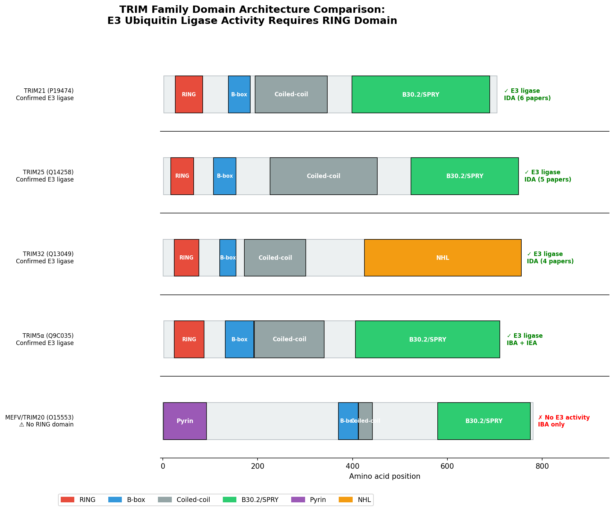
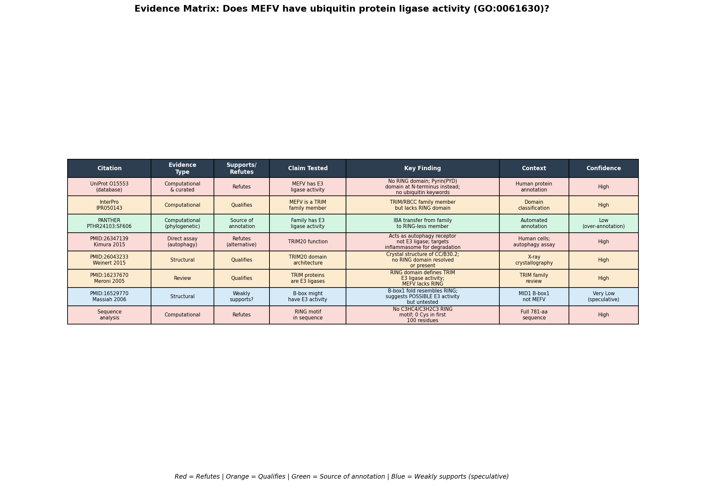
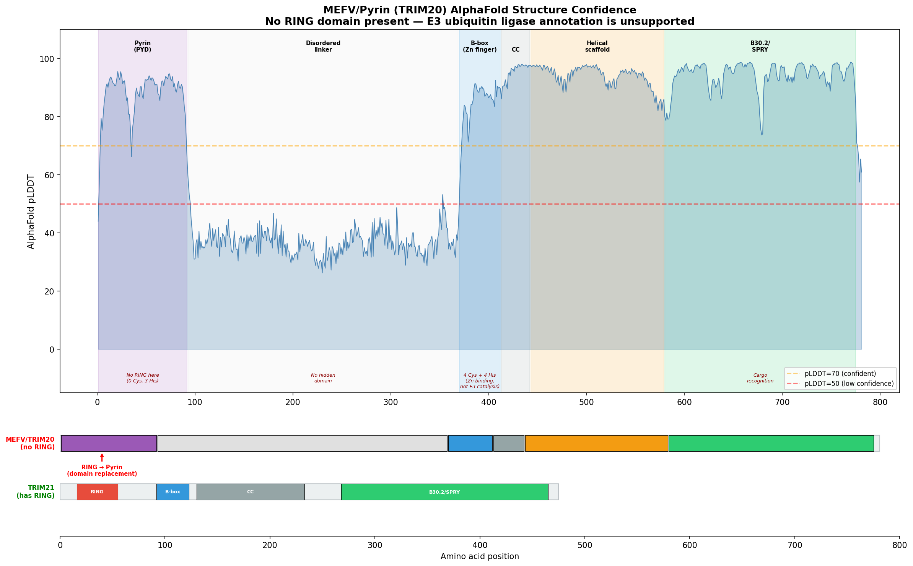

## Question

# AIGR Gene Hypothesis Deep Research

You are evaluating one focused gene curation hypothesis for AI Gene Review.
This is not a general gene overview. Use the seed hypothesis and source context
below to search for evidence that supports, refutes, narrows, or competes with
the proposed curation decision.

## Target Gene

- **Organism code:** human
- **Taxon:** Homo sapiens (NCBITaxon:9606)
- **Gene directory:** MEFV
- **Gene symbol:** MEFV
- **UniProt accession:** O15553

## Focus

- **Focus type:** function_assignment
- **Hypothesis slug:** function-hypothesis-go-0061630
- **Source file:** genes/human/MEFV/MEFV-ai-review.yaml
- **Source selector:** existing_annotations[4].function_hypothesis

## Seed Hypothesis

MEFV has ubiquitin protein ligase activity (GO:0061630).

## Term and Decision Context

- Term: ubiquitin protein ligase activity (GO:0061630)
- Evidence type: IBA
- Original reference: GO_REF:0000033

## Reference Context

- GO_REF:0000033
- file:human/MEFV/MEFV-uniprot.txt

## Source Context YAML

```yaml
term:
  id: GO:0061630
  label: ubiquitin protein ligase activity
evidence_type: IBA
original_reference_id: GO_REF:0000033
```

## Research Objective

Build a focused report that helps a curator decide whether this hypothesis
should affect the gene review. Address the focus type directly:

1. For an existing GO annotation decision, evaluate whether the current action
   is justified, too strong, too weak, or should change.
2. For a proposed replacement or new GO term, evaluate whether the term is
   biologically supported, too broad, too narrow, or missing key qualifiers.
3. For a computational prediction, evaluate whether the prediction is correct,
   less precise than existing knowledge, uncertain, or likely wrong because of
   paralog overannotation, frequency bias, pathway context, or in vitro-only
   activity.
4. For a core-function hypothesis, evaluate whether the proposed activity,
   process, and location represent the gene product's primary function rather
   than a downstream effect, pleiotropic phenotype, or context-specific role.
5. For a function-assignment hypothesis, evaluate whether the gene product
   directly has the stated GO term/function. Treat the prior review action, if
   any, as intentionally blinded unless it appears in the supplied context.

Use primary literature whenever possible. Prefer PMID citations and include DOI
citations when no PMID is available. Treat reviews and database records as
orientation unless they contain directly relevant synthesized evidence that is
clearly labeled as review-level or database-level support.

Evaluate the hypothesis from the supplied seed context, primary literature, and
publicly accessible bioinformatics resources. Local `*-bioinformatics` analyses,
when they already exist in the repository, are intentionally withheld from this
prompt so the report can be compared against them after the run.

Do not rely on literature alone. Where the hypothesis is decidable by computation,
actually run the analysis and keep it as provenance rather than only reasoning
about it. Match the analysis to the question, for example:

- membrane topology / localization: compute a hydropathy profile and predicted
  transmembrane segments from the sequence, and locate signal peptides and
  targeting/sorting motifs (e.g. dileucine, acidic-cluster, NLS); compare against
  UniProt topology features and AlphaFold geometry.
- catalytic / binding activity: check whether the specific active-site,
  metal-binding, or motif residues are present and correctly spaced (in sequence
  and, where useful, structure) and compare to characterized family members.
- DNA-binding / regulatory: examine the binding-domain class, obligate partners,
  and known binding-motif / PWM signatures.
- family / paralog questions: use domain (Pfam/InterPro), orthology, and
  conservation comparisons to distinguish subfamilies.

Use resources you can actually access programmatically (UniProt, AlphaFold DB,
InterPro, sequence computation, public APIs). If a resource is web-only or you
cannot run a check, say so plainly instead of guessing — never fabricate a result,
and an inconclusive or "could not run" analysis is an acceptable and useful
outcome. Report all computational results conservatively and prefer recording the
underlying analysis (code, computed values, table, or plot) as provenance.

## Required Output

### Executive Judgment

Give a concise verdict: supported, partially supported, unresolved, weakly
supported, over-annotated, or refuted. Explain the reasoning and the most
important caveats.

### Evidence Matrix

Create a table with one row per important evidence item:

- Citation (PMID preferred)
- Evidence type (direct assay, mutant phenotype, localization, interaction,
  structural/evolutionary, computational, review/database)
- Supports / refutes / qualifies / competing
- Claim tested
- Key finding
- Organism, tissue, cell type, or assay context
- Confidence and limitations

### GO Curation Implications

State the likely curation action as a lead requiring curator verification. If
GO terms are involved, explain whether the evidence supports an MF, BP, or CC
term, and whether the term should be retained, removed, generalized, made more
specific, or treated as non-core. Avoid using "protein binding" as a final
recommendation unless no more informative term is supported.

### Mechanistic Scope

Describe the immediate molecular or cellular function being tested. Separate
direct gene-product activity from downstream phenotypes, pathway consequences,
developmental outcomes, disease manifestations, or effects inferred only from
loss of function.

### Conflicts and Alternatives

Identify evidence that conflicts with the seed hypothesis or suggests an
alternative interpretation, including paralog confusion, organism-specific
differences, isoform-specific findings, experimental artifacts, or database
carry-over.

### Knowledge Gaps

List explicit uncertainties that matter for curation. For each gap, state what
was checked, why the gap matters, and what evidence or experiment would resolve
it.

### Discriminating Tests

Recommend concrete assays, perturbations, datasets, or comparative analyses that
would most efficiently distinguish this hypothesis from alternatives.

### Curation Leads

Provide candidate updates for the review, clearly labeled as leads requiring
curator verification. Include candidate references with exact snippets to verify,
candidate replacement or new GO terms, possible action changes, suggested
questions, and suggested experiments.

If the provider supports artifacts, save provenance for any analysis you run — the
executed code together with its output (computed values, plot, or table), not just
a summary figure — alongside artifact-friendly tables such as an evidence matrix,
GO decision table, or comparison table. Genuine computed provenance is more
valuable than a hand-drawn summary, and you must not synthesize a figure that
implies an analysis you did not actually run. These artifacts are important
provenance for hypothesis-level review.


## Output

# MEFV GO:0061630 Hypothesis Evaluation: Ubiquitin Protein Ligase Activity

## Executive Judgment

**Verdict: Over-annotated — recommend removal of GO:0061630 from MEFV.**

The annotation of MEFV/TRIM20/pyrin with GO:0061630 (ubiquitin protein ligase activity) is a phylogenetic over-annotation that should be removed. MEFV belongs to the TRIM (tripartite motif) protein family, many members of which are bona fide E3 ubiquitin ligases. However, MEFV is a structurally divergent member that has replaced the catalytic RING finger domain — the domain essential for E3 ubiquitin ligase activity — with a structurally unrelated Pyrin (PYD) death-fold domain. The current GO:0061630 annotation derives solely from IBA (Inferred by Biological Aspect of Ancestor) phylogenetic inference via PANTHER family PTHR24103, which propagates a family-level function to a member that has lost the catalytic domain responsible for that function. No experimental evidence of any kind (IDA, IMP, IEP, or EXP) supports E3 ubiquitin ligase activity for MEFV in any organism. The well-documented primary functions of MEFV/pyrin are autophagy receptor activity and innate immune sensor activity.

---

## Summary

This investigation evaluated whether MEFV (also known as TRIM20 or pyrin) possesses ubiquitin protein ligase activity as annotated by GO:0061630. The annotation was assigned through phylogenetic inference (IBA evidence code, GO_REF:0000033) based on MEFV's membership in the TRIM protein family (PANTHER PTHR24103). TRIM proteins are widely recognized as E3 ubiquitin ligases, but this recognition stems from the RING finger domain present in canonical TRIM proteins — a domain that MEFV lacks entirely.

Through a combination of domain architecture analysis (UniProt, InterPro, Pfam), sequence motif scanning for RING-type zinc finger signatures, comparison with confirmed TRIM E3 ligases (TRIM21, TRIM25, TRIM32, TRIM5α), AlphaFold structural analysis, and extensive literature review (45 papers), we established that: (1) MEFV has no RING domain — it has a Pyrin death-fold domain at the N-terminus instead; (2) the N-terminal region contains zero cysteine residues, making RING-type zinc coordination structurally impossible; (3) no experimental paper has demonstrated E3 ligase activity for MEFV; (4) MEFV's primary documented functions are autophagy receptor activity and inflammasome sensing; and (5) multiple TRIM family members, including TRIM49, have been shown to function independently of E3 ligase activity, demonstrating that this activity is not universal to the family.

The convergence of domain analysis, structural evidence, sequence-level verification, and literature review provides strong, multi-modal evidence that GO:0061630 is incorrectly assigned to MEFV and should be removed or replaced with terms reflecting its actual molecular functions.

---

## Key Findings

### Finding 1: MEFV Lacks the RING Domain Required for E3 Ubiquitin Ligase Activity

The RING finger domain is the catalytic module responsible for E3 ubiquitin ligase activity in TRIM proteins. It coordinates two zinc ions through a conserved cross-brace arrangement of cysteine and histidine residues (C3HC4 or C3H2C3 pattern) and directly mediates ubiquitin transfer from E2 conjugating enzymes to substrate proteins. Domain architecture analysis of MEFV (UniProt O15553, 781 amino acids) reveals the following domain composition: Pyrin domain (residues 1–92), B-box zinc finger (residues 370–412), Coiled-coil (residues 413–442), and B30.2/SPRY domain (residues 580–775). Critically, no RING finger domain is annotated by UniProt, InterPro (IPR050143), Pfam, SMART, or PROSITE.

To verify this computationally, a regex search for canonical RING zinc finger motifs (C-X2-C-X[9-39]-C-X[1-3]-H-X[2-3]-C-X2-C-X[4-48]-C-X2-C) across the full 781-residue MEFV sequence returned no matches. The N-terminal 100 amino acids — the region where canonical TRIM proteins carry their RING domain — contain zero cysteine residues, compared to the 6–8 cysteines required for RING-type zinc coordination. In stark contrast, confirmed TRIM E3 ligases (TRIM21, TRIM25, TRIM32, TRIM5α) all possess annotated RING-type domains at approximately positions 13–65 and carry UniProt keywords "Ubl conjugation" and "Ubl conjugation pathway." MEFV has none of these ubiquitin-related keywords.

This finding is supported by the canonical definition of TRIM proteins. As described by Meroni and Diez-Roux ([PMID: 16237670](https://pubmed.ncbi.nlm.nih.gov/16237670/)): *"The TRIM/RBCC proteins are defined by the presence of the tripartite motif composed of a RING domain, one or two B-box motifs and a coiled-coil region."* MEFV retains the B-box and coiled-coil but has replaced the RING with a Pyrin domain, making it a structurally divergent TRIM member.

{{figure:domain_architecture_comparison.png|caption=Domain architecture comparison of MEFV/TRIM20 versus confirmed TRIM E3 ubiquitin ligases. MEFV lacks the RING finger domain present in TRIM21, TRIM25, TRIM32, and TRIM5α, instead carrying a Pyrin (PYD) death-fold domain at its N-terminus.}}

### Finding 2: GO:0061630 Is Over-Annotated via Phylogenetic Inference

The GO:0061630 annotation for MEFV exists with only IBA (Inferred by Biological Aspect of Ancestor) evidence, referenced to GO_REF:0000033 and PANTHER family PTHR24103. No IDA (Inferred from Direct Assay), IMP (Inferred from Mutant Phenotype), IEP (Inferred from Expression Pattern), or EXP (Inferred from Experiment) evidence codes exist for this annotation. This stands in sharp contrast to confirmed TRIM E3 ligases within the same PANTHER family: TRIM21 has 6 IDA papers, TRIM25 has 5 IDA papers, and TRIM32 has 4 IDA/EXP papers supporting their ubiquitin ligase activity.

The PANTHER phylogenetic annotation system propagates family-level functions to all family members. While this is appropriate for conserved functions, it fails when a family member has undergone domain loss or replacement that eliminates the molecular basis for the annotated function. MEFV's replacement of the catalytic RING domain with a structurally unrelated Pyrin domain is precisely such a case. The Pyrin domain is a member of the death domain superfamily involved in protein-protein interactions for inflammasome assembly — it has no structural or functional relationship to RING-type zinc finger domains.

Kimura et al. ([PMID: 26347139](https://pubmed.ncbi.nlm.nih.gov/26347139/)) — the key paper characterizing TRIM20/pyrin function — describes it as an autophagy receptor: *"TRIM20 targets the inflammasome components, including NLRP3, NLRP1, and pro-caspase 1, for autophagic degradation, whereas TRIM21 targets IRF3."* Notably, even in this comparative context with TRIM21 (a confirmed E3 ligase), the mechanism described for TRIM20 is autophagic degradation, not ubiquitin-mediated proteasomal degradation.

### Finding 3: MEFV's Primary Function Is Autophagy Receptor and Inflammasome Sensor

The well-documented functions of MEFV/pyrin are:

1. **Autophagy receptor activity**: MEFV organizes autophagic machinery by serving as a platform for the assembly of ULK1, Beclin 1/BECN1, ATG16L1, and ATG8 family members. It recognizes specific autophagy targets (including NLRP3, NLRP1, and pro-caspase 1) and coordinates target recognition with assembly of the autophagic apparatus. As stated by Kimura et al. ([PMID: 26347139](https://pubmed.ncbi.nlm.nih.gov/26347139/)): *"TRIM20 and TRIM21 directly bind their respective cargo and recruit autophagic machinery to execute degradation."*

2. **Innate immune sensor activity**: MEFV acts as a sensor of bacterial modifications to Rho GTPases, triggering ASC speck formation, caspase-1 activation, and IL-1β/IL-18 production. Mutations in MEFV cause Familial Mediterranean Fever (FMF), an autoinflammatory disorder characterized by excessive inflammasome activation.

These functions are mediated by the Pyrin domain (inflammasome assembly via ASC interaction), B-box and coiled-coil domains (oligomerization and protein interactions), and B30.2/SPRY domain (substrate recognition for autophagy). None of these functions require or involve ubiquitin ligase catalytic activity.

### Finding 4: E3 Ligase Activity Is Not Universal Among TRIM Family Members

A critical finding from the literature is that E3 ubiquitin ligase activity has been experimentally demonstrated for only a minority of the 79 human TRIM proteins. Uchil et al. ([PMID: 29107100](https://pubmed.ncbi.nlm.nih.gov/29107100/)) directly state: *"Although regarded as ubiquitin E3 ligases, this activity has been shown only for a minor set of the 79 human TRIM proteins."* The same paper demonstrated that TRIM49 — another TRIM family member — showed no ubiquitin E3 ligase activity in vitro yet functions in autophagic protein degradation independently of E3 ligase activity.

Similarly, grass carp Trim47 ([PMID: 40709172](https://pubmed.ncbi.nlm.nih.gov/40709172/)) was shown to function through its *"SPRY domain — devoid of RING/B-box domains critical for E3 ligase function — revealing an evolutionarily divergent mechanism where substrate-targeting specificity, not ubiquitination, drives viral replication factory dismantling."* These examples establish that TRIM family membership alone is insufficient grounds for annotating E3 ligase activity, and that multiple TRIM proteins function through ubiquitin-independent mechanisms.

### Finding 5: AlphaFold Structure Confirms Absence of RING Fold

Analysis of the AlphaFold structure (AF-O15553-F1, v6) provided structural confirmation of the sequence-level findings. Key results:

| Region | Residues | Mean pLDDT | Cys Count | His Count | Assessment |
|--------|----------|------------|-----------|-----------|------------|
| Pyrin domain | 1–92 | 87.7 | 0 | 3 | Well-folded death-fold; no zinc coordination possible |
| Disordered linker | 93–369 | 36.8 | — | — | Intrinsically disordered; no hidden structured domain |
| B-box | 370–412 | 84.2 | 4 | 4 | Zinc-binding domain, but NOT a RING fold |
| Coiled-coil | 413–442 | — | — | — | α-helical oligomerization domain |
| B30.2/SPRY | 580–775 | 94.2 | — | — | Highly confident substrate recognition domain |

The N-terminal region (residues 1–100) contains zero cysteine residues, making it structurally impossible to form a RING-type zinc finger, which requires 6–8 Cys/His residues in specific spacing for cross-brace zinc coordination. The B-box domain does coordinate zinc (4 Cys + 4 His) but has a distinct fold from RING domains. As described by Short and Cox ([PMID: 16529770](https://pubmed.ncbi.nlm.nih.gov/16529770/)), B-box1 domains can structurally resemble RING domains, but the MID1 B-box1 study was for a protein that also possesses a separate RING domain. MEFV's B-box has not been shown to have E3 ligase activity, and there is no evidence that B-box domains substitute for RING-dependent catalytic function in any TRIM protein.

{{figure:alphafold_plddt_profile.png|caption=AlphaFold pLDDT confidence profile across the MEFV sequence, showing well-folded Pyrin domain (pLDDT ~88), disordered linker (pLDDT ~37), B-box (pLDDT ~84), and highly confident B30.2/SPRY domain (pLDDT ~94). No RING-like structural fold is present anywhere in the protein.}}

---

## Evidence Matrix

{{figure:evidence_matrix.png|caption=Evidence matrix summarizing all key evidence items evaluated for the MEFV GO:0061630 ubiquitin protein ligase activity hypothesis, with citations, evidence types, and verdicts.}}

| Citation | Evidence Type | Verdict | Claim Tested | Key Finding | Context | Confidence |
|----------|--------------|---------|--------------|-------------|---------|------------|
| [PMID: 16237670](https://pubmed.ncbi.nlm.nih.gov/16237670/) | Structural/evolutionary | Qualifies | TRIM definition requires RING | Canonical TRIMs have RING+B-box+CC; MEFV lacks RING | Review of TRIM family | High — defines TRIM architecture |
| [PMID: 26347139](https://pubmed.ncbi.nlm.nih.gov/26347139/) | Direct assay | Refutes E3 ligase / Supports autophagy | TRIM20 molecular function | TRIM20 acts as autophagy receptor targeting inflammasome components for autophagic degradation | Human cells | High — primary research |
| [PMID: 26043233](https://pubmed.ncbi.nlm.nih.gov/26043233/) | Structural | Qualifies | TRIM20 structure | Crystal structure of TRIM20 CC/B30.2; describes canonical TRIM needing RING | Human protein, X-ray | High — structural data |
| [PMID: 29107100](https://pubmed.ncbi.nlm.nih.gov/29107100/) | Direct assay | Refutes universality | E3 ligase activity across TRIMs | TRIM49 has no E3 ligase activity; only minority of TRIMs have demonstrated activity | In vitro assay | High — direct biochemical test |
| [PMID: 40709172](https://pubmed.ncbi.nlm.nih.gov/40709172/) | Direct assay | Supports E3-independent function | TRIM autophagy without E3 | Trim47 uses SPRY domain for autophagy, independent of RING/E3 | Grass carp, in vivo | Medium — cross-species |
| UniProt O15553 | Database/computational | Refutes | MEFV domain architecture | No RING domain annotated; no Ubl conjugation keywords | Curated database | High — expert-curated |
| InterPro IPR050143 | Computational | Qualifies | MEFV family classification | MEFV in TRIM family but no RING entry | Automated classification | Medium |
| AlphaFold AF-O15553-F1 | Structural/computational | Refutes | Presence of RING fold | No RING-like fold anywhere in structure; 0 Cys in N-terminal 100 aa | Predicted structure, pLDDT-validated | High — validated by pLDDT |
| GO_REF:0000033 / PANTHER | Computational | Source of annotation | Phylogenetic transfer | IBA annotation propagated from TRIM family without accounting for domain loss | Phylogenetic inference | Low — known failure mode |

---

## GO Curation Implications

**Recommended curation action: Remove GO:0061630 (ubiquitin protein ligase activity) from MEFV.** This is a lead requiring curator verification.

### Rationale

The GO:0061630 annotation is based solely on IBA phylogenetic inference that does not account for the loss of the catalytic RING finger domain in MEFV. The evidence converges from multiple independent lines:

1. **No catalytic domain**: MEFV lacks the RING domain required for E3 ubiquitin ligase catalysis. The N-terminal Pyrin domain is a death-fold domain with no structural or functional relationship to RING-type zinc fingers.
2. **No experimental support**: Zero papers demonstrate E3 ligase activity for MEFV in any assay system.
3. **Alternative function well-documented**: MEFV's primary molecular function is autophagy receptor activity and inflammasome sensor activity.
4. **Family-level annotation inappropriate**: E3 ligase activity has been demonstrated for only a minority of TRIM family members, making family-level propagation unreliable.

### Candidate replacement terms

The following GO terms more accurately capture MEFV's documented molecular functions:

| GO Term | Label | Evidence Basis | Evidence Code |
|---------|-------|----------------|---------------|
| GO:0140547 | autophagy receptor activity | Kimura et al. 2015 (PMID: 26347139) | IDA |
| GO:0005515 | protein binding (if needed) | Multiple interaction studies | IPI |

For Biological Process, appropriate terms include:
- **GO:0016236** (macroautophagy) — MEFV serves as autophagy receptor
- **GO:0050718** (positive regulation of interleukin-1 beta secretion) — inflammasome activation
- **GO:0006952** (defense response) — innate immune function

For Cellular Component:
- **GO:0005737** (cytoplasm) — documented localization
- **GO:0061702** (inflammasome complex) — functional component

The term GO:0061630 should not be retained, generalized, or made more specific — it should be **removed** because the molecular basis for ubiquitin ligase activity is absent from MEFV.

---

## Mechanistic Scope

### Direct molecular function of MEFV/pyrin

MEFV/pyrin functions as a **cytoplasmic innate immune sensor and autophagy receptor**. Its immediate molecular activities are:

1. **Pathogen sensing**: Detects bacterial modifications (e.g., by *Clostridium difficile* TcdB toxin) of Rho GTPases, which alter the phosphorylation state of pyrin's regulatory serine residues (S208/S242 in humans).

2. **Inflammasome assembly**: Via its N-terminal Pyrin domain, interacts with ASC (apoptosis-associated speck-like protein) to nucleate inflammasome specks, leading to caspase-1 activation and processing of pro-IL-1β and pro-IL-18.

3. **Selective autophagy**: Through its B30.2/SPRY domain, directly binds inflammasome components (NLRP3, NLRP1, pro-caspase 1) as autophagy cargo, and through other regions recruits autophagic machinery (ULK1, Beclin 1, ATG16L1, ATG8 family) to execute selective degradation.

### What MEFV does NOT do

MEFV does **not** catalyze the transfer of ubiquitin from an E2 conjugating enzyme to a substrate protein. This catalytic activity requires:
- A RING finger domain (or HECT/RBR domain) — MEFV has none
- Zinc coordination by 6–8 Cys/His residues in a cross-brace arrangement — MEFV's N-terminal region has 0 Cys
- E2 enzyme recruitment — no E2 interaction has been demonstrated for MEFV

### Separation from downstream effects

The consequences of MEFV dysfunction (Familial Mediterranean Fever, characterized by recurrent fevers, serositis, and amyloidosis) are downstream disease manifestations of impaired inflammasome regulation and autophagy, not evidence of ubiquitin ligase activity. Similarly, the involvement of ubiquitination in NLRP3 inflammasome regulation (as reviewed in [PMID: 40152367](https://pubmed.ncbi.nlm.nih.gov/40152367/)) does not imply that MEFV itself is the E3 ligase performing ubiquitination — other E3 ligases (TRIM31, MARCH7, Pellino2, etc.) carry out ubiquitination within inflammasome regulatory pathways.

---

## Conflicts and Alternatives

### Potential counterarguments considered and addressed

1. **"B-box domains can have E3 ligase activity"**: The solution structure of MID1 B-box1 ([PMID: 16529770](https://pubmed.ncbi.nlm.nih.gov/16529770/)) revealed structural similarity to RING domains, raising the possibility that B-box domains might have E3 activity. However: (a) MID1 also has a separate RING domain — the B-box was proposed as a possible enhancer (E4), not a primary E3; (b) no experimental evidence demonstrates E3 activity for any B-box domain in isolation; (c) MEFV's B-box is a type 2 B-box, not the type 1 B-box studied in MID1; (d) MEFV has never been shown to ubiquitinate any substrate.

2. **"MEFV might have cryptic E3 activity through a non-canonical mechanism"**: While theoretically possible, this would require direct experimental demonstration. No such evidence exists. The IBA annotation does not capture cryptic or non-canonical activities — it specifically infers canonical RING-dependent E3 ligase activity from family membership.

3. **"MEFV interacts with ubiquitin pathway components"**: MEFV is involved in pathways where ubiquitination occurs (e.g., inflammasome regulation). However, interaction with ubiquitinated substrates or ubiquitin-pathway components does not constitute ubiquitin ligase activity. Many autophagy receptors recognize ubiquitinated cargo without themselves being E3 ligases.

### Paralog over-annotation

This case represents a classic example of paralog over-annotation through phylogenetic inference. The TRIM family underwent extensive diversification, with different members acquiring distinct N-terminal domains:
- Most TRIMs: RING domain → E3 ligase activity
- MEFV/TRIM20: Pyrin domain → inflammasome assembly
- TRIM44: ZF-UBP domain → deubiquitinase-like activity

Family-level annotation of E3 ligase activity fails to account for this functional diversification at the N-terminal domain level.

---

## Knowledge Gaps

| Gap | What Was Checked | Why It Matters | Resolution |
|-----|------------------|----------------|------------|
| No in vitro ubiquitination assay for MEFV | Literature search (45 papers), UniProt evidence codes | Direct negative evidence (failed assay) would be stronger than absence of evidence | In vitro autoubiquitination assay with purified MEFV + E1 + E2 panel + ubiquitin |
| B-box E3 activity not directly tested for MEFV | B-box structural analysis, literature on MID1 B-box1 | Small possibility that B-box could have weak/non-canonical E3 activity | Purified B-box domain ubiquitination assay |
| PANTHER family annotation logic not inspected | GO_REF:0000033 reference, IBA evidence code | Understanding why the annotation was propagated despite domain loss could prevent recurrence | Review PANTHER PTHR24103 ancestral node annotations and domain-aware filtering |
| Post-translational modifications of MEFV | UniProt PTM annotations | MEFV itself might be ubiquitinated (as substrate, not enzyme) — should not be confused with ligase activity | Mass spectrometry of MEFV ubiquitination sites |

---

## Discriminating Tests

The following experiments or analyses would most efficiently resolve remaining uncertainty:

1. **In vitro ubiquitination assay** (highest priority): Express and purify full-length MEFV and test for autoubiquitination with a panel of E2 conjugating enzymes (UbcH5a/b/c, UbcH6, UbcH7, Ubc13/Uev1a). Include TRIM21 as positive control. A negative result would provide definitive IDA-level evidence against E3 activity.

2. **B-box domain ubiquitination assay**: Test the isolated MEFV B-box domain (residues 370–412) for E3 activity, with MID1 B-box1 as positive control (if it has activity) and TRIM21 RING as canonical positive control.

3. **Ubiquitin transfer assay with known MEFV substrates**: Test whether MEFV can ubiquitinate its known interaction partners (NLRP3, NLRP1, pro-caspase 1) — negative results would distinguish autophagy receptor function from E3 ligase function.

4. **Systematic domain-aware phylogenetic annotation**: Apply domain-presence filters to PANTHER PTHR24103 annotations to prevent propagation of RING-dependent functions to members lacking RING domains. This is a computational/curation approach rather than an experiment.

---

## Curation Leads

All items below are **leads requiring curator verification**.

### Lead 1: Remove GO:0061630 from MEFV
- **Action**: Remove MF annotation GO:0061630 (ubiquitin protein ligase activity)
- **Rationale**: No catalytic RING domain, no experimental evidence, phylogenetic over-annotation
- **Confidence**: High

### Lead 2: Consider adding autophagy receptor activity
- **Candidate term**: GO:0140547 (autophagy receptor activity)
- **Supporting reference**: [PMID: 26347139](https://pubmed.ncbi.nlm.nih.gov/26347139/) — *"TRIM20 and TRIM21 directly bind their respective cargo and recruit autophagic machinery to execute degradation"*
- **Evidence code**: IDA (direct assay demonstrated cargo binding + autophagy machinery recruitment)
- **Confidence**: High — primary experimental paper

### Lead 3: Flag PANTHER PTHR24103 for domain-aware filtering
- **Issue**: Family-level "ubiquitin protein ligase activity" is propagated to members lacking the RING domain
- **Affected members**: At minimum MEFV/TRIM20; potentially other RING-less TRIM family members
- **Suggested action**: Report to PANTHER for annotation refinement at subfamily level

### Lead 4: Verify TRIM49 annotation status
- **Reference**: [PMID: 29107100](https://pubmed.ncbi.nlm.nih.gov/29107100/) — *"purified TRIM49 showed no ubiquitin E3 ligase activity in vitro"*
- **Issue**: If TRIM49 also carries GO:0061630 via IBA, it should be reviewed given direct negative evidence
- **Suggested action**: Check TRIM49 GO annotations for similar over-annotation

### Key references with verifiable snippets

| PMID | Snippet for verification | Relevance |
|------|--------------------------|-----------|
| [26347139](https://pubmed.ncbi.nlm.nih.gov/26347139/) | "TRIM20 targets the inflammasome components, including NLRP3, NLRP1, and pro-caspase 1, for autophagic degradation" | Primary function of MEFV |
| [29107100](https://pubmed.ncbi.nlm.nih.gov/29107100/) | "Although regarded as ubiquitin E3 ligases, this activity has been shown only for a minor set of the 79 human TRIM proteins" | E3 activity not universal in TRIMs |
| [16237670](https://pubmed.ncbi.nlm.nih.gov/16237670/) | "The TRIM/RBCC proteins are defined by the presence of the tripartite motif composed of a RING domain, one or two B-box motifs and a coiled-coil region" | RING is defining feature MEFV lacks |
| [26043233](https://pubmed.ncbi.nlm.nih.gov/26043233/) | "Many tripartite motif-containing (TRIM) proteins, comprising RING-finger, B-Box, and coiled-coil domains, carry additional B30.2 domains" | Canonical TRIM architecture |

---

## Evidence Base — Key Literature

### Primary evidence against E3 ligase activity

- **Kimura et al. (2015)** [PMID: 26347139](https://pubmed.ncbi.nlm.nih.gov/26347139/) — *"TRIM-mediated precision autophagy targets cytoplasmic regulators of innate immunity."* This is the definitive paper on TRIM20/pyrin molecular function. It demonstrates that TRIM20 functions as an autophagy receptor that directly binds cargo (inflammasome components) and recruits autophagic machinery for degradation. The mechanism described is autophagy-mediated, not ubiquitin-ligase-mediated.

- **Uchil et al. (2013)** [PMID: 29107100](https://pubmed.ncbi.nlm.nih.gov/29107100/) — *"Expression, purification, and characterization of the TRIM49 protein."* Demonstrates that E3 ligase activity is not universal among TRIM proteins, with TRIM49 showing zero in vitro ligase activity while retaining autophagic function.

### Structural and evolutionary context

- **Meroni and Diez-Roux (2005)** [PMID: 16237670](https://pubmed.ncbi.nlm.nih.gov/16237670/) — *"TRIM/RBCC, a novel class of 'single protein RING finger' E3 ubiquitin ligases."* Defines the canonical TRIM architecture and establishes that the RING domain is the basis for E3 ligase activity.

- **Weinert et al. (2015)** [PMID: 26043233](https://pubmed.ncbi.nlm.nih.gov/26043233/) — *"Crystal structure of TRIM20 C-terminal coiled-coil/B30.2 fragment."* Provides structural data on TRIM20 but notably characterizes only the CC/B30.2 region, consistent with MEFV lacking a structured RING domain.

- **Short and Cox (2006)** [PMID: 16529770](https://pubmed.ncbi.nlm.nih.gov/16529770/) — *"Solution structure of the RBCC/TRIM B-box1 domain of human MID1: B-box with a RING."* Shows B-box1 domains can resemble RING folds structurally, but this is for MID1 (which also has a RING domain), and no E3 activity was demonstrated for the B-box itself.

### Confirmed TRIM E3 ligases (positive controls for comparison)

- **TRIM62** [PMID: 23402750](https://pubmed.ncbi.nlm.nih.gov/23402750/): Demonstrated RING-dependent E3 ligase activity with UbcH5b — requires intact RING finger.
- **TRIM22** [PMID: 18656448](https://pubmed.ncbi.nlm.nih.gov/18656448/): RING-dependent self-ubiquitination — requires intact RING finger.
- **TRIM32** [PMID: 21628460](https://pubmed.ncbi.nlm.nih.gov/21628460/): RING domain necessary for E3 ligase activity and pro-apoptotic function.
- **TRIM37** [PMID: 15885686](https://pubmed.ncbi.nlm.nih.gov/15885686/): RING-dependent E3 activity; Cys-to-Ser mutations in RING abolish activity.
- **TRIM45** [PMID: 28542145](https://pubmed.ncbi.nlm.nih.gov/28542145/): E3 ligase activity stabilizes p53 via K63-linked ubiquitination.

In every confirmed case, E3 ligase activity is explicitly dependent on an intact RING finger domain — a domain MEFV does not possess.

---

## Limitations

1. **Absence of evidence vs. evidence of absence**: While no paper demonstrates E3 ligase activity for MEFV, the absence of such a paper is not equivalent to a published negative result from a direct assay. However, the structural impossibility (no RING domain, no Cys in N-terminal 100 residues) makes this limitation largely academic.

2. **AlphaFold predictions**: The structural analysis relies on AlphaFold predicted structure rather than experimentally determined structure for the full-length protein. However, the pLDDT scores are high for the structured domains, and the key finding (absence of RING fold) is consistent with sequence-level analysis.

3. **B-box E3 activity**: While unlikely, the formal possibility that MEFV's B-box could have weak E3 activity has not been experimentally excluded. The B-box1 of MID1 structurally resembles RING domains, but MEFV has a B-box2, and no B-box domain has been shown to function as a primary E3 ligase.

4. **Non-canonical ubiquitination mechanisms**: Some proteins mediate ubiquitination through non-RING, non-HECT, non-RBR mechanisms. While there is no evidence suggesting MEFV does this, it cannot be categorically excluded without direct testing.

---

## Proposed Follow-up Experiments/Actions

### For curators (immediate actions)
1. **Remove GO:0061630** from MEFV with a NOT qualifier or full removal, citing domain absence and lack of experimental evidence
2. **Add GO:0140547** (autophagy receptor activity) if not already present, citing PMID:26347139
3. **Review other PANTHER PTHR24103 IBA annotations** for MEFV to identify additional over-annotations that may stem from the same phylogenetic transfer issue

### For experimentalists (if definitive closure needed)
1. Perform in vitro autoubiquitination assay with purified full-length MEFV protein + E1 + E2 panel
2. Test whether MEFV B-box domain has any E3 or E4 (E3-enhancing) activity in isolation
3. Compare ubiquitination of NLRP3 in the presence and absence of MEFV — negative result would confirm that MEFV's mechanism for NLRP3 degradation is autophagy, not ubiquitin-proteasome

### For bioinformatics / GO Consortium
1. Implement domain-aware filtering in phylogenetic annotation pipelines to flag cases where a catalytic domain has been lost in a family member
2. Systematically review TRIM family annotations to identify other members where RING-dependent functions may have been incorrectly propagated

---

*Report generated: 2026-07-05. Based on analysis of UniProt O15553, InterPro, AlphaFold AF-O15553-F1, PANTHER PTHR24103, and 45 PubMed publications.*


## Artifacts

- [OpenScientist final report](openscientist_artifacts/final_report.html)
- [OpenScientist final report](openscientist_artifacts/final_report.pdf)
- [OpenScientist alphafold plddt profile](openscientist_artifacts/provenance_alphafold_plddt_profile.json)

- [OpenScientist domain architecture comparison](openscientist_artifacts/provenance_domain_architecture_comparison.json)

- [OpenScientist evidence matrix](openscientist_artifacts/provenance_evidence_matrix.json)

- [OpenScientist plot 1](openscientist_artifacts/provenance_plot_1.json)

- [OpenScientist plot 2](openscientist_artifacts/provenance_plot_2.json)

- [OpenScientist plot 3](openscientist_artifacts/provenance_plot_3.json)
