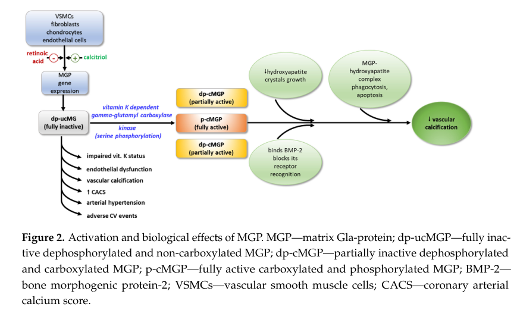

## Question

# Gene Research for Functional Annotation

## ⚠️ CRITICAL: Gene/Protein Identification Context

**BEFORE YOU BEGIN RESEARCH:** You MUST verify you are researching the CORRECT gene/protein. Gene symbols can be ambiguous, especially for less well-characterized genes from non-model organisms.

### Target Gene/Protein Identity (from UniProt):
- **UniProt Accession:** P08493
- **Protein Description:** RecName: Full=Matrix Gla protein; Short=MGP; AltName: Full=Cell growth-inhibiting gene 36 protein; Flags: Precursor;
- **Gene Information:** Name=MGP; Synonyms=MGLAP; ORFNames=GIG36;
- **Organism (full):** Homo sapiens (Human).
- **Protein Family:** Belongs to the osteocalcin/matrix Gla protein family.
- **Key Domains:** GLA-like_dom_SF. (IPR035972); GLA_domain. (IPR000294); MGP. (IPR027118); Osteocalcin/MGP. (IPR002384)

### MANDATORY VERIFICATION STEPS:

1. **Check if the gene symbol "MGP" matches the protein description above**
2. **Verify the organism is correct:** Homo sapiens (Human).
3. **Check if protein family/domains align with what you find in literature**
4. **If you find literature for a DIFFERENT gene with the same or similar symbol, STOP**

### If Gene Symbol is Ambiguous or You Cannot Find Relevant Literature:

**DO NOT PROCEED WITH RESEARCH ON A DIFFERENT GENE.** Instead:
- State clearly: "The gene symbol 'MGP' is ambiguous or literature is limited for this specific protein"
- Explain what you found (e.g., "Found extensive literature on a different gene with the same symbol in a different organism")
- Describe the protein based ONLY on the UniProt information provided above
- Suggest that the protein function can be inferred from domain/family information

### Research Target:

Please provide a comprehensive research report on the gene **MGP** (gene ID: MGP, UniProt: P08493) in human.

The research report should be a detailed narrative explaining the function, biological processes, and localization of the gene product. Citations should be given for all claims.

You should prioritize authoritative reviews and primary scientific literature when conducting research. You can supplement
this with annotations you find in gene/protein databases, but these can be outdated or inaccurate.

We are specifically interested in the primary function of the gene - for enzymes, what reaction is catalyzed, and what is the substrate specificity? For transporters, what is the substrate? For structural proteins or adapters, what is the broader structural role? For signaling molecules, what is the role in the pathway.

We are interested in where in or outside the cell the gene product carries out its function.

We are also interested in the signaling or biochemical pathways in which the gene functions. We are less interested in broad pleiotropic effects, except where these elucidate the precise role.

Include evidence where possible. We are interested in both experimental evidence as well as inference from structure, evolution, or bioinformatic analysis. Precise studies should be prioritized over high-throughput, where available.

## Output

Question: You are an expert researcher providing comprehensive, well-cited information.

Provide detailed information focusing on:
1. Key concepts and definitions with current understanding
2. Recent developments and latest research (prioritize 2023-2024 sources)
3. Current applications and real-world implementations
4. Expert opinions and analysis from authoritative sources
5. Relevant statistics and data from recent studies

Format as a comprehensive research report with proper citations. Include URLs and publication dates where available.
Always prioritize recent, authoritative sources and provide specific citations for all major claims.

# Gene Research for Functional Annotation

## ⚠️ CRITICAL: Gene/Protein Identification Context

**BEFORE YOU BEGIN RESEARCH:** You MUST verify you are researching the CORRECT gene/protein. Gene symbols can be ambiguous, especially for less well-characterized genes from non-model organisms.

### Target Gene/Protein Identity (from UniProt):
- **UniProt Accession:** P08493
- **Protein Description:** RecName: Full=Matrix Gla protein; Short=MGP; AltName: Full=Cell growth-inhibiting gene 36 protein; Flags: Precursor;
- **Gene Information:** Name=MGP; Synonyms=MGLAP; ORFNames=GIG36;
- **Organism (full):** Homo sapiens (Human).
- **Protein Family:** Belongs to the osteocalcin/matrix Gla protein family.
- **Key Domains:** GLA-like_dom_SF. (IPR035972); GLA_domain. (IPR000294); MGP. (IPR027118); Osteocalcin/MGP. (IPR002384)

### MANDATORY VERIFICATION STEPS:

1. **Check if the gene symbol "MGP" matches the protein description above**
2. **Verify the organism is correct:** Homo sapiens (Human).
3. **Check if protein family/domains align with what you find in literature**
4. **If you find literature for a DIFFERENT gene with the same or similar symbol, STOP**

### If Gene Symbol is Ambiguous or You Cannot Find Relevant Literature:

**DO NOT PROCEED WITH RESEARCH ON A DIFFERENT GENE.** Instead:
- State clearly: "The gene symbol 'MGP' is ambiguous or literature is limited for this specific protein"
- Explain what you found (e.g., "Found extensive literature on a different gene with the same symbol in a different organism")
- Describe the protein based ONLY on the UniProt information provided above
- Suggest that the protein function can be inferred from domain/family information

### Research Target:

Please provide a comprehensive research report on the gene **MGP** (gene ID: MGP, UniProt: P08493) in human.

The research report should be a detailed narrative explaining the function, biological processes, and localization of the gene product. Citations should be given for all claims.

You should prioritize authoritative reviews and primary scientific literature when conducting research. You can supplement
this with annotations you find in gene/protein databases, but these can be outdated or inaccurate.

We are specifically interested in the primary function of the gene - for enzymes, what reaction is catalyzed, and what is the substrate specificity? For transporters, what is the substrate? For structural proteins or adapters, what is the broader structural role? For signaling molecules, what is the role in the pathway.

We are interested in where in or outside the cell the gene product carries out its function.

We are also interested in the signaling or biochemical pathways in which the gene functions. We are less interested in broad pleiotropic effects, except where these elucidate the precise role.

Include evidence where possible. We are interested in both experimental evidence as well as inference from structure, evolution, or bioinformatic analysis. Precise studies should be prioritized over high-throughput, where available.

# Research Report: Human **MGP** (Matrix Gla Protein) Functional Annotation

## 0) Target verification (critical identity check)
The target is **human Matrix Gla protein (MGP)**, UniProt **P08493**, a secreted extracellular matrix (ECM) protein in the osteocalcin/MGP family whose function depends on vitamin K–dependent **γ-carboxylation** and N-terminal **phosphorylation**. Retrieved sources consistently describe MGP as an **84-aa** (~11–12 kDa) secreted Gla-family ECM protein expressed in vascular and cartilaginous tissues, matching the provided UniProt context. (galunska2024extrahepaticvitaminkdependent pages 3-5, lau2025structuralandbiophysical pages 18-21, alshahrani2020developmentofin pages 36-43)

## 1) Key concepts and definitions (current understanding)

### 1.1 What is MGP?
**Matrix Gla protein (MGP)** is a small, secreted ECM protein (reported as 84 amino acids; ~11–12 kDa) synthesized by vascular smooth muscle cells (VSMCs) and other cell types (e.g., fibroblasts, chondrocytes, endothelial cells) and present in tissues such as arterial wall, heart, kidney, lung, bone, and cartilage. (galunska2024extrahepaticvitaminkdependent pages 3-5, lau2025structuralandbiophysical pages 18-21, neofytou2024vitaminkfor pages 1-2)

### 1.2 “Gla protein” and vitamin K dependence
MGP belongs to the vitamin K–dependent **Gla-proteins**, whose defining feature is post-translational conversion of specific glutamate (Glu) residues to **γ-carboxyglutamate (Gla)** residues via a vitamin K–dependent reaction. In MGP, γ-carboxylation is repeatedly described as essential for calcium/mineral binding and anti-calcification function. (galunska2024extrahepaticvitaminkdependent pages 3-5, lau2025structuralandbiophysical pages 18-21, lau2025structuralandbiophysical pages 64-68)

### 1.3 Functional isoforms (carboxylation × phosphorylation states)
A central concept in the field is that MGP exists as **multiple circulating/tissue forms** defined by two major post-translational modifications:
- **γ-carboxylation** of multiple Glu residues (vitamin K–dependent)
- **phosphorylation** of three N-terminal serines

A recent review summarizes four operational isoform classes: 
- **p-cMGP** (phosphorylated + carboxylated): considered **fully active**
- **dp-ucMGP** (dephosphorylated + uncarboxylated): considered **fully inactive**
- **dp-cMGP** and **p-ucMGP/ucMGP**: intermediate forms. (galunska2024extrahepaticvitaminkdependent pages 3-5)

Figure evidence supporting this isoform framework and downstream mechanisms is shown in a 2024 review figure. (galunska2024extrahepaticvitaminkdependent media 9afb72d6)

### 1.4 Primary biological role (functional annotation)
Across recent reviews, the **primary function** of MGP is described as **inhibition of ectopic calcification**, particularly **vascular calcification** and cartilage/soft-tissue mineralization. Mechanistically, this is described as occurring through:
1) **Direct mineral binding** (hydroxyapatite adsorption) and inhibition of crystal nucleation/growth
2) **Inhibition of osteogenic signaling** in the vessel wall (notably via BMP-2/4 antagonism), limiting VSMC osteogenic transdifferentiation and apoptosis-linked calcification. (galunska2024extrahepaticvitaminkdependent pages 3-5, lau2025structuralandbiophysical pages 18-21, neofytou2024vitaminkfor pages 1-2)

## 2) Molecular features underpinning function

### 2.1 Post-translational modifications (PTMs)
A 2024 review provides specific residue-level mapping often used operationally in the MGP literature:
- **Five γ-carboxylated glutamates** reported at positions **2, 37, 41, 47, 52**
- **Three phosphorylated serines** at positions **3, 6, 9**
This PTM pattern is tied to the functional isoform concept (active p-cMGP vs inactive dp-ucMGP). (galunska2024extrahepaticvitaminkdependent pages 3-5)

Structural/biophysical work summarized in a 2025 source likewise emphasizes an N-terminal intrinsically disordered region bearing phosphorylation (Ser3/6/9) and γ-carboxylation (including Gla2) alongside Gla residues near/within the folded core; Ca2+ binding and Gla chemistry stabilize structure and promote mineral binding. (lau2025structuralandbiophysical pages 52-55, lau2025structuralandbiophysical pages 18-21)

### 2.2 Biochemical mechanism: mineral binding and inhibition
Active MGP is described as binding Ca2+ via Gla residues and binding to **hydroxyapatite**, thereby inhibiting hydroxyapatite crystal growth in extracellular contexts. (galunska2024extrahepaticvitaminkdependent pages 3-5, lau2025structuralandbiophysical pages 52-55, lau2025structuralandbiophysical pages 18-21)

A recent mechanistic summary figure illustrates that active MGP reduces hydroxyapatite crystal growth and can form mineral complexes that are cleared (phagocytosis/apoptosis framework). (galunska2024extrahepaticvitaminkdependent media 9afb72d6)

### 2.3 Biochemical mechanism: BMP antagonism and pathway placement
MGP is repeatedly described as binding BMP-2 (and BMP-4) and blocking osteogenic signaling in vascular tissues. In a 2024 review, this is framed as preventing VSMC osteogenic transition and inhibiting apoptosis-associated calcification. (galunska2024extrahepaticvitaminkdependent pages 3-5)

Structural/biophysical evidence summarized in 2025 emphasizes Ca2+/Gla dependence for BMP binding (BMP-2/4) and highlights that Gla/Ca2+ chemistry is required for this antagonism. (lau2025structuralandbiophysical pages 18-21, lau2025structuralandbiophysical pages 61-64)

### 2.4 Interacting partners / matrix anchoring
Beyond minerals and BMPs, MGP has been described as interacting with ECM proteins; a 2025 source reports a C-terminal region that mediates binding to ECM proteins such as **vitronectin** and **fibronectin**, supporting an ECM-anchored role at calcification-prone sites. (lau2025structuralandbiophysical pages 18-21, lau2025structuralandbiophysical pages 61-64)

### 2.5 Localization: where MGP acts
The functional setting for MGP is **extracellular**, within the **vascular wall ECM** and other soft-tissue/cartilage matrices. Expression is described in VSMCs, chondrocytes, fibroblasts, and endothelial cells, with tissue localization including arteries/arterial wall and multiple organs (heart, kidney, lung). (galunska2024extrahepaticvitaminkdependent pages 3-5, lau2025structuralandbiophysical pages 18-21, neofytou2024vitaminkfor pages 1-2)

## 3) Disease relevance and genetic/experimental causality

### 3.1 Causal evidence from deficiency/perturbation
Recent reviews emphasize that MGP is not merely associated with calcification but is **causal** in suppressing it:
- **Genetic knockout** in animal models causes rapid arterial calcification and **fatal aortic rupture**, supporting a critical anti-calcification role. (neofytou2024vitaminkfor pages 1-2)
- Reviews and mechanistic discussions connect inhibition of vitamin K–dependent carboxylation (e.g., warfarin) to loss of MGP activation and accelerated vascular/valvular calcification in model systems. (lau2025structuralandbiophysical pages 18-21, lau2025structuralandbiophysical pages 64-68)

### 3.2 Human relevance (Keutel syndrome)
Human loss-of-function in MGP is referenced in the context of **Keutel syndrome**, supporting the importance of intact MGP function for preventing aberrant mineralization. (yeasmin2022atransgenicapproach pages 6-10, tintut2021biomoleculesorchestratingcardiovascular pages 9-10)

## 4) Recent developments and latest research (prioritizing 2023–2024)

### 4.1 Consolidation of “isoform biology” and biomarker translation (2024)
A 2024 narrative review focuses on extrahepatic vitamin K–dependent proteins and highlights that MGP PTM states generate multiple isoforms with distinct functional interpretations (active p-cMGP vs inactive dp-ucMGP). It also stresses that relationships between specific MGP forms, vascular calcification, and cardiovascular pathology remain incompletely resolved—an active research and validation area. (galunska2024extrahepaticvitaminkdependent pages 3-5)

### 4.2 CKD-focused translational framing (2024)
A 2024 Nutrients review positions MGP as a central vitamin K–dependent vascular calcification inhibitor in CKD, emphasizing that CKD patients often have vitamin K deficiency (dietary restriction, medications, absorption issues) and that circulating inactive MGP is used as a biomarker of vitamin K status; it also notes inconsistency of supplementation trials for clinical calcification outcomes. (neofytou2024vitaminkfor pages 1-2)

### 4.3 Biomineralization systems view (2023)
A 2023 review on vitamin K–dependent proteins in biomineralization highlights MGP among VK-dependent regulators and situates vitamin K antagonism as a risk factor for vascular/valvular calcification; it also notes MK-7 supplementation as a potential modifier of vascular calcification progression in coronary artery disease, reflecting continued interest in vitamin K → MGP activation as a modifiable axis. (zhang2023rolesofvitamin pages 4-6)

## 5) Current applications and real-world implementations

### 5.1 dp-ucMGP as a clinical/research biomarker
**dp-ucMGP (dephospho-uncarboxylated MGP)** is widely used as an **inverse biomarker of extrahepatic functional vitamin K status**, reflecting an “inactive MGP” pool. (lauridsen2025investigatingtheassociations pages 1-2, galunska2024extrahepaticvitaminkdependent pages 5-7)

Reviews emphasize biomarker promise (associations with arterial stiffness, calcification scores, CVD risk) but also highlight that validation and standardization across cohorts and outcomes remain ongoing. (galunska2024extrahepaticvitaminkdependent pages 14-16)

### 5.2 Vitamin K supplementation as an intervention targeting MGP activation
A 2023 systematic review and meta-analysis of randomized trials in dialysis patients (11 trials; 830 participants) found vitamin K supplementation improves vitamin K status and **lowers dp-ucMGP**, with stronger pooled reductions for **vitamin K1** than **vitamin K2** (standardized mean difference (SMD) −1.64 vs −0.56, respectively). However, despite biomarker changes, the meta-analysis reports **no mortality effect** and **no significant improvement in calcification scores**, underscoring the current translational gap between MGP activation biomarkers and hard clinical endpoints. (andrian2023vitaminksupplementation pages 1-3)

### 5.3 Anticoagulation choices and “preserving MGP activation”
A 2024 review proposes a practical implication: avoiding vitamin K antagonists when possible (and considering DOACs) to preserve vitamin K–dependent activation of extrahepatic Gla-proteins such as MGP, while noting that DOAC/statin effects on these pathways require further study. (galunska2024extrahepaticvitaminkdependent pages 14-16)

## 6) Quantitative statistics and recent study data

### 6.1 Population-based association data (large N)
A large cross-sectional adult population study measured plasma dp-ucMGP in **4,092** adults (ages 24–77) and analyzed associations per **doubling** of dp-ucMGP. Reported adjusted associations include:
- Central obesity: **OR 4.76** (95% CI 3.57–6.34)
- Diabetes: **OR 1.96** (95% CI 1.11–3.45)
- Hyperlipidaemia: **OR 1.43** (95% CI 1.01–2.03)
- Impaired kidney function: **OR 9.83** (95% CI 5.49–17.59)
No independent association was found with hypertension or arterial stiffness. This provides recent quantitative support that “inactive MGP/vitamin K status” is linked to cardiometabolic risk factors at population scale, while not necessarily tracking all vascular function endpoints. (lauridsen2025investigatingtheassociations pages 1-2)

### 6.2 Randomized trial synthesis in dialysis (biomarker responsiveness vs clinical endpoints)
In dialysis RCTs summarized by meta-analysis (11 trials; **830** total participants), vitamin K supplementation lowered dp-ucMGP (SMD −1.64 for K1; −0.56 for K2) but did not improve calcification scores or mortality in pooled analyses, providing a quantitative benchmark for real-world implementation limitations. (andrian2023vitaminksupplementation pages 1-3)

## 7) Expert synthesis and analysis (authoritative perspectives)

### 7.1 Consensus mechanism (what experts agree on)
Recent reviews converge on a dual-mechanism model:
1) **Mineral phase control**: carboxylated/phosphorylated MGP binds Ca2+ and hydroxyapatite to inhibit crystal growth and participate in mineral complex handling.
2) **Signaling control**: MGP antagonizes **BMP-2/4** to prevent osteogenic transdifferentiation in the vessel wall.
This framework is explicitly described and visually summarized in recent review material. (galunska2024extrahepaticvitaminkdependent pages 3-5, galunska2024extrahepaticvitaminkdependent media 9afb72d6)

### 7.2 Translational uncertainty (what remains unresolved)
Multiple recent sources emphasize that, while dp-ucMGP is widely used as a vitamin K status/inactive MGP marker, the mapping from MGP isoform levels to **calcification burden** and **clinical events** is not fully settled and may be context-dependent (population, CKD stage, assay/form measured, endpoint). (galunska2024extrahepaticvitaminkdependent pages 3-5, galunska2024extrahepaticvitaminkdependent pages 14-16, andrian2023vitaminksupplementation pages 1-3)

## 8) Functional-annotation conclusion (for gene/protein databases)
**Gene/Protein:** MGP (human; UniProt P08493)

**Primary function:** Secreted extracellular matrix protein that **prevents ectopic mineralization**, especially in the vascular wall and cartilage, by **(i)** Ca2+/Gla-dependent binding to hydroxyapatite and inhibition of mineral nucleation/growth and **(ii)** antagonism of osteogenic BMP signaling (BMP-2/4), limiting osteogenic conversion of vascular smooth muscle cells. (galunska2024extrahepaticvitaminkdependent pages 3-5, lau2025structuralandbiophysical pages 18-21, neofytou2024vitaminkfor pages 1-2)

**Key enabling biochemistry:** Requires vitamin K–dependent γ-carboxylation of five Glu residues and phosphorylation of three N-terminal Ser residues; the fully inactive circulating form **dp-ucMGP** is used as an inverse biomarker of functional vitamin K status. (galunska2024extrahepaticvitaminkdependent pages 3-5, galunska2024extrahepaticvitaminkdependent media 9afb72d6)

**Cellular location:** Secreted into **extracellular matrix** of the arterial wall and other tissues; produced notably by VSMCs and also by fibroblasts, chondrocytes, and endothelial cells. (galunska2024extrahepaticvitaminkdependent pages 3-5, neofytou2024vitaminkfor pages 1-2)

---

## Evidence map table
| Topic | Current understanding | Key evidence (with citation IDs) | Key recent sources (year; DOI/URL if in evidence) |
|---|---|---|---|
| Protein size / processing | Human MGP (UniProt P08493) is an 84-aa, ~11–12 kDa secreted extracellular matrix Gla-family protein made as a precursor with a signal peptide; literature consistently places it in the osteocalcin/MGP family and describes extracellular function in vessel wall/cartilage matrices. | 84-aa secreted ECM protein; extracellular localization; family-consistent Gla protein features (galunska2024extrahepaticvitaminkdependent pages 3-5, lau2025structuralandbiophysical pages 18-21, alshahrani2020developmentofin pages 36-43) | Galunska et al., 2024, *Int J Mol Sci*; https://doi.org/10.3390/ijms25063517. Lau, 2025 thesis/source (no DOI in evidence). |
| PTMs: γ-carboxylation | MGP activity depends on vitamin K–dependent γ-carboxylation of 5 Glu residues, commonly reported at positions 2, 37, 41, 47/48, and 52. Carboxylation is essential for Ca²⁺/mineral binding and anti-calcification activity; warfarin or loss of carboxylation causes inactive MGP and severe ectopic calcification in models. | Specific Gla positions and carboxylation dependence; loss-of-function/warfarin evidence (galunska2024extrahepaticvitaminkdependent pages 3-5, lau2025structuralandbiophysical pages 18-21, lau2025structuralandbiophysical pages 64-68, wen2018vitaminkdependentproteins pages 2-4) | Galunska et al., 2024; https://doi.org/10.3390/ijms25063517. Neofytou et al., 2024; https://doi.org/10.3390/nu16121798. |
| PTMs: phosphorylation | Three N-terminal serines (Ser3, Ser6, Ser9) are phosphorylated. Phosphorylation helps define circulating/functional isoforms and likely modulates local conformation, secretion/mineral interaction, and full activity; p-cMGP is considered the fully active form, whereas dp-ucMGP is fully inactive. | Ser3/6/9 phosphorylation and isoform logic (galunska2024extrahepaticvitaminkdependent pages 3-5, lau2025structuralandbiophysical pages 52-55, wen2018vitaminkdependentproteins pages 2-4, galunska2024extrahepaticvitaminkdependent media 9afb72d6) | Galunska et al., 2024; https://doi.org/10.3390/ijms25063517. Figure summarizing isoforms and effects (galunska2024extrahepaticvitaminkdependent media 9afb72d6). |
| Major mechanism: hydroxyapatite binding / inhibition | Carboxylated MGP binds Ca²⁺ and adsorbs to hydroxyapatite, directly inhibiting nucleation/growth of mineral crystals in the extracellular matrix. This is a core anti-calcification mechanism in vessels and soft tissues. | Hydroxyapatite binding and inhibition of crystal growth (galunska2024extrahepaticvitaminkdependent pages 3-5, lau2025structuralandbiophysical pages 52-55, lau2025structuralandbiophysical pages 64-68, lau2025structuralandbiophysical pages 18-21) | Galunska et al., 2024; https://doi.org/10.3390/ijms25063517. Neofytou et al., 2024; https://doi.org/10.3390/nu16121798. |
| Major mechanism: fetuin-A / mineral complexes | Active MGP can participate in mineralization complexes with fetuin-A, calcium, and phosphate, limiting crystal growth and promoting clearance of mineral-containing complexes/apoptotic material. | Fetuin-A/Ca–PO4 complex formation and phagocytic clearance model (galunska2024extrahepaticvitaminkdependent pages 3-5, wen2018vitaminkdependentproteins pages 2-4, galunska2024extrahepaticvitaminkdependent media 9afb72d6) | Galunska et al., 2024; https://doi.org/10.3390/ijms25063517. |
| Major mechanism: BMP-2/4 antagonism | MGP binds BMP-2 and BMP-4 in a Ca²⁺/Gla-dependent manner and blocks BMP-driven osteogenic/chondrogenic conversion of vascular smooth muscle cells, thereby suppressing a key signaling route to vascular calcification. | BMP-2/4 antagonism and dependence on Gla/Ca²⁺ (galunska2024extrahepaticvitaminkdependent pages 3-5, lau2025structuralandbiophysical pages 18-21, lau2025structuralandbiophysical pages 61-64) | Galunska et al., 2024; https://doi.org/10.3390/ijms25063517. Lau, 2025 thesis/source (no DOI in evidence). |
| Localization / expressing cell types | MGP is secreted into extracellular matrix, especially in arterial wall/cartilage environments. It is produced by vascular smooth muscle cells, chondrocytes, fibroblasts, endothelial cells, and also reported in osteoblast/osteoclast-related contexts; tissue expression includes arteries, heart, kidney, lung, bone, and cartilage. | Cell types and tissue distribution (galunska2024extrahepaticvitaminkdependent pages 3-5, lau2025structuralandbiophysical pages 18-21, yeasmin2022atransgenicapproach pages 6-10, neofytou2024vitaminkfor pages 1-2) | Galunska et al., 2024; https://doi.org/10.3390/ijms25063517. Neofytou et al., 2024; https://doi.org/10.3390/nu16121798. |
| Disease relevance / genetics | MGP is one of the strongest endogenous inhibitors of vascular and soft-tissue calcification. Human deficiency causes Keutel syndrome, while Mgp knockout animals develop rapid arterial/cartilage calcification and aortic rupture, supporting a causal anti-mineralization role rather than a passive association. | Human/animal loss-of-function phenotypes (yeasmin2022atransgenicapproach pages 6-10, lau2025structuralandbiophysical pages 18-21, neofytou2024vitaminkfor pages 1-2, tintut2021biomoleculesorchestratingcardiovascular pages 9-10) | Neofytou et al., 2024; https://doi.org/10.3390/nu16121798. Zhang et al., 2023; https://doi.org/10.3892/ijmm.2023.5330. |
| Translational note: dp-ucMGP biomarker | Circulating dp-ucMGP (dephospho-uncarboxylated MGP) is the fully inactive form and an inverse biomarker of extrahepatic vitamin K status. It is widely studied in CKD/CVD risk stratification, but its specificity as a calcification marker remains imperfect and context-dependent. | Biomarker interpretation and cautions (galunska2024extrahepaticvitaminkdependent pages 3-5, galunska2024extrahepaticvitaminkdependent pages 14-16, galunska2024extrahepaticvitaminkdependent pages 5-7) | Galunska et al., 2024; https://doi.org/10.3390/ijms25063517. Nyvad et al., 2024; https://doi.org/10.1186/s12882-024-03876-5. |
| Recent quantitative biomarker / intervention data | In 4,092 adults, each doubling of dp-ucMGP associated with central obesity OR 4.76, diabetes OR 1.96, hyperlipidaemia OR 1.43, and impaired kidney function OR 9.83; no independent association with hypertension or arterial stiffness. In a 2023 meta-analysis of 11 randomized dialysis trials (830 participants), vitamin K lowered dp-ucMGP, with larger pooled effects for K1 (SMD −1.64) than K2 (SMD −0.56), but without clear mortality or calcification-score benefit. | Population-level ORs; trial/meta-analysis effect sizes (lauridsen2025investigatingtheassociations pages 1-2, andrian2023vitaminksupplementation pages 1-3) | Lauridsen et al., 2025 online/2024 DOI record; https://doi.org/10.1007/s00394-024-03532-6. Andrian et al., 2023; https://doi.org/10.1093/ckj/sfad255. |

*Table: This table summarizes verified functional annotation facts for human Matrix Gla protein (MGP; UniProt P08493), including core biochemistry, mechanisms, localization, and translational biomarker relevance. It is designed as a compact evidence map for use in a gene-focused research report.*

## Key supporting figure
A 2024 review figure summarizes MGP post-translational activation (γ-carboxylation and phosphorylation), the major isoforms (dp-ucMGP, dp-cMGP, p-cMGP), and proposed anti-calcification actions (hydroxyapatite crystal growth inhibition and BMP-2 antagonism). (galunska2024extrahepaticvitaminkdependent media 9afb72d6)

## URLs and publication dates (from cited sources)
- Galunska B, et al. *Int J Mol Sci* (Mar **2024**). https://doi.org/10.3390/ijms25063517 (galunska2024extrahepaticvitaminkdependent pages 3-5)
- Neofytou IE, et al. *Nutrients* (Jun **2024**). https://doi.org/10.3390/nu16121798 (neofytou2024vitaminkfor pages 1-2)
- Zhang M, et al. *Int J Mol Med* (Nov **2023**). https://doi.org/10.3892/ijmm.2023.5330 (zhang2023rolesofvitamin pages 4-6)
- Andrian T, et al. *Clinical Kidney Journal* (Oct **2023**). https://doi.org/10.1093/ckj/sfad255 (andrian2023vitaminksupplementation pages 1-3)
- Lauridsen JA, et al. *European Journal of Nutrition* (online record shows DOI **2024**, journal date Nov **2025**). https://doi.org/10.1007/s00394-024-03532-6 (lauridsen2025investigatingtheassociations pages 1-2)

References

1. (galunska2024extrahepaticvitaminkdependent pages 3-5): Bistra Galunska, Yoto Yotov, Miglena Nikolova, and Atanas Angelov. Extrahepatic vitamin k-dependent gla-proteins–potential cardiometabolic biomarkers. International Journal of Molecular Sciences, 25:3517, Mar 2024. URL: https://doi.org/10.3390/ijms25063517, doi:10.3390/ijms25063517. This article has 19 citations.

2. (lau2025structuralandbiophysical pages 18-21): YS Lau. Structural and biophysical characterization of human matrix gla protein. Unknown journal, 2025.

3. (alshahrani2020developmentofin pages 36-43): S Alshahrani. Development of in vitro and in vivo models to study the effects of a mutation in the signal peptide and posttranslational gamma carboxylation of mgp. Unknown journal, 2020.

4. (neofytou2024vitaminkfor pages 1-2): Ioannis Eleftherios Neofytou, Aikaterini Stamou, Antonia Demopoulos, Stefanos Roumeliotis, Pantelis Zebekakis, Vassilios Liakopoulos, Eleni Stamellou, and Evangelia Dounousi. Vitamin k for vascular calcification in kidney patients: still alive and kicking, but still a lot to learn. Nutrients, 16:1798, Jun 2024. URL: https://doi.org/10.3390/nu16121798, doi:10.3390/nu16121798. This article has 17 citations.

5. (lau2025structuralandbiophysical pages 64-68): YS Lau. Structural and biophysical characterization of human matrix gla protein. Unknown journal, 2025.

6. (galunska2024extrahepaticvitaminkdependent media 9afb72d6): Bistra Galunska, Yoto Yotov, Miglena Nikolova, and Atanas Angelov. Extrahepatic vitamin k-dependent gla-proteins–potential cardiometabolic biomarkers. International Journal of Molecular Sciences, 25:3517, Mar 2024. URL: https://doi.org/10.3390/ijms25063517, doi:10.3390/ijms25063517. This article has 19 citations.

7. (lau2025structuralandbiophysical pages 52-55): YS Lau. Structural and biophysical characterization of human matrix gla protein. Unknown journal, 2025.

8. (lau2025structuralandbiophysical pages 61-64): YS Lau. Structural and biophysical characterization of human matrix gla protein. Unknown journal, 2025.

9. (yeasmin2022atransgenicapproach pages 6-10): L Yeasmin. A transgenic approach to understand the role of the n'-terminal sequence of matrix gla protein in the prevention of ectopic calcification. Unknown journal, 2022.

10. (tintut2021biomoleculesorchestratingcardiovascular pages 9-10): Yin Tintut, Henry M. Honda, and Linda L. Demer. Biomolecules orchestrating cardiovascular calcification. Biomolecules, 11:1482, Oct 2021. URL: https://doi.org/10.3390/biom11101482, doi:10.3390/biom11101482. This article has 24 citations.

11. (zhang2023rolesofvitamin pages 4-6): Meng Zhang, Qingqi Zhang, Pengfei Du, Xin Chen, and Yumei Zhang. Roles of vitamin k-dependent protein in biomineralization (review). International Journal of Molecular Medicine, Nov 2023. URL: https://doi.org/10.3892/ijmm.2023.5330, doi:10.3892/ijmm.2023.5330. This article has 24 citations and is from a peer-reviewed journal.

12. (lauridsen2025investigatingtheassociations pages 1-2): Julie Aaberg Lauridsen, Katja Biering Leth-Møller, Line Tang Møllehave, Line Lund Kårhus, Thomas Meinertz Dantoft, Klaus Fuglsang Kofoed, and Allan Linneberg. Investigating the associations between uncarboxylated matrix gla protein as a proxy for vitamin k status and cardiovascular disease risk factors in a general adult population. European Journal of Nutrition, Nov 2025. URL: https://doi.org/10.1007/s00394-024-03532-6, doi:10.1007/s00394-024-03532-6. This article has 6 citations and is from a domain leading peer-reviewed journal.

13. (galunska2024extrahepaticvitaminkdependent pages 5-7): Bistra Galunska, Yoto Yotov, Miglena Nikolova, and Atanas Angelov. Extrahepatic vitamin k-dependent gla-proteins–potential cardiometabolic biomarkers. International Journal of Molecular Sciences, 25:3517, Mar 2024. URL: https://doi.org/10.3390/ijms25063517, doi:10.3390/ijms25063517. This article has 19 citations.

14. (galunska2024extrahepaticvitaminkdependent pages 14-16): Bistra Galunska, Yoto Yotov, Miglena Nikolova, and Atanas Angelov. Extrahepatic vitamin k-dependent gla-proteins–potential cardiometabolic biomarkers. International Journal of Molecular Sciences, 25:3517, Mar 2024. URL: https://doi.org/10.3390/ijms25063517, doi:10.3390/ijms25063517. This article has 19 citations.

15. (andrian2023vitaminksupplementation pages 1-3): Titus Andrian, Anca Stefan, Ionut Nistor, and Adrian Covic. Vitamin k supplementation impact in dialysis patients: a systematic review and meta-analysis of randomized trials. Clinical Kidney Journal, 16:2738-2749, Oct 2023. URL: https://doi.org/10.1093/ckj/sfad255, doi:10.1093/ckj/sfad255. This article has 5 citations and is from a peer-reviewed journal.

16. (wen2018vitaminkdependentproteins pages 2-4): Lianpu Wen, Jiepeng Chen, Lili Duan, and Shuzhuang Li. Vitamin k-dependent proteins involved in bone and cardiovascular health. Molecular Medicine Reports, 18:3-15, Apr 2018. URL: https://doi.org/10.3892/mmr.2018.8940, doi:10.3892/mmr.2018.8940. This article has 208 citations and is from a peer-reviewed journal.

## Artifacts

- [Edison artifact artifact-00](MGP-deep-research-falcon_artifacts/artifact-00.md)

## Citations

1. galunska2024extrahepaticvitaminkdependent pages 3-5
2. neofytou2024vitaminkfor pages 1-2
3. zhang2023rolesofvitamin pages 4-6
4. galunska2024extrahepaticvitaminkdependent pages 14-16
5. andrian2023vitaminksupplementation pages 1-3
6. lauridsen2025investigatingtheassociations pages 1-2
7. lau2025structuralandbiophysical pages 18-21
8. alshahrani2020developmentofin pages 36-43
9. lau2025structuralandbiophysical pages 64-68
10. lau2025structuralandbiophysical pages 52-55
11. lau2025structuralandbiophysical pages 61-64
12. yeasmin2022atransgenicapproach pages 6-10
13. tintut2021biomoleculesorchestratingcardiovascular pages 9-10
14. galunska2024extrahepaticvitaminkdependent pages 5-7
15. wen2018vitaminkdependentproteins pages 2-4
16. https://doi.org/10.3390/ijms25063517.
17. https://doi.org/10.3390/nu16121798.
18. https://doi.org/10.3892/ijmm.2023.5330.
19. https://doi.org/10.1186/s12882-024-03876-5.
20. https://doi.org/10.1007/s00394-024-03532-6.
21. https://doi.org/10.1093/ckj/sfad255.
22. https://doi.org/10.3390/ijms25063517
23. https://doi.org/10.3390/nu16121798
24. https://doi.org/10.3892/ijmm.2023.5330
25. https://doi.org/10.1093/ckj/sfad255
26. https://doi.org/10.1007/s00394-024-03532-6
27. https://doi.org/10.3390/ijms25063517,
28. https://doi.org/10.3390/nu16121798,
29. https://doi.org/10.3390/biom11101482,
30. https://doi.org/10.3892/ijmm.2023.5330,
31. https://doi.org/10.1007/s00394-024-03532-6,
32. https://doi.org/10.1093/ckj/sfad255,
33. https://doi.org/10.3892/mmr.2018.8940,