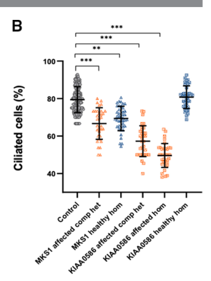
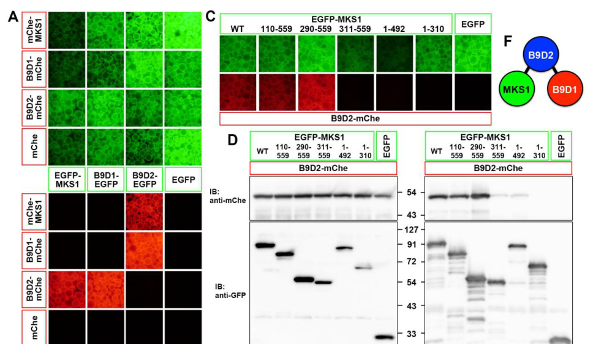

## Question

# Gene Research for Functional Annotation

## ⚠️ CRITICAL: Gene/Protein Identification Context

**BEFORE YOU BEGIN RESEARCH:** You MUST verify you are researching the CORRECT gene/protein. Gene symbols can be ambiguous, especially for less well-characterized genes from non-model organisms.

### Target Gene/Protein Identity (from UniProt):
- **UniProt Accession:** Q9NXB0
- **Protein Description:** RecName: Full=Tectonic-like complex member MKS1 {ECO:0000305}; AltName: Full=Meckel syndrome type 1 protein;
- **Gene Information:** Name=MKS1;
- **Organism (full):** Homo sapiens (Human).
- **Protein Family:** Not specified in UniProt
- **Key Domains:** C2_B9-type_dom. (IPR010796); B9-C2 (PF07162)

### MANDATORY VERIFICATION STEPS:

1. **Check if the gene symbol "MKS1" matches the protein description above**
2. **Verify the organism is correct:** Homo sapiens (Human).
3. **Check if protein family/domains align with what you find in literature**
4. **If you find literature for a DIFFERENT gene with the same or similar symbol, STOP**

### If Gene Symbol is Ambiguous or You Cannot Find Relevant Literature:

**DO NOT PROCEED WITH RESEARCH ON A DIFFERENT GENE.** Instead:
- State clearly: "The gene symbol 'MKS1' is ambiguous or literature is limited for this specific protein"
- Explain what you found (e.g., "Found extensive literature on a different gene with the same symbol in a different organism")
- Describe the protein based ONLY on the UniProt information provided above
- Suggest that the protein function can be inferred from domain/family information

### Research Target:

Please provide a comprehensive research report on the gene **MKS1** (gene ID: MKS1, UniProt: Q9NXB0) in human.

The research report should be a detailed narrative explaining the function, biological processes, and localization of the gene product. Citations should be given for all claims.

You should prioritize authoritative reviews and primary scientific literature when conducting research. You can supplement
this with annotations you find in gene/protein databases, but these can be outdated or inaccurate.

We are specifically interested in the primary function of the gene - for enzymes, what reaction is catalyzed, and what is the substrate specificity? For transporters, what is the substrate? For structural proteins or adapters, what is the broader structural role? For signaling molecules, what is the role in the pathway.

We are interested in where in or outside the cell the gene product carries out its function.

We are also interested in the signaling or biochemical pathways in which the gene functions. We are less interested in broad pleiotropic effects, except where these elucidate the precise role.

Include evidence where possible. We are interested in both experimental evidence as well as inference from structure, evolution, or bioinformatic analysis. Precise studies should be prioritized over high-throughput, where available.

## Output

Question: You are an expert researcher providing comprehensive, well-cited information.

Provide detailed information focusing on:
1. Key concepts and definitions with current understanding
2. Recent developments and latest research (prioritize 2023-2024 sources)
3. Current applications and real-world implementations
4. Expert opinions and analysis from authoritative sources
5. Relevant statistics and data from recent studies

Format as a comprehensive research report with proper citations. Include URLs and publication dates where available.
Always prioritize recent, authoritative sources and provide specific citations for all major claims.

# Gene Research for Functional Annotation

## ⚠️ CRITICAL: Gene/Protein Identification Context

**BEFORE YOU BEGIN RESEARCH:** You MUST verify you are researching the CORRECT gene/protein. Gene symbols can be ambiguous, especially for less well-characterized genes from non-model organisms.

### Target Gene/Protein Identity (from UniProt):
- **UniProt Accession:** Q9NXB0
- **Protein Description:** RecName: Full=Tectonic-like complex member MKS1 {ECO:0000305}; AltName: Full=Meckel syndrome type 1 protein;
- **Gene Information:** Name=MKS1;
- **Organism (full):** Homo sapiens (Human).
- **Protein Family:** Not specified in UniProt
- **Key Domains:** C2_B9-type_dom. (IPR010796); B9-C2 (PF07162)

### MANDATORY VERIFICATION STEPS:

1. **Check if the gene symbol "MKS1" matches the protein description above**
2. **Verify the organism is correct:** Homo sapiens (Human).
3. **Check if protein family/domains align with what you find in literature**
4. **If you find literature for a DIFFERENT gene with the same or similar symbol, STOP**

### If Gene Symbol is Ambiguous or You Cannot Find Relevant Literature:

**DO NOT PROCEED WITH RESEARCH ON A DIFFERENT GENE.** Instead:
- State clearly: "The gene symbol 'MKS1' is ambiguous or literature is limited for this specific protein"
- Explain what you found (e.g., "Found extensive literature on a different gene with the same symbol in a different organism")
- Describe the protein based ONLY on the UniProt information provided above
- Suggest that the protein function can be inferred from domain/family information

### Research Target:

Please provide a comprehensive research report on the gene **MKS1** (gene ID: MKS1, UniProt: Q9NXB0) in human.

The research report should be a detailed narrative explaining the function, biological processes, and localization of the gene product. Citations should be given for all claims.

You should prioritize authoritative reviews and primary scientific literature when conducting research. You can supplement
this with annotations you find in gene/protein databases, but these can be outdated or inaccurate.

We are specifically interested in the primary function of the gene - for enzymes, what reaction is catalyzed, and what is the substrate specificity? For transporters, what is the substrate? For structural proteins or adapters, what is the broader structural role? For signaling molecules, what is the role in the pathway.

We are interested in where in or outside the cell the gene product carries out its function.

We are also interested in the signaling or biochemical pathways in which the gene functions. We are less interested in broad pleiotropic effects, except where these elucidate the precise role.

Include evidence where possible. We are interested in both experimental evidence as well as inference from structure, evolution, or bioinformatic analysis. Precise studies should be prioritized over high-throughput, where available.

# Human MKS1: functional annotation and research report

## Identity and principal function

**The target is human MKS1, UniProt Q9NXB0**, the Meckel syndrome type 1 protein specified in the question—not *TMEM67*, which is also called **MKS3**. The supplied UniProt annotation identifies a B9-C2 domain (Pfam PF07162; InterPro IPR010796). Independent human-cell studies identify MKS1 as a 559-amino-acid B9-domain protein and use human **MKS1** cDNA to study its ciliary function. The retrieved papers do not themselves print accession Q9NXB0, so that accession is verified against the supplied target information rather than independently against a database record. B9 is related to the C2-domain superfamily; this resemblance does **not** establish that MKS1 binds a particular lipid or requires calcium. (kyttala2006identificationofthe pages 78-83, okazaki2020formationofthe pages 5-7, okazaki2020formationofthe pages 7-11)

**Best-supported annotation:** MKS1 is a *non-enzymatic, soluble structural/adaptor component of the ciliary transition-zone membrane gate*. Its principal experimentally demonstrated role is to assemble with B9D2 and B9D1 and help maintain the distinctive protein composition of the ciliary membrane. It is not an identified enzyme, membrane transporter, or intraflagellar-transport motor; no catalyzed reaction or transported substrate should be assigned to it. (okazaki2020formationofthe pages 1-5, okazaki2020formationofthe pages 5-7, okazaki2020formationofthe pages 7-11)

| Molecular claim | Decisive experimental evidence and model | Confidence / important limitation |
|---|---|---|
| **MKS1 forms a linear MKS1–B9D2–B9D1 complex.** | VIP pull-down and visible three-hybrid assays in human HEK293T cells showed that MKS1 binds B9D2, B9D2 binds B9D1, and MKS1 does not directly bind B9D1. Deletion mapping showed that the MKS1 B9 domain and short flanking regions are required for B9D2 binding. Okazaki et al. (2020), [DOI](https://doi.org/10.1091/mbc.e20-03-0208). (okazaki2020formationofthe pages 5-7, okazaki2020formationofthe media 29cd606c) | **High.** Supported by direct interaction and deletion-mapping assays. Fusion-protein experiments do not establish native stoichiometry or atomic structure. |
| **The complex localizes to the human ciliary transition zone through mutual recruitment.** | CRISPR knockout and Airyscan imaging in human hTERT-RPE1 cells showed that MKS1 transition-zone localization requires B9D2; B9D1 requires MKS1 and B9D2; and B9D2 requires MKS1. MKS1 localized near TCTN1 and slightly distal to the basal-body marker FOP. Okazaki et al. (2020), [DOI](https://doi.org/10.1091/mbc.e20-03-0208). (okazaki2020formationofthe pages 7-11) | **High for transition-zone localization and co-dependence; moderate for precise architecture.** Spatial proximity does not prove direct attachment to TCTN1 or the ciliary membrane. |
| **MKS1 is a structural or adaptor component of the ciliary membrane gate, not an enzyme or transporter.** | MKS1- or B9D2-knockout RPE1 cells lost ciliary GPR161, agonist-induced SMO, ARL13B and INPP5E. Wild-type MKS1 restored transition-zone localization and ARL13B, whereas defective deletion constructs did not. IFT88 and IFT140 localization and bidirectional IFT88 movement remained apparently normal. Okazaki et al. (2020), [DOI](https://doi.org/10.1091/mbc.e20-03-0208). (okazaki2020formationofthe pages 5-7, okazaki2020formationofthe pages 7-11) | **High for membrane-cargo compartmentalization.** Endpoint assays do not distinguish defective entry from defective retention or accelerated exit. Moderate ciliogenesis and cilium-length defects suggest an additional minor role in cilium formation. |
| **MKS1 supports Hedgehog signaling and cooperates with IFT and the BBSome.** | Mouse Mks1 mutations disrupt ciliogenesis, GLI-dependent patterning and Hedgehog signaling. Double-mutant analyses with Bbs4, Ift172 or Dync2h1 produced enhanced developmental, ciliation and trafficking phenotypes involving ARL13B, SMO, GPR161, INPP5E, IFT88 or KIF7. Goetz et al. (2017), [DOI](https://doi.org/10.1371/journal.pone.0173399). (goetz2017themeckelsyndrome pages 1-2, goetz2017themeckelsyndrome pages 16-18, goetz2017themeckelsyndrome pages 15-16) | **High for mammalian genetic interaction; moderate for direct molecular contact.** Epistasis demonstrates functional cooperation but does not necessarily show direct binding to IFT or BBSome proteins. |
| **The recurrent MKS1 c.1476T>G allele is hypomorphic and variably expressive.** | Its allele frequency was **0.73%** in approximately 551 European Joubert-syndrome cases, **0.08%** in approximately 600 US cases and **0.006%** in gnomAD. Eight families shared an approximately 2.29-Mb haplotype. A clinically unaffected homozygous mother nevertheless had impaired fibroblast ciliogenesis and a milder cilium-length defect than her affected compound-heterozygous son. Serpieri et al. (2023), [DOI](https://doi.org/10.1136/jmg-2022-108725). (serpieri2023recurrentfounderand pages 3-4, serpieri2023recurrentfounderand pages 5-6, serpieri2023recurrentfounderand pages 6-6) | **High for population enrichment and a cellular effect; moderate for penetrance prediction.** An unaffected homozygote shows that the allele alone is not fully penetrant for Joubert syndrome. Functional testing involved very few individuals. |
| **MKS1 may regulate canonical Wnt and beta-catenin processing through UBE2E1.** | A 2020 bioRxiv study reported interactions of MKS1 with UBE2E1 and RNF34, basal-body colocalization, codependent protein levels, UBE2E1-dependent MKS1 ubiquitination and altered beta-catenin or Wnt signaling after MKS1 loss. [Preprint DOI](https://doi.org/10.1101/2020.01.08.897959). (szymanska2022regulationofcanonical pages 1-4, szymanska2022regulationofcanonical pages 4-8, szymanska2022regulationofcanonical pages 32-35) | **Suggestive only.** The retrieved document is a non-peer-reviewed preprint. This proposed ubiquitin–Wnt role is less securely established than transition-zone membrane gating and should not be treated as MKS1's primary annotation. |
| **Direct lipid binding and structural attachment to Y-links remain unproven.** | The B9 domain is evolutionarily related to C2 membrane-targeting domains, and models place the soluble B9 complex near the ciliary membrane, possibly at the outer Y-link or ciliary-necklace region. Reviews treat lipid microdomains, membrane pickets and Y-link anchoring as plausible, nonexclusive mechanisms. Park and Leroux (2022), [DOI](https://doi.org/10.15252/embr.202255420); Moran et al. (2024), [DOI](https://doi.org/10.1038/s41581-023-00773-2). (moran2024transportandbarrier pages 3-5, moran2024transportandbarrier pages 5-6, park2022compositionorganizationand pages 12-13, okazaki2020formationofthe pages 7-11) | **Low for direct lipid-binding or Y-link-attachment claims.** Domain homology and proximity are not biochemical binding measurements or high-resolution structures. No lipid specificity, catalytic activity or direct MKS1–Y-link contact has been demonstrated. |

*Table: Evidence-ranked functional annotation of human MKS1 (Q9NXB0), separating well-supported transition-zone gating functions from suggestive signaling roles and unresolved structural mechanisms.*

## Where and how MKS1 acts

The **transition zone** lies at the base of a cilium, between its mother-centriole-derived basal body and the axoneme. It helps separate the ciliary membrane and contents from the rest of the cell while allowing regulated trafficking. In human hTERT-RPE1 cells, endogenous MKS1 is detected at this zone. Airyscan imaging places tagged MKS1 close to transition-zone protein TCTN1, slightly farther from the basal-body marker FOP. Earlier mouse studies also described Mks1 at the mother centriole from which cilia emerge; these descriptions concern adjoining ciliary-base structures and should not be read as proof that the protein functions throughout the axoneme or outside the cell. (moran2024transportandbarrier pages 3-5, okazaki2020formationofthe pages 7-11, okazaki2020formationofthe media 29cd606c)

Interaction assays establish the ordered **MKS1–B9D2–B9D1** subcomplex: MKS1 binds B9D2, which binds B9D1, whereas direct MKS1–B9D1 binding was not detected. MKS1 requires its B9 domain *and adjoining sequence* for B9D2 binding. In human knockout cells, MKS1 requires B9D2 for transition-zone localization; tagged B9D1 requires both proteins, and tagged B9D2 requires MKS1. Thus, assembling the complex is important for localizing its constituents, although binding B9D2 alone is insufficient: an MKS1 N-terminal deletion still binds B9D2 but neither localizes correctly nor rescues ciliary ARL13B. [Okazaki *et al.*, *Molecular Biology of the Cell*, September 2020; https://doi.org/10.1091/mbc.e20-03-0208.] (okazaki2020formationofthe pages 5-7, okazaki2020formationofthe pages 7-11, okazaki2020formationofthe media 29cd606c)

The strongest functional test used **CRISPR MKS1-knockout human RPE1 cells**. Their remaining cilia failed to accumulate the membrane-associated proteins **GPR161** under basal conditions, **Smoothened (SMO)** after pathway-agonist stimulation, and lipid-anchored **ARL13B** and **INPP5E**. Wild-type MKS1 restored ARL13B localization, whereas tested localization-defective deletions did not. Cilia formation and length were moderately reduced, but the localization of IFT88 and IFT140 and the observed bidirectional movement of IFT88-positive particles remained largely intact. This supports a primary role in **ciliary membrane-protein compartmentalization**, rather than wholesale failure of IFT-particle transport. These endpoint-localization experiments do not, by themselves, resolve whether each cargo fails to enter, fails to remain in, or exits too rapidly from cilia. [Okazaki *et al.*, 2020; https://doi.org/10.1091/mbc.e20-03-0208.] (okazaki2020formationofthe pages 5-7, okazaki2020formationofthe pages 7-11)

The B9 complex is part of the broader MKS transition-zone module, which also includes transmembrane proteins such as TMEM67 and tectonic proteins. The proposal that MKS1 directly anchors a Y-link to the membrane or serves as a molecular “picket” is **plausible but not structurally established**. Authoritative reviews distinguish observed gating defects from unresolved physical mechanisms, including candidate protein fences, lipid organization and molecular crowding. Nor does B9/C2 homology demonstrate direct MKS1 binding to a defined phospholipid. [Park and Leroux, *EMBO Reports*, November 2022; https://doi.org/10.15252/embr.202255420. Moran *et al.*, *Nature Reviews Nephrology*, volume 20 (2024); https://doi.org/10.1038/s41581-023-00773-2.] (moran2024transportandbarrier pages 3-5, park2022compositionorganizationand pages 8-9, moran2024transportandbarrier pages 5-6, okazaki2020formationofthe pages 7-11)

## Signaling and biological processes

**Hedgehog signaling is the clearest pathway consequence.** Proper ciliary localization of SMO and GPR161 permits the regulated ciliary events upstream of GLI transcription-factor responses. Mks1-mutant mice show defective ciliogenesis and Hedgehog-dependent developmental patterning; the consequences can differ between tissues and along developmental axes, consistent with disrupted regulation of both activating and repressive GLI outputs rather than a simple universal “Hedgehog-off” state. Genetic interactions with **Bbs4**, **Ift172** and the retrograde motor gene **Dync2h1** further indicate that the MKS1-containing gate cooperates functionally with the BBSome and IFT machinery. These genetic interactions do not establish that MKS1 is itself an IFT subunit or binds every trafficking component directly. [Weatherbee *et al.*, *Human Molecular Genetics*, December 2009; https://doi.org/10.1093/hmg/ddp422. Cui *et al.*, *Disease Models & Mechanisms*, January 2011; https://doi.org/10.1242/dmm.006262. Goetz *et al.*, *PLOS ONE*, March 2017; https://doi.org/10.1371/journal.pone.0173399.] (okazaki2020formationofthe pages 5-7, goetz2017themeckelsyndrome pages 1-2, goetz2017themeckelsyndrome pages 16-18, goetz2017themeckelsyndrome pages 15-16)

MKS1 is also implicated in **cilium formation and developmental left–right organization**: Mks1-mutant mouse embryos have fewer or shorter nodal cilia, lost directional nodal flow and laterality defects. The severity of ciliogenesis defects varies by model and tissue; the moderate defect in human RPE1 knockout cells should not be generalized to every embryonic cell type. (okazaki2020formationofthe pages 5-7, okazaki2020formationofthe pages 7-11)

A proposed additional role links MKS1 at the ciliary base to **ubiquitin-dependent regulation of canonical Wnt/β-catenin signaling** through interactions with UBE2E1 and RNF34. The retrieved version of this work is explicitly a **March 2020 bioRxiv preprint**, despite inconsistent bibliographic labeling in the search record; its findings are therefore presented as suggestive, not as equally secure as the human-cell transition-zone knockout-and-rescue evidence. It does not make MKS1 an E2 enzyme or establish ubiquitin transfer by MKS1 itself. [Szymanska *et al.*, bioRxiv preprint, posted March 28, 2020; https://doi.org/10.1101/2020.01.08.897959.] (szymanska2022regulationofcanonical pages 1-4, szymanska2022regulationofcanonical pages 4-8)

## Recent research and clinical implementation

A **2023 human genetic and cellular study** sharpened interpretation of the recurrent **MKS1 c.1476T>G** allele. Its reported allele frequency was **0.73%** among approximately **551 European Joubert-syndrome participants**, versus **0.08%** among approximately **600 US participants** and **0.006%** in the study’s gnomAD comparison; these are *allele frequencies in particular cohorts*, not estimates of the percentage of Joubert syndrome caused by MKS1. Eight affected families shared an approximately **2.29-Mb** surrounding haplotype. Importantly, an apparently healthy woman homozygous for this variant had impaired fibroblast ciliogenesis and a relatively mild reduction in cilium length, whereas her affected son carried this variant with another deleterious MKS1 allele and had more pronounced cellular abnormalities. These observations support a functionally consequential, **hypomorphic allele with variable clinical expression**, not a rule that homozygosity alone inevitably causes Joubert syndrome. Figure 3 presents the cellular comparison. [Serpieri *et al.*, *Journal of Medical Genetics*, first published February 14, 2023; https://doi.org/10.1136/jmg-2022-108725.] (serpieri2023recurrentfounderand pages 3-4, serpieri2023recurrentfounderand pages 6-6, serpieri2023recurrentfounderand pages 5-6, serpieri2023recurrentfounderand media c5f14296)

For context, a **2024 review** continues to treat MKS-module gating as important while emphasizing that the molecular barrier and the distinction between cargo entry and retention remain unsettled. A separate **2024 experimental report** found a preciliary epithelial tight-junction role for **B9D2**; because that result concerns MKS1’s interaction partner, it is **not evidence of the same extraciliary function for MKS1**. [Moran *et al.*, *Nature Reviews Nephrology*, 2024; https://doi.org/10.1038/s41581-023-00773-2. Caenen-Braz *et al.*, *Scientific Reports*, October 2024; https://doi.org/10.1038/s41598-024-75577-w.] (caenenbraz2024newfunctionsof pages 1-2, moran2024transportandbarrier pages 5-6)

**Established real-world use is molecular diagnosis and family counseling**, not MKS1-directed treatment. Biallelic MKS1 variants are associated with a spectrum from severe, usually prenatal- or perinatal-lethal **Meckel syndrome**—classically cystic dysplastic kidneys, brain malformation or encephalocele, hepatic ductal-plate abnormalities and polydactyly—to surviving individuals with **Joubert syndrome**, sometimes including retinal degeneration. In one reported case, clinical-exome detection of two MKS1 truncating variants in a **39-year-old** initially assessed for retinitis pigmentosa prompted brain MRI, revealing the Joubert-associated “molar tooth” sign; thus, ostensibly isolated retinal disease warranted broader evaluation. The severe-versus-mild phenotype cannot be predicted reliably from a simple truncating-versus-missense distinction, and a single heterozygous result is not, by itself, a diagnosis of recessive MKS1 disease. [Romani *et al.*, *Orphanet Journal of Rare Diseases*, May 2014; https://doi.org/10.1186/1750-1172-9-72. Brunetti-Pierri *et al.*, *Diagnostics*, published July 6, 2021; https://doi.org/10.3390/diagnostics11071218.] (romani2014mutationsinb9d1 pages 1-3, brunettipierri2021mildclinicalpresentation pages 1-2)

MKS1 was estimated to account for about **7% of Meckel-syndrome cases worldwide** but a much larger proportion—approximately **70%** in the cited Finnish series—because of a founder allele; such estimates depend strongly on ancestry and ascertainment and should not be transferred to other populations. Clinical assessment combines fetal imaging or phenotype evaluation with appropriately interpreted molecular testing and segregation in families. For parents carrying causative recessive variants, the standard recurrence risk for an affected pregnancy is **25%**. [Hartill *et al.*, *Frontiers in Pediatrics*, November 2017; https://doi.org/10.3389/fped.2017.00244.] (hartill2017meckel–grubersyndromean pages 2-4)

**Bottom line:** Human MKS1 acts mainly **at the ciliary transition zone as a B9-complex scaffold needed for selective ciliary membrane-protein localization**, thereby enabling normal ciliary signaling, especially Hedgehog signaling. Direct lipid specificity, atomic placement within Y-links and a definitive cargo-by-cargo entry-versus-retention mechanism remain open questions; the accessible 2023–2024 MKS1-specific advances principally concern **human variant interpretation**, rather than a replacement for this experimentally established primary function. (okazaki2020formationofthe pages 5-7, moran2024transportandbarrier pages 3-5, serpieri2023recurrentfounderand pages 3-4, okazaki2020formationofthe pages 7-11, moran2024transportandbarrier pages 5-6)

References

1. (kyttala2006identificationofthe pages 78-83): M Kyttälä. Identification of the meckel syndrome gene (mks1) exposes a novel ciliopathy. Unknown journal, 2006.

2. (okazaki2020formationofthe pages 5-7): Misato Okazaki, Takuya Kobayashi, Shuhei Chiba, Ryota Takei, Luxiaoxue Liang, Kazuhisa Nakayama, and Yohei Katoh. Formation of the b9-domain protein complex mks1–b9d2–b9d1 is essential as a diffusion barrier for ciliary membrane proteins. Sep 2020. URL: https://doi.org/10.1091/mbc.e20-03-0208, doi:10.1091/mbc.e20-03-0208. This article has 33 citations and is from a domain leading peer-reviewed journal.

3. (okazaki2020formationofthe pages 7-11): Misato Okazaki, Takuya Kobayashi, Shuhei Chiba, Ryota Takei, Luxiaoxue Liang, Kazuhisa Nakayama, and Yohei Katoh. Formation of the b9-domain protein complex mks1–b9d2–b9d1 is essential as a diffusion barrier for ciliary membrane proteins. Sep 2020. URL: https://doi.org/10.1091/mbc.e20-03-0208, doi:10.1091/mbc.e20-03-0208. This article has 33 citations and is from a domain leading peer-reviewed journal.

4. (okazaki2020formationofthe pages 1-5): Misato Okazaki, Takuya Kobayashi, Shuhei Chiba, Ryota Takei, Luxiaoxue Liang, Kazuhisa Nakayama, and Yohei Katoh. Formation of the b9-domain protein complex mks1–b9d2–b9d1 is essential as a diffusion barrier for ciliary membrane proteins. Sep 2020. URL: https://doi.org/10.1091/mbc.e20-03-0208, doi:10.1091/mbc.e20-03-0208. This article has 33 citations and is from a domain leading peer-reviewed journal.

5. (okazaki2020formationofthe media 29cd606c): Misato Okazaki, Takuya Kobayashi, Shuhei Chiba, Ryota Takei, Luxiaoxue Liang, Kazuhisa Nakayama, and Yohei Katoh. Formation of the b9-domain protein complex mks1–b9d2–b9d1 is essential as a diffusion barrier for ciliary membrane proteins. Sep 2020. URL: https://doi.org/10.1091/mbc.e20-03-0208, doi:10.1091/mbc.e20-03-0208. This article has 33 citations and is from a domain leading peer-reviewed journal.

6. (goetz2017themeckelsyndrome pages 1-2): Sarah C. Goetz, Fiona Bangs, Chloe L. Barrington, Nicholas Katsanis, and Kathryn V. Anderson. The meckel syndrome- associated protein mks1 functionally interacts with components of the bbsome and ift complexes to mediate ciliary trafficking and hedgehog signaling. PLOS ONE, 12:e0173399, Mar 2017. URL: https://doi.org/10.1371/journal.pone.0173399, doi:10.1371/journal.pone.0173399. This article has 71 citations and is from a peer-reviewed journal.

7. (goetz2017themeckelsyndrome pages 16-18): Sarah C. Goetz, Fiona Bangs, Chloe L. Barrington, Nicholas Katsanis, and Kathryn V. Anderson. The meckel syndrome- associated protein mks1 functionally interacts with components of the bbsome and ift complexes to mediate ciliary trafficking and hedgehog signaling. PLOS ONE, 12:e0173399, Mar 2017. URL: https://doi.org/10.1371/journal.pone.0173399, doi:10.1371/journal.pone.0173399. This article has 71 citations and is from a peer-reviewed journal.

8. (goetz2017themeckelsyndrome pages 15-16): Sarah C. Goetz, Fiona Bangs, Chloe L. Barrington, Nicholas Katsanis, and Kathryn V. Anderson. The meckel syndrome- associated protein mks1 functionally interacts with components of the bbsome and ift complexes to mediate ciliary trafficking and hedgehog signaling. PLOS ONE, 12:e0173399, Mar 2017. URL: https://doi.org/10.1371/journal.pone.0173399, doi:10.1371/journal.pone.0173399. This article has 71 citations and is from a peer-reviewed journal.

9. (serpieri2023recurrentfounderand pages 3-4): Valentina Serpieri, Giulia Mortarini, Hailey Loucks, Tommaso Biagini, Alessia Micalizzi, Ilaria Palmieri, Jennifer C Dempsey, Fulvio D’Abrusco, Concetta Mazzotta, Roberta Battini, Enrico Silvio Bertini, Eugen Boltshauser, Renato Borgatti, Knut Brockmann, Stefano D'Arrigo, Nardo Nardocci, Rita Fischetto, Emanuele Agolini, Antonio Novelli, Alfonso Romano, Romina Romaniello, Franco Stanzial, Sabrina Signorini, Pietro Strisciuglio, Simone Gana, Tommaso Mazza, Dan Doherty, and Enza Maria Valente. Recurrent, founder and hypomorphic variants contribute to the genetic landscape of joubert syndrome. Journal of Medical Genetics, 60:885-893, Feb 2023. URL: https://doi.org/10.1136/jmg-2022-108725, doi:10.1136/jmg-2022-108725. This article has 13 citations and is from a domain leading peer-reviewed journal.

10. (serpieri2023recurrentfounderand pages 5-6): Valentina Serpieri, Giulia Mortarini, Hailey Loucks, Tommaso Biagini, Alessia Micalizzi, Ilaria Palmieri, Jennifer C Dempsey, Fulvio D’Abrusco, Concetta Mazzotta, Roberta Battini, Enrico Silvio Bertini, Eugen Boltshauser, Renato Borgatti, Knut Brockmann, Stefano D'Arrigo, Nardo Nardocci, Rita Fischetto, Emanuele Agolini, Antonio Novelli, Alfonso Romano, Romina Romaniello, Franco Stanzial, Sabrina Signorini, Pietro Strisciuglio, Simone Gana, Tommaso Mazza, Dan Doherty, and Enza Maria Valente. Recurrent, founder and hypomorphic variants contribute to the genetic landscape of joubert syndrome. Journal of Medical Genetics, 60:885-893, Feb 2023. URL: https://doi.org/10.1136/jmg-2022-108725, doi:10.1136/jmg-2022-108725. This article has 13 citations and is from a domain leading peer-reviewed journal.

11. (serpieri2023recurrentfounderand pages 6-6): Valentina Serpieri, Giulia Mortarini, Hailey Loucks, Tommaso Biagini, Alessia Micalizzi, Ilaria Palmieri, Jennifer C Dempsey, Fulvio D’Abrusco, Concetta Mazzotta, Roberta Battini, Enrico Silvio Bertini, Eugen Boltshauser, Renato Borgatti, Knut Brockmann, Stefano D'Arrigo, Nardo Nardocci, Rita Fischetto, Emanuele Agolini, Antonio Novelli, Alfonso Romano, Romina Romaniello, Franco Stanzial, Sabrina Signorini, Pietro Strisciuglio, Simone Gana, Tommaso Mazza, Dan Doherty, and Enza Maria Valente. Recurrent, founder and hypomorphic variants contribute to the genetic landscape of joubert syndrome. Journal of Medical Genetics, 60:885-893, Feb 2023. URL: https://doi.org/10.1136/jmg-2022-108725, doi:10.1136/jmg-2022-108725. This article has 13 citations and is from a domain leading peer-reviewed journal.

12. (szymanska2022regulationofcanonical pages 1-4): Katarzyna Szymanska, Karsten Boldt, Clare V. Logan, Matthew Adams, Philip A. Robinson, Marius Ueffing, Elton Zeqiraj, Gabrielle Wheway, and Colin A. Johnson. Regulation of canonical wnt signalling by the ciliopathy protein mks1 and the e2 ubiquitin-conjugating enzyme ube2e1. eLife, Jan 2020. URL: https://doi.org/10.1101/2020.01.08.897959, doi:10.1101/2020.01.08.897959. This article has 0 citations and is from a domain leading peer-reviewed journal.

13. (szymanska2022regulationofcanonical pages 4-8): Katarzyna Szymanska, Karsten Boldt, Clare V. Logan, Matthew Adams, Philip A. Robinson, Marius Ueffing, Elton Zeqiraj, Gabrielle Wheway, and Colin A. Johnson. Regulation of canonical wnt signalling by the ciliopathy protein mks1 and the e2 ubiquitin-conjugating enzyme ube2e1. eLife, Jan 2020. URL: https://doi.org/10.1101/2020.01.08.897959, doi:10.1101/2020.01.08.897959. This article has 0 citations and is from a domain leading peer-reviewed journal.

14. (szymanska2022regulationofcanonical pages 32-35): Katarzyna Szymanska, Karsten Boldt, Clare V. Logan, Matthew Adams, Philip A. Robinson, Marius Ueffing, Elton Zeqiraj, Gabrielle Wheway, and Colin A. Johnson. Regulation of canonical wnt signalling by the ciliopathy protein mks1 and the e2 ubiquitin-conjugating enzyme ube2e1. eLife, Jan 2020. URL: https://doi.org/10.1101/2020.01.08.897959, doi:10.1101/2020.01.08.897959. This article has 0 citations and is from a domain leading peer-reviewed journal.

15. (moran2024transportandbarrier pages 3-5): Ailis L. Moran, Laura Louzao-Martinez, Dominic P. Norris, Dorien J. M. Peters, and Oliver E. Blacque. Transport and barrier mechanisms that regulate ciliary compartmentalization and ciliopathies. Nature Reviews Nephrology, 20:83-100, Oct 2024. URL: https://doi.org/10.1038/s41581-023-00773-2, doi:10.1038/s41581-023-00773-2. This article has 48 citations and is from a domain leading peer-reviewed journal.

16. (moran2024transportandbarrier pages 5-6): Ailis L. Moran, Laura Louzao-Martinez, Dominic P. Norris, Dorien J. M. Peters, and Oliver E. Blacque. Transport and barrier mechanisms that regulate ciliary compartmentalization and ciliopathies. Nature Reviews Nephrology, 20:83-100, Oct 2024. URL: https://doi.org/10.1038/s41581-023-00773-2, doi:10.1038/s41581-023-00773-2. This article has 48 citations and is from a domain leading peer-reviewed journal.

17. (park2022compositionorganizationand pages 12-13): Kwangjin Park and Michel R Leroux. Composition, organization and mechanisms of the transition zone, a gate for the cilium. EMBO reports, Nov 2022. URL: https://doi.org/10.15252/embr.202255420, doi:10.15252/embr.202255420. This article has 94 citations and is from a highest quality peer-reviewed journal.

18. (park2022compositionorganizationand pages 8-9): Kwangjin Park and Michel R Leroux. Composition, organization and mechanisms of the transition zone, a gate for the cilium. EMBO reports, Nov 2022. URL: https://doi.org/10.15252/embr.202255420, doi:10.15252/embr.202255420. This article has 94 citations and is from a highest quality peer-reviewed journal.

19. (serpieri2023recurrentfounderand media c5f14296): Valentina Serpieri, Giulia Mortarini, Hailey Loucks, Tommaso Biagini, Alessia Micalizzi, Ilaria Palmieri, Jennifer C Dempsey, Fulvio D’Abrusco, Concetta Mazzotta, Roberta Battini, Enrico Silvio Bertini, Eugen Boltshauser, Renato Borgatti, Knut Brockmann, Stefano D'Arrigo, Nardo Nardocci, Rita Fischetto, Emanuele Agolini, Antonio Novelli, Alfonso Romano, Romina Romaniello, Franco Stanzial, Sabrina Signorini, Pietro Strisciuglio, Simone Gana, Tommaso Mazza, Dan Doherty, and Enza Maria Valente. Recurrent, founder and hypomorphic variants contribute to the genetic landscape of joubert syndrome. Journal of Medical Genetics, 60:885-893, Feb 2023. URL: https://doi.org/10.1136/jmg-2022-108725, doi:10.1136/jmg-2022-108725. This article has 13 citations and is from a domain leading peer-reviewed journal.

20. (caenenbraz2024newfunctionsof pages 1-2): Chloe Caenen-Braz, Latifa Bouzhir, and Pascale Dupuis-Williams. New functions of b9d2 in tight junctions and epithelial polarity. Scientific Reports, Oct 2024. URL: https://doi.org/10.1038/s41598-024-75577-w, doi:10.1038/s41598-024-75577-w. This article has 5 citations and is from a peer-reviewed journal.

21. (romani2014mutationsinb9d1 pages 1-3): Marta Romani, Alessia Micalizzi, Ichraf Kraoua, Maria Teresa Dotti, Mara Cavallin, László Sztriha, Rosario Ruta, Francesca Mancini, Tommaso Mazza, Stefano Castellana, Benrhouma Hanene, Maria Alessandra Carluccio, Francesca Darra, Adrienn Máté, Alíz Zimmermann, Neziha Gouider-Khouja, and Enza Maria Valente. Mutations in b9d1 and mks1 cause mild joubert syndrome: expanding the genetic overlap with the lethal ciliopathy meckel syndrome. Orphanet Journal of Rare Diseases, 9:72-72, May 2014. URL: https://doi.org/10.1186/1750-1172-9-72, doi:10.1186/1750-1172-9-72. This article has 85 citations and is from a peer-reviewed journal.

22. (brunettipierri2021mildclinicalpresentation pages 1-2): Raffaella Brunetti-Pierri, Marianthi Karali, Francesco Testa, Gerarda Cappuccio, Maria Elena Onore, Francesca Romano, Giuseppe De Rosa, Enrico Tedeschi, Nicola Brunetti-Pierri, Sandro Banfi, and Francesca Simonelli. Mild clinical presentation of joubert syndrome in a male adult carrying biallelic mks1 truncating variants. Diagnostics, 11:1218, Jul 2021. URL: https://doi.org/10.3390/diagnostics11071218, doi:10.3390/diagnostics11071218. This article has 8 citations.

23. (hartill2017meckel–grubersyndromean pages 2-4): Verity Hartill, Katarzyna Szymanska, Saghira Malik Sharif, Gabrielle Wheway, and Colin A. Johnson. Meckel–gruber syndrome: an update on diagnosis, clinical management, and research advances. Frontiers in Pediatrics, Nov 2017. URL: https://doi.org/10.3389/fped.2017.00244, doi:10.3389/fped.2017.00244. This article has 223 citations.

## Artifacts

- [Edison artifact artifact-00](MKS1-deep-research-falcon_artifacts/artifact-00.md)

## Citations

1. okazaki2020formationofthe pages 7-11
2. kyttala2006identificationofthe pages 78-83
3. okazaki2020formationofthe pages 5-7
4. okazaki2020formationofthe pages 1-5
5. goetz2017themeckelsyndrome pages 1-2
6. goetz2017themeckelsyndrome pages 16-18
7. goetz2017themeckelsyndrome pages 15-16
8. serpieri2023recurrentfounderand pages 3-4
9. serpieri2023recurrentfounderand pages 5-6
10. serpieri2023recurrentfounderand pages 6-6
11. szymanska2022regulationofcanonical pages 1-4
12. szymanska2022regulationofcanonical pages 4-8
13. szymanska2022regulationofcanonical pages 32-35
14. moran2024transportandbarrier pages 3-5
15. moran2024transportandbarrier pages 5-6
16. park2022compositionorganizationand pages 12-13
17. park2022compositionorganizationand pages 8-9
18. caenenbraz2024newfunctionsof pages 1-2
19. brunettipierri2021mildclinicalpresentation pages 1-2
20. DOI
21. Preprint DOI
22. Okazaki *et al.*, *Molecular Biology of the Cell*, September 2020; https://doi.org/10.1091/mbc.e20-03-0208.
23. Okazaki *et al.*, 2020; https://doi.org/10.1091/mbc.e20-03-0208.
24. Park and Leroux, *EMBO Reports*, November 2022; https://doi.org/10.15252/embr.202255420. Moran *et al.*, *Nature Reviews Nephrology*, volume 20 (2024); https://doi.org/10.1038/s41581-023-00773-2.
25. Weatherbee *et al.*, *Human Molecular Genetics*, December 2009; https://doi.org/10.1093/hmg/ddp422. Cui *et al.*, *Disease Models & Mechanisms*, January 2011; https://doi.org/10.1242/dmm.006262. Goetz *et al.*, *PLOS ONE*, March 2017; https://doi.org/10.1371/journal.pone.0173399.
26. Szymanska *et al.*, bioRxiv preprint, posted March 28, 2020; https://doi.org/10.1101/2020.01.08.897959.
27. Serpieri *et al.*, *Journal of Medical Genetics*, first published February 14, 2023; https://doi.org/10.1136/jmg-2022-108725.
28. Moran *et al.*, *Nature Reviews Nephrology*, 2024; https://doi.org/10.1038/s41581-023-00773-2. Caenen-Braz *et al.*, *Scientific Reports*, October 2024; https://doi.org/10.1038/s41598-024-75577-w.
29. Romani *et al.*, *Orphanet Journal of Rare Diseases*, May 2014; https://doi.org/10.1186/1750-1172-9-72. Brunetti-Pierri *et al.*, *Diagnostics*, published July 6, 2021; https://doi.org/10.3390/diagnostics11071218.
30. Hartill *et al.*, *Frontiers in Pediatrics*, November 2017; https://doi.org/10.3389/fped.2017.00244.
31. https://doi.org/10.1091/mbc.e20-03-0208
32. https://doi.org/10.1371/journal.pone.0173399
33. https://doi.org/10.1136/jmg-2022-108725
34. https://doi.org/10.1101/2020.01.08.897959
35. https://doi.org/10.15252/embr.202255420
36. https://doi.org/10.1038/s41581-023-00773-2
37. https://doi.org/10.1091/mbc.e20-03-0208.]
38. https://doi.org/10.15252/embr.202255420.
39. https://doi.org/10.1038/s41581-023-00773-2.]
40. https://doi.org/10.1093/hmg/ddp422.
41. https://doi.org/10.1242/dmm.006262.
42. https://doi.org/10.1371/journal.pone.0173399.]
43. https://doi.org/10.1101/2020.01.08.897959.]
44. https://doi.org/10.1136/jmg-2022-108725.]
45. https://doi.org/10.1038/s41581-023-00773-2.
46. https://doi.org/10.1038/s41598-024-75577-w.]
47. https://doi.org/10.1186/1750-1172-9-72.
48. https://doi.org/10.3390/diagnostics11071218.]
49. https://doi.org/10.3389/fped.2017.00244.]
50. https://doi.org/10.1091/mbc.e20-03-0208,
51. https://doi.org/10.1371/journal.pone.0173399,
52. https://doi.org/10.1136/jmg-2022-108725,
53. https://doi.org/10.1101/2020.01.08.897959,
54. https://doi.org/10.1038/s41581-023-00773-2,
55. https://doi.org/10.15252/embr.202255420,
56. https://doi.org/10.1038/s41598-024-75577-w,
57. https://doi.org/10.1186/1750-1172-9-72,
58. https://doi.org/10.3390/diagnostics11071218,
59. https://doi.org/10.3389/fped.2017.00244,