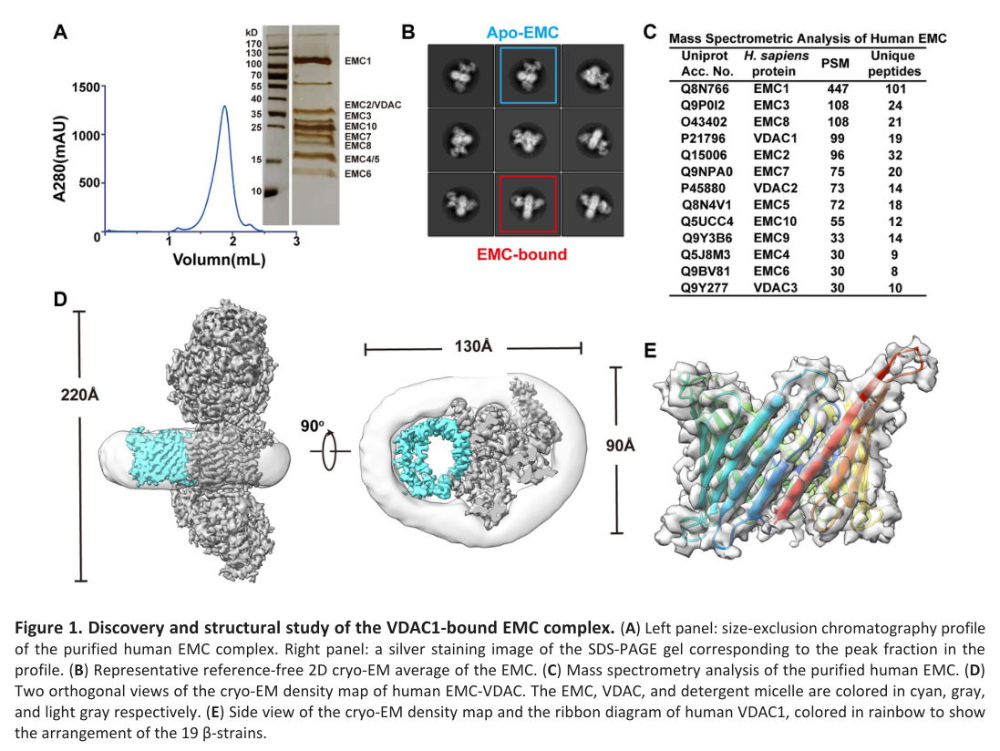

## Question

# Gene Research for Functional Annotation

## ⚠️ CRITICAL: Gene/Protein Identification Context

**BEFORE YOU BEGIN RESEARCH:** You MUST verify you are researching the CORRECT gene/protein. Gene symbols can be ambiguous, especially for less well-characterized genes from non-model organisms.

### Target Gene/Protein Identity (from UniProt):
- **UniProt Accession:** Q8N4V1
- **Protein Description:** RecName: Full=ER membrane protein complex subunit 5 {ECO:0000305|PubMed:29242231}; AltName: Full=Membrane magnesium transporter 1 {ECO:0000312|HGNC:HGNC:28100}; AltName: Full=Transmembrane protein 32 {ECO:0000312|HGNC:HGNC:28100};
- **Gene Information:** Name=MMGT1 {ECO:0000312|HGNC:HGNC:28100}; Synonyms=EMC5 {ECO:0000303|PubMed:29242231}, TMEM32 {ECO:0000312|HGNC:HGNC:28100};
- **Organism (full):** Homo sapiens (Human).
- **Protein Family:** Belongs to the membrane magnesium transporter (TC 1.A.67)
- **Key Domains:** MMgT. (IPR018937); MMgT (PF10270)

### MANDATORY VERIFICATION STEPS:

1. **Check if the gene symbol "MMGT1" matches the protein description above**
2. **Verify the organism is correct:** Homo sapiens (Human).
3. **Check if protein family/domains align with what you find in literature**
4. **If you find literature for a DIFFERENT gene with the same or similar symbol, STOP**

### If Gene Symbol is Ambiguous or You Cannot Find Relevant Literature:

**DO NOT PROCEED WITH RESEARCH ON A DIFFERENT GENE.** Instead:
- State clearly: "The gene symbol 'MMGT1' is ambiguous or literature is limited for this specific protein"
- Explain what you found (e.g., "Found extensive literature on a different gene with the same symbol in a different organism")
- Describe the protein based ONLY on the UniProt information provided above
- Suggest that the protein function can be inferred from domain/family information

### Research Target:

Please provide a comprehensive research report on the gene **MMGT1** (gene ID: MMGT1, UniProt: Q8N4V1) in human.

The research report should be a detailed narrative explaining the function, biological processes, and localization of the gene product. Citations should be given for all claims.

You should prioritize authoritative reviews and primary scientific literature when conducting research. You can supplement
this with annotations you find in gene/protein databases, but these can be outdated or inaccurate.

We are specifically interested in the primary function of the gene - for enzymes, what reaction is catalyzed, and what is the substrate specificity? For transporters, what is the substrate? For structural proteins or adapters, what is the broader structural role? For signaling molecules, what is the role in the pathway.

We are interested in where in or outside the cell the gene product carries out its function.

We are also interested in the signaling or biochemical pathways in which the gene functions. We are less interested in broad pleiotropic effects, except where these elucidate the precise role.

Include evidence where possible. We are interested in both experimental evidence as well as inference from structure, evolution, or bioinformatic analysis. Precise studies should be prioritized over high-throughput, where available.

## Output

Question: You are an expert researcher providing comprehensive, well-cited information.

Provide detailed information focusing on:
1. Key concepts and definitions with current understanding
2. Recent developments and latest research (prioritize 2023-2024 sources)
3. Current applications and real-world implementations
4. Expert opinions and analysis from authoritative sources
5. Relevant statistics and data from recent studies

Format as a comprehensive research report with proper citations. Include URLs and publication dates where available.
Always prioritize recent, authoritative sources and provide specific citations for all major claims.

# Gene Research for Functional Annotation

## ⚠️ CRITICAL: Gene/Protein Identification Context

**BEFORE YOU BEGIN RESEARCH:** You MUST verify you are researching the CORRECT gene/protein. Gene symbols can be ambiguous, especially for less well-characterized genes from non-model organisms.

### Target Gene/Protein Identity (from UniProt):
- **UniProt Accession:** Q8N4V1
- **Protein Description:** RecName: Full=ER membrane protein complex subunit 5 {ECO:0000305|PubMed:29242231}; AltName: Full=Membrane magnesium transporter 1 {ECO:0000312|HGNC:HGNC:28100}; AltName: Full=Transmembrane protein 32 {ECO:0000312|HGNC:HGNC:28100};
- **Gene Information:** Name=MMGT1 {ECO:0000312|HGNC:HGNC:28100}; Synonyms=EMC5 {ECO:0000303|PubMed:29242231}, TMEM32 {ECO:0000312|HGNC:HGNC:28100};
- **Organism (full):** Homo sapiens (Human).
- **Protein Family:** Belongs to the membrane magnesium transporter (TC 1.A.67)
- **Key Domains:** MMgT. (IPR018937); MMgT (PF10270)

### MANDATORY VERIFICATION STEPS:

1. **Check if the gene symbol "MMGT1" matches the protein description above**
2. **Verify the organism is correct:** Homo sapiens (Human).
3. **Check if protein family/domains align with what you find in literature**
4. **If you find literature for a DIFFERENT gene with the same or similar symbol, STOP**

### If Gene Symbol is Ambiguous or You Cannot Find Relevant Literature:

**DO NOT PROCEED WITH RESEARCH ON A DIFFERENT GENE.** Instead:
- State clearly: "The gene symbol 'MMGT1' is ambiguous or literature is limited for this specific protein"
- Explain what you found (e.g., "Found extensive literature on a different gene with the same symbol in a different organism")
- Describe the protein based ONLY on the UniProt information provided above
- Suggest that the protein function can be inferred from domain/family information

### Research Target:

Please provide a comprehensive research report on the gene **MMGT1** (gene ID: MMGT1, UniProt: Q8N4V1) in human.

The research report should be a detailed narrative explaining the function, biological processes, and localization of the gene product. Citations should be given for all claims.

You should prioritize authoritative reviews and primary scientific literature when conducting research. You can supplement
this with annotations you find in gene/protein databases, but these can be outdated or inaccurate.

We are specifically interested in the primary function of the gene - for enzymes, what reaction is catalyzed, and what is the substrate specificity? For transporters, what is the substrate? For structural proteins or adapters, what is the broader structural role? For signaling molecules, what is the role in the pathway.

We are interested in where in or outside the cell the gene product carries out its function.

We are also interested in the signaling or biochemical pathways in which the gene functions. We are less interested in broad pleiotropic effects, except where these elucidate the precise role.

Include evidence where possible. We are interested in both experimental evidence as well as inference from structure, evolution, or bioinformatic analysis. Precise studies should be prioritized over high-throughput, where available.

## Research Report: Functional Annotation of Human **MMGT1** (UniProt **Q8N4V1**) / **EMC5** / **TMEM32**

### Executive summary
Human **MMGT1 (Q8N4V1)** is best supported as **EMC5**, a **core integral-membrane subunit of the endoplasmic reticulum (ER) membrane protein complex (EMC)** that participates in **membrane protein biogenesis**, rather than as a well-established standalone magnesium transporter. Multiple authoritative sources explicitly equate **MMGT1 = EMC5** and place it in the ER-resident EMC complex. (rother2021signalpeptidasecomplex pages 1-2, chitwood2019theroleof pages 2-4)

Recent (2023–2024) structural and mechanistic work has substantially refined the **current understanding of EMC function**—including **charge-based selectivity and topology enforcement** (Pleiner 2023), **post-translational insertion of C-terminal transmembrane domains (TMDs) to “rectify” multipass topology** (Wu 2024), and high-resolution **cryo-EM structures of human EMC** (Li 2024). Although MMGT1’s historical name suggests Mg2+ transport, critical reviews conclude that **direct functional evidence for MMgT/MMGT1 as a Mg2+ transporter remains limited**, and alternative functions are plausible. (schaffers2018theriseand pages 1-2, chitwood2019theroleof pages 4-6)

### Verification of gene/protein identity (critical disambiguation)
The target protein identity is consistent across the retrieved literature:

* **MMGT1 is explicitly equated with EMC5** in a Zika virus host-factor context (“MMGT1 = EMC5”), placing it within EMC. (Rother & Naumann, 2021; publication month April 2021; URL in citation) (rother2021signalpeptidasecomplex pages 1-2)
* An authoritative EMC review enumerates EMC subunits and lists **“EMC5  MMGT1  15 kDa”**, indicating that MMGT1 is the canonical name used for EMC subunit 5 in humans. (Chitwood & Hegde, 2019; May 2019; https://doi.org/10.1016/j.tcb.2019.01.007) (chitwood2019theroleof pages 2-4)

No evidence in the retrieved corpus suggested a different human gene/protein being conflated with MMGT1 for UniProt Q8N4V1.

### 1) Key concepts and definitions (current understanding)

#### 1.1 The ER membrane protein complex (EMC)
The **EMC** is an abundant, conserved, **ER-resident multi-subunit complex** involved in membrane protein biogenesis, including acting as a **transmembrane-domain insertase** and more broadly supporting client folding/assembly. (chitwood2019theroleof pages 1-2, chitwood2019theroleof pages 6-8)

A key conceptual framework is that EMC lowers barriers for insertion/topogenesis of challenging TMDs (e.g., lower hydrophobicity or problematic sequence features), complementing the Sec61 translocon and other insertases. (chitwood2019theroleof pages 6-8)

#### 1.2 MMGT1/EMC5 as a “core” EMC subunit
Knockdown/knockout experiments in mammalian cells suggest that loss of **EMC5 (MMGT1)** strongly impairs integrity of remaining subunits, supporting that EMC5 is part of the **core structural/functional scaffold** of EMC. (chitwood2019theroleof pages 2-4)

#### 1.3 Insertase vs “magnesium transporter” nomenclature
While MMGT1’s alternative name (“membrane magnesium transporter 1”) implies ion transport, critical review literature argues that for **MMgT/MMGT1**, **functional evidence for Mg2+ transport is limited** and that **other functions have been suggested**. (Schäffers et al., 2018; first published Feb 7 2018; https://doi.org/10.1152/ajprenal.00634.2017) (schaffers2018theriseand pages 1-2)

In parallel, EMC-focused literature notes that a reported Mg2+ transport phenotype upon EMC5 overexpression may be **unrelated** to EMC’s core insertase role. (chitwood2019theroleof pages 4-6)

### 2) Recent developments and latest research (prioritizing 2023–2024)

#### 2.1 EMC selectivity filter enforces correct targeting and topology (2023)
Pleiner et al. (J Cell Biol, 2023; May 2023; https://doi.org/10.1083/jcb.202212007) describe a mechanistic **selectivity filter** at the EMC hydrophilic vestibule that uses **charge repulsion** to:

* reduce misinsertion of mitochondrial tail-anchored proteins into the ER, and
* enforce correct topology ("positive-inside" rule) for a subset of multipass substrates.

This work used **mutagenesis, site-specific crosslinking, and split-GFP insertion reporters** to track insertion outcomes and mechanistically connect EMC structure to client discrimination. (pleiner2023aselectivityfilter pages 1-2, pleiner2023aselectivityfilter pages 10-11)

Although this study focuses strongly on EMC3 residues controlling vestibule charge, the mechanistic implications apply to EMC as a whole and therefore contextualize EMC5 as a core membrane-subunit component of an insertase/selectivity machine. (pleiner2023aselectivityfilter pages 1-2)

#### 2.2 EMC-mediated post-translational insertion “rectifies” multipass topology (2024 issue; published online 2023)
Wu et al. (Nature Structural & Molecular Biology; published online **Nov 13, 2023**; in **January 2024** issue; https://doi.org/10.1038/s41594-023-01120-6) report that TMDs near the carboxyl terminus of mammalian multipass proteins can be inserted **post-translationally by EMC**, with **site-specific crosslinking** showing proximity of a pre-translocated C-terminal tail to EMC’s cytosol-facing hydrophilic vestibule.

Key quantitative statement: the authors propose that this sequential co-translational + post-translational mechanism may apply to **~250** diverse multipass proteins. (wu2024emcrectifiesthe pages 1-2)

This strengthens the view that EMC (and by extension EMC5/MMGT1 as a core subunit) is critical for **topology completion and quality control evasion** for a sizable membrane-protein subset. (wu2024emcrectifiesthe pages 1-2)

#### 2.3 Structural biology of human EMC and EMC5-enabled purification (2024)
Li et al. (Aging (Albany NY), 2024; published **Mar 15, 2024**; https://doi.org/10.18632/aging.205660) report cryo-EM structures of human EMC in apo and VDAC-bound states at **3.47 Å** and **3.32 Å**, respectively. (li2024structuralinsightsinto pages 1-3)

Critically for MMGT1/EMC5 annotation and real-world implementation, Li et al. purified endogenous human EMC using a **two-step affinity strategy** with a **3×FLAG tag on EMC2 and a Twin-Strep tag on EMC5**, followed by SEC, indicating EMC5 is an experimentally tractable handle for isolating native EMC. (li2024structuralinsightsinto pages 1-3)

The paper further emphasizes two transmembrane cavities—**hydrophilic vestibule** and **lipid-filled hydrophobic groove**—and identifies a **gating plug** segment (from EMC3) in the vestibule, supporting a regulatory mechanism for client insertion activity. (li2024structuralinsightsinto pages 1-3)

**Visual evidence:** EMC architecture and the EMC5-tag purification approach are depicted in Li et al.’s figure panels retrieved here. (li2024structuralinsightsinto media 7677c970, li2024structuralinsightsinto media 0611078d, li2024structuralinsightsinto media bf66669f, li2024structuralinsightsinto media 34b7fb19)

#### 2.4 EMC as a chaperone/holdase for ion channel assembly (2023)
Chen et al. (Nature, 2023; published in final form July 2023; https://doi.org/10.1038/s41586-023-06175-5) provide cryo-EM structures of a large complex containing **human CaV1.2–CaVβ3 bound to EMC**, describing EMC “TM” and “Cyto” docks that remodel a client channel and facilitate handoff to CaVα2δ, supporting an EMC “holdase” role in channel biogenesis/assembly. (chen2023emcchaperone–cavstructure pages 1-3)

While this does not isolate EMC5’s unique biochemical action, it provides a high-authority example of EMC’s **client-chaperone** function consistent with the broad membrane-protein biogenesis framework in which EMC5 is a core membrane component. (chen2023emcchaperone–cavstructure pages 1-3, klose2025theemcacts pages 1-2)

### 3) Current applications and real-world implementations

#### 3.1 EMC5 as an experimental handle for native EMC purification and structural biology
In practice, EMC5 tagging is used to obtain native EMC for cryo-EM: Li et al. explicitly used **Twin-Strep–tagged EMC5** (with EMC2 3×FLAG) to purify endogenous EMC, enabling near-atomic resolution structure determination. (li2024structuralinsightsinto pages 1-3, li2024structuralinsightsinto media 7677c970)

This establishes a real-world implementation: **EMC5 is a workable affinity handle** for isolating intact EMC, useful for structural biology, interaction mapping, and reconstitution experiments.

#### 3.2 EMC pathway as a mechanistic target to modulate membrane protein biogenesis
Mechanistic insights into EMC selectivity and topology control suggest potential applications in:

* **improving membrane protein expression/biogenesis** in model systems, and
* understanding **pathogenic dependence** on ER insertion/assembly pathways (e.g., viral multipass proteins).

These are applications of the **EMC system** rather than EMC5 alone, but EMC5’s “core” role implies it is a required component to manipulate EMC function. (pleiner2023aselectivityfilter pages 1-2, chitwood2019theroleof pages 2-4)

### 4) Expert opinions and analysis from authoritative sources

#### 4.1 Authoritative synthesis: MMGT1/EMC5 is core to an insertase complex
Chitwood & Hegde (Trends Cell Biol, 2019) provide a high-authority synthesis that:

* places EMC as a multi-subunit ER complex with multiple membrane subunits and a client insertion role, and
* identifies EMC5/MMGT1 among core subunits whose knockdown disrupts complex integrity.

They also discuss that a reported Mg2+ transport phenotype linked to EMC5 overexpression could be **unrelated** to EMC’s core insertase function, reflecting caution in attributing magnesium transport as the primary function. (chitwood2019theroleof pages 4-6, chitwood2019theroleof pages 2-4)

#### 4.2 Critical evaluation of Mg2+ transporter claims
Schäffers et al. (Am J Physiol Renal Physiol, 2018) emphasize that many proposed Mg2+ transporters were nominated by indirect evidence and that for **MMgT/MMGT1**, **functional evidence is limited** and additional characterization is needed before strong transporter claims. (schaffers2018theriseand pages 1-2)

### 5) Relevant statistics and data from recent studies

#### 5.1 Structural data (2024)
* **Cryo-EM resolution**: apo human EMC **3.47 Å**; VDAC-bound EMC **3.32 Å**. (Li et al., published Mar 15 2024) (li2024structuralinsightsinto pages 1-3)
* **Purification**: endogenous EMC purified from Expi293F cells using **3×FLAG-EMC2** and **Twin-Strep-EMC5**. (li2024structuralinsightsinto pages 1-3)

#### 5.2 Scope estimate of EMC-dependent topology rectification
* Wu et al. estimate the sequential insertion mechanism may apply to **~250 multipass proteins**. (published online Nov 13 2023; NSMB 2024 issue) (wu2024emcrectifiesthe pages 1-2)

#### 5.3 Host-pathogen data: MMGT1 in macrophage control of *M. tuberculosis* persistence (2023)
Kalam et al. (Cell Host & Microbe, June 2023; https://doi.org/10.1016/j.chom.2023.05.009) provide quantitative experimental parameters and outcomes tying MMGT1 to infection phenotypes:

* Infection model: THP-1 macrophages infected with TR-Mtb at **MOI 0.5:1** (4 h inoculation) and sorted at **96 h**. (kalam2023identificationofhost pages 25-30)
* Distribution of phenotypic subsets among infected cells: **~46% AR** and **~4% SNR** (of the RFP+ infected population). (kalam2023identificationofhost pages 25-30)
* Statistical reporting: validation experiments used **two sgRNAs per gene**, **3 independent experiments**, mean ± SD; volcano plot cutoffs **p<0.05**; unpaired t-tests with significance annotated (★★ p<0.01, ★★★ p<0.001). (kalam2023identificationofhost pages 25-30)
* Lipid droplet readouts: **Lipidspot 488** staining with confocal imaging and FACS at **96 h post-infection**. (kalam2023identificationofhost pages 25-30, kalam2023identificationofhost pages 30-35)
* Perturbations: INH condition **1 µg/ml** (2×MIC) for 24 h before plating; nevanimibe (ATR101) **100 nM** and DGAT2 inhibitor **100 nM**. (kalam2023identificationofhost pages 30-35)

These results provide strong evidence that MMGT1 impacts macrophage lipid droplet biology during infection; however, the mechanistic link to EMC insertase function vs Mg2+ transport is not resolved by the excerpts retrieved here. (kalam2023identificationofhost pages 25-30, kalam2023identificationofhost pages 30-35)

---

### Evidence synthesis: primary molecular function and localization of MMGT1 (Q8N4V1)

#### Primary supported function
Across authoritative synthesis and recent mechanistic literature, the **primary supported molecular role** of MMGT1 is as **EMC5**, a structural component of **EMC**, which acts as an ER membrane insertase/chaperone for specific membrane proteins (tail-anchored and multipass client TMDs) and supports correct topogenesis. (chitwood2019theroleof pages 4-6, chitwood2019theroleof pages 6-8, pleiner2023aselectivityfilter pages 1-2, wu2024emcrectifiesthe pages 1-2)

#### Substrate specificity (what is “transported” or handled)
The most direct “substrate” concept supported here is **transmembrane helices/domains** of client proteins (including low-hydrophobicity TA proteins; and terminal TMDs of multipass proteins requiring topology completion). (pleiner2023aselectivityfilter pages 1-2, wu2024emcrectifiesthe pages 1-2, chitwood2019theroleof pages 6-8)

By contrast, **Mg2+** as a transported substrate remains **insufficiently supported** by high-confidence functional assays in the retrieved evidence; multiple expert reviews advise caution. (schaffers2018theriseand pages 1-2, chitwood2019theroleof pages 4-6)

#### Cellular compartment and topology
MMGT1/EMC5 localizes to the **ER membrane** as an integral membrane subunit of EMC. (rother2021signalpeptidasecomplex pages 1-2, chitwood2019theroleof pages 2-4, li2024structuralinsightsinto pages 1-3)

Structural work on human EMC indicates a **tripartite organization** (luminal/membrane/cytosolic modules) and transmembrane cavities relevant to insertion, with EMC5 being used in purification and mapped within the membrane module in structural figures. (li2024structuralinsightsinto pages 1-3, li2024structuralinsightsinto media 7677c970)

### Disease/pathophysiology and pathway contexts (supported by retrieved sources)

* **Viral infection/host factors:** Host-factor studies identify EMC subunits (including MMGT1=EMC5) as relevant to viruses that require ER biogenesis of multipass viral proteins (e.g., Zika/DENV contexts described). (rother2021signalpeptidasecomplex pages 1-2, chitwood2019theroleof pages 2-4)
* **Host-pathogen lipid droplet axis in TB:** MMGT1 deficiency in macrophages promotes *M. tuberculosis* persistence and lipid droplet accumulation, and pharmacologic targeting of TAG synthesis reduces droplet formation and persistence in this model. (kalam2023identificationofhost pages 1-3, kalam2023identificationofhost pages 25-30, kalam2023identificationofhost pages 30-35)

---

## Summary table of functional annotation
| Claim/Concept | Current understanding (1-2 sentences) | Key evidence/assay type | Key sources (include year, journal) | URL |
|---|---|---|---|---|
| Identity / synonyms | Human **MMGT1** (UniProt **Q8N4V1**) is the same protein widely referred to in the literature as **EMC5** and also as **TMEM32**. Reviews and primary papers explicitly identify EMC5/MMGT1 as a small (~15 kDa) subunit of the ER membrane protein complex (EMC), not a separate unrelated protein. (rother2021signalpeptidasecomplex pages 1-2, chitwood2019theroleof pages 2-4) | Complex annotation, purification/proteomics, review synthesis of EMC subunits | Chitwood & Hegde, **2019**, *Trends in Cell Biology*; Rother & Naumann, **2021**, *Virus Research* | https://doi.org/10.1016/j.tcb.2019.01.007 ; https://doi.org/10.1016/j.virusres.2021.198338 |
| Localization: ER membrane; EMC complex | MMGT1/EMC5 is an **integral ER membrane** protein and one of the membrane-embedded EMC subunits. Mammalian EMC is an abundant ER-resident multi-subunit complex whose membrane subunits collectively form the transmembrane region involved in client handling. (rother2021signalpeptidasecomplex pages 1-2, binnian2023translationaltuningpreemptively pages 27-31, chitwood2019theroleof pages 2-4) | Subcellular complex purification, topology prediction, cryo-EM structural mapping | Chitwood & Hegde, **2019**, *Trends in Cell Biology*; Li et al., **2024**, *Aging (Albany NY)* | https://doi.org/10.1016/j.tcb.2019.01.007 ; https://doi.org/10.18632/aging.205660 |
| Role in EMC stability | EMC5 is considered a **core EMC subunit**: individual depletion/knockout of EMC5 strongly disrupts integrity of the remaining complex, and CRISPR knockout can cause near-complete loss of other EMC subunits. This indicates MMGT1/EMC5 is structurally required for stable EMC assembly rather than being a peripheral accessory factor. (chitwood2019theroleof pages 2-4, chitwood2019theroleof pages 4-6) | Knockdown/CRISPR knockout with assessment of other subunits and complex integrity | Chitwood & Hegde, **2019**, *Trends in Cell Biology* | https://doi.org/10.1016/j.tcb.2019.01.007 |
| Role in membrane protein insertion / topogenesis | The strongest current functional assignment for MMGT1 is **as part of EMC**, a membrane-protein insertase/chaperone system that mediates insertion or topogenesis of low-hydrophobicity tail-anchored proteins and selected transmembrane domains of multipass proteins. EMC loss causes reduced client maturation, ER retention, topology defects, and altered expression of multipass membrane proteins; these phenotypes are attributed to the EMC machinery in which EMC5 is a core membrane subunit. (chitwood2019theroleof pages 4-6, chitwood2019theroleof pages 6-8, pleiner2023aselectivityfilter pages 1-2, wu2024emcrectifiesthe pages 1-2) | In vitro liposome reconstitution, cell-free microsome assays, split-GFP insertion assays, crosslinking, client maturation/localization phenotypes | Chitwood & Hegde, **2019**, *Trends in Cell Biology*; Pleiner et al., **2023**, *Journal of Cell Biology*; Wu et al., **2024**, *Nature Structural & Molecular Biology* | https://doi.org/10.1016/j.tcb.2019.01.007 ; https://doi.org/10.1083/jcb.202212007 ; https://doi.org/10.1038/s41594-023-01120-6 |
| Structural features: hydrophilic vestibule; relation to EMC3/6 cavity; tagging/purification via EMC5 | Structural studies place EMC5 in the **membrane module** of EMC, contributing with EMC1/3/6 to a membrane cavity or lipid-filled region adjacent to the hydrophilic vestibule used for client insertion/topology control. Human EMC has also been purified through **tagged EMC5** (for example, Twin-Strep/FLAG strategies), showing EMC5 is experimentally tractable as a stable core handle for native EMC purification. (klose2025theemcacts pages 1-2, li2024structuralinsightsinto pages 1-3, li2024structuralinsightsinto media 7677c970) | Cryo-EM, native complex purification, tagged endogenous EMC5 purification schemes | Li et al., **2024**, *Aging (Albany NY)*; Klose et al., **2025**, *Nature Communications* | https://doi.org/10.18632/aging.205660 ; https://doi.org/10.1038/s41467-025-62109-x |
| Relation to viral infection | MMGT1/EMC5 has been recovered in host-factor studies as part of the **EMC dependency** of flaviviruses and other viruses that require ER biogenesis of viral multi-pass membrane proteins. The evidence supports an **indirect role via EMC-mediated membrane protein biogenesis**, not a virus-specific activity intrinsic to EMC5 alone. (rother2021signalpeptidasecomplex pages 1-2, chitwood2019theroleof pages 2-4) | CRISPR or RNAi host-factor screens; infection phenotypes linked to EMC disruption | Rother & Naumann, **2021**, *Virus Research*; Chitwood & Hegde, **2019**, *Trends in Cell Biology* | https://doi.org/10.1016/j.virusres.2021.198338 ; https://doi.org/10.1016/j.tcb.2019.01.007 |
| Relation to *Mycobacterium tuberculosis* persistence and lipid droplets | A 2023 CRISPR-screen study prioritized MMGT1 for follow-up and found that **MMGT1-deficient macrophages** promoted an *M. tuberculosis* switch toward persistence, with upregulation of lipid metabolism genes and increased lipid droplets; triacylglycerol synthesis inhibition reduced both droplet formation and persistence. This is a real host-pathogen phenotype linked to MMGT1, but the study does **not** by itself prove whether the underlying mechanism is magnesium transport, EMC function, or another MMGT1-dependent pathway. (kalam2023identificationofhost pages 1-3, kalam2023identificationofhost pages 25-30) | Genome-wide CRISPR screen, CFU time courses, RNA-seq/GSEA, qPCR, confocal imaging, FACS lipid-droplet quantification | Kalam et al., **2023**, *Cell Host & Microbe* | https://doi.org/10.1016/j.chom.2023.05.009 |
| Magnesium transport evidence and caveats | MMGT1 was originally named a **membrane magnesium transporter**, but current evidence is mixed and weaker than the EMC evidence. Authoritative review literature explicitly states that for **MMgT/MMGT1**, functional evidence for bona fide Mg2+ transport is limited and alternative functions have been suggested; EMC-focused reviews note that reported Mg2+ transport upon overexpression may be unrelated to EMC’s core biogenesis role. (chitwood2019theroleof pages 4-6, schaffers2018theriseand pages 1-2) | Critical review of transporter literature; comparison of direct transport evidence versus alternative cell-biological roles | Schäffers et al., **2018**, *American Journal of Physiology-Renal Physiology*; Chitwood & Hegde, **2019**, *Trends in Cell Biology* | https://doi.org/10.1152/ajprenal.00634.2017 ; https://doi.org/10.1016/j.tcb.2019.01.007 |

*Table: This table summarizes the best-supported functional annotation for human MMGT1/EMC5/TMEM32, emphasizing evidence that it is a core ER membrane subunit of the EMC complex involved in membrane protein biogenesis. It also highlights newer disease/infection-related findings and the important caveat that direct magnesium-transport evidence remains limited.*

---

## Limitations of this report (evidence gaps)
1. The retrieved evidence base strongly supports **EMC5/EMC biology**, but contains limited direct MMGT1-specific biochemical evidence distinguishing whether MMGT1 has an independent Mg2+ transport role in vivo. The most authoritative sources explicitly caution that Mg2+ transport evidence for MMgT/MMGT1 is limited. (schaffers2018theriseand pages 1-2, chitwood2019theroleof pages 4-6)
2. Several mechanistic papers define EMC’s insertase/chaperone mechanism without isolating EMC5’s unique residues or standalone activity; thus, EMC5 is annotated primarily as a **core structural/functional component** rather than a catalytically independent enzyme/transporter based on the current retrieved corpus. (pleiner2023aselectivityfilter pages 1-2, wu2024emcrectifiesthe pages 1-2, li2024structuralinsightsinto pages 1-3)

References

1. (rother2021signalpeptidasecomplex pages 1-2): Marion Rother and Michael Naumann. Signal peptidase complex subunit 1 is an essential zika virus host factor in placental trophoblasts. Apr 2021. URL: https://doi.org/10.1016/j.virusres.2021.198338, doi:10.1016/j.virusres.2021.198338. This article has 4 citations and is from a peer-reviewed journal.

2. (chitwood2019theroleof pages 2-4): Patrick J. Chitwood and Ramanujan S. Hegde. The role of emc during membrane protein biogenesis. Trends in cell biology, 29 5:371-384, May 2019. URL: https://doi.org/10.1016/j.tcb.2019.01.007, doi:10.1016/j.tcb.2019.01.007. This article has 97 citations and is from a domain leading peer-reviewed journal.

3. (schaffers2018theriseand pages 1-2): Olivier J. M. Schäffers, Joost G. J. Hoenderop, René J. M. Bindels, and Jeroen H. F. de Baaij. The rise and fall of novel renal magnesium transporters. American journal of physiology. Renal physiology, 314 6:F1027-F1033, Jun 2018. URL: https://doi.org/10.1152/ajprenal.00634.2017, doi:10.1152/ajprenal.00634.2017. This article has 66 citations.

4. (chitwood2019theroleof pages 4-6): Patrick J. Chitwood and Ramanujan S. Hegde. The role of emc during membrane protein biogenesis. Trends in cell biology, 29 5:371-384, May 2019. URL: https://doi.org/10.1016/j.tcb.2019.01.007, doi:10.1016/j.tcb.2019.01.007. This article has 97 citations and is from a domain leading peer-reviewed journal.

5. (chitwood2019theroleof pages 1-2): Patrick J. Chitwood and Ramanujan S. Hegde. The role of emc during membrane protein biogenesis. Trends in cell biology, 29 5:371-384, May 2019. URL: https://doi.org/10.1016/j.tcb.2019.01.007, doi:10.1016/j.tcb.2019.01.007. This article has 97 citations and is from a domain leading peer-reviewed journal.

6. (chitwood2019theroleof pages 6-8): Patrick J. Chitwood and Ramanujan S. Hegde. The role of emc during membrane protein biogenesis. Trends in cell biology, 29 5:371-384, May 2019. URL: https://doi.org/10.1016/j.tcb.2019.01.007, doi:10.1016/j.tcb.2019.01.007. This article has 97 citations and is from a domain leading peer-reviewed journal.

7. (pleiner2023aselectivityfilter pages 1-2): Tino Pleiner, Masami Hazu, Giovani Pinton Tomaleri, Vy N. Nguyen, Kurt Januszyk, and Rebecca M. Voorhees. A selectivity filter in the er membrane protein complex limits protein misinsertion at the er. The Journal of Cell Biology, May 2023. URL: https://doi.org/10.1083/jcb.202212007, doi:10.1083/jcb.202212007. This article has 28 citations.

8. (pleiner2023aselectivityfilter pages 10-11): Tino Pleiner, Masami Hazu, Giovani Pinton Tomaleri, Vy N. Nguyen, Kurt Januszyk, and Rebecca M. Voorhees. A selectivity filter in the er membrane protein complex limits protein misinsertion at the er. The Journal of Cell Biology, May 2023. URL: https://doi.org/10.1083/jcb.202212007, doi:10.1083/jcb.202212007. This article has 28 citations.

9. (wu2024emcrectifiesthe pages 1-2): Haoxi Wu, Luka Smalinskaitė, and Ramanujan S. Hegde. Emc rectifies the topology of multipass membrane proteins. Nature Structural & Molecular Biology, 31:32-41, Nov 2024. URL: https://doi.org/10.1038/s41594-023-01120-6, doi:10.1038/s41594-023-01120-6. This article has 41 citations and is from a highest quality peer-reviewed journal.

10. (li2024structuralinsightsinto pages 1-3): Mingyue Li, Chunli Zhang, Yuntao Xu, Shaobai Li, Chenhui Huang, Jian Wu, and Ming Lei. Structural insights into human emc and its interaction with vdac. Aging (Albany NY), 16:5501-5525, Mar 2024. URL: https://doi.org/10.18632/aging.205660, doi:10.18632/aging.205660. This article has 6 citations.

11. (li2024structuralinsightsinto media 7677c970): Mingyue Li, Chunli Zhang, Yuntao Xu, Shaobai Li, Chenhui Huang, Jian Wu, and Ming Lei. Structural insights into human emc and its interaction with vdac. Aging (Albany NY), 16:5501-5525, Mar 2024. URL: https://doi.org/10.18632/aging.205660, doi:10.18632/aging.205660. This article has 6 citations.

12. (li2024structuralinsightsinto media 0611078d): Mingyue Li, Chunli Zhang, Yuntao Xu, Shaobai Li, Chenhui Huang, Jian Wu, and Ming Lei. Structural insights into human emc and its interaction with vdac. Aging (Albany NY), 16:5501-5525, Mar 2024. URL: https://doi.org/10.18632/aging.205660, doi:10.18632/aging.205660. This article has 6 citations.

13. (li2024structuralinsightsinto media bf66669f): Mingyue Li, Chunli Zhang, Yuntao Xu, Shaobai Li, Chenhui Huang, Jian Wu, and Ming Lei. Structural insights into human emc and its interaction with vdac. Aging (Albany NY), 16:5501-5525, Mar 2024. URL: https://doi.org/10.18632/aging.205660, doi:10.18632/aging.205660. This article has 6 citations.

14. (li2024structuralinsightsinto media 34b7fb19): Mingyue Li, Chunli Zhang, Yuntao Xu, Shaobai Li, Chenhui Huang, Jian Wu, and Ming Lei. Structural insights into human emc and its interaction with vdac. Aging (Albany NY), 16:5501-5525, Mar 2024. URL: https://doi.org/10.18632/aging.205660, doi:10.18632/aging.205660. This article has 6 citations.

15. (chen2023emcchaperone–cavstructure pages 1-3): Zhou Chen, Abhisek Mondal, Fayal Abderemane-Ali, Seil Jang, Sangeeta Niranjan, José L. Montaño, Balyn W. Zaro, and Daniel L. Minor. Emc chaperone–cav structure reveals an ion channel assembly intermediate. Nature, 619:410-419, May 2023. URL: https://doi.org/10.1038/s41586-023-06175-5, doi:10.1038/s41586-023-06175-5. This article has 77 citations and is from a highest quality peer-reviewed journal.

16. (klose2025theemcacts pages 1-2): Carolin J Klose, Kevin M Meighen-Berger, M. Kulke, Marina Parr, Barbara Steigenberger, Martin Zacharias, Dmitrij Frishman, and Matthias Feige. The emc acts as a chaperone for membrane proteins. Nature Communications, Aug 2025. URL: https://doi.org/10.1038/s41467-025-62109-x, doi:10.1038/s41467-025-62109-x. This article has 6 citations and is from a highest quality peer-reviewed journal.

17. (kalam2023identificationofhost pages 25-30): Haroon Kalam, Chih-Hung Chou, Motohiko Kadoki, Daniel B. Graham, Jacques Deguine, Deborah T. Hung, and Ramnik J. Xavier. Identification of host regulators of mycobacterium tuberculosis phenotypes uncovers a role for the mmgt1-gpr156 lipid droplet axis in persistence. Cell Host &amp; Microbe, 31:978-992.e5, Jun 2023. URL: https://doi.org/10.1016/j.chom.2023.05.009, doi:10.1016/j.chom.2023.05.009. This article has 6 citations and is from a highest quality peer-reviewed journal.

18. (kalam2023identificationofhost pages 30-35): Haroon Kalam, Chih-Hung Chou, Motohiko Kadoki, Daniel B. Graham, Jacques Deguine, Deborah T. Hung, and Ramnik J. Xavier. Identification of host regulators of mycobacterium tuberculosis phenotypes uncovers a role for the mmgt1-gpr156 lipid droplet axis in persistence. Cell Host &amp; Microbe, 31:978-992.e5, Jun 2023. URL: https://doi.org/10.1016/j.chom.2023.05.009, doi:10.1016/j.chom.2023.05.009. This article has 6 citations and is from a highest quality peer-reviewed journal.

19. (kalam2023identificationofhost pages 1-3): Haroon Kalam, Chih-Hung Chou, Motohiko Kadoki, Daniel B. Graham, Jacques Deguine, Deborah T. Hung, and Ramnik J. Xavier. Identification of host regulators of mycobacterium tuberculosis phenotypes uncovers a role for the mmgt1-gpr156 lipid droplet axis in persistence. Cell Host &amp; Microbe, 31:978-992.e5, Jun 2023. URL: https://doi.org/10.1016/j.chom.2023.05.009, doi:10.1016/j.chom.2023.05.009. This article has 6 citations and is from a highest quality peer-reviewed journal.

20. (binnian2023translationaltuningpreemptively pages 27-31): Translational tuning pre-emptively modulates protein folding and secretory pathway defects This article has 0 citations.

## Artifacts

- [Edison artifact artifact-00](MMGT1-deep-research-falcon_artifacts/artifact-00.md)

## Citations

1. rother2021signalpeptidasecomplex pages 1-2
2. chitwood2019theroleof pages 2-4
3. chitwood2019theroleof pages 6-8
4. schaffers2018theriseand pages 1-2
5. chitwood2019theroleof pages 4-6
6. pleiner2023aselectivityfilter pages 1-2
7. wu2024emcrectifiesthe pages 1-2
8. li2024structuralinsightsinto pages 1-3
9. kalam2023identificationofhost pages 25-30
10. kalam2023identificationofhost pages 30-35
11. chitwood2019theroleof pages 1-2
12. pleiner2023aselectivityfilter pages 10-11
13. klose2025theemcacts pages 1-2
14. kalam2023identificationofhost pages 1-3
15. binnian2023translationaltuningpreemptively pages 27-31
16. https://doi.org/10.1016/j.tcb.2019.01.007
17. https://doi.org/10.1152/ajprenal.00634.2017
18. https://doi.org/10.1083/jcb.202212007
19. https://doi.org/10.1038/s41594-023-01120-6
20. https://doi.org/10.18632/aging.205660
21. https://doi.org/10.1038/s41586-023-06175-5
22. https://doi.org/10.1016/j.chom.2023.05.009
23. https://doi.org/10.1016/j.virusres.2021.198338
24. https://doi.org/10.1038/s41467-025-62109-x
25. https://doi.org/10.1016/j.virusres.2021.198338,
26. https://doi.org/10.1016/j.tcb.2019.01.007,
27. https://doi.org/10.1152/ajprenal.00634.2017,
28. https://doi.org/10.1083/jcb.202212007,
29. https://doi.org/10.1038/s41594-023-01120-6,
30. https://doi.org/10.18632/aging.205660,
31. https://doi.org/10.1038/s41586-023-06175-5,
32. https://doi.org/10.1038/s41467-025-62109-x,
33. https://doi.org/10.1016/j.chom.2023.05.009,