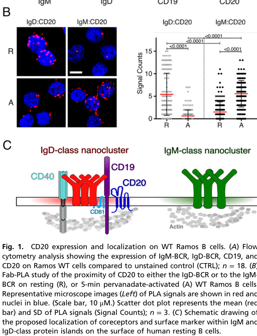

## Question

# Gene Research for Functional Annotation

## ⚠️ CRITICAL: Gene/Protein Identification Context

**BEFORE YOU BEGIN RESEARCH:** You MUST verify you are researching the CORRECT gene/protein. Gene symbols can be ambiguous, especially for less well-characterized genes from non-model organisms.

### Target Gene/Protein Identity (from UniProt):
- **UniProt Accession:** P11836
- **Protein Description:** RecName: Full=B-lymphocyte antigen CD20; AltName: Full=B-lymphocyte surface antigen B1; AltName: Full=Bp35; AltName: Full=Leukocyte surface antigen Leu-16; AltName: Full=Membrane-spanning 4-domains subfamily A member 1; AltName: CD_antigen=CD20;
- **Gene Information:** Name=MS4A1; Synonyms=CD20;
- **Organism (full):** Homo sapiens (Human).
- **Protein Family:** Belongs to the MS4A family. .
- **Key Domains:** CD20-like_TM. (IPR007237); MS4A. (IPR030417); CD20 (PF04103)

### MANDATORY VERIFICATION STEPS:

1. **Check if the gene symbol "MS4A1" matches the protein description above**
2. **Verify the organism is correct:** Homo sapiens (Human).
3. **Check if protein family/domains align with what you find in literature**
4. **If you find literature for a DIFFERENT gene with the same or similar symbol, STOP**

### If Gene Symbol is Ambiguous or You Cannot Find Relevant Literature:

**DO NOT PROCEED WITH RESEARCH ON A DIFFERENT GENE.** Instead:
- State clearly: "The gene symbol 'MS4A1' is ambiguous or literature is limited for this specific protein"
- Explain what you found (e.g., "Found extensive literature on a different gene with the same symbol in a different organism")
- Describe the protein based ONLY on the UniProt information provided above
- Suggest that the protein function can be inferred from domain/family information

### Research Target:

Please provide a comprehensive research report on the gene **MS4A1** (gene ID: MS4A1, UniProt: P11836) in human.

The research report should be a detailed narrative explaining the function, biological processes, and localization of the gene product. Citations should be given for all claims.

You should prioritize authoritative reviews and primary scientific literature when conducting research. You can supplement
this with annotations you find in gene/protein databases, but these can be outdated or inaccurate.

We are specifically interested in the primary function of the gene - for enzymes, what reaction is catalyzed, and what is the substrate specificity? For transporters, what is the substrate? For structural proteins or adapters, what is the broader structural role? For signaling molecules, what is the role in the pathway.

We are interested in where in or outside the cell the gene product carries out its function.

We are also interested in the signaling or biochemical pathways in which the gene functions. We are less interested in broad pleiotropic effects, except where these elucidate the precise role.

Include evidence where possible. We are interested in both experimental evidence as well as inference from structure, evolution, or bioinformatic analysis. Precise studies should be prioritized over high-throughput, where available.

## Output

Question: You are an expert researcher providing comprehensive, well-cited information.

Provide detailed information focusing on:
1. Key concepts and definitions with current understanding
2. Recent developments and latest research (prioritize 2023-2024 sources)
3. Current applications and real-world implementations
4. Expert opinions and analysis from authoritative sources
5. Relevant statistics and data from recent studies

Format as a comprehensive research report with proper citations. Include URLs and publication dates where available.
Always prioritize recent, authoritative sources and provide specific citations for all major claims.

# Gene Research for Functional Annotation

## ⚠️ CRITICAL: Gene/Protein Identification Context

**BEFORE YOU BEGIN RESEARCH:** You MUST verify you are researching the CORRECT gene/protein. Gene symbols can be ambiguous, especially for less well-characterized genes from non-model organisms.

### Target Gene/Protein Identity (from UniProt):
- **UniProt Accession:** P11836
- **Protein Description:** RecName: Full=B-lymphocyte antigen CD20; AltName: Full=B-lymphocyte surface antigen B1; AltName: Full=Bp35; AltName: Full=Leukocyte surface antigen Leu-16; AltName: Full=Membrane-spanning 4-domains subfamily A member 1; AltName: CD_antigen=CD20;
- **Gene Information:** Name=MS4A1; Synonyms=CD20;
- **Organism (full):** Homo sapiens (Human).
- **Protein Family:** Belongs to the MS4A family. .
- **Key Domains:** CD20-like_TM. (IPR007237); MS4A. (IPR030417); CD20 (PF04103)

### MANDATORY VERIFICATION STEPS:

1. **Check if the gene symbol "MS4A1" matches the protein description above**
2. **Verify the organism is correct:** Homo sapiens (Human).
3. **Check if protein family/domains align with what you find in literature**
4. **If you find literature for a DIFFERENT gene with the same or similar symbol, STOP**

### If Gene Symbol is Ambiguous or You Cannot Find Relevant Literature:

**DO NOT PROCEED WITH RESEARCH ON A DIFFERENT GENE.** Instead:
- State clearly: "The gene symbol 'MS4A1' is ambiguous or literature is limited for this specific protein"
- Explain what you found (e.g., "Found extensive literature on a different gene with the same symbol in a different organism")
- Describe the protein based ONLY on the UniProt information provided above
- Suggest that the protein function can be inferred from domain/family information

### Research Target:

Please provide a comprehensive research report on the gene **MS4A1** (gene ID: MS4A1, UniProt: P11836) in human.

The research report should be a detailed narrative explaining the function, biological processes, and localization of the gene product. Citations should be given for all claims.

You should prioritize authoritative reviews and primary scientific literature when conducting research. You can supplement
this with annotations you find in gene/protein databases, but these can be outdated or inaccurate.

We are specifically interested in the primary function of the gene - for enzymes, what reaction is catalyzed, and what is the substrate specificity? For transporters, what is the substrate? For structural proteins or adapters, what is the broader structural role? For signaling molecules, what is the role in the pathway.

We are interested in where in or outside the cell the gene product carries out its function.

We are also interested in the signaling or biochemical pathways in which the gene functions. We are less interested in broad pleiotropic effects, except where these elucidate the precise role.

Include evidence where possible. We are interested in both experimental evidence as well as inference from structure, evolution, or bioinformatic analysis. Precise studies should be prioritized over high-throughput, where available.

# Human MS4A1 (CD20): functional annotation and research report

## Identity and principal function

**Identity verified.** The requested UniProt accession **P11836** is specified as human (*Homo sapiens*) **MS4A1**, encoding B-lymphocyte antigen **CD20** (also called B1). Independent structural and immunological studies identify MS4A1 as CD20 and place it in the membrane-spanning four-domain **MS4A family**, consistent with the supplied CD20/MS4A domain assignments. This report does not substitute evidence about the related genes *MS4A2* or *MS4A4A*, or about mouse *Ms4a1*, for evidence about the human protein. (kuijpers2010cd20deficiencyin pages 1-2, pavlasova2020theregulationand pages 2-4, luo2024ms4asuperfamilymolecules pages 2-3, rouge2020structureofcd20 pages 1-2)

**Best-supported primary annotation:** CD20 is an oligomeric **B-cell plasma-membrane organizer**. In resting human B cells, it helps maintain an IgD-class B-cell-receptor (BCR) membrane nanodomain and regulates access of the IgM-BCR to the CD19 coreceptor. Evidence also implicates it in organizing the CD70-containing B–T-cell immunological synapse and in cytoskeletal responses. It has **no established physiological ligand, enzymatic reaction, or transported substrate**; the longstanding description of CD20 as an autonomous calcium channel remains unproven. (klasener2021cd20asa pages 1-2, dabkowska2024advancementsincancer pages 2-4, arp2025cd70recruitmentto pages 1-2, kozlova2020cd20isdispensable pages 1-2)

## Structure, expression and site of action

CD20 is a roughly **33–37-kDa, nonglycosylated, four-pass membrane protein**. Its amino and carboxyl termini face the **cytosol**; two loops face the **extracellular space**, making the larger loop accessible to therapeutic antibodies. Cryo-electron microscopy of human CD20 revealed a tightly packed homodimer rather than an obvious inter-subunit ion-conducting pore. The closely related *MS4A2* product is instead an IgE-receptor subunit, not another name for CD20. [Rougé *et al.*, *Science*, March 2020, https://doi.org/10.1126/science.aaz9356; Pavlasova and Mraz, *Haematologica*, June 2020, https://doi.org/10.3324/haematol.2019.243543.] (pavlasova2020theregulationand pages 2-4, rouge2020structureofcd20 pages 1-2, rouge2020structureofcd20 pages 3-4)

The established physiological site of action is the **B-cell surface**, especially receptor-rich nanodomains of circulating and lymphoid-tissue B cells. Expression begins during B-cell development, persists through mature and memory B-cell stages, and is generally lost during terminal differentiation into antibody-secreting plasma cells; it is therefore **not** a universal marker of every B-cell-lineage stage. Human CD20 is also detectable on a smaller T-cell population, but its function there is less defined. [Dąbkowska *et al.*, *Frontiers in Immunology*, 4 April 2024, https://doi.org/10.3389/fimmu.2024.1363102; Arp *et al.*, *PNAS*, 15 April 2025, https://doi.org/10.1073/pnas.2414002122.] (arp2025cd70recruitmentto pages 1-2, dabkowska2024advancementsincancer pages 1-2, essen2024theoriginof pages 1-2, dabkowska2024advancementsincancer pages 2-4)

## Molecular mechanism and pathways

**BCR membrane organization.** In resting human B cells, proximity assays place CD20 with the **IgD-BCR, CD19, CD81 and CD40** in an IgD-associated membrane compartment, relatively apart from the IgM-BCR. After activation, CD20 shifts toward IgM-associated receptors. In the human Ramos B-cell model, CRISPR disruption of *MS4A1* increased IgM-BCR–CD19 proximity and **SYK and AKT phosphorylation**, followed by transient activation and changes in surface-receptor expression. Conditional re-expression of CD20 restored the resting phenotype, supporting a causal membrane-organizing role rather than simple correlation. Rituximab also provoked receptor rearrangement in Ramos cells and primary naïve human B cells. Figure 1 of the primary study documents the resting IgD-associated organization and its activation-dependent change. [Kläsener *et al.*, *PNAS*, 9 February 2021, https://doi.org/10.1073/pnas.2021342118.] (klasener2021cd20asa pages 2-4, klasener2021cd20asa pages 1-2, klasener2021cd20asa media 44e47e7f)

**Cytoskeletal coupling.** More recent experiments using Ramos cells and human peripheral-blood B cells identify a candidate physical mechanism: **PKCδ** phosphorylates serines in CD20’s cytosolic tails, enabling **14-3-3 adaptor** binding and association with **GEF-H1 and microtubules**. Antibody engagement shifts the associated machinery toward **RhoA–ROCK1** and actomyosin contractility. This supports the concept of CD20 as a connector between the receptor-rich membrane and intracellular cytoskeleton; whether every interaction operates identically in all B-cell subsets remains to be established. [Kläsener *et al.*, *The EMBO Journal*, April 2026, https://doi.org/10.1038/s44318-026-00781-5.] (klasener2026cd20tailsinteract pages 1-3)

**B–T-cell costimulation.** Immunoprecipitation–mass spectrometry, proximity ligation and microscopy identify **CD70** as a CD20-associated protein on human B cells. CD20 loss reduced CD70 accumulation at B–T-cell contacts, impaired immunological-synapse formation, and diminished T-cell activation and cytokine release. Importantly, the authors reproduced synapse defects after editing **primary human B cells** and in B cells from a **CD20-deficient patient**. CD70 on the B-cell side engages **CD27 on the T-cell side**; CD20 facilitates the membrane organization of this pathway rather than serving as CD27’s ligand. [Arp *et al.*, *PNAS*, 15 April 2025, https://doi.org/10.1073/pnas.2414002122.] (arp2025cd70recruitmentto pages 1-2)

**Chemokine-driven movement.** In a distinct study, *MS4A1* deletion across **five human malignant B-cell lines** left measured BCR signaling and calcium flux intact but impaired actin polymerization, adhesion, migration toward **CXCL12/SDF-1α, CCL19 and CCL21**, chemokine-induced **PYK2 activation**, and subsequent in-vivo homing. These experiments support a context-dependent cytoskeletal role, while their malignant-cell models cannot alone establish its magnitude in normal B cells. [Kozlova *et al.*, *PLOS ONE*, 25 March 2020, https://doi.org/10.1371/journal.pone.0229170.] (kozlova2020cd20isdispensable pages 1-2)

The following evidence summary distinguishes established human mechanisms from interpretations that remain uncertain.

| Annotation | Best experimental evidence | Evidence strength and limits |
|---|---|---|
| **Four-pass extracellular antibody target and homodimer** | Cryo-EM of full-length human CD20 showed four transmembrane helices per protomer and a compact, double-barrel homodimer. Rituximab recognizes a composite extracellular epitope spanning the large extracellular loops of both protomers. **Rougé et al., 2020**, DOI: [10.1126/science.aaz9356](https://doi.org/10.1126/science.aaz9356); **Kumar et al., 2020**, DOI: [10.1126/science.abb8008](https://doi.org/10.1126/science.abb8008). (rouge2020structureofcd20 pages 1-2, rouge2020structureofcd20 pages 3-4, kumar2020bindingmechanismsof pages 2-3) | **Strong structural evidence.** Purified, antibody-bound protein establishes topology, dimerization, and therapeutic epitopes, but does not by itself define CD20’s physiological function. |
| **Organizer of the resting IgD-BCR nanocluster and restraint of IgM–CD19 signaling** | In human Ramos B cells, CD20 was proximal to IgD-BCR at rest and moved toward IgM-BCR after activation. CRISPR deletion disrupted receptor organization, increased IgM–CD19 proximity and SYK/PI3K–AKT signaling, and caused transient activation; conditional CD20 re-expression restored surface markers and the resting phenotype. **Kläsener et al., 2021**, DOI: [10.1073/pnas.2021342118](https://doi.org/10.1073/pnas.2021342118). A later study found that PKCδ-phosphorylated cytosolic CD20 tails recruit 14-3-3/GEF-H1 and microtubules to support this nanocluster, whereas anti-CD20 engagement promotes a RhoA–ROCK1/actomyosin switch. **Kläsener et al., 2026**, DOI: [10.1038/s44318-026-00781-5](https://doi.org/10.1038/s44318-026-00781-5). (klasener2021cd20asa pages 2-4, klasener2021cd20asa pages 1-2, klasener2026cd20tailsinteract pages 1-3) | **Strong mechanistic evidence, predominantly from Ramos cells with supporting primary human B cells.** Interpretation is tempered by a five-cell-line CRISPR study that found unchanged BCR signaling and calcium flux, indicating context-, timing-, or model-dependent phenotypes. (kozlova2020cd20isdispensable pages 1-2) |
| **CD70 stabilization and recruitment to the B–T immunological synapse** | Immunoprecipitation–mass spectrometry, proximity ligation, and high-resolution microscopy identified CD70 as a CD20-associated membrane protein. CD20 deletion impaired CD70 recruitment, B–T synapse formation, T-cell activation, and cytokine secretion; findings were validated in edited primary human B cells and B cells from a CD20-deficient patient. **Arp et al., 2025**, DOI: [10.1073/pnas.2414002122](https://doi.org/10.1073/pnas.2414002122). (arp2025cd70recruitmentto pages 1-2, arp2025cd70recruitmentto pages 10-10) | **Strong human cellular and patient-supported evidence.** It establishes a membrane-organizing role in CD70–CD27 costimulation, although the direct-binding interface and importance across all B-cell subsets remain incompletely defined. |
| **PYK2–actin control of chemokine-driven adhesion and migration** | Across five human malignant B-cell lines, CRISPR loss of CD20 impaired actin polymerization, adhesion, migration toward CXCL12/SDF-1α, CCL19, and CCL21, chemokine-triggered PYK2 activation, and in-vivo homing. **Kozlova et al., 2020**, DOI: [10.1371/journal.pone.0229170](https://doi.org/10.1371/journal.pone.0229170). (kozlova2020cd20isdispensable pages 1-2) | **Moderate evidence.** The replicated malignant-cell-line phenotype supports a cytoskeletal or scaffolding role, but normal primary B-cell physiology was not directly established; the same study found no effect on BCR signaling, calcium flux, survival, or proliferation. |
| **Direct Ca²⁺ channel or pore** | Early ectopic-expression and antibody-crosslinking experiments associated CD20 with increased Ca²⁺ conductance. However, CD20-deficient patient B cells retained intact BCR-induced Ca²⁺ responses, five independently edited malignant B-cell lines showed unchanged calcium flux, and the cryo-EM dimer lacks an evident inter-protomer conduction pathway. **Kuijpers et al., 2010**, DOI: [10.1172/JCI40231](https://doi.org/10.1172/JCI40231); **Kozlova et al., 2020**, DOI above; **Rougé et al., 2020**, DOI above. (pavlasova2020theregulationand pages 10-11, kozlova2020cd20isdispensable pages 1-2, rouge2020structureofcd20 pages 3-4, kuijpers2010cd20deficiencyin pages 2-4) | **Unresolved and unsuitable as the primary annotation.** Current evidence better supports regulation of calcium-dependent signaling through BCR-associated membrane organization than an autonomous CD20 ion pore. |
| **Olfactory receptor for predator odors** | Mouse *Ms4a1* was detected in a sparse olfactory sensory-neuron subset; knockout mice showed impaired avoidance of predator-derived nitrogenous heterocycles. **Jiang et al., 2024**, DOI: [10.1038/s41467-024-47698-3](https://doi.org/10.1038/s41467-024-47698-3). (jiang2024cd20ms4a1isa pages 1-2, jiang2024cd20ms4a1isa pages 6-7) | **Compelling mouse-specific evidence, but not verified in humans.** It must not be assigned as a function of human MS4A1/P11836 without human olfactory-expression and functional evidence. |

*Table: Evidence-strength summary for proposed functions of human MS4A1/CD20, separating well-supported membrane-organizing roles from unresolved calcium-channel claims and mouse-only olfactory findings.*

### Interpreting the calcium-channel hypothesis

Early experiments linked CD20 expression or antibody crosslinking to calcium conductance. **That does not demonstrate that purified CD20 itself forms a selective Ca²⁺ pore.** BCR-triggered calcium responses remained intact in cells from a CD20-deficient human patient and in the five-line CRISPR study, while the resolved dimer interface provides no evident inter-protomer conduction path. The 2021 nanodomain study instead found altered receptor organization and signaling after acute loss, illustrating why effects may differ with **cell type, assay and time after knockout**. The defensible annotation is **regulation of B-cell signaling, including calcium-associated responses**, not a confirmed standalone calcium transporter. [Kuijpers *et al.*, *Journal of Clinical Investigation*, January 2010, https://doi.org/10.1172/JCI40231; Kozlova *et al.*, 2020; Rougé *et al.*, 2020; Kläsener *et al.*, 2021.] (pavlasova2020theregulationand pages 10-11, kozlova2020cd20isdispensable pages 1-2, rouge2020structureofcd20 pages 3-4, kuijpers2010cd20deficiencyin pages 2-4, klasener2021cd20asa pages 1-2)

## Human genetic evidence and biological consequences

A patient with a **biallelic *MS4A1* splice-site defect** lacked detectable surface CD20 yet developed circulating B cells, showing that CD20 is **not required for the initial production of B cells**. She had persistent low IgG, markedly impaired pneumococcal-polysaccharide antibody responses, and fewer class-switched memory B cells: **<2%**, versus **7.1% ± 2.71%** in the reported age-matched comparison group. Her B cells could proliferate and mount measured BCR-induced calcium responses, but produced little or no IgG under tested stimulation conditions. This single-patient genetic observation provides strong evidence for a role in **effective humoral responses and B-cell maturation**, without proving that every downstream defect is caused by one direct biochemical activity of CD20. [Kuijpers *et al.*, *Journal of Clinical Investigation*, January 2010, https://doi.org/10.1172/JCI40231.] (kuijpers2010cd20deficiencyin pages 1-2, kuijpers2010cd20deficiencyin pages 2-4)

## Recent findings and their limits

**2023–2024 research** consolidated the view that CD20 participates in membrane complexes rather than acting as a conventional enzyme or a receptor with a known soluble ligand. A 2024 investigation of human CD20-positive T cells addressed an important annotation caveat: approximately **3–5% of peripheral T cells** have been reported as CD20-positive. Although T cells can acquire CD20 from B cells through **trogocytosis**, the investigators also detected *MS4A1* transcripts in sorted T cells and evidence of endogenous CD20 production. CD20 staining should therefore not automatically be interpreted as proof of B-cell identity—or, conversely, as proof of endogenous T-cell expression in every individual cell. [von Essen *et al.*, *Frontiers in Immunology*, 22 November 2024, https://doi.org/10.3389/fimmu.2024.1487530; Luo *et al.*, *Frontiers in Immunology*, December 2024, https://doi.org/10.3389/fimmu.2024.1481494.] (essen2024theoriginof pages 1-2, essen2024theoriginof pages 3-6, luo2024ms4asuperfamilymolecules pages 2-3)

A **2024 mouse** study established that *Ms4a1* in a subset of olfactory sensory neurons detects predator-derived odor compounds and contributes to avoidance behavior. This is an intriguing function of the **mouse ortholog**, **not established evidence that human P11836 is a predator-odor receptor**. [Jiang *et al.*, *Nature Communications*, April 2024, https://doi.org/10.1038/s41467-024-47698-3.] (jiang2024cd20ms4a1isa pages 1-2, jiang2024cd20ms4a1isa pages 6-7)

Subsequent **2025–2026** work has sharpened the human membrane-organizer model. Besides the CD70 synapse and cytoskeletal studies above, in-situ single-protein imaging showed that type-I **rituximab** organizes CD20 into planar, higher-order **approximately 50–300-nm** co-clusters, whereas type-II **obinutuzumab** produces more limited clustering. This is a measurement of **antibody-induced CD20 organization**, not evidence that untreated CD20 normally forms clusters of that size. [Pachmayr *et al.*, *Nature Communications*, July 2025, https://doi.org/10.1038/s41467-025-61893-w.] (pachmayr2025resolvingthestructural pages 1-2, pachmayr2025resolvingthestructural pages 3-4)

## Clinical implementation: targeting the protein, not replacing its function

CD20’s accessible extracellular loops and prevalent expression on mature B cells make it a major **therapeutic antigen**. Rituximab and other anti-CD20 monoclonal antibodies are used in B-cell malignancy; CD20-directed B-cell depletion is also used in inflammatory disease, including multiple sclerosis. Antibody-bound cells can be eliminated through **Fc-effector-cell cytotoxicity or phagocytosis, complement activation, and context-dependent direct cell death**. These are principally **drug-mediated effector mechanisms**, not CD20’s normal physiological activity. Type-I antibodies, including rituximab and ofatumumab, favor CD20 clustering and complement activity; type-II obinutuzumab has different clustering and killing properties. [Dąbkowska *et al.*, 4 April 2024, https://doi.org/10.3389/fimmu.2024.1363102; Kumar *et al.*, *Science*, August 2020, https://doi.org/10.1126/science.abb8008.] (dabkowska2024advancementsincancer pages 1-2, dabkowska2024advancementsincancer pages 5-6, kumar2020bindingmechanismsof pages 1-2, dabkowska2024advancementsincancer pages 2-4)

**Quantitative clinical example.** In the randomized ASCLEPIOS I/II multiple-sclerosis trials, a 2024 analysis of **1,882 participants** found higher rates of no evidence of disease activity over months 0–24 with ofatumumab than with teriflunomide—for example, **37.4% versus 16.6%** in the non-Hispanic White subgroup. The same analysis reported **33.3% versus 3.4%** in the smaller non-Hispanic Black subgroup (**64 participants across treatment groups**), for which the estimate is less precise. A 2023 open-label extension reported an annualized relapse rate of **0.05** in continuously treated patients, but this longer-term observation is not a new randomized head-to-head estimate. [Williams *et al.*, *Neurology*, August 2024, https://doi.org/10.1212/WNL.0000000000209610; Hauser *et al.*, *Multiple Sclerosis*, September 2023, https://doi.org/10.1177/13524585231195346.] (williams2024efficacyofofatumumab pages 1-2, hauser2023efficacyandsafety pages 1-1)

By 2024, **CD20×CD3 bispecific antibodies** such as epcoritamab and glofitamab had entered clinical use for specified relapsed or refractory B-cell lymphomas: they link a CD20-bearing malignant cell to a CD3-bearing T cell, rather than relying on CD20 to transmit a normal B-cell signal. CD20-directed or dual-target **CAR-T approaches** were also under clinical evaluation. Therapeutic challenges include infections or reduced immunoglobulins after B-cell depletion, bispecific-antibody cytokine-release toxicity, and tumors with diminished CD20 antigen expression. [Dąbkowska *et al.*, 4 April 2024, https://doi.org/10.3389/fimmu.2024.1363102.] (dabkowska2024advancementsincancer pages 1-2, dabkowska2024advancementsincancer pages 8-9, dabkowska2024advancementsincancer pages 2-4, dabkowska2024advancementsincancer pages 15-15)

**Conclusion.** For human **MS4A1/P11836**, the most defensible functional annotation is **CD20: a four-pass B-cell surface protein that organizes receptor and costimulatory membrane complexes, modulating resting-state BCR signaling, B–T interaction and cell behavior**. Human genetic loss establishes a contribution to effective antibody responses; direct Ca²⁺ transport and the mouse-specific olfactory role should not be asserted as established primary functions of the human protein. (klasener2021cd20asa pages 1-2, arp2025cd70recruitmentto pages 1-2, kuijpers2010cd20deficiencyin pages 1-2, kozlova2020cd20isdispensable pages 1-2, jiang2024cd20ms4a1isa pages 1-2)

References

1. (kuijpers2010cd20deficiencyin pages 1-2): Taco W. Kuijpers, Richard J. Bende, Paul A. Baars, Annette Grummels, Ingrid A.M. Derks, Koert M. Dolman, Tim Beaumont, Thomas F. Tedder, Carel J.M. van Noesel, Eric Eldering, and René A.W. van Lier. Cd20 deficiency in humans results in impaired t cell-independent antibody responses. The Journal of clinical investigation, 120 1:214-22, Jan 2010. URL: https://doi.org/10.1172/jci40231, doi:10.1172/jci40231. This article has 542 citations.

2. (pavlasova2020theregulationand pages 2-4): Gabriela Pavlasova and Marek Mraz. The regulation and function of cd20: an “enigma” of b-cell biology and targeted therapy. Haematologica, 105:1494-1506, Jun 2020. URL: https://doi.org/10.3324/haematol.2019.243543, doi:10.3324/haematol.2019.243543. This article has 591 citations.

3. (luo2024ms4asuperfamilymolecules pages 2-3): Xuejiao Luo, Bin Luo, Lei Fei, Qinggao Zhang, Xinyu Liang, Yongwen Chen, and Xueqin Zhou. Ms4a superfamily molecules in tumors, alzheimer’s and autoimmune diseases. Frontiers in Immunology, Dec 2024. URL: https://doi.org/10.3389/fimmu.2024.1481494, doi:10.3389/fimmu.2024.1481494. This article has 21 citations and is from a peer-reviewed journal.

4. (rouge2020structureofcd20 pages 1-2): Lionel Rougé, Nancy Chiang, Micah Steffek, Christine Kugel, Tristan I. Croll, Christine Tam, Alberto Estevez, Christopher P. Arthur, Christopher M. Koth, Claudio Ciferri, Edward Kraft, Jian Payandeh, Gerald Nakamura, James T. Koerber, and Alexis Rohou. Structure of cd20 in complex with the therapeutic monoclonal antibody rituximab. Mar 2020. URL: https://doi.org/10.1126/science.aaz9356, doi:10.1126/science.aaz9356. This article has 245 citations and is from a highest quality peer-reviewed journal.

5. (klasener2021cd20asa pages 1-2): Kathrin Kläsener, Julia Jellusova, Geoffroy Andrieux, Ulrich Salzer, Chiara Böhler, Sebastian N. Steiner, Jonas B. Albinus, Marco Cavallari, Beatrix Süß, Reinhard E. Voll, Melanie Boerries, Bernd Wollscheid, and Michael Reth. Cd20 as a gatekeeper of the resting state of human b cells. Proceedings of the National Academy of Sciences, Feb 2021. URL: https://doi.org/10.1073/pnas.2021342118, doi:10.1073/pnas.2021342118. This article has 149 citations and is from a highest quality peer-reviewed journal.

6. (dabkowska2024advancementsincancer pages 2-4): Agnieszka Dabkowska, Krzysztof Domka, and Malgorzata Firczuk. Advancements in cancer immunotherapies targeting cd20: from pioneering monoclonal antibodies to chimeric antigen receptor-modified t cells. Frontiers in Immunology, Apr 2024. URL: https://doi.org/10.3389/fimmu.2024.1363102, doi:10.3389/fimmu.2024.1363102. This article has 64 citations and is from a peer-reviewed journal.

7. (arp2025cd70recruitmentto pages 1-2): Abbey B. Arp, Andrea Abel Gutierrez, Martin ter Beest, Guus A. Franken, Harry Warner, Andrea Rodgers Furones, Angelique N. Kenyon, Franziska Jäger, Alfredo Cabrera-Orefice, Kathrin Kläsener, Sjoerd van Deventer, Lenny Droesen, Vera Marie E. Dunlock, René Classens, Julian Staniek, Jannie Borst, Michael Reth, Ulrich Brandt, Piet Gros, Taco W. Kuijpers, Mirjam H. M. Heemskerk, Marta Rizzi, Laia Querol Cano, and Annemiek B. van Spriel. Cd70 recruitment to the immunological synapse is dependent on cd20 in b cells. Proceedings of the National Academy of Sciences of the United States of America, Apr 2025. URL: https://doi.org/10.1073/pnas.2414002122, doi:10.1073/pnas.2414002122. This article has 6 citations and is from a highest quality peer-reviewed journal.

8. (kozlova2020cd20isdispensable pages 1-2): Veronika Kozlova, Aneta Ledererova, Adriana Ladungova, Helena Peschelova, Pavlina Janovska, Aleksander Slusarczyk, Joanna Domagala, Pavel Kopcil, Viera Vakulova, Jan Oppelt, Vitezslav Bryja, Michael Doubek, Jiri Mayer, Sarka Pospisilova, and Michal Smida. Cd20 is dispensable for b-cell receptor signaling but is required for proper actin polymerization, adhesion and migration of malignant b cells. PLoS ONE, 15:e0229170, Mar 2020. URL: https://doi.org/10.1371/journal.pone.0229170, doi:10.1371/journal.pone.0229170. This article has 35 citations and is from a peer-reviewed journal.

9. (rouge2020structureofcd20 pages 3-4): Lionel Rougé, Nancy Chiang, Micah Steffek, Christine Kugel, Tristan I. Croll, Christine Tam, Alberto Estevez, Christopher P. Arthur, Christopher M. Koth, Claudio Ciferri, Edward Kraft, Jian Payandeh, Gerald Nakamura, James T. Koerber, and Alexis Rohou. Structure of cd20 in complex with the therapeutic monoclonal antibody rituximab. Mar 2020. URL: https://doi.org/10.1126/science.aaz9356, doi:10.1126/science.aaz9356. This article has 245 citations and is from a highest quality peer-reviewed journal.

10. (dabkowska2024advancementsincancer pages 1-2): Agnieszka Dabkowska, Krzysztof Domka, and Malgorzata Firczuk. Advancements in cancer immunotherapies targeting cd20: from pioneering monoclonal antibodies to chimeric antigen receptor-modified t cells. Frontiers in Immunology, Apr 2024. URL: https://doi.org/10.3389/fimmu.2024.1363102, doi:10.3389/fimmu.2024.1363102. This article has 64 citations and is from a peer-reviewed journal.

11. (essen2024theoriginof pages 1-2): Marina Rode von Essen, Lisbeth Egelykke Stolpe, Helle Bach Søndergaard, and Finn Sellebjerg. The origin of human cd20+ t cells: a stolen identity? Frontiers in Immunology, Nov 2024. URL: https://doi.org/10.3389/fimmu.2024.1487530, doi:10.3389/fimmu.2024.1487530. This article has 5 citations and is from a peer-reviewed journal.

12. (klasener2021cd20asa pages 2-4): Kathrin Kläsener, Julia Jellusova, Geoffroy Andrieux, Ulrich Salzer, Chiara Böhler, Sebastian N. Steiner, Jonas B. Albinus, Marco Cavallari, Beatrix Süß, Reinhard E. Voll, Melanie Boerries, Bernd Wollscheid, and Michael Reth. Cd20 as a gatekeeper of the resting state of human b cells. Proceedings of the National Academy of Sciences, Feb 2021. URL: https://doi.org/10.1073/pnas.2021342118, doi:10.1073/pnas.2021342118. This article has 149 citations and is from a highest quality peer-reviewed journal.

13. (klasener2021cd20asa media 44e47e7f): Kathrin Kläsener, Julia Jellusova, Geoffroy Andrieux, Ulrich Salzer, Chiara Böhler, Sebastian N. Steiner, Jonas B. Albinus, Marco Cavallari, Beatrix Süß, Reinhard E. Voll, Melanie Boerries, Bernd Wollscheid, and Michael Reth. Cd20 as a gatekeeper of the resting state of human b cells. Proceedings of the National Academy of Sciences, Feb 2021. URL: https://doi.org/10.1073/pnas.2021342118, doi:10.1073/pnas.2021342118. This article has 149 citations and is from a highest quality peer-reviewed journal.

14. (klasener2026cd20tailsinteract pages 1-3): Kathrin Kläsener, Cindy Eunhee Lee, Julian Bender, Angela Naumann, Lena Reimann, Geoffroy Andrieux, Claudio Mussolino, Nadja Herrmann, Roland Nitschke, Reinhard E Voll, Bettina Warscheid, Klaus Warnatz, and Michael Reth. Cd20 tails interact with the 14-3-3/gef-h1 complex and microtubule network upon pkcδ phosphorylation. The EMBO Journal, 45:3859-3879, Apr 2026. URL: https://doi.org/10.1038/s44318-026-00781-5, doi:10.1038/s44318-026-00781-5. This article has 0 citations.

15. (kumar2020bindingmechanismsof pages 2-3): Anand Kumar, Cyril Planchais, Rémi Fronzes, Hugo Mouquet, and Nicolas Reyes. Binding mechanisms of therapeutic antibodies to human cd20. Science, 369:793-799, Aug 2020. URL: https://doi.org/10.1126/science.abb8008, doi:10.1126/science.abb8008. This article has 169 citations and is from a highest quality peer-reviewed journal.

16. (arp2025cd70recruitmentto pages 10-10): Abbey B. Arp, Andrea Abel Gutierrez, Martin ter Beest, Guus A. Franken, Harry Warner, Andrea Rodgers Furones, Angelique N. Kenyon, Franziska Jäger, Alfredo Cabrera-Orefice, Kathrin Kläsener, Sjoerd van Deventer, Lenny Droesen, Vera Marie E. Dunlock, René Classens, Julian Staniek, Jannie Borst, Michael Reth, Ulrich Brandt, Piet Gros, Taco W. Kuijpers, Mirjam H. M. Heemskerk, Marta Rizzi, Laia Querol Cano, and Annemiek B. van Spriel. Cd70 recruitment to the immunological synapse is dependent on cd20 in b cells. Proceedings of the National Academy of Sciences of the United States of America, Apr 2025. URL: https://doi.org/10.1073/pnas.2414002122, doi:10.1073/pnas.2414002122. This article has 6 citations and is from a highest quality peer-reviewed journal.

17. (pavlasova2020theregulationand pages 10-11): Gabriela Pavlasova and Marek Mraz. The regulation and function of cd20: an “enigma” of b-cell biology and targeted therapy. Haematologica, 105:1494-1506, Jun 2020. URL: https://doi.org/10.3324/haematol.2019.243543, doi:10.3324/haematol.2019.243543. This article has 591 citations.

18. (kuijpers2010cd20deficiencyin pages 2-4): Taco W. Kuijpers, Richard J. Bende, Paul A. Baars, Annette Grummels, Ingrid A.M. Derks, Koert M. Dolman, Tim Beaumont, Thomas F. Tedder, Carel J.M. van Noesel, Eric Eldering, and René A.W. van Lier. Cd20 deficiency in humans results in impaired t cell-independent antibody responses. The Journal of clinical investigation, 120 1:214-22, Jan 2010. URL: https://doi.org/10.1172/jci40231, doi:10.1172/jci40231. This article has 542 citations.

19. (jiang2024cd20ms4a1isa pages 1-2): Hao-Ching Jiang, Sung Jin Park, I-Hao Wang, Daniel M Bear, Alexandra C. Nowlan, and Paul L Greer. Cd20/ms4a1 is a mammalian olfactory receptor expressed in a subset of olfactory sensory neurons that mediates innate avoidance of predators. Nature Communications, Apr 2024. URL: https://doi.org/10.1038/s41467-024-47698-3, doi:10.1038/s41467-024-47698-3. This article has 10 citations and is from a highest quality peer-reviewed journal.

20. (jiang2024cd20ms4a1isa pages 6-7): Hao-Ching Jiang, Sung Jin Park, I-Hao Wang, Daniel M Bear, Alexandra C. Nowlan, and Paul L Greer. Cd20/ms4a1 is a mammalian olfactory receptor expressed in a subset of olfactory sensory neurons that mediates innate avoidance of predators. Nature Communications, Apr 2024. URL: https://doi.org/10.1038/s41467-024-47698-3, doi:10.1038/s41467-024-47698-3. This article has 10 citations and is from a highest quality peer-reviewed journal.

21. (essen2024theoriginof pages 3-6): Marina Rode von Essen, Lisbeth Egelykke Stolpe, Helle Bach Søndergaard, and Finn Sellebjerg. The origin of human cd20+ t cells: a stolen identity? Frontiers in Immunology, Nov 2024. URL: https://doi.org/10.3389/fimmu.2024.1487530, doi:10.3389/fimmu.2024.1487530. This article has 5 citations and is from a peer-reviewed journal.

22. (pachmayr2025resolvingthestructural pages 1-2): Isabelle Pachmayr, Luciano A. Masullo, Susanne C. M. Reinhardt, Jisoo Kwon, Maite Llop, Ondřej Skořepa, Sylvia Herter, Marina Bacac, Christian Klein, and Ralf Jungmann. Resolving the structural basis of therapeutic antibody function in cancer immunotherapy with resi. Nature Communications, Jul 2025. URL: https://doi.org/10.1038/s41467-025-61893-w, doi:10.1038/s41467-025-61893-w. This article has 13 citations and is from a highest quality peer-reviewed journal.

23. (pachmayr2025resolvingthestructural pages 3-4): Isabelle Pachmayr, Luciano A. Masullo, Susanne C. M. Reinhardt, Jisoo Kwon, Maite Llop, Ondřej Skořepa, Sylvia Herter, Marina Bacac, Christian Klein, and Ralf Jungmann. Resolving the structural basis of therapeutic antibody function in cancer immunotherapy with resi. Nature Communications, Jul 2025. URL: https://doi.org/10.1038/s41467-025-61893-w, doi:10.1038/s41467-025-61893-w. This article has 13 citations and is from a highest quality peer-reviewed journal.

24. (dabkowska2024advancementsincancer pages 5-6): Agnieszka Dabkowska, Krzysztof Domka, and Malgorzata Firczuk. Advancements in cancer immunotherapies targeting cd20: from pioneering monoclonal antibodies to chimeric antigen receptor-modified t cells. Frontiers in Immunology, Apr 2024. URL: https://doi.org/10.3389/fimmu.2024.1363102, doi:10.3389/fimmu.2024.1363102. This article has 64 citations and is from a peer-reviewed journal.

25. (kumar2020bindingmechanismsof pages 1-2): Anand Kumar, Cyril Planchais, Rémi Fronzes, Hugo Mouquet, and Nicolas Reyes. Binding mechanisms of therapeutic antibodies to human cd20. Science, 369:793-799, Aug 2020. URL: https://doi.org/10.1126/science.abb8008, doi:10.1126/science.abb8008. This article has 169 citations and is from a highest quality peer-reviewed journal.

26. (williams2024efficacyofofatumumab pages 1-2): Mitzi J. Williams, Lilyana Amezcua, Stanley L. Cohan, Jeffrey A. Cohen, Silvia R. Delgado, Le H. Hua, Elisabeth B. Lucassen, Rebecca S. Piccolo, Chloe R. Koulouris, and James Stankiewicz. Efficacy of ofatumumab and teriflunomide in patients with relapsing ms from racial/ethnic minority groups. Aug 2024. URL: https://doi.org/10.1212/wnl.0000000000209610, doi:10.1212/wnl.0000000000209610. This article has 11 citations and is from a highest quality peer-reviewed journal.

27. (hauser2023efficacyandsafety pages 1-1): Stephen L Hauser, Ronald Zielman, Ayan Das Gupta, Jing Xi, Dee Stoneman, Goeril Karlsson, Derrick Robertson, Jeffrey A Cohen, and Ludwig Kappos. Efficacy and safety of four-year ofatumumab treatment in relapsing multiple sclerosis: the alithios open-label extension. Multiple Sclerosis (Houndmills, Basingstoke, England), 29:1452-1464, Sep 2023. URL: https://doi.org/10.1177/13524585231195346, doi:10.1177/13524585231195346. This article has 76 citations.

28. (dabkowska2024advancementsincancer pages 8-9): Agnieszka Dabkowska, Krzysztof Domka, and Malgorzata Firczuk. Advancements in cancer immunotherapies targeting cd20: from pioneering monoclonal antibodies to chimeric antigen receptor-modified t cells. Frontiers in Immunology, Apr 2024. URL: https://doi.org/10.3389/fimmu.2024.1363102, doi:10.3389/fimmu.2024.1363102. This article has 64 citations and is from a peer-reviewed journal.

29. (dabkowska2024advancementsincancer pages 15-15): Agnieszka Dabkowska, Krzysztof Domka, and Malgorzata Firczuk. Advancements in cancer immunotherapies targeting cd20: from pioneering monoclonal antibodies to chimeric antigen receptor-modified t cells. Frontiers in Immunology, Apr 2024. URL: https://doi.org/10.3389/fimmu.2024.1363102, doi:10.3389/fimmu.2024.1363102. This article has 64 citations and is from a peer-reviewed journal.

## Artifacts

- [Edison artifact artifact-00](MS4A1-deep-research-falcon_artifacts/artifact-00.md)

## Citations

1. pavlasova2020theregulationand pages 2-4
2. dabkowska2024advancementsincancer pages 2-4
3. dabkowska2024advancementsincancer pages 1-2
4. essen2024theoriginof pages 1-2
5. kumar2020bindingmechanismsof pages 2-3
6. pavlasova2020theregulationand pages 10-11
7. essen2024theoriginof pages 3-6
8. pachmayr2025resolvingthestructural pages 1-2
9. pachmayr2025resolvingthestructural pages 3-4
10. dabkowska2024advancementsincancer pages 5-6
11. kumar2020bindingmechanismsof pages 1-2
12. williams2024efficacyofofatumumab pages 1-2
13. hauser2023efficacyandsafety pages 1-1
14. dabkowska2024advancementsincancer pages 8-9
15. dabkowska2024advancementsincancer pages 15-15
16. Rougé *et al.*, *Science*, March 2020, https://doi.org/10.1126/science.aaz9356; Pavlasova and Mraz, *Haematologica*, June 2020, https://doi.org/10.3324/haematol.2019.243543.
17. Dąbkowska *et al.*, *Frontiers in Immunology*, 4 April 2024, https://doi.org/10.3389/fimmu.2024.1363102; Arp *et al.*, *PNAS*, 15 April 2025, https://doi.org/10.1073/pnas.2414002122.
18. Kläsener *et al.*, *PNAS*, 9 February 2021, https://doi.org/10.1073/pnas.2021342118.
19. Kläsener *et al.*, *The EMBO Journal*, April 2026, https://doi.org/10.1038/s44318-026-00781-5.
20. Arp *et al.*, *PNAS*, 15 April 2025, https://doi.org/10.1073/pnas.2414002122.
21. Kozlova *et al.*, *PLOS ONE*, 25 March 2020, https://doi.org/10.1371/journal.pone.0229170.
22. 10.1126/science.aaz9356
23. 10.1126/science.abb8008
24. 10.1073/pnas.2021342118
25. 10.1038/s44318-026-00781-5
26. 10.1073/pnas.2414002122
27. 10.1371/journal.pone.0229170
28. 10.1172/JCI40231
29. 10.1038/s41467-024-47698-3
30. Kuijpers *et al.*, *Journal of Clinical Investigation*, January 2010, https://doi.org/10.1172/JCI40231; Kozlova *et al.*, 2020; Rougé *et al.*, 2020; Kläsener *et al.*, 2021.
31. Kuijpers *et al.*, *Journal of Clinical Investigation*, January 2010, https://doi.org/10.1172/JCI40231.
32. von Essen *et al.*, *Frontiers in Immunology*, 22 November 2024, https://doi.org/10.3389/fimmu.2024.1487530; Luo *et al.*, *Frontiers in Immunology*, December 2024, https://doi.org/10.3389/fimmu.2024.1481494.
33. Jiang *et al.*, *Nature Communications*, April 2024, https://doi.org/10.1038/s41467-024-47698-3.
34. Pachmayr *et al.*, *Nature Communications*, July 2025, https://doi.org/10.1038/s41467-025-61893-w.
35. Dąbkowska *et al.*, 4 April 2024, https://doi.org/10.3389/fimmu.2024.1363102; Kumar *et al.*, *Science*, August 2020, https://doi.org/10.1126/science.abb8008.
36. Williams *et al.*, *Neurology*, August 2024, https://doi.org/10.1212/WNL.0000000000209610; Hauser *et al.*, *Multiple Sclerosis*, September 2023, https://doi.org/10.1177/13524585231195346.
37. Dąbkowska *et al.*, 4 April 2024, https://doi.org/10.3389/fimmu.2024.1363102.
38. https://doi.org/10.1126/science.aaz9356;
39. https://doi.org/10.3324/haematol.2019.243543.]
40. https://doi.org/10.3389/fimmu.2024.1363102;
41. https://doi.org/10.1073/pnas.2414002122.]
42. https://doi.org/10.1073/pnas.2021342118.]
43. https://doi.org/10.1038/s44318-026-00781-5.]
44. https://doi.org/10.1371/journal.pone.0229170.]
45. https://doi.org/10.1126/science.aaz9356
46. https://doi.org/10.1126/science.abb8008
47. https://doi.org/10.1073/pnas.2021342118
48. https://doi.org/10.1038/s44318-026-00781-5
49. https://doi.org/10.1073/pnas.2414002122
50. https://doi.org/10.1371/journal.pone.0229170
51. https://doi.org/10.1172/JCI40231
52. https://doi.org/10.1038/s41467-024-47698-3
53. https://doi.org/10.1172/JCI40231;
54. https://doi.org/10.1172/JCI40231.]
55. https://doi.org/10.3389/fimmu.2024.1487530;
56. https://doi.org/10.3389/fimmu.2024.1481494.]
57. https://doi.org/10.1038/s41467-024-47698-3.]
58. https://doi.org/10.1038/s41467-025-61893-w.]
59. https://doi.org/10.1126/science.abb8008.]
60. https://doi.org/10.1212/WNL.0000000000209610;
61. https://doi.org/10.1177/13524585231195346.]
62. https://doi.org/10.3389/fimmu.2024.1363102.]
63. https://doi.org/10.1172/jci40231,
64. https://doi.org/10.3324/haematol.2019.243543,
65. https://doi.org/10.3389/fimmu.2024.1481494,
66. https://doi.org/10.1126/science.aaz9356,
67. https://doi.org/10.1073/pnas.2021342118,
68. https://doi.org/10.3389/fimmu.2024.1363102,
69. https://doi.org/10.1073/pnas.2414002122,
70. https://doi.org/10.1371/journal.pone.0229170,
71. https://doi.org/10.3389/fimmu.2024.1487530,
72. https://doi.org/10.1038/s44318-026-00781-5,
73. https://doi.org/10.1126/science.abb8008,
74. https://doi.org/10.1038/s41467-024-47698-3,
75. https://doi.org/10.1038/s41467-025-61893-w,
76. https://doi.org/10.1212/wnl.0000000000209610,
77. https://doi.org/10.1177/13524585231195346,