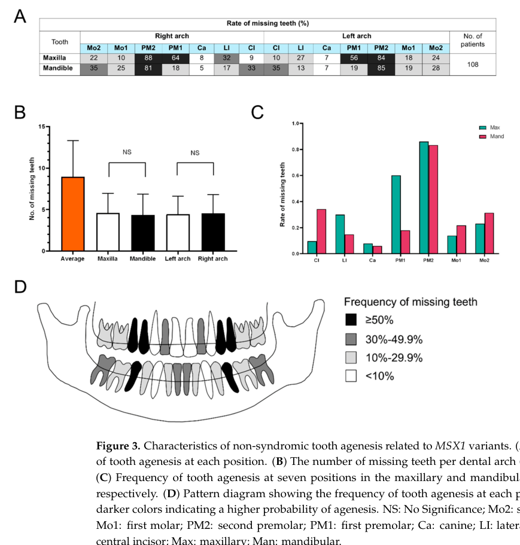

## Question

# Gene Research for Functional Annotation

## ⚠️ CRITICAL: Gene/Protein Identification Context

**BEFORE YOU BEGIN RESEARCH:** You MUST verify you are researching the CORRECT gene/protein. Gene symbols can be ambiguous, especially for less well-characterized genes from non-model organisms.

### Target Gene/Protein Identity (from UniProt):
- **UniProt Accession:** P28360
- **Protein Description:** RecName: Full=Homeobox protein MSX-1 {ECO:0000305}; AltName: Full=Homeobox protein Hox-7; AltName: Full=Msh homeobox 1-like protein;
- **Gene Information:** Name=MSX1 {ECO:0000312|HGNC:HGNC:7391}; Synonyms=HOX7 {ECO:0000303|PubMed:1685479};
- **Organism (full):** Homo sapiens (Human).
- **Protein Family:** Belongs to the Msh homeobox family. .
- **Key Domains:** HD. (IPR001356); HD_metazoa. (IPR020479); Homeobox_CS. (IPR017970); Homeodomain-like_sf. (IPR009057); Msh_Homeobox_Regulators. (IPR050674)

### MANDATORY VERIFICATION STEPS:

1. **Check if the gene symbol "MSX1" matches the protein description above**
2. **Verify the organism is correct:** Homo sapiens (Human).
3. **Check if protein family/domains align with what you find in literature**
4. **If you find literature for a DIFFERENT gene with the same or similar symbol, STOP**

### If Gene Symbol is Ambiguous or You Cannot Find Relevant Literature:

**DO NOT PROCEED WITH RESEARCH ON A DIFFERENT GENE.** Instead:
- State clearly: "The gene symbol 'MSX1' is ambiguous or literature is limited for this specific protein"
- Explain what you found (e.g., "Found extensive literature on a different gene with the same symbol in a different organism")
- Describe the protein based ONLY on the UniProt information provided above
- Suggest that the protein function can be inferred from domain/family information

### Research Target:

Please provide a comprehensive research report on the gene **MSX1** (gene ID: MSX1, UniProt: P28360) in human.

The research report should be a detailed narrative explaining the function, biological processes, and localization of the gene product. Citations should be given for all claims.

You should prioritize authoritative reviews and primary scientific literature when conducting research. You can supplement
this with annotations you find in gene/protein databases, but these can be outdated or inaccurate.

We are specifically interested in the primary function of the gene - for enzymes, what reaction is catalyzed, and what is the substrate specificity? For transporters, what is the substrate? For structural proteins or adapters, what is the broader structural role? For signaling molecules, what is the role in the pathway.

We are interested in where in or outside the cell the gene product carries out its function.

We are also interested in the signaling or biochemical pathways in which the gene functions. We are less interested in broad pleiotropic effects, except where these elucidate the precise role.

Include evidence where possible. We are interested in both experimental evidence as well as inference from structure, evolution, or bioinformatic analysis. Precise studies should be prioritized over high-throughput, where available.

## Output

Question: You are an expert researcher providing comprehensive, well-cited information.

Provide detailed information focusing on:
1. Key concepts and definitions with current understanding
2. Recent developments and latest research (prioritize 2023-2024 sources)
3. Current applications and real-world implementations
4. Expert opinions and analysis from authoritative sources
5. Relevant statistics and data from recent studies

Format as a comprehensive research report with proper citations. Include URLs and publication dates where available.
Always prioritize recent, authoritative sources and provide specific citations for all major claims.

# Gene Research for Functional Annotation

## ⚠️ CRITICAL: Gene/Protein Identification Context

**BEFORE YOU BEGIN RESEARCH:** You MUST verify you are researching the CORRECT gene/protein. Gene symbols can be ambiguous, especially for less well-characterized genes from non-model organisms.

### Target Gene/Protein Identity (from UniProt):
- **UniProt Accession:** P28360
- **Protein Description:** RecName: Full=Homeobox protein MSX-1 {ECO:0000305}; AltName: Full=Homeobox protein Hox-7; AltName: Full=Msh homeobox 1-like protein;
- **Gene Information:** Name=MSX1 {ECO:0000312|HGNC:HGNC:7391}; Synonyms=HOX7 {ECO:0000303|PubMed:1685479};
- **Organism (full):** Homo sapiens (Human).
- **Protein Family:** Belongs to the Msh homeobox family. .
- **Key Domains:** HD. (IPR001356); HD_metazoa. (IPR020479); Homeobox_CS. (IPR017970); Homeodomain-like_sf. (IPR009057); Msh_Homeobox_Regulators. (IPR050674)

### MANDATORY VERIFICATION STEPS:

1. **Check if the gene symbol "MSX1" matches the protein description above**
2. **Verify the organism is correct:** Homo sapiens (Human).
3. **Check if protein family/domains align with what you find in literature**
4. **If you find literature for a DIFFERENT gene with the same or similar symbol, STOP**

### If Gene Symbol is Ambiguous or You Cannot Find Relevant Literature:

**DO NOT PROCEED WITH RESEARCH ON A DIFFERENT GENE.** Instead:
- State clearly: "The gene symbol 'MSX1' is ambiguous or literature is limited for this specific protein"
- Explain what you found (e.g., "Found extensive literature on a different gene with the same symbol in a different organism")
- Describe the protein based ONLY on the UniProt information provided above
- Suggest that the protein function can be inferred from domain/family information

### Research Target:

Please provide a comprehensive research report on the gene **MSX1** (gene ID: MSX1, UniProt: P28360) in human.

The research report should be a detailed narrative explaining the function, biological processes, and localization of the gene product. Citations should be given for all claims.

You should prioritize authoritative reviews and primary scientific literature when conducting research. You can supplement
this with annotations you find in gene/protein databases, but these can be outdated or inaccurate.

We are specifically interested in the primary function of the gene - for enzymes, what reaction is catalyzed, and what is the substrate specificity? For transporters, what is the substrate? For structural proteins or adapters, what is the broader structural role? For signaling molecules, what is the role in the pathway.

We are interested in where in or outside the cell the gene product carries out its function.

We are also interested in the signaling or biochemical pathways in which the gene functions. We are less interested in broad pleiotropic effects, except where these elucidate the precise role.

Include evidence where possible. We are interested in both experimental evidence as well as inference from structure, evolution, or bioinformatic analysis. Precise studies should be prioritized over high-throughput, where available.

# Human MSX1 (UniProt P28360): functional annotation research report

**Identity and principal function.** The target is **human MSX1**, historically called **HOX7**, not its paralog MSX2 or its dental-development partner PAX9. The supplied UniProt accession P28360 identifies the human protein; human genetic studies independently identify MSX1 as a homeobox gene, and biochemical work places its protein in the Msh/Msx homeodomain transcription-factor family. Its primary activity is **regulation of gene transcription**, particularly context-dependent repression and, with appropriate partners, potentiation of gene activation. It does not catalyze a reaction, transport a substrate, or act as a secreted signaling ligand. The DNA-binding homeodomain and protein-interaction surfaces provide a mechanistic explanation for how one nuclear factor can affect several developmental signaling pathways. (ding2024novelmsx1gene pages 1-2, lee2006pias1confersdnabinding pages 1-2, wang2011msx1mutations pages 1-2)

## Molecular action and location

**The site of action is the nucleus of the expressing cell.** Wild-type human MSX1 localized to nuclei in a dental-pulp stem-cell experiment; a familial truncating variant accumulated instead in the cytoplasm. In mouse myoblasts, some Msx1 is specifically retained at the **nuclear periphery**, alongside genes it represses. This is a cell-context-dependent *subnuclear* localization, not evidence that MSX1 is secreted or normally functions outside cells. Human fetal-tooth data place MSX1 expression in developing **dental mesenchyme**; expression in a tissue should not be confused with the protein’s intracellular site of action. (xin2018anovelmutation pages 1-2, lee2006pias1confersdnabinding pages 1-2, wang2011themsx1homeoprotein pages 1-2, shi2024spatiotemporalcelllandscape pages 2-3)

The homeodomain recognizes DNA containing a TAAT core *in vitro*, but promoter-site recognition alone does not determine its targets *in vivo*. Foundational experiments using **mouse Msx1** demonstrated repression of reporters even without recognizable homeodomain-binding sites. Structure–function and purified-protein experiments implicated interaction between the homeodomain’s N-terminal arm and **TATA-binding protein (TBP)**; DNA binding and TBP-mediated repression were experimentally separable. These studies establish a transcriptional mechanism but should not be interpreted as proof that every human MSX1 target is repressed through TBP. (catron1995transcriptionalrepressionby pages 1-2, zhang1996arolefor pages 1-2, zhang1996arolefor pages 5-6)

Additional mouse-cell experiments explain target selectivity. **PIAS1**, unlike the tested Msx2 partner, interacted with Msx1 and promoted its nuclear-periphery retention and selective binding to the *MyoD* core enhancer; that interaction, rather than Msx1 SUMOylation, was needed to repress myogenic genes and inhibit myoblast differentiation. Another study showed Msx1 recruitment of **EZH2-containing Polycomb machinery**, enrichment of the repressive chromatin mark **H3K27me3** at target loci, and redistribution of that mark toward the nuclear periphery in myoblasts and developing mouse limbs. These are experimentally demonstrated mechanisms in those systems, not established universal properties of human dental MSX1. [Lee et al., April 2006](https://doi.org/10.1101/gad.1392006); [Wang et al., September 2011](https://doi.org/10.1016/j.devcel.2011.07.003). (lee2006pias1confersdnabinding pages 1-2, wang2011themsx1homeoprotein pages 1-2)

## The tooth-development signaling circuit

The best-defined developmental role is coordinating **epithelial–mesenchymal signaling as a tooth bud becomes a cap**. Initially, epithelial **BMP4** helps induce *MSX1/Msx1* in neural-crest-derived dental mesenchyme. In **human** embryonic dental mesenchyme and cultured human dental mesenchymal cells, a primary study found BMP4-induced MSX1 expression dependent on phosphorylated **SMAD1/5/8**, but independent of **SMAD4** under its experimental conditions. Thus MSX1 is a BMP-responsive transcriptional factor, not a BMP receptor or a BMP ligand. [Hu et al., February 2022](https://doi.org/10.3389/fphys.2022.823275). (hu2022operationofthe pages 1-2)

Mouse perturbations place Msx1 in a reinforcing mesenchymal **BMP4–Msx1** circuit: loss of Msx1 reduces mesenchymal *Bmp4*, prevents normal mesenchymal condensation, and arrests tooth development around the **bud stage**; provision of BMP4 can bypass aspects of this arrest. Mesenchymal BMP4 also signals back to dental epithelium, supporting the enamel-knot signaling center and expression of genes including *Shh*. PAX9 directly regulates *Msx1* expression and physically cooperates with Msx1 in *Bmp4* promoter assays. Crucially, **Msx1 alone can repress the tested proximal Bmp4 promoter, whereas Msx1 together with PAX9 potentiates PAX9-dependent activation**: describing MSX1 simply as a BMP4 activator or simply as a BMP4 repressor misses this partner dependence. Reducing *Tbx2* dosage partially rescued *Msx1*-null mouse tooth-bud arrest, enamel-knot formation, and mesenchymal *Bmp4* expression, further demonstrating network-dependent regulation. [Ogawa et al., July 2006](https://doi.org/10.1074/jbc.m601543200); [Saadi et al., July 2013](https://doi.org/10.1242/dev.088393). (ogawa2006functionalconsequencesof pages 1-2, saadi2013msx1andtbx2 pages 1-2, wang2011msx1mutations pages 1-2)

**Canonical WNT signaling is a second experimentally important downstream output.** In mice, Msx1 deficiency permits ectopic dental-mesenchymal expression of the secreted WNT antagonist *Dkk2*; genetic reduction of WNT antagonists restores tooth development. In a 2022 study, deleting *Sostdc1* on an *Msx1*-null background rescued maxillary molars in **9/9** mice but mandibular molars in **0/9**. Deleting *Dkk2* rescued maxillary molars in **5/6** and mandibular progression to the cap stage in **1/6**. Removing both antagonists rescued molars in both jaws in **6/6**. These are compelling **mouse genetic-rescue** results, not human treatment outcomes. They establish an Msx1-dependent WNT-regulatory relationship; the experiments do **not** by themselves demonstrate that MSX1 directly binds the *DKK2* promoter. [Lee et al., February 2022](https://doi.org/10.1177/00220345211070583). (lee2022msx1drivestooth pages 1-2, lee2022msx1drivestooth pages 4-5, lee2022msx1drivestooth pages 3-4)

In human dental-pulp stem cells, an MSX1 frameshift identified in an oligodontia family impaired nuclear localization, reduced **ERK phosphorylation**, and reduced odontogenic differentiation and expression of **DSPP** and **BSP** compared with wild-type MSX1 constructs; an ERK inhibitor reproduced aspects of the differentiation defect. This supports a human-cell **MSX1–ERK-associated** mechanism, but overexpression of one truncating allele in cultured cells cannot define the mechanism of all inherited variants or of initial embryonic tooth-bud specification. [Xin et al., August 2018](https://doi.org/10.1186/s13287-018-0965-3). (xin2018anovelmutation pages 1-2)

For a compact comparison of human observations and causal mouse studies, see the evidence table below. (hu2022operationofthe pages 1-2, lee2022msx1drivestooth pages 3-4, shi2024spatiotemporalcelllandscape pages 2-3)

| Function or pathway | Cell compartment and relevant tissue | Key human versus mouse primary evidence | Strength and limitation |
|---|---|---|---|
| **Core function: context-dependent transcriptional repression** through the homeodomain and basal transcription machinery | **Nucleus**; mouse fibroblasts and other cultured cells | Murine Msx1 repressed TATA-containing and TATA-less reporters without requiring cognate DNA sites; its homeodomain N-terminal arm interacted with human TBP. Catron et al., 1995, [DOI](https://doi.org/10.1128/MCB.15.2.861); Zhang et al., 1996, [DOI](https://doi.org/10.1073/pnas.93.5.1764) (catron1995transcriptionalrepressionby pages 1-2, zhang1996arolefor pages 1-2, zhang1996arolefor pages 5-6) | **Direct biochemical and reporter evidence**, mainly from murine Msx1 in reductionist systems. Establishes MSX1 as a nuclear transcription regulator—not an enzyme, transporter, structural protein, or secreted factor. |
| **PIAS1-dependent target selectivity and repression of myogenic differentiation** | Nuclear periphery of mouse myoblasts; *MyoD* and *Myf5* loci | PIAS1 bound Msx1, promoted its peripheral nuclear retention, and enabled selective occupancy of the *MyoD* core enhancer rather than arbitrary TAAT-containing sites; interaction, not SUMOylation, was required for repression. Lee et al., 2006, [DOI](https://doi.org/10.1101/gad.1392006) (lee2006pias1confersdnabinding pages 1-2) | **Strong interaction, localization, occupancy, and functional evidence** in mouse myoblasts. Demonstrates cofactor-dependent specificity and distinguishes Msx1–PIAS1 from Msx2–PIAS interactions; dental relevance remains inferential. |
| **Polycomb or PRC2-mediated chromatin repression** | Nuclear periphery in mouse myoblasts and embryonic limb mesenchyme | Msx1 associated with EZH2-containing Polycomb complexes, enriched H3K27me3 at target loci, and redistributed the repressive mark toward the nuclear periphery. Wang et al., 2011, [DOI](https://doi.org/10.1016/j.devcel.2011.07.003) (wang2011themsx1homeoprotein pages 1-2) | **Strong ChIP, interaction, imaging, differentiation, and in-vivo mouse evidence**. Establishes an epigenetic repression mechanism, but not a universal mechanism at every human MSX1 target. |
| **BMP4 to pSMAD1/5/8 to MSX1 signaling during early human odontogenesis** | Nuclei of neural-crest-derived human dental mesenchymal cells and cap-stage tooth mesenchyme | BMP4-induced MSX1 expression and pSMAD1/5/8 nuclear translocation persisted after SMAD4 knockdown; pSMAD1/5/8–SMAD4 complexes were absent, supporting SMAD1/5/8-dependent but SMAD4-independent signaling. Hu et al., 2022, [DOI](https://doi.org/10.3389/fphys.2022.823275) (hu2022operationofthe pages 1-2) | **Direct human tissue, cell-perturbation, and transcriptomic evidence**. Establishes MSX1 as a BMP-responsive nuclear target, not as a BMP signal-transducing protein or a demonstrated direct regulator of every downstream promoter. |
| **PAX9–MSX1–BMP4 module controlling the tooth bud-to-cap transition** | Nuclei of dental mesenchyme; BMP4 subsequently signals between mesenchyme and dental epithelium | In mouse and cell assays, PAX9 regulated *Msx1*, physically interacted with Msx1, and potentiated *Bmp4* promoter activity with Msx1; disease-associated PAX9 impaired activation. Ogawa et al., 2006, [DOI](https://doi.org/10.1074/jbc.M601543200) (ogawa2006functionalconsequencesof pages 1-2, ogawa2006functionalconsequencesof pages 7-8) | **Interaction and reporter evidence**, primarily from mouse or cultured-cell systems. MSX1 alone can repress the proximal *Bmp4* reporter, whereas cooperation with PAX9 can potentiate activation; simplified reporters do not fully explain human alleles (wang2011msx1mutations pages 1-2, wang2011msx1mutations pages 3-5). |
| **Antagonism with TBX2 regulates mesenchymal BMP4 and enamel-knot formation** | Mouse dental-mesenchymal nuclei at the bud stage | Endogenous Msx1 and Tbx2 physically interacted; reducing one *Tbx2* allele partially rescued *Msx1*−/− bud-stage arrest, enamel-knot formation, and mesenchymal *Bmp4* expression; Tbx2 knockdown increased *Bmp4*. Saadi et al., 2013, [DOI](https://doi.org/10.1242/dev.088393) (saadi2013msx1andtbx2 pages 1-2) | **Causal mouse genetic-rescue plus interaction evidence**. Supports indirect or context-dependent BMP4 control but is not direct human evidence. |
| **Control of canonical WNT activity through DKK2 and SOSTDC1** | MSX1 acts in mouse dental-mesenchymal nuclei; DKK2 and SOSTDC1 act extracellularly as WNT antagonists | In *Msx1*−/− mice, deleting *Sostdc1* rescued maxillary molars in 9/9 but mandibular molars in 0/9; deleting *Dkk2* rescued maxillary molars in 5/6 and mandibular cap-stage progression in 1/6. Combined loss rescued both jaws in 6/6. Lee et al., 2022, [DOI](https://doi.org/10.1177/00220345211070583) (lee2022msx1drivestooth pages 1-2, lee2022msx1drivestooth pages 4-5, lee2022msx1drivestooth pages 3-4) | **High-strength mouse epistasis and rescue evidence** that MSX1 controls WNT-pathway output. Expression and genetic rescue do **not** prove direct MSX1 binding to the *Dkk2* promoter. |
| **Human odontogenic differentiation and ERK signaling** | Wild-type MSX1 in human dental-pulp stem-cell nuclei; truncated mutant accumulated in cytoplasm | A familial c.128_147del20 frameshift co-segregated with oligodontia. Mutant MSX1 reduced ERK phosphorylation, DSPP and BSP expression, mineralization, and osteo-odontogenic differentiation; U0126 phenocopied aspects of the defect. Xin et al., 2018, [DOI](https://doi.org/10.1186/s13287-018-0965-3) (xin2018anovelmutation pages 1-2) | **Human segregation plus cellular perturbation evidence**, but based on one family and cultured-cell overexpression. Supports nuclear localization and ERK-associated function, not necessarily the mechanism of every MSX1 allele. |
| **Expression in developing human dental mesenchyme** | EMILIN1-positive and MSX1-positive mesenchyme in fetal tooth germs; dental papilla, follicle, and pulp trajectories | Five fetal specimens at 17–24 post-conception weeks underwent single-cell RNA sequencing; three donors contributed spatial-transcriptomic sections. The atlas identified 11,218 quality-controlled cells and seven mesenchymal clusters. Shi et al., 2024, [DOI](https://doi.org/10.1111/cpr.13653) (shi2024spatiotemporalcelllandscape pages 1-2, shi2024spatiotemporalcelllandscape pages 2-3) | **Current human spatial-expression evidence**, useful for localization and cross-species comparison. Descriptive expression and inferred networks do not demonstrate that MSX1 causes a lineage transition. |
| **Human germline variation and tooth-agenesis phenotype** | Developmental consequence of altered nuclear MSX1 activity in dental mesenchyme; permanent dentition | Two 2024 families carried heterozygous p.Ser275Ala or p.Tyr297Cys. In a compiled 108-patient series, the mean was 8.96 missing teeth; maxillary second premolars were absent in 86%, mandibular second premolars in 83%, and maxillary first premolars in 60%. Ding et al., 2024, [DOI](https://doi.org/10.3390/children11121418) (ding2024novelmsx1gene pages 6-8, ding2024novelmsx1gene pages 4-6, ding2024novelmsx1gene media 5eaaf29e) | **Human segregation and phenotype evidence**, but the new substitutions were evaluated computationally rather than by direct functional experiments. Benign variants and a negative meta-analysis of the distinct rs12532 polymorphism caution against inferring pathogenicity from variant presence alone (zhong2025associationbetweenpax9 pages 1-2, gonzalezperez2024geneticvariantsof pages 1-3). |

*Table: Evidence hierarchy for functional annotation of human MSX1 (UniProt P28360), separating direct human findings from mechanistic mouse studies. It emphasizes MSX1’s nuclear transcription-regulatory role and identifies expression-only, computational, and cross-species limitations.*

## Recent human observations and their limits

A **2024 human tooth-germ atlas** analyzed **five fetal specimens**, collected at **17–24 post-conception weeks**, using single-cell sequencing; three donors also contributed spatial-transcriptomic sections. It identified **11,218 quality-controlled cells**, including seven mesenchymal clusters, and used **MSX1 together with EMILIN1** to characterize mesenchyme-origin cells. This strengthens the anatomical assignment of human MSX1 expression but is **descriptive**: co-expression or inferred regulatory networks do not establish MSX1-dependent causality in those human samples. [Shi et al., June 2024](https://doi.org/10.1111/cpr.13653). (shi2024spatiotemporalcelllandscape pages 1-2, shi2024spatiotemporalcelllandscape pages 2-3)

A **2024 two-family study** identified heterozygous **p.Ser275Ala** and **p.Tyr297Cys** substitutions associated with nonsyndromic tooth agenesis; the latter segregated with disease in a father and child. The authors evaluated conservation and predicted structure, **not** direct effects on DNA binding, nuclear localization, or transcription. Accordingly, these substitutions’ specific molecular mechanisms remain unresolved even though the clinical segregation is informative. The study combined its three affected participants with **105 previously reported cases** to summarize **108 people** attributed to MSX1 variation. Their mean was **8.96 missing teeth**; maxillary second premolars were absent in **86%**, mandibular second premolars in **83%**, and maxillary first premolars in **60%**. These are frequencies in an **ascertained MSX1-associated case compilation**, not population risks or penetrance estimates. [Ding et al., November 24, 2024](https://doi.org/10.3390/children11121418), including its tooth-position figure. (ding2024novelmsx1gene pages 4-6, ding2024novelmsx1gene pages 6-8, ding2024novelmsx1gene pages 2-4, ding2024novelmsx1gene media 5eaaf29e)

Variant interpretation must remain allele-specific. In a separate **2024** series of **seven** Mayan probands with familial dental agenesis, the detected MSX1 variant **rs8670** was considered benign; some detected variants also appeared in unaffected genomes. A **2025** meta-analysis of **seven reports**, encompassing **762 cases and 1,544 controls** for the *different* MSX1 polymorphism **rs12532**, found no significant association with tooth agenesis. Neither finding disproves the role of pathogenic, rare MSX1 variants; both argue against treating *any* MSX1 sequence difference as causal. [González-Pérez et al., August 2024](https://doi.org/10.15517/ijds.2024.60223); [Zhong et al., January 2025](https://doi.org/10.1515/biol-2022-0987). (zhong2025associationbetweenpax9 pages 1-2, gonzalezperez2024geneticvariantsof pages 1-3)

A particularly useful mechanistic caution predates these studies: testing **five** disease-associated human MSX1 missense alleles revealed differing effects on protein stability, DNA binding, localization and PAX9-dependent promoter assays, **without one assay explaining their clinical phenotypes**. For example, loss of DNA binding was found for some, not all, alleles, and predominantly nuclear localization could persist. Expert interpretation therefore requires segregation and clinical phenotype alongside variant-specific functional assays in an appropriate cellular context; a normal result on one simplified reporter does not establish benignity. [Wang et al., March 2011](https://doi.org/10.1177/0022034510387430). (wang2011msx1mutations pages 3-5, wang2011msx1mutations pages 2-3, wang2011msx1mutations pages 1-2)

## Human disease relevance and present applications

Pathogenic MSX1 variants are an established cause of **selective congenital tooth agenesis**, ranging from hypodontia to oligodontia and commonly involving premolars. Some variants are associated with **orofacial clefting**; **Witkop tooth-and-nail syndrome** includes dental agenesis and nail dysplasia. Autosomal-dominant presentations are prominent, although clinical expressivity varies. The stronger direct human evidence establishes the genetic and dental phenotypes; detailed assignments of individual developmental pathway steps still depend substantially on mouse experiments. (ye2016geneticbasisof pages 4-5, alappat2003msxhomeoboxgene pages 5-7, ding2024novelmsx1gene pages 6-8)

The current real-world application is **diagnosis and genetic counseling**: dental examination and radiographs document the pattern of missing permanent teeth; sequencing with segregation analysis can identify and help interpret MSX1 variants, while evaluation for nail changes, clefting and alternative tooth-agenesis genes helps establish whether disease is isolated or syndromic. Orthodontic, restorative and prosthetic decisions address the consequences of missing teeth. **BMP4 delivery and WNT-antagonist manipulation in Msx1-mutant mice remain preclinical mechanistic findings, not established MSX1-directed therapies for human patients.** [Cammarata-Scalisi et al., December 2024](https://doi.org/10.1007/s00784-024-05941-7); [Zhang et al., January 2023](https://doi.org/10.1038/s41368-022-00208-x). (ding2024novelmsx1gene pages 2-4, cammaratascalisi2024maingeneticentities pages 7-8, cammaratascalisi2024maingeneticentities pages 1-2, zhang2023toothnumberabnormality pages 1-2, lee2022msx1drivestooth pages 3-4)

**Overall assessment.** The most defensible primary annotation for **human MSX1/P28360** is a **nuclear, homeodomain-containing developmental transcription regulator** acting within BMP-responsive, PAX9-partnered and WNT-modulating gene networks of dental mesenchyme. Its experimentally characterized nuclear cofactors explain repression, whereas the precise target genes and transcriptional direction depend on cellular context. Human genetics and fetal-cell data establish relevance to odontogenesis; the finest-grained BMP4/WNT epistasis and many chromatin mechanisms remain derived from mouse models. (zhang1996arolefor pages 1-2, lee2006pias1confersdnabinding pages 1-2, wang2011themsx1homeoprotein pages 1-2, hu2022operationofthe pages 1-2, lee2022msx1drivestooth pages 3-4, shi2024spatiotemporalcelllandscape pages 2-3, wang2011msx1mutations pages 3-5)

References

1. (ding2024novelmsx1gene pages 1-2): Tingting Ding, Haochen Liu, and Guoxia Yu. Novel msx1 gene variants in chinese children with non-syndromic tooth agenesis: a clinical and genetic analysis. Children, 11:1418, Nov 2024. URL: https://doi.org/10.3390/children11121418, doi:10.3390/children11121418. This article has 6 citations.

2. (lee2006pias1confersdnabinding pages 1-2): Hansol Lee, John C. Quinn, Kannanganattu V. Prasanth, Victoria A. Swiss, Kyriakos D. Economides, Marie M. Camacho, David L. Spector, and Cory Abate-Shen. Pias1 confers dna-binding specificity on the msx1 homeoprotein. Genes & development, 20 7:784-94, Apr 2006. URL: https://doi.org/10.1101/gad.1392006, doi:10.1101/gad.1392006. This article has 123 citations and is from a highest quality peer-reviewed journal.

3. (wang2011msx1mutations pages 1-2): Ying Wang, H. Kong, G. Mues, and Rena N. D'Souza. Msx1 mutations. Journal of Dental Research, 90:311-316, Mar 2011. URL: https://doi.org/10.1177/0022034510387430, doi:10.1177/0022034510387430. This article has 55 citations and is from a highest quality peer-reviewed journal.

4. (xin2018anovelmutation pages 1-2): Tianyi Xin, Ting Zhang, Qian Li, Tingting Yu, Yunyan Zhu, Ruili Yang, and Yanheng Zhou. A novel mutation of msx1 in oligodontia inhibits odontogenesis of dental pulp stem cells via the erk pathway. Stem Cell Research & Therapy, Aug 2018. URL: https://doi.org/10.1186/s13287-018-0965-3, doi:10.1186/s13287-018-0965-3. This article has 27 citations and is from a peer-reviewed journal.

5. (wang2011themsx1homeoprotein pages 1-2): Jingqiang Wang, Roshan M. Kumar, Vanessa J. Biggs, Hansol Lee, Yun Chen, Michael H. Kagey, Richard A. Young, and Cory Abate-Shen. The msx1 homeoprotein recruits polycomb to the nuclear periphery during development. Developmental Cell, 21:575-588, Sep 2011. URL: https://doi.org/10.1016/j.devcel.2011.07.003, doi:10.1016/j.devcel.2011.07.003. This article has 112 citations and is from a highest quality peer-reviewed journal.

6. (shi2024spatiotemporalcelllandscape pages 2-3): Yueqi Shi, Yejia Yu, Jutang Li, Shoufu Sun, Li Han, Shaoyi Wang, Ke Guo, Jingang Yang, Jin Qiu, and Wenjia Wei. Spatiotemporal cell landscape of human embryonic tooth development. Jun 2024. URL: https://doi.org/10.1111/cpr.13653, doi:10.1111/cpr.13653. This article has 24 citations and is from a peer-reviewed journal.

7. (catron1995transcriptionalrepressionby pages 1-2): Katrina M. Catron, Hailan Zhang, Sally C. Marshall, Juan A. Inostroza, Jeanne M. Wilson, and Cory Abate. Transcriptional repression by msx-1 does not require homeodomain dna-binding sites. Molecular and Cellular Biology, 15:861-871, Feb 1995. URL: https://doi.org/10.1128/mcb.15.2.861, doi:10.1128/mcb.15.2.861. This article has 246 citations and is from a domain leading peer-reviewed journal.

8. (zhang1996arolefor pages 1-2): H. Zhang, K. Catron, and C. Abate-Shen. A role for the msx-1 homeodomain in transcriptional regulation: residues in the n-terminal arm mediate tata binding protein interaction and transcriptional repression. Proceedings of the National Academy of Sciences of the United States of America, 93 5:1764-9, Mar 1996. URL: https://doi.org/10.1073/pnas.93.5.1764, doi:10.1073/pnas.93.5.1764. This article has 196 citations and is from a highest quality peer-reviewed journal.

9. (zhang1996arolefor pages 5-6): H. Zhang, K. Catron, and C. Abate-Shen. A role for the msx-1 homeodomain in transcriptional regulation: residues in the n-terminal arm mediate tata binding protein interaction and transcriptional repression. Proceedings of the National Academy of Sciences of the United States of America, 93 5:1764-9, Mar 1996. URL: https://doi.org/10.1073/pnas.93.5.1764, doi:10.1073/pnas.93.5.1764. This article has 196 citations and is from a highest quality peer-reviewed journal.

10. (hu2022operationofthe pages 1-2): Xiaoxiao Hu, Chensheng Lin, Ningsheng Ruan, Zhen Huang, Yanding Zhang, and Xuefeng Hu. Operation of the atypical canonical bone morphogenetic protein signaling pathway during early human odontogenesis. Frontiers in Physiology, Feb 2022. URL: https://doi.org/10.3389/fphys.2022.823275, doi:10.3389/fphys.2022.823275. This article has 4 citations.

11. (ogawa2006functionalconsequencesof pages 1-2): Takuya Ogawa, Hitesh Kapadia, Jian Q. Feng, Rajendra Raghow, Heiko Peters, and Rena N. D'Souza. Functional consequences of interactions between pax9 and msx1 genes in normal and abnormal tooth development*. Journal of Biological Chemistry, 281:18363-18369, Jul 2006. URL: https://doi.org/10.1074/jbc.m601543200, doi:10.1074/jbc.m601543200. This article has 178 citations and is from a domain leading peer-reviewed journal.

12. (saadi2013msx1andtbx2 pages 1-2): Irfan Saadi, Pragnya Das, Minglian Zhao, Lakshmi Raj, Intan Ruspita, Yan Xia, Virginia E. Papaioannou, and Marianna Bei. Msx1 and tbx2 antagonistically regulate bmp4 expression during the bud-to-cap stage transition in tooth development. Development, 140:2697-2702, Jul 2013. URL: https://doi.org/10.1242/dev.088393, doi:10.1242/dev.088393. This article has 48 citations and is from a domain leading peer-reviewed journal.

13. (lee2022msx1drivestooth pages 1-2): J.-M. Lee, C. Qin, O.H. Chai, Y. Lan, R. Jiang, and H.-J.E. Kwon. Msx1 drives tooth morphogenesis through controlling wnt signaling activity. Journal of Dental Research, 101:832-839, Feb 2022. URL: https://doi.org/10.1177/00220345211070583, doi:10.1177/00220345211070583. This article has 47 citations and is from a highest quality peer-reviewed journal.

14. (lee2022msx1drivestooth pages 4-5): J.-M. Lee, C. Qin, O.H. Chai, Y. Lan, R. Jiang, and H.-J.E. Kwon. Msx1 drives tooth morphogenesis through controlling wnt signaling activity. Journal of Dental Research, 101:832-839, Feb 2022. URL: https://doi.org/10.1177/00220345211070583, doi:10.1177/00220345211070583. This article has 47 citations and is from a highest quality peer-reviewed journal.

15. (lee2022msx1drivestooth pages 3-4): J.-M. Lee, C. Qin, O.H. Chai, Y. Lan, R. Jiang, and H.-J.E. Kwon. Msx1 drives tooth morphogenesis through controlling wnt signaling activity. Journal of Dental Research, 101:832-839, Feb 2022. URL: https://doi.org/10.1177/00220345211070583, doi:10.1177/00220345211070583. This article has 47 citations and is from a highest quality peer-reviewed journal.

16. (ogawa2006functionalconsequencesof pages 7-8): Takuya Ogawa, Hitesh Kapadia, Jian Q. Feng, Rajendra Raghow, Heiko Peters, and Rena N. D'Souza. Functional consequences of interactions between pax9 and msx1 genes in normal and abnormal tooth development*. Journal of Biological Chemistry, 281:18363-18369, Jul 2006. URL: https://doi.org/10.1074/jbc.m601543200, doi:10.1074/jbc.m601543200. This article has 178 citations and is from a domain leading peer-reviewed journal.

17. (wang2011msx1mutations pages 3-5): Ying Wang, H. Kong, G. Mues, and Rena N. D'Souza. Msx1 mutations. Journal of Dental Research, 90:311-316, Mar 2011. URL: https://doi.org/10.1177/0022034510387430, doi:10.1177/0022034510387430. This article has 55 citations and is from a highest quality peer-reviewed journal.

18. (shi2024spatiotemporalcelllandscape pages 1-2): Yueqi Shi, Yejia Yu, Jutang Li, Shoufu Sun, Li Han, Shaoyi Wang, Ke Guo, Jingang Yang, Jin Qiu, and Wenjia Wei. Spatiotemporal cell landscape of human embryonic tooth development. Jun 2024. URL: https://doi.org/10.1111/cpr.13653, doi:10.1111/cpr.13653. This article has 24 citations and is from a peer-reviewed journal.

19. (ding2024novelmsx1gene pages 6-8): Tingting Ding, Haochen Liu, and Guoxia Yu. Novel msx1 gene variants in chinese children with non-syndromic tooth agenesis: a clinical and genetic analysis. Children, 11:1418, Nov 2024. URL: https://doi.org/10.3390/children11121418, doi:10.3390/children11121418. This article has 6 citations.

20. (ding2024novelmsx1gene pages 4-6): Tingting Ding, Haochen Liu, and Guoxia Yu. Novel msx1 gene variants in chinese children with non-syndromic tooth agenesis: a clinical and genetic analysis. Children, 11:1418, Nov 2024. URL: https://doi.org/10.3390/children11121418, doi:10.3390/children11121418. This article has 6 citations.

21. (ding2024novelmsx1gene media 5eaaf29e): Tingting Ding, Haochen Liu, and Guoxia Yu. Novel msx1 gene variants in chinese children with non-syndromic tooth agenesis: a clinical and genetic analysis. Children, 11:1418, Nov 2024. URL: https://doi.org/10.3390/children11121418, doi:10.3390/children11121418. This article has 6 citations.

22. (zhong2025associationbetweenpax9 pages 1-2): Xiaoyi Zhong, Kaixin Liu, Zhenmin Liu, Cuiping Li, and Wenxia Chen. Association between pax9 or msx1 gene polymorphism and tooth agenesis risk: a meta-analysis. Open Life Sciences, Jan 2025. URL: https://doi.org/10.1515/biol-2022-0987, doi:10.1515/biol-2022-0987. This article has 9 citations and is from a peer-reviewed journal.

23. (gonzalezperez2024geneticvariantsof pages 1-3): Nayelli A. González-Pérez, José R. Herrera-Atoche, Paola López-González, Ramón Pacheco-Arjona, Jorge A. Rangel-Méndez, Joel E. Canul-May, Javier E. Sosa-Escalante, Iván D. Zúñiga-Herrera, Fernando J. Aguilar-Ayala, and Lizbeth González-Herrera. Genetic variants of msx1, pax9, and axin2 in mayan probands with dental agenesis from yucatan, mexico. Odovtos - International Journal of Dental Sciences, 26:266-282, Aug 2024. URL: https://doi.org/10.15517/ijds.2024.60223, doi:10.15517/ijds.2024.60223. This article has 4 citations.

24. (ding2024novelmsx1gene pages 2-4): Tingting Ding, Haochen Liu, and Guoxia Yu. Novel msx1 gene variants in chinese children with non-syndromic tooth agenesis: a clinical and genetic analysis. Children, 11:1418, Nov 2024. URL: https://doi.org/10.3390/children11121418, doi:10.3390/children11121418. This article has 6 citations.

25. (wang2011msx1mutations pages 2-3): Ying Wang, H. Kong, G. Mues, and Rena N. D'Souza. Msx1 mutations. Journal of Dental Research, 90:311-316, Mar 2011. URL: https://doi.org/10.1177/0022034510387430, doi:10.1177/0022034510387430. This article has 55 citations and is from a highest quality peer-reviewed journal.

26. (ye2016geneticbasisof pages 4-5): Xiaoqian Ye and Ali Attaie. Genetic basis of nonsyndromic and syndromic tooth agenesis. Journal of Pediatric Genetics, 05:198-208, Sep 2016. URL: https://doi.org/10.1055/s-0036-1592421, doi:10.1055/s-0036-1592421. This article has 106 citations and is from a peer-reviewed journal.

27. (alappat2003msxhomeoboxgene pages 5-7): Sylvia ALAPPAT, Zun Yi ZHANG, and Yi Ping CHEN. Msx homeobox gene family and craniofacial development. Cell Research, 13:429-442, Dec 2003. URL: https://doi.org/10.1038/sj.cr.7290185, doi:10.1038/sj.cr.7290185. This article has 404 citations and is from a domain leading peer-reviewed journal.

28. (cammaratascalisi2024maingeneticentities pages 7-8): Francisco Cammarata-Scalisi, Colin E. Willoughby, Jinia R. El-Feghaly, Antonio Cárdenas Tadich, Maykol Araya Castillo, Shadi Alkhatib, Marwa Abd Elsalam Elsherif, Rabab K. El-Ghandour, Riccardo Coletta, Antonino Morabito, and Michele Callea. Main genetic entities associated with tooth agenesis. Clinical oral investigations, 29 1:9, Dec 2024. URL: https://doi.org/10.1007/s00784-024-05941-7, doi:10.1007/s00784-024-05941-7. This article has 11 citations and is from a domain leading peer-reviewed journal.

29. (cammaratascalisi2024maingeneticentities pages 1-2): Francisco Cammarata-Scalisi, Colin E. Willoughby, Jinia R. El-Feghaly, Antonio Cárdenas Tadich, Maykol Araya Castillo, Shadi Alkhatib, Marwa Abd Elsalam Elsherif, Rabab K. El-Ghandour, Riccardo Coletta, Antonino Morabito, and Michele Callea. Main genetic entities associated with tooth agenesis. Clinical oral investigations, 29 1:9, Dec 2024. URL: https://doi.org/10.1007/s00784-024-05941-7, doi:10.1007/s00784-024-05941-7. This article has 11 citations and is from a domain leading peer-reviewed journal.

30. (zhang2023toothnumberabnormality pages 1-2): Han Zhang, Xuyan Gong, Xiaoqiao Xu, Xiaogang Wang, and Yao Sun. Tooth number abnormality: from bench to bedside. International Journal of Oral Science, Jan 2023. URL: https://doi.org/10.1038/s41368-022-00208-x, doi:10.1038/s41368-022-00208-x. This article has 93 citations and is from a highest quality peer-reviewed journal.

## Artifacts

- [Edison artifact artifact-00](MSX1-deep-research-falcon_artifacts/artifact-00.md)

## Citations

1. hu2022operationofthe pages 1-2
2. xin2018anovelmutation pages 1-2
3. shi2024spatiotemporalcelllandscape pages 2-3
4. catron1995transcriptionalrepressionby pages 1-2
5. zhang1996arolefor pages 1-2
6. zhang1996arolefor pages 5-6
7. ogawa2006functionalconsequencesof pages 1-2
8. ogawa2006functionalconsequencesof pages 7-8
9. shi2024spatiotemporalcelllandscape pages 1-2
10. gonzalezperez2024geneticvariantsof pages 1-3
11. ye2016geneticbasisof pages 4-5
12. alappat2003msxhomeoboxgene pages 5-7
13. cammaratascalisi2024maingeneticentities pages 7-8
14. cammaratascalisi2024maingeneticentities pages 1-2
15. zhang2023toothnumberabnormality pages 1-2
16. Lee et al., April 2006
17. Wang et al., September 2011
18. Hu et al., February 2022
19. Ogawa et al., July 2006
20. Saadi et al., July 2013
21. Lee et al., February 2022
22. Xin et al., August 2018
23. DOI
24. Shi et al., June 2024
25. Ding et al., November 24, 2024
26. González-Pérez et al., August 2024
27. Zhong et al., January 2025
28. Wang et al., March 2011
29. Cammarata-Scalisi et al., December 2024
30. Zhang et al., January 2023
31. https://doi.org/10.1101/gad.1392006
32. https://doi.org/10.1016/j.devcel.2011.07.003
33. https://doi.org/10.3389/fphys.2022.823275
34. https://doi.org/10.1074/jbc.m601543200
35. https://doi.org/10.1242/dev.088393
36. https://doi.org/10.1177/00220345211070583
37. https://doi.org/10.1186/s13287-018-0965-3
38. https://doi.org/10.1128/MCB.15.2.861
39. https://doi.org/10.1073/pnas.93.5.1764
40. https://doi.org/10.1074/jbc.M601543200
41. https://doi.org/10.1111/cpr.13653
42. https://doi.org/10.3390/children11121418
43. https://doi.org/10.15517/ijds.2024.60223
44. https://doi.org/10.1515/biol-2022-0987
45. https://doi.org/10.1177/0022034510387430
46. https://doi.org/10.1007/s00784-024-05941-7
47. https://doi.org/10.1038/s41368-022-00208-x
48. https://doi.org/10.3390/children11121418,
49. https://doi.org/10.1101/gad.1392006,
50. https://doi.org/10.1177/0022034510387430,
51. https://doi.org/10.1186/s13287-018-0965-3,
52. https://doi.org/10.1016/j.devcel.2011.07.003,
53. https://doi.org/10.1111/cpr.13653,
54. https://doi.org/10.1128/mcb.15.2.861,
55. https://doi.org/10.1073/pnas.93.5.1764,
56. https://doi.org/10.3389/fphys.2022.823275,
57. https://doi.org/10.1074/jbc.m601543200,
58. https://doi.org/10.1242/dev.088393,
59. https://doi.org/10.1177/00220345211070583,
60. https://doi.org/10.1515/biol-2022-0987,
61. https://doi.org/10.15517/ijds.2024.60223,
62. https://doi.org/10.1055/s-0036-1592421,
63. https://doi.org/10.1038/sj.cr.7290185,
64. https://doi.org/10.1007/s00784-024-05941-7,
65. https://doi.org/10.1038/s41368-022-00208-x,