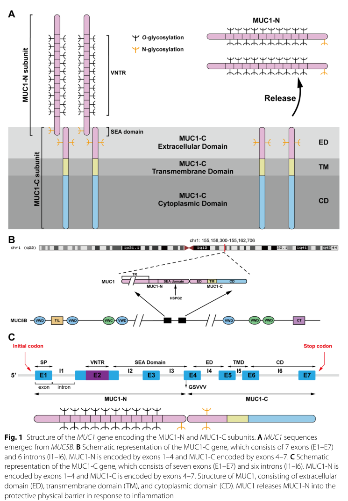

## Question

# Gene Research for Functional Annotation

## ⚠️ CRITICAL: Gene/Protein Identification Context

**BEFORE YOU BEGIN RESEARCH:** You MUST verify you are researching the CORRECT gene/protein. Gene symbols can be ambiguous, especially for less well-characterized genes from non-model organisms.

### Target Gene/Protein Identity (from UniProt):
- **UniProt Accession:** P15941
- **Protein Description:** RecName: Full=Mucin-1; Short=MUC-1; AltName: Full=Breast carcinoma-associated antigen DF3; AltName: Full=Cancer antigen 15-3; Short=CA 15-3; AltName: Full=Carcinoma-associated mucin; AltName: Full=Episialin; AltName: Full=H23AG; AltName: Full=Krebs von den Lungen-6; Short=KL-6; AltName: Full=PEMT; AltName: Full=Peanut-reactive urinary mucin; Short=PUM; AltName: Full=Polymorphic epithelial mucin; Short=PEM; AltName: Full=Tumor-associated epithelial membrane antigen; Short=EMA; AltName: Full=Tumor-associated mucin; AltName: CD_antigen=CD227; Contains: RecName: Full=Mucin-1 subunit alpha; Short=MUC1-NT; Short=MUC1-alpha; Contains: RecName: Full=Mucin-1 subunit beta; Short=MUC1-beta; AltName: Full=MUC1-CT; Flags: Precursor;
- **Gene Information:** Name=MUC1; Synonyms=PUM;
- **Organism (full):** Homo sapiens (Human).
- **Protein Family:** Not specified in UniProt
- **Key Domains:** SEA_dom. (IPR000082); SEA_dom_sf. (IPR036364); SEA (PF01390)

### MANDATORY VERIFICATION STEPS:

1. **Check if the gene symbol "MUC1" matches the protein description above**
2. **Verify the organism is correct:** Homo sapiens (Human).
3. **Check if protein family/domains align with what you find in literature**
4. **If you find literature for a DIFFERENT gene with the same or similar symbol, STOP**

### If Gene Symbol is Ambiguous or You Cannot Find Relevant Literature:

**DO NOT PROCEED WITH RESEARCH ON A DIFFERENT GENE.** Instead:
- State clearly: "The gene symbol 'MUC1' is ambiguous or literature is limited for this specific protein"
- Explain what you found (e.g., "Found extensive literature on a different gene with the same symbol in a different organism")
- Describe the protein based ONLY on the UniProt information provided above
- Suggest that the protein function can be inferred from domain/family information

### Research Target:

Please provide a comprehensive research report on the gene **MUC1** (gene ID: MUC1, UniProt: P15941) in human.

The research report should be a detailed narrative explaining the function, biological processes, and localization of the gene product. Citations should be given for all claims.

You should prioritize authoritative reviews and primary scientific literature when conducting research. You can supplement
this with annotations you find in gene/protein databases, but these can be outdated or inaccurate.

We are specifically interested in the primary function of the gene - for enzymes, what reaction is catalyzed, and what is the substrate specificity? For transporters, what is the substrate? For structural proteins or adapters, what is the broader structural role? For signaling molecules, what is the role in the pathway.

We are interested in where in or outside the cell the gene product carries out its function.

We are also interested in the signaling or biochemical pathways in which the gene functions. We are less interested in broad pleiotropic effects, except where these elucidate the precise role.

Include evidence where possible. We are interested in both experimental evidence as well as inference from structure, evolution, or bioinformatic analysis. Precise studies should be prioritized over high-throughput, where available.

## Output

Question: You are an expert researcher providing comprehensive, well-cited information.

Provide detailed information focusing on:
1. Key concepts and definitions with current understanding
2. Recent developments and latest research (prioritize 2023-2024 sources)
3. Current applications and real-world implementations
4. Expert opinions and analysis from authoritative sources
5. Relevant statistics and data from recent studies

Format as a comprehensive research report with proper citations. Include URLs and publication dates where available.
Always prioritize recent, authoritative sources and provide specific citations for all major claims.

# Gene Research for Functional Annotation

## ⚠️ CRITICAL: Gene/Protein Identification Context

**BEFORE YOU BEGIN RESEARCH:** You MUST verify you are researching the CORRECT gene/protein. Gene symbols can be ambiguous, especially for less well-characterized genes from non-model organisms.

### Target Gene/Protein Identity (from UniProt):
- **UniProt Accession:** P15941
- **Protein Description:** RecName: Full=Mucin-1; Short=MUC-1; AltName: Full=Breast carcinoma-associated antigen DF3; AltName: Full=Cancer antigen 15-3; Short=CA 15-3; AltName: Full=Carcinoma-associated mucin; AltName: Full=Episialin; AltName: Full=H23AG; AltName: Full=Krebs von den Lungen-6; Short=KL-6; AltName: Full=PEMT; AltName: Full=Peanut-reactive urinary mucin; Short=PUM; AltName: Full=Polymorphic epithelial mucin; Short=PEM; AltName: Full=Tumor-associated epithelial membrane antigen; Short=EMA; AltName: Full=Tumor-associated mucin; AltName: CD_antigen=CD227; Contains: RecName: Full=Mucin-1 subunit alpha; Short=MUC1-NT; Short=MUC1-alpha; Contains: RecName: Full=Mucin-1 subunit beta; Short=MUC1-beta; AltName: Full=MUC1-CT; Flags: Precursor;
- **Gene Information:** Name=MUC1; Synonyms=PUM;
- **Organism (full):** Homo sapiens (Human).
- **Protein Family:** Not specified in UniProt
- **Key Domains:** SEA_dom. (IPR000082); SEA_dom_sf. (IPR036364); SEA (PF01390)

### MANDATORY VERIFICATION STEPS:

1. **Check if the gene symbol "MUC1" matches the protein description above**
2. **Verify the organism is correct:** Homo sapiens (Human).
3. **Check if protein family/domains align with what you find in literature**
4. **If you find literature for a DIFFERENT gene with the same or similar symbol, STOP**

### If Gene Symbol is Ambiguous or You Cannot Find Relevant Literature:

**DO NOT PROCEED WITH RESEARCH ON A DIFFERENT GENE.** Instead:
- State clearly: "The gene symbol 'MUC1' is ambiguous or literature is limited for this specific protein"
- Explain what you found (e.g., "Found extensive literature on a different gene with the same symbol in a different organism")
- Describe the protein based ONLY on the UniProt information provided above
- Suggest that the protein function can be inferred from domain/family information

### Research Target:

Please provide a comprehensive research report on the gene **MUC1** (gene ID: MUC1, UniProt: P15941) in human.

The research report should be a detailed narrative explaining the function, biological processes, and localization of the gene product. Citations should be given for all claims.

You should prioritize authoritative reviews and primary scientific literature when conducting research. You can supplement
this with annotations you find in gene/protein databases, but these can be outdated or inaccurate.

We are specifically interested in the primary function of the gene - for enzymes, what reaction is catalyzed, and what is the substrate specificity? For transporters, what is the substrate? For structural proteins or adapters, what is the broader structural role? For signaling molecules, what is the role in the pathway.

We are interested in where in or outside the cell the gene product carries out its function.

We are also interested in the signaling or biochemical pathways in which the gene functions. We are less interested in broad pleiotropic effects, except where these elucidate the precise role.

Include evidence where possible. We are interested in both experimental evidence as well as inference from structure, evolution, or bioinformatic analysis. Precise studies should be prioritized over high-throughput, where available.

## Research Report: Human **MUC1** (UniProt **P15941**, gene **MUC1**) — Functional Annotation, Mechanisms, and Applications

### 0) Target identity verification (critical)
The literature retrieved is consistent with the UniProt target **P15941 = human MUC1 (mucin-1)**, a type I transmembrane mucin expressed by epithelial barrier tissues and processed into two subunits, **MUC1-N** (extracellular, shed) and **MUC1-C** (transmembrane + cytoplasmic tail, signaling-competent). Reviews describe **SEA-domain autoproteolysis at the GSVVV motif**, generating a noncovalent heterodimer that traffics to the apical surface. (Mao et al., 2024-11-18, https://doi.org/10.1186/s11658-024-00654-x) (mao2024researchprogressof pages 2-6)

A recent precision-oncology review explicitly lists major clinical aliases—**CD227, EMA, KL-6, CA 27.29/CA 15-3**—as alternative names for MUC1, aligning with the UniProt description provided by the user. (Grewal & Kurzrock, 2025-07-11, https://doi.org/10.1038/s41698-025-01016-2) (grewal2025mucin1apromising pages 2-3)

**Visual support:** A schematic of MUC1 gene/protein architecture and SEA cleavage was retrieved (Figure 1 in Mao et al. 2024). (mao2024researchprogressof media db8ef381)

### 1) Key concepts and definitions (current understanding)
#### 1.1 What MUC1 is
MUC1 is a **highly glycosylated type I transmembrane mucin** whose mass is dominated by glycans (reviewed as ~50–90% sugar mass). It is encoded by seven exons and contains an extracellular VNTR region and a SEA domain. (Mao et al., 2024-11-18, https://doi.org/10.1186/s11658-024-00654-x) (mao2024researchprogressof pages 2-6)

#### 1.2 Subunits: MUC1-N vs MUC1-C
- **MUC1-N**: VNTR-rich extracellular subunit with extensive Ser/Thr O-glycosylation; it projects far above the glycocalyx (reported ~200–500 nm) and forms a protective, lubricating barrier and can be shed. (Mao et al., 2024-11-18, https://doi.org/10.1186/s11658-024-00654-x) (mao2024researchprogressof pages 2-6)
- **MUC1-C**: transmembrane subunit comprising a short extracellular segment (~58 aa), TM (~28 aa), and cytoplasmic tail (~72 aa). Its cytoplasmic tail contains a **CQC motif** (a therapeutic target site) and multiple phosphorylation/docking motifs enabling signal integration and transcriptional regulation. (Mao et al., 2024-11-18, https://doi.org/10.1186/s11658-024-00654-x; Tong et al., 2024-01-01, https://doi.org/10.7150/jca.88261) (mao2024researchprogressof pages 2-6, tong2024mucin1asa pages 1-3)

#### 1.3 SEA-domain autoproteolysis and shedding
A conserved **SEA domain** functions as a cleavage site in multiple transmembrane mucins; MUC1 is cleaved in the SEA domain during post-translational processing into two associated subunits, and extracellular portions can be shed, shaping both biology and therapeutic tractability. (Mao et al., 2024-11-18, https://doi.org/10.1186/s11658-024-00654-x; Li et al., 2025-04-07, https://doi.org/10.1038/s41420-025-02455-3) (mao2024researchprogressof pages 2-6, li2025transmembranemucinsin pages 2-4)

#### 1.4 Normal epithelial role: barrier/lubrication and immune interface
In healthy epithelia, MUC1 is primarily **apically localized** and contributes to hydration/lubrication and protection of barrier surfaces. (Tong et al., 2024-01-01, https://doi.org/10.7150/jca.88261; Grewal & Kurzrock, 2025-07-11, https://doi.org/10.1038/s41698-025-01016-2) (tong2024mucin1asa pages 3-4, grewal2025mucin1apromising pages 1-2)

### 2) Molecular functions, pathways, and subcellular localization
#### 2.1 Localization and trafficking
MUC1 is synthesized and traffics ER→Golgi→apical membrane as a MUC1-N/MUC1-C heterodimer. Cancer-associated MUC1 is described as losing polarity and appearing across the cell surface and in intracellular compartments. (Mao et al., 2024-11-18, https://doi.org/10.1186/s11658-024-00654-x; Tong et al., 2024-01-01, https://doi.org/10.7150/jca.88261) (mao2024researchprogressof pages 2-6, tong2024mucin1asa pages 3-4)

Multiple reviews report that **MUC1-C can accumulate in the cytosol and translocate to the nucleus and mitochondria**, consistent with its role as a transcriptional and stress-response regulator. (Milella et al., 2024-03-06, https://doi.org/10.3390/biom14030315) (milella2024theroleof pages 2-4)

Mechanistic details for nuclear import have been summarized in transmembrane mucin reviews (importin-β and nucleoporin 62 implicated for MUC1-C). (Li et al., 2025-04-07, https://doi.org/10.1038/s41420-025-02455-3) (li2025transmembranemucinsin pages 2-4)

#### 2.2 Core signaling functions of MUC1-C (oncogenic signal integrator)
Across 2024 reviews, MUC1-C is consistently portrayed as the **signaling-active oncoprotein** subunit.

Key pathways and binding partners supported by recent synthesis:
- **JAK/STAT (STAT1/STAT3)**: MUC1-C directly binds STAT1 and promotes STAT target gene activation, including a positive feedback on MUC1 transcription. (Tong et al., 2024-01-01, https://doi.org/10.7150/jca.88261) (tong2024mucin1asa pages 1-3, tong2024mucin1asa pages 3-4)
- **NF-κB (p65/RELA)**: MUC1-C is described as activating NF-κB p65 signaling, contributing to inflammatory programs and EMT-related transcription. (Tong et al., 2024-01-01, https://doi.org/10.7150/jca.88261; Milella et al., 2024-03-06, https://doi.org/10.3390/biom14030315) (tong2024mucin1asa pages 3-4, milella2024theroleof pages 2-4)
- **Wnt/β-catenin**: MUC1-C stabilizes β-catenin and promotes Wnt target gene programs (e.g., MYC/CCND1 in review summaries), supporting EMT and tumor progression. (Tong et al., 2024-01-01, https://doi.org/10.7150/jca.88261; Milella et al., 2024-03-06, https://doi.org/10.3390/biom14030315) (tong2024mucin1asa pages 3-4, milella2024theroleof pages 2-4)
- **RTKs and PI3K/AKT**: Reviews describe MUC1-C interactions with receptor tyrosine kinases (including EGFR/ErbB2 and others) and activation of downstream PI3K→AKT signaling, supporting proliferation/survival and therapy resistance. (Tong et al., 2024-01-01, https://doi.org/10.7150/jca.88261) (tong2024mucin1asa pages 3-4)

#### 2.3 Innate immune regulation in airway epithelium (TLR4/MyD88/NF-κB → NLRP3 pyroptosis)
A 2023 translational study provides direct evidence that MUC1 can **attenuate neutrophilic airway inflammation** by inhibiting the **TLR4/MyD88/NF-κB pathway**, reducing **NLRP3 inflammasome-mediated pyroptosis**. (Liu et al., 2023-10-05, https://doi.org/10.1186/s12931-023-02550-y) (liu2023muc1attenuatesneutrophilic pages 1-2)

Key quantitative/experimental details:
- Human sputum cohorts: healthy controls n=12; mild-to-moderate asthma n=34; severe asthma n=18. MUC1 mRNA was downregulated in asthma (notably severe), while TLR4/MyD88/NLRP3/caspase-1/IL-18/IL-1β mRNAs were increased. (liu2023muc1attenuatesneutrophilic pages 5-9)
- In vitro: LPS-stimulated BEAS-2B epithelial cells showed pathway activation and pyroptosis markers; MUC1 knockdown aggravated TLR4/MyD88/p-p65 activation and downstream inflammasome/pyroptosis readouts; the TLR4 inhibitor TAK-242 reversed these effects. (liu2023muc1attenuatesneutrophilic pages 5-9)
- Mechanism: co-immunoprecipitation indicated MUC1-CT interacts with TLR4 and MUC1 deficiency increases TLR4–MyD88 binding, supporting a physical constraint model. (liu2023muc1attenuatesneutrophilic pages 9-12)

### 3) Recent developments and latest research (prioritizing 2023–2024)
#### 3.1 Hypoxia-driven “ROS-resistant memory” and metastasis (2024)
A 2024 Nature Communications study links chronic hypoxia to durable transcriptional programs that persist after reoxygenation and promote metastasis, with **MUC1/MUC1-C as a key effector** induced by **HIF-1α and NF-κB p65**. (Godet et al., 2024-09-16, https://doi.org/10.1038/s41467-024-51995-2) (godet2024hypoxiainducesrosresistant pages 1-2)

Quantitative findings include:
- GO-203 pharmacologic inhibition increased mitochondrial ROS in circulating tumor cells (CTCs) and yielded a **53% reduction in the contribution of hypoxia-marked (GFP+) cells to metastatic burden** in an in vivo model. (godet2024hypoxiainducesrosresistant pages 8-9)
- MUC1low CTCs exhibited **~2× higher MitoROS** than matched MUC1high CTCs, connecting MUC1 expression to ROS defense. (godet2024hypoxiainducesrosresistant pages 8-9)

#### 3.2 Ferroptosis resistance and cancer stem cell (CSC) state via MUC1-C (2024)
A 2024 Cell Death Discovery study identifies **MUC1-C as a functional node in ferroptosis resistance** of CSC-like tumor cells and reports that salinomycin suppresses MUC1-C signaling and induces ferroptosis. Mechanistically, MUC1-C sustains antioxidant defenses through a **NF-κB/MUC1-C auto-inductive circuit** and a **MUC1-C→MYC axis** that regulates **GSR, LRP8, and GPX4 activity**, consistent with glutathione/selenium-dependent ferroptosis control. (Daimon et al., 2024-01-10, https://doi.org/10.1038/s41420-023-01772-9) (daimon2024muc1cisa pages 1-2)

Quantitative/experimental details include salinomycin dosing (1 μM, 24 h) decreasing tumorsphere self-renewal and inducing lipid peroxidation, with effects blocked by Ferrostatin-1; GO-203 phenocopied salinomycin by downregulating GSR/LRP8/GPX4 and GPX activity (reported with replicate-normalized quantitative plots). (daimon2024muc1cisa pages 4-6)

#### 3.3 Chronic inflammation programs in squamous cancers (2024)
In head and neck squamous cell carcinoma (HNSCC), a 2024 primary study reports that MUC1-C integrates chronic inflammatory signaling by regulating PRRs, STAT1 and type I/II interferon programs, with downstream ISGs supporting DNA damage resistance and immune evasion; MUC1-C was also necessary for NOTCH3 expression, self-renewal, and tumorigenicity, and associated with ΔNp63/SOX2/NOTCH3 programs by single-cell RNA-seq. (Nakashoji et al., 2024-04-10, https://doi.org/10.1158/2767-9764.crc-24-0011) (nakashoji2024identificationofmuc1c pages 1-2)

### 4) Current applications and real-world implementations
#### 4.1 Cancer biomarkers: CA15-3 / CA27.29 (shed MUC1-N)
A precision oncology review states that soluble MUC1-N is measured clinically as **CA 27.29/CA 15-3**, which are **FDA-approved tests for monitoring breast cancer**, used with imaging/clinical assessments, and elevations correlate with recurrence/progression (the review cautions they should not be used interchangeably). (Grewal & Kurzrock, 2025-07-11, https://doi.org/10.1038/s41698-025-01016-2) (grewal2025mucin1apromising pages 1-2)

#### 4.2 Lung fibrosis/ILD biomarker: KL-6 (MUC1 glycoform)
KL-6 is described as a **human MUC1 mucin** produced by regenerating type II pneumocytes and used as an ILD severity marker in clinical routine (especially in Japan). (Bonella et al., 2025-10-02, https://doi.org/10.1038/s41598-025-22483-4) (bonella2025serumkl6as pages 1-2)

A large real-world ILD biomarker analysis from UK-BILD (PLOS ONE 2024) included **3,169 enrolled** patients, with **1,013** selected for idiopathic ILD vs SARD-ILD comparisons; a diagnostic model including KL-6 achieved **69.4% sensitivity and 80.4% specificity** for distinguishing idiopathic ILD, and KL-6 was significantly higher in idiopathic ILD (p=0.0002). (d’Alessandro et al., 2024-10-11, https://doi.org/10.1371/journal.pone.0311357) (d’alessandro2024panelofserum pages 1-2)

#### 4.3 Therapeutic targeting of MUC1-C
**Rationale:** targeting shed MUC1-N has been challenging; newer strategies focus on MUC1-C (nonshed, signaling-competent). (Ohta et al., 2025-10-09, https://doi.org/10.7759/cureus.95636) (ohta2025adescriptivesummary pages 1-2)

**Modalities in development** include vaccines, monoclonal antibodies and ADCs, and cellular therapies according to a 2025 review. (Grewal & Kurzrock, 2025-07-11, https://doi.org/10.1038/s41698-025-01016-2) (grewal2025mucin1apromising pages 2-3)

### 5) Clinical trials landscape (from retrieved ClinicalTrials.gov records)
The retrieved ClinicalTrials.gov entries show heterogeneous approaches (vaccines, peptide + adjuvant, dendritic cell/CTL, CAR-T). Examples with extracted details:
- **NCT00004156** (MSKCC; start May 1999; primary completion June 2008): Phase 1 glycosylated **MUC1-KLH + QS21** vaccine in high-risk breast cancer; **enrollment 45**; immune-response endpoint. (https://clinicaltrials.gov/study/NCT00004156) (NCT00004156 chunk 1)
- **NCT00773097** (start 2008): Phase 2 **100mer MUC1 peptide + Poly-ICLC** vaccine in individuals with advanced colorectal adenoma; **enrollment 46**; primary endpoint anti-MUC1 antibody response. (https://clinicaltrials.gov/study/NCT00773097) (NCT00773097 chunk 1)
- **NCT02602249** (Beijing Doing Biomedical; 2017): Phase 1 randomized DC/CTL products (**MUC1-gene-DC-CTL** or **MUC1-peptide-DC-CTL**) vs saline in stage IV gastric cancer; **estimated enrollment 24**; primary endpoint tumor size by RECIST; status listed as UNKNOWN / lastKnown NOT_YET_RECRUITING in retrieved text. (https://clinicaltrials.gov/study/NCT02602249) (NCT02602249 chunk 1)

### 6) Expert opinions and analysis (authoritative synthesis)
Recent reviews converge on a conceptual division of labor:
- **MUC1-N** primarily mediates **barrier/lubrication** and is readily **shed**, which complicates antibody targeting but provides a basis for circulating biomarkers (CA15-3/CA27.29). (Milella et al., 2024-03-06, https://doi.org/10.3390/biom14030315; Grewal & Kurzrock, 2025-07-11, https://doi.org/10.1038/s41698-025-01016-2) (milella2024theroleof pages 2-4, grewal2025mucin1apromising pages 1-2)
- **MUC1-C** is the major **signal-transduction and transcriptional effector**, integrating RTK, PI3K/AKT, Wnt/β-catenin, STAT and NF-κB programs to promote plasticity, stress tolerance (ROS/ferroptosis resistance), and immune evasion. (Tong et al., 2024-01-01, https://doi.org/10.7150/jca.88261; Godet et al., 2024-09-16, https://doi.org/10.1038/s41467-024-51995-2; Daimon et al., 2024-01-10, https://doi.org/10.1038/s41420-023-01772-9) (tong2024mucin1asa pages 3-4, godet2024hypoxiainducesrosresistant pages 1-2, daimon2024muc1cisa pages 1-2)

### 7) Recent statistics and quantitative data highlights
- **Structural quantitative descriptors**: MUC1-C extracellular ~58 aa, TM ~28 aa, cytoplasmic tail ~72 aa; MUC1-N VNTR repeats 20–120; MUC1 extends ~200–500 nm above glycocalyx. (Mao et al., 2024-11-18, https://doi.org/10.1186/s11658-024-00654-x) (mao2024researchprogressof pages 2-6)
- **Cancer-associated overexpression**: tumor cell surface MUC1 reported as **10–40× higher** than normal cells (review). (Tong et al., 2024-01-01, https://doi.org/10.7150/jca.88261) (tong2024mucin1asa pages 1-3)
- **Asthma inflammation (human cohorts)**: HC n=12; mild-to-moderate asthma n=34; severe asthma n=18; molecular signatures implicate MUC1 as a negative regulator of TLR4/NF-κB and NLRP3 pyroptosis. (Liu et al., 2023-10-05, https://doi.org/10.1186/s12931-023-02550-y) (liu2023muc1attenuatesneutrophilic pages 5-9)
- **Hypoxia-memory metastasis reduction**: GO-203 produced **53% reduction** in hypoxia-marked cell contribution to metastatic burden and increased mitochondrial ROS in CTCs. (Godet et al., 2024-09-16, https://doi.org/10.1038/s41467-024-51995-2) (godet2024hypoxiainducesrosresistant pages 8-9)
- **ILD differential diagnosis (UK-BILD)**: 1,013 analyzed (from 3,169 enrolled) with model sensitivity **69.4%** and specificity **80.4%** using KL-6 + ferritin + clinical variables. (d’Alessandro et al., 2024-10-11, https://doi.org/10.1371/journal.pone.0311357) (d’alessandro2024panelofserum pages 1-2)
- **KL-6 lung cancer prognosis meta-analysis**: 13 studies, **n=1,723**; elevated KL-6 associated with shorter PFS (HR **1.89**) and OS (HR **1.76**); a frequently used threshold is **>500 U/mL**. (Huang et al., 2025-09-25, https://doi.org/10.3389/fimmu.2025.1644573) (huang2025serumkrebsvon pages 1-2)

### 8) Summary functional annotation (concise)
Human **MUC1 (P15941)** is a **SEA-domain–cleaved transmembrane mucin heterodimer**. **MUC1-N** is a shed, heavily O-glycosylated VNTR-rich extracellular subunit that provides **lubrication and barrier protection** at apical epithelial surfaces and underlies circulating biomarkers (**CA15-3/CA27.29**, and the glycoform **KL-6**). **MUC1-C** is a signaling-active transmembrane subunit that can translocate to intracellular compartments (including nucleus/mitochondria) and acts as a **hub integrating RTK/PI3K/AKT, NF-κB, STAT, and β-catenin programs**, thereby supporting inflammation-linked transcription, EMT/plasticity, redox/ferroptosis resistance, stemness, and immune evasion. Recent 2023–2024 primary studies strengthen causal links between MUC1/MUC1-C and (i) epithelial innate immune modulation via TLR4/MyD88/NF-κB→NLRP3 pyroptosis in asthma and (ii) hypoxia-driven ROS-resistant metastatic competence and ferroptosis resistance in cancer. (mao2024researchprogressof pages 2-6, tong2024mucin1asa pages 3-4, liu2023muc1attenuatesneutrophilic pages 5-9, godet2024hypoxiainducesrosresistant pages 8-9, daimon2024muc1cisa pages 4-6)

---

### Real-world applications summary table
| Application area | Specific marker/agent | Indication(s) | Key quantitative data | Current status/notes | Key supporting citation IDs |
|---|---|---|---|---|---|
| Biomarker/diagnostic | CA15-3 / CA27.29 (shed MUC1-N) | Breast cancer monitoring/prognosis | Used clinically for monitoring; elevated levels correlate with recurrence/disease progression; no sensitivity/specificity reported in retrieved sources. In one 2024 breast cohort, CA15-3 median was 18.66 U/mL in breast cancer vs 11.74 U/mL in benign breast tumors (31 vs 30 patients; p=0.001). | FDA-approved for monitoring breast cancer; should not be used interchangeably according to review summary. | (grewal2025mucin1apromising pages 1-2, mao2024researchprogressof pages 2-6) |
| Biomarker/diagnostic | KL-6 (MUC1 glycoform) | Interstitial lung disease (ILD) severity/progression | European multicenter ILD study: n=303, 37% progressed at 1 year; risk model including KL-6 gave 55% sensitivity, 73% specificity, 67% accuracy for 1-year progression. | Established serum biomarker for ILD severity; used in clinical routine, especially in Japan; measured by automated chemiluminescent immunoassay. | (bonella2025serumkl6as pages 1-2) |
| Biomarker/diagnostic | KL-6 | Differential diagnosis of idiopathic ILD vs SARD-ILD | UK-BILD analysis: 1,013 patients selected from 3,169 enrolled (520 idiopathic ILD, 493 SARD-ILD); multivariable model including KL-6 achieved 69.4% sensitivity and 80.4% specificity; KL-6 higher in idiopathic ILD (p=0.0002). | Real-world serum biomarker panel measured by Fujirebio chemiluminescent assay. | (d’alessandro2024panelofserum pages 1-2, d’alessandro2024panelofserum pages 2-3) |
| Biomarker/diagnostic | KL-6 | Lung cancer prognosis | Meta-analysis of 13 studies/1,723 patients: high pretreatment KL-6 associated with shorter PFS (HR 1.89, 95% CI 1.46-2.44) and OS (HR 1.76, 95% CI 1.37-2.26); >500 U/mL associated with worse outcomes. | Prognostic signal strongest in patients without ILD; ECLIA outperformed ELISA in pooled analysis. | (huang2025serumkrebsvon pages 1-2, huang2025serumkrebsvon pages 5-6) |
| Therapeutic target | GO-203 (MUC1-C inhibitor peptide) | Experimental MUC1-C targeting in cancer; cited AML clinical development; asthma/hypoxia models | In hypoxia-memory breast cancer model, 5 daily GO-203 doses increased mitoROS in CTCs and reduced GFP+ metastatic burden by 53%; in asthma mouse model, GO-203 exacerbated neutrophilic inflammation (n=6/group). | Not approved; cited as having completed/undergone Phase I evaluation in AML in review literature; strong preclinical activity but no approved indication in retrieved sources. | (godet2024hypoxiainducesrosresistant pages 8-9, liu2023muc1attenuatesneutrophilic pages 9-12, tong2024mucin1asa pages 3-4) |
| Therapeutic target | MUC1-C antibody-drug conjugate (3D1-MMAE / M1C ADC concept) | Solid tumors with MUC1-C overexpression | Preclinical ADC showed antitumor activity in lung, breast, and patient-derived TNBC models; no human enrollment data in retrieved primary ADC paper. | Preclinical/translation-stage platform; rationale strengthened by failure of MUC1-N targeting due to shedding. | (ohta2025adescriptivesummary pages 1-2, tong2024mucin1asa pages 8-10) |
| Therapeutic target | MUC1 vaccines (MUC1-KLH/QS21; peptide + Poly-ICLC; ImMucin) | Breast cancer, advanced colorectal adenoma prevention, MUC1-expressing tumors | NCT00004156 Phase 1 breast cancer vaccine: enrolled 45; immune-response endpoint over 2 years. NCT00773097 Phase 2 colorectal adenoma vaccine: enrolled 46. NCT00162500 ImMucin Phase 2: planned 15, withdrawn. Historic tecemotide Phase 3 NSCLC trial enrolled 1,513 but no OS benefit (review summary). | Multiple vaccine platforms tested; many completed or withdrawn, with limited definitive efficacy despite immunogenicity. | (NCT00004156 chunk 1, NCT00773097 chunk 1, NCT00162500 chunk 1, taylorpapadimitriou2018latestdevelopmentsin pages 3-4) |
| Therapeutic target | MUC1-directed DC/CTL therapy | Stage IV gastric cancer; pancreatic/biliary tumors; ovarian cancer | NCT02602249 randomized Phase 1 stage IV gastric cancer trial planned enrollment 24; compares MUC1-gene-DC-CTL, MUC1-peptide-DC-CTL, and saline. Review summary notes autologous DC + CTL regimen in 42 late-stage pancreatic patients and peptide-pulsed DC adjuvant study with 4/12 recurrence-free survivors, median survival 26 months. | Gastric cancer trial listed as UNKNOWN / NOT_YET_RECRUITING in retrieved record; broader DC strategies remain investigational. | (NCT02602249 chunk 1, lee2021mucin1andmucin16 pages 15-17, taylorpapadimitriou2018latestdevelopmentsin pages 3-4) |
| Therapeutic target | MUC1 CAR-T | Intrahepatic cholangiocarcinoma | NCT03633773 Phase 1/2 trial enrollment 9. | Human study exists in ClinicalTrials.gov retrieval; overall status listed as UNKNOWN in search output. | (OpenTargets Search: -MUC1) |
| Disease genetics | Germline MUC1 pathogenic variants (ADTKD-MUC1) | Autosomal dominant tubulointerstitial kidney disease; COVID-19 risk in affected patients | Registry/survey study: 89 ADTKD-MUC1 and 132 ADTKD-UMOD respondents; COVID-19 infection OR 2.35; deaths 10/41 vs 1/30 in expanded familial cases (OR 9.21); longitudinal registry 19/360 (5%) vs 3/478 (0.6%) deaths, multivariable OR for COVID-19 death 8.4 (95% CI 2.9-29.5). Lower pre-infection plasma mucin-1/CA15-3 in infected vs uninfected ADTKD-MUC1 (7.06 ± 4.12 vs 10.21 ± 4.02 U/mL, p=0.035). | Established Mendelian disease association; Open Targets also lists strong association with ADTKD-related disease terms. | (OpenTargets Search: -MUC1, mao2024researchprogressof pages 2-6) |

*Table: This table summarizes real-world and translational uses of MUC1 across biomarkers, therapeutics, and inherited disease genetics. It highlights quantitative findings, study sizes, and implementation status using only evidence available in the conversation.*

References

1. (mao2024researchprogressof pages 2-6): Weipu Mao, Houliang Zhang, Keyi Wang, Jiang Geng, and Jianping Wu. Research progress of muc1 in genitourinary cancers. Cellular & Molecular Biology Letters, Nov 2024. URL: https://doi.org/10.1186/s11658-024-00654-x, doi:10.1186/s11658-024-00654-x. This article has 5 citations and is from a peer-reviewed journal.

2. (grewal2025mucin1apromising pages 2-3): Udhayvir Singh Grewal and Razelle Kurzrock. Mucin-1: a promising pan-cancer therapeutic target. NPJ Precision Oncology, Jul 2025. URL: https://doi.org/10.1038/s41698-025-01016-2, doi:10.1038/s41698-025-01016-2. This article has 28 citations and is from a peer-reviewed journal.

3. (mao2024researchprogressof media db8ef381): Weipu Mao, Houliang Zhang, Keyi Wang, Jiang Geng, and Jianping Wu. Research progress of muc1 in genitourinary cancers. Cellular & Molecular Biology Letters, Nov 2024. URL: https://doi.org/10.1186/s11658-024-00654-x, doi:10.1186/s11658-024-00654-x. This article has 5 citations and is from a peer-reviewed journal.

4. (tong2024mucin1asa pages 1-3): Xiaohan Tong, Chunyan Dong, and Shujing Liang. Mucin1 as a potential molecule for cancer immunotherapy and targeted therapy. Journal of Cancer, 15:54-67, Jan 2024. URL: https://doi.org/10.7150/jca.88261, doi:10.7150/jca.88261. This article has 26 citations and is from a peer-reviewed journal.

5. (li2025transmembranemucinsin pages 2-4): Xiaoqing Li, Ying Chen, Rui Lan, Peng Liu, Kai Xiong, Hetai Teng, Lili Tao, Shan Yu, and Guiping Han. Transmembrane mucins in lung adenocarcinoma: understanding of current molecular mechanisms and clinical applications. Cell Death Discovery, Apr 2025. URL: https://doi.org/10.1038/s41420-025-02455-3, doi:10.1038/s41420-025-02455-3. This article has 13 citations and is from a peer-reviewed journal.

6. (tong2024mucin1asa pages 3-4): Xiaohan Tong, Chunyan Dong, and Shujing Liang. Mucin1 as a potential molecule for cancer immunotherapy and targeted therapy. Journal of Cancer, 15:54-67, Jan 2024. URL: https://doi.org/10.7150/jca.88261, doi:10.7150/jca.88261. This article has 26 citations and is from a peer-reviewed journal.

7. (grewal2025mucin1apromising pages 1-2): Udhayvir Singh Grewal and Razelle Kurzrock. Mucin-1: a promising pan-cancer therapeutic target. NPJ Precision Oncology, Jul 2025. URL: https://doi.org/10.1038/s41698-025-01016-2, doi:10.1038/s41698-025-01016-2. This article has 28 citations and is from a peer-reviewed journal.

8. (milella2024theroleof pages 2-4): Martina Milella, Monica Rutigliano, Francesco Lasorsa, Matteo Ferro, Roberto Bianchi, Giuseppe Fallara, Felice Crocetto, Savio Pandolfo, Biagio Barone, Antonio d’Amati, Marco Spilotros, Michele Battaglia, Pasquale Ditonno, and Giuseppe Lucarelli. The role of muc1 in renal cell carcinoma. Biomolecules, 14:315, Mar 2024. URL: https://doi.org/10.3390/biom14030315, doi:10.3390/biom14030315. This article has 70 citations.

9. (liu2023muc1attenuatesneutrophilic pages 1-2): Lu Liu, Ling Zhou, Lingling Wang, Zhenyu Mao, Pengdou Zheng, Fengqin Zhang, Huojun Zhang, and Huiguo Liu. Muc1 attenuates neutrophilic airway inflammation in asthma by reducing nlrp3 inflammasome-mediated pyroptosis through the inhibition of the tlr4/myd88/nf-κb pathway. Respiratory Research, Oct 2023. URL: https://doi.org/10.1186/s12931-023-02550-y, doi:10.1186/s12931-023-02550-y. This article has 58 citations and is from a domain leading peer-reviewed journal.

10. (liu2023muc1attenuatesneutrophilic pages 5-9): Lu Liu, Ling Zhou, Lingling Wang, Zhenyu Mao, Pengdou Zheng, Fengqin Zhang, Huojun Zhang, and Huiguo Liu. Muc1 attenuates neutrophilic airway inflammation in asthma by reducing nlrp3 inflammasome-mediated pyroptosis through the inhibition of the tlr4/myd88/nf-κb pathway. Respiratory Research, Oct 2023. URL: https://doi.org/10.1186/s12931-023-02550-y, doi:10.1186/s12931-023-02550-y. This article has 58 citations and is from a domain leading peer-reviewed journal.

11. (liu2023muc1attenuatesneutrophilic pages 9-12): Lu Liu, Ling Zhou, Lingling Wang, Zhenyu Mao, Pengdou Zheng, Fengqin Zhang, Huojun Zhang, and Huiguo Liu. Muc1 attenuates neutrophilic airway inflammation in asthma by reducing nlrp3 inflammasome-mediated pyroptosis through the inhibition of the tlr4/myd88/nf-κb pathway. Respiratory Research, Oct 2023. URL: https://doi.org/10.1186/s12931-023-02550-y, doi:10.1186/s12931-023-02550-y. This article has 58 citations and is from a domain leading peer-reviewed journal.

12. (godet2024hypoxiainducesrosresistant pages 1-2): Inês Godet, Harsh H. Oza, Yi Shi, Natalie S. Joe, Alyssa G. Weinstein, Jeanette Johnson, Michael Considine, Swathi Talluri, Jingyuan Zhang, Reid Xu, Steven Doctorman, Delma Mbulaiteye, Genevieve Stein-O’Brien, Luciane T. Kagohara, Cesar A. Santa-Maria, Elana J. Fertig, and Daniele M. Gilkes. Hypoxia induces ros-resistant memory upon reoxygenation in vivo promoting metastasis in part via muc1-c. Nature Communications, Sep 2024. URL: https://doi.org/10.1038/s41467-024-51995-2, doi:10.1038/s41467-024-51995-2. This article has 35 citations and is from a highest quality peer-reviewed journal.

13. (godet2024hypoxiainducesrosresistant pages 8-9): Inês Godet, Harsh H. Oza, Yi Shi, Natalie S. Joe, Alyssa G. Weinstein, Jeanette Johnson, Michael Considine, Swathi Talluri, Jingyuan Zhang, Reid Xu, Steven Doctorman, Delma Mbulaiteye, Genevieve Stein-O’Brien, Luciane T. Kagohara, Cesar A. Santa-Maria, Elana J. Fertig, and Daniele M. Gilkes. Hypoxia induces ros-resistant memory upon reoxygenation in vivo promoting metastasis in part via muc1-c. Nature Communications, Sep 2024. URL: https://doi.org/10.1038/s41467-024-51995-2, doi:10.1038/s41467-024-51995-2. This article has 35 citations and is from a highest quality peer-reviewed journal.

14. (daimon2024muc1cisa pages 1-2): Tatsuaki Daimon, Atrayee Bhattacharya, Keyi Wang, Naoki Haratake, Ayako Nakashoji, Hiroki Ozawa, Yoshihiro Morimoto, Nami Yamashita, Takeo Kosaka, Mototsugu Oya, and Donald W. Kufe. Muc1-c is a target of salinomycin in inducing ferroptosis of cancer stem cells. Cell Death Discovery, Jan 2024. URL: https://doi.org/10.1038/s41420-023-01772-9, doi:10.1038/s41420-023-01772-9. This article has 13 citations and is from a peer-reviewed journal.

15. (daimon2024muc1cisa pages 4-6): Tatsuaki Daimon, Atrayee Bhattacharya, Keyi Wang, Naoki Haratake, Ayako Nakashoji, Hiroki Ozawa, Yoshihiro Morimoto, Nami Yamashita, Takeo Kosaka, Mototsugu Oya, and Donald W. Kufe. Muc1-c is a target of salinomycin in inducing ferroptosis of cancer stem cells. Cell Death Discovery, Jan 2024. URL: https://doi.org/10.1038/s41420-023-01772-9, doi:10.1038/s41420-023-01772-9. This article has 13 citations and is from a peer-reviewed journal.

16. (nakashoji2024identificationofmuc1c pages 1-2): Ayako Nakashoji, Naoki Haratake, Atrayee Bhattacharya, Weipu Mao, Kangjie Xu, Keyi Wang, Tatsuaki Daimon, Hiroki Ozawa, Keisuke Shigeta, Atsushi Fushimi, Nami Yamashita, Yoshihiro Morimoto, Mototsugu Shimokawa, Shin Saito, Ann Marie Egloff, Ravindra Uppaluri, Mark D Long, and Donald Kufe. Identification of muc1-c as a target for suppressing progression of head and neck squamous cell carcinomas. Cancer Research Communications, 4:1268-1281, Apr 2024. URL: https://doi.org/10.1158/2767-9764.crc-24-0011, doi:10.1158/2767-9764.crc-24-0011. This article has 12 citations and is from a peer-reviewed journal.

17. (bonella2025serumkl6as pages 1-2): Francesco Bonella, M. C. Vegas Sanchez, M. d’Alessandro, P. Millan-Billi, R. F. Santos, N. Schröder, H. N. Bastos, M. Molina-Molina, O. Sánchez Pernaute, D. Castillo Villegas, and E. Bargagli. Serum kl-6 as a biomarker to predict progression at one year in interstitial lung disease. Scientific Reports, Oct 2025. URL: https://doi.org/10.1038/s41598-025-22483-4, doi:10.1038/s41598-025-22483-4. This article has 8 citations and is from a peer-reviewed journal.

18. (d’alessandro2024panelofserum pages 1-2): Miriana d’Alessandro, Paolo Cameli, Caroline V. Cotton, Janine A. Lamb, Laura Bergantini, Sara Gangi, Sarah Sugden, Lisa G. Spencer, Bruno Frediani, Robert P. New, Hector Chinoy, Elena Bargagli, and Edoardo Conticini. Panel of serum biomarkers for differential diagnosis of idiopathic interstitial lung disease and interstitial lung disease-secondary to systemic autoimmune rheumatic disease. PLOS ONE, 19(10):e0311357, Oct 2024. URL: https://doi.org/10.1371/journal.pone.0311357, doi:10.1371/journal.pone.0311357. This article has 7 citations and is from a peer-reviewed journal.

19. (ohta2025adescriptivesummary pages 1-2): Ryuichi Ohta, Kasumi Nishikawa, Kaoru Tanaka, Chiaki Sano, and Hidetoshi Hayashi. A descriptive summary of tumor-associated muc1 (ta-muc1) expression in epithelial malignancies: a systematic review of case reports and case series. Cureus, Oct 2025. URL: https://doi.org/10.7759/cureus.95636, doi:10.7759/cureus.95636. This article has 0 citations.

20. (NCT00004156 chunk 1):  Vaccine Therapy in Treating Patients With Breast Cancer. Memorial Sloan Kettering Cancer Center. 1999. ClinicalTrials.gov Identifier: NCT00004156

21. (NCT00773097 chunk 1): Robert Schoen. Study of the MUC1 Peptide-Poly-ICLC Adjuvant Vaccine in Individuals With Advanced Colorectal Adenoma. Robert Schoen. 2008. ClinicalTrials.gov Identifier: NCT00773097

22. (NCT02602249 chunk 1):  Clinical Safety and Preliminary Efficacy of MUC1-DC-CTL Treatment in Stage IV Gastric Cancer.. Beijing Doing Biomedical Co., Ltd.. 2017. ClinicalTrials.gov Identifier: NCT02602249

23. (huang2025serumkrebsvon pages 1-2): Hong Huang, Liangyu Fu, Chenye Feng, Jiawei Zhou, Jiahuan Xu, Jianjun Sun, Ying Pan, Delei Kong, and Wei Wang. Serum krebs von den lungen-6 before treatment predicts the prognosis of lung cancer in asian populations: a systematic review and meta-analysis. Frontiers in Immunology, Sep 2025. URL: https://doi.org/10.3389/fimmu.2025.1644573, doi:10.3389/fimmu.2025.1644573. This article has 0 citations and is from a peer-reviewed journal.

24. (d’alessandro2024panelofserum pages 2-3): Miriana d’Alessandro, Paolo Cameli, Caroline V. Cotton, Janine A. Lamb, Laura Bergantini, Sara Gangi, Sarah Sugden, Lisa G. Spencer, Bruno Frediani, Robert P. New, Hector Chinoy, Elena Bargagli, and Edoardo Conticini. Panel of serum biomarkers for differential diagnosis of idiopathic interstitial lung disease and interstitial lung disease-secondary to systemic autoimmune rheumatic disease. PLOS ONE, 19(10):e0311357, Oct 2024. URL: https://doi.org/10.1371/journal.pone.0311357, doi:10.1371/journal.pone.0311357. This article has 7 citations and is from a peer-reviewed journal.

25. (huang2025serumkrebsvon pages 5-6): Hong Huang, Liangyu Fu, Chenye Feng, Jiawei Zhou, Jiahuan Xu, Jianjun Sun, Ying Pan, Delei Kong, and Wei Wang. Serum krebs von den lungen-6 before treatment predicts the prognosis of lung cancer in asian populations: a systematic review and meta-analysis. Frontiers in Immunology, Sep 2025. URL: https://doi.org/10.3389/fimmu.2025.1644573, doi:10.3389/fimmu.2025.1644573. This article has 0 citations and is from a peer-reviewed journal.

26. (tong2024mucin1asa pages 8-10): Xiaohan Tong, Chunyan Dong, and Shujing Liang. Mucin1 as a potential molecule for cancer immunotherapy and targeted therapy. Journal of Cancer, 15:54-67, Jan 2024. URL: https://doi.org/10.7150/jca.88261, doi:10.7150/jca.88261. This article has 26 citations and is from a peer-reviewed journal.

27. (NCT00162500 chunk 1):  A Novel Vaccine for the Treatment of MUC1-expressing Tumor Malignancies. Hadassah Medical Organization. ClinicalTrials.gov Identifier: NCT00162500

28. (taylorpapadimitriou2018latestdevelopmentsin pages 3-4): Joyce Taylor-Papadimitriou, Joy M. Burchell, Rosalind Graham, and Richard Beatson. Latest developments in muc1 immunotherapy. Biochemical Society Transactions, 46:659-668, May 2018. URL: https://doi.org/10.1042/bst20170400, doi:10.1042/bst20170400. This article has 148 citations and is from a peer-reviewed journal.

29. (lee2021mucin1andmucin16 pages 15-17): Dong-Hee Lee, Seunghyun Choi, Yoon Park, and Hyung-seung Jin. Mucin1 and mucin16: therapeutic targets for cancer therapy. Pharmaceuticals, 14:1053, Oct 2021. URL: https://doi.org/10.3390/ph14101053, doi:10.3390/ph14101053. This article has 77 citations.

30. (OpenTargets Search: -MUC1): Open Targets Query (-MUC1, 22 results). Buniello, A. et al. (2025). Open Targets Platform: facilitating therapeutic hypotheses building in drug discovery. Nucleic Acids Research.

## Artifacts

- [Edison artifact artifact-00](MUC1-deep-research-falcon_artifacts/artifact-00.md)

## Citations

1. mao2024researchprogressof pages 2-6
2. milella2024theroleof pages 2-4
3. li2025transmembranemucinsin pages 2-4
4. godet2024hypoxiainducesrosresistant pages 1-2
5. godet2024hypoxiainducesrosresistant pages 8-9
6. ohta2025adescriptivesummary pages 1-2
7. huang2025serumkrebsvon pages 1-2
8. huang2025serumkrebsvon pages 5-6
9. taylorpapadimitriou2018latestdevelopmentsin pages 3-4
10. https://doi.org/10.1186/s11658-024-00654-x
11. https://doi.org/10.1038/s41698-025-01016-2
12. https://doi.org/10.1186/s11658-024-00654-x;
13. https://doi.org/10.7150/jca.88261
14. https://doi.org/10.1038/s41420-025-02455-3
15. https://doi.org/10.7150/jca.88261;
16. https://doi.org/10.3390/biom14030315
17. https://doi.org/10.1186/s12931-023-02550-y
18. https://doi.org/10.1038/s41467-024-51995-2
19. https://doi.org/10.1038/s41420-023-01772-9
20. https://doi.org/10.1158/2767-9764.crc-24-0011
21. https://doi.org/10.1038/s41598-025-22483-4
22. https://doi.org/10.1371/journal.pone.0311357
23. https://doi.org/10.7759/cureus.95636
24. https://clinicaltrials.gov/study/NCT00004156
25. https://clinicaltrials.gov/study/NCT00773097
26. https://clinicaltrials.gov/study/NCT02602249
27. https://doi.org/10.3390/biom14030315;
28. https://doi.org/10.1038/s41467-024-51995-2;
29. https://doi.org/10.3389/fimmu.2025.1644573
30. https://doi.org/10.1186/s11658-024-00654-x,
31. https://doi.org/10.1038/s41698-025-01016-2,
32. https://doi.org/10.7150/jca.88261,
33. https://doi.org/10.1038/s41420-025-02455-3,
34. https://doi.org/10.3390/biom14030315,
35. https://doi.org/10.1186/s12931-023-02550-y,
36. https://doi.org/10.1038/s41467-024-51995-2,
37. https://doi.org/10.1038/s41420-023-01772-9,
38. https://doi.org/10.1158/2767-9764.crc-24-0011,
39. https://doi.org/10.1038/s41598-025-22483-4,
40. https://doi.org/10.1371/journal.pone.0311357,
41. https://doi.org/10.7759/cureus.95636,
42. https://doi.org/10.3389/fimmu.2025.1644573,
43. https://doi.org/10.1042/bst20170400,
44. https://doi.org/10.3390/ph14101053,