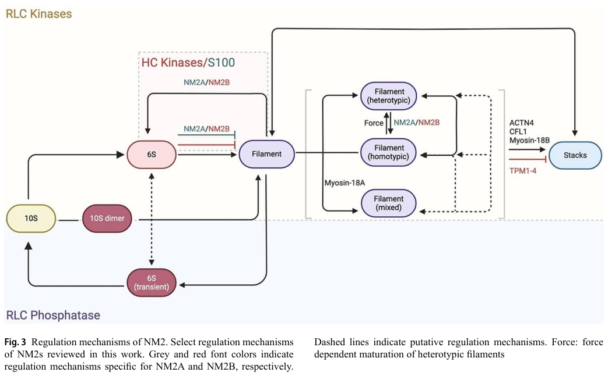

## Question

# Gene Research for Functional Annotation

## ⚠️ CRITICAL: Gene/Protein Identification Context

**BEFORE YOU BEGIN RESEARCH:** You MUST verify you are researching the CORRECT gene/protein. Gene symbols can be ambiguous, especially for less well-characterized genes from non-model organisms.

### Target Gene/Protein Identity (from UniProt):
- **UniProt Accession:** P35580
- **Protein Description:** RecName: Full=Myosin-10; AltName: Full=Cellular myosin heavy chain, type B; AltName: Full=Myosin heavy chain 10; AltName: Full=Myosin heavy chain, non-muscle IIb; AltName: Full=Non-muscle myosin heavy chain B; Short=NMMHC-B; AltName: Full=Non-muscle myosin heavy chain IIb {ECO:0000303|PubMed:25428876}; Short=NMMHC II-b {ECO:0000303|PubMed:25428876}; Short=NMMHC-IIB {ECO:0000303|PubMed:25428876};
- **Gene Information:** Name=MYH10;
- **Organism (full):** Homo sapiens (Human).
- **Protein Family:** Belongs to the TRAFAC class myosin-kinesin ATPase
- **Key Domains:** IQ_motif_EF-hand-BS. (IPR000048); Kinesin_motor_dom_sf. (IPR036961); Myosin_head_motor_dom-like. (IPR001609); Myosin_S1_N. (IPR008989); Myosin_tail. (IPR002928)

### MANDATORY VERIFICATION STEPS:

1. **Check if the gene symbol "MYH10" matches the protein description above**
2. **Verify the organism is correct:** Homo sapiens (Human).
3. **Check if protein family/domains align with what you find in literature**
4. **If you find literature for a DIFFERENT gene with the same or similar symbol, STOP**

### If Gene Symbol is Ambiguous or You Cannot Find Relevant Literature:

**DO NOT PROCEED WITH RESEARCH ON A DIFFERENT GENE.** Instead:
- State clearly: "The gene symbol 'MYH10' is ambiguous or literature is limited for this specific protein"
- Explain what you found (e.g., "Found extensive literature on a different gene with the same symbol in a different organism")
- Describe the protein based ONLY on the UniProt information provided above
- Suggest that the protein function can be inferred from domain/family information

### Research Target:

Please provide a comprehensive research report on the gene **MYH10** (gene ID: MYH10, UniProt: P35580) in human.

The research report should be a detailed narrative explaining the function, biological processes, and localization of the gene product. Citations should be given for all claims.

You should prioritize authoritative reviews and primary scientific literature when conducting research. You can supplement
this with annotations you find in gene/protein databases, but these can be outdated or inaccurate.

We are specifically interested in the primary function of the gene - for enzymes, what reaction is catalyzed, and what is the substrate specificity? For transporters, what is the substrate? For structural proteins or adapters, what is the broader structural role? For signaling molecules, what is the role in the pathway.

We are interested in where in or outside the cell the gene product carries out its function.

We are also interested in the signaling or biochemical pathways in which the gene functions. We are less interested in broad pleiotropic effects, except where these elucidate the precise role.

Include evidence where possible. We are interested in both experimental evidence as well as inference from structure, evolution, or bioinformatic analysis. Precise studies should be prioritized over high-throughput, where available.

## Output

Question: You are an expert researcher providing comprehensive, well-cited information.

Provide detailed information focusing on:
1. Key concepts and definitions with current understanding
2. Recent developments and latest research (prioritize 2023-2024 sources)
3. Current applications and real-world implementations
4. Expert opinions and analysis from authoritative sources
5. Relevant statistics and data from recent studies

Format as a comprehensive research report with proper citations. Include URLs and publication dates where available.
Always prioritize recent, authoritative sources and provide specific citations for all major claims.

# Gene Research for Functional Annotation

## ⚠️ CRITICAL: Gene/Protein Identification Context

**BEFORE YOU BEGIN RESEARCH:** You MUST verify you are researching the CORRECT gene/protein. Gene symbols can be ambiguous, especially for less well-characterized genes from non-model organisms.

### Target Gene/Protein Identity (from UniProt):
- **UniProt Accession:** P35580
- **Protein Description:** RecName: Full=Myosin-10; AltName: Full=Cellular myosin heavy chain, type B; AltName: Full=Myosin heavy chain 10; AltName: Full=Myosin heavy chain, non-muscle IIb; AltName: Full=Non-muscle myosin heavy chain B; Short=NMMHC-B; AltName: Full=Non-muscle myosin heavy chain IIb {ECO:0000303|PubMed:25428876}; Short=NMMHC II-b {ECO:0000303|PubMed:25428876}; Short=NMMHC-IIB {ECO:0000303|PubMed:25428876};
- **Gene Information:** Name=MYH10;
- **Organism (full):** Homo sapiens (Human).
- **Protein Family:** Belongs to the TRAFAC class myosin-kinesin ATPase
- **Key Domains:** IQ_motif_EF-hand-BS. (IPR000048); Kinesin_motor_dom_sf. (IPR036961); Myosin_head_motor_dom-like. (IPR001609); Myosin_S1_N. (IPR008989); Myosin_tail. (IPR002928)

### MANDATORY VERIFICATION STEPS:

1. **Check if the gene symbol "MYH10" matches the protein description above**
2. **Verify the organism is correct:** Homo sapiens (Human).
3. **Check if protein family/domains align with what you find in literature**
4. **If you find literature for a DIFFERENT gene with the same or similar symbol, STOP**

### If Gene Symbol is Ambiguous or You Cannot Find Relevant Literature:

**DO NOT PROCEED WITH RESEARCH ON A DIFFERENT GENE.** Instead:
- State clearly: "The gene symbol 'MYH10' is ambiguous or literature is limited for this specific protein"
- Explain what you found (e.g., "Found extensive literature on a different gene with the same symbol in a different organism")
- Describe the protein based ONLY on the UniProt information provided above
- Suggest that the protein function can be inferred from domain/family information

### Research Target:

Please provide a comprehensive research report on the gene **MYH10** (gene ID: MYH10, UniProt: P35580) in human.

The research report should be a detailed narrative explaining the function, biological processes, and localization of the gene product. Citations should be given for all claims.

You should prioritize authoritative reviews and primary scientific literature when conducting research. You can supplement
this with annotations you find in gene/protein databases, but these can be outdated or inaccurate.

We are specifically interested in the primary function of the gene - for enzymes, what reaction is catalyzed, and what is the substrate specificity? For transporters, what is the substrate? For structural proteins or adapters, what is the broader structural role? For signaling molecules, what is the role in the pathway.

We are interested in where in or outside the cell the gene product carries out its function.

We are also interested in the signaling or biochemical pathways in which the gene functions. We are less interested in broad pleiotropic effects, except where these elucidate the precise role.

Include evidence where possible. We are interested in both experimental evidence as well as inference from structure, evolution, or bioinformatic analysis. Precise studies should be prioritized over high-throughput, where available.

# MYH10 (UniProt P35580) Functional Annotation Report

## Executive summary

**MYH10 is unambiguously the human gene encoding non-muscle myosin heavy chain IIB (NMHC-IIB; NM2-B/NMIIB), UniProt P35580.** It is distinct from **MYH9/NM2-A**, **MYH14/NM2-C**, and the unrelated unconventional myosin-X gene **MYO10**. The literature identifies MYH10 as an actin-based, class-2 mechanochemical ATPase with an N-terminal myosin motor, a two-IQ-motif light-chain-binding neck, and a long coiled-coil, filament-forming tail. This agrees with the UniProt identity, TRAFAC myosin–kinesin ATPase family assignment, and supplied motor-head, IQ, and myosin-tail domains. No conflicting gene or organism was used in this report. (juarez2024newmechanismsof pages 36-39, chinthalapudi2024structureregulationand pages 1-2)

The primary function of NM2-B is to convert ATP hydrolysis into mechanical work on filamentous actin. Regulated MYH10-containing hexamers assemble into bipolar minifilaments that crosslink and slide antiparallel actin filaments, generating and sustaining cortical, adhesion-associated, cytokinetic, and tissue-level tension. Compared with NM2-A, NM2-B is slower, has a higher duty ratio, and is more load sensitive—properties suited to persistent tension and actin crosslinking rather than rapid transport. (chinthalapudi2024structureregulationand pages 2-4, chinthalapudi2024structureregulationand pages 10-11, chinthalapudi2024structureregulationand pages 1-2)

| Category | Best-supported annotation | Key quantitative/direct evidence | Evidence type and source/date |
|---|---|---|---|
| Identity and aliases | **Human MYH10 (UniProt P35580)** encodes non-muscle myosin heavy chain IIB (**NMHC-IIB; NM2-B/NMIIB; myosin-10**). It is distinct from **MYH9/NMHC-IIA (NM2-A)** and **MYH14/NMHC-IIC (NM2-C)**; it is not the unconventional motor myosin-X/MYO10. | Independent literature assigns the three human non-muscle myosin-2 heavy chains to MYH9, MYH10, and MYH14, respectively. | Authoritative mechanistic review, published June 2024; disease review, December 2015 (chinthalapudi2024structureregulationand pages 1-2, newelllitwa2015nonmusclemyosinii pages 3-4) |
| Molecular architecture | Class-2, filament-forming actin motor. Two MYH10 heavy chains dimerize and bind two essential plus two regulatory light chains, forming a hexamer. Each heavy chain has an N-terminal actin- and nucleotide-binding motor, a two-IQ-motif neck/lever arm, an approximately 160-nm coiled-coil tail, assembly-competence regions, and a non-helical tailpiece. This agrees with the supplied UniProt motor-head, IQ, and myosin-tail domains. | The complete hexamer is approximately **525 kDa**. NM2 paralogs share approximately **65–78%** overall sequence identity, **77–86%** in the motor, and **57–73%** in the tail. | Structural synthesis and comparative sequence analysis, June 2024 (chinthalapudi2024structureregulationand pages 1-2) |
| Catalytic reaction and substrates | Actin-activated **MgATPase/mechanochemical motor**: MgATP + H₂O → MgADP + Pi, coupled to binding and displacement of filamentous actin. ATP binding dissociates actomyosin; hydrolysis primes the head; actin rebinding and Pi release drive the power stroke; ADP release returns the rigor state. Physiological protein substrate/track is **F-actin**, not a soluble small-molecule substrate. | One cycle produces approximately **7 nm** displacement. The motor contains conserved P-loop, switch-1, and switch-2 nucleotide-sensing elements; actin binding closes the motor cleft and promotes strong binding. | Structural, kinetic, and biochemical synthesis, June 2024 (chinthalapudi2024structureregulationand pages 2-4, chinthalapudi2024structureregulationand pages 4-6) |
| Motor specialization | NM2-B is a relatively slow, higher-duty-ratio, strongly mechanosensitive motor adapted for **persistent tension, actin crosslinking, and load bearing**, whereas NM2-A generally supports faster contraction. Single NM2-B dimers are not constitutively processive transport motors; force emerges primarily from cooperative filament ensembles. | Reported unloaded duty ratio is approximately **20–40%**. Resisting load alters NM2-B ADP release about **12-fold**, versus approximately **5-fold** for NM2-A; cooperative filaments can achieve a collective duty ratio **>0.8**. | Biochemical/biophysical review and kinetic synthesis, 2024 (juarez2024newmechanismsof pages 36-39, chinthalapudi2024structureregulationand pages 2-4, chinthalapudi2024structureregulationand pages 10-11) |
| Filament assembly and regulation | Unphosphorylated NM2-B can occupy a folded, assembly-incompetent **10S** state with an interacting-heads motif. Regulatory-light-chain **Ser19 phosphorylation** relieves autoinhibition and permits bipolar-filament assembly; Thr18/Ser19 diphosphorylation further promotes actin-bundle association and contraction. MYH10 heavy-chain **Ser1935** phosphorylation controls NM2-B assembly/dynamics during front–rear polarization. | Tail folding suppresses Pi release approximately **100-fold** and leaves weak actin affinity (**KD >100 μM**). An NM2-B filament contains approximately **30 hexameric monomers**; NM2 filaments are approximately **300 nm** long, **7.9–11.5 nm** wide, with **166–219 nm** bare zones. | Cryo-EM-informed structural review and cell-regulatory evidence, June 2024; pathway review, December 2015 (chinthalapudi2024structureregulationand pages 6-7, newelllitwa2015nonmusclemyosinii pages 2-2, chinthalapudi2024structureregulationand media 5d081ffd) |
| Biochemical pathway inputs | Major upstream inputs converge on regulatory-light-chain phosphorylation: **Ca²⁺/calmodulin–MLCK** and Rho-family pathways involving **RhoA–ROCK**, MRCK, and PAK; myosin light-chain phosphatase reverses activation. Tail phosphorylation, tropomyosin identity, actin isoform, and mechanical load further tune assembly and motor kinetics. | With β-actin in vitro, tropomyosins increased NM2-B duty ratio from about **20%** to **67%** (Tpm1.12) or nearly **100%** (Tpm1.8/Tpm3.1); Tpm1.12 prolonged cycle time **3.7-fold**, whereas Tpm1.8 and Tpm3.1 shortened it by **27%** and **63%**. | Primary stopped-flow, ATPase, and motility study, January 2018; regulatory reviews, 2015 and 2024 (pathanchhatbar2018threemammaliantropomyosin pages 1-2, pathanchhatbar2018threemammaliantropomyosin pages 4-5, pathanchhatbar2018threemammaliantropomyosin pages 3-4, newelllitwa2015nonmusclemyosinii pages 2-2) |
| Subcellular localization | Cytoplasmic and actin-associated: bipolar minifilaments in stress fibers, the cell cortex, adhesion-associated actomyosin networks, and the cytokinetic apparatus. Relative to NM2-A, NM2-B is preferentially enriched toward the **rear of migrating cells**. In nervous tissue it occurs in neuronal soma, growth cones, dendrites/spines, presynaptic terminals, and radial-glial apical/basal endfeet. | Mouse cortical proteomics estimated NM2-B at **67%** of cortical NM2, versus 29% NM2-A and 4% NM2-C. In vivo proximity proteomics and smiFISH detected MYH10 protein and transcript enrichment in embryonic radial-glial basal endfeet. | Proteomics, microscopy, transcript localization, and review evidence, 2020–2023 (krollhermi2020identificationandvalidation pages 131-134, javiertorrent2020conventionalandnonconventional pages 3-5, d’arcy2023nonmusclemyosinscontrol pages 1-2, d’arcy2023nonmusclemyosinscontrol pages 8-10) |
| Core structural and cellular roles | By crosslinking and sliding antiparallel F-actin, NM2-B maintains cortical and tissue tension, stabilizes cell–cell and cell–matrix adhesions, controls rear retraction and directional migration, and helps constrict the actomyosin contractile ring during cytokinesis. These are direct consequences of its filament-forming motor activity rather than independent signaling functions. | MYH10/NM2-B knockdown produces multinucleated cells. Mouse knockout reduced cardiomyocyte number by approximately **70%** and increased binucleation from **1% to 23%** by embryonic day 12.5. | Cell perturbation and mouse genetic evidence summarized in the June 2024 review (chinthalapudi2024structureregulationand pages 1-2) |
| Neural and developmental processes | Particularly important for neuronal migration/nuclear translocation, growth-cone and dendritic-spine remodeling, synaptic-vesicle recycling and receptor organization, neuroepithelial/radial-glial adhesion, and cardiac morphogenesis. MYH10’s high neuronal abundance and tension-bearing kinetics fit these functions. | Radial-glial Myh10 conditional knockout detached almost all basal endfeet at E16.5, increased marginal-zone nuclei by **33%**, expanded the calretinin-positive layer **2.4-fold**, and increased LHX6-positive interneurons by **43%** (**n=9 per genotype** for LHX6). | Direct conditional mouse genetics and quantitative histology, published February 28, 2023 (d’arcy2023nonmusclemyosinscontrol pages 14-17) |
| Additional experimentally supported implementation | In adipocytes, MYH10 participates in insulin-responsive GLUT4-vesicle positioning/trafficking through a PKCζ-regulated MYH10–GLUT4 complex; this is a context-specific cytoskeletal implementation, not evidence that MYH10 transports glucose itself. | PKCζ inhibition reduced membrane-to-cytoplasmic enrichment **1.7-fold for GLUT4** and **2-fold for MYH10**; localization quantification used **n=41 cells per condition**. | 3T3-L1 knockdown, imaging, co-immunoprecipitation, and rescue experiments, February 2022 (kislev2022myh10governsadipocyte pages 10-12, kislev2022myh10governsadipocyte pages 1-2) |
| Human disease and clinical relevance | Heterozygous MYH10 variants are associated with rare neurodevelopmental and congenital phenotypes, including developmental delay/intellectual disability, microcephaly, structural brain abnormalities, hydrocephalus, and variable multisystem anomalies. Variant interpretation should consider whether the motor, coiled-coil, or terminal assembly region is disrupted and whether dominant-negative filament poisoning is plausible. | The first reported case carried de novo **c.2722G>T (p.Glu908Ter)**, truncating the coiled-coil/tail, with severe developmental and brain abnormalities plus congenital diaphragmatic hernia. A separate family’s **p.Arg1471Pro** coiled-coil variant segregated in three affected relatives and caused reduced protein, abnormal localization, and disrupted actin organization in fibroblasts. | Human trio sequencing/case report, 2013; family segregation plus functional studies, 2020; curated disease-target evidence (tuzovic2013ahumande pages 1-3, krollhermi2020identificationandvalidation pages 127-131, OpenTargets Search: -MYH10) |
| Translational status | Present real-world use is principally **rare-disease genomic diagnosis/variant interpretation**, patient-cell and animal modeling, and experimental manipulation of actomyosin mechanics. Broad NM2 inhibitors such as blebbistatin are research tools, but they are not MYH10-selective. No approved MYH10-selective drug, validated MYH10 biomarker-guided therapy, or established clinical intervention was identified in the gathered evidence. | Disease associations are supported by small numbers of rare cases and models; clinical penetrance, genotype–phenotype relationships, and whether individual alleles cause haploinsufficiency or dominant-negative effects remain incompletely resolved. | Critical synthesis of mechanistic and human genetic evidence through 2024 (chinthalapudi2024structureregulationand pages 2-4, tuzovic2013ahumande pages 5-6, krollhermi2020identificationandvalidation pages 131-134) |

*Table: Compact evidence map for human MYH10/P35580, integrating molecular mechanism, localization, biological functions, quantitative findings, human genetics, and translational status while distinguishing NM2-B from its MYH9- and MYH14-encoded paralogs.*

## 1. Identity verification and nomenclature

The accepted relationship is:

- **Gene:** MYH10, human.
- **Protein:** non-muscle myosin heavy chain IIB, also called NMHC-IIB, NMMHC-B, NM2-B, NMIIB, cellular myosin heavy chain type B, or myosin-10.
- **Paralogs:** MYH9 encodes NM2-A/NMHC-IIA; MYH14 encodes NM2-C/NMHC-IIC.
- **Important naming caution:** MYH10 “myosin-10” should not be confused with **MYO10**, which encodes the structurally and functionally different unconventional myosin-X.

The three mammalian NM2 heavy-chain genes are expressed in tissue- and development-dependent patterns. A 2024 review reports that NM2-A and NM2-B are broadly present, whereas NM2-C is generally more restricted and less abundant. Reported cellular concentrations span approximately 0.036–0.68 μM for NM2-B, compared with 0.2–10.8 μM for NM2-A and approximately 0.049 μM for NM2-C, although abundance is strongly cell-context dependent. (chinthalapudi2024structureregulationand pages 1-2)

## 2. Molecular structure and domain interpretation

NM2-B is a hexameric motor composed of two MYH10 heavy chains, two essential light chains, and two regulatory light chains. Each heavy chain contains:

1. An approximately 15-nm N-terminal motor domain with the actin-binding interface and MgATPase nucleotide pocket.
2. A neck/lever arm containing two IQ motifs, which bind essential and regulatory light chains.
3. An approximately 160-nm α-helical tail that dimerizes as a coiled coil.
4. C-terminal assembly-competence regions and a short non-helical tailpiece that regulate filament assembly and isoform-specific interactions. (chinthalapudi2024structureregulationand pages 1-2, chinthalapudi2024structureregulationand pages 6-7)

The complete two-heavy-chain/two-ELC/two-RLC complex is approximately 525 kDa. NM2 paralogs share about 65–78% overall sequence identity, with greater conservation in the motor domain—approximately 77–86%—than in the tail, approximately 57–73%. Tail divergence helps explain differences in assembly, localization, and partner interactions. (chinthalapudi2024structureregulationand pages 1-2)

This architecture fully aligns with the supplied UniProt annotations: the myosin-head/motor domains account for ATP hydrolysis and actin binding; the IQ motifs bind light chains and form the lever arm; and the coiled-coil myosin tail supports dimerization and bipolar-filament assembly. The “kinesin motor domain superfamily” label reflects distant structural membership in the P-loop/related motor ATPase fold and does **not** mean that MYH10 is a microtubule-based kinesin.

## 3. Primary biochemical function

### 3.1 Reaction and substrate specificity

NM2-B catalyzes an actin-activated MgATPase reaction:

**MgATP + H₂O → MgADP + Pi**, coupled to force and displacement along **F-actin**.

ATP binding lowers the motor’s affinity for actin and dissociates actomyosin. ATP hydrolysis primes the lever arm in a weak-actin-binding ADP·Pi state. Rebinding to F-actin, followed by phosphate release, produces strong binding and the power stroke; ADP release completes the cycle and restores the rigor state. One mechanochemical cycle produces an approximately 7-nm displacement. Thus, ATP is the chemical substrate and F-actin is the physiological track/mechanical substrate. (juarez2024newmechanismsof pages 36-39, chinthalapudi2024structureregulationand pages 2-4, chinthalapudi2024structureregulationand pages 4-6)

The motor’s conserved P-loop, switch-1, and switch-2 motifs couple nucleotide state to the actin-binding cleft, converter, and lever arm. The neck amplifies relatively small motor-domain rearrangements into a roughly 60–70° power stroke. (chinthalapudi2024structureregulationand pages 4-6)

### 3.2 Functional specialization

NM2-B has a higher actin-attached duty ratio than NM2-A. A typical unloaded estimate is approximately 20–40%, although splice isoforms, actin-associated proteins, load, and assay conditions alter this value. Its relatively slow ADP release and pronounced load dependence allow long-lived strong actin binding and sustained force. Under resisting load, ADP release is affected approximately 12-fold for NM2-B, versus about fivefold for NM2-A; attachment can consequently become extremely prolonged. (juarez2024newmechanismsof pages 36-39, chinthalapudi2024structureregulationand pages 10-11)

This does not make a single NM2-B dimer a conventional processive cargo transporter. Physiological force is primarily generated by ensembles in bipolar filaments. Filament size and individual-motor duty ratio are balanced so the collective duty ratio exceeds approximately 0.8, maintaining continuous actin engagement. Experts therefore interpret NM2-B chiefly as a tension-bearing, actin-crosslinking contractile motor, whereas NM2-A is generally optimized for faster contractile remodeling. (chinthalapudi2024structureregulationand pages 2-4)

### 3.3 Regulation by the actin track

The composition of the actin filament itself is regulatory. β- and γ-actin produce greater NM2 ATPase activation, coupling efficiency, and gliding velocity than α-actin. Tropomyosin isoforms further tune MYH10 kinetics. In vitro, the basal NM2-B duty ratio of approximately 20% rose to 67% with Tpm1.12 and nearly 100% with Tpm1.8 or Tpm3.1. Tpm1.12 prolonged the ATPase cycle 3.7-fold, whereas Tpm1.8 and Tpm3.1 shortened it by 27% and 63%, respectively. These results show that NM2-B output depends on the molecular identity of its actin track, not only on the MYH10 sequence. (chinthalapudi2024structureregulationand pages 10-11, pathanchhatbar2018threemammaliantropomyosin pages 1-2, pathanchhatbar2018threemammaliantropomyosin pages 4-5)

## 4. Filament assembly and activation

In the presence of ATP and without activating regulatory-light-chain phosphorylation, NM2 can adopt a compact, autoinhibited **10S** conformation. Its two heads form an asymmetric interacting-heads motif, and the tail folds around the heads. This state inhibits phosphate release approximately 100-fold and has weak actin affinity, with reported KD greater than 100 μM. (chinthalapudi2024structureregulationand pages 6-7)

Phosphorylation of regulatory-light-chain Ser19 prevents formation of the inhibitory interacting-heads arrangement and permits assembly into bipolar filaments; Thr18/Ser19 diphosphorylation further favors actin-bundle association and contraction. Importantly, current structural interpretation is that Ser19 phosphorylation relieves structural autoinhibition rather than directly changing the catalytic chemistry of an isolated head. (chinthalapudi2024structureregulationand pages 6-7, newelllitwa2015nonmusclemyosinii pages 2-2)

An NM2-B filament contains approximately 30 hexameric monomers. General NM2 filament dimensions are approximately 300 nm in contour length, 7.9–11.5 nm in width, with a 166–219-nm central bare zone. Filaments may be homotypic, heterotypic with other NM2 paralogs, or mixed with myosin-18A, and can mature into higher-order stacks. The inspected 2024 regulatory model integrates the 10S, 6S, filament, mixed-filament, and stack states with kinase, phosphatase, tail-regulatory, and force inputs. (chinthalapudi2024structureregulationand pages 6-7, chinthalapudi2024structureregulationand media 5d081ffd)

MYH10 also has a short, serine-rich regulatory motif near the coiled-coil/non-helical-tail boundary. Heavy-chain Ser1935 is a major site controlling NM2-B filament assembly and dynamics during front–back polarization. In contrast to NM2-A, for which S100-mediated removal can be prominent, tail phosphorylation appears particularly important for NM2-B assembly control. (chinthalapudi2024structureregulationand pages 6-7, chinthalapudi2024structureregulationand pages 10-11)

## 5. Upstream signaling pathways

MYH10 functions near the mechanical-output end of several signaling pathways:

- **Ca²⁺/calmodulin–MLCK:** calcium-activated myosin light-chain kinase phosphorylates RLC.
- **Rho-family signaling:** RhoA–ROCK promotes myosin activation through RLC phosphorylation and inhibition of myosin phosphatase; MRCK and PAK can regulate RLC in context-dependent fashions.
- **Myosin light-chain phosphatase:** reverses RLC phosphorylation and favors relaxation/disassembly.
- **Heavy-chain kinases, phosphatases, and tail-binding proteins:** regulate NM2-B filament dynamics.
- **Mechanical load:** directly slows product release and prolongs actin attachment, making NM2-B a mechanosensitive endpoint as well as a force generator.
- **Tropomyosin and actin isoforms:** specify the kinetic properties of the actomyosin system. (chinthalapudi2024structureregulationand pages 10-11, perezdiaz2026asongof pages 2-4, newelllitwa2015nonmusclemyosinii pages 2-2, chinthalapudi2024structureregulationand media 5d081ffd)

These pathways position MYH10 downstream of adhesion receptors, integrins, GPCRs, receptor tyrosine kinases, calcium signals, and Rho GTPases. MYH10 is therefore better described as a regulated mechanical effector than as a receptor or canonical signal-transduction enzyme. (perezdiaz2026asongof pages 2-4)

## 6. Subcellular localization

NM2-B is intracellular and principally cytoplasmic/cytoskeletal. It assembles on actin-rich structures including stress fibers, the cell cortex, adhesion-associated actomyosin bundles, and the cytokinetic apparatus. In polarized migrating cells it is preferentially concentrated toward the rear, in contrast to the more anterior/central distribution commonly observed for NM2-A. This localization supports rear retraction, adhesion stabilization, and maintenance of front–back polarity. (krollhermi2020identificationandvalidation pages 131-134, newelllitwa2015nonmusclemyosinii pages 3-4)

The nervous system shows particularly strong enrichment. Mouse cortical proteomics estimated NM2-B as 67% of total cortical NM2, compared with 29% NM2-A and 4% NM2-C. In neurons, NM2-B occurs in soma, actin-rich growth cones, the proximal leading process of migrating neurons, dendritic branch points, mature dendritic-spine heads and necks, and presynaptic terminals. At synapses it contributes to vesicle recycling, dendritic-spine maturation, and glutamate-receptor organization. (newelllitwa2015nonmusclemyosinii pages 3-4, javiertorrent2020conventionalandnonconventional pages 3-5)

In embryonic radial glia, MYH10 protein is enriched in basal endfeet and Myh10 mRNA becomes increasingly localized there from E12.5 to E16.5, suggesting subcellular transcript targeting and potentially local protein synthesis. MYH10 is also required at apical endfeet, indicating that its localization and function are not confined to one end of these highly polarized cells. (d’arcy2023nonmusclemyosinscontrol pages 1-2, d’arcy2023nonmusclemyosinscontrol pages 8-10, d’arcy2023nonmusclemyosinscontrol pages 14-17)

## 7. Principal biological processes

### 7.1 Cell adhesion and migration

Bipolar NM2-B filaments crosslink and slide actin to stabilize stress fibers, mature adhesions, maintain cortical tension, and retract the rear of migrating cells. Its higher duty ratio is well matched to maintaining traction and directional persistence. MYH10 loss or disruption causes abnormal actin organization, adhesion, and migration in multiple experimental systems. (krollhermi2020identificationandvalidation pages 131-134, chinthalapudi2024structureregulationand pages 1-2, krollhermi2020identificationandvalidation pages 127-131)

### 7.2 Cytokinesis

NM2-B contributes to tension generation in the actomyosin contractile ring and is required for normal division in several cell types. MYH10 knockdown produces multinucleated cells. In mouse cardiac development, NM2-B loss reduced cardiomyocyte number by approximately 70% and increased binucleation from 1% to 23% by embryonic day 12.5, linking impaired proliferation/karyokinesis or cytokinesis to tissue-level cardiac defects. (chinthalapudi2024structureregulationand pages 10-11, chinthalapudi2024structureregulationand pages 1-2)

### 7.3 Neural development and synaptic function

NM2-B supplies forces for neuronal soma and nuclear translocation, regulates growth-cone actin organization and axon guidance, and supports dendritic-spine development and synaptic plasticity. Its neuronal enrichment and sustained-force kinetics provide a mechanistic rationale for the severe brain phenotypes of MYH10 disruption. (javiertorrent2020conventionalandnonconventional pages 20-21, javiertorrent2020conventionalandnonconventional pages 3-5)

A major recent development was the 2023 demonstration that radial-glial MYH10 controls cortical organization through endfoot adhesion. Conditional Myh10 loss detached almost all basal endfeet from the basement membrane and disrupted apical attachment. At E16.5, mutant marginal zones contained 33% more nuclei, a 2.4-fold thicker calretinin-positive layer, and 43% more LHX6-positive interneurons; LHX6 analysis included nine animals per genotype. Because Emx1-Cre was inactive in the interneurons, the effect was non-cell-autonomous: loss of MYH10 from radial glia changed the niche through which interneurons organize. (d’arcy2023nonmusclemyosinscontrol pages 14-17)

### 7.4 Heart and vascular development

Mouse genetics establishes an essential role in cardiac morphogenesis, cardiomyocyte alignment/proliferation, epicardial epithelial-to-mesenchymal transition, epicardial-cell migration, and coronary-vessel formation. Complete mouse loss is embryonically lethal around E14.5, emphasizing that this is a developmental structural/mechanical requirement rather than a minor modifier effect. (chinthalapudi2024structureregulationand pages 1-2)

### 7.5 Insulin-responsive GLUT4 trafficking

In 3T3-L1 adipocytes, MYH10 forms an insulin-regulated complex with GLUT4 and contributes to vesicle positioning and plasma-membrane delivery. PKCζ inhibition reduced membrane-to-cytoplasmic enrichment 1.7-fold for GLUT4 and twofold for MYH10, using 41 cells per condition, and reduced complex formation. MYH10 knockdown impaired adipogenesis, with rescue observed when knockdown cells acquired GLUT4 vesicles from neighboring wild-type cells. This is evidence for a context-specific cytoskeletal trafficking role; MYH10 does **not** transport glucose itself. (kislev2022myh10governsadipocyte pages 10-12, kislev2022myh10governsadipocyte pages 1-2)

## 8. Human disease evidence

The strongest established clinical theme is a rare, dominantly acting MYH10-associated neurodevelopmental/congenital disorder spectrum. Open Targets links MYH10 to neurodevelopmental and hereditary disease and to phenotypic features including hypertelorism, broad nasal morphology, and abnormal facial shape, but these database-level associations should be interpreted together with individual variant evidence. (OpenTargets Search: -MYH10)

The first reported patient was an eight-year-old boy with a heterozygous de novo nonsense variant, **c.2722G>T (p.Glu908Ter/E908X)**. The variant truncates the coiled-coil/tail and is predicted to disrupt filament assembly. Features included intrauterine growth restriction, microcephaly, severe developmental delay, failure to thrive, cerebral and cerebellar atrophy, hydrocephalus, hip dysplasia, and congenital diaphragmatic hernia. The absence of the variant from both parents and a sibling established de novo inheritance. Haploinsufficiency and dominant-negative poisoning of filament assembly were both proposed; the original study could not distinguish them. (tuzovic2013ahumande pages 5-6, tuzovic2013ahumande pages 1-3, tuzovic2013ahumande pages 3-4)

A separate autosomal-dominant family carried **p.Arg1471Pro** in the conserved coiled-coil tail. Three affected relatives had congenital ocular abnormalities, including severe ptosis, microcornea, and coloboma, with variable neurological/imaging findings. Patient fibroblasts had reduced MYH10 protein despite similar RNA abundance, abnormal intracellular localization, loss of MYH10–actin colocalization, shortened/disorganized actin fibers, and altered Arp3 distribution. Zebrafish knockdown produced eye-development and muscle-integrity defects. Because the early evidence came from a single family, this cranio-ocular presentation was initially best viewed as a strongly supported candidate MYH10 phenotype rather than a fully defined syndrome. (krollhermi2020identificationandvalidation pages 127-131, krollhermi2020identificationandvalidation pages 131-134)

Variant interpretation should consider domain and mechanism. Motor-domain variants may alter ATPase or force generation; coiled-coil and terminal-tail variants may impair dimerization, bipolar-filament assembly, localization, or regulation. Because NM2-B acts cooperatively in multimolecular filaments, some alleles could exert dominant-negative effects disproportionate to simple dosage loss. The penetrance and genotype–phenotype relationships remain incompletely resolved.

## 9. Recent research and expert assessment

The most authoritative recent synthesis retrieved was Chinthalapudi and Heissler, **“Structure, regulation, and mechanisms of nonmuscle myosin-2,” published June 2024** in *Cellular and Molecular Life Sciences*, DOI: https://doi.org/10.1007/s00018-024-05264-6. Its central expert interpretation is that NM2 paralogs are mechanochemical ATPases whose specialized cellular functions emerge from coordinated differences in motor kinetics, mechanosensitivity, autoinhibition, filament assembly, and spatial regulation—not simply from where each gene is expressed. For MYH10, high duty ratio, strong load sensitivity, neuronal enrichment, and tail-specific regulation collectively explain its specialization for stable tension-bearing structures. (chinthalapudi2024structureregulationand pages 2-4, chinthalapudi2024structureregulationand pages 10-11, chinthalapudi2024structureregulationand pages 1-2)

The leading 2023 advance was D’Arcy et al., **published February 28, 2023**, *PLOS Biology*, DOI: https://doi.org/10.1371/journal.pbio.3001926. It moved MYH10 annotation beyond generic “neuronal migration” by identifying a precise subcellular site—radial-glial endfeet—and showing that MYH10-dependent adhesion non-cell-autonomously controls interneuron number and organization in the developing cortex. (d’arcy2023nonmusclemyosinscontrol pages 14-17, d’arcy2023nonmusclemyosinscontrol pages 1-2)

## 10. Applications and translational status

Current real-world applications are chiefly:

1. **Rare-disease genomic diagnosis and variant interpretation**, particularly for patients with developmental delay, microcephaly, hydrocephalus, structural brain abnormalities, ocular anomalies, or multisystem congenital findings.
2. **Patient-cell functional assays**, assessing protein abundance, localization, actin organization, and filament behavior.
3. **Animal and organoid/cell models** of cortical, cardiac, epithelial, and metabolic development.
4. **Experimental control of cell mechanics**, using broad NM2 inhibitors, light-chain kinase/phosphatase manipulation, or engineered MYH10 alleles.

The translational limitations are substantial. Blebbistatin and related compounds inhibit NM2 motors broadly and are not MYH10-selective; phenotypes obtained with them cannot automatically be assigned to NM2-B. No approved MYH10-selective drug, clinically validated MYH10 pharmacodynamic biomarker, or gene-specific therapy was identified in the evidence reviewed. Given MYH10’s essential roles in cytokinesis, brain development, and cardiac morphogenesis, systemic inhibition would also be expected to have a narrow safety margin. The near-term clinical value is therefore diagnostic and mechanistic rather than therapeutic.

## Conclusion

Human MYH10/P35580 is a filament-forming non-muscle myosin-II heavy chain whose primary function is ATP-dependent force generation on F-actin. Its biochemical signature—slow cycling, relatively high duty ratio, strong load sensitivity, and regulated bipolar-filament assembly—makes it especially effective at sustaining tension and organizing actin structures. It acts intracellularly in stress fibers, cortex, adhesions, the cytokinetic apparatus, neuronal growth cones and synapses, and radial-glial endfeet. The best-supported physiological roles are adhesion, polarized migration, cytokinesis, neuronal and cortical development, synaptic organization, and cardiac morphogenesis. Recent work has sharpened this annotation from a broad cytoskeletal motor to a spatially regulated, load-bearing mechanical effector with particularly important functions in neural development. Human genetics supports a rare dominant neurodevelopmental/congenital disease spectrum, but allele-specific mechanisms and genotype–phenotype relationships require further functional and longitudinal study.

References

1. (juarez2024newmechanismsof pages 36-39): Gloria Asensio Juárez. New mechanisms of contractile protein non-muscle myosin ii regulation: role of microtubules and tropomyosins in the control of cell contractility. ArXiv, 2024. URL: https://doi.org/10.14201/gredos.161100, doi:10.14201/gredos.161100. This article has 0 citations.

2. (chinthalapudi2024structureregulationand pages 1-2): Krishna Chinthalapudi and Sarah M. Heissler. Structure, regulation, and mechanisms of nonmuscle myosin-2. Cellular and Molecular Life Sciences: CMLS, Jun 2024. URL: https://doi.org/10.1007/s00018-024-05264-6, doi:10.1007/s00018-024-05264-6. This article has 26 citations.

3. (chinthalapudi2024structureregulationand pages 2-4): Krishna Chinthalapudi and Sarah M. Heissler. Structure, regulation, and mechanisms of nonmuscle myosin-2. Cellular and Molecular Life Sciences: CMLS, Jun 2024. URL: https://doi.org/10.1007/s00018-024-05264-6, doi:10.1007/s00018-024-05264-6. This article has 26 citations.

4. (chinthalapudi2024structureregulationand pages 10-11): Krishna Chinthalapudi and Sarah M. Heissler. Structure, regulation, and mechanisms of nonmuscle myosin-2. Cellular and Molecular Life Sciences: CMLS, Jun 2024. URL: https://doi.org/10.1007/s00018-024-05264-6, doi:10.1007/s00018-024-05264-6. This article has 26 citations.

5. (newelllitwa2015nonmusclemyosinii pages 3-4): Karen A. Newell-Litwa, Rick Horwitz, and Marcelo L. Lamers. Non-muscle myosin ii in disease: mechanisms and therapeutic opportunities. Disease Models & Mechanisms, 8:1495-1515, Dec 2015. URL: https://doi.org/10.1242/dmm.022103, doi:10.1242/dmm.022103. This article has 231 citations and is from a domain leading peer-reviewed journal.

6. (chinthalapudi2024structureregulationand pages 4-6): Krishna Chinthalapudi and Sarah M. Heissler. Structure, regulation, and mechanisms of nonmuscle myosin-2. Cellular and Molecular Life Sciences: CMLS, Jun 2024. URL: https://doi.org/10.1007/s00018-024-05264-6, doi:10.1007/s00018-024-05264-6. This article has 26 citations.

7. (chinthalapudi2024structureregulationand pages 6-7): Krishna Chinthalapudi and Sarah M. Heissler. Structure, regulation, and mechanisms of nonmuscle myosin-2. Cellular and Molecular Life Sciences: CMLS, Jun 2024. URL: https://doi.org/10.1007/s00018-024-05264-6, doi:10.1007/s00018-024-05264-6. This article has 26 citations.

8. (newelllitwa2015nonmusclemyosinii pages 2-2): Karen A. Newell-Litwa, Rick Horwitz, and Marcelo L. Lamers. Non-muscle myosin ii in disease: mechanisms and therapeutic opportunities. Disease Models & Mechanisms, 8:1495-1515, Dec 2015. URL: https://doi.org/10.1242/dmm.022103, doi:10.1242/dmm.022103. This article has 231 citations and is from a domain leading peer-reviewed journal.

9. (chinthalapudi2024structureregulationand media 5d081ffd): Krishna Chinthalapudi and Sarah M. Heissler. Structure, regulation, and mechanisms of nonmuscle myosin-2. Cellular and Molecular Life Sciences: CMLS, Jun 2024. URL: https://doi.org/10.1007/s00018-024-05264-6, doi:10.1007/s00018-024-05264-6. This article has 26 citations.

10. (pathanchhatbar2018threemammaliantropomyosin pages 1-2): Salma Pathan-Chhatbar, Manuel H. Taft, Theresia Reindl, Nikolas Hundt, Sharissa L. Latham, and Dietmar J. Manstein. Three mammalian tropomyosin isoforms have different regulatory effects on nonmuscle myosin-2b and filamentous β-actin in vitro. Journal of Biological Chemistry, 293:863-875, Jan 2018. URL: https://doi.org/10.1074/jbc.m117.806521, doi:10.1074/jbc.m117.806521. This article has 60 citations and is from a domain leading peer-reviewed journal.

11. (pathanchhatbar2018threemammaliantropomyosin pages 4-5): Salma Pathan-Chhatbar, Manuel H. Taft, Theresia Reindl, Nikolas Hundt, Sharissa L. Latham, and Dietmar J. Manstein. Three mammalian tropomyosin isoforms have different regulatory effects on nonmuscle myosin-2b and filamentous β-actin in vitro. Journal of Biological Chemistry, 293:863-875, Jan 2018. URL: https://doi.org/10.1074/jbc.m117.806521, doi:10.1074/jbc.m117.806521. This article has 60 citations and is from a domain leading peer-reviewed journal.

12. (pathanchhatbar2018threemammaliantropomyosin pages 3-4): Salma Pathan-Chhatbar, Manuel H. Taft, Theresia Reindl, Nikolas Hundt, Sharissa L. Latham, and Dietmar J. Manstein. Three mammalian tropomyosin isoforms have different regulatory effects on nonmuscle myosin-2b and filamentous β-actin in vitro. Journal of Biological Chemistry, 293:863-875, Jan 2018. URL: https://doi.org/10.1074/jbc.m117.806521, doi:10.1074/jbc.m117.806521. This article has 60 citations and is from a domain leading peer-reviewed journal.

13. (krollhermi2020identificationandvalidation pages 131-134): Ariane Kröll-Hermi. Identification and validation of novel genes implicated in neurosensory and neurological diseases. ArXiv, Jan 2020. URL: https://doi.org/10.5445/ir/1000118578, doi:10.5445/ir/1000118578. This article has 1 citations.

14. (javiertorrent2020conventionalandnonconventional pages 3-5): Míriam Javier-Torrent and Carlos A. Saura. Conventional and non-conventional roles of non-muscle myosin ii-actin in neuronal development and degeneration. Cells, 9:1926, Aug 2020. URL: https://doi.org/10.3390/cells9091926, doi:10.3390/cells9091926. This article has 34 citations.

15. (d’arcy2023nonmusclemyosinscontrol pages 1-2): Brooke R. D’Arcy, Ashley L. Lennox, Camila Manso Musso, Annalise Bracher, Carla F Escobar-Tomlienovich, Stephany Perez-Sanchez, and Debra L. Silver. Non-muscle myosins control radial glial basal endfeet to mediate interneuron organization. PLOS Biology, 21(2):e3001926, Feb 2023. URL: https://doi.org/10.1371/journal.pbio.3001926, doi:10.1371/journal.pbio.3001926. This article has 23 citations and is from a highest quality peer-reviewed journal.

16. (d’arcy2023nonmusclemyosinscontrol pages 8-10): Brooke R. D’Arcy, Ashley L. Lennox, Camila Manso Musso, Annalise Bracher, Carla F Escobar-Tomlienovich, Stephany Perez-Sanchez, and Debra L. Silver. Non-muscle myosins control radial glial basal endfeet to mediate interneuron organization. PLOS Biology, 21(2):e3001926, Feb 2023. URL: https://doi.org/10.1371/journal.pbio.3001926, doi:10.1371/journal.pbio.3001926. This article has 23 citations and is from a highest quality peer-reviewed journal.

17. (d’arcy2023nonmusclemyosinscontrol pages 14-17): Brooke R. D’Arcy, Ashley L. Lennox, Camila Manso Musso, Annalise Bracher, Carla F Escobar-Tomlienovich, Stephany Perez-Sanchez, and Debra L. Silver. Non-muscle myosins control radial glial basal endfeet to mediate interneuron organization. PLOS Biology, 21(2):e3001926, Feb 2023. URL: https://doi.org/10.1371/journal.pbio.3001926, doi:10.1371/journal.pbio.3001926. This article has 23 citations and is from a highest quality peer-reviewed journal.

18. (kislev2022myh10governsadipocyte pages 10-12): Nadav Kislev, Lisa Mor-Yossef Moldovan, Rakefet Barak, Michael Egozi, and Dafna Benayahu. Myh10 governs adipocyte function and adipogenesis through its interaction with glut4. International Journal of Molecular Sciences, 23:2367, Feb 2022. URL: https://doi.org/10.3390/ijms23042367, doi:10.3390/ijms23042367. This article has 21 citations.

19. (kislev2022myh10governsadipocyte pages 1-2): Nadav Kislev, Lisa Mor-Yossef Moldovan, Rakefet Barak, Michael Egozi, and Dafna Benayahu. Myh10 governs adipocyte function and adipogenesis through its interaction with glut4. International Journal of Molecular Sciences, 23:2367, Feb 2022. URL: https://doi.org/10.3390/ijms23042367, doi:10.3390/ijms23042367. This article has 21 citations.

20. (tuzovic2013ahumande pages 1-3): Lea Tuzovic, Lan Yu, Wenqi Zeng, Xiang Li, Hong Lu, Hsiao-Mei Lu, Kelly DF Gonzalez, and Wendy K Chung. A human de novo mutation in myh10 phenocopies the loss of function mutation in mice. Rare Diseases, 1:e26144, Jan 2013. URL: https://doi.org/10.4161/rdis.26144, doi:10.4161/rdis.26144. This article has 62 citations.

21. (krollhermi2020identificationandvalidation pages 127-131): Ariane Kröll-Hermi. Identification and validation of novel genes implicated in neurosensory and neurological diseases. ArXiv, Jan 2020. URL: https://doi.org/10.5445/ir/1000118578, doi:10.5445/ir/1000118578. This article has 1 citations.

22. (OpenTargets Search: -MYH10): Open Targets Query (-MYH10, 10 results). Buniello, A. et al. (2025). Open Targets Platform: facilitating therapeutic hypotheses building in drug discovery. Nucleic Acids Research.

23. (tuzovic2013ahumande pages 5-6): Lea Tuzovic, Lan Yu, Wenqi Zeng, Xiang Li, Hong Lu, Hsiao-Mei Lu, Kelly DF Gonzalez, and Wendy K Chung. A human de novo mutation in myh10 phenocopies the loss of function mutation in mice. Rare Diseases, 1:e26144, Jan 2013. URL: https://doi.org/10.4161/rdis.26144, doi:10.4161/rdis.26144. This article has 62 citations.

24. (perezdiaz2026asongof pages 2-4): Rafael Pérez-Díaz, Marina Garrido-Casado, Hugo Ramos-Solano, Clara Llorente-González, Vanessa C. Talayero, and Miguel Vicente-Manzanares. A song of heads and tails: myosin ii conformational regulation and filament dynamics shape force generation in non-muscle cells. Biophysical Reviews, 18:201-220, Feb 2026. URL: https://doi.org/10.1007/s12551-026-01414-1, doi:10.1007/s12551-026-01414-1. This article has 1 citations and is from a peer-reviewed journal.

25. (javiertorrent2020conventionalandnonconventional pages 20-21): Míriam Javier-Torrent and Carlos A. Saura. Conventional and non-conventional roles of non-muscle myosin ii-actin in neuronal development and degeneration. Cells, 9:1926, Aug 2020. URL: https://doi.org/10.3390/cells9091926, doi:10.3390/cells9091926. This article has 34 citations.

26. (tuzovic2013ahumande pages 3-4): Lea Tuzovic, Lan Yu, Wenqi Zeng, Xiang Li, Hong Lu, Hsiao-Mei Lu, Kelly DF Gonzalez, and Wendy K Chung. A human de novo mutation in myh10 phenocopies the loss of function mutation in mice. Rare Diseases, 1:e26144, Jan 2013. URL: https://doi.org/10.4161/rdis.26144, doi:10.4161/rdis.26144. This article has 62 citations.

## Artifacts

- [Edison artifact artifact-00](MYH10-deep-research-falcon_artifacts/artifact-00.md)

## Citations

1. chinthalapudi2024structureregulationand pages 1-2
2. chinthalapudi2024structureregulationand pages 4-6
3. chinthalapudi2024structureregulationand pages 2-4
4. chinthalapudi2024structureregulationand pages 6-7
5. perezdiaz2026asongof pages 2-4
6. juarez2024newmechanismsof pages 36-39
7. chinthalapudi2024structureregulationand pages 10-11
8. newelllitwa2015nonmusclemyosinii pages 3-4
9. newelllitwa2015nonmusclemyosinii pages 2-2
10. pathanchhatbar2018threemammaliantropomyosin pages 1-2
11. pathanchhatbar2018threemammaliantropomyosin pages 4-5
12. pathanchhatbar2018threemammaliantropomyosin pages 3-4
13. krollhermi2020identificationandvalidation pages 131-134
14. javiertorrent2020conventionalandnonconventional pages 3-5
15. tuzovic2013ahumande pages 1-3
16. krollhermi2020identificationandvalidation pages 127-131
17. tuzovic2013ahumande pages 5-6
18. javiertorrent2020conventionalandnonconventional pages 20-21
19. tuzovic2013ahumande pages 3-4
20. https://doi.org/10.1007/s00018-024-05264-6.
21. https://doi.org/10.1371/journal.pbio.3001926.
22. https://doi.org/10.14201/gredos.161100,
23. https://doi.org/10.1007/s00018-024-05264-6,
24. https://doi.org/10.1242/dmm.022103,
25. https://doi.org/10.1074/jbc.m117.806521,
26. https://doi.org/10.5445/ir/1000118578,
27. https://doi.org/10.3390/cells9091926,
28. https://doi.org/10.1371/journal.pbio.3001926,
29. https://doi.org/10.3390/ijms23042367,
30. https://doi.org/10.4161/rdis.26144,
31. https://doi.org/10.1007/s12551-026-01414-1,