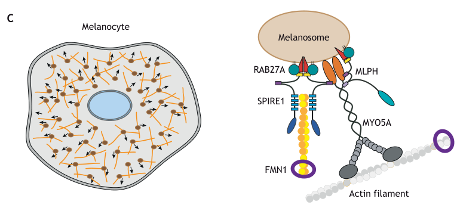

## Question

# Gene Research for Functional Annotation

## ⚠️ CRITICAL: Gene/Protein Identification Context

**BEFORE YOU BEGIN RESEARCH:** You MUST verify you are researching the CORRECT gene/protein. Gene symbols can be ambiguous, especially for less well-characterized genes from non-model organisms.

### Target Gene/Protein Identity (from UniProt):
- **UniProt Accession:** Q9Y4I1
- **Protein Description:** RecName: Full=Unconventional myosin-Va; AltName: Full=Dilute myosin heavy chain, non-muscle; AltName: Full=Myosin heavy chain 12; AltName: Full=Myosin-12; AltName: Full=Myoxin;
- **Gene Information:** Name=MYO5A; Synonyms=MYH12;
- **Organism (full):** Homo sapiens (Human).
- **Protein Family:** Belongs to the TRAFAC class myosin-kinesin ATPase
- **Key Domains:** Dilute_dom. (IPR002710); IQ_motif_EF-hand-BS. (IPR000048); Kinesin_motor_dom_sf. (IPR036961); Myo5a/b_dom. (IPR058662); Myo5a_CBD. (IPR037988)

### MANDATORY VERIFICATION STEPS:

1. **Check if the gene symbol "MYO5A" matches the protein description above**
2. **Verify the organism is correct:** Homo sapiens (Human).
3. **Check if protein family/domains align with what you find in literature**
4. **If you find literature for a DIFFERENT gene with the same or similar symbol, STOP**

### If Gene Symbol is Ambiguous or You Cannot Find Relevant Literature:

**DO NOT PROCEED WITH RESEARCH ON A DIFFERENT GENE.** Instead:
- State clearly: "The gene symbol 'MYO5A' is ambiguous or literature is limited for this specific protein"
- Explain what you found (e.g., "Found extensive literature on a different gene with the same symbol in a different organism")
- Describe the protein based ONLY on the UniProt information provided above
- Suggest that the protein function can be inferred from domain/family information

### Research Target:

Please provide a comprehensive research report on the gene **MYO5A** (gene ID: MYO5A, UniProt: Q9Y4I1) in human.

The research report should be a detailed narrative explaining the function, biological processes, and localization of the gene product. Citations should be given for all claims.

You should prioritize authoritative reviews and primary scientific literature when conducting research. You can supplement
this with annotations you find in gene/protein databases, but these can be outdated or inaccurate.

We are specifically interested in the primary function of the gene - for enzymes, what reaction is catalyzed, and what is the substrate specificity? For transporters, what is the substrate? For structural proteins or adapters, what is the broader structural role? For signaling molecules, what is the role in the pathway.

We are interested in where in or outside the cell the gene product carries out its function.

We are also interested in the signaling or biochemical pathways in which the gene functions. We are less interested in broad pleiotropic effects, except where these elucidate the precise role.

Include evidence where possible. We are interested in both experimental evidence as well as inference from structure, evolution, or bioinformatic analysis. Precise studies should be prioritized over high-throughput, where available.

## Output

Question: You are an expert researcher providing comprehensive, well-cited information.

Provide detailed information focusing on:
1. Key concepts and definitions with current understanding
2. Recent developments and latest research (prioritize 2023-2024 sources)
3. Current applications and real-world implementations
4. Expert opinions and analysis from authoritative sources
5. Relevant statistics and data from recent studies

Format as a comprehensive research report with proper citations. Include URLs and publication dates where available.
Always prioritize recent, authoritative sources and provide specific citations for all major claims.

# Gene Research for Functional Annotation

## ⚠️ CRITICAL: Gene/Protein Identification Context

**BEFORE YOU BEGIN RESEARCH:** You MUST verify you are researching the CORRECT gene/protein. Gene symbols can be ambiguous, especially for less well-characterized genes from non-model organisms.

### Target Gene/Protein Identity (from UniProt):
- **UniProt Accession:** Q9Y4I1
- **Protein Description:** RecName: Full=Unconventional myosin-Va; AltName: Full=Dilute myosin heavy chain, non-muscle; AltName: Full=Myosin heavy chain 12; AltName: Full=Myosin-12; AltName: Full=Myoxin;
- **Gene Information:** Name=MYO5A; Synonyms=MYH12;
- **Organism (full):** Homo sapiens (Human).
- **Protein Family:** Belongs to the TRAFAC class myosin-kinesin ATPase
- **Key Domains:** Dilute_dom. (IPR002710); IQ_motif_EF-hand-BS. (IPR000048); Kinesin_motor_dom_sf. (IPR036961); Myo5a/b_dom. (IPR058662); Myo5a_CBD. (IPR037988)

### MANDATORY VERIFICATION STEPS:

1. **Check if the gene symbol "MYO5A" matches the protein description above**
2. **Verify the organism is correct:** Homo sapiens (Human).
3. **Check if protein family/domains align with what you find in literature**
4. **If you find literature for a DIFFERENT gene with the same or similar symbol, STOP**

### If Gene Symbol is Ambiguous or You Cannot Find Relevant Literature:

**DO NOT PROCEED WITH RESEARCH ON A DIFFERENT GENE.** Instead:
- State clearly: "The gene symbol 'MYO5A' is ambiguous or literature is limited for this specific protein"
- Explain what you found (e.g., "Found extensive literature on a different gene with the same symbol in a different organism")
- Describe the protein based ONLY on the UniProt information provided above
- Suggest that the protein function can be inferred from domain/family information

### Research Target:

Please provide a comprehensive research report on the gene **MYO5A** (gene ID: MYO5A, UniProt: Q9Y4I1) in human.

The research report should be a detailed narrative explaining the function, biological processes, and localization of the gene product. Citations should be given for all claims.

You should prioritize authoritative reviews and primary scientific literature when conducting research. You can supplement
this with annotations you find in gene/protein databases, but these can be outdated or inaccurate.

We are specifically interested in the primary function of the gene - for enzymes, what reaction is catalyzed, and what is the substrate specificity? For transporters, what is the substrate? For structural proteins or adapters, what is the broader structural role? For signaling molecules, what is the role in the pathway.

We are interested in where in or outside the cell the gene product carries out its function.

We are also interested in the signaling or biochemical pathways in which the gene functions. We are less interested in broad pleiotropic effects, except where these elucidate the precise role.

Include evidence where possible. We are interested in both experimental evidence as well as inference from structure, evolution, or bioinformatic analysis. Precise studies should be prioritized over high-throughput, where available.

# Human MYO5A: functional annotation and research report

**Identity and scope.** The target is human **MYO5A (myosin Va)**, using the user-supplied UniProt accession **Q9Y4I1** and synonym **MYH12**. A human-protein structural study explicitly distinguishes myosin Va from the related myosins Vb (**MYO5B**) and Vc (**MYO5C**); the literature retrieved did not independently verify the accession or MYH12 synonym. Its experimentally supported motor–neck–tail architecture agrees with the supplied myosin-family and domain annotation. Findings specific to Vb or Vc are not assigned to MYO5A below. [Velvarska and Niessing, published **10 December 2013**](https://doi.org/10.1371/journal.pone.0082065). (velvarska2013structuralinsightsinto pages 1-2, velvarska2013structuralinsightsinto pages 2-3)

## Primary molecular function

MYO5A encodes a **cytosolic, actin-based cargo motor**, not a melanin-synthesizing enzyme, membrane transporter or kinesin that runs on microtubules. Its N-terminal head binds filamentous actin and catalyzes **ATP + H₂O → ADP + inorganic phosphate**; ATP turnover drives force-generating changes and movement toward the actin filament’s plus, or barbed, end. ATP is its chemical substrate, whereas actin is its track and melanosomes, vesicles or organelle membranes are its transported cargos. Each of the two heavy chains has six calmodulin/light-chain-binding IQ motifs that form a lever arm, followed by a dimerizing coiled-coil stalk and a C-terminal globular tail that recognizes cargo-associated proteins. These assignments reconcile the supplied ATPase, IQ-motif and cargo-binding domain annotations with experimental class-V-myosin architecture. [Zhang and colleagues, 2018](https://doi.org/10.1007/s00018-017-2599-5); [Robinson and colleagues, March 2019](https://doi.org/10.1091/mbc.e18-04-0237). (zhang2018regulationofclass pages 1-2, robinson2019theadaptorprotein pages 1-5)

This dimer is a **processive motor**: measurements summarized from single-molecule experiments report steps of approximately **36 nm** and movement of approximately **250–450 nm/s** under the studied *in-vitro* conditions. These are motor-assay values, not a fixed velocity for every cargo in living human tissues. The globular tail also folds back onto the head to suppress motor ATPase activity when cargo is absent; cargo-adaptor engagement and calcium-dependent conformational regulation can favor an extended, active state. An X-ray structure resolved the **human MYO5A globular tail at 2.2 Å**, providing direct human structural evidence for the cargo-binding region, though not an atomic structure of the entire working motor. [Robinson and colleagues, 2019](https://doi.org/10.1091/mbc.e18-04-0237); [Velvarska and Niessing, 2013](https://doi.org/10.1371/journal.pone.0082065); [Zhang and colleagues, 2018](https://doi.org/10.1007/s00018-017-2599-5). (robinson2019theadaptorprotein pages 1-5, velvarska2013structuralinsightsinto pages 2-3, zhang2018regulationofclass pages 1-2)

## Where MYO5A acts and what it carries

**Melanocyte periphery: the best-established physiological cargo.** On the cytoplasmic face of a melanosome, membrane-associated **RAB27A** binds **melanophilin (MLPH)**, which recruits the melanocyte MYO5A splice form through a tail segment encoded by **exon F**. The motor moves and helps retain pigment-bearing melanosomes within the peripheral actin network and melanocyte dendrites, positioning them for transfer to neighboring keratinocytes. This is a distribution step in pigmentation, **not melanin biosynthesis**. Single-melanosome photobleaching experiments found that MYO5A and MLPH exchange dynamically on melanosomes while RAB27A is comparatively stable; experimentally forcing persistent cargo linkage dispersed melanosomes but impaired normal dendrite elongation. Thus, controlled attachment is biologically consequential, not merely constitutive tethering. [Ménasché and colleagues, **August 2003**](https://doi.org/10.1172/JCI200318264); [Robinson and colleagues, **March 2019**](https://doi.org/10.1091/mbc.e18-04-0237). (menasche2003griscellisyndromerestricted pages 1-2, menasche2003griscellisyndromerestricted pages 5-7, robinson2019theadaptorprotein pages 1-5)

**Recycling and secretory membranes: broader, splice-dependent targeting.** A screen of human Rab proteins identified distinct MYO5A-binding regions in its stalk, alternatively spliced segment and globular tail. In human cultured cells, **RAB11** was important for recruiting an exon-F-containing MYO5A construct to membranes; **RAB10 and RAB11** could recruit the exon-D form. MYO5A depletion shifted RAB11- and RAB14-positive endosomes toward the cell center. These experiments support roles in positioning recycling/post-Golgi membranes but do **not** establish that every observed Rab interaction represents a distinct cargo transported by endogenous MYO5A in every tissue. [Lindsay and colleagues, **November 2013**](https://doi.org/10.1091/mbc.e13-05-0236). (lindsay2013identificationandcharacterization pages 1-2, lindsay2013identificationandcharacterization pages 6-7)

**Neuronal dendritic spines: smooth-endoplasmic-reticulum delivery.** MYO5A acts at actin-rich Purkinje-cell spines, where it draws **smooth endoplasmic reticulum (ER)** containing **inositol-trisphosphate receptors (IP₃Rs)** into spines. This places a calcium-releasing organelle beside synaptic signaling machinery. Motor-mutant and rescue work summarized in a neuronal-myosin review linked motor speed to ER-entry speed, reporting a maximum observed ER-tubule entry speed of approximately **0.45 μm/s**. In *Myo5a*-mutant mice, spine ER and IP₃Rs were depleted, parallel-fiber synaptic long-term depression was lost in juveniles, and cerebellum-dependent motor learning was impaired; neuronal knockdown likewise reduced IP₃R-positive spines. This is strong **mouse mechanistic evidence** for a plausible contributor to human neurological disease, rather than direct demonstration of organelle movement in a patient’s neurons. Importantly, the established activity-dependent entry of AMPA-receptor recycling endosomes into hippocampal spines is assigned prominently to **MYO5B**, and should not be substituted for this MYO5A-specific ER result. [Hammer and Wagner, **October 2013**](https://doi.org/10.1074/jbc.r113.514497); [Miyata and colleagues, **April 2011**](https://doi.org/10.1523/JNEUROSCI.5651-10.2011). (hammer2013functionsofclass pages 2-3, miyata2011arolefor pages 1-2)

**Neuromuscular-junction postsynapse: receptor recycling and local signaling.** A **2024** expert review synthesizes mouse experiments in which MYO5A associates with endocytosed nicotinic acetylcholine receptor (**nAChR**) carriers near the postsynaptic actin cortex. MYO5A, nAChR, its binding partner **rapsyn**, and protein kinase A regulatory subunit **RIα** colocalize in subsynaptic puncta. MYO5A depletion reduced RIα enrichment and receptor stability and dispersed receptor carriers; the proposed mechanism is that MYO5A retains recycling vesicles within a local **cAMP–PKA signaling microdomain**, while rapsyn anchors RIα. This describes MYO5A as an **organelle-positioning component of signaling**, not the enzyme that produces cAMP or phosphorylates receptors. The integrated capture-and-recycling sequence remains a model derived mainly from mouse experiments. [Rudolf, published **4 January 2024**](https://doi.org/10.3389/fphys.2023.1342994). (rudolf2024myosinvacapturing pages 1-2, rudolf2024myosinvacapturing pages 3-4)

| Molecular process | Intracellular site and precise motor/cargo partners | Direct support and evidence limitations |
|---|---|---|
| Melanosome capture, cortical transport and pigment distribution | Actin-rich melanocyte periphery and dendrites; melanosomal **RAB27A–MLPH–MYO5A** complex. RAB27A binds MLPH, and MLPH binds the exon-F-containing MYO5A tail. | Human genetics identified a homozygous **2,439-bp deletion** spanning MYO5A exon F; this caused isolated hypopigmentation without neurological disease, demonstrating that exon F is required for melanocyte transport but not the principal neuronal function. Live-cell work further showed dynamic MYO5A/MLPH association with melanosomes. Most motility kinetics derive from cultured mammalian melanocytes or reconstituted motors rather than intact human skin (robinson2019theadaptorprotein pages 1-5, menasche2003griscellisyndromerestricted pages 1-2, menasche2003griscellisyndromerestricted pages 5-7). |
| RAB-positive endosome positioning | Human HeLa-cell recycling and post-Golgi membranes; MYO5A associates with **RAB10, RAB11A/B and RAB14** through distinct tail regions. | A systematic human-Rab screen and cell perturbations showed that RAB11 is crucial for membrane recruitment of the F splice isoform, whereas RAB10 and RAB11 can recruit the D isoform. MYO5A depletion clustered RAB11- and RAB14-positive endosomes perinuclearly. These are human-cell results, but overexpression, ionomycin and RNAi limit inference about endogenous tissue physiology (lindsay2013identificationandcharacterization pages 1-2, lindsay2013identificationandcharacterization pages 6-7). |
| Smooth-ER entry into neuronal spines and cerebellar plasticity | Purkinje-cell dendritic spines; MYO5A pulls **smooth ER bearing IP3 receptors** along actin, supporting local Ca²⁺ release and long-term depression. | Motor-mutant rescue linked slower MYO5A movement to slower ER-tubule entry; a reported maximum ER-entry velocity was **0.45 μm/s**. Myo5a-mutant mice showed depleted spine ER/IP3 receptors, abolished juvenile LTD and impaired motor learning; RNAi reduced IP3-receptor-positive spines. Strong causal mouse evidence, but not direct imaging in human neurons (hammer2013functionsofclass pages 2-3, miyata2011arolefor pages 1-2). |
| Postsynaptic nAChR recycling and cAMP/PKA compartmentation | Mouse neuromuscular-junction postsynapse; MYO5A captures **nAChR–rapsyn–PKA RIα** endocytic/recycling vesicles near the actin-rich postsynaptic membrane. | MYO5A colocalized and co-precipitated with endocytosed nAChRs; genetic or acute inhibition dispersed carriers and reduced nAChR stability, NMJ size and PKA-RIα enrichment. Rapsyn is proposed to anchor PKA RIα as an AKAP. The 2024 synthesis integrates older mouse experiments; the complete complex and transport sequence remain a mechanistic model rather than a human in-vivo demonstration (rudolf2024myosinvacapturing pages 3-4, rudolf2024myosinvacapturing pages 1-2). |
| Local actin-track assembly for melanosome dispersion | Mouse melanosome surface; **RAB27A–SPIRE1–FMN1** nucleates/elongates local actin, while MLPH or SPIRE1 recruits/activates MYO5A for movement along those tracks. | The 2023 review presents this as a model supported by mouse melanocyte experiments, interaction data and simulations. Actin nucleation is performed by SPIRE1/FMN1—not by MYO5A—and generalization to other cargos remains speculative (welz2023theroleof pages 7-8, welz2023theroleof pages 8-9). |
| Structurally permitted RAB11A–MYO5A–SPIRE2 assembly | MYO5A globular tail: **RAB11A** binds subdomain 2 and the **SPIRE2 GTBM** binds the opposing subdomain 1. | Crystal structures of MYO5A–RAB11A and MYO5A–SPIRE2 complexes support a sterically compatible tripartite model. This is direct structural evidence for binding, not proof that the intact tripartite complex operates in vivo. In mouse oocytes the established transport motor is **MYO5B**, so that physiology must not be reassigned to MYO5A (welz2023theroleof pages 4-5, welz2023theroleof pages 3-4, welz2023theroleof pages 8-9). |

*Table: Evidence-ranked summary of MYO5A cargo transport, localization and signaling functions, explicitly separating human evidence from mouse models and structural inference. MYO5B- and MYO5C-specific findings are excluded or flagged to prevent paralog misannotation.*

## Developments in 2023–2024: actin-track organization

A **2023 Journal of Cell Science review** integrates a more elaborate melanosome-transport mechanism: melanosome-associated RAB27A recruits **SPIRE1**, which cooperates with the formin **FMN1** to assemble actin tracks; **MLPH links RAB27A to MYO5A**, which moves on those tracks. The review’s melanocyte-specific model is illustrated in its cropped Figure 3C. **SPIRE/FMN proteins nucleate and elongate actin; MYO5A supplies motor force.** Structural studies also support binding of **RAB11A and SPIRE2 to different surfaces of a MYO5A globular tail**, making a three-part assembly structurally possible. That structural compatibility does not prove that this particular complex operates as a unit in living human cells: the prominently described RAB11A-vesicle transport in mouse oocytes instead involves **MYO5B**. These distinctions are essential to isoform-specific annotation. [Welz and Kerkhoff, **March 2023**](https://doi.org/10.1242/jcs.260743). (welz2023theroleof pages 7-8, welz2023theroleof media fdb9a5ca, welz2023theroleof pages 3-4, welz2023theroleof pages 8-9)

The broader **2024** research context places class-V myosins, Rab proteins, SPIRE nucleators and formins within an evolutionarily conserved organelle-transport system, but conservation of the module is not itself proof that any specified human MYO5A cargo uses the same molecular assembly. [Kollmar and colleagues, **July 2024**](https://doi.org/10.1038/s42003-024-06458-1); [Welz and Kerkhoff, 2023](https://doi.org/10.1242/jcs.260743). (karreis2025diversityofmammalianc pages 31-33, welz2023theroleof pages 8-9)

## Human genetics, applications and evidential limits

The most compelling human functional validation is **Griscelli syndrome type 1 (GS1)**: damaging **MYO5A** variants associate pigment dilution and characteristic silvery hair with primary neurological impairment. Genotype matters. In one patient, a homozygous **2,439-base-pair genomic deletion spanning MYO5A exon F** produced hypopigmentation **without neurological manifestations**. This natural human experiment supports a precise functional division: exon-F-containing MYO5A is required for MLPH-dependent melanosome movement, while an exon-F-negative isoform can support essential neuronal functions. [Ménasché and colleagues, **August 2003**](https://doi.org/10.1172/JCI200318264). (menasche2003griscellisyndromerestricted pages 1-2, menasche2003griscellisyndromerestricted pages 5-7)

This distinction has a direct **diagnostic application**: pigment dilution with neurological findings points toward MYO5A-related GS1, whereas the major immune-deficient/hemophagocytic form, **GS2, is caused by RAB27A**, and pigmentation-only **GS3 is classically caused by MLPH**. An exon-F-specific MYO5A lesion can also yield pigmentation-only disease; phenotype alone therefore does not establish the causal gene, and molecular testing must distinguish these pathways. A **2024 clinical review** reiterates their differing clinical implications. No prevalence or treatment-effect percentage from an RAB27A/GS2 cohort should be reported as an MYO5A/GS1 statistic. [Ménasché and colleagues, 2003](https://doi.org/10.1172/JCI200318264); [Mazzetto and colleagues, **June 2024**](https://doi.org/10.3390/hematolrep16020036). (menasche2003griscellisyndromerestricted pages 1-2, menasche2003griscellisyndromerestricted pages 5-7, mazzetto2024skinhypopigmentationin pages 13-13)

**Overall assessment.** The defensible primary annotation is **ATP-powered, plus-end-directed movement and positioning of selected intracellular cargo along F-actin**, with the RAB27A–MLPH–MYO5A melanosome pathway supported by human genetics and direct cell biology. ER delivery into neuronal spines and postsynaptic receptor-vesicle retention explain additional tissue-specific functions, but their detailed causal mechanisms depend substantially on mouse experiments. The 2023–2024 literature refines how local actin assembly and cAMP microdomains may cooperate with this motor; it does not justify reassigning MYO5B- or MYO5C-specific activities to MYO5A. (robinson2019theadaptorprotein pages 1-5, menasche2003griscellisyndromerestricted pages 5-7, miyata2011arolefor pages 1-2, rudolf2024myosinvacapturing pages 1-2, welz2023theroleof pages 8-9)

References

1. (velvarska2013structuralinsightsinto pages 1-2): Hana Velvarska and Dierk Niessing. Structural insights into the globular tails of the human type v myosins myo5a, myo5b, and myo5c. PLoS ONE, 8:e82065, Dec 2013. URL: https://doi.org/10.1371/journal.pone.0082065, doi:10.1371/journal.pone.0082065. This article has 18 citations and is from a peer-reviewed journal.

2. (velvarska2013structuralinsightsinto pages 2-3): Hana Velvarska and Dierk Niessing. Structural insights into the globular tails of the human type v myosins myo5a, myo5b, and myo5c. PLoS ONE, 8:e82065, Dec 2013. URL: https://doi.org/10.1371/journal.pone.0082065, doi:10.1371/journal.pone.0082065. This article has 18 citations and is from a peer-reviewed journal.

3. (zhang2018regulationofclass pages 1-2): Ning Zhang, Lin-Lin Yao, and Xiang-dong Li. Regulation of class v myosin. Cellular and Molecular Life Sciences, 75:261-273, Jul 2018. URL: https://doi.org/10.1007/s00018-017-2599-5, doi:10.1007/s00018-017-2599-5. This article has 44 citations and is from a domain leading peer-reviewed journal.

4. (robinson2019theadaptorprotein pages 1-5): Christopher L. Robinson, Richard D. Evans, Kajana Sivarasa, Jose S. Ramalho, Deborah A. Briggs, and Alistair N. Hume. The adaptor protein melanophilin regulates dynamic myosin-va:cargo interaction and dendrite development in melanocytes. Molecular Biology of the Cell, 30:742-752, Mar 2019. URL: https://doi.org/10.1091/mbc.e18-04-0237, doi:10.1091/mbc.e18-04-0237. This article has 22 citations and is from a domain leading peer-reviewed journal.

5. (menasche2003griscellisyndromerestricted pages 1-2): Gaël Ménasché, Chen Hsuan Ho, Ozden Sanal, Jérôme Feldmann, Ilhan Tezcan, Fügen Ersoy, Anne Houdusse, Alain Fischer, and Geneviève de Saint Basile. Griscelli syndrome restricted to hypopigmentation results from a melanophilin defect (gs3) or a myo5a f-exon deletion (gs1). The Journal of clinical investigation, 112 3:450-6, Aug 2003. URL: https://doi.org/10.1172/jci18264, doi:10.1172/jci18264. This article has 434 citations.

6. (menasche2003griscellisyndromerestricted pages 5-7): Gaël Ménasché, Chen Hsuan Ho, Ozden Sanal, Jérôme Feldmann, Ilhan Tezcan, Fügen Ersoy, Anne Houdusse, Alain Fischer, and Geneviève de Saint Basile. Griscelli syndrome restricted to hypopigmentation results from a melanophilin defect (gs3) or a myo5a f-exon deletion (gs1). The Journal of clinical investigation, 112 3:450-6, Aug 2003. URL: https://doi.org/10.1172/jci18264, doi:10.1172/jci18264. This article has 434 citations.

7. (lindsay2013identificationandcharacterization pages 1-2): Andrew J. Lindsay, Florence Jollivet, Conor P. Horgan, Amir R. Khan, Graça Raposo, Mary W. McCaffrey, and Bruno Goud. Identification and characterization of multiple novel rab–myosin va interactions. Molecular Biology of the Cell, 24:3420-3434, Nov 2013. URL: https://doi.org/10.1091/mbc.e13-05-0236, doi:10.1091/mbc.e13-05-0236. This article has 128 citations and is from a domain leading peer-reviewed journal.

8. (lindsay2013identificationandcharacterization pages 6-7): Andrew J. Lindsay, Florence Jollivet, Conor P. Horgan, Amir R. Khan, Graça Raposo, Mary W. McCaffrey, and Bruno Goud. Identification and characterization of multiple novel rab–myosin va interactions. Molecular Biology of the Cell, 24:3420-3434, Nov 2013. URL: https://doi.org/10.1091/mbc.e13-05-0236, doi:10.1091/mbc.e13-05-0236. This article has 128 citations and is from a domain leading peer-reviewed journal.

9. (hammer2013functionsofclass pages 2-3): John A. Hammer and Wolfgang Wagner. Functions of class v myosins in neurons. Oct 2013. URL: https://doi.org/10.1074/jbc.r113.514497, doi:10.1074/jbc.r113.514497. This article has 74 citations and is from a domain leading peer-reviewed journal.

10. (miyata2011arolefor pages 1-2): Mariko Miyata, Yasushi Kishimoto, Masahiko Tanaka, Kouichi Hashimoto, Naohide Hirashima, Yoshiharu Murata, Masanobu Kano, and Yoshiko Takagishi. A role for myosin va in cerebellar plasticity and motor learning: a possible mechanism underlying neurological disorder in myosin va disease. The Journal of Neuroscience, 31:6067-6078, Apr 2011. URL: https://doi.org/10.1523/jneurosci.5651-10.2011, doi:10.1523/jneurosci.5651-10.2011. This article has 40 citations.

11. (rudolf2024myosinvacapturing pages 1-2): Rüdiger Rudolf. Myosin va: capturing camp for synaptic plasticity. Frontiers in Physiology, Jan 2024. URL: https://doi.org/10.3389/fphys.2023.1342994, doi:10.3389/fphys.2023.1342994. This article has 5 citations.

12. (rudolf2024myosinvacapturing pages 3-4): Rüdiger Rudolf. Myosin va: capturing camp for synaptic plasticity. Frontiers in Physiology, Jan 2024. URL: https://doi.org/10.3389/fphys.2023.1342994, doi:10.3389/fphys.2023.1342994. This article has 5 citations.

13. (welz2023theroleof pages 7-8): Tobias Welz and Eugen Kerkhoff. The role of spire actin nucleators in cellular transport processes. Journal of cell science, Mar 2023. URL: https://doi.org/10.1242/jcs.260743, doi:10.1242/jcs.260743. This article has 15 citations and is from a domain leading peer-reviewed journal.

14. (welz2023theroleof pages 8-9): Tobias Welz and Eugen Kerkhoff. The role of spire actin nucleators in cellular transport processes. Journal of cell science, Mar 2023. URL: https://doi.org/10.1242/jcs.260743, doi:10.1242/jcs.260743. This article has 15 citations and is from a domain leading peer-reviewed journal.

15. (welz2023theroleof pages 4-5): Tobias Welz and Eugen Kerkhoff. The role of spire actin nucleators in cellular transport processes. Journal of cell science, Mar 2023. URL: https://doi.org/10.1242/jcs.260743, doi:10.1242/jcs.260743. This article has 15 citations and is from a domain leading peer-reviewed journal.

16. (welz2023theroleof pages 3-4): Tobias Welz and Eugen Kerkhoff. The role of spire actin nucleators in cellular transport processes. Journal of cell science, Mar 2023. URL: https://doi.org/10.1242/jcs.260743, doi:10.1242/jcs.260743. This article has 15 citations and is from a domain leading peer-reviewed journal.

17. (welz2023theroleof media fdb9a5ca): Tobias Welz and Eugen Kerkhoff. The role of spire actin nucleators in cellular transport processes. Journal of cell science, Mar 2023. URL: https://doi.org/10.1242/jcs.260743, doi:10.1242/jcs.260743. This article has 15 citations and is from a domain leading peer-reviewed journal.

18. (karreis2025diversityofmammalianc pages 31-33): JM Karreis. Diversity of mammalian actomyosin functions: evaluation of the interactions of myo5 actin motor proteins and spire actin nucleators. Unknown journal, 2025.

19. (mazzetto2024skinhypopigmentationin pages 13-13): Roberto Mazzetto, Paola Miceli, Alvise Sernicola, Jacopo Tartaglia, and Mauro Alaibac. Skin hypopigmentation in hematology disorders. Hematology Reports, 16:354-366, Jun 2024. URL: https://doi.org/10.3390/hematolrep16020036, doi:10.3390/hematolrep16020036. This article has 3 citations.

## Artifacts

- [Edison artifact artifact-00](MYO5A-deep-research-falcon_artifacts/artifact-00.md)

## Citations

1. velvarska2013structuralinsightsinto pages 1-2
2. velvarska2013structuralinsightsinto pages 2-3
3. zhang2018regulationofclass pages 1-2
4. robinson2019theadaptorprotein pages 1-5
5. menasche2003griscellisyndromerestricted pages 1-2
6. menasche2003griscellisyndromerestricted pages 5-7
7. lindsay2013identificationandcharacterization pages 1-2
8. lindsay2013identificationandcharacterization pages 6-7
9. hammer2013functionsofclass pages 2-3
10. miyata2011arolefor pages 1-2
11. rudolf2024myosinvacapturing pages 1-2
12. rudolf2024myosinvacapturing pages 3-4
13. welz2023theroleof pages 7-8
14. welz2023theroleof pages 8-9
15. welz2023theroleof pages 4-5
16. welz2023theroleof pages 3-4
17. karreis2025diversityofmammalianc pages 31-33
18. mazzetto2024skinhypopigmentationin pages 13-13
19. Velvarska and Niessing, published **10 December 2013**
20. Zhang and colleagues, 2018
21. Robinson and colleagues, March 2019
22. Robinson and colleagues, 2019
23. Velvarska and Niessing, 2013
24. Ménasché and colleagues, **August 2003**
25. Robinson and colleagues, **March 2019**
26. Lindsay and colleagues, **November 2013**
27. Hammer and Wagner, **October 2013**
28. Miyata and colleagues, **April 2011**
29. Rudolf, published **4 January 2024**
30. Welz and Kerkhoff, **March 2023**
31. Kollmar and colleagues, **July 2024**
32. Welz and Kerkhoff, 2023
33. Ménasché and colleagues, 2003
34. Mazzetto and colleagues, **June 2024**
35. https://doi.org/10.1371/journal.pone.0082065
36. https://doi.org/10.1007/s00018-017-2599-5
37. https://doi.org/10.1091/mbc.e18-04-0237
38. https://doi.org/10.1172/JCI200318264
39. https://doi.org/10.1091/mbc.e13-05-0236
40. https://doi.org/10.1074/jbc.r113.514497
41. https://doi.org/10.1523/JNEUROSCI.5651-10.2011
42. https://doi.org/10.3389/fphys.2023.1342994
43. https://doi.org/10.1242/jcs.260743
44. https://doi.org/10.1038/s42003-024-06458-1
45. https://doi.org/10.3390/hematolrep16020036
46. https://doi.org/10.1371/journal.pone.0082065,
47. https://doi.org/10.1007/s00018-017-2599-5,
48. https://doi.org/10.1091/mbc.e18-04-0237,
49. https://doi.org/10.1172/jci18264,
50. https://doi.org/10.1091/mbc.e13-05-0236,
51. https://doi.org/10.1074/jbc.r113.514497,
52. https://doi.org/10.1523/jneurosci.5651-10.2011,
53. https://doi.org/10.3389/fphys.2023.1342994,
54. https://doi.org/10.1242/jcs.260743,
55. https://doi.org/10.3390/hematolrep16020036,