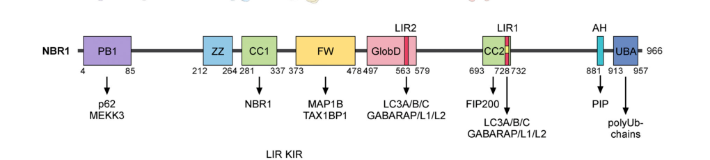

## Question

# Gene Research for Functional Annotation

## ⚠️ CRITICAL: Gene/Protein Identification Context

**BEFORE YOU BEGIN RESEARCH:** You MUST verify you are researching the CORRECT gene/protein. Gene symbols can be ambiguous, especially for less well-characterized genes from non-model organisms.

### Target Gene/Protein Identity (from UniProt):
- **UniProt Accession:** Q14596
- **Protein Description:** RecName: Full=Next to BRCA1 gene 1 protein; AltName: Full=Cell migration-inducing gene 19 protein; AltName: Full=Membrane component chromosome 17 surface marker 2; AltName: Full=Neighbor of BRCA1 gene 1 protein; AltName: Full=Protein 1A1-3B;
- **Gene Information:** Name=NBR1; Synonyms=1A13B, KIAA0049, M17S2; ORFNames=MIG19;
- **Organism (full):** Homo sapiens (Human).
- **Protein Family:** Not specified in UniProt
- **Key Domains:** Ig-like_fold. (IPR013783); Nbr1_FW. (IPR032350); PB1-like. (IPR053793); PB1_dom. (IPR000270); PB1_Nbr1. (IPR034852)

### MANDATORY VERIFICATION STEPS:

1. **Check if the gene symbol "NBR1" matches the protein description above**
2. **Verify the organism is correct:** Homo sapiens (Human).
3. **Check if protein family/domains align with what you find in literature**
4. **If you find literature for a DIFFERENT gene with the same or similar symbol, STOP**

### If Gene Symbol is Ambiguous or You Cannot Find Relevant Literature:

**DO NOT PROCEED WITH RESEARCH ON A DIFFERENT GENE.** Instead:
- State clearly: "The gene symbol 'NBR1' is ambiguous or literature is limited for this specific protein"
- Explain what you found (e.g., "Found extensive literature on a different gene with the same symbol in a different organism")
- Describe the protein based ONLY on the UniProt information provided above
- Suggest that the protein function can be inferred from domain/family information

### Research Target:

Please provide a comprehensive research report on the gene **NBR1** (gene ID: NBR1, UniProt: Q14596) in human.

The research report should be a detailed narrative explaining the function, biological processes, and localization of the gene product. Citations should be given for all claims.

You should prioritize authoritative reviews and primary scientific literature when conducting research. You can supplement
this with annotations you find in gene/protein databases, but these can be outdated or inaccurate.

We are specifically interested in the primary function of the gene - for enzymes, what reaction is catalyzed, and what is the substrate specificity? For transporters, what is the substrate? For structural proteins or adapters, what is the broader structural role? For signaling molecules, what is the role in the pathway.

We are interested in where in or outside the cell the gene product carries out its function.

We are also interested in the signaling or biochemical pathways in which the gene functions. We are less interested in broad pleiotropic effects, except where these elucidate the precise role.

Include evidence where possible. We are interested in both experimental evidence as well as inference from structure, evolution, or bioinformatic analysis. Precise studies should be prioritized over high-throughput, where available.

## Output

Question: You are an expert researcher providing comprehensive, well-cited information.

Provide detailed information focusing on:
1. Key concepts and definitions with current understanding
2. Recent developments and latest research (prioritize 2023-2024 sources)
3. Current applications and real-world implementations
4. Expert opinions and analysis from authoritative sources
5. Relevant statistics and data from recent studies

Format as a comprehensive research report with proper citations. Include URLs and publication dates where available.
Always prioritize recent, authoritative sources and provide specific citations for all major claims.

# Gene Research for Functional Annotation

## ⚠️ CRITICAL: Gene/Protein Identification Context

**BEFORE YOU BEGIN RESEARCH:** You MUST verify you are researching the CORRECT gene/protein. Gene symbols can be ambiguous, especially for less well-characterized genes from non-model organisms.

### Target Gene/Protein Identity (from UniProt):
- **UniProt Accession:** Q14596
- **Protein Description:** RecName: Full=Next to BRCA1 gene 1 protein; AltName: Full=Cell migration-inducing gene 19 protein; AltName: Full=Membrane component chromosome 17 surface marker 2; AltName: Full=Neighbor of BRCA1 gene 1 protein; AltName: Full=Protein 1A1-3B;
- **Gene Information:** Name=NBR1; Synonyms=1A13B, KIAA0049, M17S2; ORFNames=MIG19;
- **Organism (full):** Homo sapiens (Human).
- **Protein Family:** Not specified in UniProt
- **Key Domains:** Ig-like_fold. (IPR013783); Nbr1_FW. (IPR032350); PB1-like. (IPR053793); PB1_dom. (IPR000270); PB1_Nbr1. (IPR034852)

### MANDATORY VERIFICATION STEPS:

1. **Check if the gene symbol "NBR1" matches the protein description above**
2. **Verify the organism is correct:** Homo sapiens (Human).
3. **Check if protein family/domains align with what you find in literature**
4. **If you find literature for a DIFFERENT gene with the same or similar symbol, STOP**

### If Gene Symbol is Ambiguous or You Cannot Find Relevant Literature:

**DO NOT PROCEED WITH RESEARCH ON A DIFFERENT GENE.** Instead:
- State clearly: "The gene symbol 'NBR1' is ambiguous or literature is limited for this specific protein"
- Explain what you found (e.g., "Found extensive literature on a different gene with the same symbol in a different organism")
- Describe the protein based ONLY on the UniProt information provided above
- Suggest that the protein function can be inferred from domain/family information

### Research Target:

Please provide a comprehensive research report on the gene **NBR1** (gene ID: NBR1, UniProt: Q14596) in human.

The research report should be a detailed narrative explaining the function, biological processes, and localization of the gene product. Citations should be given for all claims.

You should prioritize authoritative reviews and primary scientific literature when conducting research. You can supplement
this with annotations you find in gene/protein databases, but these can be outdated or inaccurate.

We are specifically interested in the primary function of the gene - for enzymes, what reaction is catalyzed, and what is the substrate specificity? For transporters, what is the substrate? For structural proteins or adapters, what is the broader structural role? For signaling molecules, what is the role in the pathway.

We are interested in where in or outside the cell the gene product carries out its function.

We are also interested in the signaling or biochemical pathways in which the gene functions. We are less interested in broad pleiotropic effects, except where these elucidate the precise role.

Include evidence where possible. We are interested in both experimental evidence as well as inference from structure, evolution, or bioinformatic analysis. Precise studies should be prioritized over high-throughput, where available.

# Research Report: Human NBR1 (UniProt Q14596) — Functional Annotation and Current Understanding

## 1) Target verification (gene/protein identity)
The target protein is **human NBR1 (Neighbor of BRCA1 gene 1; UniProt Q14596)**, an evolutionarily conserved **selective autophagy receptor** (“sequestosome-1–like receptor”, SLR) with a characteristic multi-domain architecture (PB1, ZZ, FW, LIR(s), UBA) and additional membrane-association features (amphipathic helix) described in authoritative reviews focused on NBR1. (rasmussen2022nbr1thearchetypal pages 1-2, rasmussen2022nbr1thearchetypal pages 4-6)

## 2) Key concepts and definitions (current understanding)

### 2.1 Selective autophagy and selective autophagy receptors (SARs)
**Autophagy** sequesters intracellular material in **double-membrane autophagosomes** that fuse with endolysosomal compartments to form degradative autolysosomes. **Selective autophagy** differs from bulk autophagy by targeting defined cargo classes (e.g., **aggrephagy**, **xenophagy**, **pexophagy**) and typically involves **cargo tagging**, frequently ubiquitination, and **cargo receptors** that bridge cargo to autophagosome membranes. (vargas2023themechanismsand pages 1-6)

In a broad, authoritative synthesis of mammalian selective autophagy, selective cargo specificity is attributed to receptors including **p62/SQSTM1, NBR1, OPTN, and NDP52**, which possess both **LC3-interacting region (LIR) motifs** and **ubiquitin-binding domains** enabling them to bind cargo and recruit autophagic membranes. (vargas2023themechanismsand pages 1-6)

### 2.2 NBR1 as an archetypal selective autophagy receptor
A dedicated review describes NBR1 as an **“archetypal” selective autophagy receptor** with deep evolutionary roots and conserved modular architecture. Mechanistically, NBR1’s defining role is as a **multivalent adaptor** that:
- recognizes **ubiquitinated cargo** (via UBA),
- binds **ATG8-family proteins (LC3/GABARAP)** on phagophores/autophagosomes (via LIRs), and
- assembles higher-order receptor/cargo structures through additional interaction modules (PB1/CC/FW) that facilitate receptor cooperation and autophagy initiation. (rasmussen2022nbr1thearchetypal pages 1-2, rasmussen2022nbr1thearchetypal pages 4-6)

## 3) Molecular architecture, mechanisms, and pathways

### 3.1 Domain architecture and core molecular interactions
Human NBR1 contains:
- **PB1 domain**: mediates strong PB1–PB1 electrostatic interaction with p62; metazoan NBR1 PB1 is described as monomeric (loss of the basic binding surface) but remains recruited to p62 assemblies and can act as a **chain terminator** of p62 polymers, modulating p62 filament length and body formation. (rasmussen2022nbr1thearchetypal pages 6-8)
- **ZZ domain** (zinc-finger) and **coiled-coil (CC) regions** contributing to interaction capacity and assembly. (rasmussen2022nbr1thearchetypal pages 4-6, cerdatroncoso2021protumoralfunctionsof pages 7-8)
- **FW (four-tryptophan) domain(s)**: implicated in cargo/adaptor recognition; in human NBR1, FW-domain binding partners include **TAX1BP1** and **MAP1B**, and FW-mediated recruitment of TAX1BP1 to p62 assemblies is proposed as a coupling point to autophagy machinery. (rasmussen2022nbr1thearchetypal pages 2-4, rasmussen2022nbr1thearchetypal pages 6-8)
- **Two LIR motifs (LIR1/LIR2)**: tether NBR1 to LC3/ATG8 proteins; LIR1 is described as dominant in cells. (rasmussen2022nbr1thearchetypal pages 1-2)
- **C-terminal UBA domain**: binds mono- and poly-ubiquitin, enabling NBR1 recognition of ubiquitinated cargos and (in the p62-body context) enhancing cargo clustering by bringing a high-affinity ubiquitin-binding module into p62 filaments. (rasmussen2022nbr1thearchetypal pages 6-8, cerdatroncoso2021protumoralfunctionsof pages 7-8)
- **Amphipathic helix (AH) near UBA**: contributes to membrane association; coincident AH+UBA binding targets NBR1 to ubiquitinated peroxisomes during pexophagy. (rasmussen2022nbr1thearchetypal pages 10-11)

The NBR1 domain schematic and associated partners are visually summarized in a JCB review figure (domain map and interaction partners). (rasmussen2022nbr1thearchetypal media 2c6d1299)

### 3.2 NBR1 within p62 bodies and autophagy initiation
Mechanistic synthesis indicates NBR1 is frequently recruited to **p62/ubiquitin-positive bodies**, where it can modulate p62 polymer properties and enhance cargo clustering. In this model, NBR1 also recruits **TAX1BP1** (via FW) and links to initiation machinery (including **FIP200/ULK-related components**) to promote efficient selective-autophagy flux. (rasmussen2022nbr1thearchetypal pages 6-8)

A further development (reported as 2024 work in a 2024-05 preprint posting) argues that the **NBR1 LIR region** is a **protein-interaction hub** in which **ATG8-family proteins, FIP200, and TAX1BP1** bind overlapping but distinct determinants within a short linear motif, and that phosphorylation can differentially tune binding (enhancing FIP200/ATG8 binding but not TAX1BP1 binding in the peptide-array framework). (north2025thelc3interactingregion pages 1-4)

### 3.3 Subcellular localization (where NBR1 acts)
Evidence from reviews and primary studies supports a predominantly **cytoplasmic** role for NBR1 as a receptor that localizes to:
- **p62 bodies / ubiquitin-positive aggregates** (cytosolic condensates),
- **autophagosomal membranes** via LC3/ATG8 binding,
- **peroxisomes** during selective removal (pexophagy) through combined AH+UBA targeting to ubiquitinated peroxisomes. (rasmussen2022nbr1thearchetypal pages 6-8, rasmussen2022nbr1thearchetypal pages 10-11)

In human nucleus pulposus cells, immunofluorescence evidence indicates **NBR1 is predominantly cytoplasmic** and its interaction with the cargo protein **SRBD1** occurs primarily in the cytoplasm. (song2024selectiveautophagyreceptor pages 8-10)

## 4) Recent developments (prioritizing 2023–2024)

### 4.1 2024: NBR1 in intervertebral disc degeneration via selective clearance of SRBD1 (human cells; disease mechanism)
A 2024 study in *International Journal of Biological Sciences* investigated NBR1 in **intervertebral disc degeneration (IDD)** and nucleus pulposus cell (NPC) senescence, reporting:
- **Proteomics after NBR1 knockdown** identified **1,082 differentially expressed proteins** (**819 upregulated**, **263 downregulated**), indicating broad proteostasis remodeling when NBR1-mediated selective degradation is reduced. (song2024selectiveautophagyreceptor pages 8-10)
- Integration of IP–MS and proteomics identified **SRBD1** as a candidate direct NBR1-associated substrate; SRBD1 was reported as **~50.6-fold upregulated** after NBR1 knockdown at the protein level while SRBD1 mRNA did not change, consistent with NBR1 regulating SRBD1 **protein stability**. (song2024selectiveautophagyreceptor pages 8-10)
- Pharmacologic interrogation supported lysosomal/autophagic routing: **Baf-A1** (lysosomal inhibition) significantly mitigated SRBD1 degradation, while **MG132** (proteasome inhibitor) had minimal influence, supporting an **autophagic-lysosomal** degradation route for SRBD1. (song2024selectiveautophagyreceptor pages 8-10)
- Mechanistic downstream pathways were linked to SRBD1 accumulation: NBR1 knockdown → SRBD1 accumulation → senescence signaling via **AKT1/p53 and RB/p16** pathways and pro-SASP signaling via **NF-κB**. (song2024selectiveautophagyreceptor pages 1-2)
- Ubiquitin-recognition was functionally required: overexpression of **wild-type NBR1** (but not **NBR1-ΔUBA**) accelerated SRBD1 degradation, supporting a model where NBR1 uses its ubiquitin-binding capacity to drive selective cargo clearance. (song2024selectiveautophagyreceptor pages 8-10)
- Human tissue-level association: NBR1 was described as reduced in IDD, including a statistically significant reduction in NBR1-positive cells in **normal (n=11) vs degenerated (n=34)** human samples (**P<0.01**, Mann–Whitney U test). (song2024selectiveautophagyreceptor pages 5-8)

These results extend NBR1 functional annotation beyond canonical “aggregate receptor” roles to a specific, disease-relevant **selective cargo–substrate relationship** (NBR1→SRBD1) with defined signaling consequences. (song2024selectiveautophagyreceptor pages 1-2, song2024selectiveautophagyreceptor pages 8-10)

### 4.2 2024: NBR1 turnover during HSV-1 infection (xenophagy-linked antiviral defense)
A 2024 primary study in *Cells* assessed the dynamics of xenophagy-associated receptors during productive HSV-1 infection in human cells and reported:
- HSV-1 infection in **H4 human neuroglioma cells** reduced total ubiquitin conjugates and **significantly decreased NBR1 protein levels** starting from **8 hours post-infection** (hpi) (densitometry normalized to β-actin; **n=3 biological replicates for NBR1**). (pinobelmar2024anintrinsichost pages 6-8)
- Viral load dependence: only high HSV-1 doses (approximately **MOI 5–10**) produced a notable reduction in receptor levels including NBR1 at 8 hpi. (pinobelmar2024anintrinsichost pages 6-8)
- In **HaCaT keratinocytes**, NBR1 levels **significantly decreased from 4 hpi onward**, and the authors highlight NBR1 and NDP52 as among the most impacted receptors. (pinobelmar2024anintrinsichost pages 8-10)
- The report also noted that **NBR1 mRNA increased** at late time points despite protein loss, consistent with compensatory transcriptional responses amid post-translational depletion. (pinobelmar2024anintrinsichost pages 8-10)

Functionally, this positions NBR1 within a host-defense framework where xenophagy engages receptor turnover during infection and intersects with viral strategies that modulate ubiquitin-dependent pathways. (pinobelmar2024anintrinsichost pages 1-2, pinobelmar2024anintrinsichost pages 8-10)

### 4.3 2023: Updated framing of receptor-based selectivity in mammalian selective autophagy
The 2023 *Nature Reviews Molecular Cell Biology* synthesis emphasizes that selective autophagy targets (including xenophagy and aggrephagy) rely on receptors (including NBR1) that bridge cargo to lipidated LC3 via LIR motifs and ubiquitin-binding domains, and highlights the disease relevance of selective-autophagy insufficiency for neurodegeneration and infection. (vargas2023themechanismsand pages 1-6)

## 5) Current applications and real-world implementations

### 5.1 Cancer and immune evasion (MHC-I degradation)
An NBR1-focused review summarizes evidence that in pancreatic ductal adenocarcinoma (PDAC) cells, **MHC class I molecules can be degraded by NBR1-mediated selective autophagy**, and that NBR1 knockdown increases total and surface MHC-I levels, linking NBR1 activity to tumor immune evasion phenotypes (antigen presentation). (rasmussen2022nbr1thearchetypal pages 11-12)

Additional cancer-related literature notes NBR1’s participation in **focal adhesion turnover** via selective autophagy of ubiquitylated focal adhesion components, influencing migration and metastatic phenotypes in model systems. (cerdatroncoso2021protumoralfunctionsof pages 6-7)

### 5.2 Degenerative disease biology (IDD) and selective-autophagy targeting
The 2024 IDD/NPC senescence study proposes a selective-autophagy-based intervention logic: rather than globally modulating autophagy, enhancing **NBR1-dependent clearance of detrimental substrates** (e.g., SRBD1) could be a targeted approach for degenerative disc pathology. (song2024selectiveautophagyreceptor pages 1-2)

### 5.3 Infection biology and host defense
The 2024 HSV-1 study provides a tractable experimental system where NBR1 and other receptors are monitored as infection progresses, offering an implementation pathway for testing antiviral xenophagy modulation (e.g., receptor turnover, ubiquitin conjugate dynamics, MOI/time dependence). (pinobelmar2024anintrinsichost pages 6-8, pinobelmar2024anintrinsichost pages 8-10)

## 6) Expert opinions and analysis (authoritative sources)

### 6.1 “Archetypal receptor” framing and cooperation with p62
Expert synthesis argues that mammalian NBR1 frequently operates in a **cooperative network** with p62/SQSTM1, often colocalizing with p62 and ubiquitin in pathological inclusions, and that NBR1’s recruitment to p62 bodies plus its high-affinity UBA may enhance the efficiency of ubiquitin-positive cargo clustering and selective-autophagy progression. The same synthesis cautions that because NBR1 and p62 often act together, NBR1-specific effects can be difficult to disentangle experimentally without careful genetic and biochemical designs. (rasmussen2022nbr1thearchetypal pages 11-12, rasmussen2022nbr1thearchetypal pages 6-8)

### 6.2 Receptor redundancy and context dependence
A 2023 study in mouse ESCs and ESC-derived neurons reported that **p62 and NBR1 can be dispensable for aggrephagy** in those contexts, implying redundancy across cargo receptors and/or alternative proteostasis pathways that can compensate for loss of canonical SLR functions in certain cell types. This is a key interpretive point for functional annotation: NBR1’s necessity can be **cell-type and context dependent**, even if its molecular capabilities as an SLR are well supported. (trapannone2023p62andnbr1 pages 7-9)

## 7) Statistics and data highlights (recent studies)

- **IDD/NPC senescence (2024, Song et al.)**: 1,082 differentially expressed proteins after NBR1 knockdown (819 up; 263 down) (proteomics); SRBD1 upregulated ~50.6-fold at protein level after NBR1 knockdown; reduced NBR1-positive cells in normal vs degenerated human samples (n=11 vs n=34; **P<0.01**). (song2024selectiveautophagyreceptor pages 8-10, song2024selectiveautophagyreceptor pages 5-8)
- **HSV-1 infection (2024, Pino-Belmar et al.)**: significant NBR1 protein reduction during infection in H4 and HaCaT cells; MOI dependence (notable reduction at MOI ~5–10); densitometric quantification normalized to β-actin with NBR1 biological replicates (n=3 in H4; NBR1 quantified also with replicate counts described in figure captions). (pinobelmar2024anintrinsichost pages 6-8, pinobelmar2024anintrinsichost pages 8-10)

## 8) Disease associations from a target–disease knowledgebase (Open Targets)
Open Targets lists disease associations for **NBR1 (ENSG00000188554; “NBR1 autophagy cargo receptor”)** including categories such as **neoplasm**, **neurodegenerative disease**, and specific cancers (e.g., gastric and ovarian cancer) with scored evidence and linked literature identifiers. These associations are useful for prioritization but should be interpreted as aggregated evidence rather than direct mechanistic proof. (OpenTargets Search: -NBR1)

## 9) Visual evidence (domain architecture and functional schematic)
The JCB review provides clear visuals of (i) NBR1 domain architecture and binding partners, (ii) NBR1-centered selective autophagy processes across cargo types, and (iii) NBR1’s mechanistic placement within p62 bodies and initiation machinery. (rasmussen2022nbr1thearchetypal media 2c6d1299, rasmussen2022nbr1thearchetypal media 47b06603, rasmussen2022nbr1thearchetypal media 07b5ca64)

## 10) Summary functional annotation (human NBR1 / UniProt Q14596)
**Primary function:** NBR1 is a **multivalent selective autophagy cargo receptor** that binds **ubiquitinated cargo** (UBA) and recruits autophagic membranes via **ATG8/LC3 binding (LIRs)**, while coordinating receptor assembly and autophagy initiation through additional interaction modules (PB1/CC/FW; TAX1BP1/FIP200 connections). (rasmussen2022nbr1thearchetypal pages 1-2, rasmussen2022nbr1thearchetypal pages 6-8, north2025thelc3interactingregion pages 1-4)

**Where it acts:** predominantly cytoplasmic, enriched at **p62/ubiquitin-positive condensates**, **forming autophagosomal membranes**, and **ubiquitinated peroxisomes** during pexophagy; specific cytoplasmic cargo interactions (e.g., SRBD1) are reported in human cells. (rasmussen2022nbr1thearchetypal pages 10-11, song2024selectiveautophagyreceptor pages 8-10)

**Pathways/biological processes:** aggrephagy, xenophagy/antiviral defense, pexophagy, focal adhesion turnover/migration, and tumor immune evasion phenotypes (MHC-I degradation) depending on context. (rasmussen2022nbr1thearchetypal pages 10-11, rasmussen2022nbr1thearchetypal pages 11-12, cerdatroncoso2021protumoralfunctionsof pages 6-7)

---

## Domain/interactions quick reference
| Feature (domain/motif or function) | Description/role | Key partners/cargos | Evidence/source (with publication year + journal) | URL |
|---|---|---|---|---|
| PB1 domain | N-terminal PB1 mediates strong PB1-PB1 interaction with p62/SQSTM1; metazoan NBR1 PB1 is monomeric but recruits NBR1 to p62 bodies and can act as a chain terminator that limits p62 filament length while promoting cargo clustering. | p62/SQSTM1; MEKK3 | Rasmussen et al., 2022, *Journal of Cell Biology* (rasmussen2022nbr1thearchetypal pages 6-8) | https://doi.org/10.1083/jcb.202208092 |
| ZZ zinc-finger domain | Conserved ZZ-type zinc-finger is part of canonical human NBR1 architecture shared with selective autophagy receptors; included in domain schematics for metazoan NBR1. | Protein-interaction module; specific human partners not detailed in the extracted contexts | Rasmussen et al., 2022, *Journal of Cell Biology* (rasmussen2022nbr1thearchetypal pages 1-2, rasmussen2022nbr1thearchetypal pages 4-6, rasmussen2022nbr1thearchetypal media 2c6d1299) | https://doi.org/10.1083/jcb.202208092 |
| CC1 / coiled-coil regions | Coiled-coil region supports NBR1 self-interaction/oligomerization and contributes to receptor assembly during cargo capture. | NBR1 self-association; cooperative assembly with p62 | Cerda-Troncoso et al., 2021, *Frontiers in Oncology* (cerdatroncoso2021protumoralfunctionsof pages 7-8, cerdatroncoso2021protumoralfunctionsof pages 6-7) | https://doi.org/10.3389/fonc.2020.619727 |
| FW domain | Four-tryptophan (FW) domain is distinctive for NBR1 and participates in cargo/adaptor recognition; in human NBR1 it binds MAP1B and TAX1BP1 and helps recruit TAX1BP1 to p62 bodies. | TAX1BP1; MAP1B | Rasmussen et al., 2022, *Journal of Cell Biology* (rasmussen2022nbr1thearchetypal pages 2-4, rasmussen2022nbr1thearchetypal pages 6-8) | https://doi.org/10.1083/jcb.202208092 |
| LIR motifs (LIR1/LIR2) | Human NBR1 has two LC3-interacting regions; LIR1 is the dominant functional site in cells. LIRs tether cargo-bound NBR1 to ATG8-family proteins and also connect to FIP200/TAX1BP1 through overlapping determinants in recent work. | LC3/GABARAP/ATG8 proteins; FIP200; TAX1BP1 | Rasmussen et al., 2022, *Journal of Cell Biology*; North et al., 2025, *bioRxiv* (preprint reporting 2024 work) (rasmussen2022nbr1thearchetypal pages 1-2, north2025thelc3interactingregion pages 1-4) | https://doi.org/10.1083/jcb.202208092 ; https://doi.org/10.1101/2024.05.09.593318 |
| AH + UBA region | A C-terminal amphipathic helix adjacent to the UBA helps membrane association; coincident AH-UBA binding targets NBR1 to ubiquitinated peroxisomes and contributes to membrane/peroxisome localization. | PIP-containing membranes; ubiquitinated peroxisomes | Rasmussen et al., 2022, *Journal of Cell Biology* (rasmussen2022nbr1thearchetypal pages 1-2, rasmussen2022nbr1thearchetypal pages 10-11) | https://doi.org/10.1083/jcb.202208092 |
| UBA domain | C-terminal ubiquitin-associated domain binds mono- and polyubiquitin with high affinity, enabling selective recognition of ubiquitinated cargo for autophagic delivery. | Ubiquitinated protein aggregates; bacteria; peroxisomal proteins; MHC-I-associated cargo | Rasmussen et al., 2022, *Journal of Cell Biology*; Cerda-Troncoso et al., 2021, *Frontiers in Oncology* (rasmussen2022nbr1thearchetypal pages 1-2, cerdatroncoso2021protumoralfunctionsof pages 7-8, rasmussen2022nbr1thearchetypal pages 10-11) | https://doi.org/10.1083/jcb.202208092 ; https://doi.org/10.3389/fonc.2020.619727 |
| Archetypal selective autophagy receptor | NBR1 is an evolutionarily ancient, ubiquitin-dependent selective autophagy receptor that bridges ubiquitinated cargo to autophagosomes through ubiquitin binding plus ATG8-family binding. | Ubiquitinated cargos broadly | Rasmussen et al., 2022, *Journal of Cell Biology*; Vargas et al., 2023, *Nature Reviews Molecular Cell Biology* (rasmussen2022nbr1thearchetypal pages 1-2, vargas2023themechanismsand pages 1-6) | https://doi.org/10.1083/jcb.202208092 ; https://doi.org/10.1038/s41580-022-00542-2 |
| Aggrephagy / p62-body organization | NBR1 is recruited to p62 bodies, enhances p62 phase separation with ubiquitin, and promotes clustering of ubiquitinated aggregates; however, receptor requirements can be cell-type dependent, with redundancy in mouse ESCs/neurons. | p62 condensates; ubiquitinated aggregates | Rasmussen et al., 2022, *Journal of Cell Biology*; Trapannone et al., 2023, *Life Science Alliance* (rasmussen2022nbr1thearchetypal pages 6-8, trapannone2023p62andnbr1 pages 7-9, trapannone2023p62andnbr1 pages 9-12) | https://doi.org/10.1083/jcb.202208092 ; https://doi.org/10.26508/lsa.202301936 |
| Pexophagy | NBR1 mediates selective degradation of ubiquitinated peroxisomes; AH, UBA, LIR, and CC regions are required, and p62 can enhance but is not strictly required. | Ubiquitinated peroxisomes; p62 | Rasmussen et al., 2022, *Journal of Cell Biology* (rasmussen2022nbr1thearchetypal pages 10-11) | https://doi.org/10.1083/jcb.202208092 |
| Xenophagy / antiviral defense | NBR1 participates in xenophagy, including recruitment to intracellular pathogens and turnover during HSV-1 infection; HSV-1 infection significantly lowers NBR1 protein in H4 and HaCaT cells, consistent with active xenophagic receptor clearance. | HSV-1-associated cargo; ubiquitinated pathogens | Pino-Belmar et al., 2024, *Cells*; Rasmussen et al., 2022, *Journal of Cell Biology* (pinobelmar2024anintrinsichost pages 1-2, pinobelmar2024anintrinsichost pages 2-3, rasmussen2022nbr1thearchetypal pages 8-10, pinobelmar2024anintrinsichost pages 8-10) | https://doi.org/10.3390/cells13151256 ; https://doi.org/10.1083/jcb.202208092 |
| Focal-adhesion turnover / migration | NBR1 binds ubiquitylated focal-adhesion proteins and mediates their selective autophagic turnover, promoting focal-adhesion turnover and cell migration/metastatic outgrowth in some cancer models. | Ubiquitylated focal-adhesion components | Cerda-Troncoso et al., 2021, *Frontiers in Oncology*; Rasmussen et al., 2022, *Journal of Cell Biology* (cerdatroncoso2021protumoralfunctionsof pages 6-7, rasmussen2022nbr1thearchetypal pages 10-11) | https://doi.org/10.3389/fonc.2020.619727 ; https://doi.org/10.1083/jcb.202208092 |
| Disease-linked selective cargo clearance | In human nucleus pulposus cells, NBR1 directs autophagic-lysosomal clearance of SRBD1; NBR1 knockdown caused a proteomic shift with 1,082 differentially expressed proteins and ~50.6-fold SRBD1 upregulation, linking NBR1 to suppression of senescence/SASP pathways. | SRBD1 | Song et al., 2024, *International Journal of Biological Sciences* (song2024selectiveautophagyreceptor pages 1-2, song2024selectiveautophagyreceptor pages 8-10) | https://doi.org/10.7150/ijbs.90186 |
| Immune evasion / MHC-I regulation | NBR1-mediated selective autophagy can reduce MHC class I abundance in pancreatic ductal adenocarcinoma cells, linking cargo selection to tumor immune evasion. | Ubiquitylated MHC-I | Rasmussen et al., 2022, *Journal of Cell Biology*; Cerda-Troncoso et al., 2021, *Frontiers in Oncology* (cerdatroncoso2021protumoralfunctionsof pages 7-8, rasmussen2022nbr1thearchetypal pages 11-12) | https://doi.org/10.1083/jcb.202208092 ; https://doi.org/10.3389/fonc.2020.619727 |

*Table: This table summarizes the validated domain architecture of human NBR1 (UniProt Q14596) and its best-supported molecular interactions and selective-autophagy functions. It is useful as a compact functional annotation reference grounded only in the provided source contexts.*

References

1. (rasmussen2022nbr1thearchetypal pages 1-2): Nikoline Lander Rasmussen, Athanasios Kournoutis, Trond Lamark, and Terje Johansen. Nbr1: the archetypal selective autophagy receptor. The Journal of Cell Biology, Oct 2022. URL: https://doi.org/10.1083/jcb.202208092, doi:10.1083/jcb.202208092. This article has 110 citations.

2. (rasmussen2022nbr1thearchetypal pages 4-6): Nikoline Lander Rasmussen, Athanasios Kournoutis, Trond Lamark, and Terje Johansen. Nbr1: the archetypal selective autophagy receptor. The Journal of Cell Biology, Oct 2022. URL: https://doi.org/10.1083/jcb.202208092, doi:10.1083/jcb.202208092. This article has 110 citations.

3. (vargas2023themechanismsand pages 1-6): Jose Norberto S. Vargas, Maho Hamasaki, Tsuyoshi Kawabata, Richard J. Youle, and Tamotsu Yoshimori. The mechanisms and roles of selective autophagy in mammals. Nature Reviews Molecular Cell Biology, 24:167-185, Oct 2023. URL: https://doi.org/10.1038/s41580-022-00542-2, doi:10.1038/s41580-022-00542-2. This article has 1079 citations and is from a domain leading peer-reviewed journal.

4. (rasmussen2022nbr1thearchetypal pages 6-8): Nikoline Lander Rasmussen, Athanasios Kournoutis, Trond Lamark, and Terje Johansen. Nbr1: the archetypal selective autophagy receptor. The Journal of Cell Biology, Oct 2022. URL: https://doi.org/10.1083/jcb.202208092, doi:10.1083/jcb.202208092. This article has 110 citations.

5. (cerdatroncoso2021protumoralfunctionsof pages 7-8): Cristóbal Cerda-Troncoso, Manuel Varas-Godoy, and Patricia V. Burgos. Pro-tumoral functions of autophagy receptors in the modulation of cancer progression. Frontiers in Oncology, Feb 2021. URL: https://doi.org/10.3389/fonc.2020.619727, doi:10.3389/fonc.2020.619727. This article has 19 citations.

6. (rasmussen2022nbr1thearchetypal pages 2-4): Nikoline Lander Rasmussen, Athanasios Kournoutis, Trond Lamark, and Terje Johansen. Nbr1: the archetypal selective autophagy receptor. The Journal of Cell Biology, Oct 2022. URL: https://doi.org/10.1083/jcb.202208092, doi:10.1083/jcb.202208092. This article has 110 citations.

7. (rasmussen2022nbr1thearchetypal pages 10-11): Nikoline Lander Rasmussen, Athanasios Kournoutis, Trond Lamark, and Terje Johansen. Nbr1: the archetypal selective autophagy receptor. The Journal of Cell Biology, Oct 2022. URL: https://doi.org/10.1083/jcb.202208092, doi:10.1083/jcb.202208092. This article has 110 citations.

8. (rasmussen2022nbr1thearchetypal media 2c6d1299): Nikoline Lander Rasmussen, Athanasios Kournoutis, Trond Lamark, and Terje Johansen. Nbr1: the archetypal selective autophagy receptor. The Journal of Cell Biology, Oct 2022. URL: https://doi.org/10.1083/jcb.202208092, doi:10.1083/jcb.202208092. This article has 110 citations.

9. (north2025thelc3interactingregion pages 1-4): Brian J North, Amelia E Ohnstad, Michael J Ragusa, and Christopher J Shoemaker. The lc3-interacting region of nbr1 is a protein interaction hub enabling optimal flux. bioRxiv, May 2025. URL: https://doi.org/10.1101/2024.05.09.593318, doi:10.1101/2024.05.09.593318. This article has 9 citations.

10. (song2024selectiveautophagyreceptor pages 8-10): Honghai Song, Yutao Zhu, Chuan Hu, Qianyu Liu, Yang Jin, Pan Tang, Jiechao Xia, Dingqi Xie, Sicheng Jiang, Geliang Yao, Zhili Liu, and Zhijun Hu. Selective autophagy receptor nbr1 retards nucleus pulposus cell senescence by directing the clearance of srbd1. International Journal of Biological Sciences, 20:701-717, Jan 2024. URL: https://doi.org/10.7150/ijbs.90186, doi:10.7150/ijbs.90186. This article has 17 citations and is from a peer-reviewed journal.

11. (song2024selectiveautophagyreceptor pages 1-2): Honghai Song, Yutao Zhu, Chuan Hu, Qianyu Liu, Yang Jin, Pan Tang, Jiechao Xia, Dingqi Xie, Sicheng Jiang, Geliang Yao, Zhili Liu, and Zhijun Hu. Selective autophagy receptor nbr1 retards nucleus pulposus cell senescence by directing the clearance of srbd1. International Journal of Biological Sciences, 20:701-717, Jan 2024. URL: https://doi.org/10.7150/ijbs.90186, doi:10.7150/ijbs.90186. This article has 17 citations and is from a peer-reviewed journal.

12. (song2024selectiveautophagyreceptor pages 5-8): Honghai Song, Yutao Zhu, Chuan Hu, Qianyu Liu, Yang Jin, Pan Tang, Jiechao Xia, Dingqi Xie, Sicheng Jiang, Geliang Yao, Zhili Liu, and Zhijun Hu. Selective autophagy receptor nbr1 retards nucleus pulposus cell senescence by directing the clearance of srbd1. International Journal of Biological Sciences, 20:701-717, Jan 2024. URL: https://doi.org/10.7150/ijbs.90186, doi:10.7150/ijbs.90186. This article has 17 citations and is from a peer-reviewed journal.

13. (pinobelmar2024anintrinsichost pages 6-8): Camila Pino-Belmar, Rayén Aguilar, Guillermo E. Valenzuela-Nieto, Viviana A. Cavieres, Cristóbal Cerda-Troncoso, Valentina C. Navarrete, Paula Salazar, Patricia V. Burgos, Carola Otth, and Hianara A. Bustamante. An intrinsic host defense against hsv-1 relies on the activation of xenophagy with the active clearance of autophagic receptors. Cells, 13:1256, Jul 2024. URL: https://doi.org/10.3390/cells13151256, doi:10.3390/cells13151256. This article has 12 citations.

14. (pinobelmar2024anintrinsichost pages 8-10): Camila Pino-Belmar, Rayén Aguilar, Guillermo E. Valenzuela-Nieto, Viviana A. Cavieres, Cristóbal Cerda-Troncoso, Valentina C. Navarrete, Paula Salazar, Patricia V. Burgos, Carola Otth, and Hianara A. Bustamante. An intrinsic host defense against hsv-1 relies on the activation of xenophagy with the active clearance of autophagic receptors. Cells, 13:1256, Jul 2024. URL: https://doi.org/10.3390/cells13151256, doi:10.3390/cells13151256. This article has 12 citations.

15. (pinobelmar2024anintrinsichost pages 1-2): Camila Pino-Belmar, Rayén Aguilar, Guillermo E. Valenzuela-Nieto, Viviana A. Cavieres, Cristóbal Cerda-Troncoso, Valentina C. Navarrete, Paula Salazar, Patricia V. Burgos, Carola Otth, and Hianara A. Bustamante. An intrinsic host defense against hsv-1 relies on the activation of xenophagy with the active clearance of autophagic receptors. Cells, 13:1256, Jul 2024. URL: https://doi.org/10.3390/cells13151256, doi:10.3390/cells13151256. This article has 12 citations.

16. (rasmussen2022nbr1thearchetypal pages 11-12): Nikoline Lander Rasmussen, Athanasios Kournoutis, Trond Lamark, and Terje Johansen. Nbr1: the archetypal selective autophagy receptor. The Journal of Cell Biology, Oct 2022. URL: https://doi.org/10.1083/jcb.202208092, doi:10.1083/jcb.202208092. This article has 110 citations.

17. (cerdatroncoso2021protumoralfunctionsof pages 6-7): Cristóbal Cerda-Troncoso, Manuel Varas-Godoy, and Patricia V. Burgos. Pro-tumoral functions of autophagy receptors in the modulation of cancer progression. Frontiers in Oncology, Feb 2021. URL: https://doi.org/10.3389/fonc.2020.619727, doi:10.3389/fonc.2020.619727. This article has 19 citations.

18. (trapannone2023p62andnbr1 pages 7-9): Riccardo Trapannone, Julia Romanov, and Sascha Martens. P62 and nbr1 functions are dispensable for aggrephagy in mouse escs and esc-derived neurons. Life Science Alliance, 6:e202301936, Aug 2023. URL: https://doi.org/10.26508/lsa.202301936, doi:10.26508/lsa.202301936. This article has 6 citations and is from a peer-reviewed journal.

19. (OpenTargets Search: -NBR1): Open Targets Query (-NBR1, 13 results). Buniello, A. et al. (2025). Open Targets Platform: facilitating therapeutic hypotheses building in drug discovery. Nucleic Acids Research.

20. (rasmussen2022nbr1thearchetypal media 47b06603): Nikoline Lander Rasmussen, Athanasios Kournoutis, Trond Lamark, and Terje Johansen. Nbr1: the archetypal selective autophagy receptor. The Journal of Cell Biology, Oct 2022. URL: https://doi.org/10.1083/jcb.202208092, doi:10.1083/jcb.202208092. This article has 110 citations.

21. (rasmussen2022nbr1thearchetypal media 07b5ca64): Nikoline Lander Rasmussen, Athanasios Kournoutis, Trond Lamark, and Terje Johansen. Nbr1: the archetypal selective autophagy receptor. The Journal of Cell Biology, Oct 2022. URL: https://doi.org/10.1083/jcb.202208092, doi:10.1083/jcb.202208092. This article has 110 citations.

22. (trapannone2023p62andnbr1 pages 9-12): Riccardo Trapannone, Julia Romanov, and Sascha Martens. P62 and nbr1 functions are dispensable for aggrephagy in mouse escs and esc-derived neurons. Life Science Alliance, 6:e202301936, Aug 2023. URL: https://doi.org/10.26508/lsa.202301936, doi:10.26508/lsa.202301936. This article has 6 citations and is from a peer-reviewed journal.

23. (pinobelmar2024anintrinsichost pages 2-3): Camila Pino-Belmar, Rayén Aguilar, Guillermo E. Valenzuela-Nieto, Viviana A. Cavieres, Cristóbal Cerda-Troncoso, Valentina C. Navarrete, Paula Salazar, Patricia V. Burgos, Carola Otth, and Hianara A. Bustamante. An intrinsic host defense against hsv-1 relies on the activation of xenophagy with the active clearance of autophagic receptors. Cells, 13:1256, Jul 2024. URL: https://doi.org/10.3390/cells13151256, doi:10.3390/cells13151256. This article has 12 citations.

24. (rasmussen2022nbr1thearchetypal pages 8-10): Nikoline Lander Rasmussen, Athanasios Kournoutis, Trond Lamark, and Terje Johansen. Nbr1: the archetypal selective autophagy receptor. The Journal of Cell Biology, Oct 2022. URL: https://doi.org/10.1083/jcb.202208092, doi:10.1083/jcb.202208092. This article has 110 citations.

## Artifacts

- [Edison artifact artifact-00](NBR1-deep-research-falcon_artifacts/artifact-00.md)

## Citations

1. vargas2023themechanismsand pages 1-6
2. song2024selectiveautophagyreceptor pages 8-10
3. song2024selectiveautophagyreceptor pages 1-2
4. song2024selectiveautophagyreceptor pages 5-8
5. pinobelmar2024anintrinsichost pages 6-8
6. pinobelmar2024anintrinsichost pages 8-10
7. cerdatroncoso2021protumoralfunctionsof pages 6-7
8. cerdatroncoso2021protumoralfunctionsof pages 7-8
9. pinobelmar2024anintrinsichost pages 1-2
10. pinobelmar2024anintrinsichost pages 2-3
11. https://doi.org/10.1083/jcb.202208092
12. https://doi.org/10.3389/fonc.2020.619727
13. https://doi.org/10.1101/2024.05.09.593318
14. https://doi.org/10.1038/s41580-022-00542-2
15. https://doi.org/10.26508/lsa.202301936
16. https://doi.org/10.3390/cells13151256
17. https://doi.org/10.7150/ijbs.90186
18. https://doi.org/10.1083/jcb.202208092,
19. https://doi.org/10.1038/s41580-022-00542-2,
20. https://doi.org/10.3389/fonc.2020.619727,
21. https://doi.org/10.1101/2024.05.09.593318,
22. https://doi.org/10.7150/ijbs.90186,
23. https://doi.org/10.3390/cells13151256,
24. https://doi.org/10.26508/lsa.202301936,