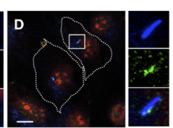

## Question

# Gene Research for Functional Annotation

## ⚠️ CRITICAL: Gene/Protein Identification Context

**BEFORE YOU BEGIN RESEARCH:** You MUST verify you are researching the CORRECT gene/protein. Gene symbols can be ambiguous, especially for less well-characterized genes from non-model organisms.

### Target Gene/Protein Identity (from UniProt):
- **UniProt Accession:** Q14511
- **Protein Description:** RecName: Full=Enhancer of filamentation 1 {ECO:0000303|PubMed:9584194}; Short=hEF1 {ECO:0000303|PubMed:9584194}; AltName: Full=CRK-associated substrate-related protein {ECO:0000303|PubMed:9497377}; Short=CAS-L {ECO:0000303|PubMed:9497377}; Short=CasL {ECO:0000303|PubMed:11827972}; AltName: Full=Cas scaffolding protein family member 2 {ECO:0000312|HGNC:HGNC:7733}; Short=CASS2 {ECO:0000312|HGNC:HGNC:7733}; AltName: Full=Neural precursor cell expressed developmentally down-regulated protein 9 {ECO:0000312|HGNC:HGNC:7733}; Short=NEDD-9 {ECO:0000312|HGNC:HGNC:7733}; AltName: Full=Renal carcinoma antigen NY-REN-12 {ECO:0000303|PubMed:10508479}; AltName: Full=p105 {ECO:0000303|PubMed:8879209}; Contains: RecName: Full=Enhancer of filamentation 1 p55;
- **Gene Information:** Name=NEDD9 {ECO:0000312|HGNC:HGNC:7733}; Synonyms=CASL {ECO:0000303|PubMed:11827972};
- **Organism (full):** Homo sapiens (Human).
- **Protein Family:** Belongs to the CAS family. .
- **Key Domains:** CAS_C. (IPR021901); CAS_fam. (IPR037362); NEDD9_SH3. (IPR035746); Serine_rich_dom. (IPR014928); Serine_rich_sf. (IPR038319)

### MANDATORY VERIFICATION STEPS:

1. **Check if the gene symbol "NEDD9" matches the protein description above**
2. **Verify the organism is correct:** Homo sapiens (Human).
3. **Check if protein family/domains align with what you find in literature**
4. **If you find literature for a DIFFERENT gene with the same or similar symbol, STOP**

### If Gene Symbol is Ambiguous or You Cannot Find Relevant Literature:

**DO NOT PROCEED WITH RESEARCH ON A DIFFERENT GENE.** Instead:
- State clearly: "The gene symbol 'NEDD9' is ambiguous or literature is limited for this specific protein"
- Explain what you found (e.g., "Found extensive literature on a different gene with the same symbol in a different organism")
- Describe the protein based ONLY on the UniProt information provided above
- Suggest that the protein function can be inferred from domain/family information

### Research Target:

Please provide a comprehensive research report on the gene **NEDD9** (gene ID: NEDD9, UniProt: Q14511) in human.

The research report should be a detailed narrative explaining the function, biological processes, and localization of the gene product. Citations should be given for all claims.

You should prioritize authoritative reviews and primary scientific literature when conducting research. You can supplement
this with annotations you find in gene/protein databases, but these can be outdated or inaccurate.

We are specifically interested in the primary function of the gene - for enzymes, what reaction is catalyzed, and what is the substrate specificity? For transporters, what is the substrate? For structural proteins or adapters, what is the broader structural role? For signaling molecules, what is the role in the pathway.

We are interested in where in or outside the cell the gene product carries out its function.

We are also interested in the signaling or biochemical pathways in which the gene functions. We are less interested in broad pleiotropic effects, except where these elucidate the precise role.

Include evidence where possible. We are interested in both experimental evidence as well as inference from structure, evolution, or bioinformatic analysis. Precise studies should be prioritized over high-throughput, where available.

## Output

Question: You are an expert researcher providing comprehensive, well-cited information.

Provide detailed information focusing on:
1. Key concepts and definitions with current understanding
2. Recent developments and latest research (prioritize 2023-2024 sources)
3. Current applications and real-world implementations
4. Expert opinions and analysis from authoritative sources
5. Relevant statistics and data from recent studies

Format as a comprehensive research report with proper citations. Include URLs and publication dates where available.
Always prioritize recent, authoritative sources and provide specific citations for all major claims.

# Gene Research for Functional Annotation

## ⚠️ CRITICAL: Gene/Protein Identification Context

**BEFORE YOU BEGIN RESEARCH:** You MUST verify you are researching the CORRECT gene/protein. Gene symbols can be ambiguous, especially for less well-characterized genes from non-model organisms.

### Target Gene/Protein Identity (from UniProt):
- **UniProt Accession:** Q14511
- **Protein Description:** RecName: Full=Enhancer of filamentation 1 {ECO:0000303|PubMed:9584194}; Short=hEF1 {ECO:0000303|PubMed:9584194}; AltName: Full=CRK-associated substrate-related protein {ECO:0000303|PubMed:9497377}; Short=CAS-L {ECO:0000303|PubMed:9497377}; Short=CasL {ECO:0000303|PubMed:11827972}; AltName: Full=Cas scaffolding protein family member 2 {ECO:0000312|HGNC:HGNC:7733}; Short=CASS2 {ECO:0000312|HGNC:HGNC:7733}; AltName: Full=Neural precursor cell expressed developmentally down-regulated protein 9 {ECO:0000312|HGNC:HGNC:7733}; Short=NEDD-9 {ECO:0000312|HGNC:HGNC:7733}; AltName: Full=Renal carcinoma antigen NY-REN-12 {ECO:0000303|PubMed:10508479}; AltName: Full=p105 {ECO:0000303|PubMed:8879209}; Contains: RecName: Full=Enhancer of filamentation 1 p55;
- **Gene Information:** Name=NEDD9 {ECO:0000312|HGNC:HGNC:7733}; Synonyms=CASL {ECO:0000303|PubMed:11827972};
- **Organism (full):** Homo sapiens (Human).
- **Protein Family:** Belongs to the CAS family. .
- **Key Domains:** CAS_C. (IPR021901); CAS_fam. (IPR037362); NEDD9_SH3. (IPR035746); Serine_rich_dom. (IPR014928); Serine_rich_sf. (IPR038319)

### MANDATORY VERIFICATION STEPS:

1. **Check if the gene symbol "NEDD9" matches the protein description above**
2. **Verify the organism is correct:** Homo sapiens (Human).
3. **Check if protein family/domains align with what you find in literature**
4. **If you find literature for a DIFFERENT gene with the same or similar symbol, STOP**

### If Gene Symbol is Ambiguous or You Cannot Find Relevant Literature:

**DO NOT PROCEED WITH RESEARCH ON A DIFFERENT GENE.** Instead:
- State clearly: "The gene symbol 'NEDD9' is ambiguous or literature is limited for this specific protein"
- Explain what you found (e.g., "Found extensive literature on a different gene with the same symbol in a different organism")
- Describe the protein based ONLY on the UniProt information provided above
- Suggest that the protein function can be inferred from domain/family information

### Research Target:

Please provide a comprehensive research report on the gene **NEDD9** (gene ID: NEDD9, UniProt: Q14511) in human.

The research report should be a detailed narrative explaining the function, biological processes, and localization of the gene product. Citations should be given for all claims.

You should prioritize authoritative reviews and primary scientific literature when conducting research. You can supplement
this with annotations you find in gene/protein databases, but these can be outdated or inaccurate.

We are specifically interested in the primary function of the gene - for enzymes, what reaction is catalyzed, and what is the substrate specificity? For transporters, what is the substrate? For structural proteins or adapters, what is the broader structural role? For signaling molecules, what is the role in the pathway.

We are interested in where in or outside the cell the gene product carries out its function.

We are also interested in the signaling or biochemical pathways in which the gene functions. We are less interested in broad pleiotropic effects, except where these elucidate the precise role.

Include evidence where possible. We are interested in both experimental evidence as well as inference from structure, evolution, or bioinformatic analysis. Precise studies should be prioritized over high-throughput, where available.

# Human NEDD9 (UniProt Q14511): functional annotation and research report

## Identity and principal function

**Identity verified.** Human **NEDD9** (UniProt [Q14511](https://www.uniprot.org/uniprotkb/Q14511/entry)) encodes the protein also called **HEF1, CAS-L/CasL and CASS2**. The reviewed literature uses these names for the same CAS-family protein, rather than for another gene. NEDD9 is an **intracellular, noncatalytic signaling scaffold**: it has no established enzymatic reaction or transported substrate. Its primary role is to assemble and spatially coordinate proteins that transmit adhesion and receptor signals to the cytoskeleton. (oneill2007anewcentral pages 1-3, shagisultanova2015preclinicalandclinical pages 1-3, purazo2023nedd9overexpressioncauses pages 1-2)

Its architecture explains that role. An N-terminal **SH3 domain** binds protein partners; a largely disordered **substrate domain** contains multiple tyrosines that become docking sites for SH2-domain adaptors after phosphorylation; and a **serine-rich region** and conserved **C-terminal region** contribute to interactions and focal-adhesion targeting. These experimentally described elements accord with the supplied CAS-family, SH3, serine-rich and CAS_C domain annotations. “Substrate domain” means a region *phosphorylated by other enzymes*, not catalytic activity by NEDD9. (shagisultanova2015preclinicalandclinical pages 1-3, shagisultanova2015preclinicalandclinical pages 3-4, nikonova2014casproteinsin pages 1-3, singh2007molecularbasisfor pages 2-4)

## Where NEDD9 acts and how

NEDD9 is predominantly **cytoplasmic**, concentrating at **focal adhesions** in adherent interphase cells. Smaller pools occur at the **centrosome** and **primary-cilium basal body**; during mitosis, NEDD9 associates with the spindle and subsequently the cytokinetic midbody. These are distinct intracellular sites of scaffold activity—not evidence that NEDD9 itself is a transmembrane receptor or secreted extracellular-matrix protein. The following synthesis separates their experimentally supported functions. (oneill2007anewcentral pages 1-3, shagisultanova2015preclinicalandclinical pages 3-4)

| Intracellular site | Primary molecular action | Experimental model / evidence | Representative source and date/DOI |
|---|---|---|---|
| Focal adhesions and integrin-associated cortex | Integrin β3-dependent NEDD9 phosphorylation increases SRC/FAK signaling; NEDD9–DOCK3 promotes RAC1-dependent mesenchymal motility. Separately, AXL phosphorylates NEDD9, enabling CRKII recruitment and organization of a PEAK1–CSK–paxillin pathway that accelerates focal-adhesion disassembly. | Human melanoma cells supported the integrin β3/SRC/DOCK3–RAC1 mechanism; human triple-negative breast-cancer cells, kinase assays, and metastasis models supported the AXL–NEDD9–CRKII–PEAK1 pathway. | Ahn et al., April 2012, [10.1242/jcs.101444](https://doi.org/10.1242/jcs.101444); Abu-Thuraia et al., July 2020, [10.1038/s41467-020-17415-x](https://doi.org/10.1038/s41467-020-17415-x) (ahn2012themetastasisgene pages 1-3, abuthuraia2020axlconferscell pages 4-5) |
| Primary-cilium basal body | NEDD9/HEF1 associates with and activates AURKA; AURKA activates the tubulin deacetylase HDAC6, destabilizing the ciliary axoneme and promoting cilium resorption. | Serum-starved human hTERT-RPE1 cells; localization, depletion, stimulation, and inhibitor experiments indicated that the pathway was necessary and sufficient for regulated ciliary disassembly. | Pugacheva et al., 29 June 2007, [10.1016/j.cell.2007.04.035](https://doi.org/10.1016/j.cell.2007.04.035) (pugacheva2007hef1dependentauroraa pages 1-3) |
| Centrosome and mitotic apparatus | Centrosomal NEDD9 supports AURKA Thr288 activation at G2/M and timely mitotic entry; NEDD9 subsequently redistributes along the spindle and toward the cytokinetic midbody. | Human HeLa-cell siRNA, immunofluorescence, immunoprecipitation, and immunoblot experiments showed that NEDD9 depletion reduced centrosomal AURKA activation and delayed G2/M progression. | Moore et al., September 2010, [10.1186/1747-1028-5-22](https://doi.org/10.1186/1747-1028-5-22) (moore2010thewwhectprotein pages 4-5) |
| T-cell immunological synapse | Actin polymerization drives Cas-L/NEDD9 phosphorylation at TCR microclusters; Cas-L supports microcluster transport and synapse stability and participates in feedback involving Ca²⁺ signaling, inside-out integrin activation, and actomyosin contraction. | Functional T-cell imaging and perturbation experiments supported Cas-L as a mechanical transducer between TCR microclusters and the actin network; the cited excerpt does not establish a specifically human-cell model. | Santos et al., November 2016, [10.1038/icb.2016.61](https://doi.org/10.1038/icb.2016.61) (santos2016actinpolymerization‐dependentactivation pages 1-6) |
| Migrating T-cell cortex | CasL maintains an F-actin-rich leading edge and limits ROCK-sensitive membrane blebbing during LFA-1/ICAM-1-dependent migration; the effect was not observed on VLA-4/VCAM-1. | **Mouse primary CD4⁺ T cells**, using CRISPR and germline knockout. This is a **December 2024 bioRxiv preprint**, not human-Q14511-specific or peer-reviewed evidence. | Kurtz et al., 12 December 2024, [10.1101/2024.12.12.628177](https://doi.org/10.1101/2024.12.12.628177) (kurtz2024thescaffoldprotein pages 3-5) |

*Table: This table maps the principal intracellular sites of NEDD9/CAS-L action to experimentally supported signaling mechanisms. It distinguishes human-cell evidence from the 2024 mouse T-cell preprint.*

**Adhesion-to-actin signaling is the best-characterized core function.** Integrin engagement brings NEDD9 into FAK/SRC-associated signaling complexes. Tyrosine phosphorylation of its substrate domain creates binding sites for CRK-family adaptors, which connect to guanine-nucleotide-exchange factors such as DOCK3 and, downstream, **RAC1-dependent actin remodeling**. In melanoma models, NEDD9 acted through integrin β3 and SRC to favor elongated, mesenchymal migration and restrain rounded, ROCK-dependent amoeboid migration; inhibiting SRC shifted the migration mode. Thus, the biologically meaningful output is regulated cell–matrix adhesion turnover, spreading and movement, not an intrinsic actin-polymerizing activity of NEDD9. See Ahn *et al.*, *Journal of Cell Science*, April 2012, [doi:10.1242/jcs.101444](https://doi.org/10.1242/jcs.101444). (ahn2012themetastasisgene pages 1-3)

A more precisely resolved receptor input was reported in triple-negative breast-cancer cells: ligand-activated **AXL phosphorylates the NEDD9 substrate domain**, promoting **CRKII** binding and a **PEAK1–CSK–paxillin** signaling network associated with faster focal-adhesion disassembly. The work also supports a NEDD9–CRKII–DOCK3–RAC connection. This is an experimentally defined *context-specific* route into NEDD9, rather than a claim that AXL is required for all NEDD9 functions. Abu-Thuraia *et al.*, *Nature Communications*, July 2020, [doi:10.1038/s41467-020-17415-x](https://doi.org/10.1038/s41467-020-17415-x). (abuthuraia2020axlconferscell pages 4-5, abuthuraia2020axlconferscell pages 1-2)

**Basal-body and cell-cycle signaling are additional direct functions.** In human hTERT-RPE1 cells, basal-body HEF1/NEDD9 cooperates with **Aurora-A kinase (AURKA)**; activated AURKA phosphorylates/activates **HDAC6**, whose tubulin-deacetylating activity facilitates disassembly of the microtubule-based primary cilium. Depletion and inhibitor experiments support this regulated-resorption pathway. Figure 1D–E of the primary study shows HEF1 immunofluorescence at cilium-associated, γ-tubulin-marked structures; it is localization evidence, whereas the perturbations establish the functional pathway. Pugacheva *et al.*, *Cell*, **29 June 2007**, [doi:10.1016/j.cell.2007.04.035](https://doi.org/10.1016/j.cell.2007.04.035). (pugacheva2007hef1dependentauroraa pages 1-3, pugacheva2007hef1dependentauroraa media b29371b1, pugacheva2007hef1dependentauroraa media fbdd9471)

At the **G2/M centrosome**, human-cell experiments further implicate NEDD9 in AURKA activation: NEDD9 depletion reduced centrosomal AURKA activation and delayed mitotic entry in HeLa cells. The associated scaffold is regulated by **SMURF2-dependent stabilization**; these results distinguish NEDD9’s mitotic role from its nonmitotic ciliary role. Moore *et al.*, *Cell Division*, September 2010, [doi:10.1186/1747-1028-5-22](https://doi.org/10.1186/1747-1028-5-22). (moore2010thewwhectprotein pages 4-5)

**Immune-cell signaling provides another physiological setting.** T-cell receptor stimulation induces phosphorylation of Cas-L/NEDD9 at TCR microclusters in an actin-polymerization-dependent manner. Functional work connects it to microcluster transport, immunological-synapse stability, calcium signaling and integrin activation, consistent with coupling of cytoskeletal forces to receptor signaling. This supports a mechanotransduction role in T cells, but the stretching mechanism established for the related CAS protein BCAR1 should not automatically be treated as an independently proven molecular mechanism for every NEDD9 complex. Santos *et al.*, *Immunology & Cell Biology*, November 2016, [doi:10.1038/icb.2016.61](https://doi.org/10.1038/icb.2016.61). (santos2016actinpolymerization‐dependentactivation pages 1-6, kurtz2024thescaffoldprotein pages 1-3)

## Developments in 2023–2024

**HER2-associated mammary growth, 2023.** In human MCF10A three-dimensional acini and genetically engineered mice, increasing NEDD9 expanded luminal epithelial populations and promoted abnormal acinar or mammary-duct growth; combining mammary NEDD9 overexpression with **Erbb2/neu** produced more early preneoplastic lesions detectable at approximately **16 weeks**. The associated biochemical changes included increased **ERK1/2 and AURKA activity**; notably, this model did **not** show a significant SRC/FAK increase, illustrating why focal-adhesion signaling should not be imposed on every NEDD9 phenotype. Patient-tissue and retrospective-expression analyses complemented, but did not replace, the perturbation experiments. Purazo *et al.*, *Cancers*, **9 February 2023**, [doi:10.3390/cancers15041119](https://doi.org/10.3390/cancers15041119). (purazo2023nedd9overexpressioncauses pages 17-20, purazo2023nedd9overexpressioncauses pages 1-2, purazo2023nedd9overexpressioncauses pages 13-15)

**Transcriptional control and signaling in cancer, 2024.** In breast-cancer models, Liu and Luo found that **HDAC4 suppression** increased histone H3K9 acetylation at the NEDD9 promoter and NEDD9 expression. Their NEDD9 gain-/loss-of-function experiments linked NEDD9 to **FAK/NF-κB signaling and IL-6 secretion**, with conditioned-medium and IL-6-blockade experiments supporting downstream M2-like macrophage polarization. These results concern intracellular NEDD9 regulation and *indirect*, IL-6-mediated effects on other cells; they do not make NEDD9 a secreted cytokine. *Neoplasia*, November 2024, [doi:10.1016/j.neo.2024.101059](https://doi.org/10.1016/j.neo.2024.101059). (liu2024nedd9istranscriptionally pages 1-2, liu2024nedd9istranscriptionally pages 6-8)

In hepatocellular-carcinoma models, Tang *et al.* used promoter-binding and reporter assays to identify **TCF7L2 binding at −1522/−1509 of the NEDD9 promoter**. NEDD9 knockdown curtailed the AKT/mTOR phosphorylation and migration/invasion associated with TCF7L2 overexpression, supporting a **TCF7L2 → NEDD9 → AKT/mTOR** axis in those cells. The patient tissue microarray contained **87 cases**; expression/survival associations do not themselves establish that NEDD9 directly binds or phosphorylates AKT. *Molecular Medicine*, July 2024, [doi:10.1186/s10020-024-00878-9](https://doi.org/10.1186/s10020-024-00878-9). (tang2024transcriptionfactor7 pages 1-2, tang2024transcriptionfactor7 pages 6-9)

**Integrin-specific T-cell migration, 2024—preliminary.** A **December 2024 bioRxiv preprint using primary mouse, not human, T cells** reported that CasL loss impaired migration on **ICAM-1**, but not **VCAM-1**. During one minute of ICAM-1 migration, about **50%** of deficient cells produced a membrane bleb versus **fewer than 10%** of controls; **2.5 μM Y-27632**, a ROCK inhibitor, suppressed the abnormal blebbing. Mouse transplant experiments found reduced entry into inflamed liver and lung but preserved trafficking to spleen and lymph nodes. This sharpens the proposed cytoskeletal role but requires peer review and testing in human T cells before species-specific clinical extrapolation. Kurtz *et al.*, bioRxiv, **12 December 2024**, [doi:10.1101/2024.12.12.628177](https://doi.org/10.1101/2024.12.12.628177). (kurtz2024thescaffoldprotein pages 1-3, kurtz2024thescaffoldprotein pages 3-5, kurtz2024thescaffoldprotein pages 5-7)

## Human evidence, current use and limitations

The clearest **present-day application is investigational biomarker research**, alongside experimental use of NEDD9 perturbation to dissect migration, ciliary and tumor pathways—not an established NEDD9-directed treatment. A 2024 systematic review/meta-analysis pooled **27 studies and 3,915 patients**: higher NEDD9 expression was associated with worse overall survival (**HR 1.81; 95% CI 1.38–2.37**) and with worse combined progression-/disease-/recurrence-free or cancer-specific survival (**HR 2.14; 95% CI 1.42–3.23**). These are associations across heterogeneous cancers, not estimates of benefit from targeting NEDD9. Yasin *et al.*, *Technology in Cancer Research & Treatment*, **2024**, [doi:10.1177/15330338241297597](https://doi.org/10.1177/15330338241297597). (yasin2024theprognosticsignificance pages 1-2)

**Context is decisive.** The same meta-analysis reported a nonsignificant non-small-cell lung-cancer overall-survival association (**HR 1.31; 95% CI 0.60–2.83; I² = 82%**) but an association in the opposite direction in its lung-adenocarcinoma subgroup (**HR 0.70; 95% CI 0.54–0.90**). It detected potential publication bias for overall survival and noted variable expression assays and incomplete adjustment for cancer stage. Independent HER2-positive breast-cancer analyses found poorer relapse-free survival with higher NEDD9 (**HR 1.29; p = 0.02**) and only moderate discrimination of anti-HER2 treatment response (**AUC 0.612** for pathological complete response; **0.719** for five-year relapse-free survival in the analyzed subsets). None constitutes a prospectively validated universal clinical cutoff. (yasin2024theprognosticsignificance pages 5-6, yasin2024theprognosticsignificance pages 15-16, purazo2023nedd9overexpressioncauses pages 8-10)

Therapeutic proposals therefore target **NEDD9-associated dependencies**—for example AURKA, adhesion signaling or IL-6—or assess NEDD9 as a stratification marker; the cited results remain preclinical or retrospective. A 2024 FAK–YAP drug-persister study, for example, included NEDD9 in a FAK-associated expression signature **without establishing NEDD9 as the causal mediator of FAK–YAP drug tolerance**. Likewise, inhibitors of AURKA or HDAC6 affect enzymes *downstream of or associated with* NEDD9, not a catalytic site on NEDD9. On the evidence reviewed here, neither an approved NEDD9-specific medicine nor a clinically validated NEDD9-directed companion diagnostic is established. (pugacheva2007hef1dependentauroraa pages 1-3, haderk2024focaladhesionkinaseyap pages 10-11, yasin2024theprognosticsignificance pages 15-16, purazo2023theroleof pages 115-118)

**Functional annotation conclusion:** assign human NEDD9 primarily as a **phosphorylation-regulated CAS-family intracellular adaptor/scaffold for integrin- and receptor-initiated signaling at focal adhesions**, linking those inputs to CRK-family adaptors, cytoskeletal regulation and cell migration. Annotate **basal-body AURKA–HDAC6-dependent cilium resorption**, **centrosomal AURKA regulation at mitotic entry**, and **T-cell receptor/integrin-associated actin signaling** as experimentally supported, compartment- and cell-type-dependent additional functions; treat individual cancer pathways and prognostic direction as context-specific rather than universal. (abuthuraia2020axlconferscell pages 4-5, ahn2012themetastasisgene pages 1-3, pugacheva2007hef1dependentauroraa pages 1-3, moore2010thewwhectprotein pages 4-5, santos2016actinpolymerization‐dependentactivation pages 1-6, yasin2024theprognosticsignificance pages 15-16)

References

1. (oneill2007anewcentral pages 1-3): Geraldine M. O'Neill, Sachiko Seo, Ilya G. Serebriiskii, Stuart R. Lessin, and Erica A. Golemis. A new central scaffold for metastasis: parsing hef1/cas-l/nedd9. Cancer research, 67 19:8975-9, Oct 2007. URL: https://doi.org/10.1158/0008-5472.can-07-1328, doi:10.1158/0008-5472.can-07-1328. This article has 129 citations and is from a highest quality peer-reviewed journal.

2. (shagisultanova2015preclinicalandclinical pages 1-3): Elena Shagisultanova, Anna V. Gaponova, Rashid Gabbasov, Emmanuelle Nicolas, and Erica A. Golemis. Preclinical and clinical studies of the nedd9 scaffold protein in cancer and other diseases. Gene, 567 1:1-11, Aug 2015. URL: https://doi.org/10.1016/j.gene.2015.04.086, doi:10.1016/j.gene.2015.04.086. This article has 89 citations and is from a peer-reviewed journal.

3. (purazo2023nedd9overexpressioncauses pages 1-2): Marc L. Purazo, Ryan J. Ice, Rahul Shimpi, Mark Hoenerhoff, and Elena N. Pugacheva. Nedd9 overexpression causes hyperproliferation of luminal cells and cooperates with her2 oncogene in tumor initiation: a novel prognostic marker in breast cancer. Cancers, Feb 2023. URL: https://doi.org/10.3390/cancers15041119, doi:10.3390/cancers15041119. This article has 9 citations.

4. (shagisultanova2015preclinicalandclinical pages 3-4): Elena Shagisultanova, Anna V. Gaponova, Rashid Gabbasov, Emmanuelle Nicolas, and Erica A. Golemis. Preclinical and clinical studies of the nedd9 scaffold protein in cancer and other diseases. Gene, 567 1:1-11, Aug 2015. URL: https://doi.org/10.1016/j.gene.2015.04.086, doi:10.1016/j.gene.2015.04.086. This article has 89 citations and is from a peer-reviewed journal.

5. (nikonova2014casproteinsin pages 1-3): Anna S. Nikonova, Anna V. Gaponova, Alexander E. Kudinov, and Erica A. Golemis. Cas proteins in health and disease: an update. IUBMB Life, 66:387-395, Jun 2014. URL: https://doi.org/10.1002/iub.1282, doi:10.1002/iub.1282. This article has 71 citations and is from a peer-reviewed journal.

6. (singh2007molecularbasisfor pages 2-4): Mahendra K. Singh, Lauren Cowell, Sachiko Seo, Geraldine M. O’Neill, and Erica A. Golemis. Molecular basis for hef1/nedd9/cas-l action as a multifunctional co-ordinator of invasion, apoptosis and cell cycle. Cell Biochemistry and Biophysics, 48:54-72, Jun 2007. URL: https://doi.org/10.1007/s12013-007-0036-3, doi:10.1007/s12013-007-0036-3. This article has 151 citations and is from a peer-reviewed journal.

7. (ahn2012themetastasisgene pages 1-3): Jessica Ahn, Victoria Sanz-Moreno, and Christopher J. Marshall. The metastasis gene nedd9 product acts through integrin β3 and src to promote mesenchymal motility and inhibit amoeboid motility. Journal of Cell Science, 125:1814-1826, Apr 2012. URL: https://doi.org/10.1242/jcs.101444, doi:10.1242/jcs.101444. This article has 98 citations and is from a domain leading peer-reviewed journal.

8. (abuthuraia2020axlconferscell pages 4-5): Afnan Abu-Thuraia, Marie-Anne Goyette, Jonathan Boulais, Carine Delliaux, Chloé Apcher, Céline Schott, Rony Chidiac, Halil Bagci, Marie-Pier Thibault, Dominique Davidson, Mathieu Ferron, André Veillette, Roger J. Daly, Anne-Claude Gingras, Jean-Philippe Gratton, and Jean-François Côté. Axl confers cell migration and invasion by hijacking a peak1-regulated focal adhesion protein network. Nature Communications, Jul 2020. URL: https://doi.org/10.1038/s41467-020-17415-x, doi:10.1038/s41467-020-17415-x. This article has 86 citations and is from a highest quality peer-reviewed journal.

9. (pugacheva2007hef1dependentauroraa pages 1-3): Elena N. Pugacheva, Sandra A. Jablonski, Tiffiney R. Hartman, Elizabeth P. Henske, and Erica A. Golemis. Hef1-dependent aurora a activation induces disassembly of the primary cilium. Cell, 129:1351-1363, Jun 2007. URL: https://doi.org/10.1016/j.cell.2007.04.035, doi:10.1016/j.cell.2007.04.035. This article has 1132 citations and is from a highest quality peer-reviewed journal.

10. (moore2010thewwhectprotein pages 4-5): Finola E Moore, Evan C Osmundson, Jennifer Koblinski, Elena Pugacheva, Erica A Golemis, Dipankar Ray, and Hiroaki Kiyokawa. The ww-hect protein smurf2 interacts with the docking protein nedd9/hef1 for aurora a activation. Cell Division, 5:22-22, Sep 2010. URL: https://doi.org/10.1186/1747-1028-5-22, doi:10.1186/1747-1028-5-22. This article has 27 citations and is from a peer-reviewed journal.

11. (santos2016actinpolymerization‐dependentactivation pages 1-6): Luís C Santos, David A Blair, Sudha Kumari, Michael Cammer, Thomas Iskratsch, Olivier Herbin, Konstantina Alexandropoulos, Michael L Dustin, and Michael P Sheetz. Actin polymerization‐dependent activation of cas‐l promotes immunological synapse stability. Immunology &amp; Cell Biology, 94:981-993, Nov 2016. URL: https://doi.org/10.1038/icb.2016.61, doi:10.1038/icb.2016.61. This article has 41 citations and is from a peer-reviewed journal.

12. (kurtz2024thescaffoldprotein pages 3-5): Liz A Kurtz, Hope E Shearer, Rosanne Trevail, Menelaos Symeonides, Mobin Karimi, and Nathan H Roy. The scaffold protein casl regulates t cell migration by restricting membrane blebbing. bioRxiv, Dec 2024. URL: https://doi.org/10.1101/2024.12.12.628177, doi:10.1101/2024.12.12.628177. This article has 0 citations.

13. (abuthuraia2020axlconferscell pages 1-2): Afnan Abu-Thuraia, Marie-Anne Goyette, Jonathan Boulais, Carine Delliaux, Chloé Apcher, Céline Schott, Rony Chidiac, Halil Bagci, Marie-Pier Thibault, Dominique Davidson, Mathieu Ferron, André Veillette, Roger J. Daly, Anne-Claude Gingras, Jean-Philippe Gratton, and Jean-François Côté. Axl confers cell migration and invasion by hijacking a peak1-regulated focal adhesion protein network. Nature Communications, Jul 2020. URL: https://doi.org/10.1038/s41467-020-17415-x, doi:10.1038/s41467-020-17415-x. This article has 86 citations and is from a highest quality peer-reviewed journal.

14. (pugacheva2007hef1dependentauroraa media b29371b1): Elena N. Pugacheva, Sandra A. Jablonski, Tiffiney R. Hartman, Elizabeth P. Henske, and Erica A. Golemis. Hef1-dependent aurora a activation induces disassembly of the primary cilium. Cell, 129:1351-1363, Jun 2007. URL: https://doi.org/10.1016/j.cell.2007.04.035, doi:10.1016/j.cell.2007.04.035. This article has 1132 citations and is from a highest quality peer-reviewed journal.

15. (pugacheva2007hef1dependentauroraa media fbdd9471): Elena N. Pugacheva, Sandra A. Jablonski, Tiffiney R. Hartman, Elizabeth P. Henske, and Erica A. Golemis. Hef1-dependent aurora a activation induces disassembly of the primary cilium. Cell, 129:1351-1363, Jun 2007. URL: https://doi.org/10.1016/j.cell.2007.04.035, doi:10.1016/j.cell.2007.04.035. This article has 1132 citations and is from a highest quality peer-reviewed journal.

16. (kurtz2024thescaffoldprotein pages 1-3): Liz A Kurtz, Hope E Shearer, Rosanne Trevail, Menelaos Symeonides, Mobin Karimi, and Nathan H Roy. The scaffold protein casl regulates t cell migration by restricting membrane blebbing. bioRxiv, Dec 2024. URL: https://doi.org/10.1101/2024.12.12.628177, doi:10.1101/2024.12.12.628177. This article has 0 citations.

17. (purazo2023nedd9overexpressioncauses pages 17-20): Marc L. Purazo, Ryan J. Ice, Rahul Shimpi, Mark Hoenerhoff, and Elena N. Pugacheva. Nedd9 overexpression causes hyperproliferation of luminal cells and cooperates with her2 oncogene in tumor initiation: a novel prognostic marker in breast cancer. Cancers, Feb 2023. URL: https://doi.org/10.3390/cancers15041119, doi:10.3390/cancers15041119. This article has 9 citations.

18. (purazo2023nedd9overexpressioncauses pages 13-15): Marc L. Purazo, Ryan J. Ice, Rahul Shimpi, Mark Hoenerhoff, and Elena N. Pugacheva. Nedd9 overexpression causes hyperproliferation of luminal cells and cooperates with her2 oncogene in tumor initiation: a novel prognostic marker in breast cancer. Cancers, Feb 2023. URL: https://doi.org/10.3390/cancers15041119, doi:10.3390/cancers15041119. This article has 9 citations.

19. (liu2024nedd9istranscriptionally pages 1-2): Wen-Hong Liu and Guanghua Luo. Nedd9 is transcriptionally regulated by hdac4 and promotes breast cancer metastasis and macrophage m2 polarization via the fak/nf-κb signaling pathway. Neoplasia, 57:101059, Nov 2024. URL: https://doi.org/10.1016/j.neo.2024.101059, doi:10.1016/j.neo.2024.101059. This article has 12 citations and is from a domain leading peer-reviewed journal.

20. (liu2024nedd9istranscriptionally pages 6-8): Wen-Hong Liu and Guanghua Luo. Nedd9 is transcriptionally regulated by hdac4 and promotes breast cancer metastasis and macrophage m2 polarization via the fak/nf-κb signaling pathway. Neoplasia, 57:101059, Nov 2024. URL: https://doi.org/10.1016/j.neo.2024.101059, doi:10.1016/j.neo.2024.101059. This article has 12 citations and is from a domain leading peer-reviewed journal.

21. (tang2024transcriptionfactor7 pages 1-2): Linsong Tang, Shengjun Xu, Rongli Wei, Guanghan Fan, Junbin Zhou, Xuyong Wei, and Xiao Xu. Transcription factor 7 like 2 promotes metastasis in hepatocellular carcinoma via nedd9-mediated activation of akt/mtor signaling pathway. Molecular Medicine, Jul 2024. URL: https://doi.org/10.1186/s10020-024-00878-9, doi:10.1186/s10020-024-00878-9. This article has 5 citations and is from a peer-reviewed journal.

22. (tang2024transcriptionfactor7 pages 6-9): Linsong Tang, Shengjun Xu, Rongli Wei, Guanghan Fan, Junbin Zhou, Xuyong Wei, and Xiao Xu. Transcription factor 7 like 2 promotes metastasis in hepatocellular carcinoma via nedd9-mediated activation of akt/mtor signaling pathway. Molecular Medicine, Jul 2024. URL: https://doi.org/10.1186/s10020-024-00878-9, doi:10.1186/s10020-024-00878-9. This article has 5 citations and is from a peer-reviewed journal.

23. (kurtz2024thescaffoldprotein pages 5-7): Liz A Kurtz, Hope E Shearer, Rosanne Trevail, Menelaos Symeonides, Mobin Karimi, and Nathan H Roy. The scaffold protein casl regulates t cell migration by restricting membrane blebbing. bioRxiv, Dec 2024. URL: https://doi.org/10.1101/2024.12.12.628177, doi:10.1101/2024.12.12.628177. This article has 0 citations.

24. (yasin2024theprognosticsignificance pages 1-2): Jehad A. Yasin, Ramez M. Odat, Fares A. Qtaishat, Mohammad-Amer A. Tamimi, Muaath I. Alsufi, Osama M. Younis, Leen A. Alkuttob, and Anwaar Saeed. The prognostic significance of nedd9 expression in human cancers: a systematic review, meta-analysis, and omics exploration. Technology in Cancer Research & Treatment, Jan 2024. URL: https://doi.org/10.1177/15330338241297597, doi:10.1177/15330338241297597. This article has 4 citations and is from a peer-reviewed journal.

25. (yasin2024theprognosticsignificance pages 5-6): Jehad A. Yasin, Ramez M. Odat, Fares A. Qtaishat, Mohammad-Amer A. Tamimi, Muaath I. Alsufi, Osama M. Younis, Leen A. Alkuttob, and Anwaar Saeed. The prognostic significance of nedd9 expression in human cancers: a systematic review, meta-analysis, and omics exploration. Technology in Cancer Research & Treatment, Jan 2024. URL: https://doi.org/10.1177/15330338241297597, doi:10.1177/15330338241297597. This article has 4 citations and is from a peer-reviewed journal.

26. (yasin2024theprognosticsignificance pages 15-16): Jehad A. Yasin, Ramez M. Odat, Fares A. Qtaishat, Mohammad-Amer A. Tamimi, Muaath I. Alsufi, Osama M. Younis, Leen A. Alkuttob, and Anwaar Saeed. The prognostic significance of nedd9 expression in human cancers: a systematic review, meta-analysis, and omics exploration. Technology in Cancer Research & Treatment, Jan 2024. URL: https://doi.org/10.1177/15330338241297597, doi:10.1177/15330338241297597. This article has 4 citations and is from a peer-reviewed journal.

27. (purazo2023nedd9overexpressioncauses pages 8-10): Marc L. Purazo, Ryan J. Ice, Rahul Shimpi, Mark Hoenerhoff, and Elena N. Pugacheva. Nedd9 overexpression causes hyperproliferation of luminal cells and cooperates with her2 oncogene in tumor initiation: a novel prognostic marker in breast cancer. Cancers, Feb 2023. URL: https://doi.org/10.3390/cancers15041119, doi:10.3390/cancers15041119. This article has 9 citations.

28. (haderk2024focaladhesionkinaseyap pages 10-11): Franziska Haderk, Yu-Ting Chou, Lauren Cech, Celia Fernández-Méndez, Johnny Yu, Victor Olivas, Ismail M. Meraz, Dora Barbosa Rabago, D. Lucas Kerr, Carlos Gomez, David V. Allegakoen, Juan Guan, Khyati N. Shah, Kari A. Herrington, Oghenekevwe M. Gbenedio, Shigeki Nanjo, Mourad Majidi, Whitney Tamaki, Yashar K. Pourmoghadam, Julia K. Rotow, Caroline E. McCoach, Jonathan W. Riess, J. Silvio Gutkind, Tracy T. Tang, Leonard Post, Bo Huang, Pilar Santisteban, Hani Goodarzi, Sourav Bandyopadhyay, Calvin J. Kuo, Jeroen P. Roose, Wei Wu, Collin M. Blakely, Jack A. Roth, and Trever G. Bivona. Focal adhesion kinase-yap signaling axis drives drug-tolerant persister cells and residual disease in lung cancer. Nature Communications, May 2024. URL: https://doi.org/10.1038/s41467-024-47423-0, doi:10.1038/s41467-024-47423-0. This article has 119 citations and is from a highest quality peer-reviewed journal.

29. (purazo2023theroleof pages 115-118): Marc Louis Purazo. The role of nedd9 in her2-driven breast cancer. ArXiv, 2023. URL: https://doi.org/10.33915/etd.11996, doi:10.33915/etd.11996. This article has 0 citations.

## Artifacts

- [Edison artifact artifact-00](NEDD9-deep-research-falcon_artifacts/artifact-00.md)

## Citations

1. moore2010thewwhectprotein pages 4-5
2. kurtz2024thescaffoldprotein pages 3-5
3. ahn2012themetastasisgene pages 1-3
4. yasin2024theprognosticsignificance pages 1-2
5. oneill2007anewcentral pages 1-3
6. shagisultanova2015preclinicalandclinical pages 1-3
7. shagisultanova2015preclinicalandclinical pages 3-4
8. nikonova2014casproteinsin pages 1-3
9. singh2007molecularbasisfor pages 2-4
10. abuthuraia2020axlconferscell pages 4-5
11. abuthuraia2020axlconferscell pages 1-2
12. kurtz2024thescaffoldprotein pages 1-3
13. kurtz2024thescaffoldprotein pages 5-7
14. yasin2024theprognosticsignificance pages 5-6
15. yasin2024theprognosticsignificance pages 15-16
16. haderk2024focaladhesionkinaseyap pages 10-11
17. purazo2023theroleof pages 115-118
18. Q14511
19. 10.1242/jcs.101444
20. 10.1038/s41467-020-17415-x
21. 10.1016/j.cell.2007.04.035
22. 10.1186/1747-1028-5-22
23. 10.1038/icb.2016.61
24. 10.1101/2024.12.12.628177
25. doi:10.1242/jcs.101444
26. doi:10.1038/s41467-020-17415-x
27. doi:10.1016/j.cell.2007.04.035
28. doi:10.1186/1747-1028-5-22
29. doi:10.1038/icb.2016.61
30. doi:10.3390/cancers15041119
31. doi:10.1016/j.neo.2024.101059
32. doi:10.1186/s10020-024-00878-9
33. doi:10.1101/2024.12.12.628177
34. doi:10.1177/15330338241297597
35. https://www.uniprot.org/uniprotkb/Q14511/entry
36. https://doi.org/10.1242/jcs.101444
37. https://doi.org/10.1038/s41467-020-17415-x
38. https://doi.org/10.1016/j.cell.2007.04.035
39. https://doi.org/10.1186/1747-1028-5-22
40. https://doi.org/10.1038/icb.2016.61
41. https://doi.org/10.1101/2024.12.12.628177
42. https://doi.org/10.3390/cancers15041119
43. https://doi.org/10.1016/j.neo.2024.101059
44. https://doi.org/10.1186/s10020-024-00878-9
45. https://doi.org/10.1177/15330338241297597
46. https://doi.org/10.1158/0008-5472.can-07-1328,
47. https://doi.org/10.1016/j.gene.2015.04.086,
48. https://doi.org/10.3390/cancers15041119,
49. https://doi.org/10.1002/iub.1282,
50. https://doi.org/10.1007/s12013-007-0036-3,
51. https://doi.org/10.1242/jcs.101444,
52. https://doi.org/10.1038/s41467-020-17415-x,
53. https://doi.org/10.1016/j.cell.2007.04.035,
54. https://doi.org/10.1186/1747-1028-5-22,
55. https://doi.org/10.1038/icb.2016.61,
56. https://doi.org/10.1101/2024.12.12.628177,
57. https://doi.org/10.1016/j.neo.2024.101059,
58. https://doi.org/10.1186/s10020-024-00878-9,
59. https://doi.org/10.1177/15330338241297597,
60. https://doi.org/10.1038/s41467-024-47423-0,
61. https://doi.org/10.33915/etd.11996,