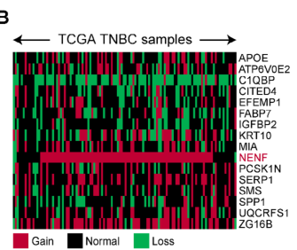

## Question

# Gene Research for Functional Annotation

## ⚠️ CRITICAL: Gene/Protein Identification Context

**BEFORE YOU BEGIN RESEARCH:** You MUST verify you are researching the CORRECT gene/protein. Gene symbols can be ambiguous, especially for less well-characterized genes from non-model organisms.

### Target Gene/Protein Identity (from UniProt):
- **UniProt Accession:** Q9UMX5
- **Protein Description:** RecName: Full=Neudesin; AltName: Full=Cell immortalization-related protein 2; AltName: Full=Neuron-derived neurotrophic factor; AltName: Full=Protein GIG47 {ECO:0000303|PubMed:22748190}; AltName: Full=Secreted protein of unknown function; Short=SPUF protein; Flags: Precursor;
- **Gene Information:** Name=NENF {ECO:0000312|HGNC:HGNC:30384}; Synonyms=CIR2, SPUF;
- **Organism (full):** Homo sapiens (Human).
- **Protein Family:** Belongs to the cytochrome b5 family. MAPR subfamily.
- **Key Domains:** Cyt_B5-like_heme/steroid-bd. (IPR001199); Cyt_B5-like_heme/steroid_sf. (IPR036400); MAPR/NEUFC/NENF-like. (IPR050577); Cyt-b5 (PF00173)

### MANDATORY VERIFICATION STEPS:

1. **Check if the gene symbol "NENF" matches the protein description above**
2. **Verify the organism is correct:** Homo sapiens (Human).
3. **Check if protein family/domains align with what you find in literature**
4. **If you find literature for a DIFFERENT gene with the same or similar symbol, STOP**

### If Gene Symbol is Ambiguous or You Cannot Find Relevant Literature:

**DO NOT PROCEED WITH RESEARCH ON A DIFFERENT GENE.** Instead:
- State clearly: "The gene symbol 'NENF' is ambiguous or literature is limited for this specific protein"
- Explain what you found (e.g., "Found extensive literature on a different gene with the same symbol in a different organism")
- Describe the protein based ONLY on the UniProt information provided above
- Suggest that the protein function can be inferred from domain/family information

### Research Target:

Please provide a comprehensive research report on the gene **NENF** (gene ID: NENF, UniProt: Q9UMX5) in human.

The research report should be a detailed narrative explaining the function, biological processes, and localization of the gene product. Citations should be given for all claims.

You should prioritize authoritative reviews and primary scientific literature when conducting research. You can supplement
this with annotations you find in gene/protein databases, but these can be outdated or inaccurate.

We are specifically interested in the primary function of the gene - for enzymes, what reaction is catalyzed, and what is the substrate specificity? For transporters, what is the substrate? For structural proteins or adapters, what is the broader structural role? For signaling molecules, what is the role in the pathway.

We are interested in where in or outside the cell the gene product carries out its function.

We are also interested in the signaling or biochemical pathways in which the gene functions. We are less interested in broad pleiotropic effects, except where these elucidate the precise role.

Include evidence where possible. We are interested in both experimental evidence as well as inference from structure, evolution, or bioinformatic analysis. Precise studies should be prioritized over high-throughput, where available.

## Output

Question: You are an expert researcher providing comprehensive, well-cited information.

Provide detailed information focusing on:
1. Key concepts and definitions with current understanding
2. Recent developments and latest research (prioritize 2023-2024 sources)
3. Current applications and real-world implementations
4. Expert opinions and analysis from authoritative sources
5. Relevant statistics and data from recent studies

Format as a comprehensive research report with proper citations. Include URLs and publication dates where available.
Always prioritize recent, authoritative sources and provide specific citations for all major claims.

# Gene Research for Functional Annotation

## ⚠️ CRITICAL: Gene/Protein Identification Context

**BEFORE YOU BEGIN RESEARCH:** You MUST verify you are researching the CORRECT gene/protein. Gene symbols can be ambiguous, especially for less well-characterized genes from non-model organisms.

### Target Gene/Protein Identity (from UniProt):
- **UniProt Accession:** Q9UMX5
- **Protein Description:** RecName: Full=Neudesin; AltName: Full=Cell immortalization-related protein 2; AltName: Full=Neuron-derived neurotrophic factor; AltName: Full=Protein GIG47 {ECO:0000303|PubMed:22748190}; AltName: Full=Secreted protein of unknown function; Short=SPUF protein; Flags: Precursor;
- **Gene Information:** Name=NENF {ECO:0000312|HGNC:HGNC:30384}; Synonyms=CIR2, SPUF;
- **Organism (full):** Homo sapiens (Human).
- **Protein Family:** Belongs to the cytochrome b5 family. MAPR subfamily.
- **Key Domains:** Cyt_B5-like_heme/steroid-bd. (IPR001199); Cyt_B5-like_heme/steroid_sf. (IPR036400); MAPR/NEUFC/NENF-like. (IPR050577); Cyt-b5 (PF00173)

### MANDATORY VERIFICATION STEPS:

1. **Check if the gene symbol "NENF" matches the protein description above**
2. **Verify the organism is correct:** Homo sapiens (Human).
3. **Check if protein family/domains align with what you find in literature**
4. **If you find literature for a DIFFERENT gene with the same or similar symbol, STOP**

### If Gene Symbol is Ambiguous or You Cannot Find Relevant Literature:

**DO NOT PROCEED WITH RESEARCH ON A DIFFERENT GENE.** Instead:
- State clearly: "The gene symbol 'NENF' is ambiguous or literature is limited for this specific protein"
- Explain what you found (e.g., "Found extensive literature on a different gene with the same symbol in a different organism")
- Describe the protein based ONLY on the UniProt information provided above
- Suggest that the protein function can be inferred from domain/family information

### Research Target:

Please provide a comprehensive research report on the gene **NENF** (gene ID: NENF, UniProt: Q9UMX5) in human.

The research report should be a detailed narrative explaining the function, biological processes, and localization of the gene product. Citations should be given for all claims.

You should prioritize authoritative reviews and primary scientific literature when conducting research. You can supplement
this with annotations you find in gene/protein databases, but these can be outdated or inaccurate.

We are specifically interested in the primary function of the gene - for enzymes, what reaction is catalyzed, and what is the substrate specificity? For transporters, what is the substrate? For structural proteins or adapters, what is the broader structural role? For signaling molecules, what is the role in the pathway.

We are interested in where in or outside the cell the gene product carries out its function.

We are also interested in the signaling or biochemical pathways in which the gene functions. We are less interested in broad pleiotropic effects, except where these elucidate the precise role.

Include evidence where possible. We are interested in both experimental evidence as well as inference from structure, evolution, or bioinformatic analysis. Precise studies should be prioritized over high-throughput, where available.

## Research Report: Human **NENF / Neudesin** (UniProt **Q9UMX5**)

### 0) Target verification (critical identity check)
Human **NENF** encodes **neudesin (neuron-derived neurotrophic factor)**, a **secreted** MAPR-family protein with a **cytochrome b5-like heme/steroid-binding domain**, matching UniProt accession **Q9UMX5** (cahill2017theevolutionaryappearance pages 13-14, wang2024identificationofthe pages 1-2). Recent human cancer work also uses the same identity/aliases (**NENF = neudesin = GIG47**) and describes a **172-aa secreted protein** with a cytochrome b5-like heme/steroid-binding domain, consistent with UniProt (wang2024identificationofthe pages 1-2, ohta2015neudesinasa pages 1-2).

---

## 1) Key concepts and definitions (current understanding)

### 1.1 Gene/protein nomenclature and aliases
Neudesin is also referred to as **NENF** and has been described in the cancer literature under the alias **GIG47** (wang2024identificationofthe pages 1-2, ohta2015neudesinasa pages 2-4). A 2015 review summarizes this nomenclature explicitly (neudesin ≈ NENF ≈ GIG47) (ohta2015neudesinasa pages 1-2).

### 1.2 Protein class: MAPR (membrane-associated progesterone receptor) family
Neudesin is part of the **MAPR** protein family, which includes PGRMC1, PGRMC2, neudesin (NENF), and neuferricin (CYB5D2); MAPR proteins share a **CYB5/cytochrome b5-like heme/steroid-binding domain** (kimura2013neurotrophiceffectsof pages 2-4, ohta2015neudesinasa pages 2-4). A pharmacology mini-review emphasizes that MAPRs are small proteins with a similar **non-covalent heme-binding domain related to cytochrome b5**, and that neudesin is among the four MAPR proteins (ohta2015neudesinasa pages 2-4).

### 1.3 Localization: secreted/extracellular protein
Primary and review sources describe neudesin as a **secreted** protein (kimura2008neurotrophicactivityof pages 3-4, kimura2013neurotrophiceffectsof pages 2-4). In the oncology structural paper, GIG47/neudesin is described as a secreted protein and reported to be found mainly in **extracellular supernatant** (ohta2015neudesinasa pages 2-4).

### 1.4 Key domain and biochemical activity: heme binding enables function
A foundational mechanistic study established neudesin as an **extracellular heme-binding protein** whose **neurotrophic activity depends on heme binding** to the **cytochrome b5-like heme/steroid-binding domain** (kimura2008neurotrophicactivityof pages 3-4). Reviews further specify conserved residues (including conserved tyrosines) required for heme binding and activity (kimura2013neurotrophiceffectsof pages 2-4, ohta2015neudesinasa pages 1-2).

**Interpretation for functional annotation:** NENF is best conceptualized as a *secreted signaling protein* whose activity is modulated by heme (and potentially steroid-like ligands), rather than as a classical enzyme catalyzing a specific chemical reaction (kimura2008neurotrophicactivityof pages 3-4, kimura2013neurotrophiceffectsof pages 2-4).

---

## 2) Mechanisms and signaling pathways

### 2.1 MAPK/ERK and PI3K/AKT signaling
Neudesin activates **MAPK/ERK** and **PI3K/AKT** signaling in multiple contexts, including neuronal systems; this is synthesized in authoritative reviews (kimura2013neurotrophiceffectsof pages 2-4, ohta2015neudesinasa pages 1-2). In the 2008 JBC mechanistic paper, ERK1/2 and Akt phosphorylation were directly assayed by Western blot as part of defining neudesin signaling readouts (kimura2008neurotrophicactivityof pages 3-4).

### 2.2 Evidence for GPCR-linked signaling (Gi/Go vs Gs/cAMP)
A detailed review proposes that neudesin may signal through **G protein-coupled receptor (GPCR)** mechanisms, based on pertussis toxin (PTX) sensitivity of ERK1/2 phosphorylation in some systems (suggesting **Gi/Go** coupling), while in neural precursor cells neudesin increased cAMP and signaled via **PKA** and PI3K (suggesting **Gs**-linked signaling), and notes that a definitive receptor has not been identified (kimura2013neurotrophiceffectsof pages 2-4, ohta2015neudesinasa pages 2-4).

### 2.3 Heme dependence as a functional “switch”
A CNS-focused review reports that a neudesin–hemin complex can have stronger neuroprotective/pro-proliferative activity than neudesin alone, consistent with heme acting as an activity-modulating cofactor/ligand (kimura2013neurotrophiceffectsof pages 2-4). This aligns with the original mechanistic conclusion that heme binding is required for neurotrophic activity (kimura2008neurotrophicactivityof pages 3-4).

---

## 3) Core biological functions (functional annotation)

### 3.1 Neurotrophic and neurogenesis roles
Neudesin is described as a neuron-derived neurotrophic factor involved in **neuronal differentiation and survival**, abundantly expressed in the CNS (kimura2013neurotrophiceffectsof pages 1-2). Reviews summarize experimental evidence that neudesin promotes neuronal differentiation and survival via MAPK/PI3K signaling (kimura2013neurotrophiceffectsof pages 2-4, kimura2013neurotrophiceffectsof pages 1-2).

### 3.2 Energy balance and metabolism
**In vivo:** Neudesin knockout mice are reported to be resistant to **high-fat diet-induced obesity**, with increased **sympathetic activity**, increased **energy expenditure**, increased **thermogenesis/fatty-acid oxidation** in brown adipose tissue, and increased **lipolysis** in white adipose tissue (ohta2015deletionofthe pages 1-2). A 2015 integrative review frames neudesin as a negative regulator of energy expenditure and a multi-functional secreted factor in energy metabolism (ohta2015neudesinasa pages 1-2).

**Central appetite regulation:** Intracerebroventricular administration of recombinant neudesin reduced food intake and body weight and altered hypothalamic melanocortin-related readouts; this is summarized in reviews (kimura2013neurotrophiceffectsof pages 2-4, ohta2015neudesinasa pages 2-4).

### 3.3 Adipogenesis
Neudesin has been reported to modulate adipogenesis in vitro (3T3-L1), with mechanistic links to the **MAPK cascade** summarized in MAPR-family literature (cahill2017theevolutionaryappearance pages 13-14).

### 3.4 Tumorigenesis and cancer progression
A structural/cancer biology study (GIG47) showed overexpression in multiple tumors and reported that ectopic expression promoted invasiveness and tumorigenicity, with tumorigenesis potentially mediated by **MAPK and PI3K pathways**; it also provided a high-resolution structural model that includes a potential heme/steroid-binding pocket (ohta2015neudesinasa pages 2-4). Recent TNBC work provides strong evidence for a pro-metastatic role (see Section 4) (wang2024identificationofthe pages 9-13).

---

## 4) Recent developments and latest research (prioritizing 2023–2024)

### 4.1 2024: Triple-negative breast cancer (TNBC) metastasis-associated subclusters and EMT
A 2024 study integrating single-cell expression profiles of primary and metastatic TNBC identified NENF as a metastasis-related gene, with multiple lines of validation (wang2024identificationofthe pages 1-2, wang2024identificationofthe pages 9-13). Key quantitative results include:

- **Copy-number amplification in TCGA-TNBC:** **88/114 (77.2%)** amplified (wang2024identificationofthe pages 9-13, wang2024identificationofthe media e32e9d32).
- **Tissue validation:** RT-qPCR in **30 paired** TNBC vs adjacent samples and IHC in **20 paired** samples showed increased NENF in tumors (wang2024identificationofthe pages 9-13).
- **Functional perturbation:** NENF knockdown reduced invasion/migration and shifted EMT markers (↑E-cadherin, ↓N-cadherin/Vimentin), indicating NENF promotes EMT-like programs required for invasiveness (wang2024identificationofthe pages 9-13).
- **Clinical implication:** Higher NENF expression associated with poorer overall and recurrence-free survival; survival plots and IHC quantification are shown in Figure 6 (wang2024identificationofthe media e32e9d32).

This work also nominated candidate compounds for “high-NENF” patients via computational resources (Connectivity Map) and suggested differential response to immune checkpoint inhibitors via TIDE analysis (wang2024identificationofthe pages 9-13).

### 4.2 2023: Single-cell RNA-seq implicates NENF in immune-cell metabolic dysregulation in pediatric aplastic anemia
A 2023 scRNA-seq study of peripheral blood from **5 children with aplastic anemia** and **3 healthy donors** identified **NENF** among key differentially expressed genes tied to abnormal metabolic processes and reported NENF expression is significantly higher in AA (zhou2023singlecellrnasequencing pages 1-2, zhou2023singlecellrnasequencing pages 2-4). The study also reported enrichment of lysine degradation dysregulation (**q = 0.0051**) and described T- and NK-cell metabolic pathway shifts (zhou2023singlecellrnasequencing pages 2-4, zhou2023singlecellrnasequencing pages 1-2). While not a mechanistic dissection of NENF, it is recent evidence placing NENF in immune-disease single-cell signatures.

### 4.3 2024: Reproductive endocrinology association—PCOS serum neudesin
A 2024 case-control study measured serum neudesin in **90 women** (**60 PCOS**, **30 controls**) using sandwich ELISA and found significantly lower neudesin in PCOS: **0.75 ± 0.05 ng/mL** vs **2.86 ± 0.06 ng/mL** (P<0.05) (salih2024estimationthelevel pages 1-4). Subgroup quantitative findings included:

- By age (PCOS): <20 years **0.24 ± 0.019** (n=15); 20–29 years **0.658 ± 0.042** (n=25); 30–39 years **1.25 ± 0.028 ng/mL** (n=20) (salih2024estimationthelevel pages 4-7).
- By BMI (PCOS): obese **0.43 ± 0.04** (n=35) vs overweight **1.2 ± 0.03 ng/mL** (n=25) (salih2024estimationthelevel pages 4-7).
- By WHR (PCOS): high WHR **0.5 ± 0.04** (n=40) vs moderate WHR **1.25 ± 0.03 ng/mL** (n=20) (salih2024estimationthelevel pages 4-7).

The authors propose neudesin as a potential prognostic marker for PCOS, though this conclusion should be regarded as preliminary pending independent replication and evaluation of diagnostic performance (salih2024estimationthelevel pages 1-4).

---

## 5) Current applications and real-world implementations

### 5.1 Circulating biomarker research in metabolic and reproductive disorders
- **Obesity/T2DM intervention biomarker:** A 2019 clinical study measured serum neudesin in multiple cohorts and found it changed with acute fasting and with a bariatric endoscopic device intervention (DJBL), with statistically significant changes (P=0.001) (kratochvilova2019&lt;p&gt;neudesininobesity pages 1-2). This indicates feasibility as a dynamic circulating marker responsive to energy-balance interventions.
- **PCOS biomarker:** The 2024 PCOS study proposes serum neudesin as a prognostic marker for early PCOS detection and reports strong group differences (salih2024estimationthelevel pages 1-4, salih2024estimationthelevel pages 4-7).

### 5.2 Oncology biomarker/target prioritization
- **TNBC:** NENF is proposed as a prognostic biomarker and potential therapeutic target in TNBC, supported by amplification/overexpression, survival associations, and functional invasion assays (wang2024identificationofthe pages 9-13, wang2024identificationofthe media e32e9d32).
- **Knowledgebase integration:** Open Targets links NENF to disease areas including obesity, TNBC, ovarian dysfunction, and brain neoplasm, enabling hypothesis generation and target prioritization workflows in drug discovery contexts (OpenTargets Search: -NENF).

---

## 6) Expert opinions and analysis (authoritative interpretations)

### 6.1 Neudesin as a heme/steroid-binding secreted signaling protein
Authoritative reviews converge on a model where neudesin is a **secreted** MAPR-family protein whose biological effects are mediated by intracellular signaling cascades (**MAPK/ERK**, **PI3K/AKT**) and modulated by binding to **heme** (kimura2013neurotrophiceffectsof pages 2-4, ohta2015neudesinasa pages 1-2). This framing helps reconcile its pleiotropic roles across neural development, energy homeostasis, and tumorigenesis.

### 6.2 Receptor uncertainty remains a key knowledge gap
Despite GPCR-linked pharmacological features (e.g., PTX sensitivity in some contexts), reviews emphasize that **no definitive receptor has been identified**, making receptor identification a major open problem for the field and a bottleneck for therapeutic targeting (kimura2013neurotrophiceffectsof pages 2-4).

### 6.3 Translational caution
While multiple studies propose neudesin as a biomarker (PCOS, obesity/T2DM interventions, TNBC prognosis), evidence remains heterogeneous across conditions and methodologies; application as a clinical biomarker requires prospective validation, standardized assays, and performance metrics (AUC, sensitivity/specificity) that are not yet consistently available in the retrieved corpus (salih2024estimationthelevel pages 1-4, wang2024identificationofthe pages 9-13, kratochvilova2019&lt;p&gt;neudesininobesity pages 1-2).

---

## 7) Statistics and data highlights (selected)

- **TNBC amplification:** NENF amplified in **88/114 (77.2%)** TCGA-TNBC cases (wang2024identificationofthe pages 9-13, wang2024identificationofthe media e32e9d32).
- **TNBC validation sample sizes:** **30 paired** tumor/adjacent samples (RT-qPCR) and **20 paired** samples (IHC) (wang2024identificationofthe pages 9-13).
- **PCOS serum neudesin:** **0.75 ± 0.05 ng/mL (PCOS)** vs **2.86 ± 0.06 ng/mL (controls)**, n=60 vs 30 (salih2024estimationthelevel pages 1-4).
- **Obesity/T2DM interventions:** DJBL increased serum neudesin (e.g., **1.77 ± 0.86 → 2.28 ± 1.27 ng/mL**, P=0.001); 72h fasting decreased it (**1.74 ± 0.54 → 1.46 ± 0.48 ng/mL**, P=0.001) (kratochvilova2019&lt;p&gt;neudesininobesity pages 1-2).
- **Aplastic anemia scRNA-seq:** cohort **5 AA vs 3 controls**; lysine degradation dysregulation enriched (**q=0.0051**) (zhou2023singlecellrnasequencing pages 2-4, zhou2023singlecellrnasequencing pages 1-2).

---

## Evidence synthesis table
The following table consolidates the key evidence, emphasizing recent 2023–2024 sources and foundational mechanistic work with publication dates and URLs.

| Topic/Claim | Evidence summary (1-2 sentences, include quantitative stats where available) | Study type/model | Publication (authors, journal) | Pub date (Month Year) | URL/DOI |
|---|---|---|---|---|---|
| NENF identity and heme-dependent neurotrophic function | Neudesin/NENF was established as a **secreted extracellular heme-binding protein** whose neurotrophic activity depends on its **cytochrome b5-like heme/steroid-binding domain**. Biochemical assays used recombinant neudesin with hemin/protoporphyrin IX, and cell-based assays were reported as mean ± S.E. from **4 independent experiments**; treatment conditions included **10 ng/mL** neudesin/neudesin-hemin and **100 nM** hemin in functional assays (kimura2008neurotrophicactivityof pages 3-4). | Primary mechanistic biochemistry and cell biology; recombinant protein; neuronal assays | Kimura et al., *Journal of Biological Chemistry* | Feb 2008 | https://doi.org/10.1074/jbc.m706679200 |
| Current understanding in CNS: secretion, MAPR family, MAPK/PI3K signaling | Review summarizes neudesin as a **secreted neurotrophic factor** abundantly expressed in the CNS, a **MAPR-family** protein with a cytochrome b5-like heme/steroid-binding domain, and notes that heme binding is essential for in vitro activity. Neudesin activates **MAPK/ERK** and **PI3K/AKT** signaling and has anorexigenic hypothalamic effects; no receptor had been definitively identified (kimura2013neurotrophiceffectsof pages 2-4, kimura2013neurotrophiceffectsof pages 1-2). | Authoritative review of primary CNS/neurobiology literature | Kimura et al., *Frontiers in Neuroscience* | May 2013 | https://doi.org/10.3389/fnins.2013.00111 |
| Neudesin restrains energy expenditure; KO protects against diet-induced obesity | Neudesin-KO mice were reported to be **resistant to high-fat-diet-induced obesity and metabolic dysfunction**, with increased **sympathetic activity**, **heat production**, **fatty-acid oxidation in BAT**, and **lipolysis in WAT**. Body weights were similar to WT at **E18.5 and 8 weeks** but diverged by **16 weeks** under the study conditions (ohta2015deletionofthe pages 1-2). | In vivo mouse knockout physiology/metabolism study | Ohta et al., *Scientific Reports* | May 2015 | https://doi.org/10.1038/srep10049 |
| Integrated functional model: neural, metabolic, and tumor roles | Review synthesizes evidence that NENF is a **172-aa secreted MAPR protein** with key heme-binding tyrosines and likely signals via **MAPK/ERK**, **PI3K/AKT**, and in some contexts **GPCR-linked** pathways (PTX sensitivity or cAMP/PKA signaling). It also summarizes KO anxiety phenotypes, hypothalamic food-intake suppression, HFD-obesity resistance, adipogenesis regulation, and tumorigenic actions (ohta2015neudesinasa pages 4-5, ohta2015neudesinasa pages 1-2, ohta2015neudesinasa pages 2-4). | Authoritative review integrating structural, signaling, and physiology studies | Ohta et al., *Frontiers in Molecular Biosciences* | May 2015 | https://doi.org/10.3389/fmolb.2015.00024 |
| GIG47/NENF as oncogenic secreted MAPR protein with structural pocket | GIG47 (NENF/neudesin) was overexpressed in multiple human tumors, promoted **MCF7 invasiveness** and **in vivo tumorigenicity**, and its effects were linked to **MAPK** and **PI3K** pathways. Structural work defined a fold with **4 α-helices and 6 β-strands** and identified a potential **heme/steroid-binding pocket** between helices α2 and α3 (ohta2015neudesinasa pages 2-4). | Primary cancer biology plus structural/NMR study | Han et al., *BMC Cancer* | Jul 2012 | https://doi.org/10.1186/1471-2407-12-274 |
| Circulating neudesin changes with fasting and bariatric/endoscopic weight-loss interventions | Human serum neudesin was measured in obesity/T2DM intervention cohorts: **15** obese T2DM patients with DJBL, **17** obese patients undergoing gastric plication, **15** subjects in **72-hour fasting**, and **12** healthy controls. DJBL increased serum neudesin from **1.77 ± 0.86** to **2.28 ± 1.27** and **2.13 ± 1.02 ng/mL** (**P=0.001**), while fasting decreased it from **1.74 ± 0.54** to **1.46 ± 0.48 ng/mL** (**P=0.001**) (kratochvilova2019&lt;p&gt;neudesininobesity pages 1-2). | Human clinical biomarker/intervention study | Kratochvilova et al., *Diabetes, Metabolic Syndrome and Obesity: Targets and Therapy* | Mar 2019 | https://doi.org/10.2147/DMSO.S193259 |
| NENF is a dysregulated immune/metabolic gene in aplastic anemia | Single-cell RNA-seq of peripheral blood from **5 children with aplastic anemia** and **3 healthy donors** identified **NENF** among key differentially expressed genes and showed it was **significantly higher** in AA. Metabolic pathway analysis found **lysine degradation** enrichment in AA (**q = 0.0051**), with T-cell abnormalities centered on glycolysis/gluconeogenesis and NK-cell abnormalities on oxidative phosphorylation (zhou2023singlecellrnasequencing pages 2-4, zhou2023singlecellrnasequencing pages 1-2). | 2023 scRNA-seq immune-disease study | Zhou et al., *Frontiers in Oncology* | Mar 2023 | https://doi.org/10.3389/fonc.2023.1075408 |
| Serum neudesin is decreased in PCOS and varies by adiposity/age | In **90 women** (**60 PCOS**, **30 controls**), serum neudesin was significantly lower in PCOS (**0.75 ± 0.05 ng/mL**) than controls (**2.86 ± 0.06 ng/mL**, **P<0.05**). Within PCOS, values were lower in younger, obese, and high waist/hip-ratio groups: e.g., obese **0.43 ± 0.04** vs overweight **1.2 ± 0.03 ng/mL**; high WHR **0.5 ± 0.04** vs moderate WHR **1.25 ± 0.03 ng/mL**; no significant difference by infertility subtype (salih2024estimationthelevel pages 1-4, salih2024estimationthelevel pages 4-7). | 2024 human serum biomarker study; ELISA | Salih & Al-Dujaili, *BIO Web of Conferences* | Jan 2024 | https://doi.org/10.1051/bioconf/202410804012 |
| NENF is amplified/overexpressed in TNBC and promotes EMT-linked metastasis | A 2024 TNBC single-cell/integrative study identified NENF as a metastasis-related gene; in TCGA-TNBC it showed amplification in **88/114 cases (77.2%)**. Validation included **30 paired TNBC/adjacent samples** by RT-qPCR and **20 paired samples** by IHC; NENF knockdown reduced invasion/migration, and depletion increased **E-cadherin** while decreasing **N-cadherin/Vimentin**, supporting an EMT-promoting role (wang2024identificationofthe pages 1-2, wang2024identificationofthe pages 9-13, wang2024identificationofthe media e32e9d32). | 2024 single-cell transcriptomics + bulk cohorts + tissue/cell-line validation | Wang et al., *Cancer Cell International* | Sep 2024 | https://doi.org/10.1186/s12935-024-03505-z |
| Translational evidence line from Open Targets | Open Targets lists NENF associations with **obesity**, **brain neoplasm**, **triple-negative breast cancer**, **ovarian dysfunction**, and **skeletal abnormalities**. The platform captures literature-backed evidence including TNBC and obesity studies, and the returned disease-association scores in the current query included **0.0743** for TNBC, **0.0611** for obesity, and **0.0819** for ovarian dysfunction (OpenTargets Search: -NENF). | Integrated target–disease evidence platform / knowledgebase | Open Targets Platform (Buniello et al., platform citation) | 2025 | https://platform.opentargets.org/target/ENSG00000117691 |

*Table: This table summarizes core functional-annotation evidence for human NENF/neudesin (UniProt Q9UMX5), combining foundational mechanistic papers with recent 2023-2024 disease and biomarker studies. It highlights localization, heme dependence, signaling, physiological roles, and translational associations with quantitative details where available.*

---

## 8) Summary for functional annotation
Neudesin (NENF; UniProt Q9UMX5) is best annotated as a **secreted/extracellular MAPR-family heme-binding signaling protein** whose activity depends on **heme binding** to a **cytochrome b5-like heme/steroid-binding domain** and which activates **MAPK/ERK** and **PI3K/AKT** signaling (kimura2008neurotrophicactivityof pages 3-4, kimura2013neurotrophiceffectsof pages 2-4). Its strongest experimentally supported physiological roles include **neurotrophic/neurogenic functions** and **regulation of energy expenditure/sympathetic tone** (kimura2013neurotrophiceffectsof pages 2-4, ohta2015deletionofthe pages 1-2). Recent translational research links NENF to **TNBC metastasis and EMT**, with high amplification frequency and validation in patient tissues and cell models (wang2024identificationofthe pages 9-13, wang2024identificationofthe media e32e9d32). Human circulating neudesin levels are being explored as a biomarker in **obesity/T2DM interventions** and **PCOS**, though clinical utility remains to be validated (kratochvilova2019&lt;p&gt;neudesininobesity pages 1-2, salih2024estimationthelevel pages 1-4).

References

1. (cahill2017theevolutionaryappearance pages 13-14): Michael A. Cahill. The evolutionary appearance of signaling motifs in pgrmc1. Bioscience trends, 11 2:179-192, Feb 2017. URL: https://doi.org/10.5582/bst.2017.01009, doi:10.5582/bst.2017.01009. This article has 34 citations and is from a peer-reviewed journal.

2. (wang2024identificationofthe pages 1-2): Guixin Wang, Cangchang Shi, Long He, Yingxi Li, Wenbin Song, Zhaohui Chen, Zhaoyi Liu, Yizeng Wang, Xianghui He, Yue Yu, Yao Tian, and Xin Wang. Identification of the tumor metastasis-related tumor subgroups overexpressed nenf in triple-negative breast cancer by single-cell transcriptomics. Cancer Cell International, Sep 2024. URL: https://doi.org/10.1186/s12935-024-03505-z, doi:10.1186/s12935-024-03505-z. This article has 24 citations and is from a peer-reviewed journal.

3. (ohta2015neudesinasa pages 1-2): Hiroya Ohta, Ikuo Kimura, Morichika Konishi, and Nobuyuki Itoh. Neudesin as a unique secreted protein with multi-functional roles in neural functions, energy metabolism, and tumorigenesis. Frontiers in Molecular Biosciences, May 2015. URL: https://doi.org/10.3389/fmolb.2015.00024, doi:10.3389/fmolb.2015.00024. This article has 48 citations.

4. (ohta2015neudesinasa pages 2-4): Hiroya Ohta, Ikuo Kimura, Morichika Konishi, and Nobuyuki Itoh. Neudesin as a unique secreted protein with multi-functional roles in neural functions, energy metabolism, and tumorigenesis. Frontiers in Molecular Biosciences, May 2015. URL: https://doi.org/10.3389/fmolb.2015.00024, doi:10.3389/fmolb.2015.00024. This article has 48 citations.

5. (kimura2013neurotrophiceffectsof pages 2-4): Ikuo Kimura, Yoshiaki Nakayama, Ying Zhao, Morichika Konishi, and Nobuyuki Itoh. Neurotrophic effects of neudesin in the central nervous system. Frontiers in Neuroscience, May 2013. URL: https://doi.org/10.3389/fnins.2013.00111, doi:10.3389/fnins.2013.00111. This article has 40 citations and is from a peer-reviewed journal.

6. (kimura2008neurotrophicactivityof pages 3-4): Ikuo Kimura, Yoshiaki Nakayama, Hajime Yamauchi, Morichika Konishi, Ayumi Miyake, Masahiro Mori, Mitsuhiro Ohta, Nobuyuki Itoh, and Masafumi Fujimoto. Neurotrophic activity of neudesin, a novel extracellular heme-binding protein, is dependent on the binding of heme to its cytochrome b5-like heme/steroid-binding domain*. Journal of Biological Chemistry, 283:4323-4331, Feb 2008. URL: https://doi.org/10.1074/jbc.m706679200, doi:10.1074/jbc.m706679200. This article has 79 citations and is from a domain leading peer-reviewed journal.

7. (kimura2013neurotrophiceffectsof pages 1-2): Ikuo Kimura, Yoshiaki Nakayama, Ying Zhao, Morichika Konishi, and Nobuyuki Itoh. Neurotrophic effects of neudesin in the central nervous system. Frontiers in Neuroscience, May 2013. URL: https://doi.org/10.3389/fnins.2013.00111, doi:10.3389/fnins.2013.00111. This article has 40 citations and is from a peer-reviewed journal.

8. (ohta2015deletionofthe pages 1-2): Hiroya Ohta, Morichika Konishi, Yusuke Kobayashi, Atsuki Kashio, Takayuki Mochiyama, Shigenobu Matsumura, Kazuo Inoue, Tohru Fushiki, Kazuwa Nakao, Ikuo Kimura, and Nobuyuki Itoh. Deletion of the neurotrophic factor neudesin prevents diet-induced obesity by increased sympathetic activity. Scientific Reports, May 2015. URL: https://doi.org/10.1038/srep10049, doi:10.1038/srep10049. This article has 42 citations and is from a peer-reviewed journal.

9. (wang2024identificationofthe pages 9-13): Guixin Wang, Cangchang Shi, Long He, Yingxi Li, Wenbin Song, Zhaohui Chen, Zhaoyi Liu, Yizeng Wang, Xianghui He, Yue Yu, Yao Tian, and Xin Wang. Identification of the tumor metastasis-related tumor subgroups overexpressed nenf in triple-negative breast cancer by single-cell transcriptomics. Cancer Cell International, Sep 2024. URL: https://doi.org/10.1186/s12935-024-03505-z, doi:10.1186/s12935-024-03505-z. This article has 24 citations and is from a peer-reviewed journal.

10. (wang2024identificationofthe media e32e9d32): Guixin Wang, Cangchang Shi, Long He, Yingxi Li, Wenbin Song, Zhaohui Chen, Zhaoyi Liu, Yizeng Wang, Xianghui He, Yue Yu, Yao Tian, and Xin Wang. Identification of the tumor metastasis-related tumor subgroups overexpressed nenf in triple-negative breast cancer by single-cell transcriptomics. Cancer Cell International, Sep 2024. URL: https://doi.org/10.1186/s12935-024-03505-z, doi:10.1186/s12935-024-03505-z. This article has 24 citations and is from a peer-reviewed journal.

11. (zhou2023singlecellrnasequencing pages 1-2): Qin C Zhou, Lifeng Huang, Yong Liu, Junbin Huang, Lu Wen, Jing Yang, Jintang Liang, Yuxiang Chen, and Chun Chen. Single-cell rna sequencing depicts metabolic changes in children with aplastic anemia. Frontiers in Oncology, Mar 2023. URL: https://doi.org/10.3389/fonc.2023.1075408, doi:10.3389/fonc.2023.1075408. This article has 5 citations.

12. (zhou2023singlecellrnasequencing pages 2-4): Qin C Zhou, Lifeng Huang, Yong Liu, Junbin Huang, Lu Wen, Jing Yang, Jintang Liang, Yuxiang Chen, and Chun Chen. Single-cell rna sequencing depicts metabolic changes in children with aplastic anemia. Frontiers in Oncology, Mar 2023. URL: https://doi.org/10.3389/fonc.2023.1075408, doi:10.3389/fonc.2023.1075408. This article has 5 citations.

13. (salih2024estimationthelevel pages 1-4): Saba Ibrahim Salih and Arshad Noori Al-Dujaili. Estimation the level of neudesin in polycystic ovarian syndrome patients. BIO Web of Conferences, 108:04012, Jan 2024. URL: https://doi.org/10.1051/bioconf/202410804012, doi:10.1051/bioconf/202410804012. This article has 1 citations.

14. (salih2024estimationthelevel pages 4-7): Saba Ibrahim Salih and Arshad Noori Al-Dujaili. Estimation the level of neudesin in polycystic ovarian syndrome patients. BIO Web of Conferences, 108:04012, Jan 2024. URL: https://doi.org/10.1051/bioconf/202410804012, doi:10.1051/bioconf/202410804012. This article has 1 citations.

15. (kratochvilova2019&lt;p&gt;neudesininobesity pages 1-2): Helena Kratochvilova, Zdenka Lacinova, Jana Klouckova, Petra Kavalkova, Anna Cinkajzlova, Pavel Trachta, Jarmila Krizova, Marek Benes, Karin Dolezalova, Martin Fried, Zuzana Vlasakova, Terezie Pelikanova, Julius Spicak, Milos Mraz, and Martin Haluzik. &lt;p&gt;neudesin in obesity and type 2 diabetes mellitus: the effect of acute fasting and weight reducing interventions&lt;/p&gt;. Diabetes, Metabolic Syndrome and Obesity: Targets and Therapy, Volume 12:423-430, Mar 2019. URL: https://doi.org/10.2147/dmso.s193259, doi:10.2147/dmso.s193259. This article has 14 citations.

16. (OpenTargets Search: -NENF): Open Targets Query (-NENF, 5 results). Buniello, A. et al. (2025). Open Targets Platform: facilitating therapeutic hypotheses building in drug discovery. Nucleic Acids Research.

17. (ohta2015neudesinasa pages 4-5): Hiroya Ohta, Ikuo Kimura, Morichika Konishi, and Nobuyuki Itoh. Neudesin as a unique secreted protein with multi-functional roles in neural functions, energy metabolism, and tumorigenesis. Frontiers in Molecular Biosciences, May 2015. URL: https://doi.org/10.3389/fmolb.2015.00024, doi:10.3389/fmolb.2015.00024. This article has 48 citations.

## Artifacts

- [Edison artifact artifact-00](NENF-deep-research-falcon_artifacts/artifact-00.md)

## Citations

1. ohta2015neudesinasa pages 1-2
2. ohta2015neudesinasa pages 2-4
3. kimura2008neurotrophicactivityof pages 3-4
4. kimura2013neurotrophiceffectsof pages 2-4
5. kimura2013neurotrophiceffectsof pages 1-2
6. ohta2015deletionofthe pages 1-2
7. cahill2017theevolutionaryappearance pages 13-14
8. wang2024identificationofthe pages 9-13
9. salih2024estimationthelevel pages 1-4
10. salih2024estimationthelevel pages 4-7
11. wang2024identificationofthe pages 1-2
12. zhou2023singlecellrnasequencing pages 1-2
13. zhou2023singlecellrnasequencing pages 2-4
14. ohta2015neudesinasa pages 4-5
15. https://doi.org/10.1074/jbc.m706679200
16. https://doi.org/10.3389/fnins.2013.00111
17. https://doi.org/10.1038/srep10049
18. https://doi.org/10.3389/fmolb.2015.00024
19. https://doi.org/10.1186/1471-2407-12-274
20. https://doi.org/10.2147/DMSO.S193259
21. https://doi.org/10.3389/fonc.2023.1075408
22. https://doi.org/10.1051/bioconf/202410804012
23. https://doi.org/10.1186/s12935-024-03505-z
24. https://platform.opentargets.org/target/ENSG00000117691
25. https://doi.org/10.5582/bst.2017.01009,
26. https://doi.org/10.1186/s12935-024-03505-z,
27. https://doi.org/10.3389/fmolb.2015.00024,
28. https://doi.org/10.3389/fnins.2013.00111,
29. https://doi.org/10.1074/jbc.m706679200,
30. https://doi.org/10.1038/srep10049,
31. https://doi.org/10.3389/fonc.2023.1075408,
32. https://doi.org/10.1051/bioconf/202410804012,
33. https://doi.org/10.2147/dmso.s193259,