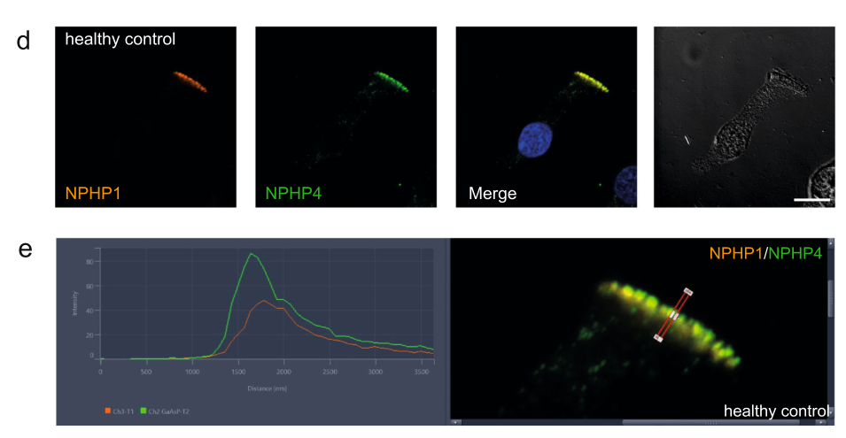

## Question

# Gene Research for Functional Annotation

## ⚠️ CRITICAL: Gene/Protein Identification Context

**BEFORE YOU BEGIN RESEARCH:** You MUST verify you are researching the CORRECT gene/protein. Gene symbols can be ambiguous, especially for less well-characterized genes from non-model organisms.

### Target Gene/Protein Identity (from UniProt):
- **UniProt Accession:** O75161
- **Protein Description:** RecName: Full=Nephrocystin-4; AltName: Full=Nephroretinin;
- **Gene Information:** Name=NPHP4; Synonyms=KIAA0673;
- **Organism (full):** Homo sapiens (Human).
- **Protein Family:** Belongs to the NPHP4 family. .
- **Key Domains:** Ig_NPHP4_1st. (IPR058687); Ig_NPHP4_2nd. (IPR058688); Ig_NPHP4_3rd. (IPR058686); Ig_NPHP4_4th. (IPR058685); NPHP4. (IPR029775)

### MANDATORY VERIFICATION STEPS:

1. **Check if the gene symbol "NPHP4" matches the protein description above**
2. **Verify the organism is correct:** Homo sapiens (Human).
3. **Check if protein family/domains align with what you find in literature**
4. **If you find literature for a DIFFERENT gene with the same or similar symbol, STOP**

### If Gene Symbol is Ambiguous or You Cannot Find Relevant Literature:

**DO NOT PROCEED WITH RESEARCH ON A DIFFERENT GENE.** Instead:
- State clearly: "The gene symbol 'NPHP4' is ambiguous or literature is limited for this specific protein"
- Explain what you found (e.g., "Found extensive literature on a different gene with the same symbol in a different organism")
- Describe the protein based ONLY on the UniProt information provided above
- Suggest that the protein function can be inferred from domain/family information

### Research Target:

Please provide a comprehensive research report on the gene **NPHP4** (gene ID: NPHP4, UniProt: O75161) in human.

The research report should be a detailed narrative explaining the function, biological processes, and localization of the gene product. Citations should be given for all claims.

You should prioritize authoritative reviews and primary scientific literature when conducting research. You can supplement
this with annotations you find in gene/protein databases, but these can be outdated or inaccurate.

We are specifically interested in the primary function of the gene - for enzymes, what reaction is catalyzed, and what is the substrate specificity? For transporters, what is the substrate? For structural proteins or adapters, what is the broader structural role? For signaling molecules, what is the role in the pathway.

We are interested in where in or outside the cell the gene product carries out its function.

We are also interested in the signaling or biochemical pathways in which the gene functions. We are less interested in broad pleiotropic effects, except where these elucidate the precise role.

Include evidence where possible. We are interested in both experimental evidence as well as inference from structure, evolution, or bioinformatic analysis. Precise studies should be prioritized over high-throughput, where available.

## Output

Question: You are an expert researcher providing comprehensive, well-cited information.

Provide detailed information focusing on:
1. Key concepts and definitions with current understanding
2. Recent developments and latest research (prioritize 2023-2024 sources)
3. Current applications and real-world implementations
4. Expert opinions and analysis from authoritative sources
5. Relevant statistics and data from recent studies

Format as a comprehensive research report with proper citations. Include URLs and publication dates where available.
Always prioritize recent, authoritative sources and provide specific citations for all major claims.

# Gene Research for Functional Annotation

## ⚠️ CRITICAL: Gene/Protein Identification Context

**BEFORE YOU BEGIN RESEARCH:** You MUST verify you are researching the CORRECT gene/protein. Gene symbols can be ambiguous, especially for less well-characterized genes from non-model organisms.

### Target Gene/Protein Identity (from UniProt):
- **UniProt Accession:** O75161
- **Protein Description:** RecName: Full=Nephrocystin-4; AltName: Full=Nephroretinin;
- **Gene Information:** Name=NPHP4; Synonyms=KIAA0673;
- **Organism (full):** Homo sapiens (Human).
- **Protein Family:** Belongs to the NPHP4 family. .
- **Key Domains:** Ig_NPHP4_1st. (IPR058687); Ig_NPHP4_2nd. (IPR058688); Ig_NPHP4_3rd. (IPR058686); Ig_NPHP4_4th. (IPR058685); NPHP4. (IPR029775)

### MANDATORY VERIFICATION STEPS:

1. **Check if the gene symbol "NPHP4" matches the protein description above**
2. **Verify the organism is correct:** Homo sapiens (Human).
3. **Check if protein family/domains align with what you find in literature**
4. **If you find literature for a DIFFERENT gene with the same or similar symbol, STOP**

### If Gene Symbol is Ambiguous or You Cannot Find Relevant Literature:

**DO NOT PROCEED WITH RESEARCH ON A DIFFERENT GENE.** Instead:
- State clearly: "The gene symbol 'NPHP4' is ambiguous or literature is limited for this specific protein"
- Explain what you found (e.g., "Found extensive literature on a different gene with the same symbol in a different organism")
- Describe the protein based ONLY on the UniProt information provided above
- Suggest that the protein function can be inferred from domain/family information

### Research Target:

Please provide a comprehensive research report on the gene **NPHP4** (gene ID: NPHP4, UniProt: O75161) in human.

The research report should be a detailed narrative explaining the function, biological processes, and localization of the gene product. Citations should be given for all claims.

You should prioritize authoritative reviews and primary scientific literature when conducting research. You can supplement
this with annotations you find in gene/protein databases, but these can be outdated or inaccurate.

We are specifically interested in the primary function of the gene - for enzymes, what reaction is catalyzed, and what is the substrate specificity? For transporters, what is the substrate? For structural proteins or adapters, what is the broader structural role? For signaling molecules, what is the role in the pathway.

We are interested in where in or outside the cell the gene product carries out its function.

We are also interested in the signaling or biochemical pathways in which the gene functions. We are less interested in broad pleiotropic effects, except where these elucidate the precise role.

Include evidence where possible. We are interested in both experimental evidence as well as inference from structure, evolution, or bioinformatic analysis. Precise studies should be prioritized over high-throughput, where available.

# Human NPHP4: functional annotation and research report

## Identity and principal function

**Identity verified.** Human **NPHP4** encodes **nephrocystin-4**, also called **nephroretinin**; it is distinct from **NPHP1**, which encodes nephrocystin-1. This report concerns the human protein identified in the question as **UniProt O75161**, not an NPHP-4 ortholog studied in algae or nematodes. The original human gene-discovery study identified nephroretinin as a 1,426-amino-acid protein, with pathogenic variants in families with nephronophthisis and retinal disease. (otto2002agenemutated pages 4-6, otto2002agenemutated pages 1-2)

**Best-supported molecular annotation:** NPHP4 is a **protein-interaction scaffold associated with the ciliary transition zone**, the compartment between the basal body and the ciliary shaft. It helps organize an NPHP1–NPHP4–RPGRIP1L/NPHP8 module that maintains the selective composition of the cilium. It is **not characterized as an enzyme or transporter**: there is no established reaction, catalytic substrate, or transported substrate for NPHP4 itself. Biochemical interaction assays establish its scaffolding role directly; evidence that it contributes to selective ciliary gating is particularly strong in conserved experimental organisms, while its precise molecular gating mechanism in human cells remains unresolved. (sang2011mappingthenphpjbtsmks pages 5-7, awata2014nphp4controlsciliary pages 1-4, moran2024transportandbarrier pages 3-5)

The supplied UniProt/InterPro identification lists four **Ig_NPHP4** immunoglobulin-like regions and an NPHP4-family annotation. These are *sequence/domain annotations*, not experimentally demonstrated binding sites or an atomic structure. Notably, the original 2002 sequence analysis recognized no established conserved domain; the later domain annotations should not be confused with the **SH3 domain of NPHP1**. The supplied accession **O75161**, synonym **KIAA0673**, and individual InterPro identifiers could not be independently confirmed from the retrieved primary papers, although their stated gene–protein identity agrees with those papers. (otto2002agenemutated pages 4-6, fliegauf2006nephrocystinspecificallylocalizes pages 1-2)

## Location and molecular mechanism

**Ciliary transition zone.** In healthy *human* respiratory epithelial cells, antibody signals for NPHP4 and NPHP1 overlap at the transition zone, distal to the microtubule-organizing center. Their overlap was checked by fluorescence-intensity profiling. These observations, including the cropped microscopy panels comparing control and patient cells, directly establish a human cellular site of action. NPHP4 has also been observed at ciliary bases in renal epithelial models and near the connecting cilium of photoreceptors—the specialized passage to their light-sensing outer segment. It acts at the **intracellular side of the ciliary base**, rather than as a secreted extracellular protein. (hellmann2024immunofluorescenceanalysesof pages 2-5, hellmann2024immunofluorescenceanalysesof media 2dc106e1, hellmann2024immunofluorescenceanalysesof media ad6e4e94, patil2012selectivelossof pages 1-2, awata2014nphp4controlsciliary pages 1-4)

**Physical scaffold.** In the pivotal interaction study, reciprocal affinity-purification/mass-spectrometry experiments associated NPHP1, NPHP4 and RPGRIP1L/NPHP8. More discriminating cell-free binding assays found that **NPHP4 binds NPHP1 and RPGRIP1L directly**, whereas NPHP1 and RPGRIP1L did not directly bind one another in that assay. NPHP4 can therefore bridge these partners, although the experiment does not establish the stoichiometry or three-dimensional structure of the native human transition-zone assembly. In polarized renal-cell models the proteins accumulate both at the ciliary base and at cell–cell contacts, mainly below tight junctions. (sang2011mappingthenphpjbtsmks pages 3-5, sang2011mappingthenphpjbtsmks pages 5-7)

**Selective gate rather than a general cilium-building factor.** In *Chlamydomonas*, loss of the NPHP4 ortholog leaves flagella nearly normal in length, ultrastructure and intraflagellar transport, yet greatly reduces some resident membrane proteins and allows normally excluded soluble housekeeping proteins **larger than 50 kDa** into flagella. This is compelling functional evidence for control of ciliary protein composition, not evidence that human NPHP4 itself actively transports these proteins. Mammalian interaction mapping places different NPHP4 regions near the axoneme-associated motor KIF17 and the transmembrane receptor SSTR3, consistent with an interface between soluble and membrane-associated traffic. Contemporary expert reviews emphasize that how transition-zone proteins form a soluble or membrane diffusion barrier—and the exact contribution of each component—remain open mechanistic questions. (awata2014nphp4controlsciliary pages 1-4, takao2017proteininteractionanalysis pages 1-3, moran2024transportandbarrier pages 3-5)

**Assembly is tissue dependent.** In vertebrate experimental systems, RPGRIP1L deficiency reduces the transition-zone abundance of NPHP4 and other NPHP-module components, with the extent varying by cell type. Separately, loss of the related but distinct protein **RPGRIP1** removes NPHP4 from mouse photoreceptor cilia without equivalently removing it from renal cilia. These findings argue against assuming that an interaction or localization dependency applies identically in kidney, retina and airway. (wiegering2018celltype‐specificregulation pages 4-6, patil2012selectivelossof pages 1-2, patil2012selectivelossof pages 3-4)

## Biological processes and signaling connections

The proximal functional consequence of NPHP4 activity is **ciliary compartmentalization**: organizing the transition-zone module helps establish which signaling-associated proteins reside in the cilium. This links NPHP4 to cilium-dependent cellular responses, but does **not** establish it as a Hedgehog receptor, Wnt enzyme, phosphoinositide phosphatase or universal regulator of any one signaling pathway. In 3D renal epithelial cultures, depletion of NPHP1, NPHP4 or RPGRIP1L impairs normal epithelial spheroid organization without decreasing cilium numbers under the conditions tested. A second, junction-associated role—organization of epithelial polarity and contacts through relationships with the PALS1/PATJ/Crumbs polarity machinery—is supported by experimental literature, but is less precisely resolved for human NPHP4 than the NPHP1–NPHP4–RPGRIP1L interaction. (sang2011mappingthenphpjbtsmks pages 7-9, sang2011mappingthenphpjbtsmks pages 5-7, hurd2010mechanismsofnephronophthisis pages 2-3)

A **2023 mouse renal-cell study** tested the frequently proposed link to sensing tubular fluid flow. After Nphp4 knockdown, the acute calcium response to shear appeared at approximately **2 seconds**, compared with **17 seconds** in controls; sustained shear also changed cilium-length regulation and actin organization. The investigators interpreted NPHP4’s contribution to flow responses as *moderate*. Importantly, shear-induced cholesterol biosynthesis and uptake occurred **independently of NPHP4**: cholesterol is therefore not an established NPHP4 enzymatic product or a demonstrated NPHP4-dependent signaling output. These are cultured mouse-cell results, not proof of an identical response in human kidney tissue. (traore2023fluidshearstress pages 1-2, traore2023fluidshearstress pages 4-6, traore2023fluidshearstress pages 8-9)

A **2024 nematode study** found that the *C. elegans* NPHP-4 ortholog was needed for **sustained, but not initial**, release of PKD-2-labeled vesicles from male sensory cilia during observation extending to two hours. This extends the range of model-organism hypotheses about maintaining ciliary cargo, but vesicle release has **not** thereby been established as a primary function of human NPHP4 in kidney or retina. (wang2024ciliaryintrinsicmechanisms pages 6-9, wang2024ciliaryintrinsicmechanisms pages 1-3)

The following table separates direct human evidence from biochemical and cross-species inference.

| Claim | Pivotal model and assay | Result with accurate figures | Inference / limits | Published study |
|---|---|---|---|---|
| NPHP4 directly binds NPHP1 and RPGRIP1L/NPHP8 | Mammalian affinity-purification mass spectrometry plus cell-free wheat-germ translation, anti-Myc immunoprecipitation and anti-HA immunoblotting | NPHP4 bound NPHP1 and NPHP8 directly; NPHP1 and NPHP8 did not directly bind one another, placing NPHP4 as the bridge in the NPHP1–4–8 module (sang2011mappingthenphpjbtsmks pages 3-5, sang2011mappingthenphpjbtsmks pages 5-7) | Strong biochemical evidence for direct binding; tagged proteins and cell models do not by themselves resolve native stoichiometry or atomic structure | [Sang et al., 2011](https://doi.org/10.1016/j.cell.2011.04.019) |
| Human NPHP4 localizes to the ciliary transition zone and is interdependent with NPHP1 | Human nasal-brush respiratory epithelial cells; immunofluorescence, intensity profiling and immunoblotting | NPHP4 and NPHP1 fully overlapped at the transition zone. Among 35 NPHP4-tested samples, all 11 individuals with pathogenic NPHP1 genotypes had reduced or absent NPHP4; mean NPHP4 signal-to-noise ratio was 9.21 in controls versus 2.57 with NPHP1 variants (*p*=0.008). Two patients with homozygous pathogenic NPHP4 variants lacked NPHP4 and also lacked or severely reduced NPHP1 (hellmann2024immunofluorescenceanalysesof pages 1-2, hellmann2024immunofluorescenceanalysesof pages 5-7, hellmann2024immunofluorescenceanalysesof media 2dc106e1, hellmann2024immunofluorescenceanalysesof media ad6e4e94) | Direct human in-vivo-derived-cell evidence for module stability. Only two NPHP4 patients were represented; 35 is the staining subcohort, not the number of NPHP4 genotypes | [Hellmann et al., 2024](https://doi.org/10.1007/s00467-024-06443-0) |
| NPHP4 supports a selective ciliary barrier | *Chlamydomonas reinhardtii* nphp4-null flagella; localization, fractionation and comparative protein-composition analyses | Mutant flagella retained nearly normal length, ultrastructure and intraflagellar transport, but showed marked loss of a subset of membrane proteins and inappropriate inclusion of normally excluded cytosolic housekeeping proteins larger than 50 kDa (awata2014nphp4controlsciliary pages 1-4) | Strong conserved-organism evidence for selective gating rather than general ciliogenesis; not a human experiment, and the exact mammalian cargo spectrum and molecular gate remain unresolved | [Awata et al., 2014](https://doi.org/10.1242/jcs.155275) |
| NPHP4 modulates renal epithelial flow responses but is not required for shear-induced cholesterol accumulation | Nphp4-knockdown murine inner-medullary collecting-duct cells in a microfluidic shear system; calcium imaging, cilium/actin analysis, filipin staining and GC–MS | Acute calcium response began at about 2 s in Nphp4-knockdown cells versus about 17 s in controls; static phalloidin intensity differed approximately twofold, and prolonged shear altered actin and cilium-length regulation. Shear increased cholesterol in control and knockdown cells, indicating NPHP4-independent cholesterol induction (traore2023fluidshearstress pages 1-2, traore2023fluidshearstress pages 4-6, traore2023fluidshearstress pages 8-9) | Supports a moderate modulatory role in mechanosensation and cytoskeletal adaptation, not proof that NPHP4 is the primary flow sensor or a cholesterol-pathway component; murine cultured-cell evidence | [Traoré et al., 2023](https://doi.org/10.3389/fmolb.2023.1254691) |
| Biallelic NPHP4 loss causes nephronophthisis type 4 and Senior–Løken syndrome | Human positional mapping, candidate-gene sequencing, segregation and control screening | Nine likely loss-of-function mutations established NPHP4 in six nephronophthisis families; two additional loss-of-function mutations were identified in two Senior–Løken families. The encoded 1,426-aa protein was named nephroretinin (otto2002agenemutated pages 4-6, otto2002agenemutated pages 1-2, otto2002agenemutated pages 6-7) | Foundational human genetic causality; establishes physiological importance but not the molecular transition-zone mechanism. The original study did not support modern Ig-like-domain assignments | [Otto et al., 2002](https://doi.org/10.1086/344395) |
| Biallelic NPHP4 variants are an uncommon cause in an unselected NPHP cohort | Sequencing of all 30 NPHP4 exons in 250 unrelated patients after prior NPHP-locus screening | Recessive/biallelic NPHP4 mutations occurred in 6 of 250 families (2.4%); additional single heterozygous variants occurred in 20 of 250 (8%) (hoefele2005mutationalanalysisof pages 1-2, hoefele2005mutationalanalysisof pages 5-7) | Useful historical frequency estimate, but cohort ascertainment and older variant-classification methods limit generalization; single heterozygous variants do not establish recessive causality | [Hoefele et al., 2005](https://doi.org/10.1002/humu.9326) |
| Nasal NPHP1/NPHP4 staining has potential clinical diagnostic utility | Human nasal-brush assay in 111 renal-ciliopathy cases; 86 evaluated for NPHP1 and 35 for NPHP4, with immunoblot confirmation | Aberrant staining prompted renewed genetic investigation in two previously unsolved individuals, identifying a homozygous NPHP1 deletion in one and an NPHP4 exon 8–16 deletion in the other; a formerly uncertain NPHP1 missense variant was also functionally supported (hellmann2024immunofluorescenceanalysesof pages 1-2, hellmann2024immunofluorescenceanalysesof pages 2-5, hellmann2024immunofluorescenceanalysesof pages 5-7) | Promising adjunct for variant interpretation and test prioritization, not a replacement for molecular diagnosis; sample-quality failures and very small NPHP4-positive numbers require independent validation | [Hellmann et al., 2024](https://doi.org/10.1007/s00467-024-06443-0) |

*Table: Evidence supporting the identity, molecular role, disease association and emerging diagnostic use of human NPHP4/O75161. The table separates direct human findings from mechanistic inference in non-human models and highlights key limitations.*

## Human disease, recent findings and applications

**Genetic disease association.** The original human study identified nine likely loss-of-function NPHP4 mutations in **six nephronophthisis families**, plus two loss-of-function mutations in **two Senior–Løken families** with nephronophthisis and retinal degeneration. An independent historical series found recessive NPHP4 mutations in **6 of 250** unrelated patients/families screened for nephronophthisis (**2.4%**); this is a cohort-specific estimate, not a population prevalence. Together with ciliary localization, these data link the scaffold’s function to renal tubular integrity and photoreceptor survival, without proving that every clinical manifestation follows from the same specific cargo defect. (otto2002agenemutated pages 1-2, hoefele2005mutationalanalysisof pages 5-7, patil2012selectivelossof pages 1-2)

**Most informative recent human implementation: nasal-brush immunostaining.** In a 2024 study, **111** people with renal ciliopathy phenotypes had samples available; the reported genetically determined analyses included **86** assessed for NPHP1, with a **35-person** subcohort assessed for NPHP4. Control respiratory cilia showed transition-zone colocalization. All **11** individuals with pathogenic NPHP1 genotypes had reduced or absent NPHP4 staining; mean NPHP4 transition-zone signal-to-noise ratio was **9.21 in controls versus 2.57** in the NPHP1-variant group (*p* = **0.008**). Two individuals found to have homozygous pathogenic NPHP4 variants lacked detectable ciliary NPHP4, with loss or marked reduction of NPHP1 signal. These reciprocal effects support functional interdependence of the module *in patient-derived cells*, although the number of NPHP4-affected individuals was small and loss of staining alone does not prove direct binding. (hellmann2024immunofluorescenceanalysesof pages 1-2, hellmann2024immunofluorescenceanalysesof pages 2-5, hellmann2024immunofluorescenceanalysesof pages 5-7, hellmann2024immunofluorescenceanalysesof media 2dc106e1, hellmann2024immunofluorescenceanalysesof media ad6e4e94)

The same 2024 assay guided renewed genetic analysis in two previously unsolved individuals, leading to identification of a homozygous **NPHP1** deletion in one and an **NPHP4 exon 8–16 deletion** in the other. Its immediate real-world use is therefore as an **adjunct to sequencing and variant interpretation**, not as a stand-alone replacement for genetic diagnosis. The study reported unusable nasal-brush samples and limited NPHP4-positive cases, so broader prospective diagnostic-performance claims would be premature. (hellmann2024immunofluorescenceanalysesof pages 5-7, hellmann2024immunofluorescenceanalysesof pages 7-9)

**Therapeutic status.** No NPHP4-directed, clinically established disease-modifying treatment emerges from the reviewed evidence. Registry study [NCT06648044](https://clinicaltrials.gov/study/NCT06648044) investigates therapeutic targets using collected biosamples and patient-derived cells; despite its registration category, it does **not** test administration of an NPHP4-specific drug to patients. A later **2025** study screened **53** approved drugs in zebrafish with simultaneous *nphp1/nphp4* depletion and reported reduced cyst formation with DPP4 inhibitors and a GLP-1 receptor agonist. That is a **preclinical, dual-gene model**, not evidence of benefit for people with an NPHP4 variant or of direct pharmacological action on NPHP4. (NCT06648044 chunk 2, NCT06648044 chunk 1, eckert2025targetingglp1signaling pages 4-6, eckert2025targetingglp1signaling pages 1-2)

### Selected sources, with publication dates and URLs

- **Hellmann et al., August 2024**, *Pediatric Nephrology*: patient-derived respiratory-cilium localization and diagnostic proof of concept. https://doi.org/10.1007/s00467-024-06443-0 (hellmann2024immunofluorescenceanalysesof pages 1-2, hellmann2024immunofluorescenceanalysesof pages 5-7)
- **Moran et al., 2024 volume; publisher record dated October 2023**, *Nature Reviews Nephrology*: expert synthesis of ciliary transport and unresolved barrier mechanisms. https://doi.org/10.1038/s41581-023-00773-2 (moran2024transportandbarrier pages 3-5)
- **Traoré et al., 17 October 2023**, *Frontiers in Molecular Biosciences*: Nphp4-deficient mouse renal-cell flow responses and NPHP4-independent cholesterol response. https://doi.org/10.3389/fmolb.2023.1254691 (traore2023fluidshearstress pages 1-2, traore2023fluidshearstress pages 4-6)
- **Sang et al., 13 May 2011**, *Cell*: direct NPHP4–NPHP1 and NPHP4–RPGRIP1L interactions and module organization. https://doi.org/10.1016/j.cell.2011.04.019 (sang2011mappingthenphpjbtsmks pages 3-5, sang2011mappingthenphpjbtsmks pages 5-7)
- **Awata et al., 2014**, *Journal of Cell Science*: experimental NPHP4-dependent selective barrier in *Chlamydomonas*. https://doi.org/10.1242/jcs.155275 (awata2014nphp4controlsciliary pages 1-4)
- **Otto et al., November 2002**, *American Journal of Human Genetics*: original identification of human NPHP4/nephroretinin and renal–retinal disease variants. https://doi.org/10.1086/344395 (otto2002agenemutated pages 4-6, otto2002agenemutated pages 1-2)

**Overall assessment:** The highest-confidence functional annotation is **intracellular, transition-zone-associated scaffold for selective ciliary compartmentalization**, with a documented epithelial-junction association. Direct human localization, direct biochemical partner binding and pathogenic human genotypes reinforce this assignment; specific cargo selectivity, precise barrier architecture and some signaling consequences still rely on models or remain unresolved. (hellmann2024immunofluorescenceanalysesof pages 5-7, sang2011mappingthenphpjbtsmks pages 5-7, awata2014nphp4controlsciliary pages 1-4, moran2024transportandbarrier pages 3-5)

References

1. (otto2002agenemutated pages 4-6): Edgar Otto, Julia Hoefele, Rainer Ruf, Adelheid M. Mueller, Karl S. Hiller, Matthias T.F. Wolf, Maria J. Schuermann, Achim Becker, Ralf Birkenhäger, Ralf Sudbrak, Hans C. Hennies, Peter Nürnberg, and Friedhelm Hildebrandt. A gene mutated in nephronophthisis and retinitis pigmentosa encodes a novel protein, nephroretinin, conserved in evolution. American journal of human genetics, 71 5:1161-7, Nov 2002. URL: https://doi.org/10.1086/344395, doi:10.1086/344395. This article has 268 citations and is from a highest quality peer-reviewed journal.

2. (otto2002agenemutated pages 1-2): Edgar Otto, Julia Hoefele, Rainer Ruf, Adelheid M. Mueller, Karl S. Hiller, Matthias T.F. Wolf, Maria J. Schuermann, Achim Becker, Ralf Birkenhäger, Ralf Sudbrak, Hans C. Hennies, Peter Nürnberg, and Friedhelm Hildebrandt. A gene mutated in nephronophthisis and retinitis pigmentosa encodes a novel protein, nephroretinin, conserved in evolution. American journal of human genetics, 71 5:1161-7, Nov 2002. URL: https://doi.org/10.1086/344395, doi:10.1086/344395. This article has 268 citations and is from a highest quality peer-reviewed journal.

3. (sang2011mappingthenphpjbtsmks pages 5-7): Liyun Sang, Julie J. Miller, Kevin C. Corbit, Rachel H. Giles, Matthew J. Brauer, Edgar A. Otto, Lisa M. Baye, Xiaohui Wen, Suzie J. Scales, Mandy Kwong, Erik G. Huntzicker, Mindan K. Sfakianos, Wendy Sandoval, J. Fernando Bazan, Priya Kulkarni, Francesc R. Garcia-Gonzalo, Allen D. Seol, John F. O'Toole, Susanne Held, Heiko M. Reutter, William S. Lane, Muhammad Arshad Rafiq, Abdul Noor, Muhammad Ansar, Akella Radha Rama Devi, Val C. Sheffield, Diane C. Slusarski, John B. Vincent, Daniel A. Doherty, Friedhelm Hildebrandt, Jeremy F. Reiter, and Peter K. Jackson. Mapping the nphp-jbts-mks protein network reveals ciliopathy disease genes and pathways. Cell, 145:513-528, May 2011. URL: https://doi.org/10.1016/j.cell.2011.04.019, doi:10.1016/j.cell.2011.04.019. This article has 761 citations and is from a highest quality peer-reviewed journal.

4. (awata2014nphp4controlsciliary pages 1-4): Junya Awata, Saeko Takada, Clive Standley, Karl F. Lechtreck, Karl D. Bellvé, Gregory J. Pazour, Kevin E. Fogarty, and George B. Witman. Nphp4 controls ciliary trafficking of membrane proteins and large soluble proteins at the transition zone. Journal of Cell Science, 127:4714-4727, Nov 2014. URL: https://doi.org/10.1242/jcs.155275, doi:10.1242/jcs.155275. This article has 121 citations and is from a domain leading peer-reviewed journal.

5. (moran2024transportandbarrier pages 3-5): Ailis L. Moran, Laura Louzao-Martinez, Dominic P. Norris, Dorien J. M. Peters, and Oliver E. Blacque. Transport and barrier mechanisms that regulate ciliary compartmentalization and ciliopathies. Nature Reviews Nephrology, 20:83-100, Oct 2024. URL: https://doi.org/10.1038/s41581-023-00773-2, doi:10.1038/s41581-023-00773-2. This article has 48 citations and is from a domain leading peer-reviewed journal.

6. (fliegauf2006nephrocystinspecificallylocalizes pages 1-2): Manfred Fliegauf, Judit Horvath, Christian von Schnakenburg, Heike Olbrich, Dominik Müller, Julia Thumfart, Bernhard Schermer, Gregory J. Pazour, Hartmut P.H. Neumann, Hanswalter Zentgraf, Thomas Benzing, and Heymut Omran. Nephrocystin specifically localizes to the transition zone of renal and respiratory cilia and photoreceptor connecting cilia. Journal of the American Society of Nephrology : JASN, 17 9:2424-33, Sep 2006. URL: https://doi.org/10.1681/asn.2005121351, doi:10.1681/asn.2005121351. This article has 196 citations.

7. (hellmann2024immunofluorescenceanalysesof pages 2-5): Carlotta Hellmann, Kai Wohlgemuth, Petra Pennekamp, Sebastian George, Mareike Dahmer-Heath, Martin Konrad, Heymut Omran, Jens König, C. Bergmann, M. Cetiner, J. Drube, C. Gimpel, J. Göbel, D. Haffner, T. Illig, N. Klopp, M. C. Liebau, S. Lienkamp, C. Okorn, L. Pape, F. Schaefer, B. Schermer, H. Storf, A. Titieni, S. Weber, W. Ziegler, I. Kamp-Becker, J. Vasseur, S. Kollmann, and J. Gerß. Immunofluorescence analyses of respiratory epithelial cells aid the diagnosis of nephronophthisis. Pediatric Nephrology (Berlin, Germany), 39:3471-3483, Aug 2024. URL: https://doi.org/10.1007/s00467-024-06443-0, doi:10.1007/s00467-024-06443-0. This article has 3 citations.

8. (hellmann2024immunofluorescenceanalysesof media 2dc106e1): Carlotta Hellmann, Kai Wohlgemuth, Petra Pennekamp, Sebastian George, Mareike Dahmer-Heath, Martin Konrad, Heymut Omran, Jens König, C. Bergmann, M. Cetiner, J. Drube, C. Gimpel, J. Göbel, D. Haffner, T. Illig, N. Klopp, M. C. Liebau, S. Lienkamp, C. Okorn, L. Pape, F. Schaefer, B. Schermer, H. Storf, A. Titieni, S. Weber, W. Ziegler, I. Kamp-Becker, J. Vasseur, S. Kollmann, and J. Gerß. Immunofluorescence analyses of respiratory epithelial cells aid the diagnosis of nephronophthisis. Pediatric Nephrology (Berlin, Germany), 39:3471-3483, Aug 2024. URL: https://doi.org/10.1007/s00467-024-06443-0, doi:10.1007/s00467-024-06443-0. This article has 3 citations.

9. (hellmann2024immunofluorescenceanalysesof media ad6e4e94): Carlotta Hellmann, Kai Wohlgemuth, Petra Pennekamp, Sebastian George, Mareike Dahmer-Heath, Martin Konrad, Heymut Omran, Jens König, C. Bergmann, M. Cetiner, J. Drube, C. Gimpel, J. Göbel, D. Haffner, T. Illig, N. Klopp, M. C. Liebau, S. Lienkamp, C. Okorn, L. Pape, F. Schaefer, B. Schermer, H. Storf, A. Titieni, S. Weber, W. Ziegler, I. Kamp-Becker, J. Vasseur, S. Kollmann, and J. Gerß. Immunofluorescence analyses of respiratory epithelial cells aid the diagnosis of nephronophthisis. Pediatric Nephrology (Berlin, Germany), 39:3471-3483, Aug 2024. URL: https://doi.org/10.1007/s00467-024-06443-0, doi:10.1007/s00467-024-06443-0. This article has 3 citations.

10. (patil2012selectivelossof pages 1-2): Hemangi Patil, N. Tserentsoodol, A. Saha, Y. Hao, Mason Webb, and P. Ferreira. Selective loss of rpgrip1-dependent ciliary targeting of nphp4, rpgr and sdccag8 underlies the degeneration of photoreceptor neurons. Cell Death &amp; Disease, 3:e355-e355, Jul 2012. URL: https://doi.org/10.1038/cddis.2012.96, doi:10.1038/cddis.2012.96. This article has 54 citations and is from a peer-reviewed journal.

11. (sang2011mappingthenphpjbtsmks pages 3-5): Liyun Sang, Julie J. Miller, Kevin C. Corbit, Rachel H. Giles, Matthew J. Brauer, Edgar A. Otto, Lisa M. Baye, Xiaohui Wen, Suzie J. Scales, Mandy Kwong, Erik G. Huntzicker, Mindan K. Sfakianos, Wendy Sandoval, J. Fernando Bazan, Priya Kulkarni, Francesc R. Garcia-Gonzalo, Allen D. Seol, John F. O'Toole, Susanne Held, Heiko M. Reutter, William S. Lane, Muhammad Arshad Rafiq, Abdul Noor, Muhammad Ansar, Akella Radha Rama Devi, Val C. Sheffield, Diane C. Slusarski, John B. Vincent, Daniel A. Doherty, Friedhelm Hildebrandt, Jeremy F. Reiter, and Peter K. Jackson. Mapping the nphp-jbts-mks protein network reveals ciliopathy disease genes and pathways. Cell, 145:513-528, May 2011. URL: https://doi.org/10.1016/j.cell.2011.04.019, doi:10.1016/j.cell.2011.04.019. This article has 761 citations and is from a highest quality peer-reviewed journal.

12. (takao2017proteininteractionanalysis pages 1-3): Daisuke Takao, Liang Wang, Allison Boss, and Kristen J. Verhey. Protein interaction analysis provides a map of the spatial and temporal organization of the ciliary gating zone. Current Biology, 27:2296-2306.e3, Aug 2017. URL: https://doi.org/10.1016/j.cub.2017.06.044, doi:10.1016/j.cub.2017.06.044. This article has 57 citations and is from a highest quality peer-reviewed journal.

13. (wiegering2018celltype‐specificregulation pages 4-6): Antonia Wiegering, Renate Dildrop, Lisa Kalfhues, André Spychala, Stefanie Kuschel, Johanna Maria Lier, Thomas Zobel, Stefanie Dahmen, Tristan Leu, Andreas Struchtrup, Flora Legendre, Christine Vesque, Sylvie Schneider‐Maunoury, Sophie Saunier, Ulrich Rüther, and Christoph Gerhardt. Cell type‐specific regulation of ciliary transition zone assembly in vertebrates. The EMBO Journal, Apr 2018. URL: https://doi.org/10.15252/embj.201797791, doi:10.15252/embj.201797791. This article has 85 citations.

14. (patil2012selectivelossof pages 3-4): Hemangi Patil, N. Tserentsoodol, A. Saha, Y. Hao, Mason Webb, and P. Ferreira. Selective loss of rpgrip1-dependent ciliary targeting of nphp4, rpgr and sdccag8 underlies the degeneration of photoreceptor neurons. Cell Death &amp; Disease, 3:e355-e355, Jul 2012. URL: https://doi.org/10.1038/cddis.2012.96, doi:10.1038/cddis.2012.96. This article has 54 citations and is from a peer-reviewed journal.

15. (sang2011mappingthenphpjbtsmks pages 7-9): Liyun Sang, Julie J. Miller, Kevin C. Corbit, Rachel H. Giles, Matthew J. Brauer, Edgar A. Otto, Lisa M. Baye, Xiaohui Wen, Suzie J. Scales, Mandy Kwong, Erik G. Huntzicker, Mindan K. Sfakianos, Wendy Sandoval, J. Fernando Bazan, Priya Kulkarni, Francesc R. Garcia-Gonzalo, Allen D. Seol, John F. O'Toole, Susanne Held, Heiko M. Reutter, William S. Lane, Muhammad Arshad Rafiq, Abdul Noor, Muhammad Ansar, Akella Radha Rama Devi, Val C. Sheffield, Diane C. Slusarski, John B. Vincent, Daniel A. Doherty, Friedhelm Hildebrandt, Jeremy F. Reiter, and Peter K. Jackson. Mapping the nphp-jbts-mks protein network reveals ciliopathy disease genes and pathways. Cell, 145:513-528, May 2011. URL: https://doi.org/10.1016/j.cell.2011.04.019, doi:10.1016/j.cell.2011.04.019. This article has 761 citations and is from a highest quality peer-reviewed journal.

16. (hurd2010mechanismsofnephronophthisis pages 2-3): Toby W. Hurd and Friedhelm Hildebrandt. Mechanisms of nephronophthisis and related ciliopathies. Nov 2010. URL: https://doi.org/10.1159/000320888, doi:10.1159/000320888. This article has 146 citations.

17. (traore2023fluidshearstress pages 1-2): Meriem Garfa Traoré, Federica Roccio, Caterina Miceli, Giulia Ferri, Mélanie Parisot, Nicolas Cagnard, Marie Lhomme, Nicolas Dupont, Alexandre Benmerah, Sophie Saunier, and Marion Delous. Fluid shear stress triggers cholesterol biosynthesis and uptake in inner medullary collecting duct cells, independently of nephrocystin-1 and nephrocystin-4. Frontiers in Molecular Biosciences, Oct 2023. URL: https://doi.org/10.3389/fmolb.2023.1254691, doi:10.3389/fmolb.2023.1254691. This article has 6 citations.

18. (traore2023fluidshearstress pages 4-6): Meriem Garfa Traoré, Federica Roccio, Caterina Miceli, Giulia Ferri, Mélanie Parisot, Nicolas Cagnard, Marie Lhomme, Nicolas Dupont, Alexandre Benmerah, Sophie Saunier, and Marion Delous. Fluid shear stress triggers cholesterol biosynthesis and uptake in inner medullary collecting duct cells, independently of nephrocystin-1 and nephrocystin-4. Frontiers in Molecular Biosciences, Oct 2023. URL: https://doi.org/10.3389/fmolb.2023.1254691, doi:10.3389/fmolb.2023.1254691. This article has 6 citations.

19. (traore2023fluidshearstress pages 8-9): Meriem Garfa Traoré, Federica Roccio, Caterina Miceli, Giulia Ferri, Mélanie Parisot, Nicolas Cagnard, Marie Lhomme, Nicolas Dupont, Alexandre Benmerah, Sophie Saunier, and Marion Delous. Fluid shear stress triggers cholesterol biosynthesis and uptake in inner medullary collecting duct cells, independently of nephrocystin-1 and nephrocystin-4. Frontiers in Molecular Biosciences, Oct 2023. URL: https://doi.org/10.3389/fmolb.2023.1254691, doi:10.3389/fmolb.2023.1254691. This article has 6 citations.

20. (wang2024ciliaryintrinsicmechanisms pages 6-9): Juan Wang, Josh Saul, Inna A. Nikonorova, Carlos Nava Cruz, Kaiden M. Power, Ken C. Nguyen, David H. Hall, and Maureen M. Barr. Ciliary intrinsic mechanisms regulate dynamic ciliary extracellular vesicle release from sensory neurons. bioRxiv, Nov 2024. URL: https://doi.org/10.1101/2023.11.01.565151, doi:10.1101/2023.11.01.565151. This article has 23 citations.

21. (wang2024ciliaryintrinsicmechanisms pages 1-3): Juan Wang, Josh Saul, Inna A. Nikonorova, Carlos Nava Cruz, Kaiden M. Power, Ken C. Nguyen, David H. Hall, and Maureen M. Barr. Ciliary intrinsic mechanisms regulate dynamic ciliary extracellular vesicle release from sensory neurons. bioRxiv, Nov 2024. URL: https://doi.org/10.1101/2023.11.01.565151, doi:10.1101/2023.11.01.565151. This article has 23 citations.

22. (hellmann2024immunofluorescenceanalysesof pages 1-2): Carlotta Hellmann, Kai Wohlgemuth, Petra Pennekamp, Sebastian George, Mareike Dahmer-Heath, Martin Konrad, Heymut Omran, Jens König, C. Bergmann, M. Cetiner, J. Drube, C. Gimpel, J. Göbel, D. Haffner, T. Illig, N. Klopp, M. C. Liebau, S. Lienkamp, C. Okorn, L. Pape, F. Schaefer, B. Schermer, H. Storf, A. Titieni, S. Weber, W. Ziegler, I. Kamp-Becker, J. Vasseur, S. Kollmann, and J. Gerß. Immunofluorescence analyses of respiratory epithelial cells aid the diagnosis of nephronophthisis. Pediatric Nephrology (Berlin, Germany), 39:3471-3483, Aug 2024. URL: https://doi.org/10.1007/s00467-024-06443-0, doi:10.1007/s00467-024-06443-0. This article has 3 citations.

23. (hellmann2024immunofluorescenceanalysesof pages 5-7): Carlotta Hellmann, Kai Wohlgemuth, Petra Pennekamp, Sebastian George, Mareike Dahmer-Heath, Martin Konrad, Heymut Omran, Jens König, C. Bergmann, M. Cetiner, J. Drube, C. Gimpel, J. Göbel, D. Haffner, T. Illig, N. Klopp, M. C. Liebau, S. Lienkamp, C. Okorn, L. Pape, F. Schaefer, B. Schermer, H. Storf, A. Titieni, S. Weber, W. Ziegler, I. Kamp-Becker, J. Vasseur, S. Kollmann, and J. Gerß. Immunofluorescence analyses of respiratory epithelial cells aid the diagnosis of nephronophthisis. Pediatric Nephrology (Berlin, Germany), 39:3471-3483, Aug 2024. URL: https://doi.org/10.1007/s00467-024-06443-0, doi:10.1007/s00467-024-06443-0. This article has 3 citations.

24. (otto2002agenemutated pages 6-7): Edgar Otto, Julia Hoefele, Rainer Ruf, Adelheid M. Mueller, Karl S. Hiller, Matthias T.F. Wolf, Maria J. Schuermann, Achim Becker, Ralf Birkenhäger, Ralf Sudbrak, Hans C. Hennies, Peter Nürnberg, and Friedhelm Hildebrandt. A gene mutated in nephronophthisis and retinitis pigmentosa encodes a novel protein, nephroretinin, conserved in evolution. American journal of human genetics, 71 5:1161-7, Nov 2002. URL: https://doi.org/10.1086/344395, doi:10.1086/344395. This article has 268 citations and is from a highest quality peer-reviewed journal.

25. (hoefele2005mutationalanalysisof pages 1-2): Julia Hoefele, Ralf Sudbrak, Richard Reinhardt, Silvia Lehrack, Steffen Hennig, Anita Imm, Ulla Muerb, Boris Utsch, Massimo Attanasio, John F. O'Toole, Edgar Otto, and Friedhelm Hildebrandt. Mutational analysis of the nphp4 gene in 250 patients with nephronophthisis. Human Mutation, 25:411-411, Mar 2005. URL: https://doi.org/10.1002/humu.9326, doi:10.1002/humu.9326. This article has 88 citations and is from a domain leading peer-reviewed journal.

26. (hoefele2005mutationalanalysisof pages 5-7): Julia Hoefele, Ralf Sudbrak, Richard Reinhardt, Silvia Lehrack, Steffen Hennig, Anita Imm, Ulla Muerb, Boris Utsch, Massimo Attanasio, John F. O'Toole, Edgar Otto, and Friedhelm Hildebrandt. Mutational analysis of the nphp4 gene in 250 patients with nephronophthisis. Human Mutation, 25:411-411, Mar 2005. URL: https://doi.org/10.1002/humu.9326, doi:10.1002/humu.9326. This article has 88 citations and is from a domain leading peer-reviewed journal.

27. (hellmann2024immunofluorescenceanalysesof pages 7-9): Carlotta Hellmann, Kai Wohlgemuth, Petra Pennekamp, Sebastian George, Mareike Dahmer-Heath, Martin Konrad, Heymut Omran, Jens König, C. Bergmann, M. Cetiner, J. Drube, C. Gimpel, J. Göbel, D. Haffner, T. Illig, N. Klopp, M. C. Liebau, S. Lienkamp, C. Okorn, L. Pape, F. Schaefer, B. Schermer, H. Storf, A. Titieni, S. Weber, W. Ziegler, I. Kamp-Becker, J. Vasseur, S. Kollmann, and J. Gerß. Immunofluorescence analyses of respiratory epithelial cells aid the diagnosis of nephronophthisis. Pediatric Nephrology (Berlin, Germany), 39:3471-3483, Aug 2024. URL: https://doi.org/10.1007/s00467-024-06443-0, doi:10.1007/s00467-024-06443-0. This article has 3 citations.

28. (NCT06648044 chunk 2):  Research of Therapeutic Targets in the Frame of Nephronophthisis and Renal Associated Ciliopathies. Imagine Institute. 2016. ClinicalTrials.gov Identifier: NCT06648044

29. (NCT06648044 chunk 1):  Research of Therapeutic Targets in the Frame of Nephronophthisis and Renal Associated Ciliopathies. Imagine Institute. 2016. ClinicalTrials.gov Identifier: NCT06648044

30. (eckert2025targetingglp1signaling pages 4-6): Priska Eckert, Maike Nöller, Merle Müller, Rebecca Haas, Johannes Ruf, Henriette Franz, Katharina Moos, Jia-ao Yu, Dongfang Zhao, Wanqiu Xie, Melanie Boerries, Gerd Walz, and Toma A. Yakulov. Targeting glp-1 signaling ameliorates cystogenesis in a zebrafish model of nephronophthisis. International Journal of Molecular Sciences, 26:7366, Jul 2025. URL: https://doi.org/10.3390/ijms26157366, doi:10.3390/ijms26157366. This article has 3 citations.

31. (eckert2025targetingglp1signaling pages 1-2): Priska Eckert, Maike Nöller, Merle Müller, Rebecca Haas, Johannes Ruf, Henriette Franz, Katharina Moos, Jia-ao Yu, Dongfang Zhao, Wanqiu Xie, Melanie Boerries, Gerd Walz, and Toma A. Yakulov. Targeting glp-1 signaling ameliorates cystogenesis in a zebrafish model of nephronophthisis. International Journal of Molecular Sciences, 26:7366, Jul 2025. URL: https://doi.org/10.3390/ijms26157366, doi:10.3390/ijms26157366. This article has 3 citations.

## Artifacts

- [Edison artifact artifact-00](NPHP4-deep-research-falcon_artifacts/artifact-00.md)

## Citations

1. moran2024transportandbarrier pages 3-5
2. otto2002agenemutated pages 4-6
3. otto2002agenemutated pages 1-2
4. sang2011mappingthenphpjbtsmks pages 5-7
5. fliegauf2006nephrocystinspecificallylocalizes pages 1-2
6. hellmann2024immunofluorescenceanalysesof pages 2-5
7. patil2012selectivelossof pages 1-2
8. sang2011mappingthenphpjbtsmks pages 3-5
9. takao2017proteininteractionanalysis pages 1-3
10. patil2012selectivelossof pages 3-4
11. sang2011mappingthenphpjbtsmks pages 7-9
12. hurd2010mechanismsofnephronophthisis pages 2-3
13. traore2023fluidshearstress pages 1-2
14. traore2023fluidshearstress pages 4-6
15. traore2023fluidshearstress pages 8-9
16. wang2024ciliaryintrinsicmechanisms pages 6-9
17. wang2024ciliaryintrinsicmechanisms pages 1-3
18. hellmann2024immunofluorescenceanalysesof pages 1-2
19. hellmann2024immunofluorescenceanalysesof pages 5-7
20. otto2002agenemutated pages 6-7
21. hoefele2005mutationalanalysisof pages 1-2
22. hoefele2005mutationalanalysisof pages 5-7
23. hellmann2024immunofluorescenceanalysesof pages 7-9
24. Sang et al., 2011
25. Hellmann et al., 2024
26. Awata et al., 2014
27. Traoré et al., 2023
28. Otto et al., 2002
29. Hoefele et al., 2005
30. NCT06648044
31. https://doi.org/10.1016/j.cell.2011.04.019
32. https://doi.org/10.1007/s00467-024-06443-0
33. https://doi.org/10.1242/jcs.155275
34. https://doi.org/10.3389/fmolb.2023.1254691
35. https://doi.org/10.1086/344395
36. https://doi.org/10.1002/humu.9326
37. https://clinicaltrials.gov/study/NCT06648044
38. https://doi.org/10.1038/s41581-023-00773-2
39. https://doi.org/10.1086/344395,
40. https://doi.org/10.1016/j.cell.2011.04.019,
41. https://doi.org/10.1242/jcs.155275,
42. https://doi.org/10.1038/s41581-023-00773-2,
43. https://doi.org/10.1681/asn.2005121351,
44. https://doi.org/10.1007/s00467-024-06443-0,
45. https://doi.org/10.1038/cddis.2012.96,
46. https://doi.org/10.1016/j.cub.2017.06.044,
47. https://doi.org/10.15252/embj.201797791,
48. https://doi.org/10.1159/000320888,
49. https://doi.org/10.3389/fmolb.2023.1254691,
50. https://doi.org/10.1101/2023.11.01.565151,
51. https://doi.org/10.1002/humu.9326,
52. https://doi.org/10.3390/ijms26157366,