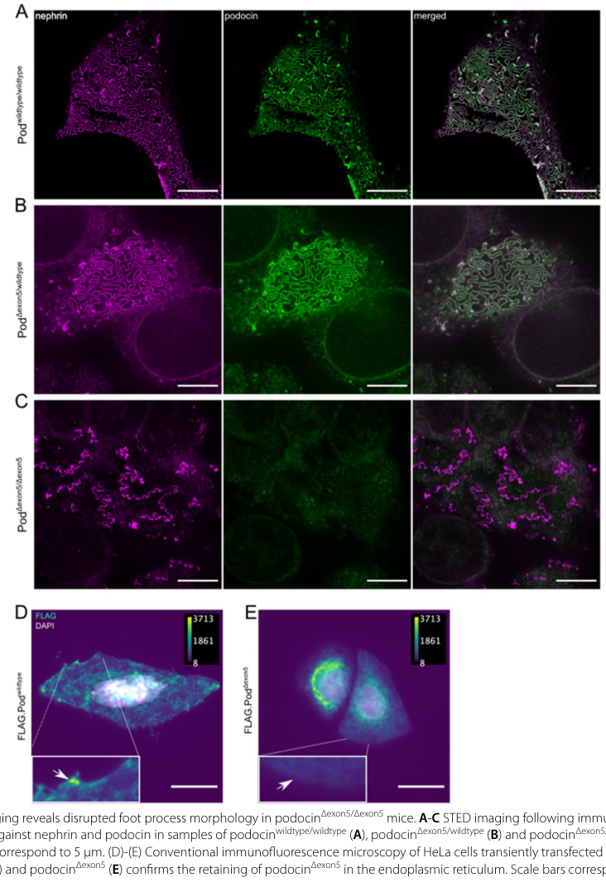

## Question

# Gene Research for Functional Annotation

## ⚠️ CRITICAL: Gene/Protein Identification Context

**BEFORE YOU BEGIN RESEARCH:** You MUST verify you are researching the CORRECT gene/protein. Gene symbols can be ambiguous, especially for less well-characterized genes from non-model organisms.

### Target Gene/Protein Identity (from UniProt):
- **UniProt Accession:** Q9NP85
- **Protein Description:** RecName: Full=Podocin {ECO:0000303|PubMed:10742096};
- **Gene Information:** Name=NPHS2;
- **Organism (full):** Homo sapiens (Human).
- **Protein Family:** Belongs to the band 7/mec-2 family. .
- **Key Domains:** Band-7_stomatin-like. (IPR043202); Band_7. (IPR001107); Band_7/SPFH_dom_sf. (IPR036013); Band_7/stomatin-like_CS. (IPR018080); Stomatin_HflK_fam. (IPR001972)

### MANDATORY VERIFICATION STEPS:

1. **Check if the gene symbol "NPHS2" matches the protein description above**
2. **Verify the organism is correct:** Homo sapiens (Human).
3. **Check if protein family/domains align with what you find in literature**
4. **If you find literature for a DIFFERENT gene with the same or similar symbol, STOP**

### If Gene Symbol is Ambiguous or You Cannot Find Relevant Literature:

**DO NOT PROCEED WITH RESEARCH ON A DIFFERENT GENE.** Instead:
- State clearly: "The gene symbol 'NPHS2' is ambiguous or literature is limited for this specific protein"
- Explain what you found (e.g., "Found extensive literature on a different gene with the same symbol in a different organism")
- Describe the protein based ONLY on the UniProt information provided above
- Suggest that the protein function can be inferred from domain/family information

### Research Target:

Please provide a comprehensive research report on the gene **NPHS2** (gene ID: NPHS2, UniProt: Q9NP85) in human.

The research report should be a detailed narrative explaining the function, biological processes, and localization of the gene product. Citations should be given for all claims.

You should prioritize authoritative reviews and primary scientific literature when conducting research. You can supplement
this with annotations you find in gene/protein databases, but these can be outdated or inaccurate.

We are specifically interested in the primary function of the gene - for enzymes, what reaction is catalyzed, and what is the substrate specificity? For transporters, what is the substrate? For structural proteins or adapters, what is the broader structural role? For signaling molecules, what is the role in the pathway.

We are interested in where in or outside the cell the gene product carries out its function.

We are also interested in the signaling or biochemical pathways in which the gene functions. We are less interested in broad pleiotropic effects, except where these elucidate the precise role.

Include evidence where possible. We are interested in both experimental evidence as well as inference from structure, evolution, or bioinformatic analysis. Precise studies should be prioritized over high-throughput, where available.

## Output

Question: You are an expert researcher providing comprehensive, well-cited information.

Provide detailed information focusing on:
1. Key concepts and definitions with current understanding
2. Recent developments and latest research (prioritize 2023-2024 sources)
3. Current applications and real-world implementations
4. Expert opinions and analysis from authoritative sources
5. Relevant statistics and data from recent studies

Format as a comprehensive research report with proper citations. Include URLs and publication dates where available.
Always prioritize recent, authoritative sources and provide specific citations for all major claims.

# Gene Research for Functional Annotation

## ⚠️ CRITICAL: Gene/Protein Identification Context

**BEFORE YOU BEGIN RESEARCH:** You MUST verify you are researching the CORRECT gene/protein. Gene symbols can be ambiguous, especially for less well-characterized genes from non-model organisms.

### Target Gene/Protein Identity (from UniProt):
- **UniProt Accession:** Q9NP85
- **Protein Description:** RecName: Full=Podocin {ECO:0000303|PubMed:10742096};
- **Gene Information:** Name=NPHS2;
- **Organism (full):** Homo sapiens (Human).
- **Protein Family:** Belongs to the band 7/mec-2 family. .
- **Key Domains:** Band-7_stomatin-like. (IPR043202); Band_7. (IPR001107); Band_7/SPFH_dom_sf. (IPR036013); Band_7/stomatin-like_CS. (IPR018080); Stomatin_HflK_fam. (IPR001972)

### MANDATORY VERIFICATION STEPS:

1. **Check if the gene symbol "NPHS2" matches the protein description above**
2. **Verify the organism is correct:** Homo sapiens (Human).
3. **Check if protein family/domains align with what you find in literature**
4. **If you find literature for a DIFFERENT gene with the same or similar symbol, STOP**

### If Gene Symbol is Ambiguous or You Cannot Find Relevant Literature:

**DO NOT PROCEED WITH RESEARCH ON A DIFFERENT GENE.** Instead:
- State clearly: "The gene symbol 'NPHS2' is ambiguous or literature is limited for this specific protein"
- Explain what you found (e.g., "Found extensive literature on a different gene with the same symbol in a different organism")
- Describe the protein based ONLY on the UniProt information provided above
- Suggest that the protein function can be inferred from domain/family information

### Research Target:

Please provide a comprehensive research report on the gene **NPHS2** (gene ID: NPHS2, UniProt: Q9NP85) in human.

The research report should be a detailed narrative explaining the function, biological processes, and localization of the gene product. Citations should be given for all claims.

You should prioritize authoritative reviews and primary scientific literature when conducting research. You can supplement
this with annotations you find in gene/protein databases, but these can be outdated or inaccurate.

We are specifically interested in the primary function of the gene - for enzymes, what reaction is catalyzed, and what is the substrate specificity? For transporters, what is the substrate? For structural proteins or adapters, what is the broader structural role? For signaling molecules, what is the role in the pathway.

We are interested in where in or outside the cell the gene product carries out its function.

We are also interested in the signaling or biochemical pathways in which the gene functions. We are less interested in broad pleiotropic effects, except where these elucidate the precise role.

Include evidence where possible. We are interested in both experimental evidence as well as inference from structure, evolution, or bioinformatic analysis. Precise studies should be prioritized over high-throughput, where available.

## Research Report: Human **NPHS2** (Podocin; UniProt **Q9NP85**) Functional Annotation

### 0) Target verification (gene/protein identity)
The research target is **human NPHS2**, which encodes **podocin**, corresponding to UniProt **Q9NP85 / Q9NP85_PODO_HUMAN** (Schurek et al., 2014-04; https://doi.org/10.1074/jbc.m113.521773) (schurek2014adiseasecausingmutation pages 7-9). Podocin is consistently described as a **stomatin-like / prohibitin-homology (PHB) / band-7/SPFH family** membrane protein with a **hairpin-like** (monotopic) topology and an essential role at the **podocyte slit diaphragm** (schurek2014adiseasecausingmutation pages 1-2, huber2003molecularbasisof pages 2-3, huber2003molecularbasisof pages 1-2). 

A common ambiguity in this literature is that “**PHB**” refers to the **prohibitin-homology domain class** (SPFH/band-7 domain superfamily), not the separate human **PHB** gene (prohibitin) (schurek2014adiseasecausingmutation pages 1-2, schurek2014adiseasecausingmutation pages 7-9). In addition, podocin is frequently compared with its **C. elegans ortholog MEC-2**, but the present report is restricted to **Homo sapiens NPHS2/podocin** (schurek2014adiseasecausingmutation pages 1-2, schurek2014adiseasecausingmutation pages 7-9).

### 1) Key concepts and definitions (current understanding)

#### 1.1 Podocyte slit diaphragm as a signaling and structural hub
The **slit diaphragm** is a specialized junction between podocyte foot processes that forms a crucial component of the glomerular filtration barrier. Authoritative reviews frame it as both a **structural filter** and a **signaling platform** whose disruption leads to foot process effacement and proteinuria (Welsh & Saleem, 2010-11; https://doi.org/10.1002/path.2661) (welsh2010nephrin—signaturemoleculeof pages 1-3). Reviews of podocyte adaptor proteins similarly emphasize that slit diaphragm components are linked to the **actin cytoskeleton** by adaptor/scaffold proteins localized near **lipid rafts**, enabling dynamic mechanochemical signaling (Ha, 2013-02; https://doi.org/10.5527/wjn.v2.i1.1) (ha2013rolesofadaptor pages 1-2).

#### 1.2 Podocin (NPHS2 product) as a lipid-microdomain organizer rather than an enzyme
Podocin is not an enzyme catalyzing a chemical reaction, nor a classical transporter. Instead, convergent evidence supports podocin’s **primary molecular role** as a **membrane microdomain organizer/scaffold** that (i) oligomerizes, (ii) binds/organizes cholesterol-rich microdomains, and (iii) recruits and stabilizes key slit diaphragm proteins—most notably **nephrin**—within lipid raft-like compartments required for signaling (Huber et al., 2003-12; https://doi.org/10.1093/hmg/ddg360) (huber2003molecularbasisof pages 2-3, huber2003molecularbasisof pages 1-2, huber2003molecularbasisof pages 5-6).

### 2) Molecular function, pathways, and mechanisms

#### 2.1 Subcellular localization
Primary and mechanistic studies localize podocin to the **podocyte slit diaphragm** and show it partitions into **detergent-resistant membrane (DRM)** fractions, consistent with lipid raft association (schurek2014adiseasecausingmutation pages 6-7, huber2003molecularbasisof pages 2-3, huber2003molecularbasisof pages 1-2). A 2023 in vivo isoform study further provides super-resolution **STED microscopy** evidence of podocin at the slit diaphragm in wild-type animals, and its absence from the slit diaphragm in a deleterious splice-isoform model (butt2023invivocharacterization media e512a162).

#### 2.2 Membrane topology and domain organization
Podocin is described as a **hairpin-like membrane protein** with both **N- and C- termini in the cytoplasm**, consistent with a monotopic insertion and an extended cytosolic C-terminal region containing the PHB/SPFH domain (schurek2014adiseasecausingmutation pages 1-2, huber2003molecularbasisof pages 2-3, huber2003molecularbasisof pages 1-2). Schurek et al. (2014-04) provide experimental evidence that a **conserved proline** near the hydrophobic stretch preceding the PHB domain is critical for correct topology; disease-causing mutation (e.g., **P118L**) can flip the C-terminus extracellularly and lead to **N-glycosylation**, linking topology directly to function and disease (schurek2014adiseasecausingmutation pages 9-9, schurek2014adiseasecausingmutation pages 6-7, schurek2014adiseasecausingmutation pages 1-2).

#### 2.3 Core molecular function: organizing nephrin signaling via lipid rafts
A key mechanistic model is that podocin **recruits nephrin into lipid raft microdomains** at the slit diaphragm, which is necessary for nephrin-dependent signal transduction. Huber et al. (2003-12) show that disease-causing NPHS2 mutations disrupt nephrin’s raft targeting and prevent podocin from augmenting nephrin signaling (e.g., AP-1 reporter activation), while not necessarily blocking nephrin surface delivery per se (huber2003molecularbasisof pages 5-6). This supports an interpretation that podocin’s **dominant function** is **microdomain organization** rather than general secretory trafficking (huber2003molecularbasisof pages 5-6).

#### 2.4 Cholesterol binding and channel regulation (TRPC6)
Schurek et al. (2014-04) provide biochemical and functional evidence that podocin is a **cholesterol-binding** DRM-associated protein and that correct topology is required for cholesterol interaction (schurek2014adiseasecausingmutation pages 6-7). They further report that podocin can modulate ion channel behavior: wild-type podocin augments **TRPC6** currents, whereas topology-disrupting mutants fail to do so (schurek2014adiseasecausingmutation pages 6-7, schurek2014adiseasecausingmutation pages 1-2). In this framing, TRPC6 regulation is an **output** of podocin-organized slit-diaphragm microdomains/supercomplexes rather than a primary enzymatic activity (schurek2014adiseasecausingmutation pages 6-7).

#### 2.5 Interaction partners and complex assembly
Direct experimental evidence supports interactions with **nephrin**, **CD2AP**, **TRPC6**, and **NEPH1/Neph1**, consistent with a slit-diaphragm “supercomplex” model (schurek2014adiseasecausingmutation pages 6-7, rinschen2016theubiquitinligase pages 11-13). Rinschen et al. (2016-04; https://doi.org/10.1093/hmg/ddw016) report that podocin forms **large megadalton complexes** mediated by the PHB domain and identify site-specific ubiquitylation (e.g., K301) as affecting stability/unfolding—supporting regulation of complex assembly via **proteostasis/ubiquitin pathways** (rinschen2016theubiquitinligase pages 11-13).

### 3) Recent developments (prioritizing 2023–2024)

#### 3.1 Human-specific short podocin isoform and its in vivo consequences (2023)
Butt et al. (2023-12; https://doi.org/10.1186/s12882-023-03420-x) identified a **short podocin isoform lacking exon 5** (within the PHB domain) detected in human kidney and tested a murine equivalent (**Δexon5**) in vivo. The Δexon5 isoform is largely **ER-retained** in cells and fails to stabilize slit-diaphragm localization; homozygous Δexon5 mice show **massively reduced podocin protein** despite preserved mRNA and exhibit **severe congenital albuminuria** with neonatal lethality (butt2023invivocharacterization pages 2-6, butt2023invivocharacterization pages 1-2). STED microscopy demonstrates **absence of podocin at the slit diaphragm** with disrupted foot process morphology in homozygotes, providing strong localization/function evidence (butt2023invivocharacterization media e512a162).

#### 3.2 NPHS2 mutation prevalence and outcome statistics synthesized in 2024
A 2024 systematic review/meta-analysis (Lee et al., 2024-11; https://doi.org/10.3390/ijms252212275) aggregated 40 studies (2,889 screened patients) and estimated a pooled **NPHS2 mutation prevalence of ~11%** (95% CI 8–14%), with substantial heterogeneity (I2 ~73.8%) (lee2024nphsmutationsin pages 1-2). In cohorts reporting end-stage renal failure (18 studies), the pooled ESRF proportion was **~47%** (95% CI 34–61%) (lee2024nphsmutationsin pages 1-2, lee2024nphsmutationsin pages 6-9). The review also notes population-dependent variability in NPHS2 prevalence and reports a Europe-specific association of higher ESRF risk in NPHS2-mutated patients in their analysis (lee2024nphsmutationsin pages 1-2).

#### 3.3 Copy-number variation (CNV) as an added diagnostic layer (2024)
Pantel et al. (2024-09; https://doi.org/10.1007/s00467-023-06134-2) performed CNV analysis in **138 SRNS families** and identified a **causal homozygous NPHS2 exonic deletion** (6,790 bp; chr1:179,519,242–179,526,033) in one individual, supporting the clinical relevance of CNV detection beyond SNV/indel assays (pantel2024copynumbervariation pages 12-14).

#### 3.4 Patient-derived urine podocytes for translational drug screening (2024)
Tanzi et al. (2024-08; https://doi.org/10.1186/s12967-024-05575-z) describe a non-invasive platform using **urine-derived podocytes** from children with SRNS (with characterized genetic mutations, including slit-diaphragm genes such as NPHS2) to test interventions. They show neonatal kidney progenitor cell-derived **extracellular vesicles (EVs)** reduced albumin permeability across patient-derived podocyte lines, while standard drugs frequently showed limited effect, highlighting a translational workflow for **personalized therapeutic screening** in genetic podocytopathies (tanzi2024urinederivedpodocytesfrom pages 1-2).

### 4) Current applications and real-world implementations

#### 4.1 Genetic testing to guide SRNS/FSGS management and avoid ineffective steroids
A key real-world use of NPHS2 knowledge is **genetic screening** in suspected congenital/SRNS, with the explicit rationale of **earlier diagnosis** and avoiding **unnecessary steroid exposure** in monogenic steroid-unresponsive disease (Lee et al., 2024-11; https://doi.org/10.3390/ijms252212275) (lee2024nphsmutationsin pages 1-2). Contemporary reviews on FSGS genetics similarly emphasize genetic testing when there is family history or treatment resistance and note that genetic forms often do not respond to immunosuppression—supporting implementation of NGS panels including NPHS2 in clinical practice (Bonilla et al., 2024-06; https://doi.org/10.1016/j.xkme.2024.100826) (bonilla2024areviewof pages 1-2).

#### 4.2 Transplant counseling and donor screening
Recent reviews highlight that identifying a monogenic cause (including NPHS2) informs transplant planning and family donor screening. A 2024 Pediatric Nephrology review argues that NGS should become a diagnostic standard and that genetic testing is required for **familial donor screening** to avoid selecting donors carrying pathogenic variants (Mitrotti et al., 2024-09; https://doi.org/10.1007/s00467-023-06046-1) (mitrotti2024hiddengeneticsbehind pages 19-20). Genetic diagnosis is also discussed as useful for predicting post-transplant recurrence risk in FSGS contexts (bonilla2024areviewof pages 2-4).

#### 4.3 Precision-medicine framing in pediatric podocytopathy
A 2023 review frames pediatric nephrotic syndrome as a “podocytopathy” and explicitly includes **podocin (NPHS2)** among core slit diaphragm/GBM-associated proteins whose defects can drive congenital and steroid-resistant phenotypes, reinforcing its status as a clinically actionable diagnostic node (de Castro et al., 2023-12; https://doi.org/10.3390/kidneydial3040030) (castro2023theviewof pages 1-2).

### 5) Expert opinion and synthesis (authoritative perspectives)
Across primary mechanistic papers and reviews, a consistent expert synthesis emerges: the slit diaphragm is not a passive “filter,” but a **dynamic, lipid-microdomain-organized signaling hub**. Podocin is interpreted as a central organizer that couples nephrin to cholesterol-rich microdomains and thereby to downstream signaling and cytoskeletal regulation (huber2003molecularbasisof pages 5-6, welsh2010nephrin—signaturemoleculeof pages 1-3). Reviews place podocin among adaptor/scaffold components that localize near lipid rafts at the intracellular slit diaphragm insertion and help connect membrane complexes to actin dynamics, providing a mechanistic basis for how NPHS2 mutations cause foot process effacement and proteinuria (ha2013rolesofadaptor pages 1-2).

### 6) Key statistics and data points (recent)
* **NPHS2 mutation prevalence in pediatric CNS/SRNS (pooled):** 11% (95% CI 8–14%) across 2,889 screened patients (40 studies), with high heterogeneity (Lee et al., 2024-11) (lee2024nphsmutationsin pages 1-2).
* **Pooled ESRF proportion in NPHS-mutation pediatric cohorts:** 47% (95% CI 34–61%) across 18 studies (Lee et al., 2024-11) (lee2024nphsmutationsin pages 1-2, lee2024nphsmutationsin pages 6-9).
* **CNV detection in SRNS families:** one confirmed **homozygous NPHS2 exonic deletion** detected in a CNV screen of 138 SRNS families (Pantel et al., 2024-09) (pantel2024copynumbervariation pages 12-14).

### 7) Summary table of evidence
The following table links each major functional/clinical claim to specific supporting sources and URLs/DOIs.

| Item | Evidence summary | Key source (authors/year) | URL/DOI |
|---|---|---|---|
| Molecular identity & domains/topology | NPHS2 encodes podocin, corresponding to UniProt Q9NP85/Q9NP85_PODO_HUMAN; podocin is a PHB/band7-SPFH/stomatin-like family protein with a hairpin-like membrane topology and both N- and C-termini facing the cytoplasm (schurek2014adiseasecausingmutation pages 1-2, schurek2014adiseasecausingmutation pages 7-9, butt2023invivocharacterization pages 1-2, huber2003molecularbasisof pages 2-3, huber2003molecularbasisof pages 1-2) | Schurek et al. 2014; Huber et al. 2003; Butt et al. 2023 | https://doi.org/10.1074/jbc.m113.521773; https://doi.org/10.1093/hmg/ddg360; https://doi.org/10.1186/s12882-023-03420-x |
| Molecular identity & domains/topology | A conserved proline preceding the PHB domain helps maintain podocin’s monotopic hairpin topology; disease-causing proline mutation P118L/P120L can flip topology toward a transmembrane form, expose the C-terminus extracellularly, and permit N-glycosylation (schurek2014adiseasecausingmutation pages 9-9, schurek2014adiseasecausingmutation pages 6-7, schurek2014adiseasecausingmutation pages 1-2) | Schurek et al. 2014 | https://doi.org/10.1074/jbc.m113.521773 |
| Subcellular localization | Podocin localizes to the podocyte slit diaphragm and to detergent-resistant/lipid-raft membrane microdomains, where it is enriched with nephrin and other slit diaphragm proteins (schurek2014adiseasecausingmutation pages 1-2, schurek2014adiseasecausingmutation pages 6-7, huber2003molecularbasisof pages 2-3, huber2003molecularbasisof pages 1-2) | Huber et al. 2003; Schurek et al. 2014 | https://doi.org/10.1093/hmg/ddg360; https://doi.org/10.1074/jbc.m113.521773 |
| Subcellular localization | STED microscopy in the 2023 Δexon5 model showed wild-type podocin at the slit diaphragm, whereas homozygous Δexon5 animals lacked slit-diaphragm podocin and had severely disrupted foot process morphology; the short isoform was retained around the ER in cells (butt2023invivocharacterization pages 1-2, butt2023invivocharacterization pages 10-12, butt2023invivocharacterization media e512a162) | Butt et al. 2023 | https://doi.org/10.1186/s12882-023-03420-x |
| Core molecular functions | Podocin acts primarily as a scaffolding/organizing protein rather than an enzyme or transporter: it oligomerizes and recruits nephrin into lipid-raft microdomains required for nephrin signaling at the slit diaphragm (huber2003molecularbasisof pages 2-3, huber2003molecularbasisof pages 1-2, huber2003molecularbasisof pages 6-6, huber2003molecularbasisof pages 5-6) | Huber et al. 2003 | https://doi.org/10.1093/hmg/ddg360 |
| Core molecular functions | Podocin binds cholesterol and partitions into detergent-resistant membranes; correct membrane topology is required for cholesterol interaction and slit-diaphragm microdomain organization (schurek2014adiseasecausingmutation pages 6-7, schurek2014adiseasecausingmutation pages 1-2, butt2023invivocharacterization pages 1-2) | Schurek et al. 2014; Butt et al. 2023 | https://doi.org/10.1074/jbc.m113.521773; https://doi.org/10.1186/s12882-023-03420-x |
| Core molecular functions | Podocin modulates ion channel signaling: wild-type podocin augments TRPC6 currents, whereas topology-disrupting P118L/P3L mutants lose this activity (schurek2014adiseasecausingmutation pages 6-7, schurek2014adiseasecausingmutation pages 1-2) | Schurek et al. 2014 | https://doi.org/10.1074/jbc.m113.521773 |
| Key interaction partners | Experimentally supported partners include nephrin, CD2AP, TRPC6, and NEPH1/Neph1; podocin also forms homo-oligomers/multimers and megadalton supercomplexes via the PHB domain (schurek2014adiseasecausingmutation pages 6-7, huber2003molecularbasisof pages 2-3, huber2003molecularbasisof pages 1-2, rinschen2016theubiquitinligase pages 11-13) | Huber et al. 2003; Schurek et al. 2014; Rinschen et al. 2016 | https://doi.org/10.1093/hmg/ddg360; https://doi.org/10.1074/jbc.m113.521773; https://doi.org/10.1093/hmg/ddw016 |
| Key interaction partners | Reviews interpret podocin as a lipid-raft adaptor/coupling component of the slit-diaphragm signaling hub that links membrane complexes to the actin cytoskeleton together with nephrin and CD2AP (ha2013rolesofadaptor pages 1-2, welsh2010nephrin—signaturemoleculeof pages 3-4, welsh2010nephrin—signaturemoleculeof pages 1-3) | Ha 2013; Welsh & Saleem 2010 | https://doi.org/10.5527/wjn.v2.i1.1; https://doi.org/10.1002/path.2661 |
| Pathogenic mechanisms (mutation effects) | Disease-causing mutants disrupt podocin function by distinct mechanisms: R138Q causes ER retention and failed surface delivery; R138X reaches the surface but fails raft targeting; both lose the ability to recruit nephrin into rafts and augment nephrin signaling (huber2003molecularbasisof pages 1-2, huber2003molecularbasisof pages 6-6, huber2003molecularbasisof pages 5-6) | Huber et al. 2003 | https://doi.org/10.1093/hmg/ddg360 |
| Pathogenic mechanisms (mutation effects) | Topology-altering proline mutants lose detergent-resistant membrane association, reduce cholesterol binding, and fail to augment TRPC6 currents, linking topology defects directly to podocin dysfunction and disease (schurek2014adiseasecausingmutation pages 6-7, schurek2014adiseasecausingmutation pages 1-2) | Schurek et al. 2014 | https://doi.org/10.1074/jbc.m113.521773 |
| Pathogenic mechanisms (mutation effects) | Podocin stability is regulated post-translationally: Ubr4 controls podocin/MEC-2 supercomplex stability, and site-specific ubiquitylation (for example K301) affects stability/unfolding of the PHB domain (rinschen2016theubiquitinligase pages 11-13) | Rinschen et al. 2016 | https://doi.org/10.1093/hmg/ddw016 |
| 2023–2024 developments | A short human podocin isoform lacking exon 5 was characterized in vivo; the murine equivalent (Δexon5) caused severe congenital albuminuria, neonatal lethality, markedly reduced podocin protein despite preserved mRNA, absence from the slit diaphragm, and reduced nephrin protein—showing the short isoform cannot substitute for canonical podocin (butt2023invivocharacterization pages 1-2, butt2023invivocharacterization pages 2-6, butt2023invivocharacterization media e512a162) | Butt et al. 2023 | https://doi.org/10.1186/s12882-023-03420-x |
| 2023–2024 developments | A 2024 CNV study of 138 SRNS families identified a causal homozygous exonic NPHS2 deletion (6,790 bp), supporting CNV analysis as an added diagnostic layer beyond SNV-focused sequencing (pantel2024copynumbervariation pages 12-14) | Pantel et al. 2024 | https://doi.org/10.1007/s00467-023-06134-2 |
| 2023–2024 developments | Urine-derived podocytes from genetically characterized SRNS patients were used as a drug-screening platform; neonatal kidney progenitor cell extracellular vesicles reduced albumin permeability across all tested lines, whereas standard drugs often did not, highlighting a personalized translational model relevant to NPHS2-associated podocytopathy (tanzi2024urinederivedpodocytesfrom pages 1-2) | Tanzi et al. 2024 | https://doi.org/10.1186/s12967-024-05575-z |
| Clinical applications & statistics | In a 2024 systematic review/meta-analysis, 2,889 pediatric patients across 40 studies were screened for NPHS2 variants; pooled NPHS2 mutation prevalence was 11% (95% CI 8–14%; I2 = 73.8%), with reported population ranges of ~10–60% across studies (lee2024nphsmutationsin pages 1-2, lee2024nphsmutationsin pages 2-4) | Lee et al. 2024 | https://doi.org/10.3390/ijms252212275 |
| Clinical applications & statistics | Across 18 studies reporting renal outcomes in pediatric NPHS-mutation cohorts, pooled ESRF proportion was 47% (95% CI 34–61%; I2 = 75.4%); Europe-specific analysis suggested higher ESRF risk in NPHS2 carriers (reported OR ~7.97) (lee2024nphsmutationsin pages 1-2, lee2024nphsmutationsin pages 6-9) | Lee et al. 2024 | https://doi.org/10.3390/ijms252212275 |
| Clinical applications & statistics | Reviews and meta-analysis recommend NPHS2 testing for earlier diagnosis, family counseling, and to avoid unnecessary steroid/immunosuppressive treatment in monogenic SRNS/FSGS; NGS is advocated for diagnostic workup and family donor screening, and genetic NPHS2 disease is noted to have low post-transplant recurrence relative to primary FSGS (lee2024nphsmutationsin pages 1-2, mitrotti2024hiddengeneticsbehind pages 19-20, prasad2024novelmutationpatterns pages 8-9, bonilla2024areviewof pages 1-2) | Lee et al. 2024; Mitrotti et al. 2024; Prasad et al. 2024; Bonilla et al. 2024 | https://doi.org/10.3390/ijms252212275; https://doi.org/10.1007/s00467-023-06046-1; https://doi.org/10.1093/ckj/sfae218; https://doi.org/10.1016/j.xkme.2024.100826 |

*Table: This table summarizes verified molecular, mechanistic, translational, and clinical evidence for human NPHS2/podocin (UniProt Q9NP85). It is designed as a compact reference linking each major claim to specific supporting sources and URLs/DOIs.*

### 8) Limitations and evidence gaps
Several potentially highly relevant 2023–2024 therapeutic advances were identified by search but were not obtainable in this run (e.g., a 2024 Kidney International report on a small-molecule chaperone rescuing podocin trafficking; a 2023 Science Translational Medicine gene therapy study). Accordingly, this report emphasizes the latest accessible primary evidence (2023–2024) and high-confidence classic mechanistic work (2003–2016), and it avoids extrapolating beyond available full-text evidence.

References

1. (schurek2014adiseasecausingmutation pages 7-9): Eva-Maria Schurek, Linus A. Völker, Judit Tax, Tobias Lamkemeyer, Markus M. Rinschen, Denise Ungrue, John E. Kratz, Lalida Sirianant, Karl Kunzelmann, Martin Chalfie, Bernhard Schermer, Thomas Benzing, and Martin Höhne. A disease-causing mutation illuminates the protein membrane topology of the kidney-expressed prohibitin homology (phb) domain protein podocin. Journal of Biological Chemistry, 289:11262-11271, Apr 2014. URL: https://doi.org/10.1074/jbc.m113.521773, doi:10.1074/jbc.m113.521773. This article has 27 citations and is from a domain leading peer-reviewed journal.

2. (schurek2014adiseasecausingmutation pages 1-2): Eva-Maria Schurek, Linus A. Völker, Judit Tax, Tobias Lamkemeyer, Markus M. Rinschen, Denise Ungrue, John E. Kratz, Lalida Sirianant, Karl Kunzelmann, Martin Chalfie, Bernhard Schermer, Thomas Benzing, and Martin Höhne. A disease-causing mutation illuminates the protein membrane topology of the kidney-expressed prohibitin homology (phb) domain protein podocin. Journal of Biological Chemistry, 289:11262-11271, Apr 2014. URL: https://doi.org/10.1074/jbc.m113.521773, doi:10.1074/jbc.m113.521773. This article has 27 citations and is from a domain leading peer-reviewed journal.

3. (huber2003molecularbasisof pages 2-3): T. Huber, M. Simons, B. Hartleben, Leonie Sernetz, M. Schmidts, E. Gundlach, M. Saleem, G. Walz, and T. Benzing. Molecular basis of the functional podocin-nephrin complex: mutations in the nphs2 gene disrupt nephrin targeting to lipid raft microdomains. Human molecular genetics, 12 24:3397-405, Dec 2003. URL: https://doi.org/10.1093/hmg/ddg360, doi:10.1093/hmg/ddg360. This article has 413 citations and is from a domain leading peer-reviewed journal.

4. (huber2003molecularbasisof pages 1-2): T. Huber, M. Simons, B. Hartleben, Leonie Sernetz, M. Schmidts, E. Gundlach, M. Saleem, G. Walz, and T. Benzing. Molecular basis of the functional podocin-nephrin complex: mutations in the nphs2 gene disrupt nephrin targeting to lipid raft microdomains. Human molecular genetics, 12 24:3397-405, Dec 2003. URL: https://doi.org/10.1093/hmg/ddg360, doi:10.1093/hmg/ddg360. This article has 413 citations and is from a domain leading peer-reviewed journal.

5. (welsh2010nephrin—signaturemoleculeof pages 1-3): Gavin I Welsh and Moin A Saleem. Nephrin—signature molecule of the glomerular podocyte? Nov 2010. URL: https://doi.org/10.1002/path.2661, doi:10.1002/path.2661. This article has 183 citations.

6. (ha2013rolesofadaptor pages 1-2): Tae-Sun Ha. Roles of adaptor proteins in podocyte biology. World journal of nephrology, 2 1:1-10, Feb 2013. URL: https://doi.org/10.5527/wjn.v2.i1.1, doi:10.5527/wjn.v2.i1.1. This article has 61 citations.

7. (huber2003molecularbasisof pages 5-6): T. Huber, M. Simons, B. Hartleben, Leonie Sernetz, M. Schmidts, E. Gundlach, M. Saleem, G. Walz, and T. Benzing. Molecular basis of the functional podocin-nephrin complex: mutations in the nphs2 gene disrupt nephrin targeting to lipid raft microdomains. Human molecular genetics, 12 24:3397-405, Dec 2003. URL: https://doi.org/10.1093/hmg/ddg360, doi:10.1093/hmg/ddg360. This article has 413 citations and is from a domain leading peer-reviewed journal.

8. (schurek2014adiseasecausingmutation pages 6-7): Eva-Maria Schurek, Linus A. Völker, Judit Tax, Tobias Lamkemeyer, Markus M. Rinschen, Denise Ungrue, John E. Kratz, Lalida Sirianant, Karl Kunzelmann, Martin Chalfie, Bernhard Schermer, Thomas Benzing, and Martin Höhne. A disease-causing mutation illuminates the protein membrane topology of the kidney-expressed prohibitin homology (phb) domain protein podocin. Journal of Biological Chemistry, 289:11262-11271, Apr 2014. URL: https://doi.org/10.1074/jbc.m113.521773, doi:10.1074/jbc.m113.521773. This article has 27 citations and is from a domain leading peer-reviewed journal.

9. (butt2023invivocharacterization media e512a162): Linus Butt, David Unnersjö-Jess, Dervla Reilly, Robert Hahnfeldt, Markus M. Rinschen, Katarzyna Bozek, Bernhard Schermer, Thomas Benzing, and Martin Höhne. In vivo characterization of a podocyte-expressed short podocin isoform. BMC Nephrology, Dec 2023. URL: https://doi.org/10.1186/s12882-023-03420-x, doi:10.1186/s12882-023-03420-x. This article has 3 citations and is from a peer-reviewed journal.

10. (schurek2014adiseasecausingmutation pages 9-9): Eva-Maria Schurek, Linus A. Völker, Judit Tax, Tobias Lamkemeyer, Markus M. Rinschen, Denise Ungrue, John E. Kratz, Lalida Sirianant, Karl Kunzelmann, Martin Chalfie, Bernhard Schermer, Thomas Benzing, and Martin Höhne. A disease-causing mutation illuminates the protein membrane topology of the kidney-expressed prohibitin homology (phb) domain protein podocin. Journal of Biological Chemistry, 289:11262-11271, Apr 2014. URL: https://doi.org/10.1074/jbc.m113.521773, doi:10.1074/jbc.m113.521773. This article has 27 citations and is from a domain leading peer-reviewed journal.

11. (rinschen2016theubiquitinligase pages 11-13): Markus M. Rinschen, Puneet Bharill, Xiongwu Wu, Priyanka Kohli, Matthäus J. Reinert, Oliver Kretz, Isabel Saez, Bernhard Schermer, Martin Höhne, Malte P. Bartram, Sriram Aravamudhan, Bernard R. Brooks, David Vilchez, Tobias B. Huber, Roman-Ulrich Müller, Marcus Krüger, and Thomas Benzing. The ubiquitin ligase ubr4 controls stability of podocin/mec-2 supercomplexes. Human molecular genetics, 25 7:1328-44, Apr 2016. URL: https://doi.org/10.1093/hmg/ddw016, doi:10.1093/hmg/ddw016. This article has 69 citations and is from a domain leading peer-reviewed journal.

12. (butt2023invivocharacterization pages 2-6): Linus Butt, David Unnersjö-Jess, Dervla Reilly, Robert Hahnfeldt, Markus M. Rinschen, Katarzyna Bozek, Bernhard Schermer, Thomas Benzing, and Martin Höhne. In vivo characterization of a podocyte-expressed short podocin isoform. BMC Nephrology, Dec 2023. URL: https://doi.org/10.1186/s12882-023-03420-x, doi:10.1186/s12882-023-03420-x. This article has 3 citations and is from a peer-reviewed journal.

13. (butt2023invivocharacterization pages 1-2): Linus Butt, David Unnersjö-Jess, Dervla Reilly, Robert Hahnfeldt, Markus M. Rinschen, Katarzyna Bozek, Bernhard Schermer, Thomas Benzing, and Martin Höhne. In vivo characterization of a podocyte-expressed short podocin isoform. BMC Nephrology, Dec 2023. URL: https://doi.org/10.1186/s12882-023-03420-x, doi:10.1186/s12882-023-03420-x. This article has 3 citations and is from a peer-reviewed journal.

14. (lee2024nphsmutationsin pages 1-2): Jun Xin Lee, Yan Jin Tan, and Noor Akmal Shareela Ismail. Nphs mutations in pediatric patients with congenital and steroid-resistant nephrotic syndrome. International Journal of Molecular Sciences, 25:12275, Nov 2024. URL: https://doi.org/10.3390/ijms252212275, doi:10.3390/ijms252212275. This article has 6 citations.

15. (lee2024nphsmutationsin pages 6-9): Jun Xin Lee, Yan Jin Tan, and Noor Akmal Shareela Ismail. Nphs mutations in pediatric patients with congenital and steroid-resistant nephrotic syndrome. International Journal of Molecular Sciences, 25:12275, Nov 2024. URL: https://doi.org/10.3390/ijms252212275, doi:10.3390/ijms252212275. This article has 6 citations.

16. (pantel2024copynumbervariation pages 12-14): Dalia Pantel, Nils D. Mertens, Ronen Schneider, Selina Hölzel, Jameela A. Kari, Sherif El Desoky, Mohamed A. Shalaby, Tze Y. Lim, Simone Sanna-Cherchi, Shirlee Shril, and Friedhelm Hildebrandt. Copy number variation analysis in 138 families with steroid-resistant nephrotic syndrome identifies causal homozygous deletions in plce1 and nphs2 in two families. Pediatric Nephrology, 39:455-461, Sep 2024. URL: https://doi.org/10.1007/s00467-023-06134-2, doi:10.1007/s00467-023-06134-2. This article has 7 citations and is from a domain leading peer-reviewed journal.

17. (tanzi2024urinederivedpodocytesfrom pages 1-2): Adele Tanzi, Lola Buono, Cristina Grange, Corinne Iampietro, Alessia Brossa, Fanny Oliveira Arcolino, Maddalena Arigoni, Raffaele Calogero, Laura Perin, Silvia Deaglio, Elena Levtchenko, Licia Peruzzi, and Benedetta Bussolati. Urine-derived podocytes from steroid resistant nephrotic syndrome patients as a model for renal-progenitor derived extracellular vesicles effect and drug screening. Journal of Translational Medicine, Aug 2024. URL: https://doi.org/10.1186/s12967-024-05575-z, doi:10.1186/s12967-024-05575-z. This article has 1 citations and is from a peer-reviewed journal.

18. (bonilla2024areviewof pages 1-2): Marco Bonilla, Orhan Efe, Haresh Selvaskandan, Edgar V. Lerma, and Nasim Wiegley. A review of focal segmental glomerulosclerosis classification with a focus on genetic associations. Kidney Medicine, 6:100826, Jun 2024. URL: https://doi.org/10.1016/j.xkme.2024.100826, doi:10.1016/j.xkme.2024.100826. This article has 40 citations.

19. (mitrotti2024hiddengeneticsbehind pages 19-20): Adele Mitrotti, Marica Giliberti, Vincenzo Di Leo, Ighli di Bari, Paola Pontrelli, and Loreto Gesualdo. Hidden genetics behind glomerular scars: an opportunity to understand the heterogeneity of focal segmental glomerulosclerosis? Pediatric Nephrology (Berlin, Germany), 39:1685-1707, Sep 2024. URL: https://doi.org/10.1007/s00467-023-06046-1, doi:10.1007/s00467-023-06046-1. This article has 13 citations.

20. (bonilla2024areviewof pages 2-4): Marco Bonilla, Orhan Efe, Haresh Selvaskandan, Edgar V. Lerma, and Nasim Wiegley. A review of focal segmental glomerulosclerosis classification with a focus on genetic associations. Kidney Medicine, 6:100826, Jun 2024. URL: https://doi.org/10.1016/j.xkme.2024.100826, doi:10.1016/j.xkme.2024.100826. This article has 40 citations.

21. (castro2023theviewof pages 1-2): Pedro Alves Soares Vaz de Castro, Thomas Fujihara Ide, Fernando Crespo Torres, and Ana Cristina Simões e Silva. The view of pediatric nephrotic syndrome as a podocytopathy. Kidney and Dialysis, 3:346-373, Dec 2023. URL: https://doi.org/10.3390/kidneydial3040030, doi:10.3390/kidneydial3040030. This article has 1 citations.

22. (butt2023invivocharacterization pages 10-12): Linus Butt, David Unnersjö-Jess, Dervla Reilly, Robert Hahnfeldt, Markus M. Rinschen, Katarzyna Bozek, Bernhard Schermer, Thomas Benzing, and Martin Höhne. In vivo characterization of a podocyte-expressed short podocin isoform. BMC Nephrology, Dec 2023. URL: https://doi.org/10.1186/s12882-023-03420-x, doi:10.1186/s12882-023-03420-x. This article has 3 citations and is from a peer-reviewed journal.

23. (huber2003molecularbasisof pages 6-6): T. Huber, M. Simons, B. Hartleben, Leonie Sernetz, M. Schmidts, E. Gundlach, M. Saleem, G. Walz, and T. Benzing. Molecular basis of the functional podocin-nephrin complex: mutations in the nphs2 gene disrupt nephrin targeting to lipid raft microdomains. Human molecular genetics, 12 24:3397-405, Dec 2003. URL: https://doi.org/10.1093/hmg/ddg360, doi:10.1093/hmg/ddg360. This article has 413 citations and is from a domain leading peer-reviewed journal.

24. (welsh2010nephrin—signaturemoleculeof pages 3-4): Gavin I Welsh and Moin A Saleem. Nephrin—signature molecule of the glomerular podocyte? Nov 2010. URL: https://doi.org/10.1002/path.2661, doi:10.1002/path.2661. This article has 183 citations.

25. (lee2024nphsmutationsin pages 2-4): Jun Xin Lee, Yan Jin Tan, and Noor Akmal Shareela Ismail. Nphs mutations in pediatric patients with congenital and steroid-resistant nephrotic syndrome. International Journal of Molecular Sciences, 25:12275, Nov 2024. URL: https://doi.org/10.3390/ijms252212275, doi:10.3390/ijms252212275. This article has 6 citations.

26. (prasad2024novelmutationpatterns pages 8-9): Narayan Prasad, Jeyakumar Meyyappan, Manoj Dhanorkar, Ravi Kushwaha, Kausik Mandal, Vamsidhar Veeranki, Manas Behera, Manas Patel, Brijesh Yadav, Dharmendra Bhadauria, Anupama Kaul, Monika Yaccha, Mansi Bhatt, Vinita Agarwal, and Monoj Jain. Novel mutation patterns in children with steroid-resistant nephrotic syndrome. Clinical Kidney Journal, Jul 2024. URL: https://doi.org/10.1093/ckj/sfae218, doi:10.1093/ckj/sfae218. This article has 0 citations and is from a peer-reviewed journal.

## Artifacts

- [Edison artifact artifact-00](NPHS2-deep-research-falcon_artifacts/artifact-00.md)

## Citations

1. schurek2014adiseasecausingmutation pages 7-9
2. ha2013rolesofadaptor pages 1-2
3. huber2003molecularbasisof pages 5-6
4. schurek2014adiseasecausingmutation pages 6-7
5. rinschen2016theubiquitinligase pages 11-13
6. lee2024nphsmutationsin pages 1-2
7. pantel2024copynumbervariation pages 12-14
8. tanzi2024urinederivedpodocytesfrom pages 1-2
9. bonilla2024areviewof pages 1-2
10. mitrotti2024hiddengeneticsbehind pages 19-20
11. bonilla2024areviewof pages 2-4
12. castro2023theviewof pages 1-2
13. schurek2014adiseasecausingmutation pages 1-2
14. huber2003molecularbasisof pages 2-3
15. huber2003molecularbasisof pages 1-2
16. schurek2014adiseasecausingmutation pages 9-9
17. butt2023invivocharacterization pages 2-6
18. butt2023invivocharacterization pages 1-2
19. lee2024nphsmutationsin pages 6-9
20. butt2023invivocharacterization pages 10-12
21. huber2003molecularbasisof pages 6-6
22. lee2024nphsmutationsin pages 2-4
23. prasad2024novelmutationpatterns pages 8-9
24. https://doi.org/10.1074/jbc.m113.521773
25. https://doi.org/10.1002/path.2661
26. https://doi.org/10.5527/wjn.v2.i1.1
27. https://doi.org/10.1093/hmg/ddg360
28. https://doi.org/10.1093/hmg/ddw016
29. https://doi.org/10.1186/s12882-023-03420-x
30. https://doi.org/10.3390/ijms252212275
31. https://doi.org/10.1007/s00467-023-06134-2
32. https://doi.org/10.1186/s12967-024-05575-z
33. https://doi.org/10.1016/j.xkme.2024.100826
34. https://doi.org/10.1007/s00467-023-06046-1
35. https://doi.org/10.3390/kidneydial3040030
36. https://doi.org/10.1074/jbc.m113.521773;
37. https://doi.org/10.1093/hmg/ddg360;
38. https://doi.org/10.5527/wjn.v2.i1.1;
39. https://doi.org/10.3390/ijms252212275;
40. https://doi.org/10.1007/s00467-023-06046-1;
41. https://doi.org/10.1093/ckj/sfae218;
42. https://doi.org/10.1074/jbc.m113.521773,
43. https://doi.org/10.1093/hmg/ddg360,
44. https://doi.org/10.1002/path.2661,
45. https://doi.org/10.5527/wjn.v2.i1.1,
46. https://doi.org/10.1186/s12882-023-03420-x,
47. https://doi.org/10.1093/hmg/ddw016,
48. https://doi.org/10.3390/ijms252212275,
49. https://doi.org/10.1007/s00467-023-06134-2,
50. https://doi.org/10.1186/s12967-024-05575-z,
51. https://doi.org/10.1016/j.xkme.2024.100826,
52. https://doi.org/10.1007/s00467-023-06046-1,
53. https://doi.org/10.3390/kidneydial3040030,
54. https://doi.org/10.1093/ckj/sfae218,