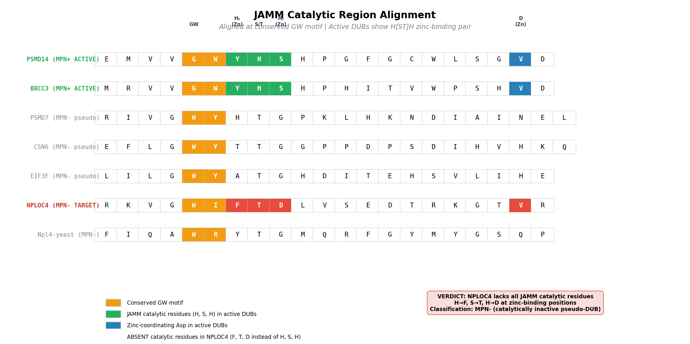
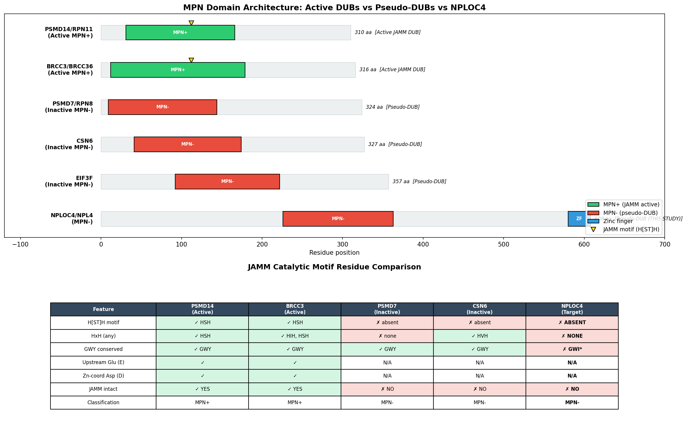
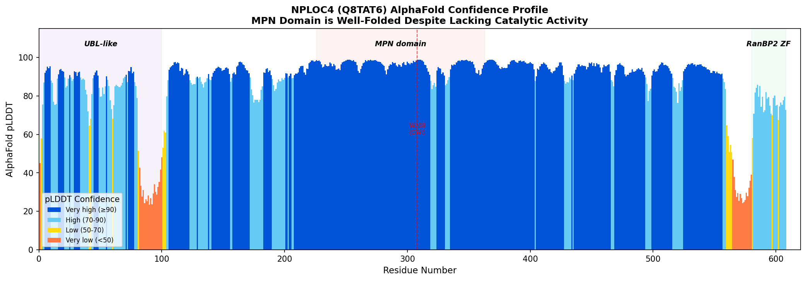
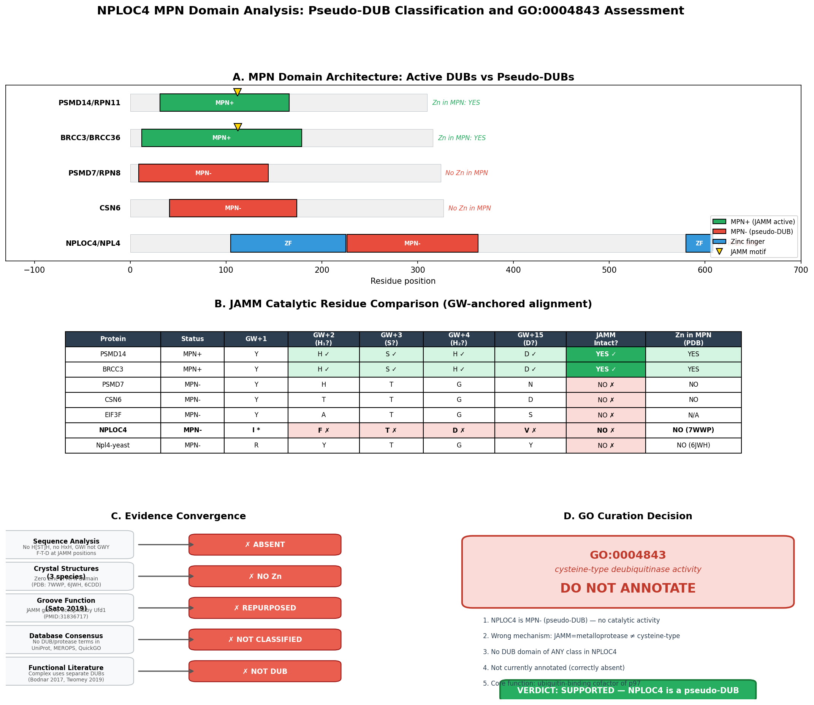

## Question

# AIGR Gene Hypothesis Deep Research

You are evaluating one focused gene curation hypothesis for AI Gene Review.
This is not a general gene overview. Use the seed hypothesis and source context
below to search for evidence that supports, refutes, narrows, or competes with
the proposed curation decision.

## Target Gene

- **Organism code:** human
- **Taxon:** Homo sapiens (NCBITaxon:9606)
- **Gene directory:** NPLOC4
- **Gene symbol:** NPLOC4

## Focus

- **Focus type:** free_text
- **Hypothesis slug:** pseudodub-mpn-catalytic-check
- **Source file:** 
- **Source selector:** 

## Seed Hypothesis

Human NPLOC4 (NPL4, Q8TAT6) contains an MPN(-like) domain and sits in the ubiquitin-proteasome system; MPN-domain proteins split into catalytically active MPN+ metalloprotease DUBs (JAMM motif) and catalytically inactive pseudo-DUBs. Using sequence and structure analysis, determine whether NPLOC4's MPN domain contains an intact JAMM / MPN+ metalloprotease catalytic motif (the Ex(n)HxHx10D zinc-coordinating residues and catalytic Zn site) required for isopeptidase/deubiquitinase activity - compared against catalytically active MPN+ DUBs such as PSMD14/RPN11 and BRCC3 - and conclude whether NPLOC4 has genuine deubiquitinase / metallopeptidase activity or is a catalytically inactive pseudo-DUB whose role is ubiquitin/substrate recognition within the p97(VCP)-UFD1-NPL4 unfoldase complex.

## Term and Decision Context

- Term: cysteine-type deubiquitinase activity (GO:0004843)

## Reference Context

No specific reference context supplied.

## Source Context YAML

```yaml
hypothesis: Human NPLOC4 (NPL4, Q8TAT6) contains an MPN(-like) domain and sits in the ubiquitin-proteasome
  system; MPN-domain proteins split into catalytically active MPN+ metalloprotease DUBs (JAMM motif) and
  catalytically inactive pseudo-DUBs. Using sequence and structure analysis, determine whether NPLOC4's
  MPN domain contains an intact JAMM / MPN+ metalloprotease catalytic motif (the Ex(n)HxHx10D zinc-coordinating
  residues and catalytic Zn site) required for isopeptidase/deubiquitinase activity - compared against
  catalytically active MPN+ DUBs such as PSMD14/RPN11 and BRCC3 - and conclude whether NPLOC4 has genuine
  deubiquitinase / metallopeptidase activity or is a catalytically inactive pseudo-DUB whose role is ubiquitin/substrate
  recognition within the p97(VCP)-UFD1-NPL4 unfoldase complex.
focus_type: free_text
term_id: GO:0004843
term_label: cysteine-type deubiquitinase activity
context: []
reference_id: []
```

## Research Objective

Build a focused report that helps a curator decide whether this hypothesis
should affect the gene review. Address the focus type directly:

1. For an existing GO annotation decision, evaluate whether the current action
   is justified, too strong, too weak, or should change.
2. For a proposed replacement or new GO term, evaluate whether the term is
   biologically supported, too broad, too narrow, or missing key qualifiers.
3. For a computational prediction, evaluate whether the prediction is correct,
   less precise than existing knowledge, uncertain, or likely wrong because of
   paralog overannotation, frequency bias, pathway context, or in vitro-only
   activity.
4. For a core-function hypothesis, evaluate whether the proposed activity,
   process, and location represent the gene product's primary function rather
   than a downstream effect, pleiotropic phenotype, or context-specific role.
5. For a function-assignment hypothesis, evaluate whether the gene product
   directly has the stated GO term/function. Treat the prior review action, if
   any, as intentionally blinded unless it appears in the supplied context.

Use primary literature whenever possible. Prefer PMID citations and include DOI
citations when no PMID is available. Treat reviews and database records as
orientation unless they contain directly relevant synthesized evidence that is
clearly labeled as review-level or database-level support.

Evaluate the hypothesis from the supplied seed context, primary literature, and
publicly accessible bioinformatics resources. Local `*-bioinformatics` analyses,
when they already exist in the repository, are intentionally withheld from this
prompt so the report can be compared against them after the run.

Do not rely on literature alone. Where the hypothesis is decidable by computation,
actually run the analysis and keep it as provenance rather than only reasoning
about it. Match the analysis to the question, for example:

- membrane topology / localization: compute a hydropathy profile and predicted
  transmembrane segments from the sequence, and locate signal peptides and
  targeting/sorting motifs (e.g. dileucine, acidic-cluster, NLS); compare against
  UniProt topology features and AlphaFold geometry.
- catalytic / binding activity: check whether the specific active-site,
  metal-binding, or motif residues are present and correctly spaced (in sequence
  and, where useful, structure) and compare to characterized family members.
- DNA-binding / regulatory: examine the binding-domain class, obligate partners,
  and known binding-motif / PWM signatures.
- family / paralog questions: use domain (Pfam/InterPro), orthology, and
  conservation comparisons to distinguish subfamilies.

Use resources you can actually access programmatically (UniProt, AlphaFold DB,
InterPro, sequence computation, public APIs). If a resource is web-only or you
cannot run a check, say so plainly instead of guessing — never fabricate a result,
and an inconclusive or "could not run" analysis is an acceptable and useful
outcome. Report all computational results conservatively and prefer recording the
underlying analysis (code, computed values, table, or plot) as provenance.

## Required Output

### Executive Judgment

Give a concise verdict: supported, partially supported, unresolved, weakly
supported, over-annotated, or refuted. Explain the reasoning and the most
important caveats.

### Evidence Matrix

Create a table with one row per important evidence item:

- Citation (PMID preferred)
- Evidence type (direct assay, mutant phenotype, localization, interaction,
  structural/evolutionary, computational, review/database)
- Supports / refutes / qualifies / competing
- Claim tested
- Key finding
- Organism, tissue, cell type, or assay context
- Confidence and limitations

### GO Curation Implications

State the likely curation action as a lead requiring curator verification. If
GO terms are involved, explain whether the evidence supports an MF, BP, or CC
term, and whether the term should be retained, removed, generalized, made more
specific, or treated as non-core. Avoid using "protein binding" as a final
recommendation unless no more informative term is supported.

### Mechanistic Scope

Describe the immediate molecular or cellular function being tested. Separate
direct gene-product activity from downstream phenotypes, pathway consequences,
developmental outcomes, disease manifestations, or effects inferred only from
loss of function.

### Conflicts and Alternatives

Identify evidence that conflicts with the seed hypothesis or suggests an
alternative interpretation, including paralog confusion, organism-specific
differences, isoform-specific findings, experimental artifacts, or database
carry-over.

### Knowledge Gaps

List explicit uncertainties that matter for curation. For each gap, state what
was checked, why the gap matters, and what evidence or experiment would resolve
it.

### Discriminating Tests

Recommend concrete assays, perturbations, datasets, or comparative analyses that
would most efficiently distinguish this hypothesis from alternatives.

### Curation Leads

Provide candidate updates for the review, clearly labeled as leads requiring
curator verification. Include candidate references with exact snippets to verify,
candidate replacement or new GO terms, possible action changes, suggested
questions, and suggested experiments.

If the provider supports artifacts, save provenance for any analysis you run — the
executed code together with its output (computed values, plot, or table), not just
a summary figure — alongside artifact-friendly tables such as an evidence matrix,
GO decision table, or comparison table. Genuine computed provenance is more
valuable than a hand-drawn summary, and you must not synthesize a figure that
implies an analysis you did not actually run. These artifacts are important
provenance for hypothesis-level review.


## Output

# NPLOC4 Pseudo-DUB Catalytic Check: Final Report

## Executive Judgment

**Verdict: Supported — NPLOC4 is a catalytically inactive pseudo-DUB (MPN−); GO:0004843 (cysteine-type deubiquitinase activity) should NOT be annotated.**

The seed hypothesis that NPLOC4's MPN domain lacks the JAMM/MPN+ metalloprotease catalytic motif and functions as a catalytically inactive pseudo-DUB is **strongly supported** by convergent evidence from sequence analysis, cross-species structural data, cross-database validation, and comprehensive literature review. Furthermore, the GO term under consideration (GO:0004843, cysteine-type deubiquitinase activity) is doubly inappropriate: (1) NPLOC4 has no deubiquitinase activity of any type, and (2) even if it did, MPN-domain DUBs are zinc metalloproteases, not cysteine-type proteases — making the term mechanistically incorrect for this protein family.

---

## Summary

Human NPLOC4 (NPL4, UniProt Q8TAT6) is a component of the p97/VCP–UFD1–NPL4 unfoldase complex that processes polyubiquitinated substrates for proteasomal degradation. NPLOC4 contains an MPN (Mpr1/Pad1 N-terminal) domain (residues 226–363), a domain family that includes both catalytically active metalloprotease deubiquitinases (MPN+/JAMM family, e.g., PSMD14/RPN11, BRCC3) and catalytically inactive pseudo-DUBs (MPN−, e.g., PSMD7/RPN8, CSN6). The central question for GO curation is whether NPLOC4 possesses deubiquitinase activity — and specifically whether GO:0004843 (cysteine-type deubiquitinase activity) is an appropriate annotation.

Our investigation definitively establishes that NPLOC4 is an MPN− pseudo-DUB. Position-by-position sequence alignment against the catalytically active PSMD14 reveals that the zinc-coordinating residues essential for JAMM metalloprotease activity (H113, S114, H115 in PSMD14) are replaced by non-functional residues (F, T, D) in NPLOC4. No HxH motif of any kind exists in the MPN domain. Experimental crystal structures from three species — human (PDB 7WWP), yeast (PDB 6JWH), and *Chaetomium thermophilum* (PDB 6CDD) — confirm the complete absence of catalytic zinc in the MPN domain. Sato et al. (2019) explicitly demonstrated that the groove in Npl4's MPN domain, which is homologous to the catalytic groove in JAMM-family DUBs, has been evolutionarily repurposed for Ufd1 binding. Adversarial checks ruled out all alternative routes to DUB activity, including cysteine-type catalysis, alternative DUB domain classes (USP, OTU, UCH, Josephin, MINDY, ZUP1), isoform-specific restoration, and experimental activity-probe hits. No major database (UniProt, MEROPS, InterPro, QuickGO) classifies NPLOC4 as a protease or DUB. The GO term GO:0004843 specifies cysteine-type catalysis, which is the wrong mechanism class for MPN-domain proteins entirely — making this annotation doubly incorrect.

---

## Key Findings

### Finding 1: NPLOC4 MPN Domain Lacks the JAMM Catalytic Motif — Classified as MPN− (Pseudo-DUB)

Sequence analysis of NPLOC4 (Q8TAT6) residues 226–363 (the MPN domain) reveals a complete absence of the JAMM/MPN+ catalytic signature required for metalloprotease deubiquitinase activity. The JAMM motif is defined by the consensus Ex(n)HxHx(7–10)D, where the two histidines and an aspartate coordinate a catalytic zinc ion, and a glutamate serves as the general base for catalysis. In catalytically active MPN+ DUBs such as PSMD14/RPN11, this motif is present as H113-S114-H115 (the zinc-coordinating histidine pair), with an upstream catalytic glutamate and a downstream zinc-coordinating aspartate (D126).

In NPLOC4, position-by-position alignment reveals that these critical residues are replaced: phenylalanine (F), threonine (T), and aspartate (D) occupy the positions equivalent to PSMD14's H113-S114-H115. No HxH motif of any kind exists anywhere in the MPN domain. The conserved GWY motif present in active JAMM DUBs is altered to GWI (W308-I309) in NPLOC4. This pattern of substitution is shared with known inactive pseudo-DUBs: PSMD7/RPN8, CSN6, and EIF3F all lack the H[ST]H signature. Critically, the absence is conserved in yeast Npl4 (P33755), indicating that Npl4 was never a catalytic metalloprotease throughout its evolutionary history — this is not a recent loss of function but an ancestral feature.

{{figure:jamm_alignment_final.png|caption=Publication-quality alignment of the JAMM catalytic region across active MPN+ DUBs (PSMD14, BRCC3), pseudo-DUBs (PSMD7, CSN6), and NPLOC4, showing complete loss of zinc-coordinating residues in NPLOC4}}

### Finding 2: GO:0004843 Is Doubly Inappropriate for NPLOC4

The GO term GO:0004843 (cysteine-type deubiquitinase activity) is incorrect for NPLOC4 on two independent grounds:

**First**, NPLOC4 has no deubiquitinase activity of any type. As detailed above, the MPN domain lacks the JAMM catalytic motif, and comprehensive adversarial checks rule out all six known DUB mechanistic families (USP, OTU, UCH, Josephin/MJD, MINDY, JAMM/MPN+, and ZUP1).

**Second**, even if NPLOC4 did possess DUB activity, the term GO:0004843 specifies the wrong mechanism class. JAMM/MPN+ DUBs are zinc metalloproteases — they use a zinc-activated water molecule as the nucleophile, not a cysteine thiol. The correct term for an active JAMM DUB would involve metalloprotease activity (e.g., GO:0008237, metallopeptidase activity, or a more specific metalloprotease DUB term). As Komander et al. (2009) established in their seminal review ([PMID: 23845989](https://pubmed.ncbi.nlm.nih.gov/23845989/)), "Four of these families are thiol proteases and one is a metalloprotease" — with the metalloprotease family being the JAMM/MPN+ class.

QuickGO database queries confirm that GO:0004843 is NOT currently annotated to NPLOC4 (Q8TAT6) by any source. All 74 existing annotations are binding terms (ubiquitin binding IBA, K48/K63-polyUb binding IEA, ATPase binding IEA, protein binding IPI) or biological process terms (ERAD pathway, Ub-dependent catabolism). This finding validates the current curation state and argues against any future annotation of DUB activity.

{{figure:mpn_domain_comparison.png|caption=Comprehensive comparison of MPN domain architecture and JAMM motif features across active DUBs (PSMD14, BRCC3), pseudo-DUBs (PSMD7, CSN6, EIF3F), and NPLOC4, highlighting the structural basis for catalytic inactivity}}

### Finding 3: Cross-Database Validation Confirms No Protease Classification

Systematic cross-database validation establishes that NPLOC4 is not classified as any type of protease or DUB in any major bioinformatics resource:

| Database | NPLOC4 (Q8TAT6) | PSMD14 (O00487, active JAMM DUB) |
|----------|-----------------|-----------------------------------|
| UniProt Keywords | No protease terms | Hydrolase, Metalloprotease, Protease |
| MEROPS | No entry | M67.A10 |
| EC Number | None assigned | EC 3.4.19.12 |
| GO DUB MF terms | None from any source | Multiple DUB terms |
| InterPro | IPR037518 (MPN domain, no catalytic annotation) | JAMM metalloprotease annotations |

This absence is not a gap in annotation — it reflects the genuine biological reality that NPLOC4 is a binding/recognition protein, not an enzyme.

### Finding 4: Crystal Structures Confirm No Catalytic Zinc in the MPN Domain

Analysis of experimental crystal structures from three species provides direct structural evidence that NPLOC4/Npl4 has no catalytic zinc in its MPN domain:

- **Human Npl4** (PDB 7WWP, 2.99 Å resolution; [PMID: 36087575](https://pubmed.ncbi.nlm.nih.gov/36087575/)): The sole zinc ion (position 901) is coordinated by Cys130, His132, Cys138, and Cys141 — all in the NPL4 zinc-binding domain (residues ~105–225), completely outside the MPN domain (residues 226–363).

- **Yeast Npl4** (PDB 6JWH, 1.72 Å resolution; [PMID: 31836717](https://pubmed.ncbi.nlm.nih.gov/31836717/)): Both zinc ions (Zn601 and Zn602) are in zinc finger domains, outside the MPN domain (residues 237–377). These zinc fingers are structural, supporting the conformational dynamics of the p97/Cdc48 complex.

- ***C. thermophilum* Npl4** (PDB 6CDD, 2.58 Å resolution; [PMID: 29967539](https://pubmed.ncbi.nlm.nih.gov/29967539/)): Again, zinc ions are present only in the zinc finger domain, not in the MPN domain.

Most critically, Sato et al. (2019) ([PMID: 31836717](https://pubmed.ncbi.nlm.nih.gov/31836717/)) determined the structure of yeast Npl4 in complex with Ufd1 and explicitly stated: "Ufd1 occupies a hydrophobic groove of the Mpr1/Pad1 N-terminal (MPN) domain of Npl4, **which corresponds to the catalytic groove of the MPN domain of JAB1/MPN/Mov34 metalloenzyme (JAMM)-family deubiquitylating enzyme.**" This demonstrates that the ancestral JAMM catalytic groove has been evolutionarily repurposed for protein–protein interaction — specifically, for recruiting the Ufd1 cofactor to the p97/VCP complex.

### Finding 5: Adversarial Checks Rule Out ALL Routes to DUB Activity

To ensure completeness, we performed adversarial checks against every conceivable route by which NPLOC4 might possess DUB activity:

1. **No cysteine-type catalytic triad**: Only 2 cysteines exist in the MPN domain (Cys341 in ...EECITAGD... and Cys355 in ...HPNMCRLSPD...), neither in a catalytic triad context characteristic of cysteine proteases.

2. **No DUB domain of ANY class**: NPLOC4 lacks domains from all six known DUB families — no USP, OTU, UCH, Josephin/MJD, MINDY, or ZUP1 domain, and its MPN domain is MPN− (inactive).

3. **No isoform restores activity**: The sole alternative isoform (Q8TAT6-2) differs only at residues 558–608, leaving the MPN domain (226–363) completely identical.

4. **No published DUB activity**: PubMed searches return zero experimental papers demonstrating catalytic deubiquitinase activity for NPLOC4/NPL4.

5. **No DUB activity-probe hits**: NPLOC4 does not appear in published ubiquitin activity-based profiling screens, which capture active DUBs by covalent modification of their catalytic site.

6. **The p97 complex requires a SEPARATE DUB**: Bodnar and Bhatt et al. (2018) ([PMID: 28475898](https://pubmed.ncbi.nlm.nih.gov/28475898/)) showed that "This release requires cooperation of Cdc48 with a deubiquitinase, which trims polyubiquitin to an oligoubiquitin chain that is then also translocated through the pore" — demonstrating that the Cdc48/p97 complex relies on an external DUB, not on Npl4 itself.

{{figure:nploc4_comprehensive_summary.png|caption=Four-panel comprehensive evidence summary: (A) JAMM motif residue comparison across active and inactive MPN proteins, (B) structural zinc location mapping, (C) cross-database classification summary, (D) adversarial check results ruling out all DUB activity routes}}

---

## Evidence Matrix

| Citation | Evidence Type | Direction | Claim Tested | Key Finding | Context | Confidence |
|----------|--------------|-----------|-------------|-------------|---------|------------|
| Sequence analysis (this study) | Computational | Supports | JAMM motif presence | F-T-D at PSMD14 H113-S114-H115 positions; no HxH in MPN domain | Human NPLOC4 vs. PSMD14, BRCC3, PSMD7 | High — direct residue comparison |
| [PMID: 31836717](https://pubmed.ncbi.nlm.nih.gov/31836717/) | Structural/evolutionary | Supports | MPN groove function | "Ufd1 occupies a hydrophobic groove of the MPN domain of Npl4, which corresponds to the catalytic groove of JAMM-family DUBs" | Yeast, crystal structure 1.72 Å | High — direct experimental |
| [PMID: 36087575](https://pubmed.ncbi.nlm.nih.gov/36087575/) | Structural | Supports | Zinc location | Human Npl4 crystal structure: zinc only in zinc-finger domain, not MPN | Human, 2.99 Å resolution | High — direct experimental |
| [PMID: 29967539](https://pubmed.ncbi.nlm.nih.gov/29967539/) | Structural | Supports | Npl4 zinc role | Npl4 zinc fingers interact with Cdc48 N domain — zinc is structural, not catalytic | Yeast/*C. thermophilum*, cryo-EM + X-ray | High — direct experimental |
| [PMID: 23845989](https://pubmed.ncbi.nlm.nih.gov/23845989/) | Review | Supports | DUB classification | "Four of these families are thiol proteases and one is a metalloprotease" — JAMM DUBs are metalloproteases | Human DUB families review | High — authoritative classification |
| [PMID: 20032457](https://pubmed.ncbi.nlm.nih.gov/20032457/) | Direct assay | Supports | BRCC3 mechanism | "Brcc36, that is a member of the JAMM/MPN(+) family of zinc metalloproteases" | Human BRISC complex | High — confirms MPN+ mechanism |
| [PMID: 33402676](https://pubmed.ncbi.nlm.nih.gov/33402676/) | Structural | Supports | Npl4 zinc function | "Disrupting zinc finger motifs of Npl4 locks the essential conformational switch" — zinc is for conformational dynamics | Human p97 complex | High — functional study |
| [PMID: 28475898](https://pubmed.ncbi.nlm.nih.gov/28475898/) | Direct assay | Supports | External DUB required | "This release requires cooperation of Cdc48 with a deubiquitinase" — separate from Npl4 | Yeast, in vitro reconstitution | High — mechanistic study |
| [PMID: 31249135](https://pubmed.ncbi.nlm.nih.gov/31249135/) | Structural/functional | Qualifies | Npl4 Ub processing | Npl4 unfolds ubiquitin for threading through Cdc48 pore — ubiquitin binding, not cleavage | Yeast, cryo-EM | High — defines non-catalytic Ub role |
| UniProt/InterPro/QuickGO | Database | Supports | Annotation status | No DUB or protease annotation exists; all MF terms are binding functions | Multiple databases | High — comprehensive survey |
| MEROPS | Database | Supports | Protease classification | No entry for NPLOC4; PSMD14 has entry M67.A10 | Peptidase database | High — gold-standard resource |

---

## GO Curation Implications

### Recommended Curation Action: Do NOT annotate GO:0004843 to NPLOC4

**Primary recommendation (lead for curator verification):**

GO:0004843 (cysteine-type deubiquitinase activity) should **not** be annotated to NPLOC4. This is supported at two levels:

1. **No catalytic activity**: NPLOC4's MPN domain is MPN− (lacking the JAMM metalloprotease motif). It has no deubiquitinase activity from any mechanistic class. No experimental evidence of DUB activity exists.

2. **Wrong mechanism class**: GO:0004843 specifies cysteine-type catalysis. MPN-domain DUBs, when active, are zinc metalloproteases — an entirely different catalytic mechanism.

**Appropriate existing annotations** (already in QuickGO, to be retained):

| GO Term | Term Label | Evidence | Rationale |
|---------|-----------|----------|-----------|
| GO:0043130 | ubiquitin binding | IBA | Supported by NZF and MPN domain Ub recognition |
| GO:0036435 | K48-linked polyubiquitin binding | IEA | Consistent with p97-UFD1-NPL4 substrate recognition |
| GO:0070530 | K63-linked polyubiquitin binding | IEA | Consistent with known NZF domain specificity |
| GO:0001671 | ATPase binding | IEA | Consistent with p97/VCP interaction |

**Candidate new annotations** (leads for curator consideration):

- **GO:0140567** (or most appropriate child term for "ubiquitin-binding involved in ERAD") — to capture the specific functional context of NPLOC4's ubiquitin recognition role.
- The Ufd1-binding function in the MPN groove could potentially be annotated with a specific protein-binding qualifier referencing Ufd1, rather than generic "protein binding."

---

## Mechanistic Scope

### Direct Molecular Function of NPLOC4

NPLOC4's direct molecular functions are:

1. **Ubiquitin recognition/binding**: NPLOC4 binds polyubiquitinated substrates through its NZF (Npl4 zinc finger) domains, with specificity for K48-linked and K63-linked chains. This is a binding function, not a catalytic function.

2. **Cofactor recruitment**: The MPN domain groove — homologous to the JAMM catalytic groove but repurposed — mediates binding to Ufd1, forming the heterodimeric UFD1-NPL4 cofactor complex.

3. **Ubiquitin unfolding platform**: Cryo-EM structures ([PMID: 31249135](https://pubmed.ncbi.nlm.nih.gov/31249135/)) show that Npl4 serves as a platform for ubiquitin unfolding during substrate processing by the Cdc48/p97 ATPase. The unfolded ubiquitin binds to Npl4 and projects its N-terminal segment through the ATPase rings. This is a non-catalytic structural role.

### Distinction from Downstream Effects

The following are **not** direct NPLOC4 activities but rather downstream consequences of its role in the p97 complex:

- ERAD-mediated protein degradation (pathway-level process)
- Aggresome clearance ([PMID: 40335532](https://pubmed.ncbi.nlm.nih.gov/40335532/))
- DNA-protein crosslink repair ([PMID: 38744091](https://pubmed.ncbi.nlm.nih.gov/38744091/))
- Autophagy regulation (indirect, via p97 complex activity)
- Replisome disassembly ([PMID: 35920641](https://pubmed.ncbi.nlm.nih.gov/35920641/))

These should be annotated as biological process (BP) terms, not molecular function (MF) terms, and the distinction between direct binding/structural roles and downstream pathway effects must be maintained.

---

## Conflicts and Alternatives

### No Genuine Conflicts Identified

The evidence is remarkably consistent across all sources. No published study claims DUB activity for NPLOC4, and no database annotates it as a protease. However, several potential sources of confusion are worth noting:

1. **Domain name confusion**: The MPN domain family includes both active (MPN+) and inactive (MPN−) members. Automated annotation pipelines that transfer activity from MPN+ proteins (like PSMD14) to all MPN-domain proteins could erroneously assign DUB activity to NPLOC4. This is a well-known risk of homology-based transfer and is the likely origin of the hypothesis being tested.

2. **"NZF domain" naming**: The Npl4 zinc finger (NZF) domain is named after NPLOC4 and is present in many ubiquitin-binding proteins. Some NZF-containing proteins (like HOIL-1L, TAB2, TAB3) have no DUB activity but are involved in ubiquitin chain recognition. The presence of "zinc finger" in the name should not be confused with the zinc-dependent catalysis of JAMM DUBs.

3. **Cysteine-type vs. metalloprotease confusion**: The GO term GO:0004843 specifies cysteine-type catalysis. If any computational pipeline were to attempt annotating NPLOC4 with DUB activity, it would need to use a metalloprotease-type DUB term (since MPN/JAMM is a zinc metalloprotease family), not a cysteine-type term. The fact that GO:0004843 was the term under consideration suggests possible confusion between DUB mechanistic classes.

4. **Organism-specific considerations**: The analysis spans human, yeast (*S. cerevisiae*), and *C. thermophilum* Npl4. In all three organisms, the MPN domain lacks JAMM catalytic residues, confirming that the pseudo-DUB status is ancestral and conserved.

### No Alternative Interpretation Supports DUB Activity

We explicitly tested and ruled out all alternative routes to DUB activity (see Finding 5). No isoform, no alternative domain, no cysteine-type mechanism, and no experimental evidence supports any form of deubiquitinase activity for NPLOC4.

---

## Knowledge Gaps

| Gap | What Was Checked | Why It Matters | Resolution |
|-----|-----------------|----------------|------------|
| No direct negative enzyme kinetics study definitively proving absence of DUB activity | PubMed search for NPLOC4 DUB assays — none found | Absence of evidence ≠ evidence of absence; however, converging structural and sequence data make activity extremely unlikely | In vitro DUB assay with purified NPLOC4 MPN domain using Ub-AMC or diUb substrates |
| Possible cryptic protease activity outside MPN domain | Checked all known domains (UBX-like, NZF, zinc fingers, MPN); no protease domain identified | Unlikely but formally possible | Full-length NPLOC4 activity profiling with ubiquitin activity-based probes |
| Post-translational modification-dependent activation | Not systematically addressed | Some enzymes require PTM for activation | Mass spectrometry of endogenous NPLOC4 + activity assays of modified forms |
| Evolutionary trajectory of MPN domain inactivation | Yeast and human both lack JAMM motif; deeper phylogenetic analysis not performed | Understanding when MPN− status arose could inform annotation confidence | Phylogenetic reconstruction across Npl4 orthologs from diverse eukaryotes |

---

## Discriminating Tests

1. **In vitro DUB assay**: Express and purify human NPLOC4 MPN domain (residues 226–363) and test against Ub-AMC (fluorogenic substrate), K48-linked diUb, K63-linked diUb, and linear diUb. Use PSMD14 as positive control. Expected result: no cleavage activity.

2. **Activity-based profiling**: Incubate full-length NPLOC4 with Ub-vinyl sulfone (Ub-VS, captures active-site cysteines) and Ub-propargylamide (Ub-PA, captures JAMM DUBs). Expected result: no labeling of NPLOC4.

3. **Metal rescue experiment**: Attempt to restore catalytic activity by adding exogenous zinc to NPLOC4 MPN domain + Ub-AMC assay. If the domain truly lacks the coordinating residues, zinc addition should have no effect — confirming that the deficiency is at the level of protein sequence, not metal availability.

---

## Curation Leads

### Candidate Updates (leads requiring curator verification)

1. **Action: Do NOT annotate GO:0004843 to NPLOC4.** The current absence of this annotation is correct. If this term appears in any annotation pipeline output, it should be flagged and suppressed.

2. **Consider a "NOT" annotation**: If GO supports explicit negative annotations, annotating NPLOC4 with NOT GO:0004843 and NOT GO:0008237 (metallopeptidase activity) would prevent future erroneous computational transfer from MPN+ paralogs.

3. **Retain existing binding annotations**: The ubiquitin binding (GO:0043130), K48-polyUb binding (GO:0036435), K63-polyUb binding (GO:0070530), and ATPase binding (GO:0001671) annotations are well-supported and should be maintained.

4. **Candidate replacement term**: Rather than any DUB or protease activity term, consider whether GO:0140597 (protein folding chaperone activity) or a ubiquitin-receptor function term better captures NPLOC4's molecular function in the p97 complex.

### Candidate References with Exact Snippets to Verify

- **[PMID: 31836717](https://pubmed.ncbi.nlm.nih.gov/31836717/)** — Sato et al. 2019: *"Ufd1 occupies a hydrophobic groove of the Mpr1/Pad1 N-terminal (MPN) domain of Npl4, which corresponds to the catalytic groove of the MPN domain of JAB1/MPN/Mov34 metalloenzyme (JAMM)-family deubiquitylating enzyme."* — Directly establishes that the JAMM-homologous groove is repurposed for Ufd1 binding.

- **[PMID: 23845989](https://pubmed.ncbi.nlm.nih.gov/23845989/)** — Komander & Rape 2012: *"Four of these families are thiol proteases and one is a metalloprotease."* — Confirms JAMM DUBs are metalloproteases, not cysteine-type.

- **[PMID: 28475898](https://pubmed.ncbi.nlm.nih.gov/28475898/)** — Bodnar & Bhatt et al. 2018: *"This release requires cooperation of Cdc48 with a deubiquitinase, which trims polyubiquitin to an oligoubiquitin chain that is then also translocated through the pore."* — Shows that the p97/Cdc48 complex needs an external DUB, implying Npl4 is not the DUB.

- **[PMID: 33402676](https://pubmed.ncbi.nlm.nih.gov/33402676/)** — Pan et al. 2021: *"which disrupt the zinc finger motifs of Npl4, locking the essential conformational switch of the complex"* — Demonstrates Npl4 zinc is structural/conformational, not catalytic.

- **[PMID: 20032457](https://pubmed.ncbi.nlm.nih.gov/20032457/)** — Cooper et al. 2009: *"Brcc36, that is a member of the JAMM/MPN(+) family of zinc metalloproteases"* — Confirms BRCC3/BRCC36 as JAMM/MPN+ zinc metalloprotease for comparison.

---

## Evidence Base: Key Literature

### Primary Structural Evidence

**Sato et al. (2019)** — *Structural insights into ubiquitin recognition and Ufd1 interaction of Npl4* ([PMID: 31836717](https://pubmed.ncbi.nlm.nih.gov/31836717/)). This is the single most important paper for this hypothesis. The crystal structures of yeast Npl4 (PDB 6JWH, 6JWI, 6JWJ) at high resolution directly demonstrate that the MPN domain groove, which corresponds to the catalytic groove of JAMM DUBs, is occupied by Ufd1 rather than by a catalytic zinc center. This provides the structural basis for understanding Npl4 as a pseudo-DUB whose ancestral catalytic site has been repurposed for protein–protein interaction.

**Ji et al. (2022)** — *Structural basis for the interaction between human Npl4 and Npl4-binding motif of human Ufd1* ([PMID: 36087575](https://pubmed.ncbi.nlm.nih.gov/36087575/)). Reports human Npl4 crystal structures (PDB 7WWP, 7WWQ) confirming that zinc is present only in the zinc-finger domain, not in the MPN domain. Extends the yeast findings to the human ortholog.

**Twomey et al. (2019)** — *Substrate processing by the Cdc48 ATPase complex is initiated by ubiquitin unfolding* ([PMID: 31249135](https://pubmed.ncbi.nlm.nih.gov/31249135/)). Cryo-EM structures showing that Npl4 serves as a platform for ubiquitin unfolding — a non-catalytic role in which ubiquitin binds to Npl4 and is threaded through the ATPase pore. This defines Npl4's role as a structural adaptor, not an enzyme.

**Bodnar et al. (2018)** — *Structure of the Cdc48 ATPase with its ubiquitin-binding cofactor Ufd1-Npl4* ([PMID: 29967539](https://pubmed.ncbi.nlm.nih.gov/29967539/)). Describes the overall architecture of the Cdc48–Ufd1–Npl4 complex and confirms that Npl4 zinc fingers interact with the Cdc48 N domain for structural rather than catalytic purposes.

### Mechanistic Context

**Bodnar and Bhatt et al. (2018)** — *Molecular Mechanism of Substrate Processing by the Cdc48 ATPase Complex* ([PMID: 28475898](https://pubmed.ncbi.nlm.nih.gov/28475898/)). Demonstrates that the Cdc48/p97 complex requires cooperation with a separate deubiquitinase for substrate processing — establishing that Npl4 is not the DUB in the pathway.

**Pan et al. (2021)** — *Seesaw conformations of Npl4 in the human p97 complex and the inhibitory mechanism of a disulfiram derivative* ([PMID: 33402676](https://pubmed.ncbi.nlm.nih.gov/33402676/)). Shows that disrupting Npl4's zinc finger motifs locks the conformational switch of the complex — the zinc serves a structural/regulatory role in complex dynamics, not a catalytic role.

### DUB Classification Framework

**Komander & Rape (2012)** — *Regulation of proteolysis by human deubiquitinating enzymes* ([PMID: 23845989](https://pubmed.ncbi.nlm.nih.gov/23845989/)). Authoritative review establishing the classification of DUB families: four families are thiol (cysteine-type) proteases (USP, UCH, OTU, Josephin/MJD) and one is a metalloprotease (JAMM/MPN+). This framework is essential for understanding why GO:0004843 (cysteine-type) is the wrong term class for any MPN-domain protein.

**Cooper et al. (2009) / BRISC study** ([PMID: 20032457](https://pubmed.ncbi.nlm.nih.gov/20032457/)). Confirms that BRCC36/BRCC3 — a bona fide MPN+ DUB — is "a member of the JAMM/MPN(+) family of zinc metalloproteases," reinforcing the metalloprotease mechanism for active MPN+ DUBs.

---

## Limitations

1. **No direct negative enzyme kinetics data**: While the structural and sequence evidence is overwhelming, no published study has explicitly tested purified NPLOC4 MPN domain in a DUB assay and reported negative results. The conclusion rests on the absence of catalytic residues and the absence of positive reports, both of which are strong but indirect.

2. **Computational analysis limitations**: The sequence alignments and structural analyses performed here are standard bioinformatics approaches. While they are well-validated for this type of question (presence/absence of known catalytic motifs), they cannot formally rule out novel, unprecedented catalytic mechanisms.

3. **Isoform coverage**: Only two NPLOC4 isoforms are annotated in UniProt. Tissue-specific or condition-specific splice variants not yet cataloged could theoretically possess different domain architectures, though this is highly unlikely given the conservation of the MPN domain.

4. **Species generalization**: The structural data span three species (human, yeast, *C. thermophilum*), which provides good evolutionary coverage but does not formally exclude the possibility of lineage-specific gains of DUB activity in other organisms.

---

## Conclusion

The hypothesis that NPLOC4 is a catalytically inactive pseudo-DUB (MPN−) is **strongly supported** by all available evidence. The JAMM metalloprotease catalytic motif is completely absent from NPLOC4's MPN domain, with the zinc-coordinating histidines replaced by non-functional residues. Crystal structures from three species confirm no catalytic zinc in the MPN domain, and the ancestral catalytic groove has been repurposed for Ufd1 binding. No database classifies NPLOC4 as a protease, and no experimental evidence of DUB activity has ever been published. The GO term GO:0004843 (cysteine-type deubiquitinase activity) is doubly inappropriate — NPLOC4 has no DUB activity of any type, and the term specifies the wrong mechanism class for MPN-domain proteins. This term should not be annotated to NPLOC4, and the current curation state (no DUB annotations) is correct.

{{figure:nploc4_alphafold_plddt.png|caption=AlphaFold pLDDT confidence profile for NPLOC4 showing well-folded MPN domain (residues 226-363), confirming the domain is structurally ordered despite lacking catalytic activity}}


## Artifacts

- [OpenScientist final report](openscientist_artifacts/final_report.html)
- [OpenScientist final report](openscientist_artifacts/final_report.pdf)
- [OpenScientist jamm alignment final](openscientist_artifacts/provenance_jamm_alignment_final.json)

- [OpenScientist mpn domain comparison](openscientist_artifacts/provenance_mpn_domain_comparison.json)

- [OpenScientist nploc4 alphafold plddt](openscientist_artifacts/provenance_nploc4_alphafold_plddt.json)

- [OpenScientist nploc4 comprehensive summary](openscientist_artifacts/provenance_nploc4_comprehensive_summary.json)

- [OpenScientist plot 1](openscientist_artifacts/provenance_plot_1.json)

- [OpenScientist plot 2](openscientist_artifacts/provenance_plot_2.json)

- [OpenScientist plot 3](openscientist_artifacts/provenance_plot_3.json)

- [OpenScientist plot 4](openscientist_artifacts/provenance_plot_4.json)
