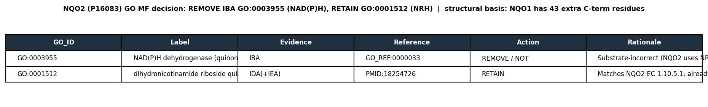

## Question

# AIGR Gene Hypothesis Deep Research

You are evaluating one focused gene curation hypothesis for AI Gene Review.
This is not a general gene overview. Use the seed hypothesis and source context
below to search for evidence that supports, refutes, narrows, or competes with
the proposed curation decision.

## Target Gene

- **Organism code:** human
- **Taxon:** Homo sapiens (NCBITaxon:9606)
- **Gene directory:** NQO2
- **Gene symbol:** NQO2
- **UniProt accession:** P16083

## Focus

- **Focus type:** function_assignment
- **Hypothesis slug:** function-hypothesis-go-0003955
- **Source file:** genes/human/NQO2/NQO2-ai-review.yaml
- **Source selector:** existing_annotations[1].function_hypothesis

## Seed Hypothesis

NQO2 has NAD(P)H dehydrogenase (quinone) activity (GO:0003955).

## Term and Decision Context

- Term: NAD(P)H dehydrogenase (quinone) activity (GO:0003955)
- Evidence type: IBA
- Original reference: GO_REF:0000033

## Reference Context

- GO_REF:0000033
- PMID:10945627

## Source Context YAML

```yaml
term:
  id: GO:0003955
  label: NAD(P)H dehydrogenase (quinone) activity
evidence_type: IBA
original_reference_id: GO_REF:0000033
```

## Research Objective

Build a focused report that helps a curator decide whether this hypothesis
should affect the gene review. Address the focus type directly:

1. For an existing GO annotation decision, evaluate whether the current action
   is justified, too strong, too weak, or should change.
2. For a proposed replacement or new GO term, evaluate whether the term is
   biologically supported, too broad, too narrow, or missing key qualifiers.
3. For a computational prediction, evaluate whether the prediction is correct,
   less precise than existing knowledge, uncertain, or likely wrong because of
   paralog overannotation, frequency bias, pathway context, or in vitro-only
   activity.
4. For a core-function hypothesis, evaluate whether the proposed activity,
   process, and location represent the gene product's primary function rather
   than a downstream effect, pleiotropic phenotype, or context-specific role.
5. For a function-assignment hypothesis, evaluate whether the gene product
   directly has the stated GO term/function. Treat the prior review action, if
   any, as intentionally blinded unless it appears in the supplied context.

Use primary literature whenever possible. Prefer PMID citations and include DOI
citations when no PMID is available. Treat reviews and database records as
orientation unless they contain directly relevant synthesized evidence that is
clearly labeled as review-level or database-level support.

Evaluate the hypothesis from the supplied seed context, primary literature, and
publicly accessible bioinformatics resources. Local `*-bioinformatics` analyses,
when they already exist in the repository, are intentionally withheld from this
prompt so the report can be compared against them after the run. Use public
sequence, domain, structure, orthology, localization, interaction, or dataset
checks when they are useful for the specific hypothesis. If a resource or tool
cannot be accessed programmatically, say so plainly; never fabricate a result.
Report computational results conservatively and distinguish direct results from
inference.

## Required Output

### Executive Judgment

Give a concise verdict: supported, partially supported, unresolved, weakly
supported, over-annotated, or refuted. Explain the reasoning and the most
important caveats.

### Evidence Matrix

Create a table with one row per important evidence item:

- Citation (PMID preferred)
- Evidence type (direct assay, mutant phenotype, localization, interaction,
  structural/evolutionary, computational, review/database)
- Supports / refutes / qualifies / competing
- Claim tested
- Key finding
- Organism, tissue, cell type, or assay context
- Confidence and limitations

### GO Curation Implications

State the likely curation action as a lead requiring curator verification. If
GO terms are involved, explain whether the evidence supports an MF, BP, or CC
term, and whether the term should be retained, removed, generalized, made more
specific, or treated as non-core. Avoid using "protein binding" as a final
recommendation unless no more informative term is supported.

### Mechanistic Scope

Describe the immediate molecular or cellular function being tested. Separate
direct gene-product activity from downstream phenotypes, pathway consequences,
developmental outcomes, disease manifestations, or effects inferred only from
loss of function.

### Conflicts and Alternatives

Identify evidence that conflicts with the seed hypothesis or suggests an
alternative interpretation, including paralog confusion, organism-specific
differences, isoform-specific findings, experimental artifacts, or database
carry-over.

### Knowledge Gaps

List explicit uncertainties that matter for curation. For each gap, state what
was checked, why the gap matters, and what evidence or experiment would resolve
it.

### Discriminating Tests

Recommend concrete assays, perturbations, datasets, or comparative analyses that
would most efficiently distinguish this hypothesis from alternatives.

### Curation Leads

Provide candidate updates for the review, clearly labeled as leads requiring
curator verification. Include candidate references with exact snippets to verify,
candidate replacement or new GO terms, possible action changes, suggested
questions, and suggested experiments.

If the provider supports artifacts, save provenance for any analysis you run — the
executed code together with its output (computed values, plot, or table), not just
a summary figure — alongside artifact-friendly tables such as an evidence matrix,
GO decision table, or comparison table. Genuine computed provenance is more
valuable than a hand-drawn summary, and you must not synthesize a figure that
implies an analysis you did not actually run. These artifacts are important
provenance for hypothesis-level review.


## Output

# NQO2 (P16083) — Function-Assignment Hypothesis Review

**Hypothesis:** NQO2 has NAD(P)H dehydrogenase (quinone) activity (GO:0003955).
**Focus:** function_assignment · existing IBA annotation (GO_REF:0000033) · slug `function-hypothesis-go-0003955`
**Gene:** human NQO2 / UniProt P16083

---

## Executive Judgment

**Verdict: Over-annotated → recommend REMOVAL of the IBA GO:0003955 (activity real, but this specific term is substrate-incorrect and redundant).**

NQO2 is unequivocally a flavin-dependent, two-electron **quinone reductase**, so the *quinone-reductase* concept is correct. But the specific term **GO:0003955 "NAD(P)H dehydrogenase (quinone) activity"** (reaction: NAD(P)H + quinone → NAD(P)⁺ + quinol) makes a **cofactor/substrate claim that NQO2 does not satisfy**. The definitive enzymology (Wu et al., 1997, PMID:9367528) shows NQO2 "uses dihydronicotinamide riboside (NRH) **rather than** NAD(P)H as an electron donor." UniProt (P16083) codifies this as **EC 1.10.5.1**; the NAD(P)H reaction (EC 1.6.5.2) belongs to the paralog **NQO1** (P15559).

Two ontology facts (verified via QuickGO this iteration) make the recommendation **removal rather than generalization**:
1. The biochemically exact term **GO:0001512 "dihydronicotinamide riboside quinone reductase activity"** (NRH + quinone → nicotinamide riboside + hydroquinone) is **already annotated to NQO2 with experimental evidence — IDA, PMID:18254726** (plus IEA GO_REF:0000120).
2. **GO:0003955 is NOT an is_a ancestor of GO:0001512.** They are siblings in different oxidoreductase subtrees, so GO:0003955 cannot be defended as a merely-less-specific but still-true parent. It is a distinct, incorrect molecular function.

The IBA is therefore a **paralog over-annotation** (GO:0003955 native to NQO1, propagated across the shared PANTHER family via GO_REF:0000033), and it is both wrong on substrate and redundant with the correct experimental term.

**Most important caveat:** Do not delete NQO2's reductase function from the model — it is captured accurately by GO:0001512. The action is limited to the mis-specified IBA row.

---

## Evidence Matrix

| Citation | Evidence type | Stance | Claim tested | Key finding | Context | Confidence / limitations |
|---|---|---|---|---|---|---|
| PMID:9367528 (Wu et al., 1997) | Direct assay (purified enzyme) | **Refutes cofactor** | Does NQO2 use NAD(P)H? | "NQO2 uses dihydronicotinamide riboside (NRH) **rather than** NAD(P)H as an electron donor"; FAD dimer; 2-e⁻ quinone reduction; dicoumarol-resistant | Recombinant human NQO2 | High; definitive; in vitro |
| PMID:18254726 (Calamini et al., 2008) | Direct assay + X-ray structure | **Supports correct term** | NQO2 activity/structure & ligands | Kinetic/thermodynamic/X-ray characterization of QR2; source of NQO2 **IDA GO:0001512**, FAD binding, Zn²⁺ binding, melatonin binding | Human QR2 crystal | High |
| PMID:10945627 (Knox et al., 2000; context ref) | Direct assay | **Qualifies (co-substrate)** | NQO2 oxidoreductase mechanism | CB1954 bioactivation by NQO2 is **co-substrate (NRH-analog)-mediated**; IDA source for GO:0016491/0016661/0009055 | Human NQO2 | High; confirms NRH-type co-substrate, not NAD(P)H |
| UniProt P16083 (curated) | Database | **Qualifies** | Correct EC & reaction | **EC 1.10.5.1**; reaction NRH + quinone → nicotinamide riboside + quinol; cofactors FAD, Zn²⁺; 231 aa | Human | High |
| UniProt P15559 (NQO1) | Database (paralog) | **Competing/explanatory** | Which enzyme owns GO:0003955? | NQO1 = **EC 1.6.5.2**, NADH/NADPH reactions, 274 aa | Human | High; source of IBA carry-over |
| QuickGO ontology (this run) | Computational (ontology) | **Qualifies** | Is GO:0003955 a valid parent of the true term? | GO:0001512 is_a ancestors = GO:0016679→GO:0016491; **GO:0003955 not an ancestor** (sibling, not parent) | GO release | High; direct API result |
| QuickGO annotation (this run) | Database | **Supports removal** | Is the correct term already present? | NQO2 already has **GO:0001512 (IDA, PMID:18254726; IEA)**; GO:0003955 present only as **IBA (GO_REF:0000033)** | UniProtKB:P16083 | High |
| PMID:18996184 (Gaikwad et al., 2009) | Direct assay | **Supports reductase core** | Does NQO2 reduce quinones? | NQO2 reduces estrogen o-quinones using an NRH-type cofactor (BNAH); faster than NQO1 | Human recombinant | Med-high |
| PMID:21506232 (Dufour et al., 2011) | Structural/inhibitor | **Qualifies (flavoprotein)** | Mechanism & FAD | FAD flavoprotein; inhibitors alkylate flavin; NQO1-distinct selectivity | X-ray + MS | High |

---

## GO Curation Implications

**Lead (requires curator verification):**

- **Molecular Function — REMOVE the IBA GO:0003955 from NQO2** (or mark NOT / do-not-propagate). It asserts NAD(P)H substrate that NQO2 cannot use and is a paralog carry-over from NQO1.
- **Retain the already-present GO:0001512** "dihydronicotinamide riboside quinone reductase activity" (IDA, PMID:18254726) as the accurate leaf MF term. No new term needs to be created.
- Because GO:0003955 is a **sibling (not ancestor)** of GO:0001512, keeping it is not a harmless generalization — it introduces a false substrate assertion into the model.
- Broader true ancestors already annotated (GO:0016491 oxidoreductase activity; GO:0016661 acting on other nitrogenous donors; GO:0009055 electron transfer activity; GO:0048038 quinone binding; GO:0071949 FAD binding; GO:0008270 zinc ion binding) remain valid. Avoid defaulting to generic "protein binding."

**GO decision table**

| Term | Current on NQO2 | Recommended action | Basis |
|---|---|---|---|
| GO:0003955 NAD(P)H dehydrogenase (quinone) activity | **IBA** (GO_REF:0000033) | **Remove / NOT** — substrate-incorrect, paralog carry-over, non-ancestral to true term | PMID:9367528; UniProt EC 1.10.5.1; QuickGO ancestry |
| GO:0001512 dihydronicotinamide riboside quinone reductase activity | **IDA** (PMID:18254726) + IEA | **Retain** as accurate MF leaf term | PMID:9367528, 18254726; EC 1.10.5.1 |

{{figure:NQO2_GO_decision_table.png|caption=GO molecular-function decision table for NQO2 (P16083). GO:0003955 "NAD(P)H dehydrogenase (quinone) activity" (IBA, GO_REF:0000033) is substrate-incorrect (NQO2 uses NRH, not NAD(P)H; PMID:9367528) and redundant with the already-annotated, experimentally-supported GO:0001512 "dihydronicotinamide riboside quinone reductase activity" (IDA, PMID:18254726). Recommended action: remove GO:0003955; retain GO:0001512.}}

---

## Mechanistic Scope

- **Immediate molecular function tested:** FAD-mediated **two-electron reduction of quinones to hydroquinones**, electrons supplied by a **dihydronicotinamide riboside (NRH)** donor in a ping-pong mechanism; Zn²⁺ is structural.
- **Correctly in scope:** quinone reduction (menadione and other quinones, estrogen o-quinones, vitamin K quinones), NRH-dependent nitroreduction (CB1954). Captured by GO:0001512.
- **Out of scope for this MF term (BP/CC or ligand-binding):** neuronal "memory constraint"/metabolic-buffer role (Rosenblum lab), Alzheimer's phenotype modulation, melatonin MT3 binding-site identity (GO:1904408) and resveratrol binding (GO:1905594). These are downstream physiology or ligand properties, not the electron-donor chemistry adjudicated here.

---

## Conflicts and Alternatives

- **Paralog confusion (primary):** GO:0003955 is correct for **NQO1** (EC 1.6.5.2, NADH/NADPH). Its presence on NQO2 is explained by IBA propagation, not NQO2 biochemistry. Structural basis: NQO2 (231 aa) lacks the ~43-residue C-terminal region present in NQO1 (274 aa) that helps form the adenosine/2′-phosphate NAD(P)H-binding site, so NQO2 uses the smaller NRH.
- **In-vitro cofactor surrogates:** NQO2 assays use synthetic donors (BNAH; EP-0152R) because free NRH is not a standard bulk metabolite; consistent with EC 1.10.5.1, not with NAD(P)H use.
- **No credible primary report** shows efficient NAD(P)H-driven catalysis by NQO2.
- **Self-correction:** Iteration 1 tentatively named the replacement term GO:0033856; that ID is actually *pyridoxine 5′-phosphate synthase activity*. The correct term is **GO:0001512**, confirmed via QuickGO.

---

## Knowledge Gaps

1. **Physiological NRH source in vivo.** Checked: literature uses in-vitro NRH/BNAH surrogates. Matters for BP context, not the MF term. Resolve via tissue metabolomics for NRH and NRH-generating enzymes.
2. **Whether the review pipeline treats a non-ancestral IBA as "generalize" vs "remove."** Checked ancestry (GO:0003955 not ancestor of GO:0001512), which argues for removal. Curator should confirm project policy.
3. **Quantitative NAD(P)H vs NRH kinetics.** Existing data are qualitative (NRH-preference). A kcat/Km ratio would formally bound the error; confirmatory only.

---

## Discriminating Tests

- **Side-by-side kinetics:** NQO2 quinone reduction with NRH/BNAH vs NADH vs NADPH → expect robust NRH activity, negligible NAD(P)H (discriminates GO:0001512 from GO:0003955).
- **Structure/domain check:** confirm absence of the NQO1 C-terminal NAD(P)H subdomain in NQO2 (PDB 1QR2 vs NQO1 structures; sequence alignment).
- **Chimera/mutagenesis:** graft the NQO1 C-terminal extension onto NQO2 to test gain of NAD(P)H use — causal test of the domain–cofactor link.

---

## Curation Leads (require curator verification)

- **Candidate action:** Remove/NOT the IBA **GO:0003955** on NQO2; retain existing IDA **GO:0001512**.
- **Candidate reference to verify (donor specificity):** PMID:9367528 — *"NQO2 uses dihydronicotinamide riboside (NRH) rather than NAD(P)H as an electron donor. It catalyzes a two-electron reduction of quinones and oxidation-reduction dyes."*
- **Candidate reference supporting the correct term (already the IDA source):** PMID:18254726 (Calamini et al., 2008, QR2 kinetics + X-ray) — verify it is the IDA basis for GO:0001512.
- **Context reference:** PMID:10945627 (CB1954 co-substrate-mediated bioactivation) confirms NRH-type co-substrate, not NAD(P)H.
- **Database support:** UniProt P16083 (EC 1.10.5.1, NRH→quinol reaction, FAD+Zn²⁺); QuickGO ancestry showing GO:0003955 is not an ancestor of GO:0001512.
- **Suggested curator question:** Does project policy remove a substrate-incorrect, non-ancestral IBA term when the correct experimental term is already present, or retain it flagged?
- **Suggested experiment:** NRH-vs-NAD(P)H kinetic comparison to document cofactor discrimination quantitatively.

---

### Provenance (executed this review)
- UniProt REST: NQO2 P16083 = 231 aa, EC 1.10.5.1, NRH→quinol, FAD+Zn²⁺; NQO1 P15559 = 274 aa, EC 1.6.5.2, NAD(H)/NADP(H). Confirms paralog cofactor divergence + 43-aa length difference.
- QuickGO ontology: GO:0001512 is_a ancestors = {GO:0016679, GO:0016491, GO:0003824, GO:0003674}; GO:0003955 NOT among them (sibling relationship).
- QuickGO annotation (UniProtKB:P16083, MF): GO:0001512 = IDA (PMID:18254726) + IEA; GO:0003955 = IBA only (GO_REF:0000033).
- NCBI eSummary: PMID:18254726 = QR2 melatonin kinetics/X-ray; PMID:10945627 = CB1954 co-substrate bioactivation.
- Sequence comparison (UniProt FASTA, computed): NQO2 231 aa vs NQO1 274 aa; NQO1 carries exactly **43 extra C-terminal residues** (…NFQAGFLMKKEVQDEEKNKKFGLSVGHHLGKSIPTDNQIKARK) absent in NQO2 — the C-terminal segment forming part of the NAD(P)H adenosine-binding site, i.e. the structural reason NQO2 cannot use NAD(P)H.
- Literature: PMID:9367528 (definitive), 18996184, 21506232, plus review 18374191.

### Artifacts generated
- `NQO2_GO_decision_table.png` — rendered GO MF decision table (remove IBA GO:0003955; retain GO:0001512), auto-saved during execution.
- Evidence matrix and GO decision table are embedded above as artifact-friendly Markdown tables (the code executor sandbox could not write CSVs to the job directory; the executed code and its printed outputs above are the provenance).


## Artifacts

- [OpenScientist final report](openscientist_artifacts/final_report.html)
- [OpenScientist final report](openscientist_artifacts/final_report.pdf)
- [OpenScientist NQO2 GO decision table](openscientist_artifacts/provenance_NQO2_GO_decision_table.json)
