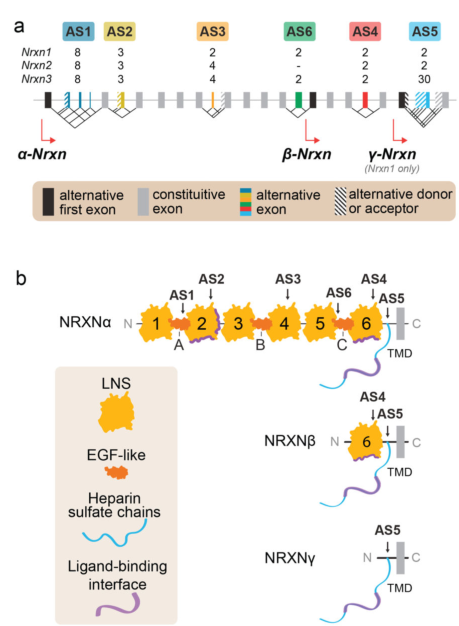
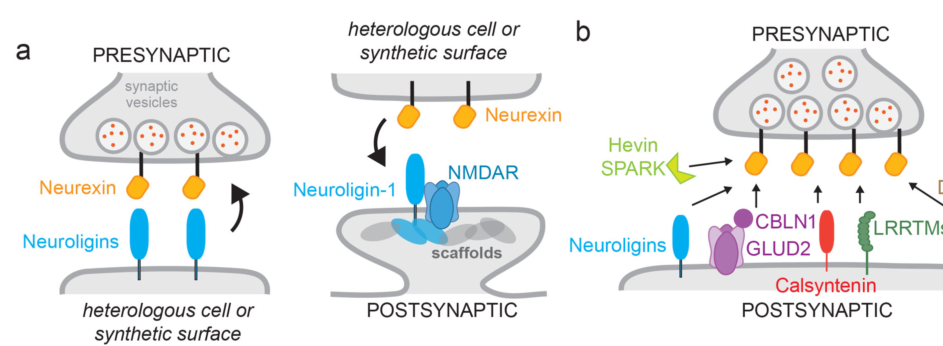

## Question

# Gene Research for Functional Annotation

## ⚠️ CRITICAL: Gene/Protein Identification Context

**BEFORE YOU BEGIN RESEARCH:** You MUST verify you are researching the CORRECT gene/protein. Gene symbols can be ambiguous, especially for less well-characterized genes from non-model organisms.

### Target Gene/Protein Identity (from UniProt):
- **UniProt Accession:** P58400
- **Protein Description:** RecName: Full=Neurexin-1-beta {ECO:0000305}; AltName: Full=Neurexin I-beta; Flags: Precursor;
- **Gene Information:** Name=NRXN1 {ECO:0000312|HGNC:HGNC:8008};
- **Organism (full):** Homo sapiens (Human).
- **Protein Family:** Belongs to the neurexin family. .
- **Key Domains:** ConA-like_dom_sf. (IPR013320); Laminin_G. (IPR001791); Neurexin-like. (IPR003585); Neurexin-related_CASP. (IPR050372); Syndecan/Neurexin_dom. (IPR027789)

### MANDATORY VERIFICATION STEPS:

1. **Check if the gene symbol "NRXN1" matches the protein description above**
2. **Verify the organism is correct:** Homo sapiens (Human).
3. **Check if protein family/domains align with what you find in literature**
4. **If you find literature for a DIFFERENT gene with the same or similar symbol, STOP**

### If Gene Symbol is Ambiguous or You Cannot Find Relevant Literature:

**DO NOT PROCEED WITH RESEARCH ON A DIFFERENT GENE.** Instead:
- State clearly: "The gene symbol 'NRXN1' is ambiguous or literature is limited for this specific protein"
- Explain what you found (e.g., "Found extensive literature on a different gene with the same symbol in a different organism")
- Describe the protein based ONLY on the UniProt information provided above
- Suggest that the protein function can be inferred from domain/family information

### Research Target:

Please provide a comprehensive research report on the gene **NRXN1** (gene ID: NRXN1, UniProt: P58400) in human.

The research report should be a detailed narrative explaining the function, biological processes, and localization of the gene product. Citations should be given for all claims.

You should prioritize authoritative reviews and primary scientific literature when conducting research. You can supplement
this with annotations you find in gene/protein databases, but these can be outdated or inaccurate.

We are specifically interested in the primary function of the gene - for enzymes, what reaction is catalyzed, and what is the substrate specificity? For transporters, what is the substrate? For structural proteins or adapters, what is the broader structural role? For signaling molecules, what is the role in the pathway.

We are interested in where in or outside the cell the gene product carries out its function.

We are also interested in the signaling or biochemical pathways in which the gene functions. We are less interested in broad pleiotropic effects, except where these elucidate the precise role.

Include evidence where possible. We are interested in both experimental evidence as well as inference from structure, evolution, or bioinformatic analysis. Precise studies should be prioritized over high-throughput, where available.

## Output

Question: You are an expert researcher providing comprehensive, well-cited information.

Provide detailed information focusing on:
1. Key concepts and definitions with current understanding
2. Recent developments and latest research (prioritize 2023-2024 sources)
3. Current applications and real-world implementations
4. Expert opinions and analysis from authoritative sources
5. Relevant statistics and data from recent studies

Format as a comprehensive research report with proper citations. Include URLs and publication dates where available.
Always prioritize recent, authoritative sources and provide specific citations for all major claims.

# Gene Research for Functional Annotation

## ⚠️ CRITICAL: Gene/Protein Identification Context

**BEFORE YOU BEGIN RESEARCH:** You MUST verify you are researching the CORRECT gene/protein. Gene symbols can be ambiguous, especially for less well-characterized genes from non-model organisms.

### Target Gene/Protein Identity (from UniProt):
- **UniProt Accession:** P58400
- **Protein Description:** RecName: Full=Neurexin-1-beta {ECO:0000305}; AltName: Full=Neurexin I-beta; Flags: Precursor;
- **Gene Information:** Name=NRXN1 {ECO:0000312|HGNC:HGNC:8008};
- **Organism (full):** Homo sapiens (Human).
- **Protein Family:** Belongs to the neurexin family. .
- **Key Domains:** ConA-like_dom_sf. (IPR013320); Laminin_G. (IPR001791); Neurexin-like. (IPR003585); Neurexin-related_CASP. (IPR050372); Syndecan/Neurexin_dom. (IPR027789)

### MANDATORY VERIFICATION STEPS:

1. **Check if the gene symbol "NRXN1" matches the protein description above**
2. **Verify the organism is correct:** Homo sapiens (Human).
3. **Check if protein family/domains align with what you find in literature**
4. **If you find literature for a DIFFERENT gene with the same or similar symbol, STOP**

### If Gene Symbol is Ambiguous or You Cannot Find Relevant Literature:

**DO NOT PROCEED WITH RESEARCH ON A DIFFERENT GENE.** Instead:
- State clearly: "The gene symbol 'NRXN1' is ambiguous or literature is limited for this specific protein"
- Explain what you found (e.g., "Found extensive literature on a different gene with the same symbol in a different organism")
- Describe the protein based ONLY on the UniProt information provided above
- Suggest that the protein function can be inferred from domain/family information

### Research Target:

Please provide a comprehensive research report on the gene **NRXN1** (gene ID: NRXN1, UniProt: P58400) in human.

The research report should be a detailed narrative explaining the function, biological processes, and localization of the gene product. Citations should be given for all claims.

You should prioritize authoritative reviews and primary scientific literature when conducting research. You can supplement
this with annotations you find in gene/protein databases, but these can be outdated or inaccurate.

We are specifically interested in the primary function of the gene - for enzymes, what reaction is catalyzed, and what is the substrate specificity? For transporters, what is the substrate? For structural proteins or adapters, what is the broader structural role? For signaling molecules, what is the role in the pathway.

We are interested in where in or outside the cell the gene product carries out its function.

We are also interested in the signaling or biochemical pathways in which the gene functions. We are less interested in broad pleiotropic effects, except where these elucidate the precise role.

Include evidence where possible. We are interested in both experimental evidence as well as inference from structure, evolution, or bioinformatic analysis. Precise studies should be prioritized over high-throughput, where available.

# Comprehensive Research Report: NRXN1 (Neurexin-1-beta, UniProt P58400)

## Gene Identity Verification

The gene NRXN1 encodes neurexin-1-beta (UniProt accession P58400), a presynaptic cell-adhesion molecule belonging to the neurexin family in humans (Homo sapiens) (gomez2021neurexinsmolecularcodes pages 4-6). The protein contains key domains consistent with UniProt annotations, including laminin-neurexin-sex hormone-binding globulin (LNS) domains and syndecan/neurexin domains, confirming correct gene identification (gomez2021neurexinsmolecularcodes pages 4-6, gomez2021neurexinsmolecularcodes media 66c249b1).

## Structural Organization and Isoform Diversity

### Beta-Neurexin Architecture

The NRXN1 gene produces multiple isoforms through alternative promoter usage. Neurexin-1-beta (NRXN1β, P58400) is the shorter isoform generated from a downstream promoter, comprising approximately 450 amino acids (zuo2025modulatingneurexin1boosts pages 20-25, gomez2021neurexinsmolecularcodes pages 2-4). This contrasts with the longer neurexin-1-alpha (NRXN1α) isoform of approximately 1,500 amino acids transcribed from an upstream promoter (zuo2025modulatingneurexin1boosts pages 20-25, liu2026rolesofnrxn1 pages 2-3).

Structurally, NRXN1β consists of a unique short N-terminal extracellular sequence followed by a single laminin-neurexin-sex hormone-binding globulin (LNS) domain—the sixth LNS domain (LNS6) shared with alpha-neurexin (ariasaragon2025analysisofneurexinneuroligin pages 1-2, gomez2021neurexinsmolecularcodes pages 4-6, gomez2021neurexinsmolecularcodes media 66c249b1). This extracellular region is connected to a heavily O-glycosylated stalk region that carries heparan sulfate glycan chains, which contribute functionally to ligand interactions (gomez2021neurexinsmolecularcodes pages 4-6, zuo2025modulatingneurexin1boosts pages 20-25). The structure is completed by a single transmembrane domain and a short cytoplasmic tail containing a C-terminal PDZ-binding motif that mediates intracellular protein interactions (gomez2021neurexinsmolecularcodes pages 4-6, cuttler2021emergingevidenceimplicating pages 2-3).

In contrast, NRXN1α possesses an extensive extracellular domain containing six LNS domains interspersed with three epidermal growth factor (EGF)-like domains, followed by the shared glycosylated stalk, transmembrane domain, and cytoplasmic tail (gomez2021neurexinsmolecularcodes pages 4-6, cuttler2021emergingevidenceimplicating pages 3-3, zuo2025modulatingneurexin1boosts pages 20-25). The simplified architecture of NRXN1β provides a more compact adhesion module while retaining critical ligand-binding surfaces (gomez2021neurexinsmolecularcodes media 66c249b1, gomez2021neurexinsmolecularcodes media f9a3bb40, gomez2021neurexinsmolecularcodes media f370b110).

| Isoform | Approximate size | Extracellular domain structure | Alternative-splicing sites | Major binding partners | Primary synaptic functions |
|---|---:|---|---|---|---|
| **NRXN1α (neurexin-1-alpha)** | ~1,500 aa | Large ectodomain containing **six LNS domains (LNS1–LNS6)** and **three interspersed EGF-like domains**; followed by an O-glycosylated, heparan-sulfate-modified stalk, one transmembrane helix, and a short cytoplasmic tail with a C-terminal PDZ-binding motif. (gomez2021neurexinsmolecularcodes pages 4-6, zuo2025modulatingneurexin1boosts pages 20-25) | Contains the full set of **AS1–AS6** variable segments; AS4 within LNS6 is a major ligand-selectivity switch. (ariasaragon2025analysisofneurexinneuroligin pages 1-2, liu2026rolesofnrxn1 pages 3-4) | Neuroligins, cerebellins, neurexophilins, dystroglycan, latrophilins, LRRTMs and other splice-dependent ligands; intracellular tail associates with CASK, Mints and other presynaptic scaffolds. Exact interactions depend on splice state and glycosylation. (gomez2021neurexinsmolecularcodes pages 4-6, boxer2022neurexinsandtheir pages 8-9) | Organizes trans-synaptic complexes and presynaptic release machinery; supports Ca²⁺-coupled vesicle exocytosis, synaptic transmission, and development or maintenance of excitatory and inhibitory synapses. (liu2026rolesofnrxn1 pages 2-3, zuo2025modulatingneurexin1boosts pages 14-20) |
| **NRXN1β / P58400 (neurexin-1-beta)** | ~450 aa | Short β-specific N terminus followed by only the **shared LNS6 domain**; lacks α-NRXN1’s five upstream LNS and three EGF-like domains. Retains the common glycosylated/heparan-sulfate-modified stalk, transmembrane helix, and PDZ-binding cytoplasmic tail. (gomez2021neurexinsmolecularcodes pages 4-6, zuo2025modulatingneurexin1boosts pages 20-25, gomez2021neurexinsmolecularcodes media 66c249b1) | Retains **AS4 and AS5** in the shared C-terminal region. AS4 inclusion generally favors cerebellin complexes, whereas AS4 exclusion favors LRRTMs, dystroglycan and latrophilins and often strengthens neuroligin recruitment. (ariasaragon2025analysisofneurexinneuroligin pages 1-2, liu2026rolesofnrxn1 pages 3-4, gomez2021neurexinsmolecularcodes pages 7-9) | Directly binds neuroligins through LNS6, including NLGN1 and NLGN2; also engages LRRTM1/2, cerebellins, dystroglycan, latrophilins and GABA\(_A\) receptors in splice- and context-dependent combinations. Its cytoplasmic tail recruits CASK and related presynaptic scaffolds. (gomez2021neurexinsmolecularcodes pages 4-6, ariasaragon2025analysisofneurexinneuroligin pages 1-2, zuo2025modulatingneurexin1boosts pages 20-25) | Acts as a compact presynaptic adhesion and synapse-organizing receptor. It recruits or stabilizes postsynaptic specializations, participates in excitatory and inhibitory synaptic specification, and links extracellular recognition to intracellular active-zone organization; NRXN1β-dependent postsynaptic differentiation has been associated with PI3K–AKT signaling. (liu2026rolesofnrxn1 pages 3-4, ariasaragon2025analysisofneurexinneuroligin pages 1-2) |

*Table: Comparison of the two principal promoter-derived NRXN1 isoforms, emphasizing their domain architecture, splice-dependent ligand repertoires, and synaptic roles. P58400 corresponds specifically to the shorter human NRXN1β protein.*

### Alternative Splicing Regulation

Both NRXN1 isoforms undergo extensive alternative splicing at up to six splice sites (SS1–SS6), with NRXN1β retaining splice sites SS4 and SS5 in its shared C-terminal region (ariasaragon2025analysisofneurexinneuroligin pages 1-2, liu2026rolesofnrxn1 pages 3-4). Alternative splicing at splice site 4 (SS4) is particularly critical for determining ligand-binding specificity and synaptic function (liu2026rolesofnrxn1 pages 3-4, yoo2026alternativesplicingplasticity pages 1-5, gomez2021neurexinsmolecularcodes pages 6-7).

SS4 encodes approximately 30 amino acids within the LNS6 domain that dramatically alter neurexin's ligand affinities (gomez2021neurexinsmolecularcodes pages 7-9). Inclusion of SS4 (SS4+ isoforms) preferentially promotes binding to cerebellins (CBLN1, CBLN2, CBLN4) and formation of tripartite NRXN1–cerebellin–GluD1/2 complexes, which enhance NMDA receptor-dependent postsynaptic currents by approximately 60% (liu2026rolesofnrxn1 pages 3-4, zuo2025modulatingneurexin1boosts pages 33-37). Conversely, exclusion of SS4 (SS4− isoforms) favors interactions with leucine-rich repeat transmembrane proteins (LRRTMs), dystroglycans, latrophilins, and generally strengthens neuroligin recruitment (liu2026rolesofnrxn1 pages 3-4, zuo2025modulatingneurexin1boosts pages 33-37, zuo2025modulatingneurexin1boosts pages 29-33).

Recent evidence demonstrates that SS4 splicing is plastic and activity-dependent. In human and mouse sensory neurons, neuronal depolarization shifts NRXN1 transcripts toward SS4-excluded forms, while central axotomy reduces SS4 inclusion (yoo2026alternativesplicingplasticity pages 1-5, yoo2026alternativesplicingplasticity pages 13-16). This splicing regulation is mediated primarily by STAR-family RNA-binding proteins (SAM68, SLM1, SLM2) that bind intronic sequences flanking the SS4 exon and promote its skipping (gomez2021neurexinsmolecularcodes pages 6-7, gomez2021neurexinsmolecularcodes pages 7-9). Cell-type-specific expression of these splicing regulators generates distinct neurexin isoform repertoires across neuronal populations: hippocampal excitatory neurons predominantly express SS4− isoforms, whereas parvalbumin-positive interneurons show higher SS4 inclusion (gomez2021neurexinsmolecularcodes pages 6-7).

## Primary Molecular Function

### Presynaptic Cell Adhesion and Trans-synaptic Organization

NRXN1β functions as a presynaptic cell-adhesion and synaptic organizing molecule rather than as an enzyme with catalytic activity (zuo2025modulatingneurexin1boosts pages 20-25, liu2026rolesofnrxn1 pages 3-4, alhesain2025exploringexpressionof pages 167-171). Its primary molecular role is to mediate trans-synaptic interactions that organize and stabilize both presynaptic and postsynaptic molecular assemblies (zuo2025modulatingneurexin1boosts pages 20-25, gomez2021neurexinsmolecularcodes pages 4-6).

### Major Binding Partners

The extracellular LNS6 domain of NRXN1β presents a calcium-dependent binding surface that engages multiple postsynaptic ligands with nanomolar affinity (gomez2021neurexinsmolecularcodes pages 4-6). A distinguishing feature of beta-neurexin is that it can bind all neuroligins, including neuroligin-1 (NLGN1), the major excitatory synapse neuroligin—an interaction not available to alpha-neurexin isoforms (zuo2025modulatingneurexin1boosts pages 20-25, gomez2021neurexinsmolecularcodes pages 4-6). This makes NRXN1β particularly important for glutamatergic excitatory synapse organization (alhesain2025exploringexpressionof pages 167-171).

Key postsynaptic binding partners include:

**Neuroligins (NLGN1-4):** NRXN1β forms high-affinity trans-synaptic complexes with postsynaptic neuroligins through both LNS6 protein-domain recognition and cooperative engagement with heparan sulfate carbohydrate chains (gomez2021neurexinsmolecularcodes pages 4-6). Beta-neurexin-1 can be recruited to synaptic contacts by glutamatergic NLGN1 and GABAergic NLGN2, with alternative splicing at SS4 modulating these interactions (ariasaragon2025analysisofneurexinneuroligin pages 1-2, bruno2023impairedexcitatoryand pages 17-20, alhesain2025exploringexpressionof pages 167-171).

**LRRTMs (leucine-rich repeat transmembrane proteins):** LRRTM1 and LRRTM2 bind the same LNS6 interface as neuroligins in an SS4-dependent manner, with SS4− variants showing preferential interaction (gomez2021neurexinsmolecularcodes pages 4-6, zuo2025modulatingneurexin1boosts pages 33-37). These complexes promote presynaptic differentiation, AMPA receptor organization, and long-term potentiation (zuo2025modulatingneurexin1boosts pages 33-37, zuo2025modulatingneurexin1boosts pages 29-33, gomez2021neurexinsmolecularcodes pages 7-9).

**Cerebellins:** Secreted cerebellin proteins (CBLN1, CBLN2, CBLN4) preferentially bind SS4+ NRXN1 isoforms and bridge neurexins to postsynaptic glutamate receptor delta (GluD) proteins, forming tripartite complexes essential for certain synapse types (liu2026rolesofnrxn1 pages 3-4, zuo2025modulatingneurexin1boosts pages 20-25).

**Other ligands:** NRXN1β also interacts with dystroglycans, latrophilins/CIRLs (adhesion GPCRs), and GABA-A receptors, with splice-dependent selectivity (liu2026rolesofnrxn1 pages 3-4, liu2026rolesofnrxn1 pages 2-3).

Recent groundbreaking research (2026) identified that neurexins exist within higher-order ternary complexes at synapses. NRXN1 forms stable presynaptic core modules with tetraspanin proteins (T178A/B) and LAR-type receptor protein-tyrosine phosphatases (PTPRs including PTPσ and PTPδ), which assemble during biogenesis in the endoplasmic reticulum through transmembrane domain interactions (thivaios2026ternaryneurexint178ptprcomplexes pages 5-6). These ternary neurexin-T178-PTPR complexes can reach molecular masses up to 1.2 MDa and recruit stable trans-synaptic protein networks, thereby interlinking presynaptic active zone machinery with postsynaptic neurotransmitter receptors (thivaios2026ternaryneurexint178ptprcomplexes pages 5-6).

### Intracellular Interactions

The cytoplasmic C-terminal PDZ-binding motif of NRXN1β recruits presynaptic scaffolding proteins including CASK, Mints/X11 proteins, spinophilin, syntenin, and protein 4.1 (liu2026rolesofnrxn1 pages 3-4, boxer2022neurexinsandtheir pages 8-9, zuo2025modulatingneurexin1boosts pages 14-20). These interactions couple trans-synaptic adhesion to the presynaptic active zone organization, synaptic vesicle positioning, calcium channel clustering, and the neurotransmitter release machinery (liu2026rolesofnrxn1 pages 3-4).

| Binding partner | Partner type / location | NRXN1β binding determinant | Splice dependence | Functional consequence |
|---|---|---|---|---|
| **Neuroligin-1 (NLGN1)** | Postsynaptic transmembrane adhesion protein at excitatory synapses | Extracellular LNS6 domain and juxtamembrane heparan-sulfate glycan; calcium-dependent interface | **SS4− preferred**; SS4 insertion reduces affinity and transcellular recruitment | Forms a trans-synaptic bridge that recruits and organizes excitatory postsynaptic machinery; β-NRXN1 is robustly recruited by NLGN1 (gomez2021neurexinsmolecularcodes pages 4-6, ariasaragon2025analysisofneurexinneuroligin pages 1-2) |
| **Neuroligin-2 (NLGN2)** | Postsynaptic transmembrane adhesion protein at inhibitory synapses | Extracellular LNS6 domain; heparan sulfate contributes to complex assembly | SS4 insertion generally weakens β-NRXN1–neuroligin recruitment; the effect also depends on neuroligin splice form | Recruits β-NRXN1 across opposing membranes and helps organize GABAergic synaptic specializations (alhesain2025exploringexpressionof pages 196-199, ariasaragon2025analysisofneurexinneuroligin pages 1-2, zuo2025modulatingneurexin1boosts pages 20-25) |
| **Neuroligins 3 and 4 (NLGN3/4)** | Postsynaptic transmembrane adhesion proteins at context-dependent excitatory or inhibitory synapses | Extracellular LNS6 and heparan-sulfate-associated binding surface | Modulated by NRXN1 SS4 and neuroligin splice composition | Expands the repertoire of neurexin–neuroligin complexes that specify synaptic properties; precise NRXN1β effects are context dependent (gomez2021neurexinsmolecularcodes pages 4-6, liu2026rolesofnrxn1 pages 3-4) |
| **LRRTM1 and LRRTM2** | Postsynaptic leucine-rich-repeat transmembrane proteins, principally at excitatory synapses | LNS6 surface plus the neurexin heparan-sulfate chain | **SS4− preferred** | Promote trans-synaptic adhesion, presynaptic differentiation, AMPA-receptor organization, excitatory transmission, and plasticity (gomez2021neurexinsmolecularcodes pages 4-6, zuo2025modulatingneurexin1boosts pages 33-37, gomez2021neurexinsmolecularcodes pages 7-9) |
| **LRRTM3 and LRRTM4** | Postsynaptic leucine-rich-repeat transmembrane proteins | Primarily the juxtamembrane heparan-sulfate glycan; less dependent on direct LNS6 engagement | Not defined as a simple SS4 switch; glycan recognition may permit broader isoform binding | Support glycan-dependent trans-synaptic assembly and excitatory-synapse organization (gomez2021neurexinsmolecularcodes pages 4-6) |
| **Cerebellins (CBLN1, CBLN2, CBLN4)** | Secreted extracellular adaptors bridging neurexins to postsynaptic GluD receptors | Extracellular LNS6 domain containing SS4 | **SS4+ preferred** | Form tripartite NRXN1–CBLN–GluD1/2 complexes that specify synapses, promote presynaptic differentiation, and can enhance NMDAR-dependent currents (liu2026rolesofnrxn1 pages 3-4, gomez2021neurexinsmolecularcodes pages 7-9) |
| **Dystroglycan** | Postsynaptic or extracellular-matrix-associated cell-surface receptor | Extracellular LNS6 region; precise β-NRXN1 contact residues remain unresolved | **SS4− preferred** | Provides an alternative trans-synaptic or matrix-linked adhesion pathway contributing to synapse-specific organization (liu2026rolesofnrxn1 pages 3-4, yoo2026alternativesplicingplasticity pages 13-16) |
| **Latrophilins / CIRLs** | Postsynaptic adhesion G-protein-coupled receptors | Extracellular LNS6-containing region; β-isoform-specific determinants remain incompletely defined | **SS4− preferred** | Couples NRXN1 recognition to adhesion-GPCR complexes involved in synapse formation, specification, and maintenance (liu2026rolesofnrxn1 pages 3-4, yoo2026alternativesplicingplasticity pages 13-16) |
| **GABA-A receptors** | Postsynaptic inhibitory neurotransmitter receptors | Extracellular NRXN1 region; a precise β-NRXN1 domain has not been firmly established | Not established | Direct or complex-mediated association can regulate inhibitory transmission and excitatory–inhibitory circuit balance (liu2026rolesofnrxn1 pages 2-3, boxer2022neurexinsandtheir pages 8-9, zuo2025modulatingneurexin1boosts pages 20-25) |
| **PTPσ and PTPδ** | Presynaptic LAR-family receptor protein-tyrosine phosphatases | Predominantly the NRXN1 heparan-sulfate chain; complexes may also be stabilized by membrane-associated assemblies | Not primarily assigned to SS4; **heparan-sulfate dependent** | Cooperate with neurexin- and LRRTM-associated complexes to promote presynaptic differentiation and organize release-related assemblies (zuo2025modulatingneurexin1boosts pages 20-25) |
| **CASK** | Intracellular presynaptic MAGUK scaffold | Cytoplasmic C-terminal PDZ-binding motif | Independent of extracellular SS4 choice | Links NRXN1β to presynaptic scaffolds and active-zone machinery, supporting protein stabilization, vesicle positioning, and exocytosis (liu2026rolesofnrxn1 pages 3-4, boxer2022neurexinsandtheir pages 8-9) |
| **Mints / X11 proteins** | Intracellular presynaptic adaptor proteins | Cytoplasmic C-terminal region and associated scaffold complexes | Independent of SS4 | Couple neurexin complexes to Munc18-related vesicle-release machinery and help position exocytotic components near release sites (boxer2022neurexinsandtheir pages 8-9, zuo2025modulatingneurexin1boosts pages 14-20) |
| **Syntenin and spinophilin** | Intracellular PDZ-domain or scaffolding proteins | Cytoplasmic C-terminal PDZ-binding region | Independent of SS4 | Connect NRXN1 to presynaptic scaffolding, cytoskeletal organization, vesicle stabilization, and release-site architecture (liu2026rolesofnrxn1 pages 3-4, boxer2022neurexinsandtheir pages 8-9) |
| **Protein 4.1 and related FERM adaptors** | Intracellular membrane–cytoskeleton adaptors | Membrane-proximal cytoplasmic tail | Independent of SS4 | Couple trans-synaptic NRXN1 complexes to the presynaptic actin cytoskeleton and support active-zone organization (zuo2025modulatingneurexin1boosts pages 14-20) |

*Table: Major extracellular, trans-synaptic, and intracellular partners of human NRXN1β, with their binding determinants, splice dependence, and functional outcomes. The table highlights SS4 as a ligand-selection switch and distinguishes it from glycan- and cytoplasmic-tail-dependent interactions.*

## Subcellular Localization

NRXN1β localizes to the presynaptic plasma membrane and synaptic terminals of neurons (alhesain2025exploringexpressionof pages 167-171, cuttler2021emergingevidenceimplicating pages 3-3, zuo2025modulatingneurexin1boosts pages 20-25). As a transmembrane protein, its extracellular domain extends into the synaptic cleft where it mediates trans-synaptic interactions with postsynaptic partners, while its intracellular tail associates with presynaptic active zone proteins and cytoskeletal elements (zuo2025modulatingneurexin1boosts pages 20-25, liu2026rolesofnrxn1 pages 3-4, liu2026rolesofnrxn1 pages 2-3).

NRXN1β is distributed at both excitatory glutamatergic and inhibitory GABAergic synapses (cuttler2021emergingevidenceimplicating pages 3-3, alhesain2025exploringexpressionof pages 167-171), with isoform-specific preferences: beta-neurexin shows particular enrichment at excitatory synapses through its robust interactions with NLGN1 and LRRTMs (alhesain2025exploringexpressionof pages 167-171). The protein is also present in neuronal growth cones during development (alhesain2025exploringexpressionof pages 167-171, alhesain2025exploringexpressionof pages 196-199).

Super-resolution imaging studies reveal that neurexins organize into nanoscale subsynaptic densities (SSDs) or nanoclusters at presynaptic active zones (gomez2021neurexinsmolecularcodes media 66c249b1, gomez2021neurexinsmolecularcodes media f9a3bb40). Importantly, neurexin-1 and neurexin-3 form discrete, non-overlapping SSDs that are spatially organized opposite their specific postsynaptic ligands, suggesting that individual neurexin paralogs signal in parallel to govern different synaptic properties through nanoscale molecular organization (gomez2021neurexinsmolecularcodes media 66c249b1, gomez2021neurexinsmolecularcodes media d3c49d71, gomez2021neurexinsmolecularcodes media 91ffd6b3).

## Signaling Pathways and Biological Processes

### Synaptogenesis and Synaptic Maturation

NRXN1β plays essential roles in synapse formation, maturation, and maintenance (liu2026rolesofnrxn1 pages 4-6, liu2026rolesofnrxn1 pages 1-2). Through trans-synaptic interactions with neuroligins, LRRTMs, and cerebellins, NRXN1 helps specify, assemble, and stabilize presynaptic and postsynaptic structures (liu2026rolesofnrxn1 pages 4-6, liu2026rolesofnrxn1 pages 3-4). When expressed in non-neuronal cells, neurexin can induce postsynaptic differentiation in contacting neurons, demonstrating its synaptogenic capacity (bruno2023impairedexcitatoryand pages 17-20, honkanen2026synapticcelladhesion pages 15-17).

NRXN1β-dependent postsynaptic development requires activation of the phosphatidylinositol 3-kinase (PI3K)/AKT signaling pathway (liu2026rolesofnrxn1 pages 3-4, liu2026rolesofnrxn1 pages 2-3). Disruption of this cascade reduces excitatory miniature synaptic current frequency, indicating impaired synaptic maturation (liu2026rolesofnrxn1 pages 3-4).

Recent studies (2024-2025) demonstrate that NRXN1 impacts early cortical development and dendritic morphology. Human induced pluripotent stem cell (hiPSC) studies show that intragenic NRXN1 deletions alter isoform expression dynamics during neurodevelopment, with two expression peaks post-neuronal induction and NRXN1β being most highly expressed (liu2026rolesofnrxn1 pages 4-6). These alterations correlate with changes in dendrite outgrowth and gene expression profiles related to synaptic function, indicating that NRXN1 isoforms shape dendritic architecture (liu2026rolesofnrxn1 pages 4-6).

### Synaptic Transmission and Neurotransmitter Release

NRXN1 is critical for synaptic transmission and neurotransmitter release (liu2026rolesofnrxn1 pages 2-3, liu2026rolesofnrxn1 pages 3-4, zuo2025modulatingneurexin1boosts pages 14-20). The protein couples presynaptic calcium channels to the synaptic vesicle exocytosis machinery, supporting calcium-triggered neurotransmitter release (liu2026rolesofnrxn1 pages 2-3, alhesain2025exploringexpressionof pages 167-171). Through interactions with CASK and Mint proteins, NRXN1 brings Munc18 and related components near vesicle release sites, organizing the molecular machinery for vesicle docking, priming, and fusion (zuo2025modulatingneurexin1boosts pages 14-20).

NRXN1 also clusters voltage-gated calcium channels at presynaptic active zones, positioning calcium entry to promote efficient neurotransmitter release (zuo2025modulatingneurexin1boosts pages 14-20, liu2026rolesofnrxn1 pages 3-4). Loss or depletion of NRXN1α specifically reduces neurotransmitter release and neuronal firing, and combined deletion of all alpha-neurexins causes severe impairment of neurotransmitter release and perinatal lethality (liu2026rolesofnrxn1 pages 2-3, bruno2023impairedexcitatoryand pages 17-20).

### Excitatory-Inhibitory Balance

A critical function of NRXN1 is regulating the balance between excitatory and inhibitory synaptic transmission (E-I balance) (liu2026rolesofnrxn1 pages 4-6, alhesain2025exploringexpressionof pages 167-171, liu2026rolesofnrxn1 pages 1-2). Different splice variants influence this balance in distinct ways: SS4+ variants form NRXN1–cerebellin–GluD complexes that enhance NMDA receptor-dependent currents, while SS4− variants support different receptor compositions and synaptic properties (liu2026rolesofnrxn1 pages 3-4, yoo2026alternativesplicingplasticity pages 13-16).

NRXN1β shows preferential association with glutamatergic excitatory postsynaptic partners through robust NLGN1 binding, while also participating in GABAergic inhibitory synapse organization via NLGN2 and direct GABA-A receptor interactions (alhesain2025exploringexpressionof pages 167-171). Alpha-neurexin isoforms, particularly NRXN1α, are especially important for inhibitory GABAergic synapse development, with triple alpha-neurexin knockout mice showing approximately 50% reduction in cortical GABAergic synapse density (alhesain2025exploringexpressionof pages 196-199, alhesain2025exploringexpressionof pages 167-171).

Recent evidence (2025) shows that the isoform-dependent E-I imbalance hypothesis may explain autism spectrum disorder phenotypes, as both elevated and decreased E-I ratios can occur depending on which NRXN1 isoforms are affected (liu2026rolesofnrxn1 pages 1-2).

### Synaptic Plasticity and Neural Circuit Function

NRXN1 contributes to synaptic plasticity, including activity-dependent changes in synaptic strength (liu2026rolesofnrxn1 pages 4-6, liu2026rolesofnrxn1 pages 6-7, gomez2021neurexinsmolecularcodes pages 10-12). Alternative splicing at SS4 affects AMPA and NMDA receptor surface expression and recruitment during long-term potentiation (LTP): constitutive SS4 inclusion reduces AMPA receptor abundance by increasing endocytosis and prevents AMPA receptor recruitment during NMDA receptor-dependent LTP (zuo2025modulatingneurexin1boosts pages 33-37, zuo2025modulatingneurexin1boosts pages 29-33).

Beyond individual synapses, NRXN1 influences neural network organization, neuronal circuit function, and behavior (gomez2021neurexinsmolecularcodes pages 10-12). The protein participates in processes including dendritic arborization, neuronal migration, and synaptic vesicle-cycle organization (liu2026rolesofnrxn1 pages 4-6, liu2026rolesofnrxn1 pages 6-7, alhesain2025exploringexpressionof pages 196-199). Loss of Nrxn1α in animal models affects behaviors linked to sensorimotor processing, learning, novelty responses, social interaction, and cognition (gomez2021neurexinsmolecularcodes pages 10-12).

## Recent Developments (2023-2026)

Recent research has yielded several important insights:

**Ternary presynaptic complexes (2026):** Groundbreaking work identified that neurexins form stable presynaptic core modules with tetraspanin T178 proteins and LAR-type PTPRs, assembling in the endoplasmic reticulum and recruiting stable trans-synaptic networks (thivaios2026ternaryneurexint178ptprcomplexes pages 5-6).

**Alternative splicing plasticity (2026):** Studies demonstrate that NRXN1 SS4 splicing is dynamic in human sensory neurons, responding to depolarization and injury, potentially contributing to somatosensory circuit plasticity and pain states (yoo2026alternativesplicingplasticity pages 1-5, yoo2026alternativesplicingplasticity pages 13-16).

**Isoform-specific mechanisms (2025):** Analysis of neurexin-neuroligin complexes reveals that beta-neurexin-1 can be recruited by both glutamatergic NLGN1 and GABAergic NLGN2, while alpha-neurexin-1 preferentially partners with NLGN2, supporting distinct synaptic organization mechanisms (ariasaragon2025analysisofneurexinneuroligin pages 1-2).

**Neurodevelopmental impact (2024):** hiPSC studies show that even intragenic NRXN1 deletions (previously considered benign) affect isoform expression dynamics during cortical neurodevelopment and alter dendritic morphology, demonstrating broader roles for NRXN1 regulation than previously appreciated (liu2026rolesofnrxn1 pages 4-6).

**Modulation of glutamatergic transmission (2025):** Research demonstrates that modulating neurexin-1 can boost glutamatergic transmission, with therapeutic implications for conditions involving neurexin deficiency (zuo2025modulatingneurexin1boosts pages 20-25, zuo2025modulatingneurexin1boosts pages 14-20).

## Disease Relevance

NRXN1 mutations and deletions are strongly associated with neurodevelopmental and neuropsychiatric disorders, including autism spectrum disorder, schizophrenia, intellectual disability, attention-deficit hyperactivity disorder, and epilepsy (liu2026rolesofnrxn1 pages 1-2, liu2026rolesofnrxn1 pages 6-7, bruno2023impairedexcitatoryand pages 17-20). The protein's role in establishing and maintaining E-I balance, synaptic transmission, and neural circuit organization makes it a critical determinant of normal brain function (liu2026rolesofnrxn1 pages 4-6, liu2026rolesofnrxn1 pages 1-2).

## Summary

NRXN1β (P58400) is a presynaptic cell-adhesion molecule that functions as a master organizer of synaptic structure and function in human neurons. Through its extracellular LNS6 domain and heparan sulfate modifications, it engages a diverse repertoire of postsynaptic ligands—particularly neuroligins and LRRTMs at excitatory synapses—to form trans-synaptic bridges that specify and stabilize synaptic connections. Its intracellular PDZ-binding motif couples these adhesion events to presynaptic active zone organization and neurotransmitter release machinery. Extensive alternative splicing, particularly at SS4, provides dynamic, activity-dependent regulation of ligand selectivity, synaptic properties, and neural circuit organization. Recent discoveries reveal that NRXN1 functions within higher-order ternary complexes and that its isoform composition profoundly influences neurodevelopment, synaptic transmission, and excitatory-inhibitory balance, with disruptions leading to major neuropsychiatric disorders.

References

1. (gomez2021neurexinsmolecularcodes pages 4-6): Andrea M. Gomez, Lisa Traunmüller, and Peter Scheiffele. Neurexins: molecular codes for shaping neuronal synapses. Nature Reviews Neuroscience, 22:137-151, Jan 2021. URL: https://doi.org/10.1038/s41583-020-00415-7, doi:10.1038/s41583-020-00415-7. This article has 276 citations and is from a highest quality peer-reviewed journal.

2. (gomez2021neurexinsmolecularcodes media 66c249b1): Andrea M. Gomez, Lisa Traunmüller, and Peter Scheiffele. Neurexins: molecular codes for shaping neuronal synapses. Nature Reviews Neuroscience, 22:137-151, Jan 2021. URL: https://doi.org/10.1038/s41583-020-00415-7, doi:10.1038/s41583-020-00415-7. This article has 276 citations and is from a highest quality peer-reviewed journal.

3. (zuo2025modulatingneurexin1boosts pages 20-25): Long Zuo. Modulating neurexin-1 boosts glutamatergic transmission. Text, Jan 2025. URL: https://doi.org/10.14288/1.0423915, doi:10.14288/1.0423915. This article has 0 citations and is from a peer-reviewed journal.

4. (gomez2021neurexinsmolecularcodes pages 2-4): Andrea M. Gomez, Lisa Traunmüller, and Peter Scheiffele. Neurexins: molecular codes for shaping neuronal synapses. Nature Reviews Neuroscience, 22:137-151, Jan 2021. URL: https://doi.org/10.1038/s41583-020-00415-7, doi:10.1038/s41583-020-00415-7. This article has 276 citations and is from a highest quality peer-reviewed journal.

5. (liu2026rolesofnrxn1 pages 2-3): Jia-Xiang Liu, Yanxuan Zhang, Ruijia Jin, Yuxin Zhu, and Jian-Ru Chen. Roles of nrxn1 in neuropsychiatric disorders: from genetic lesion to molecular mechanism. Frontiers in Neuroscience, May 2026. URL: https://doi.org/10.3389/fnins.2026.1808921, doi:10.3389/fnins.2026.1808921. This article has 1 citations and is from a peer-reviewed journal.

6. (ariasaragon2025analysisofneurexinneuroligin pages 1-2): Francisco Arias-Aragón, Estefanía Robles-Lanuza, Ángela Sánchez-Gómez, Amalia Martinez-Mir, and Francisco G. Scholl. Analysis of neurexin-neuroligin complexes supports an isoform-specific role for beta-neurexin-1 dysfunction in a mouse model of autism. Molecular Brain, Mar 2025. URL: https://doi.org/10.1186/s13041-025-01183-0, doi:10.1186/s13041-025-01183-0. This article has 12 citations and is from a peer-reviewed journal.

7. (cuttler2021emergingevidenceimplicating pages 2-3): Katelyn Cuttler, Maryam Hassan, Jonathan Carr, Ruben Cloete, and Soraya Bardien. Emerging evidence implicating a role for neurexins in neurodegenerative and neuropsychiatric disorders. Open Biology, Oct 2021. URL: https://doi.org/10.1098/rsob.210091, doi:10.1098/rsob.210091. This article has 68 citations and is from a peer-reviewed journal.

8. (cuttler2021emergingevidenceimplicating pages 3-3): Katelyn Cuttler, Maryam Hassan, Jonathan Carr, Ruben Cloete, and Soraya Bardien. Emerging evidence implicating a role for neurexins in neurodegenerative and neuropsychiatric disorders. Open Biology, Oct 2021. URL: https://doi.org/10.1098/rsob.210091, doi:10.1098/rsob.210091. This article has 68 citations and is from a peer-reviewed journal.

9. (gomez2021neurexinsmolecularcodes media f9a3bb40): Andrea M. Gomez, Lisa Traunmüller, and Peter Scheiffele. Neurexins: molecular codes for shaping neuronal synapses. Nature Reviews Neuroscience, 22:137-151, Jan 2021. URL: https://doi.org/10.1038/s41583-020-00415-7, doi:10.1038/s41583-020-00415-7. This article has 276 citations and is from a highest quality peer-reviewed journal.

10. (gomez2021neurexinsmolecularcodes media f370b110): Andrea M. Gomez, Lisa Traunmüller, and Peter Scheiffele. Neurexins: molecular codes for shaping neuronal synapses. Nature Reviews Neuroscience, 22:137-151, Jan 2021. URL: https://doi.org/10.1038/s41583-020-00415-7, doi:10.1038/s41583-020-00415-7. This article has 276 citations and is from a highest quality peer-reviewed journal.

11. (liu2026rolesofnrxn1 pages 3-4): Jia-Xiang Liu, Yanxuan Zhang, Ruijia Jin, Yuxin Zhu, and Jian-Ru Chen. Roles of nrxn1 in neuropsychiatric disorders: from genetic lesion to molecular mechanism. Frontiers in Neuroscience, May 2026. URL: https://doi.org/10.3389/fnins.2026.1808921, doi:10.3389/fnins.2026.1808921. This article has 1 citations and is from a peer-reviewed journal.

12. (boxer2022neurexinsandtheir pages 8-9): Emma E. Boxer and Jason Aoto. Neurexins and their ligands at inhibitory synapses. Frontiers in Synaptic Neuroscience, Dec 2022. URL: https://doi.org/10.3389/fnsyn.2022.1087238, doi:10.3389/fnsyn.2022.1087238. This article has 40 citations.

13. (zuo2025modulatingneurexin1boosts pages 14-20): Long Zuo. Modulating neurexin-1 boosts glutamatergic transmission. Text, Jan 2025. URL: https://doi.org/10.14288/1.0423915, doi:10.14288/1.0423915. This article has 0 citations and is from a peer-reviewed journal.

14. (gomez2021neurexinsmolecularcodes pages 7-9): Andrea M. Gomez, Lisa Traunmüller, and Peter Scheiffele. Neurexins: molecular codes for shaping neuronal synapses. Nature Reviews Neuroscience, 22:137-151, Jan 2021. URL: https://doi.org/10.1038/s41583-020-00415-7, doi:10.1038/s41583-020-00415-7. This article has 276 citations and is from a highest quality peer-reviewed journal.

15. (yoo2026alternativesplicingplasticity pages 1-5): Judy J. Yoo and Bryan A. Copits. Alternative splicing plasticity of the neurexin family of synaptic adhesion molecules in human sensory neurons. Sep 2026. URL: https://doi.org/10.64898/2026.09.02.748890, doi:10.64898/2026.09.02.748890. This article has 0 citations.

16. (gomez2021neurexinsmolecularcodes pages 6-7): Andrea M. Gomez, Lisa Traunmüller, and Peter Scheiffele. Neurexins: molecular codes for shaping neuronal synapses. Nature Reviews Neuroscience, 22:137-151, Jan 2021. URL: https://doi.org/10.1038/s41583-020-00415-7, doi:10.1038/s41583-020-00415-7. This article has 276 citations and is from a highest quality peer-reviewed journal.

17. (zuo2025modulatingneurexin1boosts pages 33-37): Long Zuo. Modulating neurexin-1 boosts glutamatergic transmission. Text, Jan 2025. URL: https://doi.org/10.14288/1.0423915, doi:10.14288/1.0423915. This article has 0 citations and is from a peer-reviewed journal.

18. (zuo2025modulatingneurexin1boosts pages 29-33): Long Zuo. Modulating neurexin-1 boosts glutamatergic transmission. Text, Jan 2025. URL: https://doi.org/10.14288/1.0423915, doi:10.14288/1.0423915. This article has 0 citations and is from a peer-reviewed journal.

19. (yoo2026alternativesplicingplasticity pages 13-16): Judy J. Yoo and Bryan A. Copits. Alternative splicing plasticity of the neurexin family of synaptic adhesion molecules in human sensory neurons. Sep 2026. URL: https://doi.org/10.64898/2026.09.02.748890, doi:10.64898/2026.09.02.748890. This article has 0 citations.

20. (alhesain2025exploringexpressionof pages 167-171): MA Alhesain. Exploring expression of neurodevelopmental susceptibility genes in the fetal human thalamus and other related structures. Unknown journal, 2025.

21. (bruno2023impairedexcitatoryand pages 17-20): MARTINA BRUNO. Impaired excitatory and inhibitory synaptic plasticity in the nlgn3 r451c mouse model of autism spectrum disorder. Apr 2023. URL: https://doi.org/10.15167/bruno-martina\_phd2023-04-26, doi:10.15167/bruno-martina\_phd2023-04-26. This article has 0 citations.

22. (thivaios2026ternaryneurexint178ptprcomplexes pages 5-6): Spyros Thivaios, Jochen Schwenk, Aline Brechet, Sami Boudkkazi, Nithya Sethumadhavan, Phil Henneken, Eriko Miura, Ayumi Hayashi, Maciej K. Kocylowski, Alexander Haupt, Debora Kaminski, Dietmar Schreiner, Agata Nowacka, Jean-Baptiste van den Broucke, Akos Kulik, Uwe Schulte, Fredrik H. Sterky, Michisuke Yuzaki, Peter Scheiffele, and Bernd Fakler. Ternary neurexin-t178-ptpr complexes represent a pre-synaptic core-module of neuronal synapse organization. Sep 2026. URL: https://doi.org/10.1038/s41467-026-77377-4, doi:10.1038/s41467-026-77377-4. This article has 2 citations and is from a highest quality peer-reviewed journal.

23. (alhesain2025exploringexpressionof pages 196-199): MA Alhesain. Exploring expression of neurodevelopmental susceptibility genes in the fetal human thalamus and other related structures. Unknown journal, 2025.

24. (gomez2021neurexinsmolecularcodes media d3c49d71): Andrea M. Gomez, Lisa Traunmüller, and Peter Scheiffele. Neurexins: molecular codes for shaping neuronal synapses. Nature Reviews Neuroscience, 22:137-151, Jan 2021. URL: https://doi.org/10.1038/s41583-020-00415-7, doi:10.1038/s41583-020-00415-7. This article has 276 citations and is from a highest quality peer-reviewed journal.

25. (gomez2021neurexinsmolecularcodes media 91ffd6b3): Andrea M. Gomez, Lisa Traunmüller, and Peter Scheiffele. Neurexins: molecular codes for shaping neuronal synapses. Nature Reviews Neuroscience, 22:137-151, Jan 2021. URL: https://doi.org/10.1038/s41583-020-00415-7, doi:10.1038/s41583-020-00415-7. This article has 276 citations and is from a highest quality peer-reviewed journal.

26. (liu2026rolesofnrxn1 pages 4-6): Jia-Xiang Liu, Yanxuan Zhang, Ruijia Jin, Yuxin Zhu, and Jian-Ru Chen. Roles of nrxn1 in neuropsychiatric disorders: from genetic lesion to molecular mechanism. Frontiers in Neuroscience, May 2026. URL: https://doi.org/10.3389/fnins.2026.1808921, doi:10.3389/fnins.2026.1808921. This article has 1 citations and is from a peer-reviewed journal.

27. (liu2026rolesofnrxn1 pages 1-2): Jia-Xiang Liu, Yanxuan Zhang, Ruijia Jin, Yuxin Zhu, and Jian-Ru Chen. Roles of nrxn1 in neuropsychiatric disorders: from genetic lesion to molecular mechanism. Frontiers in Neuroscience, May 2026. URL: https://doi.org/10.3389/fnins.2026.1808921, doi:10.3389/fnins.2026.1808921. This article has 1 citations and is from a peer-reviewed journal.

28. (honkanen2026synapticcelladhesion pages 15-17): Kelly Honkanen and Richard C. Sando. Synaptic cell adhesion: a functional perspective. Advances in Neurobiology, 48:107-149, Jan 2026. URL: https://doi.org/10.1007/978-3-032-12594-1\_5, doi:10.1007/978-3-032-12594-1\_5. This article has 2 citations.

29. (liu2026rolesofnrxn1 pages 6-7): Jia-Xiang Liu, Yanxuan Zhang, Ruijia Jin, Yuxin Zhu, and Jian-Ru Chen. Roles of nrxn1 in neuropsychiatric disorders: from genetic lesion to molecular mechanism. Frontiers in Neuroscience, May 2026. URL: https://doi.org/10.3389/fnins.2026.1808921, doi:10.3389/fnins.2026.1808921. This article has 1 citations and is from a peer-reviewed journal.

30. (gomez2021neurexinsmolecularcodes pages 10-12): Andrea M. Gomez, Lisa Traunmüller, and Peter Scheiffele. Neurexins: molecular codes for shaping neuronal synapses. Nature Reviews Neuroscience, 22:137-151, Jan 2021. URL: https://doi.org/10.1038/s41583-020-00415-7, doi:10.1038/s41583-020-00415-7. This article has 276 citations and is from a highest quality peer-reviewed journal.

## Artifacts

- [Edison artifact artifact-00](NRXN1-deep-research-falcon_artifacts/artifact-00.md)
- [Edison artifact artifact-01](NRXN1-deep-research-falcon_artifacts/artifact-01.md)

## Citations

1. gomez2021neurexinsmolecularcodes pages 4-6
2. gomez2021neurexinsmolecularcodes pages 7-9
3. gomez2021neurexinsmolecularcodes pages 6-7
4. alhesain2025exploringexpressionof pages 167-171
5. gomez2021neurexinsmolecularcodes pages 10-12
6. ariasaragon2025analysisofneurexinneuroligin pages 1-2
7. gomez2021neurexinsmolecularcodes pages 2-4
8. cuttler2021emergingevidenceimplicating pages 2-3
9. cuttler2021emergingevidenceimplicating pages 3-3
10. boxer2022neurexinsandtheir pages 8-9
11. yoo2026alternativesplicingplasticity pages 1-5
12. yoo2026alternativesplicingplasticity pages 13-16
13. bruno2023impairedexcitatoryand pages 17-20
14. alhesain2025exploringexpressionof pages 196-199
15. honkanen2026synapticcelladhesion pages 15-17
16. https://doi.org/10.1038/s41583-020-00415-7,
17. https://doi.org/10.14288/1.0423915,
18. https://doi.org/10.3389/fnins.2026.1808921,
19. https://doi.org/10.1186/s13041-025-01183-0,
20. https://doi.org/10.1098/rsob.210091,
21. https://doi.org/10.3389/fnsyn.2022.1087238,
22. https://doi.org/10.64898/2026.09.02.748890,
23. https://doi.org/10.15167/bruno-martina\_phd2023-04-26,
24. https://doi.org/10.1038/s41467-026-77377-4,
25. https://doi.org/10.1007/978-3-032-12594-1\_5,