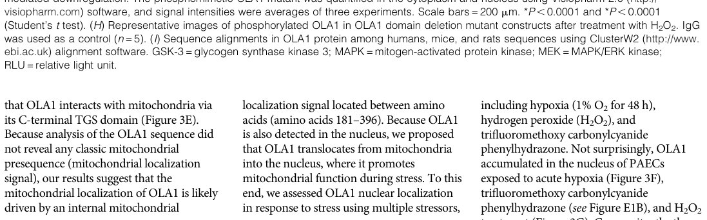

## Question

# Gene Research for Functional Annotation

## ⚠️ CRITICAL: Gene/Protein Identification Context

**BEFORE YOU BEGIN RESEARCH:** You MUST verify you are researching the CORRECT gene/protein. Gene symbols can be ambiguous, especially for less well-characterized genes from non-model organisms.

### Target Gene/Protein Identity (from UniProt):
- **UniProt Accession:** Q9NTK5
- **Protein Description:** RecName: Full=Obg-like ATPase 1 {ECO:0000255|HAMAP-Rule:MF_03167}; AltName: Full=DNA damage-regulated overexpressed in cancer 45; Short=DOC45; AltName: Full=GTP-binding protein 9;
- **Gene Information:** Name=OLA1 {ECO:0000255|HAMAP-Rule:MF_03167}; Synonyms=GTPBP9; ORFNames=PRO2455, PTD004;
- **Organism (full):** Homo sapiens (Human).
- **Protein Family:** Belongs to the TRAFAC class OBG-HflX-like GTPase
- **Key Domains:** ATPase_YchF/OLA1. (IPR004396); Beta-grasp_dom_sf. (IPR012675); G_OBG. (IPR031167); GTP-bd. (IPR006073); P-loop_NTPase. (IPR027417)

### MANDATORY VERIFICATION STEPS:

1. **Check if the gene symbol "OLA1" matches the protein description above**
2. **Verify the organism is correct:** Homo sapiens (Human).
3. **Check if protein family/domains align with what you find in literature**
4. **If you find literature for a DIFFERENT gene with the same or similar symbol, STOP**

### If Gene Symbol is Ambiguous or You Cannot Find Relevant Literature:

**DO NOT PROCEED WITH RESEARCH ON A DIFFERENT GENE.** Instead:
- State clearly: "The gene symbol 'OLA1' is ambiguous or literature is limited for this specific protein"
- Explain what you found (e.g., "Found extensive literature on a different gene with the same symbol in a different organism")
- Describe the protein based ONLY on the UniProt information provided above
- Suggest that the protein function can be inferred from domain/family information

### Research Target:

Please provide a comprehensive research report on the gene **OLA1** (gene ID: OLA1, UniProt: Q9NTK5) in human.

The research report should be a detailed narrative explaining the function, biological processes, and localization of the gene product. Citations should be given for all claims.

You should prioritize authoritative reviews and primary scientific literature when conducting research. You can supplement
this with annotations you find in gene/protein databases, but these can be outdated or inaccurate.

We are specifically interested in the primary function of the gene - for enzymes, what reaction is catalyzed, and what is the substrate specificity? For transporters, what is the substrate? For structural proteins or adapters, what is the broader structural role? For signaling molecules, what is the role in the pathway.

We are interested in where in or outside the cell the gene product carries out its function.

We are also interested in the signaling or biochemical pathways in which the gene functions. We are less interested in broad pleiotropic effects, except where these elucidate the precise role.

Include evidence where possible. We are interested in both experimental evidence as well as inference from structure, evolution, or bioinformatic analysis. Precise studies should be prioritized over high-throughput, where available.

## Output

Question: You are an expert researcher providing comprehensive, well-cited information.

Provide detailed information focusing on:
1. Key concepts and definitions with current understanding
2. Recent developments and latest research (prioritize 2023-2024 sources)
3. Current applications and real-world implementations
4. Expert opinions and analysis from authoritative sources
5. Relevant statistics and data from recent studies

Format as a comprehensive research report with proper citations. Include URLs and publication dates where available.
Always prioritize recent, authoritative sources and provide specific citations for all major claims.

# Gene Research for Functional Annotation

## ⚠️ CRITICAL: Gene/Protein Identification Context

**BEFORE YOU BEGIN RESEARCH:** You MUST verify you are researching the CORRECT gene/protein. Gene symbols can be ambiguous, especially for less well-characterized genes from non-model organisms.

### Target Gene/Protein Identity (from UniProt):
- **UniProt Accession:** Q9NTK5
- **Protein Description:** RecName: Full=Obg-like ATPase 1 {ECO:0000255|HAMAP-Rule:MF_03167}; AltName: Full=DNA damage-regulated overexpressed in cancer 45; Short=DOC45; AltName: Full=GTP-binding protein 9;
- **Gene Information:** Name=OLA1 {ECO:0000255|HAMAP-Rule:MF_03167}; Synonyms=GTPBP9; ORFNames=PRO2455, PTD004;
- **Organism (full):** Homo sapiens (Human).
- **Protein Family:** Belongs to the TRAFAC class OBG-HflX-like GTPase
- **Key Domains:** ATPase_YchF/OLA1. (IPR004396); Beta-grasp_dom_sf. (IPR012675); G_OBG. (IPR031167); GTP-bd. (IPR006073); P-loop_NTPase. (IPR027417)

### MANDATORY VERIFICATION STEPS:

1. **Check if the gene symbol "OLA1" matches the protein description above**
2. **Verify the organism is correct:** Homo sapiens (Human).
3. **Check if protein family/domains align with what you find in literature**
4. **If you find literature for a DIFFERENT gene with the same or similar symbol, STOP**

### If Gene Symbol is Ambiguous or You Cannot Find Relevant Literature:

**DO NOT PROCEED WITH RESEARCH ON A DIFFERENT GENE.** Instead:
- State clearly: "The gene symbol 'OLA1' is ambiguous or literature is limited for this specific protein"
- Explain what you found (e.g., "Found extensive literature on a different gene with the same symbol in a different organism")
- Describe the protein based ONLY on the UniProt information provided above
- Suggest that the protein function can be inferred from domain/family information

### Research Target:

Please provide a comprehensive research report on the gene **OLA1** (gene ID: OLA1, UniProt: Q9NTK5) in human.

The research report should be a detailed narrative explaining the function, biological processes, and localization of the gene product. Citations should be given for all claims.

You should prioritize authoritative reviews and primary scientific literature when conducting research. You can supplement
this with annotations you find in gene/protein databases, but these can be outdated or inaccurate.

We are specifically interested in the primary function of the gene - for enzymes, what reaction is catalyzed, and what is the substrate specificity? For transporters, what is the substrate? For structural proteins or adapters, what is the broader structural role? For signaling molecules, what is the role in the pathway.

We are interested in where in or outside the cell the gene product carries out its function.

We are also interested in the signaling or biochemical pathways in which the gene functions. We are less interested in broad pleiotropic effects, except where these elucidate the precise role.

Include evidence where possible. We are interested in both experimental evidence as well as inference from structure, evolution, or bioinformatic analysis. Precise studies should be prioritized over high-throughput, where available.

# Research Report: Human **OLA1** (UniProt **Q9NTK5**) — Functional Annotation and Translational Relevance

## Executive summary
**Obg-like ATPase 1 (OLA1; also called GTPBP9/DOC45)** is the human eukaryotic homolog of the universally conserved YchF/Ola1 family of TRAFAC/Obg-like P-loop NTPases. It is an **atypical NTPase that can bind/hydrolyze ATP and GTP but shows structural features favoring ATP**, and it integrates stress signaling with **translation initiation control**, **proteostasis**, and **mitochondria–nucleus (retrograde) communication**. Recent 2023 work provides a mechanistic framework in which **ERK1/2-dependent phosphorylation controls OLA1’s subcellular localization and switches its biochemical activity**, thereby enabling OLA1 to act as a stress-responsive regulator of nuclear-encoded mitochondrial bioenergetic programs. Clinical/translational studies in 2023–2024 support OLA1 as a **prognostic biomarker** in several cancers and as a component of multi-gene prognostic signatures, with emerging interest in cardiovascular genetics and heart failure. (sidlowski2023ola1phosphorylationgoverns pages 1-2, sidlowski2023ola1phosphorylationgoverns pages 7-8, chen2024combinedola1and pages 6-7, wang2023clinicopathologicalsignificanceof pages 6-8)

## 1) Identity verification, key concepts, and definitions
### 1.1 Correct target protein and nomenclature
The requested target is **human OLA1** (UniProt **Q9NTK5**), described as an **Obg-like ATPase 1** in the TRAFAC class OBG-HflX-like GTPase superfamily and commonly discussed as the eukaryotic ortholog of bacterial **YchF**. Reviews explicitly treat “YchF/Ola1” as a conserved protein family and note **~45% identity (62% similarity) between human OLA1 and E. coli YchF**. (jiang2025thefunctionof pages 69-71, jiang2025thefunctionof pages 67-69)

### 1.2 Protein family, domain architecture, and nucleotide specificity
**Family/class:** OLA1 belongs to the **TRAFAC** class and **Obg-like** family of P-loop NTPases/G proteins. (lin2023theuniversallyconserved pages 1-2, jiang2025thefunctionof pages 67-69)

**Domain architecture:** The YchF/Ola1 proteins are described as conserved **three-domain** proteins comprising an N-terminal **G (NTPase) domain**, a **helical/coiled-coil domain**, and a C-terminal **TGS domain** (often associated with RNA-binding functions). (jiang2025thefunctionof pages 69-71, jiang2025thefunctionofa pages 69-71)

**Atypical G4 motif and ATP preference:** A defining feature is a non-canonical **G4 motif** (often **NxxE** rather than the canonical **NKxD**), which is proposed to underlie altered nucleotide specificity and ATP preference relative to typical GTPases. (jiang2025thefunctionof pages 69-71, jiang2025thefunctionofa pages 69-71, lin2023theuniversallyconserved pages 2-4)

**Dual ATP/GTP binding/hydrolysis:** Reviews and primary work indicate OLA1/YchF can **bind and hydrolyze both ATP and GTP**, although multiple structural determinants bias human OLA1 toward ATP. For example, in the Lin 2023 review, residue-level interactions in hOLA1 (e.g., **Asn230** in the G4 motif; **Leu231** and **Ser310** supporting adenine recognition) are discussed as supporting ATP preference. (lin2023theuniversallyconserved pages 2-4)

### 1.3 Conceptual roles: “unconventional G protein” and translation/proteostasis coupling
A current conceptual framing is that YchF/OLA1 family proteins are **unconventional G proteins** that can couple NTP hydrolysis to **translation and proteostasis** (ribosome/proteasome associations), with sensitivity to oxidative stress. (lin2023theuniversallyconserved pages 1-2)

## 2) Molecular function: biochemical activities, substrates, and mechanisms
### 2.1 What reaction does OLA1 catalyze?
At the most direct biochemical level, OLA1 is an NTPase that catalyzes **nucleoside triphosphate hydrolysis** (ATP→ADP+Pi; and in some contexts GTP→GDP+Pi). Its active-site architecture is atypical for canonical Ras-like GTPases and is associated with an ATP bias. (lin2023theuniversallyconserved pages 2-4)

### 2.2 Regulation by phosphorylation: activity switching and mechanistic consequences (major 2023 advance)
A key recent development is a phosphorylation-controlled model from Sidlowski et al. (peer-reviewed, **Apr 2023**):

* **ERK1 phosphorylation at Ser232/Tyr236** triggers **OLA1 translocation from cytoplasm/mitochondria to nucleus**. (sidlowski2023ola1phosphorylationgoverns pages 1-2, sidlowski2023ola1phosphorylationgoverns pages 7-8)
* **ERK2 phosphorylation at Thr325** alters OLA1 biochemical behavior and DNA binding, with evidence that **T325 phosphorylation increases GTPase activity and suppresses ATPase activity** and **potentiates DNA binding**. (sidlowski2023ola1phosphorylationgoverns pages 9-10, sidlowski2023ola1phosphorylationgoverns pages 7-8)

This phosphorylation-dependent **biochemical “switch”** provides a mechanistic explanation for how OLA1 can act as a stress-responsive effector linking kinase signaling to mitochondrial gene regulation. (sidlowski2023ola1phosphorylationgoverns pages 1-2, sidlowski2023ola1phosphorylationgoverns pages 9-10)

### 2.3 Protein and macromolecular interactions (mechanistic and regulatory)
**Translation initiation machinery:** OLA1 is reported to bind eIF2 and to inhibit translation initiation by preventing formation of the **eIF2•GTP•Met-tRNAi ternary complex**, thereby modulating pathways central to the integrated stress response (ISR). (jiang2025thefunctionofa pages 74-76, lin2023theuniversallyconserved pages 6-8)

**Proteostasis / chaperone axis:** OLA1 has been linked to heat-shock resilience via **HSP70 stabilization** and to oxidative stress control through effects on the **CHIP/HSP70/SOD2** axis. (lin2023theuniversallyconserved pages 6-8)

**Mitochondria-to-nucleus signaling complex:** In pulmonary vascular cells, OLA1 is described as residing on mitochondria **anchored by vimentin**, then relocating to the nucleus via interaction with **importin-α1 (KPNA2)**; disrupting importin-α1 blocks nuclear translocation of phosphorylated OLA1. (sidlowski2023ola1phosphorylationgoverns pages 7-8, sidlowski2023ola1phosphorylationgoverns pages 8-9, sidlowski2023ola1phosphorylationgoverns pages 9-10)

**Regulatory partners:** ERK1/2 and PP1A are implicated as key regulators; PP1A is described as restraining ERK-driven signaling when stress abates and is also reported among interactors in the ubiquitination/regulation framework. (sidlowski2023ola1phosphorylationgoverns pages 1-2, sidlowski2023ola1phosphorylationgoverns pages 9-10)

## 3) Biological processes, pathways, and localization
### 3.1 Subcellular localization (baseline and stress-induced)
**Baseline localization:** OLA1 is described as primarily **cytoplasmic** in the Lin 2023 review, and in cardiomyocytes it is mainly cytoplasmic with lower nuclear levels. (lin2023theuniversallyconserved pages 6-8, dubey2024identificationanddevelopment pages 8-12)

**Mitochondrial localization:** In pulmonary vascular cells, OLA1 shows a strong mitochondrial pool and is reported to localize to the **outer mitochondrial membrane** (supported by biochemical fractionation/protease protection and marker co-staining). (sidlowski2023ola1phosphorylationgoverns pages 4-5)

**Stress-induced nuclear translocation:** Cellular stresses (hypoxia, H2O2, mitochondrial uncoupling) induce nuclear accumulation of OLA1, with mechanistic dependence on ERK phosphorylation and nuclear import machinery (importin-α1) and the cytoskeletal intermediate filament vimentin. (sidlowski2023ola1phosphorylationgoverns pages 4-5, sidlowski2023ola1phosphorylationgoverns pages 7-8, sidlowski2023ola1phosphorylationgoverns pages 8-9)

**Visual evidence:** Cropped figure/table regions from Sidlowski et al. 2023 show (i) OLA1 cytoplasm/mitochondria localization, (ii) stress-induced nuclear translocation, and (iii) phosphorylation sites and ERK-dependence. (sidlowski2023ola1phosphorylationgoverns media 66b79221, sidlowski2023ola1phosphorylationgoverns media d67ed0b1, sidlowski2023ola1phosphorylationgoverns media 96be911f, sidlowski2023ola1phosphorylationgoverns media 2945524d, sidlowski2023ola1phosphorylationgoverns media 0b0b8e08)

### 3.2 Translation regulation and the integrated stress response (ISR)
A mechanistic theme across the literature is that OLA1 modulates translation initiation by acting on the eIF2 step:

* OLA1 binds eIF2 and stabilizes eIF2 in its GDP-bound state, inhibiting ternary complex formation and thereby decreasing canonical cap-dependent initiation while favoring stress-adaptive alternative initiation. (jiang2025thefunctionofa pages 74-76, jiang2025thefunctionof pages 74-76)
* The Lin 2023 review summarizes that hOLA1 blocks ternary complex formation and thereby prevents eIF2 from delivering initiator tRNA to the 40S ribosome. (lin2023theuniversallyconserved pages 6-8)

### 3.3 Oxidative stress and antioxidant response
OLA1 has long-standing links to oxidative stress regulation, including suppressing antioxidant responses via nontranscriptional mechanisms and influencing mitochondrial antioxidant enzyme status (SOD2), with downstream implications for cellular stress tolerance. (jiang2025thefunctionof pages 67-69, jiang2025thefunctionof pages 80-82, sidlowski2023ola1phosphorylationgoverns pages 11-11)

### 3.4 Mitochondrial bioenergetics and mitonuclear retrograde signaling (major 2023 advance)
Sidlowski et al. 2023 propose and experimentally support a model where OLA1 couples stress/redox cues to nuclear transcription programs regulating mitochondrial bioenergetics:

* Stress → ERK1/2 phosphorylation → OLA1 nuclear relocalization → altered DNA binding and transcriptional activation of nuclear-encoded mitochondrial genes. (sidlowski2023ola1phosphorylationgoverns pages 1-2, sidlowski2023ola1phosphorylationgoverns pages 9-10, sidlowski2023ola1phosphorylationgoverns pages 7-8)
* OLA1 depletion downregulates nuclear genes involved in oxidative phosphorylation and mitochondrial assembly/structure; phosphomimetic nuclear OLA1 (T325D) rescues mitochondrial gene expression better than phosphoresistant T325A. (sidlowski2023ola1phosphorylationgoverns pages 9-10)
* Functional metabolic outcomes include **lower cellular ATP**, **higher lactate**, and increased **ADP:ATP ratio** in OLA1-deficient endothelial cells. (sidlowski2023ola1phosphorylationgoverns pages 9-10, sidlowski2023ola1phosphorylationgoverns pages 8-9)

### 3.5 Cancer-associated pathways (EMT, cell cycle, centrosome regulation)
Multiple sources connect OLA1 to tumor-relevant pathways:

* EMT: OLA1 has been reported to contribute to EMT via the **GSK3β/Snail/E-cadherin** axis (noting that effects may be context dependent across cancer types). (jiang2025thefunctionofa pages 80-82, wang2023clinicopathologicalsignificanceof pages 6-8)
* Cell cycle and proliferation: OLA1 is described as a translational regulator of **p21**, and clinical/translational studies link OLA1 to P21/CDK2-related tumor progression models. (jiang2025thefunctionof pages 79-80, sidlowski2023ola1phosphorylationgoverns pages 11-11)
* DNA damage/centrosome regulation: OLA1 is described as DNA-damage regulated (DOC45) and a BRCA1/BARD1-interacting factor implicated in centrosome regulation, providing a mechanistic bridge between stress responses and genome stability phenotypes. (jiang2025thefunctionofa pages 80-82, wang2023clinicopathologicalsignificanceof pages 6-8)

## 4) Recent developments (prioritizing 2023–2024)
### 4.1 2023: Phosphorylation-controlled localization and NTPase switching model
The strongest 2023 mechanistic advance is the ERK/PP1A-centered phosphorylation framework linking OLA1 localization and enzymatic state to mitochondrial gene regulation and bioenergetic phenotypes. (sidlowski2023ola1phosphorylationgoverns pages 1-2, sidlowski2023ola1phosphorylationgoverns pages 9-10, sidlowski2023ola1phosphorylationgoverns pages 7-8)

### 4.2 2023: Clinical pathology evidence in gastric cancer
A 2023 gastric cancer tissue microarray study (334 patients) linked high OLA1 protein expression to more aggressive clinicopathological features and poorer survival, and reported correlation with Snail (EMT regulator). (wang2023clinicopathologicalsignificanceof pages 6-8)

### 4.3 2024: HCC prognostic signature and drug-sensitivity linkage
A 2024 HCC study proposed an **OLA1|CLEC3B** ratio-based prognostic signature validated across TCGA/ICGC, and provided experimental evidence that OLA1 knockdown reduces proliferation and increases gemcitabine sensitivity in Huh7 cells. (chen2024combinedola1and pages 6-7, chen2024combinedola1and pages 2-3)

### 4.4 2024: Cardiovascular genetics and functional models
2024 preprints report (i) a proposed PCR-based screen for a coding OLA1 variant in heart failure cohorts and (ii) cardiac-specific genetic deletion phenotypes consistent with cardiomyopathy in animal models. (dubey2024identificationanddevelopment pages 8-12, dubey2024obglikeatpase1 pages 14-18)

## 5) Current applications and real-world implementations
### 5.1 Prognostic biomarker use in cancer (clinical pathology implementation)
In gastric cancer, OLA1 IHC stratification was associated with survival differences and remained an independent prognostic factor in multivariate analysis. (wang2023clinicopathologicalsignificanceof pages 6-8)

### 5.2 Multi-gene prognostic signatures in HCC
The OLA1|CLEC3B ratio-based risk score provides time-dependent ROC performance in two independent cohorts, supporting its potential for clinical risk stratification workflows, and was incorporated into nomogram modeling. (chen2024combinedola1and pages 6-7, chen2024combinedola1and pages 2-3)

### 5.3 Emerging cardiovascular implementation: genotyping assay development
A 2024 medRxiv report describes development of a cost-effective **Tetra-ARMS PCR** assay for a putative OLA1 coding variant in failing heart contexts and highlights OLA1 downregulation in failing human hearts, representing an early translational step toward genetic screening/stratification in cardiomyopathy research settings. (dubey2024identificationanddevelopment pages 8-12)

## 6) Quantitative statistics and data from recent studies
### 6.1 Gastric cancer prognosis (2023)
In a 334-patient gastric cancer cohort, high OLA1 expression associated with worse overall survival (p = 0.002) and showed associations with tumor size, lymph node metastasis, and advanced stage. Multivariate Cox regression reported **OLA1 expression HR = 0.573 (95% CI 0.376–0.872), p = 0.009**, and OLA1-Snail correlation **r = 0.334, p < 0.001**. (wang2023clinicopathologicalsignificanceof pages 6-8)

### 6.2 HCC prognostic signature ROC performance (2024)
For the **OLA1|CLEC3B** signature, time-dependent AUCs were:

* **TCGA:** 1-year 0.735; 2-year 0.720; 3-year 0.713
* **ICGC:** 1-year 0.722; 2-year 0.728; 3-year 0.737

(chen2024combinedola1and pages 6-7)

### 6.3 Functional and metabolic phenotypes (2023 mechanistic study)
In endothelial OLA1 deficiency models, OLA1 loss is associated with decreased ATP and increased lactate and ADP:ATP ratio (figures summarized as statistically significant; *P < 0.0001). (sidlowski2023ola1phosphorylationgoverns pages 9-10, sidlowski2023ola1phosphorylationgoverns pages 8-9)

### 6.4 Cardiovascular functional models (2024)
A 2024 bioRxiv study reports that heart-specific Ola1 knockdown in Drosophila reduces heart rate (**157 bpm control vs 127±7 bpm knockdown, P = 0.007**) and causes developmental lethality, and that mouse cardiac deletion produces dilation and reduced function (e.g., ~10% decrease in EF/FS with age). (dubey2024obglikeatpase1 pages 14-18)

## 7) Expert synthesis and analysis (authoritative interpretations)
### 7.1 Unifying functional model
Across reviews and 2023 primary work, OLA1 can be interpreted as a **stress-responsive NTPase “hub”** operating at the interface of:

1. **Translation initiation control** (eIF2 ternary-complex inhibition; ISR-adjacent regulation) (jiang2025thefunctionofa pages 74-76, lin2023theuniversallyconserved pages 6-8)
2. **Proteostasis/chaperone networks** (HSP70/CHIP; mitochondrial antioxidant enzyme stability) (lin2023theuniversallyconserved pages 6-8)
3. **Mitonuclear communication and metabolic adaptation** (ERK-dependent phosphorylation triggers nuclear relocation and transcriptional regulation of mitochondrial bioenergetic programs) (sidlowski2023ola1phosphorylationgoverns pages 1-2, sidlowski2023ola1phosphorylationgoverns pages 9-10)

A notable 2023 conceptual advance is that OLA1 is not merely a cytosolic translational regulator but can become a **phosphorylation-controlled, nucleus-localized regulator of mitochondrial gene programs** under stress. (sidlowski2023ola1phosphorylationgoverns pages 1-2, sidlowski2023ola1phosphorylationgoverns pages 9-10)

### 7.2 Important caveats and open questions
* **Context dependence in cancer:** Clinical correlations (e.g., prognosis, EMT association) appear to vary across tumor types, and some reports suggest bidirectional effects depending on cellular context and in vitro vs in vivo setting. (wang2023clinicopathologicalsignificanceof pages 6-8)
* **Direct catalytic “substrate specificity”:** While OLA1’s immediate substrates are NTPs (ATP/GTP), many downstream phenotypes may be mediated through binding interactions and localization rather than classical enzyme–substrate turnover on a unique small-molecule substrate. (lin2023theuniversallyconserved pages 2-4, sidlowski2023ola1phosphorylationgoverns pages 7-8)

## 8) Summary table of key sources (2023–2024 prioritized)
| Study (first author, year) | Publication date/month | Type | System (cells/tissues/animal) | Main finding relevant to OLA1 function/localization/pathway | Key quantitative stats | URL/DOI |
|---|---|---|---|---|---|---|
| Sidlowski 2023 | Apr 2023 | Primary mechanistic study | Human pulmonary vascular cells; mouse endothelial/lung models | OLA1 localizes to cytoplasm and mitochondria and stress-inducibly translocates to the nucleus. ERK1 phosphorylation at S232/Y236 promotes nuclear import, and ERK2 phosphorylation at T325 shifts OLA1 toward GTPase and DNA-binding activity to regulate nuclear-encoded mitochondrial bioenergetic genes. (sidlowski2023ola1phosphorylationgoverns pages 1-2, sidlowski2023ola1phosphorylationgoverns pages 4-5, sidlowski2023ola1phosphorylationgoverns pages 7-8, sidlowski2023ola1phosphorylationgoverns pages 9-10, sidlowski2023ola1phosphorylationgoverns pages 5-6, sidlowski2023ola1phosphorylationgoverns pages 6-7) | Enzyme/phosphorylation effects reported as highly significant with *P < 0.00001; vimentin/importin perturbation reduced nuclear phospho-OLA1 with *P < 0.001; OLA1 depletion lowered ATP and raised lactate and ADP:ATP with *P < 0.0001 in figure summary. (sidlowski2023ola1phosphorylationgoverns pages 7-8, sidlowski2023ola1phosphorylationgoverns pages 8-9, sidlowski2023ola1phosphorylationgoverns pages 6-7) | https://doi.org/10.1165/rcmb.2022-0186oc |
| Lin 2023 | Apr 2023 | Review | Cross-species synthesis with human OLA1 emphasis | Reviews YchF/OLA1 as a conserved TRAFAC/Obg-like NTPase that hydrolyzes ATP and GTP, with human OLA1 biased toward ATP. Summarizes roles in eIF2 ternary-complex inhibition, oxidative-stress biology, and HSP70/CHIP-SOD2 proteostasis. (lin2023theuniversallyconserved pages 2-4, lin2023theuniversallyconserved pages 6-8, lin2023theuniversallyconserved pages 1-2) | No original cohort statistics; summarizes human OLA1 as a ~45 kDa cytoplasmic protein and reviews knockdown/overexpression phenotypes qualitatively. (lin2023theuniversallyconserved pages 6-8) | https://doi.org/10.3390/life13041058 |
| Wang 2023 | Jan 2023 | Clinical pathology study | Gastric cancer patient tissues; qRT-PCR on 30 paired tissues; IHC on 334 cases | OLA1 is elevated in gastric cancer and associated with aggressive clinicopathologic features. OLA1 expression positively correlates with Snail, linking OLA1 to EMT-related prognostic biology. (wang2023clinicopathologicalsignificanceof pages 1-2, wang2023clinicopathologicalsignificanceof pages 6-8, wang2023clinicopathologicalsignificanceof pages 8-9) | Shorter overall survival with high OLA1, p = 0.002. Multivariate Cox: OLA1 HR 0.573, 95% CI 0.376-0.872, p = 0.009; lymph-node metastasis p = 0.0037; TNM stage p < 0.0001; OLA1-Snail correlation r = 0.334, p < 0.001. (wang2023clinicopathologicalsignificanceof pages 6-8) | https://doi.org/10.5114/pjp.2023.127265 |
| Chen 2024 | Apr 2024 | Clinical translational study | HCC cohorts from TCGA and ICGC; Huh7 cells and gemcitabine-resistant Huh7 | Defines OLA1/CLEC3B as a prognostic HCC signature. High-risk OLA1-related tumors show stronger cell-cycle programs and worse prognosis, and OLA1 knockdown suppresses proliferation, increases apoptosis, prolongs S phase, and increases gemcitabine sensitivity. (chen2024combinedola1and pages 2-3, chen2024combinedola1and pages 1-2, chen2024combinedola1and pages 7-10, chen2024combinedola1and pages 6-7) | Cohorts: TCGA 370 HCC and 50 adjacent tissues; ICGC 231 HCC and 199 adjacent tissues. AUCs for OLA1/CLEC3B: TCGA 0.735 at 1 year, 0.720 at 2 years, 0.713 at 3 years; ICGC 0.722, 0.728, 0.737. Cell-cycle correlations P < 0.05. (chen2024combinedola1and pages 6-7, chen2024combinedola1and pages 2-3) | https://doi.org/10.1177/15330338241241935 |
| Dubey 2024 medRxiv | Oct 2024 preprint | Preprint cardiovascular genetics study | Human failing and non-failing heart tissue; AC16 cardiomyocytes; REGARDS cross-reference | Reports OLA1 downregulation in failing human hearts and predominantly cytoplasmic localization in cardiomyocytes. Also describes a Tetra-ARMS PCR assay for an OLA1 coding variant as a potential genotyping tool in cardiomyopathy research. (dubey2024identificationanddevelopment pages 8-12, dubey2024identificationanddevelopment pages 15-19) | REGARDS cohort referenced: 30239 participants. OLA1 CDS 1191 bp encoding 396 aa; gene has 11 exons and intronic span >100 kb. Significant downregulation in failing heart reported, but no HR or AUC values in cited pages. (dubey2024identificationanddevelopment pages 8-12) | https://doi.org/10.1101/2023.10.16.23296746 |
| Dubey 2024 bioRxiv | Jun 2024 | Preprint functional animal study | Cardiomyocyte-specific mouse Ola1 deletion; Drosophila heart RNAi | Loss of Ola1 causes dilated cardiomyopathy and cardiac structural and functional defects, supporting a conserved role in cardiac homeostasis. (dubey2024obglikeatpase1 pages 23-27, dubey2024obglikeatpase1 pages 14-18) | Fly heart-specific knockdown caused 58% pupal lethality, about 25% smaller pupae, and reduced heart rate from 157 bpm in controls to 127 +/- 7 bpm, P = 0.007. Mouse haploinsufficiency caused about 10% decrease in ejection fraction and fractional shortening with age-dependent dilation. (dubey2024obglikeatpase1 pages 14-18) | https://doi.org/10.1101/2024.05.28.596265 |
| Koller-Eichhorn 2007 | 2007 | Foundational biochemical study | Human OLA1 biochemical characterization | Established human OLA1 as an ATPase subfamily within the Obg family of nucleotide-binding proteins, foundational for later work on atypical ATP/GTP handling. (wang2023clinicopathologicalsignificanceof pages 8-9) | Foundational study; no recent clinical performance metrics reported here. (wang2023clinicopathologicalsignificanceof pages 8-9) | https://doi.org/10.1074/jbc.M700541200 |
| Chen 2015 | 2015 | Foundational mechanistic study | Human cell systems | Demonstrated that OLA1 regulates protein synthesis and the integrated stress response by inhibiting eIF2 ternary-complex formation, a core mechanism for OLA1 in translation control. (jiang2025thefunctionof pages 79-80, wang2023clinicopathologicalsignificanceof pages 8-9) | Mechanistic result centered on inhibition of eIF2 ternary-complex formation rather than cohort-level HR or AUC metrics. (jiang2025thefunctionof pages 79-80, wang2023clinicopathologicalsignificanceof pages 8-9) | https://doi.org/10.1038/srep13241 |
| Zhang 2009 | Sep 2009 | Foundational mechanistic study | Human cell systems | Identified OLA1 as an Obg-like ATPase that suppresses antioxidant responses via nontranscriptional mechanisms, establishing the oxidative-stress link in later OLA1 literature. (jiang2025thefunctionof pages 67-69, wang2023clinicopathologicalsignificanceof pages 6-8) | Foundational mechanistic study; no AUC or HR values reported here. (jiang2025thefunctionof pages 67-69, wang2023clinicopathologicalsignificanceof pages 6-8) | https://doi.org/10.1073/pnas.0907334106 |

*Table: This table summarizes major recent and foundational studies on human OLA1, emphasizing function, localization, pathways, and any available quantitative clinical or experimental metrics. It is useful as a quick reference for both mechanistic biology and translational relevance.*

## Selected key references with URLs (publication dates)
* Sidlowski et al. “OLA1 Phosphorylation Governs the Mitochondrial Bioenergetic Function of Pulmonary Vascular Cells.” **Apr 2023**. https://doi.org/10.1165/rcmb.2022-0186oc (sidlowski2023ola1phosphorylationgoverns pages 1-2)
* Lin et al. “The Universally Conserved Unconventional G Protein YchF Is Critical for Growth and Stress Response.” **Apr 2023**. https://doi.org/10.3390/life13041058 (lin2023theuniversallyconserved pages 1-2)
* Wang et al. “Clinicopathological significance of Obg-like ATPase 1 and its association with Snail in gastric cancer.” **Jan 2023**. https://doi.org/10.5114/pjp.2023.127265 (wang2023clinicopathologicalsignificanceof pages 6-8)
* Chen et al. “Combined OLA1 and CLEC3B Gene Is a Prognostic Signature for Hepatocellular Carcinoma…” **Apr 2024**. https://doi.org/10.1177/15330338241241935 (chen2024combinedola1and pages 6-7)
* Dubey et al. “Identification and development of Tetra-ARMS PCR-based screening test for a genetic variant of OLA1…” **Oct 2024 (posted)**. https://doi.org/10.1101/2023.10.16.23296746 (dubey2024identificationanddevelopment pages 8-12)

References

1. (sidlowski2023ola1phosphorylationgoverns pages 1-2): Paul Sidlowski, Amanda Czerwinski, Yong Liu, Pengyuan Liu, Ru-Jeng Teng, Suresh Kumar, Clive Wells, Kirkwood Pritchard, Girija G. Konduri, and Adeleye J. Afolayan. Ola1 phosphorylation governs the mitochondrial bioenergetic function of pulmonary vascular cells. American Journal of Respiratory Cell and Molecular Biology, 68:395-405, Apr 2023. URL: https://doi.org/10.1165/rcmb.2022-0186oc, doi:10.1165/rcmb.2022-0186oc. This article has 11 citations and is from a peer-reviewed journal.

2. (sidlowski2023ola1phosphorylationgoverns pages 7-8): Paul Sidlowski, Amanda Czerwinski, Yong Liu, Pengyuan Liu, Ru-Jeng Teng, Suresh Kumar, Clive Wells, Kirkwood Pritchard, Girija G. Konduri, and Adeleye J. Afolayan. Ola1 phosphorylation governs the mitochondrial bioenergetic function of pulmonary vascular cells. American Journal of Respiratory Cell and Molecular Biology, 68:395-405, Apr 2023. URL: https://doi.org/10.1165/rcmb.2022-0186oc, doi:10.1165/rcmb.2022-0186oc. This article has 11 citations and is from a peer-reviewed journal.

3. (chen2024combinedola1and pages 6-7): Zhoufeng Chen, Liuwei Zeng, Zhuoyan Chen, Jun Xu, Xiangting Zhang, Huiya Ying, Yuan Zeng, and Fujun Yu. Combined ola1 and clec3b gene is a prognostic signature for hepatocellular carcinoma and impact tumor progression. Technology in Cancer Research & Treatment, Apr 2024. URL: https://doi.org/10.1177/15330338241241935, doi:10.1177/15330338241241935. This article has 1 citations and is from a peer-reviewed journal.

4. (wang2023clinicopathologicalsignificanceof pages 6-8): Juan Wang, Qinghua Cao, and Zhiqing Wang. Clinicopathological significance of obg-like atpase 1 and its association with snail in gastric cancer. Polish Journal of Pathology, 74:42-50, Jan 2023. URL: https://doi.org/10.5114/pjp.2023.127265, doi:10.5114/pjp.2023.127265. This article has 1 citations.

5. (jiang2025thefunctionof pages 69-71): H Jiang. The function of ychf in bacterial stress resistance. Unknown journal, 2025.

6. (jiang2025thefunctionof pages 67-69): H Jiang. The function of ychf in bacterial stress resistance. Unknown journal, 2025.

7. (lin2023theuniversallyconserved pages 1-2): Zhaoheng Lin, Rongfang Li, Zhiwei Han, Yi Liu, Liyang Gao, Suchang Huang, Ying Miao, and Rui Miao. The universally conserved unconventional g protein ychf is critical for growth and stress response. Life, 13:1058, Apr 2023. URL: https://doi.org/10.3390/life13041058, doi:10.3390/life13041058. This article has 6 citations.

8. (jiang2025thefunctionofa pages 69-71): H Jiang. The function of ychf in bacterial stress resistance. Unknown journal, 2025.

9. (lin2023theuniversallyconserved pages 2-4): Zhaoheng Lin, Rongfang Li, Zhiwei Han, Yi Liu, Liyang Gao, Suchang Huang, Ying Miao, and Rui Miao. The universally conserved unconventional g protein ychf is critical for growth and stress response. Life, 13:1058, Apr 2023. URL: https://doi.org/10.3390/life13041058, doi:10.3390/life13041058. This article has 6 citations.

10. (sidlowski2023ola1phosphorylationgoverns pages 9-10): Paul Sidlowski, Amanda Czerwinski, Yong Liu, Pengyuan Liu, Ru-Jeng Teng, Suresh Kumar, Clive Wells, Kirkwood Pritchard, Girija G. Konduri, and Adeleye J. Afolayan. Ola1 phosphorylation governs the mitochondrial bioenergetic function of pulmonary vascular cells. American Journal of Respiratory Cell and Molecular Biology, 68:395-405, Apr 2023. URL: https://doi.org/10.1165/rcmb.2022-0186oc, doi:10.1165/rcmb.2022-0186oc. This article has 11 citations and is from a peer-reviewed journal.

11. (jiang2025thefunctionofa pages 74-76): H Jiang. The function of ychf in bacterial stress resistance. Unknown journal, 2025.

12. (lin2023theuniversallyconserved pages 6-8): Zhaoheng Lin, Rongfang Li, Zhiwei Han, Yi Liu, Liyang Gao, Suchang Huang, Ying Miao, and Rui Miao. The universally conserved unconventional g protein ychf is critical for growth and stress response. Life, 13:1058, Apr 2023. URL: https://doi.org/10.3390/life13041058, doi:10.3390/life13041058. This article has 6 citations.

13. (sidlowski2023ola1phosphorylationgoverns pages 8-9): Paul Sidlowski, Amanda Czerwinski, Yong Liu, Pengyuan Liu, Ru-Jeng Teng, Suresh Kumar, Clive Wells, Kirkwood Pritchard, Girija G. Konduri, and Adeleye J. Afolayan. Ola1 phosphorylation governs the mitochondrial bioenergetic function of pulmonary vascular cells. American Journal of Respiratory Cell and Molecular Biology, 68:395-405, Apr 2023. URL: https://doi.org/10.1165/rcmb.2022-0186oc, doi:10.1165/rcmb.2022-0186oc. This article has 11 citations and is from a peer-reviewed journal.

14. (dubey2024identificationanddevelopment pages 8-12): Praveen K Dubey, Shubham Dubey, Sarojini Singh, Purnima Devaki Bhat, Steven Pogwizd, and Prasanna Krishnamurthy. Identification and development of tetra-arms pcr-based screening test for a genetic variant of ola1 (tyr254cys) in the human failing heart. medRxiv, Oct 2024. URL: https://doi.org/10.1101/2023.10.16.23296746, doi:10.1101/2023.10.16.23296746. This article has 7 citations.

15. (sidlowski2023ola1phosphorylationgoverns pages 4-5): Paul Sidlowski, Amanda Czerwinski, Yong Liu, Pengyuan Liu, Ru-Jeng Teng, Suresh Kumar, Clive Wells, Kirkwood Pritchard, Girija G. Konduri, and Adeleye J. Afolayan. Ola1 phosphorylation governs the mitochondrial bioenergetic function of pulmonary vascular cells. American Journal of Respiratory Cell and Molecular Biology, 68:395-405, Apr 2023. URL: https://doi.org/10.1165/rcmb.2022-0186oc, doi:10.1165/rcmb.2022-0186oc. This article has 11 citations and is from a peer-reviewed journal.

16. (sidlowski2023ola1phosphorylationgoverns media 66b79221): Paul Sidlowski, Amanda Czerwinski, Yong Liu, Pengyuan Liu, Ru-Jeng Teng, Suresh Kumar, Clive Wells, Kirkwood Pritchard, Girija G. Konduri, and Adeleye J. Afolayan. Ola1 phosphorylation governs the mitochondrial bioenergetic function of pulmonary vascular cells. American Journal of Respiratory Cell and Molecular Biology, 68:395-405, Apr 2023. URL: https://doi.org/10.1165/rcmb.2022-0186oc, doi:10.1165/rcmb.2022-0186oc. This article has 11 citations and is from a peer-reviewed journal.

17. (sidlowski2023ola1phosphorylationgoverns media d67ed0b1): Paul Sidlowski, Amanda Czerwinski, Yong Liu, Pengyuan Liu, Ru-Jeng Teng, Suresh Kumar, Clive Wells, Kirkwood Pritchard, Girija G. Konduri, and Adeleye J. Afolayan. Ola1 phosphorylation governs the mitochondrial bioenergetic function of pulmonary vascular cells. American Journal of Respiratory Cell and Molecular Biology, 68:395-405, Apr 2023. URL: https://doi.org/10.1165/rcmb.2022-0186oc, doi:10.1165/rcmb.2022-0186oc. This article has 11 citations and is from a peer-reviewed journal.

18. (sidlowski2023ola1phosphorylationgoverns media 96be911f): Paul Sidlowski, Amanda Czerwinski, Yong Liu, Pengyuan Liu, Ru-Jeng Teng, Suresh Kumar, Clive Wells, Kirkwood Pritchard, Girija G. Konduri, and Adeleye J. Afolayan. Ola1 phosphorylation governs the mitochondrial bioenergetic function of pulmonary vascular cells. American Journal of Respiratory Cell and Molecular Biology, 68:395-405, Apr 2023. URL: https://doi.org/10.1165/rcmb.2022-0186oc, doi:10.1165/rcmb.2022-0186oc. This article has 11 citations and is from a peer-reviewed journal.

19. (sidlowski2023ola1phosphorylationgoverns media 2945524d): Paul Sidlowski, Amanda Czerwinski, Yong Liu, Pengyuan Liu, Ru-Jeng Teng, Suresh Kumar, Clive Wells, Kirkwood Pritchard, Girija G. Konduri, and Adeleye J. Afolayan. Ola1 phosphorylation governs the mitochondrial bioenergetic function of pulmonary vascular cells. American Journal of Respiratory Cell and Molecular Biology, 68:395-405, Apr 2023. URL: https://doi.org/10.1165/rcmb.2022-0186oc, doi:10.1165/rcmb.2022-0186oc. This article has 11 citations and is from a peer-reviewed journal.

20. (sidlowski2023ola1phosphorylationgoverns media 0b0b8e08): Paul Sidlowski, Amanda Czerwinski, Yong Liu, Pengyuan Liu, Ru-Jeng Teng, Suresh Kumar, Clive Wells, Kirkwood Pritchard, Girija G. Konduri, and Adeleye J. Afolayan. Ola1 phosphorylation governs the mitochondrial bioenergetic function of pulmonary vascular cells. American Journal of Respiratory Cell and Molecular Biology, 68:395-405, Apr 2023. URL: https://doi.org/10.1165/rcmb.2022-0186oc, doi:10.1165/rcmb.2022-0186oc. This article has 11 citations and is from a peer-reviewed journal.

21. (jiang2025thefunctionof pages 74-76): H Jiang. The function of ychf in bacterial stress resistance. Unknown journal, 2025.

22. (jiang2025thefunctionof pages 80-82): H Jiang. The function of ychf in bacterial stress resistance. Unknown journal, 2025.

23. (sidlowski2023ola1phosphorylationgoverns pages 11-11): Paul Sidlowski, Amanda Czerwinski, Yong Liu, Pengyuan Liu, Ru-Jeng Teng, Suresh Kumar, Clive Wells, Kirkwood Pritchard, Girija G. Konduri, and Adeleye J. Afolayan. Ola1 phosphorylation governs the mitochondrial bioenergetic function of pulmonary vascular cells. American Journal of Respiratory Cell and Molecular Biology, 68:395-405, Apr 2023. URL: https://doi.org/10.1165/rcmb.2022-0186oc, doi:10.1165/rcmb.2022-0186oc. This article has 11 citations and is from a peer-reviewed journal.

24. (jiang2025thefunctionofa pages 80-82): H Jiang. The function of ychf in bacterial stress resistance. Unknown journal, 2025.

25. (jiang2025thefunctionof pages 79-80): H Jiang. The function of ychf in bacterial stress resistance. Unknown journal, 2025.

26. (chen2024combinedola1and pages 2-3): Zhoufeng Chen, Liuwei Zeng, Zhuoyan Chen, Jun Xu, Xiangting Zhang, Huiya Ying, Yuan Zeng, and Fujun Yu. Combined ola1 and clec3b gene is a prognostic signature for hepatocellular carcinoma and impact tumor progression. Technology in Cancer Research & Treatment, Apr 2024. URL: https://doi.org/10.1177/15330338241241935, doi:10.1177/15330338241241935. This article has 1 citations and is from a peer-reviewed journal.

27. (dubey2024obglikeatpase1 pages 14-18): Praveen K Dubey, Sarojini Singh, Hussain Khalil, Goutham K Kommini, Krishna Moorthi Bhat, and Prasanna Krishnamurthy. Obg-like atpase 1 genetic deletion leads to dilated cardiomyopathy in mice and structural changes in drosophila heart. bioRxiv, Jun 2024. URL: https://doi.org/10.1101/2024.05.28.596265, doi:10.1101/2024.05.28.596265. This article has 1 citations.

28. (sidlowski2023ola1phosphorylationgoverns pages 5-6): Paul Sidlowski, Amanda Czerwinski, Yong Liu, Pengyuan Liu, Ru-Jeng Teng, Suresh Kumar, Clive Wells, Kirkwood Pritchard, Girija G. Konduri, and Adeleye J. Afolayan. Ola1 phosphorylation governs the mitochondrial bioenergetic function of pulmonary vascular cells. American Journal of Respiratory Cell and Molecular Biology, 68:395-405, Apr 2023. URL: https://doi.org/10.1165/rcmb.2022-0186oc, doi:10.1165/rcmb.2022-0186oc. This article has 11 citations and is from a peer-reviewed journal.

29. (sidlowski2023ola1phosphorylationgoverns pages 6-7): Paul Sidlowski, Amanda Czerwinski, Yong Liu, Pengyuan Liu, Ru-Jeng Teng, Suresh Kumar, Clive Wells, Kirkwood Pritchard, Girija G. Konduri, and Adeleye J. Afolayan. Ola1 phosphorylation governs the mitochondrial bioenergetic function of pulmonary vascular cells. American Journal of Respiratory Cell and Molecular Biology, 68:395-405, Apr 2023. URL: https://doi.org/10.1165/rcmb.2022-0186oc, doi:10.1165/rcmb.2022-0186oc. This article has 11 citations and is from a peer-reviewed journal.

30. (wang2023clinicopathologicalsignificanceof pages 1-2): Juan Wang, Qinghua Cao, and Zhiqing Wang. Clinicopathological significance of obg-like atpase 1 and its association with snail in gastric cancer. Polish Journal of Pathology, 74:42-50, Jan 2023. URL: https://doi.org/10.5114/pjp.2023.127265, doi:10.5114/pjp.2023.127265. This article has 1 citations.

31. (wang2023clinicopathologicalsignificanceof pages 8-9): Juan Wang, Qinghua Cao, and Zhiqing Wang. Clinicopathological significance of obg-like atpase 1 and its association with snail in gastric cancer. Polish Journal of Pathology, 74:42-50, Jan 2023. URL: https://doi.org/10.5114/pjp.2023.127265, doi:10.5114/pjp.2023.127265. This article has 1 citations.

32. (chen2024combinedola1and pages 1-2): Zhoufeng Chen, Liuwei Zeng, Zhuoyan Chen, Jun Xu, Xiangting Zhang, Huiya Ying, Yuan Zeng, and Fujun Yu. Combined ola1 and clec3b gene is a prognostic signature for hepatocellular carcinoma and impact tumor progression. Technology in Cancer Research & Treatment, Apr 2024. URL: https://doi.org/10.1177/15330338241241935, doi:10.1177/15330338241241935. This article has 1 citations and is from a peer-reviewed journal.

33. (chen2024combinedola1and pages 7-10): Zhoufeng Chen, Liuwei Zeng, Zhuoyan Chen, Jun Xu, Xiangting Zhang, Huiya Ying, Yuan Zeng, and Fujun Yu. Combined ola1 and clec3b gene is a prognostic signature for hepatocellular carcinoma and impact tumor progression. Technology in Cancer Research & Treatment, Apr 2024. URL: https://doi.org/10.1177/15330338241241935, doi:10.1177/15330338241241935. This article has 1 citations and is from a peer-reviewed journal.

34. (dubey2024identificationanddevelopment pages 15-19): Praveen K Dubey, Shubham Dubey, Sarojini Singh, Purnima Devaki Bhat, Steven Pogwizd, and Prasanna Krishnamurthy. Identification and development of tetra-arms pcr-based screening test for a genetic variant of ola1 (tyr254cys) in the human failing heart. medRxiv, Oct 2024. URL: https://doi.org/10.1101/2023.10.16.23296746, doi:10.1101/2023.10.16.23296746. This article has 7 citations.

35. (dubey2024obglikeatpase1 pages 23-27): Praveen K Dubey, Sarojini Singh, Hussain Khalil, Goutham K Kommini, Krishna Moorthi Bhat, and Prasanna Krishnamurthy. Obg-like atpase 1 genetic deletion leads to dilated cardiomyopathy in mice and structural changes in drosophila heart. bioRxiv, Jun 2024. URL: https://doi.org/10.1101/2024.05.28.596265, doi:10.1101/2024.05.28.596265. This article has 1 citations.

## Artifacts

- [Edison artifact artifact-00](OLA1-deep-research-falcon_artifacts/artifact-00.md)

## Citations

1. lin2023theuniversallyconserved pages 2-4
2. lin2023theuniversallyconserved pages 1-2
3. lin2023theuniversallyconserved pages 6-8
4. wang2023clinicopathologicalsignificanceof pages 6-8
5. dubey2024identificationanddevelopment pages 8-12
6. wang2023clinicopathologicalsignificanceof pages 8-9
7. jiang2025thefunctionof pages 69-71
8. jiang2025thefunctionof pages 67-69
9. jiang2025thefunctionofa pages 69-71
10. jiang2025thefunctionofa pages 74-76
11. jiang2025thefunctionof pages 74-76
12. jiang2025thefunctionof pages 80-82
13. jiang2025thefunctionofa pages 80-82
14. jiang2025thefunctionof pages 79-80
15. wang2023clinicopathologicalsignificanceof pages 1-2
16. dubey2024identificationanddevelopment pages 15-19
17. https://doi.org/10.1165/rcmb.2022-0186oc
18. https://doi.org/10.3390/life13041058
19. https://doi.org/10.5114/pjp.2023.127265
20. https://doi.org/10.1177/15330338241241935
21. https://doi.org/10.1101/2023.10.16.23296746
22. https://doi.org/10.1101/2024.05.28.596265
23. https://doi.org/10.1074/jbc.M700541200
24. https://doi.org/10.1038/srep13241
25. https://doi.org/10.1073/pnas.0907334106
26. https://doi.org/10.1165/rcmb.2022-0186oc,
27. https://doi.org/10.1177/15330338241241935,
28. https://doi.org/10.5114/pjp.2023.127265,
29. https://doi.org/10.3390/life13041058,
30. https://doi.org/10.1101/2023.10.16.23296746,
31. https://doi.org/10.1101/2024.05.28.596265,