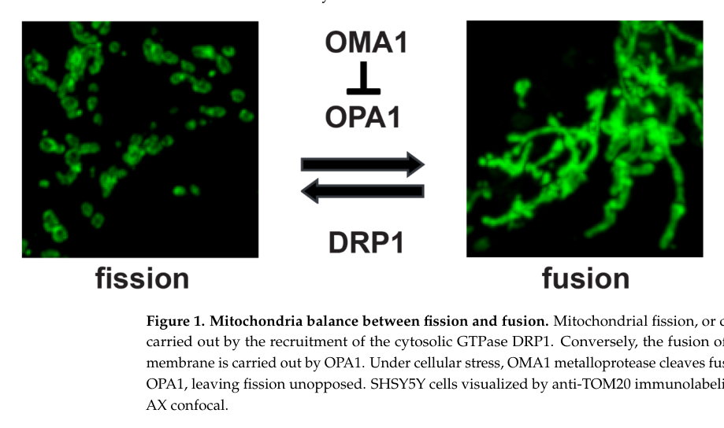

## Question

# Gene Research for Functional Annotation

## ⚠️ CRITICAL: Gene/Protein Identification Context

**BEFORE YOU BEGIN RESEARCH:** You MUST verify you are researching the CORRECT gene/protein. Gene symbols can be ambiguous, especially for less well-characterized genes from non-model organisms.

### Target Gene/Protein Identity (from UniProt):
- **UniProt Accession:** Q96E52
- **Protein Description:** RecName: Full=Metalloendopeptidase OMA1, mitochondrial {ECO:0000305}; EC=3.4.24.- {ECO:0000269|PubMed:20038677, ECO:0000269|PubMed:32132706, ECO:0000269|PubMed:32132707}; AltName: Full=Metalloprotease-related protein 1 {ECO:0000303|PubMed:12886954}; Short=MPRP-1 {ECO:0000303|PubMed:12886954}; AltName: Full=Overlapping with the m-AAA protease 1 homolog {ECO:0000303|PubMed:20038677}; Flags: Precursor;
- **Gene Information:** Name=OMA1 {ECO:0000303|PubMed:20038677, ECO:0000312|HGNC:HGNC:29661}; Synonyms=MPRP1 {ECO:0000303|PubMed:12886954};
- **Organism (full):** Homo sapiens (Human).
- **Protein Family:** Belongs to the peptidase M48 family. .
- **Key Domains:** Mito/Outer_Membr_Metalloprot. (IPR051156); Peptidase_M48. (IPR001915); Peptidase_M48 (PF01435)

### MANDATORY VERIFICATION STEPS:

1. **Check if the gene symbol "OMA1" matches the protein description above**
2. **Verify the organism is correct:** Homo sapiens (Human).
3. **Check if protein family/domains align with what you find in literature**
4. **If you find literature for a DIFFERENT gene with the same or similar symbol, STOP**

### If Gene Symbol is Ambiguous or You Cannot Find Relevant Literature:

**DO NOT PROCEED WITH RESEARCH ON A DIFFERENT GENE.** Instead:
- State clearly: "The gene symbol 'OMA1' is ambiguous or literature is limited for this specific protein"
- Explain what you found (e.g., "Found extensive literature on a different gene with the same symbol in a different organism")
- Describe the protein based ONLY on the UniProt information provided above
- Suggest that the protein function can be inferred from domain/family information

### Research Target:

Please provide a comprehensive research report on the gene **OMA1** (gene ID: OMA1, UniProt: Q96E52) in human.

The research report should be a detailed narrative explaining the function, biological processes, and localization of the gene product. Citations should be given for all claims.

You should prioritize authoritative reviews and primary scientific literature when conducting research. You can supplement
this with annotations you find in gene/protein databases, but these can be outdated or inaccurate.

We are specifically interested in the primary function of the gene - for enzymes, what reaction is catalyzed, and what is the substrate specificity? For transporters, what is the substrate? For structural proteins or adapters, what is the broader structural role? For signaling molecules, what is the role in the pathway.

We are interested in where in or outside the cell the gene product carries out its function.

We are also interested in the signaling or biochemical pathways in which the gene functions. We are less interested in broad pleiotropic effects, except where these elucidate the precise role.

Include evidence where possible. We are interested in both experimental evidence as well as inference from structure, evolution, or bioinformatic analysis. Precise studies should be prioritized over high-throughput, where available.

## Output

Question: You are an expert researcher providing comprehensive, well-cited information.

Provide detailed information focusing on:
1. Key concepts and definitions with current understanding
2. Recent developments and latest research (prioritize 2023-2024 sources)
3. Current applications and real-world implementations
4. Expert opinions and analysis from authoritative sources
5. Relevant statistics and data from recent studies

Format as a comprehensive research report with proper citations. Include URLs and publication dates where available.
Always prioritize recent, authoritative sources and provide specific citations for all major claims.

# Gene Research for Functional Annotation

## ⚠️ CRITICAL: Gene/Protein Identification Context

**BEFORE YOU BEGIN RESEARCH:** You MUST verify you are researching the CORRECT gene/protein. Gene symbols can be ambiguous, especially for less well-characterized genes from non-model organisms.

### Target Gene/Protein Identity (from UniProt):
- **UniProt Accession:** Q96E52
- **Protein Description:** RecName: Full=Metalloendopeptidase OMA1, mitochondrial {ECO:0000305}; EC=3.4.24.- {ECO:0000269|PubMed:20038677, ECO:0000269|PubMed:32132706, ECO:0000269|PubMed:32132707}; AltName: Full=Metalloprotease-related protein 1 {ECO:0000303|PubMed:12886954}; Short=MPRP-1 {ECO:0000303|PubMed:12886954}; AltName: Full=Overlapping with the m-AAA protease 1 homolog {ECO:0000303|PubMed:20038677}; Flags: Precursor;
- **Gene Information:** Name=OMA1 {ECO:0000303|PubMed:20038677, ECO:0000312|HGNC:HGNC:29661}; Synonyms=MPRP1 {ECO:0000303|PubMed:12886954};
- **Organism (full):** Homo sapiens (Human).
- **Protein Family:** Belongs to the peptidase M48 family. .
- **Key Domains:** Mito/Outer_Membr_Metalloprot. (IPR051156); Peptidase_M48. (IPR001915); Peptidase_M48 (PF01435)

### MANDATORY VERIFICATION STEPS:

1. **Check if the gene symbol "OMA1" matches the protein description above**
2. **Verify the organism is correct:** Homo sapiens (Human).
3. **Check if protein family/domains align with what you find in literature**
4. **If you find literature for a DIFFERENT gene with the same or similar symbol, STOP**

### If Gene Symbol is Ambiguous or You Cannot Find Relevant Literature:

**DO NOT PROCEED WITH RESEARCH ON A DIFFERENT GENE.** Instead:
- State clearly: "The gene symbol 'OMA1' is ambiguous or literature is limited for this specific protein"
- Explain what you found (e.g., "Found extensive literature on a different gene with the same symbol in a different organism")
- Describe the protein based ONLY on the UniProt information provided above
- Suggest that the protein function can be inferred from domain/family information

### Research Target:

Please provide a comprehensive research report on the gene **OMA1** (gene ID: OMA1, UniProt: Q96E52) in human.

The research report should be a detailed narrative explaining the function, biological processes, and localization of the gene product. Citations should be given for all claims.

You should prioritize authoritative reviews and primary scientific literature when conducting research. You can supplement
this with annotations you find in gene/protein databases, but these can be outdated or inaccurate.

We are specifically interested in the primary function of the gene - for enzymes, what reaction is catalyzed, and what is the substrate specificity? For transporters, what is the substrate? For structural proteins or adapters, what is the broader structural role? For signaling molecules, what is the role in the pathway.

We are interested in where in or outside the cell the gene product carries out its function.

We are also interested in the signaling or biochemical pathways in which the gene functions. We are less interested in broad pleiotropic effects, except where these elucidate the precise role.

Include evidence where possible. We are interested in both experimental evidence as well as inference from structure, evolution, or bioinformatic analysis. Precise studies should be prioritized over high-throughput, where available.

# Human OMA1 (UniProt Q96E52): Functional-Annotation Research Report

## Executive summary

The target identity is verified. **OMA1** in this report is the human gene **OMA1** (HGNC-approved name: *OMA1 zinc metallopeptidase*; Ensembl ENSG00000162600), encoding UniProt **Q96E52**, also called MPRP1. The literature explicitly identifies *Homo sapiens* Q96E52 as an OMA1 homologue and describes a 524-residue, approximately 60-kDa precursor that is processed to a mature species migrating just below 40 kDa. Its M48 peptidase classification, conserved HExxH zinc-binding motif, mitochondrial localization, and protease function all agree with the supplied UniProt record; no similarly named protein from another organism was substituted. (alavi2021oma1—anintegralmembrane pages 1-6, kaser2003oma1anovel pages 4-5)

OMA1 is best annotated as a **stress-regulated, ATP-independent zinc metalloendopeptidase embedded in the mitochondrial inner membrane**. Its two firmly established regulatory substrates define its principal functions: cleavage of **OPA1** suppresses inner-membrane fusion and remodels cristae, whereas cleavage of **DELE1** relays mitochondrial dysfunction to the cytosolic **HRI–eIF2α integrated stress response (ISR)**. OMA1 is therefore not merely a bulk protein-quality-control protease; it is a proteolytic switch coupling inner-membrane state to organelle architecture and cell-wide stress signaling. (gilkerson2024oma1mediatedmitochondrialdynamics pages 5-6, gilkerson2021mitochondrialoma1and pages 5-6, alavi2021oma1—anintegralmembrane pages 1-6)

## 1. Identity, protein class, and structural annotation

Human OMA1 belongs to **peptidase family M48** and contains the characteristic **HExxH metal-binding motif**. Metal-chelator-sensitive proteolysis, conservation of the motif, and the absence of an ATPase domain support zinc-dependent peptide-bond hydrolysis without ATP-driven substrate unfolding or translocation. Accordingly, the appropriate enzyme-level annotation is an **ATP-independent zinc metalloendopeptidase**; the current EC designation remains nonspecific (EC 3.4.24.-), because a comprehensive sequence rule for substrate recognition has not been established. (alavi2021oma1—anintegralmembrane pages 1-6, kaser2003oma1anovel pages 8-8, kaser2003oma1anovel pages 4-5)

Detailed human topology is less certain than the functional classification. Experimental and substrate-accessibility evidence places OMA1 in the **inner mitochondrial membrane**, acting on intermembrane-space-exposed regions of mammalian OPA1 and DELE1. A mammalian model proposes six or seven transmembrane helices, an N-terminal matrix-facing segment, and an intermembrane-space-facing catalytic region or membrane-embedded reaction chamber. However, this architecture was inferred substantially from sequence and homology modeling rather than a definitive experimentally determined human structure. Older yeast findings—including evidence for cleavage access at different membrane surfaces—should not be transferred residue-for-residue to the human protein. (alavi2021oma1—anintegralmembrane pages 10-13, kaser2003oma1anovel pages 8-8)

| Aspect | Current annotation | Direct evidence/examples | Confidence/caveat |
|---|---|---|---|
| Identity and family | Human **OMA1** is UniProt **Q96E52**, a 524-aa mitochondrial zinc metalloendopeptidase also called **MPRP1**, belonging to peptidase family **M48**. | Comparative sequence analysis explicitly identifies *Homo sapiens* Q96E52 as an OMA1 homologue; reviews report a ~60-kDa precursor and mature species migrating just below 40 kDa. (alavi2021oma1—anintegralmembrane pages 1-6, kaser2003oma1anovel pages 4-5) | **High.** Gene, accession, organism, family, and protein description agree; no conflicting same-symbol protein was used. Mature-protein size is based partly on migration and processing models. |
| Localization and topology | OMA1 is an integral protein of the **mitochondrial inner membrane**; mammalian substrates OPA1 and DELE1 expose OMA1-accessible regions toward the **intermembrane space (IMS)**. | Mitochondrial localization, membrane association, and IMS-directed proteolysis are supported experimentally and functionally. Mammalian models predict six or seven transmembrane helices, an N-terminal matrix-facing segment, and an IMS-facing catalytic region. (alavi2021oma1—anintegralmembrane pages 1-6, alavi2021oma1—anintegralmembrane pages 10-13) | **High** for inner-membrane localization and access to IMS substrates; **moderate** for detailed topology. The multispanning architecture and reaction chamber derive substantially from homology modeling because a definitive human experimental structure was unavailable in the cited literature. Yeast topology observations should not be transferred uncritically to human OMA1. |
| Catalytic class, motif, and energy use | OMA1 is an **ATP-independent zinc metalloprotease** containing the conserved **HExxH** metal-binding motif. It catalyzes peptide-bond hydrolysis rather than ATP-driven unfolding or translocation. | M48-family sequence conservation, chelator-sensitive proteolysis in mitochondrial systems, and absence of an ATPase domain support metal-dependent, ATP-independent catalysis. (alavi2021oma1—anintegralmembrane pages 1-6, kaser2003oma1anovel pages 8-8, kaser2003oma1anovel pages 4-5) | **High** for metalloprotease class, HExxH motif, and ATP independence. Exact human catalytic geometry and reaction-chamber architecture remain inferred in the absence of a definitive experimental structure. |
| OPA1 substrate and specificity | Stress-activated OMA1 cleaves fusion-active long OPA1 at the **S1 site between Arg194 and Ala195**, generating short OPA1 and suppressing inner-membrane fusion. This leaves fission relatively unopposed and promotes mitochondrial fragmentation. | OMA1-dependent OPA1 processing is supported by knockout, depletion, stress, and cleavage-site-mutant studies; deletion around Arg194–Ala195 inhibits S1 processing. OPA1 cleavage is not required to activate OMA1. (alavi2021oma1—anintegralmembrane pages 6-10, alavi2021oma1—anintegralmembrane pages 10-13, gilkerson2021mitochondrialoma1and pages 5-6) | **High** for OPA1 as a physiological substrate and the S1 site. OMA1 is not simply a bulk degradative protease: substrate accessibility, membrane context, stress state, and OPA1 isoform processing influence specificity. Short OPA1 can retain context-dependent cristae or bioenergetic functions, so cleavage is not invariably harmful. |
| DELE1–HRI integrated stress response | OMA1 cleaves mitochondrial DELE1 to produce **S-DELE1**, which reaches the cytosol, activates **HRI/EIF2AK1**, increases **eIF2α phosphorylation**, reduces general translation, and induces ATF4/ATF5/CHOP-associated stress programs. | Two independent 2020 *Nature* studies established the pathway; subsequent genetic studies confirmed OMA1-dependent DELE1 processing and HRI/ISR activation under mitochondrial stress. (gilkerson2024oma1mediatedmitochondrialdynamics pages 11-12, gilkerson2021mitochondrialoma1and pages 5-6, kroczek2026stressadaptationof pages 17-21, gilkerson2024oma1mediatedmitochondrialdynamics pages 5-6) | **High** for the signaling sequence. The net outcome is context-dependent: transient ISR can promote adaptation, whereas prolonged signaling may contribute to growth arrest or pathology. |
| Stress activation and turnover | OMA1 is relatively quiescent at baseline but responds rapidly to disturbed inner-membrane homeostasis, including loss or abnormal elevation of membrane potential, ROS, respiratory inhibition, proteotoxic stress, and defective AAA-protease activity. Activated OMA1 subsequently undergoes self-cleavage/turnover, constraining the response. | Activation or OPA1 processing occurs after FCCP/CCCP, rotenone, oligomycin, hydrogen peroxide, actinonin, valinomycin, and AFG3L2 loss. Autocatalytic turnover and reciprocal regulation involving YME1L1/prohibitin-associated complexes have been reported. (alavi2021oma1—anintegralmembrane pages 1-6, alavi2021oma1—anintegralmembrane pages 6-10, alavi2021oma1—anintegralmembrane pages 13-17, fogo2024mitochondrialmembranepotential pages 1-3, fogo2024mitochondrialmembranepotential pages 15-16) | **High** for stress responsiveness and post-activation turnover; **moderate** for a single universal activation mechanism. Evidence favors integration of membrane-state, redox, proteostatic, and lipid/protein-complex cues rather than sensing membrane potential alone. |
| 2024 SPAX5 findings | In biallelic **AFG3L2** disease models, proteotoxic stress overactivates OMA1 and the DELE1–HRI ISR; in this setting, sustained ISR activity was protective rather than pathogenic. | SPAX5 fibroblasts and *Afg3l2*−/− cerebellum showed increased phospho-eIF2α, ATF4, Chop, Chac1, Ppp1r15a, and Fgf21. DELE1 or HRI silencing worsened fibroblast growth. Sephin-1 at **8 mg/kg** improved cellular and Purkinje-neuron phenotypes and extended mutant-mouse lifespan by **10 days**; selected analyses used ≥60 neurons and ≥70 mitochondria per mouse with *n*=3, and ATP assays used *n*=7 per group. (franchino2024sustainedoma1mediatedintegrated pages 10-13, franchino2024sustainedoma1mediatedintegrated pages 1-2, franchino2024sustainedoma1mediatedintegrated pages 13-14) | **Moderate-to-high preclinical evidence.** Small animal cohorts and a modest lifespan extension limit translation. Endogenous DELE1 cleavage could not be measured directly in some experiments because suitable antibodies were unavailable, and Sephin-1 acts downstream by prolonging ISR signaling rather than selectively activating OMA1. |
| 2024 neuronal OGD/R findings | OMA1 integrates ROS with membrane-potential disturbances during neuronal stress. OPA1 cleavage begins during oxygen–glucose deprivation, while preserved long OPA1 can improve restorative fusion after stress. | In HT22 cells, both depolarizing and hyperpolarizing treatments altered OMA1-dependent OPA1 processing. ROS was sufficient for activation and necessary for depolarization-associated proteolysis. OMA1 knockout unexpectedly increased acute FCCP/oligomycin fragmentation but supported fusion during recovery, especially when new protein synthesis was blocked. Primary-neuron OGD/R experiments placed ROS-dependent processing during the deprivation phase. (fogo2024mitochondrialmembranepotential pages 11-13, fogo2024mitochondrialmembranepotential pages 1-3) | **Moderate.** Results reveal stage-dependent benefits and costs of OMA1 activity, but much of the work used an immortalized mouse hippocampal line; human neuronal relevance remains to be established. |
| 2024 mitochondrial myopathy and cardiomyopathy | The OMA1–DELE1 mitochondrial ISR supports proteostasis, growth, and survival in mouse mitochondrial myopathy. Separately, regulated OPA1 processing is dispensable for normal mouse development but protective in OXPHOS-deficient cardiomyopathy. | Diverse myopathy models linked OMA1/DELE1 sensing of inner-membrane disruption to adaptive mt-ISR activity; loss of this response caused dysregulated translation, protein misfolding, and impaired growth or survival. In *Cox10*−/− hearts, preventing OPA1 processing disturbed the balance between mitochondrial biogenesis and mitophagy, whereas cleavable OPA1 prolonged survival. (kroczek2026stressadaptationof pages 17-21) | **Moderate-to-high preclinical evidence.** These studies support stress- and tissue-specific benefit, not blanket OMA1 activation. Cardiomyopathy data establish the value of OPA1 processing but do not prove that every protective effect is mediated exclusively by OMA1 rather than the broader processing network. |
| Translational status | OMA1 is currently a mechanistic biomarker and experimental target in mitochondrial disease, neurodegeneration, ischemia, cardiomyopathy, and cancer models; it is **not an established clinical drug target**. | The literature reports no selective OMA1 inhibitor, approved OMA1-directed treatment, or OMA1-specific clinical trial. EGCG and chloramphenicol have been used as indirect or incompletely characterized modulators, while Sephin-1 acts downstream at the ISR-feedback level. (alavi2021oma1—anintegralmembrane pages 1-6, alavi2021oma1—anintegralmembrane pages 13-17) | **High** that direct translation remained immature in the surveyed literature. Therapeutic direction is intrinsically context-dependent: inhibiting OMA1 may preserve long OPA1 after acute injury, whereas maintaining OMA1–DELE1 ISR signaling can be beneficial in chronic proteotoxic mitochondrial disease. |

*Table: Evidence-weighted annotation of human OMA1 (Q96E52), covering identity, localization, catalytic function, direct substrates, stress regulation, recent disease-model findings, and translational maturity. Confidence notes distinguish established mechanisms from structural inference and context-dependent preclinical findings.*

## 2. Primary biochemical function and substrate specificity

### 2.1 OPA1 processing: control of inner-membrane fusion

The best-characterized substrate is **OPA1**, a dynamin-family GTPase required for mitochondrial inner-membrane fusion and crista organization. Stress-activated OMA1 cleaves long, membrane-anchored OPA1 at the **S1 site between Arg194 and Ala195**, generating short OPA1 forms. This lowers fusion competence; continuing DRP1-dependent fission is then relatively unopposed, producing a fragmented mitochondrial network. OMA1 can process multiple OPA1 isoforms, and OPA1 itself is not required to activate OMA1. (alavi2021oma1—anintegralmembrane pages 6-10, alavi2021oma1—anintegralmembrane pages 10-13, gilkerson2021mitochondrialoma1and pages 5-6)

Cleavage is regulatory, not equivalent to indiscriminate degradation. OPA1 membrane context, isoform composition, cleavage-site accessibility, and competition or coordination with YME1L1 determine the long/short OPA1 balance. Short OPA1 is generally insufficient for inner-membrane fusion but can retain context-dependent functions in crista maintenance, bioenergetics, and protection from some forms of cell death. Thus, “OMA1 activation equals damage” is too simple: rapid fragmentation can isolate impaired mitochondrial units, whereas excessive or persistent cleavage can compromise connectivity and crista integrity. (gilkerson2021mitochondrialoma1and pages 5-6, fogo2024mitochondrialmembranepotential pages 1-3)

A 2024 review figure directly visualizes this balance: OMA1-mediated inhibition of OPA1 shifts mitochondria toward fission, whereas OPA1 activity supports a fused network. (gilkerson2024oma1mediatedmitochondrialdynamics media 372c2f6b)

### 2.2 DELE1 processing: mitochondrial-to-cytosolic stress signaling

The second core substrate is **DELE1**. Under mitochondrial stress, OMA1 cleaves inner-membrane-associated DELE1, generating short DELE1 that reaches the cytosol. Cytosolic DELE1 activates **HRI/EIF2AK1**, which phosphorylates **eIF2α**. This suppresses general translation while favoring an adaptive transcriptional program involving ATF4 and, depending on context, ATF5, CHOP, CHAC1, PPP1R15A/GADD34, and FGF21. Independent 2020 *Nature* studies established this pathway: Fessler et al., DOI [10.1038/s41586-020-2076-4](https://doi.org/10.1038/s41586-020-2076-4), and Guo et al., DOI [10.1038/s41586-020-2078-2](https://doi.org/10.1038/s41586-020-2078-2). (gilkerson2024oma1mediatedmitochondrialdynamics pages 11-12, gilkerson2021mitochondrialoma1and pages 5-6, kroczek2026stressadaptationof pages 17-21)

This **OMA1→DELE1→HRI→eIF2α** cascade is now considered the principal mechanism by which inner-membrane proteotoxic or bioenergetic dysfunction is converted into a cell-wide translational response. Its output is context-dependent: transient signaling can restore proteostasis and survival, whereas prolonged ISR activity may cause growth arrest or contribute to pathology. (gilkerson2024oma1mediatedmitochondrialdynamics pages 5-6)

### 2.3 What is known—and unknown—about specificity

OMA1 recognizes a limited group of membrane-associated regulatory substrates rather than a simple free-peptide consensus. OPA1’s S1 site is precisely mapped, but a universal OMA1 cleavage motif has not been validated. Membrane insertion, local unfolding, oligomeric state, lipid environment, and stress-dependent conformational changes probably contribute to recognition. Deletions within OMA1 helix VI can abolish OMA1 self-cleavage while preserving OPA1 cleavage, indicating separable determinants for catalytic access, substrate recognition, and autoregulation. (alavi2021oma1—anintegralmembrane pages 10-13, alavi2021oma1—anintegralmembrane pages 13-17)

## 3. Activation and termination of OMA1 activity

OMA1 is comparatively quiescent under basal conditions and rapidly activated when inner-membrane homeostasis is disturbed. Reported triggers include membrane depolarization by FCCP/CCCP or valinomycin, respiratory inhibition by rotenone, hyperpolarizing or ATP-synthase stress caused by oligomycin, hydrogen peroxide and other ROS-generating conditions, actinonin-induced proteotoxicity, and loss of AFG3L2 or disruption of prohibitin-associated quality-control complexes. Activated OMA1 subsequently undergoes self-cleavage and turnover, limiting the duration of proteolysis. Interactions with YME1L1, AFG3L2, PHB2, SLP2, DNAJC19, cardiolipin, and associated inner-membrane complexes have been proposed to tune this response. (alavi2021oma1—anintegralmembrane pages 1-6, alavi2021oma1—anintegralmembrane pages 6-10, alavi2021oma1—anintegralmembrane pages 13-17)

Current evidence argues against membrane potential being the sole sensor. In neuronal models, both depolarization and hyperpolarization altered OMA1-dependent OPA1 processing, while ROS was sufficient for activation and necessary for depolarization-induced processing. The most defensible model is therefore that OMA1 integrates **electrical, redox, proteostatic, and membrane-complex cues**, rather than measuring only ΔΨm. (fogo2024mitochondrialmembranepotential pages 11-13, fogo2024mitochondrialmembranepotential pages 1-3)

## 4. Pathway-level biological roles

### Mitochondrial dynamics and cristae

Through OPA1 cleavage, OMA1 reduces inner-membrane fusion, changes crista-junction organization, and can facilitate cytochrome-c mobilization during apoptosis. Its influence on mitophagy is indirect and context-sensitive: fragmentation can aid segregation of dysfunctional mitochondrial material, but OPA1 processing also changes biogenesis–mitophagy balance and bioenergetic recovery. (gilkerson2024oma1mediatedmitochondrialdynamics pages 5-6)

### Proteostasis and the ISR

Through DELE1, OMA1 reduces global translational load and induces adaptive gene expression. This is especially relevant when mitochondrial protein synthesis, respiratory-complex assembly, or inner-membrane protease capacity is impaired. Recent disease models show that this response can preserve protein folding, tissue growth, and organismal survival rather than simply mark terminal stress. (franchino2024sustainedoma1mediatedintegrated pages 10-13, franchino2024sustainedoma1mediatedintegrated pages 1-2, kroczek2026stressadaptationof pages 17-21)

### Apoptosis, autophagy, and bioenergetics

OMA1 sits upstream of these broader phenotypes but should not be annotated as their sole executor. OPA1/crista remodeling can prime cytochrome-c release; DELE1 signaling can alter translation and survival programs; and changes in mitochondrial fragmentation affect organelle sequestration and respiratory capacity. These are downstream consequences of the two direct proteolytic axes and vary with cell type, stress intensity, and duration. (gilkerson2024oma1mediatedmitochondrialdynamics pages 5-6)

## 5. Recent developments, emphasizing 2023–2024

### SPAX5 and AFG3L2 deficiency

Franchino et al., published in *Brain* in October 2024, examined fibroblasts from patients with spastic ataxia type 5, AFG3L2-depleted HEK293T cells, primary Purkinje neurons, and *Afg3l2*−/− mice. AFG3L2 deficiency increased OMA1-dependent DELE1 processing and was associated with elevated phospho-eIF2α, ATF4, Chop, Chac1, Ppp1r15a, and Fgf21. Silencing DELE1 or HRI worsened fibroblast growth, indicating that the OMA1-driven ISR was protective in this proteotoxic setting. DOI: [10.1093/brain/awad340](https://doi.org/10.1093/brain/awad340). (franchino2024sustainedoma1mediatedintegrated pages 10-13, franchino2024sustainedoma1mediatedintegrated pages 1-2)

Pharmacological prolongation of ISR signaling with **Sephin-1 at 8 mg/kg** improved fibroblast growth, Purkinje-neuron survival and arborization, crista morphology, and cerebellar ATP production, but extended mutant-mouse lifespan by only **10 days**. Selected morphological analyses examined at least 60 neurons and 70 mitochondria per mouse with three mice per condition; ATP assays used seven mice per group. Limitations include small animal cohorts, modest survival benefit, inability to quantify endogenous DELE1 cleavage in some experiments because adequate antibodies were unavailable, and uncertainty about applicability to milder chronic AFG3L2 disease. (franchino2024sustainedoma1mediatedintegrated pages 10-13, franchino2024sustainedoma1mediatedintegrated pages 13-14)

### Neuronal ischemic stress

Fogo et al., *FASEB Journal*, September 2024, showed in HT22 neuronal cells and oxygen–glucose deprivation/reoxygenation models that ROS and membrane-potential disturbances jointly regulate OMA1. OPA1 processing began during oxygen–glucose deprivation and was ROS-dependent. Unexpectedly, OMA1-knockout cells fragmented more during acute FCCP or oligomycin stress, but recovered fusion more effectively—particularly when new protein synthesis was blocked—because long OPA1 was preserved. DOI: [10.1096/fj.202400313R](https://doi.org/10.1096/fj.202400313R). These findings distinguish OMA1’s acute adaptive role from its potential to impede post-stress network recovery. (fogo2024mitochondrialmembranepotential pages 11-13, fogo2024mitochondrialmembranepotential pages 1-3)

### Mitochondrial myopathy and cardiomyopathy

Lin et al., *EMBO Journal*, October 2024, used diverse mouse mitochondrial-myopathy models and found that OMA1 and DELE1 sense inner-membrane disruption and activate a mitochondrial ISR needed for proteostasis, normal growth, and survival. Without this response, muscle translation became dysregulated and protein misfolding increased. DOI: [10.1038/s44318-024-00242-x](https://doi.org/10.1038/s44318-024-00242-x). The response was tissue-heterogeneous, being broad in heart and skeletal muscle but limited in liver and brown adipose tissue. (kroczek2026stressadaptationof pages 17-21)

Ahola et al., *Science Advances*, August 2024, found that OPA1 processing was dispensable for normal mouse development and ordinary metabolic or thermal stress, but protected OXPHOS-deficient *Cox10*−/− hearts and prolonged survival. Preventing processing disrupted the balance between mitochondrial biogenesis and mitophagy. DOI: [10.1126/sciadv.adp0443](https://doi.org/10.1126/sciadv.adp0443). This demonstrates physiological benefit from regulated OPA1 processing, although it does not imply that all protection is exclusively OMA1-mediated. (kroczek2026stressadaptationof pages 17-21)

### Cancer-related evidence

A 2023 study of monosomy 5/del(5q) AML identified **DELE1**, rather than OMA1 itself, as the most consistently downregulated gene in 48 deletion-bearing specimens versus 367 control AML samples; partial DELE1 loss reduced sensitivity to mitochondrial stress. This supports clinical relevance of the OMA1–DELE1 relay but does not establish OMA1 as a validated AML driver or drug target. DOI: [10.1038/s41375-023-02107-4](https://doi.org/10.1038/s41375-023-02107-4).

## 6. Disease interpretation and evidence quality

OMA1 dysregulation has been implicated experimentally in AFG3L2-related ataxia, mitochondrial myopathy and cardiomyopathy, neurodegeneration, ischemia/reperfusion injury, metabolic phenotypes, and cancer stress adaptation. However, many associations arise from secondary activation of OMA1 by another mitochondrial lesion, not from pathogenic human OMA1 variants. Database-level associations with diabetes, restless-legs syndrome, Paget disease, substance abuse, and mathematical ability have low-to-moderate Open Targets scores and sparse evidence; these should be treated as hypothesis-generating associations rather than established OMA1 disorders. (OpenTargets Search: -OMA1)

The central expert interpretation emerging from recent work is that OMA1 has a **double-edged, stage-dependent function**. In acute injury, limiting OPA1 cleavage may preserve fusion and accelerate network recovery. In chronic proteotoxic or OXPHOS disease, OMA1-dependent OPA1 processing and DELE1–HRI signaling can preserve proteostasis, mitophagy balance, and survival. A therapeutic program must therefore specify substrate, tissue, stress stage, and desired direction of modulation rather than treating total OMA1 activity as uniformly harmful or beneficial. (franchino2024sustainedoma1mediatedintegrated pages 10-13, fogo2024mitochondrialmembranepotential pages 11-13, kroczek2026stressadaptationof pages 17-21, fogo2024mitochondrialmembranepotential pages 1-3)

## 7. Current applications and translational status

Current applications are primarily **research and preclinical**:

- OPA1 long/short isoform ratios serve as a biochemical readout of OMA1 activation.
- DELE1 processing, phospho-eIF2α, ATF4, CHOP, CHAC1, PPP1R15A, and FGF21 report engagement of the mitochondrial ISR.
- OMA1-knockout or catalytic mutants are used to dissect mitochondrial fragmentation, recovery, ischemic stress, and proteotoxic disease.
- Downstream ISR modulation is being tested preclinically, exemplified by Sephin-1 in SPAX5 models. (franchino2024sustainedoma1mediatedintegrated pages 10-13, fogo2024mitochondrialmembranepotential pages 11-13)

No selective OMA1 inhibitor had been disclosed in the surveyed authoritative literature, and there is no established OMA1-directed approved therapy or OMA1-specific clinical trial. EGCG and chloramphenicol have been discussed only as indirect or incompletely characterized experimental modulators; Sephin-1 acts downstream by inhibiting ISR feedback rather than selectively targeting OMA1. Consequently, claims of current clinical implementation would be premature. (alavi2021oma1—anintegralmembrane pages 1-6, alavi2021oma1—anintegralmembrane pages 13-17)

## 8. Recommended functional annotation

**Molecular function:** stress-activated, ATP-independent zinc metalloendopeptidase of the mitochondrial inner membrane; catalyzes limited proteolysis of membrane-associated regulatory proteins, most firmly OPA1 and DELE1.

**Primary reaction:** hydrolysis of peptide bonds in accessible regions of mitochondrial inner-membrane substrates. For OPA1, the canonical stress-responsive S1 cleavage occurs at **Arg194–Ala195**. A general sequence-level substrate consensus is not established. (alavi2021oma1—anintegralmembrane pages 10-13)

**Cellular location:** mitochondrial inner membrane, with mammalian proteolytic access principally to intermembrane-space-exposed substrate regions. Detailed multispanning topology remains partly model-based. (alavi2021oma1—anintegralmembrane pages 1-6, alavi2021oma1—anintegralmembrane pages 10-13)

**Core biological processes:** regulation of mitochondrial inner-membrane fusion and crista organization through OPA1; mitochondrial stress-to-cytosol signaling through DELE1–HRI–eIF2α; secondary, context-dependent effects on mitophagy, apoptosis, respiration, and tissue adaptation. (gilkerson2024oma1mediatedmitochondrialdynamics pages 5-6, gilkerson2021mitochondrialoma1and pages 5-6)

**Overall confidence:** high for identity, catalytic family, localization, OPA1 processing, and DELE1–HRI signaling; moderate for precise human topology, universal activation mechanism, broader substrate spectrum, and disease-specific therapeutic direction.

References

1. (alavi2021oma1—anintegralmembrane pages 1-6): Marcel V. Alavi. Oma1—an integral membrane protease? Feb 2021. URL: https://doi.org/10.1016/j.bbapap.2020.140558, doi:10.1016/j.bbapap.2020.140558. This article has 34 citations and is from a peer-reviewed journal.

2. (kaser2003oma1anovel pages 4-5): Michael Käser, Melanie Kambacheld, Brigitte Kisters-Woike, and Thomas Langer. Oma1, a novel membrane-bound metallopeptidase in mitochondria with activities overlapping with the m-aaa protease*. Journal of Biological Chemistry, 278:46414-46423, Nov 2003. URL: https://doi.org/10.1074/jbc.m305584200, doi:10.1074/jbc.m305584200. This article has 225 citations and is from a domain leading peer-reviewed journal.

3. (gilkerson2024oma1mediatedmitochondrialdynamics pages 5-6): Robert Gilkerson, Harpreet Kaur, Omar Carrillo, and Isaiah Ramos. Oma1-mediated mitochondrial dynamics balance organellar homeostasis upstream of cellular stress responses. Apr 2024. URL: https://doi.org/10.3390/ijms25084566, doi:10.3390/ijms25084566. This article has 19 citations.

4. (gilkerson2021mitochondrialoma1and pages 5-6): Robert Gilkerson, Patrick De La Torre, and Shaynah St. Vallier. Mitochondrial oma1 and opa1 as gatekeepers of organellar structure/function and cellular stress response. Frontiers in Cell and Developmental Biology, Mar 2021. URL: https://doi.org/10.3389/fcell.2021.626117, doi:10.3389/fcell.2021.626117. This article has 186 citations.

5. (kaser2003oma1anovel pages 8-8): Michael Käser, Melanie Kambacheld, Brigitte Kisters-Woike, and Thomas Langer. Oma1, a novel membrane-bound metallopeptidase in mitochondria with activities overlapping with the m-aaa protease*. Journal of Biological Chemistry, 278:46414-46423, Nov 2003. URL: https://doi.org/10.1074/jbc.m305584200, doi:10.1074/jbc.m305584200. This article has 225 citations and is from a domain leading peer-reviewed journal.

6. (alavi2021oma1—anintegralmembrane pages 10-13): Marcel V. Alavi. Oma1—an integral membrane protease? Feb 2021. URL: https://doi.org/10.1016/j.bbapap.2020.140558, doi:10.1016/j.bbapap.2020.140558. This article has 34 citations and is from a peer-reviewed journal.

7. (alavi2021oma1—anintegralmembrane pages 6-10): Marcel V. Alavi. Oma1—an integral membrane protease? Feb 2021. URL: https://doi.org/10.1016/j.bbapap.2020.140558, doi:10.1016/j.bbapap.2020.140558. This article has 34 citations and is from a peer-reviewed journal.

8. (gilkerson2024oma1mediatedmitochondrialdynamics pages 11-12): Robert Gilkerson, Harpreet Kaur, Omar Carrillo, and Isaiah Ramos. Oma1-mediated mitochondrial dynamics balance organellar homeostasis upstream of cellular stress responses. Apr 2024. URL: https://doi.org/10.3390/ijms25084566, doi:10.3390/ijms25084566. This article has 19 citations.

9. (kroczek2026stressadaptationof pages 17-21): Lara Kroczek, Hendrik Nolte, Yvonne Lasarzewski, Thibaut Molinié, Daniel Curbelo Pinero, Kathrin Lemke, Elena I Rugarli, and Thomas Langer. Stress adaptation of mitochondrial protein import by oma1-mediated degradation of dnajc15. Mar 2026. URL: https://doi.org/10.1101/2025.03.04.641455, doi:10.1101/2025.03.04.641455. This article has 7 citations.

10. (alavi2021oma1—anintegralmembrane pages 13-17): Marcel V. Alavi. Oma1—an integral membrane protease? Feb 2021. URL: https://doi.org/10.1016/j.bbapap.2020.140558, doi:10.1016/j.bbapap.2020.140558. This article has 34 citations and is from a peer-reviewed journal.

11. (fogo2024mitochondrialmembranepotential pages 1-3): Garrett M. Fogo, Sarita Raghunayakula, Katlynn J. Emaus, Francisco J. Torres Torres, Joseph M. Wider, and Thomas H. Sanderson. Mitochondrial membrane potential and oxidative stress interact to regulate oma1‐dependent processing of opa1 and mitochondrial dynamics. Sep 2024. URL: https://doi.org/10.1096/fj.202400313r, doi:10.1096/fj.202400313r. This article has 42 citations.

12. (fogo2024mitochondrialmembranepotential pages 15-16): Garrett M. Fogo, Sarita Raghunayakula, Katlynn J. Emaus, Francisco J. Torres Torres, Joseph M. Wider, and Thomas H. Sanderson. Mitochondrial membrane potential and oxidative stress interact to regulate oma1‐dependent processing of opa1 and mitochondrial dynamics. Sep 2024. URL: https://doi.org/10.1096/fj.202400313r, doi:10.1096/fj.202400313r. This article has 42 citations.

13. (franchino2024sustainedoma1mediatedintegrated pages 10-13): Camilla Aurora Franchino, Martina Brughera, Valentina Baderna, Daniele De Ritis, Alessandra Rocco, Sara Seneca, Luc Regal, Paola Podini, Maurizio D’Antonio, Camilo Toro, Angelo Quattrini, Emmanuel Scalais, and Francesca Maltecca. Sustained oma1-mediated integrated stress response is beneficial for spastic ataxia type 5. Brain, 147:1043-1056, Oct 2024. URL: https://doi.org/10.1093/brain/awad340, doi:10.1093/brain/awad340. This article has 21 citations and is from a highest quality peer-reviewed journal.

14. (franchino2024sustainedoma1mediatedintegrated pages 1-2): Camilla Aurora Franchino, Martina Brughera, Valentina Baderna, Daniele De Ritis, Alessandra Rocco, Sara Seneca, Luc Regal, Paola Podini, Maurizio D’Antonio, Camilo Toro, Angelo Quattrini, Emmanuel Scalais, and Francesca Maltecca. Sustained oma1-mediated integrated stress response is beneficial for spastic ataxia type 5. Brain, 147:1043-1056, Oct 2024. URL: https://doi.org/10.1093/brain/awad340, doi:10.1093/brain/awad340. This article has 21 citations and is from a highest quality peer-reviewed journal.

15. (franchino2024sustainedoma1mediatedintegrated pages 13-14): Camilla Aurora Franchino, Martina Brughera, Valentina Baderna, Daniele De Ritis, Alessandra Rocco, Sara Seneca, Luc Regal, Paola Podini, Maurizio D’Antonio, Camilo Toro, Angelo Quattrini, Emmanuel Scalais, and Francesca Maltecca. Sustained oma1-mediated integrated stress response is beneficial for spastic ataxia type 5. Brain, 147:1043-1056, Oct 2024. URL: https://doi.org/10.1093/brain/awad340, doi:10.1093/brain/awad340. This article has 21 citations and is from a highest quality peer-reviewed journal.

16. (fogo2024mitochondrialmembranepotential pages 11-13): Garrett M. Fogo, Sarita Raghunayakula, Katlynn J. Emaus, Francisco J. Torres Torres, Joseph M. Wider, and Thomas H. Sanderson. Mitochondrial membrane potential and oxidative stress interact to regulate oma1‐dependent processing of opa1 and mitochondrial dynamics. Sep 2024. URL: https://doi.org/10.1096/fj.202400313r, doi:10.1096/fj.202400313r. This article has 42 citations.

17. (gilkerson2024oma1mediatedmitochondrialdynamics media 372c2f6b): Robert Gilkerson, Harpreet Kaur, Omar Carrillo, and Isaiah Ramos. Oma1-mediated mitochondrial dynamics balance organellar homeostasis upstream of cellular stress responses. Apr 2024. URL: https://doi.org/10.3390/ijms25084566, doi:10.3390/ijms25084566. This article has 19 citations.

18. (OpenTargets Search: -OMA1): Open Targets Query (-OMA1, 5 results). Buniello, A. et al. (2025). Open Targets Platform: facilitating therapeutic hypotheses building in drug discovery. Nucleic Acids Research.

## Artifacts

- [Edison artifact artifact-00](OMA1-deep-research-falcon_artifacts/artifact-00.md)

## Citations

1. kroczek2026stressadaptationof pages 17-21
2. fogo2024mitochondrialmembranepotential pages 1-3
3. fogo2024mitochondrialmembranepotential pages 15-16
4. fogo2024mitochondrialmembranepotential pages 11-13
5. 10.1038/s41586-020-2076-4
6. 10.1038/s41586-020-2078-2
7. 10.1093/brain/awad340
8. 10.1096/fj.202400313R
9. 10.1038/s44318-024-00242-x
10. 10.1126/sciadv.adp0443
11. 10.1038/s41375-023-02107-4
12. https://doi.org/10.1038/s41586-020-2076-4
13. https://doi.org/10.1038/s41586-020-2078-2
14. https://doi.org/10.1093/brain/awad340
15. https://doi.org/10.1096/fj.202400313R
16. https://doi.org/10.1038/s44318-024-00242-x
17. https://doi.org/10.1126/sciadv.adp0443
18. https://doi.org/10.1038/s41375-023-02107-4
19. https://doi.org/10.1016/j.bbapap.2020.140558,
20. https://doi.org/10.1074/jbc.m305584200,
21. https://doi.org/10.3390/ijms25084566,
22. https://doi.org/10.3389/fcell.2021.626117,
23. https://doi.org/10.1101/2025.03.04.641455,
24. https://doi.org/10.1096/fj.202400313r,
25. https://doi.org/10.1093/brain/awad340,