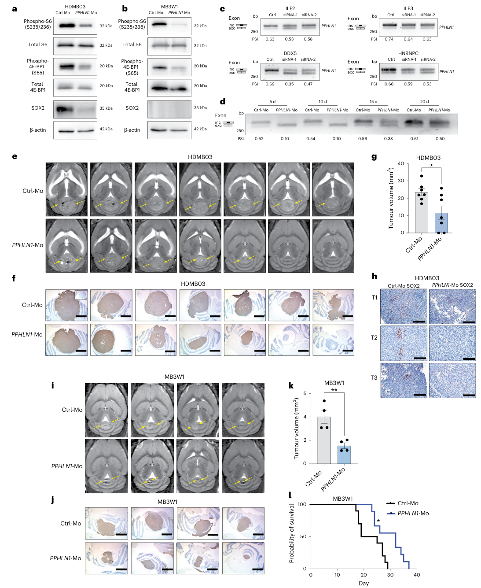

## Question

# Gene Research for Functional Annotation

## ⚠️ CRITICAL: Gene/Protein Identification Context

**BEFORE YOU BEGIN RESEARCH:** You MUST verify you are researching the CORRECT gene/protein. Gene symbols can be ambiguous, especially for less well-characterized genes from non-model organisms.

### Target Gene/Protein Identity (from UniProt):
- **UniProt Accession:** P32243
- **Protein Description:** RecName: Full=Homeobox protein OTX2; AltName: Full=Orthodenticle homolog 2;
- **Gene Information:** Name=OTX2;
- **Organism (full):** Homo sapiens (Human).
- **Protein Family:** Belongs to the paired homeobox family. Bicoid subfamily.
- **Key Domains:** HD. (IPR001356); Homeobox_CS. (IPR017970); Homeodomain-like_sf. (IPR009057); Otx2_TF. (IPR003022); Otx_TF. (IPR003025)

### MANDATORY VERIFICATION STEPS:

1. **Check if the gene symbol "OTX2" matches the protein description above**
2. **Verify the organism is correct:** Homo sapiens (Human).
3. **Check if protein family/domains align with what you find in literature**
4. **If you find literature for a DIFFERENT gene with the same or similar symbol, STOP**

### If Gene Symbol is Ambiguous or You Cannot Find Relevant Literature:

**DO NOT PROCEED WITH RESEARCH ON A DIFFERENT GENE.** Instead:
- State clearly: "The gene symbol 'OTX2' is ambiguous or literature is limited for this specific protein"
- Explain what you found (e.g., "Found extensive literature on a different gene with the same symbol in a different organism")
- Describe the protein based ONLY on the UniProt information provided above
- Suggest that the protein function can be inferred from domain/family information

### Research Target:

Please provide a comprehensive research report on the gene **OTX2** (gene ID: OTX2, UniProt: P32243) in human.

The research report should be a detailed narrative explaining the function, biological processes, and localization of the gene product. Citations should be given for all claims.

You should prioritize authoritative reviews and primary scientific literature when conducting research. You can supplement
this with annotations you find in gene/protein databases, but these can be outdated or inaccurate.

We are specifically interested in the primary function of the gene - for enzymes, what reaction is catalyzed, and what is the substrate specificity? For transporters, what is the substrate? For structural proteins or adapters, what is the broader structural role? For signaling molecules, what is the role in the pathway.

We are interested in where in or outside the cell the gene product carries out its function.

We are also interested in the signaling or biochemical pathways in which the gene functions. We are less interested in broad pleiotropic effects, except where these elucidate the precise role.

Include evidence where possible. We are interested in both experimental evidence as well as inference from structure, evolution, or bioinformatic analysis. Precise studies should be prioritized over high-throughput, where available.

## Output

Question: You are an expert researcher providing comprehensive, well-cited information.

Provide detailed information focusing on:
1. Key concepts and definitions with current understanding
2. Recent developments and latest research (prioritize 2023-2024 sources)
3. Current applications and real-world implementations
4. Expert opinions and analysis from authoritative sources
5. Relevant statistics and data from recent studies

Format as a comprehensive research report with proper citations. Include URLs and publication dates where available.
Always prioritize recent, authoritative sources and provide specific citations for all major claims.

# Gene Research for Functional Annotation

## ⚠️ CRITICAL: Gene/Protein Identification Context

**BEFORE YOU BEGIN RESEARCH:** You MUST verify you are researching the CORRECT gene/protein. Gene symbols can be ambiguous, especially for less well-characterized genes from non-model organisms.

### Target Gene/Protein Identity (from UniProt):
- **UniProt Accession:** P32243
- **Protein Description:** RecName: Full=Homeobox protein OTX2; AltName: Full=Orthodenticle homolog 2;
- **Gene Information:** Name=OTX2;
- **Organism (full):** Homo sapiens (Human).
- **Protein Family:** Belongs to the paired homeobox family. Bicoid subfamily.
- **Key Domains:** HD. (IPR001356); Homeobox_CS. (IPR017970); Homeodomain-like_sf. (IPR009057); Otx2_TF. (IPR003022); Otx_TF. (IPR003025)

### MANDATORY VERIFICATION STEPS:

1. **Check if the gene symbol "OTX2" matches the protein description above**
2. **Verify the organism is correct:** Homo sapiens (Human).
3. **Check if protein family/domains align with what you find in literature**
4. **If you find literature for a DIFFERENT gene with the same or similar symbol, STOP**

### If Gene Symbol is Ambiguous or You Cannot Find Relevant Literature:

**DO NOT PROCEED WITH RESEARCH ON A DIFFERENT GENE.** Instead:
- State clearly: "The gene symbol 'OTX2' is ambiguous or literature is limited for this specific protein"
- Explain what you found (e.g., "Found extensive literature on a different gene with the same symbol in a different organism")
- Describe the protein based ONLY on the UniProt information provided above
- Suggest that the protein function can be inferred from domain/family information

### Research Target:

Please provide a comprehensive research report on the gene **OTX2** (gene ID: OTX2, UniProt: P32243) in human.

The research report should be a detailed narrative explaining the function, biological processes, and localization of the gene product. Citations should be given for all claims.

You should prioritize authoritative reviews and primary scientific literature when conducting research. You can supplement
this with annotations you find in gene/protein databases, but these can be outdated or inaccurate.

We are specifically interested in the primary function of the gene - for enzymes, what reaction is catalyzed, and what is the substrate specificity? For transporters, what is the substrate? For structural proteins or adapters, what is the broader structural role? For signaling molecules, what is the role in the pathway.

We are interested in where in or outside the cell the gene product carries out its function.

We are also interested in the signaling or biochemical pathways in which the gene functions. We are less interested in broad pleiotropic effects, except where these elucidate the precise role.

Include evidence where possible. We are interested in both experimental evidence as well as inference from structure, evolution, or bioinformatic analysis. Precise studies should be prioritized over high-throughput, where available.

# Human OTX2 (UniProt P32243): Functional Annotation Research Report

## Executive summary

**Identity is verified.** The requested target is human **OTX2** (*orthodenticle homeobox 2*), chromosome **14q22.3**, encoding homeobox protein OTX2/orthodenticle homolog 2. The literature consistently classifies it as a **bicoid-subfamily, paired-like homeodomain transcription factor**, matching UniProt **P32243** and the supplied InterPro domains. The DNA-binding homeodomain is a 60-amino-acid region at residues 38–97. No conflicting same-symbol protein was encountered. Reported alternative transcripts encode approximately 289- and 297-aa proteins. (sun2023diseasecausingmutationsin pages 3-4, bunt2012otx2directlyactivates pages 17-21)

OTX2 is not an enzyme or transporter. Its primary function is **sequence-specific transcriptional regulation**: it binds promoter and enhancer DNA, recruits context-dependent cofactors and chromatin-remodeling machinery, and establishes developmental gene-expression programs. It is principally nuclear, although recent work indicates an additional RNA-associated role in alternative splicing. Its best-established physiological functions are anterior neuroectoderm and forebrain–midbrain patterning, retinal pigment epithelium and photoreceptor development, and hypothalamic control of pituitary organogenesis. Heterozygous loss-of-function causes variably penetrant ocular–pituitary–neurodevelopmental disease. Conversely, abnormal persistence or amplification of OTX2 drives predominantly Group 3 and Group 4 medulloblastoma. (sun2023diseasecausingmutationsin pages 3-4, boulay2017otx2activityat pages 23-26, gregory2021thephenotypicspectrum pages 1-2)

| Annotation dimension | Best-supported conclusion | Evidence type | Key quantitative detail | Translational relevance |
|---|---|---|---|---|
| Identity and domain | Human OTX2, UniProt P32243, is orthodenticle homeobox protein 2, a bicoid-subfamily paired-like homeobox transcription factor encoded at 14q22.3. Its 60-aa homeodomain spans residues 38–97; C-terminal regions support transactivation and protein interactions. | Curated protein annotation, sequence analysis, deletion studies and reporter assays | Reported protein isoforms contain 289 or 297 aa; homeodomain deletion abolishes DNA binding. | Confirms the research target and explains how homeodomain and truncating variants can disrupt development. |
| Molecular function and motif | OTX2 is principally a sequence-specific transcriptional regulator that binds promoters and enhancers. Its strongest reported bicoid-like motif is **TAATCC**, with weaker recognition of TAAGCC and related sequences; transcriptional effects depend on cofactors and chromatin context. | In-vitro DNA-binding assays, reporter assays and ChIP-based studies | TAATCC produced the strongest tested binding; OTX2 can bind as a monomer or dimer. | Supports target-gene prediction and functional interpretation of coding or regulatory variants. |
| Subcellular localization | OTX2 functions mainly in the nucleus, where a nuclear-retention region supports accumulation. The disease-associated R127W substitution impairs nuclear localization. In tumor cells, OTX2 can also associate with nascent RNA and splicing machinery. | Immunolocalization, mutant-expression assays, co-immunoprecipitation and RNA-association experiments | R127W exhibited impaired nuclear localization; OTX2 interacted with multiple LASR-complex members. | Nuclear-localization defects provide a loss-of-function mechanism, while RNA-associated activity creates additional therapeutic possibilities. |
| Retina | OTX2 controls retinal pigment epithelium differentiation, photoreceptor genesis and long-term survival of photoreceptors and bipolar cells. It is enriched in retinal progenitors and activates the downstream photoreceptor regulator CRX. | Conditional mouse genetics, human embryonic expression, lineage studies and clinical genetics | Pathogenic OTX2 variants account for an estimated **2–3%** of anophthalmia or microphthalmia; human embryonic retinal expression is detectable at approximately 6–7 gestational weeks. | Supports OTX2 testing in anophthalmia, microphthalmia, coloboma, optic-nerve hypoplasia and syndromic retinal disease. |
| Hypothalamus–pituitary axis | OTX2 in developing hypothalamic tissue maintains oral-ectoderm pituitary progenitors through an **OTX2 → FGF10 → LHX3** paracrine axis; reduced signaling increases progenitor apoptosis and impairs hormone-cell differentiation. | Patient-derived iPSC 3D organoids, CRISPR correction and knockout, expression analysis and hormone-secretion assays | CRISPR correction restored LHX3 and FGF10 expression, ACTH/GH differentiation and hormone secretion; representative assays used four independent experiments and up to seven replicates per group. | Provides a human mechanistic model of congenital pituitary hypoplasia and a platform for variant validation or rescue studies. |
| Congenital disease cohort | Heterozygous deletions and loss-of-function variants cause variably penetrant ocular, hypothalamic–pituitary and neurodevelopmental disease. Isolated hypopituitarism without eye abnormalities is uncommon. | Multi-ethnic patient sequencing, functional reporters, embryonic in-situ hybridization and engineered mice | **409 patients** were screened; seven loss-of-function variants were found among 127 patients with septo-optic dysplasia and eye defects, a frequency of **5.5%**. Four tested truncations completely lost reporter transactivation. | Justifies phenotype-guided sequencing, counseling about incomplete penetrance, and ocular, endocrine and developmental surveillance. |
| Medulloblastoma enhancer activity | In Group 3 medulloblastoma, OTX2 acts as a lineage-survival oncogenic regulator and pioneer-like factor that establishes or maintains active distal enhancers, partly with NEUROD1 and chromatin-remodeling complexes. | ChIP-seq, ATAC-seq, histone profiling, depletion and ectopic-expression experiments | OTX2 depletion reduced H3K27ac at **2,649** active sites; ectopic OTX2 generated **12,286** de-novo enhancers. Integrated analysis identified **1,347** OTX2 enhancers associated with **510** responsive genes. | OTX2-dependent enhancers and downstream targets such as NEK2 offer biomarker and indirect drug-target opportunities, although no OTX2-directed therapy is established clinically. |
| 2024 LASR–PPHLN1 splicing advance | OTX2 also acts as a splicing cofactor or adaptor: it associates with the LASR complex, helps retain RBFOX2 in the nucleus and maintains a stem-like splicing program. OTX2-high cells favor PPHLN1 exon-6 inclusion; forced skipping promotes differentiation and suppresses tumors. | TurboID proteomics, co-immunoprecipitation, RNA and splicing analyses, splice-blocking morpholinos and orthotopic xenografts | More than **80%** of Group 3 tumors show OTX2 gain or overexpression. PPHLN1 splice targeting reduced tumor volume in HDMB03, **n=7 per group, P=0.0206**, and MB3W1, **n=4 per group, P=0.0069**, and prolonged survival, **n=10 versus 9, P=0.0152**. | Identifies tumor-specific RNA processing as a potential intervention point; PPHLN1 splice modulation remains preclinical but may bypass the difficulty of directly drugging OTX2. |

*Table: Compact evidence matrix for human OTX2/P32243, spanning molecular function, developmental biology, congenital disease and oncogenic mechanisms. Quantitative findings highlight the strongest mechanistic and translational evidence.*

## 1. Molecular function and mechanism

### DNA recognition and transcriptional control

OTX2 recognizes bicoid-like homeobox sites in regulatory DNA. The strongest reported in-vitro motif is **TAATCC**; TAAGCC and related sequences bind more weakly. OTX2 can bind DNA as a monomer or dimer, with dimerization favored at appropriately spaced sites. DNA binding is necessary but not sufficient for transcriptional output: activation or repression depends on promoter architecture, cell state, and recruited proteins. Reported interacting regulators include TLE4, MEIS2, MITF, SOX2, SOX9, LHX1 and FOXA2; selected assays found FOXA2/TLE4 repressive and several others activating. (bunt2012otx2directlyactivates pages 21-23)

The homeodomain is essential: deleting it abolishes DNA binding. C-terminal regions supply transactivation and protein-interaction functions, explaining why truncations outside the homeodomain can retain DNA recognition yet lose transcriptional activity. For example, the N233S variant bound HESX1 regulatory sites comparably to wild-type protein but inhibited OTX2-dependent reporters, supporting a dominant-negative defect in protein interactions rather than DNA recognition. (sun2023diseasecausingmutationsin pages 3-4, diaczok2008anoveldominant pages 7-7)

### Chromatin-level function

In Group 3 medulloblastoma, OTX2 behaves as a lineage-defining, pioneer-like transcription factor. OTX2 depletion reduced H3K27 acetylation at **2,649 OTX2-bound active distal sites**, whereas ectopic OTX2 in primary mesenchymal cells created **12,286 de-novo enhancers** with H3K4me1, H3K27ac and increased accessibility. OTX2 associated with SWI/SNF components SMARCA4, SMARCA2 and SMARCC1 and with UTX, ASH2 and p300. Integrated analysis linked 1,347 OTX2 enhancers to 510 responsive genes; enhancer-acetylation loss strongly correlated with reduced nearby expression (Wilcoxon *P*=5.65×10⁻¹²). These results support direct chromatin opening and enhancer maintenance, often in cooperation with NEUROD1. (boulay2017otx2activityat pages 23-26, boulay2017otx2activityat pages 1-3)

### Subcellular localization

The principal site of action is the **nucleus**, consistent with DNA binding and a nuclear-retention region. The congenital-pituitary-hypoplasia-associated R127W substitution impaired nuclear localization in transfected cells, providing a concrete loss-of-function mechanism. OTX2 is not a secreted factor; effects on neighboring tissues occur because nuclear OTX2 controls expression of secreted signals such as FGF10. (matsumoto2020congenitalpituitaryhypoplasia pages 1-2)

## 2. Physiological processes and pathways

### Anterior neural patterning

OTX2 is an early organizer of the anterior neuroectoderm. Mouse loss-of-function causes embryonic lethality with loss of forebrain and midbrain, while spatial regulation of Otx2 helps define the midbrain–hindbrain boundary. Human fetal expression occurs in diencephalon, mesencephalon and archicortex. These conserved genetic and expression data establish OTX2 as a developmental selector rather than a general housekeeping transcription factor. (bunt2012otx2directlyactivates pages 17-21, terrinoni2023otxgenesin pages 5-6)

### Retina and photoreceptors

OTX2 operates at several stages of retinal development. It is first detected in the dorsal human optic vesicle and persists in the outer optic cup that generates retinal pigment epithelium. In retinal progenitor cells it promotes photoreceptor genesis and activates the downstream homeobox factor **CRX**. In mature retina, expression is weak in rods and cones, strong in bipolar cells, and present in subsets of Müller glia; conditional genetic evidence indicates requirements for long-term survival of photoreceptors, bipolar cells and horizontal cells. (sun2023diseasecausingmutationsin pages 3-4, terrinoni2023otxgenesin pages 5-6)

This mechanism explains the human phenotype: heterozygous loss can produce anophthalmia or microphthalmia, coloboma, retinal dystrophy and optic-nerve hypoplasia. A 2023 review estimates that pathogenic OTX2 variants account for approximately **2–3% of anophthalmia/microphthalmia**. The range from malformed eyes to later retinal degeneration reflects OTX2’s sequential roles in optic-cup specification, photoreceptor fate and retinal maintenance. (sun2023diseasecausingmutationsin pages 3-4)

### Hypothalamus–pituitary development

The strongest mechanistic model is a non-cell-autonomous developmental axis:

**hypothalamic OTX2 → FGF10 secretion → LHX3 induction in oral ectoderm → survival and differentiation of pituitary progenitors.**

Patient-derived 3D iPSC organoids carrying heterozygous OTX2 R127W showed reduced hypothalamic FGF10, reduced oral-ectoderm LHX3, increased progenitor apoptosis and severe impairment of pituitary hormone-cell differentiation. CRISPR correction restored FGF10 and LHX3, ACTH- and GH-producing cells, hormone secretion, and responses to CRH/GHRH. Conversely, engineered heterozygous OTX2 loss in control iPSCs reproduced the phenotype. Representative rescue experiments used four independent experiments, with up to seven replicates per group and significant restoration across molecular and secretion readouts. (matsumoto2020congenitalpituitaryhypoplasia pages 1-2, matsumoto2020congenitalpituitaryhypoplasia pages 7-9)

Human embryonic localization supports this interpretation. At Carnegie stages 19–20, approximately 6–7 gestational weeks, OTX2 transcripts were detected in posterior pituitary, retina, ear and the hypothalamic region nearest Rathke’s pouch, but not in Rathke’s pouch/anterior pituitary. At stage 23, expression was strong in thalamus and choroid plexus. Experts therefore interpret much of the endocrine phenotype as **hypothalamic in origin**, rather than an autonomous defect of differentiated anterior-pituitary endocrine cells. (gregory2021thephenotypicspectrum pages 10-12, gregory2021thephenotypicspectrum pages 1-2)

## 3. Human disease and quantitative genetic evidence

Heterozygous deletions, nonsense/frameshift variants and damaging missense substitutions produce a spectrum that includes anophthalmia/microphthalmia, optic-nerve hypoplasia, retinal dystrophy, developmental delay, structural brain abnormalities, growth-hormone deficiency, central hypothyroidism and hypogonadotropic hypogonadism. Ectopic posterior pituitary and small anterior pituitary are recurrent imaging findings. Penetrance is incomplete: the same familial variant can occur with and without an ocular phenotype. (gregory2021thephenotypicspectrum pages 5-6, gregory2021thephenotypicspectrum pages 1-2)

A 2021 multi-ethnic study screened **409 patients**: 103 from UK centers, 24 internationally and 282 from Brazil; 145 were within the septo-optic-dysplasia spectrum and 264 lacked an eye phenotype. Two chromosomal deletions and six haploinsufficient variants were found in patients with eye abnormalities. Within the UK/international septo-optic-dysplasia cohort, seven loss-of-function findings among 127 patients with accompanying eye defects represented **5.5%**, similar in scale to the approximately 3% historical estimate. Four tested truncations—p.E79*, p.S138*, p.S167* and p.C170*—completely lost transactivation in triplicate reporter experiments, whereas p.H230L behaved like wild type and was tolerated in engineered mice. (gregory2021thephenotypicspectrum pages 10-12, gregory2021thephenotypicspectrum pages 1-2)

Clinical interpretation should therefore emphasize phenotype–mechanism concordance. A truncating/deletion variant in a patient with ocular and pituitary abnormalities has strong support for haploinsufficiency; isolated hypopituitarism without eye disease is possible but uncommon, and a missense variant requires functional or segregation evidence. (gregory2021thephenotypicspectrum pages 10-12, gregory2021thephenotypicspectrum pages 1-2)

## 4. Cancer biology: medulloblastoma

OTX2 is overexpressed in most Group 3 and Group 4 medulloblastomas and in WNT tumors, but is generally absent or lower in SHH tumors and normal postnatal brain. Earlier series reported immunoreactivity in approximately **60–85%** of medulloblastomas and amplification in 8/42 primary tumors; selected cell lines carried more than ten copies. Functionally, OTX2 activates mitotic genes—including AURKA, MELK, CENPE and NEK2—supports G2–M progression, reinforces MYC-associated programs and suppresses neural differentiation. However, forced expression can provoke senescence in some contexts, showing that dose and cellular background matter. (bunt2012otx2directlyactivates pages 147-150, bunt2012otx2directlyactivates pages 33-37, bunt2012otx2directlyactivates pages 21-23)

The OTX2–PAX3 axis illustrates its control of cell state. OTX2 silencing reduced PRC2-associated repression and increased neurodevelopmental factors including PAX3 and PAX6. PAX3, but not PAX6, inhibited self-renewal and improved survival in vivo; downstream analysis implicated mTORC1/protein-synthesis signaling. The study evaluated expression and survival across **763 primary medulloblastomas**, making this more than a cell-line observation. (zagozewski2020anotx2pax3signaling pages 15-16)

## 5. Major 2023–2024 developments

### 2023: renewed attention to adult-tissue functions

A November 2023 review emphasized that OTX2 is not exclusively embryonic. Restricted adult expression occurs in retina, choroid plexus, pituitary and pineal glands, selected dopaminergic neurons and other specialized tissues, while re-expression occurs in several cancers and inflammatory or hypoxic states. The expert interpretation is that OTX2 is a reusable developmental “toolbox” factor whose pathological reactivation can restore progenitor-like regulatory programs. This supports biomarker and target concepts, but adult expression also warns that systemic inhibition could affect normal specialized tissues. Published November 2023; DOI: https://doi.org/10.3390/ijms242316962. (terrinoni2023otxgenesin pages 5-6, terrinoni2023otxgenesin pages 14-16)

### 2024: OTX2 directly connects transcription to alternative splicing

The most important recent mechanistic advance was published online **18 July 2024** in *Nature Cell Biology*. OTX2 was shown to associate with the large assembly of splicing regulators (**LASR**) through protein–protein interactions, regulate LASR-member expression, help retain RBFOX2 in the nucleus, and associate directly or indirectly with nascent RNA. Thus, OTX2 is not only a DNA-binding transcription factor: it can act as a splicing cofactor/adaptor that preserves a stem-like Group 3 medulloblastoma program. More than **80% of Group 3 tumors** show OTX2 gain or overexpression. DOI: https://doi.org/10.1038/s41556-024-01460-5. (saulnier2024agroup3 pages 1-2, saulnier2024agroup3 pages 10-11)

The principal functional target was **PPHLN1 exon 6**. OTX2-high tumor cells favored exon inclusion, whereas splice-blocking morpholino treatment forced skipping, reduced SOX2 and mTORC1 output, and impaired tumors. In orthotopic xenografts, tumor volume fell in HDMB03 tumors (*n*=7/group, *P*=0.0206) and MB3W1 tumors (*n*=4/group, *P*=0.0069); MB3W1 survival improved (*n*=10 control versus 9 treated, log-rank *P*=0.0152). The paper’s Figure 6 directly documents these effects. (saulnier2024agroup3 pages 10-11, saulnier2024agroup3 media d1975249, saulnier2024agroup3 media 3e75f870)

## 6. Current applications and translational status

1. **Genetic diagnosis and surveillance.** OTX2 belongs on anophthalmia/microphthalmia, optic-nerve-hypoplasia, septo-optic-dysplasia and congenital-hypopituitarism panels. A molecular diagnosis should prompt coordinated ophthalmologic, endocrine, neurodevelopmental, hearing and brain/pituitary imaging assessment. Variable penetrance complicates counseling. (gregory2021thephenotypicspectrum pages 5-6, gregory2021thephenotypicspectrum pages 1-2)

2. **Functional variant testing.** Reporter assays, nuclear-localization assays and patient-derived hypothalamus–pituitary organoids can distinguish haploinsufficiency, dominant-negative effects and likely benign missense variants. CRISPR rescue in organoids provides particularly strong causal evidence. (diaczok2008anoveldominant pages 7-7, matsumoto2020congenitalpituitaryhypoplasia pages 1-2, matsumoto2020congenitalpituitaryhypoplasia pages 7-9)

3. **Tumor classification and research biomarkers.** OTX2 expression supports Group 3/4 lineage programs, although expression alone does not add reliable prognostic information beyond molecular subgrouping. OTX2-dependent enhancer and splicing signatures may be more informative than immunostaining alone. (bunt2012otx2directlyactivates pages 147-150, saulnier2024agroup3 pages 10-11)

4. **Therapeutic development.** No established clinical therapy directly targets OTX2. Preclinical strategies include retinoid-mediated reduction of OTX2, inhibition of downstream NEK2, disruption of OTX2-dependent chromatin machinery, and splice modulation of PPHLN1. Retinoids reduced growth in some flank xenografts but failed in an intracranial D425 model, illustrating the need for disease-relevant delivery and models. PPHLN1 splice targeting is compelling but remains preclinical. (bunt2012otx2directlyactivates pages 147-150, boulay2017otx2activityat pages 23-26, saulnier2024agroup3 media d1975249)

## 7. Evidence appraisal and expert interpretation

The highest-confidence physiological annotation is that OTX2 is a **nuclear developmental transcription factor whose dosage and spatial expression specify anterior neural, retinal and hypothalamic programs**. Evidence is convergent across evolutionary conservation, mouse conditional genetics, human embryonic tissue, patient genotypes, biochemical assays and mutation-corrected human organoids.

The hypothalamus–pituitary mechanism is especially persuasive because patient organoids reproduce disease, CRISPR repair rescues it, and engineered haploinsufficiency phenocopies it. The cancer annotation is also strong but context-dependent: OTX2 can activate proliferation or trigger oncogenic stress depending on cellular state. The 2024 splicing function substantially broadens current understanding, but its therapeutic exploitation has so far been demonstrated only in tumor cells and mouse xenografts. (bunt2012otx2directlyactivates pages 33-37, matsumoto2020congenitalpituitaryhypoplasia pages 1-2, matsumoto2020congenitalpituitaryhypoplasia pages 7-9, saulnier2024agroup3 media d1975249)

**Overall functional annotation:** Human OTX2/P32243 is a dosage-sensitive, predominantly nuclear homeodomain transcription factor that recognizes TAATCC-related regulatory sequences and organizes promoter/enhancer programs controlling anterior neural patterning, retinal lineage specification and hypothalamic signaling to pituitary progenitors. In medulloblastoma it is aberrantly retained as an oncogenic lineage factor, remodeling enhancers, sustaining stemness and—according to 2024 evidence—coordinating alternative splicing through LASR.

References

1. (sun2023diseasecausingmutationsin pages 3-4): Chi Sun and Shiming Chen. Disease-causing mutations in genes encoding transcription factors critical for photoreceptor development. Frontiers in Molecular Neuroscience, Apr 2023. URL: https://doi.org/10.3389/fnmol.2023.1134839, doi:10.3389/fnmol.2023.1134839. This article has 19 citations.

2. (bunt2012otx2directlyactivates pages 17-21): Jens Bunt, Nancy E. Hasselt, Danny A. Zwijnenburg, Mohamed Hamdi, Jan Koster, Rogier Versteeg, and Marcel Kool. Otx2 directly activates cell cycle genes and inhibits differentiation in medulloblastoma cells. International Journal of Cancer, Jul 2012. URL: https://doi.org/10.1002/ijc.26474, doi:10.1002/ijc.26474. This article has 125 citations and is from a domain leading peer-reviewed journal.

3. (boulay2017otx2activityat pages 23-26): Gaylor Boulay, Mary E. Awad, Nicolo Riggi, Tenley C. Archer, Sowmya Iyer, Wannaporn E. Boonseng, Nikki E. Rossetti, Beverly Naigles, Shruthi Rengarajan, Angela Volorio, James C. Kim, Jill P. Mesirov, Pablo Tamayo, Scott L. Pomeroy, Martin J. Aryee, and Miguel N. Rivera. Otx2 activity at distal regulatory elements shapes the chromatin landscape of group 3 medulloblastoma. Mar 2017. URL: https://doi.org/10.1158/2159-8290.cd-16-0844, doi:10.1158/2159-8290.cd-16-0844. This article has 83 citations and is from a highest quality peer-reviewed journal.

4. (gregory2021thephenotypicspectrum pages 1-2): Louise C Gregory, Peter Gergics, Marilena Nakaguma, Hironori Bando, Giuseppa Patti, Mark J McCabe, Qing Fang, Qianyi Ma, Ayse Bilge Ozel, Jun Z Li, Michele Moreira Poina, Alexander A L Jorge, Anna F Figueredo Benedetti, Antonio M Lerario, Ivo J P Arnhold, Berenice B Mendonca, Mohamad Maghnie, Sally A Camper, Luciani R S Carvalho, and Mehul T Dattani. The phenotypic spectrum associated with otx2 mutations in humans. European Journal of Endocrinology, 185:121-135, Jul 2021. URL: https://doi.org/10.1530/eje-20-1453, doi:10.1530/eje-20-1453. This article has 43 citations and is from a highest quality peer-reviewed journal.

5. (bunt2012otx2directlyactivates pages 21-23): Jens Bunt, Nancy E. Hasselt, Danny A. Zwijnenburg, Mohamed Hamdi, Jan Koster, Rogier Versteeg, and Marcel Kool. Otx2 directly activates cell cycle genes and inhibits differentiation in medulloblastoma cells. International Journal of Cancer, Jul 2012. URL: https://doi.org/10.1002/ijc.26474, doi:10.1002/ijc.26474. This article has 125 citations and is from a domain leading peer-reviewed journal.

6. (diaczok2008anoveldominant pages 7-7): Daniel Diaczok, Christopher Romero, Janice Zunich, Ian Marshall, and Sally Radovick. A novel dominant negative mutation of otx2 associated with combined pituitary hormone deficiency. The Journal of clinical endocrinology and metabolism, 93 11:4351-9, Nov 2008. URL: https://doi.org/10.1210/jc.2008-1189, doi:10.1210/jc.2008-1189. This article has 154 citations.

7. (boulay2017otx2activityat pages 1-3): Gaylor Boulay, Mary E. Awad, Nicolo Riggi, Tenley C. Archer, Sowmya Iyer, Wannaporn E. Boonseng, Nikki E. Rossetti, Beverly Naigles, Shruthi Rengarajan, Angela Volorio, James C. Kim, Jill P. Mesirov, Pablo Tamayo, Scott L. Pomeroy, Martin J. Aryee, and Miguel N. Rivera. Otx2 activity at distal regulatory elements shapes the chromatin landscape of group 3 medulloblastoma. Mar 2017. URL: https://doi.org/10.1158/2159-8290.cd-16-0844, doi:10.1158/2159-8290.cd-16-0844. This article has 83 citations and is from a highest quality peer-reviewed journal.

8. (matsumoto2020congenitalpituitaryhypoplasia pages 1-2): Ryusaku Matsumoto, Hidetaka Suga, Takashi Aoi, Hironori Bando, Hidenori Fukuoka, Genzo Iguchi, Satoshi Narumi, Tomonobu Hasegawa, Keiko Muguruma, Wataru Ogawa, and Yutaka Takahashi. Congenital pituitary hypoplasia model demonstrates hypothalamic otx2 regulation of pituitary progenitor cells. The Journal of clinical investigation, 130:641-654, Dec 2020. URL: https://doi.org/10.1172/jci127378, doi:10.1172/jci127378. This article has 78 citations.

9. (terrinoni2023otxgenesin pages 5-6): Alessandro Terrinoni, Giovanni Micheloni, Vittoria Moretti, Sabrina Caporali, Sergio Bernardini, Marilena Minieri, Massimo Pieri, Cristina Giaroni, Francesco Acquati, Lucy Costantino, Fulvio Ferrara, Roberto Valli, and Giovanni Porta. Otx genes in adult tissues. International Journal of Molecular Sciences, 24:16962, Nov 2023. URL: https://doi.org/10.3390/ijms242316962, doi:10.3390/ijms242316962. This article has 8 citations.

10. (matsumoto2020congenitalpituitaryhypoplasia pages 7-9): Ryusaku Matsumoto, Hidetaka Suga, Takashi Aoi, Hironori Bando, Hidenori Fukuoka, Genzo Iguchi, Satoshi Narumi, Tomonobu Hasegawa, Keiko Muguruma, Wataru Ogawa, and Yutaka Takahashi. Congenital pituitary hypoplasia model demonstrates hypothalamic otx2 regulation of pituitary progenitor cells. The Journal of clinical investigation, 130:641-654, Dec 2020. URL: https://doi.org/10.1172/jci127378, doi:10.1172/jci127378. This article has 78 citations.

11. (gregory2021thephenotypicspectrum pages 10-12): Louise C Gregory, Peter Gergics, Marilena Nakaguma, Hironori Bando, Giuseppa Patti, Mark J McCabe, Qing Fang, Qianyi Ma, Ayse Bilge Ozel, Jun Z Li, Michele Moreira Poina, Alexander A L Jorge, Anna F Figueredo Benedetti, Antonio M Lerario, Ivo J P Arnhold, Berenice B Mendonca, Mohamad Maghnie, Sally A Camper, Luciani R S Carvalho, and Mehul T Dattani. The phenotypic spectrum associated with otx2 mutations in humans. European Journal of Endocrinology, 185:121-135, Jul 2021. URL: https://doi.org/10.1530/eje-20-1453, doi:10.1530/eje-20-1453. This article has 43 citations and is from a highest quality peer-reviewed journal.

12. (gregory2021thephenotypicspectrum pages 5-6): Louise C Gregory, Peter Gergics, Marilena Nakaguma, Hironori Bando, Giuseppa Patti, Mark J McCabe, Qing Fang, Qianyi Ma, Ayse Bilge Ozel, Jun Z Li, Michele Moreira Poina, Alexander A L Jorge, Anna F Figueredo Benedetti, Antonio M Lerario, Ivo J P Arnhold, Berenice B Mendonca, Mohamad Maghnie, Sally A Camper, Luciani R S Carvalho, and Mehul T Dattani. The phenotypic spectrum associated with otx2 mutations in humans. European Journal of Endocrinology, 185:121-135, Jul 2021. URL: https://doi.org/10.1530/eje-20-1453, doi:10.1530/eje-20-1453. This article has 43 citations and is from a highest quality peer-reviewed journal.

13. (bunt2012otx2directlyactivates pages 147-150): Jens Bunt, Nancy E. Hasselt, Danny A. Zwijnenburg, Mohamed Hamdi, Jan Koster, Rogier Versteeg, and Marcel Kool. Otx2 directly activates cell cycle genes and inhibits differentiation in medulloblastoma cells. International Journal of Cancer, Jul 2012. URL: https://doi.org/10.1002/ijc.26474, doi:10.1002/ijc.26474. This article has 125 citations and is from a domain leading peer-reviewed journal.

14. (bunt2012otx2directlyactivates pages 33-37): Jens Bunt, Nancy E. Hasselt, Danny A. Zwijnenburg, Mohamed Hamdi, Jan Koster, Rogier Versteeg, and Marcel Kool. Otx2 directly activates cell cycle genes and inhibits differentiation in medulloblastoma cells. International Journal of Cancer, Jul 2012. URL: https://doi.org/10.1002/ijc.26474, doi:10.1002/ijc.26474. This article has 125 citations and is from a domain leading peer-reviewed journal.

15. (zagozewski2020anotx2pax3signaling pages 15-16): Jamie Zagozewski, Ghazaleh M. Shahriary, Ludivine Coudière Morrison, Olivier Saulnier, Margaret Stromecki, Agnes Fresnoza, Gareth Palidwor, Christopher J. Porter, Antoine Forget, Olivier Ayrault, Cynthia Hawkins, Jennifer A. Chan, Maria C. Vladoiu, Lakshmikirupa Sundaresan, Janilyn Arsenio, Michael D. Taylor, Vijay Ramaswamy, and Tamra E. Werbowetski-Ogilvie. An otx2-pax3 signaling axis regulates group 3 medulloblastoma cell fate. Nature Communications, Jul 2020. URL: https://doi.org/10.1038/s41467-020-17357-4, doi:10.1038/s41467-020-17357-4. This article has 41 citations and is from a highest quality peer-reviewed journal.

16. (terrinoni2023otxgenesin pages 14-16): Alessandro Terrinoni, Giovanni Micheloni, Vittoria Moretti, Sabrina Caporali, Sergio Bernardini, Marilena Minieri, Massimo Pieri, Cristina Giaroni, Francesco Acquati, Lucy Costantino, Fulvio Ferrara, Roberto Valli, and Giovanni Porta. Otx genes in adult tissues. International Journal of Molecular Sciences, 24:16962, Nov 2023. URL: https://doi.org/10.3390/ijms242316962, doi:10.3390/ijms242316962. This article has 8 citations.

17. (saulnier2024agroup3 pages 1-2): Olivier Saulnier, Jamie Zagozewski, Lisa Liang, Liam D. Hendrikse, Paul Layug, Victor Gordon, Kimberly A. Aldinger, Parthiv Haldipur, Stephanie Borlase, Ludivine Coudière-Morrison, Ting Cai, Emma Martell, Naomi M. Gonzales, Gareth Palidwor, Christopher J. Porter, Stéphane Richard, Tanveer Sharif, Kathleen J. Millen, Brad W. Doble, Michael D. Taylor, and Tamra E. Werbowetski-Ogilvie. A group 3 medulloblastoma stem cell program is maintained by otx2-mediated alternative splicing. Nature Cell Biology, 26:1233-1246, Jul 2024. URL: https://doi.org/10.1038/s41556-024-01460-5, doi:10.1038/s41556-024-01460-5. This article has 13 citations and is from a highest quality peer-reviewed journal.

18. (saulnier2024agroup3 pages 10-11): Olivier Saulnier, Jamie Zagozewski, Lisa Liang, Liam D. Hendrikse, Paul Layug, Victor Gordon, Kimberly A. Aldinger, Parthiv Haldipur, Stephanie Borlase, Ludivine Coudière-Morrison, Ting Cai, Emma Martell, Naomi M. Gonzales, Gareth Palidwor, Christopher J. Porter, Stéphane Richard, Tanveer Sharif, Kathleen J. Millen, Brad W. Doble, Michael D. Taylor, and Tamra E. Werbowetski-Ogilvie. A group 3 medulloblastoma stem cell program is maintained by otx2-mediated alternative splicing. Nature Cell Biology, 26:1233-1246, Jul 2024. URL: https://doi.org/10.1038/s41556-024-01460-5, doi:10.1038/s41556-024-01460-5. This article has 13 citations and is from a highest quality peer-reviewed journal.

19. (saulnier2024agroup3 media d1975249): Olivier Saulnier, Jamie Zagozewski, Lisa Liang, Liam D. Hendrikse, Paul Layug, Victor Gordon, Kimberly A. Aldinger, Parthiv Haldipur, Stephanie Borlase, Ludivine Coudière-Morrison, Ting Cai, Emma Martell, Naomi M. Gonzales, Gareth Palidwor, Christopher J. Porter, Stéphane Richard, Tanveer Sharif, Kathleen J. Millen, Brad W. Doble, Michael D. Taylor, and Tamra E. Werbowetski-Ogilvie. A group 3 medulloblastoma stem cell program is maintained by otx2-mediated alternative splicing. Nature Cell Biology, 26:1233-1246, Jul 2024. URL: https://doi.org/10.1038/s41556-024-01460-5, doi:10.1038/s41556-024-01460-5. This article has 13 citations and is from a highest quality peer-reviewed journal.

20. (saulnier2024agroup3 media 3e75f870): Olivier Saulnier, Jamie Zagozewski, Lisa Liang, Liam D. Hendrikse, Paul Layug, Victor Gordon, Kimberly A. Aldinger, Parthiv Haldipur, Stephanie Borlase, Ludivine Coudière-Morrison, Ting Cai, Emma Martell, Naomi M. Gonzales, Gareth Palidwor, Christopher J. Porter, Stéphane Richard, Tanveer Sharif, Kathleen J. Millen, Brad W. Doble, Michael D. Taylor, and Tamra E. Werbowetski-Ogilvie. A group 3 medulloblastoma stem cell program is maintained by otx2-mediated alternative splicing. Nature Cell Biology, 26:1233-1246, Jul 2024. URL: https://doi.org/10.1038/s41556-024-01460-5, doi:10.1038/s41556-024-01460-5. This article has 13 citations and is from a highest quality peer-reviewed journal.

## Artifacts

- [Edison artifact artifact-00](OTX2-deep-research-falcon_artifacts/artifact-00.md)

## Citations

1. matsumoto2020congenitalpituitaryhypoplasia pages 1-2
2. sun2023diseasecausingmutationsin pages 3-4
3. gregory2021thephenotypicspectrum pages 1-2
4. diaczok2008anoveldominant pages 7-7
5. terrinoni2023otxgenesin pages 5-6
6. matsumoto2020congenitalpituitaryhypoplasia pages 7-9
7. gregory2021thephenotypicspectrum pages 10-12
8. gregory2021thephenotypicspectrum pages 5-6
9. terrinoni2023otxgenesin pages 14-16
10. https://doi.org/10.3390/ijms242316962.
11. https://doi.org/10.1038/s41556-024-01460-5.
12. https://doi.org/10.3389/fnmol.2023.1134839,
13. https://doi.org/10.1002/ijc.26474,
14. https://doi.org/10.1158/2159-8290.cd-16-0844,
15. https://doi.org/10.1530/eje-20-1453,
16. https://doi.org/10.1210/jc.2008-1189,
17. https://doi.org/10.1172/jci127378,
18. https://doi.org/10.3390/ijms242316962,
19. https://doi.org/10.1038/s41467-020-17357-4,
20. https://doi.org/10.1038/s41556-024-01460-5,