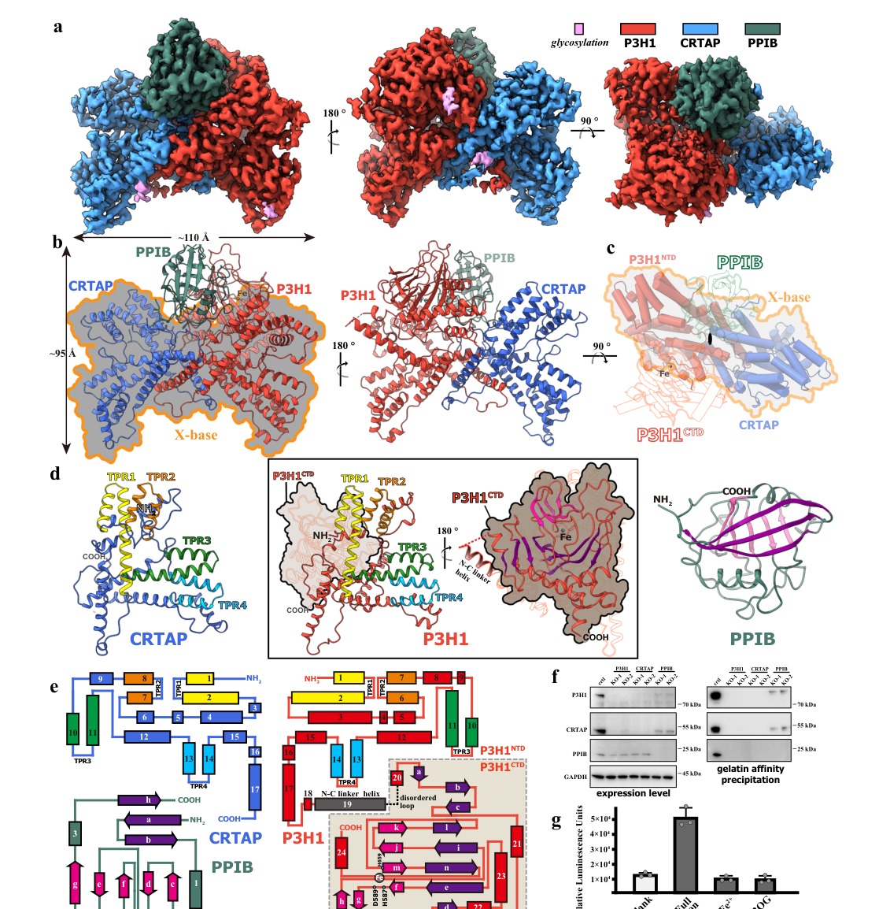

## Question

# Gene Research for Functional Annotation

## ⚠️ CRITICAL: Gene/Protein Identification Context

**BEFORE YOU BEGIN RESEARCH:** You MUST verify you are researching the CORRECT gene/protein. Gene symbols can be ambiguous, especially for less well-characterized genes from non-model organisms.

### Target Gene/Protein Identity (from UniProt):
- **UniProt Accession:** Q32P28
- **Protein Description:** RecName: Full=Prolyl 3-hydroxylase 1 {ECO:0000312|HGNC:HGNC:19316}; EC=1.14.11.7 {ECO:0000269|PubMed:39245686}; AltName: Full=Growth suppressor 1 {ECO:0000303|PubMed:10951563}; AltName: Full=Leucine- and proline-enriched proteoglycan 1 {ECO:0000250|UniProtKB:Q9R1J8}; Short=Leprecan-1 {ECO:0000250|UniProtKB:Q9R1J8}; Flags: Precursor;
- **Gene Information:** Name=P3H1 {ECO:0000312|HGNC:HGNC:19316}; Synonyms=GROS1 {ECO:0000303|PubMed:10951563}, LEPRE1 {ECO:0000303|PubMed:17277775, ECO:0000303|PubMed:19088120}; ORFNames=PSEC0109;
- **Organism (full):** Homo sapiens (Human).
- **Protein Family:** Belongs to the leprecan family. .
- **Key Domains:** Leprecan_dom. (IPR056585); Oxoglu/Fe-dep_dioxygenase_dom. (IPR005123); P3H. (IPR039575); Pro_4_hyd_alph. (IPR006620); Pro_4_hyd_alph_FE2OG_OXY. (IPR044862)

### MANDATORY VERIFICATION STEPS:

1. **Check if the gene symbol "P3H1" matches the protein description above**
2. **Verify the organism is correct:** Homo sapiens (Human).
3. **Check if protein family/domains align with what you find in literature**
4. **If you find literature for a DIFFERENT gene with the same or similar symbol, STOP**

### If Gene Symbol is Ambiguous or You Cannot Find Relevant Literature:

**DO NOT PROCEED WITH RESEARCH ON A DIFFERENT GENE.** Instead:
- State clearly: "The gene symbol 'P3H1' is ambiguous or literature is limited for this specific protein"
- Explain what you found (e.g., "Found extensive literature on a different gene with the same symbol in a different organism")
- Describe the protein based ONLY on the UniProt information provided above
- Suggest that the protein function can be inferred from domain/family information

### Research Target:

Please provide a comprehensive research report on the gene **P3H1** (gene ID: P3H1, UniProt: Q32P28) in human.

The research report should be a detailed narrative explaining the function, biological processes, and localization of the gene product. Citations should be given for all claims.

You should prioritize authoritative reviews and primary scientific literature when conducting research. You can supplement
this with annotations you find in gene/protein databases, but these can be outdated or inaccurate.

We are specifically interested in the primary function of the gene - for enzymes, what reaction is catalyzed, and what is the substrate specificity? For transporters, what is the substrate? For structural proteins or adapters, what is the broader structural role? For signaling molecules, what is the role in the pathway.

We are interested in where in or outside the cell the gene product carries out its function.

We are also interested in the signaling or biochemical pathways in which the gene functions. We are less interested in broad pleiotropic effects, except where these elucidate the precise role.

Include evidence where possible. We are interested in both experimental evidence as well as inference from structure, evolution, or bioinformatic analysis. Precise studies should be prioritized over high-throughput, where available.

## Output

Question: You are an expert researcher providing comprehensive, well-cited information.

Provide detailed information focusing on:
1. Key concepts and definitions with current understanding
2. Recent developments and latest research (prioritize 2023-2024 sources)
3. Current applications and real-world implementations
4. Expert opinions and analysis from authoritative sources
5. Relevant statistics and data from recent studies

Format as a comprehensive research report with proper citations. Include URLs and publication dates where available.
Always prioritize recent, authoritative sources and provide specific citations for all major claims.

# Gene Research for Functional Annotation

## ⚠️ CRITICAL: Gene/Protein Identification Context

**BEFORE YOU BEGIN RESEARCH:** You MUST verify you are researching the CORRECT gene/protein. Gene symbols can be ambiguous, especially for less well-characterized genes from non-model organisms.

### Target Gene/Protein Identity (from UniProt):
- **UniProt Accession:** Q32P28
- **Protein Description:** RecName: Full=Prolyl 3-hydroxylase 1 {ECO:0000312|HGNC:HGNC:19316}; EC=1.14.11.7 {ECO:0000269|PubMed:39245686}; AltName: Full=Growth suppressor 1 {ECO:0000303|PubMed:10951563}; AltName: Full=Leucine- and proline-enriched proteoglycan 1 {ECO:0000250|UniProtKB:Q9R1J8}; Short=Leprecan-1 {ECO:0000250|UniProtKB:Q9R1J8}; Flags: Precursor;
- **Gene Information:** Name=P3H1 {ECO:0000312|HGNC:HGNC:19316}; Synonyms=GROS1 {ECO:0000303|PubMed:10951563}, LEPRE1 {ECO:0000303|PubMed:17277775, ECO:0000303|PubMed:19088120}; ORFNames=PSEC0109;
- **Organism (full):** Homo sapiens (Human).
- **Protein Family:** Belongs to the leprecan family. .
- **Key Domains:** Leprecan_dom. (IPR056585); Oxoglu/Fe-dep_dioxygenase_dom. (IPR005123); P3H. (IPR039575); Pro_4_hyd_alph. (IPR006620); Pro_4_hyd_alph_FE2OG_OXY. (IPR044862)

### MANDATORY VERIFICATION STEPS:

1. **Check if the gene symbol "P3H1" matches the protein description above**
2. **Verify the organism is correct:** Homo sapiens (Human).
3. **Check if protein family/domains align with what you find in literature**
4. **If you find literature for a DIFFERENT gene with the same or similar symbol, STOP**

### If Gene Symbol is Ambiguous or You Cannot Find Relevant Literature:

**DO NOT PROCEED WITH RESEARCH ON A DIFFERENT GENE.** Instead:
- State clearly: "The gene symbol 'P3H1' is ambiguous or literature is limited for this specific protein"
- Explain what you found (e.g., "Found extensive literature on a different gene with the same symbol in a different organism")
- Describe the protein based ONLY on the UniProt information provided above
- Suggest that the protein function can be inferred from domain/family information

### Research Target:

Please provide a comprehensive research report on the gene **P3H1** (gene ID: P3H1, UniProt: Q32P28) in human.

The research report should be a detailed narrative explaining the function, biological processes, and localization of the gene product. Citations should be given for all claims.

You should prioritize authoritative reviews and primary scientific literature when conducting research. You can supplement
this with annotations you find in gene/protein databases, but these can be outdated or inaccurate.

We are specifically interested in the primary function of the gene - for enzymes, what reaction is catalyzed, and what is the substrate specificity? For transporters, what is the substrate? For structural proteins or adapters, what is the broader structural role? For signaling molecules, what is the role in the pathway.

We are interested in where in or outside the cell the gene product carries out its function.

We are also interested in the signaling or biochemical pathways in which the gene functions. We are less interested in broad pleiotropic effects, except where these elucidate the precise role.

Include evidence where possible. We are interested in both experimental evidence as well as inference from structure, evolution, or bioinformatic analysis. Precise studies should be prioritized over high-throughput, where available.

# Research report: Human P3H1 (LEPRE1/GROS1; UniProt Q32P28) — functional annotation

## 1) Target verification (gene/protein identity)
The target protein is **human prolyl 3-hydroxylase 1 (P3H1)** encoded by **LEPRE1 (syn. P3H1, GROS1)**. A recent structural/mechanistic study explicitly states it used the **human P3H1a isoform (UniProt Q32P28-1)** within the collagen-processing **P3H1/CRTAP/PPIB** complex and identifies P3H1 as the prolyl 3-hydroxylase that modifies **COL1A1 Pro986**. **No evidence** in the retrieved literature indicates an alternative human gene/protein identity for this accession/symbol set. (li2024thestructuralbasis pages 1-2)

## 2) Key concepts and current understanding

### 2.1 Core biochemical function and reaction definition
**P3H1 is a collagen-modifying enzyme** in the **2-oxoglutarate (2OG)/Fe²⁺-dependent dioxygenase** superfamily. It catalyzes **3-hydroxylation of specific proline residues** in collagen chains to form **3-hydroxyproline (3-Hyp)**, using **Fe²⁺, 2-oxoglutarate, and O2** (and classically requiring ascorbate for iron redox maintenance in this enzyme class). (marini2007componentsofthe pages 4-5, li2024thestructuralbasis pages 1-2)

### 2.2 Substrate specificity (what is modified)
The best-established in vivo substrate site for human P3H1 is **Pro986 in the α1(I) chain of type I collagen (COL1A1)**, frequently discussed as a “class 1” 3-Hyp site. P3H1 deficiency (or deficiency of its obligate partners) produces **marked reduction/near absence of 3-Hyp at this position**, and is associated with **delayed collagen folding and collagen ‘overmodification’** (increased exposure time to other ER modifying enzymes). (besio2019cellularstressdue pages 1-2, cabral2014recessiveosteogenesisimperfecta pages 35-39, hudson2013collagenprolyl3hydroxylation pages 1-2)

### 2.3 Protein complex context (partners and pathway position)
In cells, P3H1 functions as the catalytic core of a stable, ER-associated ternary complex with:
- **CRTAP** (cartilage-associated protein), a stabilizing/cofactor-like partner, and
- **PPIB/CyPB** (cyclophilin B), a **peptidyl-prolyl cis–trans isomerase** supporting collagen triple-helix formation.

Multiple sources support that the complex is present as an approximately **1:1:1 stoichiometric assembly** and that **P3H1 and CRTAP are mutually stabilizing** (loss of one destabilizes the other). (chang2010prolyl3hydroxylase1 pages 1-2, li2024thestructuralbasis pages 1-2, hudson2013collagenprolyl3hydroxylation pages 1-2)

Mechanistically, the complex sits in the **ER lumen collagen biosynthesis pathway**, acting after procollagen entry into the ER lumen and before/while triple-helix formation, enabling coupled **site-specific hydroxylation** (P3H1) and **prolyl isomerization/folding assistance** (PPIB). (li2024thestructuralbasis pages 1-2)

## 3) Subcellular localization and biological context

### 3.1 Secretory pathway targeting and ER residency
P3H1 carries an **N-terminal signal peptide** consistent with entry into the **secretory pathway/ER lumen**. (fonsen2007prolylhydroxylasescloning pages 55-59)

Multiple studies describe **ER localization** and **ER retrieval/retention signaling** via a **C-terminal KDEL-like motif**, consistent with ER-resident collagen-modifying machinery. Biochemical purification from **rough ER (rER)** extracts and detection in **ER/Golgi** compartments support secretory-pathway localization. (marini2007componentsofthe pages 5-5, marini2007componentsofthe pages 4-5, cabral2014recessiveosteogenesisimperfecta pages 100-105)

Notably, despite the presence of a KDEL retrieval signal, “leprecan” (historical name for P3H1) has been reported as **secreted in some cell contexts**, and overexpressed protein can be observed in **ER and Golgi**, suggesting context-dependent trafficking/processing or partial escape from retrieval. (cabral2014recessiveosteogenesisimperfecta pages 100-105, marini2007componentsofthe pages 4-5)

### 3.2 Tissue enrichment and physiological role
Immunolocalization data show P3H1 enriched in tissues rich in **fibrillar collagens**, including **dermis, tendon, and cartilage**. (marini2007componentsofthe pages 5-5, cabral2014recessiveosteogenesisimperfecta pages 100-105)

This pattern matches the expected physiological role: P3H1 supports **extracellular matrix (ECM) integrity** indirectly by ensuring correct collagen PTMs and folding in the ER, thereby enabling appropriate collagen secretion, fibrillogenesis, and tissue mechanical properties. (besio2019cellularstressdue pages 1-2, hudson2013collagenprolyl3hydroxylation pages 1-2)

## 4) Recent developments (prioritizing 2023–2024)

### 4.1 2024: Cryo-EM structures and a coupled “bifunctional reaction center”
A major 2024 advance is a **cryo-EM structural framework** for the **human P3H1/CRTAP/PPIB (PCP) complex** (Nature Communications; publication month Sep 2024; URL/DOI below). The study reports:
- a **1:1:1** PCP complex, approximately **150 kDa** and about **110 Å** in length, resolved at **~3.17–3.75 Å** in supplemented conditions,
- **P3H1 and PPIB active sites positioned face-to-face**, forming a proposed **bifunctional reaction center** consistent with coupled hydroxylation and prolyl isomerization,
- multiple collagen substrate binding sites (**CBS1–CBS5**) suggesting an extended substrate-interaction zone and processing path,
- an unexpected **dual-ternary (hetero-hexameric) state**, whose equilibrium can be altered by **mutations in P3H1/PPIB active sites** or **PPIB inhibitors** such as **cyclosporin A**.

These findings refine the current understanding from “three proteins that modify/fold collagen” to a more spatially integrated model in which enzymatic hydroxylation (P3H1) and isomerization (PPIB) are structurally coordinated around collagen peptide binding. (li2024thestructuralbasis pages 1-2, li2024thestructuralbasis pages 7-8)

**Publication details:** Li et al., *Nature Communications* (Sep 2024). DOI: https://doi.org/10.1038/s41467-024-52321-6 (li2024thestructuralbasis pages 1-2)

### 4.2 2023: Mechanism-based classification perspective in OI
A 2023 authoritative review (Orphanet Journal of Rare Diseases) organizes osteogenesis imperfecta into mechanistic categories and explicitly classifies **LEPRE1 (P3H1)** as an **autosomal recessive OI Type VIII gene** under **collagen post-translational modification/processing/folding defects**, with severe-to-lethal phenotypes in its typology. (yu2023pathogenicmechanismsof pages 1-2)

**Publication details:** Yu et al., *Orphanet J Rare Dis* (Aug 2023). DOI: https://doi.org/10.1186/s13023-023-02849-5 (yu2023pathogenicmechanismsof pages 1-2)

## 5) Disease associations and mechanisms (human and model evidence)

### 5.1 Osteogenesis imperfecta type VIII (LEPRE1/P3H1)
**Biallelic loss-of-function variants in LEPRE1/P3H1 cause autosomal recessive osteogenesis imperfecta type VIII**, a severe bone fragility disorder. Molecularly, P3H1/CRTAP/PPIB deficiency causes **loss of 3-hydroxylation at COL1A1 Pro986**, delayed collagen folding, and collagen overmodification. (chang2010prolyl3hydroxylase1 pages 1-2, cabral2014recessiveosteogenesisimperfecta pages 109-113)

### 5.2 Cellular pathophysiology: ER retention, UPR, and rescue concepts
Patient fibroblast studies across recessive OI types due to the collagen prolyl 3-hydroxylation complex show that intracellular retention of overmodified type I collagen can cause **ER enlargement, protein aggregates, activation of the PERK branch of the unfolded protein response (UPR), and apoptosis**. The chemical chaperone **4-phenylbutyrate (4-PBA)** alleviated cellular stress markers and supported ER proteostasis in these experimental settings, supporting a model where complex dysfunction produces a combined **enzymatic + proteostasis** pathology. (besio2019cellularstressdue pages 1-2)

**Publication details:** Besio et al., *Disease Models & Mechanisms* (Jun 2019). DOI: https://doi.org/10.1242/dmm.038521 (besio2019cellularstressdue pages 1-2)

## 6) Applications and real-world implementations

### 6.1 Clinical genetics and diagnosis
Mechanism-based and gene-based classification frameworks for OI explicitly incorporate **LEPRE1/P3H1** as an etiologic gene for severe autosomal recessive OI (type VIII), supporting the routine inclusion of LEPRE1 in clinical sequencing panels and variant interpretation workflows for bone fragility disorders. (yu2023pathogenicmechanismsof pages 1-2)

### 6.2 Treatment outcomes in recent clinical cohorts
A 2024 retrospective cohort of rare bone fragility disorders treated with bisphosphonates included **3 patients with pathogenic P3H1 variants** (mean age **9.3 years**, range **5–15**). Across the treated cohort (n=18), fracture rate decreased from **3.9** in the year prior to treatment to **1.4** during treatment (**p=0.02**). One P3H1 patient had sustained fracture reduction after discontinuation. These data represent real-world management information relevant to P3H1-related bone fragility phenotypes, although the study is not limited to OI type VIII and includes multiple genotypes. (charpie2024clinicalspectrumof pages 4-5, charpie2024clinicalspectrumof pages 3-4)

**Publication details:** Charpié et al., *European Journal of Human Genetics* (Jun 2024). DOI: https://doi.org/10.1038/s41431-024-01645-4 (charpie2024clinicalspectrumof pages 4-5)

### 6.3 Population genetics and genetic counseling (founder variant example)
A recurring LEPRE1 splice-site variant (**c.1080+1G>T**) has been reported with carrier frequency **~0.40%** in Mid-Atlantic African-Americans, with a predicted incidence of type VIII OI of approximately **1 in 250,000** African American births; in some West African cohorts, carrier frequency **~1.5%** yields a much higher predicted incidence (reported as **~1 in 18,260** births in the cited summary). These kinds of estimates are used for population risk assessment and counseling in settings where founder alleles are common. (cabral2014recessiveosteogenesisimperfecta pages 180-185, cabral2014recessiveosteogenesisimperfecta pages 109-113)

## 7) Quantitative data highlights (selected)

### 7.1 Structural/biophysical (2024)
- PCP complex size/scale: **~150 kDa**, **~110 Å** length. (li2024thestructuralbasis pages 1-2)
- Cryo-EM resolution: **~3.17–3.75 Å** for supplemented samples. (li2024thestructuralbasis pages 1-2)

### 7.2 Collagen biochemical consequences of P3H1 loss
Reported biochemical changes in P3H1/LEPRE1 loss-of-function contexts include:
- increased lysyl hydroxylation in patient collagen (**32–35%** vs **24%** control in one summarized dataset),
- delayed secretion kinetics (**15–20 min** delay),
- and increased total collagen secretion per cell (**20–50%** increase) in the summarized report.
These data support a model where delayed folding increases dwell time for other ER modifying enzymes and perturbs secretion homeostasis. (cabral2014recessiveosteogenesisimperfecta pages 109-113)

## 8) Visual evidence from the primary 2024 structural study
The following cropped figures from the 2024 Nature Communications paper illustrate the architecture of the PCP complex and the collagen binding sites that underlie the “substrate interacting zone” model:
- overall PCP complex architecture/domain organization (li2024thestructuralbasis media 0746bcb1)
- collagen binding sites **CBS1–CBS5** and the implied substrate interaction path (li2024thestructuralbasis media 707dfa86)

## 9) Concise evidence map (table)
| Aspect | Evidence-based statement | Key supporting source |
|---|---|---|
| Identity | Human **P3H1** is **LEPRE1/GROS1**, encoding **prolyl 3-hydroxylase 1** (UniProt **Q32P28**), the catalytic component of the ER collagen prolyl 3-hydroxylation machinery that modifies COL1A1 Pro986. (li2024thestructuralbasis pages 1-2, chang2010prolyl3hydroxylase1 pages 1-2) | Li et al., 2024, **10.1038/s41467-024-52321-6**, https://doi.org/10.1038/s41467-024-52321-6; Chang et al., 2010, **10.1093/hmg/ddp481**, https://doi.org/10.1093/hmg/ddp481 |
| Enzymatic reaction/cofactors | P3H1 is a **2-oxoglutarate/Fe²⁺-dependent dioxygenase** that catalyzes **3-hydroxylation of proline** in collagen, requiring **Fe²⁺, 2-oxoglutarate, O₂, and ascorbate**. (marini2007componentsofthe pages 4-5, li2024thestructuralbasis pages 1-2) | Marini et al., 2007, **10.4161/cc.6.14.4474**, https://doi.org/10.4161/cc.6.14.4474; Li et al., 2024, **10.1038/s41467-024-52321-6**, https://doi.org/10.1038/s41467-024-52321-6 |
| Substrate specificity | The best-established substrate is **type I collagen α1(I) Pro986**; loss of P3H1 causes near-complete loss of **3-Hyp986** and collagen overmodification/delayed folding. Additional sites such as **α2(I) Pro707** are modified to a lesser extent. (besio2019cellularstressdue pages 1-2, cabral2014recessiveosteogenesisimperfecta pages 35-39, hudson2013collagenprolyl3hydroxylation pages 1-2) | Besio et al., 2019, **10.1242/dmm.038521**, https://doi.org/10.1242/dmm.038521; Cabral, 2014; Hudson & Eyre, 2013, **10.3109/03008207.2013.800867**, https://doi.org/10.3109/03008207.2013.800867 |
| Complex partners/stoichiometry | P3H1 forms a stable **P3H1/CRTAP/PPIB (CyPB)** complex in the ER with approximate **1:1:1 stoichiometry**; **CRTAP and P3H1 are mutually stabilizing**, while PPIB provides prolyl cis-trans isomerase activity. (chang2010prolyl3hydroxylase1 pages 1-2, li2024thestructuralbasis pages 1-2) | Chang et al., 2010, **10.1093/hmg/ddp481**, https://doi.org/10.1093/hmg/ddp481; Li et al., 2024, **10.1038/s41467-024-52321-6**, https://doi.org/10.1038/s41467-024-52321-6 |
| Subcellular localization | P3H1 enters the **secretory pathway** via an **N-terminal signal peptide**, contains a **C-terminal ER-retention/retrieval motif (KDEL-like)**, and is experimentally localized to **rough ER/ER-Golgi**; immunostaining is strongest in fibrillar-collagen-rich tissues such as **dermis, tendon, and cartilage**. (fonsen2007prolylhydroxylasescloning pages 55-59, marini2007componentsofthe pages 5-5, cabral2014recessiveosteogenesisimperfecta pages 100-105, marini2007componentsofthe pages 4-5) | Fonsén, 2007; Marini et al., 2007, **10.4161/cc.6.14.4474**, https://doi.org/10.4161/cc.6.14.4474; Cabral, 2014 |
| Key 2024 structural insights | Cryo-EM structures show a **bifunctional reaction center** with **P3H1 and PPIB active sites face-to-face**, multiple collagen-binding sites (**CBS1–5**), and an unexpected **dual-ternary/hetero-hexameric** state whose balance shifts with active-site mutations or **cyclosporin A**. (li2024thestructuralbasis pages 1-2, li2024thestructuralbasis pages 7-8, li2024thestructuralbasis media 0746bcb1) | Li et al., 2024, **10.1038/s41467-024-52321-6**, https://doi.org/10.1038/s41467-024-52321-6 |
| Disease associations | **Biallelic P3H1/LEPRE1 variants** cause **recessive osteogenesis imperfecta type VIII**, characterized by severe bone fragility, early fractures, collagen overmodification, ER stress, and impaired secretion/folding of type I collagen. (besio2019cellularstressdue pages 1-2, chang2010prolyl3hydroxylase1 pages 1-2, cabral2014recessiveosteogenesisimperfecta pages 109-113) | Besio et al., 2019, **10.1242/dmm.038521**, https://doi.org/10.1242/dmm.038521; Chang et al., 2010, **10.1093/hmg/ddp481**, https://doi.org/10.1093/hmg/ddp481; Cabral, 2014 |
| Quantitative stats | Recent/representative numbers include: PCP complex **~150 kDa**, **~110 Å** long, cryo-EM **~3.17–3.75 Å**; in a 2024 cohort, **3/18** treated rare bone-fragility patients had **P3H1** variants, mean age **9.3 y** (range **5–15**), fracture rate fell from **3.9 to 1.4/year** on bisphosphonates (**p=0.02**); older population data estimate the recurrent West African/African American splice variant carrier frequency at **0.4%** in African Americans and **~1.5%** in some West African cohorts. (li2024thestructuralbasis pages 1-2, charpie2024clinicalspectrumof pages 4-5, cabral2014recessiveosteogenesisimperfecta pages 180-185) | Li et al., 2024, **10.1038/s41467-024-52321-6**, https://doi.org/10.1038/s41467-024-52321-6; Charpié et al., 2024, **10.1038/s41431-024-01645-4**, https://doi.org/10.1038/s41431-024-01645-4; Cabral, 2014 |

*Table: This table summarizes the core functional annotation of human P3H1/LEPRE1 (UniProt Q32P28), including its enzymatic role, substrates, complex partners, localization, 2024 structural advances, disease relevance, and selected quantitative findings. It is useful as a concise evidence map for gene/protein annotation and interpretation.*

## 10) Limitations and open questions (evidence-based)
Although the biochemical necessity of the P3H1/CRTAP/PPIB complex for **COL1A1 Pro986 3-hydroxylation** and normal collagen maturation is well supported, the precise *in vivo* contribution of the **3-Hyp mark itself** versus broader **chaperone/proteostasis functions** of the complex remains discussed as not fully resolved in foundational synthesis: proposed roles for Pro986 3-hydroxylation include effects on **fibril molecular packing**, local helix behavior, or protein-binding interactions during fibrillogenesis. (hudson2013collagenprolyl3hydroxylation pages 1-2, cabral2014recessiveosteogenesisimperfecta pages 174-180)

References

1. (li2024thestructuralbasis pages 1-2): Wenguo Li, Junjiang Peng, Deqiang Yao, Bing Rao, Ying Xia, Qian Wang, Shaobai Li, Mi Cao, Yafeng Shen, Peixiang Ma, Rijing Liao, An Qin, Jie Zhao, and Yu Cao. The structural basis for the collagen processing by human p3h1/crtap/ppib ternary complex. Nature Communications, Sep 2024. URL: https://doi.org/10.1038/s41467-024-52321-6, doi:10.1038/s41467-024-52321-6. This article has 17 citations and is from a highest quality peer-reviewed journal.

2. (marini2007componentsofthe pages 4-5): Joan C. Marini, Wayne A. Cabral, Aileen M. Barnes, and Weizhong Chang. Components of the collagen prolyl 3-hydroxylation complex are crucial for normal bone development. Cell Cycle, 6:1675-1681, Jul 2007. URL: https://doi.org/10.4161/cc.6.14.4474, doi:10.4161/cc.6.14.4474. This article has 168 citations and is from a peer-reviewed journal.

3. (besio2019cellularstressdue pages 1-2): Roberta Besio, Nadia Garibaldi, Laura Leoni, Lina Cipolla, Simone Sabbioneda, Marco Biggiogera, Monica Mottes, Mona Aglan, Ghada A. Otaify, Samia A. Temtamy, Antonio Rossi, and Antonella Forlino. Cellular stress due to impairment of collagen prolyl hydroxylation complex is rescued by the chaperone 4-phenylbutyrate. Disease Models & Mechanisms, Jun 2019. URL: https://doi.org/10.1242/dmm.038521, doi:10.1242/dmm.038521. This article has 66 citations and is from a domain leading peer-reviewed journal.

4. (cabral2014recessiveosteogenesisimperfecta pages 35-39): WA Cabral. Recessive osteogenesis imperfecta: prevalence and pathophysiology of collagen prolyl-3-hydroxylation complex defects. Unknown journal, 2014.

5. (hudson2013collagenprolyl3hydroxylation pages 1-2): David M. Hudson and David R. Eyre. Collagen prolyl 3-hydroxylation: a major role for a minor post-translational modification? Jun 2013. URL: https://doi.org/10.3109/03008207.2013.800867, doi:10.3109/03008207.2013.800867. This article has 133 citations and is from a peer-reviewed journal.

6. (chang2010prolyl3hydroxylase1 pages 1-2): Weizhong Chang, Aileen M. Barnes, Wayne A. Cabral, Joann N. Bodurtha, and Joan C. Marini. Prolyl 3-hydroxylase 1 and crtap are mutually stabilizing in the endoplasmic reticulum collagen prolyl 3-hydroxylation complex. Human molecular genetics, 19 2:223-34, Jan 2010. URL: https://doi.org/10.1093/hmg/ddp481, doi:10.1093/hmg/ddp481. This article has 100 citations and is from a domain leading peer-reviewed journal.

7. (fonsen2007prolylhydroxylasescloning pages 55-59): P Fonsén. Prolyl hydroxylases: cloning and characterization of novel human and plant prolyl 4-hydroxylases, and three human prolyl 3-hydroxylases. Unknown journal, 2007.

8. (marini2007componentsofthe pages 5-5): Joan C. Marini, Wayne A. Cabral, Aileen M. Barnes, and Weizhong Chang. Components of the collagen prolyl 3-hydroxylation complex are crucial for normal bone development. Cell Cycle, 6:1675-1681, Jul 2007. URL: https://doi.org/10.4161/cc.6.14.4474, doi:10.4161/cc.6.14.4474. This article has 168 citations and is from a peer-reviewed journal.

9. (cabral2014recessiveosteogenesisimperfecta pages 100-105): WA Cabral. Recessive osteogenesis imperfecta: prevalence and pathophysiology of collagen prolyl-3-hydroxylation complex defects. Unknown journal, 2014.

10. (li2024thestructuralbasis pages 7-8): Wenguo Li, Junjiang Peng, Deqiang Yao, Bing Rao, Ying Xia, Qian Wang, Shaobai Li, Mi Cao, Yafeng Shen, Peixiang Ma, Rijing Liao, An Qin, Jie Zhao, and Yu Cao. The structural basis for the collagen processing by human p3h1/crtap/ppib ternary complex. Nature Communications, Sep 2024. URL: https://doi.org/10.1038/s41467-024-52321-6, doi:10.1038/s41467-024-52321-6. This article has 17 citations and is from a highest quality peer-reviewed journal.

11. (yu2023pathogenicmechanismsof pages 1-2): Hongjie Yu, Changrong Li, Huixiao Wu, Weibo Xia, Yanzhou Wang, Jiajun Zhao, and Chao Xu. Pathogenic mechanisms of osteogenesis imperfecta, evidence for classification. Orphanet Journal of Rare Diseases, Aug 2023. URL: https://doi.org/10.1186/s13023-023-02849-5, doi:10.1186/s13023-023-02849-5. This article has 36 citations and is from a peer-reviewed journal.

12. (cabral2014recessiveosteogenesisimperfecta pages 109-113): WA Cabral. Recessive osteogenesis imperfecta: prevalence and pathophysiology of collagen prolyl-3-hydroxylation complex defects. Unknown journal, 2014.

13. (charpie2024clinicalspectrumof pages 4-5): Maëlle Charpié, Perrine Brunelle, Geneviève Baujat, Caroline Michot, Julien Van Gils, Bruno Leheup, Élise Schaefer, Eugénie Koumakis, Zagorka Pejin, Graziella Pinto, Sophie Monnot, and Valérie Cormier-Daire. Clinical spectrum of rare bone fragility disorders and response to bisphosphonate treatment: a retrospective study. European journal of human genetics : EJHG, 32:1559-1566, Jun 2024. URL: https://doi.org/10.1038/s41431-024-01645-4, doi:10.1038/s41431-024-01645-4. This article has 5 citations.

14. (charpie2024clinicalspectrumof pages 3-4): Maëlle Charpié, Perrine Brunelle, Geneviève Baujat, Caroline Michot, Julien Van Gils, Bruno Leheup, Élise Schaefer, Eugénie Koumakis, Zagorka Pejin, Graziella Pinto, Sophie Monnot, and Valérie Cormier-Daire. Clinical spectrum of rare bone fragility disorders and response to bisphosphonate treatment: a retrospective study. European journal of human genetics : EJHG, 32:1559-1566, Jun 2024. URL: https://doi.org/10.1038/s41431-024-01645-4, doi:10.1038/s41431-024-01645-4. This article has 5 citations.

15. (cabral2014recessiveosteogenesisimperfecta pages 180-185): WA Cabral. Recessive osteogenesis imperfecta: prevalence and pathophysiology of collagen prolyl-3-hydroxylation complex defects. Unknown journal, 2014.

16. (li2024thestructuralbasis media 0746bcb1): Wenguo Li, Junjiang Peng, Deqiang Yao, Bing Rao, Ying Xia, Qian Wang, Shaobai Li, Mi Cao, Yafeng Shen, Peixiang Ma, Rijing Liao, An Qin, Jie Zhao, and Yu Cao. The structural basis for the collagen processing by human p3h1/crtap/ppib ternary complex. Nature Communications, Sep 2024. URL: https://doi.org/10.1038/s41467-024-52321-6, doi:10.1038/s41467-024-52321-6. This article has 17 citations and is from a highest quality peer-reviewed journal.

17. (li2024thestructuralbasis media 707dfa86): Wenguo Li, Junjiang Peng, Deqiang Yao, Bing Rao, Ying Xia, Qian Wang, Shaobai Li, Mi Cao, Yafeng Shen, Peixiang Ma, Rijing Liao, An Qin, Jie Zhao, and Yu Cao. The structural basis for the collagen processing by human p3h1/crtap/ppib ternary complex. Nature Communications, Sep 2024. URL: https://doi.org/10.1038/s41467-024-52321-6, doi:10.1038/s41467-024-52321-6. This article has 17 citations and is from a highest quality peer-reviewed journal.

18. (cabral2014recessiveosteogenesisimperfecta pages 174-180): WA Cabral. Recessive osteogenesis imperfecta: prevalence and pathophysiology of collagen prolyl-3-hydroxylation complex defects. Unknown journal, 2014.

## Artifacts

- [Edison artifact artifact-00](P3H1-deep-research-falcon_artifacts/artifact-00.md)

## Citations

1. li2024thestructuralbasis pages 1-2
2. fonsen2007prolylhydroxylasescloning pages 55-59
3. yu2023pathogenicmechanismsof pages 1-2
4. besio2019cellularstressdue pages 1-2
5. charpie2024clinicalspectrumof pages 4-5
6. cabral2014recessiveosteogenesisimperfecta pages 109-113
7. marini2007componentsofthe pages 4-5
8. cabral2014recessiveosteogenesisimperfecta pages 35-39
9. marini2007componentsofthe pages 5-5
10. cabral2014recessiveosteogenesisimperfecta pages 100-105
11. li2024thestructuralbasis pages 7-8
12. charpie2024clinicalspectrumof pages 3-4
13. cabral2014recessiveosteogenesisimperfecta pages 180-185
14. cabral2014recessiveosteogenesisimperfecta pages 174-180
15. https://doi.org/10.1038/s41467-024-52321-6
16. https://doi.org/10.1186/s13023-023-02849-5
17. https://doi.org/10.1242/dmm.038521
18. https://doi.org/10.1038/s41431-024-01645-4
19. https://doi.org/10.1038/s41467-024-52321-6;
20. https://doi.org/10.1093/hmg/ddp481
21. https://doi.org/10.4161/cc.6.14.4474;
22. https://doi.org/10.1242/dmm.038521;
23. https://doi.org/10.3109/03008207.2013.800867
24. https://doi.org/10.1093/hmg/ddp481;
25. https://doi.org/10.1038/s41431-024-01645-4;
26. https://doi.org/10.1038/s41467-024-52321-6,
27. https://doi.org/10.4161/cc.6.14.4474,
28. https://doi.org/10.1242/dmm.038521,
29. https://doi.org/10.3109/03008207.2013.800867,
30. https://doi.org/10.1093/hmg/ddp481,
31. https://doi.org/10.1186/s13023-023-02849-5,
32. https://doi.org/10.1038/s41431-024-01645-4,