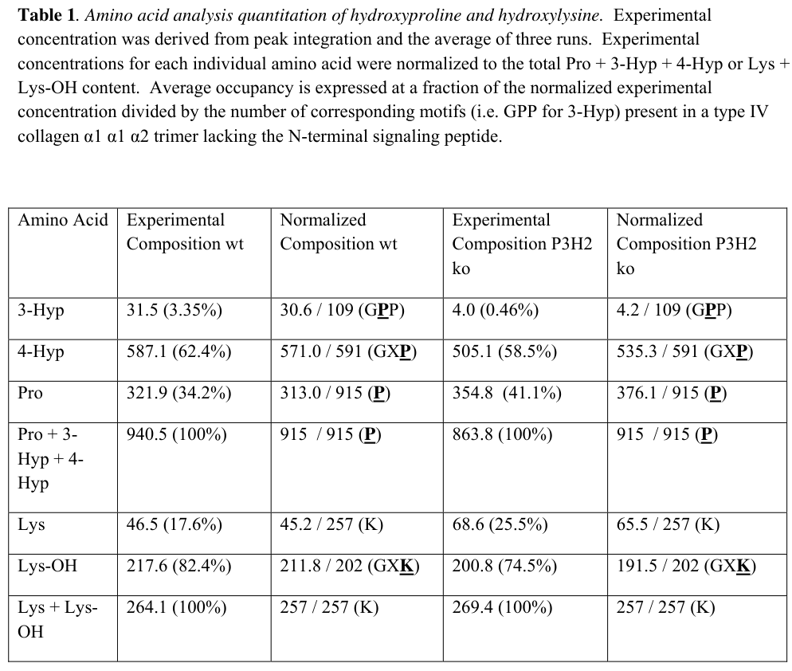

## Question

# Gene Research for Functional Annotation

## ⚠️ CRITICAL: Gene/Protein Identification Context

**BEFORE YOU BEGIN RESEARCH:** You MUST verify you are researching the CORRECT gene/protein. Gene symbols can be ambiguous, especially for less well-characterized genes from non-model organisms.

### Target Gene/Protein Identity (from UniProt):
- **UniProt Accession:** Q8IVL5
- **Protein Description:** RecName: Full=Prolyl 3-hydroxylase 2 {ECO:0000312|HGNC:HGNC:19317}; EC=1.14.11.7 {ECO:0000269|PubMed:18487197}; AltName: Full=Leprecan-like protein 1 {ECO:0000303|PubMed:15063763}; AltName: Full=Myxoid liposarcoma-associated protein 4 {ECO:0000303|PubMed:10449603}; Flags: Precursor;
- **Gene Information:** Name=P3H2 {ECO:0000312|HGNC:HGNC:19317}; Synonyms=LEPREL1 {ECO:0000303|PubMed:15063763}, MLAT4 {ECO:0000303|PubMed:10449603};
- **Organism (full):** Homo sapiens (Human).
- **Protein Family:** Belongs to the leprecan family. .
- **Key Domains:** Leprecan_dom. (IPR056585); Oxoglu/Fe-dep_dioxygenase_dom. (IPR005123); P3H. (IPR039575); Pro_4_hyd_alph. (IPR006620); Pro_4_hyd_alph_FE2OG_OXY. (IPR044862)

### MANDATORY VERIFICATION STEPS:

1. **Check if the gene symbol "P3H2" matches the protein description above**
2. **Verify the organism is correct:** Homo sapiens (Human).
3. **Check if protein family/domains align with what you find in literature**
4. **If you find literature for a DIFFERENT gene with the same or similar symbol, STOP**

### If Gene Symbol is Ambiguous or You Cannot Find Relevant Literature:

**DO NOT PROCEED WITH RESEARCH ON A DIFFERENT GENE.** Instead:
- State clearly: "The gene symbol 'P3H2' is ambiguous or literature is limited for this specific protein"
- Explain what you found (e.g., "Found extensive literature on a different gene with the same symbol in a different organism")
- Describe the protein based ONLY on the UniProt information provided above
- Suggest that the protein function can be inferred from domain/family information

### Research Target:

Please provide a comprehensive research report on the gene **P3H2** (gene ID: P3H2, UniProt: Q8IVL5) in human.

The research report should be a detailed narrative explaining the function, biological processes, and localization of the gene product. Citations should be given for all claims.

You should prioritize authoritative reviews and primary scientific literature when conducting research. You can supplement
this with annotations you find in gene/protein databases, but these can be outdated or inaccurate.

We are specifically interested in the primary function of the gene - for enzymes, what reaction is catalyzed, and what is the substrate specificity? For transporters, what is the substrate? For structural proteins or adapters, what is the broader structural role? For signaling molecules, what is the role in the pathway.

We are interested in where in or outside the cell the gene product carries out its function.

We are also interested in the signaling or biochemical pathways in which the gene functions. We are less interested in broad pleiotropic effects, except where these elucidate the precise role.

Include evidence where possible. We are interested in both experimental evidence as well as inference from structure, evolution, or bioinformatic analysis. Precise studies should be prioritized over high-throughput, where available.

## Output

Question: You are an expert researcher providing comprehensive, well-cited information.

Provide detailed information focusing on:
1. Key concepts and definitions with current understanding
2. Recent developments and latest research (prioritize 2023-2024 sources)
3. Current applications and real-world implementations
4. Expert opinions and analysis from authoritative sources
5. Relevant statistics and data from recent studies

Format as a comprehensive research report with proper citations. Include URLs and publication dates where available.
Always prioritize recent, authoritative sources and provide specific citations for all major claims.

# Gene Research for Functional Annotation

## ⚠️ CRITICAL: Gene/Protein Identification Context

**BEFORE YOU BEGIN RESEARCH:** You MUST verify you are researching the CORRECT gene/protein. Gene symbols can be ambiguous, especially for less well-characterized genes from non-model organisms.

### Target Gene/Protein Identity (from UniProt):
- **UniProt Accession:** Q8IVL5
- **Protein Description:** RecName: Full=Prolyl 3-hydroxylase 2 {ECO:0000312|HGNC:HGNC:19317}; EC=1.14.11.7 {ECO:0000269|PubMed:18487197}; AltName: Full=Leprecan-like protein 1 {ECO:0000303|PubMed:15063763}; AltName: Full=Myxoid liposarcoma-associated protein 4 {ECO:0000303|PubMed:10449603}; Flags: Precursor;
- **Gene Information:** Name=P3H2 {ECO:0000312|HGNC:HGNC:19317}; Synonyms=LEPREL1 {ECO:0000303|PubMed:15063763}, MLAT4 {ECO:0000303|PubMed:10449603};
- **Organism (full):** Homo sapiens (Human).
- **Protein Family:** Belongs to the leprecan family. .
- **Key Domains:** Leprecan_dom. (IPR056585); Oxoglu/Fe-dep_dioxygenase_dom. (IPR005123); P3H. (IPR039575); Pro_4_hyd_alph. (IPR006620); Pro_4_hyd_alph_FE2OG_OXY. (IPR044862)

### MANDATORY VERIFICATION STEPS:

1. **Check if the gene symbol "P3H2" matches the protein description above**
2. **Verify the organism is correct:** Homo sapiens (Human).
3. **Check if protein family/domains align with what you find in literature**
4. **If you find literature for a DIFFERENT gene with the same or similar symbol, STOP**

### If Gene Symbol is Ambiguous or You Cannot Find Relevant Literature:

**DO NOT PROCEED WITH RESEARCH ON A DIFFERENT GENE.** Instead:
- State clearly: "The gene symbol 'P3H2' is ambiguous or literature is limited for this specific protein"
- Explain what you found (e.g., "Found extensive literature on a different gene with the same symbol in a different organism")
- Describe the protein based ONLY on the UniProt information provided above
- Suggest that the protein function can be inferred from domain/family information

### Research Target:

Please provide a comprehensive research report on the gene **P3H2** (gene ID: P3H2, UniProt: Q8IVL5) in human.

The research report should be a detailed narrative explaining the function, biological processes, and localization of the gene product. Citations should be given for all claims.

You should prioritize authoritative reviews and primary scientific literature when conducting research. You can supplement
this with annotations you find in gene/protein databases, but these can be outdated or inaccurate.

We are specifically interested in the primary function of the gene - for enzymes, what reaction is catalyzed, and what is the substrate specificity? For transporters, what is the substrate? For structural proteins or adapters, what is the broader structural role? For signaling molecules, what is the role in the pathway.

We are interested in where in or outside the cell the gene product carries out its function.

We are also interested in the signaling or biochemical pathways in which the gene functions. We are less interested in broad pleiotropic effects, except where these elucidate the precise role.

Include evidence where possible. We are interested in both experimental evidence as well as inference from structure, evolution, or bioinformatic analysis. Precise studies should be prioritized over high-throughput, where available.

## Comprehensive research report: Human **P3H2 / LEPREL1** (UniProt **Q8IVL5**) functional annotation

### 0) Target verification (gene/protein identity)
The UniProt accession **Q8IVL5** corresponds to human **Prolyl 3-hydroxylase 2** (P3H2), encoded by **LEPREL1** (syn. Leprecan-like protein 1; sometimes referenced as MLAT4). The P3H family includes paralogs **P3H1 (LEPRE1)** and **P3H3 (LEPREL2)** and related non-enzymatic partners (e.g., **CRTAP**, **P3H4/SC65**), so P3H2-specific claims must be distinguished from other P3H genes. (gjaltema2017molecularinsightsinto pages 4-5, marini2007componentsofthe pages 5-5)

### 1) Key concepts, definitions, and current understanding

#### 1.1 What does P3H2 do? (enzyme class and reaction)
P3H2 is a collagen-modifying enzyme that catalyzes formation of **3-hydroxyproline (3Hyp)** on collagen polypeptides (i.e., proline **3-hydroxylation**), a post-translational modification occurring during collagen biosynthesis. (pignata2021prolyl3hydroxylase2 pages 1-2, pasanen2011prolyl3hydroxylasesand pages 1-5)

P3H2 is part of the broader **2-oxoglutarate/Fe(II)-dependent dioxygenase** (2OGDD) enzyme superfamily. This class uses **Fe2+**, **2-oxoglutarate**, **molecular oxygen**, and **ascorbate** to hydroxylate substrates, consistent with other collagen hydroxylases. (pasanen2011prolyl3hydroxylasesand pages 1-5, fonsen2007prolylhydroxylasescloning pages 1-7)

#### 1.2 Substrate specificity: collagen IV as the dominant physiological target
Multiple sources support that P3H2 preferentially targets **basement membrane type IV collagen**, i.e., it is a principal prolyl 3-hydroxylase acting on collagen IV. (aypek2022lossofthe pages 1-2, pasanen2011prolyl3hydroxylasesand pages 1-5, salo2021prolylandlysyl pages 7-9)

Quantitatively, one review/experimental synthesis reports that while P3H1 modifies type I collagen at low frequency (~**1 3Hyp per 1000 aa**), P3H2’s principal substrate is collagen IV, with much higher modification levels (~**10–15 prolines per 1000 aa**). (pignata2021prolyl3hydroxylase2 pages 1-2)

#### 1.3 Domain architecture and family features (what makes it a leprecan-family enzyme)
P3H2 is placed in the **leprecan/prolyl-3-hydroxylase family**, characterized by an **N-terminal domain** with protein–protein interaction features (including **TPR motifs**) and conserved cysteine motifs (e.g., **CXXXC** motifs), and a **C-terminal 2OG/Fe(II) dioxygenase catalytic domain**. (gjaltema2017molecularinsightsinto pages 4-5, onursal2023differentialeffectsof pages 41-46, marini2007componentsofthe pages 5-5)

A key complication is that some family members (e.g., CRTAP, P3H4) can lack the catalytic dioxygenase domain and instead function as complex partners, so catalytic activity should be specifically attributed to P3H1/2/3. (onursal2023differentialeffectsof pages 41-46, marini2007componentsofthe pages 5-5)

#### 1.4 Where does P3H2 function in the cell? (subcellular localization)
P3H2 is a secretory-pathway enzyme reported to localize to the **endoplasmic reticulum (ER)** (and in some contexts **ER/Golgi network**), consistent with its role modifying collagens before secretion/assembly into basement membranes. (pignata2021prolyl3hydroxylase2 pages 1-2, aypek2022lossofthe pages 1-2)

In kidney/podocyte systems, imaging evidence supports ER-like localization of re-expressed P3H2 in podocyte cell lines, and in vivo podocyte-associated signal in wild-type kidney tissue. (aypek2022lossofthe media 6cf8aab0, aypek2022lossofthe media 45d6b292)

### 2) Primary biological roles and pathway context

#### 2.1 Basement membrane collagen IV maturation and interactome
Basement membrane integrity depends heavily on collagen IV networks. P3H2-mediated proline 3-hydroxylation contributes to collagen IV post-translational patterning and can modulate collagen IV interactions with partners.

A primary study focusing on collagen IV shows that altered 3Hyp content (via P3H2 loss) changes collagen IV interactions with **glycoprotein VI (GP6)** and **nidogens 1/2**—reduced 3Hyp increased GP6 binding, whereas 3Hyp was required for nidogen binding. (montgomery2018posttranslationalmodificationof pages 1-2)

#### 2.2 Angiogenesis link via ECM remodeling downstream of VEGF signaling
P3H2 has been proposed as a mechanistic link between VEGF signaling and basement membrane remodeling in angiogenesis. In endothelial cells, P3H2 is induced by **VEGF-A/VEGFR2** signaling via **p38 MAPK**, and functional gain/loss experiments suggest that P3H2 activity on collagen IV supports angiogenic properties in vitro. (pignata2021prolyl3hydroxylase2 pages 1-2)

### 3) Disease relevance (human genetics and mechanistic models)

#### 3.1 Kidney disease: thin basement membrane nephropathy (TBMN) and FSGS
A 2022 JCI study identified P3H2 as an important **glomerular basement membrane (GBM) modifier**: P3H2 hydroxylates prolines in collagen IV subchains in the ER, and podocyte-specific loss in mice produced a **thin basement membrane nephropathy** phenotype with thinner GBM, plus progressive **microhematuria** and **microalbuminuria** over time. (aypek2022lossofthe pages 1-2)

The same work links P3H2 loss/mutation to disease spanning **TBMN** and **focal segmental glomerulosclerosis (FSGS)** in mice and humans, including a reported nonsense variant (**c.1213C>T**) leading to a premature stop codon in a human pedigree. (aypek2022lossofthe pages 1-2)

**Quantitative/visual evidence:** The paper’s TEM images and quantification show reduced GBM thickness in podocyte-specific knockout mice at multiple ages, and proteomics indicates decreased abundance of collagen IV subchains in GBM preparations. (aypek2022lossofthe media f8c46f40, aypek2022lossofthe media 01d7b518)

#### 3.2 Ocular phenotypes: high myopia and cataract/vitreoretinal degeneration
Genetic association evidence supports that **LEPREL1 (P3H2)** variants can cause or be associated with severe ocular disease. A clinical genetics review in JCI emphasizes that recessive LEPREL1 mutations can cause severe non-syndromic high myopia (with additional lens/vitreoretinal features referenced in the collagen IV 3Hyp literature). (montgomery2018posttranslationalmodificationof pages 13-14, pignata2021prolyl3hydroxylase2 pages 14-15)

Separately, a major clinical genetics paper on myopia/deafness notes that high myopia is a significant clinical problem and cites that a **missense variant in LEPREL1 (P3H2)**—a collagen-hydroxylating 2OG dioxygenase—was associated with an autosomal recessive form of high myopia with early-onset cataracts. This provides additional support that LEPREL1/P3H2 is implicated in ocular structural disease consistent with collagen/basement membrane biology. (tekin2013slitrk6mutationscause pages 1-2)

### 4) Current applications and real-world implementations

#### 4.1 Diagnostics/clinical genetics (implemented use)
The most direct real-world implementation is in **molecular diagnosis and interpretation** of inherited or familial basement membrane diseases. The evidence supporting P3H2 as a GBM modifier and a cause of TBMN/FSGS indicates LEPREL1 should be considered in genetic workups of hematuria/albuminuria phenotypes when collagen IV-related disease is suspected but COL4A genes are not explanatory. (aypek2022lossofthe pages 1-2)

#### 4.2 Therapeutic concepts (preclinical)
A preclinical therapeutic concept is **anti-angiogenic targeting**. In an in vivo laser-induced choroidal neovascularization (CNV) model, **P3H2 knockdown reduced pathological angiogenesis**, suggesting P3H2 could be explored as a candidate anti-angiogenesis target—potentially via modulation of collagen IV organization in the vascular basement membrane. (pignata2021prolyl3hydroxylase2 pages 14-15)

### 5) Expert opinions and synthesis (authoritative review perspectives)
A highly cited collagen hydroxylase review synthesizes that P3H2/LEPREL1 is one of the three vertebrate collagen prolyl-3-hydroxylases and contains the canonical **C-terminal 2OG dioxygenase domain**, with tissue distribution enriched in basement membrane–rich tissues—supporting a primary role in basement membrane collagen modification rather than fibrillar collagen remodeling. (gjaltema2017molecularinsightsinto pages 4-5)

A 2021 expert review of collagen prolyl/lysyl hydroxylases cites biochemical and genetic evidence that P3H2 is active on collagen IV and that P3H2 loss produces abnormal collagens, supporting a mechanistic link to high myopia and basement membrane biology. (salo2021prolylandlysyl pages 21-24)

### 6) Relevant statistics and data points
- **Collagen IV modification frequency:** P3H2 modifies collagen IV at high frequency (~**10–15 prolines per 1000 aa**), contrasted with P3H1’s low-frequency modification of collagen I (~**1 per 1000 aa**). (pignata2021prolyl3hydroxylase2 pages 1-2)
- **Myopia epidemiology (contextual burden):** Myopia affects **>25%** of adults in Western Europe/America and can exceed **70%** in some urban East Asian populations; **high myopia** affects ~**1–3%** of the population. (tekin2013slitrk6mutationscause pages 1-2)
- **Kidney pathology readouts:** TEM and GBM thickness quantification demonstrate a thinner GBM in podocyte-specific P3h2 knockout mice, and GBM proteomics indicates reduced collagen IV subchains abundance. (aypek2022lossofthe media f8c46f40, aypek2022lossofthe media 01d7b518)

### 7) 2023–2024 research update (evidence-limited in retrieved corpus)
Although the request prioritizes 2023–2024, tool-based retrieval in this run did not surface accessible 2023–2024 primary mechanistic studies specifically focused on **human P3H2/LEPREL1** beyond indirect mentions. The most recent high-confidence, P3H2-focused primary evidence available here is **Aypek et al., 2022 (JCI)** on kidney basement membrane disease and **Pignata et al., 2021 (IJMS)** on angiogenesis, supported by 2021–2018 reviews/primary studies on collagen IV modification. (aypek2022lossofthe pages 1-2, pignata2021prolyl3hydroxylase2 pages 1-2, montgomery2018posttranslationalmodificationof pages 1-2)

### Summary table (quick reference)
| Category | Summary | Key evidence (cite first-author year) | URL | Publication date |
|---|---|---|---|---|
| Identity/Names | Human **P3H2** corresponds to **LEPREL1** (also called Leprecan-like protein 1), one of three vertebrate prolyl 3-hydroxylase isoenzymes; it belongs to the leprecan family and contains a C-terminal 2-oxoglutarate-dependent dioxygenase catalytic domain. Literature distinguishes it from paralogs **P3H1/LEPRE1** and **P3H3/LEPREL2**, which is important because substrate specificities differ. (gjaltema2017molecularinsightsinto pages 4-5, marini2007componentsofthe pages 5-5) | Marini 2007; Gjaltema 2017 | https://doi.org/10.4161/cc.6.14.4474 ; https://doi.org/10.1080/10409238.2016.1269716 | 2007-07 ; 2017-01 |
| Enzymatic reaction | P3H2 is a **prolyl 3-hydroxylase** that catalyzes formation of **3-hydroxyproline (3Hyp)** on collagen chains, hydroxylating proline residues in collagenous Gly-X-Y motifs; reviews and primary studies identify collagen IV as its main physiological substrate. (pignata2021prolyl3hydroxylase2 pages 1-2, aypek2022lossofthe pages 1-2, pasanen2011prolyl3hydroxylasesand pages 1-5, salo2021prolylandlysyl pages 21-24, montgomery2018posttranslationalmodificationof pages 13-14) | Pasanen 2011; Aypek 2022; Salo & Myllyharju 2021; Montgomery 2018 | https://doi.org/10.1172/jci147253 ; https://doi.org/10.1111/exd.14197 ; https://doi.org/10.1074/jbc.ra117.000406 | 2011 ; 2022-05 ; 2021-10 ; 2018-04 |
| Cofactors | As a member of the **2-oxoglutarate/Fe(II)-dependent dioxygenase** family, P3H2 requires **Fe2+**, **2-oxoglutarate**, **O2**, and **ascorbate** for catalysis, consistent with the catalytic chemistry of collagen hydroxylases. (pasanen2011prolyl3hydroxylasesand pages 1-5, onursal2023differentialeffectsof pages 41-46, fonsen2007prolylhydroxylasescloning pages 1-7) | Pasanen 2011; Onursal 2023; Fonsén 2007 | https://doi.org/10.1101/2023.06.28.546985 | 2011 ; 2023-06 ; 2007 |
| Substrate specificity | Evidence supports **collagen IV** as the principal substrate of P3H2. Recombinant/enrichment studies place P3H2 in basement-membrane-rich tissues and show greater activity on peptide substrates representing **type IV collagen** hydroxylation sites than on type I collagen sites; type IV collagen is likely the major substrate, though P3H2 may also modify other collagens to a lesser extent. (pignata2021prolyl3hydroxylase2 pages 1-2, montgomery2018posttranslationalmodificationof pages 1-2, pasanen2011prolyl3hydroxylasesand pages 1-5, montgomery2018posttranslationalmodificationof pages 13-14, salo2021prolylandlysyl pages 7-9) | Pasanen 2011; Montgomery 2018; Salo & Myllyharju 2021; Pignata 2021 | https://doi.org/10.1074/jbc.ra117.000406 ; https://doi.org/10.1111/exd.14197 ; https://doi.org/10.3390/ijms22083896 | 2011 ; 2018-04 ; 2021-10 ; 2021-04 |
| Subcellular localization | P3H2 is reported as **endoplasmic reticulum (ER)-localized**, with some evidence also noting ER/Golgi network localization; family-level evidence indicates ER-association/ER-retention features for prolyl 3-hydroxylases. In podocytes and endothelial cells, localization is consistent with a secretory-pathway collagen-modifying enzyme. (pignata2021prolyl3hydroxylase2 pages 1-2, aypek2022lossofthe pages 1-2, marini2007componentsofthe pages 5-5, aypek2022lossofthe media 6cf8aab0) | Marini 2007; Pignata 2021; Aypek 2022 | https://doi.org/10.4161/cc.6.14.4474 ; https://doi.org/10.3390/ijms22083896 ; https://doi.org/10.1172/jci147253 | 2007-07 ; 2021-04 ; 2022-05 |
| Biological role/pathways | P3H2 functions in the **collagen biosynthesis/post-translational modification pathway** for basement membranes, especially the **glomerular basement membrane (GBM)** and vascular basement membrane. By generating 3Hyp on collagen IV, it influences collagen IV organization and interactions with binding partners such as **nidogens 1/2** and **glycoprotein VI**; it is also induced by **VEGF-A/VEGFR2/p38 MAPK** signaling in endothelial cells, linking collagen IV modification to angiogenesis. (montgomery2018posttranslationalmodificationof pages 1-2, aypek2022lossofthe pages 1-2, pignata2021prolyl3hydroxylase2 pages 1-2, pignata2021prolyl3hydroxylase2 pages 14-15) | Montgomery 2018; Pignata 2021; Aypek 2022 | https://doi.org/10.1074/jbc.ra117.000406 ; https://doi.org/10.3390/ijms22083896 ; https://doi.org/10.1172/jci147253 | 2018-04 ; 2021-04 ; 2022-05 |
| Key phenotypes/disease links | Loss or mutation of P3H2/LEPREL1 is linked to **ocular disease** (autosomal-recessive high myopia with early cataract/vitreoretinal degeneration) and to **renal disease** including **thin basement membrane nephropathy (TBMN)** and **focal segmental glomerulosclerosis (FSGS)**. In the kidney, podocyte-specific loss causes thinner GBM with progressive **microhematuria** and **microalbuminuria**; in human pedigrees, truncating variants have been reported. (aypek2022lossofthe pages 1-2, tekin2013slitrk6mutationscause pages 1-2, montgomery2018posttranslationalmodificationof pages 13-14, pignata2021prolyl3hydroxylase2 pages 14-15, salo2021prolylandlysyl pages 7-9) | Tekin 2013; Aypek 2022; Montgomery 2018; Pignata 2021; Salo & Myllyharju 2021 | https://doi.org/10.1172/JCI65853 ; https://doi.org/10.1172/jci147253 ; https://doi.org/10.1074/jbc.ra117.000406 ; https://doi.org/10.3390/ijms22083896 ; https://doi.org/10.1111/exd.14197 | 2013-05 ; 2022-05 ; 2018-04 ; 2021-04 ; 2021-10 |
| Therapeutic/real-world applications | P3H2 currently has **no established approved therapy** directly targeting it, but experimental work suggests translational potential in **anti-angiogenic therapy**: P3H2 knockdown reduced pathological angiogenesis in a laser-induced choroidal neovascularization model. In nephrology, P3H2 is emerging as a **disease gene and GBM modifier** relevant to diagnosis/mechanistic interpretation of TBMN/FSGS. (aypek2022lossofthe pages 1-2, pignata2021prolyl3hydroxylase2 pages 14-15) | Pignata 2021; Aypek 2022 | https://doi.org/10.3390/ijms22083896 ; https://doi.org/10.1172/jci147253 | 2021-04 ; 2022-05 |
| Key quantitative data | Reported quantitative details include: **P3H2 modifies ~10–15 proline residues per 1000 amino acids in collagen IV**, whereas **P3H1 modifies ~1 per 1000 aa in collagen I**; type IV collagen α1 chain contains about **15 3Hyp residues**; VEGF-A-stimulated HUVEC RNA-seq identified **459 differentially expressed genes** including P3H2; myopia affects **>25%** of adults in Western Europe/America and **>70%** in some urban East Asian populations, while **high myopia** affects about **1–3%** of the population. A human renal pedigree described a **c.1213C>T** nonsense variant causing premature truncation. (pignata2021prolyl3hydroxylase2 pages 1-2, salo2021prolylandlysyl pages 7-9, tekin2013slitrk6mutationscause pages 1-2, aypek2022lossofthe pages 1-2) | Pignata 2021; Salo & Myllyharju 2021; Tekin 2013; Aypek 2022 | https://doi.org/10.3390/ijms22083896 ; https://doi.org/10.1111/exd.14197 ; https://doi.org/10.1172/JCI65853 ; https://doi.org/10.1172/jci147253 | 2021-04 ; 2021-10 ; 2013-05 ; 2022-05 |

*Table: This table summarizes the core functional annotation of human P3H2/LEPREL1 (UniProt Q8IVL5), including enzymatic activity, localization, substrates, disease links, and quantitative findings. It condenses the most relevant supported evidence for rapid reference in the final report.*

### Key references (publication date and URL)
- Marini et al. *Cell Cycle* (2007-07): https://doi.org/10.4161/cc.6.14.4474 (marini2007componentsofthe pages 5-5)
- Pasanen (2011): prolyl 3-hydroxylases overview and collagen IV hydroxylation by P3H2 (pasanen2011prolyl3hydroxylasesand pages 1-5)
- Gjaltema & Bank *Crit Rev Biochem Mol Biol* (2017-01): https://doi.org/10.1080/10409238.2016.1269716 (gjaltema2017molecularinsightsinto pages 4-5)
- Montgomery et al. *J Biol Chem* (2018-04): https://doi.org/10.1074/jbc.ra117.000406 (montgomery2018posttranslationalmodificationof pages 1-2)
- Pignata et al. *Int J Mol Sci* (2021-04): https://doi.org/10.3390/ijms22083896 (pignata2021prolyl3hydroxylase2 pages 1-2, pignata2021prolyl3hydroxylase2 pages 14-15)
- Salo & Myllyharju *Exp Dermatol* (2021-10): https://doi.org/10.1111/exd.14197 (salo2021prolylandlysyl pages 21-24, salo2021prolylandlysyl pages 7-9)
- Aypek et al. *J Clin Invest* (2022-05): https://doi.org/10.1172/jci147253 (aypek2022lossofthe pages 1-2, aypek2022lossofthe media f8c46f40, aypek2022lossofthe media 01d7b518, aypek2022lossofthe media 45d6b292)
- Tekin et al. *J Clin Invest* (2013-05): https://doi.org/10.1172/JCI65853 (LEPREL1/P3H2 cited in myopia genetics background; includes population burden statistics) (tekin2013slitrk6mutationscause pages 1-2)

References

1. (gjaltema2017molecularinsightsinto pages 4-5): Rutger A. F. Gjaltema and Ruud A. Bank. Molecular insights into prolyl and lysyl hydroxylation of fibrillar collagens in health and disease. Critical Reviews in Biochemistry and Molecular Biology, 52:74-95, Jan 2017. URL: https://doi.org/10.1080/10409238.2016.1269716, doi:10.1080/10409238.2016.1269716. This article has 208 citations and is from a peer-reviewed journal.

2. (marini2007componentsofthe pages 5-5): Joan C. Marini, Wayne A. Cabral, Aileen M. Barnes, and Weizhong Chang. Components of the collagen prolyl 3-hydroxylation complex are crucial for normal bone development. Cell Cycle, 6:1675-1681, Jul 2007. URL: https://doi.org/10.4161/cc.6.14.4474, doi:10.4161/cc.6.14.4474. This article has 168 citations and is from a peer-reviewed journal.

3. (pignata2021prolyl3hydroxylase2 pages 1-2): Paola Pignata, Ivana Apicella, Valeria Cicatiello, Caterina Puglisi, Sara Magliacane Trotta, Remo Sanges, Valeria Tarallo, and Sandro De Falco. Prolyl 3-hydroxylase 2 is a molecular player of angiogenesis. International Journal of Molecular Sciences, 22:3896, Apr 2021. URL: https://doi.org/10.3390/ijms22083896, doi:10.3390/ijms22083896. This article has 13 citations.

4. (pasanen2011prolyl3hydroxylasesand pages 1-5): A Pasanen. Prolyl 3-hydroxylases and hypoxia-inducible factor 3: their roles in collagen synthesis and hypoxia response, respectively. Unknown journal, 2011.

5. (fonsen2007prolylhydroxylasescloning pages 1-7): P Fonsén. Prolyl hydroxylases: cloning and characterization of novel human and plant prolyl 4-hydroxylases, and three human prolyl 3-hydroxylases. Unknown journal, 2007.

6. (aypek2022lossofthe pages 1-2): Hande Aypek, Christoph Krisp, Shun Lu, Shuya Liu, Dominik Kylies, Oliver Kretz, Guochao Wu, Manuela Moritz, Kerstin Amann, Kerstin Benz, Ping Tong, Zheng-mao Hu, Sulaiman M. Alsulaiman, Arif O. Khan, Maik Grohmann, Timo Wagner, Janina Müller-Deile, Hartmut Schlüter, Victor G. Puelles, Carsten Bergmann, Tobias B. Huber, and Florian Grahammer. Loss of the collagen iv modifier prolyl 3-hydroxylase 2 causes thin basement membrane nephropathy. The Journal of Clinical Investigation, May 2022. URL: https://doi.org/10.1172/jci147253, doi:10.1172/jci147253. This article has 42 citations.

7. (salo2021prolylandlysyl pages 7-9): Antti M. Salo and Johanna Myllyharju. Prolyl and lysyl hydroxylases in collagen synthesis. Experimental Dermatology, 30:38-49, Oct 2021. URL: https://doi.org/10.1111/exd.14197, doi:10.1111/exd.14197. This article has 146 citations and is from a domain leading peer-reviewed journal.

8. (onursal2023differentialeffectsof pages 41-46): C Onursal. Differential effects of prolyl-3-hydroxylases 1 and 4 on collagen biosynthesis highlight prolyl-3-hydroxylase 4 as a potential novel drug target in pulmonary …. Unknown journal, 2023.

9. (aypek2022lossofthe media 6cf8aab0): Hande Aypek, Christoph Krisp, Shun Lu, Shuya Liu, Dominik Kylies, Oliver Kretz, Guochao Wu, Manuela Moritz, Kerstin Amann, Kerstin Benz, Ping Tong, Zheng-mao Hu, Sulaiman M. Alsulaiman, Arif O. Khan, Maik Grohmann, Timo Wagner, Janina Müller-Deile, Hartmut Schlüter, Victor G. Puelles, Carsten Bergmann, Tobias B. Huber, and Florian Grahammer. Loss of the collagen iv modifier prolyl 3-hydroxylase 2 causes thin basement membrane nephropathy. The Journal of Clinical Investigation, May 2022. URL: https://doi.org/10.1172/jci147253, doi:10.1172/jci147253. This article has 42 citations.

10. (aypek2022lossofthe media 45d6b292): Hande Aypek, Christoph Krisp, Shun Lu, Shuya Liu, Dominik Kylies, Oliver Kretz, Guochao Wu, Manuela Moritz, Kerstin Amann, Kerstin Benz, Ping Tong, Zheng-mao Hu, Sulaiman M. Alsulaiman, Arif O. Khan, Maik Grohmann, Timo Wagner, Janina Müller-Deile, Hartmut Schlüter, Victor G. Puelles, Carsten Bergmann, Tobias B. Huber, and Florian Grahammer. Loss of the collagen iv modifier prolyl 3-hydroxylase 2 causes thin basement membrane nephropathy. The Journal of Clinical Investigation, May 2022. URL: https://doi.org/10.1172/jci147253, doi:10.1172/jci147253. This article has 42 citations.

11. (montgomery2018posttranslationalmodificationof pages 1-2): Nathan T. Montgomery, Keith D. Zientek, Elena N. Pokidysheva, and Hans Peter Bächinger. Post-translational modification of type iv collagen with 3-hydroxyproline affects its interactions with glycoprotein vi and nidogens 1 and 2. Journal of Biological Chemistry, 293:5987-5999, Apr 2018. URL: https://doi.org/10.1074/jbc.ra117.000406, doi:10.1074/jbc.ra117.000406. This article has 35 citations and is from a domain leading peer-reviewed journal.

12. (aypek2022lossofthe media f8c46f40): Hande Aypek, Christoph Krisp, Shun Lu, Shuya Liu, Dominik Kylies, Oliver Kretz, Guochao Wu, Manuela Moritz, Kerstin Amann, Kerstin Benz, Ping Tong, Zheng-mao Hu, Sulaiman M. Alsulaiman, Arif O. Khan, Maik Grohmann, Timo Wagner, Janina Müller-Deile, Hartmut Schlüter, Victor G. Puelles, Carsten Bergmann, Tobias B. Huber, and Florian Grahammer. Loss of the collagen iv modifier prolyl 3-hydroxylase 2 causes thin basement membrane nephropathy. The Journal of Clinical Investigation, May 2022. URL: https://doi.org/10.1172/jci147253, doi:10.1172/jci147253. This article has 42 citations.

13. (aypek2022lossofthe media 01d7b518): Hande Aypek, Christoph Krisp, Shun Lu, Shuya Liu, Dominik Kylies, Oliver Kretz, Guochao Wu, Manuela Moritz, Kerstin Amann, Kerstin Benz, Ping Tong, Zheng-mao Hu, Sulaiman M. Alsulaiman, Arif O. Khan, Maik Grohmann, Timo Wagner, Janina Müller-Deile, Hartmut Schlüter, Victor G. Puelles, Carsten Bergmann, Tobias B. Huber, and Florian Grahammer. Loss of the collagen iv modifier prolyl 3-hydroxylase 2 causes thin basement membrane nephropathy. The Journal of Clinical Investigation, May 2022. URL: https://doi.org/10.1172/jci147253, doi:10.1172/jci147253. This article has 42 citations.

14. (montgomery2018posttranslationalmodificationof pages 13-14): Nathan T. Montgomery, Keith D. Zientek, Elena N. Pokidysheva, and Hans Peter Bächinger. Post-translational modification of type iv collagen with 3-hydroxyproline affects its interactions with glycoprotein vi and nidogens 1 and 2. Journal of Biological Chemistry, 293:5987-5999, Apr 2018. URL: https://doi.org/10.1074/jbc.ra117.000406, doi:10.1074/jbc.ra117.000406. This article has 35 citations and is from a domain leading peer-reviewed journal.

15. (pignata2021prolyl3hydroxylase2 pages 14-15): Paola Pignata, Ivana Apicella, Valeria Cicatiello, Caterina Puglisi, Sara Magliacane Trotta, Remo Sanges, Valeria Tarallo, and Sandro De Falco. Prolyl 3-hydroxylase 2 is a molecular player of angiogenesis. International Journal of Molecular Sciences, 22:3896, Apr 2021. URL: https://doi.org/10.3390/ijms22083896, doi:10.3390/ijms22083896. This article has 13 citations.

16. (tekin2013slitrk6mutationscause pages 1-2): Mustafa Tekin, Barry A. Chioza, Yoshifumi Matsumoto, Oscar Diaz-Horta, Harold E. Cross, Duygu Duman, Haris Kokotas, Heather L. Moore-Barton, Kazuto Sakoori, Maya Ota, Yuri S. Odaka, Joseph Foster, F. Basak Cengiz, Suna Tokgoz-Yilmaz, Oya Tekeli, Maria Grigoriadou, Michael B. Petersen, Ajith Sreekantan-Nair, Kay Gurtz, Xia-Juan Xia, Arti Pandya, Michael A. Patton, Juan I. Young, Jun Aruga, and Andrew H. Crosby. Slitrk6 mutations cause myopia and deafness in humans and mice. The Journal of clinical investigation, 123 5:2094-102, May 2013. URL: https://doi.org/10.1172/jci65853, doi:10.1172/jci65853. This article has 79 citations.

17. (salo2021prolylandlysyl pages 21-24): Antti M. Salo and Johanna Myllyharju. Prolyl and lysyl hydroxylases in collagen synthesis. Experimental Dermatology, 30:38-49, Oct 2021. URL: https://doi.org/10.1111/exd.14197, doi:10.1111/exd.14197. This article has 146 citations and is from a domain leading peer-reviewed journal.

## Artifacts

- [Edison artifact artifact-00](P3H2-deep-research-falcon_artifacts/artifact-00.md)

## Citations

1. montgomery2018posttranslationalmodificationof pages 1-2
2. aypek2022lossofthe pages 1-2
3. gjaltema2017molecularinsightsinto pages 4-5
4. salo2021prolylandlysyl pages 21-24
5. marini2007componentsofthe pages 5-5
6. fonsen2007prolylhydroxylasescloning pages 1-7
7. salo2021prolylandlysyl pages 7-9
8. onursal2023differentialeffectsof pages 41-46
9. montgomery2018posttranslationalmodificationof pages 13-14
10. https://doi.org/10.4161/cc.6.14.4474
11. https://doi.org/10.1080/10409238.2016.1269716
12. https://doi.org/10.1172/jci147253
13. https://doi.org/10.1111/exd.14197
14. https://doi.org/10.1074/jbc.ra117.000406
15. https://doi.org/10.1101/2023.06.28.546985
16. https://doi.org/10.3390/ijms22083896
17. https://doi.org/10.1172/JCI65853
18. https://doi.org/10.1080/10409238.2016.1269716,
19. https://doi.org/10.4161/cc.6.14.4474,
20. https://doi.org/10.3390/ijms22083896,
21. https://doi.org/10.1172/jci147253,
22. https://doi.org/10.1111/exd.14197,
23. https://doi.org/10.1074/jbc.ra117.000406,
24. https://doi.org/10.1172/jci65853,